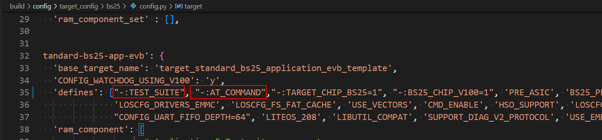
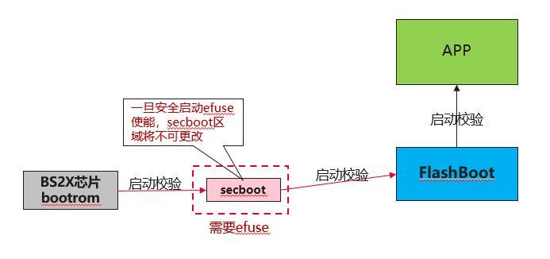
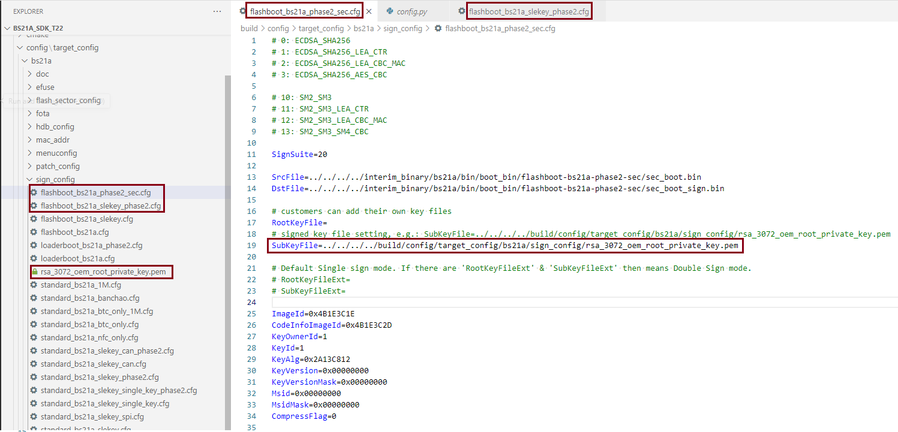

# 前言

**概述**

BS2XV100交付包为芯片解决方案交付包，主要包括芯片资料、硬件资料、SDK软件包、软件参考设计以及软件资料等。用户可基于此芯片解决方案交付包，开发各种自定义的产品。

本文档从网络安全的角度，重点分析基于本交付包开发的产品在使用过程中，可能面临的与本交付包中SDK软件包相关的网络安全的威胁，同时，针对性地给出相应的解决方案。

本文档以BS21A为例进行说明示例，后续不再单独说明，请用户知悉。

**产品版本**

与本文档相对应的产品版本如下。

<table><thead align="left"><tr id="row63051425"><th class="cellrowborder" valign="top" width="40.400000000000006%" id="mcps1.1.3.1.1">
<strong id="b3756104316114">产品名称</strong>

</th>
<th class="cellrowborder" valign="top" width="59.599999999999994%" id="mcps1.1.3.1.2">
<strong id="b1676784314119">产品版本</strong>

</th>
</tr>
</thead>
<tbody><tr id="row52579486"><td class="cellrowborder" valign="top" width="40.400000000000006%" headers="mcps1.1.3.1.1 ">
BS2X

</td>
<td class="cellrowborder" valign="top" width="59.599999999999994%" headers="mcps1.1.3.1.2 ">
V100

</td>
</tr>
</tbody>
</table>

**读者对象**

本文档主要适用于以下工程师：

-   技术支持工程师
-   软件开发工程师

**符号约定**

在本文中可能出现下列标志，它们所代表的含义如下。

<table><thead align="left"><tr id="row1530720816410"><th class="cellrowborder" valign="top" width="20.580000000000002%" id="mcps1.1.3.1.1">
<strong id="b2136615816410">符号</strong>

</th>
<th class="cellrowborder" valign="top" width="79.42%" id="mcps1.1.3.1.2">
<strong id="b5941558116410">说明</strong>

</th>
</tr>
</thead>
<tbody><tr id="row1372280416410"><td class="cellrowborder" valign="top" width="20.580000000000002%" headers="mcps1.1.3.1.1 ">

</td>
<td class="cellrowborder" valign="top" width="79.42%" headers="mcps1.1.3.1.2 ">
表示如不避免则将会导致死亡或严重伤害的具有高等级风险的危害。

</td>
</tr>
<tr id="row466863216410"><td class="cellrowborder" valign="top" width="20.580000000000002%" headers="mcps1.1.3.1.1 ">

</td>
<td class="cellrowborder" valign="top" width="79.42%" headers="mcps1.1.3.1.2 ">
表示如不避免则可能导致死亡或严重伤害的具有中等级风险的危害。

</td>
</tr>
<tr id="row123863216410"><td class="cellrowborder" valign="top" width="20.580000000000002%" headers="mcps1.1.3.1.1 ">

</td>
<td class="cellrowborder" valign="top" width="79.42%" headers="mcps1.1.3.1.2 ">
表示如不避免则可能导致轻微或中度伤害的具有低等级风险的危害。

</td>
</tr>
<tr id="row5786682116410"><td class="cellrowborder" valign="top" width="20.580000000000002%" headers="mcps1.1.3.1.1 ">

</td>
<td class="cellrowborder" valign="top" width="79.42%" headers="mcps1.1.3.1.2 ">
用于传递设备或环境安全警示信息。如不避免则可能会导致设备损坏、数据丢失、设备性能降低或其它不可预知的结果。

“须知”不涉及人身伤害。

</td>
</tr>
<tr id="row2856923116410"><td class="cellrowborder" valign="top" width="20.580000000000002%" headers="mcps1.1.3.1.1 ">

</td>
<td class="cellrowborder" valign="top" width="79.42%" headers="mcps1.1.3.1.2 ">
对正文中重点信息的补充说明。

“说明”不是安全警示信息，不涉及人身、设备及环境伤害信息。

</td>
</tr>
</tbody>
</table>

**修改记录**

<table><thead align="left"><tr id="row2942532716410"><th class="cellrowborder" valign="top" width="18.39%" id="mcps1.1.4.1.1">
<strong id="b5687322716410">文档版本</strong>

</th>
<th class="cellrowborder" valign="top" width="20.849999999999998%" id="mcps1.1.4.1.2">
<strong id="b5800814916410">发布日期</strong>

</th>
<th class="cellrowborder" valign="top" width="60.760000000000005%" id="mcps1.1.4.1.3">
<strong id="b3316380216410">修改说明</strong>

</th>
</tr>
</thead>
<tbody><tr id="row161011912164316"><td class="cellrowborder" valign="top" width="18.39%" headers="mcps1.1.4.1.1 ">
02

</td>
<td class="cellrowborder" valign="top" width="20.849999999999998%" headers="mcps1.1.4.1.2 ">
2025-01-14

</td>
<td class="cellrowborder" valign="top" width="60.760000000000005%" headers="mcps1.1.4.1.3 "><ul id="ul1647540141116"><li>新增“<a href="免责声明.md">免责声明</a>”小节内容。</li><li>更新“<a href="安全升级.md">安全升级</a>”小节内容。</li><li>更新“<a href="可维可测注意事项.md">可维可测注意事项</a>”小节内容。</li></ul>
</td>
</tr>
<tr id="row20774832175918"><td class="cellrowborder" valign="top" width="18.39%" headers="mcps1.1.4.1.1 ">
01

</td>
<td class="cellrowborder" valign="top" width="20.849999999999998%" headers="mcps1.1.4.1.2 ">
2024-08-29

</td>
<td class="cellrowborder" valign="top" width="60.760000000000005%" headers="mcps1.1.4.1.3 "><ul id="ul372682112432"><li>更新“<a href="安全架构.md">安全架构</a>”小节内容。</li><li>更新“<a href="安全启动开关.md">安全启动开关</a>”、“<a href="安全启动流程.md">安全启动流程</a>”小节内容。</li><li>新增“<a href="密钥的配置和替换.md">密钥的配置和替换</a>”小节内容。</li><li>更新“<a href="关键数据安全存储.md">关键数据安全存储</a>”小节内容。</li></ul>
</td>
</tr>
<tr id="row186991428102517"><td class="cellrowborder" valign="top" width="18.39%" headers="mcps1.1.4.1.1 ">
00B02

</td>
<td class="cellrowborder" valign="top" width="20.849999999999998%" headers="mcps1.1.4.1.2 ">
2024-01-08

</td>
<td class="cellrowborder" valign="top" width="60.760000000000005%" headers="mcps1.1.4.1.3 ">
更新“<a href="设备安全.md">设备安全</a>”小节内容。

</td>
</tr>
<tr id="row5947359616410"><td class="cellrowborder" valign="top" width="18.39%" headers="mcps1.1.4.1.1 ">
00B01

</td>
<td class="cellrowborder" valign="top" width="20.849999999999998%" headers="mcps1.1.4.1.2 ">
2023-12-15

</td>
<td class="cellrowborder" valign="top" width="60.760000000000005%" headers="mcps1.1.4.1.3 ">
第一次临时版本发布。

</td>
</tr>
</tbody>
</table>

# 产品安全解决方案

## 免责声明

客户应充分评估自身产品的网络安全要求（包括但不限于：在实际量产产品中，选择安全加解密算法、关闭不安全协议telnet、关闭不需要的调试接口和命令等），并承担最终责任。本产品提供的本注意事项文档帮助客户对自身产品进行网络安全加固。

本产品在本文档中所描述的部分功能使用到了密钥来提供安全机制，客户需要妥善生成、烧写、使用并管理密钥（包括但不限于非对称密钥、对称密钥等），否则将自行承担相关风险。

## 安全架构

产品的网络安全是一个系统工程，涉及到整个产品的各个层面。

BS2X版本可能涉及的威胁如下：

-   开机启动安全

    该部分主要涉及到系统启动过程中每一级镜像的校验机制。BS2X提供安全启动方案，包含完整的启动信任链校验，信任根是BootRom和EFUSE，先通过BootRom校验secboot和根公钥，再由secboot校验启动flashboot，然后由flashboot校验启动APP。安全启动详细流程请参见“[安全启动流程](安全启动流程.md)”。

-   系统升级安全

    SDK提供镜像升级功能，包括升级flashboot和APP，其中flashboot采用了双备份机制，该机制可以防止系统在升级写flashboot中掉电，flashboot被破坏带来的风险问题；系统提供对升级镜像校验功能，在写入flash前，对系统image进行校验，确保写入的镜像的安全。。

-   JTAG安全调试

    JTAG调试功能默认开启，在正式商用发布时，需要将JTAG调试功能进行关闭。对JTAG的关闭是通过EFUSE对应的bit操作的。SDK提供专门安全启动使能补丁包，来对JTAG进行禁用操作。

-   UART烧录口

    不支持关闭

-   命令串口口

    命令串口功能默认打开，方便客户调试使用客户不使用时需要关闭TEST\_SUITE、AT\_COMMAND、SW\_UART\_DEBUG宏。

    

## 设备安全

基于安全性考虑，建议用户在最终产品中执行以下措施：

-   启用安全启动特性。
-   永久关闭JTAG调试功能。
-   永久关闭UART烧录口。

## 安全启动

BS2X支持安全启动。

### 安全启动开关

BS2X芯片的安全启动，需要通过芯片的efuse使能。

在安全使能前，需要将secboot镜像（包括public key等信息）的hash值烧写入到efuse区域中，一旦将secboot镜像的hash值烧写到efuse区域中，将无法更改，因此，必须确保secboot签名后的image不能再变动。

在完成secboot镜像的hash值烧写后，需要通过efuse使能安全启动，一旦使能bit烧写成功，芯片重启后，将执行安全校验。

SDK将提供专用的安全使能补丁包给客户使用，该补丁包中包含安全启动的efuse函数。

### 安全启动流程

BS2X的安全启动校验的执行过程，如[图1](#fig856593710917)所示。

**图 1**  安全启动执行图  

1.  BootRom启动secboot流程：

    BootRom固化在芯片中，其自身不会改变，可以保证安全可信。BootRom启动后，加载二级引导程序secboot。

    BootRom校验及加载secboot的流程：

    1.  BootRom读取secboot image（包括public key等数据信息），对该image进行hash计算，计算出Hash值。
    2.  BootRom根据从efuse中读取事先烧录的secboot的hash值，然后进行对比。
    3.  如果比对成功，则证明secboot没有篡改，则继续引导执行secboot。
    4.  如果比对失败，则证明secboot被破坏，则芯片终止启动。

1.  secboot启动flashboot镜像。

    secboot启动成功后，会对flashboot进行启动校验。

    seboot使用已经校验的public key，对flashboot进行签名校验，如果校验成功，则启动flashboot。

    flashboot采用双本份机制，如果flashboot A区校验失败，则secboot将尝试校验flashboot B区。

    如果这个分区都校验失败，则终止启动。

1.  flashboot校验启动APP镜像。

    flashboot启动成功后，开始对APP image进行签名校验；用户可以使用的单独为APP单独生成public key，也可以和flashboot使用相同的public key；

    如果APP校验失败，则终止启动；

### 密钥的配置和替换

SDK提供了各个系统的签名配置文件，分别用来对secboot、flashboot和APP镜像进行签名。

> **须知：** 
>SDK给出的key文件只作为开发参考使用，客户必须要替换成自己的key文件。

以BS21A为例，如下所示

build\\config\\target\_config\\bs21a\\sign\_config\\flashboot\_bs21a\_n1200\_sec.cfg

build\\config\\target\_config\\bs21a\\sign\_config\\flashboot\_bs21a\_slekey\_n1200.cfg

build\\config\\target\_config\\bs21a\\standard\_bs21a\_slekey\_can\_n1200.cfg

客户可以按图中所示配置秘钥：

签名所用的秘钥文件，存在放在以下目录

build\\config\\target\_config\\bs21a\\sign\_config\\rsa\_3072\_oem\_root\_private\_key.pem

## 安全升级

BS2X支持安全升级，升级详细处理，请参见《BS2XV100 升级方案 使用指南》。

## 关键数据安全存储

用户记录账号、密码等保密信息时，需要保证这些数据的存储安全，所以要求这些数据在存储之前进行加密保护。

## 驱动安全注意事项

### Cipher驱动

Cipher驱动实现了标准的对称加密AES、非对称加密RSA、摘要算法SHA256、密钥派生算法等，未使用任何私有算法。

使用时请注意：Cipher密钥的长度越长，安全等级越高，因此建议使用AES 128bit及以上的密钥、RSA 3072bit及以上的密钥。

## 其他使用安全注意事项

### 代码安全注意事项

代码错误引发的网络安全问题，一般都是源于最基本的代码规范问题，例如：指针越界、数组越界、入参不检查等错误。建议通过如下方法检查：

-   使用业界通用的代码健康扫描工具进行全覆盖扫描。
-   使用模糊测试工具，对所有API接口（包括设备驱动接口）进行全范围模糊测试。
-   使用业界通用的漏洞扫描工具对所使用的开源软件进行扫描。

### 可维可测注意事项

-   可维可测方案仅在调试时打开，Release版本建议用户关闭。
-   HSO调试工具目前仅用于SDK问题定位时的调测日志打印。
-   可维可测接口详细使用方法请参见BS2X维测系列文档中描述。

# 结论

BS2X产品有必要基于安全威胁分析采取相对应的安全措施。以下安全原则供参考：

-   适度的安全

    安全设计是基于特定的安全危险场景分析，考虑到性能、成本、业务影响，决策采用最合适的安全措施。

-   最小授权

    根据职责的需要，给用户、维护人员、网络单元、程序、进程等授予最小的权限和资源。这样能减少潜在的安全风险。

-   主动协同防御

    及时识别恶意攻击源，并在攻击造成显著危害前自动删除恶意用户与网络之间的连接。也可以降低连接的带宽和服务质量，以尽量减少负面影响。

-   纵深防御

    纵深防御原则涉及到对威胁的多重防御。例如，当一个防御层不够时，另一个防御层将防止造成进一步破坏。

