# 前言<a name="ZH-CN_TOPIC_0000001959534789"></a>

**概述<a name="section4537382116410"></a>**

本文档主要用于BS2X平台日志分析指导，包括平台日志分类、重启场景、panic类型等。为开发人员、验证人员、使用人员提供参考，提高使用者问题定位效率。

**读者对象<a name="section4378592816410"></a>**

本文档主要适用以下工程师：

-   技术支持工程师
-   软件开发工程师

**符号约定<a name="section133020216410"></a>**

在本文中可能出现下列标志，它们所代表的含义如下。

<a name="table2622507016410"></a>
<table><thead align="left"><tr id="row1530720816410"><th class="cellrowborder" align="center" valign="top" width="20.580000000000002%" id="mcps1.1.3.1.1"><p id="p6450074116410"><a name="p6450074116410"></a><a name="p6450074116410"></a><strong id="b2136615816410"><a name="b2136615816410"></a><a name="b2136615816410"></a>符号</strong></p>
</th>
<th class="cellrowborder" align="center" valign="top" width="79.42%" id="mcps1.1.3.1.2"><p id="p5435366816410"><a name="p5435366816410"></a><a name="p5435366816410"></a><strong id="b5941558116410"><a name="b5941558116410"></a><a name="b5941558116410"></a>说明</strong></p>
</th>
</tr>
</thead>
<tbody><tr id="row1372280416410"><td class="cellrowborder" align="center" valign="top" width="20.580000000000002%" headers="mcps1.1.3.1.1 "><p id="p3734547016410"><a name="p3734547016410"></a><a name="p3734547016410"></a><a name="image2670064316410"></a><a name="image2670064316410"></a><span></span></p>
</td>
<td class="cellrowborder" align="left" valign="top" width="79.42%" headers="mcps1.1.3.1.2 "><p id="p1757432116410"><a name="p1757432116410"></a><a name="p1757432116410"></a>表示如不避免则将会导致死亡或严重伤害的具有高等级风险的危害。</p>
</td>
</tr>
<tr id="row466863216410"><td class="cellrowborder" align="center" valign="top" width="20.580000000000002%" headers="mcps1.1.3.1.1 "><p id="p1432579516410"><a name="p1432579516410"></a><a name="p1432579516410"></a><a name="image4895582316410"></a><a name="image4895582316410"></a><span></span></p>
</td>
<td class="cellrowborder" align="left" valign="top" width="79.42%" headers="mcps1.1.3.1.2 "><p id="p959197916410"><a name="p959197916410"></a><a name="p959197916410"></a>表示如不避免则可能导致死亡或严重伤害的具有中等级风险的危害。</p>
</td>
</tr>
<tr id="row123863216410"><td class="cellrowborder" align="center" valign="top" width="20.580000000000002%" headers="mcps1.1.3.1.1 "><p id="p1232579516410"><a name="p1232579516410"></a><a name="p1232579516410"></a><a name="image1235582316410"></a><a name="image1235582316410"></a><span></span></p>
</td>
<td class="cellrowborder" align="left" valign="top" width="79.42%" headers="mcps1.1.3.1.2 "><p id="p123197916410"><a name="p123197916410"></a><a name="p123197916410"></a>表示如不避免则可能导致轻微或中度伤害的具有低等级风险的危害。</p>
</td>
</tr>
<tr id="row5786682116410"><td class="cellrowborder" align="center" valign="top" width="20.580000000000002%" headers="mcps1.1.3.1.1 "><p id="p2204984716410"><a name="p2204984716410"></a><a name="p2204984716410"></a><a name="image4504446716410"></a><a name="image4504446716410"></a><span></span></p>
</td>
<td class="cellrowborder" align="left" valign="top" width="79.42%" headers="mcps1.1.3.1.2 "><p id="p4388861916410"><a name="p4388861916410"></a><a name="p4388861916410"></a>用于传递设备或环境安全警示信息。如不避免则可能会导致设备损坏、数据丢失、设备性能降低或其它不可预知的结果。</p>
<p id="p1238861916410"><a name="p1238861916410"></a><a name="p1238861916410"></a>“须知”不涉及人身伤害。</p>
</td>
</tr>
<tr id="row2856923116410"><td class="cellrowborder" align="center" valign="top" width="20.580000000000002%" headers="mcps1.1.3.1.1 "><p id="p5555360116410"><a name="p5555360116410"></a><a name="p5555360116410"></a><a name="image799324016410"></a><a name="image799324016410"></a><span></span></p>
</td>
<td class="cellrowborder" align="left" valign="top" width="79.42%" headers="mcps1.1.3.1.2 "><p id="p4612588116410"><a name="p4612588116410"></a><a name="p4612588116410"></a>对正文中重点信息的补充说明。</p>
<p id="p1232588116410"><a name="p1232588116410"></a><a name="p1232588116410"></a>“说明”不是安全警示信息，不涉及人身、设备及环境伤害信息。</p>
</td>
</tr>
</tbody>
</table>

**修改记录<a name="section2467512116410"></a>**

<a name="table1557726816410"></a>
<table><thead align="left"><tr id="row2942532716410"><th class="cellrowborder" align="left" valign="top" width="19.009999999999998%" id="mcps1.1.4.1.1"><p id="p3778275416410"><a name="p3778275416410"></a><a name="p3778275416410"></a><strong id="b5687322716410"><a name="b5687322716410"></a><a name="b5687322716410"></a>文档版本</strong></p>
</th>
<th class="cellrowborder" align="left" valign="top" width="25.629999999999995%" id="mcps1.1.4.1.2"><p id="p5627845516410"><a name="p5627845516410"></a><a name="p5627845516410"></a><strong id="b5800814916410"><a name="b5800814916410"></a><a name="b5800814916410"></a>发布日期</strong></p>
</th>
<th class="cellrowborder" align="left" valign="top" width="55.36%" id="mcps1.1.4.1.3"><p id="p2382284816410"><a name="p2382284816410"></a><a name="p2382284816410"></a><strong id="b3316380216410"><a name="b3316380216410"></a><a name="b3316380216410"></a>修改说明</strong></p>
</th>
</tr>
</thead>
<tbody><tr id="row13833140540"><td class="cellrowborder" valign="top" width="19.009999999999998%" headers="mcps1.1.4.1.1 "><p id="p1983111465412"><a name="p1983111465412"></a><a name="p1983111465412"></a><span id="ph192221815195416"><a name="ph192221815195416"></a><a name="ph192221815195416"></a>02</span></p>
</td>
<td class="cellrowborder" valign="top" width="25.629999999999995%" headers="mcps1.1.4.1.2 "><p id="p18841614145420"><a name="p18841614145420"></a><a name="p18841614145420"></a><span id="ph871816177542"><a name="ph871816177542"></a><a name="ph871816177542"></a>2025-03-26</span></p>
</td>
<td class="cellrowborder" valign="top" width="55.36%" headers="mcps1.1.4.1.3 "><a name="ul33774525917"></a><a name="ul33774525917"></a><ul id="ul33774525917"><li>删除“BT睡眠日志”小节内容。</li><li>删除“BT panic日志”小节内容。</li><li>更新“<a href="异常类型描述.md">异常类型描述</a>”小节内容。</li><li>删除“BT核NMI异常”小节内容。</li><li>删除“BT PANIC异常”小节内容。</li><li>更新“<a href="ADC常见问题排查.md">ADC常见问题排查</a>”小节内容。</li></ul>
</td>
</tr>
<tr id="row1194513119152"><td class="cellrowborder" align="left" valign="top" width="19.009999999999998%" headers="mcps1.1.4.1.1 "><p id="p127628371694"><a name="p127628371694"></a><a name="p127628371694"></a>01</p>
</td>
<td class="cellrowborder" align="left" valign="top" width="25.629999999999995%" headers="mcps1.1.4.1.2 "><p id="p14762133718911"><a name="p14762133718911"></a><a name="p14762133718911"></a>2024-07-05</p>
</td>
<td class="cellrowborder" align="left" valign="top" width="55.36%" headers="mcps1.1.4.1.3 "><p id="p169114261115"><a name="p169114261115"></a><a name="p169114261115"></a>第一次正式版本发布。</p>
</td>
</tr>
</tbody>
</table>

# 概述<a name="ZH-CN_TOPIC_0000001932217844"></a>

文档针对PLT的各类业务，从日志类型、异常场景等方面给PLT维测指导。

# 日志说明<a name="ZH-CN_TOPIC_0000001959437721"></a>


## 平台日志接口<a name="ZH-CN_TOPIC_0000001959517505"></a>

BS2X SDK中提供了普通串口打印和HSO\(协议日志\)串口打印两种串口LOG打印方式，帮助用户添加、分析维测信息。


### 普通串口打印<a name="ZH-CN_TOPIC_0000001932198946"></a>

普通打印方式通过串口工具直接解析，默认使用UART\_BUS0【软件配置参数所选UART句柄名称】（UART\_L0【硬件PIN脚名称】）打印串口日志以及发送AT命令，UART BUS具体对照如下[表1](#table16157211132719)所示。使用普通打印接口需要包含soc\_osal.h头文件，调用osal\_printk接口格式化输出LOG。

**表 1**  UART默认对应表

<a name="table16157211132719"></a>
<table><thead align="left"><tr id="row815714119270"><th class="cellrowborder" align="left" valign="top" width="50%" id="mcps1.2.3.1.1"><p id="p3157811172714"><a name="p3157811172714"></a><a name="p3157811172714"></a>软件配置参数UART句柄名称</p>
</th>
<th class="cellrowborder" align="left" valign="top" width="50%" id="mcps1.2.3.1.2"><p id="p16157191152713"><a name="p16157191152713"></a><a name="p16157191152713"></a>硬件PIN脚名称</p>
</th>
</tr>
</thead>
<tbody><tr id="row17157911162715"><td class="cellrowborder" align="left" valign="top" width="50%" headers="mcps1.2.3.1.1 "><p id="p2157161110278"><a name="p2157161110278"></a><a name="p2157161110278"></a>UART_BUS0</p>
</td>
<td class="cellrowborder" align="left" valign="top" width="50%" headers="mcps1.2.3.1.2 "><p id="p15157141112274"><a name="p15157141112274"></a><a name="p15157141112274"></a>UART_L0</p>
</td>
</tr>
<tr id="row8157101192710"><td class="cellrowborder" align="left" valign="top" width="50%" headers="mcps1.2.3.1.1 "><p id="p5157191132717"><a name="p5157191132717"></a><a name="p5157191132717"></a>UART_BUS1</p>
</td>
<td class="cellrowborder" align="left" valign="top" width="50%" headers="mcps1.2.3.1.2 "><p id="p315713113278"><a name="p315713113278"></a><a name="p315713113278"></a>UART_H0</p>
</td>
</tr>
<tr id="row815717115279"><td class="cellrowborder" align="left" valign="top" width="50%" headers="mcps1.2.3.1.1 "><p id="p16542210292"><a name="p16542210292"></a><a name="p16542210292"></a>UART_BUS2</p>
</td>
<td class="cellrowborder" align="left" valign="top" width="50%" headers="mcps1.2.3.1.2 "><p id="p171571011142712"><a name="p171571011142712"></a><a name="p171571011142712"></a>UART_L1</p>
</td>
</tr>
</tbody>
</table>

### DIAG串口打印<a name="ZH-CN_TOPIC_0000001932358334"></a>

DIAG打印方式通过DebugKits工具解析日志，默认使用UART\_BUS1【软件配置参数所选UART句柄名称】（UART\_H0【硬件PIN脚名称】）打印DIAG日志。HSO维测功能模块提供以下功能：

-   日志打印。用户可以通过日志打印接口将调试信息打印到DebugKits的Message界面。
-   命令的注册和处理。用户可以通过注册命令和命令处理函数，来实现在DebugKits工具的命令行界面输入命令来控制单板侧的操作。
-   系统维测信息获取。DIAG支持获取系统统计类信息（如内存使用、任务信息），帮助用户定位问题。

以用户在chips/bs2x/main\_init/app\_os\_init.c中增加调试日志为例，流程如下：

1.  在chips/bs2x/main\_init/app\_os\_init.c中调用日志打印接口，输出调试信息。需要包含log\_def.h、log\_common.h头文件。

    <a name="table1077mcpsimp"></a>
    <table><thead align="left"><tr id="row1082mcpsimp"><th class="cellrowborder" align="left" valign="top" width="27%" id="mcps1.1.3.1.1"><p id="p1084mcpsimp"><a name="p1084mcpsimp"></a><a name="p1084mcpsimp"></a>函数</p>
    </th>
    <th class="cellrowborder" align="left" valign="top" width="73%" id="mcps1.1.3.1.2"><p id="p1086mcpsimp"><a name="p1086mcpsimp"></a><a name="p1086mcpsimp"></a>说明</p>
    </th>
    </tr>
    </thead>
    <tbody><tr id="row1088mcpsimp"><td class="cellrowborder" valign="top" width="27%" headers="mcps1.1.3.1.1 "><p id="p1090mcpsimp"><a name="p1090mcpsimp"></a><a name="p1090mcpsimp"></a>oml_pf_log_print0(mid, lognum, lvl, fmt)</p>
    </td>
    <td class="cellrowborder" valign="top" width="73%" headers="mcps1.1.3.1.2 "><p id="p1093mcpsimp"><a name="p1093mcpsimp"></a><a name="p1093mcpsimp"></a>mid：本条打印归属的模块，调试使用LOG_PFMODULE模块。</p>
    <p id="p1094mcpsimp"><a name="p1094mcpsimp"></a><a name="p1094mcpsimp"></a>lognum：打印的log编号，调试使用LOG_NUM_DEBUG。</p>
    <p id="p1095mcpsimp"><a name="p1095mcpsimp"></a><a name="p1095mcpsimp"></a>lvl：打印等级，定义在middleware/utils/common_headers/log_types.h中。</p>
    <p id="p1096mcpsimp"><a name="p1096mcpsimp"></a><a name="p1096mcpsimp"></a>fmt：打印字符串。</p>
    </td>
    </tr>
    <tr id="row74271547131817"><td class="cellrowborder" valign="top" width="27%" headers="mcps1.1.3.1.1 "><p id="p189521686199"><a name="p189521686199"></a><a name="p189521686199"></a>oml_pf_log_print1(mid, lognum, lvl, fmt, p1)</p>
    </td>
    <td class="cellrowborder" valign="top" width="73%" headers="mcps1.1.3.1.2 "><p id="p18428947121812"><a name="p18428947121812"></a><a name="p18428947121812"></a>前四个参数含义同oml_pf_log_print0接口描述一致，p1表示打印字符串里携带的1个参数</p>
    </td>
    </tr>
    <tr id="row277455141820"><td class="cellrowborder" valign="top" width="27%" headers="mcps1.1.3.1.1 "><p id="p386689191915"><a name="p386689191915"></a><a name="p386689191915"></a>oml_pf_log_print2(mid, lognum, lvl, fmt, p1, p2)</p>
    </td>
    <td class="cellrowborder" valign="top" width="73%" headers="mcps1.1.3.1.2 "><p id="p622445010227"><a name="p622445010227"></a><a name="p622445010227"></a>前四个参数含义同oml_pf_log_print0接口描述一致，p1，p2表示打印字符串里携带的2个参数</p>
    </td>
    </tr>
    <tr id="row480135491814"><td class="cellrowborder" valign="top" width="27%" headers="mcps1.1.3.1.1 "><p id="p2220161121913"><a name="p2220161121913"></a><a name="p2220161121913"></a>oml_pf_log_print3(mid, lognum, lvl, fmt, p1, p2, p3)</p>
    </td>
    <td class="cellrowborder" valign="top" width="73%" headers="mcps1.1.3.1.2 "><p id="p1899514142512"><a name="p1899514142512"></a><a name="p1899514142512"></a>前四个参数含义同oml_pf_log_print0接口描述一致，p1，p2，p3表示打印字符串里携带的3个参数</p>
    </td>
    </tr>
    <tr id="row15683058101812"><td class="cellrowborder" valign="top" width="27%" headers="mcps1.1.3.1.1 "><p id="p14991712191913"><a name="p14991712191913"></a><a name="p14991712191913"></a>oml_pf_log_print4(mid, lognum, lvl, fmt, p1, p2, p3, p4)</p>
    </td>
    <td class="cellrowborder" valign="top" width="73%" headers="mcps1.1.3.1.2 "><p id="p178954742516"><a name="p178954742516"></a><a name="p178954742516"></a>前四个参数含义同oml_pf_log_print0接口描述一致，p1，p2，p3，p4表示打印字符串里携带的4个参数</p>
    </td>
    </tr>
    </tbody>
    </table>

1.  用户在使用DIAG日志之前，需要先确认调用接口的文件是否被添加到模块当中。例如在chips/bs2x/main\_init/app\_os\_init.c文件中使用LOG\_PFMODULE模块打印接口，需要在chips/bs2x/dfx/include/log\_def\_pf.h添加文件ID，文件ID的格式为：调用日志接口的文件的文件名大写并加\_C后缀，如：MAIN\_C。
2.  <a name="li196373711251"></a>编译程序，编译过程中将生成output/bs2x/database\_evb目录。
3.  在DebugKits中执行update HDB，将“[步骤3](#li196373711251)”生成的数据库更新至DebugKits的数据库中。打开DebugKits的Message界面查看日志信息（请参见《BS2XV100 DebugKits工具 使用指南》）。

> **说明：** 
>请注意，DIAG日志只能支持长度32位及以下的参数，如："%d"、"%u"、"%x"、"%p"，无法支持长度大于32位的参数，如"%ld"、"%s"，无法支持浮点参数，如"%f"。
>普通打印方式直接在接口调用的位置通过串口进行输出，如果日志过多会阻塞当前调用者线程，可能会出现非预期现象；而DIAG打印方式是通过事件方式抛消息给log线程进行打印，不会阻塞打印调用者，但是会导致codesize增大，内存足够的情况下建议使用，相对来说会比普通方式更灵活。请根据实际场景选择使用。

## 平台日志分类<a name="ZH-CN_TOPIC_0000001959437725"></a>


### SDK启动日志<a name="ZH-CN_TOPIC_0000001959517509"></a>

如[图1](#fig955mcpsimp)所示，开机启动，Flashboot初始化后，串口会打印系统启动原因，系统启动次数及系统异常启动次数。APP启动后，会打印日志初始化、AT初始化以及SDK版本号。如[图2](#fig957mcpsimp)所示，HSO同步打印系统上电表示及重启原因，重启次数以及异常重启次数。

**图 1**  平台启动日志（串口）<a name="fig955mcpsimp"></a>  
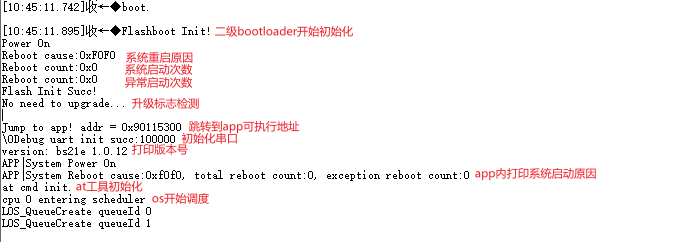

**图 2**  平台启动日志（HSO）<a name="fig957mcpsimp"></a>  
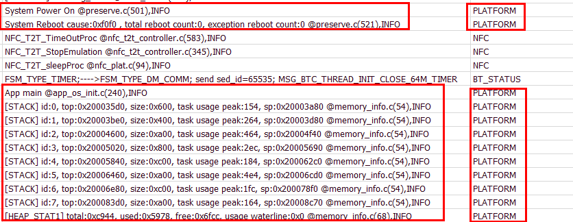

### APP睡眠日志<a name="ZH-CN_TOPIC_0000001932198950"></a>

App默认每隔一段时间会通过HSO日志记录一次调度空闲时间，打印睡眠统计的同时会喂狗（若出现长时间没有打印，可能会狗超时，因此会喂狗），如[图1](#fig1901mcpsimp)所示。该维测依赖于PM\_MCPU\_MIPS\_STATISTICS\_ENABLE宏，默认关闭，根据实际情况选择，用户可不关心。

**图 1**  APP睡眠日志<a name="fig1901mcpsimp"></a>  
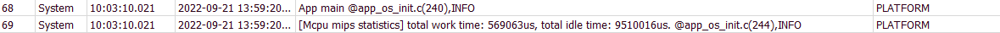

### APP panic日志<a name="ZH-CN_TOPIC_0000001959437729"></a>

Kernel panic是指操作系统在监测到内部的致命错误，并无法安全处理此错误时采取的动作。内核触发到某种异常情况，运行kernel\_panic函数，并尽可能把异常发生时获取的全部信息打印出来。

-   原理

    导致异常的原因多种多样，通过异常打印的调用信息，找到调用kernel\_panic的原因。常见的原因包括内核堆栈溢出、内核空间的除0异常、内存访问越界、内核陷入死锁等。

-   触发方法

    内核态读0地址。

APP核发生panic异常时会打印panic原因0x2003以及对应的panic id，如图[APP panic日志](APP-panic日志.md)所示。panic id见[表1](PANIC-ID.md#table279mcpsimp)所示。

**图 1**  APP panic异常<a name="fig1896mcpsimp"></a>  


### APP异常重启<a name="ZH-CN_TOPIC_0000001932198954"></a>

APP核发生xip异常，hardfault，狗超时等异常时，会打印重启原因0x200x以及pc和lr值，如[图1](#fig167mcpsimp)及[表1](#table169mcpsimp)所示。

**图 1**  APP异常重启<a name="fig167mcpsimp"></a>  


**表 1**  APP重启原因

<a name="table169mcpsimp"></a>
<table><thead align="left"><tr id="row176mcpsimp"><th class="cellrowborder" align="left" valign="top" width="40.59405940594059%" id="mcps1.2.4.1.1"><p id="p178mcpsimp"><a name="p178mcpsimp"></a><a name="p178mcpsimp"></a>异常类型</p>
</th>
<th class="cellrowborder" align="left" valign="top" width="33.663366336633665%" id="mcps1.2.4.1.2"><p id="p181mcpsimp"><a name="p181mcpsimp"></a><a name="p181mcpsimp"></a>日志类型</p>
</th>
<th class="cellrowborder" align="left" valign="top" width="25.742574257425744%" id="mcps1.2.4.1.3"><p id="p184mcpsimp"><a name="p184mcpsimp"></a><a name="p184mcpsimp"></a>重启原因</p>
</th>
</tr>
</thead>
<tbody><tr id="row186mcpsimp"><td class="cellrowborder" align="left" valign="top" width="40.59405940594059%" headers="mcps1.2.4.1.1 "><p id="p188mcpsimp"><a name="p188mcpsimp"></a><a name="p188mcpsimp"></a>主动重启</p>
</td>
<td class="cellrowborder" align="left" valign="top" width="33.663366336633665%" headers="mcps1.2.4.1.2 "><p id="p191mcpsimp"><a name="p191mcpsimp"></a><a name="p191mcpsimp"></a>Log_FLATFORM</p>
</td>
<td class="cellrowborder" align="left" valign="top" width="25.742574257425744%" headers="mcps1.2.4.1.3 "><p id="p193mcpsimp"><a name="p193mcpsimp"></a><a name="p193mcpsimp"></a>0x2001</p>
</td>
</tr>
<tr id="row194mcpsimp"><td class="cellrowborder" align="left" valign="top" width="40.59405940594059%" headers="mcps1.2.4.1.1 "><p id="p196mcpsimp"><a name="p196mcpsimp"></a><a name="p196mcpsimp"></a>panic</p>
</td>
<td class="cellrowborder" align="left" valign="top" width="33.663366336633665%" headers="mcps1.2.4.1.2 "><p id="p199mcpsimp"><a name="p199mcpsimp"></a><a name="p199mcpsimp"></a>Log_FLATFORM</p>
</td>
<td class="cellrowborder" align="left" valign="top" width="25.742574257425744%" headers="mcps1.2.4.1.3 "><p id="p201mcpsimp"><a name="p201mcpsimp"></a><a name="p201mcpsimp"></a>0x2003</p>
</td>
</tr>
<tr id="row202mcpsimp"><td class="cellrowborder" align="left" valign="top" width="40.59405940594059%" headers="mcps1.2.4.1.1 "><p id="p204mcpsimp"><a name="p204mcpsimp"></a><a name="p204mcpsimp"></a>hardfault</p>
</td>
<td class="cellrowborder" align="left" valign="top" width="33.663366336633665%" headers="mcps1.2.4.1.2 "><p id="p207mcpsimp"><a name="p207mcpsimp"></a><a name="p207mcpsimp"></a>Log_FLATFORM</p>
</td>
<td class="cellrowborder" align="left" valign="top" width="25.742574257425744%" headers="mcps1.2.4.1.3 "><p id="p209mcpsimp"><a name="p209mcpsimp"></a><a name="p209mcpsimp"></a>0x2004</p>
</td>
</tr>
<tr id="row210mcpsimp"><td class="cellrowborder" align="left" valign="top" width="40.59405940594059%" headers="mcps1.2.4.1.1 "><p id="p212mcpsimp"><a name="p212mcpsimp"></a><a name="p212mcpsimp"></a>nmi</p>
</td>
<td class="cellrowborder" align="left" valign="top" width="33.663366336633665%" headers="mcps1.2.4.1.2 "><p id="p215mcpsimp"><a name="p215mcpsimp"></a><a name="p215mcpsimp"></a>Log_FLATFORM</p>
</td>
<td class="cellrowborder" align="left" valign="top" width="25.742574257425744%" headers="mcps1.2.4.1.3 "><p id="p217mcpsimp"><a name="p217mcpsimp"></a><a name="p217mcpsimp"></a>0x2005</p>
</td>
</tr>
<tr id="row218mcpsimp"><td class="cellrowborder" align="left" valign="top" width="40.59405940594059%" headers="mcps1.2.4.1.1 "><p id="p220mcpsimp"><a name="p220mcpsimp"></a><a name="p220mcpsimp"></a>狗超时</p>
</td>
<td class="cellrowborder" align="left" valign="top" width="33.663366336633665%" headers="mcps1.2.4.1.2 "><p id="p223mcpsimp"><a name="p223mcpsimp"></a><a name="p223mcpsimp"></a>Log_FLATFORM</p>
</td>
<td class="cellrowborder" align="left" valign="top" width="25.742574257425744%" headers="mcps1.2.4.1.3 "><p id="p225mcpsimp"><a name="p225mcpsimp"></a><a name="p225mcpsimp"></a>0x2008</p>
</td>
</tr>
<tr id="row226mcpsimp"><td class="cellrowborder" align="left" valign="top" width="40.59405940594059%" headers="mcps1.2.4.1.1 "><p id="p228mcpsimp"><a name="p228mcpsimp"></a><a name="p228mcpsimp"></a>xip异常</p>
</td>
<td class="cellrowborder" align="left" valign="top" width="33.663366336633665%" headers="mcps1.2.4.1.2 "><p id="p231mcpsimp"><a name="p231mcpsimp"></a><a name="p231mcpsimp"></a>Log_FLATFORM</p>
</td>
<td class="cellrowborder" align="left" valign="top" width="25.742574257425744%" headers="mcps1.2.4.1.3 "><p id="p233mcpsimp"><a name="p233mcpsimp"></a><a name="p233mcpsimp"></a>0x2009</p>
</td>
</tr>
<tr id="row234mcpsimp"><td class="cellrowborder" align="left" valign="top" width="40.59405940594059%" headers="mcps1.2.4.1.1 "><p id="p236mcpsimp"><a name="p236mcpsimp"></a><a name="p236mcpsimp"></a>xip cache异常</p>
</td>
<td class="cellrowborder" align="left" valign="top" width="33.663366336633665%" headers="mcps1.2.4.1.2 "><p id="p239mcpsimp"><a name="p239mcpsimp"></a><a name="p239mcpsimp"></a>Log_FLATFORM</p>
</td>
<td class="cellrowborder" align="left" valign="top" width="25.742574257425744%" headers="mcps1.2.4.1.3 "><p id="p241mcpsimp"><a name="p241mcpsimp"></a><a name="p241mcpsimp"></a>0x200a</p>
</td>
</tr>
<tr id="row242mcpsimp"><td class="cellrowborder" align="left" valign="top" width="40.59405940594059%" headers="mcps1.2.4.1.1 "><p id="p244mcpsimp"><a name="p244mcpsimp"></a><a name="p244mcpsimp"></a>mdma异常</p>
</td>
<td class="cellrowborder" align="left" valign="top" width="33.663366336633665%" headers="mcps1.2.4.1.2 "><p id="p247mcpsimp"><a name="p247mcpsimp"></a><a name="p247mcpsimp"></a>Log_FLATFORM</p>
</td>
<td class="cellrowborder" align="left" valign="top" width="25.742574257425744%" headers="mcps1.2.4.1.3 "><p id="p249mcpsimp"><a name="p249mcpsimp"></a><a name="p249mcpsimp"></a>0x200b</p>
</td>
</tr>
<tr id="row250mcpsimp"><td class="cellrowborder" align="left" valign="top" width="40.59405940594059%" headers="mcps1.2.4.1.1 "><p id="p252mcpsimp"><a name="p252mcpsimp"></a><a name="p252mcpsimp"></a>smdma异常</p>
</td>
<td class="cellrowborder" align="left" valign="top" width="33.663366336633665%" headers="mcps1.2.4.1.2 "><p id="p255mcpsimp"><a name="p255mcpsimp"></a><a name="p255mcpsimp"></a>Log_FLATFORM</p>
</td>
<td class="cellrowborder" align="left" valign="top" width="25.742574257425744%" headers="mcps1.2.4.1.3 "><p id="p257mcpsimp"><a name="p257mcpsimp"></a><a name="p257mcpsimp"></a>0x200c</p>
</td>
</tr>
<tr id="row258mcpsimp"><td class="cellrowborder" align="left" valign="top" width="40.59405940594059%" headers="mcps1.2.4.1.1 "><p id="p260mcpsimp"><a name="p260mcpsimp"></a><a name="p260mcpsimp"></a>强制狗复位</p>
</td>
<td class="cellrowborder" align="left" valign="top" width="33.663366336633665%" headers="mcps1.2.4.1.2 "><p id="p263mcpsimp"><a name="p263mcpsimp"></a><a name="p263mcpsimp"></a>Log_FLATFORM</p>
</td>
<td class="cellrowborder" align="left" valign="top" width="25.742574257425744%" headers="mcps1.2.4.1.3 "><p id="p265mcpsimp"><a name="p265mcpsimp"></a><a name="p265mcpsimp"></a>0x200d</p>
</td>
</tr>
<tr id="row266mcpsimp"><td class="cellrowborder" align="left" valign="top" width="40.59405940594059%" headers="mcps1.2.4.1.1 "><p id="p268mcpsimp"><a name="p268mcpsimp"></a><a name="p268mcpsimp"></a>lp狗/uvlo重启</p>
</td>
<td class="cellrowborder" align="left" valign="top" width="33.663366336633665%" headers="mcps1.2.4.1.2 "><p id="p271mcpsimp"><a name="p271mcpsimp"></a><a name="p271mcpsimp"></a>Log_FLATFORM</p>
</td>
<td class="cellrowborder" align="left" valign="top" width="25.742574257425744%" headers="mcps1.2.4.1.3 "><p id="p273mcpsimp"><a name="p273mcpsimp"></a><a name="p273mcpsimp"></a>0x200f</p>
</td>
</tr>
</tbody>
</table>

### 异常类型描述<a name="ZH-CN_TOPIC_0000001959517517"></a>

**表 1**  重启描述分析（middleware/utils/dfx/dfx\_reboot/reboot/shared/non\_os\_reboot.h）

<a name="table1276mcpsimp"></a>
<table><thead align="left"><tr id="row1283mcpsimp"><th class="cellrowborder" align="left" valign="top" width="19.74%" id="mcps1.2.4.1.1"><p id="p1285mcpsimp"><a name="p1285mcpsimp"></a><a name="p1285mcpsimp"></a>id</p>
</th>
<th class="cellrowborder" align="left" valign="top" width="17.03%" id="mcps1.2.4.1.2"><p id="p1288mcpsimp"><a name="p1288mcpsimp"></a><a name="p1288mcpsimp"></a>描述</p>
</th>
<th class="cellrowborder" align="left" valign="top" width="63.23%" id="mcps1.2.4.1.3"><p id="p1291mcpsimp"><a name="p1291mcpsimp"></a><a name="p1291mcpsimp"></a>重启异常场景原因分析</p>
</th>
</tr>
</thead>
<tbody><tr id="row1293mcpsimp"><td class="cellrowborder" align="left" valign="top" width="19.74%" headers="mcps1.2.4.1.1 "><p id="p1295mcpsimp"><a name="p1295mcpsimp"></a><a name="p1295mcpsimp"></a>0x0</p>
</td>
<td class="cellrowborder" align="left" valign="top" width="17.03%" headers="mcps1.2.4.1.2 "><p id="p1298mcpsimp"><a name="p1298mcpsimp"></a><a name="p1298mcpsimp"></a>未知重启原因</p>
</td>
<td class="cellrowborder" align="left" valign="top" width="63.23%" headers="mcps1.2.4.1.3 "><p id="p1300mcpsimp"><a name="p1300mcpsimp"></a><a name="p1300mcpsimp"></a>用户代码中直接写寄存器重启导致</p>
</td>
</tr>
<tr id="row1301mcpsimp"><td class="cellrowborder" align="left" valign="top" width="19.74%" headers="mcps1.2.4.1.1 "><p id="p1303mcpsimp"><a name="p1303mcpsimp"></a><a name="p1303mcpsimp"></a>0x2001</p>
</td>
<td class="cellrowborder" align="left" valign="top" width="17.03%" headers="mcps1.2.4.1.2 "><p id="p1306mcpsimp"><a name="p1306mcpsimp"></a><a name="p1306mcpsimp"></a>应用核主动重启</p>
</td>
<td class="cellrowborder" align="left" valign="top" width="63.23%" headers="mcps1.2.4.1.3 "><p id="entry1307mcpsimpp0"><a name="entry1307mcpsimpp0"></a><a name="entry1307mcpsimpp0"></a>-</p>
</td>
</tr>
<tr id="row1308mcpsimp"><td class="cellrowborder" align="left" valign="top" width="19.74%" headers="mcps1.2.4.1.1 "><p id="p1310mcpsimp"><a name="p1310mcpsimp"></a><a name="p1310mcpsimp"></a>0x2003</p>
</td>
<td class="cellrowborder" align="left" valign="top" width="17.03%" headers="mcps1.2.4.1.2 "><p id="p1313mcpsimp"><a name="p1313mcpsimp"></a><a name="p1313mcpsimp"></a>APP panic异常</p>
</td>
<td class="cellrowborder" align="left" valign="top" width="63.23%" headers="mcps1.2.4.1.3 "><p id="p1315mcpsimp"><a name="p1315mcpsimp"></a><a name="p1315mcpsimp"></a>需要查看“<a href="PANIC-ID.md">PANIC ID</a>”中panic id，进一步分析</p>
</td>
</tr>
<tr id="row1316mcpsimp"><td class="cellrowborder" align="left" valign="top" width="19.74%" headers="mcps1.2.4.1.1 "><p id="p1318mcpsimp"><a name="p1318mcpsimp"></a><a name="p1318mcpsimp"></a>0x2004</p>
</td>
<td class="cellrowborder" align="left" valign="top" width="17.03%" headers="mcps1.2.4.1.2 "><p id="p1321mcpsimp"><a name="p1321mcpsimp"></a><a name="p1321mcpsimp"></a>Hardfault异常</p>
</td>
<td class="cellrowborder" align="left" valign="top" width="63.23%" headers="mcps1.2.4.1.3 "><p id="p1323mcpsimp"><a name="p1323mcpsimp"></a><a name="p1323mcpsimp"></a>非法地址；</p>
<p id="p1324mcpsimp"><a name="p1324mcpsimp"></a><a name="p1324mcpsimp"></a>空指针；</p>
<p id="p1325mcpsimp"><a name="p1325mcpsimp"></a><a name="p1325mcpsimp"></a>XXX模块未初始化；</p>
<p id="p1326mcpsimp"><a name="p1326mcpsimp"></a><a name="p1326mcpsimp"></a>XXX模块没有时钟；</p>
<p id="p1327mcpsimp"><a name="p1327mcpsimp"></a><a name="p1327mcpsimp"></a>需要结合临终遗言中mepc，ra，mtval及通用寄存器进一步定位。</p>
</td>
</tr>
<tr id="row1328mcpsimp"><td class="cellrowborder" align="left" valign="top" width="19.74%" headers="mcps1.2.4.1.1 "><p id="p1330mcpsimp"><a name="p1330mcpsimp"></a><a name="p1330mcpsimp"></a>0x2008</p>
</td>
<td class="cellrowborder" align="left" valign="top" width="17.03%" headers="mcps1.2.4.1.2 "><p id="p1333mcpsimp"><a name="p1333mcpsimp"></a><a name="p1333mcpsimp"></a>APP狗超时</p>
</td>
<td class="cellrowborder" align="left" valign="top" width="63.23%" headers="mcps1.2.4.1.3 "><p id="p1335mcpsimp"><a name="p1335mcpsimp"></a><a name="p1335mcpsimp"></a>结合cpu trace及日志分析。</p>
<p id="p1336mcpsimp"><a name="p1336mcpsimp"></a><a name="p1336mcpsimp"></a>一般是一直在执行高优先级任务/中断流程，导致低优先级喂狗任务无法得到调度。</p>
</td>
</tr>
<tr id="row1337mcpsimp"><td class="cellrowborder" align="left" valign="top" width="19.74%" headers="mcps1.2.4.1.1 "><p id="p1339mcpsimp"><a name="p1339mcpsimp"></a><a name="p1339mcpsimp"></a>0x200D</p>
</td>
<td class="cellrowborder" align="left" valign="top" width="17.03%" headers="mcps1.2.4.1.2 "><p id="p1342mcpsimp"><a name="p1342mcpsimp"></a><a name="p1342mcpsimp"></a>APP硬狗超时</p>
</td>
<td class="cellrowborder" align="left" valign="top" width="63.23%" headers="mcps1.2.4.1.3 "><p id="p1344mcpsimp"><a name="p1344mcpsimp"></a><a name="p1344mcpsimp"></a>系统卡死后，无法响应狗超时中断，需要结合cpu trace分析</p>
</td>
</tr>
<tr id="row1345mcpsimp"><td class="cellrowborder" align="left" valign="top" width="19.74%" headers="mcps1.2.4.1.1 "><p id="p1347mcpsimp"><a name="p1347mcpsimp"></a><a name="p1347mcpsimp"></a>0x200f</p>
</td>
<td class="cellrowborder" align="left" valign="top" width="17.03%" headers="mcps1.2.4.1.2 "><p id="p1350mcpsimp"><a name="p1350mcpsimp"></a><a name="p1350mcpsimp"></a>ulp狗超时/uvlo重启</p>
</td>
<td class="cellrowborder" align="left" valign="top" width="63.23%" headers="mcps1.2.4.1.3 "><p id="p1352mcpsimp"><a name="p1352mcpsimp"></a><a name="p1352mcpsimp"></a>添加ulp喂狗日志进一步分析</p>
</td>
</tr>
<tr id="row1353mcpsimp"><td class="cellrowborder" align="left" valign="top" width="19.74%" headers="mcps1.2.4.1.1 "><p id="p1355mcpsimp"><a name="p1355mcpsimp"></a><a name="p1355mcpsimp"></a>0x2010</p>
</td>
<td class="cellrowborder" align="left" valign="top" width="17.03%" headers="mcps1.2.4.1.2 "><p id="p1358mcpsimp"><a name="p1358mcpsimp"></a><a name="p1358mcpsimp"></a>Pin reset</p>
</td>
<td class="cellrowborder" align="left" valign="top" width="63.23%" headers="mcps1.2.4.1.3 "><p id="entry1359mcpsimpp0"><a name="entry1359mcpsimpp0"></a><a name="entry1359mcpsimpp0"></a>-</p>
</td>
</tr>
<tr id="row1360mcpsimp"><td class="cellrowborder" align="left" valign="top" width="19.74%" headers="mcps1.2.4.1.1 "><p id="p1362mcpsimp"><a name="p1362mcpsimp"></a><a name="p1362mcpsimp"></a>0x2040</p>
</td>
<td class="cellrowborder" align="left" valign="top" width="17.03%" headers="mcps1.2.4.1.2 "><p id="p1365mcpsimp"><a name="p1365mcpsimp"></a><a name="p1365mcpsimp"></a>升级完成</p>
</td>
<td class="cellrowborder" align="left" valign="top" width="63.23%" headers="mcps1.2.4.1.3 "><p id="entry1366mcpsimpp0"><a name="entry1366mcpsimpp0"></a><a name="entry1366mcpsimpp0"></a>-</p>
</td>
</tr>
<tr id="row1367mcpsimp"><td class="cellrowborder" align="left" valign="top" width="19.74%" headers="mcps1.2.4.1.1 "><p id="p1369mcpsimp"><a name="p1369mcpsimp"></a><a name="p1369mcpsimp"></a>0x2042</p>
</td>
<td class="cellrowborder" align="left" valign="top" width="17.03%" headers="mcps1.2.4.1.2 "><p id="p1372mcpsimp"><a name="p1372mcpsimp"></a><a name="p1372mcpsimp"></a>升级失败</p>
</td>
<td class="cellrowborder" align="left" valign="top" width="63.23%" headers="mcps1.2.4.1.3 "><p id="entry1373mcpsimpp0"><a name="entry1373mcpsimpp0"></a><a name="entry1373mcpsimpp0"></a>-</p>
</td>
</tr>
<tr id="row1374mcpsimp"><td class="cellrowborder" align="left" valign="top" width="19.74%" headers="mcps1.2.4.1.1 "><p id="p1376mcpsimp"><a name="p1376mcpsimp"></a><a name="p1376mcpsimp"></a>0xf0f0</p>
</td>
<td class="cellrowborder" align="left" valign="top" width="17.03%" headers="mcps1.2.4.1.2 "><p id="p1379mcpsimp"><a name="p1379mcpsimp"></a><a name="p1379mcpsimp"></a>系统上电</p>
</td>
<td class="cellrowborder" align="left" valign="top" width="63.23%" headers="mcps1.2.4.1.3 "><p id="entry1380mcpsimpp0"><a name="entry1380mcpsimpp0"></a><a name="entry1380mcpsimpp0"></a>-</p>
</td>
</tr>
</tbody>
</table>

# 日志分析<a name="ZH-CN_TOPIC_0000001932198958"></a>

常见的异常场景包括：watchdog超时，hardfault，mem fault，bus fault，use fault， panic异常，强制狗复位等。发生异常时，会打印异常重启原因，并引发系统重启。其中APP的重启异常用0x2xxx表示，具体有0x2000\~0x2010、0x2040\~0x2044、0x2080、0x2100。


## 死机信息获取<a name="ZH-CN_TOPIC_0000001932358346"></a>


### 普通打印口维测信息获取<a name="ZH-CN_TOPIC_0000001959437741"></a>

-   当硬件与串口工具处于连接状态时，如果单板发生死机，串口工具能够接收到复位前DFX流程打印的死机信息。用户可以通过分析死机信息，定位死机原因。普通打印口死机LOG分为4个部分：
-   死机现场：记录死机发生时RISCV通用寄存器以及部分CSR寄存器的现场值。各个寄存器的描述请参考附录中[异常信息查看](_异常信息查看.md#_异常信息查看)。

    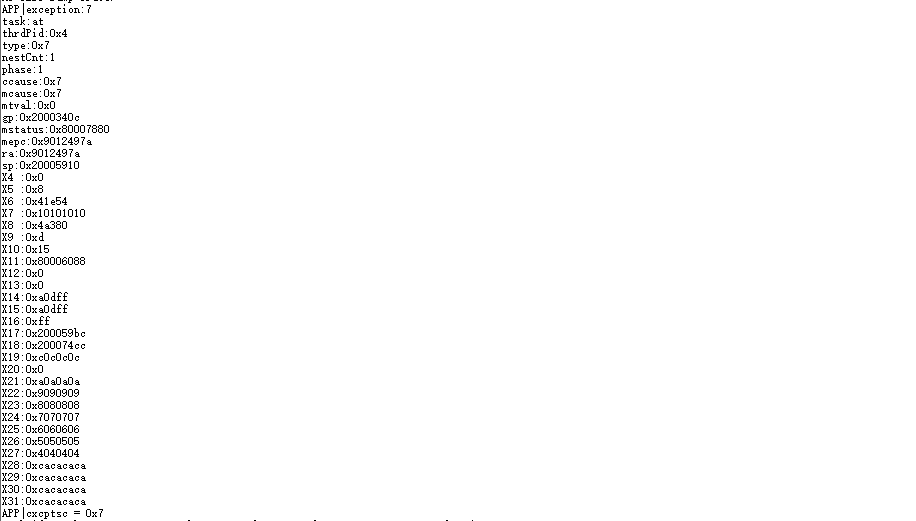

-   线程栈信息：记录死机发生时正在运行的线程栈的栈顶、栈大小以及栈使用峰值。

    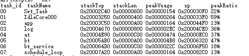

-   栈回溯：回溯死机栈信息，traceback 0为栈顶位置，sp addr，current sp为当前栈位置，sp content为栈内容。

    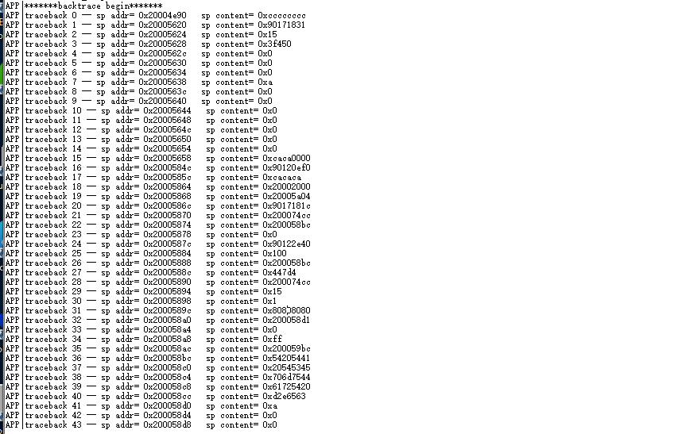

-   CPU Trace：记录CPU过去一段时间的执行的PC与LR。step time存储记录时间，值越大，记录的时间越接近死机现场。

    > **说明：** 
    >注意：此处是数采功能，记录的PC值和真实的执行轨迹可能有所差异，并不一样能完全对应！

    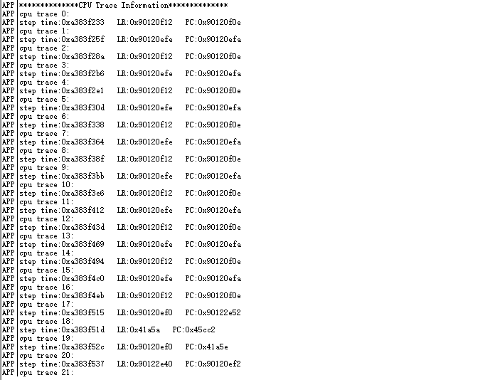

    Trace路径的分析有两种方式：

    方式一：用户可以根据编译时生成的application.lst文件查找LR和PC地址对应的函数，定位死机执行现场。

    方式二：用户使用IDE提供的CFBB Tools解析Trace，打开工具，选择用户使用的target。

    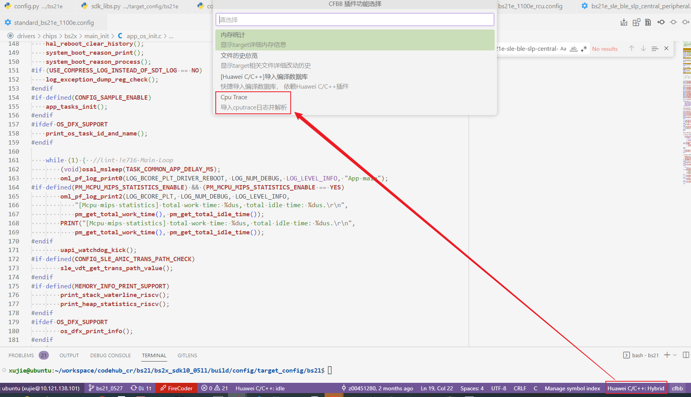

    导入CPU Trace Information到CPU Trace end的Trace信息，点击解析可以获取到过去一段时间的执行信息，定位死机原因：

    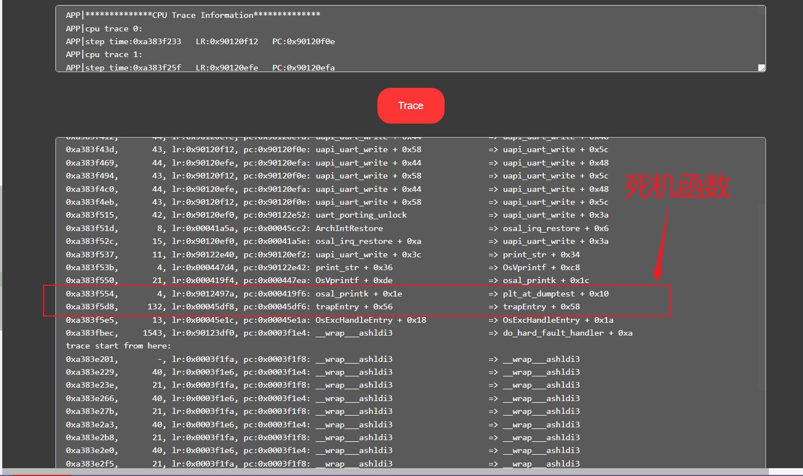

### 死机Dump信息获取<a name="ZH-CN_TOPIC_0000001959517521"></a>

DebugKits工具提供了死机发生时，将死机现场内存以二进制格式导出功能，提供参考信息，帮助开发者定位分析死机问题。工具的详细安装使用请参考《BS2XV100 DebugKits工具使用指南》，此处只介绍Dump信息导出流程。

首先进入工具页面点击options再选择change chip，在弹框中选择BS2X确定芯片类型，参考图选择芯片。

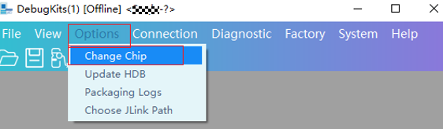

然后点击Connection选择Connect在弹窗中选择连接方式以及对应的通道序号进行连接，参考图连接芯片。

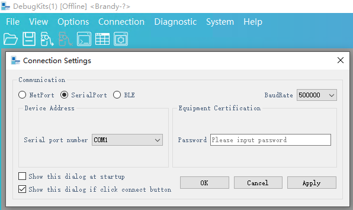

如果是第一次连接芯片或者芯片有新版本的程序，需要更新HDB并重新连接之后，日志的打印才能正确的显示，在Option菜单下选择Update HDB，选择生成的database目录（\\output\\bs2x\\database\_evb）再点击OK即可完成配置，具体参考下图：配置database。


通过DebugKits工具可以实时观测芯片运行时打印的具体信息，可以参考图 DebugKits日志打印。当死机发生时Message视图将会打印出last word以及last dump信息。


last word信息是死机发生时，将PC地址、返回地址、栈地址、CPU寄存器信息发送出来，用户可以根据last word的具体信息分析错误类型、定位错误原因，具体可以参考下图：last word信息。


last dump信息将会把内存中的部分信息打包生成bin文件存储到DebugKits的安装目录中的DumpInfo子目录之下，具体参考下图：last dump生成文件。

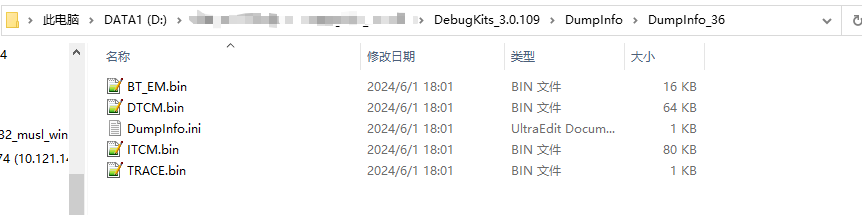

> **说明：** 
>注意：将内存dump到DebugKits中需要一定时间（1～2 min），因此如果需要使用last dump分析死机信息，不要在发生死机故障后立即复位，否则last dump信息可能无法完整获取。

### 连接J-Link调试器导出<a name="ZH-CN_TOPIC_0000001932198962"></a>

在允许连接JTAG调试器的场景下，用户可连接J-Link仿真器等工具进一步获取死机现场的相关信息。以下主要介绍通过J-Link仿真器获取死机相关信息的过程。

本小节主要介绍在死机现场使用J-Link调试器导出死机的过程。

使用J-Link仿真器调试需先连接芯片SWD管脚，具体位置以实际产品为准。硬件连接后，执行工具包（sdk\\tools\\bin\\jlink\_tool\\bs2x）中的Commandline\_bs2x\_mcpu.bat脚本，脚本将自动进行连接（其他核的连接操作可参照此方法进行）。

J-Link连接MCPU示意图


连接J-Link后可以使用Jlink命令调试芯片，获取芯片运行信息，Jlink常用命令如下：J-Link常用命令

<a name="table1568mcpsimp"></a>
<table><thead align="left"><tr id="row1573mcpsimp"><th class="cellrowborder" align="left" valign="top" width="20%" id="mcps1.1.3.1.1"><p id="p1575mcpsimp"><a name="p1575mcpsimp"></a><a name="p1575mcpsimp"></a>命令</p>
</th>
<th class="cellrowborder" align="left" valign="top" width="80%" id="mcps1.1.3.1.2"><p id="p1577mcpsimp"><a name="p1577mcpsimp"></a><a name="p1577mcpsimp"></a>描述</p>
</th>
</tr>
</thead>
<tbody><tr id="row1579mcpsimp"><td class="cellrowborder" align="left" valign="top" width="20%" headers="mcps1.1.3.1.1 "><p id="p1581mcpsimp"><a name="p1581mcpsimp"></a><a name="p1581mcpsimp"></a>con/connect</p>
</td>
<td class="cellrowborder" align="left" valign="top" width="80%" headers="mcps1.1.3.1.2 "><p id="p1583mcpsimp"><a name="p1583mcpsimp"></a><a name="p1583mcpsimp"></a>连接。</p>
</td>
</tr>
<tr id="row1584mcpsimp"><td class="cellrowborder" align="left" valign="top" width="20%" headers="mcps1.1.3.1.1 "><p id="p1586mcpsimp"><a name="p1586mcpsimp"></a><a name="p1586mcpsimp"></a>h/halt</p>
</td>
<td class="cellrowborder" align="left" valign="top" width="80%" headers="mcps1.1.3.1.2 "><p id="p1588mcpsimp"><a name="p1588mcpsimp"></a><a name="p1588mcpsimp"></a>暂停，停止。</p>
</td>
</tr>
<tr id="row1589mcpsimp"><td class="cellrowborder" align="left" valign="top" width="20%" headers="mcps1.1.3.1.1 "><p id="p1591mcpsimp"><a name="p1591mcpsimp"></a><a name="p1591mcpsimp"></a>g/go</p>
</td>
<td class="cellrowborder" align="left" valign="top" width="80%" headers="mcps1.1.3.1.2 "><p id="p1593mcpsimp"><a name="p1593mcpsimp"></a><a name="p1593mcpsimp"></a>继续，运行。</p>
</td>
</tr>
<tr id="row1594mcpsimp"><td class="cellrowborder" align="left" valign="top" width="20%" headers="mcps1.1.3.1.1 "><p id="p1596mcpsimp"><a name="p1596mcpsimp"></a><a name="p1596mcpsimp"></a>mem32</p>
<p id="p1597mcpsimp"><a name="p1597mcpsimp"></a><a name="p1597mcpsimp"></a>mem16</p>
<p id="p1598mcpsimp"><a name="p1598mcpsimp"></a><a name="p1598mcpsimp"></a>mem8</p>
</td>
<td class="cellrowborder" align="left" valign="top" width="80%" headers="mcps1.1.3.1.2 "><p id="p1600mcpsimp"><a name="p1600mcpsimp"></a><a name="p1600mcpsimp"></a>I/O读32bit：mem32 &lt;Addr&gt;, &lt;NumItems&gt; (hex) (Addr表示内存地址，NumItems表示从Addr开始连续读几个32bit )</p>
<p id="p1601mcpsimp"><a name="p1601mcpsimp"></a><a name="p1601mcpsimp"></a>I/O读16bit：mem16 &lt;Addr&gt;, &lt;NumItems&gt; (hex)</p>
<p id="p1602mcpsimp"><a name="p1602mcpsimp"></a><a name="p1602mcpsimp"></a>I/O读8bit：mem8 &lt;Addr&gt;, &lt;NumItems&gt; (hex)</p>
</td>
</tr>
<tr id="row1603mcpsimp"><td class="cellrowborder" align="left" valign="top" width="20%" headers="mcps1.1.3.1.1 "><p id="p1605mcpsimp"><a name="p1605mcpsimp"></a><a name="p1605mcpsimp"></a>w4</p>
<p id="p1606mcpsimp"><a name="p1606mcpsimp"></a><a name="p1606mcpsimp"></a>w2</p>
<p id="p1607mcpsimp"><a name="p1607mcpsimp"></a><a name="p1607mcpsimp"></a>w1</p>
</td>
<td class="cellrowborder" align="left" valign="top" width="80%" headers="mcps1.1.3.1.2 "><p id="p1609mcpsimp"><a name="p1609mcpsimp"></a><a name="p1609mcpsimp"></a>I/O写4Byte：w4 &lt;Addr&gt;, &lt;Data&gt; (hex)</p>
<p id="p1610mcpsimp"><a name="p1610mcpsimp"></a><a name="p1610mcpsimp"></a>I/O写2Byte：w2 &lt;Addr&gt;, &lt;Data&gt; (hex)</p>
<p id="p1611mcpsimp"><a name="p1611mcpsimp"></a><a name="p1611mcpsimp"></a>I/O写1Byte：w1 &lt;Addr&gt;, &lt;Data&gt; (hex)</p>
</td>
</tr>
<tr id="row1612mcpsimp"><td class="cellrowborder" align="left" valign="top" width="20%" headers="mcps1.1.3.1.1 "><p id="p1614mcpsimp"><a name="p1614mcpsimp"></a><a name="p1614mcpsimp"></a>readcsr</p>
</td>
<td class="cellrowborder" align="left" valign="top" width="80%" headers="mcps1.1.3.1.2 "><p id="p1616mcpsimp"><a name="p1616mcpsimp"></a><a name="p1616mcpsimp"></a>读riscv csr寄存器：ReadCSR &lt;RegIndex&gt;</p>
</td>
</tr>
<tr id="row1617mcpsimp"><td class="cellrowborder" align="left" valign="top" width="20%" headers="mcps1.1.3.1.1 "><p id="p1619mcpsimp"><a name="p1619mcpsimp"></a><a name="p1619mcpsimp"></a>writecsr</p>
</td>
<td class="cellrowborder" align="left" valign="top" width="80%" headers="mcps1.1.3.1.2 "><p id="p1621mcpsimp"><a name="p1621mcpsimp"></a><a name="p1621mcpsimp"></a>写riscv csr寄存器：WriteCSR &lt;RegIndex&gt;,&lt;Value&gt;</p>
</td>
</tr>
</tbody>
</table>

查询信息步骤如下：

-   查询CPU寄存器信息，如图 查询CPU寄存器值所示。


-   查询内存信息，获取维测变量值或普通变量值。

在\\output\\bs2x\\xxx\_core\\xxx\_bs2x\_xxx\\xxx.nm中获取nm文件，在nm文件中获取想要查询的变量地址如图 变量地址中“g-exception-dump-callback”变量的地址为0x20025950。


通过J-Link获取状态信息，如图 变量值。


> **说明：** 
>RISC-V架构处理器需要使用**V10及以上版本的J-Link仿真器**。
>芯片连接J-Link需要保证处于工作状态，睡眠状态时无法连接。

## 狗超时重启<a name="ZH-CN_TOPIC_0000001932358350"></a>

狗超时重启分为：CWDT、ULP WDT 重启。其中APP发生狗超时（CWDT超时），会有HSO日志和UART日志打印，显示对应的pc和lr，并且会导出内存信息。

APP核发生狗超时时，系统会进行重启。系统重启后，串口会打印异常时的pc和lr，如[图1](#fig156mcpsimp)所示。HSO日志也会打印重启原因0x2008及对应的pc和lr，如[图2](#fig158mcpsimp)所示。可以在lst文件中查找pc值确定问题归属。APP核的pc指针范围如表3-1所示。

**表 1**  APP代码空间范围

<a name="table115mcpsimp"></a>
<table><thead align="left"><tr id="row122mcpsimp"><th class="cellrowborder" align="left" valign="top" width="29.292929292929294%" id="mcps1.2.4.1.1"><p id="p124mcpsimp"><a name="p124mcpsimp"></a><a name="p124mcpsimp"></a>内存名称</p>
</th>
<th class="cellrowborder" align="left" valign="top" width="37.37373737373737%" id="mcps1.2.4.1.2"><p id="p127mcpsimp"><a name="p127mcpsimp"></a><a name="p127mcpsimp"></a>开始地址</p>
</th>
<th class="cellrowborder" align="left" valign="top" width="33.33333333333333%" id="mcps1.2.4.1.3"><p id="p130mcpsimp"><a name="p130mcpsimp"></a><a name="p130mcpsimp"></a>结束地址</p>
</th>
</tr>
</thead>
<tbody><tr id="row132mcpsimp"><td class="cellrowborder" align="left" valign="top" width="29.292929292929294%" headers="mcps1.2.4.1.1 "><p id="p134mcpsimp"><a name="p134mcpsimp"></a><a name="p134mcpsimp"></a>ITCM</p>
</td>
<td class="cellrowborder" align="left" valign="top" width="37.37373737373737%" headers="mcps1.2.4.1.2 "><p id="p137mcpsimp"><a name="p137mcpsimp"></a><a name="p137mcpsimp"></a>0x42000</p>
</td>
<td class="cellrowborder" align="left" valign="top" width="33.33333333333333%" headers="mcps1.2.4.1.3 "><p id="p139mcpsimp"><a name="p139mcpsimp"></a><a name="p139mcpsimp"></a>0x56000</p>
</td>
</tr>
<tr id="row140mcpsimp"><td class="cellrowborder" align="left" valign="top" width="29.292929292929294%" headers="mcps1.2.4.1.1 "><p id="p142mcpsimp"><a name="p142mcpsimp"></a><a name="p142mcpsimp"></a>DTCM</p>
</td>
<td class="cellrowborder" align="left" valign="top" width="37.37373737373737%" headers="mcps1.2.4.1.2 "><p id="p145mcpsimp"><a name="p145mcpsimp"></a><a name="p145mcpsimp"></a>0x20000000</p>
</td>
<td class="cellrowborder" align="left" valign="top" width="33.33333333333333%" headers="mcps1.2.4.1.3 "><p id="p147mcpsimp"><a name="p147mcpsimp"></a><a name="p147mcpsimp"></a>0x20010000</p>
</td>
</tr>
<tr id="row148mcpsimp"><td class="cellrowborder" align="left" valign="top" width="29.292929292929294%" headers="mcps1.2.4.1.1 "><p id="p150mcpsimp"><a name="p150mcpsimp"></a><a name="p150mcpsimp"></a>SFC</p>
</td>
<td class="cellrowborder" align="left" valign="top" width="37.37373737373737%" headers="mcps1.2.4.1.2 "><p id="p153mcpsimp"><a name="p153mcpsimp"></a><a name="p153mcpsimp"></a>0x90100000</p>
</td>
<td class="cellrowborder" align="left" valign="top" width="33.33333333333333%" headers="mcps1.2.4.1.3 "><p id="p155mcpsimp"><a name="p155mcpsimp"></a><a name="p155mcpsimp"></a>0x90180000</p>
</td>
</tr>
</tbody>
</table>

**图 1**  CWDT超时重启UART打印<a name="fig156mcpsimp"></a>  
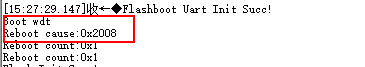

**图 2**  CWDT超时重启HSO日志打印<a name="fig158mcpsimp"></a>  
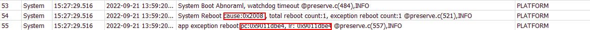


### ULP\_WDT超时<a name="ZH-CN_TOPIC_0000001959437745"></a>

APP进入睡眠时，CWDT将掉电，WDT功能由ULP\_WDT实现。发生狗超时时，系统会进行重启。系统重启后，串口和HSO日志也会打印重启原因0x200f，如[图1](#fig1150mcpsimp)所示。

**图 1**  WDT超时重启UART打印<a name="fig1150mcpsimp"></a>  
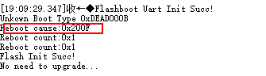

## hardfault、MEM fault、BUS fault、Usage fault异常<a name="ZH-CN_TOPIC_0000001959517525"></a>

系统发生上述异常时，HSO日志会记录异常时的pc、lr和mtval，如[图1](APP核异常.md#fig1214mcpsimp)所示。

系统重启后，也会打印重启原因及对应的pc、lr和mtval，如[图2](APP核异常.md#fig1216mcpsimp)所示。。


### APP核异常<a name="ZH-CN_TOPIC_0000001932198966"></a>

APP核发生上述重启会打印重启原因0x2004。

**图 1**  APP hardfault重启HSO日志<a name="fig1214mcpsimp"></a>  
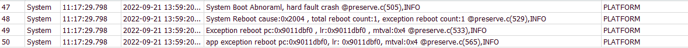

**图 2**  APP hardfault重启UART打印<a name="fig1216mcpsimp"></a>  
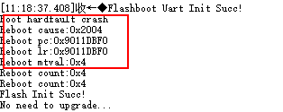

## NMI异常<a name="ZH-CN_TOPIC_0000001959437749"></a>

系统发生如下NMI异常时，重启后会打印如下重启原因。HSO日志会记录pc、lr和mtval。


### XIP异常<a name="ZH-CN_TOPIC_0000001959517529"></a>

系统发生XIP重启会打印重启原因0x2009。HSO日志会输出pc、lr和mtval。如[图1](#fig1639mcpsimp)和[图2](#fig1641mcpsimp)所示

**图 1**  XIP重启HSO日志<a name="fig1639mcpsimp"></a>  


**图 2**  XIP重启UART打印<a name="fig1641mcpsimp"></a>  
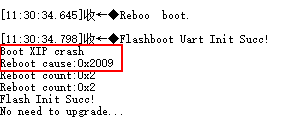

### XIP CACHE异常<a name="ZH-CN_TOPIC_0000001932198970"></a>

系统发生XIP cache异常会打印重启原因0x200a。HSO日志会记录pc、lr和mtval。如[图1](#fig1144mcpsimp)和[图2](#fig1146mcpsimp)所示

**图 1**  XIP cache异常HSO日志<a name="fig1144mcpsimp"></a>  


**图 2**  XIP cache异常UART打印<a name="fig1146mcpsimp"></a>  
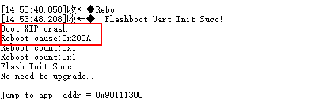

### MDMA异常<a name="ZH-CN_TOPIC_0000001932358358"></a>

系统发生MDMA异常会打印重启原因0x200b。HSO日志会记录pc、lr和mtval。如[图1](#fig1680mcpsimp)和[图2](#fig1682mcpsimp)所示

**图 1**  MDMA异常HSO日志<a name="fig1680mcpsimp"></a>  
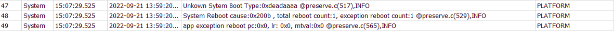

**图 2**  MDMA异常UART打印<a name="fig1682mcpsimp"></a>  
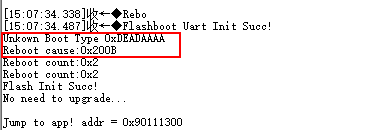

### SMDMA异常<a name="ZH-CN_TOPIC_0000001959437753"></a>

系统发生SMDMA异常会打印重启原因0x200c。HSO日志会记录pc、lr和mtval。如[图1](#fig965mcpsimp)和[图2](#fig967mcpsimp)所示

**图 1**  SMDMA异常HSO日志<a name="fig965mcpsimp"></a>  
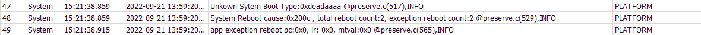

**图 2**  SMDMA异常UART打印<a name="fig967mcpsimp"></a>  
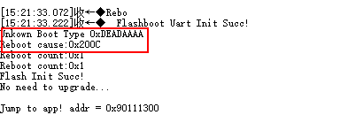

### A核NMI异常<a name="ZH-CN_TOPIC_0000001959517533"></a>

A核发生NMI异常会打印重启原因0x2005。HSO日志会记录pc、lr和mtval。如[图1](#fig1691mcpsimp)和[图2](#fig1693mcpsimp)所示

**图 1**  A核NMI异常HSO日志<a name="fig1691mcpsimp"></a>  
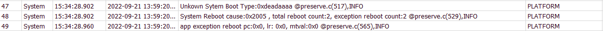

**图 2**  A核NMI异常UART打印<a name="fig1693mcpsimp"></a>  
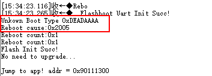

## panic异常<a name="ZH-CN_TOPIC_0000001932358362"></a>

发生panic异常时，会打印panic id，code以及调用的lr。并获取对端的pc，lr。其中normal core表示对端。Normal core为0表示A核异常。Normal core为1表示bt核异常。


### APP PANIC异常<a name="ZH-CN_TOPIC_0000001959437757"></a>

APP Panic异常会打印重启原因0x2003和panic日志。如[图1](#fig1668mcpsimp)和[图2](#fig1670mcpsimp)所示。

**图 1**  panic异常HSO日志<a name="fig1668mcpsimp"></a>  


**图 2**  panic异常UART打印<a name="fig1670mcpsimp"></a>  
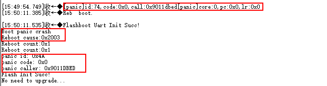

### PANIC ID<a name="ZH-CN_TOPIC_0000001932198978"></a>

**表 1**  PANIC ID描述（middleware/utils/dfx/panic/public/panic.h）

<a name="table279mcpsimp"></a>
<table><thead align="left"><tr id="row286mcpsimp"><th class="cellrowborder" align="left" valign="top" width="18.13%" id="mcps1.2.4.1.1"><p id="p288mcpsimp"><a name="p288mcpsimp"></a><a name="p288mcpsimp"></a>id（十进制值）</p>
</th>
<th class="cellrowborder" align="left" valign="top" width="52.87%" id="mcps1.2.4.1.2"><p id="p291mcpsimp"><a name="p291mcpsimp"></a><a name="p291mcpsimp"></a>描述</p>
</th>
<th class="cellrowborder" align="left" valign="top" width="28.999999999999996%" id="mcps1.2.4.1.3"><p id="p294mcpsimp"><a name="p294mcpsimp"></a><a name="p294mcpsimp"></a>备注</p>
</th>
</tr>
</thead>
<tbody><tr id="row296mcpsimp"><td class="cellrowborder" align="left" valign="top" width="18.13%" headers="mcps1.2.4.1.1 "><p id="p298mcpsimp"><a name="p298mcpsimp"></a><a name="p298mcpsimp"></a>0</p>
</td>
<td class="cellrowborder" align="left" valign="top" width="52.87%" headers="mcps1.2.4.1.2 "><p id="p301mcpsimp"><a name="p301mcpsimp"></a><a name="p301mcpsimp"></a>no panic</p>
</td>
<td class="cellrowborder" align="left" valign="top" width="28.999999999999996%" headers="mcps1.2.4.1.3 "><p id="p303mcpsimp"><a name="p303mcpsimp"></a><a name="p303mcpsimp"></a>NO USE</p>
</td>
</tr>
<tr id="row304mcpsimp"><td class="cellrowborder" align="left" valign="top" width="18.13%" headers="mcps1.2.4.1.1 "><p id="p306mcpsimp"><a name="p306mcpsimp"></a><a name="p306mcpsimp"></a>1</p>
</td>
<td class="cellrowborder" align="left" valign="top" width="52.87%" headers="mcps1.2.4.1.2 "><p id="p309mcpsimp"><a name="p309mcpsimp"></a><a name="p309mcpsimp"></a>arm core</p>
</td>
<td class="cellrowborder" align="left" valign="top" width="28.999999999999996%" headers="mcps1.2.4.1.3 "><p id="p311mcpsimp"><a name="p311mcpsimp"></a><a name="p311mcpsimp"></a>NO USE</p>
</td>
</tr>
<tr id="row312mcpsimp"><td class="cellrowborder" align="left" valign="top" width="18.13%" headers="mcps1.2.4.1.1 "><p id="p314mcpsimp"><a name="p314mcpsimp"></a><a name="p314mcpsimp"></a>2</p>
</td>
<td class="cellrowborder" align="left" valign="top" width="52.87%" headers="mcps1.2.4.1.2 "><p id="p317mcpsimp"><a name="p317mcpsimp"></a><a name="p317mcpsimp"></a>HAL</p>
</td>
<td class="cellrowborder" align="left" valign="top" width="28.999999999999996%" headers="mcps1.2.4.1.3 "><p id="p319mcpsimp"><a name="p319mcpsimp"></a><a name="p319mcpsimp"></a>NO USE</p>
</td>
</tr>
<tr id="row320mcpsimp"><td class="cellrowborder" align="left" valign="top" width="18.13%" headers="mcps1.2.4.1.1 "><p id="p322mcpsimp"><a name="p322mcpsimp"></a><a name="p322mcpsimp"></a>3</p>
</td>
<td class="cellrowborder" align="left" valign="top" width="52.87%" headers="mcps1.2.4.1.2 "><p id="p325mcpsimp"><a name="p325mcpsimp"></a><a name="p325mcpsimp"></a>DSP</p>
</td>
<td class="cellrowborder" align="left" valign="top" width="28.999999999999996%" headers="mcps1.2.4.1.3 "><p id="p327mcpsimp"><a name="p327mcpsimp"></a><a name="p327mcpsimp"></a>NO USE</p>
</td>
</tr>
<tr id="row328mcpsimp"><td class="cellrowborder" align="left" valign="top" width="18.13%" headers="mcps1.2.4.1.1 "><p id="p330mcpsimp"><a name="p330mcpsimp"></a><a name="p330mcpsimp"></a>4</p>
</td>
<td class="cellrowborder" align="left" valign="top" width="52.87%" headers="mcps1.2.4.1.2 "><p id="p333mcpsimp"><a name="p333mcpsimp"></a><a name="p333mcpsimp"></a>malloc</p>
</td>
<td class="cellrowborder" align="left" valign="top" width="28.999999999999996%" headers="mcps1.2.4.1.3 "><p id="p335mcpsimp"><a name="p335mcpsimp"></a><a name="p335mcpsimp"></a>BT/APP</p>
</td>
</tr>
<tr id="row336mcpsimp"><td class="cellrowborder" align="left" valign="top" width="18.13%" headers="mcps1.2.4.1.1 "><p id="p338mcpsimp"><a name="p338mcpsimp"></a><a name="p338mcpsimp"></a>5</p>
</td>
<td class="cellrowborder" align="left" valign="top" width="52.87%" headers="mcps1.2.4.1.2 "><p id="p341mcpsimp"><a name="p341mcpsimp"></a><a name="p341mcpsimp"></a>uart</p>
</td>
<td class="cellrowborder" align="left" valign="top" width="28.999999999999996%" headers="mcps1.2.4.1.3 "><p id="p343mcpsimp"><a name="p343mcpsimp"></a><a name="p343mcpsimp"></a>BT/APP</p>
</td>
</tr>
<tr id="row344mcpsimp"><td class="cellrowborder" align="left" valign="top" width="18.13%" headers="mcps1.2.4.1.1 "><p id="p346mcpsimp"><a name="p346mcpsimp"></a><a name="p346mcpsimp"></a>6</p>
</td>
<td class="cellrowborder" align="left" valign="top" width="52.87%" headers="mcps1.2.4.1.2 "><p id="p349mcpsimp"><a name="p349mcpsimp"></a><a name="p349mcpsimp"></a>flash</p>
</td>
<td class="cellrowborder" align="left" valign="top" width="28.999999999999996%" headers="mcps1.2.4.1.3 "><p id="p351mcpsimp"><a name="p351mcpsimp"></a><a name="p351mcpsimp"></a>APP</p>
</td>
</tr>
<tr id="row352mcpsimp"><td class="cellrowborder" align="left" valign="top" width="18.13%" headers="mcps1.2.4.1.1 "><p id="p354mcpsimp"><a name="p354mcpsimp"></a><a name="p354mcpsimp"></a>7</p>
</td>
<td class="cellrowborder" align="left" valign="top" width="52.87%" headers="mcps1.2.4.1.2 "><p id="p357mcpsimp"><a name="p357mcpsimp"></a><a name="p357mcpsimp"></a>adc</p>
</td>
<td class="cellrowborder" align="left" valign="top" width="28.999999999999996%" headers="mcps1.2.4.1.3 "><p id="p359mcpsimp"><a name="p359mcpsimp"></a><a name="p359mcpsimp"></a>APP</p>
</td>
</tr>
<tr id="row360mcpsimp"><td class="cellrowborder" align="left" valign="top" width="18.13%" headers="mcps1.2.4.1.1 "><p id="p362mcpsimp"><a name="p362mcpsimp"></a><a name="p362mcpsimp"></a>8</p>
</td>
<td class="cellrowborder" align="left" valign="top" width="52.87%" headers="mcps1.2.4.1.2 "><p id="p365mcpsimp"><a name="p365mcpsimp"></a><a name="p365mcpsimp"></a>watchdog</p>
</td>
<td class="cellrowborder" align="left" valign="top" width="28.999999999999996%" headers="mcps1.2.4.1.3 "><p id="p367mcpsimp"><a name="p367mcpsimp"></a><a name="p367mcpsimp"></a>NO USE</p>
</td>
</tr>
<tr id="row368mcpsimp"><td class="cellrowborder" align="left" valign="top" width="18.13%" headers="mcps1.2.4.1.1 "><p id="p370mcpsimp"><a name="p370mcpsimp"></a><a name="p370mcpsimp"></a>9</p>
</td>
<td class="cellrowborder" align="left" valign="top" width="52.87%" headers="mcps1.2.4.1.2 "><p id="p373mcpsimp"><a name="p373mcpsimp"></a><a name="p373mcpsimp"></a>log</p>
</td>
<td class="cellrowborder" align="left" valign="top" width="28.999999999999996%" headers="mcps1.2.4.1.3 "><p id="p375mcpsimp"><a name="p375mcpsimp"></a><a name="p375mcpsimp"></a>BT/APP</p>
</td>
</tr>
<tr id="row376mcpsimp"><td class="cellrowborder" align="left" valign="top" width="18.13%" headers="mcps1.2.4.1.1 "><p id="p378mcpsimp"><a name="p378mcpsimp"></a><a name="p378mcpsimp"></a>10</p>
</td>
<td class="cellrowborder" align="left" valign="top" width="52.87%" headers="mcps1.2.4.1.2 "><p id="p381mcpsimp"><a name="p381mcpsimp"></a><a name="p381mcpsimp"></a>dma</p>
</td>
<td class="cellrowborder" align="left" valign="top" width="28.999999999999996%" headers="mcps1.2.4.1.3 "><p id="p383mcpsimp"><a name="p383mcpsimp"></a><a name="p383mcpsimp"></a>BT/APP</p>
</td>
</tr>
<tr id="row384mcpsimp"><td class="cellrowborder" align="left" valign="top" width="18.13%" headers="mcps1.2.4.1.1 "><p id="p386mcpsimp"><a name="p386mcpsimp"></a><a name="p386mcpsimp"></a>11</p>
</td>
<td class="cellrowborder" align="left" valign="top" width="52.87%" headers="mcps1.2.4.1.2 "><p id="p389mcpsimp"><a name="p389mcpsimp"></a><a name="p389mcpsimp"></a>assert</p>
</td>
<td class="cellrowborder" align="left" valign="top" width="28.999999999999996%" headers="mcps1.2.4.1.3 "><p id="p391mcpsimp"><a name="p391mcpsimp"></a><a name="p391mcpsimp"></a>BT/APP</p>
</td>
</tr>
<tr id="row392mcpsimp"><td class="cellrowborder" align="left" valign="top" width="18.13%" headers="mcps1.2.4.1.1 "><p id="p394mcpsimp"><a name="p394mcpsimp"></a><a name="p394mcpsimp"></a>12</p>
</td>
<td class="cellrowborder" align="left" valign="top" width="52.87%" headers="mcps1.2.4.1.2 "><p id="p397mcpsimp"><a name="p397mcpsimp"></a><a name="p397mcpsimp"></a>reboot</p>
</td>
<td class="cellrowborder" align="left" valign="top" width="28.999999999999996%" headers="mcps1.2.4.1.3 "><p id="p399mcpsimp"><a name="p399mcpsimp"></a><a name="p399mcpsimp"></a>NO USE</p>
</td>
</tr>
<tr id="row400mcpsimp"><td class="cellrowborder" align="left" valign="top" width="18.13%" headers="mcps1.2.4.1.1 "><p id="p402mcpsimp"><a name="p402mcpsimp"></a><a name="p402mcpsimp"></a>13</p>
</td>
<td class="cellrowborder" align="left" valign="top" width="52.87%" headers="mcps1.2.4.1.2 "><p id="p405mcpsimp"><a name="p405mcpsimp"></a><a name="p405mcpsimp"></a>update</p>
</td>
<td class="cellrowborder" align="left" valign="top" width="28.999999999999996%" headers="mcps1.2.4.1.3 "><p id="p407mcpsimp"><a name="p407mcpsimp"></a><a name="p407mcpsimp"></a>NO USE</p>
</td>
</tr>
<tr id="row408mcpsimp"><td class="cellrowborder" align="left" valign="top" width="18.13%" headers="mcps1.2.4.1.1 "><p id="p410mcpsimp"><a name="p410mcpsimp"></a><a name="p410mcpsimp"></a>14</p>
</td>
<td class="cellrowborder" align="left" valign="top" width="52.87%" headers="mcps1.2.4.1.2 "><p id="p413mcpsimp"><a name="p413mcpsimp"></a><a name="p413mcpsimp"></a>I2C0</p>
</td>
<td class="cellrowborder" align="left" valign="top" width="28.999999999999996%" headers="mcps1.2.4.1.3 "><p id="p415mcpsimp"><a name="p415mcpsimp"></a><a name="p415mcpsimp"></a>APP</p>
</td>
</tr>
<tr id="row416mcpsimp"><td class="cellrowborder" align="left" valign="top" width="18.13%" headers="mcps1.2.4.1.1 "><p id="p418mcpsimp"><a name="p418mcpsimp"></a><a name="p418mcpsimp"></a>15</p>
</td>
<td class="cellrowborder" align="left" valign="top" width="52.87%" headers="mcps1.2.4.1.2 "><p id="p421mcpsimp"><a name="p421mcpsimp"></a><a name="p421mcpsimp"></a>I2C1</p>
</td>
<td class="cellrowborder" align="left" valign="top" width="28.999999999999996%" headers="mcps1.2.4.1.3 "><p id="p423mcpsimp"><a name="p423mcpsimp"></a><a name="p423mcpsimp"></a>APP</p>
</td>
</tr>
<tr id="row424mcpsimp"><td class="cellrowborder" align="left" valign="top" width="18.13%" headers="mcps1.2.4.1.1 "><p id="p426mcpsimp"><a name="p426mcpsimp"></a><a name="p426mcpsimp"></a>16</p>
</td>
<td class="cellrowborder" align="left" valign="top" width="52.87%" headers="mcps1.2.4.1.2 "><p id="p429mcpsimp"><a name="p429mcpsimp"></a><a name="p429mcpsimp"></a>I2C2</p>
</td>
<td class="cellrowborder" align="left" valign="top" width="28.999999999999996%" headers="mcps1.2.4.1.3 "><p id="p431mcpsimp"><a name="p431mcpsimp"></a><a name="p431mcpsimp"></a>APP</p>
</td>
</tr>
<tr id="row432mcpsimp"><td class="cellrowborder" align="left" valign="top" width="18.13%" headers="mcps1.2.4.1.1 "><p id="p434mcpsimp"><a name="p434mcpsimp"></a><a name="p434mcpsimp"></a>17</p>
</td>
<td class="cellrowborder" align="left" valign="top" width="52.87%" headers="mcps1.2.4.1.2 "><p id="p437mcpsimp"><a name="p437mcpsimp"></a><a name="p437mcpsimp"></a>SPI0</p>
</td>
<td class="cellrowborder" align="left" valign="top" width="28.999999999999996%" headers="mcps1.2.4.1.3 "><p id="p439mcpsimp"><a name="p439mcpsimp"></a><a name="p439mcpsimp"></a>APP</p>
</td>
</tr>
<tr id="row440mcpsimp"><td class="cellrowborder" align="left" valign="top" width="18.13%" headers="mcps1.2.4.1.1 "><p id="p442mcpsimp"><a name="p442mcpsimp"></a><a name="p442mcpsimp"></a>18</p>
</td>
<td class="cellrowborder" align="left" valign="top" width="52.87%" headers="mcps1.2.4.1.2 "><p id="p445mcpsimp"><a name="p445mcpsimp"></a><a name="p445mcpsimp"></a>SPI1</p>
</td>
<td class="cellrowborder" align="left" valign="top" width="28.999999999999996%" headers="mcps1.2.4.1.3 "><p id="p447mcpsimp"><a name="p447mcpsimp"></a><a name="p447mcpsimp"></a>APP</p>
</td>
</tr>
<tr id="row448mcpsimp"><td class="cellrowborder" align="left" valign="top" width="18.13%" headers="mcps1.2.4.1.1 "><p id="p450mcpsimp"><a name="p450mcpsimp"></a><a name="p450mcpsimp"></a>19</p>
</td>
<td class="cellrowborder" align="left" valign="top" width="52.87%" headers="mcps1.2.4.1.2 "><p id="p453mcpsimp"><a name="p453mcpsimp"></a><a name="p453mcpsimp"></a>SPI2</p>
</td>
<td class="cellrowborder" align="left" valign="top" width="28.999999999999996%" headers="mcps1.2.4.1.3 "><p id="p455mcpsimp"><a name="p455mcpsimp"></a><a name="p455mcpsimp"></a>APP</p>
</td>
</tr>
<tr id="row456mcpsimp"><td class="cellrowborder" align="left" valign="top" width="18.13%" headers="mcps1.2.4.1.1 "><p id="p458mcpsimp"><a name="p458mcpsimp"></a><a name="p458mcpsimp"></a>20</p>
</td>
<td class="cellrowborder" align="left" valign="top" width="52.87%" headers="mcps1.2.4.1.2 "><p id="p461mcpsimp"><a name="p461mcpsimp"></a><a name="p461mcpsimp"></a>SPI4</p>
</td>
<td class="cellrowborder" align="left" valign="top" width="28.999999999999996%" headers="mcps1.2.4.1.3 "><p id="p463mcpsimp"><a name="p463mcpsimp"></a><a name="p463mcpsimp"></a>APP</p>
</td>
</tr>
<tr id="row464mcpsimp"><td class="cellrowborder" align="left" valign="top" width="18.13%" headers="mcps1.2.4.1.1 "><p id="p466mcpsimp"><a name="p466mcpsimp"></a><a name="p466mcpsimp"></a>21</p>
</td>
<td class="cellrowborder" align="left" valign="top" width="52.87%" headers="mcps1.2.4.1.2 "><p id="p469mcpsimp"><a name="p469mcpsimp"></a><a name="p469mcpsimp"></a>SPI5</p>
</td>
<td class="cellrowborder" align="left" valign="top" width="28.999999999999996%" headers="mcps1.2.4.1.3 "><p id="p471mcpsimp"><a name="p471mcpsimp"></a><a name="p471mcpsimp"></a>APP</p>
</td>
</tr>
<tr id="row472mcpsimp"><td class="cellrowborder" align="left" valign="top" width="18.13%" headers="mcps1.2.4.1.1 "><p id="p474mcpsimp"><a name="p474mcpsimp"></a><a name="p474mcpsimp"></a>22</p>
</td>
<td class="cellrowborder" align="left" valign="top" width="52.87%" headers="mcps1.2.4.1.2 "><p id="p477mcpsimp"><a name="p477mcpsimp"></a><a name="p477mcpsimp"></a>RPC</p>
</td>
<td class="cellrowborder" align="left" valign="top" width="28.999999999999996%" headers="mcps1.2.4.1.3 "><p id="p479mcpsimp"><a name="p479mcpsimp"></a><a name="p479mcpsimp"></a>BT/APP</p>
</td>
</tr>
<tr id="row480mcpsimp"><td class="cellrowborder" align="left" valign="top" width="18.13%" headers="mcps1.2.4.1.1 "><p id="p482mcpsimp"><a name="p482mcpsimp"></a><a name="p482mcpsimp"></a>23</p>
</td>
<td class="cellrowborder" align="left" valign="top" width="52.87%" headers="mcps1.2.4.1.2 "><p id="p485mcpsimp"><a name="p485mcpsimp"></a><a name="p485mcpsimp"></a>mem monitor</p>
</td>
<td class="cellrowborder" align="left" valign="top" width="28.999999999999996%" headers="mcps1.2.4.1.3 "><p id="p487mcpsimp"><a name="p487mcpsimp"></a><a name="p487mcpsimp"></a>BT/APP</p>
</td>
</tr>
<tr id="row488mcpsimp"><td class="cellrowborder" align="left" valign="top" width="18.13%" headers="mcps1.2.4.1.1 "><p id="p490mcpsimp"><a name="p490mcpsimp"></a><a name="p490mcpsimp"></a>24</p>
</td>
<td class="cellrowborder" align="left" valign="top" width="52.87%" headers="mcps1.2.4.1.2 "><p id="p493mcpsimp"><a name="p493mcpsimp"></a><a name="p493mcpsimp"></a>panic exit</p>
</td>
<td class="cellrowborder" align="left" valign="top" width="28.999999999999996%" headers="mcps1.2.4.1.3 "><p id="p495mcpsimp"><a name="p495mcpsimp"></a><a name="p495mcpsimp"></a>NO USE</p>
</td>
</tr>
<tr id="row496mcpsimp"><td class="cellrowborder" align="left" valign="top" width="18.13%" headers="mcps1.2.4.1.1 "><p id="p498mcpsimp"><a name="p498mcpsimp"></a><a name="p498mcpsimp"></a>25</p>
</td>
<td class="cellrowborder" align="left" valign="top" width="52.87%" headers="mcps1.2.4.1.2 "><p id="p501mcpsimp"><a name="p501mcpsimp"></a><a name="p501mcpsimp"></a>create task</p>
</td>
<td class="cellrowborder" align="left" valign="top" width="28.999999999999996%" headers="mcps1.2.4.1.3 "><p id="p503mcpsimp"><a name="p503mcpsimp"></a><a name="p503mcpsimp"></a>liteOS</p>
</td>
</tr>
<tr id="row504mcpsimp"><td class="cellrowborder" align="left" valign="top" width="18.13%" headers="mcps1.2.4.1.1 "><p id="p506mcpsimp"><a name="p506mcpsimp"></a><a name="p506mcpsimp"></a>26</p>
</td>
<td class="cellrowborder" align="left" valign="top" width="52.87%" headers="mcps1.2.4.1.2 "><p id="p509mcpsimp"><a name="p509mcpsimp"></a><a name="p509mcpsimp"></a>memcpy buffer overlap</p>
</td>
<td class="cellrowborder" align="left" valign="top" width="28.999999999999996%" headers="mcps1.2.4.1.3 "><p id="p511mcpsimp"><a name="p511mcpsimp"></a><a name="p511mcpsimp"></a>NO USE</p>
</td>
</tr>
<tr id="row512mcpsimp"><td class="cellrowborder" align="left" valign="top" width="18.13%" headers="mcps1.2.4.1.1 "><p id="p514mcpsimp"><a name="p514mcpsimp"></a><a name="p514mcpsimp"></a>27</p>
</td>
<td class="cellrowborder" align="left" valign="top" width="52.87%" headers="mcps1.2.4.1.2 "><p id="p517mcpsimp"><a name="p517mcpsimp"></a><a name="p517mcpsimp"></a>xip</p>
</td>
<td class="cellrowborder" align="left" valign="top" width="28.999999999999996%" headers="mcps1.2.4.1.3 "><p id="p519mcpsimp"><a name="p519mcpsimp"></a><a name="p519mcpsimp"></a>APP</p>
</td>
</tr>
<tr id="row520mcpsimp"><td class="cellrowborder" align="left" valign="top" width="18.13%" headers="mcps1.2.4.1.1 "><p id="p522mcpsimp"><a name="p522mcpsimp"></a><a name="p522mcpsimp"></a>28</p>
</td>
<td class="cellrowborder" align="left" valign="top" width="52.87%" headers="mcps1.2.4.1.2 "><p id="p525mcpsimp"><a name="p525mcpsimp"></a><a name="p525mcpsimp"></a>btc malloc fail</p>
</td>
<td class="cellrowborder" align="left" valign="top" width="28.999999999999996%" headers="mcps1.2.4.1.3 "><p id="p527mcpsimp"><a name="p527mcpsimp"></a><a name="p527mcpsimp"></a>BTC</p>
</td>
</tr>
<tr id="row528mcpsimp"><td class="cellrowborder" align="left" valign="top" width="18.13%" headers="mcps1.2.4.1.1 "><p id="p530mcpsimp"><a name="p530mcpsimp"></a><a name="p530mcpsimp"></a>29</p>
</td>
<td class="cellrowborder" align="left" valign="top" width="52.87%" headers="mcps1.2.4.1.2 "><p id="p533mcpsimp"><a name="p533mcpsimp"></a><a name="p533mcpsimp"></a>low power</p>
</td>
<td class="cellrowborder" align="left" valign="top" width="28.999999999999996%" headers="mcps1.2.4.1.3 "><p id="p535mcpsimp"><a name="p535mcpsimp"></a><a name="p535mcpsimp"></a>BT/APP</p>
</td>
</tr>
<tr id="row536mcpsimp"><td class="cellrowborder" align="left" valign="top" width="18.13%" headers="mcps1.2.4.1.1 "><p id="p538mcpsimp"><a name="p538mcpsimp"></a><a name="p538mcpsimp"></a>30</p>
</td>
<td class="cellrowborder" align="left" valign="top" width="52.87%" headers="mcps1.2.4.1.2 "><p id="p541mcpsimp"><a name="p541mcpsimp"></a><a name="p541mcpsimp"></a>system status</p>
</td>
<td class="cellrowborder" align="left" valign="top" width="28.999999999999996%" headers="mcps1.2.4.1.3 "><p id="p543mcpsimp"><a name="p543mcpsimp"></a><a name="p543mcpsimp"></a>BT/APP</p>
</td>
</tr>
<tr id="row544mcpsimp"><td class="cellrowborder" align="left" valign="top" width="18.13%" headers="mcps1.2.4.1.1 "><p id="p546mcpsimp"><a name="p546mcpsimp"></a><a name="p546mcpsimp"></a>31</p>
</td>
<td class="cellrowborder" align="left" valign="top" width="52.87%" headers="mcps1.2.4.1.2 "><p id="p549mcpsimp"><a name="p549mcpsimp"></a><a name="p549mcpsimp"></a>Btc int err</p>
</td>
<td class="cellrowborder" align="left" valign="top" width="28.999999999999996%" headers="mcps1.2.4.1.3 "><p id="p551mcpsimp"><a name="p551mcpsimp"></a><a name="p551mcpsimp"></a>BTC</p>
</td>
</tr>
<tr id="row552mcpsimp"><td class="cellrowborder" align="left" valign="top" width="18.13%" headers="mcps1.2.4.1.1 "><p id="p554mcpsimp"><a name="p554mcpsimp"></a><a name="p554mcpsimp"></a>32</p>
</td>
<td class="cellrowborder" align="left" valign="top" width="52.87%" headers="mcps1.2.4.1.2 "><p id="p557mcpsimp"><a name="p557mcpsimp"></a><a name="p557mcpsimp"></a>Lpc wakeup fail</p>
</td>
<td class="cellrowborder" align="left" valign="top" width="28.999999999999996%" headers="mcps1.2.4.1.3 "><p id="p559mcpsimp"><a name="p559mcpsimp"></a><a name="p559mcpsimp"></a>APP</p>
</td>
</tr>
<tr id="row560mcpsimp"><td class="cellrowborder" align="left" valign="top" width="18.13%" headers="mcps1.2.4.1.1 "><p id="p562mcpsimp"><a name="p562mcpsimp"></a><a name="p562mcpsimp"></a>33</p>
</td>
<td class="cellrowborder" align="left" valign="top" width="52.87%" headers="mcps1.2.4.1.2 "><p id="p565mcpsimp"><a name="p565mcpsimp"></a><a name="p565mcpsimp"></a>Clock glb err</p>
</td>
<td class="cellrowborder" align="left" valign="top" width="28.999999999999996%" headers="mcps1.2.4.1.3 "><p id="p567mcpsimp"><a name="p567mcpsimp"></a><a name="p567mcpsimp"></a>BT/APP</p>
</td>
</tr>
<tr id="row568mcpsimp"><td class="cellrowborder" align="left" valign="top" width="18.13%" headers="mcps1.2.4.1.1 "><p id="p570mcpsimp"><a name="p570mcpsimp"></a><a name="p570mcpsimp"></a>34</p>
</td>
<td class="cellrowborder" align="left" valign="top" width="52.87%" headers="mcps1.2.4.1.2 "><p id="p573mcpsimp"><a name="p573mcpsimp"></a><a name="p573mcpsimp"></a>Pmu cmu</p>
</td>
<td class="cellrowborder" align="left" valign="top" width="28.999999999999996%" headers="mcps1.2.4.1.3 "><p id="p575mcpsimp"><a name="p575mcpsimp"></a><a name="p575mcpsimp"></a>APP</p>
</td>
</tr>
<tr id="row576mcpsimp"><td class="cellrowborder" align="left" valign="top" width="18.13%" headers="mcps1.2.4.1.1 "><p id="p578mcpsimp"><a name="p578mcpsimp"></a><a name="p578mcpsimp"></a>35</p>
</td>
<td class="cellrowborder" align="left" valign="top" width="52.87%" headers="mcps1.2.4.1.2 "><p id="p581mcpsimp"><a name="p581mcpsimp"></a><a name="p581mcpsimp"></a>Pmu ldo</p>
</td>
<td class="cellrowborder" align="left" valign="top" width="28.999999999999996%" headers="mcps1.2.4.1.3 "><p id="p583mcpsimp"><a name="p583mcpsimp"></a><a name="p583mcpsimp"></a>APP</p>
</td>
</tr>
<tr id="row584mcpsimp"><td class="cellrowborder" align="left" valign="top" width="18.13%" headers="mcps1.2.4.1.1 "><p id="p586mcpsimp"><a name="p586mcpsimp"></a><a name="p586mcpsimp"></a>36</p>
</td>
<td class="cellrowborder" align="left" valign="top" width="52.87%" headers="mcps1.2.4.1.2 "><p id="p589mcpsimp"><a name="p589mcpsimp"></a><a name="p589mcpsimp"></a>Chip wdt frst</p>
</td>
<td class="cellrowborder" align="left" valign="top" width="28.999999999999996%" headers="mcps1.2.4.1.3 "><p id="p591mcpsimp"><a name="p591mcpsimp"></a><a name="p591mcpsimp"></a>APP</p>
</td>
</tr>
<tr id="row592mcpsimp"><td class="cellrowborder" align="left" valign="top" width="18.13%" headers="mcps1.2.4.1.1 "><p id="p594mcpsimp"><a name="p594mcpsimp"></a><a name="p594mcpsimp"></a>37</p>
</td>
<td class="cellrowborder" align="left" valign="top" width="52.87%" headers="mcps1.2.4.1.2 "><p id="p597mcpsimp"><a name="p597mcpsimp"></a><a name="p597mcpsimp"></a>Non os</p>
</td>
<td class="cellrowborder" align="left" valign="top" width="28.999999999999996%" headers="mcps1.2.4.1.3 "><p id="p599mcpsimp"><a name="p599mcpsimp"></a><a name="p599mcpsimp"></a>NO USE</p>
</td>
</tr>
<tr id="row600mcpsimp"><td class="cellrowborder" align="left" valign="top" width="18.13%" headers="mcps1.2.4.1.1 "><p id="p602mcpsimp"><a name="p602mcpsimp"></a><a name="p602mcpsimp"></a>38</p>
</td>
<td class="cellrowborder" align="left" valign="top" width="52.87%" headers="mcps1.2.4.1.2 "><p id="p605mcpsimp"><a name="p605mcpsimp"></a><a name="p605mcpsimp"></a>Lpc veto</p>
</td>
<td class="cellrowborder" align="left" valign="top" width="28.999999999999996%" headers="mcps1.2.4.1.3 "><p id="p607mcpsimp"><a name="p607mcpsimp"></a><a name="p607mcpsimp"></a>BT/APP</p>
</td>
</tr>
<tr id="row608mcpsimp"><td class="cellrowborder" align="left" valign="top" width="18.13%" headers="mcps1.2.4.1.1 "><p id="p610mcpsimp"><a name="p610mcpsimp"></a><a name="p610mcpsimp"></a>39</p>
</td>
<td class="cellrowborder" align="left" valign="top" width="52.87%" headers="mcps1.2.4.1.2 "><p id="p613mcpsimp"><a name="p613mcpsimp"></a><a name="p613mcpsimp"></a>timer</p>
</td>
<td class="cellrowborder" align="left" valign="top" width="28.999999999999996%" headers="mcps1.2.4.1.3 "><p id="p615mcpsimp"><a name="p615mcpsimp"></a><a name="p615mcpsimp"></a>BT/APP</p>
</td>
</tr>
<tr id="row616mcpsimp"><td class="cellrowborder" align="left" valign="top" width="18.13%" headers="mcps1.2.4.1.1 "><p id="p618mcpsimp"><a name="p618mcpsimp"></a><a name="p618mcpsimp"></a>40</p>
</td>
<td class="cellrowborder" align="left" valign="top" width="52.87%" headers="mcps1.2.4.1.2 "><p id="p621mcpsimp"><a name="p621mcpsimp"></a><a name="p621mcpsimp"></a>lpc</p>
</td>
<td class="cellrowborder" align="left" valign="top" width="28.999999999999996%" headers="mcps1.2.4.1.3 "><p id="p623mcpsimp"><a name="p623mcpsimp"></a><a name="p623mcpsimp"></a>BT/APP</p>
</td>
</tr>
<tr id="row624mcpsimp"><td class="cellrowborder" align="left" valign="top" width="18.13%" headers="mcps1.2.4.1.1 "><p id="p626mcpsimp"><a name="p626mcpsimp"></a><a name="p626mcpsimp"></a>41</p>
</td>
<td class="cellrowborder" align="left" valign="top" width="52.87%" headers="mcps1.2.4.1.2 "><p id="p629mcpsimp"><a name="p629mcpsimp"></a><a name="p629mcpsimp"></a>rtc</p>
</td>
<td class="cellrowborder" align="left" valign="top" width="28.999999999999996%" headers="mcps1.2.4.1.3 "><p id="p631mcpsimp"><a name="p631mcpsimp"></a><a name="p631mcpsimp"></a>BT/APP</p>
</td>
</tr>
<tr id="row632mcpsimp"><td class="cellrowborder" align="left" valign="top" width="18.13%" headers="mcps1.2.4.1.1 "><p id="p634mcpsimp"><a name="p634mcpsimp"></a><a name="p634mcpsimp"></a>42</p>
</td>
<td class="cellrowborder" align="left" valign="top" width="52.87%" headers="mcps1.2.4.1.2 "><p id="p637mcpsimp"><a name="p637mcpsimp"></a><a name="p637mcpsimp"></a>memory</p>
</td>
<td class="cellrowborder" align="left" valign="top" width="28.999999999999996%" headers="mcps1.2.4.1.3 "><p id="p639mcpsimp"><a name="p639mcpsimp"></a><a name="p639mcpsimp"></a>BT/APP</p>
</td>
</tr>
<tr id="row640mcpsimp"><td class="cellrowborder" align="left" valign="top" width="18.13%" headers="mcps1.2.4.1.1 "><p id="p642mcpsimp"><a name="p642mcpsimp"></a><a name="p642mcpsimp"></a>43</p>
</td>
<td class="cellrowborder" align="left" valign="top" width="52.87%" headers="mcps1.2.4.1.2 "><p id="p645mcpsimp"><a name="p645mcpsimp"></a><a name="p645mcpsimp"></a>Cpu hifi</p>
</td>
<td class="cellrowborder" align="left" valign="top" width="28.999999999999996%" headers="mcps1.2.4.1.3 "><p id="p647mcpsimp"><a name="p647mcpsimp"></a><a name="p647mcpsimp"></a>APP</p>
</td>
</tr>
<tr id="row648mcpsimp"><td class="cellrowborder" align="left" valign="top" width="18.13%" headers="mcps1.2.4.1.1 "><p id="p650mcpsimp"><a name="p650mcpsimp"></a><a name="p650mcpsimp"></a>44</p>
</td>
<td class="cellrowborder" align="left" valign="top" width="52.87%" headers="mcps1.2.4.1.2 "><p id="p653mcpsimp"><a name="p653mcpsimp"></a><a name="p653mcpsimp"></a>Exception test</p>
</td>
<td class="cellrowborder" align="left" valign="top" width="28.999999999999996%" headers="mcps1.2.4.1.3 "><p id="p655mcpsimp"><a name="p655mcpsimp"></a><a name="p655mcpsimp"></a>APP</p>
</td>
</tr>
<tr id="row656mcpsimp"><td class="cellrowborder" align="left" valign="top" width="18.13%" headers="mcps1.2.4.1.1 "><p id="p658mcpsimp"><a name="p658mcpsimp"></a><a name="p658mcpsimp"></a>45</p>
</td>
<td class="cellrowborder" align="left" valign="top" width="52.87%" headers="mcps1.2.4.1.2 "><p id="p661mcpsimp"><a name="p661mcpsimp"></a><a name="p661mcpsimp"></a>kv</p>
</td>
<td class="cellrowborder" align="left" valign="top" width="28.999999999999996%" headers="mcps1.2.4.1.3 "><p id="p663mcpsimp"><a name="p663mcpsimp"></a><a name="p663mcpsimp"></a>SSB ONLY</p>
</td>
</tr>
<tr id="row664mcpsimp"><td class="cellrowborder" align="left" valign="top" width="18.13%" headers="mcps1.2.4.1.1 "><p id="p666mcpsimp"><a name="p666mcpsimp"></a><a name="p666mcpsimp"></a>46</p>
</td>
<td class="cellrowborder" align="left" valign="top" width="52.87%" headers="mcps1.2.4.1.2 "><p id="p669mcpsimp"><a name="p669mcpsimp"></a><a name="p669mcpsimp"></a>eflash</p>
</td>
<td class="cellrowborder" align="left" valign="top" width="28.999999999999996%" headers="mcps1.2.4.1.3 "><p id="p671mcpsimp"><a name="p671mcpsimp"></a><a name="p671mcpsimp"></a>APP</p>
</td>
</tr>
<tr id="row672mcpsimp"><td class="cellrowborder" align="left" valign="top" width="18.13%" headers="mcps1.2.4.1.1 "><p id="p674mcpsimp"><a name="p674mcpsimp"></a><a name="p674mcpsimp"></a>47</p>
</td>
<td class="cellrowborder" align="left" valign="top" width="52.87%" headers="mcps1.2.4.1.2 "><p id="p677mcpsimp"><a name="p677mcpsimp"></a><a name="p677mcpsimp"></a>lib</p>
</td>
<td class="cellrowborder" align="left" valign="top" width="28.999999999999996%" headers="mcps1.2.4.1.3 "><p id="p679mcpsimp"><a name="p679mcpsimp"></a><a name="p679mcpsimp"></a>NO USE</p>
</td>
</tr>
<tr id="row680mcpsimp"><td class="cellrowborder" align="left" valign="top" width="18.13%" headers="mcps1.2.4.1.1 "><p id="p682mcpsimp"><a name="p682mcpsimp"></a><a name="p682mcpsimp"></a>48</p>
</td>
<td class="cellrowborder" align="left" valign="top" width="52.87%" headers="mcps1.2.4.1.2 "><p id="p685mcpsimp"><a name="p685mcpsimp"></a><a name="p685mcpsimp"></a>codeloader</p>
</td>
<td class="cellrowborder" align="left" valign="top" width="28.999999999999996%" headers="mcps1.2.4.1.3 "><p id="p687mcpsimp"><a name="p687mcpsimp"></a><a name="p687mcpsimp"></a>SSB ONLY</p>
</td>
</tr>
<tr id="row688mcpsimp"><td class="cellrowborder" align="left" valign="top" width="18.13%" headers="mcps1.2.4.1.1 "><p id="p690mcpsimp"><a name="p690mcpsimp"></a><a name="p690mcpsimp"></a>49</p>
</td>
<td class="cellrowborder" align="left" valign="top" width="52.87%" headers="mcps1.2.4.1.2 "><p id="p693mcpsimp"><a name="p693mcpsimp"></a><a name="p693mcpsimp"></a>criticla</p>
</td>
<td class="cellrowborder" align="left" valign="top" width="28.999999999999996%" headers="mcps1.2.4.1.3 "><p id="p695mcpsimp"><a name="p695mcpsimp"></a><a name="p695mcpsimp"></a>BT/APP</p>
</td>
</tr>
<tr id="row696mcpsimp"><td class="cellrowborder" align="left" valign="top" width="18.13%" headers="mcps1.2.4.1.1 "><p id="p698mcpsimp"><a name="p698mcpsimp"></a><a name="p698mcpsimp"></a>50</p>
</td>
<td class="cellrowborder" align="left" valign="top" width="52.87%" headers="mcps1.2.4.1.2 "><p id="p701mcpsimp"><a name="p701mcpsimp"></a><a name="p701mcpsimp"></a>ipc</p>
</td>
<td class="cellrowborder" align="left" valign="top" width="28.999999999999996%" headers="mcps1.2.4.1.3 "><p id="p703mcpsimp"><a name="p703mcpsimp"></a><a name="p703mcpsimp"></a>BT/APP</p>
</td>
</tr>
<tr id="row704mcpsimp"><td class="cellrowborder" align="left" valign="top" width="18.13%" headers="mcps1.2.4.1.1 "><p id="p706mcpsimp"><a name="p706mcpsimp"></a><a name="p706mcpsimp"></a>51</p>
</td>
<td class="cellrowborder" align="left" valign="top" width="52.87%" headers="mcps1.2.4.1.2 "><p id="p709mcpsimp"><a name="p709mcpsimp"></a><a name="p709mcpsimp"></a>int</p>
</td>
<td class="cellrowborder" align="left" valign="top" width="28.999999999999996%" headers="mcps1.2.4.1.3 "><p id="p711mcpsimp"><a name="p711mcpsimp"></a><a name="p711mcpsimp"></a>BT/APP</p>
</td>
</tr>
<tr id="row712mcpsimp"><td class="cellrowborder" align="left" valign="top" width="18.13%" headers="mcps1.2.4.1.1 "><p id="p714mcpsimp"><a name="p714mcpsimp"></a><a name="p714mcpsimp"></a>52</p>
</td>
<td class="cellrowborder" align="left" valign="top" width="52.87%" headers="mcps1.2.4.1.2 "><p id="p717mcpsimp"><a name="p717mcpsimp"></a><a name="p717mcpsimp"></a>os</p>
</td>
<td class="cellrowborder" align="left" valign="top" width="28.999999999999996%" headers="mcps1.2.4.1.3 "><p id="p719mcpsimp"><a name="p719mcpsimp"></a><a name="p719mcpsimp"></a>liteOS</p>
</td>
</tr>
<tr id="row720mcpsimp"><td class="cellrowborder" align="left" valign="top" width="18.13%" headers="mcps1.2.4.1.1 "><p id="p722mcpsimp"><a name="p722mcpsimp"></a><a name="p722mcpsimp"></a>53</p>
</td>
<td class="cellrowborder" align="left" valign="top" width="52.87%" headers="mcps1.2.4.1.2 "><p id="p725mcpsimp"><a name="p725mcpsimp"></a><a name="p725mcpsimp"></a>Lpc wakeup time</p>
</td>
<td class="cellrowborder" align="left" valign="top" width="28.999999999999996%" headers="mcps1.2.4.1.3 "><p id="p727mcpsimp"><a name="p727mcpsimp"></a><a name="p727mcpsimp"></a>BT/APP</p>
</td>
</tr>
<tr id="row728mcpsimp"><td class="cellrowborder" align="left" valign="top" width="18.13%" headers="mcps1.2.4.1.1 "><p id="p730mcpsimp"><a name="p730mcpsimp"></a><a name="p730mcpsimp"></a>54</p>
</td>
<td class="cellrowborder" align="left" valign="top" width="52.87%" headers="mcps1.2.4.1.2 "><p id="p733mcpsimp"><a name="p733mcpsimp"></a><a name="p733mcpsimp"></a>btc bt frm dismatch1</p>
</td>
<td class="cellrowborder" align="left" valign="top" width="28.999999999999996%" headers="mcps1.2.4.1.3 "><p id="p735mcpsimp"><a name="p735mcpsimp"></a><a name="p735mcpsimp"></a>BTC</p>
</td>
</tr>
<tr id="row736mcpsimp"><td class="cellrowborder" align="left" valign="top" width="18.13%" headers="mcps1.2.4.1.1 "><p id="p738mcpsimp"><a name="p738mcpsimp"></a><a name="p738mcpsimp"></a>55</p>
</td>
<td class="cellrowborder" align="left" valign="top" width="52.87%" headers="mcps1.2.4.1.2 "><p id="p741mcpsimp"><a name="p741mcpsimp"></a><a name="p741mcpsimp"></a>btc bt frm dismatch2</p>
</td>
<td class="cellrowborder" align="left" valign="top" width="28.999999999999996%" headers="mcps1.2.4.1.3 "><p id="p743mcpsimp"><a name="p743mcpsimp"></a><a name="p743mcpsimp"></a>BTC</p>
</td>
</tr>
<tr id="row744mcpsimp"><td class="cellrowborder" align="left" valign="top" width="18.13%" headers="mcps1.2.4.1.1 "><p id="p746mcpsimp"><a name="p746mcpsimp"></a><a name="p746mcpsimp"></a>56</p>
</td>
<td class="cellrowborder" align="left" valign="top" width="52.87%" headers="mcps1.2.4.1.2 "><p id="p749mcpsimp"><a name="p749mcpsimp"></a><a name="p749mcpsimp"></a>btc ble frm dismatch</p>
</td>
<td class="cellrowborder" align="left" valign="top" width="28.999999999999996%" headers="mcps1.2.4.1.3 "><p id="p751mcpsimp"><a name="p751mcpsimp"></a><a name="p751mcpsimp"></a>BTC</p>
</td>
</tr>
<tr id="row752mcpsimp"><td class="cellrowborder" align="left" valign="top" width="18.13%" headers="mcps1.2.4.1.1 "><p id="p754mcpsimp"><a name="p754mcpsimp"></a><a name="p754mcpsimp"></a>57</p>
</td>
<td class="cellrowborder" align="left" valign="top" width="52.87%" headers="mcps1.2.4.1.2 "><p id="p757mcpsimp"><a name="p757mcpsimp"></a><a name="p757mcpsimp"></a>btc wakeup</p>
</td>
<td class="cellrowborder" align="left" valign="top" width="28.999999999999996%" headers="mcps1.2.4.1.3 "><p id="p759mcpsimp"><a name="p759mcpsimp"></a><a name="p759mcpsimp"></a>BTC</p>
</td>
</tr>
<tr id="row760mcpsimp"><td class="cellrowborder" align="left" valign="top" width="18.13%" headers="mcps1.2.4.1.1 "><p id="p762mcpsimp"><a name="p762mcpsimp"></a><a name="p762mcpsimp"></a>58</p>
</td>
<td class="cellrowborder" align="left" valign="top" width="52.87%" headers="mcps1.2.4.1.2 "><p id="p765mcpsimp"><a name="p765mcpsimp"></a><a name="p765mcpsimp"></a>bth memory</p>
</td>
<td class="cellrowborder" align="left" valign="top" width="28.999999999999996%" headers="mcps1.2.4.1.3 "><p id="p767mcpsimp"><a name="p767mcpsimp"></a><a name="p767mcpsimp"></a>BTH</p>
</td>
</tr>
<tr id="row768mcpsimp"><td class="cellrowborder" align="left" valign="top" width="18.13%" headers="mcps1.2.4.1.1 "><p id="p770mcpsimp"><a name="p770mcpsimp"></a><a name="p770mcpsimp"></a>59</p>
</td>
<td class="cellrowborder" align="left" valign="top" width="52.87%" headers="mcps1.2.4.1.2 "><p id="p773mcpsimp"><a name="p773mcpsimp"></a><a name="p773mcpsimp"></a>mpu config</p>
</td>
<td class="cellrowborder" align="left" valign="top" width="28.999999999999996%" headers="mcps1.2.4.1.3 "><p id="p775mcpsimp"><a name="p775mcpsimp"></a><a name="p775mcpsimp"></a>BT/APP</p>
</td>
</tr>
<tr id="row776mcpsimp"><td class="cellrowborder" align="left" valign="top" width="18.13%" headers="mcps1.2.4.1.1 "><p id="p778mcpsimp"><a name="p778mcpsimp"></a><a name="p778mcpsimp"></a>60</p>
</td>
<td class="cellrowborder" align="left" valign="top" width="52.87%" headers="mcps1.2.4.1.2 "><p id="p781mcpsimp"><a name="p781mcpsimp"></a><a name="p781mcpsimp"></a>gpu</p>
</td>
<td class="cellrowborder" align="left" valign="top" width="28.999999999999996%" headers="mcps1.2.4.1.3 "><p id="p783mcpsimp"><a name="p783mcpsimp"></a><a name="p783mcpsimp"></a>wear APP</p>
</td>
</tr>
<tr id="row784mcpsimp"><td class="cellrowborder" align="left" valign="top" width="18.13%" headers="mcps1.2.4.1.1 "><p id="p786mcpsimp"><a name="p786mcpsimp"></a><a name="p786mcpsimp"></a>61</p>
</td>
<td class="cellrowborder" align="left" valign="top" width="52.87%" headers="mcps1.2.4.1.2 "><p id="p789mcpsimp"><a name="p789mcpsimp"></a><a name="p789mcpsimp"></a>sdio</p>
</td>
<td class="cellrowborder" align="left" valign="top" width="28.999999999999996%" headers="mcps1.2.4.1.3 "><p id="p791mcpsimp"><a name="p791mcpsimp"></a><a name="p791mcpsimp"></a>wear APP</p>
</td>
</tr>
<tr id="row792mcpsimp"><td class="cellrowborder" align="left" valign="top" width="18.13%" headers="mcps1.2.4.1.1 "><p id="p794mcpsimp"><a name="p794mcpsimp"></a><a name="p794mcpsimp"></a>62</p>
</td>
<td class="cellrowborder" align="left" valign="top" width="52.87%" headers="mcps1.2.4.1.2 "><p id="p797mcpsimp"><a name="p797mcpsimp"></a><a name="p797mcpsimp"></a>ir</p>
</td>
<td class="cellrowborder" align="left" valign="top" width="28.999999999999996%" headers="mcps1.2.4.1.3 "><p id="p799mcpsimp"><a name="p799mcpsimp"></a><a name="p799mcpsimp"></a>wear APP</p>
</td>
</tr>
<tr id="row800mcpsimp"><td class="cellrowborder" align="left" valign="top" width="18.13%" headers="mcps1.2.4.1.1 "><p id="p802mcpsimp"><a name="p802mcpsimp"></a><a name="p802mcpsimp"></a>63</p>
</td>
<td class="cellrowborder" align="left" valign="top" width="52.87%" headers="mcps1.2.4.1.2 "><p id="p805mcpsimp"><a name="p805mcpsimp"></a><a name="p805mcpsimp"></a>btc cmd</p>
</td>
<td class="cellrowborder" align="left" valign="top" width="28.999999999999996%" headers="mcps1.2.4.1.3 "><p id="p807mcpsimp"><a name="p807mcpsimp"></a><a name="p807mcpsimp"></a>BTC</p>
</td>
</tr>
<tr id="row808mcpsimp"><td class="cellrowborder" align="left" valign="top" width="18.13%" headers="mcps1.2.4.1.1 "><p id="p810mcpsimp"><a name="p810mcpsimp"></a><a name="p810mcpsimp"></a>64</p>
</td>
<td class="cellrowborder" align="left" valign="top" width="52.87%" headers="mcps1.2.4.1.2 "><p id="p813mcpsimp"><a name="p813mcpsimp"></a><a name="p813mcpsimp"></a>cap</p>
</td>
<td class="cellrowborder" align="left" valign="top" width="28.999999999999996%" headers="mcps1.2.4.1.3 "><p id="p815mcpsimp"><a name="p815mcpsimp"></a><a name="p815mcpsimp"></a>APP</p>
</td>
</tr>
<tr id="row816mcpsimp"><td class="cellrowborder" align="left" valign="top" width="18.13%" headers="mcps1.2.4.1.1 "><p id="p818mcpsimp"><a name="p818mcpsimp"></a><a name="p818mcpsimp"></a>65</p>
</td>
<td class="cellrowborder" align="left" valign="top" width="52.87%" headers="mcps1.2.4.1.2 "><p id="p821mcpsimp"><a name="p821mcpsimp"></a><a name="p821mcpsimp"></a>epmu</p>
</td>
<td class="cellrowborder" align="left" valign="top" width="28.999999999999996%" headers="mcps1.2.4.1.3 "><p id="p823mcpsimp"><a name="p823mcpsimp"></a><a name="p823mcpsimp"></a>APP</p>
</td>
</tr>
<tr id="row824mcpsimp"><td class="cellrowborder" align="left" valign="top" width="18.13%" headers="mcps1.2.4.1.1 "><p id="p826mcpsimp"><a name="p826mcpsimp"></a><a name="p826mcpsimp"></a>66</p>
</td>
<td class="cellrowborder" align="left" valign="top" width="52.87%" headers="mcps1.2.4.1.2 "><p id="p829mcpsimp"><a name="p829mcpsimp"></a><a name="p829mcpsimp"></a>bts writeproperty</p>
</td>
<td class="cellrowborder" align="left" valign="top" width="28.999999999999996%" headers="mcps1.2.4.1.3 "><p id="p831mcpsimp"><a name="p831mcpsimp"></a><a name="p831mcpsimp"></a>BTS</p>
</td>
</tr>
<tr id="row832mcpsimp"><td class="cellrowborder" align="left" valign="top" width="18.13%" headers="mcps1.2.4.1.1 "><p id="p834mcpsimp"><a name="p834mcpsimp"></a><a name="p834mcpsimp"></a>67</p>
</td>
<td class="cellrowborder" align="left" valign="top" width="52.87%" headers="mcps1.2.4.1.2 "><p id="p837mcpsimp"><a name="p837mcpsimp"></a><a name="p837mcpsimp"></a>mmc host</p>
</td>
<td class="cellrowborder" align="left" valign="top" width="28.999999999999996%" headers="mcps1.2.4.1.3 "><p id="p839mcpsimp"><a name="p839mcpsimp"></a><a name="p839mcpsimp"></a>wear APP</p>
</td>
</tr>
<tr id="row840mcpsimp"><td class="cellrowborder" align="left" valign="top" width="18.13%" headers="mcps1.2.4.1.1 "><p id="p842mcpsimp"><a name="p842mcpsimp"></a><a name="p842mcpsimp"></a>68</p>
</td>
<td class="cellrowborder" align="left" valign="top" width="52.87%" headers="mcps1.2.4.1.2 "><p id="p845mcpsimp"><a name="p845mcpsimp"></a><a name="p845mcpsimp"></a>btc oscen</p>
</td>
<td class="cellrowborder" align="left" valign="top" width="28.999999999999996%" headers="mcps1.2.4.1.3 "><p id="p847mcpsimp"><a name="p847mcpsimp"></a><a name="p847mcpsimp"></a>BTC</p>
</td>
</tr>
<tr id="row848mcpsimp"><td class="cellrowborder" align="left" valign="top" width="18.13%" headers="mcps1.2.4.1.1 "><p id="p850mcpsimp"><a name="p850mcpsimp"></a><a name="p850mcpsimp"></a>69</p>
</td>
<td class="cellrowborder" align="left" valign="top" width="52.87%" headers="mcps1.2.4.1.2 "><p id="p853mcpsimp"><a name="p853mcpsimp"></a><a name="p853mcpsimp"></a>I2C3</p>
</td>
<td class="cellrowborder" align="left" valign="top" width="28.999999999999996%" headers="mcps1.2.4.1.3 "><p id="p855mcpsimp"><a name="p855mcpsimp"></a><a name="p855mcpsimp"></a>APP</p>
</td>
</tr>
<tr id="row856mcpsimp"><td class="cellrowborder" align="left" valign="top" width="18.13%" headers="mcps1.2.4.1.1 "><p id="p858mcpsimp"><a name="p858mcpsimp"></a><a name="p858mcpsimp"></a>70</p>
</td>
<td class="cellrowborder" align="left" valign="top" width="52.87%" headers="mcps1.2.4.1.2 "><p id="p861mcpsimp"><a name="p861mcpsimp"></a><a name="p861mcpsimp"></a>RGB888</p>
</td>
<td class="cellrowborder" align="left" valign="top" width="28.999999999999996%" headers="mcps1.2.4.1.3 "><p id="p863mcpsimp"><a name="p863mcpsimp"></a><a name="p863mcpsimp"></a>wear APP</p>
</td>
</tr>
<tr id="row864mcpsimp"><td class="cellrowborder" align="left" valign="top" width="18.13%" headers="mcps1.2.4.1.1 "><p id="p866mcpsimp"><a name="p866mcpsimp"></a><a name="p866mcpsimp"></a>71</p>
</td>
<td class="cellrowborder" align="left" valign="top" width="52.87%" headers="mcps1.2.4.1.2 "><p id="p869mcpsimp"><a name="p869mcpsimp"></a><a name="p869mcpsimp"></a>ap commu</p>
</td>
<td class="cellrowborder" align="left" valign="top" width="28.999999999999996%" headers="mcps1.2.4.1.3 "><p id="p871mcpsimp"><a name="p871mcpsimp"></a><a name="p871mcpsimp"></a>BTC</p>
</td>
</tr>
<tr id="row872mcpsimp"><td class="cellrowborder" align="left" valign="top" width="18.13%" headers="mcps1.2.4.1.1 "><p id="p874mcpsimp"><a name="p874mcpsimp"></a><a name="p874mcpsimp"></a>72</p>
</td>
<td class="cellrowborder" align="left" valign="top" width="52.87%" headers="mcps1.2.4.1.2 "><p id="p877mcpsimp"><a name="p877mcpsimp"></a><a name="p877mcpsimp"></a>Cpu clocks</p>
</td>
<td class="cellrowborder" align="left" valign="top" width="28.999999999999996%" headers="mcps1.2.4.1.3 "><p id="p879mcpsimp"><a name="p879mcpsimp"></a><a name="p879mcpsimp"></a>BT/APP</p>
</td>
</tr>
<tr id="row880mcpsimp"><td class="cellrowborder" align="left" valign="top" width="18.13%" headers="mcps1.2.4.1.1 "><p id="p882mcpsimp"><a name="p882mcpsimp"></a><a name="p882mcpsimp"></a>73</p>
</td>
<td class="cellrowborder" align="left" valign="top" width="52.87%" headers="mcps1.2.4.1.2 "><p id="p885mcpsimp"><a name="p885mcpsimp"></a><a name="p885mcpsimp"></a>clocks switch</p>
</td>
<td class="cellrowborder" align="left" valign="top" width="28.999999999999996%" headers="mcps1.2.4.1.3 "><p id="p887mcpsimp"><a name="p887mcpsimp"></a><a name="p887mcpsimp"></a>APP</p>
</td>
</tr>
<tr id="row888mcpsimp"><td class="cellrowborder" align="left" valign="top" width="18.13%" headers="mcps1.2.4.1.1 "><p id="p890mcpsimp"><a name="p890mcpsimp"></a><a name="p890mcpsimp"></a>74</p>
</td>
<td class="cellrowborder" align="left" valign="top" width="52.87%" headers="mcps1.2.4.1.2 "><p id="p893mcpsimp"><a name="p893mcpsimp"></a><a name="p893mcpsimp"></a>pmu</p>
</td>
<td class="cellrowborder" align="left" valign="top" width="28.999999999999996%" headers="mcps1.2.4.1.3 "><p id="p895mcpsimp"><a name="p895mcpsimp"></a><a name="p895mcpsimp"></a>NO USE</p>
</td>
</tr>
<tr id="row896mcpsimp"><td class="cellrowborder" align="left" valign="top" width="18.13%" headers="mcps1.2.4.1.1 "><p id="p898mcpsimp"><a name="p898mcpsimp"></a><a name="p898mcpsimp"></a>75</p>
</td>
<td class="cellrowborder" align="left" valign="top" width="52.87%" headers="mcps1.2.4.1.2 "><p id="p901mcpsimp"><a name="p901mcpsimp"></a><a name="p901mcpsimp"></a>log dump</p>
</td>
<td class="cellrowborder" align="left" valign="top" width="28.999999999999996%" headers="mcps1.2.4.1.3 "><p id="p903mcpsimp"><a name="p903mcpsimp"></a><a name="p903mcpsimp"></a>BT/APP</p>
</td>
</tr>
<tr id="row904mcpsimp"><td class="cellrowborder" align="left" valign="top" width="18.13%" headers="mcps1.2.4.1.1 "><p id="p906mcpsimp"><a name="p906mcpsimp"></a><a name="p906mcpsimp"></a>76</p>
</td>
<td class="cellrowborder" align="left" valign="top" width="52.87%" headers="mcps1.2.4.1.2 "><p id="p909mcpsimp"><a name="p909mcpsimp"></a><a name="p909mcpsimp"></a>coul</p>
</td>
<td class="cellrowborder" align="left" valign="top" width="28.999999999999996%" headers="mcps1.2.4.1.3 "><p id="p911mcpsimp"><a name="p911mcpsimp"></a><a name="p911mcpsimp"></a>APP</p>
</td>
</tr>
<tr id="row912mcpsimp"><td class="cellrowborder" align="left" valign="top" width="18.13%" headers="mcps1.2.4.1.1 "><p id="p914mcpsimp"><a name="p914mcpsimp"></a><a name="p914mcpsimp"></a>77</p>
</td>
<td class="cellrowborder" align="left" valign="top" width="52.87%" headers="mcps1.2.4.1.2 "><p id="p917mcpsimp"><a name="p917mcpsimp"></a><a name="p917mcpsimp"></a>dsp0 power off</p>
</td>
<td class="cellrowborder" align="left" valign="top" width="28.999999999999996%" headers="mcps1.2.4.1.3 "><p id="p919mcpsimp"><a name="p919mcpsimp"></a><a name="p919mcpsimp"></a>BT/APP</p>
</td>
</tr>
<tr id="row920mcpsimp"><td class="cellrowborder" align="left" valign="top" width="18.13%" headers="mcps1.2.4.1.1 "><p id="p922mcpsimp"><a name="p922mcpsimp"></a><a name="p922mcpsimp"></a>78</p>
</td>
<td class="cellrowborder" align="left" valign="top" width="52.87%" headers="mcps1.2.4.1.2 "><p id="p925mcpsimp"><a name="p925mcpsimp"></a><a name="p925mcpsimp"></a>dsp1 power off</p>
</td>
<td class="cellrowborder" align="left" valign="top" width="28.999999999999996%" headers="mcps1.2.4.1.3 "><p id="p927mcpsimp"><a name="p927mcpsimp"></a><a name="p927mcpsimp"></a>BT/APP</p>
</td>
</tr>
<tr id="row928mcpsimp"><td class="cellrowborder" align="left" valign="top" width="18.13%" headers="mcps1.2.4.1.1 "><p id="p930mcpsimp"><a name="p930mcpsimp"></a><a name="p930mcpsimp"></a>98</p>
</td>
<td class="cellrowborder" align="left" valign="top" width="52.87%" headers="mcps1.2.4.1.2 "><p id="p933mcpsimp"><a name="p933mcpsimp"></a><a name="p933mcpsimp"></a>UT</p>
</td>
<td class="cellrowborder" align="left" valign="top" width="28.999999999999996%" headers="mcps1.2.4.1.3 "><p id="p935mcpsimp"><a name="p935mcpsimp"></a><a name="p935mcpsimp"></a>PLT UT</p>
</td>
</tr>
<tr id="row936mcpsimp"><td class="cellrowborder" align="left" valign="top" width="18.13%" headers="mcps1.2.4.1.1 "><p id="p938mcpsimp"><a name="p938mcpsimp"></a><a name="p938mcpsimp"></a>99</p>
</td>
<td class="cellrowborder" align="left" valign="top" width="52.87%" headers="mcps1.2.4.1.2 "><p id="p941mcpsimp"><a name="p941mcpsimp"></a><a name="p941mcpsimp"></a>testsuite</p>
</td>
<td class="cellrowborder" align="left" valign="top" width="28.999999999999996%" headers="mcps1.2.4.1.3 "><p id="p943mcpsimp"><a name="p943mcpsimp"></a><a name="p943mcpsimp"></a>PLT UT</p>
</td>
</tr>
</tbody>
</table>

## 强制狗复位<a name="ZH-CN_TOPIC_0000001932358366"></a>

系统发生强制狗复位时，不会主动触发hardfault或者nmi异常。等待芯片内部的狗超时后，芯片会主动触发复位。芯片复位后，检测到复位原因0x200d，并触发一次panic异常，系统会导出上次的cpu trace并触发重启。系统重启后，会打印panic重启，重启原因：0x2003；panic id：0x24。如[图1](#fig1156mcpsimp)所示。

**图 1**  ULP RTC超时重启打印<a name="fig1156mcpsimp"></a>  
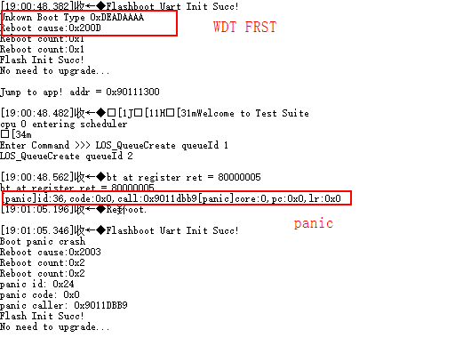

# 问题定位<a name="ZH-CN_TOPIC_0000001959437761"></a>


## 外设问题定位方法<a name="ZH-CN_TOPIC_0000001959517541"></a>

外设类异常，绝大部分都是初始化没有完成导致的异常。

外设初始化主要由以下步骤：

1.  上电、开时钟。
2.  配置管脚模式。
3.  注册hal层回调函数。
4.  注册回调。
5.  初始化寄存器配置。

排查思路：

-   首先确认时钟/电源是否打开，当前默认大部分驱动时钟都是关闭的，使用前，查看XXX驱动初始化代码中，CONFIG\_XXX\_SUPPORT\_LPC宏是否打开，如果没有打开，访问XXX驱动相关的寄存器会立刻挂死。
-   查看uapi\_xxx\_init返回值，确认初始化是否完成。
-   软件流程排查（请参见《BS2XV100 设备驱动开发指南》）。
-   排查硬件：上电是否正常，外围电流是否正常，同样的软件在不同硬件上烧录，查看结果是否一致。
-   其他外设问题，查到外设说明。

## 死机问题定位方法<a name="ZH-CN_TOPIC_0000001932198982"></a>

**图 1**  定位步骤<a name="fig696517441388"></a>  
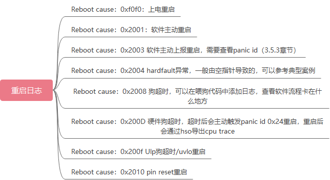

## 低功耗问题定位方法<a name="ZH-CN_TOPIC_0000001932358370"></a>


### 管脚漏电排查<a name="ZH-CN_TOPIC_0000001959437765"></a>

睡眠状态下，芯片功耗不达标，需要用户按照如下流程排查IO漏电：

1.  对于板级电路IO管脚：
    -   若管脚有外接上拉电阻，该管脚需配置为浮空。
    -   管脚有外接下拉电阻，该管脚可配置为下拉。
    -   其余情况，该管脚配置为下拉。

2.  对于接入外部设备的管脚：
    -   请查阅该外设手册，若外设内部带上拉/下拉电阻，根据上述说明进行配置。
    -   其他问题可以参考《BS2XV100 低功耗FAQ》。

## OSAL接口维测方法<a name="ZH-CN_TOPIC_0000001959517545"></a>

BS2X SDK提供了OSAL接口帮助用户使用RTOS，用户在使用接口前请参见《BS2XV100 SDK 开发指南》，避免出现接口使用错误，客户在使用OSAL接口开发时，可以通过判断OSAL接口返回值或者打印OSAL接口返回值进行维测。OSAL接口错误码请参考《BS2XV100 SDK 开发指南》。

## 内存维测功能<a name="ZH-CN_TOPIC_0000001932198986"></a>

内存的维测在任何一个系统中都是重要的维测手段，比如：想知道系统中，当前内存的分配和占用情况；想知道各个task的栈占用情况；想知道某个task内存分配具体分配情况。这些内存信息对于内存优化、以及内存定位（比如内存泄露）至关重要。

本文描述如何在B2X系列上如何进行内存维测，包括：

-   查看系统heap内存总体分配和使用情况。
-   查看每个task的malloc情况（当前分配和峰值分配）。
-   查看每个task的栈分配和使用情况；（当前使用和峰值使用）。
-   查看每个内存在哪里分配。

    AIOT的内存维测命令已经集成到AT命令中，用户可以直接使用这些命令。


### 查看系统heap总体信息<a name="ZH-CN_TOPIC_0000001932358374"></a>

该维测功能，用来查看系统中heap内存使用看情况；

查看系统heap信息命令：AT+HEAPSTAT


### 查看task栈使用情况<a name="ZH-CN_TOPIC_0000001959437769"></a>

该维测功能，用来查看各个Task的栈的分配使用使用情况；

可以通过该命令，来优化调整stack的分配大小，节约内存；

查看任务栈使用情况：AT+TASKSTACK

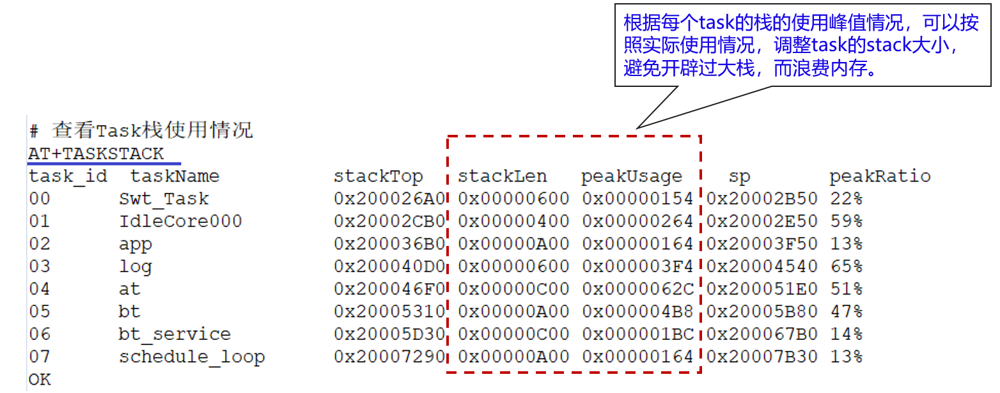

### 查看每个task的内存分配情况<a name="ZH-CN_TOPIC_0000001959517549"></a>

查看某个task的malloc情况：AT+TASKMALLOC=“任务id”；

这里的“任务id”，可以通过“AT+HEAPSTAT”或“AT+TASKSTACK”命令获取。

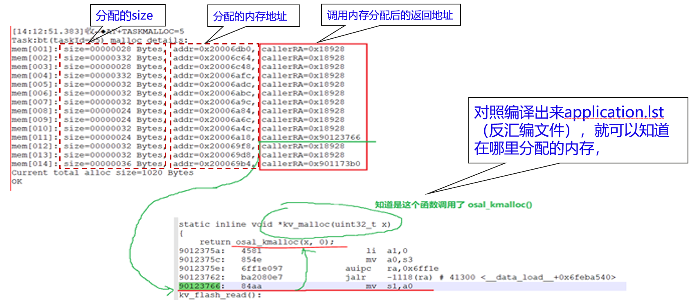

### 查看中断中、启动阶段的内存分配情况<a name="ZH-CN_TOPIC_0000001932198990"></a>

系统中，除了task中分配内存外，还有中断中分配的内存、系统启动阶段的分配的内存，这些地方分配的地方没有对应的task，因此通过归类到一个特殊id中；

可以通过“AT+HEAPSTAT” 命令，获取non-task alloc对应的id；

查看非任务中内存分配情况的命令，也是：AT+TASKMALLOC=“id”，显示格式也是一样；


### 内存维测开关<a name="ZH-CN_TOPIC_0000001932358378"></a>

由于内存维测需要消耗一定内存空间，默认情况下是关闭的；因此需要手动打开；

以BS21E为例，开启内存维测功能需要打开下面两个宏：打开“kernel\\liteos\\liteos\_v208.6.0\_b017\\Huawei\_LiteOS\\tools\\build\\config\\bs21e.config”，将

```
# LOSCFG_MEM_TASK_STAT is not set
# LOSCFG_MEM_DFX_SHOW_CALLER_RA is not set
```

改成：

```
LOSCFG_MEM_TASK_STAT=y
LOSCFG_MEM_DFX_SHOW_CALLER_RA=y”
```

**注意事项**

> **说明：** 
>-   必须要找对项目对应的config文件。
>-   LOSCFG\_MEM\_DFX\_SHOW\_CALLER\_RA用来查看在哪里调用了内存分配的函数，该宏打开会占用一定内存空间；如果只是进行内存统计，可以不打开。
>-   功能开启后需要对SDK进行全量编译；否则可能会有不生效的情况。

## OS及中断维测<a name="ZH-CN_TOPIC_0000001945717598"></a>


### 维测原理<a name="ZH-CN_TOPIC_0000001972716697"></a>

使用LiteOs提供的OSCFG\_HWI\_PRE\_POST\_PROCESS和LOSCFG\_BASE\_CORE\_TSK\_MONITOR（liteos menuconfig中默认开启）特性，记录中断和任务调用轨迹。该功能默认不开启，用户使用的时候，需要手动开启OS\_DFX\_SUPPORT和USER\_PRINT\_OS\_DFX两个宏。

注意：

1.  开启该功能，可能会导致部分任务栈空间增加，导致死机（参考“[案例一 栈溢出](案例一-栈溢出.md)”），需要调整对应任务栈大小。
2.  开启该功能，会导致无法中断频繁打印，不需要观测的中断，可以手动关闭。参考下图，关闭不需要观测的中断。

    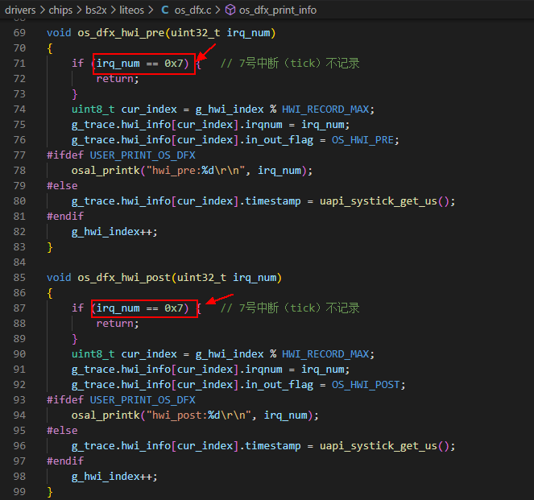

3.  该功能，可能会造成一些性能问题，定位狗超时问题时，可以临时打开该功能。

### 维侧日志解析<a name="ZH-CN_TOPIC_0000001972836441"></a>

1.  中断维测：

    下面的维测表示进入75号中断处理函数（hwi\_pre表示）；75号中断处理期间，又被66号中断打断（支持中断嵌套，66优先级更高），66号中断连续处理两次后，75号中断无法退出，大概率是中断栈爆了，需要修改中断栈大小。参考下图：

    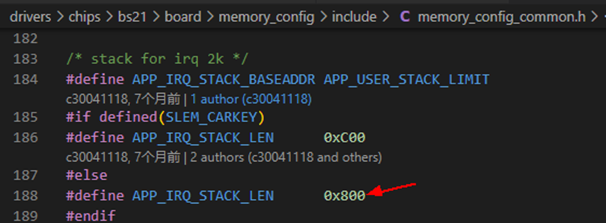

    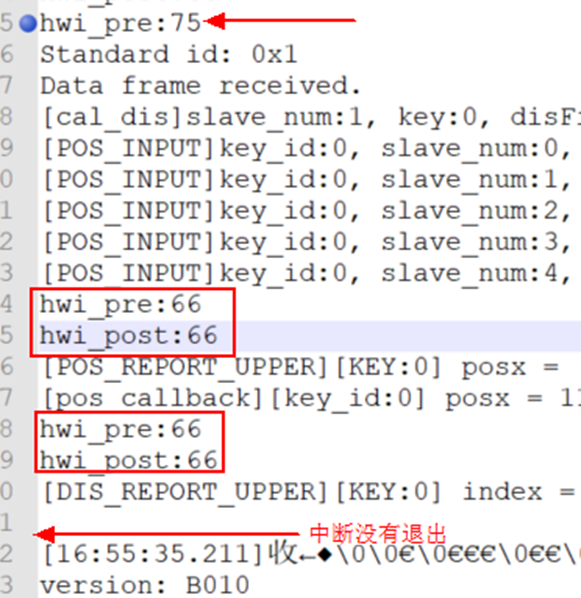

2.  任务调度维测：

    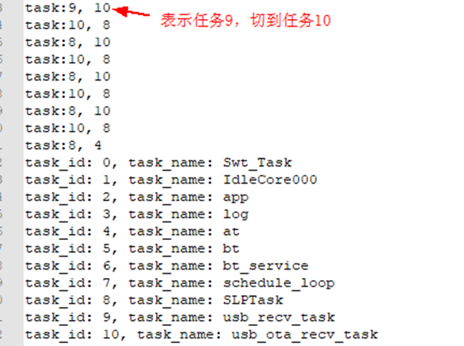

## 锁中断时间与中断时间维测<a name="ZH-CN_TOPIC_0000001945558290"></a>


### 维测原理<a name="ZH-CN_TOPIC_0000001972716701"></a>

使用osal提供的锁中断时间和中断时间维测特性，记录锁中断时间和中断时间。该功能默认不开启，用户使用的时候，需要手动添加osal\_adapt组件和开启OSAL\_IRQ\_RECORD\_DEBUG这个宏。通过osal\_irq\_record\_flag\_set函数参数设置1统计锁中断时间，参数设置2统计中断时间。

注意：

1.  开启该功能，可能会导致部分任务栈空间增加，导致死机（参考“[案例一 栈溢出](案例一-栈溢出.md)”），需要调整对应任务栈大小。
2.  开启该功能，不需要观测的中断，可以手动关闭。参考下图，关闭不需要观测的中断。

    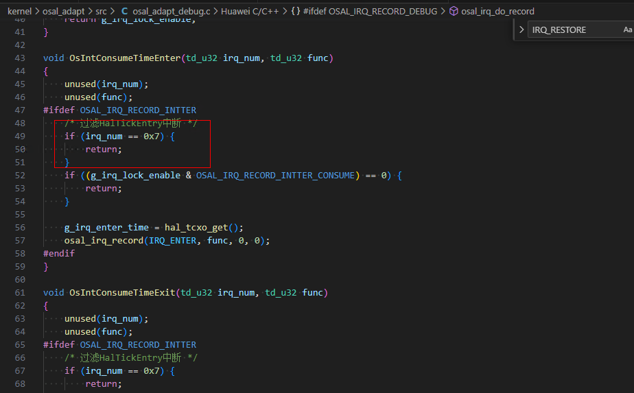

3.  在app\_os\_init中使用维测时间打印函数，将记录的时间打印出来。

    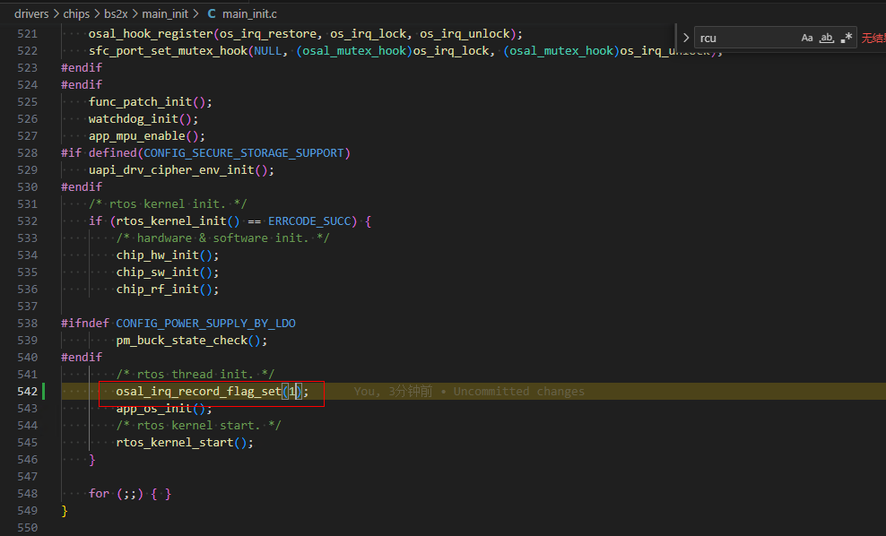

    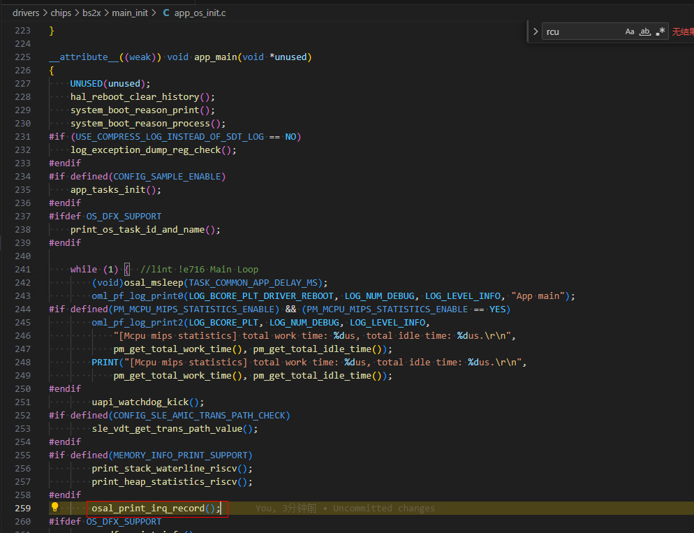

### 维测日志解析<a name="ZH-CN_TOPIC_0000001972836445"></a>

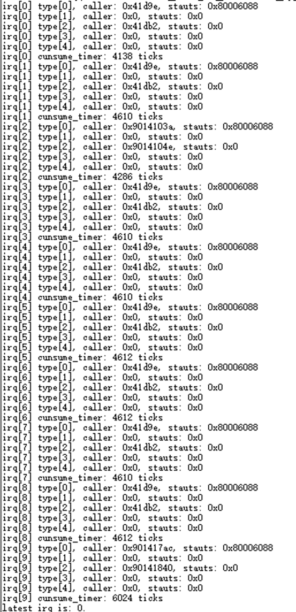

## 查询系统CPU占用率维测功能<a name="ZH-CN_TOPIC_0000001983447369"></a>

CPU占用率的统计是分析系统负载的重要的维测手段，比如：通过CPU占用率判断当前系统负载是否超出设计规格；通过系统中各个任务的CPU占用率，判断各个任务的CPU占用率是否符合设计的预期。


### 查看各个任务和中断的CPU占用情况<a name="ZH-CN_TOPIC_0000001951327926"></a>

可以通过该命令，查看各个Task和中断的CPU占用率情况：AT+CPUP


> **说明：** 
>-   CPU占用率是以百分比显示。
>-   CPU占用率的计算方法：任务\(或者中断\)运行总时间/系统运行总时间.
>-   CPUP列显示系统启动至今总的CPU占用率。
>-   CPUP 10.0s列显示系统最近10s的CPU占用率。
>-   CPUP 1.0s列显示系统最近1s的CPU占用率。

### 维测开关<a name="ZH-CN_TOPIC_0000001983287497"></a>

CPU占用率统计对性能有影响，一般只在开发阶段时需要了解各个任务的占用率，因此默认情况该功能是关闭的；如果要使用该功能需要手动打开。

以BS21E为例，打开“kernel\\liteos\\liteos\_v208.6.0\_b017\\Huawei\_LiteOS\\tools\\build\\config\\bs21e.config”，CPUP维测功能需要打开下面宏:

```
LOSCFG_KERNEL_EXTKERNEL=y
LOSCFG_KERNEL_CPUP=y
LOSCFG_CPUP_INCLUDE_IRQ=y
LOSCFG_CPUP_SAMPLE_PERIOD=1000
LOSCFG_CPUP_HISTORY_RECORD_NUM=10
LOSCFG_DEBUG_VERSION=y
LOSCFG_DEBUG_KERNEL=y
LOSCFG_DEBUG_TASK=y
LOSCFG_DEBUG_HWI=y
```

**注意事项**

> **说明：** 
>-   必须要找对项目对应的config文件。
>-   功能开启后需要对SDK进行全量编译；否则可能会有不生效的情况。
>-   关闭配置项LOSCFG\_CPUP\_INCLUDE\_IRQ后，系统中的中断耗时会被统计到中断发生的任务中，即被中断打断的任务中。

# 典型案例<a name="ZH-CN_TOPIC_0000001959437773"></a>


## 案例一 栈溢出<a name="ZH-CN_TOPIC_0000001959517553"></a>

**栈溢出<a name="section11963144154817"></a>**

死机现场如下：

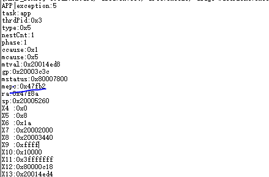

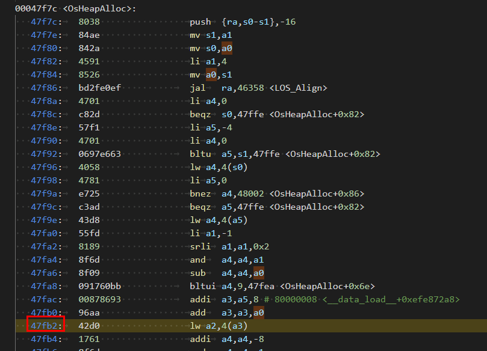

死在OsHeapAlloc，那么可在下图位置加日志，在死机时把栈统计打出来：

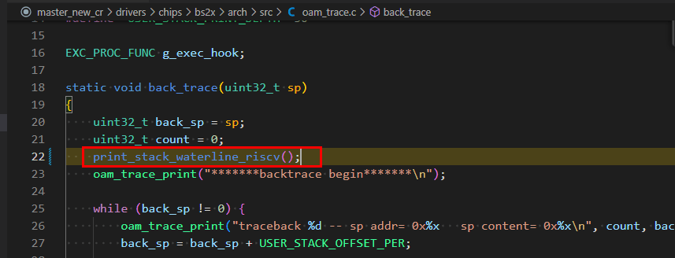

打印结果如下：

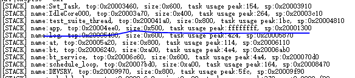

可以得出app栈爆结论，需要加大线程栈大小。

## 案例二 通过MEPC分析<a name="ZH-CN_TOPIC_0000001932198994"></a>

**根据mepc分析死机<a name="section264151694919"></a>**

死机现场如下：

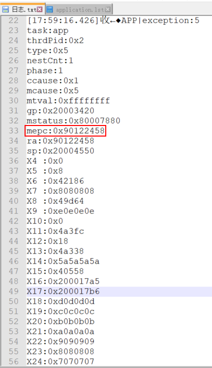

**问题分析<a name="section967022310497"></a>**

1.  挂死在“app”中，且可以看到mepc为0x90122458，mtval为：0xffffffff。
2.  在lst中找到mepc所对应的汇编代码。

    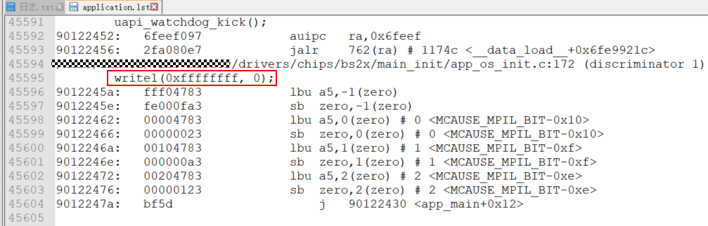

3.  确认是软件操作非法地址writel\(0xffffffff, 0\)导致的死机。

## 案例三 通过RA分析<a name="ZH-CN_TOPIC_0000001932358382"></a>

**PC异常，根据RA分析死机<a name="section1157716329499"></a>**

死机现场如下：

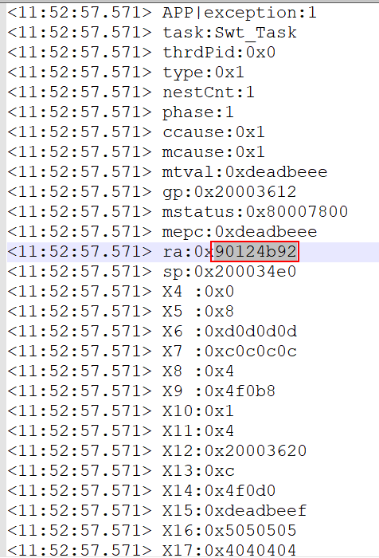

**问题分析<a name="section17931546104920"></a>**

1.  挂死在“Swt\_Task”中，且pc非法，只能看到ra。
2.  根据lst文件，发现在跳转“g\_hal\_funcs-\>set\_group”的异常。

    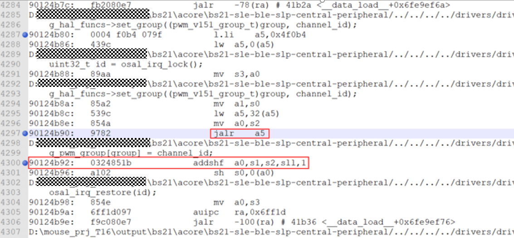

3.  怀疑是g\_hal\_funcs-\>set\_group为空导致的，继续查看lst文件中，pwm初始化代码。发现只有ir中有调用，而且出现问题的时候，没有执行红外学习。

    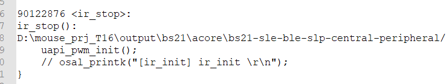

4.  找客户确认，客户的确把pwm初始化代码删掉。添加初始化代码后，问题解决。

**问题拓展<a name="section1767759508"></a>**

1.  如果客户判断一下uapi\_pwm\_open返回值，就能快速发现这个问题。

    软件代码可以增加判断，异常不让系统挂死。

    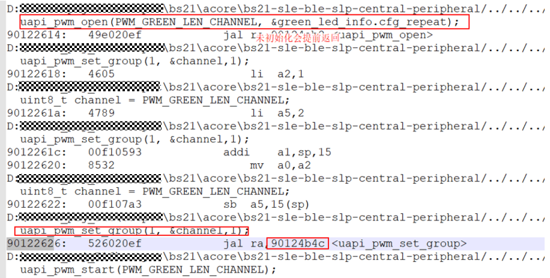

2.  为什么挂死的时候，pc会变成deadbeee？

    注意：芯片把0x0\~0x10000初始化为0xDEADBEEF，mepc的bit0 硬控为0

    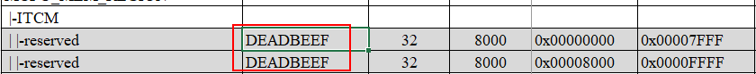

    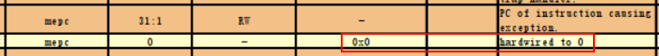

    -   分析：汇编代码g\_hal\_funcs

    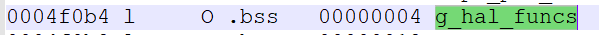

    g\_hal\_funcs是bss段，初始化为0，没有赋值的时候g\_hal\_funcs里面的值是0

    -   汇编流程

    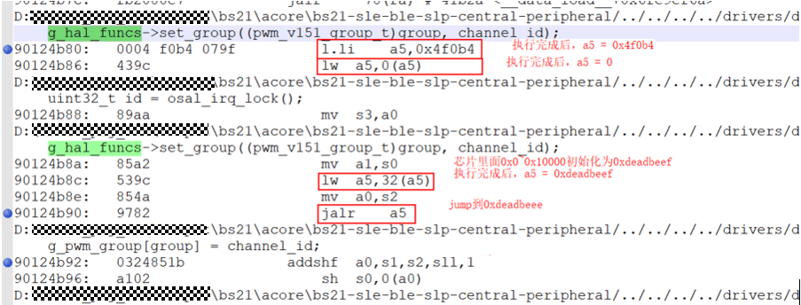

## 案例四 访问死机<a name="ZH-CN_TOPIC_0000001959437777"></a>

软件执行过程中因为代码逻辑或者内存踩踏等问题，常常造成部分数据变成空地址或者其他非法地址，访问时出现死机。本案例通过实例分析，结合BS2X提供的死机维测方式分析定位空指针执行。如图执行空指针造成的死机log：


首先参考[普通打印口维测信息获取](_普通打印口维测信息获取.md#_普通打印口维测信息获取)章节分析死机现场，当前mcause为1，参考分析mcause对照表，死机原因是指令访问错误，同时mepc、ra均被设置为难以通过application.lst或者application.asm汇编文件直接追溯的地址值，对于此类问题，通常使用CPU Trace工具解析串口Trace，分析死机前执行流程，使用工具解析串口Trace，进入异常前，最后一个执行的函数为plt\_at\_dumptest：

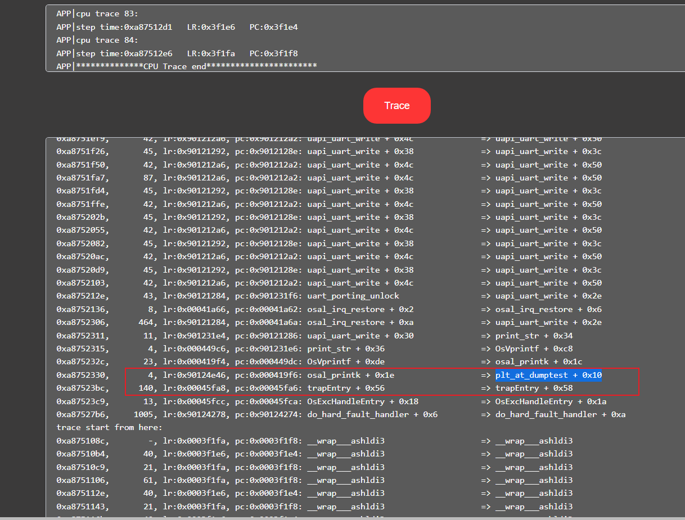

通过application.lst文件查找plt\_at\_dumptest函数偏移0x10位置，此处进行了空指针访问操作，造成挂死。

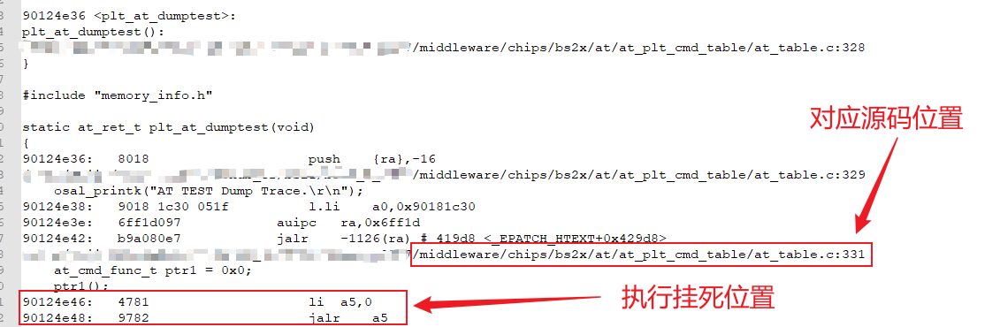

**总结：对于mcause为0x0、0x1、0x2等类型的指令访问挂死，在死机现场的寄存器难以追溯异常位置时，使用串口Trace解析工具解析Trace，结合application.lst文件追溯死机流程。**

## 案例五 内存Malloc失败<a name="ZH-CN_TOPIC_0000001959517557"></a>

代码执行过程中如果出现panic内存不足以及malloc失败，可以借助当前的内存维测接口进行维测：


参考“[内存维测开关](内存维测开关.md)”章节，打开内存维测开关，打开之后进入panic时就会打印内存使用信息，如下图在打开内存维测之后，内存申请不足时，维测信息内会打印各个线程内存使用信息，以及死机时各个线程的内存信息。

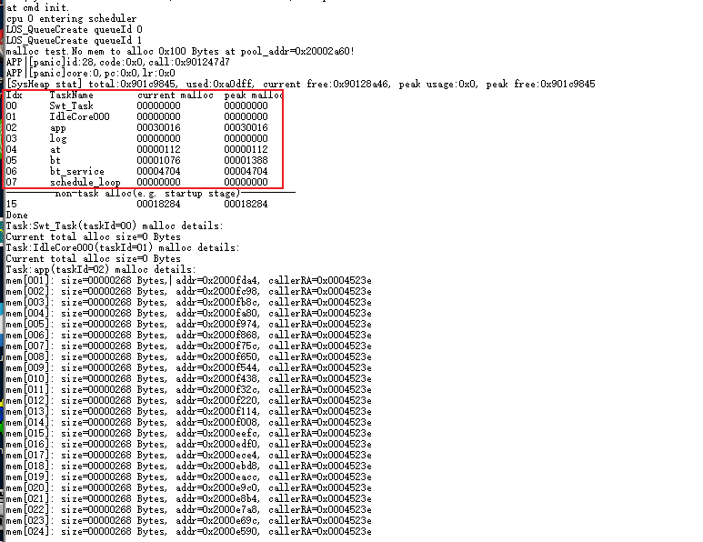

参考下图，app线程peak峰值异常，根据内存详细使用信息，可以看到0x4523e地址频繁申请内存。

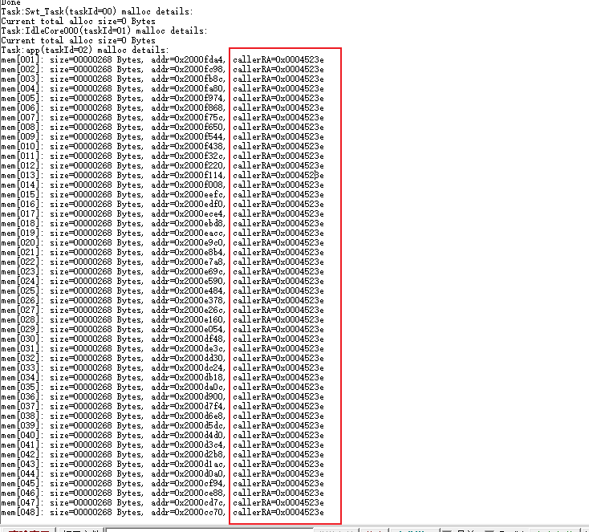

结合lst文件观察调用位置，可以看到异常调用函数异常申请，没有释放。

# 常见问题FAQ<a name="ZH-CN_TOPIC_0000001932375632"></a>


## 异常信息查看<a name="ZH-CN_TOPIC_0000001959659841"></a>


### 异常信息汇总<a name="ZH-CN_TOPIC_0000001932421106"></a>

**表 1**  异常信息描述

<a name="table18567165914116"></a>
<table><thead align="left"><tr id="row258225911118"><th class="cellrowborder" align="left" valign="top" width="17.5%" id="mcps1.2.3.1.1"><p id="p6582759819"><a name="p6582759819"></a><a name="p6582759819"></a>成员</p>
</th>
<th class="cellrowborder" align="left" valign="top" width="82.5%" id="mcps1.2.3.1.2"><p id="p558219591118"><a name="p558219591118"></a><a name="p558219591118"></a>描述</p>
</th>
</tr>
</thead>
<tbody><tr id="row1058210597111"><td class="cellrowborder" align="left" valign="top" width="17.5%" headers="mcps1.2.3.1.1 "><p id="p0582759512"><a name="p0582759512"></a><a name="p0582759512"></a>task</p>
</td>
<td class="cellrowborder" align="left" valign="top" width="82.5%" headers="mcps1.2.3.1.2 "><p id="p16582115918112"><a name="p16582115918112"></a><a name="p16582115918112"></a>死机的任务名称。</p>
</td>
</tr>
<tr id="row125820591610"><td class="cellrowborder" align="left" valign="top" width="17.5%" headers="mcps1.2.3.1.1 "><p id="p3582155910111"><a name="p3582155910111"></a><a name="p3582155910111"></a>thrdPid</p>
</td>
<td class="cellrowborder" align="left" valign="top" width="82.5%" headers="mcps1.2.3.1.2 "><p id="p185828591014"><a name="p185828591014"></a><a name="p185828591014"></a>死机的任务ID。</p>
</td>
</tr>
<tr id="row358215591612"><td class="cellrowborder" align="left" valign="top" width="17.5%" headers="mcps1.2.3.1.1 "><p id="p1658285912119"><a name="p1658285912119"></a><a name="p1658285912119"></a>type</p>
</td>
<td class="cellrowborder" align="left" valign="top" width="82.5%" headers="mcps1.2.3.1.2 "><p id="p1258217591816"><a name="p1258217591816"></a><a name="p1258217591816"></a>死机类型。</p>
</td>
</tr>
</tbody>
</table>

### CPU寄存器信息<a name="ZH-CN_TOPIC_0000001959579629"></a>

**表 1**  死机相关CPU寄存器描述

<a name="table1962201118214"></a>
<table><thead align="left"><tr id="row12791211328"><th class="cellrowborder" align="left" valign="top" width="14.57%" id="mcps1.2.3.1.1"><p id="p5791011427"><a name="p5791011427"></a><a name="p5791011427"></a>成员</p>
</th>
<th class="cellrowborder" align="left" valign="top" width="85.42999999999999%" id="mcps1.2.3.1.2"><p id="p1779171111213"><a name="p1779171111213"></a><a name="p1779171111213"></a>描述</p>
</th>
</tr>
</thead>
<tbody><tr id="row7792112021"><td class="cellrowborder" align="left" valign="top" width="14.57%" headers="mcps1.2.3.1.1 "><p id="p117921110213"><a name="p117921110213"></a><a name="p117921110213"></a>mepc</p>
</td>
<td class="cellrowborder" align="left" valign="top" width="85.42999999999999%" headers="mcps1.2.3.1.2 "><p id="p779201113215"><a name="p779201113215"></a><a name="p779201113215"></a>机器异常程序计数器。当发生异常时，mepc指向导致异常的指令；对于中断，mepc指向中断处理后应该恢复的位置。</p>
</td>
</tr>
<tr id="row14795115214"><td class="cellrowborder" align="left" valign="top" width="14.57%" headers="mcps1.2.3.1.1 "><p id="p197913119214"><a name="p197913119214"></a><a name="p197913119214"></a>mstatus</p>
</td>
<td class="cellrowborder" align="left" valign="top" width="85.42999999999999%" headers="mcps1.2.3.1.2 "><p id="p1279201111211"><a name="p1279201111211"></a><a name="p1279201111211"></a>机器状态寄存器。</p>
</td>
</tr>
<tr id="row10791111228"><td class="cellrowborder" align="left" valign="top" width="14.57%" headers="mcps1.2.3.1.1 "><p id="p167931110220"><a name="p167931110220"></a><a name="p167931110220"></a>mtval</p>
</td>
<td class="cellrowborder" align="left" valign="top" width="85.42999999999999%" headers="mcps1.2.3.1.2 "><p id="p9792112214"><a name="p9792112214"></a><a name="p9792112214"></a>机器陷入寄存器。保存地址异常中出错的地址或者发生指令异常的指令本身，对于其他错误，其值为零。</p>
</td>
</tr>
<tr id="row5795111026"><td class="cellrowborder" align="left" valign="top" width="14.57%" headers="mcps1.2.3.1.1 "><p id="p1379611526"><a name="p1379611526"></a><a name="p1379611526"></a>mcause</p>
</td>
<td class="cellrowborder" align="left" valign="top" width="85.42999999999999%" headers="mcps1.2.3.1.2 "><p id="p079151110214"><a name="p079151110214"></a><a name="p079151110214"></a>机器异常寄存器。保存目前异常或者中断的原因，通过查询表 mcause&amp;ccause异常描述表得到目前异常或者中断的类型。</p>
</td>
</tr>
<tr id="row1779121115210"><td class="cellrowborder" align="left" valign="top" width="14.57%" headers="mcps1.2.3.1.1 "><p id="p147921120212"><a name="p147921120212"></a><a name="p147921120212"></a>ccause</p>
</td>
<td class="cellrowborder" align="left" valign="top" width="85.42999999999999%" headers="mcps1.2.3.1.2 "><p id="p97915111825"><a name="p97915111825"></a><a name="p97915111825"></a>与mcause类似，ccause为mcause的补充说明，对于某些异常通过读取ccause寄存器的内容可以进一步明确异常类型。</p>
</td>
</tr>
<tr id="row20799118219"><td class="cellrowborder" align="left" valign="top" width="14.57%" headers="mcps1.2.3.1.1 "><p id="p679611022"><a name="p679611022"></a><a name="p679611022"></a>ra</p>
</td>
<td class="cellrowborder" align="left" valign="top" width="85.42999999999999%" headers="mcps1.2.3.1.2 "><p id="p5791211528"><a name="p5791211528"></a><a name="p5791211528"></a>返回地址。</p>
</td>
</tr>
</tbody>
</table>

**表 2**  mcause&ccause异常描述表

<a name="table104371519523"></a>
<table><thead align="left"><tr id="row8462919626"><th class="cellrowborder" align="left" valign="top" width="14.771477147714771%" id="mcps1.2.4.1.1"><p id="p84629198217"><a name="p84629198217"></a><a name="p84629198217"></a>异常码</p>
</th>
<th class="cellrowborder" align="left" valign="top" width="37.24372437243724%" id="mcps1.2.4.1.2"><p id="p9462161912215"><a name="p9462161912215"></a><a name="p9462161912215"></a>mcause异常描述</p>
</th>
<th class="cellrowborder" align="left" valign="top" width="47.98479847984798%" id="mcps1.2.4.1.3"><p id="p24621219925"><a name="p24621219925"></a><a name="p24621219925"></a>ccause异常描述</p>
</th>
</tr>
</thead>
<tbody><tr id="row746271911214"><td class="cellrowborder" align="left" valign="top" width="14.771477147714771%" headers="mcps1.2.4.1.1 "><p id="p24623191223"><a name="p24623191223"></a><a name="p24623191223"></a>0x0</p>
</td>
<td class="cellrowborder" align="left" valign="top" width="37.24372437243724%" headers="mcps1.2.4.1.2 "><p id="p11462121912213"><a name="p11462121912213"></a><a name="p11462121912213"></a>Instruction address misaligned</p>
</td>
<td class="cellrowborder" align="left" valign="top" width="47.98479847984798%" headers="mcps1.2.4.1.3 "><p id="p8462131917219"><a name="p8462131917219"></a><a name="p8462131917219"></a>Not available</p>
</td>
</tr>
<tr id="row1346216191929"><td class="cellrowborder" align="left" valign="top" width="14.771477147714771%" headers="mcps1.2.4.1.1 "><p id="p17462019125"><a name="p17462019125"></a><a name="p17462019125"></a>0x1</p>
</td>
<td class="cellrowborder" align="left" valign="top" width="37.24372437243724%" headers="mcps1.2.4.1.2 "><p id="p1546221917217"><a name="p1546221917217"></a><a name="p1546221917217"></a>Instruction access fault</p>
</td>
<td class="cellrowborder" align="left" valign="top" width="47.98479847984798%" headers="mcps1.2.4.1.3 "><p id="p146361911211"><a name="p146361911211"></a><a name="p146361911211"></a>Memory map region access fault</p>
</td>
</tr>
<tr id="row1146319191029"><td class="cellrowborder" align="left" valign="top" width="14.771477147714771%" headers="mcps1.2.4.1.1 "><p id="p114638191722"><a name="p114638191722"></a><a name="p114638191722"></a>0x2</p>
</td>
<td class="cellrowborder" align="left" valign="top" width="37.24372437243724%" headers="mcps1.2.4.1.2 "><p id="p3463181912217"><a name="p3463181912217"></a><a name="p3463181912217"></a>Illegal instruction</p>
</td>
<td class="cellrowborder" align="left" valign="top" width="47.98479847984798%" headers="mcps1.2.4.1.3 "><p id="p144631191621"><a name="p144631191621"></a><a name="p144631191621"></a>AXIM error response</p>
</td>
</tr>
<tr id="row646319196218"><td class="cellrowborder" align="left" valign="top" width="14.771477147714771%" headers="mcps1.2.4.1.1 "><p id="p1446319191728"><a name="p1446319191728"></a><a name="p1446319191728"></a>0x3</p>
</td>
<td class="cellrowborder" align="left" valign="top" width="37.24372437243724%" headers="mcps1.2.4.1.2 "><p id="p144631119029"><a name="p144631119029"></a><a name="p144631119029"></a>Breakpoint</p>
</td>
<td class="cellrowborder" align="left" valign="top" width="47.98479847984798%" headers="mcps1.2.4.1.3 "><p id="p10463719827"><a name="p10463719827"></a><a name="p10463719827"></a>AHBM error response</p>
</td>
</tr>
<tr id="row3463519323"><td class="cellrowborder" align="left" valign="top" width="14.771477147714771%" headers="mcps1.2.4.1.1 "><p id="p646361920220"><a name="p646361920220"></a><a name="p646361920220"></a>0x4</p>
</td>
<td class="cellrowborder" align="left" valign="top" width="37.24372437243724%" headers="mcps1.2.4.1.2 "><p id="p1846361914219"><a name="p1846361914219"></a><a name="p1846361914219"></a>Load address misaligned</p>
</td>
<td class="cellrowborder" align="left" valign="top" width="47.98479847984798%" headers="mcps1.2.4.1.3 "><p id="p446310190213"><a name="p446310190213"></a><a name="p446310190213"></a>Crossing PMP entries</p>
</td>
</tr>
<tr id="row246381918210"><td class="cellrowborder" align="left" valign="top" width="14.771477147714771%" headers="mcps1.2.4.1.1 "><p id="p1946315199214"><a name="p1946315199214"></a><a name="p1946315199214"></a>0x5</p>
</td>
<td class="cellrowborder" align="left" valign="top" width="37.24372437243724%" headers="mcps1.2.4.1.2 "><p id="p74637195213"><a name="p74637195213"></a><a name="p74637195213"></a>Load access fault</p>
</td>
<td class="cellrowborder" align="left" valign="top" width="47.98479847984798%" headers="mcps1.2.4.1.3 "><p id="p204634193210"><a name="p204634193210"></a><a name="p204634193210"></a>System register access fault</p>
</td>
</tr>
<tr id="row1246311190217"><td class="cellrowborder" align="left" valign="top" width="14.771477147714771%" headers="mcps1.2.4.1.1 "><p id="p146316191820"><a name="p146316191820"></a><a name="p146316191820"></a>0x6</p>
</td>
<td class="cellrowborder" align="left" valign="top" width="37.24372437243724%" headers="mcps1.2.4.1.2 "><p id="p34633192022"><a name="p34633192022"></a><a name="p34633192022"></a>Store/AMO address misaligned</p>
</td>
<td class="cellrowborder" align="left" valign="top" width="47.98479847984798%" headers="mcps1.2.4.1.3 "><p id="p44631719624"><a name="p44631719624"></a><a name="p44631719624"></a>No PMP entry matched</p>
</td>
</tr>
<tr id="row246311917218"><td class="cellrowborder" align="left" valign="top" width="14.771477147714771%" headers="mcps1.2.4.1.1 "><p id="p13463919722"><a name="p13463919722"></a><a name="p13463919722"></a>0x7</p>
</td>
<td class="cellrowborder" align="left" valign="top" width="37.24372437243724%" headers="mcps1.2.4.1.2 "><p id="p104635193217"><a name="p104635193217"></a><a name="p104635193217"></a>Store/AMO access fault</p>
</td>
<td class="cellrowborder" align="left" valign="top" width="47.98479847984798%" headers="mcps1.2.4.1.3 "><p id="p84630191726"><a name="p84630191726"></a><a name="p84630191726"></a>PMP access fault</p>
</td>
</tr>
<tr id="row144631019626"><td class="cellrowborder" align="left" valign="top" width="14.771477147714771%" headers="mcps1.2.4.1.1 "><p id="p2463101914219"><a name="p2463101914219"></a><a name="p2463101914219"></a>0x8</p>
</td>
<td class="cellrowborder" align="left" valign="top" width="37.24372437243724%" headers="mcps1.2.4.1.2 "><p id="p114637194213"><a name="p114637194213"></a><a name="p114637194213"></a>Environment call from U-mode</p>
</td>
<td class="cellrowborder" align="left" valign="top" width="47.98479847984798%" headers="mcps1.2.4.1.3 "><p id="p846321919217"><a name="p846321919217"></a><a name="p846321919217"></a>CMO access fault</p>
</td>
</tr>
<tr id="row84638197213"><td class="cellrowborder" align="left" valign="top" width="14.771477147714771%" headers="mcps1.2.4.1.1 "><p id="p1346318191224"><a name="p1346318191224"></a><a name="p1346318191224"></a>0x9</p>
</td>
<td class="cellrowborder" align="left" valign="top" width="37.24372437243724%" headers="mcps1.2.4.1.2 "><p id="p8463319628"><a name="p8463319628"></a><a name="p8463319628"></a>Environment call from S-mode</p>
</td>
<td class="cellrowborder" align="left" valign="top" width="47.98479847984798%" headers="mcps1.2.4.1.3 "><p id="p7463181916219"><a name="p7463181916219"></a><a name="p7463181916219"></a>CSR access fault</p>
</td>
</tr>
<tr id="row1046341913212"><td class="cellrowborder" align="left" valign="top" width="14.771477147714771%" headers="mcps1.2.4.1.1 "><p id="p1946316194210"><a name="p1946316194210"></a><a name="p1946316194210"></a>0xa</p>
</td>
<td class="cellrowborder" align="left" valign="top" width="37.24372437243724%" headers="mcps1.2.4.1.2 "><p id="p1246316191218"><a name="p1246316191218"></a><a name="p1246316191218"></a>Reserved</p>
</td>
<td class="cellrowborder" align="left" valign="top" width="47.98479847984798%" headers="mcps1.2.4.1.3 "><p id="p10463201920219"><a name="p10463201920219"></a><a name="p10463201920219"></a>LDM/STMIA instruction</p>
</td>
</tr>
<tr id="row1346316194211"><td class="cellrowborder" align="left" valign="top" width="14.771477147714771%" headers="mcps1.2.4.1.1 "><p id="p1646391914215"><a name="p1646391914215"></a><a name="p1646391914215"></a>0xb</p>
</td>
<td class="cellrowborder" align="left" valign="top" width="37.24372437243724%" headers="mcps1.2.4.1.2 "><p id="p346312198219"><a name="p346312198219"></a><a name="p346312198219"></a>Environment call from M-mode</p>
</td>
<td class="cellrowborder" align="left" valign="top" width="47.98479847984798%" headers="mcps1.2.4.1.3 "><p id="p1146311913213"><a name="p1146311913213"></a><a name="p1146311913213"></a>ITCM write access fault</p>
</td>
</tr>
<tr id="row246310190210"><td class="cellrowborder" align="left" valign="top" width="14.771477147714771%" headers="mcps1.2.4.1.1 "><p id="p11463119522"><a name="p11463119522"></a><a name="p11463119522"></a>0xc</p>
</td>
<td class="cellrowborder" align="left" valign="top" width="37.24372437243724%" headers="mcps1.2.4.1.2 "><p id="p846361916219"><a name="p846361916219"></a><a name="p846361916219"></a>Instruction page fault</p>
</td>
<td class="cellrowborder" align="left" valign="top" width="47.98479847984798%" headers="mcps1.2.4.1.3 "><p id="p64632192217"><a name="p64632192217"></a><a name="p64632192217"></a>Not available</p>
</td>
</tr>
<tr id="row346315191727"><td class="cellrowborder" align="left" valign="top" width="14.771477147714771%" headers="mcps1.2.4.1.1 "><p id="p204633198210"><a name="p204633198210"></a><a name="p204633198210"></a>0xd</p>
</td>
<td class="cellrowborder" align="left" valign="top" width="37.24372437243724%" headers="mcps1.2.4.1.2 "><p id="p1546319191529"><a name="p1546319191529"></a><a name="p1546319191529"></a>Load page fault</p>
</td>
<td class="cellrowborder" align="left" valign="top" width="47.98479847984798%" headers="mcps1.2.4.1.3 "><p id="p146313191525"><a name="p146313191525"></a><a name="p146313191525"></a>Not available</p>
</td>
</tr>
<tr id="row74631519124"><td class="cellrowborder" align="left" valign="top" width="14.771477147714771%" headers="mcps1.2.4.1.1 "><p id="p846316191724"><a name="p846316191724"></a><a name="p846316191724"></a>0xe</p>
</td>
<td class="cellrowborder" align="left" valign="top" width="37.24372437243724%" headers="mcps1.2.4.1.2 "><p id="p10463151916213"><a name="p10463151916213"></a><a name="p10463151916213"></a>Reserved</p>
</td>
<td class="cellrowborder" align="left" valign="top" width="47.98479847984798%" headers="mcps1.2.4.1.3 "><p id="p1346416192220"><a name="p1346416192220"></a><a name="p1346416192220"></a>Not available</p>
</td>
</tr>
<tr id="row204646191429"><td class="cellrowborder" align="left" valign="top" width="14.771477147714771%" headers="mcps1.2.4.1.1 "><p id="p1346412192210"><a name="p1346412192210"></a><a name="p1346412192210"></a>0xf</p>
</td>
<td class="cellrowborder" align="left" valign="top" width="37.24372437243724%" headers="mcps1.2.4.1.2 "><p id="p16464919421"><a name="p16464919421"></a><a name="p16464919421"></a>Store/AMO page fault</p>
</td>
<td class="cellrowborder" align="left" valign="top" width="47.98479847984798%" headers="mcps1.2.4.1.3 "><p id="p15464019325"><a name="p15464019325"></a><a name="p15464019325"></a>Not available</p>
</td>
</tr>
<tr id="row946415192023"><td class="cellrowborder" align="left" valign="top" width="14.771477147714771%" headers="mcps1.2.4.1.1 "><p id="p134644191726"><a name="p134644191726"></a><a name="p134644191726"></a>＞0xf</p>
</td>
<td class="cellrowborder" align="left" valign="top" width="37.24372437243724%" headers="mcps1.2.4.1.2 "><p id="p54641619622"><a name="p54641619622"></a><a name="p54641619622"></a>Reserved</p>
</td>
<td class="cellrowborder" align="left" valign="top" width="47.98479847984798%" headers="mcps1.2.4.1.3 "><p id="p14464719127"><a name="p14464719127"></a><a name="p14464719127"></a>Not available</p>
</td>
</tr>
</tbody>
</table>

### 通用寄存器信息<a name="ZH-CN_TOPIC_0000001932580502"></a>

**表 1**  通用寄存器描述

<a name="table540153175920"></a>
<table><thead align="left"><tr id="row24493375916"><th class="cellrowborder" colspan="2" align="left" valign="top" id="mcps1.2.6.1.1"><p id="p9440204410212"><a name="p9440204410212"></a><a name="p9440204410212"></a>寄存器</p>
</th>
<th class="cellrowborder" align="left" valign="top" id="mcps1.2.6.1.2"><p id="p164501365917"><a name="p164501365917"></a><a name="p164501365917"></a>ABI 名字</p>
</th>
<th class="cellrowborder" align="left" valign="top" id="mcps1.2.6.1.3"><p id="p1745015315595"><a name="p1745015315595"></a><a name="p1745015315595"></a>保存者</p>
</th>
<th class="cellrowborder" align="left" valign="top" id="mcps1.2.6.1.4"><p id="p745083145919"><a name="p745083145919"></a><a name="p745083145919"></a>作用</p>
</th>
</tr>
</thead>
<tbody><tr id="row10450153175919"><td class="cellrowborder" rowspan="12" align="left" valign="top" width="18.01%" headers="mcps1.2.6.1.1 "><p id="p4424193015415"><a name="p4424193015415"></a><a name="p4424193015415"></a>整型通用寄存器</p>
</td>
<td class="cellrowborder" align="left" valign="top" width="12.629999999999999%" headers="mcps1.2.6.1.1 "><p id="p114501335918"><a name="p114501335918"></a><a name="p114501335918"></a>x0</p>
</td>
<td class="cellrowborder" align="left" valign="top" width="23.330000000000002%" headers="mcps1.2.6.1.2 "><p id="p845033165918"><a name="p845033165918"></a><a name="p845033165918"></a>zero</p>
</td>
<td class="cellrowborder" align="left" valign="top" width="22.91%" headers="mcps1.2.6.1.3 "><p id="p1145093125918"><a name="p1145093125918"></a><a name="p1145093125918"></a>—</p>
</td>
<td class="cellrowborder" align="left" valign="top" width="23.119999999999997%" headers="mcps1.2.6.1.4 "><p id="p15450143125913"><a name="p15450143125913"></a><a name="p15450143125913"></a>硬编码恒为0，写入数据忽略，读取永远为0</p>
</td>
</tr>
<tr id="row104509318597"><td class="cellrowborder" align="left" valign="top" headers="mcps1.2.6.1.1 "><p id="p9450437594"><a name="p9450437594"></a><a name="p9450437594"></a>x1</p>
</td>
<td class="cellrowborder" align="left" valign="top" headers="mcps1.2.6.1.1 "><p id="p845093145919"><a name="p845093145919"></a><a name="p845093145919"></a>ra</p>
</td>
<td class="cellrowborder" align="left" valign="top" headers="mcps1.2.6.1.2 "><p id="p18450339594"><a name="p18450339594"></a><a name="p18450339594"></a>Caller（调用者）</p>
</td>
<td class="cellrowborder" align="left" valign="top" headers="mcps1.2.6.1.3 "><p id="p194509318594"><a name="p194509318594"></a><a name="p194509318594"></a>函数调用的返回地址</p>
</td>
</tr>
<tr id="row545014345915"><td class="cellrowborder" align="left" valign="top" headers="mcps1.2.6.1.1 "><p id="p1345013195914"><a name="p1345013195914"></a><a name="p1345013195914"></a>x2</p>
</td>
<td class="cellrowborder" align="left" valign="top" headers="mcps1.2.6.1.1 "><p id="p84504325920"><a name="p84504325920"></a><a name="p84504325920"></a>sp</p>
</td>
<td class="cellrowborder" align="left" valign="top" headers="mcps1.2.6.1.2 "><p id="p19450173125916"><a name="p19450173125916"></a><a name="p19450173125916"></a>Callee（被调用者）</p>
</td>
<td class="cellrowborder" align="left" valign="top" headers="mcps1.2.6.1.3 "><p id="p2045015315599"><a name="p2045015315599"></a><a name="p2045015315599"></a>栈指针</p>
</td>
</tr>
<tr id="row184501632594"><td class="cellrowborder" align="left" valign="top" headers="mcps1.2.6.1.1 "><p id="p19450434591"><a name="p19450434591"></a><a name="p19450434591"></a>x3</p>
</td>
<td class="cellrowborder" align="left" valign="top" headers="mcps1.2.6.1.1 "><p id="p745017314596"><a name="p745017314596"></a><a name="p745017314596"></a>gp</p>
</td>
<td class="cellrowborder" align="left" valign="top" headers="mcps1.2.6.1.2 "><p id="p64501634593"><a name="p64501634593"></a><a name="p64501634593"></a>—</p>
</td>
<td class="cellrowborder" align="left" valign="top" headers="mcps1.2.6.1.3 "><p id="p1645013312598"><a name="p1645013312598"></a><a name="p1645013312598"></a>全局指针</p>
</td>
</tr>
<tr id="row245114335912"><td class="cellrowborder" align="left" valign="top" headers="mcps1.2.6.1.1 "><p id="p14451113195915"><a name="p14451113195915"></a><a name="p14451113195915"></a>x4</p>
</td>
<td class="cellrowborder" align="left" valign="top" headers="mcps1.2.6.1.1 "><p id="p15451338597"><a name="p15451338597"></a><a name="p15451338597"></a>tp</p>
</td>
<td class="cellrowborder" align="left" valign="top" headers="mcps1.2.6.1.2 "><p id="p54511305910"><a name="p54511305910"></a><a name="p54511305910"></a>—</p>
</td>
<td class="cellrowborder" align="left" valign="top" headers="mcps1.2.6.1.3 "><p id="p74515355911"><a name="p74515355911"></a><a name="p74515355911"></a>线程指针</p>
</td>
</tr>
<tr id="row13451193195910"><td class="cellrowborder" align="left" valign="top" headers="mcps1.2.6.1.1 "><p id="p1245117385911"><a name="p1245117385911"></a><a name="p1245117385911"></a>x5-x7</p>
</td>
<td class="cellrowborder" align="left" valign="top" headers="mcps1.2.6.1.1 "><p id="p1545110315915"><a name="p1545110315915"></a><a name="p1545110315915"></a>t0-2</p>
</td>
<td class="cellrowborder" align="left" valign="top" headers="mcps1.2.6.1.2 "><p id="p1845110316592"><a name="p1845110316592"></a><a name="p1845110316592"></a>Caller</p>
</td>
<td class="cellrowborder" align="left" valign="top" headers="mcps1.2.6.1.3 "><p id="p145118335917"><a name="p145118335917"></a><a name="p145118335917"></a>临时寄存器</p>
</td>
</tr>
<tr id="row1245112317595"><td class="cellrowborder" align="left" valign="top" headers="mcps1.2.6.1.1 "><p id="p24517395920"><a name="p24517395920"></a><a name="p24517395920"></a>x8</p>
</td>
<td class="cellrowborder" align="left" valign="top" headers="mcps1.2.6.1.1 "><p id="p84511320596"><a name="p84511320596"></a><a name="p84511320596"></a>s0/fp</p>
</td>
<td class="cellrowborder" align="left" valign="top" headers="mcps1.2.6.1.2 "><p id="p34512317594"><a name="p34512317594"></a><a name="p34512317594"></a>Callee</p>
</td>
<td class="cellrowborder" align="left" valign="top" headers="mcps1.2.6.1.3 "><p id="p645103135918"><a name="p645103135918"></a><a name="p645103135918"></a>需要保存的寄存器或者帧指针寄存器</p>
</td>
</tr>
<tr id="row154518314594"><td class="cellrowborder" align="left" valign="top" headers="mcps1.2.6.1.1 "><p id="p10452736596"><a name="p10452736596"></a><a name="p10452736596"></a>x9</p>
</td>
<td class="cellrowborder" align="left" valign="top" headers="mcps1.2.6.1.1 "><p id="p7452131594"><a name="p7452131594"></a><a name="p7452131594"></a>s1</p>
</td>
<td class="cellrowborder" align="left" valign="top" headers="mcps1.2.6.1.2 "><p id="p3452103125913"><a name="p3452103125913"></a><a name="p3452103125913"></a>Callee</p>
</td>
<td class="cellrowborder" align="left" valign="top" headers="mcps1.2.6.1.3 "><p id="p11281174818262"><a name="p11281174818262"></a><a name="p11281174818262"></a>需要保存的寄存器，保存原进程中的关键数据，避免在函数调用过程中被破坏</p>
</td>
</tr>
<tr id="row1545219305918"><td class="cellrowborder" align="left" valign="top" headers="mcps1.2.6.1.1 "><p id="p1845217305911"><a name="p1845217305911"></a><a name="p1845217305911"></a>x10~x11</p>
</td>
<td class="cellrowborder" align="left" valign="top" headers="mcps1.2.6.1.1 "><p id="p4452635593"><a name="p4452635593"></a><a name="p4452635593"></a>a0~1</p>
</td>
<td class="cellrowborder" align="left" valign="top" headers="mcps1.2.6.1.2 "><p id="p1745212312595"><a name="p1745212312595"></a><a name="p1745212312595"></a>Caller</p>
</td>
<td class="cellrowborder" align="left" valign="top" headers="mcps1.2.6.1.3 "><p id="p245217385912"><a name="p245217385912"></a><a name="p245217385912"></a>函数参数/返回值</p>
</td>
</tr>
<tr id="row34522318596"><td class="cellrowborder" align="left" valign="top" headers="mcps1.2.6.1.1 "><p id="p5452113155914"><a name="p5452113155914"></a><a name="p5452113155914"></a>x12~x17</p>
</td>
<td class="cellrowborder" align="left" valign="top" headers="mcps1.2.6.1.1 "><p id="p184524345915"><a name="p184524345915"></a><a name="p184524345915"></a>a2~7</p>
</td>
<td class="cellrowborder" align="left" valign="top" headers="mcps1.2.6.1.2 "><p id="p1745253105910"><a name="p1745253105910"></a><a name="p1745253105910"></a>Caller</p>
</td>
<td class="cellrowborder" align="left" valign="top" headers="mcps1.2.6.1.3 "><p id="p1445219365910"><a name="p1445219365910"></a><a name="p1445219365910"></a>函数参数</p>
</td>
</tr>
<tr id="row6452183155912"><td class="cellrowborder" align="left" valign="top" headers="mcps1.2.6.1.1 "><p id="p204526335914"><a name="p204526335914"></a><a name="p204526335914"></a>x18~x27</p>
</td>
<td class="cellrowborder" align="left" valign="top" headers="mcps1.2.6.1.1 "><p id="p1945217320594"><a name="p1945217320594"></a><a name="p1945217320594"></a>s2~11</p>
</td>
<td class="cellrowborder" align="left" valign="top" headers="mcps1.2.6.1.2 "><p id="p104521535598"><a name="p104521535598"></a><a name="p104521535598"></a>Callee</p>
</td>
<td class="cellrowborder" align="left" valign="top" headers="mcps1.2.6.1.3 "><p id="p24521531595"><a name="p24521531595"></a><a name="p24521531595"></a>需要保存的寄存器</p>
</td>
</tr>
<tr id="row54523311598"><td class="cellrowborder" align="left" valign="top" headers="mcps1.2.6.1.1 "><p id="p1145214385917"><a name="p1145214385917"></a><a name="p1145214385917"></a>x28~x31</p>
</td>
<td class="cellrowborder" align="left" valign="top" headers="mcps1.2.6.1.1 "><p id="p1545263165915"><a name="p1545263165915"></a><a name="p1545263165915"></a>t3~6</p>
</td>
<td class="cellrowborder" align="left" valign="top" headers="mcps1.2.6.1.2 "><p id="p174521639598"><a name="p174521639598"></a><a name="p174521639598"></a>Caller</p>
</td>
<td class="cellrowborder" align="left" valign="top" headers="mcps1.2.6.1.3 "><p id="p194527312597"><a name="p194527312597"></a><a name="p194527312597"></a>临时寄存器</p>
</td>
</tr>
<tr id="row8586194695918"><td class="cellrowborder" rowspan="6" align="left" valign="top" width="18.01%" headers="mcps1.2.6.1.1 "><p id="p1435201118517"><a name="p1435201118517"></a><a name="p1435201118517"></a>浮点型通用寄存器</p>
</td>
<td class="cellrowborder" align="left" valign="top" width="12.629999999999999%" headers="mcps1.2.6.1.1 "><p id="p358684695910"><a name="p358684695910"></a><a name="p358684695910"></a>f0~f7</p>
</td>
<td class="cellrowborder" align="left" valign="top" width="23.330000000000002%" headers="mcps1.2.6.1.2 "><p id="p145860463595"><a name="p145860463595"></a><a name="p145860463595"></a>ft0~7</p>
</td>
<td class="cellrowborder" align="left" valign="top" width="22.91%" headers="mcps1.2.6.1.3 "><p id="p9586174615591"><a name="p9586174615591"></a><a name="p9586174615591"></a>Caller</p>
</td>
<td class="cellrowborder" align="left" valign="top" width="23.119999999999997%" headers="mcps1.2.6.1.4 "><p id="p1158616467596"><a name="p1158616467596"></a><a name="p1158616467596"></a>FP临时变量</p>
</td>
</tr>
<tr id="row1557685217410"><td class="cellrowborder" align="left" valign="top" headers="mcps1.2.6.1.1 "><p id="p17576145217413"><a name="p17576145217413"></a><a name="p17576145217413"></a>f8~f9</p>
</td>
<td class="cellrowborder" align="left" valign="top" headers="mcps1.2.6.1.1 "><p id="p75761552143"><a name="p75761552143"></a><a name="p75761552143"></a>fs0~1</p>
</td>
<td class="cellrowborder" align="left" valign="top" headers="mcps1.2.6.1.2 "><p id="p1319172363319"><a name="p1319172363319"></a><a name="p1319172363319"></a>Callee</p>
</td>
<td class="cellrowborder" align="left" valign="top" headers="mcps1.2.6.1.3 "><p id="p1457620521844"><a name="p1457620521844"></a><a name="p1457620521844"></a>FP保存的寄存器</p>
</td>
</tr>
<tr id="row73640553419"><td class="cellrowborder" align="left" valign="top" headers="mcps1.2.6.1.1 "><p id="p536415551941"><a name="p536415551941"></a><a name="p536415551941"></a>f10~f11</p>
</td>
<td class="cellrowborder" align="left" valign="top" headers="mcps1.2.6.1.1 "><p id="p11364855244"><a name="p11364855244"></a><a name="p11364855244"></a>fa0~fa1</p>
</td>
<td class="cellrowborder" align="left" valign="top" headers="mcps1.2.6.1.2 "><p id="p536417555416"><a name="p536417555416"></a><a name="p536417555416"></a>Caller</p>
</td>
<td class="cellrowborder" align="left" valign="top" headers="mcps1.2.6.1.3 "><p id="p236411551047"><a name="p236411551047"></a><a name="p236411551047"></a>FP参数/返回值</p>
</td>
</tr>
<tr id="row821116589416"><td class="cellrowborder" align="left" valign="top" headers="mcps1.2.6.1.1 "><p id="p62111258145"><a name="p62111258145"></a><a name="p62111258145"></a>f12~f17</p>
</td>
<td class="cellrowborder" align="left" valign="top" headers="mcps1.2.6.1.1 "><p id="p42111758644"><a name="p42111758644"></a><a name="p42111758644"></a>fa2~fa7</p>
</td>
<td class="cellrowborder" align="left" valign="top" headers="mcps1.2.6.1.2 "><p id="p2211155811416"><a name="p2211155811416"></a><a name="p2211155811416"></a>Caller</p>
</td>
<td class="cellrowborder" align="left" valign="top" headers="mcps1.2.6.1.3 "><p id="p421111581742"><a name="p421111581742"></a><a name="p421111581742"></a>FP参数</p>
</td>
</tr>
<tr id="row24171911955"><td class="cellrowborder" align="left" valign="top" headers="mcps1.2.6.1.1 "><p id="p24171815519"><a name="p24171815519"></a><a name="p24171815519"></a>f18~f27</p>
</td>
<td class="cellrowborder" align="left" valign="top" headers="mcps1.2.6.1.1 "><p id="p838584011325"><a name="p838584011325"></a><a name="p838584011325"></a>fs2~fs11</p>
</td>
<td class="cellrowborder" align="left" valign="top" headers="mcps1.2.6.1.2 "><p id="p1154017428335"><a name="p1154017428335"></a><a name="p1154017428335"></a>Callee</p>
</td>
<td class="cellrowborder" align="left" valign="top" headers="mcps1.2.6.1.3 "><p id="p134171120515"><a name="p134171120515"></a><a name="p134171120515"></a>FP保存的寄存器</p>
</td>
</tr>
<tr id="row1043395459"><td class="cellrowborder" align="left" valign="top" headers="mcps1.2.6.1.1 "><p id="p64337518511"><a name="p64337518511"></a><a name="p64337518511"></a>f28~f31</p>
</td>
<td class="cellrowborder" align="left" valign="top" headers="mcps1.2.6.1.1 "><p id="p158615504325"><a name="p158615504325"></a><a name="p158615504325"></a>ft8~ft11</p>
</td>
<td class="cellrowborder" align="left" valign="top" headers="mcps1.2.6.1.2 "><p id="p58505352339"><a name="p58505352339"></a><a name="p58505352339"></a>Caller</p>
</td>
<td class="cellrowborder" align="left" valign="top" headers="mcps1.2.6.1.3 "><p id="p6433051158"><a name="p6433051158"></a><a name="p6433051158"></a>FP临时变量</p>
</td>
</tr>
</tbody>
</table>

## ADC常见问题排查<a name="ZH-CN_TOPIC_0000001959659845"></a>

1.  采样挂死

    采样挂死有三种常见原因：

    -   时钟电源被异常关闭：ADC上电时已经打开需要的时钟，如果进入低功耗或在其他业务流程中关闭了需要的时钟，可能导致校准采样等无法完成。需要排查的时钟包括：XO\_2\_AFE 0x57008410 bit4；XO\_2\_ADC 0x57008410 bit1。需要排查的电源包括NFCLDO 0x5702C230 bit0:3 配置为0xA；AFELDO,ADCLDO,VREFLDO。如果使用ADC进行音频采样，还需要打开电源MICLDO并配置为2.0V。
    -   AMIC与GADC复用，因为音频采样与电压采集复用的是同一套电路，所以需要分时复用。
    -   ADC采样未加锁中断，可能因为被其他中断打断导致采样挂死。

2.  采样值异常

    采样值异常有多重原因和表现形式，下面枚举一些典型场景及排查方式：

    -   采样值与实际值误差比例恒定，即采样值越大偏差越大：因为BS2X使用的ADC量程为0\~1.5V，常常使用分压电路将待测电压分压后传入ADC，分压电阻的精度可能引入误差，要求使用1%精度的电阻来降低偏差，且转换公式要严格按照电阻值带入，切莫做近似处理，因为不支持浮点运算，建议先乘法再除法。
    -   首次上电、睡眠唤醒后采样值偏低：如上文所述，分压电路中一般存在对地电容，实测100nF电容充电到稳定的时长约为60ms。
    -   使用记录好的校准值采样时，采集到的电压不准确：因为刷入记录好的校准值替换的是校准的流程，降低了大约180ms的启动时间，在此期间电路可能还未稳定，如果使用记录好的校准值，建议延时10\~20ms再采样。

    排查方式：

    -   ADC有一组较为关键的校准值，存储在0x570360D4\~0x570360F4共9位,其默认值为：

        0x00008000 0x00004000 0x00002000 0x00001000 0x00000800 0x00000800 0x00000400 0x00000200

        一般校准的结果与默认值的绝对差值在0x20以内，偏差较大则表明校准失常,如果全部为默认值则表示未进行校准。多次校准出的校准值可能不同，但相差极小。

    -   ADC的三路LDO有各自的trim值存在efuse中，初始化时会将其读取并写入ADC，可以比对两组地址里的值是否相等：

    efuse: 0x5702886C\[0-3\], AFELDO\_trim: 0x570363F0\[4-7\]

    efuse: 0x5702886C\[4-7\], ADCLDO\_trim: 0x570363E8\[4-7\]

    efuse: 0x5702886C\[8-11\], VREFLDO\_trim: 0x570363F4\[5-8\]

