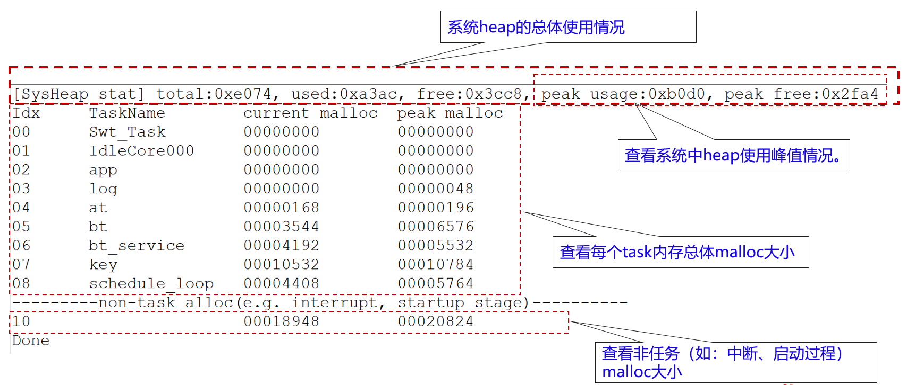
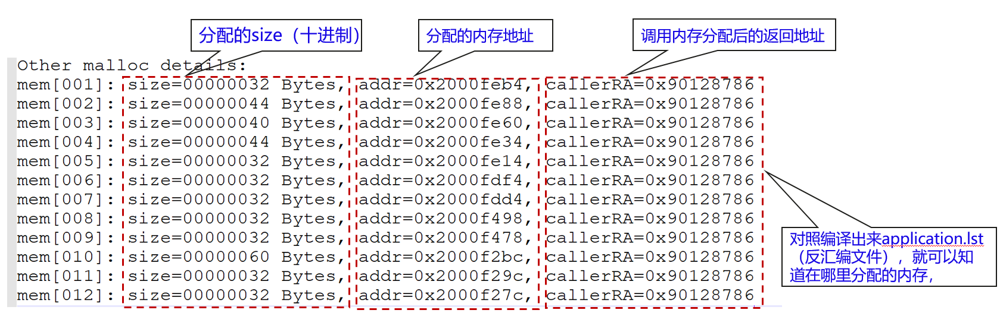

# 前言<a name="ZH-CN_TOPIC_0000001927231182"></a>

**概述<a name="section4537382116410"></a>**

本文档针对PLT的各类业务，提供内存维测指导。

**读者对象<a name="section4378592816410"></a>**

本文档主要适用于以下工程师：

-   技术支持工程师
-   产品测试工程师
-   维护工程师

**符号约定<a name="section133020216410"></a>**

在本文中可能出现下列标志，它们所代表的含义如下。

<a name="table2622507016410"></a>
<table><thead align="left"><tr id="row1530720816410"><th class="cellrowborder" valign="top" width="20.580000000000002%" id="mcps1.1.3.1.1"><p id="p6450074116410"><a name="p6450074116410"></a><a name="p6450074116410"></a><strong id="b2136615816410"><a name="b2136615816410"></a><a name="b2136615816410"></a>符号</strong></p>
</th>
<th class="cellrowborder" valign="top" width="79.42%" id="mcps1.1.3.1.2"><p id="p5435366816410"><a name="p5435366816410"></a><a name="p5435366816410"></a><strong id="b5941558116410"><a name="b5941558116410"></a><a name="b5941558116410"></a>说明</strong></p>
</th>
</tr>
</thead>
<tbody><tr id="row1372280416410"><td class="cellrowborder" valign="top" width="20.580000000000002%" headers="mcps1.1.3.1.1 "><p id="p3734547016410"><a name="p3734547016410"></a><a name="p3734547016410"></a><a name="image2670064316410"></a><a name="image2670064316410"></a><span></span></p>
</td>
<td class="cellrowborder" valign="top" width="79.42%" headers="mcps1.1.3.1.2 "><p id="p1757432116410"><a name="p1757432116410"></a><a name="p1757432116410"></a>表示如不避免则将会导致死亡或严重伤害的具有高等级风险的危害。</p>
</td>
</tr>
<tr id="row466863216410"><td class="cellrowborder" valign="top" width="20.580000000000002%" headers="mcps1.1.3.1.1 "><p id="p1432579516410"><a name="p1432579516410"></a><a name="p1432579516410"></a><a name="image4895582316410"></a><a name="image4895582316410"></a><span></span></p>
</td>
<td class="cellrowborder" valign="top" width="79.42%" headers="mcps1.1.3.1.2 "><p id="p959197916410"><a name="p959197916410"></a><a name="p959197916410"></a>表示如不避免则可能导致死亡或严重伤害的具有中等级风险的危害。</p>
</td>
</tr>
<tr id="row123863216410"><td class="cellrowborder" valign="top" width="20.580000000000002%" headers="mcps1.1.3.1.1 "><p id="p1232579516410"><a name="p1232579516410"></a><a name="p1232579516410"></a><a name="image1235582316410"></a><a name="image1235582316410"></a><span></span></p>
</td>
<td class="cellrowborder" valign="top" width="79.42%" headers="mcps1.1.3.1.2 "><p id="p123197916410"><a name="p123197916410"></a><a name="p123197916410"></a>表示如不避免则可能导致轻微或中度伤害的具有低等级风险的危害。</p>
</td>
</tr>
<tr id="row5786682116410"><td class="cellrowborder" valign="top" width="20.580000000000002%" headers="mcps1.1.3.1.1 "><p id="p2204984716410"><a name="p2204984716410"></a><a name="p2204984716410"></a><a name="image4504446716410"></a><a name="image4504446716410"></a><span></span></p>
</td>
<td class="cellrowborder" valign="top" width="79.42%" headers="mcps1.1.3.1.2 "><p id="p4388861916410"><a name="p4388861916410"></a><a name="p4388861916410"></a>用于传递设备或环境安全警示信息。如不避免则可能会导致设备损坏、数据丢失、设备性能降低或其它不可预知的结果。</p>
<p id="p1238861916410"><a name="p1238861916410"></a><a name="p1238861916410"></a>“须知”不涉及人身伤害。</p>
</td>
</tr>
<tr id="row2856923116410"><td class="cellrowborder" valign="top" width="20.580000000000002%" headers="mcps1.1.3.1.1 "><p id="p5555360116410"><a name="p5555360116410"></a><a name="p5555360116410"></a><a name="image799324016410"></a><a name="image799324016410"></a><span></span></p>
</td>
<td class="cellrowborder" valign="top" width="79.42%" headers="mcps1.1.3.1.2 "><p id="p4612588116410"><a name="p4612588116410"></a><a name="p4612588116410"></a>对正文中重点信息的补充说明。</p>
<p id="p1232588116410"><a name="p1232588116410"></a><a name="p1232588116410"></a>“说明”不是安全警示信息，不涉及人身、设备及环境伤害信息。</p>
</td>
</tr>
</tbody>
</table>

**修改记录<a name="section2467512116410"></a>**

<a name="table1557726816410"></a>
<table><thead align="left"><tr id="row2942532716410"><th class="cellrowborder" valign="top" width="20.72%" id="mcps1.1.4.1.1"><p id="p3778275416410"><a name="p3778275416410"></a><a name="p3778275416410"></a><strong id="b5687322716410"><a name="b5687322716410"></a><a name="b5687322716410"></a>文档版本</strong></p>
</th>
<th class="cellrowborder" valign="top" width="26.119999999999997%" id="mcps1.1.4.1.2"><p id="p5627845516410"><a name="p5627845516410"></a><a name="p5627845516410"></a><strong id="b5800814916410"><a name="b5800814916410"></a><a name="b5800814916410"></a>发布日期</strong></p>
</th>
<th class="cellrowborder" valign="top" width="53.16%" id="mcps1.1.4.1.3"><p id="p2382284816410"><a name="p2382284816410"></a><a name="p2382284816410"></a><strong id="b3316380216410"><a name="b3316380216410"></a><a name="b3316380216410"></a>修改说明</strong></p>
</th>
</tr>
</thead>
<tbody><tr id="row523572084413"><td class="cellrowborder" valign="top" width="20.72%" headers="mcps1.1.4.1.1 "><p id="p192361620204412"><a name="p192361620204412"></a><a name="p192361620204412"></a>02</p>
</td>
<td class="cellrowborder" valign="top" width="26.119999999999997%" headers="mcps1.1.4.1.2 "><p id="p023672017445"><a name="p023672017445"></a><a name="p023672017445"></a>2024-09-14</p>
</td>
<td class="cellrowborder" valign="top" width="53.16%" headers="mcps1.1.4.1.3 "><p id="p123642084419"><a name="p123642084419"></a><a name="p123642084419"></a>更新“<a href="内存维测开关.md">内存维测开关</a>”章节内容。</p>
</td>
</tr>
<tr id="row5947359616410"><td class="cellrowborder" valign="top" width="20.72%" headers="mcps1.1.4.1.1 "><p id="p2149706016410"><a name="p2149706016410"></a><a name="p2149706016410"></a>01</p>
</td>
<td class="cellrowborder" valign="top" width="26.119999999999997%" headers="mcps1.1.4.1.2 "><p id="p648803616410"><a name="p648803616410"></a><a name="p648803616410"></a>2024-07-03</p>
</td>
<td class="cellrowborder" valign="top" width="53.16%" headers="mcps1.1.4.1.3 "><p id="p1946537916410"><a name="p1946537916410"></a><a name="p1946537916410"></a>第一次正式版本发布。</p>
</td>
</tr>
</tbody>
</table>

# 简介<a name="ZH-CN_TOPIC_0000001927230230"></a>

内存维测是系统维测中非常关键的功能，比如：想知道系统中，当前内存的分配和占用情况；想知道各个task的栈占用情况；想知道某个task内存分配具体分配情况。这些内存信息对于内存优化、以及内存定位（比如内存泄露）至关重要。

本文描述如何在BS2X系列上如何进行内存维测，包括：

-   查看系统heap内存总体分配和使用情况。
-   查看每个task的malloc情况（当前分配和峰值分配）。
-   查看每个task的栈分配和使用情况（当前使用和峰值使用）。
-   查看每个内存在哪里分配。

    内存维测命令已经集成到AT命令中，用户可以直接使用。

# 内存维测功能<a name="ZH-CN_TOPIC_0000001954269813"></a>


## 查看系提heap总体信息<a name="ZH-CN_TOPIC_0000001927070902"></a>

该维测功能，用来查看系统中heap内存使用看情况。

**查看系统heap信息命令：AT+HEAPSTAT**



## 查看task栈使用情况<a name="ZH-CN_TOPIC_0000001954389593"></a>

该维测功能，用来查看各个Task的栈的分配使用使用情况。

可以通过该命令，来优化调整stack的分配大小，节约内存。

**查看任务栈使用情况：AT+TASKSTACK**


## 查看每个task的内存分配情况<a name="ZH-CN_TOPIC_0000001927230234"></a>

查看某个task的malloc情况：AT+TASKMALLOC=“任务id”；

这里的“任务id”，可以通过“AT+HEAPSTAT”或“AT+TASKSTACK”命令获取。


## 查看中断中、启动阶段的内存分配情况<a name="ZH-CN_TOPIC_0000001954269817"></a>

系统中，除了task中分配内存外，还有中断中分配的内存、系统启动阶段的分配的内存，这些地方分配的地方没有对应的task，因此统一归类到一个特殊id中。

可以通过“AT+HEAPSTAT” 命令，获取non-task alloc对应的id。

查看非任务中内存分配情况的命令，也是：AT+TASKMALLOC=“id”，显示格式相同。



## 内存维测开关<a name="ZH-CN_TOPIC_0000001927070906"></a>

内存维测通过配置宏进行使能和关闭控制，需要进入到“kernel\\liteos\\liteos\_v208.6.0\_b017\\Huawei\_LiteOS\\tools\\build\\config\\”目录中找到项目使用的config文件，以BS21A为例，需要打开bs21a\_key.config，修改以下宏控制开关：

关闭内存调测功能：

```
# LOSCFG_MEM_TASK_STAT=y is not set
# LOSCFG_MEM_DFX_SHOW_CALLER_RA is not set
```

开启内存调测功能：

```
LOSCFG_MEM_TASK_STAT=y
LOSCFG_MEM_DFX_SHOW_CALLER_RA=y
```

> **说明：** 
>-   必须要找对项目对应的config文件，开启和关闭维测配置。
>-   LOSCFG\_MEM\_DFX\_SHOW\_CALLER\_RA用来查看在哪里调用了内存分配的函数，该宏打开会消耗一定内存空间；建议在商用阶段，关闭该宏。
>-   **修改内存配置宏后，一定对SDK进行clean完整编译，否则可能会有不生效的情况。**

