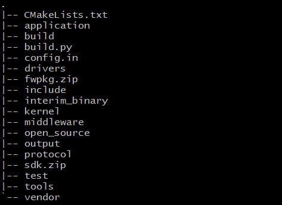
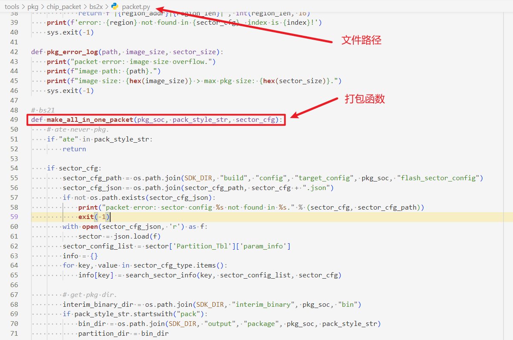
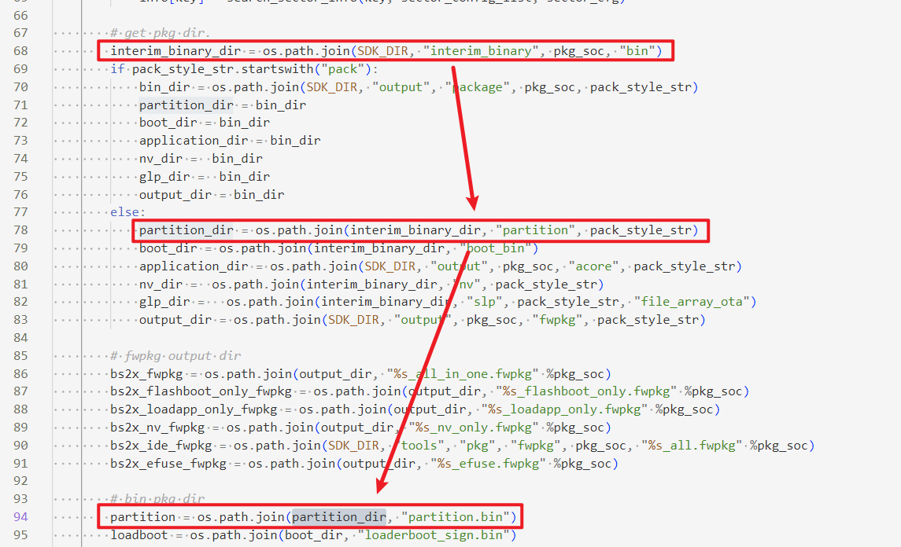
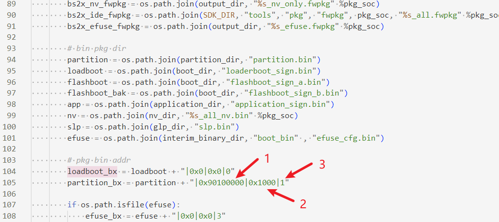
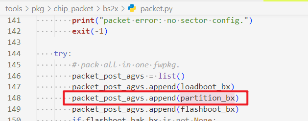
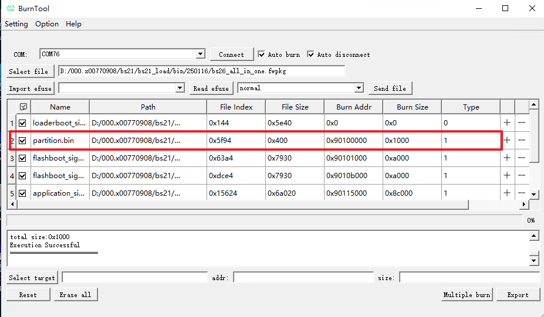
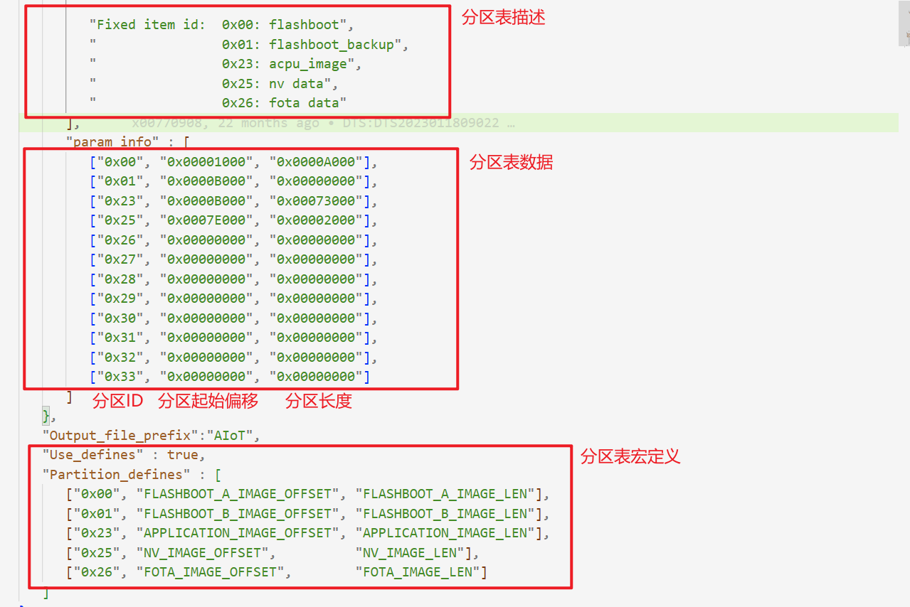

# 前言

**概述**

本文档介绍BS2X系列芯片SDK开发环境（包括：SDK编译、应用程序的开发等），用于帮助用户在快速了解开发环境后编译出可执行文件进行二次开发。

**产品版本**

与本文档相对应的产品版本如下。

<table><thead align="left"><tr id="row15364171712479"><th class="cellrowborder" valign="top" width="31.759999999999998%" id="mcps1.1.3.1.1">
<strong id="b12222191212104">产品名称</strong>

</th>
<th class="cellrowborder" valign="top" width="68.24%" id="mcps1.1.3.1.2">
<strong id="b1523661211108">产品版本</strong>

</th>
</tr>
</thead>
<tbody><tr id="row19364317104716"><td class="cellrowborder" valign="top" width="31.759999999999998%" headers="mcps1.1.3.1.1 ">
BS2X

</td>
<td class="cellrowborder" valign="top" width="68.24%" headers="mcps1.1.3.1.2 ">
V100

</td>
</tr>
</tbody>
</table>

**读者对象**

本文档主要适用于以下工程师：

-   技术支持工程师
-   软件开发工程师

**符号约定**

在本文中可能出现下列标志，它们所代表的含义如下。

<table><thead align="left"><tr id="row1530720816410"><th class="cellrowborder" valign="top" width="20.580000000000002%" id="mcps1.1.3.1.1">
<strong id="b2136615816410">符号</strong>

</th>
<th class="cellrowborder" valign="top" width="79.42%" id="mcps1.1.3.1.2">
<strong id="b5941558116410">说明</strong>

</th>
</tr>
</thead>
<tbody><tr id="row1372280416410"><td class="cellrowborder" valign="top" width="20.580000000000002%" headers="mcps1.1.3.1.1 ">

</td>
<td class="cellrowborder" valign="top" width="79.42%" headers="mcps1.1.3.1.2 ">
表示如不避免则将会导致死亡或严重伤害的具有高等级风险的危害。

</td>
</tr>
<tr id="row466863216410"><td class="cellrowborder" valign="top" width="20.580000000000002%" headers="mcps1.1.3.1.1 ">

</td>
<td class="cellrowborder" valign="top" width="79.42%" headers="mcps1.1.3.1.2 ">
表示如不避免则可能导致死亡或严重伤害的具有中等级风险的危害。

</td>
</tr>
<tr id="row123863216410"><td class="cellrowborder" valign="top" width="20.580000000000002%" headers="mcps1.1.3.1.1 ">

</td>
<td class="cellrowborder" valign="top" width="79.42%" headers="mcps1.1.3.1.2 ">
表示如不避免则可能导致轻微或中度伤害的具有低等级风险的危害。

</td>
</tr>
<tr id="row5786682116410"><td class="cellrowborder" valign="top" width="20.580000000000002%" headers="mcps1.1.3.1.1 ">

</td>
<td class="cellrowborder" valign="top" width="79.42%" headers="mcps1.1.3.1.2 ">
用于传递设备或环境安全警示信息。如不避免则可能会导致设备损坏、数据丢失、设备性能降低或其它不可预知的结果。

“须知”不涉及人身伤害。

</td>
</tr>
<tr id="row2856923116410"><td class="cellrowborder" valign="top" width="20.580000000000002%" headers="mcps1.1.3.1.1 ">

</td>
<td class="cellrowborder" valign="top" width="79.42%" headers="mcps1.1.3.1.2 ">
对正文中重点信息的补充说明。

“说明”不是安全警示信息，不涉及人身、设备及环境伤害信息。

</td>
</tr>
</tbody>
</table>

**修改记录**

<table><thead align="left"><tr id="row2942532716410"><th class="cellrowborder" valign="top" width="19.6%" id="mcps1.1.4.1.1">
<strong id="b5687322716410">文档版本</strong>

</th>
<th class="cellrowborder" valign="top" width="19.09%" id="mcps1.1.4.1.2">
<strong id="b5800814916410">发布日期</strong>

</th>
<th class="cellrowborder" valign="top" width="61.309999999999995%" id="mcps1.1.4.1.3">
<strong id="b3316380216410">修改说明</strong>

</th>
</tr>
</thead>
<tbody><tr id="row31617137538"><td class="cellrowborder" valign="top" width="19.6%" headers="mcps1.1.4.1.1 ">
02

</td>
<td class="cellrowborder" valign="top" width="19.09%" headers="mcps1.1.4.1.2 ">
2025-01-24

</td>
<td class="cellrowborder" valign="top" width="61.309999999999995%" headers="mcps1.1.4.1.3 "><ul id="ul1051218445539"><li>调整文档内容结构。</li><li>新增“<a href="搭建Windows开发环境.md">搭建Windows开发环境</a>”小节内容。</li><li>新增“<a href="编译SDK（Cmake）.md">编译SDK（Cmake）</a>”小节内容。</li></ul>
</td>
</tr>
<tr id="row58810414523"><td class="cellrowborder" valign="top" width="19.6%" headers="mcps1.1.4.1.1 ">
01

</td>
<td class="cellrowborder" valign="top" width="19.09%" headers="mcps1.1.4.1.2 ">
2024-05-15

</td>
<td class="cellrowborder" valign="top" width="61.309999999999995%" headers="mcps1.1.4.1.3 ">
第一次正式版本发布。

</td>
</tr>
<tr id="row6236545165217"><td class="cellrowborder" valign="top" width="19.6%" headers="mcps1.1.4.1.1 ">
00B03

</td>
<td class="cellrowborder" valign="top" width="19.09%" headers="mcps1.1.4.1.2 ">
2024-02-29

</td>
<td class="cellrowborder" valign="top" width="61.309999999999995%" headers="mcps1.1.4.1.3 ">
更新“版本编译”小节内容。

</td>
</tr>
<tr id="row12832184925218"><td class="cellrowborder" valign="top" width="19.6%" headers="mcps1.1.4.1.1 ">
00B02

00B01

</td>
<td class="cellrowborder" valign="top" width="19.09%" headers="mcps1.1.4.1.2 ">
2023-12-04

2023-10-27

</td>
<td class="cellrowborder" valign="top" width="61.309999999999995%" headers="mcps1.1.4.1.3 ">
更新“启动编译”小节内容。

第一次临时版本发布。

</td>
</tr>
</tbody>
</table>

# 开发环境搭建

## SDK开发环境简介

典型的SDK开发环境主要包括：

-   Linux服务器

    Linux服务器主要用于建立交叉编译环境，实现在Linux服务器上编译出可以在目标板上运行的可执行代码。

-   工作台

    工作台主要用于目标板烧录和调试，通过串口与目标板连接，开发人员可以在工作台中烧录目标板的镜像、调试程序。工作台通常需要安装终端工具，用于登录Linux服务器和目标板，查看目标板的打印输出信息。工作台一般为Windows或Linux操作系统，在Windows或Linux工作台运行的终端工具通常有SecureCRT、Putty、miniCom等，这些软件需要从其官网下载。

-   目标板

    本文的目标板以DEMO板为例，DEMO板与工作台通过USB转串口连接。工作台将交叉编译出来的DEMO板镜像通过串口烧录到DEMO板。如[图1](#fig1236915206315)所示。

    **图 1**  SDK 开发环境  
    
    

## 搭建Windows开发环境

BS2X解决方案提供了Windows下IDE开发工具，支持一键构建版本，基于IDE的编译环境搭建，请参考《BS2XV100 IDE工具使用指南》，本文档不再赘述。

## 搭建Linux开发环境

Linux系统推荐使用Ubuntu 20.04及以上版本，Shell使用bash ，SDK使用Cmake编译（3.14.1以上），编译工具还包括Python（3.8.0以上）等。

### 配置Shell

配置默认使用 bash。打开Linux终端，执行命令“sudo dpkg-reconfigure dash”，选择 no。

### 安装Cmake

打开Linux终端，执行命令“sudo apt install cmake”，完成Cmake的安装。

### 安装Python环境

1.  打开Linux终端，输入命令“python3 -V”，查看Python版本号，推荐python3.8.0以上版本。
2.  如果Python版本太低，请使用命令“sudo apt-get update”更新系统到最新，或通过命令“sudo apt-get install python3 -y”安装Python3（需root/sudo权限安装），安装后再次确认Python版本。

    如果仍不能满足版本要求，请从“[https://www.python.org/downloads/source/](https://www.python.org/downloads/source/)  ”下载对应版本源码包，下载与安装方法请阅读  [https://wiki.python.org/moin/BeginnersGuide/Download](https://wiki.python.org/moin/BeginnersGuide/Download)  和源码包内README内容。

3.  安装Python包管理工具，运行命令“sudo apt-get install python3-setuptools python3-pip -y”（需root/sudo权限安装）。
4.  安装Kconfiglib 14.1.0+，使用命令“sudo pip3 install kconfiglib”（需root/sudo权限安装），或从“[https://pypi.org/project/kconfiglib](https://pypi.org/project/kconfiglib)”下载.whl文件（例如：kconfiglib-14.1.0-py2.py3-none-any.whl）后，使用“pip3 install kconfiglib-xxx.whl”进行安装（需root/sudo权限安装），或者下载源码包到本地并解压，使用“python setup.py install”进行安装（需root/sudo权限安装）。安装完成界面如[图1](#fig743717512220)所示。

    **图 1**  安装Kconfiglib组件包完成示例  
    

5.  安装升级文件签名依赖的Python组件包。

    安装pycparser：

    从“[https://pypi.org/project/pycparser/](https://pypi.org/project/pycparser/)”下载.whl文件（例如：pycparser-2.21-py2.py3-none-any.whl）后，使用“pip3 install pycparser-xxx.whl”进行安装（需root/sudo权限安装），或者下载源码包到本地并解压，使用“python setup.py install”进行安装（需root/sudo权限安装）。安装完成后界面会提示“Successfully intalled pycparser-2.21”。

> **说明：** 
>如果构建环境中包含多个python，特别是多个同版本的python，而用户无法辨认正在使用的是其中的哪个版本，此情况下，在安装python组件包时，推荐使用组件包源码进行安装。

# 编译SDK

## SDK目录结构介绍

SDK根目录结构如[表1](#table13927142512394)所示。

**表 1**  SDK根目录

<table><thead align="left"><tr id="row15927132514396"><th class="cellrowborder" valign="top" width="27.38%" id="mcps1.2.3.1.1">
目录

</th>
<th class="cellrowborder" valign="top" width="72.61999999999999%" id="mcps1.2.3.1.2">
说明

</th>
</tr>
</thead>
<tbody><tr id="row292882517399"><td class="cellrowborder" valign="top" width="27.38%" headers="mcps1.2.3.1.1 ">
application

</td>
<td class="cellrowborder" valign="top" width="72.61999999999999%" headers="mcps1.2.3.1.2 ">
应用层代码（其中包含demo程序为参考示例）。

</td>
</tr>
<tr id="row12308241122019"><td class="cellrowborder" valign="top" width="27.38%" headers="mcps1.2.3.1.1 ">
build

</td>
<td class="cellrowborder" valign="top" width="72.61999999999999%" headers="mcps1.2.3.1.2 ">
SDK构建所需的脚本、配置文件。

</td>
</tr>
<tr id="row1653555018202"><td class="cellrowborder" valign="top" width="27.38%" headers="mcps1.2.3.1.1 ">
build.py

</td>
<td class="cellrowborder" valign="top" width="72.61999999999999%" headers="mcps1.2.3.1.2 ">
编译入口脚本。

</td>
</tr>
<tr id="row10787191320215"><td class="cellrowborder" valign="top" width="27.38%" headers="mcps1.2.3.1.1 ">
CMakeLists.txt

</td>
<td class="cellrowborder" valign="top" width="72.61999999999999%" headers="mcps1.2.3.1.2 ">
Cmake工程顶层“CMakeLists.txt”文件。

</td>
</tr>
<tr id="row109286253399"><td class="cellrowborder" valign="top" width="27.38%" headers="mcps1.2.3.1.1 ">
config.in

</td>
<td class="cellrowborder" valign="top" width="72.61999999999999%" headers="mcps1.2.3.1.2 ">
Kconfig配置文件。

</td>
</tr>
<tr id="row15928132512396"><td class="cellrowborder" valign="top" width="27.38%" headers="mcps1.2.3.1.1 ">
drivers

</td>
<td class="cellrowborder" valign="top" width="72.61999999999999%" headers="mcps1.2.3.1.2 ">
驱动代码。

</td>
</tr>
<tr id="row415218166102"><td class="cellrowborder" valign="top" width="27.38%" headers="mcps1.2.3.1.1 ">
include

</td>
<td class="cellrowborder" valign="top" width="72.61999999999999%" headers="mcps1.2.3.1.2 ">
API头文件存放目录。

</td>
</tr>
<tr id="row75842056117"><td class="cellrowborder" valign="top" width="27.38%" headers="mcps1.2.3.1.1 ">
interim_binary

</td>
<td class="cellrowborder" valign="top" width="72.61999999999999%" headers="mcps1.2.3.1.2 ">
库存放目录。

</td>
</tr>
<tr id="row152262035269"><td class="cellrowborder" valign="top" width="27.38%" headers="mcps1.2.3.1.1 ">
kernel

</td>
<td class="cellrowborder" valign="top" width="72.61999999999999%" headers="mcps1.2.3.1.2 ">
内核代码和OS接口适配层代码。

</td>
</tr>
<tr id="row26011201747"><td class="cellrowborder" valign="top" width="27.38%" headers="mcps1.2.3.1.1 ">
middleware

</td>
<td class="cellrowborder" valign="top" width="72.61999999999999%" headers="mcps1.2.3.1.2 ">
中间件代码。

</td>
</tr>
<tr id="row17392173512420"><td class="cellrowborder" valign="top" width="27.38%" headers="mcps1.2.3.1.1 ">
open_source

</td>
<td class="cellrowborder" valign="top" width="72.61999999999999%" headers="mcps1.2.3.1.2 ">
开源代码。

</td>
</tr>
<tr id="row17747172410413"><td class="cellrowborder" valign="top" width="27.38%" headers="mcps1.2.3.1.1 ">
protocol

</td>
<td class="cellrowborder" valign="top" width="72.61999999999999%" headers="mcps1.2.3.1.2 ">
BLE、SLE等协议栈。

</td>
</tr>
<tr id="row768611001510"><td class="cellrowborder" valign="top" width="27.38%" headers="mcps1.2.3.1.1 ">
test

</td>
<td class="cellrowborder" valign="top" width="72.61999999999999%" headers="mcps1.2.3.1.2 ">
testsuite代码。

</td>
</tr>
<tr id="row44171914181911"><td class="cellrowborder" valign="top" width="27.38%" headers="mcps1.2.3.1.1 ">
tools

</td>
<td class="cellrowborder" valign="top" width="72.61999999999999%" headers="mcps1.2.3.1.2 ">
包含编译工具链（包括linux和windows）、镜像打包脚本、NV制作工具和签名脚本等。

</td>
</tr>
<tr id="row15401556194817"><td class="cellrowborder" valign="top" width="27.38%" headers="mcps1.2.3.1.1 ">
output

</td>
<td class="cellrowborder" valign="top" width="72.61999999999999%" headers="mcps1.2.3.1.2 ">
编译时生成的目标文件与中间文件（包括库文件、打印log、生成的二进制文件等）。

</td>
</tr>
</tbody>
</table>

注：上表所述的output目录是编译后生成的。解压缩SDK后的根目录，如[图1](#fig112752111447)所示。

**图 1**  解压缩SDK示例  

## 编译SDK（Cmake）

### 编译方法

根目录下执行“python3 build.py”指令运行脚本编译，即可编译出对应的SDK程序。编译命令列表如[表1](#table1646491114816)所示。此处以standard-bs21-n1100为例说明，根据BS2X项目不同编译目标可能不一致。

**表 1**  build.sh参数列表

<table><thead align="left"><tr id="row44654114810"><th class="cellrowborder" valign="top" width="12.76%" id="mcps1.2.4.1.1">
参数

</th>
<th class="cellrowborder" valign="top" width="40.35%" id="mcps1.2.4.1.2">
示例

</th>
<th class="cellrowborder" valign="top" width="46.89%" id="mcps1.2.4.1.3">
说明

</th>
</tr>
</thead>
<tbody><tr id="row746513144812"><td class="cellrowborder" valign="top" width="12.76%" headers="mcps1.2.4.1.1 ">
无

</td>
<td class="cellrowborder" valign="top" width="40.35%" headers="mcps1.2.4.1.2 ">
python3 build.py standard-bs21-n1100

</td>
<td class="cellrowborder" valign="top" width="46.89%" headers="mcps1.2.4.1.3 ">
启动standard-bs21-n1100目标的增量编译。

</td>
</tr>
<tr id="row04651218489"><td class="cellrowborder" valign="top" width="12.76%" headers="mcps1.2.4.1.1 ">
-c

</td>
<td class="cellrowborder" valign="top" width="40.35%" headers="mcps1.2.4.1.2 ">
python3 build.py -c standard-bs21-n1100

</td>
<td class="cellrowborder" valign="top" width="46.89%" headers="mcps1.2.4.1.3 ">
启动standard-bs21-n1100目标的全量编译。

</td>
</tr>
<tr id="row11696675533"><td class="cellrowborder" valign="top" width="12.76%" headers="mcps1.2.4.1.1 ">
menuconfig

</td>
<td class="cellrowborder" valign="top" width="40.35%" headers="mcps1.2.4.1.2 ">
python3 build.py standard-bs21-n1100 menuconfig

</td>
<td class="cellrowborder" valign="top" width="46.89%" headers="mcps1.2.4.1.3 ">
启动standard-bs21-n1100目标的menuconfig图形配置界面。

</td>
</tr>
</tbody>
</table>

**表 2**  编译目标介绍

<table><thead align="left"><tr id="row1898820470542"><th class="cellrowborder" valign="top" width="42.96%" id="mcps1.2.3.1.1">
编译目标

</th>
<th class="cellrowborder" valign="top" width="57.04%" id="mcps1.2.3.1.2">
说明

</th>
</tr>
</thead>
<tbody><tr id="row20988114713546"><td class="cellrowborder" valign="top" width="42.96%" headers="mcps1.2.3.1.1 ">
python3 build.py -c standard-bs21-n1100

</td>
<td class="cellrowborder" valign="top" width="57.04%" headers="mcps1.2.3.1.2 ">
app版本编译目标（flashboot将被打包至编译产物）。

</td>
</tr>
<tr id="row14862228125611"><td class="cellrowborder" valign="top" width="42.96%" headers="mcps1.2.3.1.1 ">
python3 build.py -c flashboot-bs21-n1100

</td>
<td class="cellrowborder" valign="top" width="57.04%" headers="mcps1.2.3.1.2 ">
flashboot镜像编译目标。

</td>
</tr>
</tbody>
</table>

编译得到的烧录镜像在“output/bs21/fwpkg/standard-bs21-n1100”目录下（如[表3](#table5535429403)所示）。

**表 3**  烧录镜像

<table><thead align="left"><tr id="row1353722184019"><th class="cellrowborder" valign="top" width="35.449999999999996%" id="mcps1.2.3.1.1">
文件名

</th>
<th class="cellrowborder" valign="top" width="64.55%" id="mcps1.2.3.1.2">
说明

</th>
</tr>
</thead>
<tbody><tr id="row75376234019"><td class="cellrowborder" valign="top" width="35.449999999999996%" headers="mcps1.2.3.1.1 ">
bs21_all_in_one.fwpkg

</td>
<td class="cellrowborder" valign="top" width="64.55%" headers="mcps1.2.3.1.2 ">
空片烧录时，需要烧录此文件。包含了所有的需要烧录的内容。包含：loaderboot_sign.bin、flashboot_sign_a.bin、flashboot_sign_b.bin、bs21_all_nv.bin、application_sign.bin。

各文件介绍如下：

loaderboot_sign.bin：loaderboot的镜像文件。升级开始时，芯片中固化的romboot会接收此镜像文件，加载到内存并运行，loadboot负责接收后续的镜像文件。注：此镜像只在升级阶段放在RAM中运行，并不存放在flash中。

flashboot_sign_a.bin：flashboot的镜像文件，烧录完成执行后，首要执行的flashboot镜像，启动时会校验flashboot的完整性。

flashboot_sign_b.bin：flashboot的备份镜像文件，当首要flashboot镜像被检查为不合法或已损坏时，将加载本镜像。

bs21_all_nv.bin：参数区的镜像文件。

application_sign.bin：应用版本镜像文件。

</td>
</tr>
<tr id="row15537132114020"><td class="cellrowborder" valign="top" width="35.449999999999996%" headers="mcps1.2.3.1.1 ">
bs21_loadapp_only.fwpkg

</td>
<td class="cellrowborder" valign="top" width="64.55%" headers="mcps1.2.3.1.2 ">
版本升级打包文件，包含：loaderboot_sign.bin、application_sign.bin。不包含flashboot相关内容。

当芯片烧录过“bs21_all_in_one.fwpkg”镜像后，如果后续修改不涉及flashboot、nv的修改，则可以用此文件升级。

</td>
</tr>
<tr id="row14916571496"><td class="cellrowborder" valign="top" width="35.449999999999996%" headers="mcps1.2.3.1.1 ">
bs21_flashboot_only.fwpkg

</td>
<td class="cellrowborder" valign="top" width="64.55%" headers="mcps1.2.3.1.2 ">
boot升级打包文件，包含：loaderboot_sign.bin、flashboot_sign_a.bin、flashboot_sign_b.bin。不包含application相关内容。

当芯片烧录过“bs21_all_in_one.fwpkg”镜像后，有升级flashboot的需求，可用此文件升级。

</td>
</tr>
<tr id="row1972752413919"><td class="cellrowborder" valign="top" width="35.449999999999996%" headers="mcps1.2.3.1.1 ">
bs21_nv_only.fwpkg

</td>
<td class="cellrowborder" valign="top" width="64.55%" headers="mcps1.2.3.1.2 ">
nv升级打包文件，包含loaderboot_sign.bin、bs21_all_nv.bin。不包含application和flashboot相关内容。

当芯片烧录过“bs21_all_in_one.fwpkg”镜像后，有升级nv参数的需求，可用此文件升级。

</td>
</tr>
</tbody>
</table>

注：编译得到的中间文件在“output/bs21/acore/standard-bs21-n1100”目录下。

### 编译参数详解

编译命令接收参数及解释如[表1](#table36913222319)所示。

**表 1**  编译参数信息表

<table><thead align="left"><tr id="row205261342910"><th class="cellrowborder" valign="top" width="20.65%" id="mcps1.2.3.1.1">
参数

</th>
<th class="cellrowborder" valign="top" width="79.35%" id="mcps1.2.3.1.2">
参数信息

</th>
</tr>
</thead>
<tbody><tr id="row1289314403919"><td class="cellrowborder" valign="top" width="20.65%" headers="mcps1.2.3.1.1 ">
-c

</td>
<td class="cellrowborder" valign="top" width="79.35%" headers="mcps1.2.3.1.2 ">
clean后编译。

</td>
</tr>
<tr id="row9701422193117"><td class="cellrowborder" valign="top" width="20.65%" headers="mcps1.2.3.1.1 ">
-j

</td>
<td class="cellrowborder" valign="top" width="79.35%" headers="mcps1.2.3.1.2 ">
-j&lt;num&gt;，以num线程数执行编译，如-j16、-j8。

默认最大线程。

</td>
</tr>
<tr id="row270622113120"><td class="cellrowborder" valign="top" width="20.65%" headers="mcps1.2.3.1.1 ">
-def=

</td>
<td class="cellrowborder" valign="top" width="79.35%" headers="mcps1.2.3.1.2 ">
-def=XXX,YYY,ZZZ=x,...  向本次编译target中添加XXX、YYY、ZZZ=x编译宏。

可使用-def=-:XXX屏蔽XXX宏；

可使用-def=-:ZZZ=x添加或者修改ZZZ宏。

</td>
</tr>
<tr id="row5701722153118"><td class="cellrowborder" valign="top" width="20.65%" headers="mcps1.2.3.1.1 ">
-component=

</td>
<td class="cellrowborder" valign="top" width="79.35%" headers="mcps1.2.3.1.2 ">
-component=XXX,YYY,...  仅编译XXX,YYY组件。

</td>
</tr>
<tr id="row12380153694910"><td class="cellrowborder" valign="top" width="20.65%" headers="mcps1.2.3.1.1 ">
-ninja

</td>
<td class="cellrowborder" valign="top" width="79.35%" headers="mcps1.2.3.1.2 ">
使用ninja生成中间文件，默认使用Unix makefile。

</td>
</tr>
<tr id="row57010229319"><td class="cellrowborder" valign="top" width="20.65%" headers="mcps1.2.3.1.1 ">
-[release / debug]

</td>
<td class="cellrowborder" valign="top" width="79.35%" headers="mcps1.2.3.1.2 ">
release:  在生成反汇编文件时节省时间；

debug:   在生成反汇编文件时信息更加全面但也更耗时。

默认为debug。

</td>
</tr>
<tr id="row187072220311"><td class="cellrowborder" valign="top" width="20.65%" headers="mcps1.2.3.1.1 ">
-dump

</td>
<td class="cellrowborder" valign="top" width="79.35%" headers="mcps1.2.3.1.2 ">
编译时在终端输出target的所有参数列表（包括编译宏、组件、编译选项等）。

</td>
</tr>
<tr id="row1170152283114"><td class="cellrowborder" valign="top" width="20.65%" headers="mcps1.2.3.1.1 ">
-nhso

</td>
<td class="cellrowborder" valign="top" width="79.35%" headers="mcps1.2.3.1.2 ">
不更新HSO数据库。

</td>
</tr>
<tr id="row87082218313"><td class="cellrowborder" valign="top" width="20.65%" headers="mcps1.2.3.1.1 ">
-out_libs

</td>
<td class="cellrowborder" valign="top" width="79.35%" headers="mcps1.2.3.1.2 ">
-out_libs=file_path，不再链接成elf，转而将所有.a打包成一个大的.a。

</td>
</tr>
<tr id="row57062212312"><td class="cellrowborder" valign="top" width="20.65%" headers="mcps1.2.3.1.1 ">
others

</td>
<td class="cellrowborder" valign="top" width="79.35%" headers="mcps1.2.3.1.2 ">
作为匹配编译target_names的关键字。

</td>
</tr>
</tbody>
</table>

### 编译选项详解

bs2x在不同目录下的.py文件下配置编译选项，如[表1](#table20340122212538)所示。

**表 1**  BS2X通用组件编译选项

<table><thead align="left"><tr id="row5340132295310"><th class="cellrowborder" align="center" valign="top" width="15.85%" id="mcps1.2.5.1.1">
编译选项类型

</th>
<th class="cellrowborder" align="center" valign="top" width="16.68%" id="mcps1.2.5.1.2">
说明

</th>
<th class="cellrowborder" align="center" valign="top" width="42.47%" id="mcps1.2.5.1.3">
内容

</th>
<th class="cellrowborder" align="center" valign="top" width="25%" id="mcps1.2.5.1.4">
对应文件控制路径

</th>
</tr>
</thead>
<tbody><tr id="row1234092285320"><td class="cellrowborder" align="left" valign="top" width="15.85%" headers="mcps1.2.5.1.1 ">
common_ccflags

</td>
<td class="cellrowborder" align="left" valign="top" width="16.68%" headers="mcps1.2.5.1.2 ">
基础编译选项

</td>
<td class="cellrowborder" align="left" valign="top" width="42.47%" headers="mcps1.2.5.1.3 ">
-std=gnu99 -Wall -Werror -Wextra -Winit-self -Wpointer-arith -Wstrict-prototypes -Wno-type-limits -fno-strict-aliasing -Os -fno-unwind-tables

</td>
<td class="cellrowborder" align="left" valign="top" width="25%" headers="mcps1.2.5.1.4 ">
\sdk\build\config\target_config\common_config.py

</td>
</tr>
<tr id="row1534012216539"><td class="cellrowborder" align="left" valign="top" width="15.85%" headers="mcps1.2.5.1.1 ">
riscv31

</td>
<td class="cellrowborder" align="left" valign="top" width="16.68%" headers="mcps1.2.5.1.2 ">
芯片类型编译选项

</td>
<td class="cellrowborder" align="left" valign="top" width="42.47%" headers="mcps1.2.5.1.3 ">
-ffreestanding -fdata-sections -Wno-implicit-fallthrough -ffunction-sections -nostdlib -pipe -fno-tree-scev-cprop -fno-common -mpush-pop -msmall-data-limit=0 -fno-ipa-ra -Wtrampolines -Wlogical-op -Wjump-misses-init -Wa,-enable-c-lbu-sb -Wa,-enable-c-lhu-sh -fimm-compare -femit-muliadd -fmerge-immshf -femit-uxtb-uxth -femit-lli -femit-clz -fldm-stm-optimize -g

</td>
<td class="cellrowborder" align="left" valign="top" width="25%" headers="mcps1.2.5.1.4 ">
\sdk\build\config\target_config\common_config.py

</td>
</tr>
<tr id="row143404224531"><td class="cellrowborder" align="left" valign="top" width="15.85%" headers="mcps1.2.5.1.1 ">
fp_flags

</td>
<td class="cellrowborder" align="left" valign="top" width="16.68%" headers="mcps1.2.5.1.2 ">
硬浮点编译选项

</td>
<td class="cellrowborder" align="left" valign="top" width="42.47%" headers="mcps1.2.5.1.3 ">
-march=rv32imfc -mabi=ilp32f

</td>
<td class="cellrowborder" align="left" valign="top" width="25%" headers="mcps1.2.5.1.4 ">
\sdk\build\config\target_config\bs21\target_config.py

</td>
</tr>
<tr id="row20340322205313"><td class="cellrowborder" align="left" valign="top" width="15.85%" headers="mcps1.2.5.1.1 ">
codesize_flags

</td>
<td class="cellrowborder" align="left" valign="top" width="16.68%" headers="mcps1.2.5.1.2 ">
codesize优化选项

</td>
<td class="cellrowborder" align="left" valign="top" width="42.47%" headers="mcps1.2.5.1.3 ">
--short-enums -madjust-regorder -madjust-const-cost -freorder-commu-args -fimm-compare-expand -frmv-str-zero -mfp-const-opt -frtl-sequence-abstract -frtl-hoist-sink -fsafe-alias-multipointer -finline-optimize-size -fmuliadd-expand -mlli-expand -Wa,-mcjal-expand -foptimize-reg-alloc -fsplit-multi-zero-assignments -floop-optimize-size -Wa,-mlli-relax -mpattern-abstract -foptimize-pro-and-epilogue

</td>
<td class="cellrowborder" align="left" valign="top" width="25%" headers="mcps1.2.5.1.4 ">
\sdk\build\config\target_config\bs21\target_config.py

</td>
</tr>
</tbody>
</table>

其中，编译选项的详细说明如[表2](#table5190336213)所示。

**表 2**  编译选项详细说明

<table><thead align="left"><tr id="row1319033617116"><th class="cellrowborder" valign="top" width="23.27%" id="mcps1.2.3.1.1">
选项

</th>
<th class="cellrowborder" valign="top" width="76.73%" id="mcps1.2.3.1.2">
说明

</th>
</tr>
</thead>
<tbody><tr id="row71905363117"><td class="cellrowborder" valign="top" width="23.27%" headers="mcps1.2.3.1.1 ">
-std=gnu99

</td>
<td class="cellrowborder" valign="top" width="76.73%" headers="mcps1.2.3.1.2 ">
使用 ISO C99 标准再加上GNU的扩展。

</td>
</tr>
<tr id="row12190103614112"><td class="cellrowborder" valign="top" width="23.27%" headers="mcps1.2.3.1.1 ">
-Wall

</td>
<td class="cellrowborder" valign="top" width="76.73%" headers="mcps1.2.3.1.2 ">
选项意思是编译后显示所有警告。

</td>
</tr>
<tr id="row101901836410"><td class="cellrowborder" valign="top" width="23.27%" headers="mcps1.2.3.1.1 ">
-Werror

</td>
<td class="cellrowborder" valign="top" width="76.73%" headers="mcps1.2.3.1.2 ">
用于将所有警告升级成错误。

</td>
</tr>
<tr id="row1119017361713"><td class="cellrowborder" valign="top" width="23.27%" headers="mcps1.2.3.1.1 ">
-Wextra

</td>
<td class="cellrowborder" valign="top" width="76.73%" headers="mcps1.2.3.1.2 ">
用于开启额外的警告信息（-Wall的补充）。

</td>
</tr>
<tr id="row619013367118"><td class="cellrowborder" valign="top" width="23.27%" headers="mcps1.2.3.1.1 ">
-Winit-self

</td>
<td class="cellrowborder" valign="top" width="76.73%" headers="mcps1.2.3.1.2 ">
警告使用自己初始化的未初始化变量。

</td>
</tr>
<tr id="row719019363117"><td class="cellrowborder" valign="top" width="23.27%" headers="mcps1.2.3.1.1 ">
-Wpointer-arith

</td>
<td class="cellrowborder" valign="top" width="76.73%" headers="mcps1.2.3.1.2 ">
警告任何取决于“功能类型”或“功能类型”的大小void。

</td>
</tr>
<tr id="row14190153619116"><td class="cellrowborder" valign="top" width="23.27%" headers="mcps1.2.3.1.1 ">
-Wstrict-prototypes

</td>
<td class="cellrowborder" valign="top" width="76.73%" headers="mcps1.2.3.1.2 ">
警告如果一个函数被声明或定义而没有指定参数类型。

</td>
</tr>
<tr id="row1291829722"><td class="cellrowborder" valign="top" width="23.27%" headers="mcps1.2.3.1.1 ">
-Wno-type-limits

</td>
<td class="cellrowborder" valign="top" width="76.73%" headers="mcps1.2.3.1.2 ">
屏蔽由于数据类型范围有限而导致比较始终为真或始终为false的告警。

</td>
</tr>
<tr id="row358111191722"><td class="cellrowborder" valign="top" width="23.27%" headers="mcps1.2.3.1.1 ">
-fno-strict-aliasing

</td>
<td class="cellrowborder" valign="top" width="76.73%" headers="mcps1.2.3.1.2 ">
禁用 strict-aliasing优化规则：不同类型的指针绝对不会指向同一块内存区域。

</td>
</tr>
<tr id="row8581919926"><td class="cellrowborder" valign="top" width="23.27%" headers="mcps1.2.3.1.1 ">
-Os

</td>
<td class="cellrowborder" valign="top" width="76.73%" headers="mcps1.2.3.1.2 ">
专门优化目标文件大小，执行所有的不增加目标文件大小的-O2优化选项，同时-Os还会执行更加优化程序的选项。

</td>
</tr>
<tr id="row16125102412213"><td class="cellrowborder" valign="top" width="23.27%" headers="mcps1.2.3.1.1 ">
-fno-unwind-tables

</td>
<td class="cellrowborder" valign="top" width="76.73%" headers="mcps1.2.3.1.2 ">
删除unwind调试信息。

</td>
</tr>
<tr id="row1012518241212"><td class="cellrowborder" valign="top" width="23.27%" headers="mcps1.2.3.1.1 ">
-ffreestanding

</td>
<td class="cellrowborder" valign="top" width="76.73%" headers="mcps1.2.3.1.2 ">
断言编译发生在独立环境中。

</td>
</tr>
<tr id="row31251624524"><td class="cellrowborder" valign="top" width="23.27%" headers="mcps1.2.3.1.1 ">
-fdata-sections

</td>
<td class="cellrowborder" valign="top" width="76.73%" headers="mcps1.2.3.1.2 ">
将每个数据放入自己的部分（仅限ELF）。

</td>
</tr>
<tr id="row1912517240210"><td class="cellrowborder" valign="top" width="23.27%" headers="mcps1.2.3.1.1 ">
-Wno-implicit-fallthrough

</td>
<td class="cellrowborder" valign="top" width="76.73%" headers="mcps1.2.3.1.2 ">
可忽略编译时switch-case中缺少break的错误。

</td>
</tr>
<tr id="row19253297218"><td class="cellrowborder" valign="top" width="23.27%" headers="mcps1.2.3.1.1 ">
-ffunction-sections

</td>
<td class="cellrowborder" valign="top" width="76.73%" headers="mcps1.2.3.1.2 ">
将每个函数放在自己的节中（仅限ELF）。

</td>
</tr>
<tr id="row0223859152611"><td class="cellrowborder" valign="top" width="23.27%" headers="mcps1.2.3.1.1 ">
-nostdlib

</td>
<td class="cellrowborder" valign="top" width="76.73%" headers="mcps1.2.3.1.2 ">
关闭默认头文件与库文件搜索目录。

</td>
</tr>
<tr id="row82231359192613"><td class="cellrowborder" valign="top" width="23.27%" headers="mcps1.2.3.1.1 ">
-pipe

</td>
<td class="cellrowborder" valign="top" width="76.73%" headers="mcps1.2.3.1.2 ">
编译过程中使用管道，借助 GCC 的管道功能来提高编译速度。

</td>
</tr>
<tr id="row4223185992617"><td class="cellrowborder" valign="top" width="23.27%" headers="mcps1.2.3.1.1 ">
-fno-tree-scev-cprop

</td>
<td class="cellrowborder" valign="top" width="76.73%" headers="mcps1.2.3.1.2 ">
禁用标量演化信息进行复写传递，代码空间优化相关。

</td>
</tr>
<tr id="row42231559132610"><td class="cellrowborder" valign="top" width="23.27%" headers="mcps1.2.3.1.1 ">
-fno-common

</td>
<td class="cellrowborder" valign="top" width="76.73%" headers="mcps1.2.3.1.2 ">
可以把静态库中的没有初始化的全局变量从弱符号变成强符号，当所有静态库链接成可执行文件，如果同时有两个以上“重名强符号”，链接器会报错。

</td>
</tr>
<tr id="row222315919261"><td class="cellrowborder" valign="top" width="23.27%" headers="mcps1.2.3.1.1 ">
-mpush-pop

</td>
<td class="cellrowborder" valign="top" width="76.73%" headers="mcps1.2.3.1.2 ">
CodeSize 优化，改编译选项需要CPU版本支持push/pop/popret/lwm/swm等指令。

</td>
</tr>
<tr id="row52231259132616"><td class="cellrowborder" valign="top" width="23.27%" headers="mcps1.2.3.1.1 ">
-msmall-data-limit=0

</td>
<td class="cellrowborder" valign="top" width="76.73%" headers="mcps1.2.3.1.2 ">
CodeSize 优化，改编译选项需要CPU版本支持push/pop/popret/lwm/swm等指令。

</td>
</tr>
<tr id="row1422318591268"><td class="cellrowborder" valign="top" width="23.27%" headers="mcps1.2.3.1.1 ">
-fno-ipa-ra

</td>
<td class="cellrowborder" valign="top" width="76.73%" headers="mcps1.2.3.1.2 ">
禁用编译器针对叶子函数的编译优化（编译选项中添加了-O2优化选项时-fipa-ra参数导致）。

</td>
</tr>
<tr id="row112231859142619"><td class="cellrowborder" valign="top" width="23.27%" headers="mcps1.2.3.1.1 ">
-Wtrampolines

</td>
<td class="cellrowborder" valign="top" width="76.73%" headers="mcps1.2.3.1.2 ">
该选项用于检查代码中是否包含内嵌函数,gcc对内嵌函数有个专门的称呼:trampoline。

</td>
</tr>
<tr id="row822315592263"><td class="cellrowborder" valign="top" width="23.27%" headers="mcps1.2.3.1.1 ">
-Wlogical-op

</td>
<td class="cellrowborder" valign="top" width="76.73%" headers="mcps1.2.3.1.2 ">
当逻辑操作结果似乎总为真或假时给出警告。

</td>
</tr>
<tr id="row3223159172612"><td class="cellrowborder" valign="top" width="23.27%" headers="mcps1.2.3.1.1 ">
-Wjump-misses-init

</td>
<td class="cellrowborder" valign="top" width="76.73%" headers="mcps1.2.3.1.2 ">
switch或者goto语句后声明并且初始化变量，进行告警。

</td>
</tr>
<tr id="row16223205992611"><td class="cellrowborder" valign="top" width="23.27%" headers="mcps1.2.3.1.1 ">
-Wa,-enable-c-lbu-sb

</td>
<td class="cellrowborder" valign="top" width="76.73%" headers="mcps1.2.3.1.2 ">
汇编器优化，默认禁用。如果启用此优化，汇编器将使用压缩的lbu &amp; sb替换 lbu &amp; sb。

</td>
</tr>
<tr id="row12223145992612"><td class="cellrowborder" valign="top" width="23.27%" headers="mcps1.2.3.1.1 ">
-Wa,-enable-c-lhu-sh

</td>
<td class="cellrowborder" valign="top" width="76.73%" headers="mcps1.2.3.1.2 ">
汇编器优化，默认禁用。如果启用此优化，汇编器将使用压缩的lhu &amp; sh替换 lhu &amp; sh。

</td>
</tr>
<tr id="row922385932618"><td class="cellrowborder" valign="top" width="23.27%" headers="mcps1.2.3.1.1 ">
-fimm-compare

</td>
<td class="cellrowborder" valign="top" width="76.73%" headers="mcps1.2.3.1.2 ">
代码大小的优化，可以将非零立即比较的两条指令（li，bxx）合并到一条指令（bxxi）。

</td>
</tr>
<tr id="row17223155916263"><td class="cellrowborder" valign="top" width="23.27%" headers="mcps1.2.3.1.1 ">
-femit-muliadd

</td>
<td class="cellrowborder" valign="top" width="76.73%" headers="mcps1.2.3.1.2 ">
CodeSize优化，可以将多条加树指令合并为一条指令。

</td>
</tr>
<tr id="row14223145912610"><td class="cellrowborder" valign="top" width="23.27%" headers="mcps1.2.3.1.1 ">
-fmerge-immshf

</td>
<td class="cellrowborder" valign="top" width="76.73%" headers="mcps1.2.3.1.2 ">
CodeSize优化，可以将立即移位合并为一条指令。组合仅在-O1以上的选项中生效。

</td>
</tr>
<tr id="row122385912614"><td class="cellrowborder" valign="top" width="23.27%" headers="mcps1.2.3.1.1 ">
-femit-uxtb-uxth

</td>
<td class="cellrowborder" valign="top" width="76.73%" headers="mcps1.2.3.1.2 ">
CodeSize优化，将无符号扩展字节和无符号扩展半字优化为uxtb、uxth(16字节)。组合仅在-O1以上的选项中。

</td>
</tr>
<tr id="row10223135911262"><td class="cellrowborder" valign="top" width="23.27%" headers="mcps1.2.3.1.1 ">
-femit-lli

</td>
<td class="cellrowborder" valign="top" width="76.73%" headers="mcps1.2.3.1.2 ">
使用48位l.li指令代替64位指令lui + addi进行32位长立即加载。此优化与insn组合结合使用。

</td>
</tr>
<tr id="row522395932614"><td class="cellrowborder" valign="top" width="23.27%" headers="mcps1.2.3.1.1 ">
-femit-clz

</td>
<td class="cellrowborder" valign="top" width="76.73%" headers="mcps1.2.3.1.2 ">
支持CLZ指令，所有__builtin_clz函数的调用都会优化为CLZ指令。

</td>
</tr>
<tr id="row152221259102610"><td class="cellrowborder" valign="top" width="23.27%" headers="mcps1.2.3.1.1 ">
-fldm-stm-optimize

</td>
<td class="cellrowborder" valign="top" width="76.73%" headers="mcps1.2.3.1.2 ">
启用用 ldmia/stmia 替换连续WORD加载/存储的优化，默认禁用。

</td>
</tr>
<tr id="row19222195911264"><td class="cellrowborder" valign="top" width="23.27%" headers="mcps1.2.3.1.1 ">
-g

</td>
<td class="cellrowborder" valign="top" width="76.73%" headers="mcps1.2.3.1.2 ">
调试编译选项，对于可执行二进制文件可通过以下方法确定是否包含调试信息。

</td>
</tr>
<tr id="row8222125972613"><td class="cellrowborder" valign="top" width="23.27%" headers="mcps1.2.3.1.1 ">
-mabi=ilp32f

</td>
<td class="cellrowborder" valign="top" width="76.73%" headers="mcps1.2.3.1.2 ">
支持硬浮点（指定整数和浮点调用约定）。

</td>
</tr>
<tr id="row62223599267"><td class="cellrowborder" valign="top" width="23.27%" headers="mcps1.2.3.1.1 ">
-march=rv32imfc

</td>
<td class="cellrowborder" valign="top" width="76.73%" headers="mcps1.2.3.1.2 ">
支持硬浮点（为给定的RISC-V ISA生成代码）。

</td>
</tr>
<tr id="row022216592268"><td class="cellrowborder" valign="top" width="23.27%" headers="mcps1.2.3.1.1 ">
--short-enums

</td>
<td class="cellrowborder" valign="top" width="76.73%" headers="mcps1.2.3.1.2 ">
CodeSize 优化，enum类型等于大小足够的最小整数类型。

</td>
</tr>
<tr id="row17222125972619"><td class="cellrowborder" valign="top" width="23.27%" headers="mcps1.2.3.1.1 ">
-madjust-regorder

</td>
<td class="cellrowborder" valign="top" width="76.73%" headers="mcps1.2.3.1.2 ">
寄存器分配优化-寄存器分配顺序调整优化。

</td>
</tr>
<tr id="row42226593261"><td class="cellrowborder" valign="top" width="23.27%" headers="mcps1.2.3.1.1 ">
-madjust-const-cost

</td>
<td class="cellrowborder" valign="top" width="76.73%" headers="mcps1.2.3.1.2 ">
立即数重复加载优化。

</td>
</tr>
<tr id="row7222165972619"><td class="cellrowborder" valign="top" width="23.27%" headers="mcps1.2.3.1.1 ">
-freorder-commu-args

</td>
<td class="cellrowborder" valign="top" width="76.73%" headers="mcps1.2.3.1.2 ">
浮点运算可交换操作数优化。

</td>
</tr>
<tr id="row1922295942618"><td class="cellrowborder" valign="top" width="23.27%" headers="mcps1.2.3.1.1 ">
-fimm-compare-expand

</td>
<td class="cellrowborder" valign="top" width="76.73%" headers="mcps1.2.3.1.2 ">
扩展指令常量比较指令优化。

</td>
</tr>
<tr id="row62227599269"><td class="cellrowborder" valign="top" width="23.27%" headers="mcps1.2.3.1.1 ">
-frmv-str-zero

</td>
<td class="cellrowborder" valign="top" width="76.73%" headers="mcps1.2.3.1.2 ">
rodata段常量字符串对齐优化。

</td>
</tr>
<tr id="row20222125911269"><td class="cellrowborder" valign="top" width="23.27%" headers="mcps1.2.3.1.1 ">
-mfp-const-opt

</td>
<td class="cellrowborder" valign="top" width="76.73%" headers="mcps1.2.3.1.2 ">
浮点常量加载优化。

</td>
</tr>
<tr id="row322255912263"><td class="cellrowborder" valign="top" width="23.27%" headers="mcps1.2.3.1.1 ">
-mswitch-jump-table

</td>
<td class="cellrowborder" valign="top" width="76.73%" headers="mcps1.2.3.1.2 ">
switch   case跳转表优化。

</td>
</tr>
<tr id="row1422275916266"><td class="cellrowborder" valign="top" width="23.27%" headers="mcps1.2.3.1.1 ">
-frtl-sequence-abstract

</td>
<td class="cellrowborder" valign="top" width="76.73%" headers="mcps1.2.3.1.2 ">
函数内过程优化。

</td>
</tr>
<tr id="row192221459112614"><td class="cellrowborder" valign="top" width="23.27%" headers="mcps1.2.3.1.1 ">
-frtl-hoist-sink

</td>
<td class="cellrowborder" valign="top" width="76.73%" headers="mcps1.2.3.1.2 ">
代码移动优化。

</td>
</tr>
<tr id="row22221659202615"><td class="cellrowborder" valign="top" width="23.27%" headers="mcps1.2.3.1.1 ">
-fsafe-alias-multipointer

</td>
<td class="cellrowborder" valign="top" width="76.73%" headers="mcps1.2.3.1.2 ">
多级指针重复加载优化。

</td>
</tr>
<tr id="row52220590262"><td class="cellrowborder" valign="top" width="23.27%" headers="mcps1.2.3.1.1 ">
-finline-optimize-size

</td>
<td class="cellrowborder" valign="top" width="76.73%" headers="mcps1.2.3.1.2 ">
inline内联代价模型优化。

</td>
</tr>
<tr id="row422255910268"><td class="cellrowborder" valign="top" width="23.27%" headers="mcps1.2.3.1.1 ">
-fmuliadd-expand

</td>
<td class="cellrowborder" valign="top" width="76.73%" headers="mcps1.2.3.1.2 ">
扩展指令乘加指令优化（muliadd优化）。

</td>
</tr>
<tr id="row1022225915261"><td class="cellrowborder" valign="top" width="23.27%" headers="mcps1.2.3.1.1 ">
-mlli-expand

</td>
<td class="cellrowborder" valign="top" width="76.73%" headers="mcps1.2.3.1.2 ">
扩展指令l.li指令优化。

</td>
</tr>
<tr id="row162222059172614"><td class="cellrowborder" valign="top" width="23.27%" headers="mcps1.2.3.1.1 ">
-Wa,-mcjal-expand

</td>
<td class="cellrowborder" valign="top" width="76.73%" headers="mcps1.2.3.1.2 ">
汇编器上jal压缩指令优化。

</td>
</tr>
<tr id="row9222135920268"><td class="cellrowborder" valign="top" width="23.27%" headers="mcps1.2.3.1.1 ">
-foptimize-reg-alloc

</td>
<td class="cellrowborder" valign="top" width="76.73%" headers="mcps1.2.3.1.2 ">
寄存器分配优化-寄存器分配优先级调整优化。

</td>
</tr>
<tr id="row102227596265"><td class="cellrowborder" valign="top" width="23.27%" headers="mcps1.2.3.1.1 ">
-fsplit-multi-zero-assignments

</td>
<td class="cellrowborder" valign="top" width="76.73%" headers="mcps1.2.3.1.2 ">
连续赋零值优化。

</td>
</tr>
<tr id="row18222135932618"><td class="cellrowborder" valign="top" width="23.27%" headers="mcps1.2.3.1.1 ">
-floop-optimize-size

</td>
<td class="cellrowborder" valign="top" width="76.73%" headers="mcps1.2.3.1.2 ">
循环结构优化。

</td>
</tr>
<tr id="row622212598262"><td class="cellrowborder" valign="top" width="23.27%" headers="mcps1.2.3.1.1 ">
-Wa,-mlli-relax

</td>
<td class="cellrowborder" valign="top" width="76.73%" headers="mcps1.2.3.1.2 ">
高频立即数加载优化（汇编器和链接器协同优化）。

</td>
</tr>
<tr id="row19222459132612"><td class="cellrowborder" valign="top" width="23.27%" headers="mcps1.2.3.1.1 ">
-mpattern-abstract

</td>
<td class="cellrowborder" valign="top" width="76.73%" headers="mcps1.2.3.1.2 ">
过程间抽象优化（根据已知pattern抽象优化）。

</td>
</tr>
<tr id="row112215590261"><td class="cellrowborder" valign="top" width="23.27%" headers="mcps1.2.3.1.1 ">
-foptimize-pro-and-epilogue

</td>
<td class="cellrowborder" valign="top" width="76.73%" headers="mcps1.2.3.1.2 ">
函数prologue和epilogue优化。

</td>
</tr>
</tbody>
</table>

### 打包添加其他bin文件

当前bs21编译bs21\_all\_in\_one.fwpkg时，默认会编译bs21\_all\_nv.bin、application\_sign.bin文件，在打包时则会添加loaderboot\_sign.bin、flashboot\_sign\_a.bin、flashboot\_sign\_b.bin文件，文件介绍如[表3](编译方法.md#table5535429403)所示。

如果需要打包其他bin文件，可按如下步骤添加：

1.  在根路径下打开/tools/pkg/chip\_packet/bs2x/packet.py文件。
2.  在make\_all\_in\_one\_packet函数中添加代码，如[图1](#fig9503124071916)所示。

    **图 1**  文件路径和待添加函数  
    

3.  在函数中添加bin文件路径，以partition.bin为例。

    其中每个拼接字符串代表一层目录（文件夹名和文件名）

    最终拼接完成的partition.bin实际路径：sdk\\interim\_binary\\bs21\\bin\\boot\_bin\\loaderboot\_sign.bin。

    **图 2**  bin文件路径图  
    

4.  设置打包参数，参数之间用"|"分割，如[图3](#fig149913416201)所示。

    **图 3**  bin文件编译参数  
    

    1. 烧录位置，单板剩余地址可在sdk\\build\\config\\target\_config\\bs2x\\flash\_sector\_config\\bs2x-xxx.json文件中查看。

    2. 占用空间大小。

    3. 文件类型。

    -   0：loader。
    -   1：代表普通烧写文件，烧写到flash。
    -   3：eFuse。
    -   4：OTP。

5.  在函数末尾，将设置好编译参数和路径的变量添加到编译列表，如[图3](#fig149913416201)所示。

    **图 4**  添加路径到编译列表  
    

6.  编译结果展示如[图5](#fig131271820142012)所示。

    **图 5**  编译结果  
    

> **说明：** 
>如果新增的bin文件有通过OTA升级的需求，请参见《BS2XV100 升级方案 使用指南》中对应内容，适配新增bin文件的OTA升级支持。

### flash分区表配置

分区表配置文件路径“sdk\\build\\config\\target\_config\\bs21\\flash\_sector\_config\\xxx.json”。

**表 1**  分区表说明

<table><thead align="left"><tr id="row1056221715324"><th class="cellrowborder" valign="top" width="10.24%" id="mcps1.2.5.1.1">
分区表Id

</th>
<th class="cellrowborder" valign="top" width="19.3%" id="mcps1.2.5.1.2">
起始地址

</th>
<th class="cellrowborder" valign="top" width="20.72%" id="mcps1.2.5.1.3">
分区长度

</th>
<th class="cellrowborder" valign="top" width="49.74%" id="mcps1.2.5.1.4">
描述

</th>
</tr>
</thead>
<tbody><tr id="row14562917143214"><td class="cellrowborder" valign="top" width="10.24%" headers="mcps1.2.5.1.1 ">
0x00

</td>
<td class="cellrowborder" valign="top" width="19.3%" headers="mcps1.2.5.1.2 ">
0x00001000

</td>
<td class="cellrowborder" valign="top" width="20.72%" headers="mcps1.2.5.1.3 ">
0x0000A000

</td>
<td class="cellrowborder" valign="top" width="49.74%" headers="mcps1.2.5.1.4 ">
flashboot a：二级boot主区（size根据使用使用大小配置）。

</td>
</tr>
<tr id="row2056251723219"><td class="cellrowborder" valign="top" width="10.24%" headers="mcps1.2.5.1.1 ">
0x01

</td>
<td class="cellrowborder" valign="top" width="19.3%" headers="mcps1.2.5.1.2 ">
0x0000B000

</td>
<td class="cellrowborder" valign="top" width="20.72%" headers="mcps1.2.5.1.3 ">
0x00000000

</td>
<td class="cellrowborder" valign="top" width="49.74%" headers="mcps1.2.5.1.4 ">
flashboot b：二级boot备份区（size根据使用使用大小配置）。

</td>
</tr>
<tr id="row956271715322"><td class="cellrowborder" valign="top" width="10.24%" headers="mcps1.2.5.1.1 ">
0x23

</td>
<td class="cellrowborder" valign="top" width="19.3%" headers="mcps1.2.5.1.2 ">
0x0000B000

</td>
<td class="cellrowborder" valign="top" width="20.72%" headers="mcps1.2.5.1.3 ">
0x00073000

</td>
<td class="cellrowborder" valign="top" width="49.74%" headers="mcps1.2.5.1.4 ">
acpu image：应用程序分区。

</td>
</tr>
<tr id="row956213171329"><td class="cellrowborder" valign="top" width="10.24%" headers="mcps1.2.5.1.1 ">
0x25

</td>
<td class="cellrowborder" valign="top" width="19.3%" headers="mcps1.2.5.1.2 ">
0x00000000

</td>
<td class="cellrowborder" valign="top" width="20.72%" headers="mcps1.2.5.1.3 ">
0x00000080

</td>
<td class="cellrowborder" valign="top" width="49.74%" headers="mcps1.2.5.1.4 ">
nv data：nv数据区域。

</td>
</tr>
<tr id="row165621117193217"><td class="cellrowborder" valign="top" width="10.24%" headers="mcps1.2.5.1.1 ">
0x26

</td>
<td class="cellrowborder" valign="top" width="19.3%" headers="mcps1.2.5.1.2 ">
0x00000080

</td>
<td class="cellrowborder" valign="top" width="20.72%" headers="mcps1.2.5.1.3 ">
0x00000700

</td>
<td class="cellrowborder" valign="top" width="49.74%" headers="mcps1.2.5.1.4 ">
fota dat：fota备份区。

</td>
</tr>
<tr id="row17562121773213"><td class="cellrowborder" valign="top" width="10.24%" headers="mcps1.2.5.1.1 ">
0x27

</td>
<td class="cellrowborder" valign="top" width="19.3%" headers="mcps1.2.5.1.2 ">
0x00000000

</td>
<td class="cellrowborder" valign="top" width="20.72%" headers="mcps1.2.5.1.3 ">
0x00000000

</td>
<td class="cellrowborder" valign="top" width="49.74%" headers="mcps1.2.5.1.4 ">
rsv1：预留分区1。

</td>
</tr>
<tr id="row256313170321"><td class="cellrowborder" valign="top" width="10.24%" headers="mcps1.2.5.1.1 ">
0x28

</td>
<td class="cellrowborder" valign="top" width="19.3%" headers="mcps1.2.5.1.2 ">
0x00000000

</td>
<td class="cellrowborder" valign="top" width="20.72%" headers="mcps1.2.5.1.3 ">
0x00000000

</td>
<td class="cellrowborder" valign="top" width="49.74%" headers="mcps1.2.5.1.4 ">
rsv1：预留分区2。

</td>
</tr>
<tr id="row13563101716328"><td class="cellrowborder" valign="top" width="10.24%" headers="mcps1.2.5.1.1 ">
0x29

</td>
<td class="cellrowborder" valign="top" width="19.3%" headers="mcps1.2.5.1.2 ">
0x00000000

</td>
<td class="cellrowborder" valign="top" width="20.72%" headers="mcps1.2.5.1.3 ">
0x00000000

</td>
<td class="cellrowborder" valign="top" width="49.74%" headers="mcps1.2.5.1.4 ">
rsv1：预留分区3。

</td>
</tr>
<tr id="row35636173326"><td class="cellrowborder" valign="top" width="10.24%" headers="mcps1.2.5.1.1 ">
0x30

</td>
<td class="cellrowborder" valign="top" width="19.3%" headers="mcps1.2.5.1.2 ">
0x00000000

</td>
<td class="cellrowborder" valign="top" width="20.72%" headers="mcps1.2.5.1.3 ">
0x00000000

</td>
<td class="cellrowborder" valign="top" width="49.74%" headers="mcps1.2.5.1.4 ">
rsv1：预留分区4。

</td>
</tr>
<tr id="row55638179321"><td class="cellrowborder" valign="top" width="10.24%" headers="mcps1.2.5.1.1 ">
0x31

</td>
<td class="cellrowborder" valign="top" width="19.3%" headers="mcps1.2.5.1.2 ">
0x00000000

</td>
<td class="cellrowborder" valign="top" width="20.72%" headers="mcps1.2.5.1.3 ">
0x00000000

</td>
<td class="cellrowborder" valign="top" width="49.74%" headers="mcps1.2.5.1.4 ">
rsv1：预留分区5。

</td>
</tr>
<tr id="row1756314172327"><td class="cellrowborder" valign="top" width="10.24%" headers="mcps1.2.5.1.1 ">
0x32

</td>
<td class="cellrowborder" valign="top" width="19.3%" headers="mcps1.2.5.1.2 ">
0x00000000

</td>
<td class="cellrowborder" valign="top" width="20.72%" headers="mcps1.2.5.1.3 ">
0x00000000

</td>
<td class="cellrowborder" valign="top" width="49.74%" headers="mcps1.2.5.1.4 ">
rsv1：预留分区6。

</td>
</tr>
<tr id="row1356361733214"><td class="cellrowborder" valign="top" width="10.24%" headers="mcps1.2.5.1.1 ">
0x33

</td>
<td class="cellrowborder" valign="top" width="19.3%" headers="mcps1.2.5.1.2 ">
0x00000000

</td>
<td class="cellrowborder" valign="top" width="20.72%" headers="mcps1.2.5.1.3 ">
0x00000000

</td>
<td class="cellrowborder" valign="top" width="49.74%" headers="mcps1.2.5.1.4 ">
rsv1：预留分区7。

</td>
</tr>
</tbody>
</table>

> **说明：** 
>分区表Id\[0x0, 0x26\]为镜像加载启动、OTA升级使用的分区信息，请谨慎修改，分区表信息可通过uapi\_partition\_get\_info接口传入分区Id获取对应地址和长度。
>Partition\_defines为分区表宏定义传参，当使能Use\_defines时，会将对应ID的分区表偏移以及大小按照指定的宏定义传入到后续构建阶段，在代码中可以直接引用。

### Menuconfig配置

运行“python3 build.py -c standard-bs21-n1100 menuconfig”脚本会启动Menuconfig程序，用户可通过Menuconfig对编译和系统功能进行配置，如[图1](#fig155343385597)所示。

SDK集成了默认配置，但建议用户首次运行时进行相应配置，从而减少因为配置原因引起的问题。用户随时可以运行“python3 build.py -c standard-bs21-n1100 menuconfig”更改配置。

**图 1**  Menuconfig运行界面  

注：界面如存在差异，以实际版本为准。

Menuconfig操作说明如[表1](#table364152210248)所示，在Menuconfig界面中可输入快捷键进行配置。

**表 1**  Menuconfig常用操作命令

<table><thead align="left"><tr id="row2642122213247"><th class="cellrowborder" valign="top" width="17%" id="mcps1.2.3.1.1">
快捷键

</th>
<th class="cellrowborder" valign="top" width="83%" id="mcps1.2.3.1.2">
说明

</th>
</tr>
</thead>
<tbody><tr id="row146421622162417"><td class="cellrowborder" valign="top" width="17%" headers="mcps1.2.3.1.1 ">
空格、回车

</td>
<td class="cellrowborder" valign="top" width="83%" headers="mcps1.2.3.1.2 ">
选中，反选。

</td>
</tr>
<tr id="row0235155732813"><td class="cellrowborder" valign="top" width="17%" headers="mcps1.2.3.1.1 ">
ESC

</td>
<td class="cellrowborder" valign="top" width="83%" headers="mcps1.2.3.1.2 ">
返回上级菜单，退出界面。

</td>
</tr>
<tr id="row1425985152914"><td class="cellrowborder" valign="top" width="17%" headers="mcps1.2.3.1.1 ">
Q

</td>
<td class="cellrowborder" valign="top" width="83%" headers="mcps1.2.3.1.2 ">
退出界面。

</td>
</tr>
<tr id="row161871942143019"><td class="cellrowborder" valign="top" width="17%" headers="mcps1.2.3.1.1 ">
S

</td>
<td class="cellrowborder" valign="top" width="83%" headers="mcps1.2.3.1.2 ">
保存配置。

</td>
</tr>
<tr id="row1661115053113"><td class="cellrowborder" valign="top" width="17%" headers="mcps1.2.3.1.1 ">
F

</td>
<td class="cellrowborder" valign="top" width="83%" headers="mcps1.2.3.1.2 ">
显示帮助菜单。

</td>
</tr>
</tbody>
</table>

所有命令可在Menuconfig界面的下方查看Menuconfig官方说明解释，如[图2](#fig14504171214012)所示。

**图 2**  Menuconfig命令帮助栏  

**表 2**  Menuconfig菜单项说明

<table><thead align="left"><tr id="row31102115020"><th class="cellrowborder" valign="top" width="28.48%" id="mcps1.2.3.1.1">
菜单

</th>
<th class="cellrowborder" valign="top" width="71.52%" id="mcps1.2.3.1.2">
说明

</th>
</tr>
</thead>
<tbody><tr id="row171109113504"><td class="cellrowborder" valign="top" width="28.48%" headers="mcps1.2.3.1.1 ">
Targets

</td>
<td class="cellrowborder" valign="top" width="71.52%" headers="mcps1.2.3.1.2 ">
编译target相关配置。

</td>
</tr>
<tr id="row211021195018"><td class="cellrowborder" valign="top" width="28.48%" headers="mcps1.2.3.1.1 ">
Application

</td>
<td class="cellrowborder" valign="top" width="71.52%" headers="mcps1.2.3.1.2 ">
应用相关配置（主要是sample相关）。

</td>
</tr>
<tr id="row161103165010"><td class="cellrowborder" valign="top" width="28.48%" headers="mcps1.2.3.1.1 ">
Bootloader

</td>
<td class="cellrowborder" valign="top" width="71.52%" headers="mcps1.2.3.1.2 ">
boot相关配置。

</td>
</tr>
<tr id="row1211071175013"><td class="cellrowborder" valign="top" width="28.48%" headers="mcps1.2.3.1.1 ">
Drivers

</td>
<td class="cellrowborder" valign="top" width="71.52%" headers="mcps1.2.3.1.2 ">
外设驱动相关配置和板级相关配置。

</td>
</tr>
<tr id="row1511031125010"><td class="cellrowborder" valign="top" width="28.48%" headers="mcps1.2.3.1.1 ">
Kernel

</td>
<td class="cellrowborder" valign="top" width="71.52%" headers="mcps1.2.3.1.2 ">
内核相关配置。

</td>
</tr>
<tr id="row161106115504"><td class="cellrowborder" valign="top" width="28.48%" headers="mcps1.2.3.1.1 ">
Middleware

</td>
<td class="cellrowborder" valign="top" width="71.52%" headers="mcps1.2.3.1.2 ">
中间件（NV、FOTA、AT、DFX、PM等）相关配置。

</td>
</tr>
<tr id="row94651621525"><td class="cellrowborder" valign="top" width="28.48%" headers="mcps1.2.3.1.1 ">
Protocol

</td>
<td class="cellrowborder" valign="top" width="71.52%" headers="mcps1.2.3.1.2 ">
星闪、蓝牙相关配置。

</td>
</tr>
<tr id="row1453145185216"><td class="cellrowborder" valign="top" width="28.48%" headers="mcps1.2.3.1.1 ">
Test

</td>
<td class="cellrowborder" valign="top" width="71.52%" headers="mcps1.2.3.1.2 ">
testsuite相关配置。

</td>
</tr>
</tbody>
</table>

### 注意事项

-   如果执行“./build.py”提示无权限，可执行命令“chmod +x build.py”添加执行权限或执行“python3./build.py”。
-   编译过程中，报错找不到某个包，请检查环境中的python是否已经安装了相应组件。如果构建环境中包含多个python，特别是多个同版本的python，而用户无法辨认正在使用的是其中的哪个版本，此情况下，在安装python组件包时，推荐使用组件包源码进行安装。
-   系统优先使用用户通过Menuconfig所做的配置，如果用户未配置，系统将使用默认配置进行编译。

# 新建APP

## 建立源码目录

> **说明：** 
>用户可在“application/bs21”同级目录下参考“standard-bs21-n1100”目录建立app，以下均以建立“my\_demo”为例。

步骤如下：

1.  新建“application/bs21/my\_demo”目录，用来存放“my\_demo”的源文件。
2.  复制“application/bs21/standard/CMakeLists.txt”到“application/bs21/my\_demo/CmakeLists.txt”，并将源文件放在“application/bs21/my\_demo”目录下。
3.  修改“application/bs21/my\_demo/CmakeLists.txt”文件。其中各个变量的含义如[表1](#table89969106362)所示。

    **表 1**  组件的CmakeLists.txt中的变量含义

    
    <table><thead align="left"><tr id="row69971710143612"><th class="cellrowborder" valign="top" width="27.900000000000002%" id="mcps1.2.3.1.1">
变量名称

    </th>
    <th class="cellrowborder" valign="top" width="72.1%" id="mcps1.2.3.1.2">
变量含义

    </th>
    </tr>
    </thead>
    <tbody><tr id="row77088920486"><td class="cellrowborder" valign="top" width="27.900000000000002%" headers="mcps1.2.3.1.1 ">
COMPONENT_NAME

    </td>
    <td class="cellrowborder" valign="top" width="72.1%" headers="mcps1.2.3.1.2 ">
当前组件名称，如“my_demo”。

    </td>
    </tr>
    <tr id="row99971710133619"><td class="cellrowborder" valign="top" width="27.900000000000002%" headers="mcps1.2.3.1.1 ">
SOURCES

    </td>
    <td class="cellrowborder" valign="top" width="72.1%" headers="mcps1.2.3.1.2 ">
当前组件的C文件列表，其中CMAKE_CURRENT_SOURCE_DIR变量标识当前CMakeLists.txt所在的路径。

    </td>
    </tr>
    <tr id="row5997910163618"><td class="cellrowborder" valign="top" width="27.900000000000002%" headers="mcps1.2.3.1.1 ">
PUBLIC_HEADER

    </td>
    <td class="cellrowborder" valign="top" width="72.1%" headers="mcps1.2.3.1.2 ">
当前组件需要对外提供的头文件的路径。

    </td>
    </tr>
    <tr id="row1199791011363"><td class="cellrowborder" valign="top" width="27.900000000000002%" headers="mcps1.2.3.1.1 ">
PRIVATE_HEADER

    </td>
    <td class="cellrowborder" valign="top" width="72.1%" headers="mcps1.2.3.1.2 ">
当前组件内部的头文件搜索路径。

    </td>
    </tr>
    <tr id="row99971610193616"><td class="cellrowborder" valign="top" width="27.900000000000002%" headers="mcps1.2.3.1.1 ">
PRIVATE_DEFINES

    </td>
    <td class="cellrowborder" valign="top" width="72.1%" headers="mcps1.2.3.1.2 ">
当前组件内部生效的宏定义。

    </td>
    </tr>
    <tr id="row12997210203618"><td class="cellrowborder" valign="top" width="27.900000000000002%" headers="mcps1.2.3.1.1 ">
PUBLIC_DEFINES

    </td>
    <td class="cellrowborder" valign="top" width="72.1%" headers="mcps1.2.3.1.2 ">
当前组件需要对外提供的宏定义。

    </td>
    </tr>
    <tr id="row12716914103914"><td class="cellrowborder" valign="top" width="27.900000000000002%" headers="mcps1.2.3.1.1 ">
COMPONENT_PUBLIC_CCFLAGS

    </td>
    <td class="cellrowborder" valign="top" width="72.1%" headers="mcps1.2.3.1.2 ">
当前组件需要对外提供的编译选项。

    </td>
    </tr>
    <tr id="row22992182396"><td class="cellrowborder" valign="top" width="27.900000000000002%" headers="mcps1.2.3.1.1 ">
COMPONENT_CCFLAGS

    </td>
    <td class="cellrowborder" valign="top" width="72.1%" headers="mcps1.2.3.1.2 ">
当前组件内部生效的编译选项。

    </td>
    </tr>
    </tbody>
    </table>

4.  修改“application/bs21/CMakeLists.txt”，将my\_demo目录加入编译。
5.  修改“build/config/target\_config/bs21/config.py”，在ram\_component字段中加入‘my\_demo’，向编译系统中注册my\_demo组件。

## 开发代码

目录结构建立完成后开始启动开发代码（用户可参考“application/samples”进行移植），代码开发完成后即可使用“python3 build.py -c standard-bs21-n1100”编译my\_demo进行代码编译调试。

## 镜像烧录

镜像烧录方法，请参见《BS2XV100 BurnTool工具 使用指南》中“操作指南”章节。

