# 前言<a name="ZH-CN_TOPIC_0000001790806532"></a>

**概述<a name="section669mcpsimp"></a>**

BS2X向用户提供了些示例程序（Sample），用于指导用户快速使用BS2X平台所提供的各类能力及快速产品化（本文档部分示例以BS21为例）。

**产品版本<a name="section673mcpsimp"></a>**

与本文档对应的产品版本如下。

<a name="table676mcpsimp"></a>
<table><thead align="left"><tr id="row681mcpsimp"><th class="cellrowborder" valign="top" width="50%" id="mcps1.1.3.1.1"><p id="p683mcpsimp"><a name="p683mcpsimp"></a><a name="p683mcpsimp"></a><strong id="b684mcpsimp"><a name="b684mcpsimp"></a><a name="b684mcpsimp"></a>产品名称</strong></p>
</th>
<th class="cellrowborder" valign="top" width="50%" id="mcps1.1.3.1.2"><p id="p686mcpsimp"><a name="p686mcpsimp"></a><a name="p686mcpsimp"></a><strong id="b687mcpsimp"><a name="b687mcpsimp"></a><a name="b687mcpsimp"></a>产品版本</strong></p>
</th>
</tr>
</thead>
<tbody><tr id="row689mcpsimp"><td class="cellrowborder" valign="top" width="50%" headers="mcps1.1.3.1.1 "><p id="p691mcpsimp"><a name="p691mcpsimp"></a><a name="p691mcpsimp"></a>BS2X</p>
</td>
<td class="cellrowborder" valign="top" width="50%" headers="mcps1.1.3.1.2 "><p id="p693mcpsimp"><a name="p693mcpsimp"></a><a name="p693mcpsimp"></a>V100</p>
</td>
</tr>
</tbody>
</table>

**读者对象<a name="section694mcpsimp"></a>**

本文档主要适用以下工程师：

-   技术支持工程师
-   软件开发工程师

**符号约定<a name="section133020216410"></a>**

在本文中可能出现下列标志，它们所代表的含义如下。

<a name="table2622507016410"></a>
<table><thead align="left"><tr id="row1530720816410"><th class="cellrowborder" valign="top" width="20.580000000000002%" id="mcps1.1.3.1.1"><p id="p6450074116410"><a name="p6450074116410"></a><a name="p6450074116410"></a><strong id="b2136615816410"><a name="b2136615816410"></a><a name="b2136615816410"></a>符号</strong></p>
</th>
<th class="cellrowborder" valign="top" width="79.42%" id="mcps1.1.3.1.2"><p id="p5435366816410"><a name="p5435366816410"></a><a name="p5435366816410"></a><strong id="b5941558116410"><a name="b5941558116410"></a><a name="b5941558116410"></a>说明</strong></p>
</th>
</tr>
</thead>
<tbody><tr id="row1372280416410"><td class="cellrowborder" valign="top" width="20.580000000000002%" headers="mcps1.1.3.1.1 "><p id="p3734547016410"><a name="p3734547016410"></a><a name="p3734547016410"></a><a name="image2670064316410"></a><a name="image2670064316410"></a><span></span></p>
</td>
<td class="cellrowborder" valign="top" width="79.42%" headers="mcps1.1.3.1.2 "><p id="p1757432116410"><a name="p1757432116410"></a><a name="p1757432116410"></a>表示如不避免则将会导致死亡或严重伤害的具有高等级风险的危害。</p>
</td>
</tr>
<tr id="row466863216410"><td class="cellrowborder" valign="top" width="20.580000000000002%" headers="mcps1.1.3.1.1 "><p id="p1432579516410"><a name="p1432579516410"></a><a name="p1432579516410"></a><a name="image4895582316410"></a><a name="image4895582316410"></a><span></span></p>
</td>
<td class="cellrowborder" valign="top" width="79.42%" headers="mcps1.1.3.1.2 "><p id="p959197916410"><a name="p959197916410"></a><a name="p959197916410"></a>表示如不避免则可能导致死亡或严重伤害的具有中等级风险的危害。</p>
</td>
</tr>
<tr id="row123863216410"><td class="cellrowborder" valign="top" width="20.580000000000002%" headers="mcps1.1.3.1.1 "><p id="p1232579516410"><a name="p1232579516410"></a><a name="p1232579516410"></a><a name="image1235582316410"></a><a name="image1235582316410"></a><span></span></p>
</td>
<td class="cellrowborder" valign="top" width="79.42%" headers="mcps1.1.3.1.2 "><p id="p123197916410"><a name="p123197916410"></a><a name="p123197916410"></a>表示如不避免则可能导致轻微或中度伤害的具有低等级风险的危害。</p>
</td>
</tr>
<tr id="row5786682116410"><td class="cellrowborder" valign="top" width="20.580000000000002%" headers="mcps1.1.3.1.1 "><p id="p2204984716410"><a name="p2204984716410"></a><a name="p2204984716410"></a><a name="image4504446716410"></a><a name="image4504446716410"></a><span></span></p>
</td>
<td class="cellrowborder" valign="top" width="79.42%" headers="mcps1.1.3.1.2 "><p id="p4388861916410"><a name="p4388861916410"></a><a name="p4388861916410"></a>用于传递设备或环境安全警示信息。如不避免则可能会导致设备损坏、数据丢失、设备性能降低或其它不可预知的结果。</p>
<p id="p1238861916410"><a name="p1238861916410"></a><a name="p1238861916410"></a>“须知”不涉及人身伤害。</p>
</td>
</tr>
<tr id="row2856923116410"><td class="cellrowborder" valign="top" width="20.580000000000002%" headers="mcps1.1.3.1.1 "><p id="p5555360116410"><a name="p5555360116410"></a><a name="p5555360116410"></a><a name="image799324016410"></a><a name="image799324016410"></a><span></span></p>
</td>
<td class="cellrowborder" valign="top" width="79.42%" headers="mcps1.1.3.1.2 "><p id="p4612588116410"><a name="p4612588116410"></a><a name="p4612588116410"></a>对正文中重点信息的补充说明。</p>
<p id="p1232588116410"><a name="p1232588116410"></a><a name="p1232588116410"></a>“说明”不是安全警示信息，不涉及人身、设备及环境伤害信息。</p>
</td>
</tr>
</tbody>
</table>

**修改记录<a name="section2467512116410"></a>**

<a name="table1557726816410"></a>
<table><thead align="left"><tr id="row2942532716410"><th class="cellrowborder" valign="top" width="18.990000000000002%" id="mcps1.1.4.1.1"><p id="p3778275416410"><a name="p3778275416410"></a><a name="p3778275416410"></a><strong id="b5687322716410"><a name="b5687322716410"></a><a name="b5687322716410"></a>文档版本</strong></p>
</th>
<th class="cellrowborder" valign="top" width="25.629999999999995%" id="mcps1.1.4.1.2"><p id="p5627845516410"><a name="p5627845516410"></a><a name="p5627845516410"></a><strong id="b5800814916410"><a name="b5800814916410"></a><a name="b5800814916410"></a>发布日期</strong></p>
</th>
<th class="cellrowborder" valign="top" width="55.379999999999995%" id="mcps1.1.4.1.3"><p id="p2382284816410"><a name="p2382284816410"></a><a name="p2382284816410"></a><strong id="b3316380216410"><a name="b3316380216410"></a><a name="b3316380216410"></a>修改说明</strong></p>
</th>
</tr>
</thead>
<tbody><tr id="row05565141001"><td class="cellrowborder" valign="top" width="18.990000000000002%" headers="mcps1.1.4.1.1 "><p id="p17572111515019"><a name="p17572111515019"></a><a name="p17572111515019"></a>06</p>
</td>
<td class="cellrowborder" valign="top" width="25.629999999999995%" headers="mcps1.1.4.1.2 "><p id="p3556101415014"><a name="p3556101415014"></a><a name="p3556101415014"></a><span id="ph3913141912011"><a name="ph3913141912011"></a><a name="ph3913141912011"></a>2025-03-26</span></p>
</td>
<td class="cellrowborder" valign="top" width="55.379999999999995%" headers="mcps1.1.4.1.3 "><a name="ul7978102710017"></a><a name="ul7978102710017"></a><ul id="ul7978102710017"><li>新增“<a href="SLE-Multi-Conn-Sample.md">SLE Multi Conn Sample</a>”章节内容。</li><li>新增“<a href="BLE-Lowpower-Sample.md">BLE Lowpower Sample</a>”章节内容。</li><li>更新“<a href="USB-AMIC-VDT-Sample.md">USB AMIC VDT Sample</a>”章节内容。</li><li>新增“<a href="air-mouse.md">air mouse</a>”~“<a href="BLE-uuid.md">BLE uuid</a>”章节内容。</li></ul>
</td>
</tr>
<tr id="row2081910408147"><td class="cellrowborder" valign="top" width="18.990000000000002%" headers="mcps1.1.4.1.1 "><p id="p1881994017142"><a name="p1881994017142"></a><a name="p1881994017142"></a>05</p>
</td>
<td class="cellrowborder" valign="top" width="25.629999999999995%" headers="mcps1.1.4.1.2 "><p id="p13819164016144"><a name="p13819164016144"></a><a name="p13819164016144"></a>2025-01-24</p>
</td>
<td class="cellrowborder" valign="top" width="55.379999999999995%" headers="mcps1.1.4.1.3 "><a name="ul1621516468141"></a><a name="ul1621516468141"></a><ul id="ul1621516468141"><li>更新“<a href="编译-56.md">编译</a>”章节内容。</li><li>新增“<a href="SLE-UART-DMA-Sample.md">SLE UART DMA Sample</a>”章节内容。</li><li>新增“<a href="SLE-多连接Sample.md">SLE 多连接Sample</a>”章节内容。</li></ul>
</td>
</tr>
<tr id="row1923465519811"><td class="cellrowborder" valign="top" width="18.990000000000002%" headers="mcps1.1.4.1.1 "><p id="p1723419554814"><a name="p1723419554814"></a><a name="p1723419554814"></a>04</p>
</td>
<td class="cellrowborder" valign="top" width="25.629999999999995%" headers="mcps1.1.4.1.2 "><p id="p023455513813"><a name="p023455513813"></a><a name="p023455513813"></a>2024-08-29</p>
</td>
<td class="cellrowborder" valign="top" width="55.379999999999995%" headers="mcps1.1.4.1.3 "><a name="ul199311581786"></a><a name="ul199311581786"></a><ul id="ul199311581786"><li>更新“<a href="外设-Sample.md">外设 Sample</a>”章节内容。</li><li>更新“<a href="SLE-Mouse-Sample.md">SLE Mouse Sample</a>”章节内容。</li><li>更新“<a href="USB-Mouse-Sample.md">USB Mouse Sample</a>”章节内容。</li></ul>
</td>
</tr>
<tr id="row8379153135317"><td class="cellrowborder" valign="top" width="18.990000000000002%" headers="mcps1.1.4.1.1 "><p id="p12379183175316"><a name="p12379183175316"></a><a name="p12379183175316"></a>03</p>
</td>
<td class="cellrowborder" valign="top" width="25.629999999999995%" headers="mcps1.1.4.1.2 "><p id="p1537963135317"><a name="p1537963135317"></a><a name="p1537963135317"></a>2024-07-04</p>
</td>
<td class="cellrowborder" valign="top" width="55.379999999999995%" headers="mcps1.1.4.1.3 "><a name="ul798516106533"></a><a name="ul798516106533"></a><ul id="ul798516106533"><li>更新“<a href="外设-Sample.md">外设 Sample</a>”章节内容。</li><li>更新“<a href="校准.md">校准</a>”小节内容。</li></ul>
</td>
</tr>
<tr id="row1192555211176"><td class="cellrowborder" valign="top" width="18.990000000000002%" headers="mcps1.1.4.1.1 "><p id="p12925752111711"><a name="p12925752111711"></a><a name="p12925752111711"></a>02</p>
</td>
<td class="cellrowborder" valign="top" width="25.629999999999995%" headers="mcps1.1.4.1.2 "><p id="p1292595241719"><a name="p1292595241719"></a><a name="p1292595241719"></a>2024-06-04</p>
</td>
<td class="cellrowborder" valign="top" width="55.379999999999995%" headers="mcps1.1.4.1.3 "><p id="p59257521177"><a name="p59257521177"></a><a name="p59257521177"></a>新增“<a href="SLE-measure-dis.md">SLE measure dis</a>”章节内容。</p>
</td>
</tr>
<tr id="row7148081818"><td class="cellrowborder" valign="top" width="18.990000000000002%" headers="mcps1.1.4.1.1 "><p id="p131480181812"><a name="p131480181812"></a><a name="p131480181812"></a>01</p>
</td>
<td class="cellrowborder" valign="top" width="25.629999999999995%" headers="mcps1.1.4.1.2 "><p id="p1814150161818"><a name="p1814150161818"></a><a name="p1814150161818"></a>2024-05-22</p>
</td>
<td class="cellrowborder" valign="top" width="55.379999999999995%" headers="mcps1.1.4.1.3 "><p id="p12991124711568"><a name="p12991124711568"></a><a name="p12991124711568"></a>第一次正式版本发布。</p>
<a name="ul15576154015617"></a><a name="ul15576154015617"></a><ul id="ul15576154015617"><li>更新“<a href="zh-cn_topic_0000001837645809.md">zh-cn_topic_0000001837645809.md</a>”章节内容。</li><li>更新“<a href="外设-Sample.md">外设 Sample</a>”章节内容。</li><li>更新“<a href="USB-AMIC-VDT-Sample.md">USB AMIC VDT Sample</a>”章节内容。</li></ul>
</td>
</tr>
<tr id="row203281634153518"><td class="cellrowborder" valign="top" width="18.990000000000002%" headers="mcps1.1.4.1.1 "><p id="p17328534153515"><a name="p17328534153515"></a><a name="p17328534153515"></a>00B03</p>
</td>
<td class="cellrowborder" valign="top" width="25.629999999999995%" headers="mcps1.1.4.1.2 "><p id="p163286345353"><a name="p163286345353"></a><a name="p163286345353"></a>2024-04-25</p>
</td>
<td class="cellrowborder" valign="top" width="55.379999999999995%" headers="mcps1.1.4.1.3 "><a name="ul1814552619395"></a><a name="ul1814552619395"></a><ul id="ul1814552619395"><li>更新“<a href="支持的外设Sample列表.md">支持的外设Sample列表</a>”小节内容。</li><li>更新“<a href="编译-52.md">编译</a>”小节内容。</li></ul>
</td>
</tr>
<tr id="row18484101192910"><td class="cellrowborder" valign="top" width="18.990000000000002%" headers="mcps1.1.4.1.1 "><p id="p94841315295"><a name="p94841315295"></a><a name="p94841315295"></a>00B02</p>
</td>
<td class="cellrowborder" valign="top" width="25.629999999999995%" headers="mcps1.1.4.1.2 "><p id="p34854114298"><a name="p34854114298"></a><a name="p34854114298"></a>2024-03-29</p>
</td>
<td class="cellrowborder" valign="top" width="55.379999999999995%" headers="mcps1.1.4.1.3 "><p id="p72578361298"><a name="p72578361298"></a><a name="p72578361298"></a>更新“<a href="支持的外设Sample列表.md">支持的外设Sample列表</a>”小节内容。</p>
</td>
</tr>
<tr id="row528931342314"><td class="cellrowborder" valign="top" width="18.990000000000002%" headers="mcps1.1.4.1.1 "><p id="p1685385611545"><a name="p1685385611545"></a><a name="p1685385611545"></a>00B01</p>
</td>
<td class="cellrowborder" valign="top" width="25.629999999999995%" headers="mcps1.1.4.1.2 "><p id="p1341465819419"><a name="p1341465819419"></a><a name="p1341465819419"></a>2024-03-11</p>
</td>
<td class="cellrowborder" valign="top" width="55.379999999999995%" headers="mcps1.1.4.1.3 "><p id="p3853115665417"><a name="p3853115665417"></a><a name="p3853115665417"></a>第一次临时版本发布。</p>
</td>
</tr>
</tbody>
</table>

# 概述<a name="ZH-CN_TOPIC_0000001837765693"></a>

BS2X提供的Sample分为轻量级Sample和重量级Sample。

-   轻量级Sample：用于演示各个外设接口API的使用方法。
-   重量级Sample：用于模拟各类真实产品以及带BSLE通信类的业务Sample，比如鼠标、键盘、UART DTU等。

> **说明：** 
>Sample还在持续丰富中。

# Sample框架<a name="ZH-CN_TOPIC_0000001790966280"></a>


## 总体方案<a name="ZH-CN_TOPIC_0000001790966300"></a>

**图 1**  软件分层图<a name="fig176891918596"></a>  
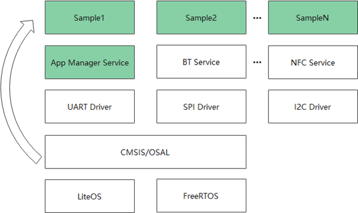

**图 2**  总体方案图<a name="fig15348753018"></a>  
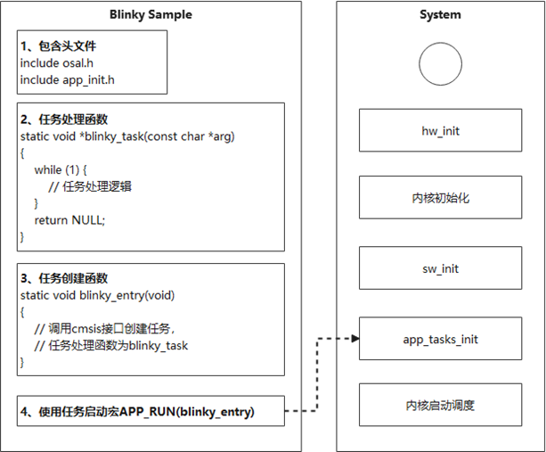

## Sample的启动和运行<a name="ZH-CN_TOPIC_0000001790966236"></a>

1.  每一个Sample都是以OS任务的形式独立存在。
2.  新加任务或者删除任务的时候不允许修改系统启动相关的逻辑，需要通过编译和链接的方式，做到任务能够与任务启动隔离。

## Sample选择<a name="ZH-CN_TOPIC_0000001790966212"></a>

通过Kconfig（menuconfig）选择需要编译到系统中的sample，如[图1](#fig483419344517)所示。

**图 1**  Kconfig选择需要编译的Sample<a name="fig483419344517"></a>  

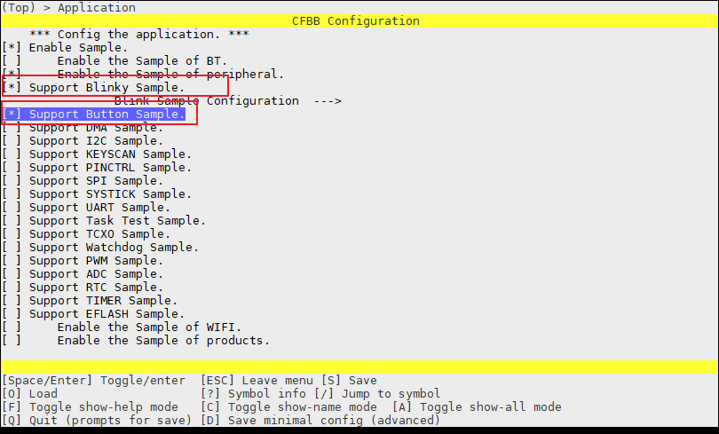

# 外设 Sample<a name="ZH-CN_TOPIC_0000001837765765"></a>


## 概述<a name="ZH-CN_TOPIC_0000001790806512"></a>

外设Sample基本都属于轻量级Sample，只为演示每一个驱动的完整使用流程。

## 支持的外设Sample列表<a name="ZH-CN_TOPIC_0000001790806636"></a>

支持的外设Sample列表如[表1](#table1639651217379)所示，在Kconfig中呈现的界面如[图1](#fig143181123124)所示。

**表 1**  支持的外设Sample列表

<a name="table1639651217379"></a>
<table><thead align="left"><tr id="row103971012123714"><th class="cellrowborder" valign="top" width="49.97%" id="mcps1.2.3.1.1"><p id="p19397131233713"><a name="p19397131233713"></a><a name="p19397131233713"></a>Sample名称</p>
</th>
<th class="cellrowborder" valign="top" width="50.029999999999994%" id="mcps1.2.3.1.2"><p id="p53971212113715"><a name="p53971212113715"></a><a name="p53971212113715"></a>功能描述</p>
</th>
</tr>
</thead>
<tbody><tr id="row12397161210372"><td class="cellrowborder" valign="top" width="49.97%" headers="mcps1.2.3.1.1 "><p id="p639711213712"><a name="p639711213712"></a><a name="p639711213712"></a>adc</p>
</td>
<td class="cellrowborder" valign="top" width="50.029999999999994%" headers="mcps1.2.3.1.2 "><p id="p149542551406"><a name="p149542551406"></a><a name="p149542551406"></a>演示ADC的API使用方法。</p>
</td>
</tr>
<tr id="row85276580913"><td class="cellrowborder" valign="top" width="49.97%" headers="mcps1.2.3.1.1 "><p id="p2052719581895"><a name="p2052719581895"></a><a name="p2052719581895"></a>can</p>
</td>
<td class="cellrowborder" valign="top" width="50.029999999999994%" headers="mcps1.2.3.1.2 "><p id="p20527135820910"><a name="p20527135820910"></a><a name="p20527135820910"></a>演示Can的API使用方法。</p>
</td>
</tr>
<tr id="row439713129373"><td class="cellrowborder" valign="top" width="49.97%" headers="mcps1.2.3.1.1 "><p id="p1539751203710"><a name="p1539751203710"></a><a name="p1539751203710"></a>dma</p>
</td>
<td class="cellrowborder" valign="top" width="50.029999999999994%" headers="mcps1.2.3.1.2 "><p id="p29543555409"><a name="p29543555409"></a><a name="p29543555409"></a>演示DMA的API使用方法。</p>
</td>
</tr>
<tr id="row73971312143710"><td class="cellrowborder" valign="top" width="49.97%" headers="mcps1.2.3.1.1 "><p id="p20397171243716"><a name="p20397171243716"></a><a name="p20397171243716"></a>i2c</p>
</td>
<td class="cellrowborder" valign="top" width="50.029999999999994%" headers="mcps1.2.3.1.2 "><p id="p2095535584019"><a name="p2095535584019"></a><a name="p2095535584019"></a>演示I2C的API使用方法。</p>
</td>
</tr>
<tr id="row22310304331"><td class="cellrowborder" valign="top" width="49.97%" headers="mcps1.2.3.1.1 "><p id="p1323110307335"><a name="p1323110307335"></a><a name="p1323110307335"></a>i2s/i2s_dma_lli</p>
</td>
<td class="cellrowborder" valign="top" width="50.029999999999994%" headers="mcps1.2.3.1.2 "><p id="p112311330163313"><a name="p112311330163313"></a><a name="p112311330163313"></a>演示I2S（包括I2S DMA模式）的API使用方法。</p>
</td>
</tr>
<tr id="row04232081383"><td class="cellrowborder" valign="top" width="49.97%" headers="mcps1.2.3.1.1 "><p id="p542319883813"><a name="p542319883813"></a><a name="p542319883813"></a>keyscan</p>
</td>
<td class="cellrowborder" valign="top" width="50.029999999999994%" headers="mcps1.2.3.1.2 "><p id="p7955105513401"><a name="p7955105513401"></a><a name="p7955105513401"></a>演示Keyscan的API使用方法。</p>
</td>
</tr>
<tr id="row13337143353517"><td class="cellrowborder" valign="top" width="49.97%" headers="mcps1.2.3.1.1 "><p id="p193387331353"><a name="p193387331353"></a><a name="p193387331353"></a>pdm</p>
</td>
<td class="cellrowborder" valign="top" width="50.029999999999994%" headers="mcps1.2.3.1.2 "><p id="p233873316353"><a name="p233873316353"></a><a name="p233873316353"></a>演示PDM的API使用方法。</p>
</td>
</tr>
<tr id="row13888193619384"><td class="cellrowborder" valign="top" width="49.97%" headers="mcps1.2.3.1.1 "><p id="p8888123693817"><a name="p8888123693817"></a><a name="p8888123693817"></a>pinctrl</p>
</td>
<td class="cellrowborder" valign="top" width="50.029999999999994%" headers="mcps1.2.3.1.2 "><p id="p18955655104016"><a name="p18955655104016"></a><a name="p18955655104016"></a>演示Pinctrl的API使用方法。</p>
</td>
</tr>
<tr id="row53581353133820"><td class="cellrowborder" valign="top" width="49.97%" headers="mcps1.2.3.1.1 "><p id="p12359753123820"><a name="p12359753123820"></a><a name="p12359753123820"></a>pwm</p>
</td>
<td class="cellrowborder" valign="top" width="50.029999999999994%" headers="mcps1.2.3.1.2 "><p id="p8955155134010"><a name="p8955155134010"></a><a name="p8955155134010"></a>演示PWM的API使用方法。</p>
</td>
</tr>
<tr id="row0488862363"><td class="cellrowborder" valign="top" width="49.97%" headers="mcps1.2.3.1.1 "><p id="p648811618363"><a name="p648811618363"></a><a name="p648811618363"></a>qdec</p>
</td>
<td class="cellrowborder" valign="top" width="50.029999999999994%" headers="mcps1.2.3.1.2 "><p id="p048886113613"><a name="p048886113613"></a><a name="p048886113613"></a>演示QDEC的API使用方法。</p>
</td>
</tr>
<tr id="row2031635873817"><td class="cellrowborder" valign="top" width="49.97%" headers="mcps1.2.3.1.1 "><p id="p5316105813814"><a name="p5316105813814"></a><a name="p5316105813814"></a>rtc</p>
</td>
<td class="cellrowborder" valign="top" width="50.029999999999994%" headers="mcps1.2.3.1.2 "><p id="p1595565517405"><a name="p1595565517405"></a><a name="p1595565517405"></a>演示RTC的API使用方法。</p>
</td>
</tr>
<tr id="row6968172643815"><td class="cellrowborder" valign="top" width="49.97%" headers="mcps1.2.3.1.1 "><p id="p1796842611387"><a name="p1796842611387"></a><a name="p1796842611387"></a>spi</p>
</td>
<td class="cellrowborder" valign="top" width="50.029999999999994%" headers="mcps1.2.3.1.2 "><p id="p18955125524017"><a name="p18955125524017"></a><a name="p18955125524017"></a>演示SPI的API使用方法。</p>
</td>
</tr>
<tr id="row1784018554389"><td class="cellrowborder" valign="top" width="49.97%" headers="mcps1.2.3.1.1 "><p id="p1484016553383"><a name="p1484016553383"></a><a name="p1484016553383"></a>systick</p>
</td>
<td class="cellrowborder" valign="top" width="50.029999999999994%" headers="mcps1.2.3.1.2 "><p id="p129558557405"><a name="p129558557405"></a><a name="p129558557405"></a>演示Systick的API使用方法。</p>
</td>
</tr>
<tr id="row994123283820"><td class="cellrowborder" valign="top" width="49.97%" headers="mcps1.2.3.1.1 "><p id="p17941632163810"><a name="p17941632163810"></a><a name="p17941632163810"></a>tasks</p>
</td>
<td class="cellrowborder" valign="top" width="50.029999999999994%" headers="mcps1.2.3.1.2 "><p id="p4955355194015"><a name="p4955355194015"></a><a name="p4955355194015"></a>演示Tasks的API使用方法。</p>
</td>
</tr>
<tr id="row9137201723810"><td class="cellrowborder" valign="top" width="49.97%" headers="mcps1.2.3.1.1 "><p id="p8137317203813"><a name="p8137317203813"></a><a name="p8137317203813"></a>tcxo</p>
</td>
<td class="cellrowborder" valign="top" width="50.029999999999994%" headers="mcps1.2.3.1.2 "><p id="p995511555409"><a name="p995511555409"></a><a name="p995511555409"></a>演示TCXO的API使用方法。</p>
</td>
</tr>
<tr id="row322733843917"><td class="cellrowborder" valign="top" width="49.97%" headers="mcps1.2.3.1.1 "><p id="p922733883912"><a name="p922733883912"></a><a name="p922733883912"></a>timer</p>
</td>
<td class="cellrowborder" valign="top" width="50.029999999999994%" headers="mcps1.2.3.1.2 "><p id="p15955155515402"><a name="p15955155515402"></a><a name="p15955155515402"></a>演示Timer的API使用方法。</p>
</td>
</tr>
<tr id="row755364033913"><td class="cellrowborder" valign="top" width="49.97%" headers="mcps1.2.3.1.1 "><p id="p355317403392"><a name="p355317403392"></a><a name="p355317403392"></a>uart</p>
</td>
<td class="cellrowborder" valign="top" width="50.029999999999994%" headers="mcps1.2.3.1.2 "><p id="p109558552405"><a name="p109558552405"></a><a name="p109558552405"></a>演示UART的API使用方法。</p>
</td>
</tr>
<tr id="row0584174416398"><td class="cellrowborder" valign="top" width="49.97%" headers="mcps1.2.3.1.1 "><p id="p185841344203915"><a name="p185841344203915"></a><a name="p185841344203915"></a>watchdog</p>
</td>
<td class="cellrowborder" valign="top" width="50.029999999999994%" headers="mcps1.2.3.1.2 "><p id="p5955955104014"><a name="p5955955104014"></a><a name="p5955955104014"></a>演示WatchDog的API使用方法。</p>
</td>
</tr>
</tbody>
</table>

**图 1**  外设Sample Kconfig界面<a name="fig143181123124"></a>  
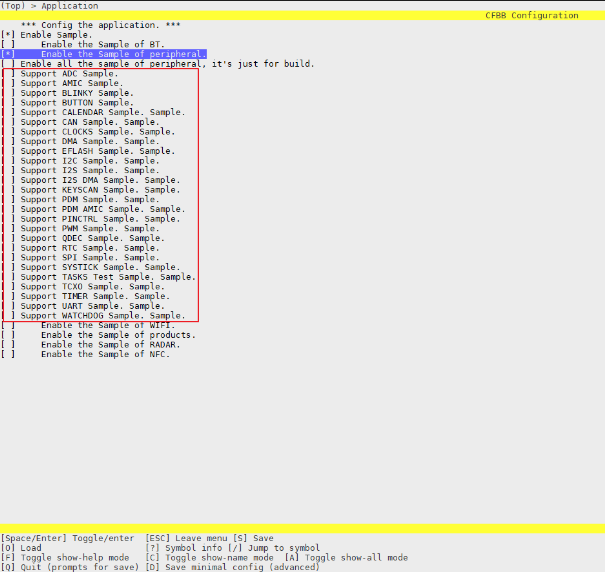


### ADC<a name="ZH-CN_TOPIC_0000001823409002"></a>


#### 编译<a name="ZH-CN_TOPIC_0000001823580808"></a>

> **说明：** 
>运行该用例时，需根据实际需求选择其他目录下的KCONFIG配置，请参考《BS2XV100 设备驱动 开发指南》的“KCONFIG配置”章节。

1.  在命令行下执行命令“python build.py standard-bs21 menuconfig”，打开menuconfig配置界面。
2.  在menuconfig界面中选择ADC Sample，如[图1](#fig10563812175115)所示；如果当前Sample支持Timer操作，则继续按[图2](#fig873353011112)选择，选择完成后按“Q”或者“q”选择“y”保存退出。
3.  使用IDE编译版本，编译出的版本包在“output\\bs21\\fwpkg\\xxx”路径下，如下[图3](#fig1486953181217)所示。
4.  将编译出的版本按照“[烧录及运行](烧录及运行-57.md)”烧录到板子。

**图 1**  选择ADC Sample<a name="fig10563812175115"></a>  
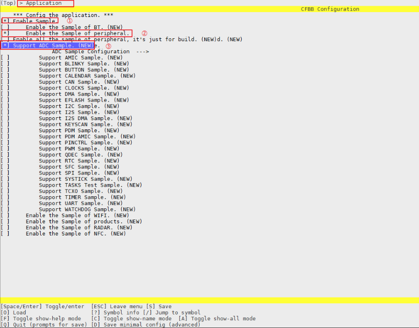

**图 2**  选择ADC支持Timer操作<a name="fig873353011112"></a>  
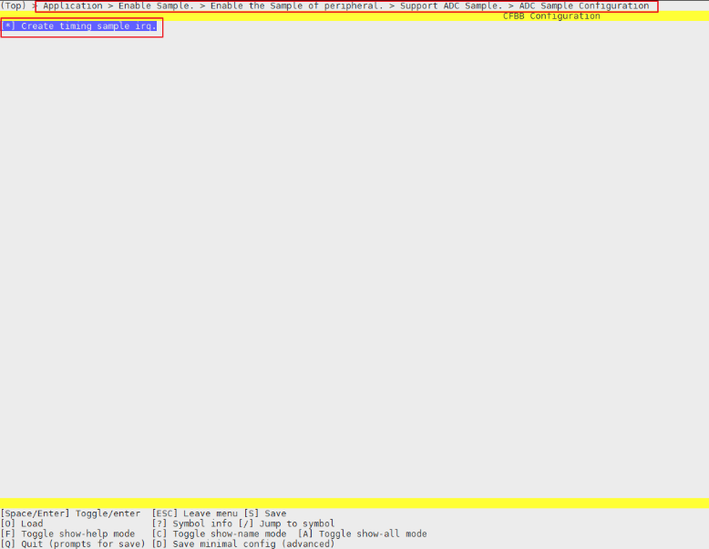

**图 3**  编译后的fwpkg<a name="fig1486953181217"></a>  
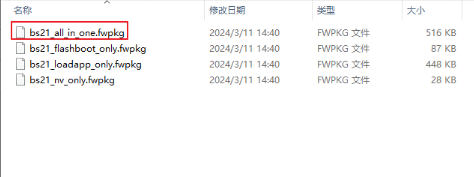

#### 运行<a name="ZH-CN_TOPIC_0000001823591700"></a>

1.  adc采样默认使用channel0，单板复位后，给channel0的管脚引电压，串口显示结果如[图1](#fig193968010441)所示。
2.  adc timer采样默认使用的是channel0和channel5，给channel0的管脚和channel5引不同的电压，串口显示结果如[图2](#fig1140385554410)、[图3](#fig156221333154514)所示。

**图 1**  adc采样运行结果<a name="fig193968010441"></a>  
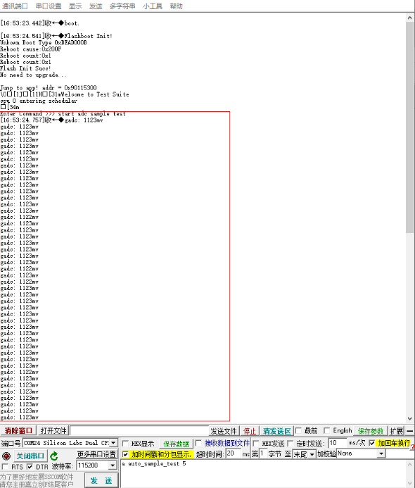

**图 2**  adc定时器采样运行结果<a name="fig1140385554410"></a>  
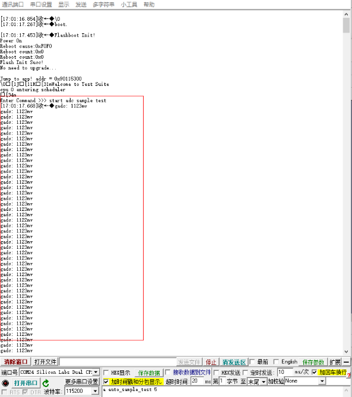

**图 3**  adc定时器采样运行结果2<a name="fig156221333154514"></a>  
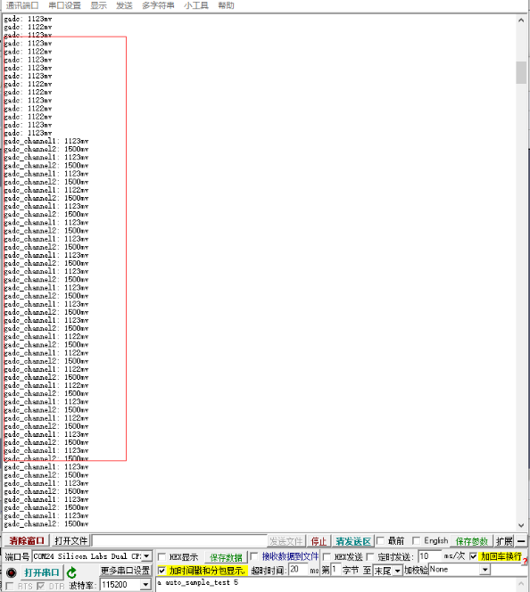

### BLINKY<a name="ZH-CN_TOPIC_0000002031870881"></a>


#### 编译<a name="ZH-CN_TOPIC_0000001995512912"></a>

> **说明：** 
>运行该用例时，需根据实际需求选择其他目录下的KCONFIG配置，请参考《BS2XV100 设备驱动 开发指南》的“KCONFIG配置”章节。

1.  在命令行下执行命令“python build.py standard-bs21 menuconfig”或者使用IDE工具单击menuconfig按钮，打开menuconfig配置界面。
2.  在menuconfig界面中选择BLINKY Sample，如[图1](#fig13722850165011)所示；如果选择Sample使用的管脚，则继续按[图2](#fig191542445515)选择，选择完成后按“Q”或者“q”选择“y”保存退出。
3.  使用IDE编译版本，编译出的版本包在“output\\bs21\\fwpkg\\xxx”路径下，如下[图3](#fig13120173845312)所示。
4.  将编译出的版本按照[烧录及运行](烧录及运行-57.md)烧录到板子。

**图 1**  Kconfig sample选择<a name="fig13722850165011"></a>  
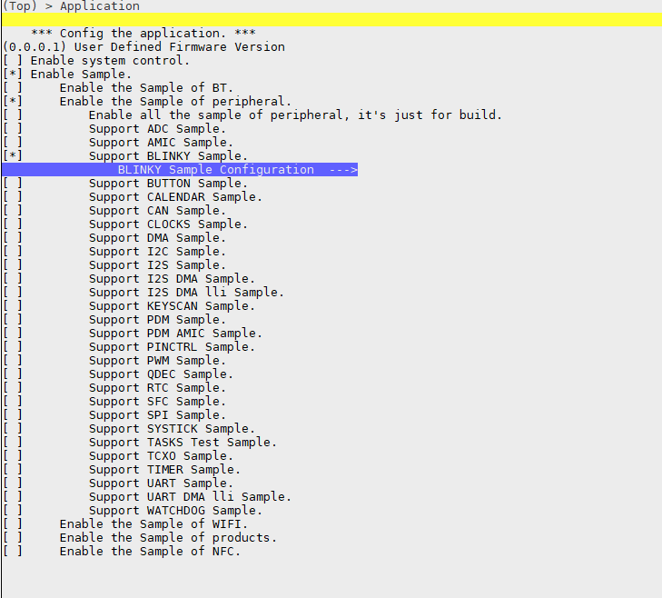

**图 2**  Blinky 管脚选择<a name="fig191542445515"></a>  
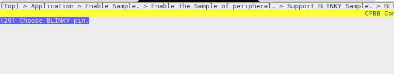

**图 3**  编译后的fwpkg<a name="fig13120173845312"></a>  
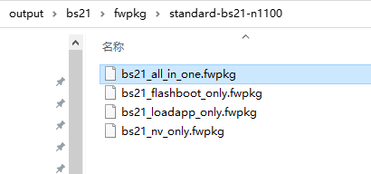

#### 运行<a name="ZH-CN_TOPIC_0000002031992233"></a>

1.  烧录上电复位后串口每隔500ms打印一次“Blinky working”日志。
2.  使用工具量取配置管脚电平状态，如下图[图1](#fig17708205416574)所示。

**图 1**  量取的电平状态<a name="fig17708205416574"></a>  
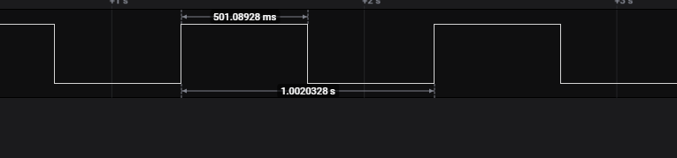

### BUTTON<a name="ZH-CN_TOPIC_0000002032039529"></a>


#### 编译<a name="ZH-CN_TOPIC_0000002032159125"></a>

> **说明：** 
>运行该用例时，需根据实际需求选择其他目录下的KCONFIG配置，请参考《BS2XV100 设备驱动 开发指南》的“KCONFIG配置”章节。

1.  在命令行下执行命令“python build.py standard-bs21 menuconfig”或者使用IDE工具单击menuconfig按钮，打开menuconfig配置界面。
2.  在menuconfig界面中选择BUTTON Sample，如[图1](#fig994215245370)所示；如果选择Sample使用的管脚，则继续按[图2](#fig215510307384)选择，选择完成后按“Q”或者“q”选择“y”保存退出。
3.  使用IDE编译版本，编译出的版本包在“output\\bs21\\fwpkg\\xxx”路径下，如[图3](#fig41393494020)下所示。
4.  将编译出的版本按照[烧录及运行](烧录及运行-57.md)烧录到板子。

**图 1**  选择BUTTON Sample<a name="fig994215245370"></a>  
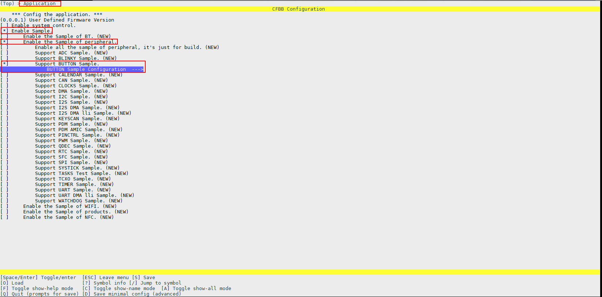

**图 2**  选择BUTTON支持的管脚<a name="fig215510307384"></a>  
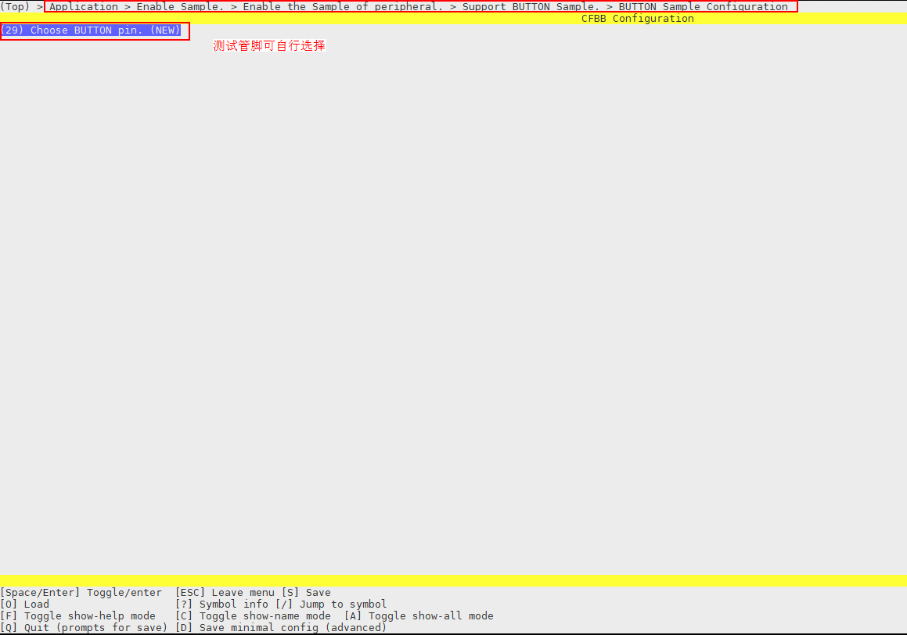

**图 3**  编译后的fwpkg<a name="fig41393494020"></a>  
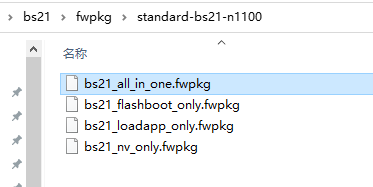

#### 运行<a name="ZH-CN_TOPIC_0000001995559790"></a>

1.  复位上电后，BUTTON初始化。
2.  单击BUTTON，出现如[图1](#fig1670512206265)所示日志。

**图 1**  BUTTON按下抬起<a name="fig1670512206265"></a>  
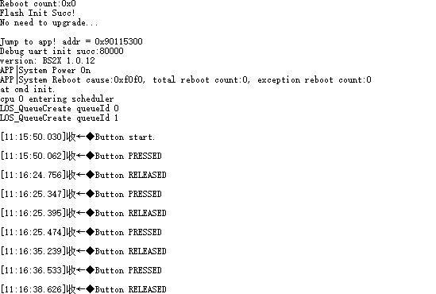

### CAN<a name="ZH-CN_TOPIC_0000001862278082"></a>


#### 编译<a name="ZH-CN_TOPIC_0000001862118266"></a>

> **说明：** 
>运行该用例时，需根据实际需求选择其他目录下的KCONFIG配置，请参考《BS2XV100 设备驱动 开发指南》的“KCONFIG配置”章节。

1.  在命令行下执行命令“python build.py standard-bs21a-1M menuconfig”，打开menuconfig配置界面。
2.  在menuconfig界面中选择CAN Sample，如[图1](#fig10563812175115)所示；如果需要修改CAN模式，则继续按[图2](#fig873353011112)选择，选择完成后按“Q”或者“q”选择“y”保存退出。
3.  使用IDE编译版本，编译出的版本包在“output\\bs21a\\fwpkg\\xxx”路径下，如下[图3](#fig1486953181217)所示。
4.  将编译出的版本按照“[烧录及运行](烧录及运行-57.md)”烧录到板子。

**图 1**  选择CAN Sample<a name="fig10563812175115"></a>  
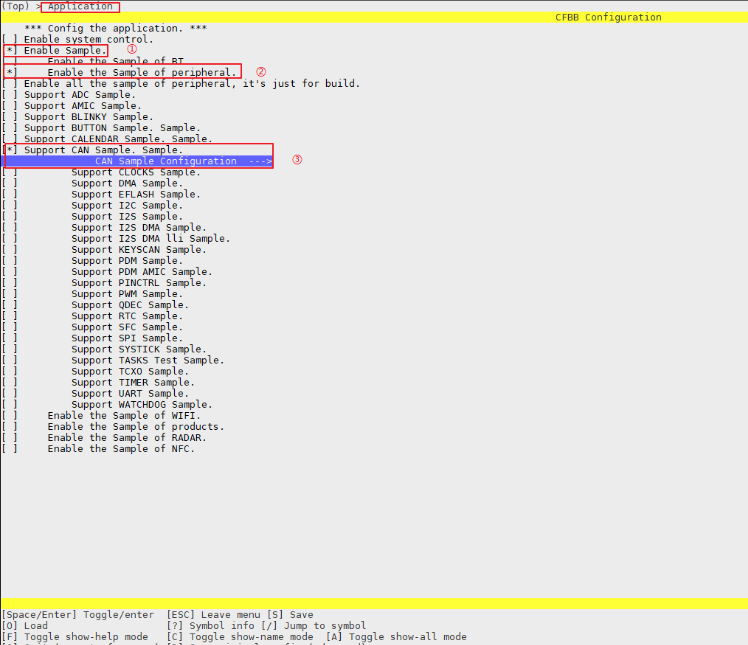

**图 2**  CANMODE<a name="fig873353011112"></a>  
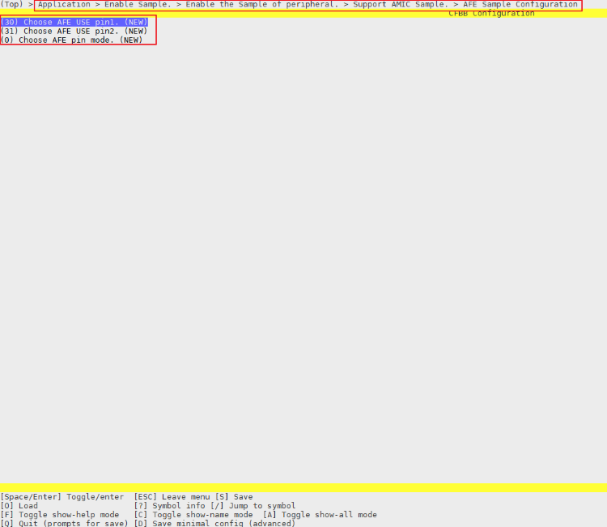

**图 3**  编译后的fwpkg<a name="fig1486953181217"></a>  
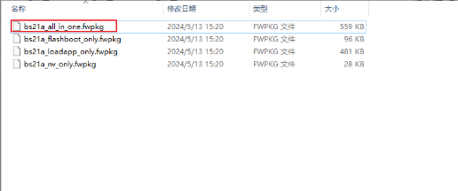

#### 运行<a name="ZH-CN_TOPIC_0000001908117725"></a>

CAN单板执行结果如[图1](#fig92641450144612)、[图2](#fig10171526114717)所示，当前默认CAN工作在循环模式。

**图 1**  CAN运行结果1<a name="fig92641450144612"></a>  
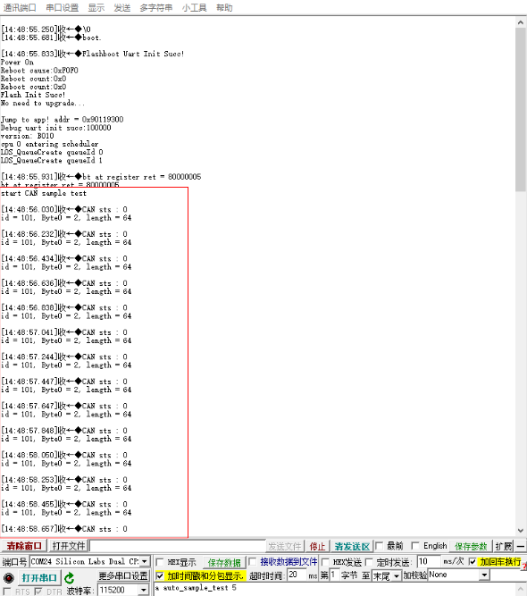

**图 2**  CAN运行结果2<a name="fig10171526114717"></a>  
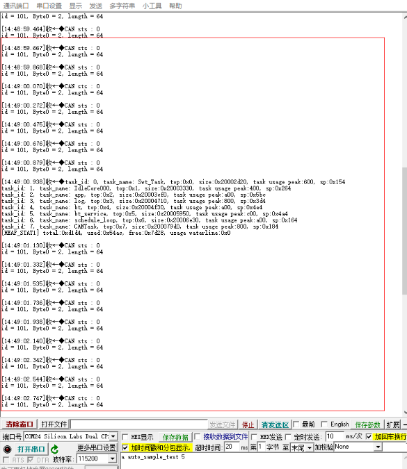

### CLOCK<a name="ZH-CN_TOPIC_0000002000214892"></a>


#### 编译<a name="ZH-CN_TOPIC_0000002036453213"></a>

> **说明：** 
>运行该用例时，需根据实际需求选择其他目录下的KCONFIG配置，请参考《BS2XV100 设备驱动 开发指南》的“KCONFIG配置”章节。

1.  在命令行下执行命令“python build.py standard-bs21 menuconfig”，打开menuconfig配置界面。
2.  在menuconfig界面中选择CLOCK Sample，如[图1](#fig157571841142713)所示；选择完成后按“Q”或者“q”选择“y”保存退出。
3.  使用IDE编译版本，编译出的版本包在“output\\bs21\\fwpkg\\xxx”路径下，如下[图2](#fig5575113515288)所示。
4.  将编译出的版本按照“[烧录及运行](烧录及运行-57.md)”烧录到板子。

**图 1**  选择CLOCK Sample<a name="fig157571841142713"></a>  
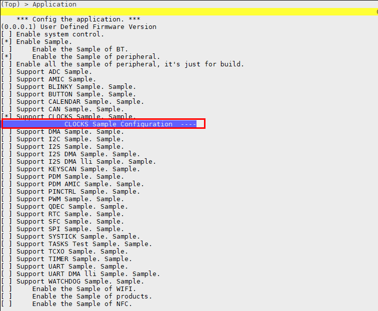

**图 2**  编译后的fwpkg<a name="fig5575113515288"></a>  


#### 运行<a name="ZH-CN_TOPIC_0000002000373198"></a>

将编译好的版本烧录即可运行。

### DMA<a name="ZH-CN_TOPIC_0000001823606460"></a>


#### 编译<a name="ZH-CN_TOPIC_0000001823446628"></a>

> **说明：** 
>运行该用例时，需根据实际需求选择其他目录下的KCONFIG配置，请参考《BS2XV100 设备驱动 开发指南》对应的“KCONFIG配置”章节。

1.  在命令行下执行命令“python build.py standard-bs21 menuconfig”，打开menuconfig配置界面。
2.  在menuconfig界面中选择DMA Sample，如[图1](#fig10563812175115)所示；如果内存到内存支持使用链表模式，则继续按[图2](#fig873353011112)选择，选择完成后按“Q”或者“q”选择“y”保存退出。
3.  使用IDE编译版本，编译出的版本包在“output\\bs21\\fwpkg\\xxx”路径下，如下[图3](#fig1486953181217)所示。
4.  将编译出的版本按照“[烧录及运行](烧录及运行-57.md)”烧录到板子。

**图 1**  选择DMA Sample<a name="fig10563812175115"></a>  
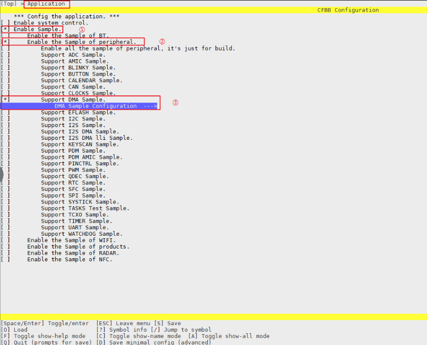

**图 2**  DMA  MEMORY LLI<a name="fig873353011112"></a>  
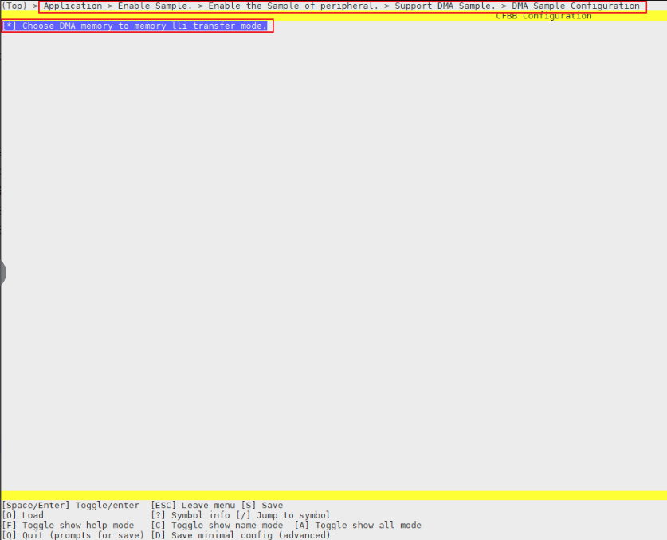

**图 3**  编译后的fwpkg<a name="fig1486953181217"></a>  
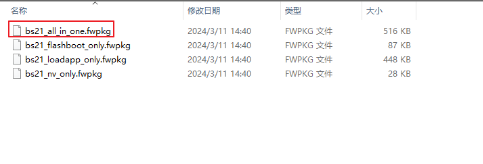

#### 运行<a name="ZH-CN_TOPIC_0000001870326233"></a>

DMA单板执行结果如[图1](#fig17590124125414)所示，内存到内存使用链表的结果如[图2](#fig68119910323)所示。

**图 1**  DMA运行结果<a name="fig17590124125414"></a>  
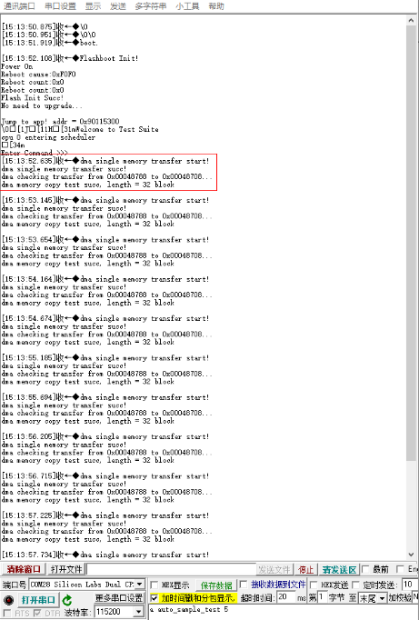

**图 2**  DMA支持链表运行结果<a name="fig68119910323"></a>  
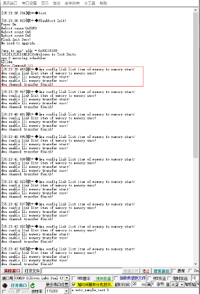

> **说明：** 
>DMA相关的其他接口使用情况可参考其他 IP SAMPLE使用，如I2S DMA、2S DMA  LLI、I2C、SPI等。

### I2C<a name="ZH-CN_TOPIC_0000001870351697"></a>


#### 编译<a name="ZH-CN_TOPIC_0000001870351961"></a>

> **说明：** 
>运行该用例时，需根据实际需求选择其他目录下的KCONFIG配置，请参考《BS2XV100 设备驱动 开发指南》的“KCONFIG配置”章节。

1.  <a name="li168261215195810"></a>在命令行下执行命令“python build.py standard-bs21 menuconfig”，打开menuconfig配置界面。
2.  在menuconfig界面中选择I2C Sample，如[图1](#fig10563812175115)所示。
3.  <a name="li329013398596"></a>master侧则继续按[图2](#fig873353011112)所示选择（如果当前Sample master侧支持使用writeread接口，则继续按[图3](#fig11952330135615)选择）。
4.  进入到“drivers/drivers”路径下，打开I2C，如[图4](#fig17384141642219)打开，进入配置中，如[图5](#fig154728249225)所示，完成I2C基础配置，此时I2C为轮询模式；可在此基础上修改，将I2C配置为中断模式（[图6](#fig1693117307224)）、dma模式（[图7](#fig1916793718221)）、poll\_dma切换模式（[图8](#fig21871444162213)）。
5.  进入到“drivers/chips/Chip Configurations for bs2x"路径下，修改I2C bus口数量。如果使用的bus为1，如[图2](#fig873353011112)所示，bus\_id为1，则需要将I2C bus数量修改为2，如[图9](#fig3541217182311)；如果使用的bus为0，则不需要修改bus数。选择完成后按“Q”或者“q”选择“y”保存退出。
6.  <a name="li0964101511569"></a>使用IDE编译版本，编译出的版本包在“output\\bs21\\fwpkg\\xxx”路径下，如[图11](#fig1486953181217)所示。
7.  将编译出的版本按照“[烧录及运行](烧录及运行-57.md)”烧录到master侧的板子；同理，slave侧依次执行[步骤1](#li168261215195810)\~[步骤6](#li0964101511569)，但[步骤3](#li329013398596)按[图10](#fig885542191110)所示选择，并将编译出的版本按照“[烧录及运行](烧录及运行-57.md)”烧录到slave侧的板子。

**图 1**  选择I2C Sample<a name="fig10563812175115"></a>  
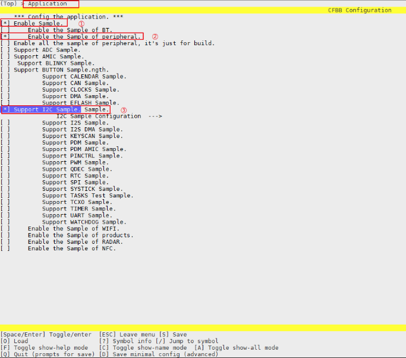

**图 2**  I2C主机选择<a name="fig873353011112"></a>  
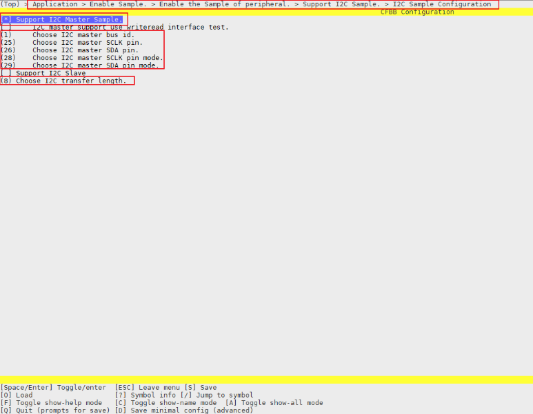

**图 3**  I2C主机侧支持使用writeread接口<a name="fig11952330135615"></a>  
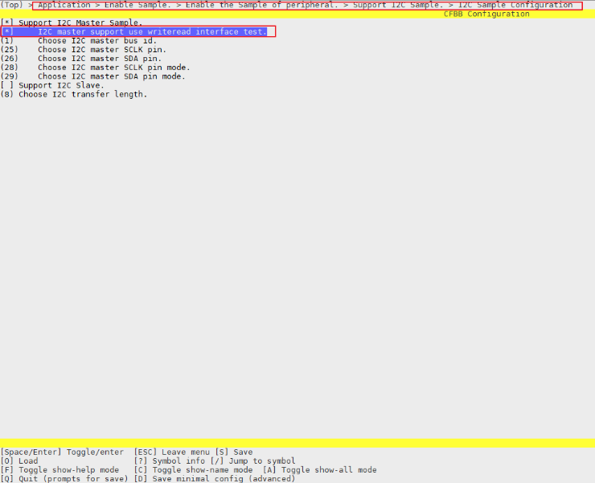

**图 4**  I2C功能打开<a name="fig17384141642219"></a>  
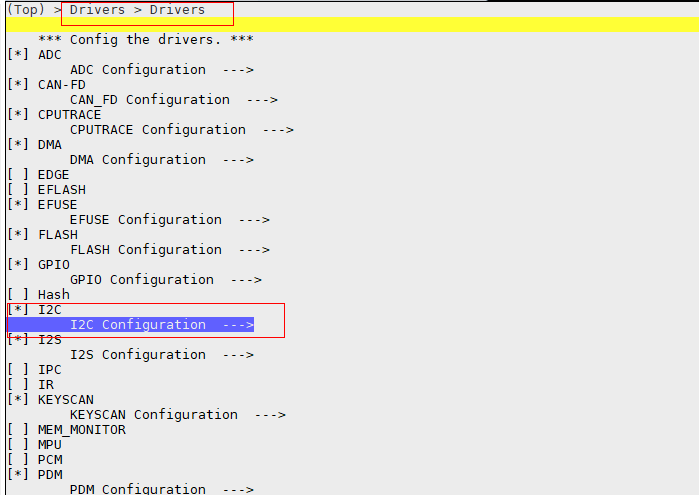

**图 5**  I2C轮询模式配置<a name="fig154728249225"></a>  


**图 6**  I2C中断模式配置<a name="fig1693117307224"></a>  
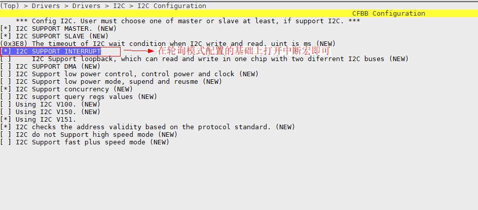

**图 7**  I2C dma模式配置<a name="fig1916793718221"></a>  

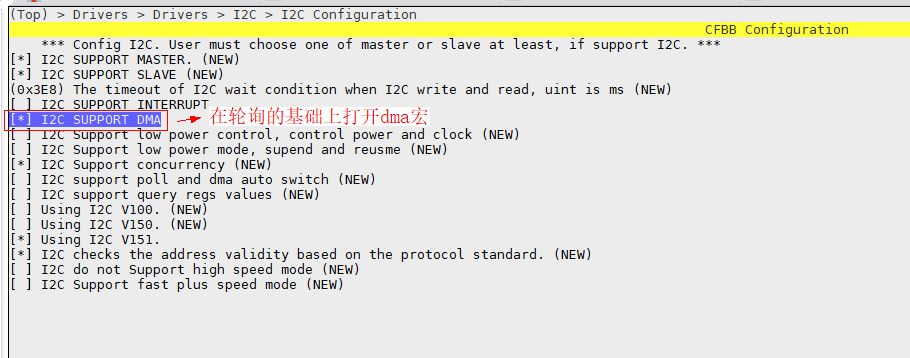

**图 8**  I2C 轮询和dma自动切换模式配置<a name="fig21871444162213"></a>  


**图 9**  I2C bus数修改<a name="fig3541217182311"></a>  
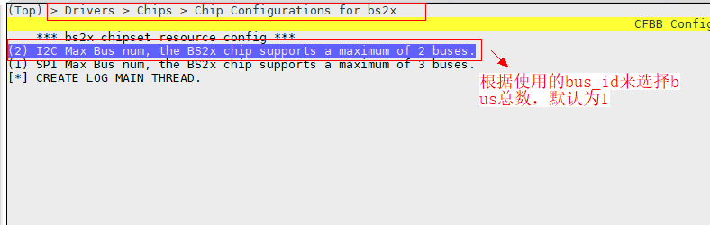

> **说明：** 
>该writeread接口只在轮询（poll）模式下可用，后续持续丰富中。

**图 10**  I2C从机选择<a name="fig885542191110"></a>  
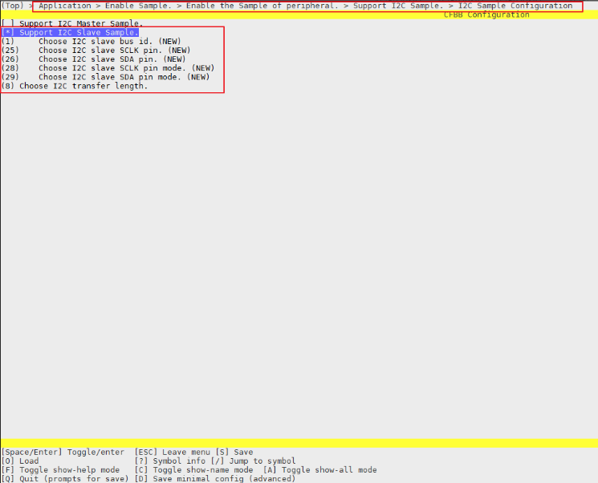

**图 11**  编译后的fwpkg<a name="fig1486953181217"></a>  
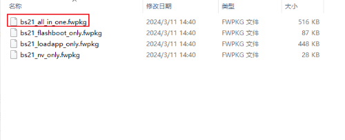

#### 运行<a name="ZH-CN_TOPIC_0000001870312781"></a>

I2C双板执行结果如[图1](#fig14932149182315)\~[图5](#fig16331837162315)所示。

**图 1**  I2C轮询双板主从交互结果<a name="fig14932149182315"></a>  
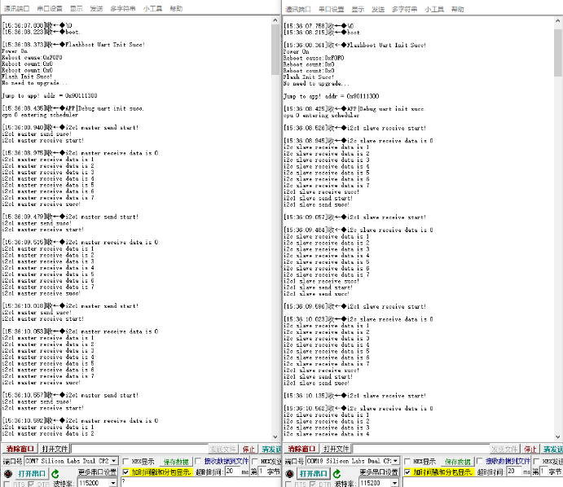

**图 2**  I2C轮询双板主从交互（master侧使用writeread接口）<a name="fig13818412254"></a>  
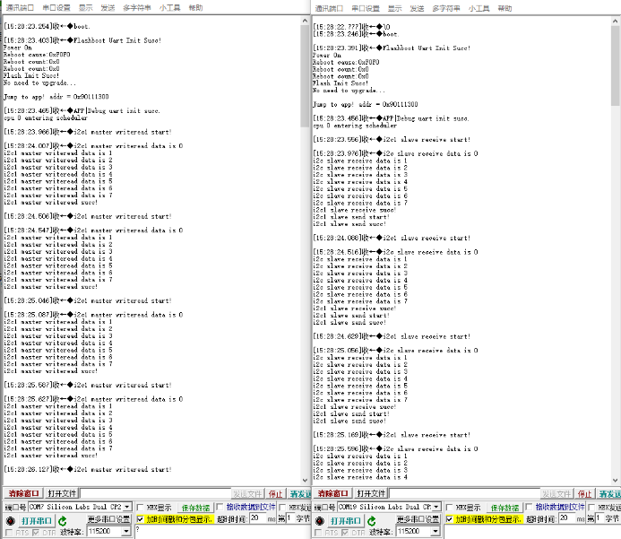

**图 3**  I2C中断双板主从交互结果<a name="fig469312791816"></a>  
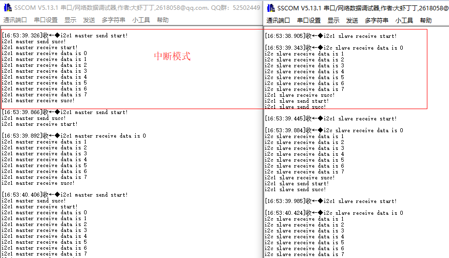

**图 4**  I2C dma双板主从交互结果<a name="fig11389201319188"></a>  
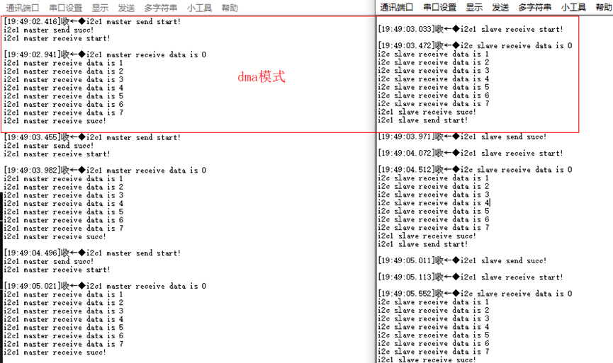

**图 5**  I2C poll自动切换dma双板主从交互结果<a name="fig16331837162315"></a>  
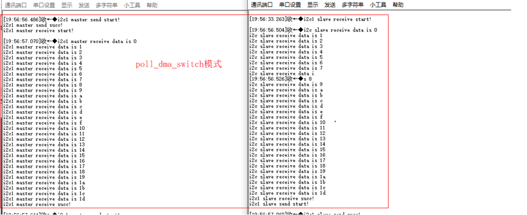

> **说明：** 
>I2C所用管脚必须要有上拉电阻，且主机端发送数据需知道从机地址，因此必须先执行从机的初始化操作，所以先复位slave，再复位master。

### I2S<a name="ZH-CN_TOPIC_0000001908119057"></a>


#### 编译<a name="ZH-CN_TOPIC_0000001862279462"></a>

1.  <a name="li372316212512"></a>在命令行下执行命令“python build.py standard-bs21 menuconfig”，打开menuconfig配置界面。
2.  在menuconfig界面中选择I2S Sample，如[图1](#fig207248212254)所示。
3.  <a name="li17233292516"></a>master侧按[图2](#fig872442152517)所示选择，选择完成后按“Q”或者“q”选择“y”保存退出。
4.  <a name="li172313217254"></a>使用IDE编译版本，编译出的版本包在“output\\bs21\\fwpkg\\xxx”路径下，如下[图4](#fig27241427257)所示。
5.  将编译出的版本按照“[烧录及运行](烧录及运行-57.md)”烧录到master侧的板子；同理，slave侧依次执行步骤[1](#li372316212512)\~。[4](#li172313217254)，但步骤[3](#li17233292516)按[图3](#fig18724122172510)所示选择，并将编译出的版本按照“[烧录及运行](烧录及运行-57.md)”烧录到slave侧的板子。

**图 1**  选择I2S Sample<a name="fig207248212254"></a>  
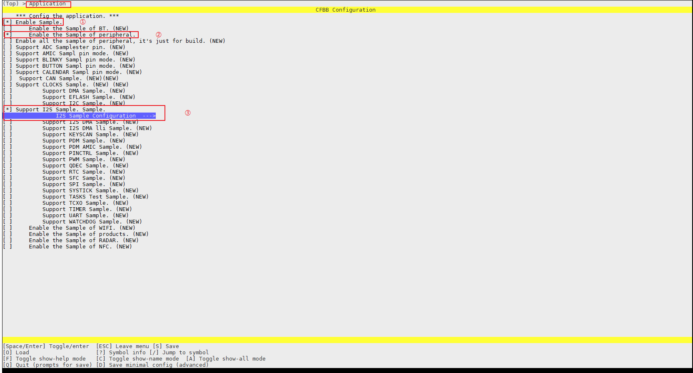

**图 2**  I2S MASTER选择<a name="fig872442152517"></a>  
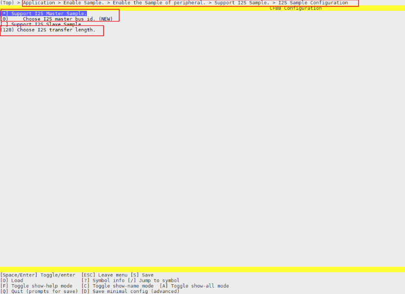

**图 3**  I2S SLAVE选择<a name="fig18724122172510"></a>  
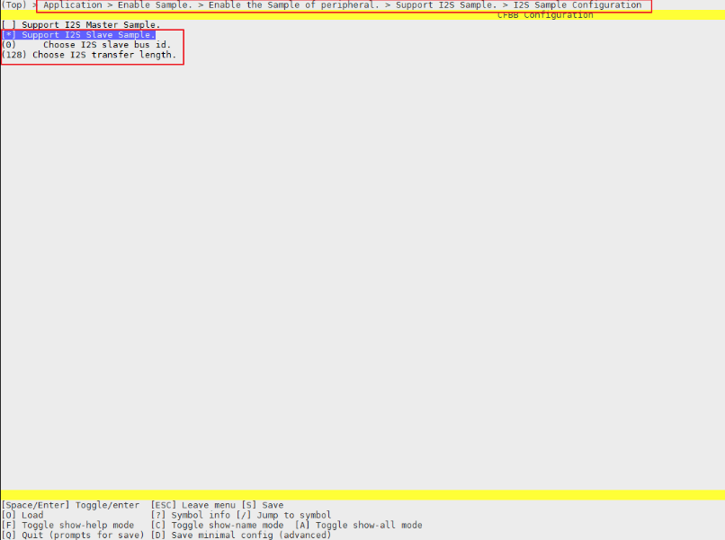

**图 4**  编译后的fwpkg<a name="fig27241427257"></a>  
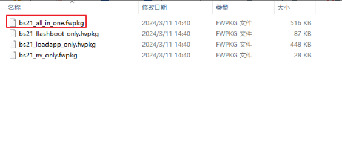

#### 运行<a name="ZH-CN_TOPIC_0000001908199377"></a>

I2S双板执行结果如下[图1](#fig17590124125414)所示，I2S运行时添加打印会导致cpu处理不及时，slave接收数据丢失，打印只是去验证master与slave是否正常通信，实际使用过程中不建议添加打印。

**图 1**  I2S 运行结果<a name="fig17590124125414"></a>  
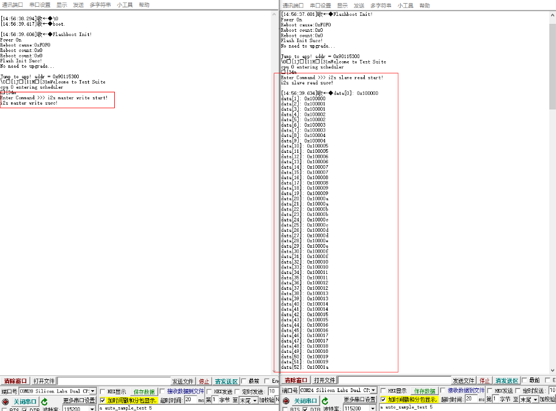

### I2S DMA<a name="ZH-CN_TOPIC_0000001870352841"></a>


#### 编译<a name="ZH-CN_TOPIC_0000001870353417"></a>

1.  <a name="li168261215195810"></a>在命令行下执行命令“python build.py standard-bs21 menuconfig”，打开menuconfig配置界面。
2.  在menuconfig界面中选择I2S DMA Sample，如[图1](#fig10563812175115)所示。
3.  <a name="li1870123015263"></a>master侧按[图2](#fig873353011112)所示选择，选择完成后按“Q”或者“q”选择“y”保存退出。
4.  <a name="li46811335327"></a>使用IDE编译版本，编译出的版本包在“output\\bs21\\fwpkg\\xxx”路径下，如下[图4](#fig1486953181217)所示。
5.  将编译出的版本按照“[烧录及运行](烧录及运行-57.md)”烧录到master侧的板子；同理，slave侧依次执行步骤[1](#li168261215195810)\~[4](#li46811335327)，但步骤[3](#li1870123015263)按[图3](#fig11952330135615)所示选择，并将编译出的版本按照“[烧录及运行](烧录及运行-57.md)”烧录到slave侧的板子。

**图 1**  选择I2S DMA Sample<a name="fig10563812175115"></a>  
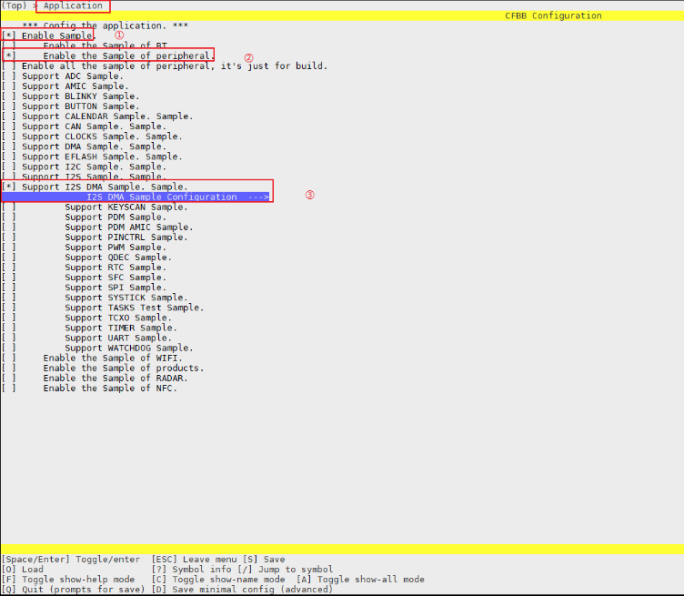

**图 2**  I2S DMA MASTER选择<a name="fig873353011112"></a>  
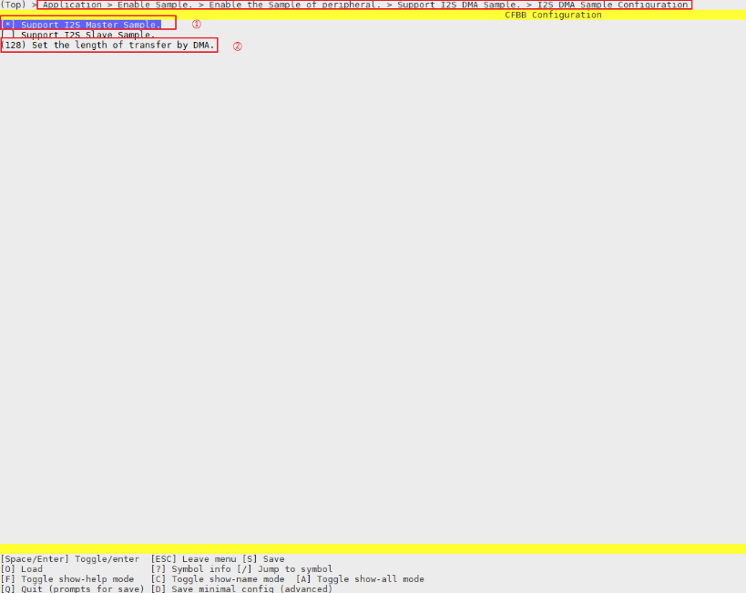

**图 3**  I2S DMA SLAVE选择<a name="fig11952330135615"></a>  


**图 4**  编译后的fwpkg<a name="fig1486953181217"></a>  
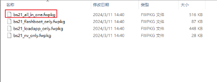

#### 运行<a name="ZH-CN_TOPIC_0000001870353929"></a>

I2S DMA双板执行结果如下[图1](#fig17590124125414)所示。

**图 1**  I2S DMA运行结果<a name="fig17590124125414"></a>  
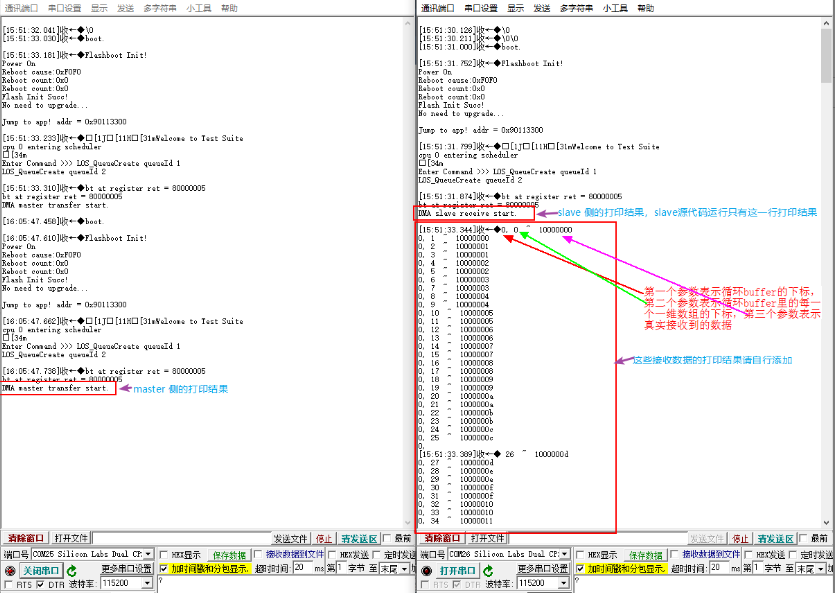

> **说明：** 
>slave侧源代码没有进行显示接收数据的log，需自行添加，且要保证数据完全接收，需参考“[I2S DMA LLI](I2S-DMA-LLI.md)  ”。

### I2S DMA LLI<a name="ZH-CN_TOPIC_0000001867203060"></a>


#### 编译<a name="ZH-CN_TOPIC_0000001913162337"></a>

1.  <a name="li168261215195810"></a>在命令行下执行命令“python build.py standard-bs21 menuconfig”，打开menuconfig配置界面。
2.  在menuconfig界面中选择I2S DMA LLI Sample，如[图1](#fig10563812175115)所示。
3.  <a name="li1870123015263"></a>master侧按[图2](#fig873353011112)所示选择，选择完成后按“Q”或者“q”选择“y”保存退出。
4.  <a name="li46811335327"></a>使用IDE编译版本，编译出的版本包在“output\\bs21\\fwpkg\\xxx”路径下，如下[图4](#fig1486953181217)所示。
5.  将编译出的版本按照“[烧录及运行](烧录及运行-57.md)”烧录到master侧的板子；同理，slave侧依次执行步骤[1](#li168261215195810)\~。[4](#li46811335327)，但步骤[3](#li1870123015263)按[图3](#fig11952330135615)所示选择，并将编译出的版本按照“[烧录及运行](烧录及运行-57.md)”烧录到slave侧的板子。

**图 1**  选择I2S DMA LLI Sample<a name="fig10563812175115"></a>  
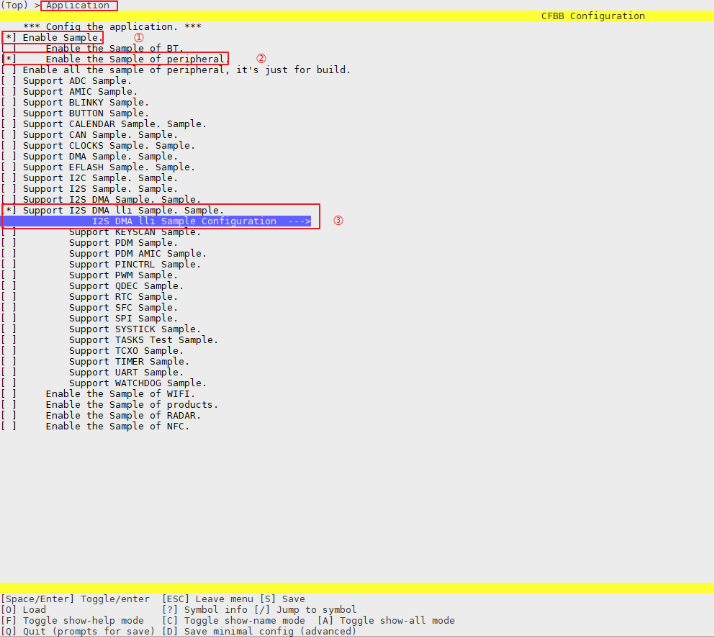

**图 2**  I2S DMA LLI MASTER选择<a name="fig873353011112"></a>  
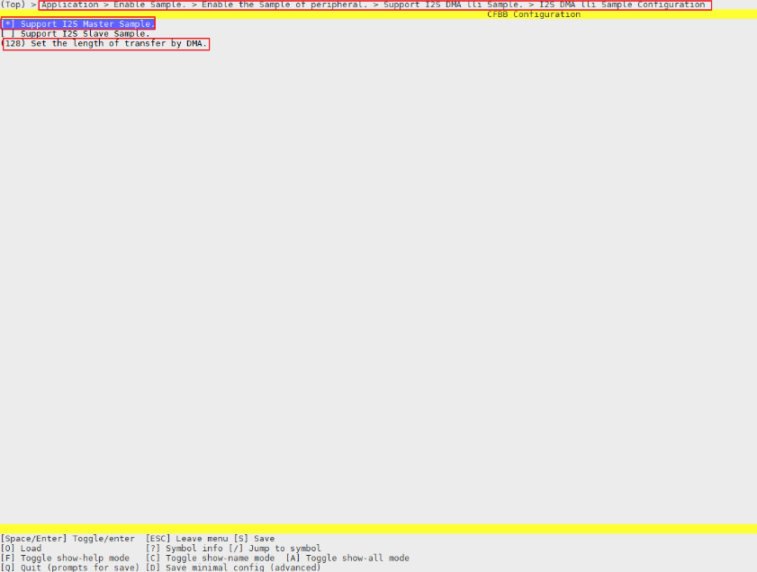

**图 3**  I2S DMA LLI SLAVE选择<a name="fig11952330135615"></a>  
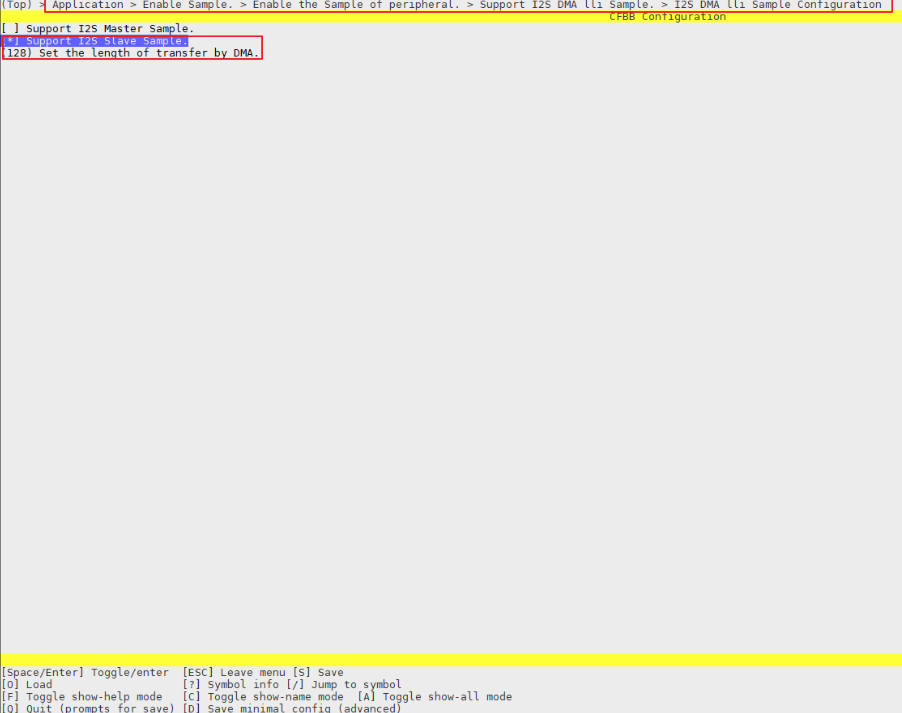

**图 4**  编译后的fwpkg<a name="fig1486953181217"></a>  
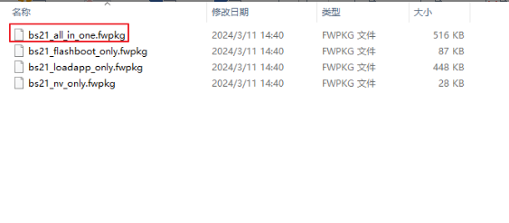

#### 运行<a name="ZH-CN_TOPIC_0000001867362940"></a>

I2S DMA LLI双板执行结果如下[图1](#fig17590124125414)所示。

**图 1**  I2S DMA LLI 运行结果<a name="fig17590124125414"></a>  
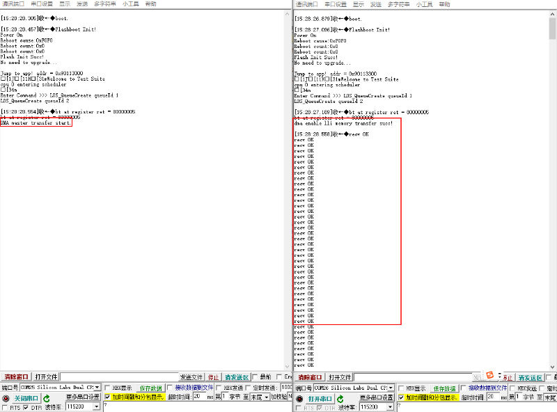

执行该sample时必须打开以[图2](#fig23511954195910)所示的两个宏。

**图 2**  DMA 相关宏<a name="fig23511954195910"></a>  
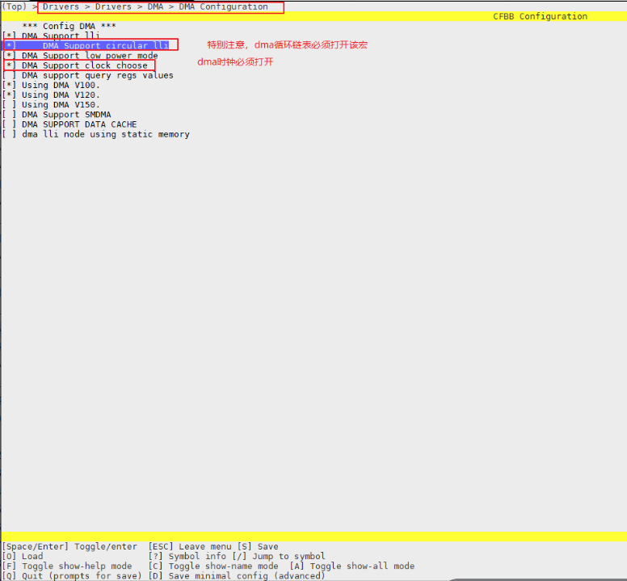

### KEYSCAN<a name="ZH-CN_TOPIC_0000001862280158"></a>


#### 编译<a name="ZH-CN_TOPIC_0000001908119773"></a>

> **说明：** 
>运行该用例时，需根据实际需求选择其他目录下的KCONFIG配置，请参考《BS2XV100 设备驱动 开发指南》的“KCONFIG配置”章节。

1.  在命令行下执行命令“python build.py standard-bs21 menuconfig”，打开menuconfig配置界面。
2.  在menuconfig界面中选择KEYSCAN Sample，如[图1](#fig276708102)所示，选择完成后按“Q”或者“q”选择“y”保存退出。
3.  使用IDE编译版本，编译出的版本包在“output\\bs21\\fwpkg\\xxx”路径下，如下[图2](#fig77615081019)所示。
4.  将编译出的版本按照“[烧录及运行](烧录及运行-57.md)”烧录到板子。

**图 1**  选择KEYSCAN Sample<a name="fig276708102"></a>  
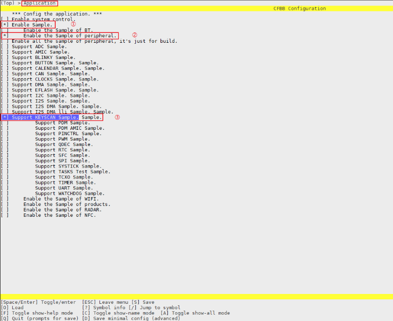

**图 2**  编译后的fwpkg<a name="fig77615081019"></a>  
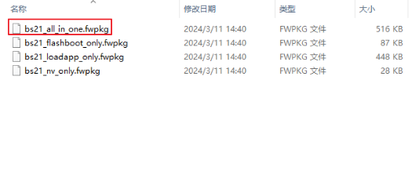

#### 运行<a name="ZH-CN_TOPIC_0000001908200057"></a>

复位后，按键，串口显示对应的键值，KEYSCAN单板执行结果如下[图1](#fig6427733121611)所示，仅以六键为例。

**图 1**  KEYSCAN运行结果<a name="fig6427733121611"></a>  
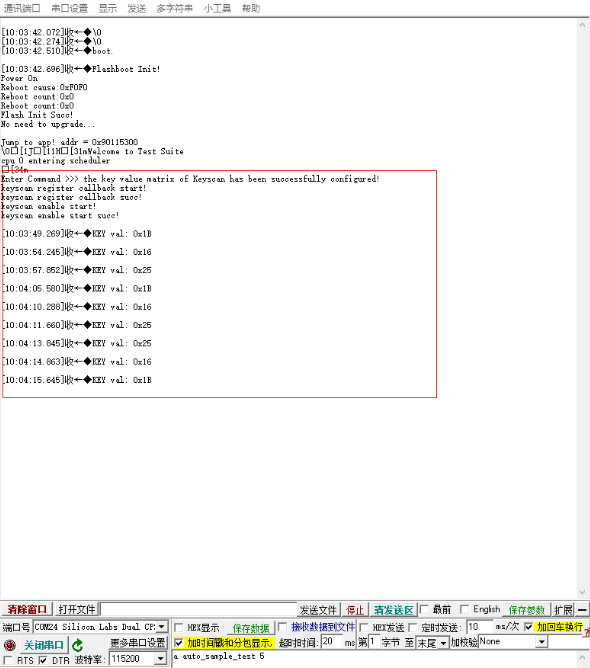

### PDM<a name="ZH-CN_TOPIC_0000001908200573"></a>


#### 编译<a name="ZH-CN_TOPIC_0000001908120285"></a>

> **说明：** 
>运行该用例时，需根据实际需求选择其他目录下的KCONFIG配置，请参考《BS2XV100 设备驱动 开发指南》对应的DMA与PDM的“KCONFIG配置”章节。

1.  在命令行下执行命令“python build.py standard-bs21 menuconfig”，打开menuconfig配置界面。
2.  在menuconfig界面中选择PDM  Sample，如[图1](#fig106431326122119)所示；如果需要修改配置选项，则继续按[图2](#fig56435266213)选择，选择完成后按“Q”或者“q”选择“y”保存退出。
3.  使用IDE编译版本，编译出的版本包在“output\\bs21\\fwpkg\\xxx”路径下。
4.  将编译出的版本按照“[烧录及运行](烧录及运行-57.md)”烧录到板子。

**图 1**  选择PDM Sample<a name="fig106431326122119"></a>  
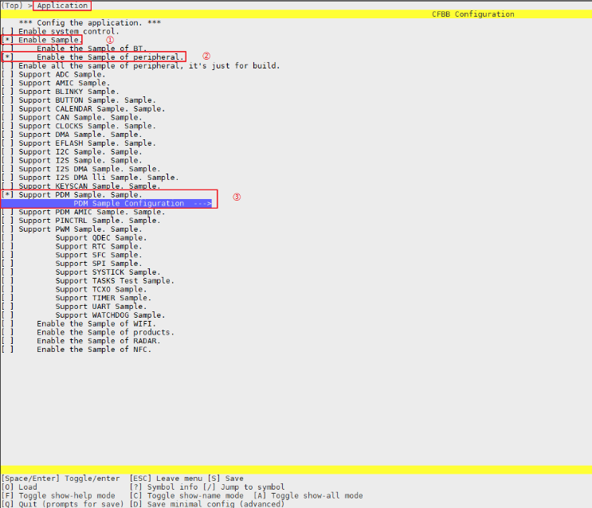

**图 2**  PDM Config 选择<a name="fig56435266213"></a>  
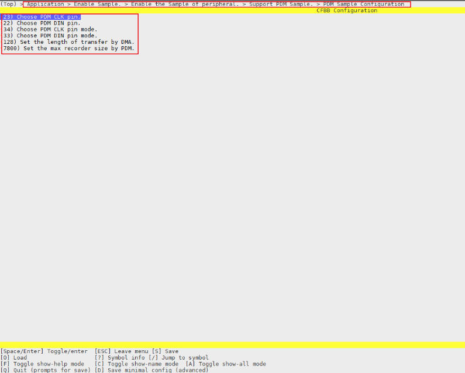

**图 3**  编译后的fwpkg<a name="fig116431126152115"></a>  
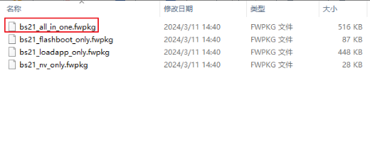

#### 运行<a name="ZH-CN_TOPIC_0000001862120830"></a>

1.  单板复位后，输入声音源，立刻录音，串口显示结果如[图1](#fig993812131095)所示。
2.  连接Jlink，通过“savebin <filename\> <addr\> <numBytes\[hex\]\>”命令将数据保存出来，如[图2](#fig1979815471591)所示，通过Notepad打开该文件，如[图3](#fig181856142113)所示。
3.  使用Audacity音频工具，单击文件 -\> 导入 -\>原始数据，将保存出来的音频数据导入进去，且按[图4](#fig1659419568113)所示选择配置项，结果如[图5](#fig1080713579213)所示。
4.  单击播放，用耳机侦听，声音能够正常播放即可。

**图 1**  PDM 运行结果<a name="fig993812131095"></a>  
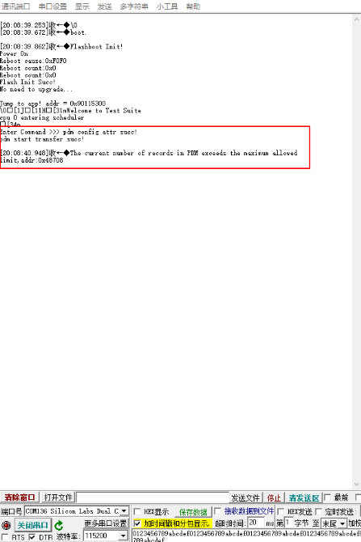

**图 2**  Jlink 保存数据<a name="fig1979815471591"></a>  
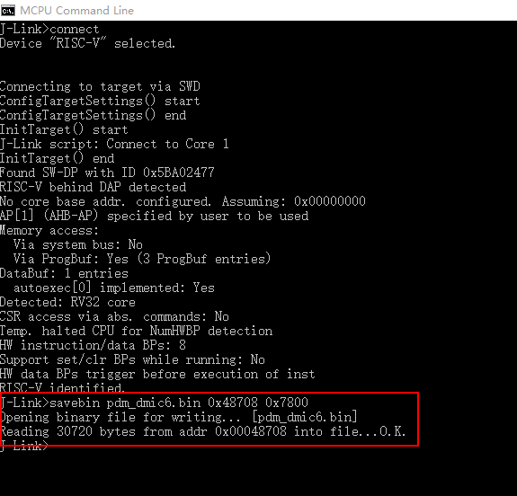

**图 3**  Notepad数据显示<a name="fig181856142113"></a>  
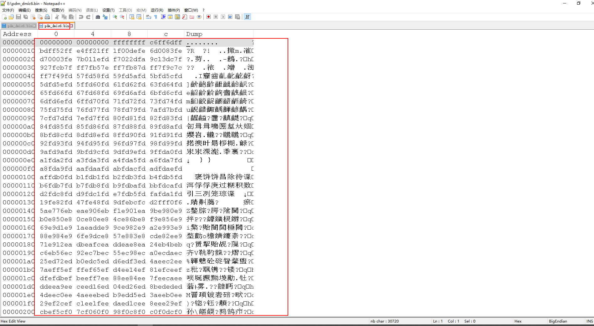

**图 4**  Audacity配置选项<a name="fig1659419568113"></a>  
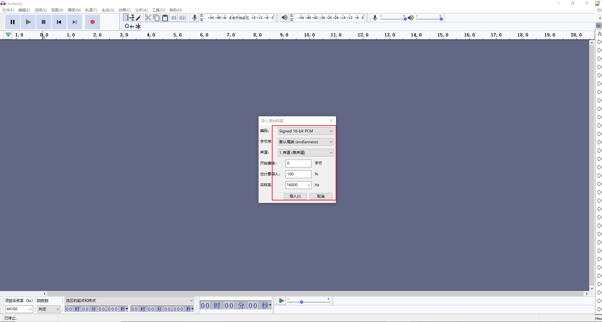

**图 5**  Audacity音频结果<a name="fig1080713579213"></a>  
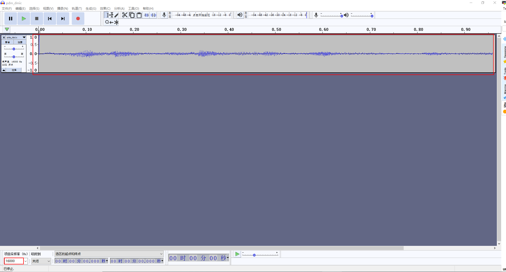

### PDM AMIC<a name="ZH-CN_TOPIC_0000001929763781"></a>


#### 编译<a name="ZH-CN_TOPIC_0000001883964914"></a>

> **说明：** 
>运行该用例时，需根据实际需求选择其他目录下的KCONFIG配置，请参考《BS2XV100 设备驱动 开发指南》对应的DMA与PDM的“KCONFIG配置”章节。

1.  在命令行下执行命令“python build.py standard-bs21 menuconfig”，打开menuconfig配置界面。
2.  在menuconfig界面中选择PDM AMIC Sample，如[图1](#fig106431326122119)所示；如果需要修改配置选项，则继续按[图2](#fig56435266213)选择，选择完成后按“Q”或者“q”选择“y”保存退出。
3.  使用IDE编译版本，编译出的版本包在“output\\bs21\\fwpkg\\xxx”路径下。
4.  将编译出的版本按照“[烧录及运行](烧录及运行-57.md)”烧录到板子。

**图 1**  选择PDM AMIC Sample<a name="fig106431326122119"></a>  
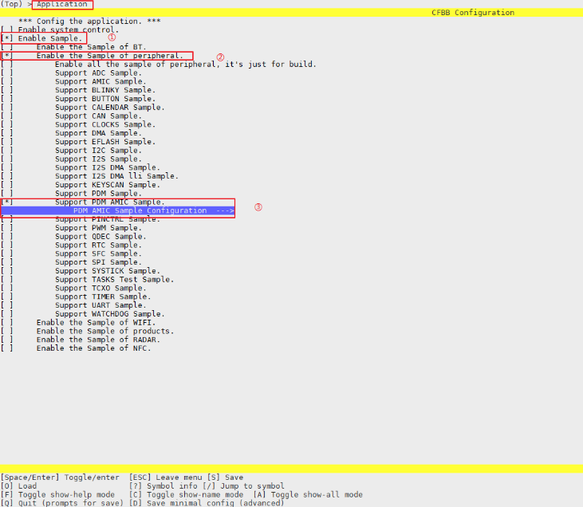

**图 2**  PDM AMIC Config 选择<a name="fig56435266213"></a>  
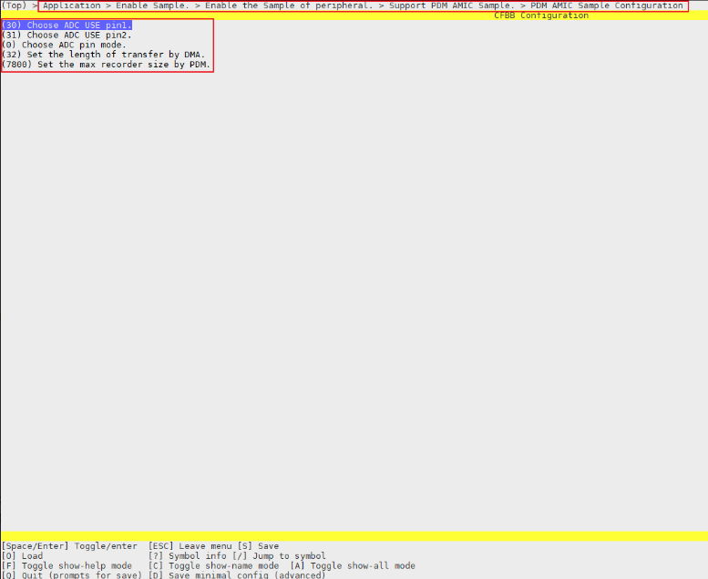

**图 3**  编译后的fwpkg<a name="fig116431126152115"></a>  
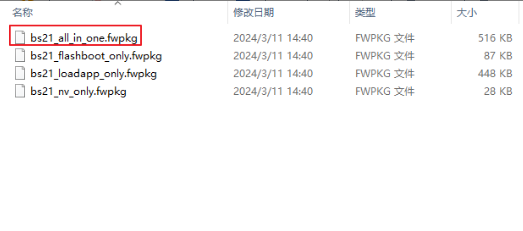

#### 运行<a name="ZH-CN_TOPIC_0000001929844121"></a>

1.  单板复位后，输入声音源，立刻录音，串口显示结果如[图1](#fig993812131095)所示。
2.  连接Jlink，通过“savebin <filename\> <addr\> <numBytes\[hex\]\>”命令将数据保存出来，如[图2](#fig1979815471591)所示，通过Notepad打开该文件，如[图3](#fig181856142113)所示。
3.  使用Audacity音频工具，单击文件 -\> 导入 -\>原始数据，将保存出来的音频数据导入进去，且按下[图4](#fig1659419568113)所示选择配置项，结果如[图5](#fig1080713579213)所示。
4.  单击播放，用耳机侦听，声音能够正常播放即可。

**图 1**  PDM AMIC运行结果<a name="fig993812131095"></a>  
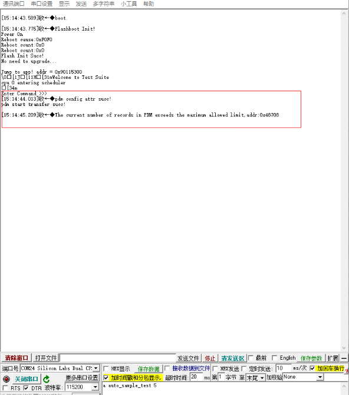

**图 2**  Jlink 保存数据<a name="fig1979815471591"></a>  


**图 3**  Notepad数据显示<a name="fig181856142113"></a>  
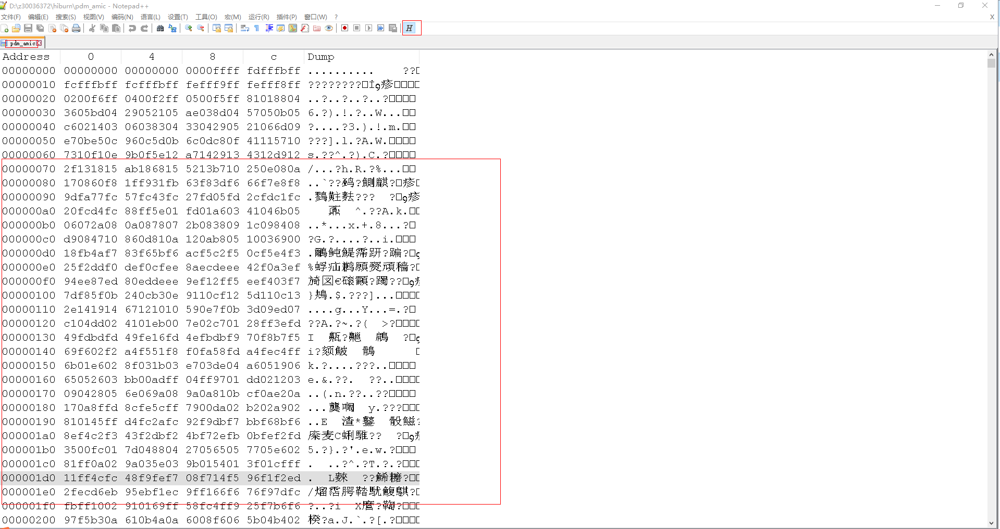

**图 4**  Audacity配置选项<a name="fig1659419568113"></a>  
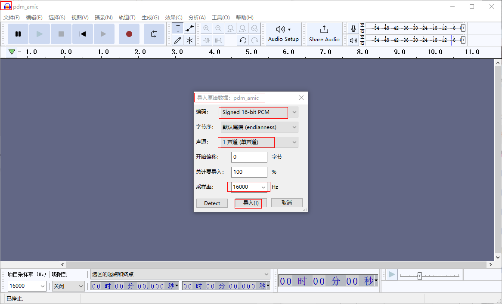

**图 5**  Audacity音频结果<a name="fig1080713579213"></a>  
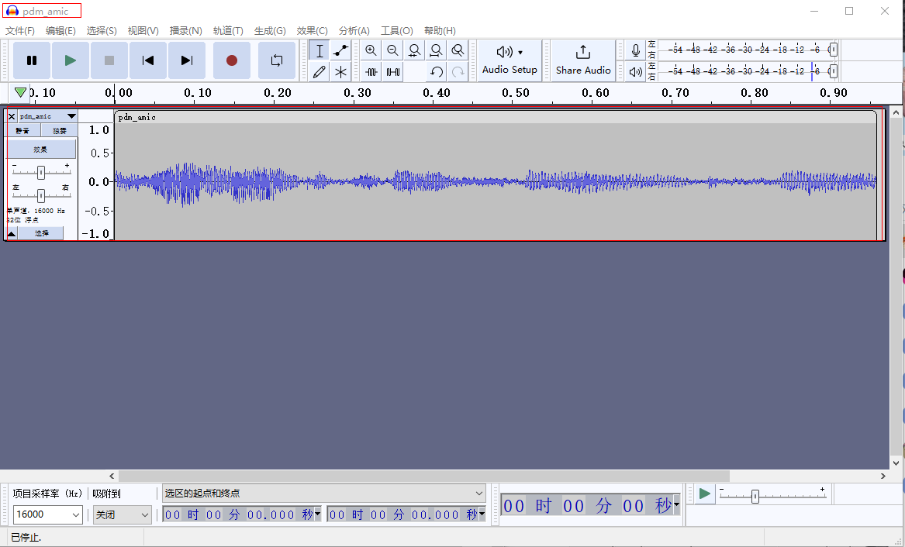

### PINCTRL<a name="ZH-CN_TOPIC_0000001908120485"></a>


#### 编译<a name="ZH-CN_TOPIC_0000001862121050"></a>

> **说明：** 
>运行该用例时，需根据实际需求选择其他目录下的KCONFIG配置，请参考《BS2XV100 设备驱动 开发指南》的“KCONFIG配置”章节。

1.  在命令行下执行命令“python build.py standard-bs21 menuconfig”，打开menuconfig配置界面。
2.  在menuconfig界面中选择PINCTRL Sample，如[图1](#fig106431326122119)所示；如果需要修改测试管脚，则继续按[图2](#fig56435266213)选择，选择完成后按“Q”或者“q”选择“y”保存退出。
3.  使用IDE编译版本，编译出的版本包在“output\\bs21\\fwpkg\\xxx”路径下，如[图3](#fig116431126152115)所示。
4.  将编译出的版本按照“[烧录及运行](烧录及运行-57.md)”烧录到板子。

**图 1**  选择PINCTRL Sample<a name="fig106431326122119"></a>  
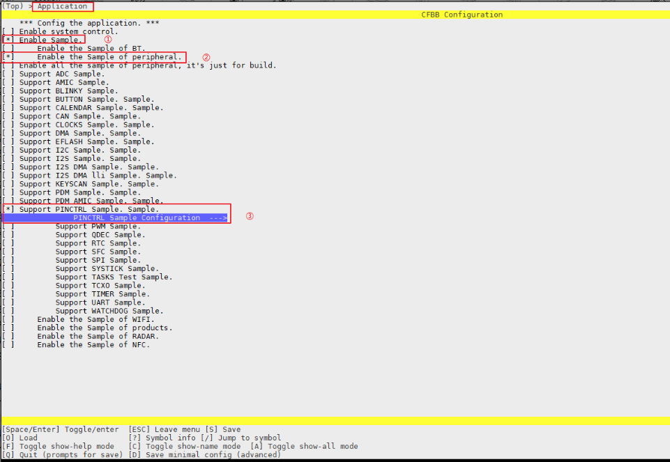

**图 2**  PINCTRL PIN 选择<a name="fig56435266213"></a>  
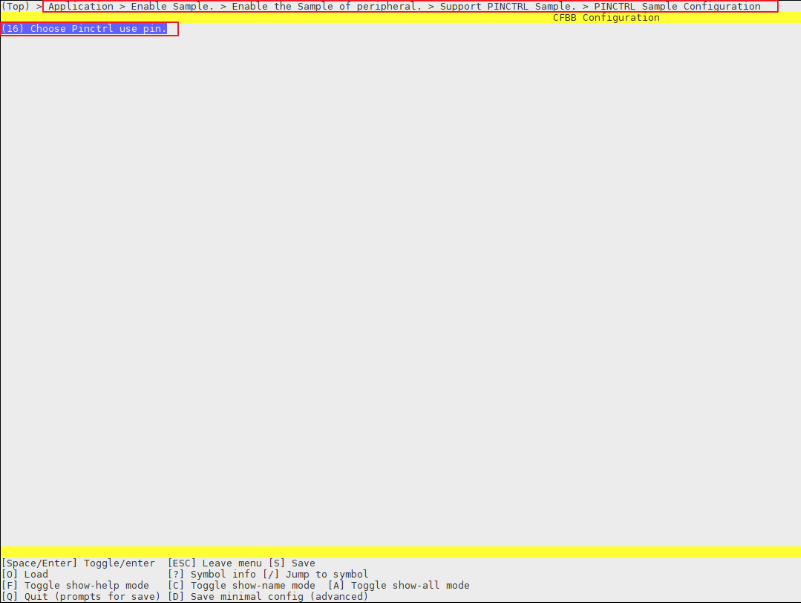

**图 3**  编译后的fwpkg<a name="fig116431126152115"></a>  
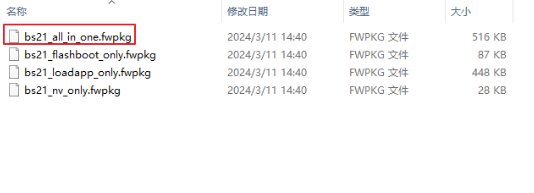

#### 运行<a name="ZH-CN_TOPIC_0000001908200781"></a>

PINCTRL单板执行结果如下[图1](#fig17590124125414)所示。

**图 1**  PINCTRL运行结果<a name="fig17590124125414"></a>  
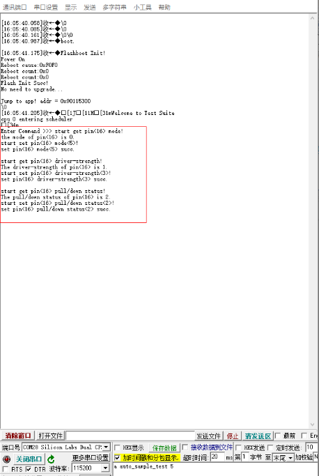

### PWM<a name="ZH-CN_TOPIC_0000001862281258"></a>


#### 编译<a name="ZH-CN_TOPIC_0000001908201169"></a>

> **说明：** 
>运行该用例时，需根据实际需求选择其他目录下的KCONFIG配置，请参考《BS2XV100 设备驱动 开发指南》的“KCONFIG配置”章节。

1.  在命令行下执行命令“python build.py standard-bs21 menuconfig”，打开menuconfig配置界面。
2.  在menuconfig界面中选择PWM Sample，如[图1](#fig106431326122119)所示；如果需要修改配置选项，则继续按[图2](#fig56435266213)选择，选择完成后按“Q”或者“q”选择“y”保存退出。
3.  channel与pin mode对应关系如下图[图4](#fig9985131131317)所示。
4.  使用IDE编译版本，编译出的版本包在“output\\bs21\\fwpkg\\xxx”路径下，如[图3](#fig116431126152115)所示。
5.  将编译出的版本按照“[烧录及运行](烧录及运行-57.md)”烧录到板子。

**图 1**  选择PWM Sample<a name="fig106431326122119"></a>  
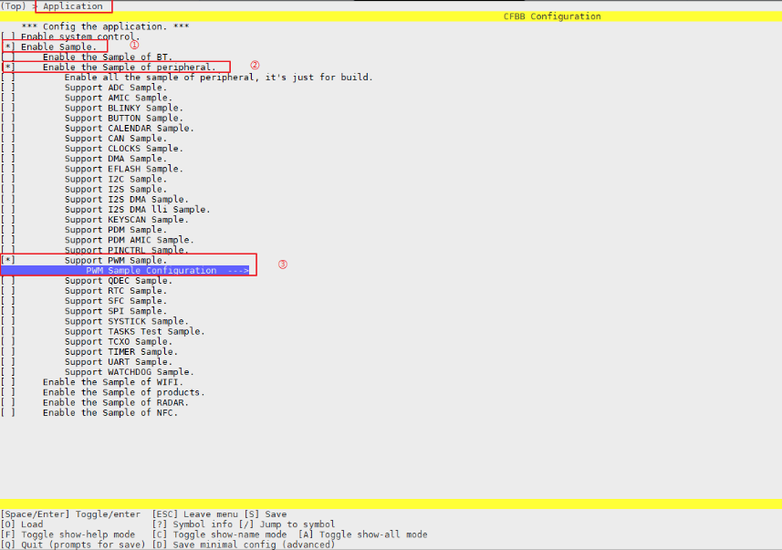

**图 2**  PWM Config 选择<a name="fig56435266213"></a>  


**图 3**  编译后的fwpkg<a name="fig116431126152115"></a>  
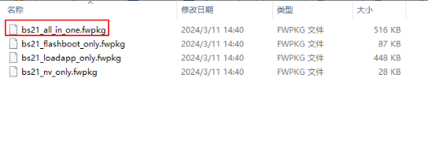

**图 4**  channel与pin mode对应关系<a name="fig9985131131317"></a>  
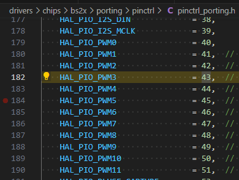

#### 运行<a name="ZH-CN_TOPIC_0000001862121438"></a>

PWM单板执行结果如[图1](#fig17590124125414)所示，使用逻辑分析仪抓出来的波形如[图2](#fig17322123210289)所示。

**图 1**  PWM运行结果<a name="fig17590124125414"></a>  
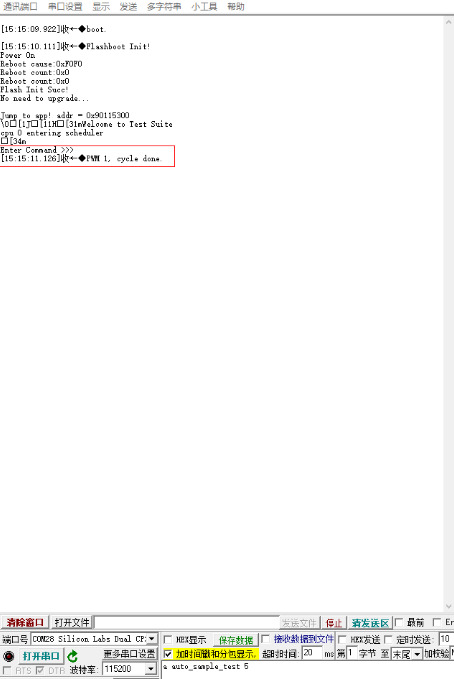

**图 2**  PWM 波形<a name="fig17322123210289"></a>  
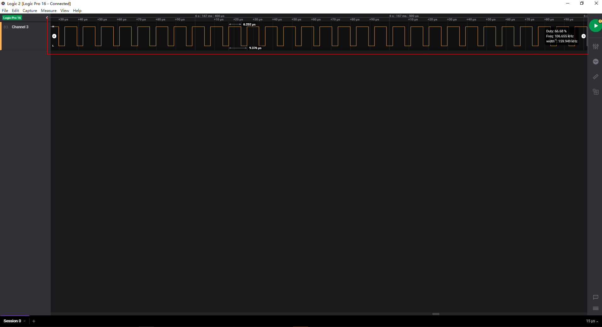

### QDEC<a name="ZH-CN_TOPIC_0000001908201641"></a>


#### 编译<a name="ZH-CN_TOPIC_0000001862121894"></a>

1.  在命令行下执行命令“python build.py standard-bs21 menuconfig”，打开menuconfig配置界面。
2.  在menuconfig界面中选择QDEC Sample，如[图1](#fig5310123193014)所示，如果需要修改QDEC管脚配置选项，则继续按[图2](#fig69077322315)配置选择，选择完成后按“Q”或者“q”选择“y”保存退出。
3.  使用IDE编译版本，编译出的版本包在“output\\bs21\\fwpkg\\xxx”路径下，如[图3](#fig1467312273252)所示。
4.  将编译出的版本按照“[烧录及运行](烧录及运行-57.md)”烧录到板子。

**图 1**  选择QDEC Sample并进行QDEC配置<a name="fig5310123193014"></a>  
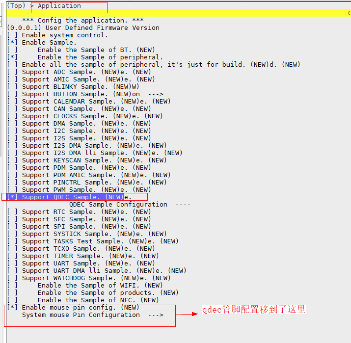

**图 2**  QDEC管脚配置<a name="fig69077322315"></a>  
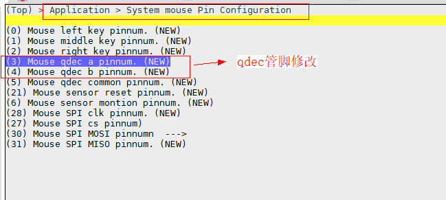

**图 3**  编译后的fwpkg<a name="fig1467312273252"></a>  
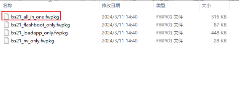

#### 运行<a name="ZH-CN_TOPIC_0000001908121357"></a>

复位后，转动滚轮，串口显示对应值的变化，QDEC单板执行结果如下[图1](#fig6427733121611)所示。

**图 1**  QDEC运行结果<a name="fig6427733121611"></a>  
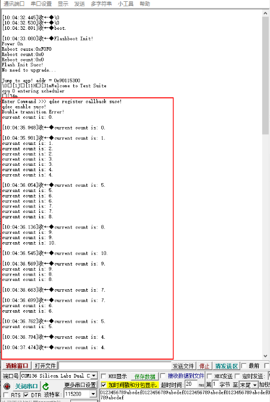

### RTC<a name="ZH-CN_TOPIC_0000001908201905"></a>


#### 编译<a name="ZH-CN_TOPIC_0000001862281998"></a>

1.  在命令行下执行命令“python build.py standard-bs21 menuconfig”，打开menuconfig配置界面。
2.  在menuconfig界面中选择RTC Sample，如[图1](#fig106431326122119)所示，选择完成后按“Q”或者“q”选择“y”保存退出。
3.  使用IDE编译版本，编译出的版本包在“output\\bs21\\fwpkg\\xxx”路径下，如[图2](#fig116431126152115)所示。
4.  将编译出的版本按照“[烧录及运行](烧录及运行-57.md)”烧录到板子。

**图 1**  选择RTC Sample<a name="fig106431326122119"></a>  
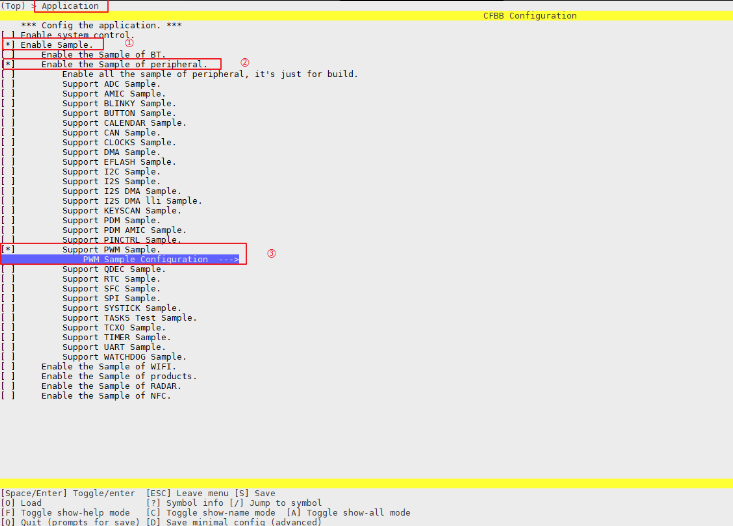

**图 2**  编译后的fwpkg<a name="fig116431126152115"></a>  
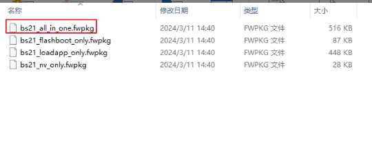

#### 运行<a name="ZH-CN_TOPIC_0000001862122150"></a>

RTC单板执行结果如下[图1](#fig993812131095)所示。

**图 1**  RTC运行结果<a name="fig993812131095"></a>  
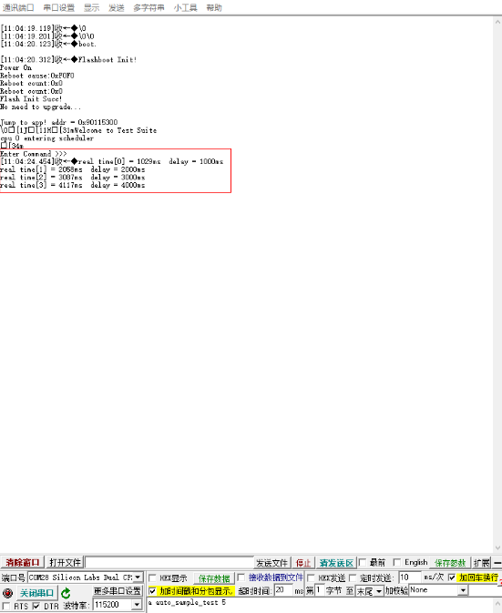

### SFC<a name="ZH-CN_TOPIC_0000002034968981"></a>


#### 编译<a name="ZH-CN_TOPIC_0000001998891920"></a>

1.  在命令行下执行命令“python build.py standard-bs21 menuconfig”，打开menuconfig配置界面。
2.  在menuconfig界面中选择SFC Sample，如[图1](#fig1370984312265)所示，选择完成后按“Q”或者“q”选择“y”保存退出。
3.  使用IDE编译版本，编译出的版本包在“output\\bs21\\fwpkg\\xxx”路径下，如[图2](#fig14215115217298)所示。
4.  将编译出的版本按照“[烧录及运行](烧录及运行-57.md)”烧录到板子。

**图 1**  SFC Sample选择<a name="fig1370984312265"></a>  
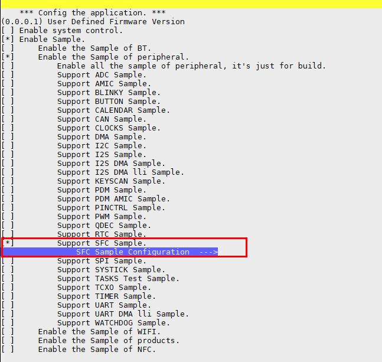

**图 2**  编译后的fwpkg<a name="fig14215115217298"></a>  
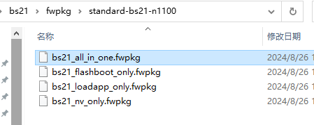

#### 运行<a name="ZH-CN_TOPIC_0000002035090253"></a>

SFC单板执行结果如下[图1](#fig10873195615346)[图2](#fig441010374359)所示。

**图 1**  SFC开始运行<a name="fig10873195615346"></a>  


**图 2**  SFC运行结果校验<a name="fig441010374359"></a>  


### SPI<a name="ZH-CN_TOPIC_0000001870354253"></a>


#### 编译<a name="ZH-CN_TOPIC_0000001870314465"></a>

> **说明：** 
>运行该用例时，需根据实际需求选择其他目录下的KCONFIG配置，请参考《BS2XV100 设备驱动 开发指南》的“KCONFIG配置”章节。

1.  <a name="li168261215195810"></a>在命令行下执行命令“python build.py standard-bs21 menuconfig”，打开menuconfig配置界面。
2.  在menuconfig界面中选择SPI Sample，如[图1](#fig10563812175115)所示。
3.  <a name="li1870123015263"></a>master侧则继续按[图2](#fig873353011112)所示选择（如果当前Sample master侧支持使用writeread接口，则继续按[图3](#fig11952330135615)选择），选择完成后按“Q”或者“q”选择“y”保存退出。
4.  <a name="li46811335327"></a>使用IDE编译版本，编译出的版本包在“output\\bs21\\fwpkg\\xxx”路径下，如下[图5](#fig1486953181217)所示。
5.  将编译出的版本按照“[烧录及运行](烧录及运行-57.md)”烧录到master侧的板子；同理，slave侧依次执行步骤[1](#li168261215195810)\~。[4](#li46811335327)，但步骤[3](#li1870123015263)按[图4](#fig885542191110)所示选择，并将编译出的版本按照“[烧录及运行](烧录及运行-57.md)”烧录到slave侧的板子。

**图 1**  选择SPI Sample<a name="fig10563812175115"></a>  
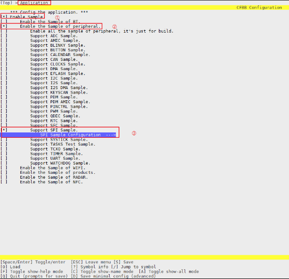

**图 2**  SPI MASTER 选择<a name="fig873353011112"></a>  
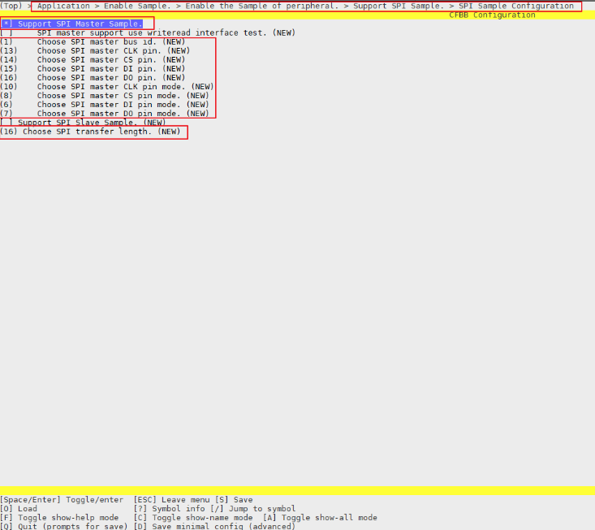

**图 3**  SPI MASTER支持使用writeread接口<a name="fig11952330135615"></a>  
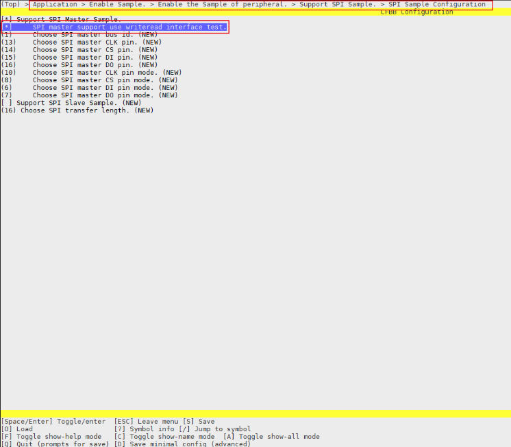

**图 4**  SPI SLAVE 选择<a name="fig885542191110"></a>  
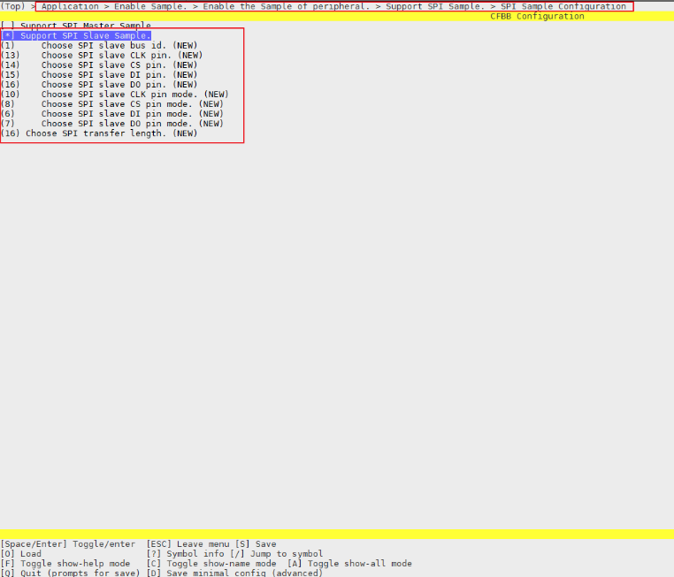

**图 5**  编译后的fwpkg<a name="fig1486953181217"></a>  
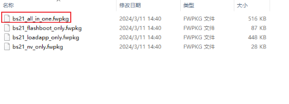

#### 运行<a name="ZH-CN_TOPIC_0000001823434888"></a>

SPI双板执行结果分以下多种情况：

情况①：SPI轮询模式如下[图1](#fig14932149182315)或者[图2](#fig13818412254)所示。

**图 1**  SPI双板轮询主从交互结果<a name="fig14932149182315"></a>  
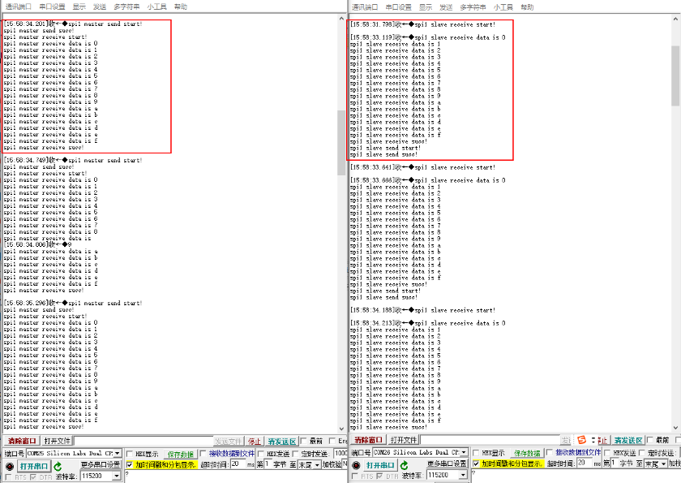

**图 2**  SPI双板轮询主从交互（master侧使用writeread接口）<a name="fig13818412254"></a>  
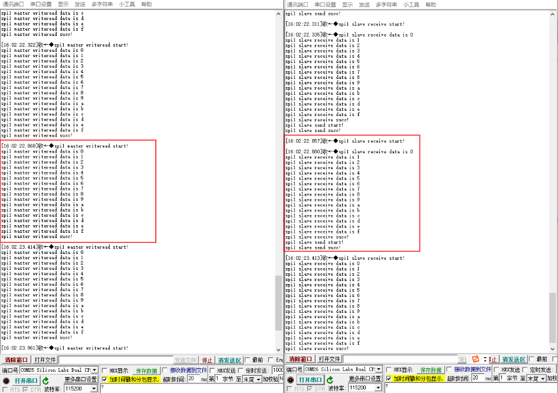

情况②：SPI中断模式如下[图4](#fig675113984719)或[图5](#fig128511040184913)所示。

**图 3**  SPI中断配置<a name="fig446166104615"></a>  
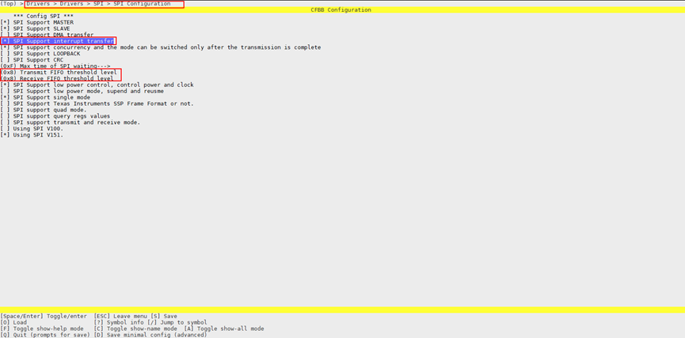

**图 4**  SPI双板中断主从交互<a name="fig675113984719"></a>  
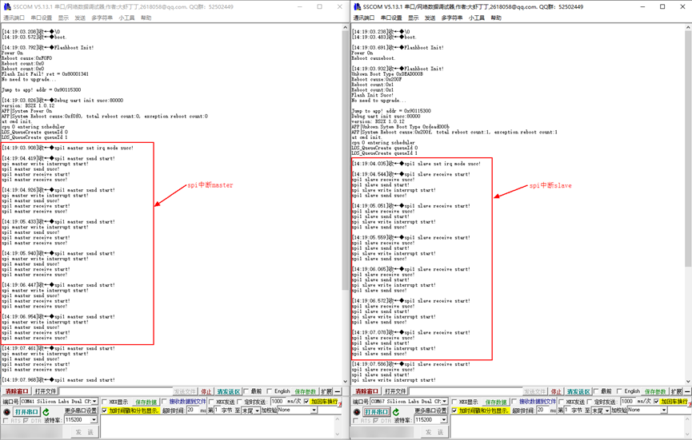

**图 5**  SPI双板中断主从交互（master侧使用writeread接口）<a name="fig128511040184913"></a>  
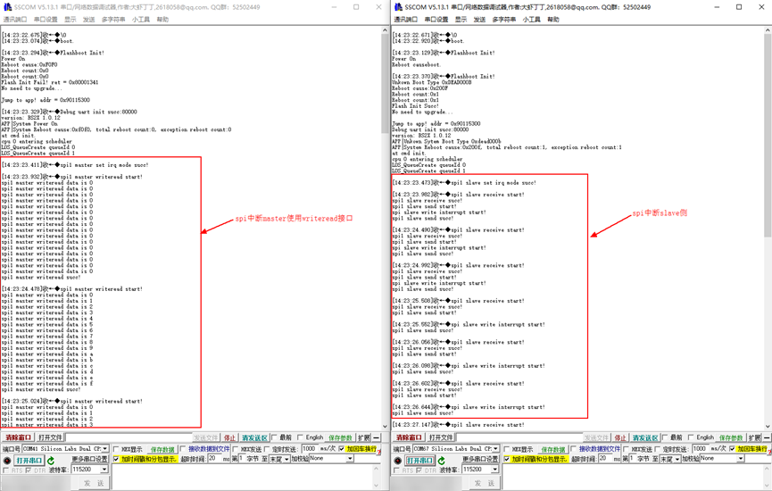

情况③：SPI DMA模式如下[图8](#fig9103328135414)或[图9](#fig189697218577)或[图11](#fig74556310420)所示。

**图 6**  SPI DMA配置<a name="fig5300123411517"></a>  


**图 7**  SPI DMA配置2<a name="fig8148722185212"></a>  
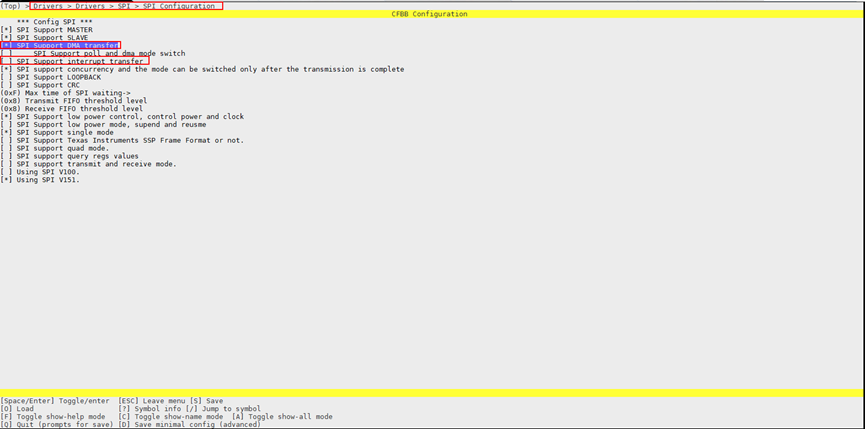

**图 8**  SPI双板DMA主从交互<a name="fig9103328135414"></a>  
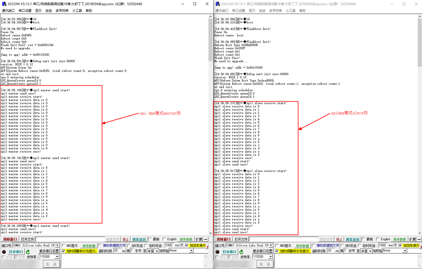

**图 9**  SPI双板DMA主从交互（master侧使用writeread接口）<a name="fig189697218577"></a>  
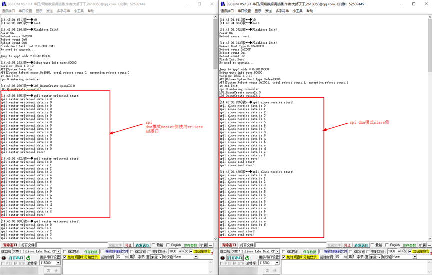

**图 10**  SPI DMA开启轮询和DMA自动切换配置<a name="fig86062179581"></a>  
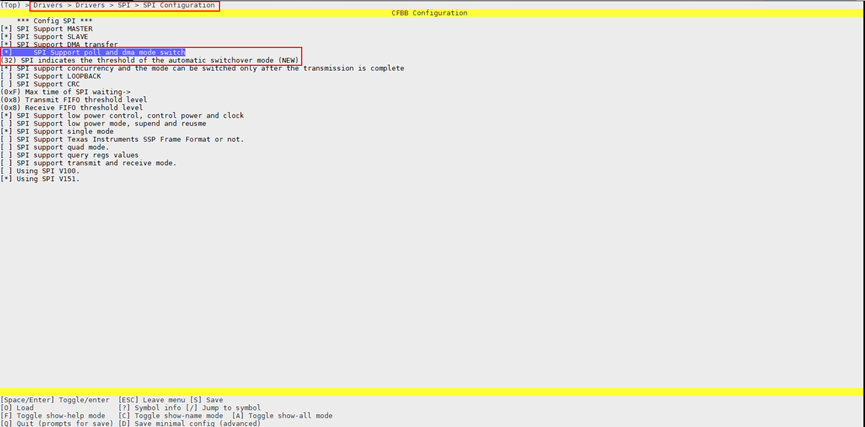

**图 11**  SPI双板DMA主从交互（两侧均使用writeread接口）<a name="fig74556310420"></a>  
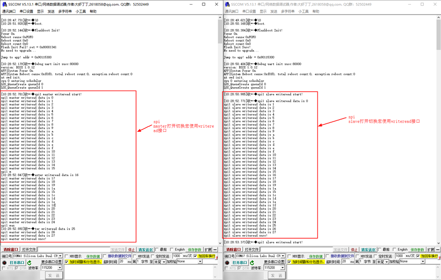

> **说明：** 
>注意：打开CONFIG\_SPI\_SUPPORT\_POLL\_AND\_DMA\_AUTO\_SWITCH宏后发送的数据量大于
>CONFIG\_SPI\_AUTO\_SWITCH\_DMA\_THRESHOLD宏配置的阈值时是DMA模式，反之是POLL轮询模式，且SPI发送的数据量需要与位宽对齐。

### SYSTICK<a name="ZH-CN_TOPIC_0000001908203921"></a>


#### 编译<a name="ZH-CN_TOPIC_0000001908123609"></a>

> **说明：** 
>运行该用例时，需根据实际需求选择其他目录下的KCONFIG配置，请参考请参考《BS2XV100 设备驱动 开发指南》的“KCONFIG配置”章节。

1.  在命令行下执行命令“python build.py standard-bs21 menuconfig”，打开menuconfig配置界面。
2.  在menuconfig界面中选择SYSTICK Sample，如[图1](#fig106431326122119)所示，选择完成后按“Q”或者“q”选择“y”保存退出。
3.  使用IDE编译版本，编译出的版本包在“output\\bs21\\fwpkg\\xxx”路径下，如[图2](#fig116431126152115)所示。
4.  将编译出的版本按照“[烧录及运行](烧录及运行-57.md)”烧录到板子。

**图 1**  选择SYSTICK Sample<a name="fig106431326122119"></a>  
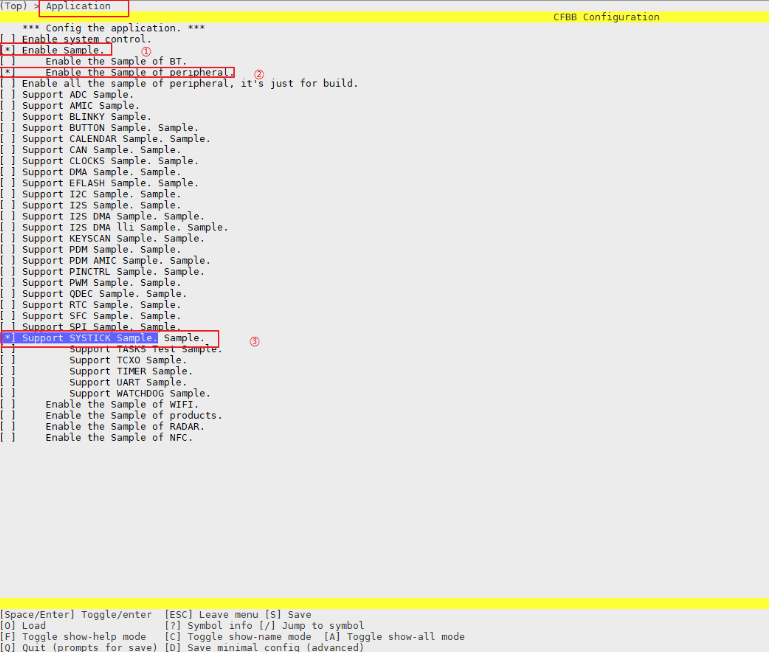

**图 2**  编译后的fwpkg<a name="fig116431126152115"></a>  
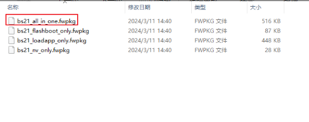

#### 运行<a name="ZH-CN_TOPIC_0000001862124186"></a>

SYSTICK单板执行结果如下[图1](#fig993812131095)所示。

**图 1**  SYSTICK运行结果<a name="fig993812131095"></a>  
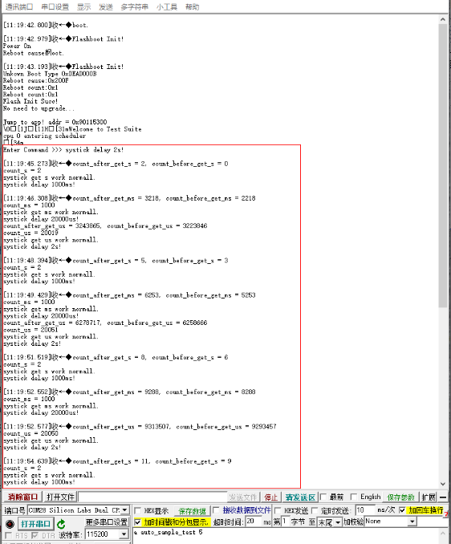

### TASK<a name="ZH-CN_TOPIC_0000002036494105"></a>


#### 编译<a name="ZH-CN_TOPIC_0000002000214896"></a>

> **说明：** 
>运行该用例时，需根据实际需求选择其他目录下的KCONFIG配置，请参考《BS2XV100 设备驱动 开发指南》的“KCONFIG配置”章节。

1.  在命令行下执行命令“python build.py standard-bs21 menuconfig”，打开menuconfig配置界面。
2.  在menuconfig界面中选择TASK Sample，如[图1](#fig519832653110)所示；选择完成后按“Q”或者“q”选择“y”保存退出。
3.  使用IDE编译版本，编译出的版本包在“output\\bs21\\fwpkg\\xxx”路径下，如下[图2](#fig5575113515288)所示。
4.  将编译出的版本按照“[烧录及运行](烧录及运行-57.md)”烧录到板子。

**图 1**  选择TASK Sample<a name="fig519832653110"></a>  
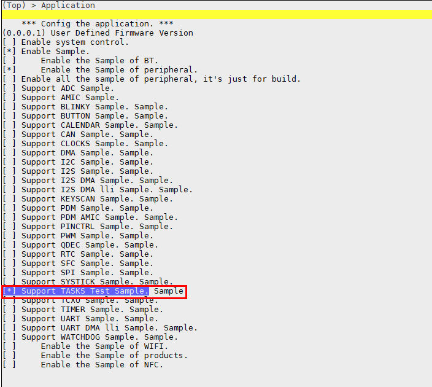

**图 2**  编译后的fwpkg<a name="fig5575113515288"></a>  
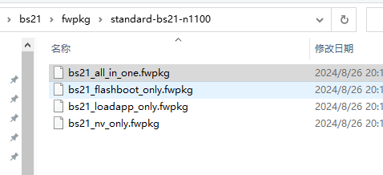

#### 运行<a name="ZH-CN_TOPIC_0000002036453221"></a>

将编译好的版本烧录即可运行。

### TCXO<a name="ZH-CN_TOPIC_0000001908204329"></a>


#### 编译<a name="ZH-CN_TOPIC_0000001908124053"></a>

> **说明：** 
>运行该用例时，需根据实际需求选择其他目录下的KCONFIG配置，请参考《BS2XV100 设备驱动 开发指南》的“KCONFIG配置”章节。

1.  在命令行下执行命令“python build.py standard-bs21 menuconfig”，打开menuconfig配置界面。
2.  在menuconfig界面中选择TCXO Sample，如[图1](#fig106431326122119)所示，选择完成后按“Q”或者“q”选择“y”保存退出。
3.  使用IDE编译版本，编译出的版本包在“output\\bs21\\fwpkg\\xxx”路径下，如[图2](#fig116431126152115)所示。
4.  将编译出的版本按照“[烧录及运行](烧录及运行-57.md)”烧录到板子。

**图 1**  选择TCXO Sample<a name="fig106431326122119"></a>  
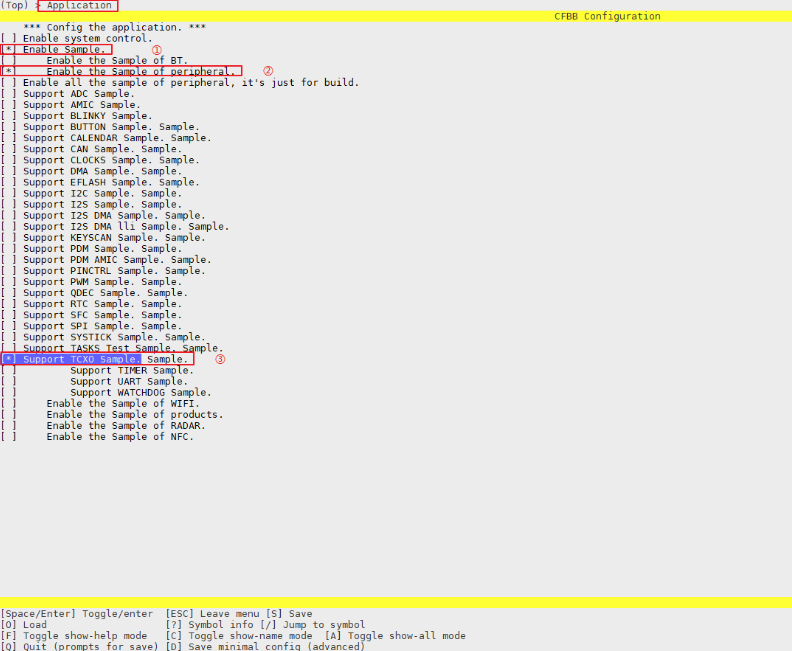

**图 2**  编译后的fwpkg<a name="fig116431126152115"></a>  
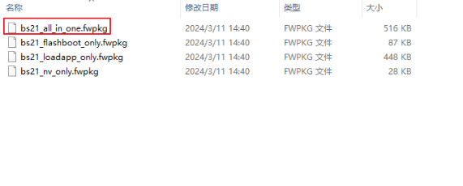

#### 运行<a name="ZH-CN_TOPIC_0000001862124598"></a>

TCXO单板执行结果如下[图1](#fig993812131095)所示。

**图 1**  TCXO运行结果<a name="fig993812131095"></a>  
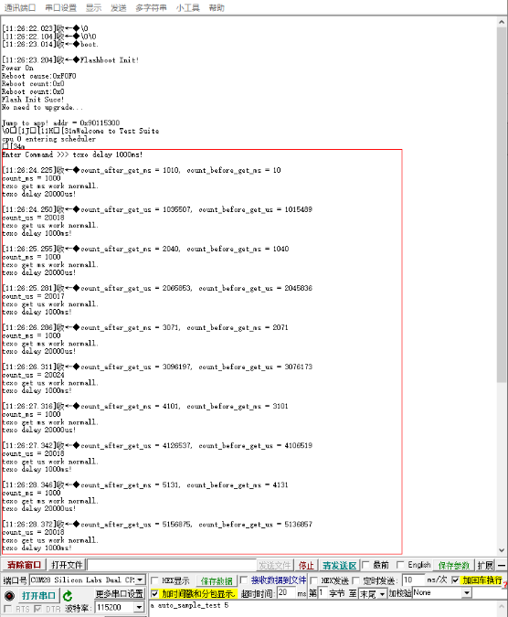

### TIMER<a name="ZH-CN_TOPIC_0000001862125598"></a>


#### 编译<a name="ZH-CN_TOPIC_0000001862285434"></a>

> **说明：** 
>运行该用例时，需根据实际需求选择其他目录下的KCONFIG配置，请参考请参考《BS2XV100 设备驱动 开发指南》的“KCONFIG配置”章节。

1.  在命令行下执行命令“python build.py standard-bs21 menuconfig”，打开menuconfig配置界面。
2.  在menuconfig界面中选择TIMER Sample，如[图1](#fig106431326122119)所示，选择完成后按“Q”或者“q”选择“y”保存退出。
3.  在menuconfig界面中选择TIMER 驱动，如[图2](#fig4761185411100)所示，选择软timer个数.
4.  使用IDE编译版本，编译出的版本包在“output\\bs21\\fwpkg\\xxx”路径下，如下[图3](#fig116431126152115)所示。
5.  将编译出的版本按照“[烧录及运行](烧录及运行-57.md)”烧录到板子。

**图 1**  选择TIMER Sample<a name="fig106431326122119"></a>  
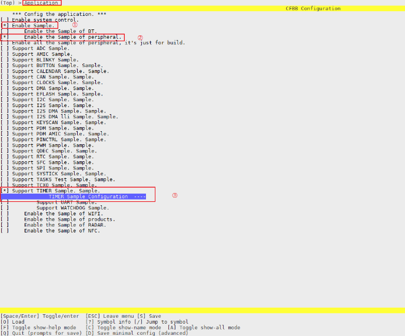

**图 2**  选择软timer个数<a name="fig4761185411100"></a>  
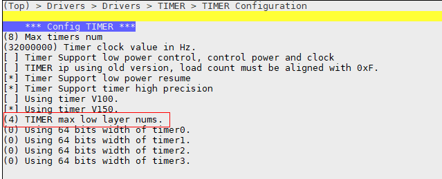

**图 3**  编译后的fwpkg<a name="fig116431126152115"></a>  
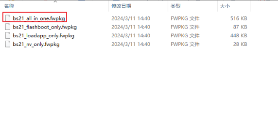

#### 运行<a name="ZH-CN_TOPIC_0000001908125037"></a>

TIMER单板执行结果如[图1](#fig993812131095)所示。

**图 1**  TIMER运行结果<a name="fig993812131095"></a>  
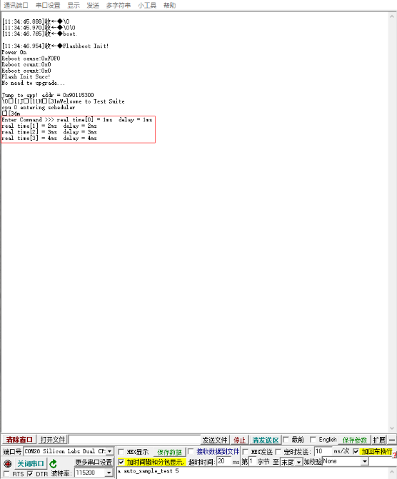

### UART<a name="ZH-CN_TOPIC_0000001873124797"></a>


#### 编译<a name="ZH-CN_TOPIC_0000001873244621"></a>

> **说明：** 
>运行该用例时，需根据实际需求选择其他目录下的KCONFIG配置，请参考《BS2XV100 设备驱动 开发指南》的“KCONFIG配置”章节。

1.  在命令行下执行命令“python build.py standard-bs21 menuconfig”，打开menuconfig配置界面。
2.  在menuconfig界面中选择UART Sample，如[图1](#fig10563812175115)所示；如果修改当前Sample的某些参数配置，则继续按[图2](#fig873353011112)选择，默认为轮询（poll）模式；如果当前UART支持DMA链表传输，则继续按[图3](#fig4301151111715)所示选择，如果当前Uart支持int传输，则继续按照[图4](#fig1111723425614)所示选择，选择完成后按“Q”或者“q”选择“y”保存退出。
3.  使用IDE编译版本，编译出的版本包在“output\\bs21\\fwpkg\\xxx”路径下，如下[图5](#fig1486953181217)所示。
4.  将编译出的版本按照“[烧录及运行](烧录及运行-57.md)”烧录到板子。

**图 1**  选择UART Sample<a name="fig10563812175115"></a>  
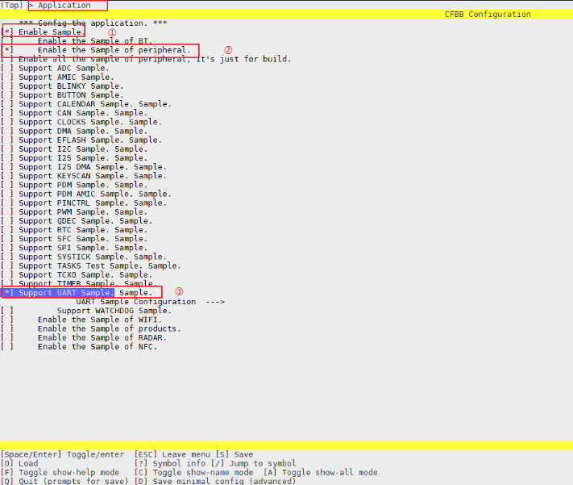

**图 2**  UART Sample参数配置<a name="fig873353011112"></a>  
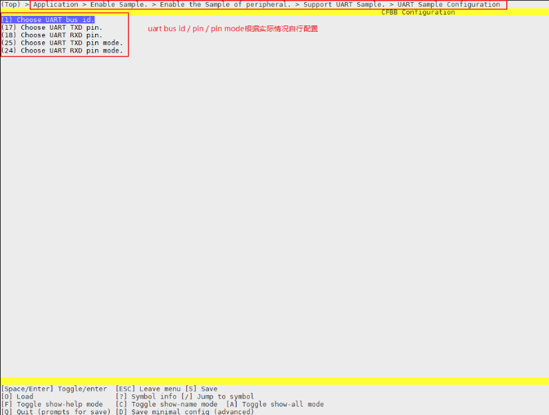

**图 3**  UART DMA配置<a name="fig4301151111715"></a>  

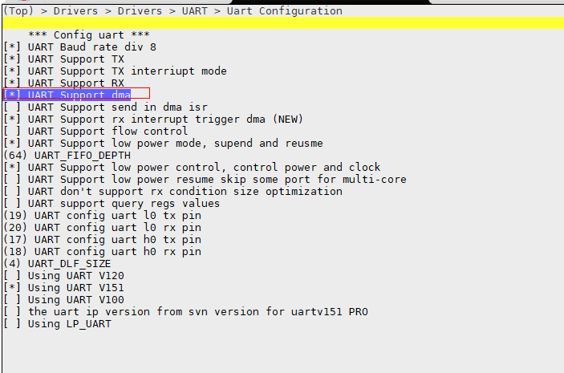

**图 4**  UART INT配置<a name="fig1111723425614"></a>  
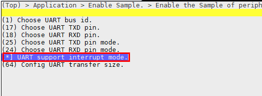

**图 5**  编译后的fwpkg<a name="fig1486953181217"></a>  


#### 运行<a name="ZH-CN_TOPIC_0000001826285298"></a>

当前UART Sample使用UART\_BUS\_1（H0）读写数据，UART\_BUS\_0（L0）打印日志信息，执行顺序是先通过PC串口给H0口发送一定长度的数据，H0口接收并将数据再次发送出去，在H0的串口上可看到发送和接收的数据，UART单板执行结果如下[图1](#fig14932149182315)所示（仅以轮询模式为例），UART DMA链表执行结果如[图2](#fig197795185202)所示。

**图 1**  UART单板双串口交互结果<a name="fig14932149182315"></a>  
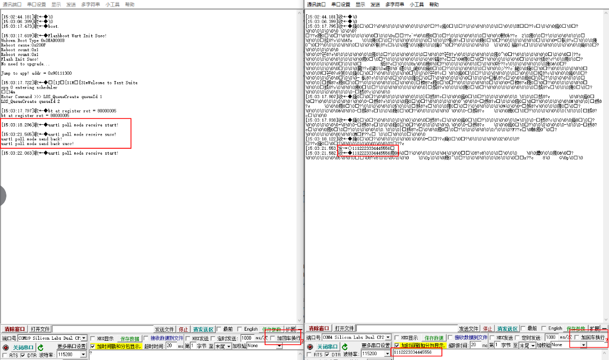

**图 2**  UART DMA LLI单板执行结果<a name="fig197795185202"></a>  
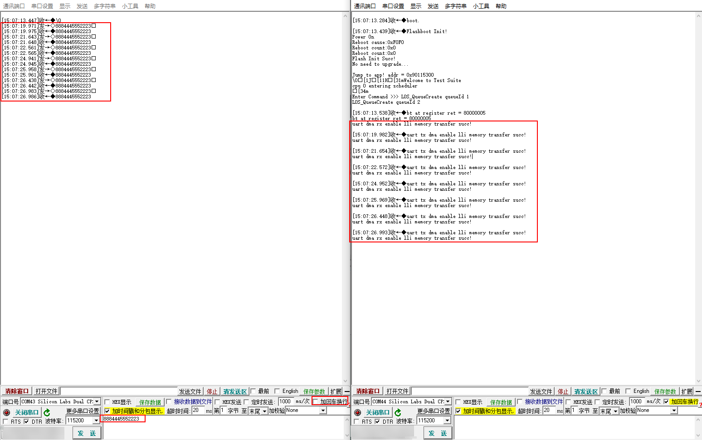

### UART DMA LLI<a name="ZH-CN_TOPIC_0000001922345534"></a>


#### 编译<a name="ZH-CN_TOPIC_0000001922185890"></a>

> **说明：** 
>运行该用例时，需根据实际需求选择其他目录下的KCONFIG配置，请参考《BS2XV100 设备驱动 开发指南》对应的DMA与UART的“KCONFIG配置”章节。

1.  <a name="li168261215195810"></a>在命令行下执行命令“python build.py standard-bs21 menuconfig”，打开menuconfig配置界面。
2.  在menuconfig界面中选择UART DMA LLI Sample，如[图1](#fig10563812175115)所示。
3.  <a name="li5749746152511"></a>master侧按[图2](#fig873353011112)所示选择，选择完成后按“Q”或者“q”选择“y”保存退出。
4.  <a name="li10749146162515"></a>使用IDE编译版本，编译出的版本包在“output\\bs21\\fwpkg\\xxx”路径下，如[图4](#fig1486953181217)所示。
5.  将编译出的版本按照“[烧录及运行](烧录及运行-57.md)”烧录到master侧的板子；同理，slave侧依次执行步骤[1](#li168261215195810)\~[4](#li10749146162515)，但步骤[3](#li5749746152511)按[图3](#fig4301151111715)所示选择，并将编译出的版本按照“[烧录及运行](烧录及运行-57.md)”烧录到slave侧的板子。

**图 1**  选择UART DMA LLI Sample<a name="fig10563812175115"></a>  
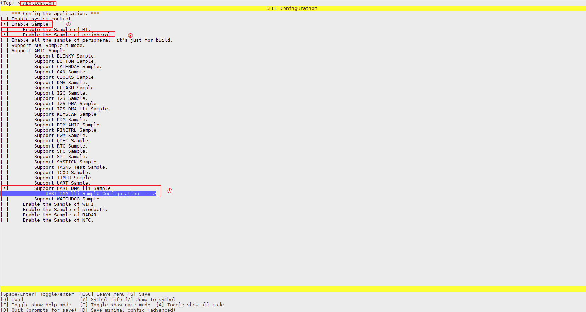

**图 2**  UART DMA LLI Master参数配置<a name="fig873353011112"></a>  
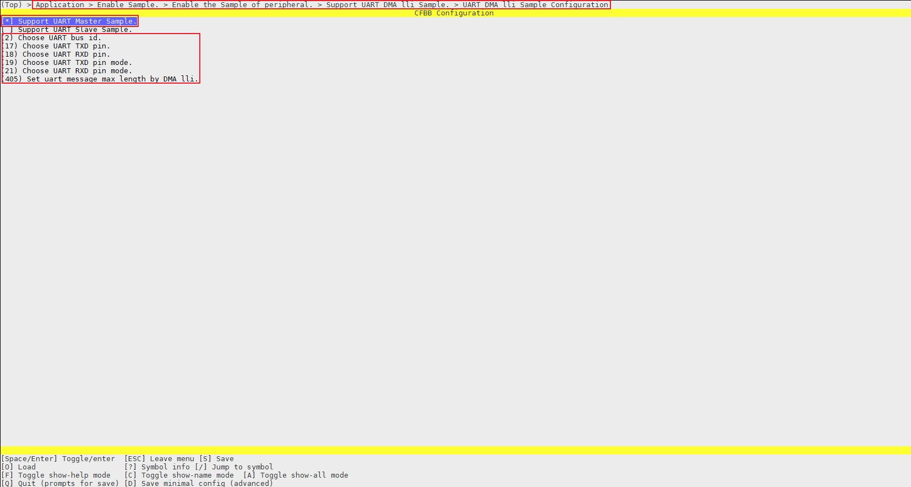

**图 3**  UART DMA LLI Slave参数配置<a name="fig4301151111715"></a>  
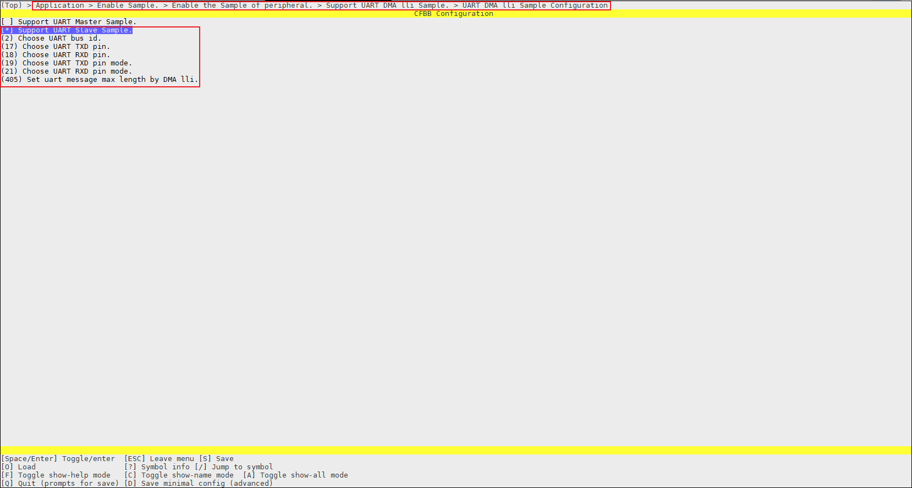

**图 4**  编译后的fwpkg<a name="fig1486953181217"></a>  
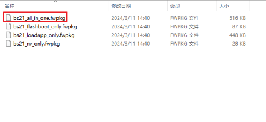

#### 运行<a name="ZH-CN_TOPIC_0000001950064745"></a>

当前UART Sample默认使用UART\_BUS\_2（L1）和UART\_BUS\_2（L1）进行数据交互，版本正常烧录后，将两块板子UART\_BUS\_2所用的管脚交叉连接（TX接RX，RX接TX），然后同时复位，串口执行结果如[图1](#fig14932149182315)所示。

**图 1**  UART双板交互结果<a name="fig14932149182315"></a>  
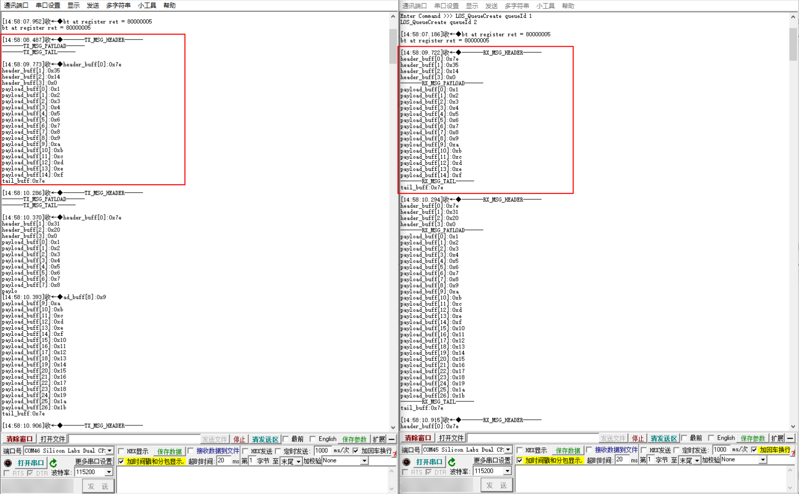

### WATCHDOG<a name="ZH-CN_TOPIC_0000001862126826"></a>


#### 编译<a name="ZH-CN_TOPIC_0000001862286678"></a>

> **说明：** 
>运行该用例时，需根据实际需求选择其他目录下的KCONFIG配置，请参考《BS2XV100 设备驱动 开发指南》的“KCONFIG配置”章节。

1.  在命令行下执行命令“python build.py standard-bs21 menuconfig”，打开menuconfig配置界面。
2.  在menuconfig界面中选择WATCHDOG Sample，如[图1](#fig106431326122119)所示；如果选择超时，则继续按下[图2](#fig116431126152115)所示选择；如果选择喂狗，则继续按下[图3](#fig2787175743)所示选择，选择完成后按“Q”或者“q”选择“y”保存退出。
3.  使用IDE编译版本，编译出的版本包在“output\\bs21\\fwpkg\\xxx”路径下，如[图4](#fig1889013402418)所示。
4.  将编译出的版本按照“[烧录及运行](烧录及运行-57.md)”烧录到板子。

**图 1**  选择WATCHDOG Sample<a name="fig106431326122119"></a>  
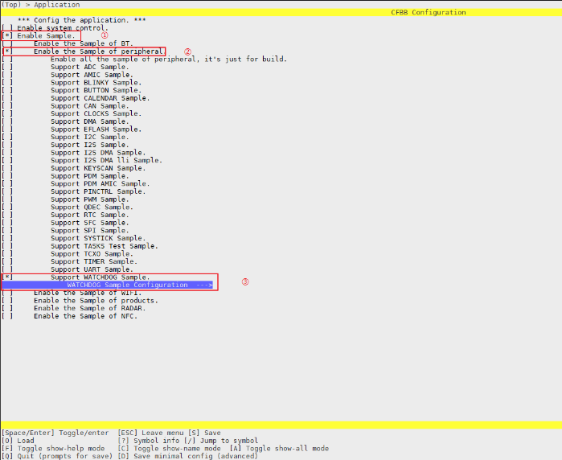

**图 2**  WATCHDOG超时<a name="fig116431126152115"></a>  
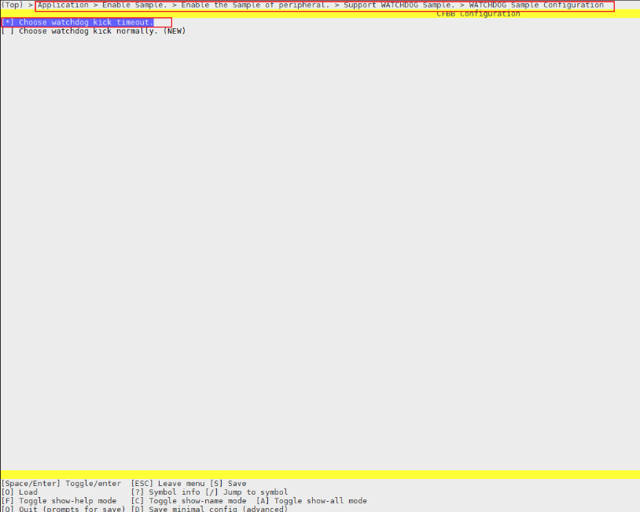

**图 3**  WATCHDOG 喂狗<a name="fig2787175743"></a>  
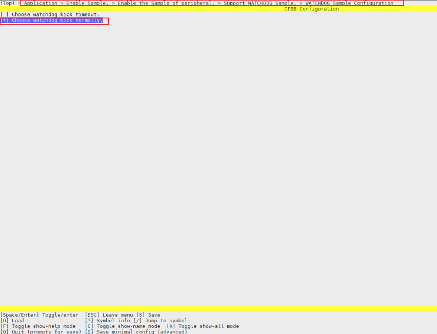

**图 4**  编译后的fwpkg<a name="fig1889013402418"></a>  
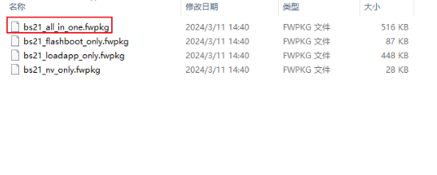

#### 运行<a name="ZH-CN_TOPIC_0000001908206573"></a>

WATCHDOG单板超时执行结果如下[图1](#fig993812131095)所示，喂狗后执行结果如[图2](#fig586414171377)所示。

**图 1**  WATCHDOG超时运行结果<a name="fig993812131095"></a>  
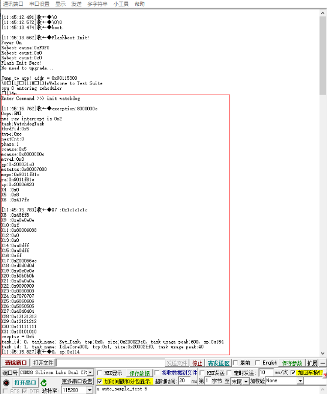

**图 2**  WATCHDOG喂狗运行结果<a name="fig586414171377"></a>  
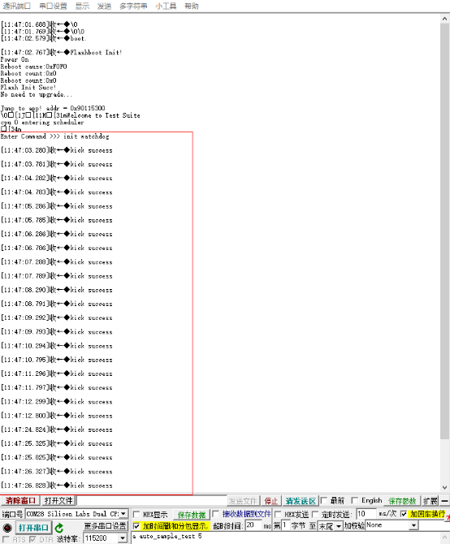

# SLE UART Sample<a name="ZH-CN_TOPIC_0000001790806616"></a>


## 概述<a name="ZH-CN_TOPIC_0000001837765685"></a>

B/SLE UART的Sample详细的可分为SLE的UART透传功能和BLE的UART透传功能，其中SLE共支持三种，分别是SLE的UART透传功能，SLE的Low Latency UART透传功能以及SLE的Performance跑流功能，整体的连接关系和数据流图如[图1](#fig1856117391419)所示。其中SLE UART Sample的三种模式编译通过Kconfig选项控制，默认为SLE的UART透传功能，选中Low Latency选项为SLE的Low Latency UART透传功能，在此基础上选中performance选项为SLE的Performance跑流功能。其他选项功能不变，详情参考“[编译](编译-52.md)”。

**图 1**  B/SLE功能框图<a name="fig1856117391419"></a>  
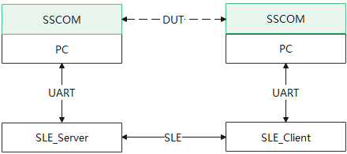

## Server端流程<a name="ZH-CN_TOPIC_0000001837645785"></a>

**图 1**  Server端流程图<a name="fig145218281341"></a>  
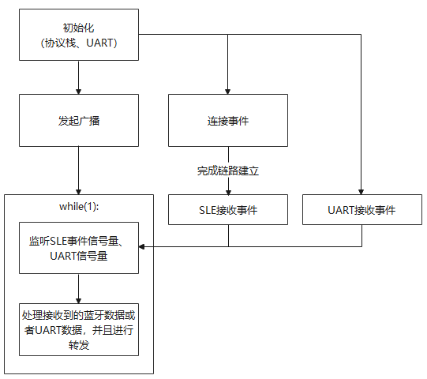

## Client端流程<a name="ZH-CN_TOPIC_0000001790806552"></a>

**图 1**  Client端流程图<a name="fig94842535407"></a>  
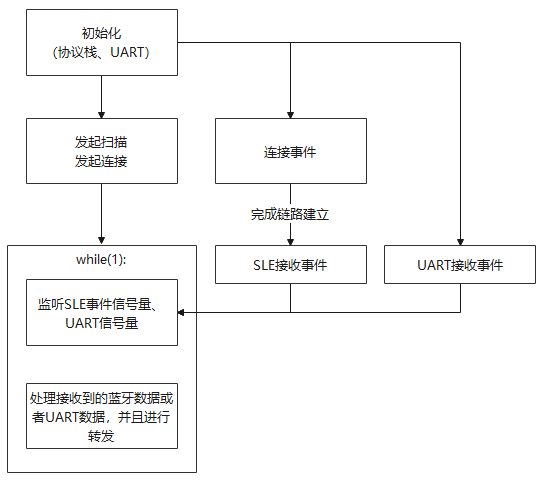

## 编译<a name="ZH-CN_TOPIC_0000001837765649"></a>

1.  在命令行下打开menuconfig配置界面，执行命令“python build.py standard-bs21-n1100 menuconfig”。
2.  选择SLE Uart Sample Performance mode\(可选项，切换至数传模式\)
    1.  \(Top\) → Application → Enable Sample. → Enable the Sample of products. → Support SLE UART sample. → SLE UART Sample Configuration → Select SLE UART sample mode → Select sle uart sample type→ Enable SLE UART low latency sample
    2.  \(Top\) → Application → Enable Sample. → Enable the Sample of products. → Support SLE UART sample. → SLE UART Sample Configuration → Select SLE UART sample mode → Set the currrent sample in PERFORMANCE mode.

3.  <a name="li1870123015263"></a>在menuconfig界面中选择SLE UART Sample，如[图1](#fig1228918832814)所示。
4.  在menuconfig界面中选择当前Sample使用的UART BUS，如[图3](#fig1727441418301)所示。
5.  在menuconfig界面中选择SLE UART Server，如[图4](#fig12415145983216)所示。
6.  选择完成后按“Q”保存退出。
7.  使用IDE编译版本，编译出的版本包在“tools\\pkg\\fwpkg\\bs2x”路径下，如[图5](#fig7726546133717)所示。
8.  <a name="li8164191173710"></a>将编译出的版本按照“[烧录及运行](烧录及运行-57.md)”烧录。
9.  重启打开menuconfig配置界面，仿照[3](#li1870123015263)～[8](#li8164191173710)选择SLE UART Client，如[图6](#fig827416371394)所示，进行编译，并将版本正常烧录。

**图 1**  选择SLE UART Sample<a name="fig1228918832814"></a>  
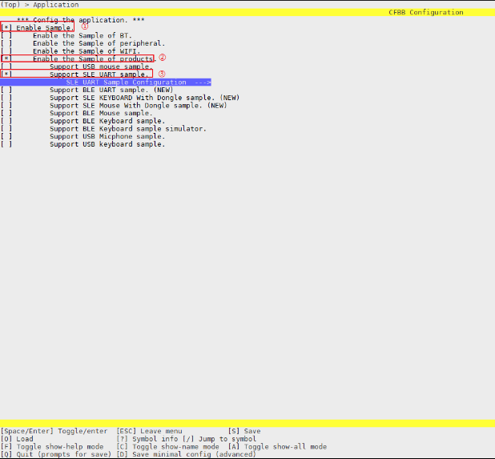

**图 2**  选择sle uart sample performance mode（可选）<a name="fig1076820561381"></a>  
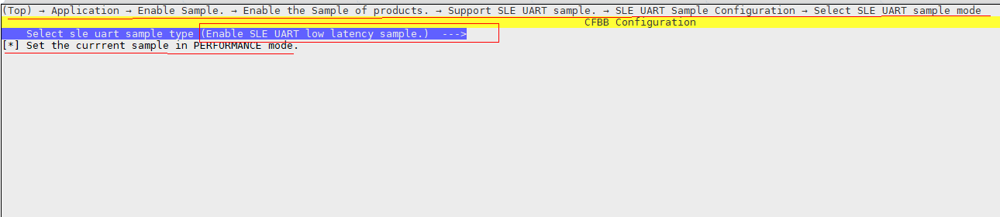

**图 3**  选择UART BUS<a name="fig1727441418301"></a>  
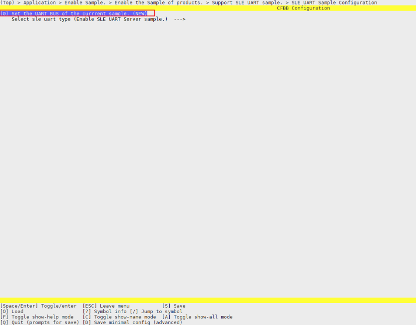

**图 4**  选择SLE UART Server<a name="fig12415145983216"></a>  
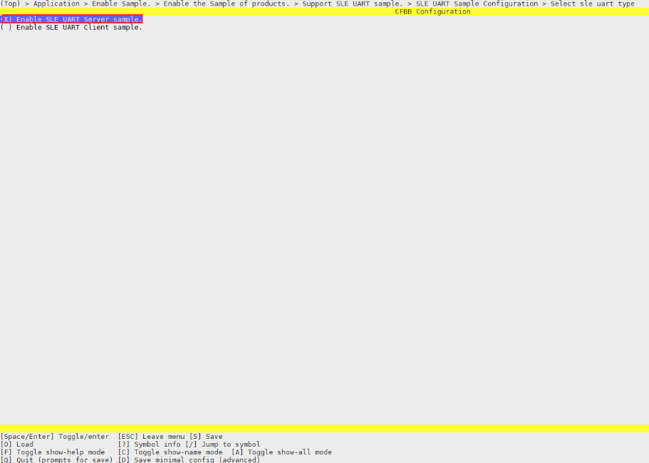

**图 5**  编译出的版本<a name="fig7726546133717"></a>  


**图 6**  选择SLE UART Client<a name="fig827416371394"></a>  
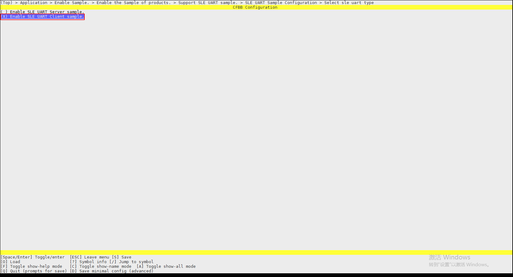

## 烧录及运行<a name="ZH-CN_TOPIC_0000001790806624"></a>

**烧录<a name="section11501615135313"></a>**

版本烧录方法请参见《BS2XV100  HiSpark Studio  使用指南》。

**运行<a name="section11367201532211"></a>**

1.  准备两块单板，分别作为Server端和Client端，每块单板上将UART-L0和UART-L2与PC通过串口板连接。
2.  通过UART-L0分别将编译好的Server版本和Client版本烧录到单板中。
3.  在PC端分别通过两个串口助手连接两个单板的UART-L2，并且将串口设置到115200波特率，并打开串口。
4.  在两个串口助手上分别输入字符，并且观察对端串口是否可以收到，如果对端可以收到，则表示对通成功。

# SLE UART DMA Sample<a name="ZH-CN_TOPIC_0000002091115513"></a>


## 概述<a name="ZH-CN_TOPIC_0000002054918226"></a>

SLE UART DMA DEMA用来实现端到端的uart-\>sle-\>uart跑流过程，目前支持最大2.2M的跑流速度。整体的连接关系与数据流图如下图所示，其中sle uart dma sample的四种模式通过Kconfig选项控制。SLE支持正常模式和低时延模式，默认使用连接间隔等于25ms的连接模式，每次发送240字节大小数据。

UART驱动支持三个接口的使用，分别是uart\_dma\_lli接口，uart\_raw\_data\_lli接口和uart\_read\_by\_dma接口，具体使用场景参考下图。

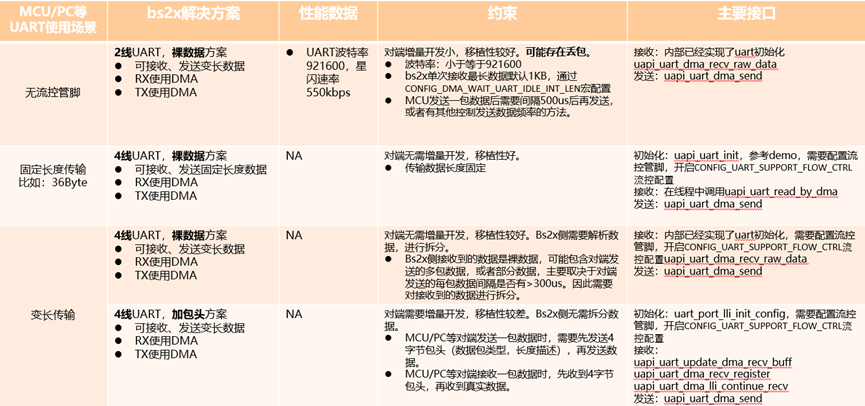

SLE连接支持正常模式和低时延模式，默认使用连接间隔等于25ms的连接模式，每次发送236字节大小数据

## 整体流程介绍<a name="ZH-CN_TOPIC_0000002091076957"></a>

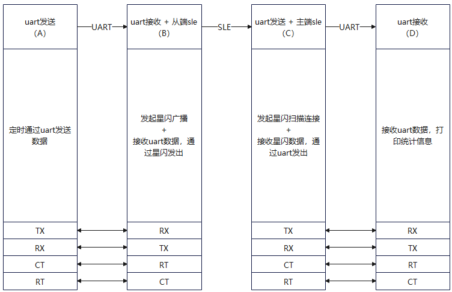


### （A端）数据发送端<a name="ZH-CN_TOPIC_0000002055076550"></a>

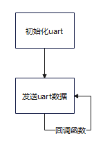

### （B端）星闪数据发送端<a name="ZH-CN_TOPIC_0000002091115517"></a>

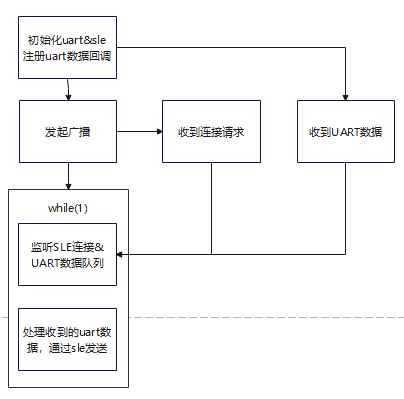

### （C端）星闪数据接收端<a name="ZH-CN_TOPIC_0000002054918230"></a>

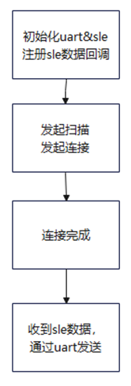

### （D端）数据接收端<a name="ZH-CN_TOPIC_0000002091076961"></a>

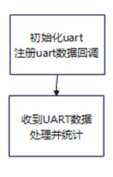

## 编译流程<a name="ZH-CN_TOPIC_0000002055076554"></a>

1.  在命令行下打开menuconfig配置界面，执行命令:./build.py -c standard-bs21-n1100 menuconfig
2.  选择uart配置：

    1. \(Top\) → Application → Enable Sample. → Enable the Sample of products. → Support SLE UART DMA sample. → SLE UART DMA Sample Configuration → Select UART Config → Choice Target UART DMA Sample Mode

    选择想要使用的uart驱动配置，目前支持以下三种UART驱动接口。

    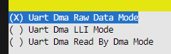

    2. \(Top\) → Application → Enable Sample. → Enable the Sample of products. → Support SLE UART DMA sample. → SLE UART DMA Sample Configuration

    配置需要使用的uart串口，BUS1:H0串口，BUS2，L1串口。默认为BUS1，支持最高4M的波特率

    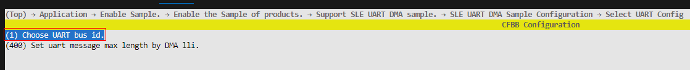

    **请注意同时配置driver config中uart相关串口配置**，因为该demo基于uart dma驱动运行，根据需要使用的UART驱动接口，参考下图进行配置。配置详情可参考《BS2XV100 设备驱动 开发指南》“UART”章节部分。

    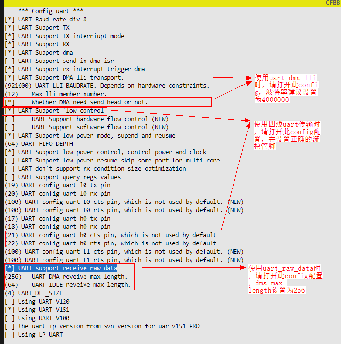

    **使用H0串口时请关闭日志线程，防止日志与uart使用同一串口异常。**

    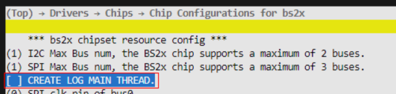

3.  选择目标跑流配置。

    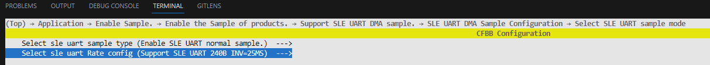

先选择想要的星闪模式

\(Top\) → Application → Enable Sample. → Enable the Sample of products. → Support SLE UART DMA sample. → SLE UART DMA Sample Configuration → Select SLE UART sample mode → Select sle uart sample type

再选择具体的跑流配置

\(Top\) → Application → Enable Sample. → Enable the Sample of products. → Support SLE UART DMA sample. → SLE UART DMA Sample Configuration → Select SLE UART sample mode → Select sle uart Rate config

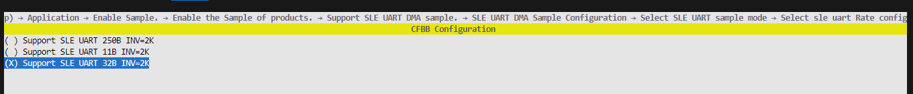

**使用low latency模式编译版本前请修改nv中em\_size大小配置修改**，byte4 和 byte5组成em\_size的大小,byte6为最大链接数，em size的大小由byte4和byte5两个uint8\_t拼接成一个uint16\_t的数，高位在byte5，低位在byte4。如下图所示，08,01代表将em size大小设置为264字节大小。

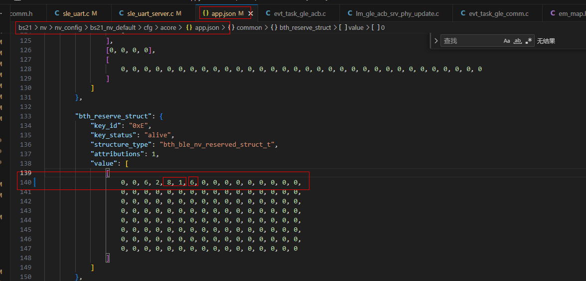

1.  <a name="li92491245378"></a>选择需要编译的sample版本，如下图所示，UART Master；UART Master Sle；UART Slave sle；UART Slave分别对应上文uart数据发送端；sle数据发送端；sle数据接收端；uart数据接收端。

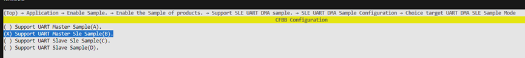

1.  配置完成后按"Q"，然后"Y"保存并退出muneconfig。
2.  使用IDE编译版本，编译的版本包在路径：output\\bs21\\fwpkg\\standard-bs21-n1100
3.  <a name="li4667441203710"></a>使用烧录工具将编译出来的版本烧录到单板上。
4.  重复步骤[步骤4](#li92491245378)\~[步骤7](#li4667441203710)，将对应的四个版本编译并烧录到单板上。

## 烧录及运行<a name="ZH-CN_TOPIC_0000002091115521"></a>

**烧录：**

烧录方法请参考《BS2XV100  HiSpark Studio  使用指南》。

**运行：**

1.  准备4块单板，分别作为UART数据发送端；SLE数据发送端；SLE数据接收端；UART数据接收端。将UART数据发送端，SLE数据发送端的串口管脚和流控管脚反接；将SLE数据接收端，UART数据接收端的串口管脚和流控管脚反接。默认使用芯片的H0管脚配置。
2.  使用版本烧录工具将版本分别烧到四块单板上。
3.  使用PC串口工具连接到四块单板的L0口上，用于观察数据传输情况。
4.  **按顺序启动A-\>C-\>D-\>B四块单板**，观察串口日志打印。如果uart数据接收端能按时打印统计数据，则运行正常。

## 可选参数配置<a name="ZH-CN_TOPIC_0000002054918234"></a>

<a name="table135533517260"></a>
<table><thead align="left"><tr id="row125691755265"><th class="cellrowborder" valign="top" width="25%" id="mcps1.1.5.1.1"><p id="p25696552616"><a name="p25696552616"></a><a name="p25696552616"></a>包长</p>
</th>
<th class="cellrowborder" valign="top" width="25%" id="mcps1.1.5.1.2"><p id="p65691357262"><a name="p65691357262"></a><a name="p65691357262"></a>连接间隔</p>
</th>
<th class="cellrowborder" valign="top" width="25%" id="mcps1.1.5.1.3"><p id="p75691153265"><a name="p75691153265"></a><a name="p75691153265"></a>phy类型</p>
</th>
<th class="cellrowborder" valign="top" width="25%" id="mcps1.1.5.1.4"><p id="p185691559263"><a name="p185691559263"></a><a name="p185691559263"></a>理论跑流速度</p>
</th>
</tr>
</thead>
<tbody><tr id="row145692513265"><td class="cellrowborder" valign="top" width="25%" headers="mcps1.1.5.1.1 "><p id="p256995112617"><a name="p256995112617"></a><a name="p256995112617"></a>236B</p>
</td>
<td class="cellrowborder" valign="top" width="25%" headers="mcps1.1.5.1.2 "><p id="p1656911519265"><a name="p1656911519265"></a><a name="p1656911519265"></a>25ms</p>
</td>
<td class="cellrowborder" valign="top" width="25%" headers="mcps1.1.5.1.3 "><p id="p10569205152617"><a name="p10569205152617"></a><a name="p10569205152617"></a>4M QPSK</p>
</td>
<td class="cellrowborder" valign="top" width="25%" headers="mcps1.1.5.1.4 "><p id="p9569559267"><a name="p9569559267"></a><a name="p9569559267"></a>75kbps</p>
</td>
</tr>
<tr id="row1056916518269"><td class="cellrowborder" valign="top" width="25%" headers="mcps1.1.5.1.1 "><p id="p6569759268"><a name="p6569759268"></a><a name="p6569759268"></a>236B</p>
</td>
<td class="cellrowborder" valign="top" width="25%" headers="mcps1.1.5.1.2 "><p id="p1569185172610"><a name="p1569185172610"></a><a name="p1569185172610"></a>2ms</p>
</td>
<td class="cellrowborder" valign="top" width="25%" headers="mcps1.1.5.1.3 "><p id="p1056914522617"><a name="p1056914522617"></a><a name="p1056914522617"></a>4M QPSK</p>
</td>
<td class="cellrowborder" valign="top" width="25%" headers="mcps1.1.5.1.4 "><p id="p856918522618"><a name="p856918522618"></a><a name="p856918522618"></a>940kbps</p>
</td>
</tr>
<tr id="row185696532619"><td class="cellrowborder" valign="top" width="25%" headers="mcps1.1.5.1.1 "><p id="p156975162613"><a name="p156975162613"></a><a name="p156975162613"></a>250B</p>
</td>
<td class="cellrowborder" valign="top" width="25%" headers="mcps1.1.5.1.2 "><p id="p656919512610"><a name="p656919512610"></a><a name="p656919512610"></a>1k (low latency)</p>
</td>
<td class="cellrowborder" valign="top" width="25%" headers="mcps1.1.5.1.3 "><p id="p1656918516262"><a name="p1656918516262"></a><a name="p1656918516262"></a>2M QPSK</p>
</td>
<td class="cellrowborder" valign="top" width="25%" headers="mcps1.1.5.1.4 "><p id="p1156910572610"><a name="p1156910572610"></a><a name="p1156910572610"></a>2000kbps</p>
</td>
</tr>
<tr id="row1569652267"><td class="cellrowborder" valign="top" width="25%" headers="mcps1.1.5.1.1 "><p id="p956916592618"><a name="p956916592618"></a><a name="p956916592618"></a>36B</p>
</td>
<td class="cellrowborder" valign="top" width="25%" headers="mcps1.1.5.1.2 "><p id="p1956911552614"><a name="p1956911552614"></a><a name="p1956911552614"></a>1k (low latency)</p>
</td>
<td class="cellrowborder" valign="top" width="25%" headers="mcps1.1.5.1.3 "><p id="p156911572613"><a name="p156911572613"></a><a name="p156911572613"></a>2M QPSK</p>
</td>
<td class="cellrowborder" valign="top" width="25%" headers="mcps1.1.5.1.4 "><p id="p2056913572616"><a name="p2056913572616"></a><a name="p2056913572616"></a>288kbps</p>
</td>
</tr>
<tr id="row145690572615"><td class="cellrowborder" valign="top" width="25%" headers="mcps1.1.5.1.1 "><p id="p75692511264"><a name="p75692511264"></a><a name="p75692511264"></a>36B</p>
</td>
<td class="cellrowborder" valign="top" width="25%" headers="mcps1.1.5.1.2 "><p id="p125690562613"><a name="p125690562613"></a><a name="p125690562613"></a>2k (low latency)</p>
</td>
<td class="cellrowborder" valign="top" width="25%" headers="mcps1.1.5.1.3 "><p id="p256915552610"><a name="p256915552610"></a><a name="p256915552610"></a>2M QPSK</p>
</td>
<td class="cellrowborder" valign="top" width="25%" headers="mcps1.1.5.1.4 "><p id="p1456916582614"><a name="p1456916582614"></a><a name="p1456916582614"></a>576kbps</p>
</td>
</tr>
</tbody>
</table>

理论跑流速度基于当前配置的最大星闪配置计算得出，实际速度可能受到芯片性能，空口质量等影响。

星闪速度=1秒内调度次数×每次发包字节数×8（比特数）/ 1000（单位换算），如配置3中包长250B，连接间隔1k，理论速度为1000×250×8/1000=2000kbps。

uart跑流速度一般为为波特率×0.6左右。当波特率设置为4000000时，UART可以达到2400kbps速度。

## 使用说明及限制<a name="ZH-CN_TOPIC_0000002091076965"></a>

1.  使用低时延模式时请注意使用支持低时延功能的芯片如282x系列。

<a name="table2405437122616"></a>
<table><thead align="left"><tr id="row10415103718260"><th class="cellrowborder" valign="top" width="50%" id="mcps1.1.3.1.1"><p id="p18415143718269"><a name="p18415143718269"></a><a name="p18415143718269"></a><strong id="b141510374263"><a name="b141510374263"></a><a name="b141510374263"></a>芯片</strong></p>
</th>
<th class="cellrowborder" valign="top" width="50%" id="mcps1.1.3.1.2"><p id="p8415183722612"><a name="p8415183722612"></a><a name="p8415183722612"></a><strong id="b9415193782619"><a name="b9415193782619"></a><a name="b9415193782619"></a>支持低时延模式</strong></p>
</th>
</tr>
</thead>
<tbody><tr id="row74151637182611"><td class="cellrowborder" valign="top" width="50%" headers="mcps1.1.3.1.1 "><p id="p4415937152615"><a name="p4415937152615"></a><a name="p4415937152615"></a>2821/2821E</p>
</td>
<td class="cellrowborder" valign="top" width="50%" headers="mcps1.1.3.1.2 "><p id="p74151037162611"><a name="p74151037162611"></a><a name="p74151037162611"></a>1k、2k</p>
</td>
</tr>
<tr id="row12415437142611"><td class="cellrowborder" valign="top" width="50%" headers="mcps1.1.3.1.1 "><p id="p1141523715269"><a name="p1141523715269"></a><a name="p1141523715269"></a>2820</p>
</td>
<td class="cellrowborder" valign="top" width="50%" headers="mcps1.1.3.1.2 "><p id="p10415193752613"><a name="p10415193752613"></a><a name="p10415193752613"></a>1k</p>
</td>
</tr>
</tbody>
</table>

1.  受限于芯片rx buffer大小的影响，实际使用低时延模式时请不要设置超过Buffer大小的数据，大于此大小的数据包内容将会出错。

<a name="table166621514113915"></a>
<table><thead align="left"><tr id="row12669114113910"><th class="cellrowborder" valign="top" width="39.57%" id="mcps1.1.3.1.1"><p id="p7669111414396"><a name="p7669111414396"></a><a name="p7669111414396"></a><strong id="b106695147398"><a name="b106695147398"></a><a name="b106695147398"></a>芯片</strong></p>
</th>
<th class="cellrowborder" valign="top" width="60.42999999999999%" id="mcps1.1.3.1.2"><p id="p186698147391"><a name="p186698147391"></a><a name="p186698147391"></a><strong id="b11669161463916"><a name="b11669161463916"></a><a name="b11669161463916"></a>大小</strong></p>
</th>
</tr>
</thead>
<tbody><tr id="row466961416399"><td class="cellrowborder" valign="top" width="39.57%" headers="mcps1.1.3.1.1 "><p id="p17669111415393"><a name="p17669111415393"></a><a name="p17669111415393"></a>282X</p>
</td>
<td class="cellrowborder" valign="top" width="60.42999999999999%" headers="mcps1.1.3.1.2 "><p id="p1566991418396"><a name="p1566991418396"></a><a name="p1566991418396"></a>250</p>
</td>
</tr>
</tbody>
</table>

1.  受限于芯片TRx Buffer大小的影响，空口一次传输数据大小有限，使用ssap消息接口发送数据时请参考芯片buffer大小发送数据，防止因为数据包过大分包，或过小导致的空口资源浪费。
2.  当TRx buffer为260时，空口最大数据包大小为252字节。应用层调用接口发送数据时，需要先经过host封装10字节协议层包头，其中包含了tcid,tm\_len等信息；从BTC发出时，BTC会封装2字节包头信息，如果开启了加密，需要额外使用4字节MIC长度。综上所述，应用层每次发送数据建议限制在236字节的整数倍及以下大小。

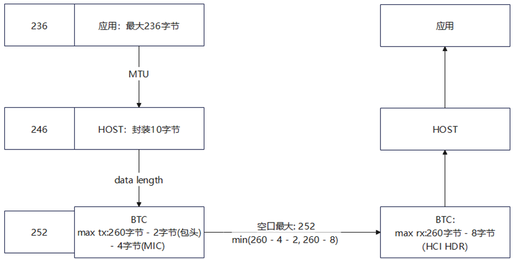

# SLE Mouse Sample<a name="ZH-CN_TOPIC_0000001837765793"></a>


## 概述<a name="ZH-CN_TOPIC_0000001837765713"></a>

此Sample演示一个真实的基于SLE的鼠标方案。当前鼠标支持滑动、左右按键、滚轮功能。

## 配置<a name="ZH-CN_TOPIC_0000001790966336"></a>

1.  在命令行下打开menuconfig配置界面，执行命令“python build.py standard-bs21-n1100 menuconfig”。
2.  在menuconfig界面中进入“application/System mouse Pin Configuration”，如Mouse Pin Config所示。
3.  选择完成后按“Q”、“Y”保存退出。

> **说明：** 
>以上所述的管脚配置仅适用于BS2X项目，不同项目的管脚配置需根据自身情况进行适当调整。

**图 1**  Mouse Pin Config<a name="fig73272401110"></a>  


## 编译<a name="ZH-CN_TOPIC_0000001837645773"></a>

1.  在命令行下打开menuconfig配置界面，执行命令“python build.py standard-bs21-n1100 menuconfig”。
2.  在menuconfig界面中选择鼠标Sample，如[图2](#fig165461512707)所示。
3.  <a name="li147941742506"></a>在menuconfig界面中选择鼠标，如[图3](#fig354495715112)所示，并选择合适的sensor，如[图4](#fig422011815401)所示。
4.  选择完成后按“Q”保存退出。
5.  使用IDE编译版本，编译出的版本包在“tools\\pkg\\fwpkg\\bs2x”路径下，如[图5](#fig063518437312)所示。
6.  <a name="li1443621546"></a>将编译出的版本按照“[烧录及运行](烧录及运行-57.md)”烧录进鼠标板。
7.  重启打开menuconfig配置界面，仿照[3](#li147941742506)～[6](#li1443621546)选择Dongle，进行编译，并将版本烧录进Dongle板

**图 1**  选择SLE Mouse服务<a name="fig52068218146"></a>  
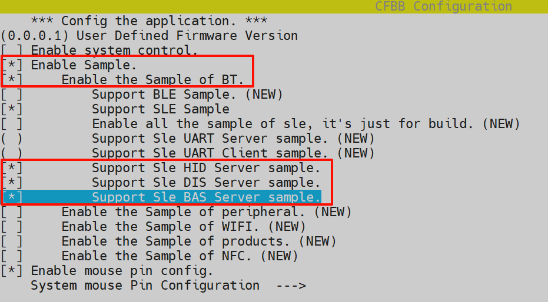

**图 2**  选择SLE Mouse Sample<a name="fig165461512707"></a>  
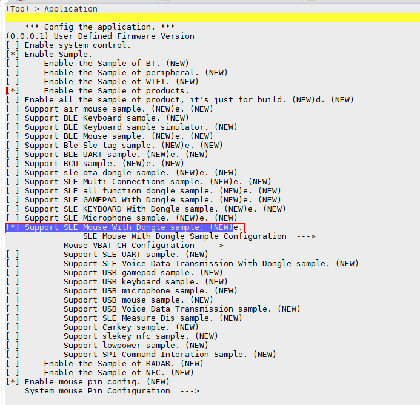

**图 3**  选择鼠标或者Dongle<a name="fig354495715112"></a>  
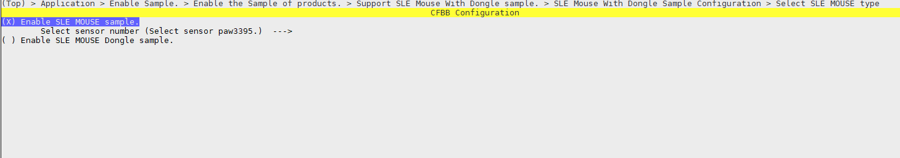

**图 4**  选择鼠标的sensor<a name="fig422011815401"></a>  
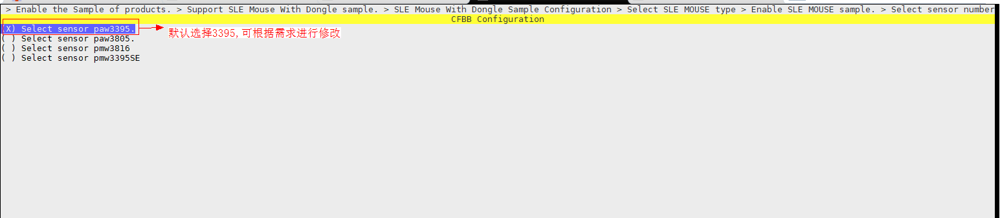

**图 5**  编译出的版本<a name="fig063518437312"></a>  


## 烧录及运行<a name="ZH-CN_TOPIC_0000001837645745"></a>

**烧录<a name="section948712445453"></a>**

将编译出的鼠标版本和Dongle版本分别烧录到鼠标板和Dongle板中，版本烧录方法请参见《BS2XV100  HiSpark Studio  使用指南》。

**运行<a name="section9308175717452"></a>**

1.  鼠标板和Dongle分别上电，Dongle采用USB直接插在电脑上的方式上电。
2.  观察鼠标板和Dongle板在UART-H0上的日志信息，如果出现“CONNECTED”表示已经完成连接。
3.  在PC上观察到鼠标移动，按键单击等都能正常工作即表示SLE Mouse功能正常。
4.  使用过程中鼠标或者Dongle重新上电，能够重新连接，并且功能正常。

## 注意事项<a name="ZH-CN_TOPIC_0000001790966216"></a>

> **须知：** 
>当前版本SDK SLE鼠标只支持paw3395这个传感器，后续会增补更多的传感器支持。

# SLE amic vdt with dongle<a name="ZH-CN_TOPIC_0000001790966248"></a>


## 概述<a name="ZH-CN_TOPIC_0000001837645733"></a>

此Sample演示一个真实的基于SLE的dongle amic音频方案。整体的连接关系和数据流图如[图1](#fig441524312714)所示。

**图 1**  SLE amic数据流图<a name="fig441524312714"></a>  
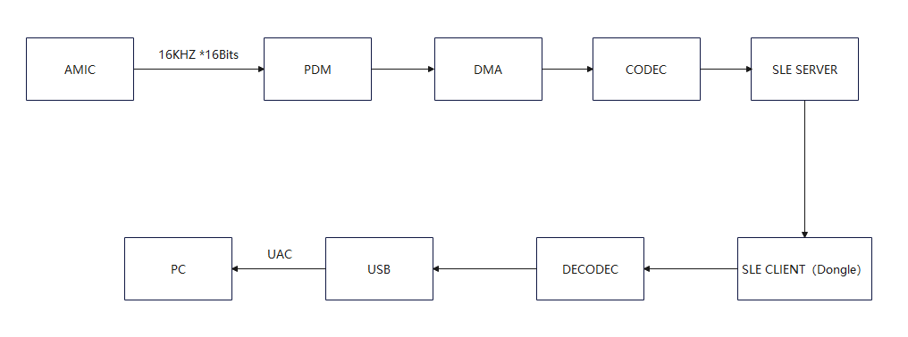

## 编译<a name="ZH-CN_TOPIC_0000001837645689"></a>

1.  在命令行下打开menuconfig配置界面，执行命令“python build.py standard-bs21 menuconfig”。
2.  在menuconfig界面中选择SLE AMIC Sample，如所[图1](#fig1435112258397)示。
3.  <a name="li86517304586"></a>在menuconfig界面中选择当前SLE type为Server端，如[图2](#fig1874015168504)所示；如果需要调整adc管脚以及单次uac和dma传输数量，采样率默认是16KHZ，则继续按[图3](#fig128231255526)、[图4](#fig172753104212)所示选择。选择完成后按“Q”或者“q”保存退出。
4.  使用IDE编译版本，编译出的版本包在“tools\\pkg\\fwpkg\\bs21”路径下，如[图6](#fig116431126152115)所示。
5.  将编译出的版本按照“[烧录及运行](烧录及运行-63.md)”烧录。
6.  <a name="li1716542814517"></a>重启打开menuconfig配置界面，仿照[3](#li86517304586)～[6](#li1716542814517)选择SLE AMIC Client\(Dongle\)，如[图5](#fig1593135913428)所示，进行编译，并将版本正常烧录。

**图 1**  选择SLE AMIC sample<a name="fig1435112258397"></a>  
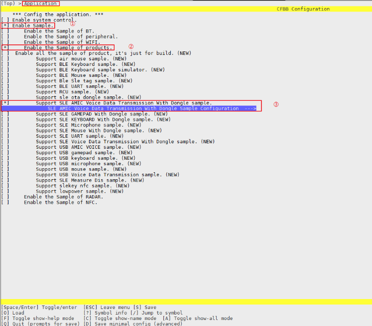

**图 2**  选择SLE AMIC SERVER<a name="fig1874015168504"></a>  
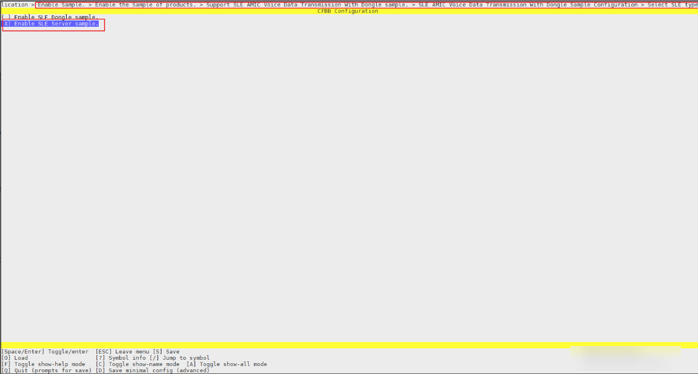

**图 3**  配置serve端相关参数<a name="fig128231255526"></a>  
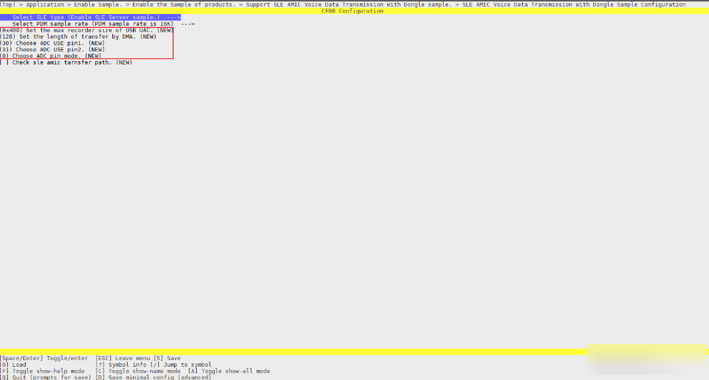

**图 4**  serve端采样率<a name="fig172753104212"></a>  
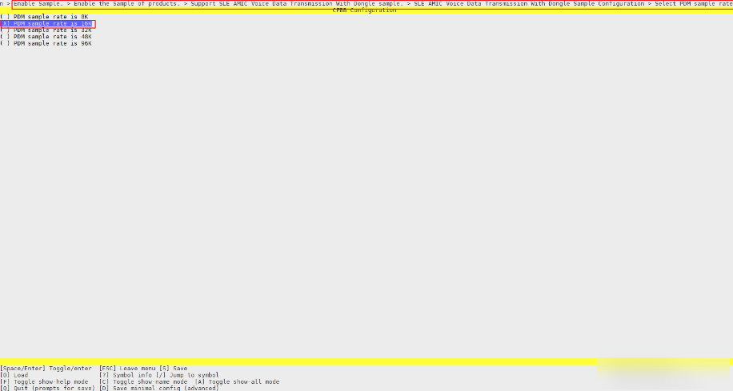

**图 5**  选择SLE AMIC DONGLE<a name="fig1593135913428"></a>  
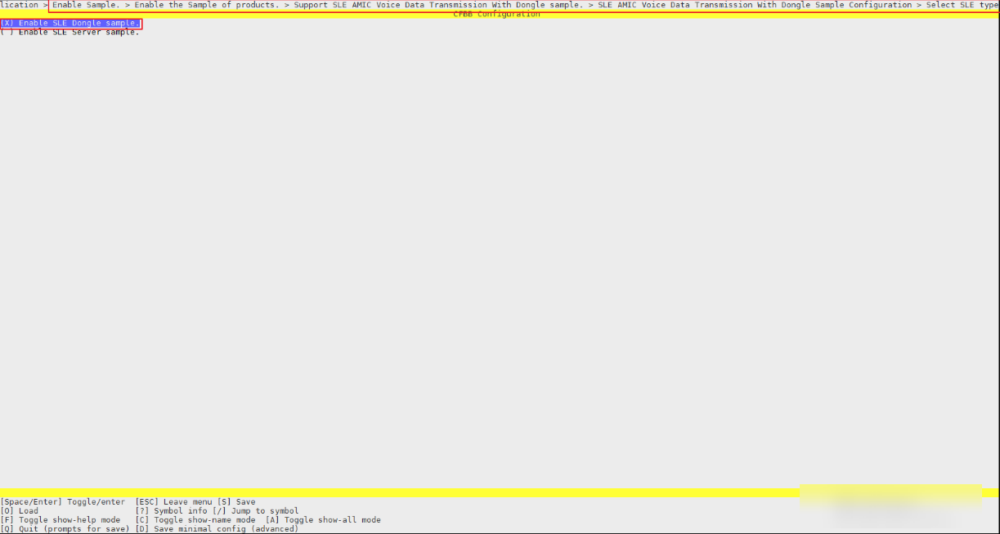

**图 6**  编译后的fwpkg<a name="fig116431126152115"></a>  


## 烧录及运行<a name="ZH-CN_TOPIC_0000001790806612"></a>

1.  准备两块单板，分别作为Server端和Client（dongle）端，版本烧录后正常复位，串口打印“Connected”，表示连接成功，查看设备管理器中识别出的一个音频设备。
2.  在PC选择声音设置中选择输入设备，选择相关配置，如[图1](#fig113541425612)所示。
3.  打开声音控制面板，如[图2](#fig15350184932415)所示，通过选择耳机或者默认播放设备侦听当前设备的声音且采样率配置为16KHZ×16Bits，如[图3](#fig1530715253257)、[图4](#fig527531420260)所示。
4.  用Server单板采集声音，pc端耳机中可以侦听到对应的音频，则表示对通成功。

**图 1**  声音设置<a name="fig113541425612"></a>  
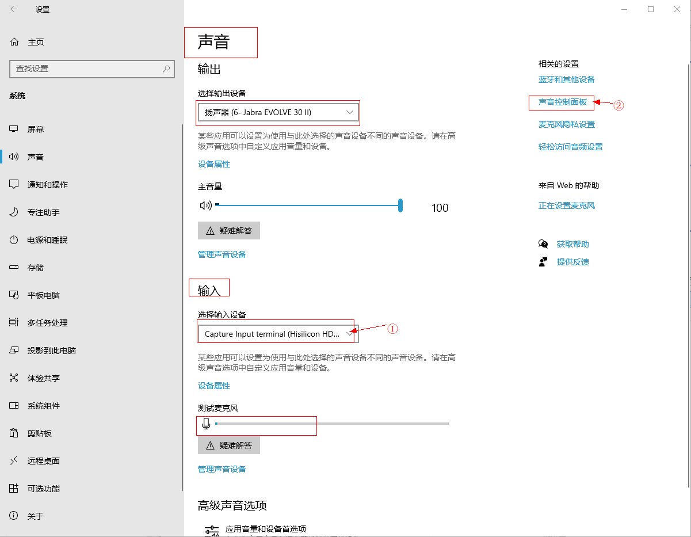

**图 2**  声音控制面板<a name="fig15350184932415"></a>  
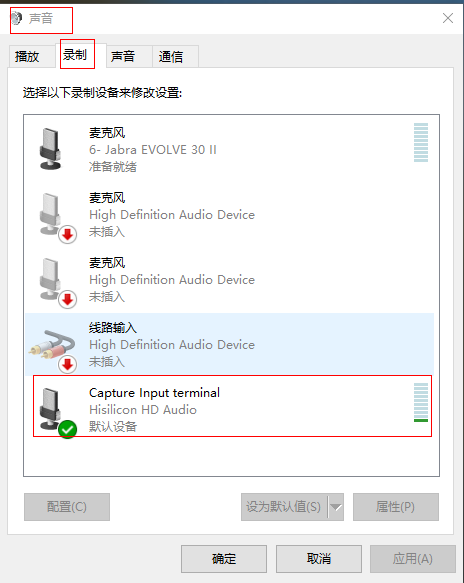

**图 3**  设备属性侦听<a name="fig1530715253257"></a>  
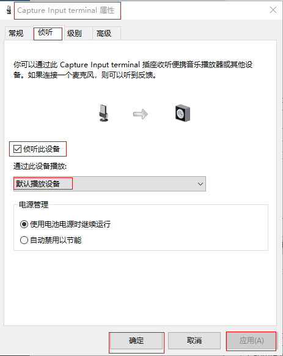

**图 4**  设备属性配置<a name="fig527531420260"></a>  
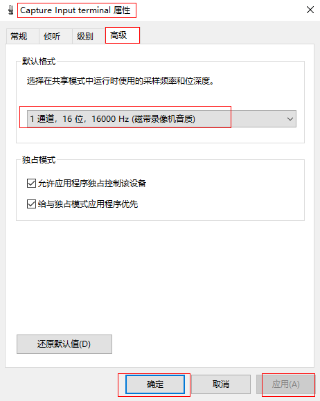

# SLE microphone<a name="ZH-CN_TOPIC_0000001866496702"></a>


## 概述<a name="ZH-CN_TOPIC_0000001912456317"></a>

此Sample演示一个真实的基于SLE的dongle麦克风方案。整体的连接关系和数据流图如[图1](#fig441524312714)所示。

**图 1**  SLE microphone功能框图<a name="fig441524312714"></a>  
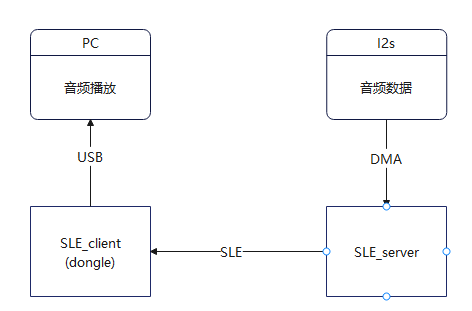

## 编译<a name="ZH-CN_TOPIC_0000001912535977"></a>

1.  在命令行下打开menuconfig配置界面，执行命令“python build.py standard-bs21-n1100 menuconfig”。
2.  在menuconfig界面中选择SLE Microphone Sample，如所[图1](#fig1435112258397)示。
3.  <a name="li86517304586"></a>在menuconfig界面中选择当前Microphone type为Server端，如[图2](#fig1874015168504)所示。
4.  在menuconfig界面中选择单次uac传输数量和SLE作为Server端的地址及名称，如[图3](#fig128231255526)所示。
5.  选择完成后按“Q”保存退出。
6.  使用IDE编译版本，编译出的版本包在“tools\\pkg\\fwpkg\\bs21”路径下，如下所示。
7.  <a name="li8164191173710"></a>将编译出的版本按照“[烧录及运行](烧录及运行-63.md)”烧录。
8.  重启打开menuconfig配置界面，仿照[3](#li86517304586)～[7](#li8164191173710)选择SLE Microphone Client\(Dongle\)，如所示，进行编译，并将版本正常烧录。

**图 1**  选择sample<a name="fig1435112258397"></a>  
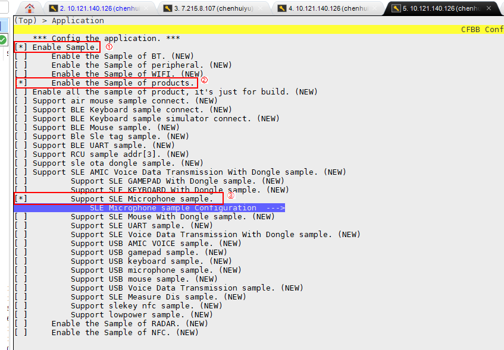

**图 2**  选择type<a name="fig1874015168504"></a>  
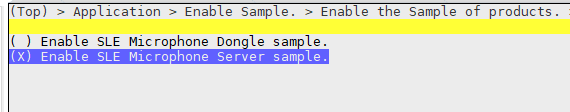

**图 3**  配置serve端相关参数<a name="fig128231255526"></a>  
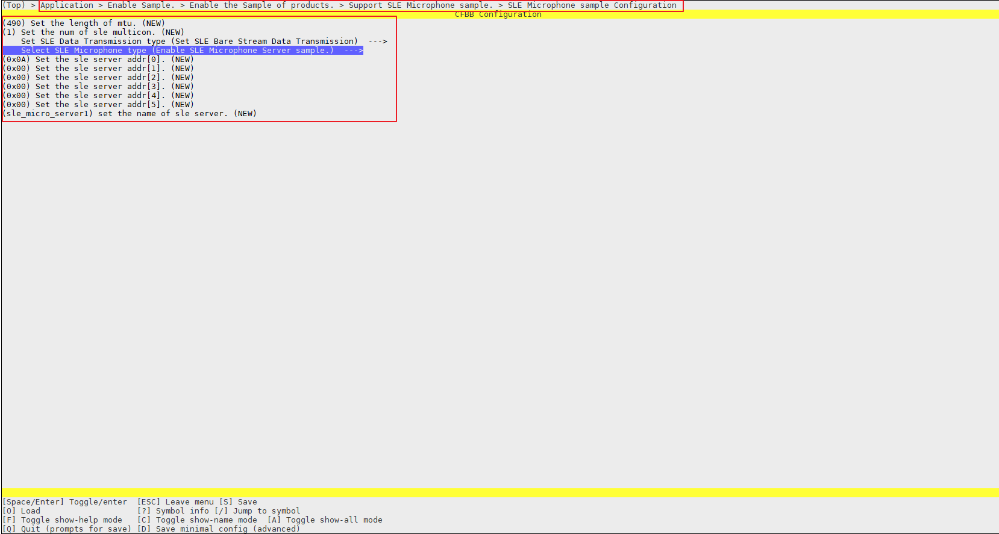

## 烧录及运行<a name="ZH-CN_TOPIC_0000001866656542"></a>

**烧录<a name="section948712445453"></a>**

将编译出的麦克风版本烧录到单板中，版本烧录方法请参见《BS2XV100  HiSpark Studio  使用指南》。

**运行<a name="section4415921314"></a>**

1.  准备两块单板，分别作为Server端和Client端，分别烧录后串口打印“Connected”，查看设备管理器中会出现一个音频设备。
2.  在PC选择声音设置中选择输入设备，如[图1](#fig113541425612)所示。
3.  用Server单板采集声音，pc端耳机中可以听到对应的音频，则表示对通成功。

**图 1**  声音设置<a name="fig113541425612"></a>  
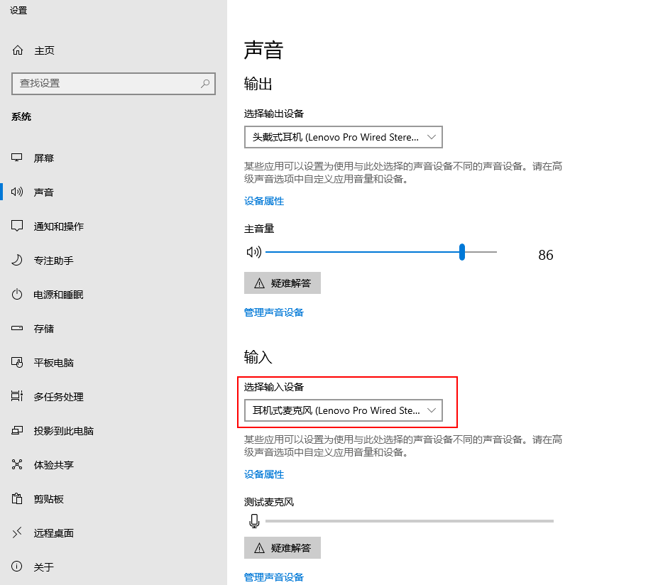

# SLE measure dis<a name="ZH-CN_TOPIC_0000001906107162"></a>


## 概述<a name="ZH-CN_TOPIC_0000001906113682"></a>

此Sample基于SLE的测距方案。server端\(广播\)与client端\(扫描\)建立sle连接，server端计算出距离。

## 编译<a name="ZH-CN_TOPIC_0000001941996837"></a>

1.  在命令行下打开menuconfig配置界面，执行命令“python build.py standard-bs21-n1100 menuconfig”。
2.  在menuconfig界面中选择SLE Measure Dis Sample，如[图1](#fig361683385814)所示。
3.  在menuconfig界面中选择Enable SLE MEASURE DIS Server sample，表明当前选择编译的是Server端，如[图1](#fig361683385814)所示。
4.  选择完成后按“Q”保存退出。
5.  使用IDE编译版本，编译出的版本包在“tools\\pkg\\fwpkg\\bs2x”路径下，如[图3](#fig156732614012)所示。
6.  将编译出的版本按照“[烧录及运行](烧录及运行-57.md)”章节进行烧录。
7.  重启打开menuconfig配置界面，仿照[图2](#fig128317412598)选择Enable SLE MEASURE DIS Client sample，表明当前选择编译的是Client端，如[图2](#fig128317412598)所示，进行编译，并将版本正常烧录。

**图 1**  选择server sample<a name="fig361683385814"></a>  
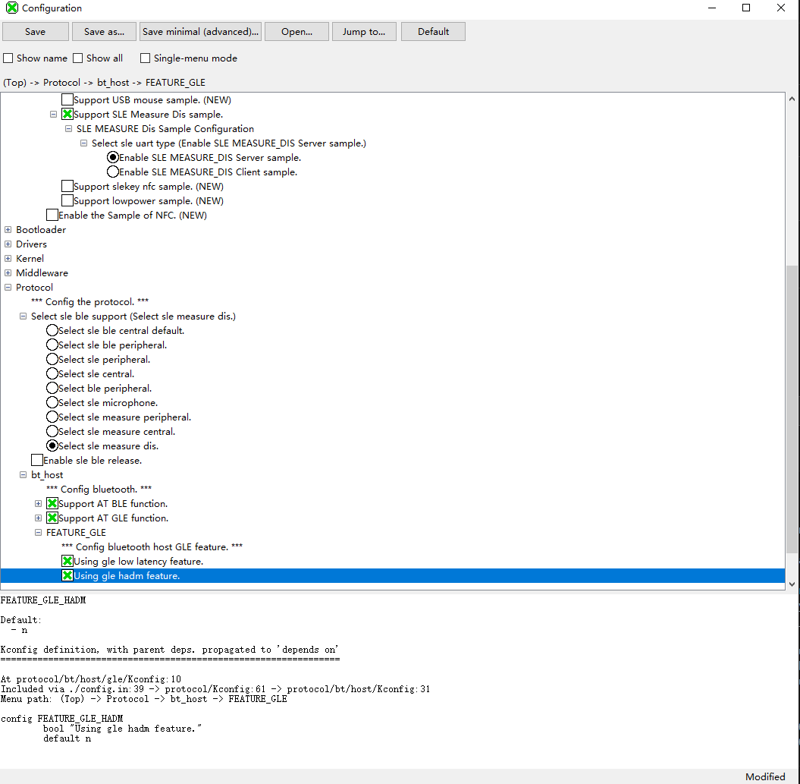

**图 2**  选择client sample<a name="fig128317412598"></a>  
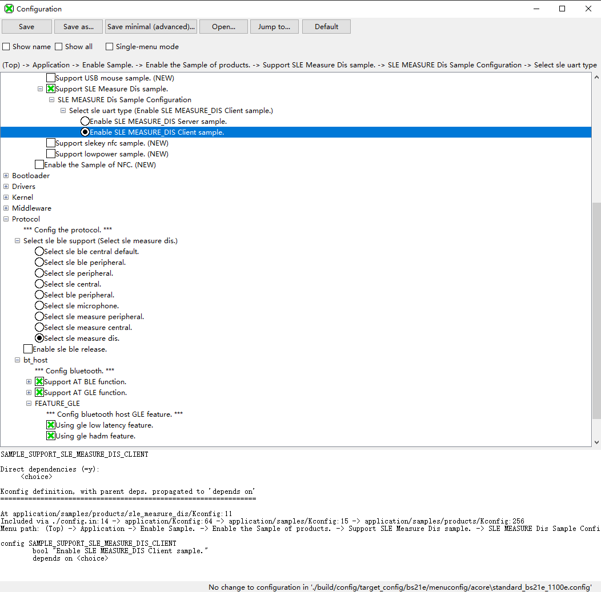

**图 3**  版本路径<a name="fig156732614012"></a>  
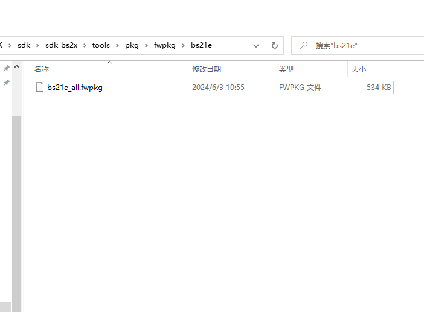

## 烧录及运行<a name="ZH-CN_TOPIC_0000001905957586"></a>

**烧录<a name="section948712445453"></a>**

将编译出的server, client 分别烧录到两块单板中，版本烧录方法请参见《BS2XV100  HiSpark Studio  使用指南》。

**运行<a name="section4415921314"></a>**

1.  准备两块单板，分别作为Server端和Client端，分别烧录后串口打印“Connected”。
2.  连接串口，查看server打印，可以看到距离值吐出

## 校准<a name="ZH-CN_TOPIC_0000001960441469"></a>

**图 1**  校准示意<a name="fig051614178524"></a>  
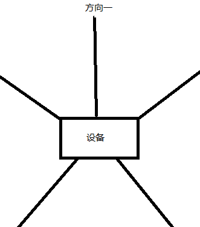

**图 2**  修改位置<a name="fig14390201615514"></a>  
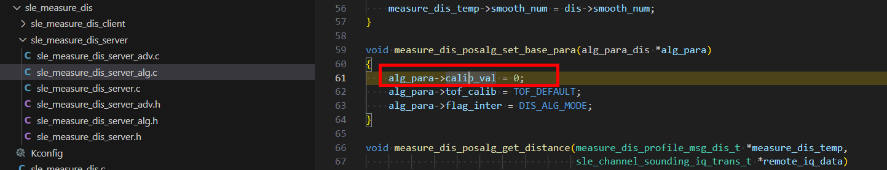

**测试环境：**

锚点周围3m范围内空旷无遮挡、无墙体、柱体、金属等遮挡物。

**测试方法：**

1.  按照[图1](#fig051614178524)所示在设备周围5个方向的1m位置，进行5次测距，5次测距值的其平均值减1为锚点A的校准值。、
2.  在如[图2](#fig14390201615514)代码位置减去校准值。application\\samples\\products\\sle\_measure\_dis\\sle\_measure\_dis\_server\\sle\_measure\_dis\_server\_alg.c

# SLE Multi Conn Sample<a name="ZH-CN_TOPIC_0000002188667006"></a>


## 概述<a name="ZH-CN_TOPIC_0000002224116757"></a>

此sample演示的是client和server数据交互的方案，可编译client或者server身份的镜像，不可同时具备client和server身份。client上电后自动起扫描，扫描到server会主动发起连接，连接后会循环给server发数据。

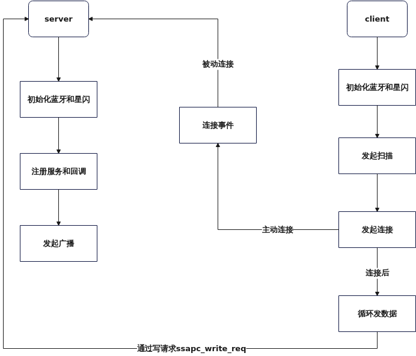

## 编译<a name="ZH-CN_TOPIC_0000002224191205"></a>

1.  在命令行下打开menuconfig配置界面，执行命令“python build.py standard-bs21-n1100 menuconfig”。
2.  在menuconfig界面中选择 SLE Multi Connections sample，如图[选择SLE Multi Connections Sample](#fig14454135055)所示
3.  选择完成后按“Q”保存退出。
4.  使用sdk编译版本，编译出的版本包在“output\\bs21\\fwpkg\\standard-bs21-n1100”路径下，如[编译后生成的镜像](#fig062141177)所示。
5.  将编译出的版本按照[烧录及运行](烧录及运行-69.md)烧录。

**图 1**  选择SLE Multi Connections Sample<a name="fig14454135055"></a>  


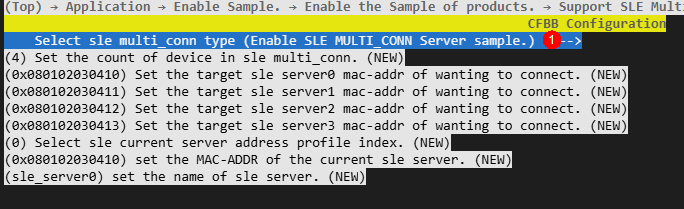

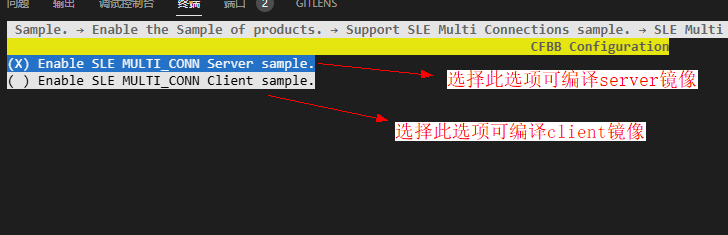

**图 2**  编译后生成的镜像<a name="fig062141177"></a>  


## 烧录及运行<a name="ZH-CN_TOPIC_0000002188671122"></a>

**烧录<a name="section11501615135313"></a>**

版本烧录方法请参见《BS2XV100  HiSpark Studio  使用指南》。

**运行<a name="section20261858162412"></a>**

1.  准备两块单板，分别作为Server端和Client端，每块单板上将UART-L0和UART-L2与PC通过串口板连接。
2.  通过UART-L0分别将编译好的Server版本和Client版本烧录到单板中。
3.  在PC端分别通过两个串口助手连接两个单板的UART-L2，并且将串口设置到115200波特率，并打开串口。
4.  两块单板都上电后，client会给server发write请求，server有相应的数据打印，则client与server对通成功

# BLE Lowpower Sample<a name="ZH-CN_TOPIC_0000002223691665"></a>


## 概述<a name="ZH-CN_TOPIC_0000002223737241"></a>

BLE Lowpower Sample主要展示了低功耗相关回调的注册（[图1](#fig14760201154415)）、以及睡眠定时器的操作。当时，会触发handler中对应的回调，可在对应的注册函数中实现对应的操作。需要注意的是，sleep只能转换到work，具体3种状态的转换如[图2](#fig12407141754210)所示。。

**图 1**  低功耗相关回调注册<a name="fig14760201154415"></a>  
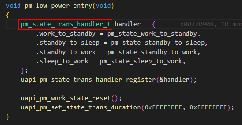

**图 2**  状态转换<a name="fig12407141754210"></a>  
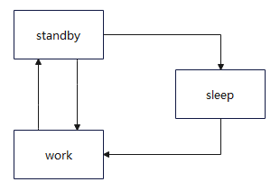

## 编译<a name="ZH-CN_TOPIC_0000002188451282"></a>

1.  在命令行下打开menuconfig配置界面，执行命令“python build.py standard-bs21-n1100 menuconfig”。
2.  在menuconfig界面中选择BLE UART Sample，如[图1](#fig169801446114114)所示。
3.  选择完成后按“Q”保存退出。
4.  使用IDE编译版本，编译出的版本包在“tools\\pkg\\fwpkg\\bs2x”路径下，如[\#ZH-CN\_TOPIC\_0000002188451282/fig172231859194418](#fig172231859194418)所示。
5.  将编译出的版本按照“[烧录及运行](烧录及运行-57.md)”烧录。

**图 1**  选择BLE Lowepower Sample<a name="fig169801446114114"></a>  
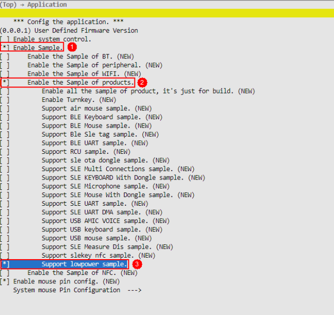

**图 2**  编译后的版本<a name="fig6475121654313"></a>  


## 烧录及运行<a name="ZH-CN_TOPIC_0000002188291582"></a>

**烧录<a name="section11501615135313"></a>**

版本烧录方法请参见《BS2XV100  HiSpark Studio  使用指南》。

**运行<a name="section370983782713"></a>**

1.  准备一块单板，作为Server端，单板上将UART-L0和UART-L2与PC通过串口板连接。
2.  通过UART-L0将编译好的Server版本烧录到单板中。
3.  在PC端通过串口助手连接单板的UART-L2，并且将串口设置到115200波特率，并打开串口。

# BLE UART Sample<a name="ZH-CN_TOPIC_0000001790806492"></a>


## 概述<a name="ZH-CN_TOPIC_0000001837645729"></a>

BLE UART与SLE UART的实现原理与方案一致，唯一的不同是空口由星闪传输换成了BLE传输，参考“[概述](概述-51.md)”。

## 编译<a name="ZH-CN_TOPIC_0000001837765661"></a>

1.  在命令行下打开menuconfig配置界面，执行命令“python build.py standard-bs21-n1100 menuconfig”。
2.  <a name="li1870123015263"></a>在menuconfig界面中选择BLE UART Sample，如[图1](#fig169801446114114)所示。
3.  在menuconfig界面中选择当前Sample使用的UART BUS，如[图2](#fig6475121654313)所示。
4.  在menuconfig界面中选择BLE UART Server，如[图3](#fig17183141313443)所示。
5.  选择完成后按“Q”保存退出。
6.  使用IDE编译版本，编译出的版本包在“tools\\pkg\\fwpkg\\bs2x”路径下，如[图4](#fig172231859194418)所示。
7.  <a name="li8164191173710"></a>将编译出的版本按照“[烧录及运行](烧录及运行-57.md)”烧录。
8.  重启打开menuconfig配置界面，仿照[2](#li1870123015263)～[7](#li8164191173710)选择BLE UART Client，如[图5](#fig10113182954618)所示，进行编译，并将版本正常烧录。

**图 1**  选择BLE UART Sample<a name="fig169801446114114"></a>  
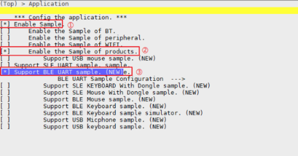

**图 2**  选择BLE UART BUS<a name="fig6475121654313"></a>  
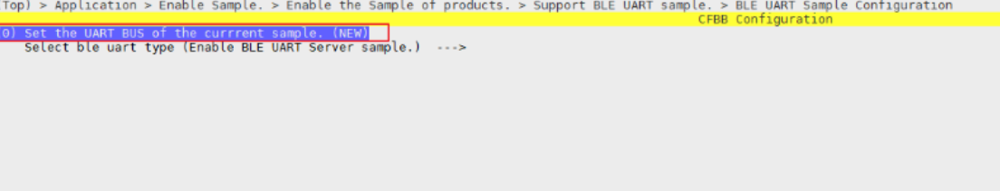

**图 3**  选择BLE UART Server<a name="fig17183141313443"></a>  
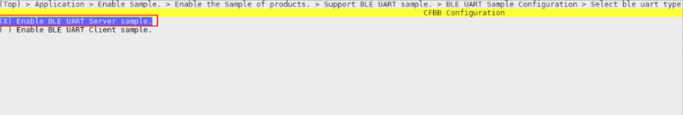

**图 4**  编译后的版本<a name="fig172231859194418"></a>  


**图 5**  选择BLE UART Client<a name="fig10113182954618"></a>  
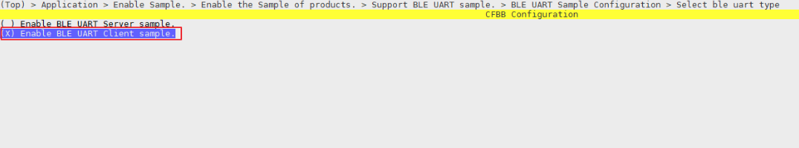

## 烧录及运行<a name="ZH-CN_TOPIC_0000001790966344"></a>

BLE UART的烧录及运行方法与SLE UART一致，参考“[烧录及运行](烧录及运行.md)”。

# BLE Keyboard Sample<a name="ZH-CN_TOPIC_0000001837645741"></a>


## 概述<a name="ZH-CN_TOPIC_0000001790966308"></a>

此Sample演示一个真实的基于BLE的无Dongle键盘方案。当前键盘Sample支持两种键盘规格，分别是2×3的矩阵键盘和8×16的矩阵键盘（全键盘）。

## 编译<a name="ZH-CN_TOPIC_0000001790966284"></a>

1.  在命令行下打开menuconfig配置界面，执行命令“python build.py standard-bs21-n1100 menuconfig”。
2.  在menuconfig界面中选择BLE键盘Sample，如[图1](#fig11819102410515)所示。
3.  选择完成后按“Q”保存退出。
4.  使用IDE编译版本，编译出的版本包在“tools\\pkg\\fwpkg\\bs2x”路径下，如[图2](#fig57581930962)所示。
5.  将编译出的版本按照“[烧录及运行](烧录及运行-57.md)”烧录。

**图 1**  选择BLE Keyboard Sample<a name="fig11819102410515"></a>  
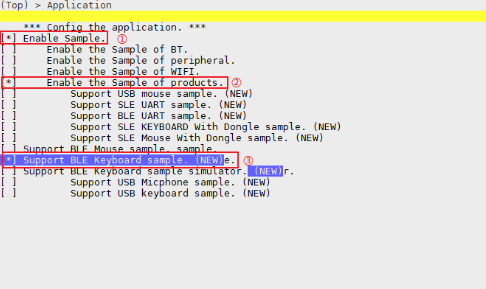

**图 2**  编译出的版本<a name="fig57581930962"></a>  


## 烧录及运行<a name="ZH-CN_TOPIC_0000001837765753"></a>

**烧录<a name="section948712445453"></a>**

将编译出的键盘版本烧录到键盘板中，版本烧录方法请参见《BS2XV100  HiSpark Studio  使用指南》。

**运行<a name="section520612111327"></a>**

1.  键盘板上电。
2.  在电脑（支持BLE键盘）上搜索名称为“ble\_keyboard”的设备，并且进行连接。
3.  在PC端打开记事本，并通过键盘输入信息，输入的信息在记事本中可以显示即表示BLE Keyboard功能正常。
4.  使用过程中键盘重新上电，能够重新连接，并且功能正常。

# BLE SLE TAG Sample<a name="ZH-CN_TOPIC_0000002224187053"></a>


## 概述<a name="ZH-CN_TOPIC_0000002188830814"></a>

此Sample演示的是一个同时支持蓝牙和星闪方案，可进行星闪或者蓝牙的连接。

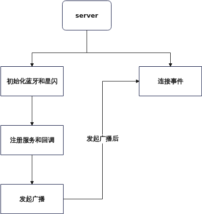

## 编译<a name="ZH-CN_TOPIC_0000002224116761"></a>

1.  在命令行下打开menuconfig配置界面，执行命令“python build.py standard-bs21-n1100 menuconfig”。
2.  在menuconfig界面中选择 Ble Sle tag sample，如图[Ble Sle tag sample](#fig6953174811455)
3.  选择完成后按“Q”保存退出。
4.  使用sdk编译版本，编译出的版本包在“output\\bs21\\fwpkg\\standard-bs21-n1100”路径下，如图[编译后生成的镜像](#fig1741282616472)所示。
5.  将编译出的版本按照[烧录及运行](烧录及运行-81.md)烧录。

**图 1**  Ble Sle tag sample<a name="fig6953174811455"></a>  
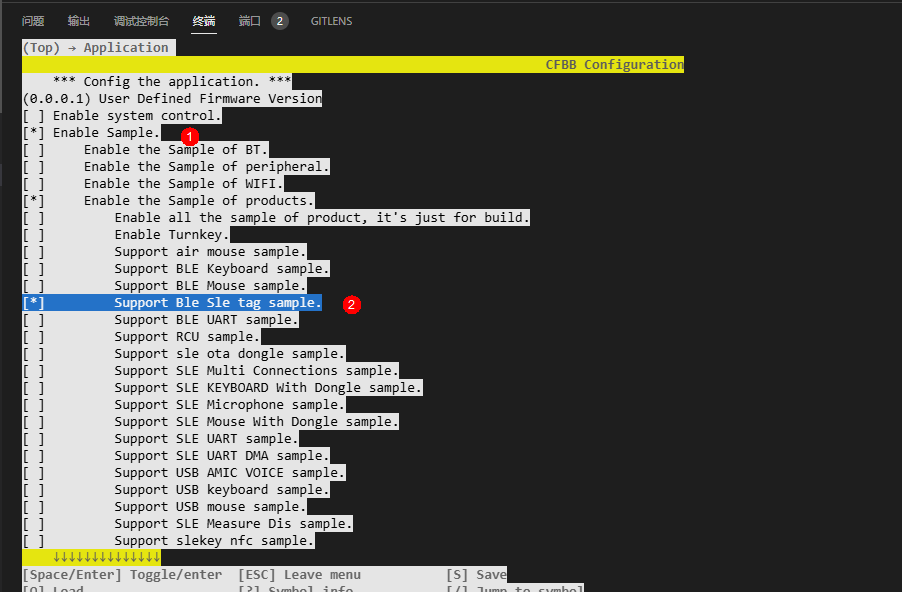

**图 2**  编译后生成的镜像<a name="fig1741282616472"></a>  
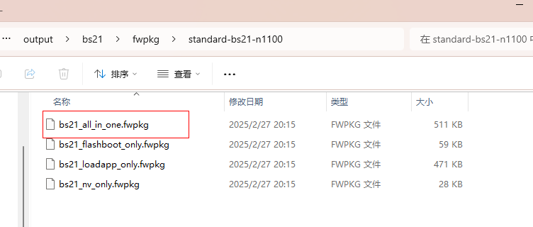

## 烧录及运行<a name="ZH-CN_TOPIC_0000002224191209"></a>

**烧录<a name="section11501615135313"></a>**

版本烧录方法请参见《BS2XV100  HiSpark Studio  使用指南》。

**运行<a name="section20261858162412"></a>**

1.  准备一块单板，每块单板上将UART-L0和UART-L2与PC通过串口板连接。
2.  通过UART-L0分别将编译好的Server版本和Client版本烧录到单板中。
3.  在PC端通过串口助手连接单板的UART-L2，并且将串口设置到115200波特率，并打开串口。
4.  上电后可看到设置注册服务和起广播的流程，此时可用一个可扫描的设备连接单板。

# BLE Mouse Sample<a name="ZH-CN_TOPIC_0000001837765673"></a>


## 概述<a name="ZH-CN_TOPIC_0000001790966316"></a>

此Sample演示一个真实的基于BLE的无Dongle鼠标方案。当前鼠标支持滑动、左右按键、滚轮功能。

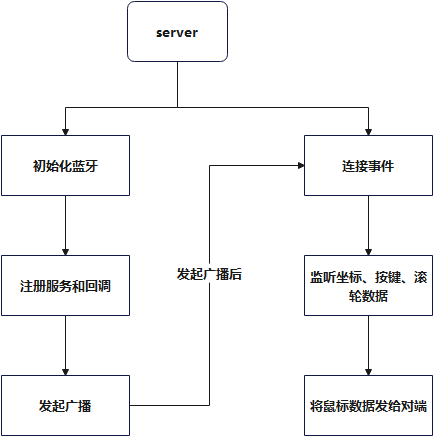

**图 1**  发送鼠标数据主要函数<a name="fig1757182433419"></a>  
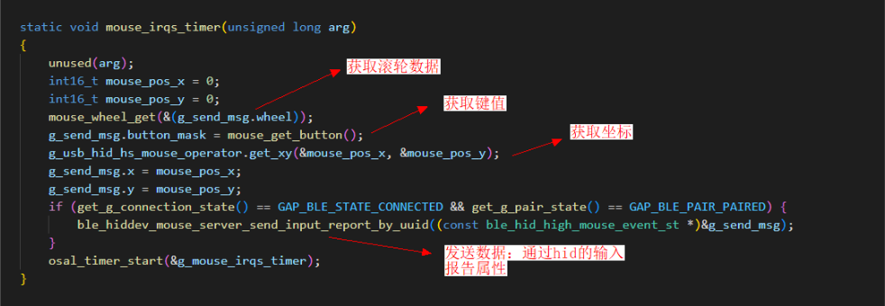

## 编译<a name="ZH-CN_TOPIC_0000001790966288"></a>

1.  在命令行下打开menuconfig配置界面，执行命令“python build.py standard-bs21-n1100 menuconfig”。
2.  在menuconfig界面中进入“application/System mouse Pin Configuration”，进行鼠标管脚配置，如[图1](#fig8838117174110)所示。
3.  在menuconfig界面中选择BLE鼠标Sample，如[图2](#fig13269153654114)所示。
4.  在menuconfig界面中选择BLE鼠标的Sensor，如[图3](#fig19164185324114)所示。
5.  选择完成后按“Q”、“Y”保存退出。
6.  使用IDE编译版本，编译出的版本包在“tools\\pkg\\fwpkg\\bs21”路径下，如[图4](#fig1461617221592)所示。
7.  将编译出的版本按照“[烧录及运行](烧录及运行-57.md)”烧录进鼠标板。

**图 1**  Mouse Pin Config<a name="fig8838117174110"></a>  


**图 2**  选择BLE Mouse Sample<a name="fig13269153654114"></a>  
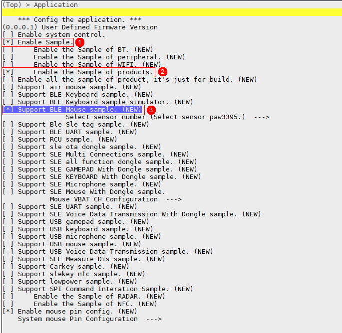

**图 3**  选择sensor型号<a name="fig19164185324114"></a>  


**图 4**  编译出的版本<a name="fig1461617221592"></a>  
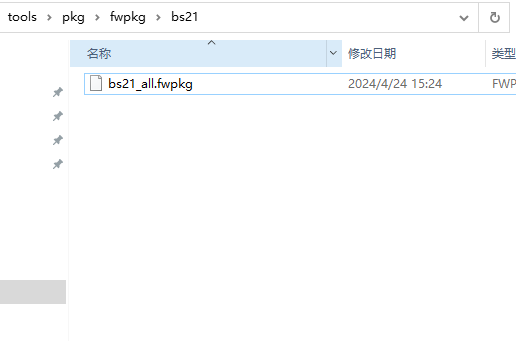

## 烧录及运行<a name="ZH-CN_TOPIC_0000001790806572"></a>

**烧录<a name="section948712445453"></a>**

将编译出的鼠标版本烧录到鼠标板中，版本烧录方法请参见《BS2XV100  HiSpark Studio  使用指南》。

**运行<a name="section520612111327"></a>**

1.  鼠标板上电。
2.  在电脑（支持BLE鼠标）上搜索名称为“ble\_mouse'”的设备，并且进行连接。
3.  在PC上观察到鼠标移动，按键单击等都能正常工作即表示BLE Mouse功能正常。
4.  使用过程中鼠标重新上电，能够重新连接，并且功能正常。

# USB Keyboard Sample<a name="ZH-CN_TOPIC_0000001837765805"></a>


## 概述<a name="ZH-CN_TOPIC_0000001790966268"></a>

此sample演示一个真实的基于USB的方案。当前键盘sample支持两种键盘规格，分别是2x3的矩阵键盘和8x16的矩阵键盘（全键盘）。

## 编译<a name="ZH-CN_TOPIC_0000001790806604"></a>

1.  在命令行下打开menuconfig配置界面，执行命令“python build.py standard-bs21-n1100 menuconfig”。
2.  在menuconfig界面中选择USB键盘Sample，如[图1](#fig640715522143)所示。
3.  选择完成后按“Q”保存退出。
4.  使用IDE编译版本，编译出的版本包在“tools\\pkg\\fwpkg\\bs2x”路径下，如[图2](#fig824144515155)所示。
5.  将编译出的版本按照“[烧录及运行](烧录及运行-57.md)”烧录。

**图 1**  选择USB Keyboard Sample<a name="fig640715522143"></a>  
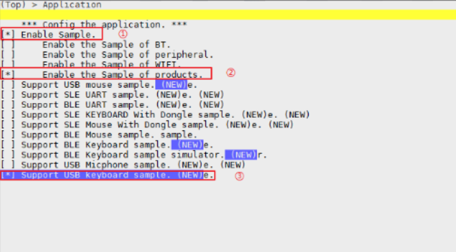

**图 2**  编译后的版本<a name="fig824144515155"></a>  
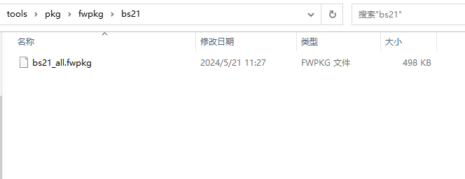

## 烧录及运行<a name="ZH-CN_TOPIC_0000001837765785"></a>

**烧录<a name="section948712445453"></a>**

将编译出的键盘版本烧录到键盘板中，版本烧录方法请参见《BS2XV100  HiSpark Studio  使用指南》。

**运行<a name="section520612111327"></a>**

1.  键盘板上电。
2.  如果是非USB供电的单板，将USB与电脑连接。
3.  在PC端打开记事本，并通过键盘输入信息，输入的信息在记事本中可以显示即表示USB Keyboard功能正常。
4.  使用过程中键盘重新上电，能够重新连接，并且功能正常。

# USB Mouse Sample<a name="ZH-CN_TOPIC_0000001790966348"></a>


## 概述<a name="ZH-CN_TOPIC_0000001790806648"></a>

此Sample演示一个真实的基于USB的无Dongle鼠标方案。当前鼠标支持滑动、左右按键、滚轮功能。

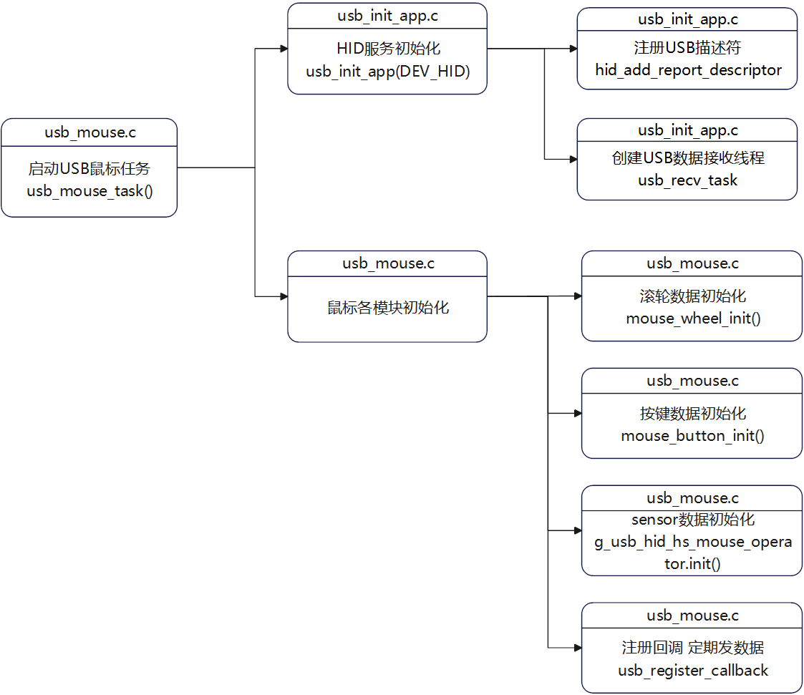

## 编译<a name="ZH-CN_TOPIC_0000001790806592"></a>

1.  在命令行下打开menuconfig配置界面，执行命令“python build.py standard-bs21-n1100 menuconfig”。
2.  在menuconfig界面中进入“application/System mouse Pin Configuration”，如[图1](#fig196586534423)所示。
3.  在menuconfig界面中选择USB鼠标Sample，如[图2](#fig1097181594319)所示，并选择合适的sensor，如[图3](#fig1815914230436)所示。
4.  选择完成后按“Q”、“Y”保存退出。
5.  使用IDE编译版本，编译出的版本包在“tools\\pkg\\fwpkg\\bs2x”路径下，如[图4](#fig73971256134)所示。
6.  将编译出的版本按照“[烧录及运行](烧录及运行-57.md)”烧录进鼠标板。

**图 1**  Mouse Pin Config<a name="fig196586534423"></a>  


**图 2**  选择USB Mouse Sample<a name="fig1097181594319"></a>  
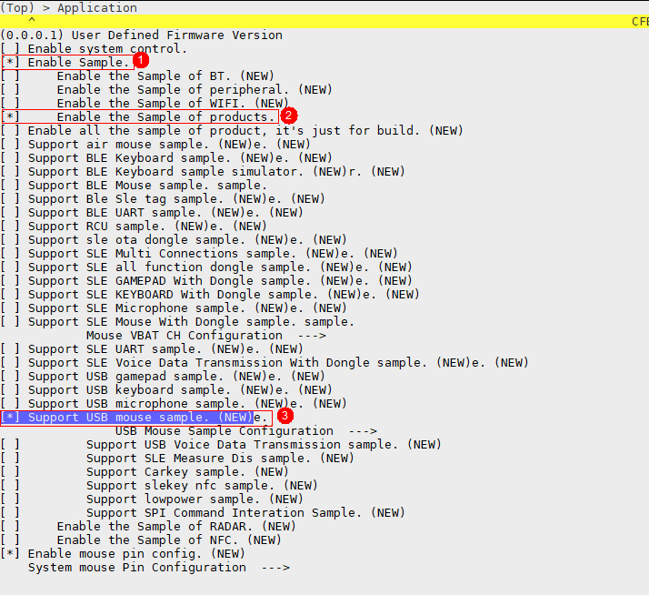

**图 3**  选择鼠标的sensor<a name="fig1815914230436"></a>  
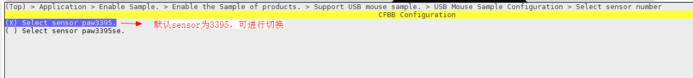

**图 4**  编译出的版本<a name="fig73971256134"></a>  


## 烧录及运行<a name="ZH-CN_TOPIC_0000001790966340"></a>

**烧录<a name="section948712445453"></a>**

将编译出的鼠标版本烧录到鼠标板中，版本烧录方法请参见《BS2XV100  HiSpark Studio  使用指南》。

**运行<a name="section520612111327"></a>**

1.  鼠标板上电。
2.  如果是非USB供电的单板，将USB与电脑连接。
3.  在PC上观察到鼠标移动，按键单击等都能正常工作即表示BLE Mouse功能正常。
4.  使用过程中鼠标重新上电，能够重新连接，并且功能正常。

# USB AMIC VDT Sample<a name="ZH-CN_TOPIC_0000001837645701"></a>


## 概述<a name="ZH-CN_TOPIC_0000001790806568"></a>

此Sample演示一个USB AMIC 音频数传方案。当前支持16K采样率，16Bits位宽采样。

## 方案<a name="ZH-CN_TOPIC_0000001790806576"></a>

**图 1**  USB AMIC 数据流图<a name="fig49003499385"></a>  
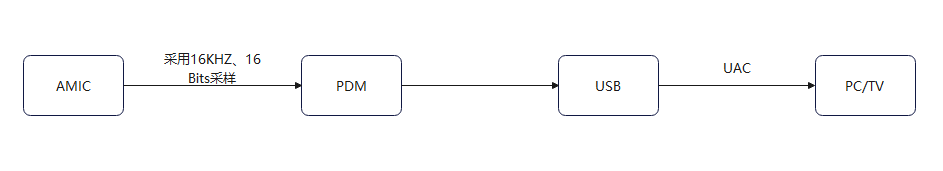

**图 2**  USB AMIC 流程图<a name="fig1251651174619"></a>  

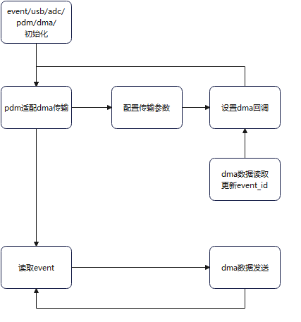

## 编译<a name="ZH-CN_TOPIC_0000001837765761"></a>

1.  在命令行下打开menuconfig配置界面，执行命令“python build.py standard-bs21-n1100 menuconfig”。
2.  在menuconfig界面中选择USB AMIC Sample，如[图1](#fig55441733151812)所示。
3.  在menuconfig界面中选择USB AMIC 相关配置，如[图2](#fig24175441916)所示。
4.  选择完成后按“Q”或者 ‘q’保存退出。
5.  使用IDE编译版本，编译出的版本包在“output\\bs21\\fwpkg\\xxx”路径下，如下[图3](#fig37779292111)所示。
6.  将编译出的版本按照“[烧录及运行](烧录及运行-57.md)”烧录。

**图 1**  USB AMIC Sample<a name="fig55441733151812"></a>  
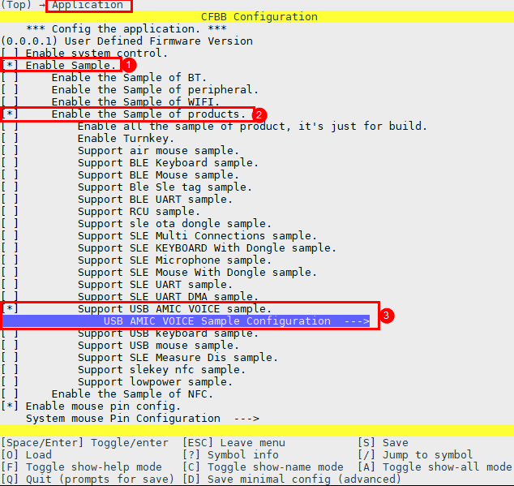

**图 2**  USB AMIC 配置项<a name="fig24175441916"></a>  
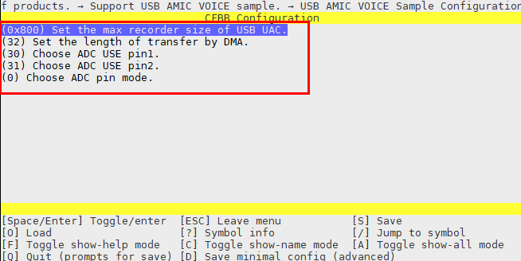

**图 3**  编译后的版本<a name="fig37779292111"></a>  
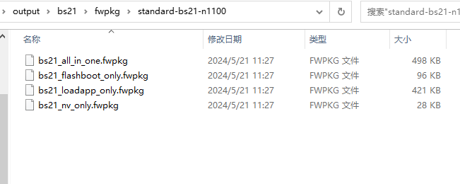

## 烧录及运行<a name="ZH-CN_TOPIC_0000001790806584"></a>

**烧录<a name="section948712445453"></a>**

将编译出的音频数传版本烧录到单板中，版本烧录方法请参见《BS2XV100  HiSpark Studio  使用指南》。

**运行<a name="section520612111327"></a>**

1.  准备一块单板，版本烧录后正常复位，并打开串口和声音设置，选择相关配置，如[图1](#fig192771141194516)、[图2](#fig18881202411465)所示。
2.  通过耳机侦听当前设备的声音，可以看到有声音波动，且人声清晰，如[图3](#fig3936180154716)、[图4](#fig1328363512472)所示。

**图 1**  USB AMIC 配置属性1<a name="fig192771141194516"></a>  
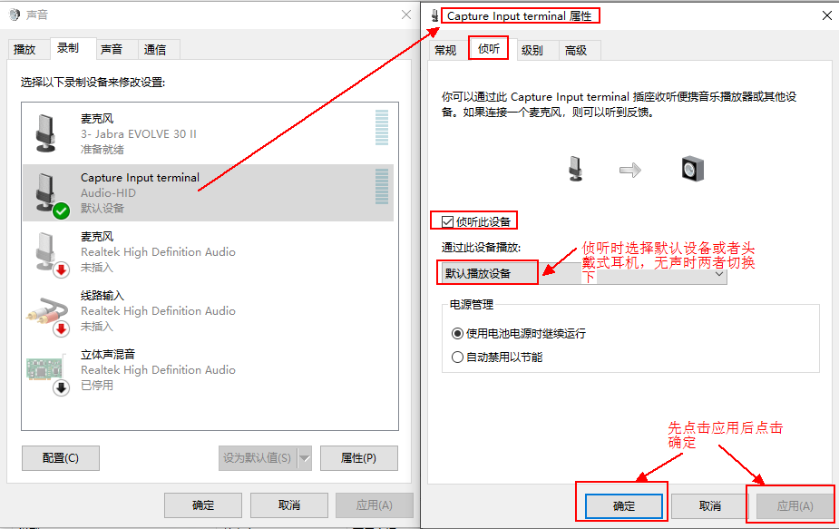

**图 2**  USB AMIC 配置属性2<a name="fig18881202411465"></a>  
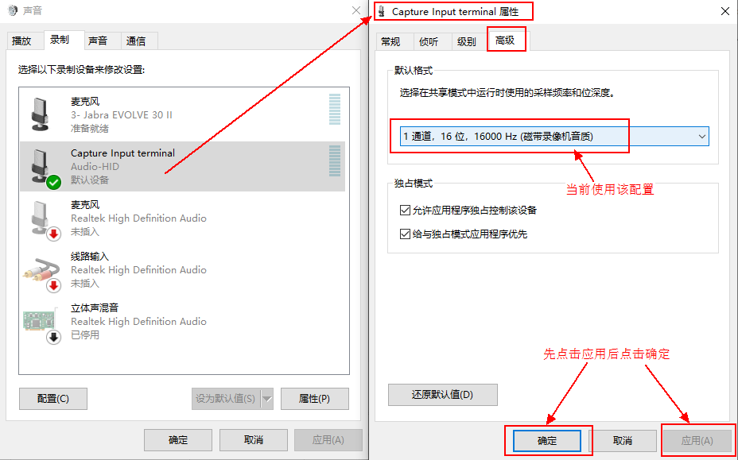

**图 3**  USB AMIC 运行<a name="fig3936180154716"></a>  
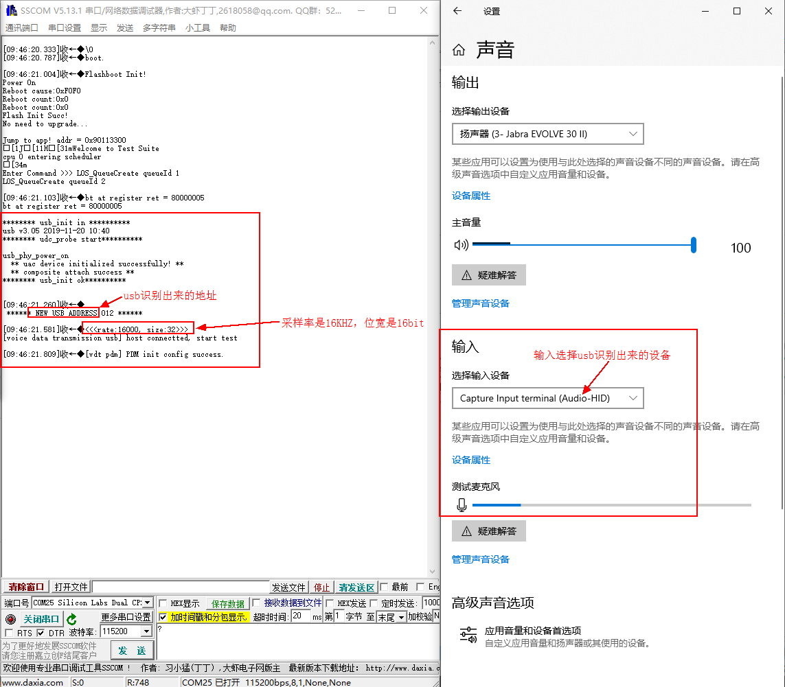

**图 4**  USB AMIC 运行2<a name="fig1328363512472"></a>  
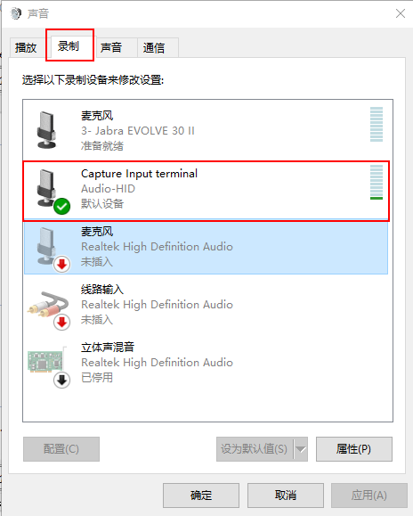

# RCU<a name="ZH-CN_TOPIC_0000001864690254"></a>


## 概述<a name="ZH-CN_TOPIC_0000001913821721"></a>

此Sample演示一个真实的基于SLE、BLE与IR的遥控器方案。当前支持自定义按键规格。

## 方案<a name="ZH-CN_TOPIC_0000002200425542"></a>

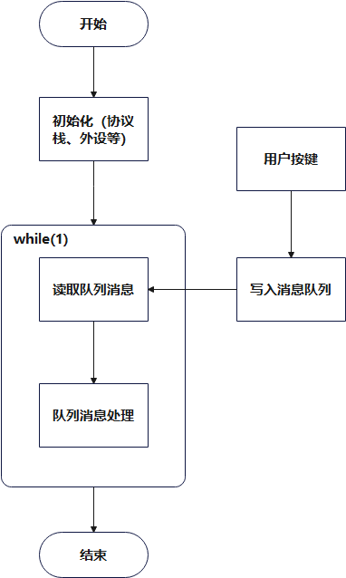

## 编译<a name="ZH-CN_TOPIC_0000001910689933"></a>

当前rcu Sample支持两种规格，键盘规格的选择在Keyscan驱动的Kconfig选项中选择，默认使用3x2的六键键盘，可选择用户自定义按键规格自行设置。配置选项如[图1](#fig936317130595)、[图2](#fig131111112145819)所示。

**SLE RCU SAMPLE编译配置<a name="section13353101213720"></a>**

**图 1**  键盘选择六键配置<a name="fig936317130595"></a>  
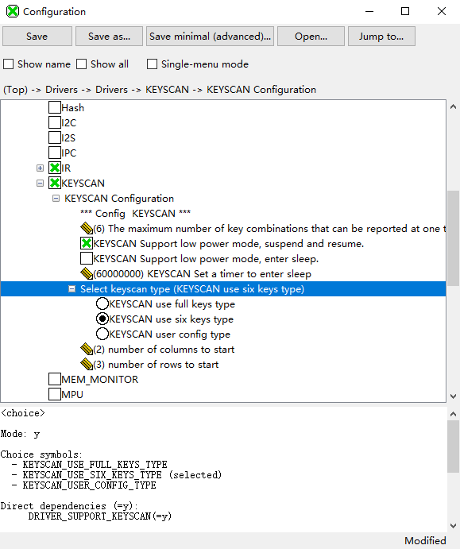

**图 2**  键盘选择自定义配置<a name="fig131111112145819"></a>  
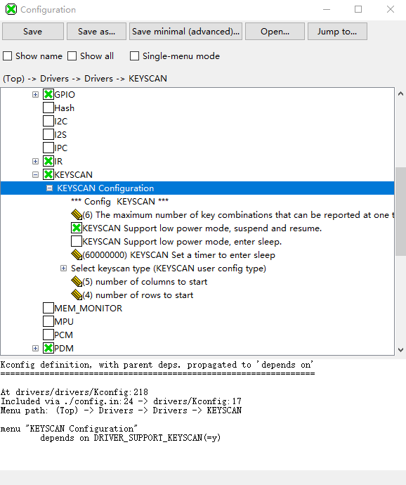

编译步骤如下：

1.  在IDE工具下打开menuconfig配置界面，单击KConfig按钮。
2.  在menuconfig界面中选择键盘规格，如[图1](#fig936317130595)、[图2](#fig131111112145819)所示。
3.  <a name="li12578192643818"></a>在menuconfig界面中选择Sample，选择SLE RCU Server，配置RCU本地地址，如[图3](#fig39485019229)所示。
4.  在menuconfig界面中选择开启低功耗，如[图4](#fig255692722613)所示。
5.  选择完成后单击save保存退出。
6.  <a name="li155218180396"></a>使用IDE编译版本，编译出的版本包在"output\\bs21\\fwpkg\\bs21-1100-rcu" 路径下，如[图5](#fig18317193617319)所示。
7.  将编译出的server版本按照烧录进板子。
8.  在menuconfig界面中选择Sample，选择RCU dongle，配置目标server地址，需与[3](#li12578192643818)配置的RCU server地址保持一致，如[图6](#fig18137152003317)所示。
9.  选择完成后单击save保存退出。
10. 将编译出的dongle版本按照烧录进板子。编译方法与版本路径与[6](#li155218180396)一致。

**图 3**  选择SLE RCU Server sample<a name="fig39485019229"></a>  
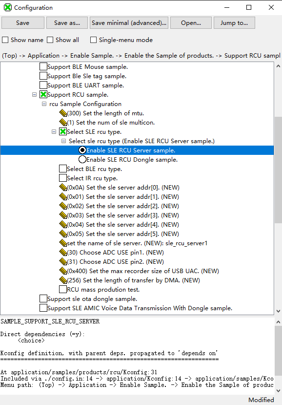

**图 4**  选择RCU Server低功耗<a name="fig255692722613"></a>  
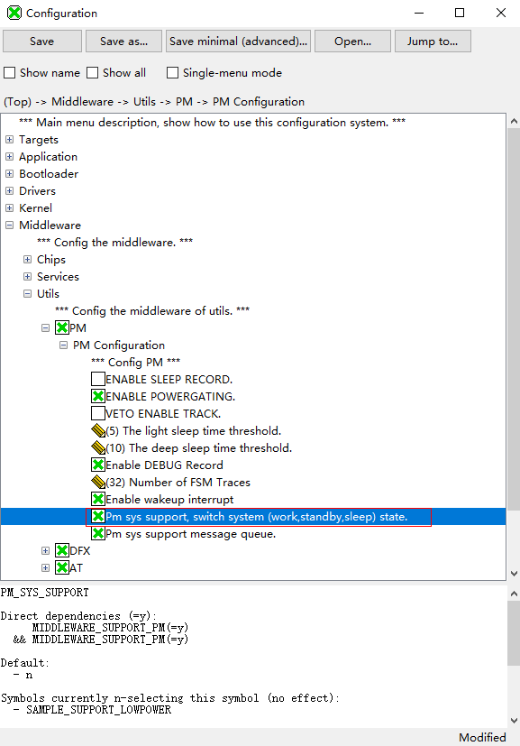

**图 5**  编译出的版本<a name="fig18317193617319"></a>  
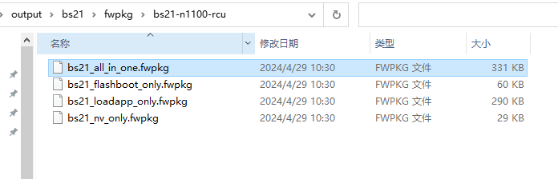

**图 6**  选择SLE RCU Dongle sample<a name="fig18137152003317"></a>  
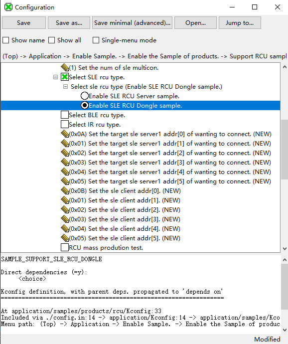

注：在USB初始化后需要在PC中选择麦克风+HID设备，才能完全初始化成功。

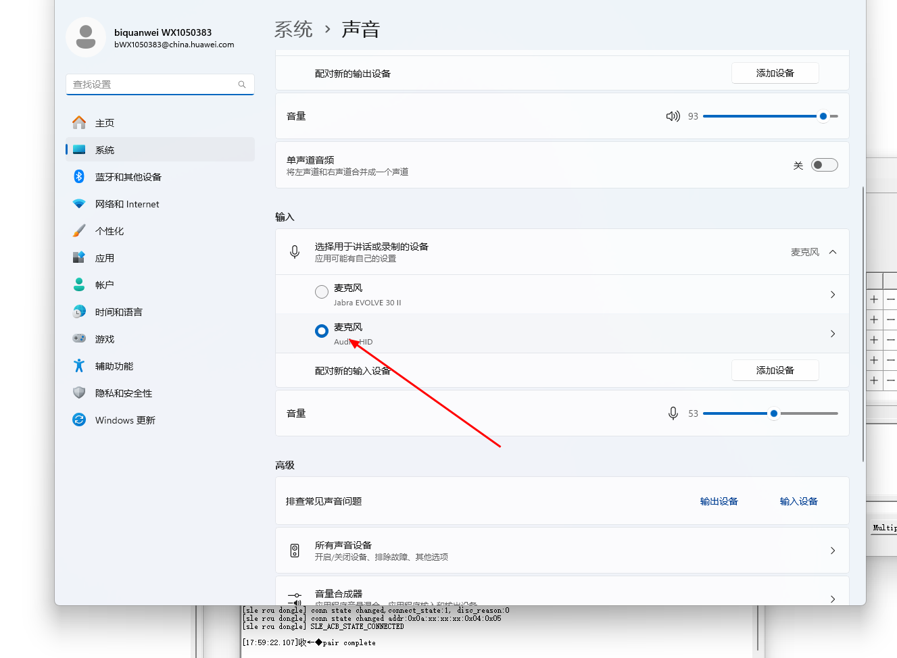

**BLE RCU SAMPLE<a name="section165583283914"></a>**

编译步骤如下：

1.  在IDE工具下打开menuconfig配置界面，单击KConfig按钮。
2.  在menuconfig界面中选择键盘规格，如[图1](#fig936317130595)、[图2](#fig131111112145819)所示。
3.  在menuconfig界面中选择Sample，选择SLE rcu server，配置RCU本地地址，如[图7](#fig1325416121258)所示。
4.  在menuconfig界面中选择开启低功耗，如[图4](#fig255692722613)所示。
5.  选择完成后单击save保存退出。
6.  使用IDE编译版本，编译出的版本包在"output\\bs21\\fwpkg\\bs21-1100-rcu" 路径下，如[图5](#fig18317193617319)所示。
7.  将编译出的server版本按照烧录进板子。

**图 7**  BLE RCU SAMPLE选择<a name="fig1325416121258"></a>  


**IR RCU SAMPLE<a name="section128421237134012"></a>**

编译步骤如下：

1.  在IDE工具下打开menuconfig配置界面，单击KConfig按钮。
2.  在menuconfig界面中选择键盘规格，如[图1](#fig936317130595)、[图2](#fig131111112145819)所示。
3.  在menuconfig界面中选择Sample，选择IR rcu server，如[图8](#fig20486387221)所示。
4.  在menuconfig界面中打开学习功能，选择IR管脚，如[图9](#fig334214366349)所示。
5.  选择完成后单击save保存退出。
6.  使用IDE编译版本，编译出的版本包在"output\\bs21\\fwpkg\\bs21-1100-rcu" 路径下，如[图5](#fig18317193617319)所示。
7.  将编译出的server版本按照烧录进板子。

**图 8**  IR RCU SAMPLE选择<a name="fig20486387221"></a>  
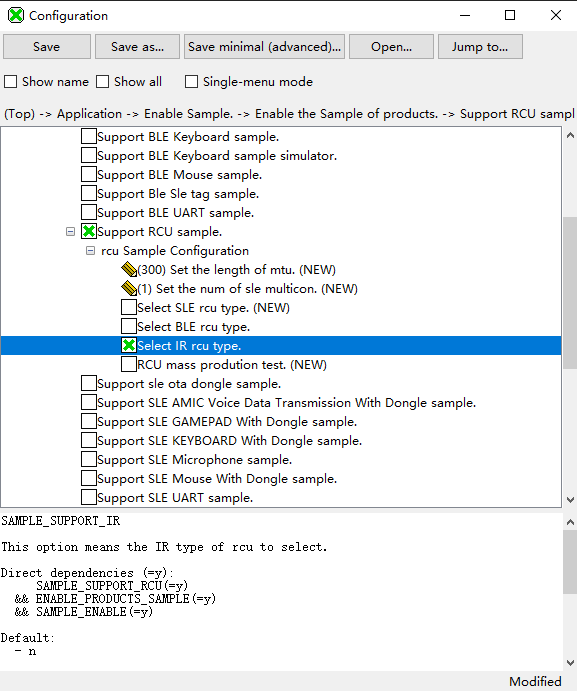

**图 9**  RCU IR选择<a name="fig334214366349"></a>  


## 烧录及运行<a name="ZH-CN_TOPIC_0000001864690258"></a>


### 烧录<a name="ZH-CN_TOPIC_0000001913715465"></a>

将编译出的RCU Server版本与Dongle版本分别烧录到Server与Dongle板中，版本烧录方法请参见《BS2XV100  HiSpark Studio  使用指南》。

### 运行<a name="ZH-CN_TOPIC_0000001913795781"></a>

1.  Server与Dongle板子烧录完成后，分别上电，Dongle采用USB直接插在电脑上的方式上电。
2.  Dongle上电后打开声音设置，设置采样率为1通道16KHZ16位如[图1](#fig210111299229)所示。
3.  观察Server与Dongle板在串口助手上的日志信息，如果出现"CONNECTED"表示已经完成链接。
4.  在Server端按下按键，观察Dongle端主机动作，例如音量加减键。
5.  使用过程中Server与Dongle重新上电，能够重新连接，并且功能正常。

**图 1**  麦克风选择<a name="fig210111299229"></a>  
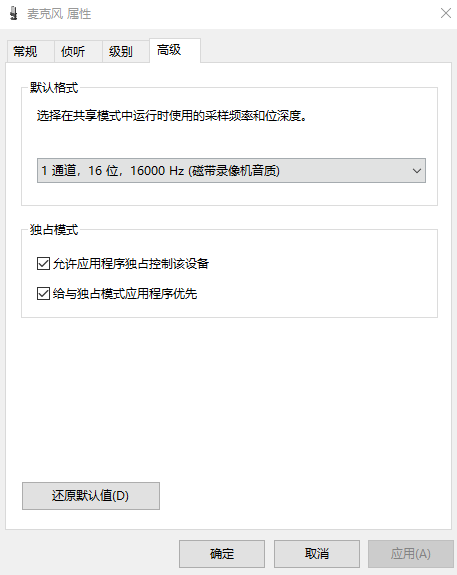

# SLE 多连接Sample<a name="ZH-CN_TOPIC_0000002027698718"></a>


## 概述<a name="ZH-CN_TOPIC_0000002027857158"></a>

此Sample演示一个真实的基于SLE的多连接方案。运行Sample的操作包括：配置编译宏，编译，烧录，上电；Client端与Server端在配置编译宏这个步骤上有不同，其他操作步骤相同。

## 编译<a name="ZH-CN_TOPIC_0000002063856925"></a>

编译分为Client端编译和Server端编译，1个Client连接多个Server。


### 配置Client编译<a name="ZH-CN_TOPIC_0000002063877285"></a>

**图 1**  Kconfig配置项<a name="fig1867564210161"></a>  
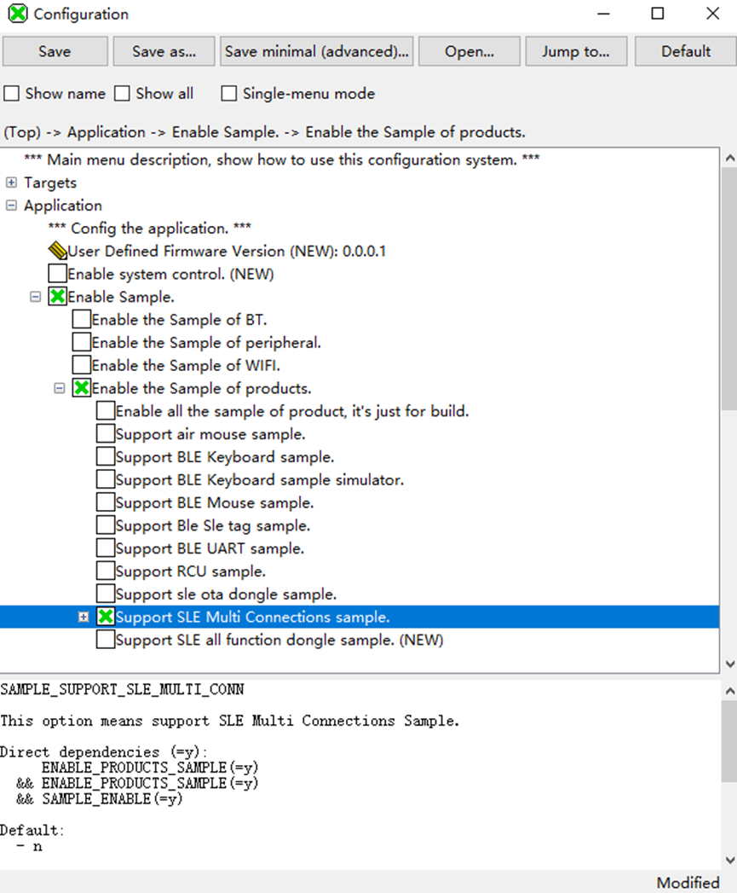

**图 2**  选择client<a name="fig183190588168"></a>  
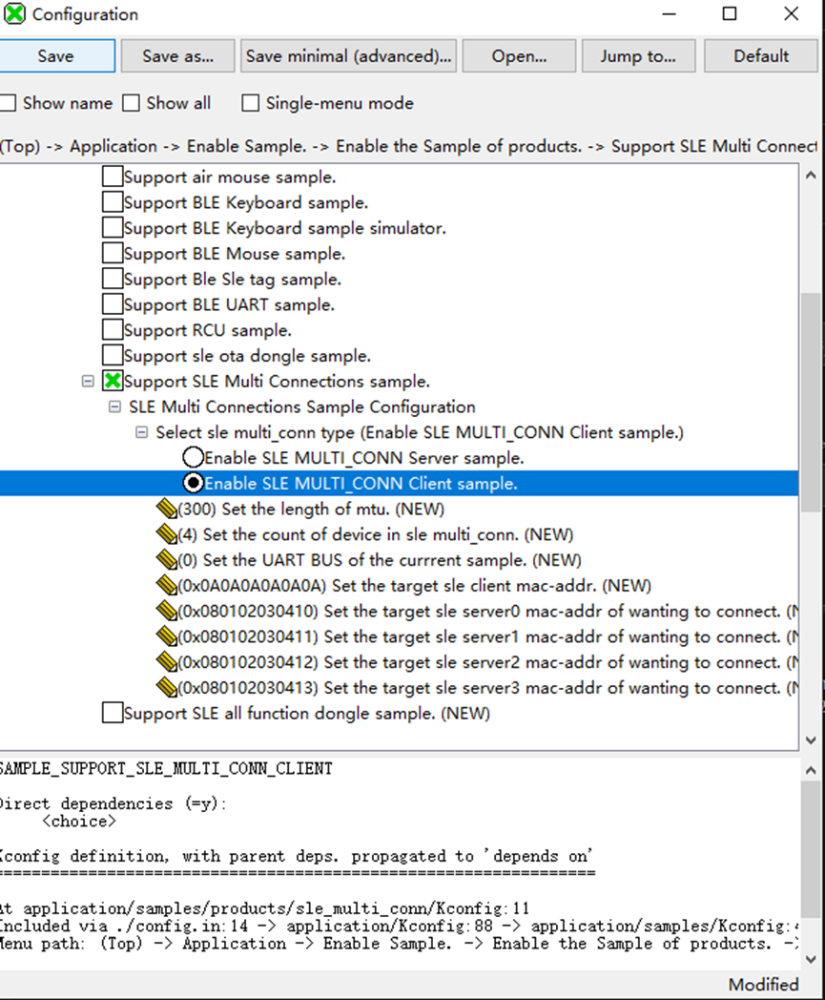

可以配置的选项包括：mtu长度，连接的Server端数量，Client端的打印串口，Client端的MAC地址，Server端的MAC地址。以上配置可以采用默认配置，Client端的地址信息配置好后，Server端配置的地址不用更改，与Client设置的地址信息保持一致。

编译步骤如下：

1.  在IDE工具下打开“menuconfig”配置界面，单击“KConfig”按钮。
2.  在“menuconfig”界面中选择支持的Sample：“SLE Multi Connections sample”。
3.  在“menuconfig”界面中选择“Enable SLE MULTI\_CONN Client sample”。
4.  可以按实际使用修改其他配置项。
5.  选择完成后单击“save”保存退出。
6.  使用IDE编译版本，编译出的版本包在“tools\\pkg\\fwpkg\\bs2x\\evb\_all.fwpkg”路径下。
7.  将编译出的client版本按照烧录进单板。

### 配置Server编译<a name="ZH-CN_TOPIC_0000002027719082"></a>

**图 1**  Kconfig配置项<a name="fig1315912214183"></a>  
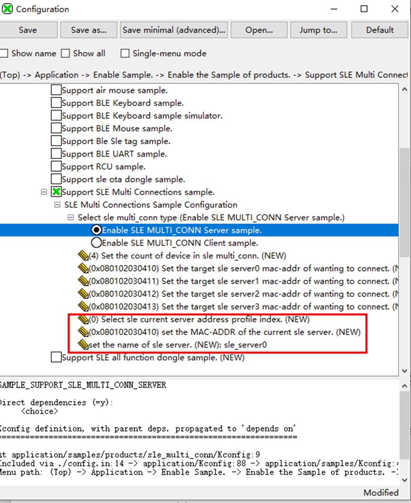

可以配置的选项包括：当前server端的索引号， mac地址和名称。

编译步骤如下：

1.  在IDE工具下打开menuconfig”配置界面，单击“KConfig”按钮。
2.  在“menuconfig”界面中选择支持的Sample：“SLE Multi Connections sample”。
3.  在“menuconfig”界面中选择Enable SLE MULTI\_CONN Server sample”。
4.  可以按实际使用修改其他配置项,通常只用配置server端的索引号，mac地址和server名称的配置项会自动更新。
5.  选择完成后单击“save”保存退出。
6.  使用IDE编译版本，编译出的版本包在“tools\\pkg\\fwpkg\\bs2x\\evb\_all.fwpkg”路径下。
7.  将编译出的server版本按照烧录进单板。

## 烧录及运行<a name="ZH-CN_TOPIC_0000002063898241"></a>


### 烧录<a name="ZH-CN_TOPIC_0000002027698722"></a>

将编译出的Server版本与Client版本分别烧录到Server与Client板中，版本烧录方法请参见《BS2XV100  HiSpark Studio  使用指南》。

### 运行<a name="ZH-CN_TOPIC_0000002027857162"></a>

1.  Client与Server板子烧录完成后，分别上电。
2.  观察Server与Client板在串口助手上的日志信息，如果出现"CONNECTED"表示已经完成连接。
3.  上电的Server端持续向Client端发送示例数据abcd。

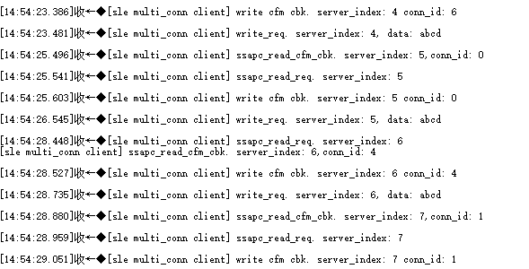

# air mouse<a name="ZH-CN_TOPIC_0000002173690000"></a>


## 26.1 概述<a name="ZH-CN_TOPIC_0000002173849740"></a>

此Sample演示一个真实的基于sle+slp air mouse方案。

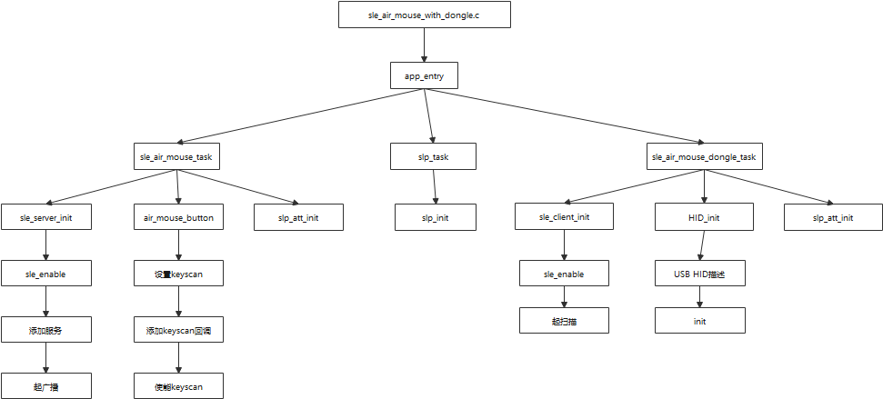

## 26.2 编译<a name="ZH-CN_TOPIC_0000002209256101"></a>

1.  在命令行下输入“python ./build.py -c bs21e-1100e-slp menuconfig”。
2.  选择需要编译server，就按照1.server设置，需要编译dongle就按照2.dongle设置
    1.  server： \(Top\) → Application → Enable Sample. → Enable the Sample of products. → Support air mouse sample. → Air Mouse Sample Configuration → Select AIR MOUSE type → Enable AIR MOUSE sample
    2.  dongle:  \(Top\) → Application → Enable Sample. → Enable the Sample of products. → Support air mouse sample. → Air Mouse Sample Configuration → Select AIR MOUSE type → Enable AIR MOUSE Dongle sample.

3.  选择完成后按“Q”保存退出。
4.  编译“python ./build.py -c bs21e-1100e-slp”。
5.  编译结果在“output/bs21e/fwpkg/bs21e-1100e-slp/bs21e\_all\_in\_one.fwpkg”。

menuconfig选择

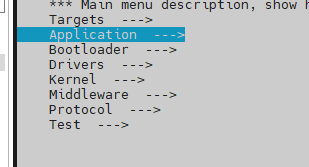

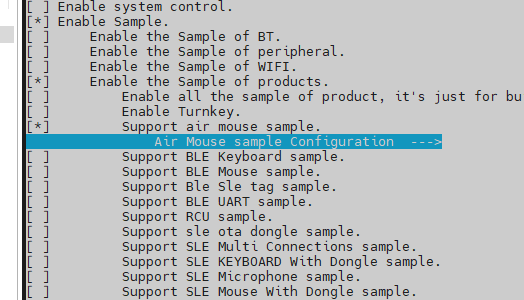

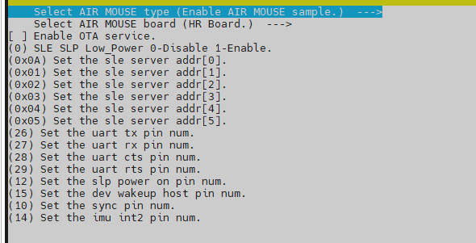

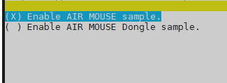

编译结果：

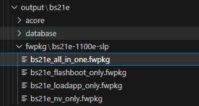

## 26.3 烧录<a name="ZH-CN_TOPIC_0000002209170473"></a>

版本烧录方法请参见《BS2XV100  HiSpark Studio  使用指南》。

## 26.4 运行<a name="ZH-CN_TOPIC_0000002173690004"></a>

1.  准备两块单板，分别作为Server端和Client端。
2.  烧录完后，上下电。
3.  查看SLE是否正常连接以及指向功能。

# SLE MOUSE with Dongle<a name="ZH-CN_TOPIC_0000002174786036"></a>


## 概述<a name="ZH-CN_TOPIC_0000002174627248"></a>

此Sample演示一个真实的基于SLE的鼠标Dongle方案。运行Sample的操作包括：配置编译宏、编译、烧录、上电，可以调整鼠标的上报速率;

dongle端与mouse端在配置编译宏这个步骤上有不同。

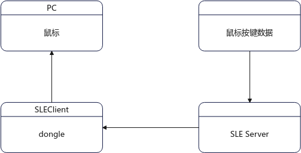

## 编译<a name="ZH-CN_TOPIC_0000002210073333"></a>


### 编译SLE MOUSE<a name="ZH-CN_TOPIC_0000002188022822"></a>

1.  在命令行下打开menuconfig配置界面，执行命令“python build.py standard-bs21-n1100 menuconfig”。
2.  在menuconfig界面中进入“application/System mouse Pin Configuration”，进行鼠标管脚配置，如[图1](#fig21391015105815)所示。
3.  在menuconfig界面中选择SLE鼠标Sample，如[图2](#fig1295982895918)所示。
4.  在menuconfig界面中选择SLE鼠标的，如[图3](#fig591412161217)所
5.  选择完成后按“Q”、“Y”保存退出。
6.  使用IDE编译版本，编译出的版本包在“tools\\pkg\\fwpkg\\bs21”路径下，如[图4](#fig11751945612)所示。
7.  将编译出的版本按照“[烧录及运行](烧录及运行-57.md)”烧录进鼠标板。

**图 1**  Mouse Pin Config<a name="fig21391015105815"></a>  
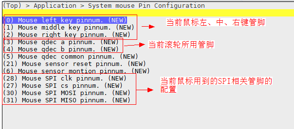

**图 2**  修改sample配置<a name="fig1295982895918"></a>  

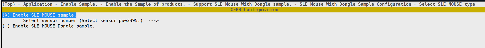

**图 3**  修改sensornumber<a name="fig591412161217"></a>  

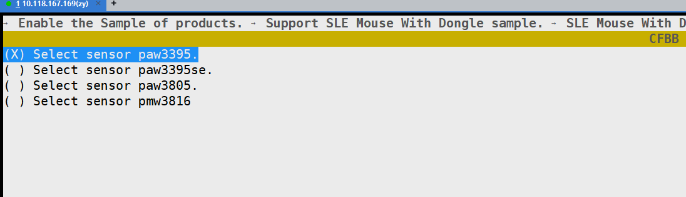

**图 4**  编译出的版本<a name="fig11751945612"></a>  


### 编译SLEMOUSE with Dongle<a name="ZH-CN_TOPIC_0000002188182526"></a>

1.  在命令行下打开menuconfig配置界面，执行命令“python build.py standard-bs21-n1100 menuconfig”。
2.  在menuconfig界面中选择SLE鼠标Sample，如[图1](#fig1295982895918)所示。
3.  在menuconfig界面中选择SLE鼠标的，如[图2](#fig591412161217)所示。
4.  选择完成后按“Q”、“Y”保存退出。
5.  使用IDE编译版本，编译出的版本包在“tools\\pkg\\fwpkg\\bs21”路径下，如[图3](#fig11751945612)所示。
6.  将编译出的版本按照“[烧录及运行](烧录及运行-57.md)”烧录进鼠标板。

**图 1**  修改sample配置<a name="fig1295982895918"></a>  
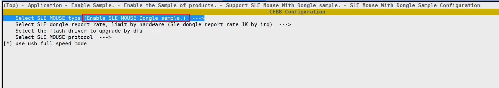

**图 2**  修改鼠标回报率<a name="fig591412161217"></a>  
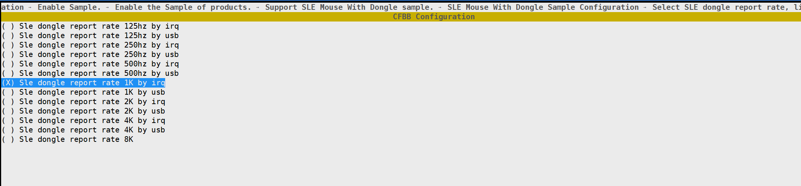

**图 3**  编译出的版本<a name="fig11751945612"></a>  


## 烧录及运行<a name="ZH-CN_TOPIC_0000002210187685"></a>

**烧录<a name="section948712445453"></a>**

将编译出的鼠标版本烧录到鼠标板中，版本烧录方法请参见《BS2XV100  HiSpark Studio  使用指南》。

**运行<a name="section20698141827"></a>**

1.  鼠标板上电。
2.  如果是非USB供电的单板，将USB与电脑连接。
3.  在PC上观察到鼠标移动，按键单击等都能正常工作即表示BLE Mouse功能正常。
4.  使用过程中鼠标重新上电，能够重新连接，并且功能正常

# SLE OTA dongle<a name="ZH-CN_TOPIC_0000002183778646"></a>


## 概述<a name="ZH-CN_TOPIC_0000002219679749"></a>

该sample用于演示使用dongle通过SLE模块进行OTA升级的方案。

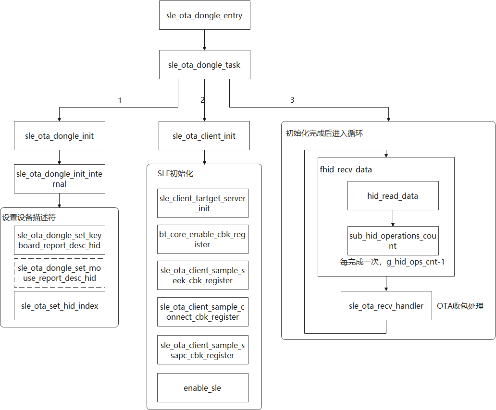

## 编译<a name="ZH-CN_TOPIC_0000002219754189"></a>

1.  在SDK根路径输入”python3 build.py standard-bs21-n1100 menuconfig”。
2.  进入”Application”，打开”Enable sample”。
3.  依次选择”Enable the Sample of products”，”Support sle ota dongle sample“。
4.  根据需要在“sle ota dongle Sample Configuration“中配置参数。
5.  保存并退出，执行“python3 build.py standard-bs21-n1100“，开始编译。

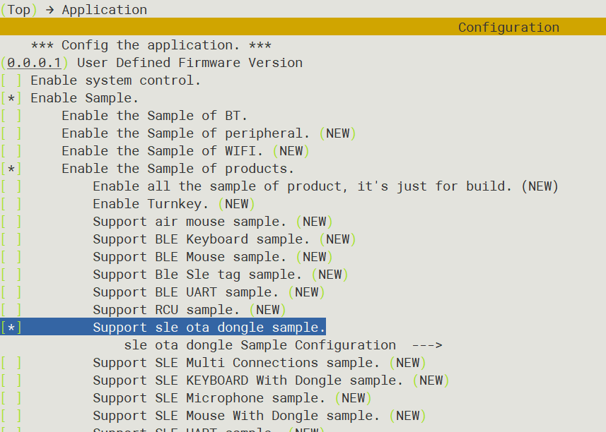

## 烧录及运行<a name="ZH-CN_TOPIC_0000002184234000"></a>

版本烧录方法请参见《BS2XV100  HiSpark Studio  使用指南》。

# game mouse<a name="ZH-CN_TOPIC_0000002185692000"></a>

本文档主要介绍星闪鼠标turnkey方案规格及其实现，助力开发者快速上手turnkey方案代码逻辑和相关接口。


## 概述<a name="ZH-CN_TOPIC_0000002221058057"></a>

软件平台实现了对应用软件的底层屏蔽，并对应用软件直接提供API（Application Program Interface）接口完成相应功能。典型的系统框架如[图1](#fig6589183165917)所示。

**图 1**  系统框图<a name="fig6589183165917"></a>  


该构架可以分为以下几个层次：

-   APP层

    APP层包括SLE通信功能，支持SLE模式、BLE模式与USB模式，支持不同品类。APP层也支持客户基于SDK提供的接口开发其他的应用。

-   Host层

    Host是协议栈的上层实现，是硬件的抽象，包含逻辑链路控制、适配协议、安全管理器、属性协议、通用属性规范及服务等。

-   Controller层

    Controller是协议栈的底层实现，直接和硬件相关，由芯片厂商实现，包括物理层、链路层、主机控制接口等。

-   外设与驱动层

    提供外设、系统相关能力及接口。

turnkey代码目录说明：

```
├── app_public
├── ble_mouse_server                // 蓝牙业务
├── CMakeLists.txt
├── Kconfig
├── mouse_button                    // 8k鼠标按键
├── mouse_data_transfer_manage.c    // 鼠标数据传输
├── mouse_data_transfer_manage.h
├── mouse_flash                     // 读写flash
├── mouse_key                       // 2k鼠标按键
├── mouse_light                     // led灯控制
├── mouse_log.h
├── mouse_mac_rules                 // 切换通道时，mac地址管理
├── mouse_mode_manage.c             // 蓝牙、星闪、有线模式管理，mouse task入口
├── mouse_mode_manage.h
├── mouse_power                     // 电源和低功耗
├── mouse_sensor                    // sensor相关
├── mouse_status                    // 广播、配对、断连处理
├── mouse_usb                       // usb初始化、接收处理
├── mouse_wheel                     // 滚轮
├── sfc_flash
├── sle_low_latency_service.c       // 星闪鼠标low latency服务
├── sle_low_latency_service.h
├── sle_mouse_client                // 星闪鼠标client端管理
├── sle_mouse_dongle.c              // 星闪鼠标dongle task入口
├── sle_mouse_dongle.h
└── sle_mouse_server                // 星闪鼠标server端管理
```

## 编译<a name="ZH-CN_TOPIC_0000002185532312"></a>

1.  安装deveco插件，导入sdk工程。
2.  选择编译target，当前已支持BS20、BS21E、BS22、BS26四款芯片编译turnkey代码。

    **图 1**  导入编译target<a name="fig516873345218"></a>  
    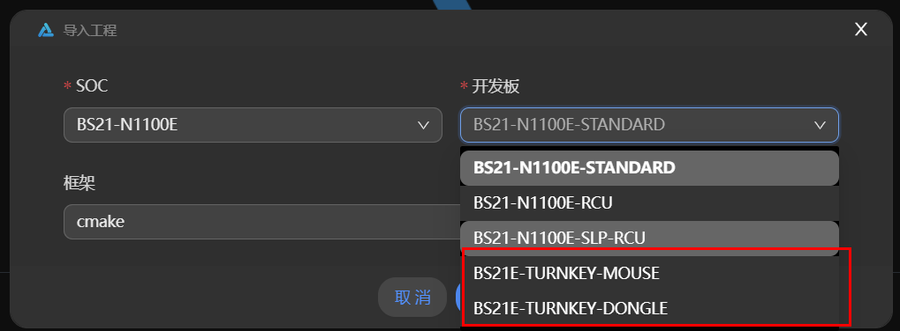

3.  修改kconfig，target默认配好一套，可直接编译，如需修改，请参考[图2](#fig1659117286129)和[图3](#fig1079613541155)。

    **图 2**  kconfig配置介绍1<a name="fig1659117286129"></a>  
    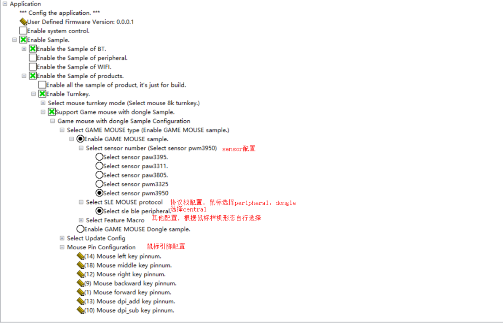

    **图 3**  kconfig配置介绍2<a name="fig1079613541155"></a>  
    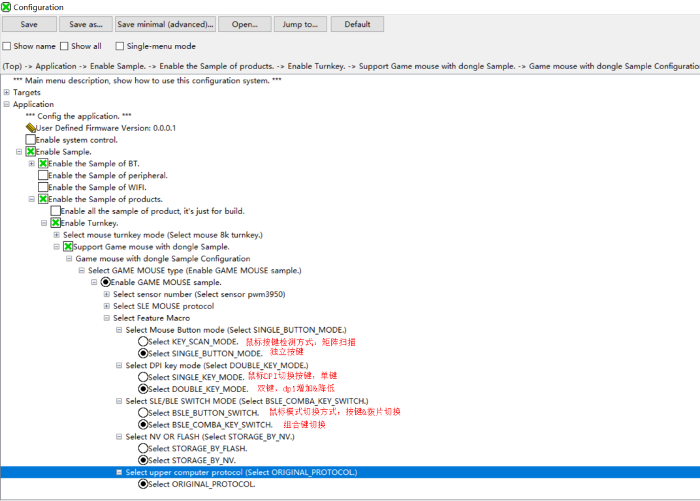

    > **说明：** 
    >编译dongle时，若使用接收器，需要开启ldo供电。

    **图 4**  ldo供电<a name="fig1942913321615"></a>  
    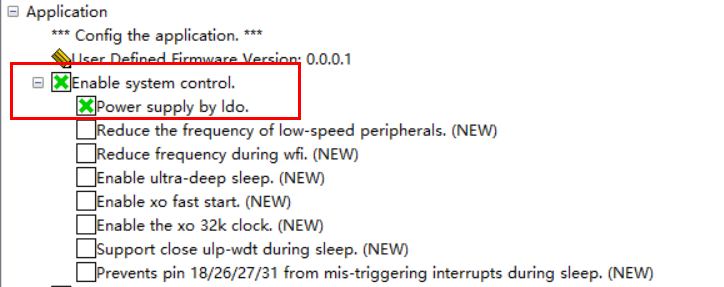

4.  修改/新增编译target默认配置，在build\\config\\target\_config\\deveco\_config.json中修改。

## 烧录及运行<a name="ZH-CN_TOPIC_0000002220972485"></a>

将编译出的TurnkeyMouse Server版本与Dongle版本分别烧录到Server与Dongle板中，版本烧录方法请参见《BS2XV100  HiSpark Studio  使用指南》。

各模块的详细功能可参照文档《BS2XV100 星闪鼠标turnkey方案开发 用户指南》。

# BLE uuid<a name="ZH-CN_TOPIC_0000002194802088"></a>


## 概述<a name="ZH-CN_TOPIC_0000002230361941"></a>

本文档主要介绍ble uuid sample所提供的接口以及编译方法。此sample只提供接口，不能直接，需要由使用者调用相关接口使用。

## 编译<a name="ZH-CN_TOPIC_0000002230363373"></a>

使用此sample相关接口需要配置menuconfig，具体配置方法如下。

1.  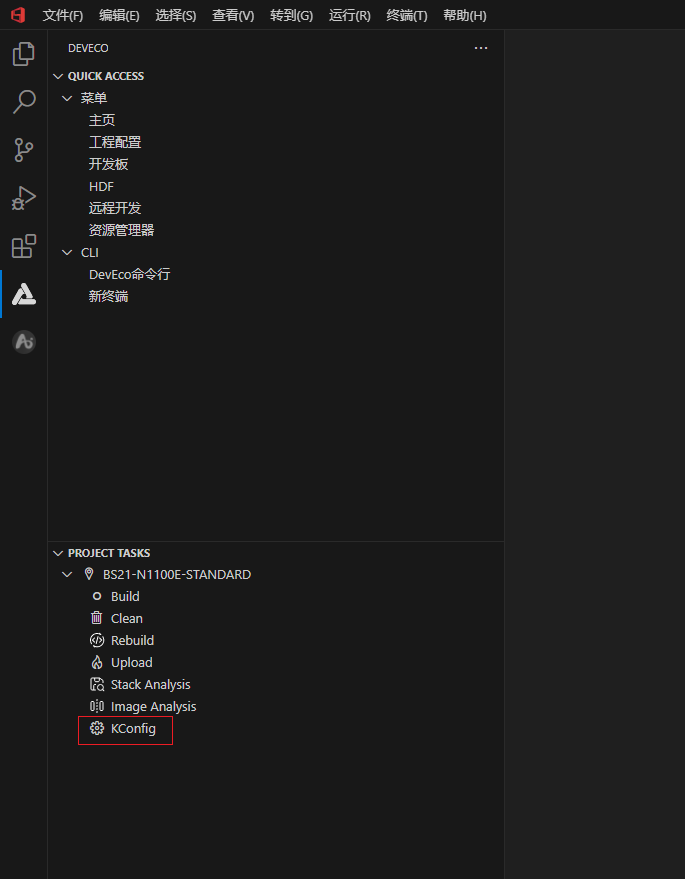
2.  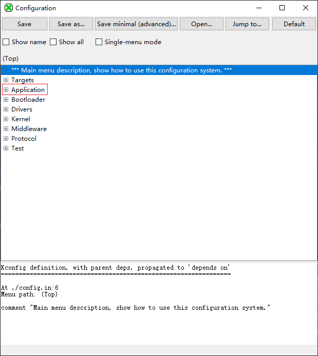
3.  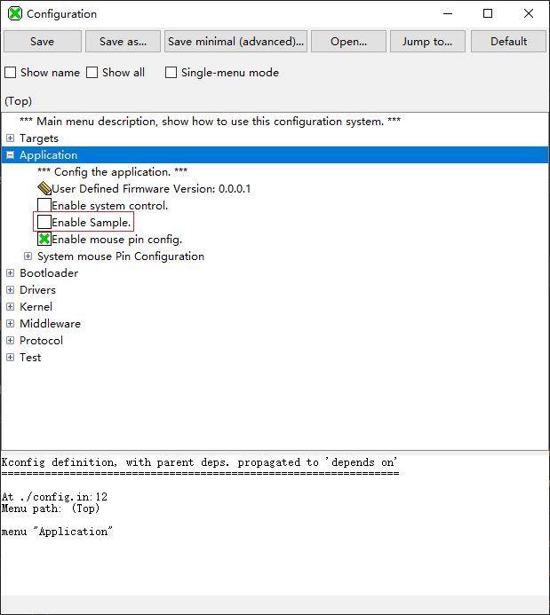
4.  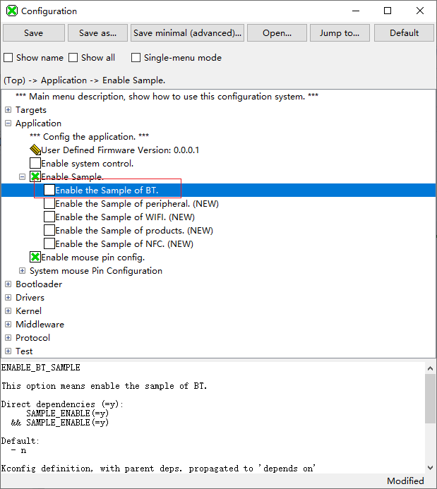
5.  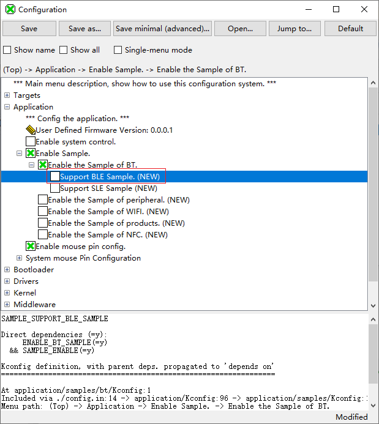
6.  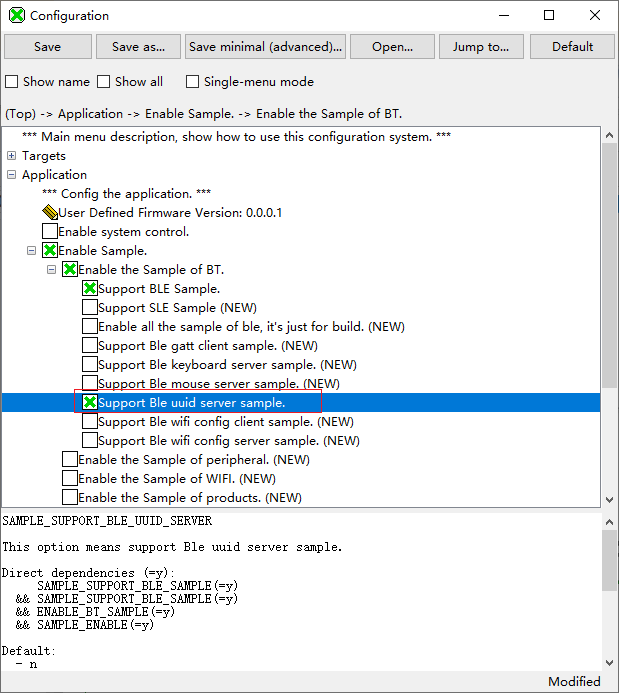
7.  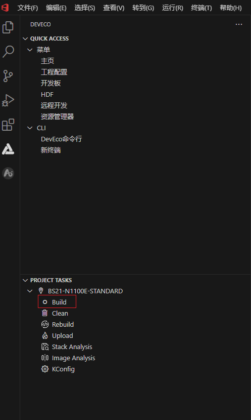

## 接口<a name="ZH-CN_TOPIC_0000002230287425"></a>

**表 1**  接口清单

<a name="table826693164614"></a>
<table><thead align="left"><tr id="row1726613354611"><th class="cellrowborder" valign="top" width="50%" id="mcps1.2.3.1.1"><p id="p1626603194610"><a name="p1626603194610"></a><a name="p1626603194610"></a>函数</p>
</th>
<th class="cellrowborder" valign="top" width="50%" id="mcps1.2.3.1.2"><p id="p526633164618"><a name="p526633164618"></a><a name="p526633164618"></a>描述</p>
</th>
</tr>
</thead>
<tbody><tr id="row16266203104618"><td class="cellrowborder" valign="top" width="50%" headers="mcps1.2.3.1.1 "><p id="p179138345466"><a name="p179138345466"></a><a name="p179138345466"></a>errcode_t ble_uuid_server_init(void);</p>
</td>
<td class="cellrowborder" valign="top" width="50%" headers="mcps1.2.3.1.2 "><p id="p93862414474"><a name="p93862414474"></a><a name="p93862414474"></a>BLE UUID服务器初始化</p>
</td>
</tr>
<tr id="row202662334610"><td class="cellrowborder" valign="top" width="50%" headers="mcps1.2.3.1.1 "><p id="p14266133124612"><a name="p14266133124612"></a><a name="p14266133124612"></a>errcode_t ble_uuid_server_send_report_by_uuid(const uint8_t *data, uint8_t len);</p>
</td>
<td class="cellrowborder" valign="top" width="50%" headers="mcps1.2.3.1.2 "><p id="p19986183819475"><a name="p19986183819475"></a><a name="p19986183819475"></a>通过uuid server 发送数据给对端</p>
</td>
</tr>
<tr id="row12669344619"><td class="cellrowborder" valign="top" width="50%" headers="mcps1.2.3.1.1 "><p id="p18266339468"><a name="p18266339468"></a><a name="p18266339468"></a>errcode_t ble_uuid_server_send_report_by_handle(uint16_t attr_handle, const uint8_t *data, uint8_t len);</p>
</td>
<td class="cellrowborder" valign="top" width="50%" headers="mcps1.2.3.1.2 "><p id="p29260209481"><a name="p29260209481"></a><a name="p29260209481"></a>通过uuid server 发送数据给对端</p>
</td>
</tr>
<tr id="row1826683164619"><td class="cellrowborder" valign="top" width="50%" headers="mcps1.2.3.1.1 "><p id="p626617315467"><a name="p626617315467"></a><a name="p626617315467"></a>uint8_t ble_start_adv(void);</p>
</td>
<td class="cellrowborder" valign="top" width="50%" headers="mcps1.2.3.1.2 "><p id="p1091235914812"><a name="p1091235914812"></a><a name="p1091235914812"></a>使能BLE广播</p>
</td>
</tr>
<tr id="row031571254917"><td class="cellrowborder" valign="top" width="50%" headers="mcps1.2.3.1.1 "><p id="p15316161218499"><a name="p15316161218499"></a><a name="p15316161218499"></a>uint8_t ble_set_adv_data(void);</p>
</td>
<td class="cellrowborder" valign="top" width="50%" headers="mcps1.2.3.1.2 "><p id="p833315574911"><a name="p833315574911"></a><a name="p833315574911"></a>BLE广播数据配置</p>
</td>
</tr>
</tbody>
</table>

接口详细信息见sdk：application/samples/bt/ble/ble\_uuid\_server/inc。

# 缩略语<a name="ZH-CN_TOPIC_0000001837645673"></a>

<a name="table1647mcpsimp"></a>
<table><tbody><tr id="row1659mcpsimp"><td class="nocellnorowborder" style="border:none" valign="top" width="22.3%"><p id="p1661mcpsimp"><a name="p1661mcpsimp"></a><a name="p1661mcpsimp"></a><strong id="b1662mcpsimp"><a name="b1662mcpsimp"></a><a name="b1662mcpsimp"></a>A</strong></p>
</td>
<td class="nocellnorowborder" style="border:none" valign="top" width="44.7%">&nbsp;&nbsp;</td>
<td class="cell-norowborder" style="border:none" valign="top" width="33%">&nbsp;&nbsp;</td>
</tr>
<tr id="row1269431618349"><td class="cellrowborder" style="border:none" valign="top" width="22.3%"><p id="p96588910301"><a name="p96588910301"></a><a name="p96588910301"></a><strong id="b18473738578"><a name="b18473738578"></a><a name="b18473738578"></a>ADC</strong></p>
</td>
<td class="cellrowborder" style="border:none" valign="top" width="44.7%"><p id="p18157613184118"><a name="p18157613184118"></a><a name="p18157613184118"></a>Analog-to-Digital Converter</p>
</td>
<td class="cellrowborder" style="border:none" valign="top" width="33%"><p id="p19659498305"><a name="p19659498305"></a><a name="p19659498305"></a>模数转换器</p>
</td>
</tr>
<tr id="row1665mcpsimp"><td class="nocellnorowborder" style="border:none" valign="top" width="22.3%"><p id="p1667mcpsimp"><a name="p1667mcpsimp"></a><a name="p1667mcpsimp"></a><strong id="b1668mcpsimp"><a name="b1668mcpsimp"></a><a name="b1668mcpsimp"></a>AFE</strong></p>
</td>
<td class="nocellnorowborder" style="border:none" valign="top" width="44.7%"><p xml:lang="x-NONE" id="p1670mcpsimp"><a name="p1670mcpsimp"></a><a name="p1670mcpsimp"></a>Analog Front-End</p>
</td>
<td class="cell-norowborder" style="border:none" valign="top" width="33%"><p id="p1675mcpsimp"><a name="p1675mcpsimp"></a><a name="p1675mcpsimp"></a>模拟前端</p>
</td>
</tr>
<tr id="row1676mcpsimp"><td class="nocellnorowborder" style="border:none" valign="top" width="22.3%">&nbsp;&nbsp;</td>
<td class="nocellnorowborder" style="border:none" valign="top" width="44.7%">&nbsp;&nbsp;</td>
<td class="cell-norowborder" style="border:none" valign="top" width="33%">&nbsp;&nbsp;</td>
</tr>
<tr id="row1680mcpsimp"><td class="nocellnorowborder" style="border:none" valign="top" width="22.3%"><p id="p1682mcpsimp"><a name="p1682mcpsimp"></a><a name="p1682mcpsimp"></a><strong id="b1683mcpsimp"><a name="b1683mcpsimp"></a><a name="b1683mcpsimp"></a>B</strong></p>
</td>
<td class="nocellnorowborder" style="border:none" valign="top" width="44.7%">&nbsp;&nbsp;</td>
<td class="cell-norowborder" style="border:none" valign="top" width="33%">&nbsp;&nbsp;</td>
</tr>
<tr id="row1706mcpsimp"><td class="nocellnorowborder" style="border:none" valign="top" width="22.3%"><p id="p1708mcpsimp"><a name="p1708mcpsimp"></a><a name="p1708mcpsimp"></a><strong id="b1709mcpsimp"><a name="b1709mcpsimp"></a><a name="b1709mcpsimp"></a>BLE</strong></p>
</td>
<td class="nocellnorowborder" style="border:none" valign="top" width="44.7%"><p id="p1711mcpsimp"><a name="p1711mcpsimp"></a><a name="p1711mcpsimp"></a>Bluetooth Low Energy</p>
</td>
<td class="cell-norowborder" style="border:none" valign="top" width="33%"><p id="p1716mcpsimp"><a name="p1716mcpsimp"></a><a name="p1716mcpsimp"></a>低功耗蓝牙</p>
</td>
</tr>
<tr id="row9244173316716"><td class="cellrowborder" style="border:none" valign="top" width="22.3%"><p id="p138951537154517"><a name="p138951537154517"></a><a name="p138951537154517"></a><strong id="b4895183718455"><a name="b4895183718455"></a><a name="b4895183718455"></a>BT</strong></p>
</td>
<td class="cellrowborder" style="border:none" valign="top" width="44.7%"><p id="p489583718456"><a name="p489583718456"></a><a name="p489583718456"></a>Bluetooth</p>
</td>
<td class="cellrowborder" style="border:none" valign="top" width="33%"><p id="p189593720453"><a name="p189593720453"></a><a name="p189593720453"></a>蓝牙</p>
</td>
</tr>
<tr id="row123463564514"><td class="cellrowborder" style="border:none" valign="top" width="22.3%">&nbsp;&nbsp;</td>
<td class="cellrowborder" style="border:none" valign="top" width="44.7%">&nbsp;&nbsp;</td>
<td class="cellrowborder" style="border:none" valign="top" width="33%">&nbsp;&nbsp;</td>
</tr>
<tr id="row1721mcpsimp"><td class="nocellnorowborder" style="border:none" valign="top" width="22.3%"><p id="p1723mcpsimp"><a name="p1723mcpsimp"></a><a name="p1723mcpsimp"></a><strong id="b1724mcpsimp"><a name="b1724mcpsimp"></a><a name="b1724mcpsimp"></a>C</strong></p>
</td>
<td class="nocellnorowborder" style="border:none" valign="top" width="44.7%">&nbsp;&nbsp;</td>
<td class="cell-norowborder" style="border:none" valign="top" width="33%">&nbsp;&nbsp;</td>
</tr>
<tr id="row02831918295"><td class="cellrowborder" style="border:none" valign="top" width="22.3%"><p id="p1166989143017"><a name="p1166989143017"></a><a name="p1166989143017"></a><strong id="b047843165717"><a name="b047843165717"></a><a name="b047843165717"></a>CPU</strong></p>
</td>
<td class="cellrowborder" style="border:none" valign="top" width="44.7%"><p id="p1466989203013"><a name="p1466989203013"></a><a name="p1466989203013"></a>Central Processing Unit</p>
</td>
<td class="cellrowborder" style="border:none" valign="top" width="33%"><p id="p366917903015"><a name="p366917903015"></a><a name="p366917903015"></a>中央处理单元</p>
</td>
</tr>
<tr id="row1738mcpsimp"><td class="nocellnorowborder" style="border:none" valign="top" width="22.3%">&nbsp;&nbsp;</td>
<td class="nocellnorowborder" style="border:none" valign="top" width="44.7%">&nbsp;&nbsp;</td>
<td class="cell-norowborder" style="border:none" valign="top" width="33%">&nbsp;&nbsp;</td>
</tr>
<tr id="row1742mcpsimp"><td class="nocellnorowborder" style="border:none" valign="top" width="22.3%"><p id="p1744mcpsimp"><a name="p1744mcpsimp"></a><a name="p1744mcpsimp"></a><strong id="b1745mcpsimp"><a name="b1745mcpsimp"></a><a name="b1745mcpsimp"></a>G</strong></p>
</td>
<td class="nocellnorowborder" style="border:none" valign="top" width="44.7%">&nbsp;&nbsp;</td>
<td class="cell-norowborder" style="border:none" valign="top" width="33%">&nbsp;&nbsp;</td>
</tr>
<tr id="row1748mcpsimp"><td class="nocellnorowborder" style="border:none" valign="top" width="22.3%"><p xml:lang="x-NONE" id="p1750mcpsimp"><a name="p1750mcpsimp"></a><a name="p1750mcpsimp"></a><strong id="b1751mcpsimp"><a name="b1751mcpsimp"></a><a name="b1751mcpsimp"></a>GAFE</strong></p>
</td>
<td class="nocellnorowborder" style="border:none" valign="top" width="44.7%"><p xml:lang="x-NONE" id="p1753mcpsimp"><a name="p1753mcpsimp"></a><a name="p1753mcpsimp"></a>General Analog Front-End</p>
</td>
<td class="cell-norowborder" style="border:none" valign="top" width="33%"><p id="p1759mcpsimp"><a name="p1759mcpsimp"></a><a name="p1759mcpsimp"></a>普通模拟前端</p>
</td>
</tr>
<tr id="row1760mcpsimp"><td class="nocellnorowborder" style="border:none" valign="top" width="22.3%">&nbsp;&nbsp;</td>
<td class="nocellnorowborder" style="border:none" valign="top" width="44.7%">&nbsp;&nbsp;</td>
<td class="cell-norowborder" style="border:none" valign="top" width="33%">&nbsp;&nbsp;</td>
</tr>
<tr id="row1764mcpsimp"><td class="nocellnorowborder" style="border:none" valign="top" width="22.3%"><p id="p1766mcpsimp"><a name="p1766mcpsimp"></a><a name="p1766mcpsimp"></a><strong id="b1767mcpsimp"><a name="b1767mcpsimp"></a><a name="b1767mcpsimp"></a>H</strong></p>
</td>
<td class="nocellnorowborder" style="border:none" valign="top" width="44.7%">&nbsp;&nbsp;</td>
<td class="cell-norowborder" style="border:none" valign="top" width="33%">&nbsp;&nbsp;</td>
</tr>
<tr id="row1770mcpsimp"><td class="nocellnorowborder" style="border:none" valign="top" width="22.3%"><p id="p1772mcpsimp"><a name="p1772mcpsimp"></a><a name="p1772mcpsimp"></a><strong id="b1773mcpsimp"><a name="b1773mcpsimp"></a><a name="b1773mcpsimp"></a>HAFE</strong></p>
</td>
<td class="nocellnorowborder" style="border:none" valign="top" width="44.7%"><p xml:lang="x-NONE" id="p1775mcpsimp"><a name="p1775mcpsimp"></a><a name="p1775mcpsimp"></a>High precision Analog Front-End</p>
</td>
<td class="cell-norowborder" style="border:none" valign="top" width="33%"><p id="p1781mcpsimp"><a name="p1781mcpsimp"></a><a name="p1781mcpsimp"></a>高精度模拟前端</p>
</td>
</tr>
<tr id="row1782mcpsimp"><td class="nocellnorowborder" style="border:none" valign="top" width="22.3%">&nbsp;&nbsp;</td>
<td class="nocellnorowborder" style="border:none" valign="top" width="44.7%">&nbsp;&nbsp;</td>
<td class="cell-norowborder" style="border:none" valign="top" width="33%">&nbsp;&nbsp;</td>
</tr>
<tr id="row1319413917379"><td class="cellrowborder" style="border:none" valign="top" width="22.3%"><p id="p1219473943711"><a name="p1219473943711"></a><a name="p1219473943711"></a><strong id="b16554145112372"><a name="b16554145112372"></a><a name="b16554145112372"></a>I</strong></p>
</td>
<td class="cellrowborder" style="border:none" valign="top" width="44.7%">&nbsp;&nbsp;</td>
<td class="cellrowborder" style="border:none" valign="top" width="33%">&nbsp;&nbsp;</td>
</tr>
<tr id="row46665348376"><td class="cellrowborder" style="border:none" valign="top" width="22.3%"><p id="p101369324208"><a name="p101369324208"></a><a name="p101369324208"></a><strong id="b775711152214"><a name="b775711152214"></a><a name="b775711152214"></a>IoT</strong></p>
</td>
<td class="cellrowborder" style="border:none" valign="top" width="44.7%"><p id="p29071215192112"><a name="p29071215192112"></a><a name="p29071215192112"></a>Internet of Things</p>
</td>
<td class="cellrowborder" style="border:none" valign="top" width="33%"><p id="p171365321209"><a name="p171365321209"></a><a name="p171365321209"></a>物联网</p>
</td>
</tr>
<tr id="row1656663217372"><td class="cellrowborder" style="border:none" valign="top" width="22.3%">&nbsp;&nbsp;</td>
<td class="cellrowborder" style="border:none" valign="top" width="44.7%">&nbsp;&nbsp;</td>
<td class="cellrowborder" style="border:none" valign="top" width="33%">&nbsp;&nbsp;</td>
</tr>
<tr id="row5201338496"><td class="cellrowborder" style="border:none" valign="top" width="22.3%"><p id="p9202312491"><a name="p9202312491"></a><a name="p9202312491"></a><strong id="b15743185054913"><a name="b15743185054913"></a><a name="b15743185054913"></a>L</strong></p>
</td>
<td class="cellrowborder" style="border:none" valign="top" width="44.7%">&nbsp;&nbsp;</td>
<td class="cellrowborder" style="border:none" valign="top" width="33%">&nbsp;&nbsp;</td>
</tr>
<tr id="row8460111435113"><td class="cellrowborder" style="border:none" valign="top" width="22.3%">&nbsp;&nbsp;</td>
<td class="cellrowborder" style="border:none" valign="top" width="44.7%">&nbsp;&nbsp;</td>
<td class="cellrowborder" style="border:none" valign="top" width="33%">&nbsp;&nbsp;</td>
</tr>
<tr id="row6491154495"><td class="cellrowborder" style="border:none" valign="top" width="22.3%"><p id="p349112516493"><a name="p349112516493"></a><a name="p349112516493"></a><strong id="b186913271511"><a name="b186913271511"></a><a name="b186913271511"></a>M</strong></p>
</td>
<td class="cellrowborder" style="border:none" valign="top" width="44.7%">&nbsp;&nbsp;</td>
<td class="cellrowborder" style="border:none" valign="top" width="33%">&nbsp;&nbsp;</td>
</tr>
<tr id="row311941014516"><td class="cellrowborder" style="border:none" valign="top" width="22.3%"><p id="p16451194273814"><a name="p16451194273814"></a><a name="p16451194273814"></a><strong id="b15671626115116"><a name="b15671626115116"></a><a name="b15671626115116"></a>MCU</strong></p>
</td>
<td class="cellrowborder" style="border:none" valign="top" width="44.7%"><p id="p1745154203815"><a name="p1745154203815"></a><a name="p1745154203815"></a>Main Control Unit</p>
</td>
<td class="cellrowborder" style="border:none" valign="top" width="33%"><p id="p145111425382"><a name="p145111425382"></a><a name="p145111425382"></a>主控制器单元</p>
</td>
</tr>
<tr id="row7181321145115"><td class="cellrowborder" style="border:none" valign="top" width="22.3%">&nbsp;&nbsp;</td>
<td class="cellrowborder" style="border:none" valign="top" width="44.7%">&nbsp;&nbsp;</td>
<td class="cellrowborder" style="border:none" valign="top" width="33%">&nbsp;&nbsp;</td>
</tr>
<tr id="row1786mcpsimp"><td class="nocellnorowborder" style="border:none" valign="top" width="22.3%"><p id="p1788mcpsimp"><a name="p1788mcpsimp"></a><a name="p1788mcpsimp"></a><strong id="b1789mcpsimp"><a name="b1789mcpsimp"></a><a name="b1789mcpsimp"></a>P</strong></p>
</td>
<td class="nocellnorowborder" style="border:none" valign="top" width="44.7%">&nbsp;&nbsp;</td>
<td class="cell-norowborder" style="border:none" valign="top" width="33%">&nbsp;&nbsp;</td>
</tr>
<tr id="row128241110153618"><td class="cellrowborder" style="border:none" valign="top" width="22.3%"><p id="p64528428385"><a name="p64528428385"></a><a name="p64528428385"></a><strong id="b193141617103613"><a name="b193141617103613"></a><a name="b193141617103613"></a>PA</strong></p>
</td>
<td class="cellrowborder" style="border:none" valign="top" width="44.7%"><p id="p0452194214382"><a name="p0452194214382"></a><a name="p0452194214382"></a>Power Amplifier</p>
</td>
<td class="cellrowborder" style="border:none" valign="top" width="33%"><p id="p0452204217386"><a name="p0452204217386"></a><a name="p0452204217386"></a>功率放大器</p>
</td>
</tr>
<tr id="row77880149547"><td class="cellrowborder" style="border:none" valign="top" width="22.3%"><p id="p678821475419"><a name="p678821475419"></a><a name="p678821475419"></a><strong id="b9335721115416"><a name="b9335721115416"></a><a name="b9335721115416"></a>PCM</strong></p>
</td>
<td class="cellrowborder" style="border:none" valign="top" width="44.7%"><p id="p97881314155412"><a name="p97881314155412"></a><a name="p97881314155412"></a>Pulse-Code Modulation</p>
</td>
<td class="cellrowborder" style="border:none" valign="top" width="33%"><p id="p14316214104911"><a name="p14316214104911"></a><a name="p14316214104911"></a>脉冲编码调变</p>
</td>
</tr>
<tr id="row44102543917"><td class="cellrowborder" style="border:none" valign="top" width="22.3%"><p id="p1816mcpsimp"><a name="p1816mcpsimp"></a><a name="p1816mcpsimp"></a><strong id="b1817mcpsimp"><a name="b1817mcpsimp"></a><a name="b1817mcpsimp"></a>PDM</strong></p>
</td>
<td class="cellrowborder" style="border:none" valign="top" width="44.7%"><p id="p1819mcpsimp"><a name="p1819mcpsimp"></a><a name="p1819mcpsimp"></a>Pulse Density Modulation</p>
</td>
<td class="cellrowborder" style="border:none" valign="top" width="33%"><p id="p1824mcpsimp"><a name="p1824mcpsimp"></a><a name="p1824mcpsimp"></a>脉冲密度调制</p>
</td>
</tr>
<tr id="row71311819132610"><td class="cellrowborder" style="border:none" valign="top" width="22.3%"><p id="p2131619162617"><a name="p2131619162617"></a><a name="p2131619162617"></a><strong id="b1215419207275"><a name="b1215419207275"></a><a name="b1215419207275"></a>PER</strong></p>
</td>
<td class="cellrowborder" style="border:none" valign="top" width="44.7%"><p id="p15156155972613"><a name="p15156155972613"></a><a name="p15156155972613"></a>Packet Error Rate</p>
</td>
<td class="cellrowborder" style="border:none" valign="top" width="33%"><p id="p16132111913262"><a name="p16132111913262"></a><a name="p16132111913262"></a>误包率</p>
</td>
</tr>
<tr id="row1792mcpsimp"><td class="nocellnorowborder" style="border:none" valign="top" width="22.3%"><p id="p1794mcpsimp"><a name="p1794mcpsimp"></a><a name="p1794mcpsimp"></a><strong id="b1795mcpsimp"><a name="b1795mcpsimp"></a><a name="b1795mcpsimp"></a>PMU</strong></p>
</td>
<td class="nocellnorowborder" style="border:none" valign="top" width="44.7%"><p id="p1797mcpsimp"><a name="p1797mcpsimp"></a><a name="p1797mcpsimp"></a>Power Management Unit</p>
</td>
<td class="cell-norowborder" style="border:none" valign="top" width="33%"><p id="p1802mcpsimp"><a name="p1802mcpsimp"></a><a name="p1802mcpsimp"></a>电源管理单元</p>
</td>
</tr>
<tr id="row1803mcpsimp"><td class="nocellnorowborder" style="border:none" valign="top" width="22.3%"><p id="p1805mcpsimp"><a name="p1805mcpsimp"></a><a name="p1805mcpsimp"></a><strong id="b1806mcpsimp"><a name="b1806mcpsimp"></a><a name="b1806mcpsimp"></a>PWM</strong></p>
</td>
<td class="nocellnorowborder" style="border:none" valign="top" width="44.7%"><p id="p1808mcpsimp"><a name="p1808mcpsimp"></a><a name="p1808mcpsimp"></a>Pulse-width Modulation</p>
</td>
<td class="cell-norowborder" style="border:none" valign="top" width="33%"><p id="p1813mcpsimp"><a name="p1813mcpsimp"></a><a name="p1813mcpsimp"></a>脉冲宽度调制</p>
</td>
</tr>
<tr id="row1825mcpsimp"><td class="nocellnorowborder" style="border:none" valign="top" width="22.3%">&nbsp;&nbsp;</td>
<td class="nocellnorowborder" style="border:none" valign="top" width="44.7%">&nbsp;&nbsp;</td>
<td class="cell-norowborder" style="border:none" valign="top" width="33%">&nbsp;&nbsp;</td>
</tr>
<tr id="row1829mcpsimp"><td class="nocellnorowborder" style="border:none" valign="top" width="22.3%"><p id="p1831mcpsimp"><a name="p1831mcpsimp"></a><a name="p1831mcpsimp"></a><strong id="b1832mcpsimp"><a name="b1832mcpsimp"></a><a name="b1832mcpsimp"></a>R</strong></p>
</td>
<td class="nocellnorowborder" style="border:none" valign="top" width="44.7%">&nbsp;&nbsp;</td>
<td class="cell-norowborder" style="border:none" valign="top" width="33%">&nbsp;&nbsp;</td>
</tr>
<tr id="row277319365281"><td class="cellrowborder" style="border:none" valign="top" width="22.3%"><p id="p1461891613124"><a name="p1461891613124"></a><a name="p1461891613124"></a><strong id="b1549715318577"><a name="b1549715318577"></a><a name="b1549715318577"></a>RAM</strong></p>
</td>
<td class="cellrowborder" style="border:none" valign="top" width="44.7%"><p id="p16618121661213"><a name="p16618121661213"></a><a name="p16618121661213"></a>Random Access Memory</p>
</td>
<td class="cellrowborder" style="border:none" valign="top" width="33%"><p id="p96182168122"><a name="p96182168122"></a><a name="p96182168122"></a>随机存取存储器</p>
</td>
</tr>
<tr id="row1835mcpsimp"><td class="nocellnorowborder" style="border:none" valign="top" width="22.3%"><p id="p1837mcpsimp"><a name="p1837mcpsimp"></a><a name="p1837mcpsimp"></a><strong id="b1838mcpsimp"><a name="b1838mcpsimp"></a><a name="b1838mcpsimp"></a>RF</strong></p>
</td>
<td class="nocellnorowborder" style="border:none" valign="top" width="44.7%"><p id="p1840mcpsimp"><a name="p1840mcpsimp"></a><a name="p1840mcpsimp"></a>Radio Freqency</p>
</td>
<td class="cell-norowborder" style="border:none" valign="top" width="33%"><p id="p1844mcpsimp"><a name="p1844mcpsimp"></a><a name="p1844mcpsimp"></a>射频</p>
</td>
</tr>
<tr id="row189121329114419"><td class="cellrowborder" style="border:none" valign="top" width="22.3%"><p id="p13913102914416"><a name="p13913102914416"></a><a name="p13913102914416"></a><strong id="b613683717440"><a name="b613683717440"></a><a name="b613683717440"></a>RPA</strong></p>
</td>
<td class="cellrowborder" style="border:none" valign="top" width="44.7%"><p id="p1291382919447"><a name="p1291382919447"></a><a name="p1291382919447"></a>Resolvable Private Address</p>
</td>
<td class="cellrowborder" style="border:none" valign="top" width="33%"><p id="p591392924412"><a name="p591392924412"></a><a name="p591392924412"></a>可解析私人地址</p>
</td>
</tr>
<tr id="row1139962863011"><td class="cellrowborder" style="border:none" valign="top" width="22.3%"><p id="p18907531093"><a name="p18907531093"></a><a name="p18907531093"></a><strong id="b14499832572"><a name="b14499832572"></a><a name="b14499832572"></a>RSA</strong></p>
</td>
<td class="cellrowborder" style="border:none" valign="top" width="44.7%"><p id="p19907536911"><a name="p19907536911"></a><a name="p19907536911"></a>Rivest-Shamir-Adleman</p>
</td>
<td class="cellrowborder" style="border:none" valign="top" width="33%"><p id="p09017534911"><a name="p09017534911"></a><a name="p09017534911"></a>RSA加密算法</p>
</td>
</tr>
<tr id="row1845mcpsimp"><td class="nocellnorowborder" style="border:none" valign="top" width="22.3%"><p id="p072020983013"><a name="p072020983013"></a><a name="p072020983013"></a><strong id="b84991311574"><a name="b84991311574"></a><a name="b84991311574"></a>RX</strong></p>
</td>
<td class="nocellnorowborder" style="border:none" valign="top" width="44.7%"><p id="p17721139103014"><a name="p17721139103014"></a><a name="p17721139103014"></a>Receiver</p>
</td>
<td class="cell-norowborder" style="border:none" valign="top" width="33%"><p id="p10721795307"><a name="p10721795307"></a><a name="p10721795307"></a>接收器</p>
</td>
</tr>
<tr id="row37421747124612"><td class="cellrowborder" style="border:none" valign="top" width="22.3%">&nbsp;&nbsp;</td>
<td class="cellrowborder" style="border:none" valign="top" width="44.7%">&nbsp;&nbsp;</td>
<td class="cellrowborder" style="border:none" valign="top" width="33%">&nbsp;&nbsp;</td>
</tr>
<tr id="row1849mcpsimp"><td class="nocellnorowborder" style="border:none" valign="top" width="22.3%"><p id="p1851mcpsimp"><a name="p1851mcpsimp"></a><a name="p1851mcpsimp"></a><strong id="b1852mcpsimp"><a name="b1852mcpsimp"></a><a name="b1852mcpsimp"></a>S</strong></p>
</td>
<td class="nocellnorowborder" style="border:none" valign="top" width="44.7%">&nbsp;&nbsp;</td>
<td class="cell-norowborder" style="border:none" valign="top" width="33%">&nbsp;&nbsp;</td>
</tr>
<tr id="row1271339123415"><td class="cellrowborder" style="border:none" valign="top" width="22.3%"><p id="p578913482118"><a name="p578913482118"></a><a name="p578913482118"></a><strong id="b1750014395718"><a name="b1750014395718"></a><a name="b1750014395718"></a>SAR</strong></p>
</td>
<td class="cellrowborder" style="border:none" valign="top" width="44.7%"><p id="p137890340210"><a name="p137890340210"></a><a name="p137890340210"></a>Successive Approximations Register</p>
</td>
<td class="cellrowborder" style="border:none" valign="top" width="33%"><p id="p3789203414217"><a name="p3789203414217"></a><a name="p3789203414217"></a>逐次逼近寄存器</p>
</td>
</tr>
<tr id="row189119183020"><td class="cellrowborder" style="border:none" valign="top" width="22.3%"><p id="p1990025955916"><a name="p1990025955916"></a><a name="p1990025955916"></a><strong id="b850116395718"><a name="b850116395718"></a><a name="b850116395718"></a>SHA</strong></p>
</td>
<td class="cellrowborder" style="border:none" valign="top" width="44.7%"><p id="p159001359115917"><a name="p159001359115917"></a><a name="p159001359115917"></a>Secure Hash Algorithm</p>
</td>
<td class="cellrowborder" style="border:none" valign="top" width="33%"><p id="p1090075910598"><a name="p1090075910598"></a><a name="p1090075910598"></a>安全散列算法</p>
</td>
</tr>
<tr id="row1010514282438"><td class="cellrowborder" style="border:none" valign="top" width="22.3%"><p id="p1868mcpsimp"><a name="p1868mcpsimp"></a><a name="p1868mcpsimp"></a><strong id="b1869mcpsimp"><a name="b1869mcpsimp"></a><a name="b1869mcpsimp"></a>SLE</strong></p>
</td>
<td class="cellrowborder" style="border:none" valign="top" width="44.7%"><p id="p1871mcpsimp"><a name="p1871mcpsimp"></a><a name="p1871mcpsimp"></a>SparkLink Low Energy</p>
</td>
<td class="cellrowborder" style="border:none" valign="top" width="33%"><p id="p1876mcpsimp"><a name="p1876mcpsimp"></a><a name="p1876mcpsimp"></a>星闪低功耗</p>
</td>
</tr>
<tr id="row1855mcpsimp"><td class="nocellnorowborder" style="border:none" valign="top" width="22.3%"><p id="p1857mcpsimp"><a name="p1857mcpsimp"></a><a name="p1857mcpsimp"></a><strong id="b1858mcpsimp"><a name="b1858mcpsimp"></a><a name="b1858mcpsimp"></a>SOC</strong></p>
</td>
<td class="nocellnorowborder" style="border:none" valign="top" width="44.7%"><p id="p1860mcpsimp"><a name="p1860mcpsimp"></a><a name="p1860mcpsimp"></a>System On Chip</p>
</td>
<td class="cell-norowborder" style="border:none" valign="top" width="33%"><p id="p1865mcpsimp"><a name="p1865mcpsimp"></a><a name="p1865mcpsimp"></a>片上系统</p>
</td>
</tr>
<tr id="row7721393452"><td class="cellrowborder" style="border:none" valign="top" width="22.3%"><p id="p107261896307"><a name="p107261896307"></a><a name="p107261896307"></a><strong id="b250215315710"><a name="b250215315710"></a><a name="b250215315710"></a>SPI</strong></p>
</td>
<td class="cellrowborder" style="border:none" valign="top" width="44.7%"><p id="p1947615419468"><a name="p1947615419468"></a><a name="p1947615419468"></a>Serial Peripheral Interface</p>
</td>
<td class="cellrowborder" style="border:none" valign="top" width="33%"><p id="p172619913305"><a name="p172619913305"></a><a name="p172619913305"></a>串行外设接口</p>
</td>
</tr>
<tr id="row13271925123511"><td class="cellrowborder" style="border:none" valign="top" width="22.3%"><p id="p207279910305"><a name="p207279910305"></a><a name="p207279910305"></a><strong id="b1950315310577"><a name="b1950315310577"></a><a name="b1950315310577"></a>SRAM</strong></p>
</td>
<td class="cellrowborder" style="border:none" valign="top" width="44.7%"><p id="p42201546183016"><a name="p42201546183016"></a><a name="p42201546183016"></a>Static Random Access Memory</p>
</td>
<td class="cellrowborder" style="border:none" valign="top" width="33%"><p id="p572719203017"><a name="p572719203017"></a><a name="p572719203017"></a>静态随机存取存储器</p>
</td>
</tr>
<tr id="row1877mcpsimp"><td class="nocellnorowborder" style="border:none" valign="top" width="22.3%"><p id="p727406184520"><a name="p727406184520"></a><a name="p727406184520"></a><strong id="b15037318577"><a name="b15037318577"></a><a name="b15037318577"></a>SWD</strong></p>
</td>
<td class="nocellnorowborder" style="border:none" valign="top" width="44.7%"><p id="p82740614453"><a name="p82740614453"></a><a name="p82740614453"></a>Serial Wire Debug</p>
</td>
<td class="cell-norowborder" style="border:none" valign="top" width="33%"><p id="p2274206154515"><a name="p2274206154515"></a><a name="p2274206154515"></a>串行线调试</p>
</td>
</tr>
<tr id="row284281520524"><td class="cellrowborder" style="border:none" valign="top" width="22.3%">&nbsp;&nbsp;</td>
<td class="cellrowborder" style="border:none" valign="top" width="44.7%">&nbsp;&nbsp;</td>
<td class="cellrowborder" style="border:none" valign="top" width="33%">&nbsp;&nbsp;</td>
</tr>
<tr id="row271523184612"><td class="cellrowborder" style="border:none" valign="top" width="22.3%"><p id="p1950510542558"><a name="p1950510542558"></a><a name="p1950510542558"></a><strong id="b11505639570"><a name="b11505639570"></a><a name="b11505639570"></a>T</strong></p>
</td>
<td class="cellrowborder" style="border:none" valign="top" width="44.7%">&nbsp;&nbsp;</td>
<td class="cellrowborder" style="border:none" valign="top" width="33%">&nbsp;&nbsp;</td>
</tr>
<tr id="row01839158462"><td class="cellrowborder" style="border:none" valign="top" width="22.3%"><p id="p7729149173018"><a name="p7729149173018"></a><a name="p7729149173018"></a><strong id="b1450518314577"><a name="b1450518314577"></a><a name="b1450518314577"></a>TX</strong></p>
</td>
<td class="cellrowborder" style="border:none" valign="top" width="44.7%"><p id="p872913993019"><a name="p872913993019"></a><a name="p872913993019"></a>Transmitter</p>
</td>
<td class="cellrowborder" style="border:none" valign="top" width="33%"><p id="p67291698305"><a name="p67291698305"></a><a name="p67291698305"></a>发送器</p>
</td>
</tr>
<tr id="row584063494611"><td class="cellrowborder" style="border:none" valign="top" width="22.3%">&nbsp;&nbsp;</td>
<td class="cellrowborder" style="border:none" valign="top" width="44.7%">&nbsp;&nbsp;</td>
<td class="cellrowborder" style="border:none" valign="top" width="33%">&nbsp;&nbsp;</td>
</tr>
<tr id="row47891052313"><td class="cellrowborder" style="border:none" valign="top" width="22.3%"><p id="p14730199103019"><a name="p14730199103019"></a><a name="p14730199103019"></a><strong id="b175068319577"><a name="b175068319577"></a><a name="b175068319577"></a>U</strong></p>
</td>
<td class="cellrowborder" style="border:none" valign="top" width="44.7%">&nbsp;&nbsp;</td>
<td class="cellrowborder" style="border:none" valign="top" width="33%">&nbsp;&nbsp;</td>
</tr>
<tr id="row15666124132320"><td class="cellrowborder" style="border:none" valign="top" width="22.3%"><p id="p7730189163010"><a name="p7730189163010"></a><a name="p7730189163010"></a><strong id="b15506163155711"><a name="b15506163155711"></a><a name="b15506163155711"></a>UART</strong></p>
</td>
<td class="cellrowborder" style="border:none" valign="top" width="44.7%"><p id="p1773019933020"><a name="p1773019933020"></a><a name="p1773019933020"></a>Universal Asynchronous Receiver &amp; Transmitter</p>
</td>
<td class="cellrowborder" style="border:none" valign="top" width="33%"><p id="p673049173013"><a name="p673049173013"></a><a name="p673049173013"></a>通用异步收发器</p>
</td>
</tr>
<tr id="row13153444135910"><td class="cellrowborder" style="border:none" valign="top" width="22.3%">&nbsp;&nbsp;</td>
<td class="cellrowborder" style="border:none" valign="top" width="44.7%">&nbsp;&nbsp;</td>
<td class="cellrowborder" style="border:none" valign="top" width="33%">&nbsp;&nbsp;</td>
</tr>
<tr id="row15900547185917"><td class="cellrowborder" style="border:none" valign="top" width="22.3%"><p id="p190144715593"><a name="p190144715593"></a><a name="p190144715593"></a><strong id="b147351961902"><a name="b147351961902"></a><a name="b147351961902"></a>V</strong></p>
</td>
<td class="cellrowborder" style="border:none" valign="top" width="44.7%">&nbsp;&nbsp;</td>
<td class="cellrowborder" style="border:none" valign="top" width="33%">&nbsp;&nbsp;</td>
</tr>
<tr id="row1550537172316"><td class="cellrowborder" style="border:none" valign="top" width="22.3%">&nbsp;&nbsp;</td>
<td class="cellrowborder" style="border:none" valign="top" width="44.7%">&nbsp;&nbsp;</td>
<td class="cellrowborder" style="border:none" valign="top" width="33%">&nbsp;&nbsp;</td>
</tr>
<tr id="row1881mcpsimp"><td class="nocellnorowborder" style="border:none" valign="top" width="22.3%"><p id="p1883mcpsimp"><a name="p1883mcpsimp"></a><a name="p1883mcpsimp"></a><strong id="b1884mcpsimp"><a name="b1884mcpsimp"></a><a name="b1884mcpsimp"></a>W</strong></p>
</td>
<td class="nocellnorowborder" style="border:none" valign="top" width="44.7%">&nbsp;&nbsp;</td>
<td class="cell-norowborder" style="border:none" valign="top" width="33%">&nbsp;&nbsp;</td>
</tr>
<tr id="row19395193315514"><td class="cellrowborder" style="border:none" valign="top" width="22.3%">&nbsp;&nbsp;</td>
<td class="cellrowborder" style="border:none" valign="top" width="44.7%">&nbsp;&nbsp;</td>
<td class="cellrowborder" style="border:none" valign="top" width="33%">&nbsp;&nbsp;</td>
</tr>
<tr id="row16517140105113"><td class="cellrowborder" style="border:none" valign="top" width="22.3%"><p id="p1451744020517"><a name="p1451744020517"></a><a name="p1451744020517"></a><strong id="b835265185110"><a name="b835265185110"></a><a name="b835265185110"></a>X</strong></p>
</td>
<td class="cellrowborder" style="border:none" valign="top" width="44.7%">&nbsp;&nbsp;</td>
<td class="cellrowborder" style="border:none" valign="top" width="33%">&nbsp;&nbsp;</td>
</tr>
<tr id="row1777453775120"><td class="cellrowborder" style="border:none" valign="top" width="22.3%"><p id="p64623422389"><a name="p64623422389"></a><a name="p64623422389"></a><strong id="b11469165511519"><a name="b11469165511519"></a><a name="b11469165511519"></a>XIP</strong></p>
</td>
<td class="cellrowborder" style="border:none" valign="top" width="44.7%"><p id="p6462142153817"><a name="p6462142153817"></a><a name="p6462142153817"></a>Executed In Place</p>
</td>
<td class="cellrowborder" style="border:none" valign="top" width="33%"><p id="p1462134217386"><a name="p1462134217386"></a><a name="p1462134217386"></a>芯片内执行</p>
</td>
</tr>
</tbody>
</table>

