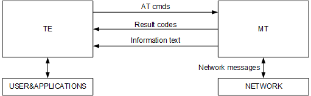
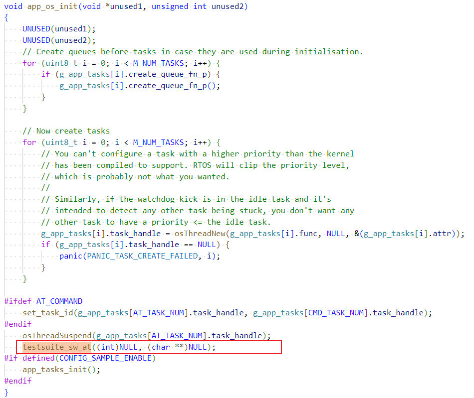
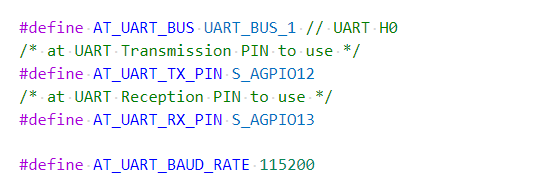
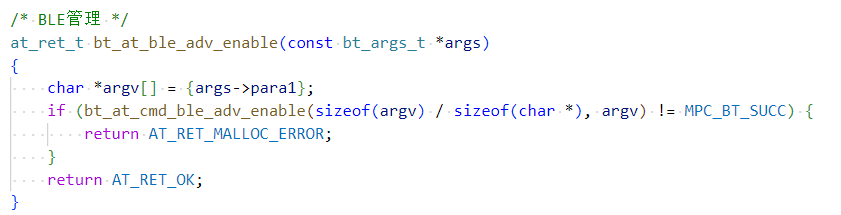
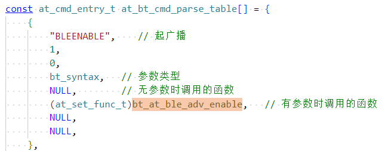

# 前言<a name="ZH-CN_TOPIC_0000001767879382"></a>

**概述<a name="section4537382116410"></a>**

本文介绍BS2XV100的AT指令式及场景，为用户提供相应的指令格式和参数示例解释（本文档以BS21为例进行说明，后续不再备注说明）。

**产品版本<a name="section111371595118"></a>**

与本文档相对应的产品版本如下。

<a name="table22377277"></a>
<table><thead align="left"><tr id="row63051425"><th class="cellrowborder" valign="top" width="40.400000000000006%" id="mcps1.1.3.1.1"><p id="p6891761"><a name="p6891761"></a><a name="p6891761"></a><strong id="b3756104316114"><a name="b3756104316114"></a><a name="b3756104316114"></a>产品名称</strong></p>
</th>
<th class="cellrowborder" valign="top" width="59.599999999999994%" id="mcps1.1.3.1.2"><p id="p21361741"><a name="p21361741"></a><a name="p21361741"></a><strong id="b1676784314119"><a name="b1676784314119"></a><a name="b1676784314119"></a>产品版本</strong></p>
</th>
</tr>
</thead>
<tbody><tr id="row52579486"><td class="cellrowborder" valign="top" width="40.400000000000006%" headers="mcps1.1.3.1.1 "><p id="p31080012"><a name="p31080012"></a><a name="p31080012"></a>BS2X</p>
</td>
<td class="cellrowborder" valign="top" width="59.599999999999994%" headers="mcps1.1.3.1.2 "><p id="p34453054"><a name="p34453054"></a><a name="p34453054"></a>V100</p>
</td>
</tr>
</tbody>
</table>

**读者对象<a name="section4378592816410"></a>**

本文档主要适用于以下工程师：

-   技术支持工程师
-   软件开发工程师

**符号约定<a name="section133020216410"></a>**

在本文中可能出现下列标志，它们所代表的含义如下。

<a name="table2622507016410"></a>
<table><thead align="left"><tr id="row1530720816410"><th class="cellrowborder" valign="top" width="20.580000000000002%" id="mcps1.1.3.1.1"><p id="p6450074116410"><a name="p6450074116410"></a><a name="p6450074116410"></a><strong id="b2136615816410"><a name="b2136615816410"></a><a name="b2136615816410"></a>符号</strong></p>
</th>
<th class="cellrowborder" valign="top" width="79.42%" id="mcps1.1.3.1.2"><p id="p5435366816410"><a name="p5435366816410"></a><a name="p5435366816410"></a><strong id="b5941558116410"><a name="b5941558116410"></a><a name="b5941558116410"></a>说明</strong></p>
</th>
</tr>
</thead>
<tbody><tr id="row1372280416410"><td class="cellrowborder" valign="top" width="20.580000000000002%" headers="mcps1.1.3.1.1 "><p id="p3734547016410"><a name="p3734547016410"></a><a name="p3734547016410"></a><a name="image2670064316410"></a><a name="image2670064316410"></a><span></span></p>
</td>
<td class="cellrowborder" valign="top" width="79.42%" headers="mcps1.1.3.1.2 "><p id="p1757432116410"><a name="p1757432116410"></a><a name="p1757432116410"></a>表示如不避免则将会导致死亡或严重伤害的具有高等级风险的危害。</p>
</td>
</tr>
<tr id="row466863216410"><td class="cellrowborder" valign="top" width="20.580000000000002%" headers="mcps1.1.3.1.1 "><p id="p1432579516410"><a name="p1432579516410"></a><a name="p1432579516410"></a><a name="image4895582316410"></a><a name="image4895582316410"></a><span></span></p>
</td>
<td class="cellrowborder" valign="top" width="79.42%" headers="mcps1.1.3.1.2 "><p id="p959197916410"><a name="p959197916410"></a><a name="p959197916410"></a>表示如不避免则可能导致死亡或严重伤害的具有中等级风险的危害。</p>
</td>
</tr>
<tr id="row123863216410"><td class="cellrowborder" valign="top" width="20.580000000000002%" headers="mcps1.1.3.1.1 "><p id="p1232579516410"><a name="p1232579516410"></a><a name="p1232579516410"></a><a name="image1235582316410"></a><a name="image1235582316410"></a><span></span></p>
</td>
<td class="cellrowborder" valign="top" width="79.42%" headers="mcps1.1.3.1.2 "><p id="p123197916410"><a name="p123197916410"></a><a name="p123197916410"></a>表示如不避免则可能导致轻微或中度伤害的具有低等级风险的危害。</p>
</td>
</tr>
<tr id="row5786682116410"><td class="cellrowborder" valign="top" width="20.580000000000002%" headers="mcps1.1.3.1.1 "><p id="p2204984716410"><a name="p2204984716410"></a><a name="p2204984716410"></a><a name="image4504446716410"></a><a name="image4504446716410"></a><span></span></p>
</td>
<td class="cellrowborder" valign="top" width="79.42%" headers="mcps1.1.3.1.2 "><p id="p4388861916410"><a name="p4388861916410"></a><a name="p4388861916410"></a>用于传递设备或环境安全警示信息。如不避免则可能会导致设备损坏、数据丢失、设备性能降低或其它不可预知的结果。</p>
<p id="p1238861916410"><a name="p1238861916410"></a><a name="p1238861916410"></a>“须知”不涉及人身伤害。</p>
</td>
</tr>
<tr id="row2856923116410"><td class="cellrowborder" valign="top" width="20.580000000000002%" headers="mcps1.1.3.1.1 "><p id="p5555360116410"><a name="p5555360116410"></a><a name="p5555360116410"></a><a name="image799324016410"></a><a name="image799324016410"></a><span></span></p>
</td>
<td class="cellrowborder" valign="top" width="79.42%" headers="mcps1.1.3.1.2 "><p id="p4612588116410"><a name="p4612588116410"></a><a name="p4612588116410"></a>对正文中重点信息的补充说明。</p>
<p id="p1232588116410"><a name="p1232588116410"></a><a name="p1232588116410"></a>“说明”不是安全警示信息，不涉及人身、设备及环境伤害信息。</p>
</td>
</tr>
</tbody>
</table>

**修改记录<a name="section2467512116410"></a>**

<a name="table1557726816410"></a>
<table><thead align="left"><tr id="row2942532716410"><th class="cellrowborder" valign="top" width="18.240000000000002%" id="mcps1.1.4.1.1"><p id="p3778275416410"><a name="p3778275416410"></a><a name="p3778275416410"></a><strong id="b5687322716410"><a name="b5687322716410"></a><a name="b5687322716410"></a>文档版本</strong></p>
</th>
<th class="cellrowborder" valign="top" width="24.73%" id="mcps1.1.4.1.2"><p id="p5627845516410"><a name="p5627845516410"></a><a name="p5627845516410"></a><strong id="b5800814916410"><a name="b5800814916410"></a><a name="b5800814916410"></a>发布日期</strong></p>
</th>
<th class="cellrowborder" valign="top" width="57.03%" id="mcps1.1.4.1.3"><p id="p2382284816410"><a name="p2382284816410"></a><a name="p2382284816410"></a><strong id="b3316380216410"><a name="b3316380216410"></a><a name="b3316380216410"></a>修改说明</strong></p>
</th>
</tr>
</thead>
<tbody><tr id="row138037202114"><td class="cellrowborder" valign="top" width="18.240000000000002%" headers="mcps1.1.4.1.1 "><p id="p6801722120"><a name="p6801722120"></a><a name="p6801722120"></a><span id="ph142401882217"><a name="ph142401882217"></a><a name="ph142401882217"></a>04</span></p>
</td>
<td class="cellrowborder" valign="top" width="24.73%" headers="mcps1.1.4.1.2 "><p id="p8808712117"><a name="p8808712117"></a><a name="p8808712117"></a><span id="ph636691092113"><a name="ph636691092113"></a><a name="ph636691092113"></a>2025-04-02</span></p>
</td>
<td class="cellrowborder" valign="top" width="57.03%" headers="mcps1.1.4.1.3 "><p id="p119769229"><a name="p119769229"></a><a name="p119769229"></a>新增“<a href="AT+BLESETPHY-设置phy.md">AT+BLESETPHY 设置phy</a>”小节内容。</p>
</td>
</tr>
<tr id="row197934519345"><td class="cellrowborder" valign="top" width="18.240000000000002%" headers="mcps1.1.4.1.1 "><p id="p1779414513345"><a name="p1779414513345"></a><a name="p1779414513345"></a>03</p>
</td>
<td class="cellrowborder" valign="top" width="24.73%" headers="mcps1.1.4.1.2 "><p id="p13794155143415"><a name="p13794155143415"></a><a name="p13794155143415"></a>2025-01-14</p>
</td>
<td class="cellrowborder" valign="top" width="57.03%" headers="mcps1.1.4.1.3 "><p id="p134931512211"><a name="p134931512211"></a><a name="p134931512211"></a>更新“<a href="星闪读取远端rssi.md">星闪读取远端rssi</a>”小节内容。</p>
</td>
</tr>
<tr id="row6340192413432"><td class="cellrowborder" valign="top" width="18.240000000000002%" headers="mcps1.1.4.1.1 "><p id="p1534116242438"><a name="p1534116242438"></a><a name="p1534116242438"></a>02</p>
</td>
<td class="cellrowborder" valign="top" width="24.73%" headers="mcps1.1.4.1.2 "><p id="p143417243438"><a name="p143417243438"></a><a name="p143417243438"></a>2024-09-13</p>
</td>
<td class="cellrowborder" valign="top" width="57.03%" headers="mcps1.1.4.1.3 "><a name="ul1522544216436"></a><a name="ul1522544216436"></a><ul id="ul1522544216436"><li>新增“<a href="AT+BLESETDATALEN-设置发送数据包数据长度.md">AT+BLESETDATALEN 设置发送数据包数据长度</a>”小节内容。</li><li>更新“<a href="新增AT指令方法.md">新增AT指令方法</a>”小节内容。</li></ul>
</td>
</tr>
<tr id="row3223143583610"><td class="cellrowborder" valign="top" width="18.240000000000002%" headers="mcps1.1.4.1.1 "><p id="p6235113713360"><a name="p6235113713360"></a><a name="p6235113713360"></a>01</p>
</td>
<td class="cellrowborder" valign="top" width="24.73%" headers="mcps1.1.4.1.2 "><p id="p523593712360"><a name="p523593712360"></a><a name="p523593712360"></a>2024-05-15</p>
</td>
<td class="cellrowborder" valign="top" width="57.03%" headers="mcps1.1.4.1.3 "><p id="p1423523783610"><a name="p1423523783610"></a><a name="p1423523783610"></a>第一次正式版本发布。</p>
</td>
</tr>
<tr id="row13221654193319"><td class="cellrowborder" valign="top" width="18.240000000000002%" headers="mcps1.1.4.1.1 "><p id="p8221154143313"><a name="p8221154143313"></a><a name="p8221154143313"></a>00B02</p>
</td>
<td class="cellrowborder" valign="top" width="24.73%" headers="mcps1.1.4.1.2 "><p id="p192214541338"><a name="p192214541338"></a><a name="p192214541338"></a>2024-03-01</p>
</td>
<td class="cellrowborder" valign="top" width="57.03%" headers="mcps1.1.4.1.3 "><a name="ul19744136143413"></a><a name="ul19744136143413"></a><ul id="ul19744136143413"><li>新增“<a href="BLE-0.md">BLE</a>”小节内容。</li><li>新增“<a href="SLE-4.md">SLE</a>”小节内容。</li></ul>
</td>
</tr>
<tr id="row5947359616410"><td class="cellrowborder" valign="top" width="18.240000000000002%" headers="mcps1.1.4.1.1 "><p id="p2149706016410"><a name="p2149706016410"></a><a name="p2149706016410"></a>00B01</p>
</td>
<td class="cellrowborder" valign="top" width="24.73%" headers="mcps1.1.4.1.2 "><p id="p648803616410"><a name="p648803616410"></a><a name="p648803616410"></a>2024-01-08</p>
</td>
<td class="cellrowborder" valign="top" width="57.03%" headers="mcps1.1.4.1.3 "><p id="p1946537916410"><a name="p1946537916410"></a><a name="p1946537916410"></a>第一次临时版本发布。</p>
</td>
</tr>
</tbody>
</table>

# 指令说明<a name="ZH-CN_TOPIC_0000001814519533"></a>


## 命令简介<a name="ZH-CN_TOPIC_0000001767719722"></a>

AT命令用于TE（例如：PC等用户终端）和MT（例如：移动台等移动终端）之间控制信息的交互，如[图1](#fig171281854102013)所示。

**图 1**  AT命令示意图<a name="fig171281854102013"></a>  


## 指令类型<a name="ZH-CN_TOPIC_0000001767879374"></a>

AT指令类型如[表1](#table838912210233)所示。

**表 1**  AT指令类型说明

<a name="table838912210233"></a>
<table><thead align="left"><tr id="row173891322132320"><th class="cellrowborder" valign="top" width="25.292529252925295%" id="mcps1.2.4.1.1"><p id="p14585143712315"><a name="p14585143712315"></a><a name="p14585143712315"></a>类型</p>
</th>
<th class="cellrowborder" valign="top" width="33.97339733973397%" id="mcps1.2.4.1.2"><p id="p4585237122320"><a name="p4585237122320"></a><a name="p4585237122320"></a>格式</p>
</th>
<th class="cellrowborder" valign="top" width="40.73407340734073%" id="mcps1.2.4.1.3"><p id="p105852373232"><a name="p105852373232"></a><a name="p105852373232"></a>用途</p>
</th>
</tr>
</thead>
<tbody><tr id="row133901022132313"><td class="cellrowborder" valign="top" width="25.292529252925295%" headers="mcps1.2.4.1.1 "><p id="p158673792311"><a name="p158673792311"></a><a name="p158673792311"></a>测试指令</p>
</td>
<td class="cellrowborder" valign="top" width="33.97339733973397%" headers="mcps1.2.4.1.2 "><p id="p658683712313"><a name="p658683712313"></a><a name="p658683712313"></a>AT+&lt;cmd&gt;=?</p>
</td>
<td class="cellrowborder" valign="top" width="40.73407340734073%" headers="mcps1.2.4.1.3 "><p id="p1586133792316"><a name="p1586133792316"></a><a name="p1586133792316"></a>该命令用于查询设置指令的参数以及取值范围。</p>
</td>
</tr>
<tr id="row1839062292313"><td class="cellrowborder" valign="top" width="25.292529252925295%" headers="mcps1.2.4.1.1 "><p id="p1758653710235"><a name="p1758653710235"></a><a name="p1758653710235"></a>查询指令</p>
</td>
<td class="cellrowborder" valign="top" width="33.97339733973397%" headers="mcps1.2.4.1.2 "><p id="p11586113712315"><a name="p11586113712315"></a><a name="p11586113712315"></a>AT+&lt;cmd&gt;?</p>
</td>
<td class="cellrowborder" valign="top" width="40.73407340734073%" headers="mcps1.2.4.1.3 "><p id="p758653719235"><a name="p758653719235"></a><a name="p758653719235"></a>该命令用于返回参数的当前值。</p>
</td>
</tr>
<tr id="row1939012220233"><td class="cellrowborder" valign="top" width="25.292529252925295%" headers="mcps1.2.4.1.1 "><p id="p3587183711237"><a name="p3587183711237"></a><a name="p3587183711237"></a>设置指令</p>
</td>
<td class="cellrowborder" valign="top" width="33.97339733973397%" headers="mcps1.2.4.1.2 "><p id="p358715379239"><a name="p358715379239"></a><a name="p358715379239"></a>AT+&lt;cmd&gt;=&lt;parameter&gt;,…</p>
</td>
<td class="cellrowborder" valign="top" width="40.73407340734073%" headers="mcps1.2.4.1.3 "><p id="p5587183712234"><a name="p5587183712234"></a><a name="p5587183712234"></a>设置参数值或执行。</p>
</td>
</tr>
<tr id="row7390172217239"><td class="cellrowborder" valign="top" width="25.292529252925295%" headers="mcps1.2.4.1.1 "><p id="p85871377234"><a name="p85871377234"></a><a name="p85871377234"></a>执行指令</p>
</td>
<td class="cellrowborder" valign="top" width="33.97339733973397%" headers="mcps1.2.4.1.2 "><p id="p0587737182311"><a name="p0587737182311"></a><a name="p0587737182311"></a>AT+&lt;cmd&gt;</p>
</td>
<td class="cellrowborder" valign="top" width="40.73407340734073%" headers="mcps1.2.4.1.3 "><p id="p958723712239"><a name="p958723712239"></a><a name="p958723712239"></a>用于执行本指令的功能。</p>
</td>
</tr>
</tbody>
</table>

## 注意事项<a name="ZH-CN_TOPIC_0000001767719710"></a>

-   不是每一条指令都具备上述4种类型的命令。
-   文档中有但当前软件版本不支持的AT指令会返回ERROR:TBD。
-   双引号表示字符串数据“string”，例如：AT+SCANSSID=“string”。
-   串口通信默认：波特率为115200、8个数据位、1个停止位、无校验。
-   \[ \]内为可选值，参数可选。
-   命令中的参数以“,”作为分隔符，除双引号括起来的字符串参数外，不支持参数本身带“,”。
-   AT指令中的参数不能有多余的空格。
-   AT指令必须大写，且必须以回车换行符作为结尾（CR LF），部分串口工具在用户敲击键盘回车键时只有回车符（CR）没有换行符（LF），导致AT指令无法识别，如需使用串口工具手动输入AT指令，需在串口工具中将回车键设置为回车符（CR）+换行符（LF）。以IPOP V4.1和SecureCRT8.1为例，说明如[图1](#fig69728515262)、[图2](#fig931533818276)所示。

    **图 1**  IPOP V4.1 CR+LF设置示例<a name="fig69728515262"></a>  
    

    **图 2**  SecureCRT8.1 CR+LF设置示例<a name="fig931533818276"></a>  
    

# 通用AT指令<a name="ZH-CN_TOPIC_0000001814599437"></a>


## 通用AT指令一览表<a name="ZH-CN_TOPIC_0000001767879378"></a>

**表 1**  通用AT指令说明

<a name="table39682040"></a>
<table><thead align="left"><tr id="row63739165"><th class="cellrowborder" valign="top" width="32.32%" id="mcps1.2.3.1.1"><p id="p62598754"><a name="p62598754"></a><a name="p62598754"></a>指令</p>
</th>
<th class="cellrowborder" valign="top" width="67.67999999999999%" id="mcps1.2.3.1.2"><p id="p37334299"><a name="p37334299"></a><a name="p37334299"></a>描述</p>
</th>
</tr>
</thead>
<tbody><tr id="row4179377"><td class="cellrowborder" valign="top" width="32.32%" headers="mcps1.2.3.1.1 "><p id="p2985227"><a name="p2985227"></a><a name="p2985227"></a>AT</p>
</td>
<td class="cellrowborder" valign="top" width="67.67999999999999%" headers="mcps1.2.3.1.2 "><p id="p40476817"><a name="p40476817"></a><a name="p40476817"></a>测试AT功能。</p>
</td>
</tr>
<tr id="row32444864"><td class="cellrowborder" valign="top" width="32.32%" headers="mcps1.2.3.1.1 "><p id="p10788361"><a name="p10788361"></a><a name="p10788361"></a>AT+TESTSUITE</p>
</td>
<td class="cellrowborder" valign="top" width="67.67999999999999%" headers="mcps1.2.3.1.2 "><p id="p1442054"><a name="p1442054"></a><a name="p1442054"></a>AT调试切换为TESTSUITE调试。</p>
</td>
</tr>
</tbody>
</table>

## 通用AT指令描述<a name="ZH-CN_TOPIC_0000001767719718"></a>


### AT 测试AT功能<a name="ZH-CN_TOPIC_0000001814519529"></a>

**表 1**  AT测试说明

<a name="table7446205412415"></a>
<table><tbody><tr id="row2446554102419"><th class="firstcol" valign="top" width="17.419999999999998%" id="mcps1.2.3.1.1"><p id="p6446125414243"><a name="p6446125414243"></a><a name="p6446125414243"></a>格式</p>
</th>
<td class="cellrowborder" valign="top" width="82.58%" headers="mcps1.2.3.1.1 "><p id="p154469545241"><a name="p154469545241"></a><a name="p154469545241"></a>AT</p>
</td>
</tr>
<tr id="row1144614547243"><th class="firstcol" valign="top" width="17.419999999999998%" id="mcps1.2.3.2.1"><p id="p84462054152419"><a name="p84462054152419"></a><a name="p84462054152419"></a>响应</p>
</th>
<td class="cellrowborder" valign="top" width="82.58%" headers="mcps1.2.3.2.1 "><p id="p24467549246"><a name="p24467549246"></a><a name="p24467549246"></a>OK</p>
</td>
</tr>
<tr id="row544675411244"><th class="firstcol" valign="top" width="17.419999999999998%" id="mcps1.2.3.3.1"><p id="p15447185432416"><a name="p15447185432416"></a><a name="p15447185432416"></a>参数说明</p>
</th>
<td class="cellrowborder" valign="top" width="82.58%" headers="mcps1.2.3.3.1 "><p id="p1744795414240"><a name="p1744795414240"></a><a name="p1744795414240"></a>-</p>
</td>
</tr>
<tr id="row1444717544244"><th class="firstcol" valign="top" width="17.419999999999998%" id="mcps1.2.3.4.1"><p id="p0447654192418"><a name="p0447654192418"></a><a name="p0447654192418"></a>示例</p>
</th>
<td class="cellrowborder" valign="top" width="82.58%" headers="mcps1.2.3.4.1 "><p id="p244785492412"><a name="p244785492412"></a><a name="p244785492412"></a>AT</p>
</td>
</tr>
<tr id="row19447115472412"><th class="firstcol" valign="top" width="17.419999999999998%" id="mcps1.2.3.5.1"><p id="p1744735472419"><a name="p1744735472419"></a><a name="p1744735472419"></a>注意</p>
</th>
<td class="cellrowborder" valign="top" width="82.58%" headers="mcps1.2.3.5.1 "><p id="p124471554142419"><a name="p124471554142419"></a><a name="p124471554142419"></a>-</p>
</td>
</tr>
</tbody>
</table>

### AT+HELP 查看当前可用AT命令<a name="ZH-CN_TOPIC_0000001814599441"></a>

**表 1**  查看可用AT命令说明

<a name="table41995683"></a>
<table><tbody><tr id="row60142677"><th class="firstcol" valign="top" width="17.8%" id="mcps1.2.3.1.1"><p id="p39718677"><a name="p39718677"></a><a name="p39718677"></a>格式</p>
</th>
<td class="cellrowborder" valign="top" width="82.19999999999999%" headers="mcps1.2.3.1.1 "><p id="p63096249"><a name="p63096249"></a><a name="p63096249"></a>AT+HELP</p>
</td>
</tr>
<tr id="row30995332"><th class="firstcol" valign="top" width="17.8%" id="mcps1.2.3.2.1"><p id="p27593978"><a name="p27593978"></a><a name="p27593978"></a>响应</p>
</th>
<td class="cellrowborder" valign="top" width="82.19999999999999%" headers="mcps1.2.3.2.1 "><p id="p20519752"><a name="p20519752"></a><a name="p20519752"></a>+HELP:</p>
<p id="p50460048"><a name="p50460048"></a><a name="p50460048"></a>显示当前支持的AT命令</p>
<p id="p51487255"><a name="p51487255"></a><a name="p51487255"></a>OK</p>
</td>
</tr>
<tr id="row60732119"><th class="firstcol" valign="top" width="17.8%" id="mcps1.2.3.3.1"><p id="p20354569"><a name="p20354569"></a><a name="p20354569"></a>参数说明</p>
</th>
<td class="cellrowborder" valign="top" width="82.19999999999999%" headers="mcps1.2.3.3.1 "><p id="p38107408"><a name="p38107408"></a><a name="p38107408"></a>-</p>
</td>
</tr>
<tr id="row7422359"><th class="firstcol" valign="top" width="17.8%" id="mcps1.2.3.4.1"><p id="p64340216"><a name="p64340216"></a><a name="p64340216"></a>示例</p>
</th>
<td class="cellrowborder" valign="top" width="82.19999999999999%" headers="mcps1.2.3.4.1 "><p id="p44175009"><a name="p44175009"></a><a name="p44175009"></a>AT+HELP</p>
</td>
</tr>
<tr id="row62030769"><th class="firstcol" valign="top" width="17.8%" id="mcps1.2.3.5.1"><p id="p58436378"><a name="p58436378"></a><a name="p58436378"></a>注意</p>
</th>
<td class="cellrowborder" valign="top" width="82.19999999999999%" headers="mcps1.2.3.5.1 "><p id="p35726176"><a name="p35726176"></a><a name="p35726176"></a>-</p>
</td>
</tr>
</tbody>
</table>

# BT业务AT指令<a name="ZH-CN_TOPIC_0000001767879386"></a>


## BT业务AT指令一览表<a name="ZH-CN_TOPIC_0000001767879390"></a>


### BLE<a name="ZH-CN_TOPIC_0000001856225189"></a>


#### gap模块AT命令<a name="ZH-CN_TOPIC_0000001856145165"></a>

<a name="table26801527135418"></a>
<table><thead align="left"><tr id="row17800122775416"><th class="cellrowborder" valign="top" width="50%" id="mcps1.1.3.1.1"><p id="p1280042718544"><a name="p1280042718544"></a><a name="p1280042718544"></a>指令</p>
</th>
<th class="cellrowborder" valign="top" width="50%" id="mcps1.1.3.1.2"><p id="p380052735420"><a name="p380052735420"></a><a name="p380052735420"></a>描述</p>
</th>
</tr>
</thead>
<tbody><tr id="row5800122713541"><td class="cellrowborder" valign="top" width="50%" headers="mcps1.1.3.1.1 "><p id="p88001227165412"><a name="p88001227165412"></a><a name="p88001227165412"></a>AT+BLEENABLE</p>
</td>
<td class="cellrowborder" valign="top" width="50%" headers="mcps1.1.3.1.2 "><p id="p1380072745419"><a name="p1380072745419"></a><a name="p1380072745419"></a>使能BLE协议栈。</p>
</td>
</tr>
<tr id="row28002027185411"><td class="cellrowborder" valign="top" width="50%" headers="mcps1.1.3.1.1 "><p id="p18800142716540"><a name="p18800142716540"></a><a name="p18800142716540"></a>AT+BLEDISABLE</p>
</td>
<td class="cellrowborder" valign="top" width="50%" headers="mcps1.1.3.1.2 "><p id="p38001427135412"><a name="p38001427135412"></a><a name="p38001427135412"></a>关闭BLE协议栈。</p>
</td>
</tr>
<tr id="row2800182716546"><td class="cellrowborder" valign="top" width="50%" headers="mcps1.1.3.1.1 "><p id="p118001327125414"><a name="p118001327125414"></a><a name="p118001327125414"></a>AT+BLESETADDR=&lt;参数&gt;</p>
</td>
<td class="cellrowborder" valign="top" width="50%" headers="mcps1.1.3.1.2 "><p id="p1980042735416"><a name="p1980042735416"></a><a name="p1980042735416"></a>设置本地设备地址。</p>
</td>
</tr>
<tr id="row138001727195414"><td class="cellrowborder" valign="top" width="50%" headers="mcps1.1.3.1.1 "><p id="p5800162755417"><a name="p5800162755417"></a><a name="p5800162755417"></a>AT+BLEGETADDR</p>
</td>
<td class="cellrowborder" valign="top" width="50%" headers="mcps1.1.3.1.2 "><p id="p1680018271549"><a name="p1680018271549"></a><a name="p1680018271549"></a>获取本地设备地址。</p>
</td>
</tr>
<tr id="row1280013274540"><td class="cellrowborder" valign="top" width="50%" headers="mcps1.1.3.1.1 "><p id="p15800152755416"><a name="p15800152755416"></a><a name="p15800152755416"></a>AT+BLESETNAME=&lt;参数&gt;</p>
</td>
<td class="cellrowborder" valign="top" width="50%" headers="mcps1.1.3.1.2 "><p id="p7800192718545"><a name="p7800192718545"></a><a name="p7800192718545"></a>设置本地设备名称。</p>
</td>
</tr>
<tr id="row880072795416"><td class="cellrowborder" valign="top" width="50%" headers="mcps1.1.3.1.1 "><p id="p780062735419"><a name="p780062735419"></a><a name="p780062735419"></a>AT+BLEGETNAME</p>
</td>
<td class="cellrowborder" valign="top" width="50%" headers="mcps1.1.3.1.2 "><p id="p8800172714542"><a name="p8800172714542"></a><a name="p8800172714542"></a>获取本地设备名称。</p>
</td>
</tr>
<tr id="row380042718543"><td class="cellrowborder" valign="top" width="50%" headers="mcps1.1.3.1.1 "><p id="p380062785416"><a name="p380062785416"></a><a name="p380062785416"></a>AT+BLESETAPPEARANCE=&lt;参数&gt;</p>
</td>
<td class="cellrowborder" valign="top" width="50%" headers="mcps1.1.3.1.2 "><p id="p1800172720549"><a name="p1800172720549"></a><a name="p1800172720549"></a>设置本地设备外观。</p>
</td>
</tr>
<tr id="row1980052725410"><td class="cellrowborder" valign="top" width="50%" headers="mcps1.1.3.1.1 "><p id="p880012775414"><a name="p880012775414"></a><a name="p880012775414"></a>AT+BLESETADVDATA=&lt;参数&gt;</p>
</td>
<td class="cellrowborder" valign="top" width="50%" headers="mcps1.1.3.1.2 "><p id="p10800727135411"><a name="p10800727135411"></a><a name="p10800727135411"></a>设置BLE广播数据。</p>
</td>
</tr>
<tr id="row13800112745410"><td class="cellrowborder" valign="top" width="50%" headers="mcps1.1.3.1.1 "><p id="p1180072795419"><a name="p1180072795419"></a><a name="p1180072795419"></a>AT+BLESETADVPAR=&lt;参数&gt;</p>
</td>
<td class="cellrowborder" valign="top" width="50%" headers="mcps1.1.3.1.2 "><p id="p7801112745416"><a name="p7801112745416"></a><a name="p7801112745416"></a>设置BLE广播参数。</p>
</td>
</tr>
<tr id="row13801112720541"><td class="cellrowborder" valign="top" width="50%" headers="mcps1.1.3.1.1 "><p id="p108011327135418"><a name="p108011327135418"></a><a name="p108011327135418"></a>AT+BLESTARTADV=&lt;参数&gt;</p>
</td>
<td class="cellrowborder" valign="top" width="50%" headers="mcps1.1.3.1.2 "><p id="p118011127195420"><a name="p118011127195420"></a><a name="p118011127195420"></a>开始发送BLE广播。</p>
</td>
</tr>
<tr id="row1080122720541"><td class="cellrowborder" valign="top" width="50%" headers="mcps1.1.3.1.1 "><p id="p208018274549"><a name="p208018274549"></a><a name="p208018274549"></a>AT+BLESTOPADV=&lt;参数&gt;</p>
</td>
<td class="cellrowborder" valign="top" width="50%" headers="mcps1.1.3.1.2 "><p id="p480112273542"><a name="p480112273542"></a><a name="p480112273542"></a>停止发送BLE广播。</p>
</td>
</tr>
<tr id="row11801142725415"><td class="cellrowborder" valign="top" width="50%" headers="mcps1.1.3.1.1 "><p id="p17801192705414"><a name="p17801192705414"></a><a name="p17801192705414"></a>AT+BLESETSCANPAR=&lt;参数&gt;</p>
</td>
<td class="cellrowborder" valign="top" width="50%" headers="mcps1.1.3.1.2 "><p id="p68011127175415"><a name="p68011127175415"></a><a name="p68011127175415"></a>设置BLE扫描参数。</p>
</td>
</tr>
<tr id="row12801327145411"><td class="cellrowborder" valign="top" width="50%" headers="mcps1.1.3.1.1 "><p id="p138011227135411"><a name="p138011227135411"></a><a name="p138011227135411"></a>AT+BLESTARTSCAN</p>
</td>
<td class="cellrowborder" valign="top" width="50%" headers="mcps1.1.3.1.2 "><p id="p1801827125419"><a name="p1801827125419"></a><a name="p1801827125419"></a>启动BLE扫描。</p>
</td>
</tr>
<tr id="row1880192720540"><td class="cellrowborder" valign="top" width="50%" headers="mcps1.1.3.1.1 "><p id="p12801627125410"><a name="p12801627125410"></a><a name="p12801627125410"></a>AT+BLESTOPSCAN</p>
</td>
<td class="cellrowborder" valign="top" width="50%" headers="mcps1.1.3.1.2 "><p id="p5801142715546"><a name="p5801142715546"></a><a name="p5801142715546"></a>停止BLE扫描。</p>
</td>
</tr>
<tr id="row17801927135418"><td class="cellrowborder" valign="top" width="50%" headers="mcps1.1.3.1.1 "><p id="p580115274546"><a name="p580115274546"></a><a name="p580115274546"></a>AT+BLEPAIR=&lt;参数&gt;</p>
</td>
<td class="cellrowborder" valign="top" width="50%" headers="mcps1.1.3.1.2 "><p id="p20801927125418"><a name="p20801927125418"></a><a name="p20801927125418"></a>与对端设备发起配对。</p>
</td>
</tr>
<tr id="row2801182710541"><td class="cellrowborder" valign="top" width="50%" headers="mcps1.1.3.1.1 "><p id="p1380182717547"><a name="p1380182717547"></a><a name="p1380182717547"></a>AT+BLEGETPAIREDNUM</p>
</td>
<td class="cellrowborder" valign="top" width="50%" headers="mcps1.1.3.1.2 "><p id="p2080111274540"><a name="p2080111274540"></a><a name="p2080111274540"></a>获取BLE设备配对设备数量。</p>
</td>
</tr>
<tr id="row580102718542"><td class="cellrowborder" valign="top" width="50%" headers="mcps1.1.3.1.1 "><p id="p38011727165410"><a name="p38011727165410"></a><a name="p38011727165410"></a>AT+BLEGETPAIREDDEV</p>
</td>
<td class="cellrowborder" valign="top" width="50%" headers="mcps1.1.3.1.2 "><p id="p128011127105412"><a name="p128011127105412"></a><a name="p128011127105412"></a>获取BLE设备配对设备。</p>
</td>
</tr>
<tr id="row148011427105413"><td class="cellrowborder" valign="top" width="50%" headers="mcps1.1.3.1.1 "><p id="p6801427135416"><a name="p6801427135416"></a><a name="p6801427135416"></a>AT+BLEGETPAIREDSTA=&lt;参数&gt;</p>
</td>
<td class="cellrowborder" valign="top" width="50%" headers="mcps1.1.3.1.2 "><p id="p2080122712543"><a name="p2080122712543"></a><a name="p2080122712543"></a>获取BLE设备配对状态。</p>
</td>
</tr>
<tr id="row168011271544"><td class="cellrowborder" valign="top" width="50%" headers="mcps1.1.3.1.1 "><p id="p38011427125410"><a name="p38011427125410"></a><a name="p38011427125410"></a>AT+BLEUNPAIR=&lt;参数&gt;</p>
</td>
<td class="cellrowborder" valign="top" width="50%" headers="mcps1.1.3.1.2 "><p id="p9801192715413"><a name="p9801192715413"></a><a name="p9801192715413"></a>取消配对。</p>
</td>
</tr>
<tr id="row20801927165415"><td class="cellrowborder" valign="top" width="50%" headers="mcps1.1.3.1.1 "><p id="p780116275542"><a name="p780116275542"></a><a name="p780116275542"></a>AT+BLEUNPAIRALL</p>
</td>
<td class="cellrowborder" valign="top" width="50%" headers="mcps1.1.3.1.2 "><p id="p88011427125417"><a name="p88011427125417"></a><a name="p88011427125417"></a>取消所有配对。</p>
</td>
</tr>
<tr id="row11801102720545"><td class="cellrowborder" valign="top" width="50%" headers="mcps1.1.3.1.1 "><p id="p168011527155412"><a name="p168011527155412"></a><a name="p168011527155412"></a>AT+BLECONNPARUPD=&lt;参数&gt;</p>
</td>
<td class="cellrowborder" valign="top" width="50%" headers="mcps1.1.3.1.2 "><p id="p8801132717549"><a name="p8801132717549"></a><a name="p8801132717549"></a>连接参数更新。</p>
</td>
</tr>
<tr id="row12801172717542"><td class="cellrowborder" valign="top" width="50%" headers="mcps1.1.3.1.1 "><p id="p18011277547"><a name="p18011277547"></a><a name="p18011277547"></a>AT+BLECONN=&lt;参数&gt;</p>
</td>
<td class="cellrowborder" valign="top" width="50%" headers="mcps1.1.3.1.2 "><p id="p68011427135413"><a name="p68011427135413"></a><a name="p68011427135413"></a>与BLE设备连接。</p>
</td>
</tr>
<tr id="row78011527135415"><td class="cellrowborder" valign="top" width="50%" headers="mcps1.1.3.1.1 "><p id="p118019276545"><a name="p118019276545"></a><a name="p118019276545"></a>AT+BLEDISCONN=&lt;参数&gt;</p>
</td>
<td class="cellrowborder" valign="top" width="50%" headers="mcps1.1.3.1.2 "><p id="p7801122715413"><a name="p7801122715413"></a><a name="p7801122715413"></a>断开BLE设备连接。</p>
</td>
</tr>
<tr id="row88011427205411"><td class="cellrowborder" valign="top" width="50%" headers="mcps1.1.3.1.1 "><p id="p68011427195416"><a name="p68011427195416"></a><a name="p68011427195416"></a>AT+BLEGAPREGCBK</p>
</td>
<td class="cellrowborder" valign="top" width="50%" headers="mcps1.1.3.1.2 "><p id="p9801202785416"><a name="p9801202785416"></a><a name="p9801202785416"></a>注册gap回调函数。</p>
</td>
</tr>
<tr id="row15891013111"><td class="cellrowborder" valign="top" width="50%" headers="mcps1.1.3.1.1 "><p id="p2598107119"><a name="p2598107119"></a><a name="p2598107119"></a>AT+BLESETDATALEN=&lt;参数&gt;</p>
</td>
<td class="cellrowborder" valign="top" width="50%" headers="mcps1.1.3.1.2 "><p id="p859111017112"><a name="p859111017112"></a><a name="p859111017112"></a>设置链路数据包的数据长度</p>
</td>
</tr>
</tbody>
</table>

#### gatts模块AT命令<a name="ZH-CN_TOPIC_0000001809506380"></a>

<a name="table63229348554"></a>
<table><thead align="left"><tr id="row335443435510"><th class="cellrowborder" valign="top" width="50%" id="mcps1.1.3.1.1"><p id="p935453495513"><a name="p935453495513"></a><a name="p935453495513"></a>指令</p>
</th>
<th class="cellrowborder" valign="top" width="50%" id="mcps1.1.3.1.2"><p id="p113541534125518"><a name="p113541534125518"></a><a name="p113541534125518"></a>描述</p>
</th>
</tr>
</thead>
<tbody><tr id="row18354134175517"><td class="cellrowborder" valign="top" width="50%" headers="mcps1.1.3.1.1 "><p id="p7260639103917"><a name="p7260639103917"></a><a name="p7260639103917"></a>AT+GAGATTSSNDNTFYTTSREGSRV=&lt;参数&gt;</p>
</td>
<td class="cellrowborder" valign="top" width="50%" headers="mcps1.1.3.1.2 "><p id="p2354734195518"><a name="p2354734195518"></a><a name="p2354734195518"></a>创建一个GATT server。</p>
</td>
</tr>
<tr id="row14354163455514"><td class="cellrowborder" valign="top" width="50%" headers="mcps1.1.3.1.1 "><p id="p133605153390"><a name="p133605153390"></a><a name="p133605153390"></a>AT+GAGATTSSNDNTFYTTSUNREG=&lt;参数&gt;</p>
</td>
<td class="cellrowborder" valign="top" width="50%" headers="mcps1.1.3.1.2 "><p id="p14354193410552"><a name="p14354193410552"></a><a name="p14354193410552"></a>删除GATT server，释放资源。</p>
</td>
</tr>
<tr id="row11354534195510"><td class="cellrowborder" valign="top" width="50%" headers="mcps1.1.3.1.1 "><p id="p3354153412557"><a name="p3354153412557"></a><a name="p3354153412557"></a>AT+GATTSADDSERV=&lt;参数&gt;</p>
</td>
<td class="cellrowborder" valign="top" width="50%" headers="mcps1.1.3.1.2 "><p id="p15354153415551"><a name="p15354153415551"></a><a name="p15354153415551"></a>添加一个GATT服务。</p>
</td>
</tr>
<tr id="row4354193415554"><td class="cellrowborder" valign="top" width="50%" headers="mcps1.1.3.1.1 "><p id="p1435419343552"><a name="p1435419343552"></a><a name="p1435419343552"></a>AT+GATTSSYNCADDSERV=&lt;参数&gt;</p>
</td>
<td class="cellrowborder" valign="top" width="50%" headers="mcps1.1.3.1.2 "><p id="p1435419345558"><a name="p1435419345558"></a><a name="p1435419345558"></a>添加一个GATT服务（同步）。</p>
</td>
</tr>
<tr id="row73541234155513"><td class="cellrowborder" valign="top" width="50%" headers="mcps1.1.3.1.1 "><p id="p15354133416552"><a name="p15354133416552"></a><a name="p15354133416552"></a>AT+GATTSADDCHAR=&lt;参数&gt;</p>
</td>
<td class="cellrowborder" valign="top" width="50%" headers="mcps1.1.3.1.2 "><p id="p1935473417557"><a name="p1935473417557"></a><a name="p1935473417557"></a>为GATT服务添加一个特征。</p>
</td>
</tr>
<tr id="row1935483410557"><td class="cellrowborder" valign="top" width="50%" headers="mcps1.1.3.1.1 "><p id="p535417347558"><a name="p535417347558"></a><a name="p535417347558"></a>AT+GATTSSYNCADDCHAR=&lt;参数&gt;</p>
</td>
<td class="cellrowborder" valign="top" width="50%" headers="mcps1.1.3.1.2 "><p id="p19354934165519"><a name="p19354934165519"></a><a name="p19354934165519"></a>为GATT服务添加一个特征（同步）。</p>
</td>
</tr>
<tr id="row63541734155517"><td class="cellrowborder" valign="top" width="50%" headers="mcps1.1.3.1.1 "><p id="p3354173475515"><a name="p3354173475515"></a><a name="p3354173475515"></a>AT+GATTSADDDESCR=&lt;参数&gt;</p>
</td>
<td class="cellrowborder" valign="top" width="50%" headers="mcps1.1.3.1.2 "><p id="p635473411556"><a name="p635473411556"></a><a name="p635473411556"></a>为最新的特征添加一个描述符。</p>
</td>
</tr>
<tr id="row2035443455511"><td class="cellrowborder" valign="top" width="50%" headers="mcps1.1.3.1.1 "><p id="p435416344556"><a name="p435416344556"></a><a name="p435416344556"></a>AT+GATTSSYNCADDDESCR=&lt;参数&gt;</p>
</td>
<td class="cellrowborder" valign="top" width="50%" headers="mcps1.1.3.1.2 "><p id="p53547343551"><a name="p53547343551"></a><a name="p53547343551"></a>为最新的特征添加一个描述符（同步）。</p>
</td>
</tr>
<tr id="row435493485515"><td class="cellrowborder" valign="top" width="50%" headers="mcps1.1.3.1.1 "><p id="p133541934135515"><a name="p133541934135515"></a><a name="p133541934135515"></a>AT+GATTSSTARTSERV=&lt;参数&gt;</p>
</td>
<td class="cellrowborder" valign="top" width="50%" headers="mcps1.1.3.1.2 "><p id="p5354103425520"><a name="p5354103425520"></a><a name="p5354103425520"></a>启动指定的GATT服务。</p>
</td>
</tr>
<tr id="row5354103413552"><td class="cellrowborder" valign="top" width="50%" headers="mcps1.1.3.1.1 "><p id="p8354153417554"><a name="p8354153417554"></a><a name="p8354153417554"></a>AT+GATTSDELALLSERV=&lt;参数&gt;</p>
</td>
<td class="cellrowborder" valign="top" width="50%" headers="mcps1.1.3.1.2 "><p id="p11354153415518"><a name="p11354153415518"></a><a name="p11354153415518"></a>删除指定server上的所有服务。</p>
</td>
</tr>
<tr id="row13354163419551"><td class="cellrowborder" valign="top" width="50%" headers="mcps1.1.3.1.1 "><p id="p14354934125516"><a name="p14354934125516"></a><a name="p14354934125516"></a>AT+GATTSSENDRSP=&lt;参数&gt;</p>
</td>
<td class="cellrowborder" valign="top" width="50%" headers="mcps1.1.3.1.2 "><p id="p33541334145519"><a name="p33541334145519"></a><a name="p33541334145519"></a>发送响应。</p>
</td>
</tr>
<tr id="row10354143420557"><td class="cellrowborder" valign="top" width="50%" headers="mcps1.1.3.1.1 "><p id="p83549349558"><a name="p83549349558"></a><a name="p83549349558"></a>AT+GATTSSNDNTFY=&lt;参数&gt;</p>
</td>
<td class="cellrowborder" valign="top" width="50%" headers="mcps1.1.3.1.2 "><p id="p163544345557"><a name="p163544345557"></a><a name="p163544345557"></a>发送通知或指示。</p>
</td>
</tr>
<tr id="row7354133485511"><td class="cellrowborder" valign="top" width="50%" headers="mcps1.1.3.1.1 "><p id="p12354123435510"><a name="p12354123435510"></a><a name="p12354123435510"></a>AT+GATTSSNDNTFYBYUUID=&lt;参数&gt;</p>
</td>
<td class="cellrowborder" valign="top" width="50%" headers="mcps1.1.3.1.2 "><p id="p11355113405511"><a name="p11355113405511"></a><a name="p11355113405511"></a>根据uuid发送通知或指示。</p>
</td>
</tr>
<tr id="row235593465511"><td class="cellrowborder" valign="top" width="50%" headers="mcps1.1.3.1.1 "><p id="p435520345552"><a name="p435520345552"></a><a name="p435520345552"></a>AT+GATTSREGCBK</p>
</td>
<td class="cellrowborder" valign="top" width="50%" headers="mcps1.1.3.1.2 "><p id="p123551034135515"><a name="p123551034135515"></a><a name="p123551034135515"></a>注册GATT服务端回调函数。</p>
</td>
</tr>
<tr id="row12355534115514"><td class="cellrowborder" valign="top" width="50%" headers="mcps1.1.3.1.1 "><p id="p13551634105517"><a name="p13551634105517"></a><a name="p13551634105517"></a>AT+GATTSSETMTU=&lt;参数&gt;</p>
</td>
<td class="cellrowborder" valign="top" width="50%" headers="mcps1.1.3.1.2 "><p id="p18355143412552"><a name="p18355143412552"></a><a name="p18355143412552"></a>在连接之前设置server rx mtu。</p>
</td>
</tr>
</tbody>
</table>

#### gattc模块AT命令<a name="ZH-CN_TOPIC_0000001809346532"></a>

<a name="table219715570559"></a>
<table><thead align="left"><tr id="row132141157135511"><th class="cellrowborder" valign="top" width="50%" id="mcps1.1.3.1.1"><p id="p18214357205520"><a name="p18214357205520"></a><a name="p18214357205520"></a>指令</p>
</th>
<th class="cellrowborder" valign="top" width="50%" id="mcps1.1.3.1.2"><p id="p15214105712556"><a name="p15214105712556"></a><a name="p15214105712556"></a>描述</p>
</th>
</tr>
</thead>
<tbody><tr id="row6214125717558"><td class="cellrowborder" valign="top" width="50%" headers="mcps1.1.3.1.1 "><p id="p1214205716554"><a name="p1214205716554"></a><a name="p1214205716554"></a>AT+GATTCREG=&lt;参数&gt;</p>
</td>
<td class="cellrowborder" valign="top" width="50%" headers="mcps1.1.3.1.2 "><p id="p121410575556"><a name="p121410575556"></a><a name="p121410575556"></a>创建一个GATT client。</p>
</td>
</tr>
<tr id="row1021420572555"><td class="cellrowborder" valign="top" width="50%" headers="mcps1.1.3.1.1 "><p id="p421411574555"><a name="p421411574555"></a><a name="p421411574555"></a>AT+GATTCUNREG=&lt;参数&gt;</p>
</td>
<td class="cellrowborder" valign="top" width="50%" headers="mcps1.1.3.1.2 "><p id="p92143570558"><a name="p92143570558"></a><a name="p92143570558"></a>删除GATT client，释放资源。</p>
</td>
</tr>
<tr id="row172141557165512"><td class="cellrowborder" valign="top" width="50%" headers="mcps1.1.3.1.1 "><p id="p1021516570556"><a name="p1021516570556"></a><a name="p1021516570556"></a>AT+GATTCFNDSERV=&lt;参数&gt;</p>
</td>
<td class="cellrowborder" valign="top" width="50%" headers="mcps1.1.3.1.2 "><p id="p82157576551"><a name="p82157576551"></a><a name="p82157576551"></a>发现所有服务(可by uuid)。</p>
</td>
</tr>
<tr id="row20215357145512"><td class="cellrowborder" valign="top" width="50%" headers="mcps1.1.3.1.1 "><p id="p9215155795515"><a name="p9215155795515"></a><a name="p9215155795515"></a>AT+GATTCFNDCHAR=&lt;参数&gt;</p>
</td>
<td class="cellrowborder" valign="top" width="50%" headers="mcps1.1.3.1.2 "><p id="p7215185765519"><a name="p7215185765519"></a><a name="p7215185765519"></a>发现所有特征。</p>
</td>
</tr>
<tr id="row721575717554"><td class="cellrowborder" valign="top" width="50%" headers="mcps1.1.3.1.1 "><p id="p0215165765517"><a name="p0215165765517"></a><a name="p0215165765517"></a>AT+GATTCFNDDESCR=&lt;参数&gt;</p>
</td>
<td class="cellrowborder" valign="top" width="50%" headers="mcps1.1.3.1.2 "><p id="p18215757145516"><a name="p18215757145516"></a><a name="p18215757145516"></a>发现所有描述符。</p>
</td>
</tr>
<tr id="row162151557185514"><td class="cellrowborder" valign="top" width="50%" headers="mcps1.1.3.1.1 "><p id="p18215115795514"><a name="p18215115795514"></a><a name="p18215115795514"></a>AT+GATTCREADBYHDL=&lt;参数&gt;</p>
</td>
<td class="cellrowborder" valign="top" width="50%" headers="mcps1.1.3.1.2 "><p id="p6215557115515"><a name="p6215557115515"></a><a name="p6215557115515"></a>读取by hdl。</p>
</td>
</tr>
<tr id="row5215105716555"><td class="cellrowborder" valign="top" width="50%" headers="mcps1.1.3.1.1 "><p id="p0215957115513"><a name="p0215957115513"></a><a name="p0215957115513"></a>AT+GATTCREADBYUUID=&lt;参数&gt;</p>
</td>
<td class="cellrowborder" valign="top" width="50%" headers="mcps1.1.3.1.2 "><p id="p132151257155518"><a name="p132151257155518"></a><a name="p132151257155518"></a>读取by_uuid</p>
</td>
</tr>
<tr id="row11215757195518"><td class="cellrowborder" valign="top" width="50%" headers="mcps1.1.3.1.1 "><p id="p7215135715518"><a name="p7215135715518"></a><a name="p7215135715518"></a>AT+GATTCWRITEREQ=&lt;参数&gt;</p>
</td>
<td class="cellrowborder" valign="top" width="50%" headers="mcps1.1.3.1.2 "><p id="p12215155714551"><a name="p12215155714551"></a><a name="p12215155714551"></a>写by hdl req。</p>
</td>
</tr>
<tr id="row20215145717551"><td class="cellrowborder" valign="top" width="50%" headers="mcps1.1.3.1.1 "><p id="p102151957195511"><a name="p102151957195511"></a><a name="p102151957195511"></a>AT+GATTCWRITECMD=&lt;参数&gt;</p>
</td>
<td class="cellrowborder" valign="top" width="50%" headers="mcps1.1.3.1.2 "><p id="p4215175717558"><a name="p4215175717558"></a><a name="p4215175717558"></a>写by hdl cmd。</p>
</td>
</tr>
<tr id="row321565775519"><td class="cellrowborder" valign="top" width="50%" headers="mcps1.1.3.1.1 "><p id="p19215125765512"><a name="p19215125765512"></a><a name="p19215125765512"></a>AT+GATTCEXCHMTU=&lt;参数&gt;</p>
</td>
<td class="cellrowborder" valign="top" width="50%" headers="mcps1.1.3.1.2 "><p id="p13215175717557"><a name="p13215175717557"></a><a name="p13215175717557"></a>交换mtu请求。</p>
</td>
</tr>
<tr id="row1521595715550"><td class="cellrowborder" valign="top" width="50%" headers="mcps1.1.3.1.1 "><p id="p22151657125514"><a name="p22151657125514"></a><a name="p22151657125514"></a>AT+GATTCREGCBK</p>
</td>
<td class="cellrowborder" valign="top" width="50%" headers="mcps1.1.3.1.2 "><p id="p4215165765513"><a name="p4215165765513"></a><a name="p4215165765513"></a>注册GATT客户端回调函数。</p>
</td>
</tr>
</tbody>
</table>

### SLE<a name="ZH-CN_TOPIC_0000001856225193"></a>

<a name="table2154132319579"></a>
<table><thead align="left"><tr id="row0193132317579"><th class="cellrowborder" valign="top" width="32%" id="mcps1.1.3.1.1"><p id="p12193423175714"><a name="p12193423175714"></a><a name="p12193423175714"></a>指令</p>
</th>
<th class="cellrowborder" valign="top" width="68%" id="mcps1.1.3.1.2"><p id="p61931723115716"><a name="p61931723115716"></a><a name="p61931723115716"></a>描述</p>
</th>
</tr>
</thead>
<tbody><tr id="row8193202319572"><td class="cellrowborder" valign="top" width="32%" headers="mcps1.1.3.1.1 "><p id="p31931223155712"><a name="p31931223155712"></a><a name="p31931223155712"></a>AT+SLEENABLE</p>
</td>
<td class="cellrowborder" valign="top" width="68%" headers="mcps1.1.3.1.2 "><p id="p151931238570"><a name="p151931238570"></a><a name="p151931238570"></a>SLE使能。</p>
</td>
</tr>
<tr id="row819314233577"><td class="cellrowborder" valign="top" width="32%" headers="mcps1.1.3.1.1 "><p id="p20193623135712"><a name="p20193623135712"></a><a name="p20193623135712"></a>AT+SLESETADVPAR</p>
</td>
<td class="cellrowborder" valign="top" width="68%" headers="mcps1.1.3.1.2 "><p id="p1619342313572"><a name="p1619342313572"></a><a name="p1619342313572"></a>设置SLE广播参数。</p>
</td>
</tr>
<tr id="row1019342311574"><td class="cellrowborder" valign="top" width="32%" headers="mcps1.1.3.1.1 "><p id="p18193142314572"><a name="p18193142314572"></a><a name="p18193142314572"></a>AT+SLESETADVDATA</p>
</td>
<td class="cellrowborder" valign="top" width="68%" headers="mcps1.1.3.1.2 "><p id="p819352305717"><a name="p819352305717"></a><a name="p819352305717"></a>设置指令。</p>
</td>
</tr>
<tr id="row319392313574"><td class="cellrowborder" valign="top" width="32%" headers="mcps1.1.3.1.1 "><p id="p91931723115717"><a name="p91931723115717"></a><a name="p91931723115717"></a>AT+SLESTARTADV</p>
</td>
<td class="cellrowborder" valign="top" width="68%" headers="mcps1.1.3.1.2 "><p id="p2019372395720"><a name="p2019372395720"></a><a name="p2019372395720"></a>起SLE广播。</p>
</td>
</tr>
<tr id="row2193182365711"><td class="cellrowborder" valign="top" width="32%" headers="mcps1.1.3.1.1 "><p id="p14193192345719"><a name="p14193192345719"></a><a name="p14193192345719"></a>AT+SLESTOPADV</p>
</td>
<td class="cellrowborder" valign="top" width="68%" headers="mcps1.1.3.1.2 "><p id="p2019342315710"><a name="p2019342315710"></a><a name="p2019342315710"></a>停SLE广播。</p>
</td>
</tr>
<tr id="row31931123205717"><td class="cellrowborder" valign="top" width="32%" headers="mcps1.1.3.1.1 "><p id="p1619322315719"><a name="p1619322315719"></a><a name="p1619322315719"></a>AT+SLESTARTSCAN</p>
</td>
<td class="cellrowborder" valign="top" width="68%" headers="mcps1.1.3.1.2 "><p id="p519312231573"><a name="p519312231573"></a><a name="p519312231573"></a>启动扫描。</p>
</td>
</tr>
<tr id="row319342325720"><td class="cellrowborder" valign="top" width="32%" headers="mcps1.1.3.1.1 "><p id="p201931239574"><a name="p201931239574"></a><a name="p201931239574"></a>AT+SLESTOPSCAN</p>
</td>
<td class="cellrowborder" valign="top" width="68%" headers="mcps1.1.3.1.2 "><p id="p181931723135720"><a name="p181931723135720"></a><a name="p181931723135720"></a>关闭扫描。</p>
</td>
</tr>
<tr id="row1919342319576"><td class="cellrowborder" valign="top" width="32%" headers="mcps1.1.3.1.1 "><p id="p719342375719"><a name="p719342375719"></a><a name="p719342375719"></a>AT+SLESETNAME</p>
</td>
<td class="cellrowborder" valign="top" width="68%" headers="mcps1.1.3.1.2 "><p id="p10193723155710"><a name="p10193723155710"></a><a name="p10193723155710"></a>设置本端名称。</p>
</td>
</tr>
<tr id="row10193182314579"><td class="cellrowborder" valign="top" width="32%" headers="mcps1.1.3.1.1 "><p id="p919312236573"><a name="p919312236573"></a><a name="p919312236573"></a>AT+SLEGETNAME</p>
</td>
<td class="cellrowborder" valign="top" width="68%" headers="mcps1.1.3.1.2 "><p id="p5193423175718"><a name="p5193423175718"></a><a name="p5193423175718"></a>获取本端名称。</p>
</td>
</tr>
<tr id="row7193112313573"><td class="cellrowborder" valign="top" width="32%" headers="mcps1.1.3.1.1 "><p id="p11193523195719"><a name="p11193523195719"></a><a name="p11193523195719"></a>AT+SLESETADDR</p>
</td>
<td class="cellrowborder" valign="top" width="68%" headers="mcps1.1.3.1.2 "><p id="p201937236579"><a name="p201937236579"></a><a name="p201937236579"></a>设置本端地址。</p>
</td>
</tr>
<tr id="row1119382310571"><td class="cellrowborder" valign="top" width="32%" headers="mcps1.1.3.1.1 "><p id="p5193223105716"><a name="p5193223105716"></a><a name="p5193223105716"></a>AT+SLEGETADDR</p>
</td>
<td class="cellrowborder" valign="top" width="68%" headers="mcps1.1.3.1.2 "><p id="p15193823145715"><a name="p15193823145715"></a><a name="p15193823145715"></a>获取本端地址。</p>
</td>
</tr>
<tr id="row019312395716"><td class="cellrowborder" valign="top" width="32%" headers="mcps1.1.3.1.1 "><p id="p1193162315579"><a name="p1193162315579"></a><a name="p1193162315579"></a>AT+SLECONN</p>
</td>
<td class="cellrowborder" valign="top" width="68%" headers="mcps1.1.3.1.2 "><p id="p9193223185720"><a name="p9193223185720"></a><a name="p9193223185720"></a>建立SLE连接。</p>
</td>
</tr>
<tr id="row81931423165717"><td class="cellrowborder" valign="top" width="32%" headers="mcps1.1.3.1.1 "><p id="p1719372325710"><a name="p1719372325710"></a><a name="p1719372325710"></a>AT+SLEDISCONN</p>
</td>
<td class="cellrowborder" valign="top" width="68%" headers="mcps1.1.3.1.2 "><p id="p1919315236574"><a name="p1919315236574"></a><a name="p1919315236574"></a>断开SLE连接。</p>
</td>
</tr>
<tr id="row4193923135714"><td class="cellrowborder" valign="top" width="32%" headers="mcps1.1.3.1.1 "><p id="p1319382355715"><a name="p1319382355715"></a><a name="p1319382355715"></a>AT+SLESETPHY</p>
</td>
<td class="cellrowborder" valign="top" width="68%" headers="mcps1.1.3.1.2 "><p id="p71931123185717"><a name="p71931123185717"></a><a name="p71931123185717"></a>设置SLE PHY。</p>
</td>
</tr>
<tr id="row1019312395717"><td class="cellrowborder" valign="top" width="32%" headers="mcps1.1.3.1.1 "><p id="p161931823195714"><a name="p161931823195714"></a><a name="p161931823195714"></a>AT+SLESETDEFAULTCONNP</p>
</td>
<td class="cellrowborder" valign="top" width="68%" headers="mcps1.1.3.1.2 "><p id="p16193123115712"><a name="p16193123115712"></a><a name="p16193123115712"></a>设置SLE 默认连接参数。</p>
</td>
</tr>
<tr id="row819318233571"><td class="cellrowborder" valign="top" width="32%" headers="mcps1.1.3.1.1 "><p id="p019317235575"><a name="p019317235575"></a><a name="p019317235575"></a>AT+SLEPAIR</p>
</td>
<td class="cellrowborder" valign="top" width="68%" headers="mcps1.1.3.1.2 "><p id="p14193122320571"><a name="p14193122320571"></a><a name="p14193122320571"></a>进行加密配对。</p>
</td>
</tr>
<tr id="row01931223205718"><td class="cellrowborder" valign="top" width="32%" headers="mcps1.1.3.1.1 "><p id="p121930234576"><a name="p121930234576"></a><a name="p121930234576"></a>AT+SLEUNPAIR</p>
</td>
<td class="cellrowborder" valign="top" width="68%" headers="mcps1.1.3.1.2 "><p id="p1219312234576"><a name="p1219312234576"></a><a name="p1219312234576"></a>移除加密配对。</p>
</td>
</tr>
<tr id="row81934233577"><td class="cellrowborder" valign="top" width="32%" headers="mcps1.1.3.1.1 "><p id="p11193182315571"><a name="p11193182315571"></a><a name="p11193182315571"></a>AT+SLEGETPAIREDNUM</p>
</td>
<td class="cellrowborder" valign="top" width="68%" headers="mcps1.1.3.1.2 "><p id="p419362355711"><a name="p419362355711"></a><a name="p419362355711"></a>获取配对设备数目。</p>
</td>
</tr>
<tr id="row21931123165710"><td class="cellrowborder" valign="top" width="32%" headers="mcps1.1.3.1.1 "><p id="p171936236579"><a name="p171936236579"></a><a name="p171936236579"></a>AT+SLEGETPAIRDEV</p>
</td>
<td class="cellrowborder" valign="top" width="68%" headers="mcps1.1.3.1.2 "><p id="p16193182325713"><a name="p16193182325713"></a><a name="p16193182325713"></a>获取配对设备。</p>
</td>
</tr>
<tr id="row419313237575"><td class="cellrowborder" valign="top" width="32%" headers="mcps1.1.3.1.1 "><p id="p5193132375717"><a name="p5193132375717"></a><a name="p5193132375717"></a>AT+SLEGETPAIRSTA</p>
</td>
<td class="cellrowborder" valign="top" width="68%" headers="mcps1.1.3.1.2 "><p id="p121931223185717"><a name="p121931223185717"></a><a name="p121931223185717"></a>获取配对状态。</p>
</td>
</tr>
<tr id="row16193172318578"><td class="cellrowborder" valign="top" width="32%" headers="mcps1.1.3.1.1 "><p id="p1119372313579"><a name="p1119372313579"></a><a name="p1119372313579"></a>AT+SLEGETBONDDEV</p>
</td>
<td class="cellrowborder" valign="top" width="68%" headers="mcps1.1.3.1.2 "><p id="p6193102385710"><a name="p6193102385710"></a><a name="p6193102385710"></a>获取绑定设备状态。</p>
</td>
</tr>
<tr id="row819310230572"><td class="cellrowborder" valign="top" width="32%" headers="mcps1.1.3.1.1 "><p id="p19193122355713"><a name="p19193122355713"></a><a name="p19193122355713"></a>AT+SLECONNPARUPD</p>
</td>
<td class="cellrowborder" valign="top" width="68%" headers="mcps1.1.3.1.2 "><p id="p9193172365717"><a name="p9193172365717"></a><a name="p9193172365717"></a>星闪逻辑链路更新参数。</p>
</td>
</tr>
<tr id="row131931235572"><td class="cellrowborder" valign="top" width="32%" headers="mcps1.1.3.1.1 "><p id="p219302315571"><a name="p219302315571"></a><a name="p219302315571"></a>AT+SLEREADPEERRSSI</p>
</td>
<td class="cellrowborder" valign="top" width="68%" headers="mcps1.1.3.1.2 "><p id="p11193323145717"><a name="p11193323145717"></a><a name="p11193323145717"></a>读取对端rssi。</p>
</td>
</tr>
<tr id="row31930233570"><td class="cellrowborder" valign="top" width="32%" headers="mcps1.1.3.1.1 "><p id="p17193323105717"><a name="p17193323105717"></a><a name="p17193323105717"></a>AT+SSAPSADDSRV</p>
</td>
<td class="cellrowborder" valign="top" width="68%" headers="mcps1.1.3.1.2 "><p id="p619492317579"><a name="p619492317579"></a><a name="p619492317579"></a>注册服务端。</p>
</td>
</tr>
<tr id="row6194023185716"><td class="cellrowborder" valign="top" width="32%" headers="mcps1.1.3.1.1 "><p id="p1819416238577"><a name="p1819416238577"></a><a name="p1819416238577"></a>AT+SSAPSDELALLSRV</p>
</td>
<td class="cellrowborder" valign="top" width="68%" headers="mcps1.1.3.1.2 "><p id="p111941023165711"><a name="p111941023165711"></a><a name="p111941023165711"></a>删除服务端。</p>
</td>
</tr>
<tr id="row719402315714"><td class="cellrowborder" valign="top" width="32%" headers="mcps1.1.3.1.1 "><p id="p17194162335716"><a name="p17194162335716"></a><a name="p17194162335716"></a>AT+SSAPSADDSERV</p>
</td>
<td class="cellrowborder" valign="top" width="68%" headers="mcps1.1.3.1.2 "><p id="p1519462315712"><a name="p1519462315712"></a><a name="p1519462315712"></a>添加服务。</p>
</td>
</tr>
<tr id="row13194182355716"><td class="cellrowborder" valign="top" width="32%" headers="mcps1.1.3.1.1 "><p id="p119422315710"><a name="p119422315710"></a><a name="p119422315710"></a>AT+SSAPSSYNCADDSERV</p>
</td>
<td class="cellrowborder" valign="top" width="68%" headers="mcps1.1.3.1.2 "><p id="p319402395711"><a name="p319402395711"></a><a name="p319402395711"></a>添加服务同步。</p>
</td>
</tr>
<tr id="row171941623145710"><td class="cellrowborder" valign="top" width="32%" headers="mcps1.1.3.1.1 "><p id="p91941237574"><a name="p91941237574"></a><a name="p91941237574"></a>AT+SSAPSADDPROPERTY</p>
</td>
<td class="cellrowborder" valign="top" width="68%" headers="mcps1.1.3.1.2 "><p id="p6194142375716"><a name="p6194142375716"></a><a name="p6194142375716"></a>添加属性。</p>
</td>
</tr>
<tr id="row1194132314578"><td class="cellrowborder" valign="top" width="32%" headers="mcps1.1.3.1.1 "><p id="p1519402312576"><a name="p1519402312576"></a><a name="p1519402312576"></a>AT+SSAPSSYNCADDPROPERTY</p>
</td>
<td class="cellrowborder" valign="top" width="68%" headers="mcps1.1.3.1.2 "><p id="p319472385719"><a name="p319472385719"></a><a name="p319472385719"></a>添加属性同步。</p>
</td>
</tr>
<tr id="row1919442319572"><td class="cellrowborder" valign="top" width="32%" headers="mcps1.1.3.1.1 "><p id="p1194223145714"><a name="p1194223145714"></a><a name="p1194223145714"></a>AT+SSAPSADDDESCR</p>
</td>
<td class="cellrowborder" valign="top" width="68%" headers="mcps1.1.3.1.2 "><p id="p8194122355716"><a name="p8194122355716"></a><a name="p8194122355716"></a>添加属性描述符。</p>
</td>
</tr>
<tr id="row519411232577"><td class="cellrowborder" valign="top" width="32%" headers="mcps1.1.3.1.1 "><p id="p2194102319571"><a name="p2194102319571"></a><a name="p2194102319571"></a>AT+SSAPSSYNCADDDESCR</p>
</td>
<td class="cellrowborder" valign="top" width="68%" headers="mcps1.1.3.1.2 "><p id="p19194152315714"><a name="p19194152315714"></a><a name="p19194152315714"></a>添加属性描述符同步。</p>
</td>
</tr>
<tr id="row1119472317572"><td class="cellrowborder" valign="top" width="32%" headers="mcps1.1.3.1.1 "><p id="p2194112312577"><a name="p2194112312577"></a><a name="p2194112312577"></a>AT+SSAPSSTARTSERV</p>
</td>
<td class="cellrowborder" valign="top" width="68%" headers="mcps1.1.3.1.2 "><p id="p31942239576"><a name="p31942239576"></a><a name="p31942239576"></a>start service。</p>
</td>
</tr>
<tr id="row51945232572"><td class="cellrowborder" valign="top" width="32%" headers="mcps1.1.3.1.1 "><p id="p19194172315712"><a name="p19194172315712"></a><a name="p19194172315712"></a>AT+SSAPSSNDNTFY</p>
</td>
<td class="cellrowborder" valign="top" width="68%" headers="mcps1.1.3.1.2 "><p id="p17194142312576"><a name="p17194142312576"></a><a name="p17194142312576"></a>服务端向客户端发送通知。</p>
</td>
</tr>
<tr id="row9194112395716"><td class="cellrowborder" valign="top" width="32%" headers="mcps1.1.3.1.1 "><p id="p1519402355719"><a name="p1519402355719"></a><a name="p1519402355719"></a>AT+SSAPSNTFYBYUUID</p>
</td>
<td class="cellrowborder" valign="top" width="68%" headers="mcps1.1.3.1.2 "><p id="p1119402310579"><a name="p1119402310579"></a><a name="p1119402310579"></a>服务端向客户端通过uuid发送通知。</p>
</td>
</tr>
<tr id="row519411230572"><td class="cellrowborder" valign="top" width="32%" headers="mcps1.1.3.1.1 "><p id="p17194202315716"><a name="p17194202315716"></a><a name="p17194202315716"></a>AT+SSAPSSNDRESP</p>
</td>
<td class="cellrowborder" valign="top" width="68%" headers="mcps1.1.3.1.2 "><p id="p171947238576"><a name="p171947238576"></a><a name="p171947238576"></a>服务端向客户端发送响应。</p>
</td>
</tr>
<tr id="row3194023185716"><td class="cellrowborder" valign="top" width="32%" headers="mcps1.1.3.1.1 "><p id="p819432313571"><a name="p819432313571"></a><a name="p819432313571"></a>AT+SSAPSREGCBK</p>
</td>
<td class="cellrowborder" valign="top" width="68%" headers="mcps1.1.3.1.2 "><p id="p151940230571"><a name="p151940230571"></a><a name="p151940230571"></a>服务端注册回调函数。</p>
</td>
</tr>
<tr id="row1519419237571"><td class="cellrowborder" valign="top" width="32%" headers="mcps1.1.3.1.1 "><p id="p219415232572"><a name="p219415232572"></a><a name="p219415232572"></a>AT+SSAPCREGCBK</p>
</td>
<td class="cellrowborder" valign="top" width="68%" headers="mcps1.1.3.1.2 "><p id="p15194123145716"><a name="p15194123145716"></a><a name="p15194123145716"></a>注册SSAPC回调函数。</p>
</td>
</tr>
<tr id="row1519413231576"><td class="cellrowborder" valign="top" width="32%" headers="mcps1.1.3.1.1 "><p id="p119432319579"><a name="p119432319579"></a><a name="p119432319579"></a>AT+SSAPCFNDSTRU</p>
</td>
<td class="cellrowborder" valign="top" width="68%" headers="mcps1.1.3.1.2 "><p id="p8194112312574"><a name="p8194112312574"></a><a name="p8194112312574"></a>发现service。</p>
</td>
</tr>
<tr id="row12195323185718"><td class="cellrowborder" valign="top" width="32%" headers="mcps1.1.3.1.1 "><p id="p17195523205715"><a name="p17195523205715"></a><a name="p17195523205715"></a>AT+SSAPCWRITECMD</p>
</td>
<td class="cellrowborder" valign="top" width="68%" headers="mcps1.1.3.1.2 "><p id="p8195142395710"><a name="p8195142395710"></a><a name="p8195142395710"></a>客户端向服务端写入数据。</p>
</td>
</tr>
<tr id="row1819572318572"><td class="cellrowborder" valign="top" width="32%" headers="mcps1.1.3.1.1 "><p id="p5195112315712"><a name="p5195112315712"></a><a name="p5195112315712"></a>AT+SSAPCWRITEREQ</p>
</td>
<td class="cellrowborder" valign="top" width="68%" headers="mcps1.1.3.1.2 "><p id="p1019562305711"><a name="p1019562305711"></a><a name="p1019562305711"></a>客户端向服务端发送写请求。</p>
</td>
</tr>
<tr id="row151951523145711"><td class="cellrowborder" valign="top" width="32%" headers="mcps1.1.3.1.1 "><p id="p4195172319573"><a name="p4195172319573"></a><a name="p4195172319573"></a>AT+SSAPCEXCHINFO</p>
</td>
<td class="cellrowborder" valign="top" width="68%" headers="mcps1.1.3.1.2 "><p id="p51951423175712"><a name="p51951423175712"></a><a name="p51951423175712"></a>客户端发起信息交换。</p>
</td>
</tr>
<tr id="row2195112316577"><td class="cellrowborder" valign="top" width="32%" headers="mcps1.1.3.1.1 "><p id="p19195152365712"><a name="p19195152365712"></a><a name="p19195152365712"></a>AT+SSAPCREADBYUUID</p>
</td>
<td class="cellrowborder" valign="top" width="68%" headers="mcps1.1.3.1.2 "><p id="p1919510235575"><a name="p1919510235575"></a><a name="p1919510235575"></a>客户端通过uuid发送读请求。</p>
</td>
</tr>
<tr id="row319552313578"><td class="cellrowborder" valign="top" width="32%" headers="mcps1.1.3.1.1 "><p id="p61951023135720"><a name="p61951023135720"></a><a name="p61951023135720"></a>AT+SSAPCREADREQ</p>
</td>
<td class="cellrowborder" valign="top" width="68%" headers="mcps1.1.3.1.2 "><p id="p17195202318574"><a name="p17195202318574"></a><a name="p17195202318574"></a>客户端读取服务端属性数据。</p>
</td>
</tr>
<tr id="row41951523185719"><td class="cellrowborder" valign="top" width="32%" headers="mcps1.1.3.1.1 "><p id="p6195142318571"><a name="p6195142318571"></a><a name="p6195142318571"></a>AT+SLESETSCANPAR</p>
</td>
<td class="cellrowborder" valign="top" width="68%" headers="mcps1.1.3.1.2 "><p id="p41951723115715"><a name="p41951723115715"></a><a name="p41951723115715"></a>设置扫描参数。</p>
</td>
</tr>
<tr id="row85442222295"><td class="cellrowborder" valign="top" width="32%" headers="mcps1.1.3.1.1 "><p id="p1254402214291"><a name="p1254402214291"></a><a name="p1254402214291"></a>AT+SLEDISCONNALL</p>
</td>
<td class="cellrowborder" valign="top" width="68%" headers="mcps1.1.3.1.2 "><p id="p25441222162913"><a name="p25441222162913"></a><a name="p25441222162913"></a>SLE断开所有连接。</p>
</td>
</tr>
</tbody>
</table>

## BT业务AT指令描述<a name="ZH-CN_TOPIC_0000001814599445"></a>


### BLE<a name="ZH-CN_TOPIC_0000001809358732"></a>


#### gap模块AT命令<a name="ZH-CN_TOPIC_0000001856237381"></a>


##### AT+BLEENABLE 使能ble协议栈<a name="ZH-CN_TOPIC_0000001809695878"></a>

<a name="table9251447946"></a>
<table><tbody><tr id="row114119471643"><th class="firstcol" valign="top" width="18.25%" id="mcps1.1.3.1.1"><p id="p54117472049"><a name="p54117472049"></a><a name="p54117472049"></a>格式</p>
</th>
<td class="cellrowborder" valign="top" width="81.75%" headers="mcps1.1.3.1.1 "><p id="p154114472412"><a name="p154114472412"></a><a name="p154114472412"></a>AT+BLEENABLE</p>
</td>
</tr>
<tr id="row14194712419"><th class="firstcol" valign="top" width="18.25%" id="mcps1.1.3.2.1"><p id="p941147848"><a name="p941147848"></a><a name="p941147848"></a>响应</p>
</th>
<td class="cellrowborder" valign="top" width="81.75%" headers="mcps1.1.3.2.1 "><p id="p1684587132"><a name="p1684587132"></a><a name="p1684587132"></a>打开BLE开关</p>
<p id="p94281448151317"><a name="p94281448151317"></a><a name="p94281448151317"></a>成功：OK</p>
</td>
</tr>
<tr id="row11419478414"><th class="firstcol" valign="top" width="18.25%" id="mcps1.1.3.3.1"><p id="p3411747244"><a name="p3411747244"></a><a name="p3411747244"></a>参数说明</p>
</th>
<td class="cellrowborder" valign="top" width="81.75%" headers="mcps1.1.3.3.1 "><p id="p5415477411"><a name="p5415477411"></a><a name="p5415477411"></a>-</p>
</td>
</tr>
<tr id="row17411247440"><th class="firstcol" valign="top" width="18.25%" id="mcps1.1.3.4.1"><p id="p74114472414"><a name="p74114472414"></a><a name="p74114472414"></a>示例</p>
</th>
<td class="cellrowborder" valign="top" width="81.75%" headers="mcps1.1.3.4.1 "><p id="p174124713414"><a name="p174124713414"></a><a name="p174124713414"></a>AT+BLEENABLE</p>
</td>
</tr>
<tr id="row10415470414"><th class="firstcol" valign="top" width="18.25%" id="mcps1.1.3.5.1"><p id="p54115471940"><a name="p54115471940"></a><a name="p54115471940"></a>注意</p>
</th>
<td class="cellrowborder" valign="top" width="81.75%" headers="mcps1.1.3.5.1 "><p id="p4411547545"><a name="p4411547545"></a><a name="p4411547545"></a>-</p>
</td>
</tr>
</tbody>
</table>

##### AT+BLEDISABLE 关闭ble协议栈<a name="ZH-CN_TOPIC_0000001856334681"></a>

<a name="table1983240851"></a>
<table><tbody><tr id="row58435019518"><th class="firstcol" valign="top" width="17.93%" id="mcps1.1.3.1.1"><p id="p68431501355"><a name="p68431501355"></a><a name="p68431501355"></a>格式</p>
</th>
<td class="cellrowborder" valign="top" width="82.07%" headers="mcps1.1.3.1.1 "><p id="p0843100054"><a name="p0843100054"></a><a name="p0843100054"></a>AT+BLEDISABLE</p>
</td>
</tr>
<tr id="row15843207510"><th class="firstcol" valign="top" width="17.93%" id="mcps1.1.3.2.1"><p id="p11843202052"><a name="p11843202052"></a><a name="p11843202052"></a>响应</p>
</th>
<td class="cellrowborder" valign="top" width="82.07%" headers="mcps1.1.3.2.1 "><p id="p486414818143"><a name="p486414818143"></a><a name="p486414818143"></a>关闭BLE开关</p>
<p id="p94281448151317"><a name="p94281448151317"></a><a name="p94281448151317"></a>成功：OK</p>
</td>
</tr>
<tr id="row9843901258"><th class="firstcol" valign="top" width="17.93%" id="mcps1.1.3.3.1"><p id="p78431800510"><a name="p78431800510"></a><a name="p78431800510"></a>参数说明</p>
</th>
<td class="cellrowborder" valign="top" width="82.07%" headers="mcps1.1.3.3.1 "><p id="p484330155"><a name="p484330155"></a><a name="p484330155"></a>-</p>
</td>
</tr>
<tr id="row14843601359"><th class="firstcol" valign="top" width="17.93%" id="mcps1.1.3.4.1"><p id="p148431601458"><a name="p148431601458"></a><a name="p148431601458"></a>示例</p>
</th>
<td class="cellrowborder" valign="top" width="82.07%" headers="mcps1.1.3.4.1 "><p id="p3843607516"><a name="p3843607516"></a><a name="p3843607516"></a>AT+BLEDISABLE</p>
</td>
</tr>
<tr id="row9843507518"><th class="firstcol" valign="top" width="17.93%" id="mcps1.1.3.5.1"><p id="p2843701759"><a name="p2843701759"></a><a name="p2843701759"></a>注意</p>
</th>
<td class="cellrowborder" valign="top" width="82.07%" headers="mcps1.1.3.5.1 "><p id="p13843901558"><a name="p13843901558"></a><a name="p13843901558"></a>-</p>
</td>
</tr>
</tbody>
</table>

##### AT+BLESETADDR 设置本地设备地址<a name="ZH-CN_TOPIC_0000001856254689"></a>

<a name="table206451191050"></a>
<table><tbody><tr id="row1657161915513"><th class="firstcol" valign="top" width="18.26%" id="mcps1.1.3.1.1"><p id="p14657919454"><a name="p14657919454"></a><a name="p14657919454"></a>格式</p>
</th>
<td class="cellrowborder" valign="top" width="81.74%" headers="mcps1.1.3.1.1 "><p id="p19657619455"><a name="p19657619455"></a><a name="p19657619455"></a>AT+BLESETADDR=&lt;addr_type,addr&gt;</p>
</td>
</tr>
<tr id="row96571519355"><th class="firstcol" valign="top" width="18.26%" id="mcps1.1.3.2.1"><p id="p196571191513"><a name="p196571191513"></a><a name="p196571191513"></a>响应</p>
</th>
<td class="cellrowborder" valign="top" width="81.74%" headers="mcps1.1.3.2.1 "><a name="ul1513171018487"></a><a name="ul1513171018487"></a><ul id="ul1513171018487"><li>成功：OK</li><li>失败：ERROR</li></ul>
</td>
</tr>
<tr id="row86572191458"><th class="firstcol" valign="top" width="18.26%" id="mcps1.1.3.3.1"><p id="p19657131916518"><a name="p19657131916518"></a><a name="p19657131916518"></a>参数说明</p>
</th>
<td class="cellrowborder" valign="top" width="81.74%" headers="mcps1.1.3.3.1 "><a name="ul191911329164011"></a><a name="ul191911329164011"></a><ul id="ul191911329164011"><li>&lt;addr_type&gt;：蓝牙设备类型</li><li>&lt;addr&gt;：蓝牙设备地址</li></ul>
</td>
</tr>
<tr id="row06574194512"><th class="firstcol" valign="top" width="18.26%" id="mcps1.1.3.4.1"><p id="p96571199520"><a name="p96571199520"></a><a name="p96571199520"></a>示例</p>
</th>
<td class="cellrowborder" valign="top" width="81.74%" headers="mcps1.1.3.4.1 "><p id="p146579193516"><a name="p146579193516"></a><a name="p146579193516"></a>AT+BLESETADDR=0,0x112233445566</p>
</td>
</tr>
<tr id="row46576199515"><th class="firstcol" valign="top" width="18.26%" id="mcps1.1.3.5.1"><p id="p16657111919512"><a name="p16657111919512"></a><a name="p16657111919512"></a>注意</p>
</th>
<td class="cellrowborder" valign="top" width="81.74%" headers="mcps1.1.3.5.1 "><p id="p1465715192057"><a name="p1465715192057"></a><a name="p1465715192057"></a>设备类型取值范围：</p>
<a name="ul09146499304"></a><a name="ul09146499304"></a><ul id="ul09146499304"><li>0：公共设备地址</li><li>1：随机设备地址</li><li>2：公共本端地址</li><li>3：随机静态本端地址</li></ul>
<p id="p59804519302"><a name="p59804519302"></a><a name="p59804519302"></a>设备地址为长度为14的字符串</p>
</td>
</tr>
</tbody>
</table>

##### AT+BLEGETADDR 获取本地设备地址<a name="ZH-CN_TOPIC_0000001809536034"></a>

<a name="table16101113019519"></a>
<table><tbody><tr id="row91116306518"><th class="firstcol" valign="top" width="18.34%" id="mcps1.1.3.1.1"><p id="p1011110302510"><a name="p1011110302510"></a><a name="p1011110302510"></a>格式</p>
</th>
<td class="cellrowborder" valign="top" width="81.66%" headers="mcps1.1.3.1.1 "><p id="p2111133018514"><a name="p2111133018514"></a><a name="p2111133018514"></a>AT+BLEGETADDR</p>
</td>
</tr>
<tr id="row121112307518"><th class="firstcol" valign="top" width="18.34%" id="mcps1.1.3.2.1"><p id="p2011123017518"><a name="p2011123017518"></a><a name="p2011123017518"></a>响应</p>
</th>
<td class="cellrowborder" valign="top" width="81.66%" headers="mcps1.1.3.2.1 "><a name="ul1513171018487"></a><a name="ul1513171018487"></a><ul id="ul1513171018487"><li>成功：本地设备地址</li><li>失败：ERROR</li></ul>
</td>
</tr>
<tr id="row111111930753"><th class="firstcol" valign="top" width="18.34%" id="mcps1.1.3.3.1"><p id="p17111113014510"><a name="p17111113014510"></a><a name="p17111113014510"></a>参数说明</p>
</th>
<td class="cellrowborder" valign="top" width="81.66%" headers="mcps1.1.3.3.1 "><p id="p191114304516"><a name="p191114304516"></a><a name="p191114304516"></a>-</p>
</td>
</tr>
<tr id="row1711163019520"><th class="firstcol" valign="top" width="18.34%" id="mcps1.1.3.4.1"><p id="p411153012511"><a name="p411153012511"></a><a name="p411153012511"></a>示例</p>
</th>
<td class="cellrowborder" valign="top" width="81.66%" headers="mcps1.1.3.4.1 "><p id="p811110301854"><a name="p811110301854"></a><a name="p811110301854"></a>AT+BLEGETADDR</p>
</td>
</tr>
<tr id="row14111103016510"><th class="firstcol" valign="top" width="18.34%" id="mcps1.1.3.5.1"><p id="p711183017516"><a name="p711183017516"></a><a name="p711183017516"></a>注意</p>
</th>
<td class="cellrowborder" valign="top" width="81.66%" headers="mcps1.1.3.5.1 "><p id="p151111030157"><a name="p151111030157"></a><a name="p151111030157"></a>-</p>
</td>
</tr>
</tbody>
</table>

##### AT+BLESETNAME 设置本地设备名称<a name="ZH-CN_TOPIC_0000001809695882"></a>

<a name="table126521503519"></a>
<table><tbody><tr id="row7664165012517"><th class="firstcol" valign="top" width="18.16%" id="mcps1.1.3.1.1"><p id="p2066418501159"><a name="p2066418501159"></a><a name="p2066418501159"></a>格式</p>
</th>
<td class="cellrowborder" valign="top" width="81.84%" headers="mcps1.1.3.1.1 "><p id="p166411501356"><a name="p166411501356"></a><a name="p166411501356"></a>AT+BLESETNAME=&lt;len,name&gt;</p>
</td>
</tr>
<tr id="row1066415012510"><th class="firstcol" valign="top" width="18.16%" id="mcps1.1.3.2.1"><p id="p36644501750"><a name="p36644501750"></a><a name="p36644501750"></a>响应</p>
</th>
<td class="cellrowborder" valign="top" width="81.84%" headers="mcps1.1.3.2.1 "><a name="ul1513171018487"></a><a name="ul1513171018487"></a><ul id="ul1513171018487"><li>成功：OK</li><li>失败：ERROR</li></ul>
</td>
</tr>
<tr id="row96644509515"><th class="firstcol" valign="top" width="18.16%" id="mcps1.1.3.3.1"><p id="p156642508517"><a name="p156642508517"></a><a name="p156642508517"></a>参数说明</p>
</th>
<td class="cellrowborder" valign="top" width="81.84%" headers="mcps1.1.3.3.1 "><p id="p1766413501458"><a name="p1766413501458"></a><a name="p1766413501458"></a>&lt;len&gt;：本地设备名称长度；</p>
<p id="p566415501955"><a name="p566415501955"></a><a name="p566415501955"></a>&lt;name&gt;：本地设备名称</p>
</td>
</tr>
<tr id="row176641350555"><th class="firstcol" valign="top" width="18.16%" id="mcps1.1.3.4.1"><p id="p3664185011519"><a name="p3664185011519"></a><a name="p3664185011519"></a>示例</p>
</th>
<td class="cellrowborder" valign="top" width="81.84%" headers="mcps1.1.3.4.1 "><p id="p1866418501355"><a name="p1866418501355"></a><a name="p1866418501355"></a>AT+BLESETNAME=10,atcmdtest</p>
</td>
</tr>
<tr id="row16642501853"><th class="firstcol" valign="top" width="18.16%" id="mcps1.1.3.5.1"><p id="p766485018515"><a name="p766485018515"></a><a name="p766485018515"></a>注意</p>
</th>
<td class="cellrowborder" valign="top" width="81.84%" headers="mcps1.1.3.5.1 "><p id="p1466415502050"><a name="p1466415502050"></a><a name="p1466415502050"></a>名称长度取值范围为[0,255],设备名称长度为len-1的字符串，名称最后默认存在’/0’</p>
</td>
</tr>
</tbody>
</table>

##### AT+BLEGETNAME 获取本地设备名称<a name="ZH-CN_TOPIC_0000001856334685"></a>

<a name="table58001551462"></a>
<table><tbody><tr id="row58096518615"><th class="firstcol" valign="top" width="17%" id="mcps1.1.3.1.1"><p id="p158091158615"><a name="p158091158615"></a><a name="p158091158615"></a>格式</p>
</th>
<td class="cellrowborder" valign="top" width="83%" headers="mcps1.1.3.1.1 "><p id="p080916519616"><a name="p080916519616"></a><a name="p080916519616"></a>AT+BLEGETNAME</p>
</td>
</tr>
<tr id="row19809659618"><th class="firstcol" valign="top" width="17%" id="mcps1.1.3.2.1"><p id="p58091157612"><a name="p58091157612"></a><a name="p58091157612"></a>响应</p>
</th>
<td class="cellrowborder" valign="top" width="83%" headers="mcps1.1.3.2.1 "><a name="ul1513171018487"></a><a name="ul1513171018487"></a><ul id="ul1513171018487"><li>成功：本地设备名称</li><li>失败：ERROR</li></ul>
</td>
</tr>
<tr id="row16809125569"><th class="firstcol" valign="top" width="17%" id="mcps1.1.3.3.1"><p id="p98097510617"><a name="p98097510617"></a><a name="p98097510617"></a>参数说明</p>
</th>
<td class="cellrowborder" valign="top" width="83%" headers="mcps1.1.3.3.1 "><p id="p10809175266"><a name="p10809175266"></a><a name="p10809175266"></a>-</p>
</td>
</tr>
<tr id="row1980919517620"><th class="firstcol" valign="top" width="17%" id="mcps1.1.3.4.1"><p id="p148092054618"><a name="p148092054618"></a><a name="p148092054618"></a>示例</p>
</th>
<td class="cellrowborder" valign="top" width="83%" headers="mcps1.1.3.4.1 "><p id="p4809205665"><a name="p4809205665"></a><a name="p4809205665"></a>AT+BLEGETNAME</p>
</td>
</tr>
<tr id="row68091151864"><th class="firstcol" valign="top" width="17%" id="mcps1.1.3.5.1"><p id="p380916514612"><a name="p380916514612"></a><a name="p380916514612"></a>注意</p>
</th>
<td class="cellrowborder" valign="top" width="83%" headers="mcps1.1.3.5.1 "><p id="p68091853619"><a name="p68091853619"></a><a name="p68091853619"></a>-</p>
</td>
</tr>
</tbody>
</table>

##### AT+BLESETAPPEARANCE 设置本地设备外观<a name="ZH-CN_TOPIC_0000001856254693"></a>

<a name="table1970421813612"></a>
<table><tbody><tr id="row07173181268"><th class="firstcol" valign="top" width="17.88%" id="mcps1.1.3.1.1"><p id="p4717191817611"><a name="p4717191817611"></a><a name="p4717191817611"></a>格式</p>
</th>
<td class="cellrowborder" valign="top" width="82.12%" headers="mcps1.1.3.1.1 "><p id="p157174188613"><a name="p157174188613"></a><a name="p157174188613"></a>AT+BLESETAPPEARANCE=&lt;appearance&gt;</p>
</td>
</tr>
<tr id="row771714181765"><th class="firstcol" valign="top" width="17.88%" id="mcps1.1.3.2.1"><p id="p1717018069"><a name="p1717018069"></a><a name="p1717018069"></a>响应</p>
</th>
<td class="cellrowborder" valign="top" width="82.12%" headers="mcps1.1.3.2.1 "><a name="ul1513171018487"></a><a name="ul1513171018487"></a><ul id="ul1513171018487"><li>成功：OK</li><li>失败：ERROR</li></ul>
</td>
</tr>
<tr id="row18717518463"><th class="firstcol" valign="top" width="17.88%" id="mcps1.1.3.3.1"><p id="p77171118861"><a name="p77171118861"></a><a name="p77171118861"></a>参数说明</p>
</th>
<td class="cellrowborder" valign="top" width="82.12%" headers="mcps1.1.3.3.1 "><p id="p671741820612"><a name="p671741820612"></a><a name="p671741820612"></a>&lt;appearance&gt;：本地设备外观；</p>
</td>
</tr>
<tr id="row117178185617"><th class="firstcol" valign="top" width="17.88%" id="mcps1.1.3.4.1"><p id="p1371716187611"><a name="p1371716187611"></a><a name="p1371716187611"></a>示例</p>
</th>
<td class="cellrowborder" valign="top" width="82.12%" headers="mcps1.1.3.4.1 "><p id="p1471712189610"><a name="p1471712189610"></a><a name="p1471712189610"></a>AT+BLESETAPPEARANCE=961</p>
</td>
</tr>
<tr id="row19717718763"><th class="firstcol" valign="top" width="17.88%" id="mcps1.1.3.5.1"><p id="p1371714181564"><a name="p1371714181564"></a><a name="p1371714181564"></a>注意</p>
</th>
<td class="cellrowborder" valign="top" width="82.12%" headers="mcps1.1.3.5.1 "><p id="p147172018566"><a name="p147172018566"></a><a name="p147172018566"></a>参数值应为规定值，示例中961为键盘的外观值，具体请参考<a href="客户端读取服务端属性数据.md#table1171182324011">表1</a></p>
</td>
</tr>
</tbody>
</table>

##### AT+BLESETADVDATA 设置BLE广播数据<a name="ZH-CN_TOPIC_0000001809536038"></a>

<a name="table8933383620"></a>
<table><tbody><tr id="row31094383616"><th class="firstcol" valign="top" width="18.279999999999998%" id="mcps1.1.3.1.1"><p id="p1510910388612"><a name="p1510910388612"></a><a name="p1510910388612"></a>格式</p>
</th>
<td class="cellrowborder" valign="top" width="81.72%" headers="mcps1.1.3.1.1 "><p id="p1510910381618"><a name="p1510910381618"></a><a name="p1510910381618"></a>AT+BLESETADVDATA=&lt;adv_length,adv_data,scan_rsp_length,scan_rsp_data,adv_id&gt;</p>
</td>
</tr>
<tr id="row210973810612"><th class="firstcol" valign="top" width="18.279999999999998%" id="mcps1.1.3.2.1"><p id="p910923817613"><a name="p910923817613"></a><a name="p910923817613"></a>响应</p>
</th>
<td class="cellrowborder" valign="top" width="81.72%" headers="mcps1.1.3.2.1 "><a name="ul1513171018487"></a><a name="ul1513171018487"></a><ul id="ul1513171018487"><li>成功：OK</li><li>失败：ERROR</li></ul>
</td>
</tr>
<tr id="row10109153815610"><th class="firstcol" valign="top" width="18.279999999999998%" id="mcps1.1.3.3.1"><p id="p101091838669"><a name="p101091838669"></a><a name="p101091838669"></a>参数说明</p>
</th>
<td class="cellrowborder" valign="top" width="81.72%" headers="mcps1.1.3.3.1 "><a name="ul1081116491153"></a><a name="ul1081116491153"></a><ul id="ul1081116491153"><li>&lt;adv_length&gt;：广播数据长度（普通广播数据长度最大为31字节，拓展广播数据长度最大为251字节（实际为190字节，BTC限制））</li><li>&lt;adv_data&gt;：广播数据</li><li>&lt;scan_rsp_length&gt;：扫描返回数据长度</li><li>&lt;scan_rsp_data&gt;：扫描返回数据</li><li>&lt;adv_id&gt;：广播id</li></ul>
</td>
</tr>
<tr id="row151091238967"><th class="firstcol" valign="top" width="18.279999999999998%" id="mcps1.1.3.4.1"><p id="p111091381361"><a name="p111091381361"></a><a name="p111091381361"></a>示例</p>
</th>
<td class="cellrowborder" valign="top" width="81.72%" headers="mcps1.1.3.4.1 "><p id="p1210912381068"><a name="p1210912381068"></a><a name="p1210912381068"></a>AT+BLESETADVDATA=6,0x112233445566,0,0,1</p>
</td>
</tr>
<tr id="row9109938261"><th class="firstcol" valign="top" width="18.279999999999998%" id="mcps1.1.3.5.1"><p id="p1910915380615"><a name="p1910915380615"></a><a name="p1910915380615"></a>注意</p>
</th>
<td class="cellrowborder" valign="top" width="81.72%" headers="mcps1.1.3.5.1 "><p id="p10109638362"><a name="p10109638362"></a><a name="p10109638362"></a>广播数据长度单位为字节，所以广播数据应为长度两倍的字符串，扫描返回数据同理，广播ID取值范围为1~255</p>
</td>
</tr>
</tbody>
</table>

##### AT+BLESETADVPAR 设置广播数据参数<a name="ZH-CN_TOPIC_0000001809695886"></a>

<a name="table88371058777"></a>
<table><tbody><tr id="row1585112581979"><th class="firstcol" valign="top" width="17.66%" id="mcps1.1.3.1.1"><p id="p158511158070"><a name="p158511158070"></a><a name="p158511158070"></a>格式</p>
</th>
<td class="cellrowborder" valign="top" width="82.34%" headers="mcps1.1.3.1.1 "><p id="p58514581074"><a name="p58514581074"></a><a name="p58514581074"></a>AT+BLESETADVPAR=&lt;min_interval,max_interval,adv_type,own_addr,peer_addr_type,peer_addr,channel_map,adv_filter_policy,tx_power,duration,adv_id&gt;</p>
</td>
</tr>
<tr id="row188510589715"><th class="firstcol" valign="top" width="17.66%" id="mcps1.1.3.2.1"><p id="p98510583715"><a name="p98510583715"></a><a name="p98510583715"></a>响应</p>
</th>
<td class="cellrowborder" valign="top" width="82.34%" headers="mcps1.1.3.2.1 "><a name="ul1513171018487"></a><a name="ul1513171018487"></a><ul id="ul1513171018487"><li>成功：OK</li><li>失败：ERROR</li></ul>
</td>
</tr>
<tr id="row13851125817716"><th class="firstcol" valign="top" width="17.66%" id="mcps1.1.3.3.1"><p id="p13851145813718"><a name="p13851145813718"></a><a name="p13851145813718"></a>参数说明</p>
</th>
<td class="cellrowborder" valign="top" width="82.34%" headers="mcps1.1.3.3.1 "><a name="ul9679212151915"></a><a name="ul9679212151915"></a><ul id="ul9679212151915"><li>&lt;min_interval&gt;：最小扫描间隔；取值范围[0x20, 0x4000],Time=N×0.625ms</li><li>&lt;max_interval&gt;：最大扫描间隔；取值范围[0x20, 0x4000],Time=N×0.625ms</li><li>&lt;adv_type&gt;：广播类型</li><li>&lt;own_addr&gt;：本端地址</li><li>&lt;peer_addr_type&gt;：对端地址类型</li><li>&lt;peer_addr&gt;：对端地址</li><li>&lt;channel_map&gt;：信道；取值范围为[0x01, 0x07]</li><li>&lt;adv_filter_policy&gt;：过滤策略</li><li>&lt;tx_power&gt;：扫描功率</li><li>&lt;duration&gt;：扫描周期；仅取值为0</li><li>&lt;adv_id&gt;：广播ID；取值范围1~255</li></ul>
</td>
</tr>
<tr id="row18518582078"><th class="firstcol" valign="top" width="17.66%" id="mcps1.1.3.4.1"><p id="p485155816714"><a name="p485155816714"></a><a name="p485155816714"></a>示例</p>
</th>
<td class="cellrowborder" valign="top" width="82.34%" headers="mcps1.1.3.4.1 "><p id="p085145813710"><a name="p085145813710"></a><a name="p085145813710"></a>AT+BLESETADVPAR=48,48,0,0x112233445577,0,0x112233445566,7,0,1,0,1</p>
</td>
</tr>
<tr id="row385117581716"><th class="firstcol" valign="top" width="17.66%" id="mcps1.1.3.5.1"><p id="p17851125814713"><a name="p17851125814713"></a><a name="p17851125814713"></a>注意</p>
</th>
<td class="cellrowborder" valign="top" width="82.34%" headers="mcps1.1.3.5.1 "><p id="p28510588717"><a name="p28510588717"></a><a name="p28510588717"></a>-</p>
</td>
</tr>
</tbody>
</table>

##### AT+BLESTARTADV 开始发送BLE广播<a name="ZH-CN_TOPIC_0000001856334689"></a>

<a name="table161885231785"></a>
<table><tbody><tr id="row161991823382"><th class="firstcol" valign="top" width="17.45%" id="mcps1.1.3.1.1"><p id="p1219919231286"><a name="p1219919231286"></a><a name="p1219919231286"></a>格式</p>
</th>
<td class="cellrowborder" valign="top" width="82.55%" headers="mcps1.1.3.1.1 "><p id="p12199423185"><a name="p12199423185"></a><a name="p12199423185"></a>AT+BLESTARTADV=&lt;adv_id&gt;</p>
</td>
</tr>
<tr id="row18199423681"><th class="firstcol" valign="top" width="17.45%" id="mcps1.1.3.2.1"><p id="p1019922314818"><a name="p1019922314818"></a><a name="p1019922314818"></a>响应</p>
</th>
<td class="cellrowborder" valign="top" width="82.55%" headers="mcps1.1.3.2.1 "><a name="ul1513171018487"></a><a name="ul1513171018487"></a><ul id="ul1513171018487"><li>成功：OK</li><li>失败：ERROR</li></ul>
</td>
</tr>
<tr id="row81990231486"><th class="firstcol" valign="top" width="17.45%" id="mcps1.1.3.3.1"><p id="p6199202313817"><a name="p6199202313817"></a><a name="p6199202313817"></a>参数说明</p>
</th>
<td class="cellrowborder" valign="top" width="82.55%" headers="mcps1.1.3.3.1 "><p id="p1320002314820"><a name="p1320002314820"></a><a name="p1320002314820"></a>&lt;adv_id&gt;：广播id</p>
</td>
</tr>
<tr id="row8200223483"><th class="firstcol" valign="top" width="17.45%" id="mcps1.1.3.4.1"><p id="p1320022318814"><a name="p1320022318814"></a><a name="p1320022318814"></a>示例</p>
</th>
<td class="cellrowborder" valign="top" width="82.55%" headers="mcps1.1.3.4.1 "><p id="p1120013231185"><a name="p1120013231185"></a><a name="p1120013231185"></a>AT+BLESTARTADV=1</p>
</td>
</tr>
<tr id="row620011232087"><th class="firstcol" valign="top" width="17.45%" id="mcps1.1.3.5.1"><p id="p1200523286"><a name="p1200523286"></a><a name="p1200523286"></a>注意</p>
</th>
<td class="cellrowborder" valign="top" width="82.55%" headers="mcps1.1.3.5.1 "><p id="p13200192319820"><a name="p13200192319820"></a><a name="p13200192319820"></a>-</p>
</td>
</tr>
</tbody>
</table>

##### AT+BLESTOPADV 停止发送BLE广播<a name="ZH-CN_TOPIC_0000001856254697"></a>

<a name="table11491342816"></a>
<table><tbody><tr id="row121601134887"><th class="firstcol" valign="top" width="17.96%" id="mcps1.1.3.1.1"><p id="p71606341684"><a name="p71606341684"></a><a name="p71606341684"></a>格式</p>
</th>
<td class="cellrowborder" valign="top" width="82.04%" headers="mcps1.1.3.1.1 "><p id="p131607342088"><a name="p131607342088"></a><a name="p131607342088"></a>AT+BLESTOPADV=&lt;adv_id&gt;</p>
</td>
</tr>
<tr id="row416020349814"><th class="firstcol" valign="top" width="17.96%" id="mcps1.1.3.2.1"><p id="p0160133419814"><a name="p0160133419814"></a><a name="p0160133419814"></a>响应</p>
</th>
<td class="cellrowborder" valign="top" width="82.04%" headers="mcps1.1.3.2.1 "><a name="ul1513171018487"></a><a name="ul1513171018487"></a><ul id="ul1513171018487"><li>成功：OK</li><li>失败：ERROR</li></ul>
</td>
</tr>
<tr id="row121600341381"><th class="firstcol" valign="top" width="17.96%" id="mcps1.1.3.3.1"><p id="p1116013413815"><a name="p1116013413815"></a><a name="p1116013413815"></a>参数说明</p>
</th>
<td class="cellrowborder" valign="top" width="82.04%" headers="mcps1.1.3.3.1 "><p id="p816017341584"><a name="p816017341584"></a><a name="p816017341584"></a>&lt;adv_id&gt;：广播id</p>
</td>
</tr>
<tr id="row81604348820"><th class="firstcol" valign="top" width="17.96%" id="mcps1.1.3.4.1"><p id="p1616012341582"><a name="p1616012341582"></a><a name="p1616012341582"></a>示例</p>
</th>
<td class="cellrowborder" valign="top" width="82.04%" headers="mcps1.1.3.4.1 "><p id="p9160834788"><a name="p9160834788"></a><a name="p9160834788"></a>AT+BLESTOPADV=1</p>
</td>
</tr>
<tr id="row131601534184"><th class="firstcol" valign="top" width="17.96%" id="mcps1.1.3.5.1"><p id="p16160434481"><a name="p16160434481"></a><a name="p16160434481"></a>注意</p>
</th>
<td class="cellrowborder" valign="top" width="82.04%" headers="mcps1.1.3.5.1 "><p id="p17160173419816"><a name="p17160173419816"></a><a name="p17160173419816"></a>-</p>
</td>
</tr>
</tbody>
</table>

##### AT+BLESETSCANPAR 设置BLE扫描参数<a name="ZH-CN_TOPIC_0000001809536042"></a>

<a name="table1120219468811"></a>
<table><tbody><tr id="row1321710460816"><th class="firstcol" valign="top" width="18.16%" id="mcps1.1.3.1.1"><p id="p192174464813"><a name="p192174464813"></a><a name="p192174464813"></a>格式</p>
</th>
<td class="cellrowborder" valign="top" width="81.84%" headers="mcps1.1.3.1.1 "><p id="p32171146885"><a name="p32171146885"></a><a name="p32171146885"></a>AT+BLESETSCANPAR=&lt;scan_interval,scan_window,scan_type,scan_phy,scan_rsp_policy&gt;</p>
</td>
</tr>
<tr id="row1921714610815"><th class="firstcol" valign="top" width="18.16%" id="mcps1.1.3.2.1"><p id="p19217946883"><a name="p19217946883"></a><a name="p19217946883"></a>响应</p>
</th>
<td class="cellrowborder" valign="top" width="81.84%" headers="mcps1.1.3.2.1 "><a name="ul1513171018487"></a><a name="ul1513171018487"></a><ul id="ul1513171018487"><li>成功：OK</li><li>失败：ERROR</li></ul>
</td>
</tr>
<tr id="row121710464814"><th class="firstcol" valign="top" width="18.16%" id="mcps1.1.3.3.1"><p id="p521713469812"><a name="p521713469812"></a><a name="p521713469812"></a>参数说明</p>
</th>
<td class="cellrowborder" valign="top" width="81.84%" headers="mcps1.1.3.3.1 "><p id="p182171246682"><a name="p182171246682"></a><a name="p182171246682"></a>&lt;scan_interval&gt;：扫描间隔；取值范围[0x04, 0x4000]，Time=N×0.625ms</p>
<p id="p1221714465817"><a name="p1221714465817"></a><a name="p1221714465817"></a>&lt;scan_window&gt;：扫描窗口；取值范围[0x04, 0x4000]，Time=N×0.625ms</p>
<p id="p221734615815"><a name="p221734615815"></a><a name="p221734615815"></a>&lt;scan_type&gt;：扫描类型；{0（被动扫描）,1（主动扫描）}</p>
<p id="p121720466818"><a name="p121720466818"></a><a name="p121720466818"></a>&lt;scan_phy&gt;：扫描phy</p>
<p id="p162175461887"><a name="p162175461887"></a><a name="p162175461887"></a>&lt;scan_rsp_policy&gt;：扫描过滤策略</p>
</td>
</tr>
<tr id="row6217246983"><th class="firstcol" valign="top" width="18.16%" id="mcps1.1.3.4.1"><p id="p2021711462815"><a name="p2021711462815"></a><a name="p2021711462815"></a>示例</p>
</th>
<td class="cellrowborder" valign="top" width="81.84%" headers="mcps1.1.3.4.1 "><p id="p1021714462087"><a name="p1021714462087"></a><a name="p1021714462087"></a>AT+BLESETSCANPAR=0x48,0x48,0,1,0</p>
</td>
</tr>
<tr id="row1217746281"><th class="firstcol" valign="top" width="18.16%" id="mcps1.1.3.5.1"><p id="p11217046785"><a name="p11217046785"></a><a name="p11217046785"></a>注意</p>
</th>
<td class="cellrowborder" valign="top" width="81.84%" headers="mcps1.1.3.5.1 "><p id="p021764610813"><a name="p021764610813"></a><a name="p021764610813"></a>-</p>
</td>
</tr>
</tbody>
</table>

##### AT+BLESTARTSCAN 启动BLE扫描<a name="ZH-CN_TOPIC_0000001809695890"></a>

<a name="table6208401297"></a>
<table><tbody><tr id="row152181108919"><th class="firstcol" valign="top" width="17.78%" id="mcps1.1.3.1.1"><p id="p10218140791"><a name="p10218140791"></a><a name="p10218140791"></a>格式</p>
</th>
<td class="cellrowborder" valign="top" width="82.22%" headers="mcps1.1.3.1.1 "><p id="p162183016910"><a name="p162183016910"></a><a name="p162183016910"></a>AT+BLESTARTSCAN</p>
</td>
</tr>
<tr id="row15218140899"><th class="firstcol" valign="top" width="17.78%" id="mcps1.1.3.2.1"><p id="p18218201195"><a name="p18218201195"></a><a name="p18218201195"></a>响应</p>
</th>
<td class="cellrowborder" valign="top" width="82.22%" headers="mcps1.1.3.2.1 "><a name="ul1513171018487"></a><a name="ul1513171018487"></a><ul id="ul1513171018487"><li>成功：OK</li><li>失败：ERROR</li></ul>
</td>
</tr>
<tr id="row1821817013910"><th class="firstcol" valign="top" width="17.78%" id="mcps1.1.3.3.1"><p id="p6218140190"><a name="p6218140190"></a><a name="p6218140190"></a>参数说明</p>
</th>
<td class="cellrowborder" valign="top" width="82.22%" headers="mcps1.1.3.3.1 "><p id="p82186016913"><a name="p82186016913"></a><a name="p82186016913"></a>-</p>
</td>
</tr>
<tr id="row12218001390"><th class="firstcol" valign="top" width="17.78%" id="mcps1.1.3.4.1"><p id="p32181901197"><a name="p32181901197"></a><a name="p32181901197"></a>示例</p>
</th>
<td class="cellrowborder" valign="top" width="82.22%" headers="mcps1.1.3.4.1 "><p id="p321880991"><a name="p321880991"></a><a name="p321880991"></a>AT+BLESTARTSCAN</p>
</td>
</tr>
<tr id="row72181507918"><th class="firstcol" valign="top" width="17.78%" id="mcps1.1.3.5.1"><p id="p122181004912"><a name="p122181004912"></a><a name="p122181004912"></a>注意</p>
</th>
<td class="cellrowborder" valign="top" width="82.22%" headers="mcps1.1.3.5.1 "><p id="p1221870392"><a name="p1221870392"></a><a name="p1221870392"></a>-</p>
</td>
</tr>
</tbody>
</table>

##### AT+BLESTOPSCAN 停止BLE扫描<a name="ZH-CN_TOPIC_0000001856334693"></a>

<a name="table19717111492"></a>
<table><tbody><tr id="row1710711116920"><th class="firstcol" valign="top" width="17.44%" id="mcps1.1.3.1.1"><p id="p1210711119913"><a name="p1210711119913"></a><a name="p1210711119913"></a>格式</p>
</th>
<td class="cellrowborder" valign="top" width="82.56%" headers="mcps1.1.3.1.1 "><p id="p2010711117912"><a name="p2010711117912"></a><a name="p2010711117912"></a>AT+BLESTOPSCAN</p>
</td>
</tr>
<tr id="row9107211093"><th class="firstcol" valign="top" width="17.44%" id="mcps1.1.3.2.1"><p id="p11107511194"><a name="p11107511194"></a><a name="p11107511194"></a>响应</p>
</th>
<td class="cellrowborder" valign="top" width="82.56%" headers="mcps1.1.3.2.1 "><a name="ul1513171018487"></a><a name="ul1513171018487"></a><ul id="ul1513171018487"><li>成功：OK</li><li>失败：ERROR</li></ul>
</td>
</tr>
<tr id="row161073111797"><th class="firstcol" valign="top" width="17.44%" id="mcps1.1.3.3.1"><p id="p20107121116917"><a name="p20107121116917"></a><a name="p20107121116917"></a>参数说明</p>
</th>
<td class="cellrowborder" valign="top" width="82.56%" headers="mcps1.1.3.3.1 "><p id="p1210817111097"><a name="p1210817111097"></a><a name="p1210817111097"></a>-</p>
</td>
</tr>
<tr id="row161085111399"><th class="firstcol" valign="top" width="17.44%" id="mcps1.1.3.4.1"><p id="p910810111999"><a name="p910810111999"></a><a name="p910810111999"></a>示例</p>
</th>
<td class="cellrowborder" valign="top" width="82.56%" headers="mcps1.1.3.4.1 "><p id="p14108171117917"><a name="p14108171117917"></a><a name="p14108171117917"></a>AT+BLESTOPSCAN</p>
</td>
</tr>
<tr id="row01082114917"><th class="firstcol" valign="top" width="17.44%" id="mcps1.1.3.5.1"><p id="p181086111796"><a name="p181086111796"></a><a name="p181086111796"></a>注意</p>
</th>
<td class="cellrowborder" valign="top" width="82.56%" headers="mcps1.1.3.5.1 "><p id="p1710819117912"><a name="p1710819117912"></a><a name="p1710819117912"></a>-</p>
</td>
</tr>
</tbody>
</table>

##### AT+BLEPAIR 与对端设备发起配对<a name="ZH-CN_TOPIC_0000001856254701"></a>

<a name="table1633712241295"></a>
<table><tbody><tr id="row12349142413915"><th class="firstcol" valign="top" width="17.7%" id="mcps1.1.3.1.1"><p id="p17349142419914"><a name="p17349142419914"></a><a name="p17349142419914"></a>格式</p>
</th>
<td class="cellrowborder" valign="top" width="82.3%" headers="mcps1.1.3.1.1 "><p id="p1834917243917"><a name="p1834917243917"></a><a name="p1834917243917"></a>AT+BLEPAIR=&lt;addr_type,addr&gt;</p>
</td>
</tr>
<tr id="row634917247910"><th class="firstcol" valign="top" width="17.7%" id="mcps1.1.3.2.1"><p id="p0349124493"><a name="p0349124493"></a><a name="p0349124493"></a>响应</p>
</th>
<td class="cellrowborder" valign="top" width="82.3%" headers="mcps1.1.3.2.1 "><a name="ul1513171018487"></a><a name="ul1513171018487"></a><ul id="ul1513171018487"><li>成功：OK</li><li>失败：ERROR</li></ul>
</td>
</tr>
<tr id="row4349102416916"><th class="firstcol" valign="top" width="17.7%" id="mcps1.1.3.3.1"><p id="p134912417920"><a name="p134912417920"></a><a name="p134912417920"></a>参数说明</p>
</th>
<td class="cellrowborder" valign="top" width="82.3%" headers="mcps1.1.3.3.1 "><a name="ul9824185142015"></a><a name="ul9824185142015"></a><ul id="ul9824185142015"><li>&lt;addr_type&gt;：蓝牙设备类型</li><li>&lt;addr&gt;：蓝牙设备地址</li></ul>
</td>
</tr>
<tr id="row123499240910"><th class="firstcol" valign="top" width="17.7%" id="mcps1.1.3.4.1"><p id="p134919241696"><a name="p134919241696"></a><a name="p134919241696"></a>示例</p>
</th>
<td class="cellrowborder" valign="top" width="82.3%" headers="mcps1.1.3.4.1 "><p id="p73491924899"><a name="p73491924899"></a><a name="p73491924899"></a>AT+BLEPAIR=0,0x112233445566</p>
</td>
</tr>
<tr id="row6349152420912"><th class="firstcol" valign="top" width="17.7%" id="mcps1.1.3.5.1"><p id="p1634919247911"><a name="p1634919247911"></a><a name="p1634919247911"></a>注意</p>
</th>
<td class="cellrowborder" valign="top" width="82.3%" headers="mcps1.1.3.5.1 "><p id="p11697152193114"><a name="p11697152193114"></a><a name="p11697152193114"></a>设备类型取值范围：</p>
<a name="ul09146499304"></a><a name="ul09146499304"></a><ul id="ul09146499304"><li>0：公共设备地址</li><li>1：随机设备地址</li><li>2：公共本端地址</li><li>3：随机静态本端地址</li></ul>
<p id="p19349824995"><a name="p19349824995"></a><a name="p19349824995"></a>设备地址为长度为14的字符串；配对之前先进行连接</p>
</td>
</tr>
</tbody>
</table>

##### AT+BLEGETPAIREDNUM 获取BLE设备配对设备数量<a name="ZH-CN_TOPIC_0000001809536050"></a>

<a name="table119176371099"></a>
<table><tbody><tr id="row1192663715911"><th class="firstcol" valign="top" width="17.599999999999998%" id="mcps1.1.3.1.1"><p id="p1926163711920"><a name="p1926163711920"></a><a name="p1926163711920"></a>格式</p>
</th>
<td class="cellrowborder" valign="top" width="82.39999999999999%" headers="mcps1.1.3.1.1 "><p id="p3926103714915"><a name="p3926103714915"></a><a name="p3926103714915"></a>AT+BLEGETPAIREDNUM</p>
</td>
</tr>
<tr id="row119261037598"><th class="firstcol" valign="top" width="17.599999999999998%" id="mcps1.1.3.2.1"><p id="p69261371091"><a name="p69261371091"></a><a name="p69261371091"></a>响应</p>
</th>
<td class="cellrowborder" valign="top" width="82.39999999999999%" headers="mcps1.1.3.2.1 "><a name="ul1513171018487"></a><a name="ul1513171018487"></a><ul id="ul1513171018487"><li>成功：配对设备数量</li><li>失败：ERROR</li></ul>
</td>
</tr>
<tr id="row189261371198"><th class="firstcol" valign="top" width="17.599999999999998%" id="mcps1.1.3.3.1"><p id="p169261037491"><a name="p169261037491"></a><a name="p169261037491"></a>参数说明</p>
</th>
<td class="cellrowborder" valign="top" width="82.39999999999999%" headers="mcps1.1.3.3.1 "><p id="p1992693717910"><a name="p1992693717910"></a><a name="p1992693717910"></a>-</p>
</td>
</tr>
<tr id="row19265371196"><th class="firstcol" valign="top" width="17.599999999999998%" id="mcps1.1.3.4.1"><p id="p592611374911"><a name="p592611374911"></a><a name="p592611374911"></a>示例</p>
</th>
<td class="cellrowborder" valign="top" width="82.39999999999999%" headers="mcps1.1.3.4.1 "><p id="p592616376913"><a name="p592616376913"></a><a name="p592616376913"></a>AT+BLEGETPAIREDNUM</p>
</td>
</tr>
<tr id="row2092617371695"><th class="firstcol" valign="top" width="17.599999999999998%" id="mcps1.1.3.5.1"><p id="p16926133711917"><a name="p16926133711917"></a><a name="p16926133711917"></a>注意</p>
</th>
<td class="cellrowborder" valign="top" width="82.39999999999999%" headers="mcps1.1.3.5.1 "><p id="p119262379919"><a name="p119262379919"></a><a name="p119262379919"></a>-</p>
</td>
</tr>
</tbody>
</table>

##### AT+BLEGETPAIREDDEV 获取BLE设备配对设备<a name="ZH-CN_TOPIC_0000001809695894"></a>

<a name="table17656950997"></a>
<table><tbody><tr id="row12666165017915"><th class="firstcol" valign="top" width="17.84%" id="mcps1.1.3.1.1"><p id="p1866617508917"><a name="p1866617508917"></a><a name="p1866617508917"></a>格式</p>
</th>
<td class="cellrowborder" valign="top" width="82.16%" headers="mcps1.1.3.1.1 "><p id="p13666135016916"><a name="p13666135016916"></a><a name="p13666135016916"></a>AT+BLEGETPAIREDDEV</p>
</td>
</tr>
<tr id="row466618501390"><th class="firstcol" valign="top" width="17.84%" id="mcps1.1.3.2.1"><p id="p866611501910"><a name="p866611501910"></a><a name="p866611501910"></a>响应</p>
</th>
<td class="cellrowborder" valign="top" width="82.16%" headers="mcps1.1.3.2.1 "><a name="ul1513171018487"></a><a name="ul1513171018487"></a><ul id="ul1513171018487"><li>成功：配对设备地址</li><li>失败：ERROR</li></ul>
</td>
</tr>
<tr id="row1366618506910"><th class="firstcol" valign="top" width="17.84%" id="mcps1.1.3.3.1"><p id="p126666505912"><a name="p126666505912"></a><a name="p126666505912"></a>参数说明</p>
</th>
<td class="cellrowborder" valign="top" width="82.16%" headers="mcps1.1.3.3.1 "><p id="p136661450890"><a name="p136661450890"></a><a name="p136661450890"></a>-</p>
</td>
</tr>
<tr id="row126661450398"><th class="firstcol" valign="top" width="17.84%" id="mcps1.1.3.4.1"><p id="p16666175019918"><a name="p16666175019918"></a><a name="p16666175019918"></a>示例</p>
</th>
<td class="cellrowborder" valign="top" width="82.16%" headers="mcps1.1.3.4.1 "><p id="p126661250295"><a name="p126661250295"></a><a name="p126661250295"></a>AT+BLEGETPAIREDDEV</p>
</td>
</tr>
<tr id="row156665501490"><th class="firstcol" valign="top" width="17.84%" id="mcps1.1.3.5.1"><p id="p1266611508913"><a name="p1266611508913"></a><a name="p1266611508913"></a>注意</p>
</th>
<td class="cellrowborder" valign="top" width="82.16%" headers="mcps1.1.3.5.1 "><p id="p5666950993"><a name="p5666950993"></a><a name="p5666950993"></a>-</p>
</td>
</tr>
</tbody>
</table>

##### AT+BLEGETPAIREDSTA 获取BLE设备配对状态<a name="ZH-CN_TOPIC_0000001856334697"></a>

<a name="table194971837106"></a>
<table><tbody><tr id="row650816310103"><th class="firstcol" valign="top" width="17.95%" id="mcps1.1.3.1.1"><p id="p1750863131015"><a name="p1750863131015"></a><a name="p1750863131015"></a>格式</p>
</th>
<td class="cellrowborder" valign="top" width="82.05%" headers="mcps1.1.3.1.1 "><p id="p350843141020"><a name="p350843141020"></a><a name="p350843141020"></a>AT+BLEGETPAIREDSTA=&lt;addr_type,addr&gt;</p>
</td>
</tr>
<tr id="row8508134104"><th class="firstcol" valign="top" width="17.95%" id="mcps1.1.3.2.1"><p id="p135084314107"><a name="p135084314107"></a><a name="p135084314107"></a>响应</p>
</th>
<td class="cellrowborder" valign="top" width="82.05%" headers="mcps1.1.3.2.1 "><a name="ul1513171018487"></a><a name="ul1513171018487"></a><ul id="ul1513171018487"><li>成功：BLE设备配对状态</li><li>失败：ERROR</li></ul>
</td>
</tr>
<tr id="row165081315103"><th class="firstcol" valign="top" width="17.95%" id="mcps1.1.3.3.1"><p id="p19508133181017"><a name="p19508133181017"></a><a name="p19508133181017"></a>参数说明</p>
</th>
<td class="cellrowborder" valign="top" width="82.05%" headers="mcps1.1.3.3.1 "><p id="p050813171020"><a name="p050813171020"></a><a name="p050813171020"></a>&lt;addr_type&gt;：蓝牙设备类型</p>
<p id="p1508113111013"><a name="p1508113111013"></a><a name="p1508113111013"></a>&lt;addr&gt;：蓝牙设备地址</p>
</td>
</tr>
<tr id="row11508030105"><th class="firstcol" valign="top" width="17.95%" id="mcps1.1.3.4.1"><p id="p175089361018"><a name="p175089361018"></a><a name="p175089361018"></a>示例</p>
</th>
<td class="cellrowborder" valign="top" width="82.05%" headers="mcps1.1.3.4.1 "><p id="p15081133108"><a name="p15081133108"></a><a name="p15081133108"></a>AT+BLEGETPAIREDSTA=0,0x112233445566</p>
</td>
</tr>
<tr id="row1150814301019"><th class="firstcol" valign="top" width="17.95%" id="mcps1.1.3.5.1"><p id="p0508730100"><a name="p0508730100"></a><a name="p0508730100"></a>注意</p>
</th>
<td class="cellrowborder" valign="top" width="82.05%" headers="mcps1.1.3.5.1 "><p id="p11697152193114"><a name="p11697152193114"></a><a name="p11697152193114"></a>设备类型取值范围：</p>
<a name="ul09146499304"></a><a name="ul09146499304"></a><ul id="ul09146499304"><li>0：公共设备地址</li><li>1：随机设备地址</li><li>2：公共本端地址</li><li>3：随机静态本端地址</li></ul>
<p id="p59804519302"><a name="p59804519302"></a><a name="p59804519302"></a>设备地址为长度为14的字符串</p>
</td>
</tr>
</tbody>
</table>

##### AT+BLEUNPAIR 取消配对<a name="ZH-CN_TOPIC_0000001856254705"></a>

<a name="table756961981018"></a>
<table><tbody><tr id="row6582161961017"><th class="firstcol" valign="top" width="17.94%" id="mcps1.1.3.1.1"><p id="p17582819131015"><a name="p17582819131015"></a><a name="p17582819131015"></a>格式</p>
</th>
<td class="cellrowborder" valign="top" width="82.06%" headers="mcps1.1.3.1.1 "><p id="p18582201911013"><a name="p18582201911013"></a><a name="p18582201911013"></a>AT+BLEUNPAIR=&lt;addr_type,addr&gt;</p>
</td>
</tr>
<tr id="row14582181981012"><th class="firstcol" valign="top" width="17.94%" id="mcps1.1.3.2.1"><p id="p1558214199102"><a name="p1558214199102"></a><a name="p1558214199102"></a>响应</p>
</th>
<td class="cellrowborder" valign="top" width="82.06%" headers="mcps1.1.3.2.1 "><a name="ul1513171018487"></a><a name="ul1513171018487"></a><ul id="ul1513171018487"><li>成功：断连</li><li>失败：ERROR</li></ul>
</td>
</tr>
<tr id="row125823196101"><th class="firstcol" valign="top" width="17.94%" id="mcps1.1.3.3.1"><p id="p8582319171018"><a name="p8582319171018"></a><a name="p8582319171018"></a>参数说明</p>
</th>
<td class="cellrowborder" valign="top" width="82.06%" headers="mcps1.1.3.3.1 "><p id="p1058251918102"><a name="p1058251918102"></a><a name="p1058251918102"></a>&lt;addr_type&gt;：蓝牙设备类型</p>
<p id="p1582519171019"><a name="p1582519171019"></a><a name="p1582519171019"></a>&lt;addr&gt;：蓝牙设备地址</p>
</td>
</tr>
<tr id="row18582419151018"><th class="firstcol" valign="top" width="17.94%" id="mcps1.1.3.4.1"><p id="p858211198109"><a name="p858211198109"></a><a name="p858211198109"></a>示例</p>
</th>
<td class="cellrowborder" valign="top" width="82.06%" headers="mcps1.1.3.4.1 "><p id="p35821519191017"><a name="p35821519191017"></a><a name="p35821519191017"></a>AT+BLEUNPAIR=0,0x112233445566</p>
</td>
</tr>
<tr id="row1458261971011"><th class="firstcol" valign="top" width="17.94%" id="mcps1.1.3.5.1"><p id="p0582219161012"><a name="p0582219161012"></a><a name="p0582219161012"></a>注意</p>
</th>
<td class="cellrowborder" valign="top" width="82.06%" headers="mcps1.1.3.5.1 "><p id="p11697152193114"><a name="p11697152193114"></a><a name="p11697152193114"></a>设备类型取值范围：</p>
<a name="ul09146499304"></a><a name="ul09146499304"></a><ul id="ul09146499304"><li>0：公共设备地址</li><li>1：随机设备地址</li><li>2：公共本端地址</li><li>3：随机静态本端地址</li></ul>
<p id="p59804519302"><a name="p59804519302"></a><a name="p59804519302"></a>设备地址为长度为14的字符串</p>
</td>
</tr>
</tbody>
</table>

##### AT+BLEUNPAIR 取消所有配对<a name="ZH-CN_TOPIC_0000001809536054"></a>

<a name="table1889683181014"></a>
<table><tbody><tr id="row1190613111020"><th class="firstcol" valign="top" width="17.580000000000002%" id="mcps1.1.3.1.1"><p id="p1190643191012"><a name="p1190643191012"></a><a name="p1190643191012"></a>格式</p>
</th>
<td class="cellrowborder" valign="top" width="82.42%" headers="mcps1.1.3.1.1 "><p id="p1906193191019"><a name="p1906193191019"></a><a name="p1906193191019"></a>AT+BLEUNPAIR</p>
</td>
</tr>
<tr id="row29061731181019"><th class="firstcol" valign="top" width="17.580000000000002%" id="mcps1.1.3.2.1"><p id="p69061931191013"><a name="p69061931191013"></a><a name="p69061931191013"></a>响应</p>
</th>
<td class="cellrowborder" valign="top" width="82.42%" headers="mcps1.1.3.2.1 "><a name="ul1513171018487"></a><a name="ul1513171018487"></a><ul id="ul1513171018487"><li>成功：断连</li><li>失败：ERROR</li></ul>
</td>
</tr>
<tr id="row1090623116101"><th class="firstcol" valign="top" width="17.580000000000002%" id="mcps1.1.3.3.1"><p id="p1590623141010"><a name="p1590623141010"></a><a name="p1590623141010"></a>参数说明</p>
</th>
<td class="cellrowborder" valign="top" width="82.42%" headers="mcps1.1.3.3.1 "><p id="p16906123113101"><a name="p16906123113101"></a><a name="p16906123113101"></a>-</p>
</td>
</tr>
<tr id="row0906163151014"><th class="firstcol" valign="top" width="17.580000000000002%" id="mcps1.1.3.4.1"><p id="p9906103171012"><a name="p9906103171012"></a><a name="p9906103171012"></a>示例</p>
</th>
<td class="cellrowborder" valign="top" width="82.42%" headers="mcps1.1.3.4.1 "><p id="p169069313108"><a name="p169069313108"></a><a name="p169069313108"></a>AT+BLEUNPAIR</p>
</td>
</tr>
<tr id="row690653191020"><th class="firstcol" valign="top" width="17.580000000000002%" id="mcps1.1.3.5.1"><p id="p129061931141017"><a name="p129061931141017"></a><a name="p129061931141017"></a>注意</p>
</th>
<td class="cellrowborder" valign="top" width="82.42%" headers="mcps1.1.3.5.1 "><p id="p29061531121013"><a name="p29061531121013"></a><a name="p29061531121013"></a>-</p>
</td>
</tr>
</tbody>
</table>

##### AT+BLECONNPARUPD 更新连接参数<a name="ZH-CN_TOPIC_0000001809695898"></a>

<a name="table14298164410100"></a>
<table><tbody><tr id="row17314184441012"><th class="firstcol" valign="top" width="17.29%" id="mcps1.1.3.1.1"><p id="p1831411447106"><a name="p1831411447106"></a><a name="p1831411447106"></a>格式</p>
</th>
<td class="cellrowborder" valign="top" width="82.71%" headers="mcps1.1.3.1.1 "><p id="p1631404416103"><a name="p1631404416103"></a><a name="p1631404416103"></a>AT+BLECONNPARUPD=&lt;conn_handle,interval_min,interval_max,slave_latency,timeout_multiplier&gt;</p>
</td>
</tr>
<tr id="row3314194415106"><th class="firstcol" valign="top" width="17.29%" id="mcps1.1.3.2.1"><p id="p73141944121011"><a name="p73141944121011"></a><a name="p73141944121011"></a>响应</p>
</th>
<td class="cellrowborder" valign="top" width="82.71%" headers="mcps1.1.3.2.1 "><a name="ul1513171018487"></a><a name="ul1513171018487"></a><ul id="ul1513171018487"><li>成功：OK</li><li>失败：ERROR</li></ul>
</td>
</tr>
<tr id="row431434410107"><th class="firstcol" valign="top" width="17.29%" id="mcps1.1.3.3.1"><p id="p9314144419106"><a name="p9314144419106"></a><a name="p9314144419106"></a>参数说明</p>
</th>
<td class="cellrowborder" valign="top" width="82.71%" headers="mcps1.1.3.3.1 "><a name="ul156921535142018"></a><a name="ul156921535142018"></a><ul id="ul156921535142018"><li>&lt;conn_handle&gt;：连接句柄</li><li>&lt;interval_min&gt;：链路调度最小间隔，[0x06, 0x0C80]，Time=N×1.25ms</li><li>&lt;interval_max&gt;：链路调度最大间隔，[0x06, 0x0C80]，Time=N×1.25ms</li><li>&lt;slave_latency&gt;：延迟周期，单位slot（该值表示在设置值的周期内可以不回复, 为0时则表示每包都需回复）</li><li>&lt;timeout_multiplier&gt;：超时断连间隔</li></ul>
</td>
</tr>
<tr id="row93148444104"><th class="firstcol" valign="top" width="17.29%" id="mcps1.1.3.4.1"><p id="p93148442106"><a name="p93148442106"></a><a name="p93148442106"></a>示例</p>
</th>
<td class="cellrowborder" valign="top" width="82.71%" headers="mcps1.1.3.4.1 "><p id="p1731484401019"><a name="p1731484401019"></a><a name="p1731484401019"></a>AT+BLECONNPARUPD=0，0x48,0x48,0,500</p>
</td>
</tr>
<tr id="row1831434411108"><th class="firstcol" valign="top" width="17.29%" id="mcps1.1.3.5.1"><p id="p5314134416105"><a name="p5314134416105"></a><a name="p5314134416105"></a>注意</p>
</th>
<td class="cellrowborder" valign="top" width="82.71%" headers="mcps1.1.3.5.1 "><p id="p93142447105"><a name="p93142447105"></a><a name="p93142447105"></a>-</p>
</td>
</tr>
</tbody>
</table>

##### AT+BLECONN 与BLE设备连接<a name="ZH-CN_TOPIC_0000001856334701"></a>

<a name="table109137587108"></a>
<table><tbody><tr id="row189269583107"><th class="firstcol" valign="top" width="17.34%" id="mcps1.1.3.1.1"><p id="p392616587105"><a name="p392616587105"></a><a name="p392616587105"></a>格式</p>
</th>
<td class="cellrowborder" valign="top" width="82.66%" headers="mcps1.1.3.1.1 "><p id="p199261158171017"><a name="p199261158171017"></a><a name="p199261158171017"></a>AT+BLECONN=&lt;addr_type,addr&gt;</p>
</td>
</tr>
<tr id="row1592615582104"><th class="firstcol" valign="top" width="17.34%" id="mcps1.1.3.2.1"><p id="p992685813108"><a name="p992685813108"></a><a name="p992685813108"></a>响应</p>
</th>
<td class="cellrowborder" valign="top" width="82.66%" headers="mcps1.1.3.2.1 "><a name="ul1513171018487"></a><a name="ul1513171018487"></a><ul id="ul1513171018487"><li>成功：OK</li><li>失败：ERROR</li></ul>
</td>
</tr>
<tr id="row992619584107"><th class="firstcol" valign="top" width="17.34%" id="mcps1.1.3.3.1"><p id="p3926258151010"><a name="p3926258151010"></a><a name="p3926258151010"></a>参数说明</p>
</th>
<td class="cellrowborder" valign="top" width="82.66%" headers="mcps1.1.3.3.1 "><a name="ul118711956192017"></a><a name="ul118711956192017"></a><ul id="ul118711956192017"><li>&lt;addr_type&gt;：蓝牙设备类型</li><li>&lt;addr&gt;：蓝牙设备地址</li></ul>
</td>
</tr>
<tr id="row11926125831016"><th class="firstcol" valign="top" width="17.34%" id="mcps1.1.3.4.1"><p id="p13926858101018"><a name="p13926858101018"></a><a name="p13926858101018"></a>示例</p>
</th>
<td class="cellrowborder" valign="top" width="82.66%" headers="mcps1.1.3.4.1 "><p id="p892665818108"><a name="p892665818108"></a><a name="p892665818108"></a>AT+BLECONN=0,0x112233445566</p>
</td>
</tr>
<tr id="row15926175811017"><th class="firstcol" valign="top" width="17.34%" id="mcps1.1.3.5.1"><p id="p8926165851019"><a name="p8926165851019"></a><a name="p8926165851019"></a>注意</p>
</th>
<td class="cellrowborder" valign="top" width="82.66%" headers="mcps1.1.3.5.1 "><p id="p11697152193114"><a name="p11697152193114"></a><a name="p11697152193114"></a>设备类型取值范围：</p>
<a name="ul09146499304"></a><a name="ul09146499304"></a><ul id="ul09146499304"><li>0：公共设备地址</li><li>1：随机设备地址</li><li>2：公共本端地址</li><li>3：随机静态本端地址</li></ul>
<p id="p59804519302"><a name="p59804519302"></a><a name="p59804519302"></a>设备地址为长度为14的字符串</p>
</td>
</tr>
</tbody>
</table>

##### AT+BLEDISCONN 与BLE设备断开连接<a name="ZH-CN_TOPIC_0000001856254713"></a>

<a name="table19461514116"></a>
<table><tbody><tr id="row17105131511118"><th class="firstcol" valign="top" width="18.05%" id="mcps1.1.3.1.1"><p id="p1710581551116"><a name="p1710581551116"></a><a name="p1710581551116"></a>格式</p>
</th>
<td class="cellrowborder" valign="top" width="81.95%" headers="mcps1.1.3.1.1 "><p id="p310518154115"><a name="p310518154115"></a><a name="p310518154115"></a>AT+BLEDISCONN=&lt;addr_type,addr&gt;</p>
</td>
</tr>
<tr id="row310514158111"><th class="firstcol" valign="top" width="18.05%" id="mcps1.1.3.2.1"><p id="p1610511154112"><a name="p1610511154112"></a><a name="p1610511154112"></a>响应</p>
</th>
<td class="cellrowborder" valign="top" width="81.95%" headers="mcps1.1.3.2.1 "><a name="ul1513171018487"></a><a name="ul1513171018487"></a><ul id="ul1513171018487"><li>成功：OK</li><li>失败：ERROR</li></ul>
</td>
</tr>
<tr id="row10105121521115"><th class="firstcol" valign="top" width="18.05%" id="mcps1.1.3.3.1"><p id="p16105141501111"><a name="p16105141501111"></a><a name="p16105141501111"></a>参数说明</p>
</th>
<td class="cellrowborder" valign="top" width="81.95%" headers="mcps1.1.3.3.1 "><a name="ul11150105942018"></a><a name="ul11150105942018"></a><ul id="ul11150105942018"><li>&lt;addr_type&gt;：蓝牙设备类型</li><li>&lt;addr&gt;：蓝牙设备地址</li></ul>
</td>
</tr>
<tr id="row16105141581117"><th class="firstcol" valign="top" width="18.05%" id="mcps1.1.3.4.1"><p id="p310511157114"><a name="p310511157114"></a><a name="p310511157114"></a>示例</p>
</th>
<td class="cellrowborder" valign="top" width="81.95%" headers="mcps1.1.3.4.1 "><p id="p2105215171110"><a name="p2105215171110"></a><a name="p2105215171110"></a>AT+BLEDISCONN=0,0x112233445566</p>
</td>
</tr>
<tr id="row610519156117"><th class="firstcol" valign="top" width="18.05%" id="mcps1.1.3.5.1"><p id="p11055153112"><a name="p11055153112"></a><a name="p11055153112"></a>注意</p>
</th>
<td class="cellrowborder" valign="top" width="81.95%" headers="mcps1.1.3.5.1 "><p id="p11697152193114"><a name="p11697152193114"></a><a name="p11697152193114"></a>设备类型取值范围：</p>
<a name="ul09146499304"></a><a name="ul09146499304"></a><ul id="ul09146499304"><li>0：公共设备地址</li><li>1：随机设备地址</li><li>2：公共本端地址</li><li>3：随机静态本端地址</li></ul>
<p id="p59804519302"><a name="p59804519302"></a><a name="p59804519302"></a>设备地址为长度为14的字符串</p>
</td>
</tr>
</tbody>
</table>

##### AT+BLEGAPREGCBK 注册BLE回调函数<a name="ZH-CN_TOPIC_0000001809536058"></a>

<a name="table1447522613114"></a>
<table><tbody><tr id="row1248662641115"><th class="firstcol" valign="top" width="17.87%" id="mcps1.1.3.1.1"><p id="p10486626131120"><a name="p10486626131120"></a><a name="p10486626131120"></a>格式</p>
</th>
<td class="cellrowborder" valign="top" width="82.13000000000001%" headers="mcps1.1.3.1.1 "><p id="p17486726191118"><a name="p17486726191118"></a><a name="p17486726191118"></a>AT+BLEGAPREGCBK</p>
</td>
</tr>
<tr id="row4486526131110"><th class="firstcol" valign="top" width="17.87%" id="mcps1.1.3.2.1"><p id="p748642610119"><a name="p748642610119"></a><a name="p748642610119"></a>响应</p>
</th>
<td class="cellrowborder" valign="top" width="82.13000000000001%" headers="mcps1.1.3.2.1 "><a name="ul1513171018487"></a><a name="ul1513171018487"></a><ul id="ul1513171018487"><li>成功：OK</li><li>失败：ERROR</li></ul>
</td>
</tr>
<tr id="row24861326111115"><th class="firstcol" valign="top" width="17.87%" id="mcps1.1.3.3.1"><p id="p348614267116"><a name="p348614267116"></a><a name="p348614267116"></a>参数说明</p>
</th>
<td class="cellrowborder" valign="top" width="82.13000000000001%" headers="mcps1.1.3.3.1 "><p id="p1148652611111"><a name="p1148652611111"></a><a name="p1148652611111"></a>-</p>
</td>
</tr>
<tr id="row54861326161112"><th class="firstcol" valign="top" width="17.87%" id="mcps1.1.3.4.1"><p id="p10486202641117"><a name="p10486202641117"></a><a name="p10486202641117"></a>示例</p>
</th>
<td class="cellrowborder" valign="top" width="82.13000000000001%" headers="mcps1.1.3.4.1 "><p id="p1486726151110"><a name="p1486726151110"></a><a name="p1486726151110"></a>AT+BLEGAPREGCBK</p>
</td>
</tr>
<tr id="row15486726111113"><th class="firstcol" valign="top" width="17.87%" id="mcps1.1.3.5.1"><p id="p948616268113"><a name="p948616268113"></a><a name="p948616268113"></a>注意</p>
</th>
<td class="cellrowborder" valign="top" width="82.13000000000001%" headers="mcps1.1.3.5.1 "><p id="p948662616114"><a name="p948662616114"></a><a name="p948662616114"></a>-</p>
</td>
</tr>
</tbody>
</table>

##### AT+BLESETDATALEN 设置发送数据包数据长度<a name="ZH-CN_TOPIC_0000002018206862"></a>

<a name="table1447522613114"></a>
<table><tbody><tr id="row1248662641115"><th class="firstcol" valign="top" width="17%" id="mcps1.1.3.1.1"><p id="p10486626131120"><a name="p10486626131120"></a><a name="p10486626131120"></a>格式</p>
</th>
<td class="cellrowborder" valign="top" width="83%" headers="mcps1.1.3.1.1 "><p id="p17486726191118"><a name="p17486726191118"></a><a name="p17486726191118"></a>AT+BLESETDATALEN</p>
</td>
</tr>
<tr id="row4486526131110"><th class="firstcol" valign="top" width="17%" id="mcps1.1.3.2.1"><p id="p748642610119"><a name="p748642610119"></a><a name="p748642610119"></a>响应</p>
</th>
<td class="cellrowborder" valign="top" width="83%" headers="mcps1.1.3.2.1 "><a name="ul1513171018487"></a><a name="ul1513171018487"></a><ul id="ul1513171018487"><li>成功：OK</li><li>失败：ERROR</li></ul>
</td>
</tr>
<tr id="row24861326111115"><th class="firstcol" valign="top" width="17%" id="mcps1.1.3.3.1"><p id="p348614267116"><a name="p348614267116"></a><a name="p348614267116"></a>参数说明</p>
</th>
<td class="cellrowborder" valign="top" width="83%" headers="mcps1.1.3.3.1 "><a name="ul11150105942018"></a><a name="ul11150105942018"></a><ul id="ul11150105942018"><li>&lt;conn_handle&gt;：连接句柄</li><li>&lt;maxtxoctets&gt;：最大字节数</li><li>&lt;maxtxtime&gt;：最大发送时间</li></ul>
</td>
</tr>
<tr id="row54861326161112"><th class="firstcol" valign="top" width="17%" id="mcps1.1.3.4.1"><p id="p10486202641117"><a name="p10486202641117"></a><a name="p10486202641117"></a>示例</p>
</th>
<td class="cellrowborder" valign="top" width="83%" headers="mcps1.1.3.4.1 "><p id="p1486726151110"><a name="p1486726151110"></a><a name="p1486726151110"></a>AT+BLESETDATALEN=0,100,100</p>
</td>
</tr>
<tr id="row15486726111113"><th class="firstcol" valign="top" width="17%" id="mcps1.1.3.5.1"><p id="p948616268113"><a name="p948616268113"></a><a name="p948616268113"></a>注意</p>
</th>
<td class="cellrowborder" valign="top" width="83%" headers="mcps1.1.3.5.1 "><p id="p948662616114"><a name="p948662616114"></a><a name="p948662616114"></a>-</p>
</td>
</tr>
</tbody>
</table>

##### AT+BLESETPHY 设置phy<a name="ZH-CN_TOPIC_0000002260061077"></a>

<a name="table1447522613114"></a>
<table><tbody><tr id="row1248662641115"><th class="firstcol" valign="top" width="17.93%" id="mcps1.1.3.1.1"><p id="p4636229233"><a name="p4636229233"></a><a name="p4636229233"></a>格式</p>
</th>
<td class="cellrowborder" valign="top" width="82.07%" headers="mcps1.1.3.1.1 "><p id="p4631722152310"><a name="p4631722152310"></a><a name="p4631722152310"></a>AT+BLESETPHY=&lt;conn_handle&gt;,&lt;all_phys&gt;,&lt;tx_phys&gt;,&lt;rx_phys&gt;,&lt;phy_options&gt;</p>
</td>
</tr>
<tr id="row4486526131110"><th class="firstcol" valign="top" width="17.93%" id="mcps1.1.3.2.1"><p id="p76318228230"><a name="p76318228230"></a><a name="p76318228230"></a>响应</p>
</th>
<td class="cellrowborder" valign="top" width="82.07%" headers="mcps1.1.3.2.1 "><a name="ul1513171018487"></a><a name="ul1513171018487"></a><ul id="ul1513171018487"><li>成功：OK</li><li>失败：ERROR</li></ul>
</td>
</tr>
<tr id="row24861326111115"><th class="firstcol" valign="top" width="17.93%" id="mcps1.1.3.3.1"><p id="p17649229233"><a name="p17649229233"></a><a name="p17649229233"></a>参数说明</p>
</th>
<td class="cellrowborder" valign="top" width="82.07%" headers="mcps1.1.3.3.1 "><a name="ul91942026122212"></a><a name="ul91942026122212"></a><ul id="ul91942026122212"><li>&lt;conn_handle&gt;：连接句柄</li><li>&lt;all_phys&gt;:<p id="p8832143319249"><a name="p8832143319249"></a><a name="p8832143319249"></a>0:  TX/RX PHY生效</p>
<p id="p571817377242"><a name="p571817377242"></a><a name="p571817377242"></a>1:  TX PHY不生效</p>
<p id="p12651144032419"><a name="p12651144032419"></a><a name="p12651144032419"></a>2:  RX PHY不生效</p>
<p id="p149322442417"><a name="p149322442417"></a><a name="p149322442417"></a>3:  TX/RX PHY都不生效</p>
</li></ul>
<a name="ul13929113155219"></a><a name="ul13929113155219"></a><ul id="ul13929113155219"><li>&lt;tx_phy&gt;：tx phy值<p id="p206412212312"><a name="p206412212312"></a><a name="p206412212312"></a>0：1M PHY</p>
<p id="p146419228239"><a name="p146419228239"></a><a name="p146419228239"></a>1：2M PHY</p>
<p id="p36582219237"><a name="p36582219237"></a><a name="p36582219237"></a>2：Code PHY</p>
</li><li>&lt;rx_phy&gt;：rx phy值<p id="p1265162232317"><a name="p1265162232317"></a><a name="p1265162232317"></a>0：1M PHY</p>
<p id="p96572219236"><a name="p96572219236"></a><a name="p96572219236"></a>1：2M PHY</p>
<p id="p1565182213231"><a name="p1565182213231"></a><a name="p1565182213231"></a>2：Code PHY</p>
</li><li>&lt;phy_options&gt;: PHY选项<p id="p156522242313"><a name="p156522242313"></a><a name="p156522242313"></a>0：主机没有首选编码</p>
<p id="p2655228230"><a name="p2655228230"></a><a name="p2655228230"></a>1：使用S=2编码PHY(1M/2=512k)</p>
<p id="p15651822192317"><a name="p15651822192317"></a><a name="p15651822192317"></a>2：使用S=8编码PHY(1M/8=128k)</p>
</li></ul>
</td>
</tr>
<tr id="row54861326161112"><th class="firstcol" valign="top" width="17.93%" id="mcps1.1.3.4.1"><p id="p9651722122315"><a name="p9651722122315"></a><a name="p9651722122315"></a>示例</p>
</th>
<td class="cellrowborder" valign="top" width="82.07%" headers="mcps1.1.3.4.1 "><p id="p4654229233"><a name="p4654229233"></a><a name="p4654229233"></a>AT+BLESETPHY=0,2,1,1,0</p>
</td>
</tr>
<tr id="row15486726111113"><th class="firstcol" valign="top" width="17.93%" id="mcps1.1.3.5.1"><p id="p965202262310"><a name="p965202262310"></a><a name="p965202262310"></a>注意</p>
</th>
<td class="cellrowborder" valign="top" width="82.07%" headers="mcps1.1.3.5.1 "><p id="p2650227237"><a name="p2650227237"></a><a name="p2650227237"></a>上述各参数中没有列出的示例值为预留字段, AT侧不做拦截, 下发后BTC会回复异常参数, 请关注回调中的异常日志打印。</p>
</td>
</tr>
</tbody>
</table>

#### gatts模块AT命令<a name="ZH-CN_TOPIC_0000001809518600"></a>


##### AT+GATTSREGSRV 创建一个GATT server<a name="ZH-CN_TOPIC_0000001856621445"></a>

<a name="table269484015112"></a>
<table><tbody><tr id="row12703114016118"><th class="firstcol" valign="top" width="17.72%" id="mcps1.1.3.1.1"><p id="p470312404112"><a name="p470312404112"></a><a name="p470312404112"></a>格式</p>
</th>
<td class="cellrowborder" valign="top" width="82.28%" headers="mcps1.1.3.1.1 "><p id="p14703040171113"><a name="p14703040171113"></a><a name="p14703040171113"></a>AT+GATTSREGSRV=&lt;uuid&gt;</p>
</td>
</tr>
<tr id="row14703184019119"><th class="firstcol" valign="top" width="17.72%" id="mcps1.1.3.2.1"><p id="p12703194021117"><a name="p12703194021117"></a><a name="p12703194021117"></a>响应</p>
</th>
<td class="cellrowborder" valign="top" width="82.28%" headers="mcps1.1.3.2.1 "><a name="ul1513171018487"></a><a name="ul1513171018487"></a><ul id="ul1513171018487"><li>成功：OK</li><li>失败：ERROR</li></ul>
</td>
</tr>
<tr id="row870364091117"><th class="firstcol" valign="top" width="17.72%" id="mcps1.1.3.3.1"><p id="p870354019112"><a name="p870354019112"></a><a name="p870354019112"></a>参数说明</p>
</th>
<td class="cellrowborder" valign="top" width="82.28%" headers="mcps1.1.3.3.1 "><p id="p77034404118"><a name="p77034404118"></a><a name="p77034404118"></a>&lt;uuid&gt;：应用uuid</p>
</td>
</tr>
<tr id="row07036408117"><th class="firstcol" valign="top" width="17.72%" id="mcps1.1.3.4.1"><p id="p127039409111"><a name="p127039409111"></a><a name="p127039409111"></a>示例</p>
</th>
<td class="cellrowborder" valign="top" width="82.28%" headers="mcps1.1.3.4.1 "><p id="p6703134014118"><a name="p6703134014118"></a><a name="p6703134014118"></a>AT+GATTSREGSRV=0x1122</p>
</td>
</tr>
<tr id="row117038409112"><th class="firstcol" valign="top" width="17.72%" id="mcps1.1.3.5.1"><p id="p19703104011116"><a name="p19703104011116"></a><a name="p19703104011116"></a>注意</p>
</th>
<td class="cellrowborder" valign="top" width="82.28%" headers="mcps1.1.3.5.1 "><p id="p1703144018116"><a name="p1703144018116"></a><a name="p1703144018116"></a>-</p>
</td>
</tr>
</tbody>
</table>

##### AT+GATTSUNREG 删除GATT server，释放资源<a name="ZH-CN_TOPIC_0000001809862838"></a>

<a name="table559210122129"></a>
<table><tbody><tr id="row7603161201220"><th class="firstcol" valign="top" width="17.299999999999997%" id="mcps1.1.3.1.1"><p id="p0603161211210"><a name="p0603161211210"></a><a name="p0603161211210"></a>格式</p>
</th>
<td class="cellrowborder" valign="top" width="82.69999999999999%" headers="mcps1.1.3.1.1 "><p id="p16033126124"><a name="p16033126124"></a><a name="p16033126124"></a>AT+GATTSUNREG=&lt;uuid&gt;</p>
</td>
</tr>
<tr id="row16603412101212"><th class="firstcol" valign="top" width="17.299999999999997%" id="mcps1.1.3.2.1"><p id="p106033128121"><a name="p106033128121"></a><a name="p106033128121"></a>响应</p>
</th>
<td class="cellrowborder" valign="top" width="82.69999999999999%" headers="mcps1.1.3.2.1 "><a name="ul1513171018487"></a><a name="ul1513171018487"></a><ul id="ul1513171018487"><li>成功：OK</li><li>失败：ERROR</li></ul>
</td>
</tr>
<tr id="row1260341241215"><th class="firstcol" valign="top" width="17.299999999999997%" id="mcps1.1.3.3.1"><p id="p156031512131211"><a name="p156031512131211"></a><a name="p156031512131211"></a>参数说明</p>
</th>
<td class="cellrowborder" valign="top" width="82.69999999999999%" headers="mcps1.1.3.3.1 "><p id="p15603912171217"><a name="p15603912171217"></a><a name="p15603912171217"></a>&lt;uuid&gt;：应用uuid</p>
</td>
</tr>
<tr id="row860351219125"><th class="firstcol" valign="top" width="17.299999999999997%" id="mcps1.1.3.4.1"><p id="p660391212129"><a name="p660391212129"></a><a name="p660391212129"></a>示例</p>
</th>
<td class="cellrowborder" valign="top" width="82.69999999999999%" headers="mcps1.1.3.4.1 "><p id="p1603181251220"><a name="p1603181251220"></a><a name="p1603181251220"></a>AT+GATTSUNREG=0x1122</p>
</td>
</tr>
<tr id="row2060341218129"><th class="firstcol" valign="top" width="17.299999999999997%" id="mcps1.1.3.5.1"><p id="p9603141215129"><a name="p9603141215129"></a><a name="p9603141215129"></a>注意</p>
</th>
<td class="cellrowborder" valign="top" width="82.69999999999999%" headers="mcps1.1.3.5.1 "><p id="p1603312181217"><a name="p1603312181217"></a><a name="p1603312181217"></a>-</p>
</td>
</tr>
</tbody>
</table>

##### AT+GATTSADDSERV 添加一个GATT服务<a name="ZH-CN_TOPIC_0000001810022678"></a>

<a name="table13315132591216"></a>
<table><tbody><tr id="row23261725171220"><th class="firstcol" valign="top" width="17.599999999999998%" id="mcps1.1.3.1.1"><p id="p73261258126"><a name="p73261258126"></a><a name="p73261258126"></a>格式</p>
</th>
<td class="cellrowborder" valign="top" width="82.39999999999999%" headers="mcps1.1.3.1.1 "><p id="p1532672516122"><a name="p1532672516122"></a><a name="p1532672516122"></a>AT+GATTSADDSERV=&lt;server_id,svc_uuid,is_primary_flag&gt;</p>
</td>
</tr>
<tr id="row832622581219"><th class="firstcol" valign="top" width="17.599999999999998%" id="mcps1.1.3.2.1"><p id="p6326132521215"><a name="p6326132521215"></a><a name="p6326132521215"></a>响应</p>
</th>
<td class="cellrowborder" valign="top" width="82.39999999999999%" headers="mcps1.1.3.2.1 "><a name="ul1513171018487"></a><a name="ul1513171018487"></a><ul id="ul1513171018487"><li>成功：OK</li><li>失败：ERROR</li></ul>
</td>
</tr>
<tr id="row832617255125"><th class="firstcol" valign="top" width="17.599999999999998%" id="mcps1.1.3.3.1"><p id="p133267258121"><a name="p133267258121"></a><a name="p133267258121"></a>参数说明</p>
</th>
<td class="cellrowborder" valign="top" width="82.39999999999999%" headers="mcps1.1.3.3.1 "><a name="ul17313121072110"></a><a name="ul17313121072110"></a><ul id="ul17313121072110"><li>&lt;server_id&gt;：服务端id</li><li>&lt;svc_uuid&gt;：服务uuid</li><li>&lt;is_primary_flag&gt;：是否是首要服务</li></ul>
</td>
</tr>
<tr id="row6326192571212"><th class="firstcol" valign="top" width="17.599999999999998%" id="mcps1.1.3.4.1"><p id="p1432612519120"><a name="p1432612519120"></a><a name="p1432612519120"></a>示例</p>
</th>
<td class="cellrowborder" valign="top" width="82.39999999999999%" headers="mcps1.1.3.4.1 "><p id="p18326202510123"><a name="p18326202510123"></a><a name="p18326202510123"></a>AT+GATTSADDSERV=1,0x1812,1</p>
</td>
</tr>
<tr id="row63261325131214"><th class="firstcol" valign="top" width="17.599999999999998%" id="mcps1.1.3.5.1"><p id="p123263258124"><a name="p123263258124"></a><a name="p123263258124"></a>注意</p>
</th>
<td class="cellrowborder" valign="top" width="82.39999999999999%" headers="mcps1.1.3.5.1 "><p id="p153264254122"><a name="p153264254122"></a><a name="p153264254122"></a>-</p>
</td>
</tr>
</tbody>
</table>

##### AT+GATTSSYNCADDSERV 添加一个GATT服务（同步）<a name="ZH-CN_TOPIC_0000001856541485"></a>

<a name="table41157380122"></a>
<table><tbody><tr id="row161265388120"><th class="firstcol" valign="top" width="17.299999999999997%" id="mcps1.1.3.1.1"><p id="p1812653841218"><a name="p1812653841218"></a><a name="p1812653841218"></a>格式</p>
</th>
<td class="cellrowborder" valign="top" width="82.69999999999999%" headers="mcps1.1.3.1.1 "><p id="p61268389128"><a name="p61268389128"></a><a name="p61268389128"></a>AT+GATTSSYNCADDSERV=&lt;server_id,svc_uuid,is_primary_flag&gt;</p>
</td>
</tr>
<tr id="row5126193891213"><th class="firstcol" valign="top" width="17.299999999999997%" id="mcps1.1.3.2.1"><p id="p1212643801219"><a name="p1212643801219"></a><a name="p1212643801219"></a>响应</p>
</th>
<td class="cellrowborder" valign="top" width="82.69999999999999%" headers="mcps1.1.3.2.1 "><a name="ul1513171018487"></a><a name="ul1513171018487"></a><ul id="ul1513171018487"><li>成功：OK</li><li>失败：ERROR</li></ul>
</td>
</tr>
<tr id="row1126173813123"><th class="firstcol" valign="top" width="17.299999999999997%" id="mcps1.1.3.3.1"><p id="p12126738161218"><a name="p12126738161218"></a><a name="p12126738161218"></a>参数说明</p>
</th>
<td class="cellrowborder" valign="top" width="82.69999999999999%" headers="mcps1.1.3.3.1 "><a name="ul1220861310213"></a><a name="ul1220861310213"></a><ul id="ul1220861310213"><li>&lt;server_id&gt;：服务端id</li><li>&lt;svc_uuid&gt;：服务uuid</li><li>&lt;is_primary_flag&gt;：是否是首要服务</li></ul>
</td>
</tr>
<tr id="row191261538181215"><th class="firstcol" valign="top" width="17.299999999999997%" id="mcps1.1.3.4.1"><p id="p21262387129"><a name="p21262387129"></a><a name="p21262387129"></a>示例</p>
</th>
<td class="cellrowborder" valign="top" width="82.69999999999999%" headers="mcps1.1.3.4.1 "><p id="p512623819124"><a name="p512623819124"></a><a name="p512623819124"></a>AT+GATTSSYNCADDSERV=1,0x1812,1</p>
</td>
</tr>
<tr id="row1512612384126"><th class="firstcol" valign="top" width="17.299999999999997%" id="mcps1.1.3.5.1"><p id="p1912611380129"><a name="p1912611380129"></a><a name="p1912611380129"></a>注意</p>
</th>
<td class="cellrowborder" valign="top" width="82.69999999999999%" headers="mcps1.1.3.5.1 "><p id="p1312633831212"><a name="p1312633831212"></a><a name="p1312633831212"></a>-</p>
</td>
</tr>
</tbody>
</table>

##### AT+GATTSADDCHAR 为GATT服务添加一个特征<a name="ZH-CN_TOPIC_0000001856621449"></a>

<a name="table5169856101213"></a>
<table><tbody><tr id="row17180105651215"><th class="firstcol" valign="top" width="17.78%" id="mcps1.1.3.1.1"><p id="p18180756131219"><a name="p18180756131219"></a><a name="p18180756131219"></a>格式</p>
</th>
<td class="cellrowborder" valign="top" width="82.22%" headers="mcps1.1.3.1.1 "><p id="p7180125618127"><a name="p7180125618127"></a><a name="p7180125618127"></a>AT+GATTSADDCHAR=&lt;server_id,service_handle,chara_uuid,permissions,properties,value_len,value&gt;</p>
</td>
</tr>
<tr id="row13180165661210"><th class="firstcol" valign="top" width="17.78%" id="mcps1.1.3.2.1"><p id="p121801656121217"><a name="p121801656121217"></a><a name="p121801656121217"></a>响应</p>
</th>
<td class="cellrowborder" valign="top" width="82.22%" headers="mcps1.1.3.2.1 "><a name="ul1513171018487"></a><a name="ul1513171018487"></a><ul id="ul1513171018487"><li>成功：OK</li><li>失败：ERROR</li></ul>
</td>
</tr>
<tr id="row12180195620126"><th class="firstcol" valign="top" width="17.78%" id="mcps1.1.3.3.1"><p id="p1018025691216"><a name="p1018025691216"></a><a name="p1018025691216"></a>参数说明</p>
</th>
<td class="cellrowborder" valign="top" width="82.22%" headers="mcps1.1.3.3.1 "><a name="ul5715526102114"></a><a name="ul5715526102114"></a><ul id="ul5715526102114"><li>&lt;server_id&gt;：服务端id</li><li>&lt;service_handle&gt;：服务句柄</li><li>&lt;chara_uuid&gt;：特征uuid</li><li>&lt;permissions&gt;：权限</li><li>&lt;propertise&gt;：特性</li><li>&lt;value_len&gt;：值长</li><li>&lt;value&gt;：值</li></ul>
</td>
</tr>
<tr id="row1180165612123"><th class="firstcol" valign="top" width="17.78%" id="mcps1.1.3.4.1"><p id="p14180155618129"><a name="p14180155618129"></a><a name="p14180155618129"></a>示例</p>
</th>
<td class="cellrowborder" valign="top" width="82.22%" headers="mcps1.1.3.4.1 "><p id="p111806562128"><a name="p111806562128"></a><a name="p111806562128"></a>AT+GATTSADDCHAR=1,1,0x2a4a,0x01,0x02,4,01010003</p>
</td>
</tr>
<tr id="row518012566122"><th class="firstcol" valign="top" width="17.78%" id="mcps1.1.3.5.1"><p id="p171801256151215"><a name="p171801256151215"></a><a name="p171801256151215"></a>注意</p>
</th>
<td class="cellrowborder" valign="top" width="82.22%" headers="mcps1.1.3.5.1 "><p id="p2018095651215"><a name="p2018095651215"></a><a name="p2018095651215"></a>值是长度为值长度两倍的字符串</p>
</td>
</tr>
</tbody>
</table>

##### AT+GATTSSYNCADDCHAR 为GATT服务添加一个特征（同步）<a name="ZH-CN_TOPIC_0000001809862842"></a>

<a name="table13486151451310"></a>
<table><tbody><tr id="row649819148137"><th class="firstcol" valign="top" width="17.04%" id="mcps1.1.3.1.1"><p id="p249913142138"><a name="p249913142138"></a><a name="p249913142138"></a>格式</p>
</th>
<td class="cellrowborder" valign="top" width="82.96%" headers="mcps1.1.3.1.1 "><p id="p749911411314"><a name="p749911411314"></a><a name="p749911411314"></a>AT+GATTSSYNCADDCHAR=&lt;server_id,service_handle,chara_uuid,permissions,properties,value_len,value&gt;</p>
</td>
</tr>
<tr id="row549931417135"><th class="firstcol" valign="top" width="17.04%" id="mcps1.1.3.2.1"><p id="p849941413132"><a name="p849941413132"></a><a name="p849941413132"></a>响应</p>
</th>
<td class="cellrowborder" valign="top" width="82.96%" headers="mcps1.1.3.2.1 "><a name="ul1513171018487"></a><a name="ul1513171018487"></a><ul id="ul1513171018487"><li>成功：OK</li><li>失败：ERROR</li></ul>
</td>
</tr>
<tr id="row1349951418134"><th class="firstcol" valign="top" width="17.04%" id="mcps1.1.3.3.1"><p id="p2499151401310"><a name="p2499151401310"></a><a name="p2499151401310"></a>参数说明</p>
</th>
<td class="cellrowborder" valign="top" width="82.96%" headers="mcps1.1.3.3.1 "><a name="ul4580230172112"></a><a name="ul4580230172112"></a><ul id="ul4580230172112"><li>&lt;server_id&gt;：服务端id</li><li>&lt;service_handle&gt;：服务句柄</li><li>&lt;chara_uuid&gt;：特征uuid</li><li>&lt;permissions&gt;：权限</li><li>&lt;propertise&gt;：特性</li><li>&lt;value_len&gt;：值长度</li><li>&lt;value&gt;：值</li></ul>
</td>
</tr>
<tr id="row1349915149137"><th class="firstcol" valign="top" width="17.04%" id="mcps1.1.3.4.1"><p id="p194991414181319"><a name="p194991414181319"></a><a name="p194991414181319"></a>示例</p>
</th>
<td class="cellrowborder" valign="top" width="82.96%" headers="mcps1.1.3.4.1 "><p id="p5499114191313"><a name="p5499114191313"></a><a name="p5499114191313"></a>AT+GATTSSYNCADDCHAR=1,1,0x2a4a,0x01,0x02,4,01010003</p>
</td>
</tr>
<tr id="row1849911417137"><th class="firstcol" valign="top" width="17.04%" id="mcps1.1.3.5.1"><p id="p174994148133"><a name="p174994148133"></a><a name="p174994148133"></a>注意</p>
</th>
<td class="cellrowborder" valign="top" width="82.96%" headers="mcps1.1.3.5.1 "><p id="p6499181471314"><a name="p6499181471314"></a><a name="p6499181471314"></a>值是长度为值长度两倍的字符串</p>
</td>
</tr>
</tbody>
</table>

##### AT+GATTSADDDESCR 为最新的特征添加一个描述符<a name="ZH-CN_TOPIC_0000001810022682"></a>

<a name="table1535510345134"></a>
<table><tbody><tr id="row13368234171315"><th class="firstcol" valign="top" width="17.66%" id="mcps1.1.3.1.1"><p id="p2368734111320"><a name="p2368734111320"></a><a name="p2368734111320"></a>格式</p>
</th>
<td class="cellrowborder" valign="top" width="82.34%" headers="mcps1.1.3.1.1 "><p id="p13368153431310"><a name="p13368153431310"></a><a name="p13368153431310"></a>AT+GATTSADDDESCR=&lt;server_id,service_handle,chara_uuid,permissions,value_len,value&gt;</p>
</td>
</tr>
<tr id="row53681534161314"><th class="firstcol" valign="top" width="17.66%" id="mcps1.1.3.2.1"><p id="p15368113419136"><a name="p15368113419136"></a><a name="p15368113419136"></a>响应</p>
</th>
<td class="cellrowborder" valign="top" width="82.34%" headers="mcps1.1.3.2.1 "><a name="ul1513171018487"></a><a name="ul1513171018487"></a><ul id="ul1513171018487"><li>成功：OK</li><li>失败：ERROR</li></ul>
</td>
</tr>
<tr id="row8368193415138"><th class="firstcol" valign="top" width="17.66%" id="mcps1.1.3.3.1"><p id="p036813420139"><a name="p036813420139"></a><a name="p036813420139"></a>参数说明</p>
</th>
<td class="cellrowborder" valign="top" width="82.34%" headers="mcps1.1.3.3.1 "><a name="ul7999120142210"></a><a name="ul7999120142210"></a><ul id="ul7999120142210"><li>&lt;server_id&gt;：服务端id</li><li>&lt;service_handle&gt;：服务句柄</li><li>&lt;chara_uuid&gt;：特征uuid</li><li>&lt;permissions&gt;：权限</li><li>&lt;value_len&gt;：值长度</li><li>&lt;value&gt;：值</li></ul>
</td>
</tr>
<tr id="row536843441314"><th class="firstcol" valign="top" width="17.66%" id="mcps1.1.3.4.1"><p id="p636863471314"><a name="p636863471314"></a><a name="p636863471314"></a>示例</p>
</th>
<td class="cellrowborder" valign="top" width="82.34%" headers="mcps1.1.3.4.1 "><p id="p1368153461315"><a name="p1368153461315"></a><a name="p1368153461315"></a>AT+GATTSADDDESCR=1,1,0x2902,0x03,2,0100</p>
</td>
</tr>
<tr id="row9368734151311"><th class="firstcol" valign="top" width="17.66%" id="mcps1.1.3.5.1"><p id="p123683344131"><a name="p123683344131"></a><a name="p123683344131"></a>注意</p>
</th>
<td class="cellrowborder" valign="top" width="82.34%" headers="mcps1.1.3.5.1 "><p id="p11368143416137"><a name="p11368143416137"></a><a name="p11368143416137"></a>值是长度为值长度两倍的字符串</p>
</td>
</tr>
</tbody>
</table>

##### AT+GATTSSYNCADDDESCR 为最新的特征添加一个描述符（同步）<a name="ZH-CN_TOPIC_0000001856541489"></a>

<a name="table16765155161312"></a>
<table><tbody><tr id="row7777205151312"><th class="firstcol" valign="top" width="17.91%" id="mcps1.1.3.1.1"><p id="p167771851191319"><a name="p167771851191319"></a><a name="p167771851191319"></a>格式</p>
</th>
<td class="cellrowborder" valign="top" width="82.09%" headers="mcps1.1.3.1.1 "><p id="p3777851171312"><a name="p3777851171312"></a><a name="p3777851171312"></a>AT+GATTSSYNCADDDESCR=&lt;server_id,service_handle,chara_uuid,permissions,value_len,value&gt;</p>
</td>
</tr>
<tr id="row1577785116131"><th class="firstcol" valign="top" width="17.91%" id="mcps1.1.3.2.1"><p id="p14777105115134"><a name="p14777105115134"></a><a name="p14777105115134"></a>响应</p>
</th>
<td class="cellrowborder" valign="top" width="82.09%" headers="mcps1.1.3.2.1 "><a name="ul1513171018487"></a><a name="ul1513171018487"></a><ul id="ul1513171018487"><li>成功：OK</li><li>失败：ERROR</li></ul>
</td>
</tr>
<tr id="row57771051141316"><th class="firstcol" valign="top" width="17.91%" id="mcps1.1.3.3.1"><p id="p1177725110130"><a name="p1177725110130"></a><a name="p1177725110130"></a>参数说明</p>
</th>
<td class="cellrowborder" valign="top" width="82.09%" headers="mcps1.1.3.3.1 "><a name="ul1628815410228"></a><a name="ul1628815410228"></a><ul id="ul1628815410228"><li>&lt;server_id&gt;：服务端id</li><li>&lt;service_handle&gt;：服务句柄</li><li>&lt;chara_uuid&gt;：特征uuid</li><li>&lt;permissions&gt;：权限</li><li>&lt;value_len&gt;：值长度</li><li>&lt;value&gt;：值</li></ul>
</td>
</tr>
<tr id="row13777451121320"><th class="firstcol" valign="top" width="17.91%" id="mcps1.1.3.4.1"><p id="p8777251191311"><a name="p8777251191311"></a><a name="p8777251191311"></a>示例</p>
</th>
<td class="cellrowborder" valign="top" width="82.09%" headers="mcps1.1.3.4.1 "><p id="p977719516136"><a name="p977719516136"></a><a name="p977719516136"></a>AT+GATTSSYNCADDDESCR=1,1,0x2902,0x03,2,0100</p>
</td>
</tr>
<tr id="row57771251171312"><th class="firstcol" valign="top" width="17.91%" id="mcps1.1.3.5.1"><p id="p377765113136"><a name="p377765113136"></a><a name="p377765113136"></a>注意</p>
</th>
<td class="cellrowborder" valign="top" width="82.09%" headers="mcps1.1.3.5.1 "><p id="p157771751171315"><a name="p157771751171315"></a><a name="p157771751171315"></a>值是长度为值长度两倍的字符串</p>
</td>
</tr>
</tbody>
</table>

##### AT+GATTSSTARTSERV 启动指定的GATT服务<a name="ZH-CN_TOPIC_0000001856621453"></a>

<a name="table83904461416"></a>
<table><tbody><tr id="row240210416144"><th class="firstcol" valign="top" width="17.75%" id="mcps1.1.3.1.1"><p id="p2402442146"><a name="p2402442146"></a><a name="p2402442146"></a>格式</p>
</th>
<td class="cellrowborder" valign="top" width="82.25%" headers="mcps1.1.3.1.1 "><p id="p64025461414"><a name="p64025461414"></a><a name="p64025461414"></a>AT+GATTSSTARTSERV=&lt;server_id,service_handle&gt;</p>
</td>
</tr>
<tr id="row204029417143"><th class="firstcol" valign="top" width="17.75%" id="mcps1.1.3.2.1"><p id="p1640294121410"><a name="p1640294121410"></a><a name="p1640294121410"></a>响应</p>
</th>
<td class="cellrowborder" valign="top" width="82.25%" headers="mcps1.1.3.2.1 "><a name="ul1513171018487"></a><a name="ul1513171018487"></a><ul id="ul1513171018487"><li>成功：OK</li><li>失败：ERROR</li></ul>
</td>
</tr>
<tr id="row1440244131415"><th class="firstcol" valign="top" width="17.75%" id="mcps1.1.3.3.1"><p id="p2040214418149"><a name="p2040214418149"></a><a name="p2040214418149"></a>参数说明</p>
</th>
<td class="cellrowborder" valign="top" width="82.25%" headers="mcps1.1.3.3.1 "><a name="ul1611251411228"></a><a name="ul1611251411228"></a><ul id="ul1611251411228"><li>&lt;server_id&gt;：服务端id</li><li>&lt;service_handle&gt;：服务句柄</li></ul>
</td>
</tr>
<tr id="row1140219401410"><th class="firstcol" valign="top" width="17.75%" id="mcps1.1.3.4.1"><p id="p184027421416"><a name="p184027421416"></a><a name="p184027421416"></a>示例</p>
</th>
<td class="cellrowborder" valign="top" width="82.25%" headers="mcps1.1.3.4.1 "><p id="p440216481411"><a name="p440216481411"></a><a name="p440216481411"></a>AT+GATTSSTARTSERV=1,1</p>
</td>
</tr>
<tr id="row7402104101414"><th class="firstcol" valign="top" width="17.75%" id="mcps1.1.3.5.1"><p id="p20402442149"><a name="p20402442149"></a><a name="p20402442149"></a>注意</p>
</th>
<td class="cellrowborder" valign="top" width="82.25%" headers="mcps1.1.3.5.1 "><p id="p1340219411144"><a name="p1340219411144"></a><a name="p1340219411144"></a>-</p>
</td>
</tr>
</tbody>
</table>

##### AT+GATTSDELALLSERV 删除指定server上的所有服务<a name="ZH-CN_TOPIC_0000001809862850"></a>

<a name="table499165341416"></a>
<table><tbody><tr id="row8185471419"><th class="firstcol" valign="top" width="17.93%" id="mcps1.1.3.1.1"><p id="p1135413148"><a name="p1135413148"></a><a name="p1135413148"></a>格式</p>
</th>
<td class="cellrowborder" valign="top" width="82.07%" headers="mcps1.1.3.1.1 "><p id="p15195431419"><a name="p15195431419"></a><a name="p15195431419"></a>AT+GATTSDELALLSERV=&lt;server_id&gt;</p>
</td>
</tr>
<tr id="row10112548142"><th class="firstcol" valign="top" width="17.93%" id="mcps1.1.3.2.1"><p id="p315549149"><a name="p315549149"></a><a name="p315549149"></a>响应</p>
</th>
<td class="cellrowborder" valign="top" width="82.07%" headers="mcps1.1.3.2.1 "><a name="ul1513171018487"></a><a name="ul1513171018487"></a><ul id="ul1513171018487"><li>成功：OK</li><li>失败：ERROR</li></ul>
</td>
</tr>
<tr id="row17125411149"><th class="firstcol" valign="top" width="17.93%" id="mcps1.1.3.3.1"><p id="p101754191417"><a name="p101754191417"></a><a name="p101754191417"></a>参数说明</p>
</th>
<td class="cellrowborder" valign="top" width="82.07%" headers="mcps1.1.3.3.1 "><p id="p4117540141"><a name="p4117540141"></a><a name="p4117540141"></a>&lt;server_id&gt;：服务端id</p>
</td>
</tr>
<tr id="row0112548143"><th class="firstcol" valign="top" width="17.93%" id="mcps1.1.3.4.1"><p id="p11155419144"><a name="p11155419144"></a><a name="p11155419144"></a>示例</p>
</th>
<td class="cellrowborder" valign="top" width="82.07%" headers="mcps1.1.3.4.1 "><p id="p31185441414"><a name="p31185441414"></a><a name="p31185441414"></a>AT+GATTSDELALLSERV=1</p>
</td>
</tr>
<tr id="row9145491417"><th class="firstcol" valign="top" width="17.93%" id="mcps1.1.3.5.1"><p id="p712548142"><a name="p712548142"></a><a name="p712548142"></a>注意</p>
</th>
<td class="cellrowborder" valign="top" width="82.07%" headers="mcps1.1.3.5.1 "><p id="p2011654101412"><a name="p2011654101412"></a><a name="p2011654101412"></a>-</p>
</td>
</tr>
</tbody>
</table>

##### AT+GATTSSENDRSP 发送响应<a name="ZH-CN_TOPIC_0000001810022686"></a>

<a name="table27412831512"></a>
<table><tbody><tr id="row975415820153"><th class="firstcol" valign="top" width="17.91%" id="mcps1.1.3.1.1"><p id="p9754138151512"><a name="p9754138151512"></a><a name="p9754138151512"></a>格式</p>
</th>
<td class="cellrowborder" valign="top" width="82.09%" headers="mcps1.1.3.1.1 "><p id="p177543819156"><a name="p177543819156"></a><a name="p177543819156"></a>AT+GATTSSENDRSP=&lt;server_id,conn_handle,request_id,status,offset,value_len,value&gt;</p>
</td>
</tr>
<tr id="row375415841510"><th class="firstcol" valign="top" width="17.91%" id="mcps1.1.3.2.1"><p id="p1175418811515"><a name="p1175418811515"></a><a name="p1175418811515"></a>响应</p>
</th>
<td class="cellrowborder" valign="top" width="82.09%" headers="mcps1.1.3.2.1 "><a name="ul1513171018487"></a><a name="ul1513171018487"></a><ul id="ul1513171018487"><li>成功：OK</li><li>失败：ERROR</li></ul>
</td>
</tr>
<tr id="row775518815157"><th class="firstcol" valign="top" width="17.91%" id="mcps1.1.3.3.1"><p id="p475538141510"><a name="p475538141510"></a><a name="p475538141510"></a>参数说明</p>
</th>
<td class="cellrowborder" valign="top" width="82.09%" headers="mcps1.1.3.3.1 "><a name="ul91942026122212"></a><a name="ul91942026122212"></a><ul id="ul91942026122212"><li>&lt;server_id&gt;：服务端id</li><li>&lt;conn_handle&gt;：连接句柄</li><li>&lt;request_id&gt;：请求id</li><li>&lt;status&gt;：请求结果</li><li>&lt;offset&gt;：偏移</li><li>&lt;value_len&gt;：值长度</li><li>&lt;value&gt;：值</li></ul>
</td>
</tr>
<tr id="row3755108201511"><th class="firstcol" valign="top" width="17.91%" id="mcps1.1.3.4.1"><p id="p0755188131512"><a name="p0755188131512"></a><a name="p0755188131512"></a>示例</p>
</th>
<td class="cellrowborder" valign="top" width="82.09%" headers="mcps1.1.3.4.1 "><p id="p1475512812159"><a name="p1475512812159"></a><a name="p1475512812159"></a>AT+GATTSSENDRSP=1,0,req_id,0,0,2,0x4562</p>
</td>
</tr>
<tr id="row07559881515"><th class="firstcol" valign="top" width="17.91%" id="mcps1.1.3.5.1"><p id="p47552821512"><a name="p47552821512"></a><a name="p47552821512"></a>注意</p>
</th>
<td class="cellrowborder" valign="top" width="82.09%" headers="mcps1.1.3.5.1 "><p id="p075520881512"><a name="p075520881512"></a><a name="p075520881512"></a>值是长度为值长度两倍的字符串</p>
</td>
</tr>
</tbody>
</table>

##### AT+GATTSSNDNTFY 发送通知或指示<a name="ZH-CN_TOPIC_0000001856541493"></a>

<a name="table1531212221513"></a>
<table><tbody><tr id="row4327152212152"><th class="firstcol" valign="top" width="18.11%" id="mcps1.1.3.1.1"><p id="p632720227153"><a name="p632720227153"></a><a name="p632720227153"></a>格式</p>
</th>
<td class="cellrowborder" valign="top" width="81.89%" headers="mcps1.1.3.1.1 "><p id="p15327172218152"><a name="p15327172218152"></a><a name="p15327172218152"></a>AT+GATTSSNDNTFY=&lt;server_id,conn_handle,attr_handle,value_len,value&gt;</p>
</td>
</tr>
<tr id="row163271422131518"><th class="firstcol" valign="top" width="18.11%" id="mcps1.1.3.2.1"><p id="p732762211151"><a name="p732762211151"></a><a name="p732762211151"></a>响应</p>
</th>
<td class="cellrowborder" valign="top" width="81.89%" headers="mcps1.1.3.2.1 "><a name="ul1513171018487"></a><a name="ul1513171018487"></a><ul id="ul1513171018487"><li>成功：OK</li><li>失败：ERROR</li></ul>
</td>
</tr>
<tr id="row1932782217154"><th class="firstcol" valign="top" width="18.11%" id="mcps1.1.3.3.1"><p id="p6327142219153"><a name="p6327142219153"></a><a name="p6327142219153"></a>参数说明</p>
</th>
<td class="cellrowborder" valign="top" width="81.89%" headers="mcps1.1.3.3.1 "><a name="ul992952892213"></a><a name="ul992952892213"></a><ul id="ul992952892213"><li>&lt;server_id&gt;：服务端id</li><li>&lt;conn_handle&gt;：连接句柄</li><li>&lt;attr_handle&gt;：偏移</li><li>&lt;value_len&gt;：值长度</li><li>&lt;value&gt;：值</li></ul>
</td>
</tr>
<tr id="row15327182221512"><th class="firstcol" valign="top" width="18.11%" id="mcps1.1.3.4.1"><p id="p132792201519"><a name="p132792201519"></a><a name="p132792201519"></a>示例</p>
</th>
<td class="cellrowborder" valign="top" width="81.89%" headers="mcps1.1.3.4.1 "><p id="p20327822101520"><a name="p20327822101520"></a><a name="p20327822101520"></a>AT+GATTSSNDNTFY=1,0,9,7,0x00000000000014</p>
</td>
</tr>
<tr id="row83271622101515"><th class="firstcol" valign="top" width="18.11%" id="mcps1.1.3.5.1"><p id="p10327822171513"><a name="p10327822171513"></a><a name="p10327822171513"></a>注意</p>
</th>
<td class="cellrowborder" valign="top" width="81.89%" headers="mcps1.1.3.5.1 "><p id="p13276220154"><a name="p13276220154"></a><a name="p13276220154"></a>值是长度为值长度两倍的字符串</p>
</td>
</tr>
</tbody>
</table>

##### AT+GATTSSNDNTFYBYUUID 根据uuid发送通知或指示<a name="ZH-CN_TOPIC_0000001856621457"></a>

<a name="table11851174131510"></a>
<table><tbody><tr id="row1086244117159"><th class="firstcol" valign="top" width="17.78%" id="mcps1.1.3.1.1"><p id="p9862341131512"><a name="p9862341131512"></a><a name="p9862341131512"></a>格式</p>
</th>
<td class="cellrowborder" valign="top" width="82.22%" headers="mcps1.1.3.1.1 "><p id="p16862174112151"><a name="p16862174112151"></a><a name="p16862174112151"></a>AT+GATTSSNDNTFYBYUUID=&lt;server_id,conn_handle,chara_uuid,start_handle,end_handle,value_len,value&gt;</p>
</td>
</tr>
<tr id="row586212413150"><th class="firstcol" valign="top" width="17.78%" id="mcps1.1.3.2.1"><p id="p158621741131510"><a name="p158621741131510"></a><a name="p158621741131510"></a>响应</p>
</th>
<td class="cellrowborder" valign="top" width="82.22%" headers="mcps1.1.3.2.1 "><a name="ul1513171018487"></a><a name="ul1513171018487"></a><ul id="ul1513171018487"><li>成功：OK</li><li>失败：ERROR</li></ul>
</td>
</tr>
<tr id="row17862104117157"><th class="firstcol" valign="top" width="17.78%" id="mcps1.1.3.3.1"><p id="p486254115159"><a name="p486254115159"></a><a name="p486254115159"></a>参数说明</p>
</th>
<td class="cellrowborder" valign="top" width="82.22%" headers="mcps1.1.3.3.1 "><a name="ul4841044142214"></a><a name="ul4841044142214"></a><ul id="ul4841044142214"><li>&lt;server_id&gt;：服务端id</li><li>&lt;conn_handle&gt;：连接句柄</li><li>&lt;chara_uuid&gt;：特征uuid</li><li>&lt;start_handle&gt;：起始句柄</li><li>&lt;end_handle&gt;：结束句柄</li><li>&lt;value_len&gt;：值长度</li><li>&lt;value&gt;：值</li></ul>
</td>
</tr>
<tr id="row18631841121510"><th class="firstcol" valign="top" width="17.78%" id="mcps1.1.3.4.1"><p id="p286311411156"><a name="p286311411156"></a><a name="p286311411156"></a>示例</p>
</th>
<td class="cellrowborder" valign="top" width="82.22%" headers="mcps1.1.3.4.1 "><p id="p3863541181517"><a name="p3863541181517"></a><a name="p3863541181517"></a>AT+GATTSSNDNTFYBYUUID=1,0,0x2a4d,1,9,7,0x00000000000014</p>
</td>
</tr>
<tr id="row986384181516"><th class="firstcol" valign="top" width="17.78%" id="mcps1.1.3.5.1"><p id="p11863241151518"><a name="p11863241151518"></a><a name="p11863241151518"></a>注意</p>
</th>
<td class="cellrowborder" valign="top" width="82.22%" headers="mcps1.1.3.5.1 "><p id="p686314413152"><a name="p686314413152"></a><a name="p686314413152"></a>值是长度为值长度两倍的字符串</p>
</td>
</tr>
</tbody>
</table>

##### AT+GATTSREGCBK 注册GATT服务端回调函数<a name="ZH-CN_TOPIC_0000001809862854"></a>

<a name="table783795616151"></a>
<table><tbody><tr id="row9846956141515"><th class="firstcol" valign="top" width="18.17%" id="mcps1.1.3.1.1"><p id="p884635641510"><a name="p884635641510"></a><a name="p884635641510"></a>格式</p>
</th>
<td class="cellrowborder" valign="top" width="81.83%" headers="mcps1.1.3.1.1 "><p id="p3846556151511"><a name="p3846556151511"></a><a name="p3846556151511"></a>AT+GATTSREGCBK</p>
</td>
</tr>
<tr id="row5846175641513"><th class="firstcol" valign="top" width="18.17%" id="mcps1.1.3.2.1"><p id="p58461756141512"><a name="p58461756141512"></a><a name="p58461756141512"></a>响应</p>
</th>
<td class="cellrowborder" valign="top" width="81.83%" headers="mcps1.1.3.2.1 "><a name="ul1513171018487"></a><a name="ul1513171018487"></a><ul id="ul1513171018487"><li>成功：OK</li><li>失败：ERROR</li></ul>
</td>
</tr>
<tr id="row384635621513"><th class="firstcol" valign="top" width="18.17%" id="mcps1.1.3.3.1"><p id="p18461856151512"><a name="p18461856151512"></a><a name="p18461856151512"></a>参数说明</p>
</th>
<td class="cellrowborder" valign="top" width="81.83%" headers="mcps1.1.3.3.1 "><p id="p484615611511"><a name="p484615611511"></a><a name="p484615611511"></a>-</p>
</td>
</tr>
<tr id="row20846056201519"><th class="firstcol" valign="top" width="18.17%" id="mcps1.1.3.4.1"><p id="p1684615651514"><a name="p1684615651514"></a><a name="p1684615651514"></a>示例</p>
</th>
<td class="cellrowborder" valign="top" width="81.83%" headers="mcps1.1.3.4.1 "><p id="p1884615621518"><a name="p1884615621518"></a><a name="p1884615621518"></a>AT+GATTSREGCBK</p>
</td>
</tr>
<tr id="row1846556181514"><th class="firstcol" valign="top" width="18.17%" id="mcps1.1.3.5.1"><p id="p6846145612158"><a name="p6846145612158"></a><a name="p6846145612158"></a>注意</p>
</th>
<td class="cellrowborder" valign="top" width="81.83%" headers="mcps1.1.3.5.1 "><p id="p13846256141513"><a name="p13846256141513"></a><a name="p13846256141513"></a>-</p>
</td>
</tr>
</tbody>
</table>

##### AT+GATTSSETMTU 在连接之前设置server rx mtu<a name="ZH-CN_TOPIC_0000001810022690"></a>

<a name="table149086112160"></a>
<table><tbody><tr id="row16918191117162"><th class="firstcol" valign="top" width="18%" id="mcps1.1.3.1.1"><p id="p209181811141614"><a name="p209181811141614"></a><a name="p209181811141614"></a>格式</p>
</th>
<td class="cellrowborder" valign="top" width="82%" headers="mcps1.1.3.1.1 "><p id="p11918151101617"><a name="p11918151101617"></a><a name="p11918151101617"></a>AT+GATTSSETMTU=&lt;server_id,mtu_size&gt;</p>
</td>
</tr>
<tr id="row8918211111615"><th class="firstcol" valign="top" width="18%" id="mcps1.1.3.2.1"><p id="p1191881112164"><a name="p1191881112164"></a><a name="p1191881112164"></a>响应</p>
</th>
<td class="cellrowborder" valign="top" width="82%" headers="mcps1.1.3.2.1 "><a name="ul1513171018487"></a><a name="ul1513171018487"></a><ul id="ul1513171018487"><li>成功：OK</li><li>失败：ERROR</li></ul>
</td>
</tr>
<tr id="row109181411121617"><th class="firstcol" valign="top" width="18%" id="mcps1.1.3.3.1"><p id="p4918181161616"><a name="p4918181161616"></a><a name="p4918181161616"></a>参数说明</p>
</th>
<td class="cellrowborder" valign="top" width="82%" headers="mcps1.1.3.3.1 "><a name="ul455419503229"></a><a name="ul455419503229"></a><ul id="ul455419503229"><li>&lt;server_id&gt;：服务端id</li><li>&lt;mtu_size&gt;：mtu大小</li></ul>
</td>
</tr>
<tr id="row29181311141619"><th class="firstcol" valign="top" width="18%" id="mcps1.1.3.4.1"><p id="p99181711171613"><a name="p99181711171613"></a><a name="p99181711171613"></a>示例</p>
</th>
<td class="cellrowborder" valign="top" width="82%" headers="mcps1.1.3.4.1 "><p id="p89186111169"><a name="p89186111169"></a><a name="p89186111169"></a>AT+GATTSSETMTU=1,23</p>
</td>
</tr>
<tr id="row14918161111160"><th class="firstcol" valign="top" width="18%" id="mcps1.1.3.5.1"><p id="p1791801151619"><a name="p1791801151619"></a><a name="p1791801151619"></a>注意</p>
</th>
<td class="cellrowborder" valign="top" width="82%" headers="mcps1.1.3.5.1 "><p id="p13918131113161"><a name="p13918131113161"></a><a name="p13918131113161"></a>-</p>
</td>
</tr>
</tbody>
</table>

#### gattc模块AT命令<a name="ZH-CN_TOPIC_0000001856157381"></a>


##### AT+GATTCREG 创建一个GATT client<a name="ZH-CN_TOPIC_0000001856541497"></a>

<a name="table17932153061616"></a>
<table><tbody><tr id="row1294163013166"><th class="firstcol" valign="top" width="17.75%" id="mcps1.1.3.1.1"><p id="p1394114309169"><a name="p1394114309169"></a><a name="p1394114309169"></a>格式</p>
</th>
<td class="cellrowborder" valign="top" width="82.25%" headers="mcps1.1.3.1.1 "><p id="p1494143011613"><a name="p1494143011613"></a><a name="p1494143011613"></a>AT+GATTCREG=&lt;uuid&gt;</p>
</td>
</tr>
<tr id="row17941113017162"><th class="firstcol" valign="top" width="17.75%" id="mcps1.1.3.2.1"><p id="p3941203091611"><a name="p3941203091611"></a><a name="p3941203091611"></a>响应</p>
</th>
<td class="cellrowborder" valign="top" width="82.25%" headers="mcps1.1.3.2.1 "><a name="ul1513171018487"></a><a name="ul1513171018487"></a><ul id="ul1513171018487"><li>成功：OK</li><li>失败：ERROR</li></ul>
</td>
</tr>
<tr id="row13941103021611"><th class="firstcol" valign="top" width="17.75%" id="mcps1.1.3.3.1"><p id="p10941130171614"><a name="p10941130171614"></a><a name="p10941130171614"></a>参数说明</p>
</th>
<td class="cellrowborder" valign="top" width="82.25%" headers="mcps1.1.3.3.1 "><p id="p1294117303167"><a name="p1294117303167"></a><a name="p1294117303167"></a>&lt;uuid&gt;：应用uuid</p>
</td>
</tr>
<tr id="row794153019167"><th class="firstcol" valign="top" width="17.75%" id="mcps1.1.3.4.1"><p id="p1394133010166"><a name="p1394133010166"></a><a name="p1394133010166"></a>示例</p>
</th>
<td class="cellrowborder" valign="top" width="82.25%" headers="mcps1.1.3.4.1 "><p id="p139411030201618"><a name="p139411030201618"></a><a name="p139411030201618"></a>AT+GATTCREG=0x1212</p>
</td>
</tr>
<tr id="row18941130161618"><th class="firstcol" valign="top" width="17.75%" id="mcps1.1.3.5.1"><p id="p20941173021610"><a name="p20941173021610"></a><a name="p20941173021610"></a>注意</p>
</th>
<td class="cellrowborder" valign="top" width="82.25%" headers="mcps1.1.3.5.1 "><p id="p8941630131617"><a name="p8941630131617"></a><a name="p8941630131617"></a>-</p>
</td>
</tr>
</tbody>
</table>

##### AT+GATTCUNREG 删除GATT client，释放资源<a name="ZH-CN_TOPIC_0000001856621461"></a>

<a name="table9178104516166"></a>
<table><tbody><tr id="row6187134519167"><th class="firstcol" valign="top" width="17.78%" id="mcps1.1.3.1.1"><p id="p1618713458169"><a name="p1618713458169"></a><a name="p1618713458169"></a>格式</p>
</th>
<td class="cellrowborder" valign="top" width="82.22%" headers="mcps1.1.3.1.1 "><p id="p12187945161619"><a name="p12187945161619"></a><a name="p12187945161619"></a>AT+GATTCUNREG=&lt;client_id&gt;</p>
</td>
</tr>
<tr id="row218854514169"><th class="firstcol" valign="top" width="17.78%" id="mcps1.1.3.2.1"><p id="p7188154512161"><a name="p7188154512161"></a><a name="p7188154512161"></a>响应</p>
</th>
<td class="cellrowborder" valign="top" width="82.22%" headers="mcps1.1.3.2.1 "><a name="ul1513171018487"></a><a name="ul1513171018487"></a><ul id="ul1513171018487"><li>成功：OK</li><li>失败：ERROR</li></ul>
</td>
</tr>
<tr id="row1718874501620"><th class="firstcol" valign="top" width="17.78%" id="mcps1.1.3.3.1"><p id="p718844519164"><a name="p718844519164"></a><a name="p718844519164"></a>参数说明</p>
</th>
<td class="cellrowborder" valign="top" width="82.22%" headers="mcps1.1.3.3.1 "><p id="p41881453160"><a name="p41881453160"></a><a name="p41881453160"></a>&lt;client_id&gt;：客户端id</p>
</td>
</tr>
<tr id="row17188124531611"><th class="firstcol" valign="top" width="17.78%" id="mcps1.1.3.4.1"><p id="p1188154514163"><a name="p1188154514163"></a><a name="p1188154514163"></a>示例</p>
</th>
<td class="cellrowborder" valign="top" width="82.22%" headers="mcps1.1.3.4.1 "><p id="p1318874512162"><a name="p1318874512162"></a><a name="p1318874512162"></a>AT+GATTCUNREG=1</p>
</td>
</tr>
<tr id="row14188134521610"><th class="firstcol" valign="top" width="17.78%" id="mcps1.1.3.5.1"><p id="p6188345161616"><a name="p6188345161616"></a><a name="p6188345161616"></a>注意</p>
</th>
<td class="cellrowborder" valign="top" width="82.22%" headers="mcps1.1.3.5.1 "><p id="p918818456167"><a name="p918818456167"></a><a name="p918818456167"></a>-</p>
</td>
</tr>
</tbody>
</table>

##### AT+GATTCFNDSERV 发现服务<a name="ZH-CN_TOPIC_0000001809862858"></a>

<a name="table16243125716168"></a>
<table><tbody><tr id="row02536579164"><th class="firstcol" valign="top" width="17.9%" id="mcps1.1.3.1.1"><p id="p17253457171611"><a name="p17253457171611"></a><a name="p17253457171611"></a>格式</p>
</th>
<td class="cellrowborder" valign="top" width="82.1%" headers="mcps1.1.3.1.1 "><p id="p225345714160"><a name="p225345714160"></a><a name="p225345714160"></a>AT+GATTCFNDSERV=&lt;client_id,conn_id,uuid&gt;</p>
</td>
</tr>
<tr id="row13253155791614"><th class="firstcol" valign="top" width="17.9%" id="mcps1.1.3.2.1"><p id="p625395715161"><a name="p625395715161"></a><a name="p625395715161"></a>响应</p>
</th>
<td class="cellrowborder" valign="top" width="82.1%" headers="mcps1.1.3.2.1 "><a name="ul1513171018487"></a><a name="ul1513171018487"></a><ul id="ul1513171018487"><li>成功：OK</li><li>失败：ERROR</li></ul>
</td>
</tr>
<tr id="row152537575166"><th class="firstcol" valign="top" width="17.9%" id="mcps1.1.3.3.1"><p id="p16253125781612"><a name="p16253125781612"></a><a name="p16253125781612"></a>参数说明</p>
</th>
<td class="cellrowborder" valign="top" width="82.1%" headers="mcps1.1.3.3.1 "><p id="p4253657191612"><a name="p4253657191612"></a><a name="p4253657191612"></a>&lt;client_id&gt;：客户端id;</p>
<p id="p17253135712165"><a name="p17253135712165"></a><a name="p17253135712165"></a>&lt;conn_id&gt;：连接id</p>
<p id="p15253205731619"><a name="p15253205731619"></a><a name="p15253205731619"></a>&lt;uuid&gt;：应用uuid</p>
</td>
</tr>
<tr id="row19253125771616"><th class="firstcol" valign="top" width="17.9%" id="mcps1.1.3.4.1"><p id="p225345716163"><a name="p225345716163"></a><a name="p225345716163"></a>示例</p>
</th>
<td class="cellrowborder" valign="top" width="82.1%" headers="mcps1.1.3.4.1 "><p id="p192531557131611"><a name="p192531557131611"></a><a name="p192531557131611"></a>AT+GATTCFNDSERV=1,1,0x1212</p>
</td>
</tr>
<tr id="row1325335731610"><th class="firstcol" valign="top" width="17.9%" id="mcps1.1.3.5.1"><p id="p13253657131611"><a name="p13253657131611"></a><a name="p13253657131611"></a>注意</p>
</th>
<td class="cellrowborder" valign="top" width="82.1%" headers="mcps1.1.3.5.1 "><p id="p9253757191610"><a name="p9253757191610"></a><a name="p9253757191610"></a>-</p>
</td>
</tr>
</tbody>
</table>

##### AT+GATTCFNDCHAR 发现特征<a name="ZH-CN_TOPIC_0000001810022698"></a>

<a name="table184771112177"></a>
<table><tbody><tr id="row04881911131717"><th class="firstcol" valign="top" width="17.78%" id="mcps1.1.3.1.1"><p id="p04889113174"><a name="p04889113174"></a><a name="p04889113174"></a>格式</p>
</th>
<td class="cellrowborder" valign="top" width="82.22%" headers="mcps1.1.3.1.1 "><p id="p1148810111177"><a name="p1148810111177"></a><a name="p1148810111177"></a>AT+GATTCFNDCHAR=&lt;client_id,conn_id,server_handle,uuid&gt;</p>
</td>
</tr>
<tr id="row3488151116174"><th class="firstcol" valign="top" width="17.78%" id="mcps1.1.3.2.1"><p id="p7488511181716"><a name="p7488511181716"></a><a name="p7488511181716"></a>响应</p>
</th>
<td class="cellrowborder" valign="top" width="82.22%" headers="mcps1.1.3.2.1 "><a name="ul1513171018487"></a><a name="ul1513171018487"></a><ul id="ul1513171018487"><li>成功：OK</li><li>失败：ERROR</li></ul>
</td>
</tr>
<tr id="row0488131131710"><th class="firstcol" valign="top" width="17.78%" id="mcps1.1.3.3.1"><p id="p1948811113176"><a name="p1948811113176"></a><a name="p1948811113176"></a>参数说明</p>
</th>
<td class="cellrowborder" valign="top" width="82.22%" headers="mcps1.1.3.3.1 "><a name="ul3356257122219"></a><a name="ul3356257122219"></a><ul id="ul3356257122219"><li>&lt;client_id&gt;：客户端id</li><li>&lt;conn_id&gt;：连接id</li><li>&lt;server_handle&gt;：服务句柄</li><li>&lt;uuid&gt;：应用uuid</li></ul>
</td>
</tr>
<tr id="row20488161181716"><th class="firstcol" valign="top" width="17.78%" id="mcps1.1.3.4.1"><p id="p204888118173"><a name="p204888118173"></a><a name="p204888118173"></a>示例</p>
</th>
<td class="cellrowborder" valign="top" width="82.22%" headers="mcps1.1.3.4.1 "><p id="p1348819117171"><a name="p1348819117171"></a><a name="p1348819117171"></a>AT+GATTCFNDCHAR=1,1,0,0x1212</p>
</td>
</tr>
<tr id="row6488711191712"><th class="firstcol" valign="top" width="17.78%" id="mcps1.1.3.5.1"><p id="p1748821117171"><a name="p1748821117171"></a><a name="p1748821117171"></a>注意</p>
</th>
<td class="cellrowborder" valign="top" width="82.22%" headers="mcps1.1.3.5.1 "><p id="p3488211191719"><a name="p3488211191719"></a><a name="p3488211191719"></a>-</p>
</td>
</tr>
</tbody>
</table>

##### AT+GATTCFNDDESCR 发现描述符<a name="ZH-CN_TOPIC_0000001856541505"></a>

<a name="table117367241170"></a>
<table><tbody><tr id="row8747182417179"><th class="firstcol" valign="top" width="17.98%" id="mcps1.1.3.1.1"><p id="p1474772416178"><a name="p1474772416178"></a><a name="p1474772416178"></a>格式</p>
</th>
<td class="cellrowborder" valign="top" width="82.02000000000001%" headers="mcps1.1.3.1.1 "><p id="p1574710240176"><a name="p1574710240176"></a><a name="p1574710240176"></a>AT+GATTCFNDDESCR=&lt;client_id,conn_id,handle&gt;</p>
</td>
</tr>
<tr id="row77473243174"><th class="firstcol" valign="top" width="17.98%" id="mcps1.1.3.2.1"><p id="p10747172471717"><a name="p10747172471717"></a><a name="p10747172471717"></a>响应</p>
</th>
<td class="cellrowborder" valign="top" width="82.02000000000001%" headers="mcps1.1.3.2.1 "><a name="ul1513171018487"></a><a name="ul1513171018487"></a><ul id="ul1513171018487"><li>成功：OK</li><li>失败：ERROR</li></ul>
</td>
</tr>
<tr id="row77471524151713"><th class="firstcol" valign="top" width="17.98%" id="mcps1.1.3.3.1"><p id="p4747162461714"><a name="p4747162461714"></a><a name="p4747162461714"></a>参数说明</p>
</th>
<td class="cellrowborder" valign="top" width="82.02000000000001%" headers="mcps1.1.3.3.1 "><a name="ul192921222319"></a><a name="ul192921222319"></a><ul id="ul192921222319"><li>&lt;client_id&gt;：客户端id</li><li>&lt;conn_id&gt;：连接id</li><li>&lt;handle&gt;：服务句柄</li></ul>
</td>
</tr>
<tr id="row77471824191714"><th class="firstcol" valign="top" width="17.98%" id="mcps1.1.3.4.1"><p id="p5747924141716"><a name="p5747924141716"></a><a name="p5747924141716"></a>示例</p>
</th>
<td class="cellrowborder" valign="top" width="82.02000000000001%" headers="mcps1.1.3.4.1 "><p id="p187475248170"><a name="p187475248170"></a><a name="p187475248170"></a>AT+GATTCFNDDESCR=1,1,0</p>
</td>
</tr>
<tr id="row9747824181716"><th class="firstcol" valign="top" width="17.98%" id="mcps1.1.3.5.1"><p id="p7747162413179"><a name="p7747162413179"></a><a name="p7747162413179"></a>注意</p>
</th>
<td class="cellrowborder" valign="top" width="82.02000000000001%" headers="mcps1.1.3.5.1 "><p id="p77473244174"><a name="p77473244174"></a><a name="p77473244174"></a>-</p>
</td>
</tr>
</tbody>
</table>

##### AT+GATTCREADBYHDL 读取by hdl<a name="ZH-CN_TOPIC_0000001856621465"></a>

<a name="table192771736121720"></a>
<table><tbody><tr id="row162877366174"><th class="firstcol" valign="top" width="17.8%" id="mcps1.1.3.1.1"><p id="p11287163619175"><a name="p11287163619175"></a><a name="p11287163619175"></a>格式</p>
</th>
<td class="cellrowborder" valign="top" width="82.19999999999999%" headers="mcps1.1.3.1.1 "><p id="p328710362177"><a name="p328710362177"></a><a name="p328710362177"></a>AT+GATTCREADBYHDL=&lt;client_id,conn_id,handle&gt;</p>
</td>
</tr>
<tr id="row128793691716"><th class="firstcol" valign="top" width="17.8%" id="mcps1.1.3.2.1"><p id="p1328783631717"><a name="p1328783631717"></a><a name="p1328783631717"></a>响应</p>
</th>
<td class="cellrowborder" valign="top" width="82.19999999999999%" headers="mcps1.1.3.2.1 "><a name="ul1513171018487"></a><a name="ul1513171018487"></a><ul id="ul1513171018487"><li>成功：OK</li><li>失败：ERROR</li></ul>
</td>
</tr>
<tr id="row202871236141716"><th class="firstcol" valign="top" width="17.8%" id="mcps1.1.3.3.1"><p id="p10287123611712"><a name="p10287123611712"></a><a name="p10287123611712"></a>参数说明</p>
</th>
<td class="cellrowborder" valign="top" width="82.19999999999999%" headers="mcps1.1.3.3.1 "><a name="ul1090919442320"></a><a name="ul1090919442320"></a><ul id="ul1090919442320"><li>&lt;client_id&gt;：客户端id</li><li>&lt;conn_id&gt;：连接id</li><li>&lt;handle&gt;：服务句柄</li></ul>
</td>
</tr>
<tr id="row8287436141712"><th class="firstcol" valign="top" width="17.8%" id="mcps1.1.3.4.1"><p id="p122881362179"><a name="p122881362179"></a><a name="p122881362179"></a>示例</p>
</th>
<td class="cellrowborder" valign="top" width="82.19999999999999%" headers="mcps1.1.3.4.1 "><p id="p22881536161719"><a name="p22881536161719"></a><a name="p22881536161719"></a>AT+GATTCREADBYHDL=1,1,0</p>
</td>
</tr>
<tr id="row728812365172"><th class="firstcol" valign="top" width="17.8%" id="mcps1.1.3.5.1"><p id="p628817367179"><a name="p628817367179"></a><a name="p628817367179"></a>注意</p>
</th>
<td class="cellrowborder" valign="top" width="82.19999999999999%" headers="mcps1.1.3.5.1 "><p id="p1928863661720"><a name="p1928863661720"></a><a name="p1928863661720"></a>-</p>
</td>
</tr>
</tbody>
</table>

##### AT+GATTCREADBYUUID 读取by\_uuid<a name="ZH-CN_TOPIC_0000001809862866"></a>

<a name="table1467924917179"></a>
<table><tbody><tr id="row1969084916179"><th class="firstcol" valign="top" width="17.53%" id="mcps1.1.3.1.1"><p id="p1569044991719"><a name="p1569044991719"></a><a name="p1569044991719"></a>格式</p>
</th>
<td class="cellrowborder" valign="top" width="82.47%" headers="mcps1.1.3.1.1 "><p id="p1169004911715"><a name="p1169004911715"></a><a name="p1169004911715"></a>AT+GATTCREADBYUUID=&lt;client_id,conn_id,start_hdl,end_hdl,uuid&gt;</p>
</td>
</tr>
<tr id="row1669013495170"><th class="firstcol" valign="top" width="17.53%" id="mcps1.1.3.2.1"><p id="p2069024951710"><a name="p2069024951710"></a><a name="p2069024951710"></a>响应</p>
</th>
<td class="cellrowborder" valign="top" width="82.47%" headers="mcps1.1.3.2.1 "><a name="ul1513171018487"></a><a name="ul1513171018487"></a><ul id="ul1513171018487"><li>成功：OK</li><li>失败：ERROR</li></ul>
</td>
</tr>
<tr id="row9690184912178"><th class="firstcol" valign="top" width="17.53%" id="mcps1.1.3.3.1"><p id="p569074951715"><a name="p569074951715"></a><a name="p569074951715"></a>参数说明</p>
</th>
<td class="cellrowborder" valign="top" width="82.47%" headers="mcps1.1.3.3.1 "><a name="ul47502913237"></a><a name="ul47502913237"></a><ul id="ul47502913237"><li>&lt;client_id&gt;：客户端id</li><li>&lt;conn_id&gt;：连接id</li><li>&lt;start_hdl&gt;：起始句柄</li><li>&lt;end_hdl&gt;：结束句柄</li><li>&lt;uuid&gt;：想要读的uuid</li></ul>
</td>
</tr>
<tr id="row3690194916174"><th class="firstcol" valign="top" width="17.53%" id="mcps1.1.3.4.1"><p id="p1269013492179"><a name="p1269013492179"></a><a name="p1269013492179"></a>示例</p>
</th>
<td class="cellrowborder" valign="top" width="82.47%" headers="mcps1.1.3.4.1 "><p id="p18690154916177"><a name="p18690154916177"></a><a name="p18690154916177"></a>AT+GATTCREADBYUUID=1,0,13,13,2a4d</p>
</td>
</tr>
<tr id="row146901949201716"><th class="firstcol" valign="top" width="17.53%" id="mcps1.1.3.5.1"><p id="p6690154912176"><a name="p6690154912176"></a><a name="p6690154912176"></a>注意</p>
</th>
<td class="cellrowborder" valign="top" width="82.47%" headers="mcps1.1.3.5.1 "><p id="p269018493179"><a name="p269018493179"></a><a name="p269018493179"></a>-</p>
</td>
</tr>
</tbody>
</table>

##### AT+GATTCWRITEREQ 写by hdl req<a name="ZH-CN_TOPIC_0000001810022702"></a>

<a name="table1688994181810"></a>
<table><tbody><tr id="row88996413181"><th class="firstcol" valign="top" width="17.299999999999997%" id="mcps1.1.3.1.1"><p id="p5899642186"><a name="p5899642186"></a><a name="p5899642186"></a>格式</p>
</th>
<td class="cellrowborder" valign="top" width="82.69999999999999%" headers="mcps1.1.3.1.1 "><p id="p10899546182"><a name="p10899546182"></a><a name="p10899546182"></a>AT+GATTCWRITEREQ=&lt;client_id,conn_id,handle,data_len,data&gt;</p>
</td>
</tr>
<tr id="row208995414183"><th class="firstcol" valign="top" width="17.299999999999997%" id="mcps1.1.3.2.1"><p id="p889964141812"><a name="p889964141812"></a><a name="p889964141812"></a>响应</p>
</th>
<td class="cellrowborder" valign="top" width="82.69999999999999%" headers="mcps1.1.3.2.1 "><a name="ul1513171018487"></a><a name="ul1513171018487"></a><ul id="ul1513171018487"><li>成功：OK</li><li>失败：ERROR</li></ul>
</td>
</tr>
<tr id="row389994161810"><th class="firstcol" valign="top" width="17.299999999999997%" id="mcps1.1.3.3.1"><p id="p4899154191813"><a name="p4899154191813"></a><a name="p4899154191813"></a>参数说明</p>
</th>
<td class="cellrowborder" valign="top" width="82.69999999999999%" headers="mcps1.1.3.3.1 "><a name="ul15480161415235"></a><a name="ul15480161415235"></a><ul id="ul15480161415235"><li>&lt;client_id&gt;：客户端id</li><li>&lt;conn_id&gt;：连接id</li><li>&lt;handle&gt;：句柄</li><li>&lt;data_len&gt;：数据长度</li><li>&lt;data&gt;：数据</li></ul>
</td>
</tr>
<tr id="row789984121810"><th class="firstcol" valign="top" width="17.299999999999997%" id="mcps1.1.3.4.1"><p id="p79005410185"><a name="p79005410185"></a><a name="p79005410185"></a>示例</p>
</th>
<td class="cellrowborder" valign="top" width="82.69999999999999%" headers="mcps1.1.3.4.1 "><p id="p79001243189"><a name="p79001243189"></a><a name="p79001243189"></a>AT+GATTCWRITEREQ=1,0,13,1,0x11</p>
</td>
</tr>
<tr id="row390017419187"><th class="firstcol" valign="top" width="17.299999999999997%" id="mcps1.1.3.5.1"><p id="p390064171813"><a name="p390064171813"></a><a name="p390064171813"></a>注意</p>
</th>
<td class="cellrowborder" valign="top" width="82.69999999999999%" headers="mcps1.1.3.5.1 "><p id="p190074161816"><a name="p190074161816"></a><a name="p190074161816"></a>-</p>
</td>
</tr>
</tbody>
</table>

##### AT+GATTCWRITECMD 写by hdl cmd<a name="ZH-CN_TOPIC_0000001856541509"></a>

<a name="table716731819181"></a>
<table><tbody><tr id="row16177518121813"><th class="firstcol" valign="top" width="17.06%" id="mcps1.1.3.1.1"><p id="p2177111841810"><a name="p2177111841810"></a><a name="p2177111841810"></a>格式</p>
</th>
<td class="cellrowborder" valign="top" width="82.94%" headers="mcps1.1.3.1.1 "><p id="p1417731815188"><a name="p1417731815188"></a><a name="p1417731815188"></a>AT+GATTCWRITECMD=&lt;client_id,conn_id,handle,data_len,data&gt;</p>
</td>
</tr>
<tr id="row21776188186"><th class="firstcol" valign="top" width="17.06%" id="mcps1.1.3.2.1"><p id="p181775187181"><a name="p181775187181"></a><a name="p181775187181"></a>响应</p>
</th>
<td class="cellrowborder" valign="top" width="82.94%" headers="mcps1.1.3.2.1 "><a name="ul1513171018487"></a><a name="ul1513171018487"></a><ul id="ul1513171018487"><li>成功：OK</li><li>失败：ERROR</li></ul>
</td>
</tr>
<tr id="row11177518191819"><th class="firstcol" valign="top" width="17.06%" id="mcps1.1.3.3.1"><p id="p61771318111818"><a name="p61771318111818"></a><a name="p61771318111818"></a>参数说明</p>
</th>
<td class="cellrowborder" valign="top" width="82.94%" headers="mcps1.1.3.3.1 "><a name="ul765518187234"></a><a name="ul765518187234"></a><ul id="ul765518187234"><li>&lt;client_id&gt;：客户端id</li><li>&lt;conn_id&gt;：连接id</li><li>&lt;handle&gt;：句柄</li><li>&lt;data_len&gt;：数据长度</li><li>&lt;data&gt;：数据</li></ul>
</td>
</tr>
<tr id="row121774189186"><th class="firstcol" valign="top" width="17.06%" id="mcps1.1.3.4.1"><p id="p1517741816183"><a name="p1517741816183"></a><a name="p1517741816183"></a>示例</p>
</th>
<td class="cellrowborder" valign="top" width="82.94%" headers="mcps1.1.3.4.1 "><p id="p12177618151813"><a name="p12177618151813"></a><a name="p12177618151813"></a>AT+GATTCWRITECMD=1,0,13,1,0x11</p>
</td>
</tr>
<tr id="row14177141811814"><th class="firstcol" valign="top" width="17.06%" id="mcps1.1.3.5.1"><p id="p191771218151818"><a name="p191771218151818"></a><a name="p191771218151818"></a>注意</p>
</th>
<td class="cellrowborder" valign="top" width="82.94%" headers="mcps1.1.3.5.1 "><p id="p181771018141818"><a name="p181771018141818"></a><a name="p181771018141818"></a>-</p>
</td>
</tr>
</tbody>
</table>

##### AT+GATTCEXCHMTU 交换MTU请求<a name="ZH-CN_TOPIC_0000001856621473"></a>

<a name="table20288123111183"></a>
<table><tbody><tr id="row2299831101813"><th class="firstcol" valign="top" width="16.99%" id="mcps1.1.3.1.1"><p id="p5299133161812"><a name="p5299133161812"></a><a name="p5299133161812"></a>格式</p>
</th>
<td class="cellrowborder" valign="top" width="83.00999999999999%" headers="mcps1.1.3.1.1 "><p id="p72991318184"><a name="p72991318184"></a><a name="p72991318184"></a>AT+GATTCEXCHMTU=&lt;server_id,conn_id,mtu_size&gt;</p>
</td>
</tr>
<tr id="row5299153116182"><th class="firstcol" valign="top" width="16.99%" id="mcps1.1.3.2.1"><p id="p1429993171814"><a name="p1429993171814"></a><a name="p1429993171814"></a>响应</p>
</th>
<td class="cellrowborder" valign="top" width="83.00999999999999%" headers="mcps1.1.3.2.1 "><a name="ul1513171018487"></a><a name="ul1513171018487"></a><ul id="ul1513171018487"><li>成功：OK</li><li>失败：ERROR</li></ul>
</td>
</tr>
<tr id="row152991231131810"><th class="firstcol" valign="top" width="16.99%" id="mcps1.1.3.3.1"><p id="p22991931181819"><a name="p22991931181819"></a><a name="p22991931181819"></a>参数说明</p>
</th>
<td class="cellrowborder" valign="top" width="83.00999999999999%" headers="mcps1.1.3.3.1 "><a name="ul123858211233"></a><a name="ul123858211233"></a><ul id="ul123858211233"><li>&lt;server_id&gt;：服务端id</li><li>&lt;conn_id&gt;：连接id</li><li>&lt;mtu_size&gt;：client rx mtu大小</li></ul>
</td>
</tr>
<tr id="row172992317185"><th class="firstcol" valign="top" width="16.99%" id="mcps1.1.3.4.1"><p id="p9299133117184"><a name="p9299133117184"></a><a name="p9299133117184"></a>示例</p>
</th>
<td class="cellrowborder" valign="top" width="83.00999999999999%" headers="mcps1.1.3.4.1 "><p id="p82991531181811"><a name="p82991531181811"></a><a name="p82991531181811"></a>AT+GATTCEXCHMTU=1,0,100</p>
</td>
</tr>
<tr id="row1629919315181"><th class="firstcol" valign="top" width="16.99%" id="mcps1.1.3.5.1"><p id="p1829993118188"><a name="p1829993118188"></a><a name="p1829993118188"></a>注意</p>
</th>
<td class="cellrowborder" valign="top" width="83.00999999999999%" headers="mcps1.1.3.5.1 "><p id="p1329913101815"><a name="p1329913101815"></a><a name="p1329913101815"></a>-</p>
</td>
</tr>
</tbody>
</table>

##### AT+GATTCREGCBK 注册GATT客户端回调函数<a name="ZH-CN_TOPIC_0000001809862874"></a>

<a name="table177612425186"></a>
<table><tbody><tr id="row1978619424187"><th class="firstcol" valign="top" width="17.45%" id="mcps1.1.3.1.1"><p id="p1678664261820"><a name="p1678664261820"></a><a name="p1678664261820"></a>格式</p>
</th>
<td class="cellrowborder" valign="top" width="82.55%" headers="mcps1.1.3.1.1 "><p id="p97861142181811"><a name="p97861142181811"></a><a name="p97861142181811"></a>AT+GATTCREGCBK</p>
</td>
</tr>
<tr id="row10787114221810"><th class="firstcol" valign="top" width="17.45%" id="mcps1.1.3.2.1"><p id="p178714423189"><a name="p178714423189"></a><a name="p178714423189"></a>响应</p>
</th>
<td class="cellrowborder" valign="top" width="82.55%" headers="mcps1.1.3.2.1 "><a name="ul1513171018487"></a><a name="ul1513171018487"></a><ul id="ul1513171018487"><li>成功：OK</li><li>失败：ERROR</li></ul>
</td>
</tr>
<tr id="row12787194261814"><th class="firstcol" valign="top" width="17.45%" id="mcps1.1.3.3.1"><p id="p6787124271814"><a name="p6787124271814"></a><a name="p6787124271814"></a>参数说明</p>
</th>
<td class="cellrowborder" valign="top" width="82.55%" headers="mcps1.1.3.3.1 "><p id="p1978710429181"><a name="p1978710429181"></a><a name="p1978710429181"></a>-</p>
</td>
</tr>
<tr id="row37871042111813"><th class="firstcol" valign="top" width="17.45%" id="mcps1.1.3.4.1"><p id="p778784216187"><a name="p778784216187"></a><a name="p778784216187"></a>示例</p>
</th>
<td class="cellrowborder" valign="top" width="82.55%" headers="mcps1.1.3.4.1 "><p id="p5787542191816"><a name="p5787542191816"></a><a name="p5787542191816"></a>AT+GATTCREGCBK</p>
</td>
</tr>
<tr id="row6787204201816"><th class="firstcol" valign="top" width="17.45%" id="mcps1.1.3.5.1"><p id="p7787114212183"><a name="p7787114212183"></a><a name="p7787114212183"></a>注意</p>
</th>
<td class="cellrowborder" valign="top" width="82.55%" headers="mcps1.1.3.5.1 "><p id="p14787742171817"><a name="p14787742171817"></a><a name="p14787742171817"></a>-</p>
</td>
</tr>
</tbody>
</table>

### SLE<a name="ZH-CN_TOPIC_0000001809358736"></a>


#### SLE Device Discovery模块指令描述<a name="ZH-CN_TOPIC_0000001856237385"></a>


##### SLE使能<a name="ZH-CN_TOPIC_0000001810022706"></a>

<a name="table64156921915"></a>
<table><tbody><tr id="row64251295190"><th class="firstcol" valign="top" width="17.28%" id="mcps1.1.3.1.1"><p id="p842520914190"><a name="p842520914190"></a><a name="p842520914190"></a>设置指令</p>
</th>
<td class="cellrowborder" valign="top" width="82.72%" headers="mcps1.1.3.1.1 "><p id="p14251498195"><a name="p14251498195"></a><a name="p14251498195"></a>AT+SLEENABLE</p>
</td>
</tr>
<tr id="row442509151915"><th class="firstcol" valign="top" width="17.28%" id="mcps1.1.3.2.1"><p id="p1442511912195"><a name="p1442511912195"></a><a name="p1442511912195"></a>响应</p>
</th>
<td class="cellrowborder" valign="top" width="82.72%" headers="mcps1.1.3.2.1 "><a name="ul1513171018487"></a><a name="ul1513171018487"></a><ul id="ul1513171018487"><li>成功：OK</li><li>失败：ERROR</li></ul>
</td>
</tr>
<tr id="row14254915195"><th class="firstcol" valign="top" width="17.28%" id="mcps1.1.3.3.1"><p id="p1425109121913"><a name="p1425109121913"></a><a name="p1425109121913"></a>参数说明</p>
</th>
<td class="cellrowborder" valign="top" width="82.72%" headers="mcps1.1.3.3.1 "><p id="p124256931912"><a name="p124256931912"></a><a name="p124256931912"></a>-</p>
</td>
</tr>
<tr id="row04254921911"><th class="firstcol" valign="top" width="17.28%" id="mcps1.1.3.4.1"><p id="p54252910194"><a name="p54252910194"></a><a name="p54252910194"></a>示例</p>
</th>
<td class="cellrowborder" valign="top" width="82.72%" headers="mcps1.1.3.4.1 "><p id="p04256961920"><a name="p04256961920"></a><a name="p04256961920"></a>AT+SLEENABLE</p>
</td>
</tr>
<tr id="row1542513911193"><th class="firstcol" valign="top" width="17.28%" id="mcps1.1.3.5.1"><p id="p1142510911910"><a name="p1142510911910"></a><a name="p1142510911910"></a>注意</p>
</th>
<td class="cellrowborder" valign="top" width="82.72%" headers="mcps1.1.3.5.1 "><p id="p44251391192"><a name="p44251391192"></a><a name="p44251391192"></a>-</p>
</td>
</tr>
</tbody>
</table>

##### SLE去使能<a name="ZH-CN_TOPIC_0000001856541513"></a>

<a name="table288273051914"></a>
<table><tbody><tr id="row68921730141917"><th class="firstcol" valign="top" width="17.599999999999998%" id="mcps1.1.3.1.1"><p id="p989283012194"><a name="p989283012194"></a><a name="p989283012194"></a>设置指令</p>
</th>
<td class="cellrowborder" valign="top" width="82.39999999999999%" headers="mcps1.1.3.1.1 "><p id="p17892193020192"><a name="p17892193020192"></a><a name="p17892193020192"></a>AT+SLEDISABLE</p>
</td>
</tr>
<tr id="row11892183013198"><th class="firstcol" valign="top" width="17.599999999999998%" id="mcps1.1.3.2.1"><p id="p1189213021912"><a name="p1189213021912"></a><a name="p1189213021912"></a>响应</p>
</th>
<td class="cellrowborder" valign="top" width="82.39999999999999%" headers="mcps1.1.3.2.1 "><a name="ul1513171018487"></a><a name="ul1513171018487"></a><ul id="ul1513171018487"><li>成功：OK</li><li>失败：ERROR</li></ul>
</td>
</tr>
<tr id="row12892173021911"><th class="firstcol" valign="top" width="17.599999999999998%" id="mcps1.1.3.3.1"><p id="p78921030151913"><a name="p78921030151913"></a><a name="p78921030151913"></a>参数说明</p>
</th>
<td class="cellrowborder" valign="top" width="82.39999999999999%" headers="mcps1.1.3.3.1 "><p id="p38921330101920"><a name="p38921330101920"></a><a name="p38921330101920"></a>-</p>
</td>
</tr>
<tr id="row5893130171920"><th class="firstcol" valign="top" width="17.599999999999998%" id="mcps1.1.3.4.1"><p id="p118931530191913"><a name="p118931530191913"></a><a name="p118931530191913"></a>示例</p>
</th>
<td class="cellrowborder" valign="top" width="82.39999999999999%" headers="mcps1.1.3.4.1 "><p id="p989353018190"><a name="p989353018190"></a><a name="p989353018190"></a>AT+SLEDISABLE</p>
</td>
</tr>
<tr id="row5893183001918"><th class="firstcol" valign="top" width="17.599999999999998%" id="mcps1.1.3.5.1"><p id="p198931830111915"><a name="p198931830111915"></a><a name="p198931830111915"></a>注意</p>
</th>
<td class="cellrowborder" valign="top" width="82.39999999999999%" headers="mcps1.1.3.5.1 "><p id="p1189313308197"><a name="p1189313308197"></a><a name="p1189313308197"></a>-</p>
</td>
</tr>
</tbody>
</table>

##### 设置SLE广播参数<a name="ZH-CN_TOPIC_0000001856621481"></a>

<a name="table792924619190"></a>
<table><tbody><tr id="row169451446101918"><th class="firstcol" valign="top" width="16.73%" id="mcps1.1.3.1.1"><p id="p109451946141911"><a name="p109451946141911"></a><a name="p109451946141911"></a>设置指令</p>
</th>
<td class="cellrowborder" valign="top" width="83.27%" headers="mcps1.1.3.1.1 "><p id="p1945164614194"><a name="p1945164614194"></a><a name="p1945164614194"></a>AT+SLESETADVPAR=&lt;announce_handle&gt;,&lt;announce_mode&gt;,&lt;announce_interval_min&gt;,&lt;announce_interval_max&gt;,&lt;own_addr_type&gt;,&lt;own_addr_addr&gt;,&lt;peer_addr_type&gt;,&lt;peer_addr_addr&gt;</p>
</td>
</tr>
<tr id="row99452046151917"><th class="firstcol" valign="top" width="16.73%" id="mcps1.1.3.2.1"><p id="p1494534616194"><a name="p1494534616194"></a><a name="p1494534616194"></a>响应</p>
</th>
<td class="cellrowborder" valign="top" width="83.27%" headers="mcps1.1.3.2.1 "><a name="ul1513171018487"></a><a name="ul1513171018487"></a><ul id="ul1513171018487"><li>成功：OK</li><li>失败：ERROR</li></ul>
</td>
</tr>
<tr id="row179451846131913"><th class="firstcol" valign="top" width="16.73%" id="mcps1.1.3.3.1"><p id="p694510461197"><a name="p694510461197"></a><a name="p694510461197"></a>参数说明</p>
</th>
<td class="cellrowborder" valign="top" width="83.27%" headers="mcps1.1.3.3.1 "><a name="ul1578915377236"></a><a name="ul1578915377236"></a><ul id="ul1578915377236"><li>&lt;announce_handle&gt;：设备公开句柄，取值范围[0, 0x10]</li><li>&lt;announce_mode&gt;：设备公开类型<p id="p999673914233"><a name="p999673914233"></a><a name="p999673914233"></a>/*可连接可扫描*/</p>
</li><li>&lt;announce_interval_min&gt;：最小设备公开周期，0x000020~0xffffff，单位125μs</li><li>&lt;announce_interval_max&gt;：最大设备公开周期，0x000020~0xffffff，单位125μs</li><li>&lt;own_addr_type&gt;：SLE本端地址类型<p id="p15395185222320"><a name="p15395185222320"></a><a name="p15395185222320"></a>0：公有地址,</p>
<p id="p964974232310"><a name="p964974232310"></a><a name="p964974232310"></a>6 ：随机地址</p>
</li><li>&lt;own_addr_addr&gt;：SLE本端设备地址</li><li>&lt;peer_addr_type&gt;：SLE对端设备地址类型<p id="p16726122112412"><a name="p16726122112412"></a><a name="p16726122112412"></a>0：公有地址,</p>
<p id="p167273210240"><a name="p167273210240"></a><a name="p167273210240"></a>6 ：随机地址</p>
</li><li>&lt;peer_addr_addr&gt;：SLE对端设备地址</li></ul>
</td>
</tr>
<tr id="row149458467199"><th class="firstcol" valign="top" width="16.73%" id="mcps1.1.3.4.1"><p id="p1094518463195"><a name="p1094518463195"></a><a name="p1094518463195"></a>示例</p>
</th>
<td class="cellrowborder" valign="top" width="83.27%" headers="mcps1.1.3.4.1 "><p id="p49451746101914"><a name="p49451746101914"></a><a name="p49451746101914"></a>AT+SLESETADVPAR=1,3,200,200,0,000000000000,0,000000000000</p>
</td>
</tr>
<tr id="row99451746131919"><th class="firstcol" valign="top" width="16.73%" id="mcps1.1.3.5.1"><p id="p1294564618194"><a name="p1294564618194"></a><a name="p1294564618194"></a>注意</p>
</th>
<td class="cellrowborder" valign="top" width="83.27%" headers="mcps1.1.3.5.1 "><p id="p13945144619199"><a name="p13945144619199"></a><a name="p13945144619199"></a>此命令需在SLE使能AT+SLEENABLE后下发</p>
</td>
</tr>
</tbody>
</table>

##### 设置SLE广播数据<a name="ZH-CN_TOPIC_0000001809862878"></a>

<a name="table9764195112010"></a>
<table><tbody><tr id="row877613542019"><th class="firstcol" valign="top" width="17.23%" id="mcps1.1.3.1.1"><p id="p13776155162017"><a name="p13776155162017"></a><a name="p13776155162017"></a>设置指令</p>
</th>
<td class="cellrowborder" valign="top" width="82.77%" headers="mcps1.1.3.1.1 "><p id="p87761150205"><a name="p87761150205"></a><a name="p87761150205"></a>AT+SLESETADVDATA=&lt;adv_handle&gt;,&lt;announce_data_len&gt;,&lt;seek_rsp_data_len&gt;,&lt;announce_data&gt;,&lt;seek_rsp_data&gt;</p>
</td>
</tr>
<tr id="row16776185102016"><th class="firstcol" valign="top" width="17.23%" id="mcps1.1.3.2.1"><p id="p11776257208"><a name="p11776257208"></a><a name="p11776257208"></a>响应</p>
</th>
<td class="cellrowborder" valign="top" width="82.77%" headers="mcps1.1.3.2.1 "><a name="ul1513171018487"></a><a name="ul1513171018487"></a><ul id="ul1513171018487"><li>成功：OK</li><li>失败：ERROR</li></ul>
</td>
</tr>
<tr id="row107765542014"><th class="firstcol" valign="top" width="17.23%" id="mcps1.1.3.3.1"><p id="p1577615515203"><a name="p1577615515203"></a><a name="p1577615515203"></a>参数说明</p>
</th>
<td class="cellrowborder" valign="top" width="82.77%" headers="mcps1.1.3.3.1 "><a name="ul2180183519248"></a><a name="ul2180183519248"></a><ul id="ul2180183519248"><li>&lt;adv_handle&gt;：广播handle, 取值范围[0, 0x10]</li><li>&lt;announce_data_len&gt;：设备公开数据长度</li><li>&lt;seek_rsp_data_len&gt;：扫描响应数据长度</li><li>&lt;announce_data&gt;：设备公开数据（hex类型字符串，最大长度521个字符）</li><li>&lt;seek_rsp_data&gt;：扫描响应数据（hex类型字符串，最大长度521个字符）</li></ul>
</td>
</tr>
<tr id="row9776254207"><th class="firstcol" valign="top" width="17.23%" id="mcps1.1.3.4.1"><p id="p14776145142013"><a name="p14776145142013"></a><a name="p14776145142013"></a>示例</p>
</th>
<td class="cellrowborder" valign="top" width="82.77%" headers="mcps1.1.3.4.1 "><p id="p5776175112012"><a name="p5776175112012"></a><a name="p5776175112012"></a>AT+SLESETADVDATA=1,10,4,aabbccddeeff11223344,11224455</p>
</td>
</tr>
<tr id="row7776750205"><th class="firstcol" valign="top" width="17.23%" id="mcps1.1.3.5.1"><p id="p1977610519201"><a name="p1977610519201"></a><a name="p1977610519201"></a>注意</p>
</th>
<td class="cellrowborder" valign="top" width="82.77%" headers="mcps1.1.3.5.1 "><p id="p077617572015"><a name="p077617572015"></a><a name="p077617572015"></a>此命令需在SLE使能AT+SLEENABLE后下发</p>
</td>
</tr>
</tbody>
</table>

##### 起SLE广播<a name="ZH-CN_TOPIC_0000001810022710"></a>

<a name="table19844519172020"></a>
<table><tbody><tr id="row1885511911207"><th class="firstcol" valign="top" width="17.73%" id="mcps1.1.3.1.1"><p id="p1285531922011"><a name="p1285531922011"></a><a name="p1285531922011"></a>设置指令</p>
</th>
<td class="cellrowborder" valign="top" width="82.27%" headers="mcps1.1.3.1.1 "><p id="p14855181912018"><a name="p14855181912018"></a><a name="p14855181912018"></a>AT+SLESTARTADV=&lt;adv_enable&gt;</p>
</td>
</tr>
<tr id="row68551619142016"><th class="firstcol" valign="top" width="17.73%" id="mcps1.1.3.2.1"><p id="p185511932011"><a name="p185511932011"></a><a name="p185511932011"></a>响应</p>
</th>
<td class="cellrowborder" valign="top" width="82.27%" headers="mcps1.1.3.2.1 "><a name="ul1513171018487"></a><a name="ul1513171018487"></a><ul id="ul1513171018487"><li>成功：OK</li><li>失败：ERROR</li></ul>
</td>
</tr>
<tr id="row785591918205"><th class="firstcol" valign="top" width="17.73%" id="mcps1.1.3.3.1"><p id="p585671910203"><a name="p585671910203"></a><a name="p585671910203"></a>参数说明</p>
</th>
<td class="cellrowborder" valign="top" width="82.27%" headers="mcps1.1.3.3.1 "><p id="p13856101910209"><a name="p13856101910209"></a><a name="p13856101910209"></a>&lt;adv_handle&gt;：adv handle, 取值范围[0, 0x10]</p>
</td>
</tr>
<tr id="row1285641902013"><th class="firstcol" valign="top" width="17.73%" id="mcps1.1.3.4.1"><p id="p19856161911209"><a name="p19856161911209"></a><a name="p19856161911209"></a>示例</p>
</th>
<td class="cellrowborder" valign="top" width="82.27%" headers="mcps1.1.3.4.1 "><p id="p2856819202012"><a name="p2856819202012"></a><a name="p2856819202012"></a>AT+SLESTARTADV=1</p>
</td>
</tr>
<tr id="row1885616190209"><th class="firstcol" valign="top" width="17.73%" id="mcps1.1.3.5.1"><p id="p985615197209"><a name="p985615197209"></a><a name="p985615197209"></a>注意</p>
</th>
<td class="cellrowborder" valign="top" width="82.27%" headers="mcps1.1.3.5.1 "><p id="p13856141918207"><a name="p13856141918207"></a><a name="p13856141918207"></a>此命令需在SLE使能AT+SLEENABLE后下发</p>
</td>
</tr>
</tbody>
</table>

##### 停SLE广播<a name="ZH-CN_TOPIC_0000001856541517"></a>

<a name="table148643022014"></a>
<table><tbody><tr id="row1749663012020"><th class="firstcol" valign="top" width="17.1%" id="mcps1.1.3.1.1"><p id="p114971830142014"><a name="p114971830142014"></a><a name="p114971830142014"></a>设置指令</p>
</th>
<td class="cellrowborder" valign="top" width="82.89999999999999%" headers="mcps1.1.3.1.1 "><p id="p249711303202"><a name="p249711303202"></a><a name="p249711303202"></a>AT+SLESTOPADV=&lt;adv_handle&gt;</p>
</td>
</tr>
<tr id="row5497730142010"><th class="firstcol" valign="top" width="17.1%" id="mcps1.1.3.2.1"><p id="p154979306209"><a name="p154979306209"></a><a name="p154979306209"></a>响应</p>
</th>
<td class="cellrowborder" valign="top" width="82.89999999999999%" headers="mcps1.1.3.2.1 "><a name="ul1513171018487"></a><a name="ul1513171018487"></a><ul id="ul1513171018487"><li>成功：OK</li><li>失败：ERROR</li></ul>
</td>
</tr>
<tr id="row14497630122014"><th class="firstcol" valign="top" width="17.1%" id="mcps1.1.3.3.1"><p id="p3497103012010"><a name="p3497103012010"></a><a name="p3497103012010"></a>参数说明</p>
</th>
<td class="cellrowborder" valign="top" width="82.89999999999999%" headers="mcps1.1.3.3.1 "><p id="p8497830132015"><a name="p8497830132015"></a><a name="p8497830132015"></a>&lt;adv_handle&gt;：adv handle</p>
</td>
</tr>
<tr id="row17497630182013"><th class="firstcol" valign="top" width="17.1%" id="mcps1.1.3.4.1"><p id="p16497173092010"><a name="p16497173092010"></a><a name="p16497173092010"></a>示例</p>
</th>
<td class="cellrowborder" valign="top" width="82.89999999999999%" headers="mcps1.1.3.4.1 "><p id="p84977302200"><a name="p84977302200"></a><a name="p84977302200"></a>AT+SLESTOPADV=1</p>
</td>
</tr>
<tr id="row164974305207"><th class="firstcol" valign="top" width="17.1%" id="mcps1.1.3.5.1"><p id="p14497123062016"><a name="p14497123062016"></a><a name="p14497123062016"></a>注意</p>
</th>
<td class="cellrowborder" valign="top" width="82.89999999999999%" headers="mcps1.1.3.5.1 "><p id="p17497630152018"><a name="p17497630152018"></a><a name="p17497630152018"></a>此命令需在SLE起广播AT+SLESTARTADV=1后下发</p>
</td>
</tr>
</tbody>
</table>

##### 设置扫描参数<a name="ZH-CN_TOPIC_0000001856621485"></a>

<a name="table4515446172019"></a>
<table><tbody><tr id="row452610465204"><th class="firstcol" valign="top" width="17.599999999999998%" id="mcps1.1.3.1.1"><p id="p2052684616207"><a name="p2052684616207"></a><a name="p2052684616207"></a>设置指令</p>
</th>
<td class="cellrowborder" valign="top" width="82.39999999999999%" headers="mcps1.1.3.1.1 "><p id="p1352684662015"><a name="p1352684662015"></a><a name="p1352684662015"></a>AT+SLESETSCANPAR=&lt;scan_type&gt;,&lt;scan_interval&gt;,&lt;scan_window&gt;</p>
</td>
</tr>
<tr id="row18526114662011"><th class="firstcol" valign="top" width="17.599999999999998%" id="mcps1.1.3.2.1"><p id="p1252694632013"><a name="p1252694632013"></a><a name="p1252694632013"></a>响应</p>
</th>
<td class="cellrowborder" valign="top" width="82.39999999999999%" headers="mcps1.1.3.2.1 "><a name="ul1513171018487"></a><a name="ul1513171018487"></a><ul id="ul1513171018487"><li>成功：OK</li><li>失败：ERROR</li></ul>
</td>
</tr>
<tr id="row752654610204"><th class="firstcol" valign="top" width="17.599999999999998%" id="mcps1.1.3.3.1"><p id="p45261246122010"><a name="p45261246122010"></a><a name="p45261246122010"></a>参数说明</p>
</th>
<td class="cellrowborder" valign="top" width="82.39999999999999%" headers="mcps1.1.3.3.1 "><a name="ul1874242262518"></a><a name="ul1874242262518"></a><ul id="ul1874242262518"><li>&lt;scan_type&gt;：扫描类型<p id="p740333662518"><a name="p740333662518"></a><a name="p740333662518"></a>0：被动扫描</p>
<p id="p10853163414258"><a name="p10853163414258"></a><a name="p10853163414258"></a>1：主动扫描</p>
</li><li>&lt;scan_interval&gt;：扫描间隔，取值范围[0x14, 0xFFFF]，单位125μs</li><li>&lt;scan_window&gt;：扫描窗口，取值范围[0x14, 0xFFFF]，单位125μs</li></ul>
</td>
</tr>
<tr id="row6527194614207"><th class="firstcol" valign="top" width="17.599999999999998%" id="mcps1.1.3.4.1"><p id="p1152724612202"><a name="p1152724612202"></a><a name="p1152724612202"></a>示例</p>
</th>
<td class="cellrowborder" valign="top" width="82.39999999999999%" headers="mcps1.1.3.4.1 "><p id="p252713468202"><a name="p252713468202"></a><a name="p252713468202"></a>AT+SLESETSCANPAR=0,0x48,0x48</p>
</td>
</tr>
<tr id="row12527846182019"><th class="firstcol" valign="top" width="17.599999999999998%" id="mcps1.1.3.5.1"><p id="p12527546142010"><a name="p12527546142010"></a><a name="p12527546142010"></a>注意</p>
</th>
<td class="cellrowborder" valign="top" width="82.39999999999999%" headers="mcps1.1.3.5.1 "><p id="p252704622016"><a name="p252704622016"></a><a name="p252704622016"></a>此命令需在SLE起扫描AT+SLESTARTSCAN前下发</p>
</td>
</tr>
</tbody>
</table>

##### 使能扫描<a name="ZH-CN_TOPIC_0000001809862882"></a>

<a name="table19910857132013"></a>
<table><tbody><tr id="row15920457142019"><th class="firstcol" valign="top" width="17.849999999999998%" id="mcps1.1.3.1.1"><p id="p1092017573206"><a name="p1092017573206"></a><a name="p1092017573206"></a>设置指令</p>
</th>
<td class="cellrowborder" valign="top" width="82.15%" headers="mcps1.1.3.1.1 "><p id="p189201457192019"><a name="p189201457192019"></a><a name="p189201457192019"></a>AT+SLESTARTSCAN</p>
</td>
</tr>
<tr id="row592055719205"><th class="firstcol" valign="top" width="17.849999999999998%" id="mcps1.1.3.2.1"><p id="p149204575201"><a name="p149204575201"></a><a name="p149204575201"></a>响应</p>
</th>
<td class="cellrowborder" valign="top" width="82.15%" headers="mcps1.1.3.2.1 "><a name="ul1513171018487"></a><a name="ul1513171018487"></a><ul id="ul1513171018487"><li>成功：OK</li><li>失败：ERROR</li></ul>
</td>
</tr>
<tr id="row18920195719206"><th class="firstcol" valign="top" width="17.849999999999998%" id="mcps1.1.3.3.1"><p id="p17920557152014"><a name="p17920557152014"></a><a name="p17920557152014"></a>参数说明</p>
</th>
<td class="cellrowborder" valign="top" width="82.15%" headers="mcps1.1.3.3.1 "><p id="p992035722012"><a name="p992035722012"></a><a name="p992035722012"></a>-</p>
</td>
</tr>
<tr id="row12920135712202"><th class="firstcol" valign="top" width="17.849999999999998%" id="mcps1.1.3.4.1"><p id="p1092035792013"><a name="p1092035792013"></a><a name="p1092035792013"></a>示例</p>
</th>
<td class="cellrowborder" valign="top" width="82.15%" headers="mcps1.1.3.4.1 "><p id="p11920205742015"><a name="p11920205742015"></a><a name="p11920205742015"></a>AT+SLESTARTSCAN</p>
</td>
</tr>
<tr id="row16920105762011"><th class="firstcol" valign="top" width="17.849999999999998%" id="mcps1.1.3.5.1"><p id="p392065772011"><a name="p392065772011"></a><a name="p392065772011"></a>注意</p>
</th>
<td class="cellrowborder" valign="top" width="82.15%" headers="mcps1.1.3.5.1 "><p id="p492045722014"><a name="p492045722014"></a><a name="p492045722014"></a>-</p>
</td>
</tr>
</tbody>
</table>

##### 关闭扫描<a name="ZH-CN_TOPIC_0000001810022718"></a>

<a name="table877021392110"></a>
<table><tbody><tr id="row578016132219"><th class="firstcol" valign="top" width="17.599999999999998%" id="mcps1.1.3.1.1"><p id="p1978051317218"><a name="p1978051317218"></a><a name="p1978051317218"></a>设置指令</p>
</th>
<td class="cellrowborder" valign="top" width="82.39999999999999%" headers="mcps1.1.3.1.1 "><p id="p27802135211"><a name="p27802135211"></a><a name="p27802135211"></a>AT+SLESTOPSCAN</p>
</td>
</tr>
<tr id="row17780121342117"><th class="firstcol" valign="top" width="17.599999999999998%" id="mcps1.1.3.2.1"><p id="p1178015131217"><a name="p1178015131217"></a><a name="p1178015131217"></a>响应</p>
</th>
<td class="cellrowborder" valign="top" width="82.39999999999999%" headers="mcps1.1.3.2.1 "><a name="ul1513171018487"></a><a name="ul1513171018487"></a><ul id="ul1513171018487"><li>成功：OK</li><li>失败：ERROR</li></ul>
</td>
</tr>
<tr id="row278011312212"><th class="firstcol" valign="top" width="17.599999999999998%" id="mcps1.1.3.3.1"><p id="p1278031382119"><a name="p1278031382119"></a><a name="p1278031382119"></a>参数说明</p>
</th>
<td class="cellrowborder" valign="top" width="82.39999999999999%" headers="mcps1.1.3.3.1 "><p id="p8780141362112"><a name="p8780141362112"></a><a name="p8780141362112"></a>-</p>
</td>
</tr>
<tr id="row197801813112118"><th class="firstcol" valign="top" width="17.599999999999998%" id="mcps1.1.3.4.1"><p id="p17780913122117"><a name="p17780913122117"></a><a name="p17780913122117"></a>示例</p>
</th>
<td class="cellrowborder" valign="top" width="82.39999999999999%" headers="mcps1.1.3.4.1 "><p id="p57801413172119"><a name="p57801413172119"></a><a name="p57801413172119"></a>AT+SLESTOPSCAN</p>
</td>
</tr>
<tr id="row978051342114"><th class="firstcol" valign="top" width="17.599999999999998%" id="mcps1.1.3.5.1"><p id="p77801313122115"><a name="p77801313122115"></a><a name="p77801313122115"></a>注意</p>
</th>
<td class="cellrowborder" valign="top" width="82.39999999999999%" headers="mcps1.1.3.5.1 "><p id="p12780131315214"><a name="p12780131315214"></a><a name="p12780131315214"></a>-</p>
</td>
</tr>
</tbody>
</table>

##### 设置本端名称<a name="ZH-CN_TOPIC_0000001856541521"></a>

<a name="table1576910282218"></a>
<table><tbody><tr id="row6778628172111"><th class="firstcol" valign="top" width="17.599999999999998%" id="mcps1.1.3.1.1"><p id="p1877892872119"><a name="p1877892872119"></a><a name="p1877892872119"></a>设置指令</p>
</th>
<td class="cellrowborder" valign="top" width="82.39999999999999%" headers="mcps1.1.3.1.1 "><p id="p17796282219"><a name="p17796282219"></a><a name="p17796282219"></a>AT+SLESETNAME</p>
</td>
</tr>
<tr id="row2779192816210"><th class="firstcol" valign="top" width="17.599999999999998%" id="mcps1.1.3.2.1"><p id="p137792282213"><a name="p137792282213"></a><a name="p137792282213"></a>响应</p>
</th>
<td class="cellrowborder" valign="top" width="82.39999999999999%" headers="mcps1.1.3.2.1 "><a name="ul1513171018487"></a><a name="ul1513171018487"></a><ul id="ul1513171018487"><li>成功：OK</li><li>失败：ERROR</li></ul>
</td>
</tr>
<tr id="row2779182812217"><th class="firstcol" valign="top" width="17.599999999999998%" id="mcps1.1.3.3.1"><p id="p37791028102117"><a name="p37791028102117"></a><a name="p37791028102117"></a>参数说明</p>
</th>
<td class="cellrowborder" valign="top" width="82.39999999999999%" headers="mcps1.1.3.3.1 "><p id="p3779152815219"><a name="p3779152815219"></a><a name="p3779152815219"></a>&lt;len&gt;：name长度</p>
<p id="p2779228142116"><a name="p2779228142116"></a><a name="p2779228142116"></a>&lt;name&gt;：名字</p>
</td>
</tr>
<tr id="row777992822116"><th class="firstcol" valign="top" width="17.599999999999998%" id="mcps1.1.3.4.1"><p id="p1477922814211"><a name="p1477922814211"></a><a name="p1477922814211"></a>示例</p>
</th>
<td class="cellrowborder" valign="top" width="82.39999999999999%" headers="mcps1.1.3.4.1 "><p id="p977922811210"><a name="p977922811210"></a><a name="p977922811210"></a>AT+SLESETNAME=7,SDKTEST</p>
</td>
</tr>
<tr id="row577952842114"><th class="firstcol" valign="top" width="17.599999999999998%" id="mcps1.1.3.5.1"><p id="p11779102817211"><a name="p11779102817211"></a><a name="p11779102817211"></a>注意</p>
</th>
<td class="cellrowborder" valign="top" width="82.39999999999999%" headers="mcps1.1.3.5.1 "><p id="p6779628142111"><a name="p6779628142111"></a><a name="p6779628142111"></a>-</p>
</td>
</tr>
</tbody>
</table>

##### 获取本端名称<a name="ZH-CN_TOPIC_0000001856621489"></a>

<a name="table88521346122120"></a>
<table><tbody><tr id="row108621846192113"><th class="firstcol" valign="top" width="16.36%" id="mcps1.1.3.1.1"><p id="p686234642117"><a name="p686234642117"></a><a name="p686234642117"></a>设置指令</p>
</th>
<td class="cellrowborder" valign="top" width="83.64%" headers="mcps1.1.3.1.1 "><p id="p1286216469215"><a name="p1286216469215"></a><a name="p1286216469215"></a>AT+SLEGETNAME</p>
</td>
</tr>
<tr id="row108621846122111"><th class="firstcol" valign="top" width="16.36%" id="mcps1.1.3.2.1"><p id="p8862184632115"><a name="p8862184632115"></a><a name="p8862184632115"></a>响应</p>
</th>
<td class="cellrowborder" valign="top" width="83.64%" headers="mcps1.1.3.2.1 "><a name="ul1513171018487"></a><a name="ul1513171018487"></a><ul id="ul1513171018487"><li>成功：OK</li><li>失败：ERROR</li></ul>
</td>
</tr>
<tr id="row17862194612212"><th class="firstcol" valign="top" width="16.36%" id="mcps1.1.3.3.1"><p id="p786204632110"><a name="p786204632110"></a><a name="p786204632110"></a>参数说明</p>
</th>
<td class="cellrowborder" valign="top" width="83.64%" headers="mcps1.1.3.3.1 "><p id="p586211462214"><a name="p586211462214"></a><a name="p586211462214"></a>-</p>
</td>
</tr>
<tr id="row118621546112113"><th class="firstcol" valign="top" width="16.36%" id="mcps1.1.3.4.1"><p id="p4862184662116"><a name="p4862184662116"></a><a name="p4862184662116"></a>示例</p>
</th>
<td class="cellrowborder" valign="top" width="83.64%" headers="mcps1.1.3.4.1 "><p id="p1786314619217"><a name="p1786314619217"></a><a name="p1786314619217"></a>AT+SLEGETNAME</p>
</td>
</tr>
<tr id="row1086344617212"><th class="firstcol" valign="top" width="16.36%" id="mcps1.1.3.5.1"><p id="p1886319463217"><a name="p1886319463217"></a><a name="p1886319463217"></a>注意</p>
</th>
<td class="cellrowborder" valign="top" width="83.64%" headers="mcps1.1.3.5.1 "><p id="p68639468213"><a name="p68639468213"></a><a name="p68639468213"></a>-</p>
</td>
</tr>
</tbody>
</table>

##### 设置本端地址<a name="ZH-CN_TOPIC_0000001809862886"></a>

<a name="table179119562215"></a>
<table><tbody><tr id="row1592116512226"><th class="firstcol" valign="top" width="17.73%" id="mcps1.1.3.1.1"><p id="p1592195182217"><a name="p1592195182217"></a><a name="p1592195182217"></a>设置指令</p>
</th>
<td class="cellrowborder" valign="top" width="82.27%" headers="mcps1.1.3.1.1 "><p id="p9921856226"><a name="p9921856226"></a><a name="p9921856226"></a>AT+SLESETADDR</p>
</td>
</tr>
<tr id="row14921135152216"><th class="firstcol" valign="top" width="17.73%" id="mcps1.1.3.2.1"><p id="p59211854225"><a name="p59211854225"></a><a name="p59211854225"></a>响应</p>
</th>
<td class="cellrowborder" valign="top" width="82.27%" headers="mcps1.1.3.2.1 "><a name="ul1513171018487"></a><a name="ul1513171018487"></a><ul id="ul1513171018487"><li>成功：OK</li><li>失败：ERROR</li></ul>
</td>
</tr>
<tr id="row119211511222"><th class="firstcol" valign="top" width="17.73%" id="mcps1.1.3.3.1"><p id="p15921165122211"><a name="p15921165122211"></a><a name="p15921165122211"></a>参数说明</p>
</th>
<td class="cellrowborder" valign="top" width="82.27%" headers="mcps1.1.3.3.1 "><a name="ul8833101072610"></a><a name="ul8833101072610"></a><ul id="ul8833101072610"><li>&lt;addr_type&gt;：地址类型</li><li>&lt;addr&gt;：地址</li></ul>
</td>
</tr>
<tr id="row59218562216"><th class="firstcol" valign="top" width="17.73%" id="mcps1.1.3.4.1"><p id="p1692118517226"><a name="p1692118517226"></a><a name="p1692118517226"></a>示例</p>
</th>
<td class="cellrowborder" valign="top" width="82.27%" headers="mcps1.1.3.4.1 "><p id="p2921175142213"><a name="p2921175142213"></a><a name="p2921175142213"></a>AT+SLESETADDR=0,0x000000000001</p>
</td>
</tr>
<tr id="row6921175152212"><th class="firstcol" valign="top" width="17.73%" id="mcps1.1.3.5.1"><p id="p179211758226"><a name="p179211758226"></a><a name="p179211758226"></a>注意</p>
</th>
<td class="cellrowborder" valign="top" width="82.27%" headers="mcps1.1.3.5.1 "><p id="p1792116511221"><a name="p1792116511221"></a><a name="p1792116511221"></a>-</p>
</td>
</tr>
</tbody>
</table>

##### 获取本端地址<a name="ZH-CN_TOPIC_0000001810022722"></a>

<a name="table410182010224"></a>
<table><tbody><tr id="row1219320172218"><th class="firstcol" valign="top" width="17.23%" id="mcps1.1.3.1.1"><p id="p31911208228"><a name="p31911208228"></a><a name="p31911208228"></a>设置指令</p>
</th>
<td class="cellrowborder" valign="top" width="82.77%" headers="mcps1.1.3.1.1 "><p id="p101982022216"><a name="p101982022216"></a><a name="p101982022216"></a>AT+SLEGETADDR</p>
</td>
</tr>
<tr id="row14191620102215"><th class="firstcol" valign="top" width="17.23%" id="mcps1.1.3.2.1"><p id="p419152022212"><a name="p419152022212"></a><a name="p419152022212"></a>响应</p>
</th>
<td class="cellrowborder" valign="top" width="82.77%" headers="mcps1.1.3.2.1 "><a name="ul1513171018487"></a><a name="ul1513171018487"></a><ul id="ul1513171018487"><li>成功：OK</li><li>失败：ERROR</li></ul>
</td>
</tr>
<tr id="row1819122013223"><th class="firstcol" valign="top" width="17.23%" id="mcps1.1.3.3.1"><p id="p61902012220"><a name="p61902012220"></a><a name="p61902012220"></a>参数说明</p>
</th>
<td class="cellrowborder" valign="top" width="82.77%" headers="mcps1.1.3.3.1 "><p id="p1919720102220"><a name="p1919720102220"></a><a name="p1919720102220"></a>-</p>
</td>
</tr>
<tr id="row151912203227"><th class="firstcol" valign="top" width="17.23%" id="mcps1.1.3.4.1"><p id="p12191220112212"><a name="p12191220112212"></a><a name="p12191220112212"></a>示例</p>
</th>
<td class="cellrowborder" valign="top" width="82.77%" headers="mcps1.1.3.4.1 "><p id="p319820192217"><a name="p319820192217"></a><a name="p319820192217"></a>AT+SLEGETADDR</p>
</td>
</tr>
<tr id="row141918206226"><th class="firstcol" valign="top" width="17.23%" id="mcps1.1.3.5.1"><p id="p1193208220"><a name="p1193208220"></a><a name="p1193208220"></a>注意</p>
</th>
<td class="cellrowborder" valign="top" width="82.77%" headers="mcps1.1.3.5.1 "><p id="p5191020132210"><a name="p5191020132210"></a><a name="p5191020132210"></a>-</p>
</td>
</tr>
</tbody>
</table>

#### SLE Connection manager模块指令描述<a name="ZH-CN_TOPIC_0000001809518612"></a>


##### 建立SLE连接<a name="ZH-CN_TOPIC_0000001856541525"></a>

当前只支持0、6两种，通常常用的类型是0。地址类型会校验，如果不匹配会返回错误。

<a name="table031631202318"></a>
<table><tbody><tr id="row18329131215238"><th class="firstcol" valign="top" width="17.23%" id="mcps1.1.3.1.1"><p id="p143299121233"><a name="p143299121233"></a><a name="p143299121233"></a>设置指令</p>
</th>
<td class="cellrowborder" valign="top" width="82.77%" headers="mcps1.1.3.1.1 "><p id="p14329712172316"><a name="p14329712172316"></a><a name="p14329712172316"></a>AT+SLECONN=&lt;sle_addr_type&gt;,&lt;sle_addr&gt;</p>
</td>
</tr>
<tr id="row1732981252315"><th class="firstcol" valign="top" width="17.23%" id="mcps1.1.3.2.1"><p id="p0329412192315"><a name="p0329412192315"></a><a name="p0329412192315"></a>响应</p>
</th>
<td class="cellrowborder" valign="top" width="82.77%" headers="mcps1.1.3.2.1 "><a name="ul1513171018487"></a><a name="ul1513171018487"></a><ul id="ul1513171018487"><li>成功：OK</li><li>失败：ERROR</li></ul>
<p id="p232941210237"><a name="p232941210237"></a><a name="p232941210237"></a>连接成功后会打印[connected]字样以及对端设备地址与handle值</p>
</td>
</tr>
<tr id="row032951219232"><th class="firstcol" valign="top" width="17.23%" id="mcps1.1.3.3.1"><p id="p1132901282320"><a name="p1132901282320"></a><a name="p1132901282320"></a>参数说明</p>
</th>
<td class="cellrowborder" valign="top" width="82.77%" headers="mcps1.1.3.3.1 "><a name="ul1130141916260"></a><a name="ul1130141916260"></a><ul id="ul1130141916260"><li>&lt; sle_addr_type &gt;：SLE设备地址类型<p id="p727412318267"><a name="p727412318267"></a><a name="p727412318267"></a>0：公有地址</p>
<p id="p123291812112313"><a name="p123291812112313"></a><a name="p123291812112313"></a>6 ： 随机地址</p>
</li><li>&lt;sle_addr&gt;：SLE设备地址</li></ul>
</td>
</tr>
<tr id="row6329141272312"><th class="firstcol" valign="top" width="17.23%" id="mcps1.1.3.4.1"><p id="p2329181215230"><a name="p2329181215230"></a><a name="p2329181215230"></a>示例</p>
</th>
<td class="cellrowborder" valign="top" width="82.77%" headers="mcps1.1.3.4.1 "><p id="p032915127234"><a name="p032915127234"></a><a name="p032915127234"></a>AT+SLECONN=0,0x000000000000</p>
</td>
</tr>
<tr id="row1832921232311"><th class="firstcol" valign="top" width="17.23%" id="mcps1.1.3.5.1"><p id="p183291212162311"><a name="p183291212162311"></a><a name="p183291212162311"></a>注意</p>
</th>
<td class="cellrowborder" valign="top" width="82.77%" headers="mcps1.1.3.5.1 "><p id="p103291912152317"><a name="p103291912152317"></a><a name="p103291912152317"></a>-</p>
</td>
</tr>
</tbody>
</table>

##### 星闪逻辑链路更新参数<a name="ZH-CN_TOPIC_0000001856621493"></a>

<a name="table741411241239"></a>
<table><tbody><tr id="row13428424182318"><th class="firstcol" valign="top" width="17.1%" id="mcps1.1.3.1.1"><p id="p1642813247231"><a name="p1642813247231"></a><a name="p1642813247231"></a>设置指令</p>
</th>
<td class="cellrowborder" valign="top" width="82.89999999999999%" headers="mcps1.1.3.1.1 "><p id="p184281224192311"><a name="p184281224192311"></a><a name="p184281224192311"></a>AT+SLECONNPARUPD=&lt;conn_id&gt;,&lt;interval_min&gt;,&lt;interval_max&gt;,&lt;max_latency&gt;,&lt;supervision_timeout&gt;</p>
</td>
</tr>
<tr id="row11428152411232"><th class="firstcol" valign="top" width="17.1%" id="mcps1.1.3.2.1"><p id="p144281224192312"><a name="p144281224192312"></a><a name="p144281224192312"></a>响应</p>
</th>
<td class="cellrowborder" valign="top" width="82.89999999999999%" headers="mcps1.1.3.2.1 "><a name="ul1513171018487"></a><a name="ul1513171018487"></a><ul id="ul1513171018487"><li>成功：OK</li><li>失败：ERROR</li></ul>
</td>
</tr>
<tr id="row16428132452317"><th class="firstcol" valign="top" width="17.1%" id="mcps1.1.3.3.1"><p id="p16428524112316"><a name="p16428524112316"></a><a name="p16428524112316"></a>参数说明</p>
</th>
<td class="cellrowborder" valign="top" width="82.89999999999999%" headers="mcps1.1.3.3.1 "><a name="ul1062763642619"></a><a name="ul1062763642619"></a><ul id="ul1062763642619"><li>&lt;conn_id&gt;：连接ID</li><li>&lt;interval_min&gt;：链路调度最小间隔，取值范围[0x0002, 0x32000]，单位125μs</li><li>&lt;interval_max&gt;：链路调度最大间隔，取值范围[0x0002, 0x32000]，单位125μs</li><li>&lt;max_latency&gt;：延迟周期，单位slot（该值表示在设置值的周期内可以不回复, 为0时则表示每包都需回复）</li><li>&lt;supervision_timeout&gt;：超时时间，单位10ms</li></ul>
</td>
</tr>
<tr id="row142832414236"><th class="firstcol" valign="top" width="17.1%" id="mcps1.1.3.4.1"><p id="p1042822492313"><a name="p1042822492313"></a><a name="p1042822492313"></a>示例</p>
</th>
<td class="cellrowborder" valign="top" width="82.89999999999999%" headers="mcps1.1.3.4.1 "><p id="p1428424202315"><a name="p1428424202315"></a><a name="p1428424202315"></a>AT+SLECONNPARUPD=0,20,20,0,500</p>
</td>
</tr>
<tr id="row8428524152315"><th class="firstcol" valign="top" width="17.1%" id="mcps1.1.3.5.1"><p id="p14428224112317"><a name="p14428224112317"></a><a name="p14428224112317"></a>注意</p>
</th>
<td class="cellrowborder" valign="top" width="82.89999999999999%" headers="mcps1.1.3.5.1 "><p id="p15428152462312"><a name="p15428152462312"></a><a name="p15428152462312"></a>-</p>
</td>
</tr>
</tbody>
</table>

##### 星闪读取远端rssi<a name="ZH-CN_TOPIC_0000001809862890"></a>

该命令的作用：读取当前SLE ACB 链路的RSSI信号强度，RSSI（Received Signal Strength Indicator）是接收信号的强度指示。

<a name="table5420838142314"></a>
<table><tbody><tr id="row543363813239"><th class="firstcol" valign="top" width="17.599999999999998%" id="mcps1.1.3.1.1"><p id="p04331638122319"><a name="p04331638122319"></a><a name="p04331638122319"></a>设置指令</p>
</th>
<td class="cellrowborder" valign="top" width="82.39999999999999%" headers="mcps1.1.3.1.1 "><p id="p12433638152312"><a name="p12433638152312"></a><a name="p12433638152312"></a>AT+SLEREADPEERRSSI=&lt;conn_id&gt;</p>
</td>
</tr>
<tr id="row54337380235"><th class="firstcol" valign="top" width="17.599999999999998%" id="mcps1.1.3.2.1"><p id="p54331738172318"><a name="p54331738172318"></a><a name="p54331738172318"></a>响应</p>
</th>
<td class="cellrowborder" valign="top" width="82.39999999999999%" headers="mcps1.1.3.2.1 "><a name="ul1513171018487"></a><a name="ul1513171018487"></a><ul id="ul1513171018487"><li>成功：OK</li><li>失败：ERROR</li></ul>
</td>
</tr>
<tr id="row10433838132319"><th class="firstcol" valign="top" width="17.599999999999998%" id="mcps1.1.3.3.1"><p id="p134331838132317"><a name="p134331838132317"></a><a name="p134331838132317"></a>参数说明</p>
</th>
<td class="cellrowborder" valign="top" width="82.39999999999999%" headers="mcps1.1.3.3.1 "><p id="p143310385230"><a name="p143310385230"></a><a name="p143310385230"></a>&lt;conn_id&gt;：连接ID</p>
</td>
</tr>
<tr id="row74333381234"><th class="firstcol" valign="top" width="17.599999999999998%" id="mcps1.1.3.4.1"><p id="p1343383822315"><a name="p1343383822315"></a><a name="p1343383822315"></a>示例</p>
</th>
<td class="cellrowborder" valign="top" width="82.39999999999999%" headers="mcps1.1.3.4.1 "><p id="p043383817239"><a name="p043383817239"></a><a name="p043383817239"></a>AT+SLEREADPEERRSSI=0</p>
</td>
</tr>
<tr id="row4433173812312"><th class="firstcol" valign="top" width="17.599999999999998%" id="mcps1.1.3.5.1"><p id="p134346389231"><a name="p134346389231"></a><a name="p134346389231"></a>注意</p>
</th>
<td class="cellrowborder" valign="top" width="82.39999999999999%" headers="mcps1.1.3.5.1 "><p id="p144347389235"><a name="p144347389235"></a><a name="p144347389235"></a>需建立连接后发送此命令</p>
</td>
</tr>
</tbody>
</table>

##### 断开SLE连接<a name="ZH-CN_TOPIC_0000001810022726"></a>

<a name="table1254995210238"></a>
<table><tbody><tr id="row1156117525234"><th class="firstcol" valign="top" width="17.48%" id="mcps1.1.3.1.1"><p id="p85611752132312"><a name="p85611752132312"></a><a name="p85611752132312"></a>设置指令</p>
</th>
<td class="cellrowborder" valign="top" width="82.52000000000001%" headers="mcps1.1.3.1.1 "><p id="p11561135252314"><a name="p11561135252314"></a><a name="p11561135252314"></a>AT+SLEDISCONN=&lt;sle_addr_type&gt;,&lt;sle_addr&gt;</p>
</td>
</tr>
<tr id="row125611552142316"><th class="firstcol" valign="top" width="17.48%" id="mcps1.1.3.2.1"><p id="p15611552112311"><a name="p15611552112311"></a><a name="p15611552112311"></a>响应</p>
</th>
<td class="cellrowborder" valign="top" width="82.52000000000001%" headers="mcps1.1.3.2.1 "><a name="ul1513171018487"></a><a name="ul1513171018487"></a><ul id="ul1513171018487"><li>成功：OK</li><li>失败：ERROR</li></ul>
<p id="p17561125218236"><a name="p17561125218236"></a><a name="p17561125218236"></a>连接成功后会打印[disconnected]字样以及对端设备地址与handle值</p>
</td>
</tr>
<tr id="row95615521234"><th class="firstcol" valign="top" width="17.48%" id="mcps1.1.3.3.1"><p id="p1556119526238"><a name="p1556119526238"></a><a name="p1556119526238"></a>参数说明</p>
</th>
<td class="cellrowborder" valign="top" width="82.52000000000001%" headers="mcps1.1.3.3.1 "><a name="ul7534616182710"></a><a name="ul7534616182710"></a><ul id="ul7534616182710"><li>&lt; sle_addr_type &gt;：SLE设备地址类型<p id="p17732220182712"><a name="p17732220182712"></a><a name="p17732220182712"></a>0：公有地址</p>
<p id="p15101018182718"><a name="p15101018182718"></a><a name="p15101018182718"></a>6：随机地址</p>
</li><li>&lt;sle_addr&gt;：SLE设备地址</li></ul>
</td>
</tr>
<tr id="row1056175210236"><th class="firstcol" valign="top" width="17.48%" id="mcps1.1.3.4.1"><p id="p656115252316"><a name="p656115252316"></a><a name="p656115252316"></a>示例</p>
</th>
<td class="cellrowborder" valign="top" width="82.52000000000001%" headers="mcps1.1.3.4.1 "><p id="p1356105222317"><a name="p1356105222317"></a><a name="p1356105222317"></a>AT+SLEDISCONN=0,000000000000</p>
</td>
</tr>
<tr id="row856125232311"><th class="firstcol" valign="top" width="17.48%" id="mcps1.1.3.5.1"><p id="p5561165222314"><a name="p5561165222314"></a><a name="p5561165222314"></a>注意</p>
</th>
<td class="cellrowborder" valign="top" width="82.52000000000001%" headers="mcps1.1.3.5.1 "><p id="p135611852192310"><a name="p135611852192310"></a><a name="p135611852192310"></a>-</p>
</td>
</tr>
</tbody>
</table>

##### 设置SLE PHY<a name="ZH-CN_TOPIC_0000001856541529"></a>

默认1M 4M暂时不支持

该命令作用：某些场景下需要高的传输速率，此时就通过设置tx\_phy、rx\_phy参数为2M。如果两端都支持2M,才能设置成功。

<a name="table2903272240"></a>
<table><tbody><tr id="row791812762411"><th class="firstcol" valign="top" width="17.73%" id="mcps1.1.3.1.1"><p id="p79186710245"><a name="p79186710245"></a><a name="p79186710245"></a>设置指令</p>
</th>
<td class="cellrowborder" valign="top" width="82.27%" headers="mcps1.1.3.1.1 "><p id="p991816715246"><a name="p991816715246"></a><a name="p991816715246"></a>AT+SLESETPHY=&lt;conn_id&gt;,&lt;tx_phy&gt;,&lt;rx_phy&gt;</p>
</td>
</tr>
<tr id="row1591817712419"><th class="firstcol" valign="top" width="17.73%" id="mcps1.1.3.2.1"><p id="p1391816772417"><a name="p1391816772417"></a><a name="p1391816772417"></a>响应</p>
</th>
<td class="cellrowborder" valign="top" width="82.27%" headers="mcps1.1.3.2.1 "><a name="ul1513171018487"></a><a name="ul1513171018487"></a><ul id="ul1513171018487"><li>成功：OK</li><li>失败：ERROR</li></ul>
</td>
</tr>
<tr id="row169181772419"><th class="firstcol" valign="top" width="17.73%" id="mcps1.1.3.3.1"><p id="p9918127172418"><a name="p9918127172418"></a><a name="p9918127172418"></a>参数说明</p>
</th>
<td class="cellrowborder" valign="top" width="82.27%" headers="mcps1.1.3.3.1 "><a name="ul1361610250272"></a><a name="ul1361610250272"></a><ul id="ul1361610250272"><li>&lt;conn_id&gt;：连接id</li><li>&lt;tx_phy&gt;：tx phy值<p id="p2067133319276"><a name="p2067133319276"></a><a name="p2067133319276"></a>0：1M PHY</p>
<p id="p3732103520275"><a name="p3732103520275"></a><a name="p3732103520275"></a>1：2M PHY</p>
<p id="p263122818278"><a name="p263122818278"></a><a name="p263122818278"></a>2：4M PHY</p>
</li><li>&lt;rx_phy&gt;：tx phy值<p id="p3532135012714"><a name="p3532135012714"></a><a name="p3532135012714"></a>0：1M PHY</p>
<p id="p184611452182717"><a name="p184611452182717"></a><a name="p184611452182717"></a>1：2M PHY</p>
<p id="p92167482272"><a name="p92167482272"></a><a name="p92167482272"></a>2：4M PHY</p>
</li></ul>
</td>
</tr>
<tr id="row169186752410"><th class="firstcol" valign="top" width="17.73%" id="mcps1.1.3.4.1"><p id="p291887192412"><a name="p291887192412"></a><a name="p291887192412"></a>示例</p>
</th>
<td class="cellrowborder" valign="top" width="82.27%" headers="mcps1.1.3.4.1 "><p id="p291812792417"><a name="p291812792417"></a><a name="p291812792417"></a>AT+SLESETPHY=0,1,1</p>
</td>
</tr>
<tr id="row17918107112420"><th class="firstcol" valign="top" width="17.73%" id="mcps1.1.3.5.1"><p id="p1291847142412"><a name="p1291847142412"></a><a name="p1291847142412"></a>注意</p>
</th>
<td class="cellrowborder" valign="top" width="82.27%" headers="mcps1.1.3.5.1 "><p id="p5918187192410"><a name="p5918187192410"></a><a name="p5918187192410"></a>-</p>
</td>
</tr>
</tbody>
</table>

##### 设置SLE 默认连接参数<a name="ZH-CN_TOPIC_0000001856621497"></a>

<a name="table65261020132415"></a>
<table><tbody><tr id="row854232082419"><th class="firstcol" valign="top" width="17.98%" id="mcps1.1.3.1.1"><p id="p12542122017241"><a name="p12542122017241"></a><a name="p12542122017241"></a>设置指令</p>
</th>
<td class="cellrowborder" valign="top" width="82.02000000000001%" headers="mcps1.1.3.1.1 "><p id="p65421020152414"><a name="p65421020152414"></a><a name="p65421020152414"></a>AT+ SLESETDEFAULTCONNP =&lt;enable_filter_policy&gt;,&lt;initiate_phys&gt;,&lt;gt_negotiate&gt;,&lt;scan_interval&gt;,&lt;scan_window&gt;,&lt;max_interval&gt;,&lt;min_interval&gt;,&lt;timeout&gt;</p>
</td>
</tr>
<tr id="row1654222014242"><th class="firstcol" valign="top" width="17.98%" id="mcps1.1.3.2.1"><p id="p12542112052419"><a name="p12542112052419"></a><a name="p12542112052419"></a>响应</p>
</th>
<td class="cellrowborder" valign="top" width="82.02000000000001%" headers="mcps1.1.3.2.1 "><a name="ul1513171018487"></a><a name="ul1513171018487"></a><ul id="ul1513171018487"><li>成功：OK</li><li>失败：ERROR</li></ul>
</td>
</tr>
<tr id="row454215202249"><th class="firstcol" valign="top" width="17.98%" id="mcps1.1.3.3.1"><p id="p2542152022418"><a name="p2542152022418"></a><a name="p2542152022418"></a>参数说明</p>
</th>
<td class="cellrowborder" valign="top" width="82.02000000000001%" headers="mcps1.1.3.3.1 "><a name="ul175825588276"></a><a name="ul175825588276"></a><ul id="ul175825588276"><li>&lt;enable_filter_policy&gt;：是否打开链路过滤</li><li>&lt;initiate_phys&gt;：链路扫描带宽</li><li>&lt;gt_negotiate&gt;：链路建立时是否进行G和T交互</li><li>&lt;scan_interval&gt;：扫描对端设备的interval<p id="p128712012132816"><a name="p128712012132816"></a><a name="p128712012132816"></a>最小值：0x14</p>
<p id="p164014152812"><a name="p164014152812"></a><a name="p164014152812"></a>最大值：无上限</p>
</li><li>&lt;scan_window&gt;：扫描对端设备的windows<p id="p2496322112813"><a name="p2496322112813"></a><a name="p2496322112813"></a>最小值：0x14</p>
<p id="p1549652262817"><a name="p1549652262817"></a><a name="p1549652262817"></a>最大值：传入的&lt;scan_interval&gt;</p>
</li><li>&lt;max_interval&gt;：链路最大调度interval<p id="p117701425182819"><a name="p117701425182819"></a><a name="p117701425182819"></a>最大值：32000</p>
</li><li>&lt;min_interval&gt;：链路最小调度interval<p id="p1076142814283"><a name="p1076142814283"></a><a name="p1076142814283"></a>最小值：10</p>
</li><li>&lt;timeout&gt;：链路超时时间(N×10ms)<p id="p697117343289"><a name="p697117343289"></a><a name="p697117343289"></a>最小值：10</p>
<p id="p17803429142810"><a name="p17803429142810"></a><a name="p17803429142810"></a>最大值：3200</p>
</li></ul>
</td>
</tr>
<tr id="row854242013245"><th class="firstcol" valign="top" width="17.98%" id="mcps1.1.3.4.1"><p id="p19542182017245"><a name="p19542182017245"></a><a name="p19542182017245"></a>示例</p>
</th>
<td class="cellrowborder" valign="top" width="82.02000000000001%" headers="mcps1.1.3.4.1 "><p id="p254217205247"><a name="p254217205247"></a><a name="p254217205247"></a>AT+SLESETDEFAULTCONNP=0,1,0x1,0x20,0x20,0x64,0x64,0x1FC</p>
</td>
</tr>
<tr id="row5542192032420"><th class="firstcol" valign="top" width="17.98%" id="mcps1.1.3.5.1"><p id="p105421205243"><a name="p105421205243"></a><a name="p105421205243"></a>注意</p>
</th>
<td class="cellrowborder" valign="top" width="82.02000000000001%" headers="mcps1.1.3.5.1 "><p id="p13542162016245"><a name="p13542162016245"></a><a name="p13542162016245"></a>-</p>
</td>
</tr>
</tbody>
</table>

##### SLE断开所有连接<a name="ZH-CN_TOPIC_0000001810772466"></a>

<a name="table920414133259"></a>
<table><tbody><tr id="row521311132253"><th class="firstcol" valign="top" width="17.599999999999998%" id="mcps1.1.3.1.1"><p id="p62132130256"><a name="p62132130256"></a><a name="p62132130256"></a>设置指令</p>
</th>
<td class="cellrowborder" valign="top" width="82.39999999999999%" headers="mcps1.1.3.1.1 "><p id="p20213131315253"><a name="p20213131315253"></a><a name="p20213131315253"></a>AT+SLEDISCONNALL</p>
</td>
</tr>
<tr id="row10213181362516"><th class="firstcol" valign="top" width="17.599999999999998%" id="mcps1.1.3.2.1"><p id="p621381322517"><a name="p621381322517"></a><a name="p621381322517"></a>响应</p>
</th>
<td class="cellrowborder" valign="top" width="82.39999999999999%" headers="mcps1.1.3.2.1 "><a name="ul1513171018487"></a><a name="ul1513171018487"></a><ul id="ul1513171018487"><li>成功：OK</li><li>失败：ERROR</li></ul>
</td>
</tr>
<tr id="row152143136255"><th class="firstcol" valign="top" width="17.599999999999998%" id="mcps1.1.3.3.1"><p id="p10214171314258"><a name="p10214171314258"></a><a name="p10214171314258"></a>参数说明</p>
</th>
<td class="cellrowborder" valign="top" width="82.39999999999999%" headers="mcps1.1.3.3.1 ">&nbsp;&nbsp;</td>
</tr>
<tr id="row1221417137254"><th class="firstcol" valign="top" width="17.599999999999998%" id="mcps1.1.3.4.1"><p id="p121420136253"><a name="p121420136253"></a><a name="p121420136253"></a>示例</p>
</th>
<td class="cellrowborder" valign="top" width="82.39999999999999%" headers="mcps1.1.3.4.1 "><p id="p1161661943212"><a name="p1161661943212"></a><a name="p1161661943212"></a>AT+SLEDISCONNALL</p>
</td>
</tr>
<tr id="row12214121320255"><th class="firstcol" valign="top" width="17.599999999999998%" id="mcps1.1.3.5.1"><p id="p621431318255"><a name="p621431318255"></a><a name="p621431318255"></a>注意</p>
</th>
<td class="cellrowborder" valign="top" width="82.39999999999999%" headers="mcps1.1.3.5.1 "><p id="p192141413122513"><a name="p192141413122513"></a><a name="p192141413122513"></a>-</p>
</td>
</tr>
</tbody>
</table>

#### SLE security managemen模块指令描述<a name="ZH-CN_TOPIC_0000001856157385"></a>


##### 进行加密配对<a name="ZH-CN_TOPIC_0000001810075588"></a>

<a name="table7229155152412"></a>
<table><tbody><tr id="row122411514249"><th class="firstcol" valign="top" width="17.73%" id="mcps1.1.3.1.1"><p id="p1724155132417"><a name="p1724155132417"></a><a name="p1724155132417"></a>设置指令</p>
</th>
<td class="cellrowborder" valign="top" width="82.27%" headers="mcps1.1.3.1.1 "><p id="p62411851182411"><a name="p62411851182411"></a><a name="p62411851182411"></a>AT+SLEPAIR=&lt;sle_addr_type&gt;,&lt;sle_addr&gt;</p>
</td>
</tr>
<tr id="row1241165142412"><th class="firstcol" valign="top" width="17.73%" id="mcps1.1.3.2.1"><p id="p10241155132416"><a name="p10241155132416"></a><a name="p10241155132416"></a>响应</p>
</th>
<td class="cellrowborder" valign="top" width="82.27%" headers="mcps1.1.3.2.1 "><a name="ul1513171018487"></a><a name="ul1513171018487"></a><ul id="ul1513171018487"><li>成功：OK</li><li>失败：ERROR</li></ul>
</td>
</tr>
<tr id="row192410511247"><th class="firstcol" valign="top" width="17.73%" id="mcps1.1.3.3.1"><p id="p1241105112248"><a name="p1241105112248"></a><a name="p1241105112248"></a>参数说明</p>
</th>
<td class="cellrowborder" valign="top" width="82.27%" headers="mcps1.1.3.3.1 "><a name="ul8600115211283"></a><a name="ul8600115211283"></a><ul id="ul8600115211283"><li>&lt; sle_addr_type &gt;：SLE设备地址类型<p id="p18842166182916"><a name="p18842166182916"></a><a name="p18842166182916"></a>0：公有地址,</p>
<p id="p14161135914289"><a name="p14161135914289"></a><a name="p14161135914289"></a>6：随机地址</p>
</li></ul>
<a name="ul1037416544282"></a><a name="ul1037416544282"></a><ul id="ul1037416544282"><li>&lt;sle_addr&gt;：SLE设备地址</li></ul>
</td>
</tr>
<tr id="row1224135116249"><th class="firstcol" valign="top" width="17.73%" id="mcps1.1.3.4.1"><p id="p4241105112415"><a name="p4241105112415"></a><a name="p4241105112415"></a>示例</p>
</th>
<td class="cellrowborder" valign="top" width="82.27%" headers="mcps1.1.3.4.1 "><p id="p0241451162414"><a name="p0241451162414"></a><a name="p0241451162414"></a>AT+SLEPAIR=0,000000000000</p>
</td>
</tr>
<tr id="row724110514249"><th class="firstcol" valign="top" width="17.73%" id="mcps1.1.3.5.1"><p id="p18241251142416"><a name="p18241251142416"></a><a name="p18241251142416"></a>注意</p>
</th>
<td class="cellrowborder" valign="top" width="82.27%" headers="mcps1.1.3.5.1 "><p id="p15241651172414"><a name="p15241651172414"></a><a name="p15241651172414"></a>需在sle建立连接以后，和对端启动加密配对</p>
</td>
</tr>
</tbody>
</table>

##### 移除加密配对<a name="ZH-CN_TOPIC_0000001809915724"></a>

<a name="table95461915255"></a>
<table><tbody><tr id="row455618132518"><th class="firstcol" valign="top" width="17.48%" id="mcps1.1.3.1.1"><p id="p95561118252"><a name="p95561118252"></a><a name="p95561118252"></a>设置指令</p>
</th>
<td class="cellrowborder" valign="top" width="82.52000000000001%" headers="mcps1.1.3.1.1 "><p id="p1755651182516"><a name="p1755651182516"></a><a name="p1755651182516"></a>AT+SLEUNPAIR=&lt;sle_addr_type&gt;,&lt;sle_addr&gt;</p>
</td>
</tr>
<tr id="row14556151162510"><th class="firstcol" valign="top" width="17.48%" id="mcps1.1.3.2.1"><p id="p45568110256"><a name="p45568110256"></a><a name="p45568110256"></a>响应</p>
</th>
<td class="cellrowborder" valign="top" width="82.52000000000001%" headers="mcps1.1.3.2.1 "><a name="ul1513171018487"></a><a name="ul1513171018487"></a><ul id="ul1513171018487"><li>成功：OK</li><li>失败：ERROR</li></ul>
</td>
</tr>
<tr id="row14557191142514"><th class="firstcol" valign="top" width="17.48%" id="mcps1.1.3.3.1"><p id="p1955751112515"><a name="p1955751112515"></a><a name="p1955751112515"></a>参数说明</p>
</th>
<td class="cellrowborder" valign="top" width="82.52000000000001%" headers="mcps1.1.3.3.1 "><a name="ul74241919192914"></a><a name="ul74241919192914"></a><ul id="ul74241919192914"><li>&lt; sle_addr_type &gt;：SLE设备地址类型<p id="p213192242913"><a name="p213192242913"></a><a name="p213192242913"></a>0：公有地址,</p>
<p id="p111317220292"><a name="p111317220292"></a><a name="p111317220292"></a>6：随机地址</p>
</li><li>&lt;sle_addr&gt;：SLE设备地址</li></ul>
</td>
</tr>
<tr id="row255741162510"><th class="firstcol" valign="top" width="17.48%" id="mcps1.1.3.4.1"><p id="p355713116259"><a name="p355713116259"></a><a name="p355713116259"></a>示例</p>
</th>
<td class="cellrowborder" valign="top" width="82.52000000000001%" headers="mcps1.1.3.4.1 "><p id="p165572112517"><a name="p165572112517"></a><a name="p165572112517"></a>AT+SLEUNPAIR=0,000000000000</p>
</td>
</tr>
<tr id="row20557010257"><th class="firstcol" valign="top" width="17.48%" id="mcps1.1.3.5.1"><p id="p6557512257"><a name="p6557512257"></a><a name="p6557512257"></a>注意</p>
</th>
<td class="cellrowborder" valign="top" width="82.52000000000001%" headers="mcps1.1.3.5.1 "><p id="p955751112519"><a name="p955751112519"></a><a name="p955751112519"></a>-</p>
</td>
</tr>
</tbody>
</table>

##### 获取配对设备数目<a name="ZH-CN_TOPIC_0000001856754389"></a>

<a name="table920414133259"></a>
<table><tbody><tr id="row521311132253"><th class="firstcol" valign="top" width="17.1%" id="mcps1.1.3.1.1"><p id="p62132130256"><a name="p62132130256"></a><a name="p62132130256"></a>设置指令</p>
</th>
<td class="cellrowborder" valign="top" width="82.89999999999999%" headers="mcps1.1.3.1.1 "><p id="p20213131315253"><a name="p20213131315253"></a><a name="p20213131315253"></a>AT+SLEGETPAIREDNUM</p>
</td>
</tr>
<tr id="row10213181362516"><th class="firstcol" valign="top" width="17.1%" id="mcps1.1.3.2.1"><p id="p621381322517"><a name="p621381322517"></a><a name="p621381322517"></a>响应</p>
</th>
<td class="cellrowborder" valign="top" width="82.89999999999999%" headers="mcps1.1.3.2.1 "><a name="ul1513171018487"></a><a name="ul1513171018487"></a><ul id="ul1513171018487"><li>成功：OK</li><li>失败：ERROR</li></ul>
</td>
</tr>
<tr id="row152143136255"><th class="firstcol" valign="top" width="17.1%" id="mcps1.1.3.3.1"><p id="p10214171314258"><a name="p10214171314258"></a><a name="p10214171314258"></a>参数说明</p>
</th>
<td class="cellrowborder" valign="top" width="82.89999999999999%" headers="mcps1.1.3.3.1 "><p id="p1321419131251"><a name="p1321419131251"></a><a name="p1321419131251"></a>-</p>
</td>
</tr>
<tr id="row1221417137254"><th class="firstcol" valign="top" width="17.1%" id="mcps1.1.3.4.1"><p id="p121420136253"><a name="p121420136253"></a><a name="p121420136253"></a>示例</p>
</th>
<td class="cellrowborder" valign="top" width="82.89999999999999%" headers="mcps1.1.3.4.1 "><p id="p17214161311258"><a name="p17214161311258"></a><a name="p17214161311258"></a>AT+SLEGETPAIREDNUM</p>
</td>
</tr>
<tr id="row12214121320255"><th class="firstcol" valign="top" width="17.1%" id="mcps1.1.3.5.1"><p id="p621431318255"><a name="p621431318255"></a><a name="p621431318255"></a>注意</p>
</th>
<td class="cellrowborder" valign="top" width="82.89999999999999%" headers="mcps1.1.3.5.1 "><p id="p192141413122513"><a name="p192141413122513"></a><a name="p192141413122513"></a>-</p>
</td>
</tr>
</tbody>
</table>

##### 获取配对设备<a name="ZH-CN_TOPIC_0000001856674357"></a>

<a name="table1345472313252"></a>
<table><tbody><tr id="row2465162318255"><th class="firstcol" valign="top" width="17.1%" id="mcps1.1.3.1.1"><p id="p3465182352510"><a name="p3465182352510"></a><a name="p3465182352510"></a>设置指令</p>
</th>
<td class="cellrowborder" valign="top" width="82.89999999999999%" headers="mcps1.1.3.1.1 "><p id="p134651723172517"><a name="p134651723172517"></a><a name="p134651723172517"></a>AT+SLEGETPAIRDEV</p>
</td>
</tr>
<tr id="row104651123172517"><th class="firstcol" valign="top" width="17.1%" id="mcps1.1.3.2.1"><p id="p946552319251"><a name="p946552319251"></a><a name="p946552319251"></a>响应</p>
</th>
<td class="cellrowborder" valign="top" width="82.89999999999999%" headers="mcps1.1.3.2.1 "><a name="ul1513171018487"></a><a name="ul1513171018487"></a><ul id="ul1513171018487"><li>成功：OK</li><li>失败：ERROR</li></ul>
</td>
</tr>
<tr id="row5465182315259"><th class="firstcol" valign="top" width="17.1%" id="mcps1.1.3.3.1"><p id="p164651023122513"><a name="p164651023122513"></a><a name="p164651023122513"></a>参数说明</p>
</th>
<td class="cellrowborder" valign="top" width="82.89999999999999%" headers="mcps1.1.3.3.1 "><p id="p19465102313253"><a name="p19465102313253"></a><a name="p19465102313253"></a>-</p>
</td>
</tr>
<tr id="row946510237251"><th class="firstcol" valign="top" width="17.1%" id="mcps1.1.3.4.1"><p id="p9465223172512"><a name="p9465223172512"></a><a name="p9465223172512"></a>示例</p>
</th>
<td class="cellrowborder" valign="top" width="82.89999999999999%" headers="mcps1.1.3.4.1 "><p id="p15465132322517"><a name="p15465132322517"></a><a name="p15465132322517"></a>AT+SLEGETPAIRDEV</p>
</td>
</tr>
<tr id="row446519233251"><th class="firstcol" valign="top" width="17.1%" id="mcps1.1.3.5.1"><p id="p20465223162510"><a name="p20465223162510"></a><a name="p20465223162510"></a>注意</p>
</th>
<td class="cellrowborder" valign="top" width="82.89999999999999%" headers="mcps1.1.3.5.1 "><p id="p1746522311259"><a name="p1746522311259"></a><a name="p1746522311259"></a>--</p>
</td>
</tr>
</tbody>
</table>

##### 获取设备配对状态<a name="ZH-CN_TOPIC_0000001810075592"></a>

<a name="table7391153310255"></a>
<table><tbody><tr id="row140420339251"><th class="firstcol" valign="top" width="17.23%" id="mcps1.1.3.1.1"><p id="p34041433152520"><a name="p34041433152520"></a><a name="p34041433152520"></a>设置指令</p>
</th>
<td class="cellrowborder" valign="top" width="82.77%" headers="mcps1.1.3.1.1 "><p id="p10404193352516"><a name="p10404193352516"></a><a name="p10404193352516"></a>AT+SLEGETPAIRSTA=&lt;sle_addr_type&gt;,&lt;sle_addr&gt;</p>
</td>
</tr>
<tr id="row940433318253"><th class="firstcol" valign="top" width="17.23%" id="mcps1.1.3.2.1"><p id="p1140483315254"><a name="p1140483315254"></a><a name="p1140483315254"></a>响应</p>
</th>
<td class="cellrowborder" valign="top" width="82.77%" headers="mcps1.1.3.2.1 "><a name="ul1513171018487"></a><a name="ul1513171018487"></a><ul id="ul1513171018487"><li>成功：OK</li><li>失败：ERROR</li></ul>
</td>
</tr>
<tr id="row104046337259"><th class="firstcol" valign="top" width="17.23%" id="mcps1.1.3.3.1"><p id="p1040403312259"><a name="p1040403312259"></a><a name="p1040403312259"></a>参数说明</p>
</th>
<td class="cellrowborder" valign="top" width="82.77%" headers="mcps1.1.3.3.1 "><a name="ul1526514474294"></a><a name="ul1526514474294"></a><ul id="ul1526514474294"><li>&lt; sle_addr_type &gt;：SLE设备地址类型<p id="p155815497291"><a name="p155815497291"></a><a name="p155815497291"></a>0：公有地址,</p>
<p id="p658149182916"><a name="p658149182916"></a><a name="p658149182916"></a>6：随机地址</p>
</li><li>&lt;sle_addr&gt;：SLE设备地址</li></ul>
</td>
</tr>
<tr id="row840413312513"><th class="firstcol" valign="top" width="17.23%" id="mcps1.1.3.4.1"><p id="p1440423312511"><a name="p1440423312511"></a><a name="p1440423312511"></a>示例</p>
</th>
<td class="cellrowborder" valign="top" width="82.77%" headers="mcps1.1.3.4.1 "><p id="p440433319256"><a name="p440433319256"></a><a name="p440433319256"></a>AT+SLEUNPAIR=0,000000000000</p>
</td>
</tr>
<tr id="row1404193317255"><th class="firstcol" valign="top" width="17.23%" id="mcps1.1.3.5.1"><p id="p11404113332516"><a name="p11404113332516"></a><a name="p11404113332516"></a>注意</p>
</th>
<td class="cellrowborder" valign="top" width="82.77%" headers="mcps1.1.3.5.1 "><p id="p1640433352511"><a name="p1640433352511"></a><a name="p1640433352511"></a>-</p>
</td>
</tr>
</tbody>
</table>

##### 获取绑定设备<a name="ZH-CN_TOPIC_0000001809915728"></a>

<a name="table15514174732517"></a>
<table><tbody><tr id="row552344714257"><th class="firstcol" valign="top" width="17.1%" id="mcps1.1.3.1.1"><p id="p2052318477259"><a name="p2052318477259"></a><a name="p2052318477259"></a>设置指令</p>
</th>
<td class="cellrowborder" valign="top" width="82.89999999999999%" headers="mcps1.1.3.1.1 "><p id="p11523647182511"><a name="p11523647182511"></a><a name="p11523647182511"></a>AT+SLEGETBONDDEV</p>
</td>
</tr>
<tr id="row5523144711255"><th class="firstcol" valign="top" width="17.1%" id="mcps1.1.3.2.1"><p id="p052394742516"><a name="p052394742516"></a><a name="p052394742516"></a>响应</p>
</th>
<td class="cellrowborder" valign="top" width="82.89999999999999%" headers="mcps1.1.3.2.1 "><a name="ul1513171018487"></a><a name="ul1513171018487"></a><ul id="ul1513171018487"><li>成功：OK</li><li>失败：ERROR</li></ul>
</td>
</tr>
<tr id="row105231347112517"><th class="firstcol" valign="top" width="17.1%" id="mcps1.1.3.3.1"><p id="p125237471252"><a name="p125237471252"></a><a name="p125237471252"></a>参数说明</p>
</th>
<td class="cellrowborder" valign="top" width="82.89999999999999%" headers="mcps1.1.3.3.1 "><p id="p752318476258"><a name="p752318476258"></a><a name="p752318476258"></a>-</p>
</td>
</tr>
<tr id="row14523347192511"><th class="firstcol" valign="top" width="17.1%" id="mcps1.1.3.4.1"><p id="p0523047192511"><a name="p0523047192511"></a><a name="p0523047192511"></a>示例</p>
</th>
<td class="cellrowborder" valign="top" width="82.89999999999999%" headers="mcps1.1.3.4.1 "><p id="p16523124710258"><a name="p16523124710258"></a><a name="p16523124710258"></a>AT+SLEGETBONDDEV</p>
</td>
</tr>
<tr id="row752354718257"><th class="firstcol" valign="top" width="17.1%" id="mcps1.1.3.5.1"><p id="p1152344711250"><a name="p1152344711250"></a><a name="p1152344711250"></a>注意</p>
</th>
<td class="cellrowborder" valign="top" width="82.89999999999999%" headers="mcps1.1.3.5.1 "><p id="p125231147172520"><a name="p125231147172520"></a><a name="p125231147172520"></a>-</p>
</td>
</tr>
</tbody>
</table>

#### ssap server模块指令描述<a name="ZH-CN_TOPIC_0000001809358740"></a>


##### 注册服务端<a name="ZH-CN_TOPIC_0000001856754393"></a>

<a name="table874485420267"></a>
<table><tbody><tr id="row27547547261"><th class="firstcol" valign="top" width="17.73%" id="mcps1.1.3.1.1"><p id="p1754105415261"><a name="p1754105415261"></a><a name="p1754105415261"></a>设置指令</p>
</th>
<td class="cellrowborder" valign="top" width="82.27%" headers="mcps1.1.3.1.1 "><p id="p37541554162612"><a name="p37541554162612"></a><a name="p37541554162612"></a>AT+SSAPSADDSRV=&lt;uuid&gt;</p>
</td>
</tr>
<tr id="row147541549265"><th class="firstcol" valign="top" width="17.73%" id="mcps1.1.3.2.1"><p id="p1975445472619"><a name="p1975445472619"></a><a name="p1975445472619"></a>响应</p>
</th>
<td class="cellrowborder" valign="top" width="82.27%" headers="mcps1.1.3.2.1 "><a name="ul1513171018487"></a><a name="ul1513171018487"></a><ul id="ul1513171018487"><li>成功：OK</li><li>失败：ERROR</li></ul>
</td>
</tr>
<tr id="row8754145432611"><th class="firstcol" valign="top" width="17.73%" id="mcps1.1.3.3.1"><p id="p12754195415266"><a name="p12754195415266"></a><a name="p12754195415266"></a>参数说明</p>
</th>
<td class="cellrowborder" valign="top" width="82.27%" headers="mcps1.1.3.3.1 "><p id="p10754354192614"><a name="p10754354192614"></a><a name="p10754354192614"></a>-</p>
</td>
</tr>
<tr id="row15754155414264"><th class="firstcol" valign="top" width="17.73%" id="mcps1.1.3.4.1"><p id="p775465442610"><a name="p775465442610"></a><a name="p775465442610"></a>示例</p>
</th>
<td class="cellrowborder" valign="top" width="82.27%" headers="mcps1.1.3.4.1 "><p id="p77541354152614"><a name="p77541354152614"></a><a name="p77541354152614"></a>AT+SSAPSADDSRV=0x1234</p>
</td>
</tr>
<tr id="row27541854112615"><th class="firstcol" valign="top" width="17.73%" id="mcps1.1.3.5.1"><p id="p167548546266"><a name="p167548546266"></a><a name="p167548546266"></a>注意</p>
</th>
<td class="cellrowborder" valign="top" width="82.27%" headers="mcps1.1.3.5.1 "><p id="p57545548263"><a name="p57545548263"></a><a name="p57545548263"></a>-</p>
</td>
</tr>
</tbody>
</table>

##### 去注册服务端<a name="ZH-CN_TOPIC_0000001856674361"></a>

<a name="table68365132719"></a>
<table><tbody><tr id="row1191135112718"><th class="firstcol" valign="top" width="16.6%" id="mcps1.1.3.1.1"><p id="p18913592720"><a name="p18913592720"></a><a name="p18913592720"></a>设置指令</p>
</th>
<td class="cellrowborder" valign="top" width="83.39999999999999%" headers="mcps1.1.3.1.1 "><p id="p191205112711"><a name="p191205112711"></a><a name="p191205112711"></a>AT+SSAPSDELALLSRV</p>
</td>
</tr>
<tr id="row1891251273"><th class="firstcol" valign="top" width="16.6%" id="mcps1.1.3.2.1"><p id="p69111572717"><a name="p69111572717"></a><a name="p69111572717"></a>响应</p>
</th>
<td class="cellrowborder" valign="top" width="83.39999999999999%" headers="mcps1.1.3.2.1 "><a name="ul1513171018487"></a><a name="ul1513171018487"></a><ul id="ul1513171018487"><li>成功：OK</li><li>失败：ERROR</li></ul>
</td>
</tr>
<tr id="row15915572717"><th class="firstcol" valign="top" width="16.6%" id="mcps1.1.3.3.1"><p id="p149120512274"><a name="p149120512274"></a><a name="p149120512274"></a>参数说明</p>
</th>
<td class="cellrowborder" valign="top" width="83.39999999999999%" headers="mcps1.1.3.3.1 "><p id="p17914542719"><a name="p17914542719"></a><a name="p17914542719"></a>-</p>
</td>
</tr>
<tr id="row99112582716"><th class="firstcol" valign="top" width="16.6%" id="mcps1.1.3.4.1"><p id="p6922512274"><a name="p6922512274"></a><a name="p6922512274"></a>示例</p>
</th>
<td class="cellrowborder" valign="top" width="83.39999999999999%" headers="mcps1.1.3.4.1 "><p id="p39215516278"><a name="p39215516278"></a><a name="p39215516278"></a>AT+SSAPSDELALLSRV</p>
</td>
</tr>
<tr id="row392755273"><th class="firstcol" valign="top" width="16.6%" id="mcps1.1.3.5.1"><p id="p292755279"><a name="p292755279"></a><a name="p292755279"></a>注意</p>
</th>
<td class="cellrowborder" valign="top" width="83.39999999999999%" headers="mcps1.1.3.5.1 "><p id="p29218552711"><a name="p29218552711"></a><a name="p29218552711"></a>-</p>
</td>
</tr>
</tbody>
</table>

##### 添加服务<a name="ZH-CN_TOPIC_0000001810075596"></a>

注册成“次要服务”没什么影响。现在都是主要服务，次要服务的概念弱化了，因此通常情况下都是注册成主要服务。

<a name="table205667169272"></a>
<table><tbody><tr id="row14576131611272"><th class="firstcol" valign="top" width="17.48%" id="mcps1.1.3.1.1"><p id="p1457681662719"><a name="p1457681662719"></a><a name="p1457681662719"></a>设置指令</p>
</th>
<td class="cellrowborder" valign="top" width="82.52000000000001%" headers="mcps1.1.3.1.1 "><p id="p257671682720"><a name="p257671682720"></a><a name="p257671682720"></a>AT+SSAPSADDSERV=&lt;uuid&gt;,&lt;is_primary&gt;</p>
</td>
</tr>
<tr id="row0577151642712"><th class="firstcol" valign="top" width="17.48%" id="mcps1.1.3.2.1"><p id="p1657771615274"><a name="p1657771615274"></a><a name="p1657771615274"></a>响应</p>
</th>
<td class="cellrowborder" valign="top" width="82.52000000000001%" headers="mcps1.1.3.2.1 "><a name="ul1513171018487"></a><a name="ul1513171018487"></a><ul id="ul1513171018487"><li>成功：OK</li><li>失败：ERROR</li></ul>
</td>
</tr>
<tr id="row057781602713"><th class="firstcol" valign="top" width="17.48%" id="mcps1.1.3.3.1"><p id="p145771816142715"><a name="p145771816142715"></a><a name="p145771816142715"></a>参数说明</p>
</th>
<td class="cellrowborder" valign="top" width="82.52000000000001%" headers="mcps1.1.3.3.1 "><p id="p45771816172715"><a name="p45771816172715"></a><a name="p45771816172715"></a>-</p>
</td>
</tr>
<tr id="row457713163274"><th class="firstcol" valign="top" width="17.48%" id="mcps1.1.3.4.1"><p id="p657711602713"><a name="p657711602713"></a><a name="p657711602713"></a>示例</p>
</th>
<td class="cellrowborder" valign="top" width="82.52000000000001%" headers="mcps1.1.3.4.1 "><p id="p1577916202710"><a name="p1577916202710"></a><a name="p1577916202710"></a>AT+SSAPSADDSERV=0x2222,1</p>
</td>
</tr>
<tr id="row13577131612274"><th class="firstcol" valign="top" width="17.48%" id="mcps1.1.3.5.1"><p id="p2577111642714"><a name="p2577111642714"></a><a name="p2577111642714"></a>注意</p>
</th>
<td class="cellrowborder" valign="top" width="82.52000000000001%" headers="mcps1.1.3.5.1 "><p id="p55774163273"><a name="p55774163273"></a><a name="p55774163273"></a>-</p>
</td>
</tr>
</tbody>
</table>

##### 添加服务同步<a name="ZH-CN_TOPIC_0000001809915732"></a>

<a name="table35004413282"></a>
<table><tbody><tr id="row185131949281"><th class="firstcol" valign="top" width="17.849999999999998%" id="mcps1.1.3.1.1"><p id="p1513134182815"><a name="p1513134182815"></a><a name="p1513134182815"></a>设置指令</p>
</th>
<td class="cellrowborder" valign="top" width="82.15%" headers="mcps1.1.3.1.1 "><p id="p15131441287"><a name="p15131441287"></a><a name="p15131441287"></a>AT+SSAPSSYNCADDSERV=&lt;uuid&gt;,&lt;is_primary&gt;</p>
</td>
</tr>
<tr id="row1651374202816"><th class="firstcol" valign="top" width="17.849999999999998%" id="mcps1.1.3.2.1"><p id="p1513449281"><a name="p1513449281"></a><a name="p1513449281"></a>响应</p>
</th>
<td class="cellrowborder" valign="top" width="82.15%" headers="mcps1.1.3.2.1 "><a name="ul1513171018487"></a><a name="ul1513171018487"></a><ul id="ul1513171018487"><li>成功：OK</li><li>失败：ERROR</li></ul>
</td>
</tr>
<tr id="row55132462816"><th class="firstcol" valign="top" width="17.849999999999998%" id="mcps1.1.3.3.1"><p id="p1151314192812"><a name="p1151314192812"></a><a name="p1151314192812"></a>参数说明</p>
</th>
<td class="cellrowborder" valign="top" width="82.15%" headers="mcps1.1.3.3.1 "><p id="p155134482812"><a name="p155134482812"></a><a name="p155134482812"></a>-</p>
</td>
</tr>
<tr id="row751320419284"><th class="firstcol" valign="top" width="17.849999999999998%" id="mcps1.1.3.4.1"><p id="p15131042286"><a name="p15131042286"></a><a name="p15131042286"></a>示例</p>
</th>
<td class="cellrowborder" valign="top" width="82.15%" headers="mcps1.1.3.4.1 "><p id="p65131417280"><a name="p65131417280"></a><a name="p65131417280"></a>AT+SSAPSSYNCADDSERV=0x2222,1</p>
</td>
</tr>
<tr id="row2513164162810"><th class="firstcol" valign="top" width="17.849999999999998%" id="mcps1.1.3.5.1"><p id="p1513142289"><a name="p1513142289"></a><a name="p1513142289"></a>注意</p>
</th>
<td class="cellrowborder" valign="top" width="82.15%" headers="mcps1.1.3.5.1 "><p id="p65137419288"><a name="p65137419288"></a><a name="p65137419288"></a>-</p>
</td>
</tr>
</tbody>
</table>

属性参数说明：

```
typedef enum {
    SSAP_PERMISSION_READ                  = 0x01,      /*可读*/
    SSAP_PERMISSION_WRITE                 = 0x02,      /*可写*/
    SSAP_PERMISSION_ENCRYPTION_NEED       = 0x04,      /*需要加密*/
    SSAP_PERMISSION_AUTHENTICATION_NEED   = 0x08,      /*需要认证*/
    SSAP_PERMISSION_AUTHORIZATION_NEED    = 0x10,      /*需要授权*/
} ssap_permission_t;
```

```
typedef enum {
    SSAP_OPERATE_INDICATION_BIT_READ = 0x01,          /*数据值可被读取*/
    SSAP_OPERATE_INDICATION_BIT_WRITE_NO_RSP = 0x02,  /*数据值可被写入，写入后无反馈*/
    SSAP_OPERATE_INDICATION_BIT_WRITE = 0x04,         /*数据值可被写入，写入后产生反馈给客户端*/
    SSAP_OPERATE_INDICATION_BIT_NOTIFY = 0x08,        /*数据值通过通知方式传递给客户端*/
    SSAP_OPERATE_INDICATION_BIT_INDICATE = 0x10,      /*数据值通过指示方式传递给客户端*/
    SSAP_OPERATE_INDICATION_BIT_BROADCAST = 0x20,     /*数据值可携带在广播中*/
    SSAP_OPERATE_INDICATION_BIT_DESCRITOR_WRITE = 0x100,  /*数据值说明描述符可被写入*/
    SSAP_OPERATE_INDICATION_MAX,                      /*操作指示最大值 */
} ssap_operate_indication_t;
```

##### 添加属性<a name="ZH-CN_TOPIC_0000001856754397"></a>

<a name="table104441920112816"></a>
<table><tbody><tr id="row164557206282"><th class="firstcol" valign="top" width="17.599999999999998%" id="mcps1.1.3.1.1"><p id="p144550208289"><a name="p144550208289"></a><a name="p144550208289"></a>设置指令</p>
</th>
<td class="cellrowborder" valign="top" width="82.39999999999999%" headers="mcps1.1.3.1.1 "><p id="p745518201282"><a name="p745518201282"></a><a name="p745518201282"></a>AT+SSAPSADDPROPERTY=&lt;service_handle&gt;,&lt;uuid&gt;,&lt;permissions&gt;,&lt;operate_indication&gt;,&lt;value_len&gt;,&lt;value&gt;</p>
</td>
</tr>
<tr id="row194551120102814"><th class="firstcol" valign="top" width="17.599999999999998%" id="mcps1.1.3.2.1"><p id="p2045542016286"><a name="p2045542016286"></a><a name="p2045542016286"></a>响应</p>
</th>
<td class="cellrowborder" valign="top" width="82.39999999999999%" headers="mcps1.1.3.2.1 "><a name="ul1513171018487"></a><a name="ul1513171018487"></a><ul id="ul1513171018487"><li>成功：OK</li><li>失败：ERROR</li></ul>
</td>
</tr>
<tr id="row74551420112816"><th class="firstcol" valign="top" width="17.599999999999998%" id="mcps1.1.3.3.1"><p id="p6455120112811"><a name="p6455120112811"></a><a name="p6455120112811"></a>参数说明</p>
</th>
<td class="cellrowborder" valign="top" width="82.39999999999999%" headers="mcps1.1.3.3.1 "><a name="ul18136171516303"></a><a name="ul18136171516303"></a><ul id="ul18136171516303"><li>&lt;service_handle&gt;：服务的hadle</li><li>&lt;uuid&gt;：SSAP特征UUID</li><li>&lt;permissions&gt;：特征权限</li><li>&lt;operate_indication&gt;：操作指示</li><li>&lt;value_len&gt;：响应的数据长度</li><li>&lt;value&gt;：响应的数据</li></ul>
</td>
</tr>
<tr id="row14455142015288"><th class="firstcol" valign="top" width="17.599999999999998%" id="mcps1.1.3.4.1"><p id="p1045532022813"><a name="p1045532022813"></a><a name="p1045532022813"></a>示例</p>
</th>
<td class="cellrowborder" valign="top" width="82.39999999999999%" headers="mcps1.1.3.4.1 "><p id="p8455620142810"><a name="p8455620142810"></a><a name="p8455620142810"></a>AT+SSAPSADDPROPERTY=1,0x2323,5,5,2,0x1234</p>
</td>
</tr>
<tr id="row15455122052810"><th class="firstcol" valign="top" width="17.599999999999998%" id="mcps1.1.3.5.1"><p id="p154558208289"><a name="p154558208289"></a><a name="p154558208289"></a>注意</p>
</th>
<td class="cellrowborder" valign="top" width="82.39999999999999%" headers="mcps1.1.3.5.1 "><p id="p1145512032817"><a name="p1145512032817"></a><a name="p1145512032817"></a>-</p>
</td>
</tr>
</tbody>
</table>

##### 添加属性同步<a name="ZH-CN_TOPIC_0000001856674369"></a>

<a name="table1513153117286"></a>
<table><tbody><tr id="row1125931112810"><th class="firstcol" valign="top" width="17.849999999999998%" id="mcps1.1.3.1.1"><p id="p1825123117285"><a name="p1825123117285"></a><a name="p1825123117285"></a>设置指令</p>
</th>
<td class="cellrowborder" valign="top" width="82.15%" headers="mcps1.1.3.1.1 "><p id="p2257318286"><a name="p2257318286"></a><a name="p2257318286"></a>AT+SSAPSSYNCADDPROPERTY=&lt;service_handle&gt;,&lt;uuid&gt;,&lt;permissions&gt;,&lt;operate_indication&gt;,&lt;value_len&gt;,&lt;value&gt;</p>
</td>
</tr>
<tr id="row125133162810"><th class="firstcol" valign="top" width="17.849999999999998%" id="mcps1.1.3.2.1"><p id="p325031112816"><a name="p325031112816"></a><a name="p325031112816"></a>响应</p>
</th>
<td class="cellrowborder" valign="top" width="82.15%" headers="mcps1.1.3.2.1 "><a name="ul1513171018487"></a><a name="ul1513171018487"></a><ul id="ul1513171018487"><li>成功：OK</li><li>失败：ERROR</li></ul>
</td>
</tr>
<tr id="row112615315280"><th class="firstcol" valign="top" width="17.849999999999998%" id="mcps1.1.3.3.1"><p id="p192633112814"><a name="p192633112814"></a><a name="p192633112814"></a>参数说明</p>
</th>
<td class="cellrowborder" valign="top" width="82.15%" headers="mcps1.1.3.3.1 "><a name="ul1426711287308"></a><a name="ul1426711287308"></a><ul id="ul1426711287308"><li>&lt;service_handle&gt;：服务的hadle</li><li>&lt;uuid&gt;：SSAP 特征 UUID</li><li>&lt;permissions&gt;：特征权限</li><li>&lt;operate_indication&gt;：操作指示</li><li>&lt;value_len&gt;：响应的数据长度</li><li>&lt;value&gt;：响应的数据</li></ul>
</td>
</tr>
<tr id="row132683117284"><th class="firstcol" valign="top" width="17.849999999999998%" id="mcps1.1.3.4.1"><p id="p62643152817"><a name="p62643152817"></a><a name="p62643152817"></a>示例</p>
</th>
<td class="cellrowborder" valign="top" width="82.15%" headers="mcps1.1.3.4.1 "><p id="p1426153116280"><a name="p1426153116280"></a><a name="p1426153116280"></a>AT+SSAPSSYNCADDPROPERTY=1,0x2323,5,5,2,0x1234</p>
</td>
</tr>
<tr id="row16268315284"><th class="firstcol" valign="top" width="17.849999999999998%" id="mcps1.1.3.5.1"><p id="p1026143172811"><a name="p1026143172811"></a><a name="p1026143172811"></a>注意</p>
</th>
<td class="cellrowborder" valign="top" width="82.15%" headers="mcps1.1.3.5.1 "><p id="p1826153110288"><a name="p1826153110288"></a><a name="p1826153110288"></a>-</p>
</td>
</tr>
</tbody>
</table>

##### 添加属性描述符<a name="ZH-CN_TOPIC_0000001810075604"></a>

<a name="table191222459288"></a>
<table><tbody><tr id="row1513513459282"><th class="firstcol" valign="top" width="18.099999999999998%" id="mcps1.1.3.1.1"><p id="p513516450287"><a name="p513516450287"></a><a name="p513516450287"></a>设置指令</p>
</th>
<td class="cellrowborder" valign="top" width="81.89999999999999%" headers="mcps1.1.3.1.1 "><p id="p1135124510287"><a name="p1135124510287"></a><a name="p1135124510287"></a>AT+SSAPSADDDESCR=&lt;service_handle&gt;,&lt;property_handle&gt;,&lt;uuid&gt;,&lt;permissions&gt;,&lt;operate_indication&gt;,&lt;type&gt;,&lt;value_len&gt;,&lt;value&gt;</p>
</td>
</tr>
<tr id="row10135124519289"><th class="firstcol" valign="top" width="18.099999999999998%" id="mcps1.1.3.2.1"><p id="p18135145152813"><a name="p18135145152813"></a><a name="p18135145152813"></a>响应</p>
</th>
<td class="cellrowborder" valign="top" width="81.89999999999999%" headers="mcps1.1.3.2.1 "><a name="ul1513171018487"></a><a name="ul1513171018487"></a><ul id="ul1513171018487"><li>成功：OK</li><li>失败：ERROR</li></ul>
</td>
</tr>
<tr id="row13135114512813"><th class="firstcol" valign="top" width="18.099999999999998%" id="mcps1.1.3.3.1"><p id="p81351245112813"><a name="p81351245112813"></a><a name="p81351245112813"></a>参数说明</p>
</th>
<td class="cellrowborder" valign="top" width="81.89999999999999%" headers="mcps1.1.3.3.1 "><a name="ul14459431153016"></a><a name="ul14459431153016"></a><ul id="ul14459431153016"><li>&lt;service_handle&gt;：服务handle</li><li>&lt;property_handle&gt;：属性handle</li><li>&lt;uuid&gt;：SSAP 描述符 UUID</li><li>&lt;permissions&gt;：特征权限</li><li>&lt;operate_indication&gt;：操作指示</li><li>&lt;type&gt;：描述符类型</li><li>&lt;value_len&gt;：数据长度</li><li>&lt;value&gt;：数据</li></ul>
</td>
</tr>
<tr id="row101351145162818"><th class="firstcol" valign="top" width="18.099999999999998%" id="mcps1.1.3.4.1"><p id="p81352045162817"><a name="p81352045162817"></a><a name="p81352045162817"></a>示例</p>
</th>
<td class="cellrowborder" valign="top" width="81.89999999999999%" headers="mcps1.1.3.4.1 "><p id="p1413512459286"><a name="p1413512459286"></a><a name="p1413512459286"></a>AT+SSAPSADDDESCR=1,2,0x3333,5,5,2,2,0x0200</p>
</td>
</tr>
<tr id="row213554582812"><th class="firstcol" valign="top" width="18.099999999999998%" id="mcps1.1.3.5.1"><p id="p713524516284"><a name="p713524516284"></a><a name="p713524516284"></a>注意</p>
</th>
<td class="cellrowborder" valign="top" width="81.89999999999999%" headers="mcps1.1.3.5.1 "><p id="p613517459280"><a name="p613517459280"></a><a name="p613517459280"></a>属性描述符值为0100时表示notify，为0200时表示indicate，为0时表示不可向对端通知或指示</p>
</td>
</tr>
</tbody>
</table>

##### 添加属性描述符同步<a name="ZH-CN_TOPIC_0000001809915740"></a>

<a name="table613518252296"></a>
<table><tbody><tr id="row9148825182910"><th class="firstcol" valign="top" width="17.349999999999998%" id="mcps1.1.3.1.1"><p id="p191485257293"><a name="p191485257293"></a><a name="p191485257293"></a>设置指令</p>
</th>
<td class="cellrowborder" valign="top" width="82.65%" headers="mcps1.1.3.1.1 "><p id="p10148025172911"><a name="p10148025172911"></a><a name="p10148025172911"></a>AT+SSAPSSYNCADDDESCR=&lt;service_handle&gt;,&lt;property_handle&gt;,&lt;uuid&gt;,&lt;permissions&gt;,&lt;operate_indication&gt;,&lt;type&gt;,&lt;value_len&gt;,&lt;value&gt;</p>
</td>
</tr>
<tr id="row171485251293"><th class="firstcol" valign="top" width="17.349999999999998%" id="mcps1.1.3.2.1"><p id="p21481925192914"><a name="p21481925192914"></a><a name="p21481925192914"></a>响应</p>
</th>
<td class="cellrowborder" valign="top" width="82.65%" headers="mcps1.1.3.2.1 "><a name="ul1513171018487"></a><a name="ul1513171018487"></a><ul id="ul1513171018487"><li>成功：OK</li><li>失败：ERROR</li></ul>
</td>
</tr>
<tr id="row9148112562914"><th class="firstcol" valign="top" width="17.349999999999998%" id="mcps1.1.3.3.1"><p id="p8148102519295"><a name="p8148102519295"></a><a name="p8148102519295"></a>参数说明</p>
</th>
<td class="cellrowborder" valign="top" width="82.65%" headers="mcps1.1.3.3.1 "><a name="ul5876338203018"></a><a name="ul5876338203018"></a><ul id="ul5876338203018"><li>&lt;service_handle&gt;：服务handle</li><li>&lt;property_handle&gt;：属性handle</li><li>&lt;uuid&gt;：SSAP 描述符 UUID</li><li>&lt;permissions&gt;：特征权限</li><li>&lt;operate_indication&gt;：操作指示</li><li>&lt;type&gt;：描述符类型</li><li>&lt;value_len&gt;：数据长度</li><li>&lt;value&gt;：数据。</li></ul>
</td>
</tr>
<tr id="row121481225172912"><th class="firstcol" valign="top" width="17.349999999999998%" id="mcps1.1.3.4.1"><p id="p17148142532918"><a name="p17148142532918"></a><a name="p17148142532918"></a>示例</p>
</th>
<td class="cellrowborder" valign="top" width="82.65%" headers="mcps1.1.3.4.1 "><p id="p181481925122915"><a name="p181481925122915"></a><a name="p181481925122915"></a>AT+SSAPSSYNCADDDESCR=1,2,0x3333,5,5,2,2,0x0200</p>
</td>
</tr>
<tr id="row1814814257296"><th class="firstcol" valign="top" width="17.349999999999998%" id="mcps1.1.3.5.1"><p id="p1214872512293"><a name="p1214872512293"></a><a name="p1214872512293"></a>注意</p>
</th>
<td class="cellrowborder" valign="top" width="82.65%" headers="mcps1.1.3.5.1 "><p id="p61491825172913"><a name="p61491825172913"></a><a name="p61491825172913"></a>-</p>
</td>
</tr>
</tbody>
</table>

##### 服务端向客户端发送通知<a name="ZH-CN_TOPIC_0000001856754405"></a>

<a name="table556815486291"></a>
<table><tbody><tr id="row658314818299"><th class="firstcol" valign="top" width="17.349999999999998%" id="mcps1.1.3.1.1"><p id="p105831148162911"><a name="p105831148162911"></a><a name="p105831148162911"></a>设置指令</p>
</th>
<td class="cellrowborder" valign="top" width="82.65%" headers="mcps1.1.3.1.1 "><p id="p3583144815295"><a name="p3583144815295"></a><a name="p3583144815295"></a>AT+SSAPSSNDNTFY=&lt;conn_id&gt;,&lt;handle&gt;,&lt;type&gt;,&lt;value_len&gt;,&lt;value&gt;</p>
</td>
</tr>
<tr id="row25838482298"><th class="firstcol" valign="top" width="17.349999999999998%" id="mcps1.1.3.2.1"><p id="p10583114813290"><a name="p10583114813290"></a><a name="p10583114813290"></a>响应</p>
</th>
<td class="cellrowborder" valign="top" width="82.65%" headers="mcps1.1.3.2.1 "><a name="ul1513171018487"></a><a name="ul1513171018487"></a><ul id="ul1513171018487"><li>成功：OK</li><li>失败：ERROR</li></ul>
</td>
</tr>
<tr id="row25831548122914"><th class="firstcol" valign="top" width="17.349999999999998%" id="mcps1.1.3.3.1"><p id="p205831148142913"><a name="p205831148142913"></a><a name="p205831148142913"></a>参数说明</p>
</th>
<td class="cellrowborder" valign="top" width="82.65%" headers="mcps1.1.3.3.1 "><a name="ul279995253014"></a><a name="ul279995253014"></a><ul id="ul279995253014"><li>&lt;conn_id&gt;：服务handle</li><li>&lt;handle&gt;：属性handle</li><li>&lt;type&gt;：SSAP 特征类型<p id="p1941195683018"><a name="p1941195683018"></a><a name="p1941195683018"></a>0：特征值</p>
<p id="p241155673012"><a name="p241155673012"></a><a name="p241155673012"></a>1：属性说明描述符</p>
<p id="p18411656193016"><a name="p18411656193016"></a><a name="p18411656193016"></a>2：客户端配置描述符</p>
<p id="p134165611301"><a name="p134165611301"></a><a name="p134165611301"></a>3：服务端配置描述符</p>
<p id="p241145643015"><a name="p241145643015"></a><a name="p241145643015"></a>4：格式描述符</p>
<p id="p144110568307"><a name="p144110568307"></a><a name="p144110568307"></a>5：服务管理保留描述符，0x05–0x1F</p>
<p id="p057015581306"><a name="p057015581306"></a><a name="p057015581306"></a>0xFF：厂商自定义描述符</p>
</li><li>&lt;value_len&gt;：数据长度</li><li>&lt;value&gt;：数据</li></ul>
</td>
</tr>
<tr id="row25837489297"><th class="firstcol" valign="top" width="17.349999999999998%" id="mcps1.1.3.4.1"><p id="p20583154812919"><a name="p20583154812919"></a><a name="p20583154812919"></a>示例</p>
</th>
<td class="cellrowborder" valign="top" width="82.65%" headers="mcps1.1.3.4.1 "><p id="p45831486296"><a name="p45831486296"></a><a name="p45831486296"></a>AT+SSAPSSNDNTFY=0,2,0,2,0x0200</p>
</td>
</tr>
<tr id="row8583848122915"><th class="firstcol" valign="top" width="17.349999999999998%" id="mcps1.1.3.5.1"><p id="p19583144817292"><a name="p19583144817292"></a><a name="p19583144817292"></a>注意</p>
</th>
<td class="cellrowborder" valign="top" width="82.65%" headers="mcps1.1.3.5.1 "><p id="p758319485293"><a name="p758319485293"></a><a name="p758319485293"></a>-</p>
</td>
</tr>
</tbody>
</table>

##### 服务端向客户端通过uuid发送通知<a name="ZH-CN_TOPIC_0000001856674377"></a>

<a name="table284712820352"></a>
<table><tbody><tr id="row286202843510"><th class="firstcol" valign="top" width="17.599999999999998%" id="mcps1.1.3.1.1"><p id="p9862128143516"><a name="p9862128143516"></a><a name="p9862128143516"></a>设置指令</p>
</th>
<td class="cellrowborder" valign="top" width="82.39999999999999%" headers="mcps1.1.3.1.1 "><p id="p986282803511"><a name="p986282803511"></a><a name="p986282803511"></a>AT+SSAPSNTFYBYUUID=&lt;conn_id&gt;,&lt;uuid&gt;,&lt;start_hdl&gt;,&lt;end_hdl&gt;,&lt;type&gt;,&lt;value_len&gt;,&lt;value&gt;</p>
</td>
</tr>
<tr id="row786215281355"><th class="firstcol" valign="top" width="17.599999999999998%" id="mcps1.1.3.2.1"><p id="p1386222819357"><a name="p1386222819357"></a><a name="p1386222819357"></a>响应</p>
</th>
<td class="cellrowborder" valign="top" width="82.39999999999999%" headers="mcps1.1.3.2.1 "><a name="ul1513171018487"></a><a name="ul1513171018487"></a><ul id="ul1513171018487"><li>成功：OK</li><li>失败：ERROR</li></ul>
</td>
</tr>
<tr id="row7862132833516"><th class="firstcol" valign="top" width="17.599999999999998%" id="mcps1.1.3.3.1"><p id="p1286282819358"><a name="p1286282819358"></a><a name="p1286282819358"></a>参数说明</p>
</th>
<td class="cellrowborder" valign="top" width="82.39999999999999%" headers="mcps1.1.3.3.1 "><a name="ul547316893118"></a><a name="ul547316893118"></a><ul id="ul547316893118"><li>&lt;conn_id&gt;：服务handle</li><li>&lt;uuid&gt;：属性uuid</li><li>&lt;start_hdl&gt;：开始句柄</li><li>&lt;end_hdl&gt;：结束句柄</li><li>&lt;type&gt;：SSAP 特征类型<p id="p1081581803117"><a name="p1081581803117"></a><a name="p1081581803117"></a>0：特征值</p>
<p id="p178151318103112"><a name="p178151318103112"></a><a name="p178151318103112"></a>1：属性说明描述符</p>
<p id="p13815118123117"><a name="p13815118123117"></a><a name="p13815118123117"></a>2：客户端配置描述符</p>
<p id="p281591893113"><a name="p281591893113"></a><a name="p281591893113"></a>3：服务端配置描述符</p>
<p id="p5815191813111"><a name="p5815191813111"></a><a name="p5815191813111"></a>4：格式描述符</p>
<p id="p18815151816316"><a name="p18815151816316"></a><a name="p18815151816316"></a>5：服务管理保留描述符，0x05–0x1F</p>
<p id="p3815141843114"><a name="p3815141843114"></a><a name="p3815141843114"></a>0xFF：厂商自定义描述符</p>
</li><li>&lt;value_len&gt;：数据长度</li><li>&lt;value&gt;：数据</li></ul>
</td>
</tr>
<tr id="row58627284351"><th class="firstcol" valign="top" width="17.599999999999998%" id="mcps1.1.3.4.1"><p id="p8862192818357"><a name="p8862192818357"></a><a name="p8862192818357"></a>示例</p>
</th>
<td class="cellrowborder" valign="top" width="82.39999999999999%" headers="mcps1.1.3.4.1 "><p id="p14862728203515"><a name="p14862728203515"></a><a name="p14862728203515"></a>AT+SSAPSNTFYBYUUID=0,0x1234,0,0xFFFF,0,2,0x0200</p>
</td>
</tr>
<tr id="row9862142815355"><th class="firstcol" valign="top" width="17.599999999999998%" id="mcps1.1.3.5.1"><p id="p1386232819352"><a name="p1386232819352"></a><a name="p1386232819352"></a>注意</p>
</th>
<td class="cellrowborder" valign="top" width="82.39999999999999%" headers="mcps1.1.3.5.1 "><p id="p13862162803516"><a name="p13862162803516"></a><a name="p13862162803516"></a>-</p>
</td>
</tr>
</tbody>
</table>

##### 服务端发送响应<a name="ZH-CN_TOPIC_0000001810075608"></a>

发送响应原因说明：

```
typedef enum {
    ERRCODE_SSAP_INVALID_PDU = ERRCODE_SLE_SSAP_BASE + 0x01,                      /*服务端接收的 PDU 无效*/
    ERRCODE_SSAP_PDU_NOT_SUPPORT = ERRCODE_SLE_SSAP_BASE + 0x02,                  /*服务端不支持处理接收的PDU*/
    ERRCODE_SSAP_UNKNOW = ERRCODE_SLE_SSAP_BASE + 0x03,                           /*服务端执行请求时发生未知错误*/
    ERRCODE_SSAP_INVALID_HANDLE = ERRCODE_SLE_SSAP_BASE + 0x04,                   /*请求中的句柄无效*/
    ERRCODE_SSAP_INSUFFICIENT_RESOURCES = ERRCODE_SLE_SSAP_BASE + 0x05,           /*服务端没有足够资源完成请求*/
    ERRCODE_SSAP_PROHIBIT_READING = ERRCODE_SLE_SSAP_BASE + 0x06,                 /*服务端禁止客户端读取值*/
    ERRCODE_SSAP_PROHIBIT_WRITE = ERRCODE_SLE_SSAP_BASE + 0x07,                   /*服务端禁止客户端写入值*/
    ERRCODE_SSAP_CLIENT_NOT_AUTHENTICATED = ERRCODE_SLE_SSAP_BASE + 0x08,         /*客户端未经过认证*/
    ERRCODE_SSAP_CLIENT_NOT_AUTHORIZATION = ERRCODE_SLE_SSAP_BASE + 0x09,         /*客户端未被授权*/
    ERRCODE_SSAP_BEARER_NOT_ENCRYPTED = ERRCODE_SLE_SSAP_BASE + 0x0A,             /*传输 PDU 的承载未加密*/
    ERRCODE_SSAP_ENTRIES_NOT_FOUND = ERRCODE_SLE_SSAP_BASE + 0x0B,                /*服务端未找到对应条目*/
    ERRCODE_SSAP_DATA_NOT_FOUND = ERRCODE_SLE_SSAP_BASE + 0x0C,                   /*服务端未找到对应类型数据*/
    ERRCODE_SSAP_INCORRECT_DATA_TYPE = ERRCODE_SLE_SSAP_BASE + 0x0D,              /*客户端发送写入数据类型不符的错误*/
    ERRCODE_SSAP_INCORRECT_DATA_VALUE = ERRCODE_SLE_SSAP_BASE + 0x0E,             /*客户端发送写入值不符的错误*/
    ERRCODE_SSAP_VALUE_OUT_OF_RANGE = ERRCODE_SLE_SSAP_BASE + 0x0F,               /*客户端写入的值超出范围*/
    ERRCODE_SSAP_UPPERLAYER_APPLICATION_ERROR_MIN = ERRCODE_SLE_SSAP_BASE + 0xAF, /*预留给上层协议定义应用错误*/
    ERRCODE_SSAP_UPPERLAYER_APPLICATION_ERROR_MAX = ERRCODE_SLE_SSAP_BASE + 0xFF, /*预留给上层协议定义应用错误*/
} errcode_sle_ssap_t;
```

<a name="table1866545483510"></a>
<table><tbody><tr id="row12679115483516"><th class="firstcol" valign="top" width="17.23%" id="mcps1.1.3.1.1"><p id="p268025433514"><a name="p268025433514"></a><a name="p268025433514"></a>设置指令</p>
</th>
<td class="cellrowborder" valign="top" width="82.77%" headers="mcps1.1.3.1.1 "><p id="p96801454133512"><a name="p96801454133512"></a><a name="p96801454133512"></a>AT+SSAPSSNDRESP=&lt;conn_id&gt;,&lt;request_id&gt;,&lt;status&gt;,&lt;value_len&gt;,&lt;value&gt;</p>
</td>
</tr>
<tr id="row10680155463520"><th class="firstcol" valign="top" width="17.23%" id="mcps1.1.3.2.1"><p id="p7680185419351"><a name="p7680185419351"></a><a name="p7680185419351"></a>响应</p>
</th>
<td class="cellrowborder" valign="top" width="82.77%" headers="mcps1.1.3.2.1 "><a name="ul1513171018487"></a><a name="ul1513171018487"></a><ul id="ul1513171018487"><li>成功：OK</li><li>失败：ERROR</li></ul>
</td>
</tr>
<tr id="row5680354183515"><th class="firstcol" valign="top" width="17.23%" id="mcps1.1.3.3.1"><p id="p1968035414353"><a name="p1968035414353"></a><a name="p1968035414353"></a>参数说明</p>
</th>
<td class="cellrowborder" valign="top" width="82.77%" headers="mcps1.1.3.3.1 "><a name="ul191745352312"></a><a name="ul191745352312"></a><ul id="ul191745352312"><li>&lt;conn_id&gt;：服务handle</li><li>&lt;request_id&gt;：请求id</li><li>&lt;status&gt;：发送响应原因</li><li>&lt;value_len&gt;：数据长度</li><li>&lt;value&gt;：数据</li></ul>
</td>
</tr>
<tr id="row13680454173513"><th class="firstcol" valign="top" width="17.23%" id="mcps1.1.3.4.1"><p id="p868016543356"><a name="p868016543356"></a><a name="p868016543356"></a>示例</p>
</th>
<td class="cellrowborder" valign="top" width="82.77%" headers="mcps1.1.3.4.1 "><p id="p1968055443512"><a name="p1968055443512"></a><a name="p1968055443512"></a>AT+SSAPSSNDRESP=0,0,1,2,0x0200</p>
</td>
</tr>
<tr id="row1768045403510"><th class="firstcol" valign="top" width="17.23%" id="mcps1.1.3.5.1"><p id="p1868015418356"><a name="p1868015418356"></a><a name="p1868015418356"></a>注意</p>
</th>
<td class="cellrowborder" valign="top" width="82.77%" headers="mcps1.1.3.5.1 "><p id="p1068014543358"><a name="p1068014543358"></a><a name="p1068014543358"></a>-</p>
</td>
</tr>
</tbody>
</table>

##### 服务端注册回调<a name="ZH-CN_TOPIC_0000001809915744"></a>

<a name="table1468013190363"></a>
<table><tbody><tr id="row2069018198364"><th class="firstcol" valign="top" width="17.599999999999998%" id="mcps1.1.3.1.1"><p id="p6690519183610"><a name="p6690519183610"></a><a name="p6690519183610"></a>设置指令</p>
</th>
<td class="cellrowborder" valign="top" width="82.39999999999999%" headers="mcps1.1.3.1.1 "><p id="p46906197366"><a name="p46906197366"></a><a name="p46906197366"></a>AT+SSAPSREGCBK</p>
</td>
</tr>
<tr id="row86901219143612"><th class="firstcol" valign="top" width="17.599999999999998%" id="mcps1.1.3.2.1"><p id="p136901219123611"><a name="p136901219123611"></a><a name="p136901219123611"></a>响应</p>
</th>
<td class="cellrowborder" valign="top" width="82.39999999999999%" headers="mcps1.1.3.2.1 "><a name="ul1513171018487"></a><a name="ul1513171018487"></a><ul id="ul1513171018487"><li>成功：OK</li><li>失败：ERROR</li></ul>
</td>
</tr>
<tr id="row2690619143615"><th class="firstcol" valign="top" width="17.599999999999998%" id="mcps1.1.3.3.1"><p id="p186902019113615"><a name="p186902019113615"></a><a name="p186902019113615"></a>参数说明</p>
</th>
<td class="cellrowborder" valign="top" width="82.39999999999999%" headers="mcps1.1.3.3.1 "><p id="p66901219123613"><a name="p66901219123613"></a><a name="p66901219123613"></a>-</p>
</td>
</tr>
<tr id="row76901119123614"><th class="firstcol" valign="top" width="17.599999999999998%" id="mcps1.1.3.4.1"><p id="p1869010195366"><a name="p1869010195366"></a><a name="p1869010195366"></a>示例</p>
</th>
<td class="cellrowborder" valign="top" width="82.39999999999999%" headers="mcps1.1.3.4.1 "><p id="p0690141917369"><a name="p0690141917369"></a><a name="p0690141917369"></a>AT+SSAPSREGCBK</p>
</td>
</tr>
<tr id="row969031933614"><th class="firstcol" valign="top" width="17.599999999999998%" id="mcps1.1.3.5.1"><p id="p146901919113610"><a name="p146901919113610"></a><a name="p146901919113610"></a>注意</p>
</th>
<td class="cellrowborder" valign="top" width="82.39999999999999%" headers="mcps1.1.3.5.1 "><p id="p16901219173618"><a name="p16901219173618"></a><a name="p16901219173618"></a>-</p>
</td>
</tr>
</tbody>
</table>

##### start service<a name="ZH-CN_TOPIC_0000001856754413"></a>

<a name="table1012914366366"></a>
<table><tbody><tr id="row4138153663619"><th class="firstcol" valign="top" width="17.349999999999998%" id="mcps1.1.3.1.1"><p id="p213816360368"><a name="p213816360368"></a><a name="p213816360368"></a>设置指令</p>
</th>
<td class="cellrowborder" valign="top" width="82.65%" headers="mcps1.1.3.1.1 "><p id="p313873611365"><a name="p313873611365"></a><a name="p313873611365"></a>AT+SSAPSSTARTSERV=&lt;service_handle&gt;</p>
</td>
</tr>
<tr id="row101382368369"><th class="firstcol" valign="top" width="17.349999999999998%" id="mcps1.1.3.2.1"><p id="p1113883611361"><a name="p1113883611361"></a><a name="p1113883611361"></a>响应</p>
</th>
<td class="cellrowborder" valign="top" width="82.65%" headers="mcps1.1.3.2.1 "><a name="ul1513171018487"></a><a name="ul1513171018487"></a><ul id="ul1513171018487"><li>成功：OK</li><li>失败：ERROR</li></ul>
</td>
</tr>
<tr id="row413810360363"><th class="firstcol" valign="top" width="17.349999999999998%" id="mcps1.1.3.3.1"><p id="p813815368367"><a name="p813815368367"></a><a name="p813815368367"></a>参数说明</p>
</th>
<td class="cellrowborder" valign="top" width="82.65%" headers="mcps1.1.3.3.1 "><p id="p9138036173617"><a name="p9138036173617"></a><a name="p9138036173617"></a>&lt;service_handle&gt;：服务handle</p>
</td>
</tr>
<tr id="row5138143623619"><th class="firstcol" valign="top" width="17.349999999999998%" id="mcps1.1.3.4.1"><p id="p513843612362"><a name="p513843612362"></a><a name="p513843612362"></a>示例</p>
</th>
<td class="cellrowborder" valign="top" width="82.65%" headers="mcps1.1.3.4.1 "><p id="p113810364369"><a name="p113810364369"></a><a name="p113810364369"></a>AT+SSAPSSTARTSERV=1</p>
</td>
</tr>
<tr id="row813853663611"><th class="firstcol" valign="top" width="17.349999999999998%" id="mcps1.1.3.5.1"><p id="p213816362365"><a name="p213816362365"></a><a name="p213816362365"></a>注意</p>
</th>
<td class="cellrowborder" valign="top" width="82.65%" headers="mcps1.1.3.5.1 "><p id="p13138636173610"><a name="p13138636173610"></a><a name="p13138636173610"></a>-</p>
</td>
</tr>
</tbody>
</table>

#### ssap client模块指令描述<a name="ZH-CN_TOPIC_0000001856237397"></a>


##### 注册SSAPC回调函数<a name="ZH-CN_TOPIC_0000001856674381"></a>

<a name="table19667252183619"></a>
<table><tbody><tr id="row116771352103617"><th class="firstcol" valign="top" width="17.48%" id="mcps1.1.3.1.1"><p id="p867785263613"><a name="p867785263613"></a><a name="p867785263613"></a>设置指令</p>
</th>
<td class="cellrowborder" valign="top" width="82.52000000000001%" headers="mcps1.1.3.1.1 "><p id="p1967711523367"><a name="p1967711523367"></a><a name="p1967711523367"></a>AT+SSAPCREGCBK</p>
</td>
</tr>
<tr id="row18677165220368"><th class="firstcol" valign="top" width="17.48%" id="mcps1.1.3.2.1"><p id="p167725218364"><a name="p167725218364"></a><a name="p167725218364"></a>响应</p>
</th>
<td class="cellrowborder" valign="top" width="82.52000000000001%" headers="mcps1.1.3.2.1 "><a name="ul1513171018487"></a><a name="ul1513171018487"></a><ul id="ul1513171018487"><li>成功：OK</li><li>失败：ERROR</li></ul>
</td>
</tr>
<tr id="row9677125212362"><th class="firstcol" valign="top" width="17.48%" id="mcps1.1.3.3.1"><p id="p1767735218367"><a name="p1767735218367"></a><a name="p1767735218367"></a>参数说明</p>
</th>
<td class="cellrowborder" valign="top" width="82.52000000000001%" headers="mcps1.1.3.3.1 "><p id="p176771752173617"><a name="p176771752173617"></a><a name="p176771752173617"></a>-</p>
</td>
</tr>
<tr id="row156771252163611"><th class="firstcol" valign="top" width="17.48%" id="mcps1.1.3.4.1"><p id="p1567715220361"><a name="p1567715220361"></a><a name="p1567715220361"></a>示例</p>
</th>
<td class="cellrowborder" valign="top" width="82.52000000000001%" headers="mcps1.1.3.4.1 "><p id="p6677952193618"><a name="p6677952193618"></a><a name="p6677952193618"></a>AT+SSAPCREGCBK</p>
</td>
</tr>
<tr id="row967713527363"><th class="firstcol" valign="top" width="17.48%" id="mcps1.1.3.5.1"><p id="p18677115283614"><a name="p18677115283614"></a><a name="p18677115283614"></a>注意</p>
</th>
<td class="cellrowborder" valign="top" width="82.52000000000001%" headers="mcps1.1.3.5.1 "><p id="p76772520369"><a name="p76772520369"></a><a name="p76772520369"></a>-</p>
</td>
</tr>
</tbody>
</table>

##### 发现service<a name="ZH-CN_TOPIC_0000001810075612"></a>

查找类型字段说明：

```
typedef enum {
    SSAP_FIND_TYPE_SERVICE_STRUCTURE = 0x00,     /*服务结构*/
    SSAP_FIND_TYPE_PRIMARY_SERVICE   = 0x01,     /*首要服务*/
    SSAP_FIND_TYPE_REFERENCE_SERVICE = 0x02,     /*引用服务*/
    SSAP_FIND_TYPE_PROPERTY          = 0x03,     /*属性*/
    SSAP_FIND_TYPE_METHOD            = 0x04,     /*方法*/
    SSAP_FIND_TYPE_EVENT             = 0x05,     /*事件*/
} ssap_find_type_t;
```

<a name="table38941984373"></a>
<table><tbody><tr id="row199084820371"><th class="firstcol" valign="top" width="16.98%" id="mcps1.1.3.1.1"><p id="p49087820376"><a name="p49087820376"></a><a name="p49087820376"></a>设置指令</p>
</th>
<td class="cellrowborder" valign="top" width="83.02000000000001%" headers="mcps1.1.3.1.1 "><p id="p19084873717"><a name="p19084873717"></a><a name="p19084873717"></a>AT+SSAPCFNDSTRU=&lt;client_id&gt;,&lt;conn_id&gt;,&lt;type&gt;,&lt;uuid&gt;,&lt;start_hdl&gt;,&lt;end_hdl&gt;</p>
</td>
</tr>
<tr id="row1190828123715"><th class="firstcol" valign="top" width="16.98%" id="mcps1.1.3.2.1"><p id="p5908984374"><a name="p5908984374"></a><a name="p5908984374"></a>响应</p>
</th>
<td class="cellrowborder" valign="top" width="83.02000000000001%" headers="mcps1.1.3.2.1 "><a name="ul1513171018487"></a><a name="ul1513171018487"></a><ul id="ul1513171018487"><li>成功：OK</li><li>失败：ERROR</li></ul>
</td>
</tr>
<tr id="row1090820812377"><th class="firstcol" valign="top" width="16.98%" id="mcps1.1.3.3.1"><p id="p1390812819378"><a name="p1390812819378"></a><a name="p1390812819378"></a>参数说明</p>
</th>
<td class="cellrowborder" valign="top" width="83.02000000000001%" headers="mcps1.1.3.3.1 "><a name="ul186028210123"></a><a name="ul186028210123"></a><ul id="ul186028210123"><li>&lt;client_id&gt;：客户端id</li><li>&lt;conn_id&gt;：连接id</li><li>&lt;type&gt;：查找类型<p id="p1788697101218"><a name="p1788697101218"></a><a name="p1788697101218"></a>0：服务结构</p>
<p id="p119554861219"><a name="p119554861219"></a><a name="p119554861219"></a>1：首要服务</p>
<p id="p15908158183710"><a name="p15908158183710"></a><a name="p15908158183710"></a>3：属性</p>
</li></ul>
</td>
</tr>
<tr id="row1190888133714"><th class="firstcol" valign="top" width="16.98%" id="mcps1.1.3.4.1"><p id="p3908785374"><a name="p3908785374"></a><a name="p3908785374"></a>示例</p>
</th>
<td class="cellrowborder" valign="top" width="83.02000000000001%" headers="mcps1.1.3.4.1 "><p id="p1790858113712"><a name="p1790858113712"></a><a name="p1790858113712"></a>AT+SSAPCFNDSTRU=0,0,1,0x1234,0,0xff</p>
</td>
</tr>
<tr id="row590812893717"><th class="firstcol" valign="top" width="16.98%" id="mcps1.1.3.5.1"><p id="p13908789373"><a name="p13908789373"></a><a name="p13908789373"></a>注意</p>
</th>
<td class="cellrowborder" valign="top" width="83.02000000000001%" headers="mcps1.1.3.5.1 "><p id="p89087820372"><a name="p89087820372"></a><a name="p89087820372"></a>-</p>
</td>
</tr>
</tbody>
</table>

##### 客户端向服务端写入数据<a name="ZH-CN_TOPIC_0000001809915748"></a>

<a name="table10301122313714"></a>
<table><tbody><tr id="row831352311373"><th class="firstcol" valign="top" width="16.85%" id="mcps1.1.3.1.1"><p id="p11313723143710"><a name="p11313723143710"></a><a name="p11313723143710"></a>设置指令</p>
</th>
<td class="cellrowborder" valign="top" width="83.15%" headers="mcps1.1.3.1.1 "><p id="p1331319236372"><a name="p1331319236372"></a><a name="p1331319236372"></a>AT+SSAPCWRITECMD=&lt;client_id&gt;,&lt;conn_id&gt;,&lt;handle&gt;,&lt;type&gt;,&lt;len&gt;,&lt;write_data&gt;</p>
</td>
</tr>
<tr id="row93135233378"><th class="firstcol" valign="top" width="16.85%" id="mcps1.1.3.2.1"><p id="p231302363716"><a name="p231302363716"></a><a name="p231302363716"></a>响应</p>
</th>
<td class="cellrowborder" valign="top" width="83.15%" headers="mcps1.1.3.2.1 "><a name="ul1513171018487"></a><a name="ul1513171018487"></a><ul id="ul1513171018487"><li>成功：OK</li><li>失败：ERROR</li></ul>
</td>
</tr>
<tr id="row231342303720"><th class="firstcol" valign="top" width="16.85%" id="mcps1.1.3.3.1"><p id="p93131323183712"><a name="p93131323183712"></a><a name="p93131323183712"></a>参数说明</p>
</th>
<td class="cellrowborder" valign="top" width="83.15%" headers="mcps1.1.3.3.1 "><a name="ul8235113219010"></a><a name="ul8235113219010"></a><ul id="ul8235113219010"><li>&lt;client_id&gt;：客户端id</li><li>&lt;conn_id&gt;：连接id</li><li>&lt;handle&gt;：属性handle</li><li>&lt;type&gt;：客户端类型，取值：0/1/3</li><li>&lt;len&gt;：写入数据长度</li><li>&lt;write_data&gt;：写入数据段</li></ul>
</td>
</tr>
<tr id="row143131523133713"><th class="firstcol" valign="top" width="16.85%" id="mcps1.1.3.4.1"><p id="p1231372343717"><a name="p1231372343717"></a><a name="p1231372343717"></a>示例</p>
</th>
<td class="cellrowborder" valign="top" width="83.15%" headers="mcps1.1.3.4.1 "><p id="p731362313374"><a name="p731362313374"></a><a name="p731362313374"></a>AT+SSAPCWRITECMD=0,0,2,0,2,0x8899</p>
</td>
</tr>
<tr id="row13131023163715"><th class="firstcol" valign="top" width="16.85%" id="mcps1.1.3.5.1"><p id="p1531312238372"><a name="p1531312238372"></a><a name="p1531312238372"></a>注意</p>
</th>
<td class="cellrowborder" valign="top" width="83.15%" headers="mcps1.1.3.5.1 "><p id="p11313123193712"><a name="p11313123193712"></a><a name="p11313123193712"></a>-</p>
</td>
</tr>
</tbody>
</table>

##### 客户端向服务端发送写请求<a name="ZH-CN_TOPIC_0000001856754417"></a>

<a name="table1227993893714"></a>
<table><tbody><tr id="row52921738103713"><th class="firstcol" valign="top" width="16.73%" id="mcps1.1.3.1.1"><p id="p129263816374"><a name="p129263816374"></a><a name="p129263816374"></a>设置指令</p>
</th>
<td class="cellrowborder" valign="top" width="83.27%" headers="mcps1.1.3.1.1 "><p id="p162921382379"><a name="p162921382379"></a><a name="p162921382379"></a>AT+SSAPCWRITEREQ=&lt;client_id&gt;,&lt;conn_id&gt;,&lt;handle&gt;,&lt;type&gt;,&lt;len&gt;,&lt;write_data&gt;</p>
</td>
</tr>
<tr id="row5292163819371"><th class="firstcol" valign="top" width="16.73%" id="mcps1.1.3.2.1"><p id="p1229215381378"><a name="p1229215381378"></a><a name="p1229215381378"></a>响应</p>
</th>
<td class="cellrowborder" valign="top" width="83.27%" headers="mcps1.1.3.2.1 "><a name="ul1513171018487"></a><a name="ul1513171018487"></a><ul id="ul1513171018487"><li>成功：OK</li><li>失败：ERROR</li></ul>
</td>
</tr>
<tr id="row529343883712"><th class="firstcol" valign="top" width="16.73%" id="mcps1.1.3.3.1"><p id="p10293438143716"><a name="p10293438143716"></a><a name="p10293438143716"></a>参数说明</p>
</th>
<td class="cellrowborder" valign="top" width="83.27%" headers="mcps1.1.3.3.1 "><a name="ul93816111107"></a><a name="ul93816111107"></a><ul id="ul93816111107"><li>&lt;client_id&gt;：客户端id</li><li>&lt;conn_id&gt;：连接id</li><li>&lt;handle&gt;：属性handle</li><li>&lt;type&gt;：客户端类型，取值：0/1/3</li><li>&lt;len&gt;：写入数据长度</li><li>&lt;write_data&gt;：写入数据段</li></ul>
</td>
</tr>
<tr id="row3293538163715"><th class="firstcol" valign="top" width="16.73%" id="mcps1.1.3.4.1"><p id="p42931138103712"><a name="p42931138103712"></a><a name="p42931138103712"></a>示例</p>
</th>
<td class="cellrowborder" valign="top" width="83.27%" headers="mcps1.1.3.4.1 "><p id="p0293038103716"><a name="p0293038103716"></a><a name="p0293038103716"></a>AT+SSAPCWRITEREQ=0,0,2,0,2,0x8899</p>
</td>
</tr>
<tr id="row1729323815373"><th class="firstcol" valign="top" width="16.73%" id="mcps1.1.3.5.1"><p id="p429323810377"><a name="p429323810377"></a><a name="p429323810377"></a>注意</p>
</th>
<td class="cellrowborder" valign="top" width="83.27%" headers="mcps1.1.3.5.1 "><p id="p82931538133714"><a name="p82931538133714"></a><a name="p82931538133714"></a>-</p>
</td>
</tr>
</tbody>
</table>

##### 客户端发起信息交换<a name="ZH-CN_TOPIC_0000001856674385"></a>

<a name="table1265225012378"></a>
<table><tbody><tr id="row2665175020378"><th class="firstcol" valign="top" width="17.48%" id="mcps1.1.3.1.1"><p id="p1166595010379"><a name="p1166595010379"></a><a name="p1166595010379"></a>设置指令</p>
</th>
<td class="cellrowborder" valign="top" width="82.52000000000001%" headers="mcps1.1.3.1.1 "><p id="p116658505373"><a name="p116658505373"></a><a name="p116658505373"></a>AT+SSAPCEXCHINFO=&lt;client_id&gt;,&lt;conn_id&gt;,&lt;mtu_size&gt;,&lt;version&gt;</p>
</td>
</tr>
<tr id="row26656501375"><th class="firstcol" valign="top" width="17.48%" id="mcps1.1.3.2.1"><p id="p266585023719"><a name="p266585023719"></a><a name="p266585023719"></a>响应</p>
</th>
<td class="cellrowborder" valign="top" width="82.52000000000001%" headers="mcps1.1.3.2.1 "><a name="ul1513171018487"></a><a name="ul1513171018487"></a><ul id="ul1513171018487"><li>成功：OK</li><li>失败：ERROR</li></ul>
</td>
</tr>
<tr id="row11665185018376"><th class="firstcol" valign="top" width="17.48%" id="mcps1.1.3.3.1"><p id="p11665165018378"><a name="p11665165018378"></a><a name="p11665165018378"></a>参数说明</p>
</th>
<td class="cellrowborder" valign="top" width="82.52000000000001%" headers="mcps1.1.3.3.1 "><a name="ul13888169145910"></a><a name="ul13888169145910"></a><ul id="ul13888169145910"><li>&lt;client_id&gt;：客户端id</li><li>&lt;conn_id&gt;：连接id</li><li>&lt;mtu_size&gt;：ssap 通道mtu<p id="p349735110598"><a name="p349735110598"></a><a name="p349735110598"></a>最小值：251</p>
<p id="p6739547175913"><a name="p6739547175913"></a><a name="p6739547175913"></a>最大值：520</p>
</li><li>&lt;version&gt;：版本号<p id="p19313449596"><a name="p19313449596"></a><a name="p19313449596"></a>0：BLE</p>
<p id="p39315449591"><a name="p39315449591"></a><a name="p39315449591"></a>1：SLE</p>
</li></ul>
</td>
</tr>
<tr id="row136661550203712"><th class="firstcol" valign="top" width="17.48%" id="mcps1.1.3.4.1"><p id="p166625073712"><a name="p166625073712"></a><a name="p166625073712"></a>示例</p>
</th>
<td class="cellrowborder" valign="top" width="82.52000000000001%" headers="mcps1.1.3.4.1 "><p id="p36661150193714"><a name="p36661150193714"></a><a name="p36661150193714"></a>AT+SSAPCEXCHINFO=0,0,251,1</p>
</td>
</tr>
<tr id="row1666105033717"><th class="firstcol" valign="top" width="17.48%" id="mcps1.1.3.5.1"><p id="p366625013718"><a name="p366625013718"></a><a name="p366625013718"></a>注意</p>
</th>
<td class="cellrowborder" valign="top" width="82.52000000000001%" headers="mcps1.1.3.5.1 "><p id="p176662050133718"><a name="p176662050133718"></a><a name="p176662050133718"></a>-</p>
</td>
</tr>
</tbody>
</table>

##### 客户端通过uuid发送读请求<a name="ZH-CN_TOPIC_0000001810075616"></a>

<a name="table65485503813"></a>
<table><tbody><tr id="row15611053380"><th class="firstcol" valign="top" width="17.23%" id="mcps1.1.3.1.1"><p id="p756125173814"><a name="p756125173814"></a><a name="p756125173814"></a>设置指令</p>
</th>
<td class="cellrowborder" valign="top" width="82.77%" headers="mcps1.1.3.1.1 "><p id="p1156118516383"><a name="p1156118516383"></a><a name="p1156118516383"></a>AT+SSAPCREADBYUUID=&lt;client_id&gt;,&lt;conn_id&gt;,&lt;uuid&gt;,&lt;type&gt;,&lt;start_hdl&gt;,&lt;end_hdl&gt;</p>
</td>
</tr>
<tr id="row17561154389"><th class="firstcol" valign="top" width="17.23%" id="mcps1.1.3.2.1"><p id="p115611851389"><a name="p115611851389"></a><a name="p115611851389"></a>响应</p>
</th>
<td class="cellrowborder" valign="top" width="82.77%" headers="mcps1.1.3.2.1 "><a name="ul1513171018487"></a><a name="ul1513171018487"></a><ul id="ul1513171018487"><li>成功：OK</li><li>失败：ERROR</li></ul>
</td>
</tr>
<tr id="row155615513813"><th class="firstcol" valign="top" width="17.23%" id="mcps1.1.3.3.1"><p id="p1561135153812"><a name="p1561135153812"></a><a name="p1561135153812"></a>参数说明</p>
</th>
<td class="cellrowborder" valign="top" width="82.77%" headers="mcps1.1.3.3.1 "><a name="ul036425417584"></a><a name="ul036425417584"></a><ul id="ul036425417584"><li>&lt;client_id&gt;：客户端id</li><li>&lt;conn_id&gt;：连接id</li><li>&lt;uuid&gt;：uuid</li><li>&lt;type&gt;：客户端类型, 取值：0/1/3</li><li>&lt;start_hdl&gt;：开始handle</li><li>&lt;end_hdl&gt;：结束handle</li></ul>
</td>
</tr>
<tr id="row45625523814"><th class="firstcol" valign="top" width="17.23%" id="mcps1.1.3.4.1"><p id="p17562658385"><a name="p17562658385"></a><a name="p17562658385"></a>示例</p>
</th>
<td class="cellrowborder" valign="top" width="82.77%" headers="mcps1.1.3.4.1 "><p id="p145627516387"><a name="p145627516387"></a><a name="p145627516387"></a>AT+SSAPCREADBYUUID=0,0,0x1234,0,0,0xFFFF</p>
</td>
</tr>
<tr id="row1956235133819"><th class="firstcol" valign="top" width="17.23%" id="mcps1.1.3.5.1"><p id="p105621158383"><a name="p105621158383"></a><a name="p105621158383"></a>注意</p>
</th>
<td class="cellrowborder" valign="top" width="82.77%" headers="mcps1.1.3.5.1 "><p id="p6562105123810"><a name="p6562105123810"></a><a name="p6562105123810"></a>-</p>
</td>
</tr>
</tbody>
</table>

##### 客户端读取服务端属性数据<a name="ZH-CN_TOPIC_0000001809915752"></a>

<a name="table1571882219387"></a>
<table><tbody><tr id="row16730162213380"><th class="firstcol" valign="top" width="17.599999999999998%" id="mcps1.1.3.1.1"><p id="p87306228387"><a name="p87306228387"></a><a name="p87306228387"></a>设置指令</p>
</th>
<td class="cellrowborder" valign="top" width="82.39999999999999%" headers="mcps1.1.3.1.1 "><p id="p13730022173811"><a name="p13730022173811"></a><a name="p13730022173811"></a>AT+SSAPCREADREQ=&lt;client_id&gt;,&lt;conn_id&gt;,&lt;handle&gt;,&lt;type&gt;</p>
</td>
</tr>
<tr id="row1173018224389"><th class="firstcol" valign="top" width="17.599999999999998%" id="mcps1.1.3.2.1"><p id="p187301922133816"><a name="p187301922133816"></a><a name="p187301922133816"></a>响应</p>
</th>
<td class="cellrowborder" valign="top" width="82.39999999999999%" headers="mcps1.1.3.2.1 "><a name="ul1513171018487"></a><a name="ul1513171018487"></a><ul id="ul1513171018487"><li>成功：OK</li><li>失败：ERROR</li></ul>
</td>
</tr>
<tr id="row14730422193818"><th class="firstcol" valign="top" width="17.599999999999998%" id="mcps1.1.3.3.1"><p id="p20730822203819"><a name="p20730822203819"></a><a name="p20730822203819"></a>参数说明</p>
</th>
<td class="cellrowborder" valign="top" width="82.39999999999999%" headers="mcps1.1.3.3.1 "><a name="ul612464115711"></a><a name="ul612464115711"></a><ul id="ul612464115711"><li>&lt;client_id&gt;：客户端id（预留参数）</li><li>&lt;conn_id&gt;：连接id</li><li>&lt;handle&gt;：属性handle（连接成功后的回调里会打印）</li><li>&lt;type&gt;：客户端类型，取值：0/1/3</li></ul>
</td>
</tr>
<tr id="row18730622133813"><th class="firstcol" valign="top" width="17.599999999999998%" id="mcps1.1.3.4.1"><p id="p19730152215388"><a name="p19730152215388"></a><a name="p19730152215388"></a>示例</p>
</th>
<td class="cellrowborder" valign="top" width="82.39999999999999%" headers="mcps1.1.3.4.1 "><p id="p8730172213817"><a name="p8730172213817"></a><a name="p8730172213817"></a>AT+SSAPCREADREQ=0,0,2,0</p>
</td>
</tr>
<tr id="row573012223812"><th class="firstcol" valign="top" width="17.599999999999998%" id="mcps1.1.3.5.1"><p id="p173042220380"><a name="p173042220380"></a><a name="p173042220380"></a>注意</p>
</th>
<td class="cellrowborder" valign="top" width="82.39999999999999%" headers="mcps1.1.3.5.1 "><p id="p473014222388"><a name="p473014222388"></a><a name="p473014222388"></a>读数据时的handle需与写入数据时的handle一致</p>
</td>
</tr>
</tbody>
</table>

**表 1**  设备外观值一览表

<a name="table1171182324011"></a>
<table><thead align="left"><tr id="row1321542344018"><th class="cellrowborder" valign="top" width="49.494949494949495%" id="mcps1.2.4.1.1"><p id="p18215123204016"><a name="p18215123204016"></a><a name="p18215123204016"></a>设备外观</p>
</th>
<th class="cellrowborder" valign="top" width="17.171717171717173%" id="mcps1.2.4.1.2"><p id="p132152237402"><a name="p132152237402"></a><a name="p132152237402"></a>值</p>
</th>
<th class="cellrowborder" valign="top" width="33.333333333333336%" id="mcps1.2.4.1.3"><p id="p92151323184015"><a name="p92151323184015"></a><a name="p92151323184015"></a>说明</p>
</th>
</tr>
</thead>
<tbody><tr id="row152151223104011"><td class="cellrowborder" valign="top" width="49.494949494949495%" headers="mcps1.2.4.1.1 "><p id="p82159236400"><a name="p82159236400"></a><a name="p82159236400"></a>BLE_APPEARANCE_UNKNOWN</p>
</td>
<td class="cellrowborder" valign="top" width="17.171717171717173%" headers="mcps1.2.4.1.2 "><p id="p17215023184017"><a name="p17215023184017"></a><a name="p17215023184017"></a>0</p>
</td>
<td class="cellrowborder" valign="top" width="33.333333333333336%" headers="mcps1.2.4.1.3 "><p id="p52153237405"><a name="p52153237405"></a><a name="p52153237405"></a>None</p>
</td>
</tr>
<tr id="row52151223174018"><td class="cellrowborder" valign="top" width="49.494949494949495%" headers="mcps1.2.4.1.1 "><p id="p14215182324019"><a name="p14215182324019"></a><a name="p14215182324019"></a>BLE_APPEARANCE_GENERIC_PHONE</p>
</td>
<td class="cellrowborder" valign="top" width="17.171717171717173%" headers="mcps1.2.4.1.2 "><p id="p421552311401"><a name="p421552311401"></a><a name="p421552311401"></a>64</p>
</td>
<td class="cellrowborder" valign="top" width="33.333333333333336%" headers="mcps1.2.4.1.3 "><p id="p0215523104020"><a name="p0215523104020"></a><a name="p0215523104020"></a>Generic category</p>
</td>
</tr>
<tr id="row1321518232406"><td class="cellrowborder" valign="top" width="49.494949494949495%" headers="mcps1.2.4.1.1 "><p id="p8215223114010"><a name="p8215223114010"></a><a name="p8215223114010"></a>BLE_APPEARANCE_GENERIC_COMPUTER</p>
</td>
<td class="cellrowborder" valign="top" width="17.171717171717173%" headers="mcps1.2.4.1.2 "><p id="p1421512374019"><a name="p1421512374019"></a><a name="p1421512374019"></a>128</p>
</td>
<td class="cellrowborder" valign="top" width="33.333333333333336%" headers="mcps1.2.4.1.3 "><p id="p202151623114013"><a name="p202151623114013"></a><a name="p202151623114013"></a>Generic category</p>
</td>
</tr>
<tr id="row1221542311401"><td class="cellrowborder" valign="top" width="49.494949494949495%" headers="mcps1.2.4.1.1 "><p id="p14215523184019"><a name="p14215523184019"></a><a name="p14215523184019"></a>BLE_APPEARANCE_GENERIC_WATCH</p>
</td>
<td class="cellrowborder" valign="top" width="17.171717171717173%" headers="mcps1.2.4.1.2 "><p id="p12161723134017"><a name="p12161723134017"></a><a name="p12161723134017"></a>192</p>
</td>
<td class="cellrowborder" valign="top" width="33.333333333333336%" headers="mcps1.2.4.1.3 "><p id="p62161323144012"><a name="p62161323144012"></a><a name="p62161323144012"></a>Generic category</p>
</td>
</tr>
<tr id="row12216182318408"><td class="cellrowborder" valign="top" width="49.494949494949495%" headers="mcps1.2.4.1.1 "><p id="p1421682364014"><a name="p1421682364014"></a><a name="p1421682364014"></a>BLE_APPEARANCE_WATCH_SPORTS_WATCH</p>
</td>
<td class="cellrowborder" valign="top" width="17.171717171717173%" headers="mcps1.2.4.1.2 "><p id="p321632319408"><a name="p321632319408"></a><a name="p321632319408"></a>193</p>
</td>
<td class="cellrowborder" valign="top" width="33.333333333333336%" headers="mcps1.2.4.1.3 "><p id="p1621612239406"><a name="p1621612239406"></a><a name="p1621612239406"></a>Watch subtype</p>
</td>
</tr>
<tr id="row721622334012"><td class="cellrowborder" valign="top" width="49.494949494949495%" headers="mcps1.2.4.1.1 "><p id="p921622334014"><a name="p921622334014"></a><a name="p921622334014"></a>BLE_APPEARANCE_GENERIC_CLOCK</p>
</td>
<td class="cellrowborder" valign="top" width="17.171717171717173%" headers="mcps1.2.4.1.2 "><p id="p17216172334015"><a name="p17216172334015"></a><a name="p17216172334015"></a>256</p>
</td>
<td class="cellrowborder" valign="top" width="33.333333333333336%" headers="mcps1.2.4.1.3 "><p id="p102165237404"><a name="p102165237404"></a><a name="p102165237404"></a>Generic category</p>
</td>
</tr>
<tr id="row17216623204014"><td class="cellrowborder" valign="top" width="49.494949494949495%" headers="mcps1.2.4.1.1 "><p id="p321632344018"><a name="p321632344018"></a><a name="p321632344018"></a>BLE_APPEARANCE_GENERIC_DISPLAY</p>
</td>
<td class="cellrowborder" valign="top" width="17.171717171717173%" headers="mcps1.2.4.1.2 "><p id="p1421610231408"><a name="p1421610231408"></a><a name="p1421610231408"></a>320</p>
</td>
<td class="cellrowborder" valign="top" width="33.333333333333336%" headers="mcps1.2.4.1.3 "><p id="p1121652374013"><a name="p1121652374013"></a><a name="p1121652374013"></a>Generic category</p>
</td>
</tr>
<tr id="row1621614236405"><td class="cellrowborder" valign="top" width="49.494949494949495%" headers="mcps1.2.4.1.1 "><p id="p1721692313401"><a name="p1721692313401"></a><a name="p1721692313401"></a>BLE_APPEARANCE_GENERIC_REMOTE_CONTROL</p>
</td>
<td class="cellrowborder" valign="top" width="17.171717171717173%" headers="mcps1.2.4.1.2 "><p id="p14216152320406"><a name="p14216152320406"></a><a name="p14216152320406"></a>384</p>
</td>
<td class="cellrowborder" valign="top" width="33.333333333333336%" headers="mcps1.2.4.1.3 "><p id="p172161723114011"><a name="p172161723114011"></a><a name="p172161723114011"></a>Generic category</p>
</td>
</tr>
<tr id="row5216182394010"><td class="cellrowborder" valign="top" width="49.494949494949495%" headers="mcps1.2.4.1.1 "><p id="p0216132334018"><a name="p0216132334018"></a><a name="p0216132334018"></a>BLE_APPEARANCE_GENERIC_EYE_GLASSES</p>
</td>
<td class="cellrowborder" valign="top" width="17.171717171717173%" headers="mcps1.2.4.1.2 "><p id="p621642318401"><a name="p621642318401"></a><a name="p621642318401"></a>448</p>
</td>
<td class="cellrowborder" valign="top" width="33.333333333333336%" headers="mcps1.2.4.1.3 "><p id="p221682310409"><a name="p221682310409"></a><a name="p221682310409"></a>Generic category</p>
</td>
</tr>
<tr id="row16216112384010"><td class="cellrowborder" valign="top" width="49.494949494949495%" headers="mcps1.2.4.1.1 "><p id="p82161823184016"><a name="p82161823184016"></a><a name="p82161823184016"></a>BLE_APPEARANCE_GENERIC_TAG</p>
</td>
<td class="cellrowborder" valign="top" width="17.171717171717173%" headers="mcps1.2.4.1.2 "><p id="p10216723144014"><a name="p10216723144014"></a><a name="p10216723144014"></a>512</p>
</td>
<td class="cellrowborder" valign="top" width="33.333333333333336%" headers="mcps1.2.4.1.3 "><p id="p62161237400"><a name="p62161237400"></a><a name="p62161237400"></a>Generic category</p>
</td>
</tr>
<tr id="row42161823144012"><td class="cellrowborder" valign="top" width="49.494949494949495%" headers="mcps1.2.4.1.1 "><p id="p321612384013"><a name="p321612384013"></a><a name="p321612384013"></a>BLE_APPEARANCE_GENERIC_KEYRING</p>
</td>
<td class="cellrowborder" valign="top" width="17.171717171717173%" headers="mcps1.2.4.1.2 "><p id="p42161023154010"><a name="p42161023154010"></a><a name="p42161023154010"></a>576</p>
</td>
<td class="cellrowborder" valign="top" width="33.333333333333336%" headers="mcps1.2.4.1.3 "><p id="p1421652394012"><a name="p1421652394012"></a><a name="p1421652394012"></a>Generic category</p>
</td>
</tr>
<tr id="row1521632304011"><td class="cellrowborder" valign="top" width="49.494949494949495%" headers="mcps1.2.4.1.1 "><p id="p172162239404"><a name="p172162239404"></a><a name="p172162239404"></a>BLE_APPEARANCE_GENERIC_MEDIA_PLAYER</p>
</td>
<td class="cellrowborder" valign="top" width="17.171717171717173%" headers="mcps1.2.4.1.2 "><p id="p521612334019"><a name="p521612334019"></a><a name="p521612334019"></a>640</p>
</td>
<td class="cellrowborder" valign="top" width="33.333333333333336%" headers="mcps1.2.4.1.3 "><p id="p19216423154012"><a name="p19216423154012"></a><a name="p19216423154012"></a>Generic category</p>
</td>
</tr>
<tr id="row132162232409"><td class="cellrowborder" valign="top" width="49.494949494949495%" headers="mcps1.2.4.1.1 "><p id="p132161723144010"><a name="p132161723144010"></a><a name="p132161723144010"></a>BLE_APPEARANCE_GENERIC_BARCODE_SCANNER</p>
</td>
<td class="cellrowborder" valign="top" width="17.171717171717173%" headers="mcps1.2.4.1.2 "><p id="p62161823114013"><a name="p62161823114013"></a><a name="p62161823114013"></a>704</p>
</td>
<td class="cellrowborder" valign="top" width="33.333333333333336%" headers="mcps1.2.4.1.3 "><p id="p13216192334011"><a name="p13216192334011"></a><a name="p13216192334011"></a>Generic category</p>
</td>
</tr>
<tr id="row1021692312404"><td class="cellrowborder" valign="top" width="49.494949494949495%" headers="mcps1.2.4.1.1 "><p id="p102161423204010"><a name="p102161423204010"></a><a name="p102161423204010"></a>BLE_APPEARANCE_GENERIC_THERMOMETER</p>
</td>
<td class="cellrowborder" valign="top" width="17.171717171717173%" headers="mcps1.2.4.1.2 "><p id="p16216923194018"><a name="p16216923194018"></a><a name="p16216923194018"></a>768</p>
</td>
<td class="cellrowborder" valign="top" width="33.333333333333336%" headers="mcps1.2.4.1.3 "><p id="p11216192334020"><a name="p11216192334020"></a><a name="p11216192334020"></a>Generic category</p>
</td>
</tr>
<tr id="row02161123114020"><td class="cellrowborder" valign="top" width="49.494949494949495%" headers="mcps1.2.4.1.1 "><p id="p1216152304013"><a name="p1216152304013"></a><a name="p1216152304013"></a>BLE_APPEARANCE_THERMOMETER_EAR</p>
</td>
<td class="cellrowborder" valign="top" width="17.171717171717173%" headers="mcps1.2.4.1.2 "><p id="p9216142334015"><a name="p9216142334015"></a><a name="p9216142334015"></a>769</p>
</td>
<td class="cellrowborder" valign="top" width="33.333333333333336%" headers="mcps1.2.4.1.3 "><p id="p17216623194015"><a name="p17216623194015"></a><a name="p17216623194015"></a>Thermometer subtype</p>
</td>
</tr>
<tr id="row16216162394012"><td class="cellrowborder" valign="top" width="49.494949494949495%" headers="mcps1.2.4.1.1 "><p id="p1721692318406"><a name="p1721692318406"></a><a name="p1721692318406"></a>BLE_APPEARANCE_GENERIC_HEART_RATE_SENSOR</p>
</td>
<td class="cellrowborder" valign="top" width="17.171717171717173%" headers="mcps1.2.4.1.2 "><p id="p1021612304016"><a name="p1021612304016"></a><a name="p1021612304016"></a>832</p>
</td>
<td class="cellrowborder" valign="top" width="33.333333333333336%" headers="mcps1.2.4.1.3 "><p id="p12216623144019"><a name="p12216623144019"></a><a name="p12216623144019"></a>Generic category</p>
</td>
</tr>
<tr id="row14216423134015"><td class="cellrowborder" valign="top" width="49.494949494949495%" headers="mcps1.2.4.1.1 "><p id="p72161623144016"><a name="p72161623144016"></a><a name="p72161623144016"></a>BLE_APPEARANCE_HEART_RATE_SENSOR_HEART_RATE_BELT</p>
</td>
<td class="cellrowborder" valign="top" width="17.171717171717173%" headers="mcps1.2.4.1.2 "><p id="p02166235404"><a name="p02166235404"></a><a name="p02166235404"></a>833</p>
</td>
<td class="cellrowborder" valign="top" width="33.333333333333336%" headers="mcps1.2.4.1.3 "><p id="p2021622319402"><a name="p2021622319402"></a><a name="p2021622319402"></a>Heart Rate Sensor subtype</p>
</td>
</tr>
<tr id="row15216323134012"><td class="cellrowborder" valign="top" width="49.494949494949495%" headers="mcps1.2.4.1.1 "><p id="p4216223174015"><a name="p4216223174015"></a><a name="p4216223174015"></a>BLE_APPEARANCE_GENERIC_BLOOD_PRESSURE</p>
</td>
<td class="cellrowborder" valign="top" width="17.171717171717173%" headers="mcps1.2.4.1.2 "><p id="p62161823134015"><a name="p62161823134015"></a><a name="p62161823134015"></a>896</p>
</td>
<td class="cellrowborder" valign="top" width="33.333333333333336%" headers="mcps1.2.4.1.3 "><p id="p1721672384011"><a name="p1721672384011"></a><a name="p1721672384011"></a>Generic category</p>
</td>
</tr>
<tr id="row8216182324018"><td class="cellrowborder" valign="top" width="49.494949494949495%" headers="mcps1.2.4.1.1 "><p id="p221622314019"><a name="p221622314019"></a><a name="p221622314019"></a>BLE_APPEARANCE_BLOOD_PRESSURE_ARM</p>
</td>
<td class="cellrowborder" valign="top" width="17.171717171717173%" headers="mcps1.2.4.1.2 "><p id="p3216192344020"><a name="p3216192344020"></a><a name="p3216192344020"></a>897</p>
</td>
<td class="cellrowborder" valign="top" width="33.333333333333336%" headers="mcps1.2.4.1.3 "><p id="p72165236408"><a name="p72165236408"></a><a name="p72165236408"></a>Blood Pressure subtype</p>
</td>
</tr>
<tr id="row12161223164015"><td class="cellrowborder" valign="top" width="49.494949494949495%" headers="mcps1.2.4.1.1 "><p id="p1021615233402"><a name="p1021615233402"></a><a name="p1021615233402"></a>BLE_APPEARANCE_BLOOD_PRESSURE_WRIST</p>
</td>
<td class="cellrowborder" valign="top" width="17.171717171717173%" headers="mcps1.2.4.1.2 "><p id="p521622320408"><a name="p521622320408"></a><a name="p521622320408"></a>898</p>
</td>
<td class="cellrowborder" valign="top" width="33.333333333333336%" headers="mcps1.2.4.1.3 "><p id="p4216162318402"><a name="p4216162318402"></a><a name="p4216162318402"></a>Blood Pressure subtype</p>
</td>
</tr>
<tr id="row921615237406"><td class="cellrowborder" valign="top" width="49.494949494949495%" headers="mcps1.2.4.1.1 "><p id="p172161423114018"><a name="p172161423114018"></a><a name="p172161423114018"></a>BLE_APPEARANCE_HUMAN_INTERFACE_DEVICE_HID</p>
</td>
<td class="cellrowborder" valign="top" width="17.171717171717173%" headers="mcps1.2.4.1.2 "><p id="p421622314409"><a name="p421622314409"></a><a name="p421622314409"></a>960</p>
</td>
<td class="cellrowborder" valign="top" width="33.333333333333336%" headers="mcps1.2.4.1.3 "><p id="p62161323154012"><a name="p62161323154012"></a><a name="p62161323154012"></a>HID Generic</p>
</td>
</tr>
<tr id="row20216122354016"><td class="cellrowborder" valign="top" width="49.494949494949495%" headers="mcps1.2.4.1.1 "><p id="p112161235404"><a name="p112161235404"></a><a name="p112161235404"></a>BLE_APPEARANCE_KEYBOARD</p>
</td>
<td class="cellrowborder" valign="top" width="17.171717171717173%" headers="mcps1.2.4.1.2 "><p id="p192161123104019"><a name="p192161123104019"></a><a name="p192161123104019"></a>961</p>
</td>
<td class="cellrowborder" valign="top" width="33.333333333333336%" headers="mcps1.2.4.1.3 "><p id="p1221613233405"><a name="p1221613233405"></a><a name="p1221613233405"></a>HID subtype</p>
</td>
</tr>
<tr id="row7216202344011"><td class="cellrowborder" valign="top" width="49.494949494949495%" headers="mcps1.2.4.1.1 "><p id="p921652364020"><a name="p921652364020"></a><a name="p921652364020"></a>BLE_APPEARANCE_MOUSE</p>
</td>
<td class="cellrowborder" valign="top" width="17.171717171717173%" headers="mcps1.2.4.1.2 "><p id="p17216423204014"><a name="p17216423204014"></a><a name="p17216423204014"></a>962</p>
</td>
<td class="cellrowborder" valign="top" width="33.333333333333336%" headers="mcps1.2.4.1.3 "><p id="p62171023104011"><a name="p62171023104011"></a><a name="p62171023104011"></a>HID subtype</p>
</td>
</tr>
<tr id="row12217192344011"><td class="cellrowborder" valign="top" width="49.494949494949495%" headers="mcps1.2.4.1.1 "><p id="p521715239404"><a name="p521715239404"></a><a name="p521715239404"></a>BLE_APPEARANCE_JOYSTICK</p>
</td>
<td class="cellrowborder" valign="top" width="17.171717171717173%" headers="mcps1.2.4.1.2 "><p id="p821742334015"><a name="p821742334015"></a><a name="p821742334015"></a>963</p>
</td>
<td class="cellrowborder" valign="top" width="33.333333333333336%" headers="mcps1.2.4.1.3 "><p id="p0217132314019"><a name="p0217132314019"></a><a name="p0217132314019"></a>HID subtype</p>
</td>
</tr>
<tr id="row102172023134016"><td class="cellrowborder" valign="top" width="49.494949494949495%" headers="mcps1.2.4.1.1 "><p id="p521772310408"><a name="p521772310408"></a><a name="p521772310408"></a>BLE_APPEARANCE_GAMEPAD</p>
</td>
<td class="cellrowborder" valign="top" width="17.171717171717173%" headers="mcps1.2.4.1.2 "><p id="p621712344020"><a name="p621712344020"></a><a name="p621712344020"></a>964</p>
</td>
<td class="cellrowborder" valign="top" width="33.333333333333336%" headers="mcps1.2.4.1.3 "><p id="p152171623174010"><a name="p152171623174010"></a><a name="p152171623174010"></a>HID subtype</p>
</td>
</tr>
<tr id="row12171723134019"><td class="cellrowborder" valign="top" width="49.494949494949495%" headers="mcps1.2.4.1.1 "><p id="p17217112315403"><a name="p17217112315403"></a><a name="p17217112315403"></a>BLE_APPEARANCE_DIGITIZER_TABLET</p>
</td>
<td class="cellrowborder" valign="top" width="17.171717171717173%" headers="mcps1.2.4.1.2 "><p id="p02171123174015"><a name="p02171123174015"></a><a name="p02171123174015"></a>965</p>
</td>
<td class="cellrowborder" valign="top" width="33.333333333333336%" headers="mcps1.2.4.1.3 "><p id="p16217202314408"><a name="p16217202314408"></a><a name="p16217202314408"></a>HID subtype</p>
</td>
</tr>
<tr id="row22171223124018"><td class="cellrowborder" valign="top" width="49.494949494949495%" headers="mcps1.2.4.1.1 "><p id="p1121712314402"><a name="p1121712314402"></a><a name="p1121712314402"></a>BLE_APPEARANCE_CARD_READER</p>
</td>
<td class="cellrowborder" valign="top" width="17.171717171717173%" headers="mcps1.2.4.1.2 "><p id="p4217923134011"><a name="p4217923134011"></a><a name="p4217923134011"></a>966</p>
</td>
<td class="cellrowborder" valign="top" width="33.333333333333336%" headers="mcps1.2.4.1.3 "><p id="p15217132315408"><a name="p15217132315408"></a><a name="p15217132315408"></a>HID subtype</p>
</td>
</tr>
<tr id="row192171523154016"><td class="cellrowborder" valign="top" width="49.494949494949495%" headers="mcps1.2.4.1.1 "><p id="p19217102315402"><a name="p19217102315402"></a><a name="p19217102315402"></a>BLE_APPEARANCE_DIGITAL_PEN</p>
</td>
<td class="cellrowborder" valign="top" width="17.171717171717173%" headers="mcps1.2.4.1.2 "><p id="p4217202334018"><a name="p4217202334018"></a><a name="p4217202334018"></a>967</p>
</td>
<td class="cellrowborder" valign="top" width="33.333333333333336%" headers="mcps1.2.4.1.3 "><p id="p4217112314406"><a name="p4217112314406"></a><a name="p4217112314406"></a>HID subtype</p>
</td>
</tr>
<tr id="row14217523164010"><td class="cellrowborder" valign="top" width="49.494949494949495%" headers="mcps1.2.4.1.1 "><p id="p72171623144012"><a name="p72171623144012"></a><a name="p72171623144012"></a>BLE_APPEARANCE_BARCODE_SCANNER</p>
</td>
<td class="cellrowborder" valign="top" width="17.171717171717173%" headers="mcps1.2.4.1.2 "><p id="p1921722314402"><a name="p1921722314402"></a><a name="p1921722314402"></a>968</p>
</td>
<td class="cellrowborder" valign="top" width="33.333333333333336%" headers="mcps1.2.4.1.3 "><p id="p32173239408"><a name="p32173239408"></a><a name="p32173239408"></a>HID subtype</p>
</td>
</tr>
<tr id="row9217192319400"><td class="cellrowborder" valign="top" width="49.494949494949495%" headers="mcps1.2.4.1.1 "><p id="p821720238404"><a name="p821720238404"></a><a name="p821720238404"></a>BLE_APPEARANCE_GENERIC_GLUCOSE_METER</p>
</td>
<td class="cellrowborder" valign="top" width="17.171717171717173%" headers="mcps1.2.4.1.2 "><p id="p22171823104013"><a name="p22171823104013"></a><a name="p22171823104013"></a>1024</p>
</td>
<td class="cellrowborder" valign="top" width="33.333333333333336%" headers="mcps1.2.4.1.3 "><p id="p1921772317406"><a name="p1921772317406"></a><a name="p1921772317406"></a>Generic category</p>
</td>
</tr>
<tr id="row0217132374012"><td class="cellrowborder" valign="top" width="49.494949494949495%" headers="mcps1.2.4.1.1 "><p id="p14217623164013"><a name="p14217623164013"></a><a name="p14217623164013"></a>BLE_APPEARANCE_GENERIC_RUNNING_WALKING_SENSOR</p>
</td>
<td class="cellrowborder" valign="top" width="17.171717171717173%" headers="mcps1.2.4.1.2 "><p id="p82174232409"><a name="p82174232409"></a><a name="p82174232409"></a>1088</p>
</td>
<td class="cellrowborder" valign="top" width="33.333333333333336%" headers="mcps1.2.4.1.3 "><p id="p12217142304013"><a name="p12217142304013"></a><a name="p12217142304013"></a>Generic category</p>
</td>
</tr>
<tr id="row19217122344017"><td class="cellrowborder" valign="top" width="49.494949494949495%" headers="mcps1.2.4.1.1 "><p id="p17217142374017"><a name="p17217142374017"></a><a name="p17217142374017"></a>BLE_APPEARANCE_RUNNING_WALKING_SENSOR_IN_SHOE</p>
</td>
<td class="cellrowborder" valign="top" width="17.171717171717173%" headers="mcps1.2.4.1.2 "><p id="p821715236404"><a name="p821715236404"></a><a name="p821715236404"></a>1089</p>
</td>
<td class="cellrowborder" valign="top" width="33.333333333333336%" headers="mcps1.2.4.1.3 "><p id="p3217132334015"><a name="p3217132334015"></a><a name="p3217132334015"></a>Running Walking Sensor subtype</p>
</td>
</tr>
<tr id="row221762311408"><td class="cellrowborder" valign="top" width="49.494949494949495%" headers="mcps1.2.4.1.1 "><p id="p10217923184019"><a name="p10217923184019"></a><a name="p10217923184019"></a>BLE_APPEARANCE_RUNNING_WALKING_SENSOR_ON_SHOE</p>
</td>
<td class="cellrowborder" valign="top" width="17.171717171717173%" headers="mcps1.2.4.1.2 "><p id="p1621716236408"><a name="p1621716236408"></a><a name="p1621716236408"></a>1090</p>
</td>
<td class="cellrowborder" valign="top" width="33.333333333333336%" headers="mcps1.2.4.1.3 "><p id="p221732314016"><a name="p221732314016"></a><a name="p221732314016"></a>Running Walking Sensor subtype</p>
</td>
</tr>
<tr id="row721782316403"><td class="cellrowborder" valign="top" width="49.494949494949495%" headers="mcps1.2.4.1.1 "><p id="p82173239401"><a name="p82173239401"></a><a name="p82173239401"></a>BLE_APPEARANCE_RUNNING_WALKING_SENSOR_ON_HIP</p>
</td>
<td class="cellrowborder" valign="top" width="17.171717171717173%" headers="mcps1.2.4.1.2 "><p id="p9217223144010"><a name="p9217223144010"></a><a name="p9217223144010"></a>1091</p>
</td>
<td class="cellrowborder" valign="top" width="33.333333333333336%" headers="mcps1.2.4.1.3 "><p id="p3217172354017"><a name="p3217172354017"></a><a name="p3217172354017"></a>Running Walking Sensor subtype</p>
</td>
</tr>
<tr id="row162171223164010"><td class="cellrowborder" valign="top" width="49.494949494949495%" headers="mcps1.2.4.1.1 "><p id="p521712384012"><a name="p521712384012"></a><a name="p521712384012"></a>BLE_APPEARANCE_GENERIC_CYCLING</p>
</td>
<td class="cellrowborder" valign="top" width="17.171717171717173%" headers="mcps1.2.4.1.2 "><p id="p192171723154015"><a name="p192171723154015"></a><a name="p192171723154015"></a>1152</p>
</td>
<td class="cellrowborder" valign="top" width="33.333333333333336%" headers="mcps1.2.4.1.3 "><p id="p521772374015"><a name="p521772374015"></a><a name="p521772374015"></a>Generic category</p>
</td>
</tr>
<tr id="row162176230409"><td class="cellrowborder" valign="top" width="49.494949494949495%" headers="mcps1.2.4.1.1 "><p id="p1921715235404"><a name="p1921715235404"></a><a name="p1921715235404"></a>BLE_APPEARANCE_CYCLING_CYCLING_COMPUTER</p>
</td>
<td class="cellrowborder" valign="top" width="17.171717171717173%" headers="mcps1.2.4.1.2 "><p id="p1321720234409"><a name="p1321720234409"></a><a name="p1321720234409"></a>1153</p>
</td>
<td class="cellrowborder" valign="top" width="33.333333333333336%" headers="mcps1.2.4.1.3 "><p id="p1021792364013"><a name="p1021792364013"></a><a name="p1021792364013"></a>Cycling subtype</p>
</td>
</tr>
<tr id="row2217172316406"><td class="cellrowborder" valign="top" width="49.494949494949495%" headers="mcps1.2.4.1.1 "><p id="p16217112312409"><a name="p16217112312409"></a><a name="p16217112312409"></a>BLE_APPEARANCE_CYCLING_SPEED_SENSOR</p>
</td>
<td class="cellrowborder" valign="top" width="17.171717171717173%" headers="mcps1.2.4.1.2 "><p id="p1421717230402"><a name="p1421717230402"></a><a name="p1421717230402"></a>1154</p>
</td>
<td class="cellrowborder" valign="top" width="33.333333333333336%" headers="mcps1.2.4.1.3 "><p id="p192177233403"><a name="p192177233403"></a><a name="p192177233403"></a>Cycling subtype</p>
</td>
</tr>
<tr id="row721762316405"><td class="cellrowborder" valign="top" width="49.494949494949495%" headers="mcps1.2.4.1.1 "><p id="p62174231401"><a name="p62174231401"></a><a name="p62174231401"></a>BLE_APPEARANCE_CYCLING_CADENCE_SENSOR</p>
</td>
<td class="cellrowborder" valign="top" width="17.171717171717173%" headers="mcps1.2.4.1.2 "><p id="p7217152374011"><a name="p7217152374011"></a><a name="p7217152374011"></a>1155</p>
</td>
<td class="cellrowborder" valign="top" width="33.333333333333336%" headers="mcps1.2.4.1.3 "><p id="p021792314409"><a name="p021792314409"></a><a name="p021792314409"></a>Cycling subtype</p>
</td>
</tr>
<tr id="row821712304016"><td class="cellrowborder" valign="top" width="49.494949494949495%" headers="mcps1.2.4.1.1 "><p id="p18217102324015"><a name="p18217102324015"></a><a name="p18217102324015"></a>BLE_APPEARANCE_CYCLING_POWER_SENSOR</p>
</td>
<td class="cellrowborder" valign="top" width="17.171717171717173%" headers="mcps1.2.4.1.2 "><p id="p1821715239409"><a name="p1821715239409"></a><a name="p1821715239409"></a>1156</p>
</td>
<td class="cellrowborder" valign="top" width="33.333333333333336%" headers="mcps1.2.4.1.3 "><p id="p821702334020"><a name="p821702334020"></a><a name="p821702334020"></a>Cycling subtype</p>
</td>
</tr>
<tr id="row152173238406"><td class="cellrowborder" valign="top" width="49.494949494949495%" headers="mcps1.2.4.1.1 "><p id="p821720238409"><a name="p821720238409"></a><a name="p821720238409"></a>BLE_APPEARANCE_CYCLING_SPEED_AND_CADENCE_SENSOR</p>
</td>
<td class="cellrowborder" valign="top" width="17.171717171717173%" headers="mcps1.2.4.1.2 "><p id="p1421772354015"><a name="p1421772354015"></a><a name="p1421772354015"></a>1157</p>
</td>
<td class="cellrowborder" valign="top" width="33.333333333333336%" headers="mcps1.2.4.1.3 "><p id="p15218152304014"><a name="p15218152304014"></a><a name="p15218152304014"></a>Cycling subtype</p>
</td>
</tr>
<tr id="row321832304011"><td class="cellrowborder" valign="top" width="49.494949494949495%" headers="mcps1.2.4.1.1 "><p id="p12181723114018"><a name="p12181723114018"></a><a name="p12181723114018"></a>BLE_APPEARANCE_INVALID</p>
</td>
<td class="cellrowborder" valign="top" width="17.171717171717173%" headers="mcps1.2.4.1.2 "><p id="p1721842317408"><a name="p1721842317408"></a><a name="p1721842317408"></a>65536</p>
</td>
<td class="cellrowborder" valign="top" width="33.333333333333336%" headers="mcps1.2.4.1.3 "><p id="p1021892319400"><a name="p1021892319400"></a><a name="p1021892319400"></a>out of uint16_t</p>
</td>
</tr>
</tbody>
</table>

# 新增AT指令方法<a name="ZH-CN_TOPIC_0000001814519541"></a>


## 添加AT调试<a name="ZH-CN_TOPIC_0000001814519537"></a>

AT调试支持TESTSUITE与AT共用一个串口切换使用，目前SDK默认关闭TESTSUITE，若默认开启，启动AT需要在TESTSUITE命令行输入

```
a testsuite_sw_at
```

如果需要修改默认使用的模式，修改application/bs21/bs21\_acore/app\_os\_init.c 中AT任务的初始化，在下图框选位置追加如下内容：



AT调试串口的配置可以在middleware/chips/bs2x/at/at\_bt\_cmd/at/at\_bt.h 中修改：



## 添加自定义命令<a name="ZH-CN_TOPIC_0000001767719714"></a>

命令的添加涉及到两个文件，分别是“middleware/chips/bs2x/at/at\_btc\_cmd\_table/at\_btc\_product.c”和“middleware/chips/bs2x/at/at\_btc\_cmd\_table/at\_bt\_cmd\_table.c”。

在at\_btc\_product.c添加AT命令执行的函数实体，以如下函数举例：



编写函数实体后，在at\_bt\_cmd\_table.c文件的table表中注册相关AT命令：



注册结构体格式：

```
typedef struct {
    const char *name;    /*!< The name cannot be duplicate. */
    const uint16_t cmd_id;    /*!< The cmd_id cannot be duplicate. */
    const uint16_t attribute;
    const at_para_parse_syntax_t *syntax;
    at_cmd_func_t cmd;
    at_set_func_t set;
    at_read_func_t read;
    at_test_func_t test;
} at_cmd_entry_t;
```

**表 1**  自定义命令参数

<a name="table1938361072417"></a>
<table><thead align="left"><tr id="row43831010182417"><th class="cellrowborder" valign="top" width="28.89%" id="mcps1.2.3.1.1"><p id="p5383410182418"><a name="p5383410182418"></a><a name="p5383410182418"></a>参数</p>
</th>
<th class="cellrowborder" valign="top" width="71.11%" id="mcps1.2.3.1.2"><p id="p638371022413"><a name="p638371022413"></a><a name="p638371022413"></a>功能</p>
</th>
</tr>
</thead>
<tbody><tr id="row18383121042413"><td class="cellrowborder" valign="top" width="28.89%" headers="mcps1.2.3.1.1 "><p id="p173831610112418"><a name="p173831610112418"></a><a name="p173831610112418"></a>name</p>
</td>
<td class="cellrowborder" valign="top" width="71.11%" headers="mcps1.2.3.1.2 "><p id="p4383191062412"><a name="p4383191062412"></a><a name="p4383191062412"></a>AT指令名称。</p>
</td>
</tr>
<tr id="row2383131012418"><td class="cellrowborder" valign="top" width="28.89%" headers="mcps1.2.3.1.1 "><p id="p14383610112410"><a name="p14383610112410"></a><a name="p14383610112410"></a>cmd_id</p>
</td>
<td class="cellrowborder" valign="top" width="71.11%" headers="mcps1.2.3.1.2 "><p id="p5383161017242"><a name="p5383161017242"></a><a name="p5383161017242"></a>指令ID号，不能重复。</p>
</td>
</tr>
<tr id="row638321019248"><td class="cellrowborder" valign="top" width="28.89%" headers="mcps1.2.3.1.1 "><p id="p2383161012241"><a name="p2383161012241"></a><a name="p2383161012241"></a>attribute</p>
</td>
<td class="cellrowborder" valign="top" width="71.11%" headers="mcps1.2.3.1.2 "><p id="p1383181014244"><a name="p1383181014244"></a><a name="p1383181014244"></a>标识符校验。</p>
<pre class="codeblock" id="codeblock10390427153713"><a name="codeblock10390427153713"></a><a name="codeblock10390427153713"></a>    标识该参数当前不支持。
    AT_SYNTAX_ATTR_NOT_SUPPORTED    = 0x0001,
    标识该参数可缺省，为保证参数顺序，缺省时‘，’不可缺省。
    AT_SYNTAX_ATTR_OPTIONAL         = 0x0002,
    该属性标识校验方式为最小值校验。
    AT_SYNTAX_ATTR_AT_MIN_VALUE     = 0x0004,
    该属性标识校验方式为最大值校验。
    AT_SYNTAX_ATTR_AT_MAX_VALUE     = 0x0008,
    该属性标识校验方式为白名单校验。
    AT_SYNTAX_ATTR_LIST_VALUE       = 0x0010,
    该属性标识校验方式为长度校验。
    AT_SYNTAX_ATTR_MAX_LENGTH       = 0x0020,
    该属性标识为该参数新增此参数的长度字段。
    AT_SYNTAX_ATTR_ADD_LENGTH       = 0x0040,
    该参数用于字符串，标识字符串支持大小写混合。
    AT_SYNTAX_ATTR_FIX_CASE         = 0x0080,
    该属性标识该参数已预设长度字段。
    AT_SYNTAX_ATTR_LENGTH_FIELD     = 0x0100</pre>
</td>
</tr>
<tr id="row73831610142413"><td class="cellrowborder" valign="top" width="28.89%" headers="mcps1.2.3.1.1 "><p id="p938351022412"><a name="p938351022412"></a><a name="p938351022412"></a>syntax</p>
</td>
<td class="cellrowborder" valign="top" width="71.11%" headers="mcps1.2.3.1.2 "><p id="p19383141032415"><a name="p19383141032415"></a><a name="p19383141032415"></a>定义AT参数校验格式。</p>
</td>
</tr>
<tr id="row10383151018241"><td class="cellrowborder" valign="top" width="28.89%" headers="mcps1.2.3.1.1 "><p id="p9383121013249"><a name="p9383121013249"></a><a name="p9383121013249"></a>cmd</p>
</td>
<td class="cellrowborder" valign="top" width="71.11%" headers="mcps1.2.3.1.2 "><p id="p14384131022419"><a name="p14384131022419"></a><a name="p14384131022419"></a>AT命令执行回调函数，eg：发送AT+TEST时回调。</p>
</td>
</tr>
<tr id="row33841810112410"><td class="cellrowborder" valign="top" width="28.89%" headers="mcps1.2.3.1.1 "><p id="p17384110102414"><a name="p17384110102414"></a><a name="p17384110102414"></a>set</p>
</td>
<td class="cellrowborder" valign="top" width="71.11%" headers="mcps1.2.3.1.2 "><p id="p433914393310"><a name="p433914393310"></a><a name="p433914393310"></a>AT设置执行回调函数，eg：发送AT+TEST=520时回调。</p>
</td>
</tr>
<tr id="row1567412449243"><td class="cellrowborder" valign="top" width="28.89%" headers="mcps1.2.3.1.1 "><p id="p1267417442241"><a name="p1267417442241"></a><a name="p1267417442241"></a>read</p>
</td>
<td class="cellrowborder" valign="top" width="71.11%" headers="mcps1.2.3.1.2 "><p id="p1799413393318"><a name="p1799413393318"></a><a name="p1799413393318"></a>AT读取执行回调函数，eg：发送AT+TEST?时回调。</p>
</td>
</tr>
<tr id="row1893417415243"><td class="cellrowborder" valign="top" width="28.89%" headers="mcps1.2.3.1.1 "><p id="p193454114244"><a name="p193454114244"></a><a name="p193454114244"></a>test</p>
</td>
<td class="cellrowborder" valign="top" width="71.11%" headers="mcps1.2.3.1.2 "><p id="p125477415337"><a name="p125477415337"></a><a name="p125477415337"></a>AT测试执行回调函数，eg：发送AT+TEST=?时回调。</p>
</td>
</tr>
</tbody>
</table>

