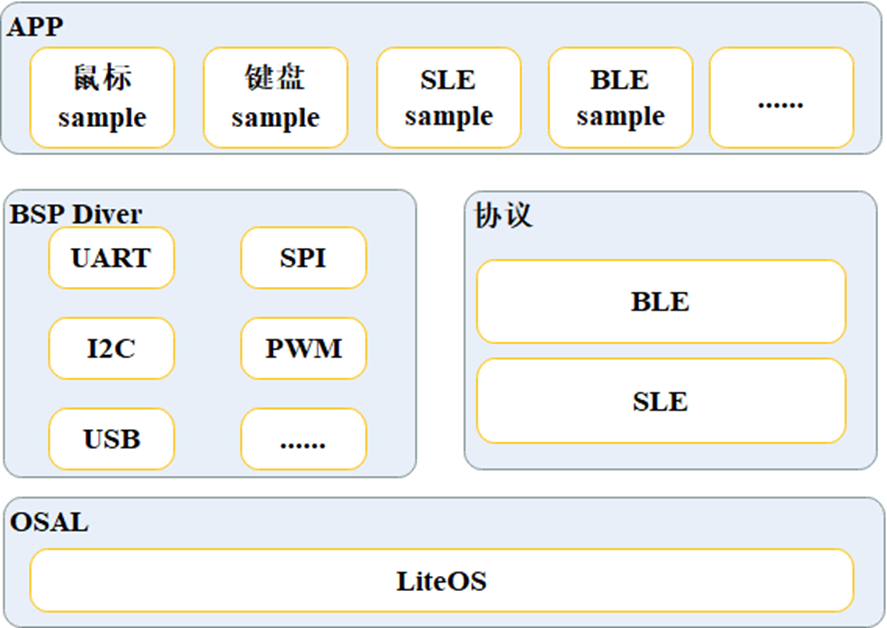

# 前言<a name="ZH-CN_TOPIC_0000001792814238"></a>

**概述<a name="section4537382116410"></a>**

介绍了BS2X SDK的模块框架及说明，帮助开发者快速上手BS2X的SDK开发。

**读者对象<a name="section4378592816410"></a>**

本文档主要适用于以下工程师：

-   技术支持工程师
-   软件开发工程师

**符号约定<a name="section133020216410"></a>**

在本文中可能出现下列标志，它们所代表的含义如下。

<a name="table2622507016410"></a>
<table><thead align="left"><tr id="row1530720816410"><th class="cellrowborder" valign="top" width="20.580000000000002%" id="mcps1.1.3.1.1"><p id="p6450074116410"><a name="p6450074116410"></a><a name="p6450074116410"></a><strong id="b2136615816410"><a name="b2136615816410"></a><a name="b2136615816410"></a>符号</strong></p>
</th>
<th class="cellrowborder" valign="top" width="79.42%" id="mcps1.1.3.1.2"><p id="p5435366816410"><a name="p5435366816410"></a><a name="p5435366816410"></a><strong id="b5941558116410"><a name="b5941558116410"></a><a name="b5941558116410"></a>说明</strong></p>
</th>
</tr>
</thead>
<tbody><tr id="row1372280416410"><td class="cellrowborder" valign="top" width="20.580000000000002%" headers="mcps1.1.3.1.1 "><p id="p3734547016410"><a name="p3734547016410"></a><a name="p3734547016410"></a><a name="image2670064316410"></a><a name="image2670064316410"></a><span></span></p>
</td>
<td class="cellrowborder" valign="top" width="79.42%" headers="mcps1.1.3.1.2 "><p id="p1757432116410"><a name="p1757432116410"></a><a name="p1757432116410"></a>表示如不避免则将会导致死亡或严重伤害的具有高等级风险的危害。</p>
</td>
</tr>
<tr id="row466863216410"><td class="cellrowborder" valign="top" width="20.580000000000002%" headers="mcps1.1.3.1.1 "><p id="p1432579516410"><a name="p1432579516410"></a><a name="p1432579516410"></a><a name="image4895582316410"></a><a name="image4895582316410"></a><span></span></p>
</td>
<td class="cellrowborder" valign="top" width="79.42%" headers="mcps1.1.3.1.2 "><p id="p959197916410"><a name="p959197916410"></a><a name="p959197916410"></a>表示如不避免则可能导致死亡或严重伤害的具有中等级风险的危害。</p>
</td>
</tr>
<tr id="row123863216410"><td class="cellrowborder" valign="top" width="20.580000000000002%" headers="mcps1.1.3.1.1 "><p id="p1232579516410"><a name="p1232579516410"></a><a name="p1232579516410"></a><a name="image1235582316410"></a><a name="image1235582316410"></a><span></span></p>
</td>
<td class="cellrowborder" valign="top" width="79.42%" headers="mcps1.1.3.1.2 "><p id="p123197916410"><a name="p123197916410"></a><a name="p123197916410"></a>表示如不避免则可能导致轻微或中度伤害的具有低等级风险的危害。</p>
</td>
</tr>
<tr id="row5786682116410"><td class="cellrowborder" valign="top" width="20.580000000000002%" headers="mcps1.1.3.1.1 "><p id="p2204984716410"><a name="p2204984716410"></a><a name="p2204984716410"></a><a name="image4504446716410"></a><a name="image4504446716410"></a><span></span></p>
</td>
<td class="cellrowborder" valign="top" width="79.42%" headers="mcps1.1.3.1.2 "><p id="p4388861916410"><a name="p4388861916410"></a><a name="p4388861916410"></a>用于传递设备或环境安全警示信息。如不避免则可能会导致设备损坏、数据丢失、设备性能降低或其它不可预知的结果。</p>
<p id="p1238861916410"><a name="p1238861916410"></a><a name="p1238861916410"></a>“须知”不涉及人身伤害。</p>
</td>
</tr>
<tr id="row2856923116410"><td class="cellrowborder" valign="top" width="20.580000000000002%" headers="mcps1.1.3.1.1 "><p id="p5555360116410"><a name="p5555360116410"></a><a name="p5555360116410"></a><a name="image799324016410"></a><a name="image799324016410"></a><span></span></p>
</td>
<td class="cellrowborder" valign="top" width="79.42%" headers="mcps1.1.3.1.2 "><p id="p4612588116410"><a name="p4612588116410"></a><a name="p4612588116410"></a>对正文中重点信息的补充说明。</p>
<p id="p1232588116410"><a name="p1232588116410"></a><a name="p1232588116410"></a>“说明”不是安全警示信息，不涉及人身、设备及环境伤害信息。</p>
</td>
</tr>
</tbody>
</table>

**修改记录<a name="section2467512116410"></a>**

<a name="table1557726816410"></a>
<table><thead align="left"><tr id="row2942532716410"><th class="cellrowborder" valign="top" width="20.72%" id="mcps1.1.4.1.1"><p id="p3778275416410"><a name="p3778275416410"></a><a name="p3778275416410"></a><strong id="b5687322716410"><a name="b5687322716410"></a><a name="b5687322716410"></a>文档版本</strong></p>
</th>
<th class="cellrowborder" valign="top" width="26.119999999999997%" id="mcps1.1.4.1.2"><p id="p5627845516410"><a name="p5627845516410"></a><a name="p5627845516410"></a><strong id="b5800814916410"><a name="b5800814916410"></a><a name="b5800814916410"></a>发布日期</strong></p>
</th>
<th class="cellrowborder" valign="top" width="53.16%" id="mcps1.1.4.1.3"><p id="p2382284816410"><a name="p2382284816410"></a><a name="p2382284816410"></a><strong id="b3316380216410"><a name="b3316380216410"></a><a name="b3316380216410"></a>修改说明</strong></p>
</th>
</tr>
</thead>
<tbody><tr id="row1666815111904"><td class="cellrowborder" valign="top" width="20.72%" headers="mcps1.1.4.1.1 "><p id="p136685111105"><a name="p136685111105"></a><a name="p136685111105"></a>02</p>
</td>
<td class="cellrowborder" valign="top" width="26.119999999999997%" headers="mcps1.1.4.1.2 "><p id="p766819111906"><a name="p766819111906"></a><a name="p766819111906"></a>2024-07-04</p>
</td>
<td class="cellrowborder" valign="top" width="53.16%" headers="mcps1.1.4.1.3 "><p id="p11668311709"><a name="p11668311709"></a><a name="p11668311709"></a>更新“<a href="SDK目录结构.md">SDK目录结构</a>”章节内容。</p>
</td>
</tr>
<tr id="row203391438433"><td class="cellrowborder" valign="top" width="20.72%" headers="mcps1.1.4.1.1 "><p id="p0413131712"><a name="p0413131712"></a><a name="p0413131712"></a>01</p>
</td>
<td class="cellrowborder" valign="top" width="26.119999999999997%" headers="mcps1.1.4.1.2 "><p id="p184131311111"><a name="p184131311111"></a><a name="p184131311111"></a>2024-05-15</p>
</td>
<td class="cellrowborder" valign="top" width="53.16%" headers="mcps1.1.4.1.3 "><p id="p169114261115"><a name="p169114261115"></a><a name="p169114261115"></a>第一次正式版本发布。</p>
</td>
</tr>
<tr id="row17996105212588"><td class="cellrowborder" valign="top" width="20.72%" headers="mcps1.1.4.1.1 "><p id="p18996155235814"><a name="p18996155235814"></a><a name="p18996155235814"></a>00B01</p>
</td>
<td class="cellrowborder" valign="top" width="26.119999999999997%" headers="mcps1.1.4.1.2 "><p id="p139961152185813"><a name="p139961152185813"></a><a name="p139961152185813"></a>2024-02-01</p>
</td>
<td class="cellrowborder" valign="top" width="53.16%" headers="mcps1.1.4.1.3 "><p id="p42230125912"><a name="p42230125912"></a><a name="p42230125912"></a>第一次临时版本发布。</p>
</td>
</tr>
</tbody>
</table>

# SDK模块框架<a name="ZH-CN_TOPIC_0000001811411477"></a>

**图 1**  BS2X解决方案整体架构<a name="fig896115412362"></a>  


**表 1**  SDK根目录

<a name="table1762510212343"></a>
<table><thead align="left"><tr id="row136443213343"><th class="cellrowborder" valign="top" width="13.19%" id="mcps1.2.4.1.1"><p id="p164417273414"><a name="p164417273414"></a><a name="p164417273414"></a>序号</p>
</th>
<th class="cellrowborder" valign="top" width="26.91%" id="mcps1.2.4.1.2"><p id="p16644172153417"><a name="p16644172153417"></a><a name="p16644172153417"></a>模块名</p>
</th>
<th class="cellrowborder" valign="top" width="59.9%" id="mcps1.2.4.1.3"><p id="p164413220347"><a name="p164413220347"></a><a name="p164413220347"></a>功能介绍</p>
</th>
</tr>
</thead>
<tbody><tr id="row1864412173411"><td class="cellrowborder" valign="top" width="13.19%" headers="mcps1.2.4.1.1 "><p id="p064511216343"><a name="p064511216343"></a><a name="p064511216343"></a>1</p>
</td>
<td class="cellrowborder" valign="top" width="26.91%" headers="mcps1.2.4.1.2 "><p id="p4784453144718"><a name="p4784453144718"></a><a name="p4784453144718"></a><span>application</span></p>
</td>
<td class="cellrowborder" valign="top" width="59.9%" headers="mcps1.2.4.1.3 "><p id="p578420539476"><a name="p578420539476"></a><a name="p578420539476"></a><span>应用目录，支持用户在此目录下增量开发上层系统内容以及应用内容。全系统启动的代码也在此目录下。系统启动入口为</span><span>main.c</span><span>中的</span><span>main</span><span>函数</span></p>
</td>
</tr>
<tr id="row96455273412"><td class="cellrowborder" valign="top" width="13.19%" headers="mcps1.2.4.1.1 "><p id="p176451263416"><a name="p176451263416"></a><a name="p176451263416"></a>2</p>
</td>
<td class="cellrowborder" valign="top" width="26.91%" headers="mcps1.2.4.1.2 "><p id="p19784853174713"><a name="p19784853174713"></a><a name="p19784853174713"></a><span>build</span></p>
</td>
<td class="cellrowborder" valign="top" width="59.9%" headers="mcps1.2.4.1.3 "><p id="p17784953144710"><a name="p17784953144710"></a><a name="p17784953144710"></a><span>编译构建工程代码，包括特性宏添加、打开</span><span>/</span><span>关闭等操作均在此目录中完成</span></p>
</td>
</tr>
<tr id="row1264515213417"><td class="cellrowborder" valign="top" width="13.19%" headers="mcps1.2.4.1.1 "><p id="p864510223413"><a name="p864510223413"></a><a name="p864510223413"></a>3</p>
</td>
<td class="cellrowborder" valign="top" width="26.91%" headers="mcps1.2.4.1.2 "><p id="p87852537472"><a name="p87852537472"></a><a name="p87852537472"></a><span>drivers</span></p>
</td>
<td class="cellrowborder" valign="top" width="59.9%" headers="mcps1.2.4.1.3 "><p id="p1978517536474"><a name="p1978517536474"></a><a name="p1978517536474"></a><span>外设驱动源代码</span></p>
</td>
</tr>
<tr id="row0668557184618"><td class="cellrowborder" valign="top" width="13.19%" headers="mcps1.2.4.1.1 "><p id="p20668757184615"><a name="p20668757184615"></a><a name="p20668757184615"></a>4</p>
</td>
<td class="cellrowborder" valign="top" width="26.91%" headers="mcps1.2.4.1.2 "><p id="p0785753164716"><a name="p0785753164716"></a><a name="p0785753164716"></a><span>include</span></p>
</td>
<td class="cellrowborder" valign="top" width="59.9%" headers="mcps1.2.4.1.3 "><p id="p77858538478"><a name="p77858538478"></a><a name="p77858538478"></a><span>公共头文件，</span><span>SDK</span><span>所有的对外接口都会放到文件夹下供客户调用</span></p>
</td>
</tr>
<tr id="row410316414476"><td class="cellrowborder" valign="top" width="13.19%" headers="mcps1.2.4.1.1 "><p id="p161032414714"><a name="p161032414714"></a><a name="p161032414714"></a>5</p>
</td>
<td class="cellrowborder" valign="top" width="26.91%" headers="mcps1.2.4.1.2 "><p id="p378545314717"><a name="p378545314717"></a><a name="p378545314717"></a><span>interim_binary</span></p>
</td>
<td class="cellrowborder" valign="top" width="59.9%" headers="mcps1.2.4.1.3 "><p id="p197857534470"><a name="p197857534470"></a><a name="p197857534470"></a><span>软件库，二进制文件存放目录，</span><span>bt</span><span>核的</span><span>bin</span><span>文件存放于此目录下</span></p>
</td>
</tr>
<tr id="row888113894713"><td class="cellrowborder" valign="top" width="13.19%" headers="mcps1.2.4.1.1 "><p id="p1888188104718"><a name="p1888188104718"></a><a name="p1888188104718"></a>6</p>
</td>
<td class="cellrowborder" valign="top" width="26.91%" headers="mcps1.2.4.1.2 "><p id="p18785115354712"><a name="p18785115354712"></a><a name="p18785115354712"></a><span>kernel</span></p>
</td>
<td class="cellrowborder" valign="top" width="59.9%" headers="mcps1.2.4.1.3 "><p id="p07856533474"><a name="p07856533474"></a><a name="p07856533474"></a><span>操作系统以及操作系统功能封装代码，包括</span><span>liteOS</span><span>、</span><span>non_os</span><span>(</span><span>支持无操作系统场景</span><span>)</span><span>、</span><span>osal</span><span>适配其它操作系统的接口</span></p>
</td>
</tr>
<tr id="row1688118874715"><td class="cellrowborder" valign="top" width="13.19%" headers="mcps1.2.4.1.1 "><p id="p9881178184715"><a name="p9881178184715"></a><a name="p9881178184715"></a>7</p>
</td>
<td class="cellrowborder" valign="top" width="26.91%" headers="mcps1.2.4.1.2 "><p id="p37857531475"><a name="p37857531475"></a><a name="p37857531475"></a><span>middleware</span></p>
</td>
<td class="cellrowborder" valign="top" width="59.9%" headers="mcps1.2.4.1.3 "><p id="p11785165314711"><a name="p11785165314711"></a><a name="p11785165314711"></a><span>中间件代码，提供系统框架代码、</span><span>dfx</span><span>调试相关代码、</span><span>nv</span><span>项、</span><span>ota</span><span>等功能代码</span></p>
</td>
</tr>
<tr id="row4947314114715"><td class="cellrowborder" valign="top" width="13.19%" headers="mcps1.2.4.1.1 "><p id="p1094771484710"><a name="p1094771484710"></a><a name="p1094771484710"></a>8</p>
</td>
<td class="cellrowborder" valign="top" width="26.91%" headers="mcps1.2.4.1.2 "><p id="p12785145314476"><a name="p12785145314476"></a><a name="p12785145314476"></a><span>open_source</span></p>
</td>
<td class="cellrowborder" valign="top" width="59.9%" headers="mcps1.2.4.1.3 "><p id="p1578511537471"><a name="p1578511537471"></a><a name="p1578511537471"></a><span>开源第三方组件代码</span></p>
</td>
</tr>
<tr id="row894714149472"><td class="cellrowborder" valign="top" width="13.19%" headers="mcps1.2.4.1.1 "><p id="p10947191410471"><a name="p10947191410471"></a><a name="p10947191410471"></a>9</p>
</td>
<td class="cellrowborder" valign="top" width="26.91%" headers="mcps1.2.4.1.2 "><p id="p16785953154719"><a name="p16785953154719"></a><a name="p16785953154719"></a><span>output</span></p>
</td>
<td class="cellrowborder" valign="top" width="59.9%" headers="mcps1.2.4.1.3 "><p id="p1778565314473"><a name="p1778565314473"></a><a name="p1778565314473"></a><span>编译生成的文件，编译过程中生成，初始</span><span>SDK</span><span>包没有此文件夹</span></p>
</td>
</tr>
<tr id="row1994701410472"><td class="cellrowborder" valign="top" width="13.19%" headers="mcps1.2.4.1.1 "><p id="p394731412472"><a name="p394731412472"></a><a name="p394731412472"></a>10</p>
</td>
<td class="cellrowborder" valign="top" width="26.91%" headers="mcps1.2.4.1.2 "><p id="p18785653204713"><a name="p18785653204713"></a><a name="p18785653204713"></a><span>protocol</span></p>
</td>
<td class="cellrowborder" valign="top" width="59.9%" headers="mcps1.2.4.1.3 "><p id="p97851453174712"><a name="p97851453174712"></a><a name="p97851453174712"></a><span>BLE/SLE</span><span>协议栈库文件</span></p>
</td>
</tr>
<tr id="row694717146472"><td class="cellrowborder" valign="top" width="13.19%" headers="mcps1.2.4.1.1 "><p id="p994741434715"><a name="p994741434715"></a><a name="p994741434715"></a>11</p>
</td>
<td class="cellrowborder" valign="top" width="26.91%" headers="mcps1.2.4.1.2 "><p id="p1378525314720"><a name="p1378525314720"></a><a name="p1378525314720"></a><span>test</span></p>
</td>
<td class="cellrowborder" valign="top" width="59.9%" headers="mcps1.2.4.1.3 "><p id="p3785195394714"><a name="p3785195394714"></a><a name="p3785195394714"></a><span>测试代码，提供客户应用开发参考，通过命令调用启动</span><span>test</span><span>代码用例的执行</span></p>
</td>
</tr>
<tr id="row101018299473"><td class="cellrowborder" valign="top" width="13.19%" headers="mcps1.2.4.1.1 "><p id="p31013291476"><a name="p31013291476"></a><a name="p31013291476"></a>12</p>
</td>
<td class="cellrowborder" valign="top" width="26.91%" headers="mcps1.2.4.1.2 "><p id="p57861653144719"><a name="p57861653144719"></a><a name="p57861653144719"></a><span>tools</span></p>
</td>
<td class="cellrowborder" valign="top" width="59.9%" headers="mcps1.2.4.1.3 "><p id="p197861536471"><a name="p197861536471"></a><a name="p197861536471"></a><span>工具目录，</span><span>IDE</span><span>工具编译完成后，会将镜像文件打包，打包文件存放于此目录下</span></p>
</td>
</tr>
<tr id="row151012296470"><td class="cellrowborder" valign="top" width="13.19%" headers="mcps1.2.4.1.1 "><p id="p41011429134714"><a name="p41011429134714"></a><a name="p41011429134714"></a>13</p>
</td>
<td class="cellrowborder" valign="top" width="26.91%" headers="mcps1.2.4.1.2 "><p id="p157861353134718"><a name="p157861353134718"></a><a name="p157861353134718"></a><span>build.py</span></p>
</td>
<td class="cellrowborder" valign="top" width="59.9%" headers="mcps1.2.4.1.3 "><p id="p1978645320471"><a name="p1978645320471"></a><a name="p1978645320471"></a><span>编译脚本</span></p>
</td>
</tr>
</tbody>
</table>

# SDK目录结构<a name="ZH-CN_TOPIC_0000001764412052"></a>

```
.                                # [仓] root_dir仓
├── application               # 应用层，以下为举例
│   ├── bs20                 # [仓] bs20应用
│   ├── bs21                 # [仓] bs21应用
│   ├── bs21a                # [仓] bs21a应用
│   ├── bs22                 # [仓] bs22应用
│   ├── bs26                 # [仓] bs26应用
│   └── sample               # [仓] 样例工程
├── bootloader                # 启动代码
│   ├── flashboot            # [仓] ssb/reeboot，如有teeboot新增目录
│   └── provision            # [仓] 与hiburn&bootrom配合生产、烧写用，类似codeloader；从客户端加载、运行在ram中
├── build
├── docs
├── drivers
│   ├── boards               # 板级配置
│   ├── chips                # 芯片级配置，用户可以根据实际情况，做差异性修改
│   └── drivers              # 驱动代码
│       ├── driver           # 驱动对外接口层
│       ├── hal              # HAL层，寄存器操作
├── include                   # [仓] 公共头文件
├── kernel                    # 内核代码，包括nonos、osal；cmsis包含在内核代码中
│   ├── liteos               # [仓] liteos
│   │  └── liteos_208.6.0   # [仓] liteos 208
│   └── osal                 # [仓] osal目录
│       ├── include          # [仓] osal头文件
│       └── src              # osal源文件
├── middleware                # 框架、服务等中间件
│   ├── chips                # 中间层芯片定制代码
│   ├── services             # HLD组件
│   └── utils                # LLD组件
├── open_source               # 物联协议都是开源软件，放在open_source目录，映射中心仓
├── protocol                  # 联接协议目录，CFBB无实体仓
│   ├── bt
├── tools                     # 工具代码仓，由工具团队维护
└── vendor                    # 第三方供应商提供的软件
└── segger                    # [仓] segger代码仓
```

# SDK目录说明<a name="ZH-CN_TOPIC_0000001811292377"></a>

**表 1**  afe实例

<a name="table1949916329393"></a>
<table><thead align="left"><tr id="row205171832183917"><th class="cellrowborder" valign="top" width="9.030000000000001%" id="mcps1.2.5.1.1"><p id="p1451703263914"><a name="p1451703263914"></a><a name="p1451703263914"></a>序号</p>
</th>
<th class="cellrowborder" valign="top" width="20.66%" id="mcps1.2.5.1.2"><p id="p16517113219394"><a name="p16517113219394"></a><a name="p16517113219394"></a>模块名</p>
</th>
<th class="cellrowborder" valign="top" width="25.040000000000003%" id="mcps1.2.5.1.3"><p id="p17517193214395"><a name="p17517193214395"></a><a name="p17517193214395"></a>文件名</p>
</th>
<th class="cellrowborder" valign="top" width="45.269999999999996%" id="mcps1.2.5.1.4"><p id="p1451813325393"><a name="p1451813325393"></a><a name="p1451813325393"></a>功能介绍</p>
</th>
</tr>
</thead>
<tbody><tr id="row251843215397"><td class="cellrowborder" valign="top" width="9.030000000000001%" headers="mcps1.2.5.1.1 "><p id="p951816324399"><a name="p951816324399"></a><a name="p951816324399"></a>1</p>
</td>
<td class="cellrowborder" valign="top" width="20.66%" headers="mcps1.2.5.1.2 "><p id="p162484237586"><a name="p162484237586"></a><a name="p162484237586"></a>Kconfig</p>
</td>
<td class="cellrowborder" valign="top" width="25.040000000000003%" headers="mcps1.2.5.1.3 "><p id="p836118718577"><a name="p836118718577"></a><a name="p836118718577"></a>Kconfig</p>
</td>
<td class="cellrowborder" valign="top" width="45.269999999999996%" headers="mcps1.2.5.1.4 "><p id="p17518332183916"><a name="p17518332183916"></a><a name="p17518332183916"></a>afe_sample相关配置</p>
</td>
</tr>
<tr id="row45181832163916"><td class="cellrowborder" valign="top" width="9.030000000000001%" headers="mcps1.2.5.1.1 "><p id="p145181032193914"><a name="p145181032193914"></a><a name="p145181032193914"></a>2</p>
</td>
<td class="cellrowborder" valign="top" width="20.66%" headers="mcps1.2.5.1.2 "><p id="p1265504411576"><a name="p1265504411576"></a><a name="p1265504411576"></a>afe_demo.c</p>
</td>
<td class="cellrowborder" valign="top" width="25.040000000000003%" headers="mcps1.2.5.1.3 "><p id="p16896144425819"><a name="p16896144425819"></a><a name="p16896144425819"></a>afe_demo.c</p>
</td>
<td class="cellrowborder" valign="top" width="45.269999999999996%" headers="mcps1.2.5.1.4 "><p id="p351813233913"><a name="p351813233913"></a><a name="p351813233913"></a>afe相关实例代码，提供afe采集功能</p>
</td>
</tr>
<tr id="row125180329393"><td class="cellrowborder" valign="top" width="9.030000000000001%" headers="mcps1.2.5.1.1 "><p id="p1518332193916"><a name="p1518332193916"></a><a name="p1518332193916"></a>3</p>
</td>
<td class="cellrowborder" valign="top" width="20.66%" headers="mcps1.2.5.1.2 "><p id="p5518183263914"><a name="p5518183263914"></a><a name="p5518183263914"></a>afe.code-workspace</p>
</td>
<td class="cellrowborder" valign="top" width="25.040000000000003%" headers="mcps1.2.5.1.3 "><p id="p65183323396"><a name="p65183323396"></a><a name="p65183323396"></a>afe.code-workspace</p>
</td>
<td class="cellrowborder" valign="top" width="45.269999999999996%" headers="mcps1.2.5.1.4 "><p id="p115189329397"><a name="p115189329397"></a><a name="p115189329397"></a>vscode工程配置，用户不需要修改</p>
</td>
</tr>
<tr id="row1073104415532"><td class="cellrowborder" valign="top" width="9.030000000000001%" headers="mcps1.2.5.1.1 "><p id="p6731244115314"><a name="p6731244115314"></a><a name="p6731244115314"></a>4</p>
</td>
<td class="cellrowborder" valign="top" width="20.66%" headers="mcps1.2.5.1.2 "><p id="p157321442530"><a name="p157321442530"></a><a name="p157321442530"></a>编译脚本</p>
</td>
<td class="cellrowborder" valign="top" width="25.040000000000003%" headers="mcps1.2.5.1.3 "><p id="p197321344125311"><a name="p197321344125311"></a><a name="p197321344125311"></a>CMakeLists.txt</p>
</td>
<td class="cellrowborder" valign="top" width="45.269999999999996%" headers="mcps1.2.5.1.4 "><p id="p10732194415536"><a name="p10732194415536"></a><a name="p10732194415536"></a>afe相关编译脚本</p>
</td>
</tr>
</tbody>
</table>

