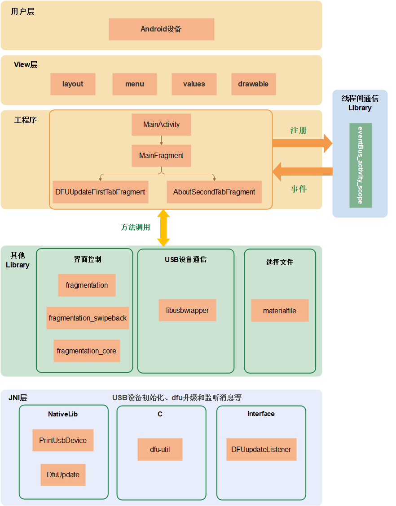
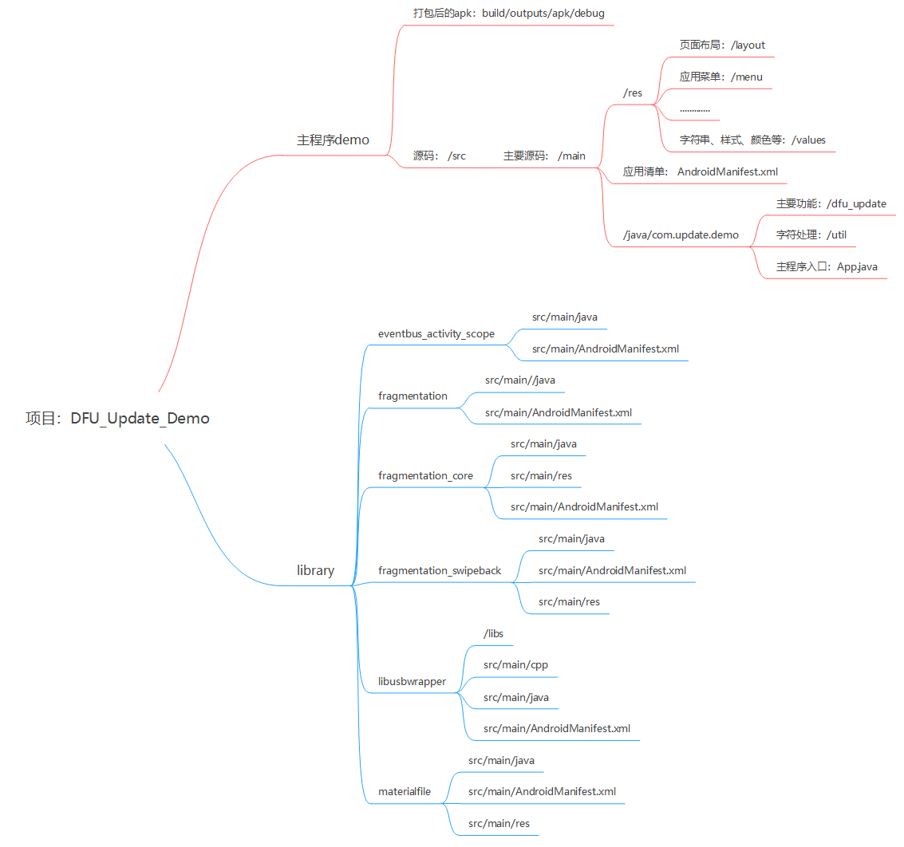

# 前言<a name="ZH-CN_TOPIC_0000001942862112"></a>

本文档主要介绍DFU升级APK开发实现的相关内容，主要包括APK工程的系统框架、界面实现和主要功能实现的方法。

**产品版本<a name="section27775771"></a>**

与本文档相对应的产品版本如下。

<a name="table52250146"></a>
<table><thead align="left"><tr id="row55967882"><th class="cellrowborder" valign="top" width="39.39%" id="mcps1.1.3.1.1"><p id="p37104584"><a name="p37104584"></a><a name="p37104584"></a><strong id="b48174912328"><a name="b48174912328"></a><a name="b48174912328"></a>产品名称</strong></p>
</th>
<th class="cellrowborder" valign="top" width="60.61%" id="mcps1.1.3.1.2"><p id="p52681331"><a name="p52681331"></a><a name="p52681331"></a><strong id="b682239163211"><a name="b682239163211"></a><a name="b682239163211"></a>产品版本</strong></p>
</th>
</tr>
</thead>
<tbody><tr id="row39329394"><td class="cellrowborder" valign="top" width="39.39%" headers="mcps1.1.3.1.1 "><p id="p31080012"><a name="p31080012"></a><a name="p31080012"></a>BS2X</p>
</td>
<td class="cellrowborder" valign="top" width="60.61%" headers="mcps1.1.3.1.2 "><p id="p34453054"><a name="p34453054"></a><a name="p34453054"></a>V100</p>
</td>
</tr>
</tbody>
</table>

**读者对象<a name="section4378592816410"></a>**

本文档主要适用于以下工程师：

-   技术支持工程师
-   软件工程师

**符号约定<a name="section133020216410"></a>**

在本文中可能出现下列标志，它们所代表的含义如下。

<a name="table2622507016410"></a>
<table><thead align="left"><tr id="row1530720816410"><th class="cellrowborder" valign="top" width="20.580000000000002%" id="mcps1.1.3.1.1"><p id="p6450074116410"><a name="p6450074116410"></a><a name="p6450074116410"></a><strong id="b2136615816410"><a name="b2136615816410"></a><a name="b2136615816410"></a>符号</strong></p>
</th>
<th class="cellrowborder" valign="top" width="79.42%" id="mcps1.1.3.1.2"><p id="p5435366816410"><a name="p5435366816410"></a><a name="p5435366816410"></a><strong id="b5941558116410"><a name="b5941558116410"></a><a name="b5941558116410"></a>说明</strong></p>
</th>
</tr>
</thead>
<tbody><tr id="row1372280416410"><td class="cellrowborder" valign="top" width="20.580000000000002%" headers="mcps1.1.3.1.1 "><p id="p3734547016410"><a name="p3734547016410"></a><a name="p3734547016410"></a><a name="image2670064316410"></a><a name="image2670064316410"></a><span></span></p>
</td>
<td class="cellrowborder" valign="top" width="79.42%" headers="mcps1.1.3.1.2 "><p id="p1757432116410"><a name="p1757432116410"></a><a name="p1757432116410"></a>表示如不避免则将会导致死亡或严重伤害的具有高等级风险的危害。</p>
</td>
</tr>
<tr id="row466863216410"><td class="cellrowborder" valign="top" width="20.580000000000002%" headers="mcps1.1.3.1.1 "><p id="p1432579516410"><a name="p1432579516410"></a><a name="p1432579516410"></a><a name="image4895582316410"></a><a name="image4895582316410"></a><span></span></p>
</td>
<td class="cellrowborder" valign="top" width="79.42%" headers="mcps1.1.3.1.2 "><p id="p959197916410"><a name="p959197916410"></a><a name="p959197916410"></a>表示如不避免则可能导致死亡或严重伤害的具有中等级风险的危害。</p>
</td>
</tr>
<tr id="row123863216410"><td class="cellrowborder" valign="top" width="20.580000000000002%" headers="mcps1.1.3.1.1 "><p id="p1232579516410"><a name="p1232579516410"></a><a name="p1232579516410"></a><a name="image1235582316410"></a><a name="image1235582316410"></a><span></span></p>
</td>
<td class="cellrowborder" valign="top" width="79.42%" headers="mcps1.1.3.1.2 "><p id="p123197916410"><a name="p123197916410"></a><a name="p123197916410"></a>表示如不避免则可能导致轻微或中度伤害的具有低等级风险的危害。</p>
</td>
</tr>
<tr id="row5786682116410"><td class="cellrowborder" valign="top" width="20.580000000000002%" headers="mcps1.1.3.1.1 "><p id="p2204984716410"><a name="p2204984716410"></a><a name="p2204984716410"></a><a name="image4504446716410"></a><a name="image4504446716410"></a><span></span></p>
</td>
<td class="cellrowborder" valign="top" width="79.42%" headers="mcps1.1.3.1.2 "><p id="p4388861916410"><a name="p4388861916410"></a><a name="p4388861916410"></a>用于传递设备或环境安全警示信息。如不避免则可能会导致设备损坏、数据丢失、设备性能降低或其它不可预知的结果。</p>
<p id="p1238861916410"><a name="p1238861916410"></a><a name="p1238861916410"></a>“须知”不涉及人身伤害。</p>
</td>
</tr>
<tr id="row2856923116410"><td class="cellrowborder" valign="top" width="20.580000000000002%" headers="mcps1.1.3.1.1 "><p id="p5555360116410"><a name="p5555360116410"></a><a name="p5555360116410"></a><a name="image799324016410"></a><a name="image799324016410"></a><span></span></p>
</td>
<td class="cellrowborder" valign="top" width="79.42%" headers="mcps1.1.3.1.2 "><p id="p4612588116410"><a name="p4612588116410"></a><a name="p4612588116410"></a>对正文中重点信息的补充说明。</p>
<p id="p1232588116410"><a name="p1232588116410"></a><a name="p1232588116410"></a>“说明”不是安全警示信息，不涉及人身、设备及环境伤害信息。</p>
</td>
</tr>
</tbody>
</table>

**修改记录<a name="section2467512116410"></a>**

<a name="table1557726816410"></a>
<table><thead align="left"><tr id="row2942532716410"><th class="cellrowborder" valign="top" width="19.009999999999998%" id="mcps1.1.4.1.1"><p id="p3778275416410"><a name="p3778275416410"></a><a name="p3778275416410"></a><strong id="b5687322716410"><a name="b5687322716410"></a><a name="b5687322716410"></a>文档版本</strong></p>
</th>
<th class="cellrowborder" valign="top" width="25.629999999999995%" id="mcps1.1.4.1.2"><p id="p5627845516410"><a name="p5627845516410"></a><a name="p5627845516410"></a><strong id="b5800814916410"><a name="b5800814916410"></a><a name="b5800814916410"></a>发布日期</strong></p>
</th>
<th class="cellrowborder" valign="top" width="55.36%" id="mcps1.1.4.1.3"><p id="p2382284816410"><a name="p2382284816410"></a><a name="p2382284816410"></a><strong id="b3316380216410"><a name="b3316380216410"></a><a name="b3316380216410"></a>修改说明</strong></p>
</th>
</tr>
</thead>
<tbody><tr id="row15142143811166"><td class="cellrowborder" valign="top" width="19.009999999999998%" headers="mcps1.1.4.1.1 "><p id="p182910614321"><a name="p182910614321"></a><a name="p182910614321"></a>01</p>
</td>
<td class="cellrowborder" valign="top" width="25.629999999999995%" headers="mcps1.1.4.1.2 "><p id="p52917613321"><a name="p52917613321"></a><a name="p52917613321"></a>2024-07-04</p>
</td>
<td class="cellrowborder" valign="top" width="55.36%" headers="mcps1.1.4.1.3 "><p id="p1290663212"><a name="p1290663212"></a><a name="p1290663212"></a>第一次正式版本发布。</p>
</td>
</tr>
</tbody>
</table>

# 功能特性<a name="ZH-CN_TOPIC_0000001956125929"></a>

此APK主要功能包括：获取和展示连接的USB设备的信息，与USB设备通信，选择升级文件，USB设备初始化和DFU升级功能。


## 展示连接USB设备的信息<a name="ZH-CN_TOPIC_0000001956603777"></a>

界面中展示的设备信息包括：

-   Device Path：The path of the device file for the device in the usbfs file system.
-   Device Class：The device's class field.
-   Vendor ID：The vendor ID for the device.
-   Vendor Name：The manufacturer name of the device.
-   Product ID：The product ID for the device.
-   Product Name：The product name of the device.
-   Interface ID：The interface's bInterfaceNumber field.

## 与USB设备通信<a name="ZH-CN_TOPIC_0000001956443977"></a>

与USB设备建立连接并通信，会有不同的状态，体现通信的成功与否，主要包括9中状态，如[表1](#table532084312568)所示。

**表 1**  状态码

<a name="table532084312568"></a>
<table><thead align="left"><tr id="row132074335613"><th class="cellrowborder" valign="top" width="25.192519251925187%" id="mcps1.2.4.1.1"><p id="p113209435561"><a name="p113209435561"></a><a name="p113209435561"></a>序号</p>
</th>
<th class="cellrowborder" valign="top" width="30.573057305730572%" id="mcps1.2.4.1.2"><p id="p93201433566"><a name="p93201433566"></a><a name="p93201433566"></a>状态码（自定义）</p>
</th>
<th class="cellrowborder" valign="top" width="44.23442344234424%" id="mcps1.2.4.1.3"><p id="p183201743205615"><a name="p183201743205615"></a><a name="p183201743205615"></a>描述</p>
</th>
</tr>
</thead>
<tbody><tr id="row13207435563"><td class="cellrowborder" valign="top" width="25.192519251925187%" headers="mcps1.2.4.1.1 "><p id="p173204435561"><a name="p173204435561"></a><a name="p173204435561"></a>1</p>
</td>
<td class="cellrowborder" valign="top" width="30.573057305730572%" headers="mcps1.2.4.1.2 "><p id="p1232019434564"><a name="p1232019434564"></a><a name="p1232019434564"></a>10000</p>
</td>
<td class="cellrowborder" valign="top" width="44.23442344234424%" headers="mcps1.2.4.1.3 "><p id="p832064316566"><a name="p832064316566"></a><a name="p832064316566"></a>USB正常打开</p>
</td>
</tr>
<tr id="row132018430567"><td class="cellrowborder" valign="top" width="25.192519251925187%" headers="mcps1.2.4.1.1 "><p id="p5320184316562"><a name="p5320184316562"></a><a name="p5320184316562"></a>2</p>
</td>
<td class="cellrowborder" valign="top" width="30.573057305730572%" headers="mcps1.2.4.1.2 "><p id="p14320204335617"><a name="p14320204335617"></a><a name="p14320204335617"></a>10001</p>
</td>
<td class="cellrowborder" valign="top" width="44.23442344234424%" headers="mcps1.2.4.1.3 "><p id="p2320114335619"><a name="p2320114335619"></a><a name="p2320114335619"></a>USB授权成功</p>
</td>
</tr>
<tr id="row332004311564"><td class="cellrowborder" valign="top" width="25.192519251925187%" headers="mcps1.2.4.1.1 "><p id="p143201243115611"><a name="p143201243115611"></a><a name="p143201243115611"></a>3</p>
</td>
<td class="cellrowborder" valign="top" width="30.573057305730572%" headers="mcps1.2.4.1.2 "><p id="p1332064319565"><a name="p1332064319565"></a><a name="p1332064319565"></a>10002</p>
</td>
<td class="cellrowborder" valign="top" width="44.23442344234424%" headers="mcps1.2.4.1.3 "><p id="p03208430567"><a name="p03208430567"></a><a name="p03208430567"></a>USB授权失败</p>
</td>
</tr>
<tr id="row1732074385611"><td class="cellrowborder" valign="top" width="25.192519251925187%" headers="mcps1.2.4.1.1 "><p id="p532113434568"><a name="p532113434568"></a><a name="p532113434568"></a>4</p>
</td>
<td class="cellrowborder" valign="top" width="30.573057305730572%" headers="mcps1.2.4.1.2 "><p id="p183211043145612"><a name="p183211043145612"></a><a name="p183211043145612"></a>10003</p>
</td>
<td class="cellrowborder" valign="top" width="44.23442344234424%" headers="mcps1.2.4.1.3 "><p id="p4321184320563"><a name="p4321184320563"></a><a name="p4321184320563"></a>没有找到指定设备</p>
</td>
</tr>
<tr id="row832144305614"><td class="cellrowborder" valign="top" width="25.192519251925187%" headers="mcps1.2.4.1.1 "><p id="p1132114375616"><a name="p1132114375616"></a><a name="p1132114375616"></a>5</p>
</td>
<td class="cellrowborder" valign="top" width="30.573057305730572%" headers="mcps1.2.4.1.2 "><p id="p63211143135616"><a name="p63211143135616"></a><a name="p63211143135616"></a>10004</p>
</td>
<td class="cellrowborder" valign="top" width="44.23442344234424%" headers="mcps1.2.4.1.3 "><p id="p93211743175615"><a name="p93211743175615"></a><a name="p93211743175615"></a>没有找到任何设备</p>
</td>
</tr>
<tr id="row73217434563"><td class="cellrowborder" valign="top" width="25.192519251925187%" headers="mcps1.2.4.1.1 "><p id="p17321104320563"><a name="p17321104320563"></a><a name="p17321104320563"></a>6</p>
</td>
<td class="cellrowborder" valign="top" width="30.573057305730572%" headers="mcps1.2.4.1.2 "><p id="p83216436564"><a name="p83216436564"></a><a name="p83216436564"></a>10005</p>
</td>
<td class="cellrowborder" valign="top" width="44.23442344234424%" headers="mcps1.2.4.1.3 "><p id="p173212434569"><a name="p173212434569"></a><a name="p173212434569"></a>USB设备打开失败</p>
</td>
</tr>
<tr id="row1321164325615"><td class="cellrowborder" valign="top" width="25.192519251925187%" headers="mcps1.2.4.1.1 "><p id="p6321134320563"><a name="p6321134320563"></a><a name="p6321134320563"></a>7</p>
</td>
<td class="cellrowborder" valign="top" width="30.573057305730572%" headers="mcps1.2.4.1.2 "><p id="p23211543175612"><a name="p23211543175612"></a><a name="p23211543175612"></a>10006</p>
</td>
<td class="cellrowborder" valign="top" width="44.23442344234424%" headers="mcps1.2.4.1.3 "><p id="p632115431567"><a name="p632115431567"></a><a name="p632115431567"></a>USB通道打开失败</p>
</td>
</tr>
<tr id="row63211843185612"><td class="cellrowborder" valign="top" width="25.192519251925187%" headers="mcps1.2.4.1.1 "><p id="p10321194315566"><a name="p10321194315566"></a><a name="p10321194315566"></a>8</p>
</td>
<td class="cellrowborder" valign="top" width="30.573057305730572%" headers="mcps1.2.4.1.2 "><p id="p23219431562"><a name="p23219431562"></a><a name="p23219431562"></a>10007</p>
</td>
<td class="cellrowborder" valign="top" width="44.23442344234424%" headers="mcps1.2.4.1.3 "><p id="p113219439567"><a name="p113219439567"></a><a name="p113219439567"></a>USB发送数据成功</p>
</td>
</tr>
<tr id="row854153255919"><td class="cellrowborder" valign="top" width="25.192519251925187%" headers="mcps1.2.4.1.1 "><p id="p125415325593"><a name="p125415325593"></a><a name="p125415325593"></a>9</p>
</td>
<td class="cellrowborder" valign="top" width="30.573057305730572%" headers="mcps1.2.4.1.2 "><p id="p554133210598"><a name="p554133210598"></a><a name="p554133210598"></a>10008</p>
</td>
<td class="cellrowborder" valign="top" width="44.23442344234424%" headers="mcps1.2.4.1.3 "><p id="p655103205920"><a name="p655103205920"></a><a name="p655103205920"></a>USB发送数据失败</p>
</td>
</tr>
</tbody>
</table>

## 选择升级文件<a name="ZH-CN_TOPIC_0000001929285140"></a>

选择升级文件功能主要包括以下功能：

-   支持选择存放在sdcard下的升级文件。
-   支持选择sdcard下任一文件夹下的升级文件。
-   选择升级文件后，可以获取到文件在android设备中存放的绝对路径。
-   选择升级文件后，可以获取到文件中升级版本的信息。
-   选择升级文件后，可以正确读取升级文件。

## USB设备初始化<a name="ZH-CN_TOPIC_0000001929444524"></a>

USB设备初始化操作包括：

1.  打开USB设备。
2.  打开USB设备通道。

## DFU升级<a name="ZH-CN_TOPIC_0000001956603789"></a>

DFU升级主要包括以下几个步骤：

1.  向USB设备发送指令，使HID设备进入DFU状态。
2.  切换状态后，重新获取和更新设备信息。
3.  向设备发送升级前info包。
4.  加载升级文件，进行DFU升级操作。

# 系统框架<a name="ZH-CN_TOPIC_0000001928927258"></a>

DFU升级APK的系统框架如[图1](#fig7593026111616)所示，主要分为View层、主程序和多个library。

**图 1**  系统框架<a name="fig7593026111616"></a>  


-   View层：负责界面展示，其中layout文件夹存放页面布局文件，menu存放菜单文件，values存放字符串、颜色等配置文件，drawable存放图片和运行图标。
-   主程序：主要由activity和fragment组件组成，负责响应View层的用户操作，以及在View层显示从数据访问层传递过来的数据。
-   Library：包括线程间通信的eventBus\_activity\_scope，界面控制的fragmentation、fragmentation\_swipeback、fragmentation\_core，支撑选择文件功能的materialfile。

# 工程文件部署<a name="ZH-CN_TOPIC_0000001928927262"></a>

DFU升级APK工程文件部署如[图1](#fig106032417492)所示。

**图 1**  文件部署<a name="fig106032417492"></a>  


# 界面实现<a name="ZH-CN_TOPIC_0000001956125937"></a>

Application是Android系统框架中的一个系统组件，当Android应用程序启动时，系统会创建一个Application类的对象且只创建一个，用来存储系统的一些信息，即Application是单例。

Application中通常会在应用程序启动时做一些全局的初始化工作，当应用程序启动时，Application同步创建并启动，系统会创建一个PID，即进程ID，所有的Activity都会在此进程上运行。DFU Update Demo中创建Application的文件为App.java，该类继承自Application类。


## Application实现<a name="ZH-CN_TOPIC_0000001934832786"></a>

onCreate\(\)是Application的生命周期方法，在Application创建时自动调用。

调用setDefaultFontPath方法，统一整个Application的字体。

示例：

```
@Override
public void onCreate() {
    super.onCreate();
    // 统一字体
    ViewPump.init(ViewPump.builder()
    .addInterceptor(new CalligraphyInterceptor(
    new CalligraphyConfig.Builder()
    .setDefaultFontPath("fonts/Avenir-Book-01.ttf")
    .setFontAttrId(R.attr.fontPath)
    .build()))
    .build());
}
```

## Activity实现<a name="ZH-CN_TOPIC_0000001929111452"></a>

**开发指引<a name="section133020216410"></a>**

1.  在AndroidManifest.xml中增加<intent-filter\>，启动activity。
2.  在MainActivity.java实现和调用verifyStoragePermission方法，申请和确认读写sdcard卡的权限。
3.  在R.layout.dfu\_update\_activity\_main.xml中实现MainActivity的布局。
4.  在MainActivity.java中的onCreate方法中加载MainFragment。

示例：

```
<activity
android:name="com.update.demo.dfu_update.MainActivity"
android:label="@string/app_name">
<intent-filter>
<action android:name="android.intent.action.MAIN"/>
<category android:name="android.intent.category.LAUNCHER"/>
</intent-filter>
</activity>

private static final int REQUEST_EXTERNAL_STORAGE = 1;
private static String[] PERMISSIONS_STORAGE = {
    "android.permission.READ_EXTERNAL_STORAGE",
    "android.permission.WRITE_EXTERNAL_STORAGE"
};

public void verifyStoragePermission(Activity activity) {
    try {
        int permission = ActivityCompat.checkSelfPermission(activity, "android.permission.WRITE_EXTERNAL_STORAGE");
        int readPermission = ActivityCompat.checkSelfPermission(activity, "android.permission.READ_EXTERNAL_STORAGE");
        if (permission != PackageManager.PERMISSION_GRANTED || readPermission != PackageManager.PERMISSION_GRANTED) {
            ActivityCompat.requestPermissions(activity, PERMISSIONS_STORAGE, REQUEST_EXTERNAL_STORAGE);
        }
    }catch (Exception e){
        e.printStackTrace();
    }
}

<?xml version="1.0" encoding="utf-8"?>
<FrameLayout
android:id="@+id/fl_container"
xmlns:android="http://schemas.android.com/apk/res/android"
android:layout_width="match_parent"
android:layout_height="match_parent"/>

@Override
protected void onCreate(@Nullable Bundle savedInstanceState) {
    super.onCreate(savedInstanceState);
    setContentView(R.layout.dfu_update_activity_main);
    verifyStoragePermission(this); //确认是否有SD卡权限

    if (findFragment(MainFragment.class) == null) {
        loadRootFragment(R.id.fl_container, MainFragment.newInstance()); //加载MainFragment
    }
}
```

## MainFragment实现<a name="ZH-CN_TOPIC_0000001956150921"></a>

**开发指引<a name="section133020216410"></a>**

1.  实现MainFragment newInstance\(\)方法，创建MainFragment实例。
2.  在R.layout.dfu\_update\_fragment\_main.xml中实现MainFragment的布局。
3.  实现initView\(view\)方法，实现界面视图的初始化。
4.  在MainFragment中的onCreateView中调用initView方法。
5.  在onActivityCreated方法中实现获取多个Fragment对象。

示例：

```
public static MainFragment newInstance() {
    Bundle args = new Bundle();
    MainFragment fragment = new MainFragment();
    fragment.setArguments(args);
    return fragment;
}
```

示例：

```
<?xml version="1.0" encoding="utf-8"?>
<FrameLayout xmlns:android="http://schemas.android.com/apk/res/android"
android:layout_width="match_parent"
android:layout_height="match_parent"
android:orientation="vertical">
<FrameLayout
android:id="@+id/fl_tab_container"
android:layout_width="match_parent"
android:layout_marginBottom="@dimen/bottombar_wechat_height"
android:layout_height="match_parent"/>

<com.update.demo.dfu_update.ui.view.BottomBar
android:id="@+id/bottomBar"
android:layout_width="match_parent"
android:layout_height="@dimen/bottombar_wechat_height"
android:background="@color/backgroundColor_1"
android:layout_gravity="bottom"/>
</FrameLayout>

private void initView(View view) {
    mBottomBar = (BottomBar) view.findViewById(R.id.bottomBar);
    mBottomBar
    .addItem(new BottomBarTab(_mActivity, R.drawable.ic_dfu_update_white_24dp, getString(R.string.dfu_update)))
    .addItem(new BottomBarTab(_mActivity, R.drawable.ic_account_circle_white_24dp, getString(R.string.about)));

    mBottomBar.setOnTabSelectedListener(new BottomBar.OnTabSelectedListener() {
        @Override
            public void onTabSelected(int position, int prePosition) {
                showHideFragment(mFragments[position], mFragments[prePosition]);
                BottomBarTab tab = mBottomBar.getItem(FIRST);
            }

            @Override
            public void onTabUnselected(int position) { }

            @Override
            public void onTabReselected(int position) {
                EventBusActivityScope.getDefault(_mActivity).post(new TabSelectedEvent(position));
            }
        });
    }

    @Override
    public View onCreateView(LayoutInflater inflater, @Nullable ViewGroup container, @Nullable Bundle savedInstanceState) {
        View view = inflater.inflate(R.layout.dfu_update_fragment_main, container, false);
        initView(view);
        return view;
    }

    public static final int FIRST = 0;
    public static final int SECOND = 1;
    private SupportFragment[] mFragments = new SupportFragment[2];
    private BottomBar mBottomBar;
    @Override
    public void onActivityCreated(@Nullable Bundle savedInstanceState) {
        super.onActivityCreated(savedInstanceState);
        SupportFragment firstFragment = findChildFragment(DFUUpdateFirstTabFragment.class);
        if (firstFragment == null) {
            mFragments[FIRST] = DFUUpdateFirstTabFragment.newInstance();
            mFragments[SECOND] = AboutSecondTabFragment.newInstance();

            loadMultipleRootFragment(R.id.fl_tab_container, FIRST,
            mFragments[FIRST],
            mFragments[SECOND]);
        } else {
        mFragments[FIRST] = firstFragment;
        mFragments[SECOND] = findChildFragment(AboutSecondTabFragment.class);
    }
}
```

# 升级界面Fragment实现<a name="ZH-CN_TOPIC_0000001956006133"></a>

此APK的主要界面，也是选项卡的首页。


## 界面部署实现<a name="ZH-CN_TOPIC_0000001956270733"></a>

**开发指引<a name="section133020216410"></a>**

1.  在DFUUpdateFirstTabFragment.java中的onCreate方法中实现广播的多个变量的初始化和注册广播。
2.  在R.layout.dfu\_update\_fragment\_tab\_first.xml中实现Fragment的布局。
3.  实现initView方法，视图的初始化。
4.  实现onClick方法，监听按钮的点击事件，包括R.id.btn\_select\_file文件选择，R.id.btn\_open\_hid HID设备初始化，R.id.btn\_update 进行DFU update。

示例：

```
@Override
public void onCreate(@Nullable @org.jetbrains.annotations.Nullable Bundle savedInstanceState) {
    super.onCreate(savedInstanceState);
    usbManager = (UsbManager) _mActivity.getSystemService(Context.USB_SERVICE);
    permissionIntent = PendingIntent.getBroadcast(_mActivity, 0, new Intent(Constants.ACTION_USB_PERMISSION), 0);
    _mActivity.registerReceiver(broadcastReceiver, new IntentFilter(Constants.ACTION_USB_PERMISSION));
}

<?xml version="1.0" encoding="utf-8"?>
<LinearLayout
android:id="@+id/fl_container"
xmlns:android="http://schemas.android.com/apk/res/android"
android:layout_width="match_parent"
android:layout_height="match_parent"
android:orientation="vertical">

<include layout="@layout/toolbar"/>

<LinearLayout
android:layout_width="match_parent"
android:layout_height="wrap_content"
android:orientation="vertical"
android:padding="@dimen/padding_space">
……
</LinearLayout>
<RelativeLayout
android:layout_width="match_parent"
android:layout_height="match_parent"
android:layout_margin="@dimen/padding_space"
android:background="@drawable/custom_border">
……
</RelativeLayout>

</LinearLayout>

private void initView(View view) {
    mToolbar = (Toolbar) view.findViewById(R.id.toolbar);
    EventBusActivityScope.getDefault(_mActivity).register(this);

    mToolbar.setTitle(R.string.dfu_update);
    mToolbar.inflateMenu(R.menu.menu_main);
    mToolbar.setOnMenuItemClickListener(this);

    viewHolder = new UsbInfoViewHolder(view);

    mUSBSpinner = view.findViewById(R.id.usb_spinner);

    mTVProgress = view.findViewById(R.id.tv_process);
    mTVProgress.setMovementMethod(ScrollingMovementMethod.getInstance());
    setSpinnerAdapter();

    mBtnSelectFile = view.findViewById(R.id.btn_select_file);
    mBtnSelectFile.setOnClickListener(this);
    mBtnOpenHid = view.findViewById(R.id.btn_open_hid);
    mBtnOpenHid.setOnClickListener(this);
    mBtnUpdate = view.findViewById(R.id.btn_update);
    mBtnUpdate.setOnClickListener(this);
    setButtonState(false);

    NativeLib.setmDFUupdateListener(mdfuUpdateListener);
}

@Override
public void onClick(View v) {
    switch (v.getId()) {
        case R.id.btn_select_file:
        openFilePicker();
        break;
        case R.id.btn_open_hid:
        int status = initHID();
        addProgressLog("连接状态：" + status);
        NativeLib nativeLibDFU = new NativeLib();
        nativeLibDFU.PrintUsbDevices(mConn.getFileDescriptor());
        break;
        case R.id.btn_update:
        ……
        break;
    }
}
```

## 获取和展示USB信息功能的实现<a name="ZH-CN_TOPIC_0000001928952080"></a>

**开发指引<a name="section133020216410"></a>**

1.  实现refreshUsbDeviceList\(\)，获取最新的USB列表，得出mUSBList。
2.  实现setSpinnerAdapter\(\)，遍历mUSBList，把USB设备按照productName + "\(vid:" + vendorId + ", pid:" + productId + ", interface id: " + mUSBList.get\(i\).getInterface\(j\).getId\(\) + "\)"的格式存放于mUSBSpinner控件条目中。
3.  实现下拉列表点选事件OnItemSelected，获取点选的设备。
4.  实现initUsbData\(\)，展示点选的设备信息。

示例：

```
private void refreshUsbDeviceList() {
    mUSBList.clear();
    device = null;

    Map<String, UsbDevice> mDeviceMap = usbManager.getDeviceList();
    Iterator<UsbDevice> deviceIterator = mDeviceMap.values().iterator();
    if (mDeviceMap.size() == 0) {  //usb设备列表为空时
        mUSBSpinner.setAdapter(null);
        viewHolder.getVid().setText("");
        viewHolder.getPid().setText("");
        viewHolder.getDevicePath().setText("");
        viewHolder.getDeviceClass().setText("");

        viewHolder.getReportedVendor().setText("");
        viewHolder.getReportedProduct().setText("");
        viewHolder.getTvInterfaceID().setText("");
        statue = USBStatus.usb_find_all_fail;
        addProgressLog("设备状态：" + statue);
        return;
    }

    while (deviceIterator.hasNext()) {
        UsbDevice currentDevice = deviceIterator.next();
        mUSBList.add(currentDevice);
    }
    if (mUSBList != null) {
        mUSBList = CommonHelper.sortList(mUSBList);
    }
}

private void setSpinnerAdapter() {
    refreshUsbDeviceList();
    if (mUSBInfoList.size() > 0)
    mUSBInfoList.clear();
    List<String> usbInfoList = new ArrayList<>();
    for (int i = 0; i < mUSBList.size(); i++) {
        String vendorId = StringUtils.padLeft(Integer.toHexString(mUSBList.get(i).getVendorId()), '0', 4);
        String productId = StringUtils.padLeft(Integer.toHexString(mUSBList.get(i).getProductId()), '0', 4);
        String productName = "";
        if (mUSBList.get(i).getProductName() != null) {
            productName = mUSBList.get(i).getProductName();
        }

        int interfaceCount = mUSBList.get(i).getInterfaceCount();
        Log.i(TAG, "interfaceCount:" + interfaceCount);
        if (interfaceCount > 0) {
            for (int j = 0; j < interfaceCount; j++) {
                usbInfoList.add(productName + "(vid:" + vendorId + ", pid:" + productId
                + ", interface id: " + mUSBList.get(i).getInterface(j).getId() + ")");
                DeviceInfo deviceInfo = new DeviceInfo(mUSBList.get(i).getVendorId(),
                mUSBList.get(i).getProductId(), mUSBList.get(i).getInterface(j).getId(), mUSBList.get(i));
                mUSBInfoList.add(deviceInfo);
            }
        }
    }

    mUSBArray = new String[usbInfoList.size()];
    for (int i = 0; i < usbInfoList.size(); i++) {
        mUSBArray[i] = usbInfoList.get(i);
    }
    ArrayAdapter<String> spinnerArray = new ArrayAdapter<String>(_mActivity, R.layout.item_select, mUSBArray);
    mUSBSpinner.setAdapter(spinnerArray);
    mUSBSpinner.setOnItemSelectedListener(this);
}

@Override
public void onItemSelected(AdapterView<?> parent, View view, int position, long id) {
    device = mUSBInfoList.get(position).getDevice();
    mVid = mUSBInfoList.get(position).getVendorId();
    mPid = mUSBInfoList.get(position).getProductId();
    mUsbInterface = device.getInterface(mUSBInfoList.get(position).getInterfaceId());
    initUsbData();
    addProgressLog("设备状态：" + statue);
}

private void initUsbData() {
    final String vid = StringUtils.padLeft(Integer.toHexString(device.getVendorId()), '0', 4);
    final String pid = StringUtils.padLeft(Integer.toHexString(device.getProductId()), '0', 4);
    final String deviceClass = UsbConstantResolver.resolveUsbClass(device.getDeviceClass());

    viewHolder.getVid().setText(vid);
    viewHolder.getPid().setText(pid);
    if (device.getDeviceName() != null) {
        viewHolder.getDevicePath().setText(device.getDeviceName());
    } else {
        viewHolder.getReportedProduct().setText("");
    }
    viewHolder.getDeviceClass().setText(deviceClass);

    viewHolder.getReportedVendor().setText(device.getManufacturerName());
    if (device.getProductName() != null) {
        viewHolder.getReportedProduct().setText(device.getProductName());
    } else {
        viewHolder.getReportedProduct().setText("");
    }
    viewHolder.getTvInterfaceID().setText(String.valueOf(mUsbInterface.getId()));

    // 请求权限
    usbManager.requestPermission(device, permissionIntent);
}
```

## 选择升级文件功能的实现<a name="ZH-CN_TOPIC_0000001929111456"></a>

**开发指引<a name="section133020216410"></a>**

1.  调用materialfile库中的MaterialFilePicker方法，创建选择文件的界面，以及配置列出的文件。
2.  创建ActivityResultLauncher的对象，来获取选择文件的绝对路径。

示例：

```
private void openFilePicker() {
    File externalStorage = FileUtils.getFile(_mActivity, null);  //获取sdcard下的文件
    Log.i(TAG, "externalStorage.getAbsolutePath():" + externalStorage.getAbsolutePath());

    new MaterialFilePicker()
    // Pass a source of context. Can be:
    .withActivity(_mActivity)
    // With cross icon on the right side of toolbar for closing picker straight away
    .withCloseMenu(true)
    // Entry point path (user will start from it)
    // Root path (user won't be able to come higher than it)
    .withRootPath(externalStorage.getAbsolutePath())
    // Showing hidden files
    .withHiddenFiles(false)
    // Want to choose any file
    .withFilter(Pattern.compile(".*\\.[a-z0-9]*"))
    // Don't apply filter to directories names
    .withFilterDirectories(false)
    .withTitle("请选择文件")
    .withActivityResultApi(startForResultFiles)
    .start();
}

private ActivityResultLauncher<Intent> startForResultFiles = registerForActivityResult(
new ActivityResultContracts.StartActivityForResult(),
new ActivityResultCallback<ActivityResult>() {
    @Override
    public void onActivityResult(ActivityResult result) {
        //判断是否传入正确的result
        if (result.getResultCode() == RESULT_OK) {
            Intent intent = result.getData();   //获取上一个活动返回的Intent
            //判断上一个活动的Intent是否存在，存在则在日志中输入
            if (intent != null) {
                mUpdateBinPath = intent.getStringExtra(FilePickerActivity.RESULT_FILE_PATH);
                Log.d(TAG, "mUpdateBinPath: " + mUpdateBinPath);
                setButtonState(true);
                // 获取要升级文件的版本号信息
                String version = CommonHelper.readFotaFwpkgVersion(mUpdateBinPath);
                Log.d(TAG, "Bin Version:" + version);

            }
        }
    }
});
```

## USB设备初始化功能的实现<a name="ZH-CN_TOPIC_0000001956150925"></a>

**开发指引<a name="section133020216410"></a>**

1.  实现initHID\(\)方法，打开设备和设备通道。
2.  调用libusb\_init等方法初始化USB设备，并调用print\_device方法，可以正确打印设备信息，说明初始化成功。

示例：

```
private int initHID() {
    if (device == null) {
        Log.e(TAG, "未找到目标设备");
        return statue;
    }
    int endpointCount = 0;
    endpointCount = mUsbInterface.getEndpointCount();
    for (int i = 0; i < endpointCount; i++) {
        UsbEndpoint ep = mUsbInterface.getEndpoint(i);
        switch (ep.getType()) {
            case UsbConstants.USB_ENDPOINT_XFER_BULK://USB端口传输
            if (UsbConstants.USB_DIR_OUT == ep.getDirection()) {//输出
                epBulkOut = ep;
                Log.e(TAG, "获取发送数据的端点");
            } else {
                epBulkIn = ep;
                Log.e(TAG, "获取接受数据的端点");
            }
            break;
            default:
            break;
        }
    }
    if (usbManager.hasPermission((device))) {
        mConn = usbManager.openDevice(device);
    } else {
        Log.e(TAG, "没有权限");
        statue = USBStatus.usb_permission_fail;
    }
    if (null == mConn) {
        Log.e(TAG, "不能连接设备");
        statue = USBStatus.usb_open_fail;
        return statue;
    }
    if (mConn.claimInterface(mUsbInterface, true)) {
        if (mConn != null)// 到此你的android设备已经连上zigbee设备
        Log.i(TAG, "open设备成功！");
        final String mySerial = mConn.getSerial();
        Log.i(TAG, "设备serial number：" + mySerial);
        statue = USBStatus.usb_ok;
    } else {
        Log.i(TAG, "无法打开连接通道。");
        statue = USBStatus.usb_passway_fail;
        mConn.close();
    }
    return statue;
}

NativeLib nativeLibDFU = new NativeLib();
nativeLibDFU.PrintUsbDevices(mConn.getFileDescriptor());
void PrintUsbDevices(JNIEnv *env, jclass thiz, jint descript)
{
    unrooted_usb_description(descript);
}

libusbwrapper库中src/main/cpp/libusbwrapper.cpp中实现unrooted_usb_description方法
int unrooted_usb_description(int fileDescriptor)
{
    libusb_context *ctx = NULL;
    libusb_device_handle *devh = NULL;
    int r = 0;
    verbose = 1;
    r = libusb_set_option(NULL, LIBUSB_OPTION_NO_DEVICE_DISCOVERY, NULL);
    if (r != LIBUSB_SUCCESS) {
        LOGD("libusb_set_option failed: %d\n", r);
        return -1;
    }
    r = libusb_init(&ctx);
    if (r < 0) {
        LOGD("libusb_init failed: %d\n", r);
        return r;
    }
    r = libusb_wrap_sys_device(ctx, (intptr_t)fileDescriptor, &devh);
    if (r < 0) {
        LOGD("libusb_wrap_sys_device failed: %d\n", r);
        return r;
    } else if (devh == NULL) {
        LOGD("libusb_wrap_sys_device returned invalid handle\n");
        return r;
    }
    print_device(libusb_get_device(devh), devh);
    return r;
}
```

## DFU升级功能的实现<a name="ZH-CN_TOPIC_0000001956270737"></a>

**开发指引<a name="section133020216410"></a>**

1.  初始化成功后，调用sendData方法，使USB设备从HID状态进入DFU准备状态。
2.  使用延迟执行的方法，更新界面中的设备信息，对设备进行重新授权。
3.  创建BroadcastReceiver 授权允许的广播对象，重新打开设备和通道。
4.  调用DfuUpdate方法进行DFU升级。
5.  调用dfuload\_do\_dnload方法执行升级，其中包括发送升级前的info包和发送升级数据。

示例：

```
byte[] data = new byte[]{0x08, (byte) 0xc8, (byte) 0xd7, (byte) 0xe6, (byte) 0xf5, 0x0c, 0x00, 0x1e, (byte) 0xe1, 0x00, 0x00, 0x00, 0x00};
int sendStatus = sendData(data, data.length);
addProgressLog("发送状态：" + sendStatus);
mConn.close();
private int sendData(byte[] buffer, int byteLength) {
    if (mConn == null || epBulkOut == null) statue = USBStatus.usb_open_fail;
    if (mConn.controlTransfer(0x21, 0x09, 0x0200, mUsbInterface.getId(), buffer, byteLength, 100) >= 0) {
        //0 或者正数表示成功
        Log.i(TAG, "发送成功");
        statue = USBStatus.usb_send_data_ok;
    } else {
        Log.i(TAG, "发送失败的");
        statue = USBStatus.usb_send_data_fail;
    }
    return statue;
}

TimerTask task = new TimerTask() {
    @Override
    public void run() {
        _mActivity.runOnUiThread(new Runnable() {
            @Override
            public void run() {
                setSpinnerAdapter();
                mUSBSpinner.invalidate();
                for (int i = 0; i < mUSBInfoList.size(); i++) {
                    if (mUSBInfoList.get(i).getVendorId() == mVid) {
                        device = mUSBInfoList.get(i).getDevice();
                        mUsbInterface = mUSBInfoList.get(i).getDevice().getInterface(mUSBInfoList.get(i).getInterfaceId());
                        Log.i(TAG, "device:" + device.getVendorId() + "," + device.getProductId() + "," + mUsbInterface.getId());
                        mUSBSpinner.setSelection(i);
                        break;
                    }
                }
            }
        });
        updateFlag = 1;
    }
};
Timer timer = new Timer();
timer.schedule(task, 2000);

private BroadcastReceiver broadcastReceiver = new BroadcastReceiver() {
    @Override
    public void onReceive(Context context, Intent intent) {
        String action = intent.getAction();
        if (Constants.ACTION_USB_PERMISSION.equals(action)) {
            statue = USBStatus.usb_permission_ok;
            if (updateFlag == 1) {
                Log.i("dfuupdatetest", "mConn.getProductId():" + device.getProductId());
                Log.i(TAG, "usbManager.hasPermission((device)):" + usbManager.hasPermission((device)));
                int status = initHID();
                addProgressLog("连接状态：" + status);

                if (mConn != null) {
                    Thread thread = new Thread(new Runnable() {
                        @Override
                        public void run() {
                            NativeLib nativeLib1 = new NativeLib();
                            int desc = mConn.getFileDescriptor();
                            int ret = nativeLib1.DfuUpdate(mUpdateBinPath.replaceAll("\0", ""), desc);
                            if(ret == 0){
                                addProgressLog("Done!");
                            }else{
                                addProgressLog("Download fail!");
                            }
                            mConn.close();
                            updateFlag = 0;
                        }
                    });
                    thread.start();

                } else {
                    Log.i(TAG, "mConn is null!");
                    updateFlag = 0;
                }

            }
        } else {
            statue = USBStatus.usb_permission_fail;
        }
    }
};

int DfuUpdate(JNIEnv *env, jclass thiz, jstring path, jint descript)
{
    const char *update_path = env->GetStringUTFChars(path, 0);
    __android_log_print(ANDROID_LOG_DEBUG, "DFUupdateTest", "update_path:%s", update_path);

    int ret = dfu_update(update_path, descript);
    env->ReleaseStringUTFChars(path, update_path);
    return ret;
}

dfu_update方法的具体实现在libusbwrapper库中src/main/cpp/dfu-util-0.11/main.c中，大部分沿用了源码中的实现。

typedef struct {
    unsigned int startFlag;
    unsigned short packetSize;
    unsigned char frameType;
    unsigned char frameTypeReverse;
    unsigned int fileAddr;
    unsigned int fileLen;
    unsigned int eraseSize;
    unsigned char formal;
    unsigned char formalReverse;
    unsigned short checkSum;
}SEBOOT_DOWNLOAD_FLASHIMAGE;
int dfuload_do_dnload(struct dfu_if *dif, int xfer_size, struct dfu_file *file)
{
    ……
    // 发送info包
    SEBOOT_DOWNLOAD_FLASHIMAGE data;
    data.fileAddr = 0;
    data.fileLen = expected_size;
    data.eraseSize = 0x200000;
    data.startFlag = 0xf5e6d7c8;
    data.packetSize = 0x18;
    data.frameType = 0xd2;
    data.frameTypeReverse = 0x2d;
    data.formal = 0;
    data.formalReverse = 0xff;
    data.checkSum = SopCrc16((char *)&data.startFlag, data.packetSize - 2);

    unsigned char newBuf[4096];

    int retMemcpy = memcpy(newBuf, &data, sizeof(data));

    if (retMemcpy != 0) {
        printf("Error memcpy");
    }
    ret = dfu_download(dif->dev_handle, dif->interface, 4096, transaction++, newBuf);
    if (ret < 0) {
        warnx("Error during download (%s)", libusb_error_name(ret));
    }

    do {
        ret = dfu_get_status(dif, &dst);
        if (ret < 0) {
            errx(EX_IOERR, "Error during download get_status (%s)", libusb_error_name(ret));
        }

        if (dst.bState == DFU_STATE_dfuDNLOAD_IDLE || dst.bState == DFU_STATE_dfuERROR)
        break;

        /* Wait while device executes flashing */
        milli_sleep(dst.bwPollTimeout);
        if (verbose > 1)
        fprintf(stderr, "Poll timeout %i ms\n", dst.bwPollTimeout);

    } while (1);
    ……
    // 发送升级数据，进行升级
    while (bytes_sent < expected_size) {
        __android_log_print(ANDROID_LOG_DEBUG, "DFUupdateTest","bytes_sent < expected_size:%d",(bytes_sent < expected_size));
        off_t bytes_left;
        int chunk_size;

        bytes_left = expected_size - bytes_sent;
        __android_log_print(ANDROID_LOG_DEBUG, "DFUupdateTest","bytes_left:%d",bytes_left);
        if (bytes_left < xfer_size)
        chunk_size = (int) bytes_left;
        else
        chunk_size = xfer_size;

        __android_log_print(ANDROID_LOG_DEBUG, "DFUupdateTest","chunk_size%d",
        chunk_size);

        ret = dfu_download(dif->dev_handle, dif->interface,
        chunk_size, transaction++, chunk_size ? buf : NULL);
        __android_log_print(ANDROID_LOG_DEBUG, "DFUupdateTest","Error during download (%s)",
        libusb_error_name(ret));
        if (ret < 0) {
            warnx("Error during download (%s)",
            libusb_error_name(ret));
            goto out;
        }
        bytes_sent += chunk_size;
        buf += chunk_size;

        __android_log_print(ANDROID_LOG_DEBUG, "DFUupdateTest","dfu_get_status...:142");

        do {
            ret = dfu_get_status(dif, &dst);
            if (ret < 0) {
                __android_log_print(ANDROID_LOG_DEBUG, "DFUupdateTest","Error during download get_status (%s)",
                libusb_error_name(ret));
                errx(EX_IOERR, "Error during download get_status (%s)",
                libusb_error_name(ret));
                goto out;
            }

            if (dst.bState == DFU_STATE_dfuDNLOAD_IDLE ||
            dst.bState == DFU_STATE_dfuERROR)
            break;

            /* Wait while device executes flashing */
            milli_sleep(dst.bwPollTimeout);
            if (verbose > 1)
            fprintf(stderr, "Poll timeout %i ms\n", dst.bwPollTimeout);

        } while (1);

        if (dst.bStatus != DFU_STATUS_OK) {
            __android_log_print(ANDROID_LOG_DEBUG, "DFUupdateTest","failed\n");
            __android_log_print(ANDROID_LOG_DEBUG, "DFUupdateTest","DFU state(%u) = %s, status(%u) = %s\n", dst.bState,
            dfu_state_to_string(dst.bState), dst.bStatus,
            dfu_status_to_string(dst.bStatus));

            printf(" failed!\n");
            printf("DFU state(%u) = %s, status(%u) = %s\n", dst.bState,
            dfu_state_to_string(dst.bState), dst.bStatus,
            dfu_status_to_string(dst.bStatus));
            ret = -1;
            goto out;
        }
        dfu_progress_bar("Download", bytes_sent, bytes_sent + bytes_left);
    }
}
```

## 调用dfu-util的JNI实现方法<a name="ZH-CN_TOPIC_0000001928952084"></a>

在DFU升级功能实现中，会调用dfu-util中的方法，而dfu-util是用C实现的，这就牵涉到JNI机制。JNI是Android提供的用于在跨平台系统中，与系统本地代码进行交互的一层应用程序接口。通过Android提供的NDK工具，可以快速整合到Android项目中。

**开发指引<a name="section133020216410"></a>**

1.  在libusbwrapper库中src/main/cpp/libusbwrapper.cpp中实现PrintUsbDevices方法。
2.  并在JNI\_OnLoad方法中注册。
3.  在NativeLib类中声明native方法，供Java层调用。

示例：

```
JNIEnv *env = NULL;
JavaVM *jvm = NULL;

void PrintUsbDevices(JNIEnv *env, jclass thiz, jint descript);
int DfuUpdate(JNIEnv *env, jclass thiz, jstring path, jint descript);

JNIEXPORT jint JNI_OnLoad(JavaVM *vm, void *reserved)
{
    // 打印日志，说明已经进来了
    __android_log_print(ANDROID_LOG_DEBUG, "JNITag", "enter jni_onload");
    jint result = -1;
    jvm = vm;
    // 判断是否正确
    if (vm->GetEnv((void **)&env, JNI_VERSION_1_6)) {
        return result;
    }

    // 注册方法，注意签名
    const JNINativeMethod method[] = {
        {"PrintUsbDevices", "(I)V", (void *)PrintUsbDevices},
        {"DfuUpdate", "(Ljava/lang/String;I)I", (void *)DfuUpdate}
    };
    // 找到对应的JNITools类
    jclass jClassName = env->FindClass("com/example/libusbwrapper/NativeLib");
    // 开始注册
    int method_len = sizeof(method) / sizeof(method[0]);
    __android_log_print(ANDROID_LOG_DEBUG, "JNITag", "method_len：%d", method_len);
    jint ret = env->RegisterNatives(jClassName, method, method_len);  // 4:NELEM(method)
    // 如果注册失败，打印日志
    if (ret != JNI_OK) {
        __android_log_print(ANDROID_LOG_DEBUG, "JNITag", "jni_register Error");
        return -1;
    } else {
        __android_log_print(ANDROID_LOG_DEBUG, "JNITag", "jni_register success");
    }
    return JNI_VERSION_1_6;
}
void PrintUsbDevices(JNIEnv *env, jclass thiz, jint descript)
{
    // TODO: implement PrintUsbDevices()
    unrooted_usb_description(descript);
}

public class NativeLib {
    // Used to load the 'libusbwrapper' library on application startup.
    static {
        System.loadLibrary("libusbwrapper");
    }
    public native void PrintUsbDevices(int descript);
    public native int DfuUpdate(String path, int descript);
}
```

当有需要时，创建一个NativeLib的对象，就可以访问PrintUsbDevices等方法，如下：

```
NativeLib nativeLibDFU = new NativeLib();
nativeLibDFU.PrintUsbDevices(mConn.getFileDescriptor());
```

## 日志输出打印功能的实现<a name="ZH-CN_TOPIC_0000001929111460"></a>

在升级功能实现中，需要把升级的过程日志打印出来，涉及到到JNI中C调用Java的机制。

**开发指引<a name="section133020216410"></a>**

1.  声明一个interface，用来监听日志的打印reportProgress方法。
2.  在NativeLib类中实现printDFUProgress方法调用reportProgress方法。
3.  在libusbwrapper库中src/main/cpp/libusbwrapper.cpp中实现print\_progress\_info，此方法调用NativeLib类中打印日志的printDFUProgress方法。
4.  在升级过程调用的dfu\_progress\_bar方法中，加上print\_progress\_info。
5.  在界面中添加DFUupdateListener中reportProgress方法的实现，就可以把升级日志打印在界面中。

示例：

```
public interface DFUupdateListener {
    public void reportProgress(String progress);
}

private static DFUupdateListener mDFUupdateListener;
public static void setmDFUupdateListener(DFUupdateListener dfUupdateListener){
    mDFUupdateListener = dfUupdateListener;
}
public void printDFUProgress(String info){
    Log.i("DFUupdateProgress", "from C :"+ info);
    if(mDFUupdateListener != null){
        mDFUupdateListener.reportProgress(info);
    }
}

jboolean print_progress_info(char info[1024]);
jboolean print_progress_info(char *info)
{
    JNIEnv *helperEnv;
    jvm->AttachCurrentThread(&helperEnv, NULL);
    jclass jClassName = helperEnv->FindClass("com/example/libusbwrapper/NativeLib");
    jmethodID jmidprintDFUProgress = helperEnv->GetMethodID(jClassName, "printDFUProgress", "(Ljava/lang/String;)V");
    // char转jstring
    jmethodID constructMethod = helperEnv->GetMethodID(jClassName, "<init>", "()V");
    jobject objCallBack = helperEnv->NewObject(jClassName, constructMethod);
    jstring info_str = helperEnv->NewStringUTF(info);

    helperEnv->CallVoidMethod(objCallBack, jmidprintDFUProgress, info_str);
    if (helperEnv->ExceptionCheck()) {
        helperEnv->ExceptionDescribe();
        helperEnv->ExceptionClear();
    }
    return JNI_TRUE;
}

void dfu_progress_bar(const char *desc, unsigned long long curr,
unsigned long long max)
{
    static char buf[PROGRESS_BAR_WIDTH + 1];
    static unsigned long long last_progress = -1;
    static time_t last_time;
    time_t curr_time = time(NULL);
    unsigned long long progress;
    unsigned long long x;
    /* check for not known maximum */
    if (max < curr)
    max = curr + 1;
    /* make none out of none give zero */
    if (max == 0 && curr == 0)
    max = 1;
    /* compute completion */
    progress = (PROGRESS_BAR_WIDTH * curr) / max;
    if (progress > PROGRESS_BAR_WIDTH)
    progress = PROGRESS_BAR_WIDTH;
    if (progress == last_progress &&
    curr_time == last_time)
    return;
    last_progress = progress;
    last_time = curr_time;

    for (x = 0; x != PROGRESS_BAR_WIDTH; x++) {
        if (x < progress)
        buf[x] = '=';
        else
        buf[x] = ' ';
    }
    buf[x] = 0;

    printf("\r%s\t[%s] %3llu%% %12llu bytes", desc, buf,
    (100ULL * curr) / max, curr);
    LOGI("\r%s\t[%s] %3llu%% %12llu bytes", desc, buf,
    (100ULL * curr) / max, curr);
    vspfunc("\r%s\t[%s] %3llu%% %12llu bytes", desc, buf,
    (100ULL * curr) / max, curr);
    print_progress_info(print_buffer);

    if (progress == PROGRESS_BAR_WIDTH){
        LOGI("\n%s done.\n", desc);
        printf("\n%s done.\n", desc);
        vspfunc("\n%s done.\n", desc);
        print_progress_info(print_buffer);
    }
}

其中print_buffer，是对打印信息的格式化
char print_buffer[1024] = {0};

int vspfunc(char *format, ...)
{
    va_list aptr;
    int ret;
    va_start(aptr, format);
    ret = vsprintf(print_buffer, format, aptr);
    va_end(aptr);
    return (ret);
}

private DFUupdateListener mdfuUpdateListener = new DFUupdateListener() {
    @Override
    public void reportProgress(String progress) {
        addProgressLog(progress);
    }
};
NativeLib.setmDFUupdateListener(mdfuUpdateListener);
```

# 关于界面Fragment实现<a name="ZH-CN_TOPIC_0000001929086630"></a>

在APK中添加了关于界面，这个界面在于介绍这个APK，主要包括APK的名称和版本，以及这个APK的主要功能。点击版本显示栏，会弹出版本构建时间。

**开发指引<a name="section133020216410"></a>**

1.  在res/layout/dfu\_update\_fragment\_tab\_second.xml中实现界面的布局。
2.  实现initView方法，实现组件的初始化。
3.  在onCreateView中调用initView方法。

示例：

```
<?xml version="1.0" encoding="utf-8"?>
<LinearLayout
android:id="@+id/fl_container"
xmlns:android="http://schemas.android.com/apk/res/android"
android:layout_width="match_parent"
android:layout_height="match_parent"
android:orientation="vertical">

<include layout="@layout/toolbar"/>

<include layout="@layout/nav_header_main"/>

<RelativeLayout
android:background="@android:color/white"
android:layout_width="match_parent"
android:layout_height="match_parent">
<TextView
android:id="@+id/tv_intro_label"
android:layout_width="match_parent"
android:layout_height="wrap_content"
android:padding="10dp"
android:background="#EBEBEB"
android:text="@string/intro_label"/>

<TextView
android:layout_width="match_parent"
android:layout_height="wrap_content"
android:layout_marginTop="10dp"
android:padding="10dp"
android:textStyle="bold"
android:layout_below="@id/tv_intro_label"
android:text="@string/intro_content"/>
</RelativeLayout>

</LinearLayout>

private void initView(View view) {
    mToolbar = (Toolbar) view.findViewById(R.id.toolbar);
    mToolbar.setTitle(R.string.about);

    final RelativeLayout relativeNavHeader = (RelativeLayout) view.findViewById(R.id.ll_nav_header);
    relativeNavHeader.setOnClickListener(new View.OnClickListener() {
        @Override
        public void onClick(View v) {
            relativeNavHeader.postDelayed(new Runnable() {
                @Override
                public void run() {
                    new AlertDialog.Builder(getContext())
                    .setTitle(getContext().getText(R.string.version_build_time))
                    .setMessage(getContext().getText(R.string.build_time) + ":  " +
                    CommonHelper.getVersionCode(getContext(), "versionCode"))
                    .setIcon(R.drawable.ic_info)
                    .show();
                }
            }, 250);
        }
    });

    mTextViewVersion = view.findViewById(R.id.tv_version);
    mTextViewVersion.setText(getContext().getText(R.string.version_label) + CommonHelper.getVersionName(getContext(), "versionName"));
}

@Nullable
@Override
public View onCreateView(LayoutInflater inflater, @Nullable ViewGroup container, @Nullable Bundle savedInstanceState) {
    View view = inflater.inflate(R.layout.dfu_update_fragment_tab_second, container, false);
    initView(view);
    return view;
}
```

# 应用清单AndroidManifest<a name="ZH-CN_TOPIC_0000001956006145"></a>

Android项目的配置文件，在程序中定义的所有四大组件都需要在这个文件里注册。另外还可以在这个文件中给应用程序添加权限声明。

示例：

```
demo/src/main/AndroidManifest.xml

<?xml version="1.0" encoding="utf-8"?>
<manifest package="com.update.demo"
xmlns:android="http://schemas.android.com/apk/res/android">

<uses-permission android:name="android.permission.INTERNET" />
<uses-permission android:name="android.permission.READ_EXTERNAL_STORAGE"/>
<uses-permission android:name="android.permission.WRITE_EXTERNAL_STORAGE"/>
<uses-feature android:name="android.hardware.usb.host" android:required="true" />

<application
android:name="com.update.demo.App"
android:icon="@drawable/ic_launcher"
android:label="@string/app_name"
android:requestLegacyExternalStorage="true"
android:theme="@style/AppTheme.NoActionBar">

<meta-data
android:name="versionTime"
android:value="${versionTime}"/>

<meta-data
android:name="versionCode"
android:value="${versionCode}"/>

<meta-data
android:name="versionName"
android:value="${versionName}"/>

<activity
android:name="com.update.demo.dfu_update.MainActivity"
android:label="@string/app_name">
<intent-filter>
<action android:name="android.intent.action.MAIN"/>
<category android:name="android.intent.category.LAUNCHER"/>
</intent-filter>
</activity>
</application>

</manifest>
```

