# 前言<a name="ZH-CN_TOPIC_0000001790807036"></a>

**概述<a name="section141mcpsimp"></a>**

本文档主要介绍BS2X DFX功能及使用指南，包括DIAG维测功能、死机诊断、Dump解析等，方便用户进行业务维测及死机分析。

**产品版本<a name="section144mcpsimp"></a>**

与本文档相对应的产品版本如下。

<a name="table147mcpsimp"></a>
<table><thead align="left"><tr id="row152mcpsimp"><th class="cellrowborder" valign="top" width="30.94%" id="mcps1.1.3.1.1"><p id="p154mcpsimp"><a name="p154mcpsimp"></a><a name="p154mcpsimp"></a>产品名称</p>
</th>
<th class="cellrowborder" valign="top" width="69.06%" id="mcps1.1.3.1.2"><p id="p156mcpsimp"><a name="p156mcpsimp"></a><a name="p156mcpsimp"></a>产品版本</p>
</th>
</tr>
</thead>
<tbody><tr id="row158mcpsimp"><td class="cellrowborder" valign="top" width="30.94%" headers="mcps1.1.3.1.1 "><p id="p160mcpsimp"><a name="p160mcpsimp"></a><a name="p160mcpsimp"></a>BS2X</p>
</td>
<td class="cellrowborder" valign="top" width="69.06%" headers="mcps1.1.3.1.2 "><p id="p162mcpsimp"><a name="p162mcpsimp"></a><a name="p162mcpsimp"></a>V100</p>
</td>
</tr>
</tbody>
</table>

**读者对象<a name="section163mcpsimp"></a>**

本文档主要适用于以下工程师：

-   软件工程师
-   技术支持工程师

**符号约定<a name="section133020216410"></a>**

在本文中可能出现下列标志，它们所代表的含义如下。

<a name="table2622507016410"></a>
<table><thead align="left"><tr id="row1530720816410"><th class="cellrowborder" valign="top" width="20.580000000000002%" id="mcps1.1.3.1.1"><p id="p6450074116410"><a name="p6450074116410"></a><a name="p6450074116410"></a><strong id="b2136615816410"><a name="b2136615816410"></a><a name="b2136615816410"></a>符号</strong></p>
</th>
<th class="cellrowborder" valign="top" width="79.42%" id="mcps1.1.3.1.2"><p id="p5435366816410"><a name="p5435366816410"></a><a name="p5435366816410"></a><strong id="b5941558116410"><a name="b5941558116410"></a><a name="b5941558116410"></a>说明</strong></p>
</th>
</tr>
</thead>
<tbody><tr id="row1372280416410"><td class="cellrowborder" valign="top" width="20.580000000000002%" headers="mcps1.1.3.1.1 "><p id="p3734547016410"><a name="p3734547016410"></a><a name="p3734547016410"></a><a name="image2670064316410"></a><a name="image2670064316410"></a><span></span></p>
</td>
<td class="cellrowborder" valign="top" width="79.42%" headers="mcps1.1.3.1.2 "><p id="p1757432116410"><a name="p1757432116410"></a><a name="p1757432116410"></a>表示如不避免则将会导致死亡或严重伤害的具有高等级风险的危害。</p>
</td>
</tr>
<tr id="row466863216410"><td class="cellrowborder" valign="top" width="20.580000000000002%" headers="mcps1.1.3.1.1 "><p id="p1432579516410"><a name="p1432579516410"></a><a name="p1432579516410"></a><a name="image4895582316410"></a><a name="image4895582316410"></a><span></span></p>
</td>
<td class="cellrowborder" valign="top" width="79.42%" headers="mcps1.1.3.1.2 "><p id="p959197916410"><a name="p959197916410"></a><a name="p959197916410"></a>表示如不避免则可能导致死亡或严重伤害的具有中等级风险的危害。</p>
</td>
</tr>
<tr id="row123863216410"><td class="cellrowborder" valign="top" width="20.580000000000002%" headers="mcps1.1.3.1.1 "><p id="p1232579516410"><a name="p1232579516410"></a><a name="p1232579516410"></a><a name="image1235582316410"></a><a name="image1235582316410"></a><span></span></p>
</td>
<td class="cellrowborder" valign="top" width="79.42%" headers="mcps1.1.3.1.2 "><p id="p123197916410"><a name="p123197916410"></a><a name="p123197916410"></a>表示如不避免则可能导致轻微或中度伤害的具有低等级风险的危害。</p>
</td>
</tr>
<tr id="row5786682116410"><td class="cellrowborder" valign="top" width="20.580000000000002%" headers="mcps1.1.3.1.1 "><p id="p2204984716410"><a name="p2204984716410"></a><a name="p2204984716410"></a><a name="image4504446716410"></a><a name="image4504446716410"></a><span></span></p>
</td>
<td class="cellrowborder" valign="top" width="79.42%" headers="mcps1.1.3.1.2 "><p id="p4388861916410"><a name="p4388861916410"></a><a name="p4388861916410"></a>用于传递设备或环境安全警示信息。如不避免则可能会导致设备损坏、数据丢失、设备性能降低或其它不可预知的结果。</p>
<p id="p1238861916410"><a name="p1238861916410"></a><a name="p1238861916410"></a>“须知”不涉及人身伤害。</p>
</td>
</tr>
<tr id="row2856923116410"><td class="cellrowborder" valign="top" width="20.580000000000002%" headers="mcps1.1.3.1.1 "><p id="p5555360116410"><a name="p5555360116410"></a><a name="p5555360116410"></a><a name="image799324016410"></a><a name="image799324016410"></a><span></span></p>
</td>
<td class="cellrowborder" valign="top" width="79.42%" headers="mcps1.1.3.1.2 "><p id="p4612588116410"><a name="p4612588116410"></a><a name="p4612588116410"></a>对正文中重点信息的补充说明。</p>
<p id="p1232588116410"><a name="p1232588116410"></a><a name="p1232588116410"></a>“说明”不是安全警示信息，不涉及人身、设备及环境伤害信息。</p>
</td>
</tr>
</tbody>
</table>

**修改记录<a name="section2467512116410"></a>**

<a name="table1557726816410"></a>
<table><thead align="left"><tr id="row2942532716410"><th class="cellrowborder" valign="top" width="19.21%" id="mcps1.1.4.1.1"><p id="p3778275416410"><a name="p3778275416410"></a><a name="p3778275416410"></a><strong id="b5687322716410"><a name="b5687322716410"></a><a name="b5687322716410"></a>文档版本</strong></p>
</th>
<th class="cellrowborder" valign="top" width="24.38%" id="mcps1.1.4.1.2"><p id="p5627845516410"><a name="p5627845516410"></a><a name="p5627845516410"></a><strong id="b5800814916410"><a name="b5800814916410"></a><a name="b5800814916410"></a>发布日期</strong></p>
</th>
<th class="cellrowborder" valign="top" width="56.410000000000004%" id="mcps1.1.4.1.3"><p id="p2382284816410"><a name="p2382284816410"></a><a name="p2382284816410"></a><strong id="b3316380216410"><a name="b3316380216410"></a><a name="b3316380216410"></a>修改说明</strong></p>
</th>
</tr>
</thead>
<tbody><tr id="row1356491214816"><td class="cellrowborder" valign="top" width="19.21%" headers="mcps1.1.4.1.1 "><p id="p556411126483"><a name="p556411126483"></a><a name="p556411126483"></a>03</p>
</td>
<td class="cellrowborder" valign="top" width="24.38%" headers="mcps1.1.4.1.2 "><p id="p17565131244816"><a name="p17565131244816"></a><a name="p17565131244816"></a>2025-03-26</p>
</td>
<td class="cellrowborder" valign="top" width="56.410000000000004%" headers="mcps1.1.4.1.3 "><p id="p18583183015498"><a name="p18583183015498"></a><a name="p18583183015498"></a>更新“<a href="系统维测接口.md">系统维测接口</a>”小节内容。</p>
</td>
</tr>
<tr id="row1086921664"><td class="cellrowborder" valign="top" width="19.21%" headers="mcps1.1.4.1.1 "><p id="p128691814616"><a name="p128691814616"></a><a name="p128691814616"></a>02</p>
</td>
<td class="cellrowborder" valign="top" width="24.38%" headers="mcps1.1.4.1.2 "><p id="p1869161762"><a name="p1869161762"></a><a name="p1869161762"></a>2024-07-04</p>
</td>
<td class="cellrowborder" valign="top" width="56.410000000000004%" headers="mcps1.1.4.1.3 "><a name="ul639617131167"></a><a name="ul639617131167"></a><ul id="ul639617131167"><li>更新“<a href="工作流程.md">工作流程</a>”小节内容。</li><li>更新“<a href="DebugKits工具获取信息.md">DebugKits工具获取信息</a>”小节内容。</li></ul>
</td>
</tr>
<tr id="row1534851124217"><td class="cellrowborder" valign="top" width="19.21%" headers="mcps1.1.4.1.1 "><p id="p934881112421"><a name="p934881112421"></a><a name="p934881112421"></a>01</p>
</td>
<td class="cellrowborder" valign="top" width="24.38%" headers="mcps1.1.4.1.2 "><p id="p93481211114210"><a name="p93481211114210"></a><a name="p93481211114210"></a>2024-05-15</p>
</td>
<td class="cellrowborder" valign="top" width="56.410000000000004%" headers="mcps1.1.4.1.3 "><p id="p13348121174220"><a name="p13348121174220"></a><a name="p13348121174220"></a>第一次正式版本发布。</p>
</td>
</tr>
<tr id="row5947359616410"><td class="cellrowborder" valign="top" width="19.21%" headers="mcps1.1.4.1.1 "><p id="p2149706016410"><a name="p2149706016410"></a><a name="p2149706016410"></a>00B01</p>
</td>
<td class="cellrowborder" valign="top" width="24.38%" headers="mcps1.1.4.1.2 "><p id="p648803616410"><a name="p648803616410"></a><a name="p648803616410"></a>2024-04-10</p>
</td>
<td class="cellrowborder" valign="top" width="56.410000000000004%" headers="mcps1.1.4.1.3 "><p id="p1946537916410"><a name="p1946537916410"></a><a name="p1946537916410"></a>第一次临时版本发布。</p>
</td>
</tr>
</tbody>
</table>

# DIAG维测功能<a name="ZH-CN_TOPIC_0000001790807044"></a>


## 概述<a name="ZH-CN_TOPIC_0000001790966744"></a>

DIAG维测功能是基于单板与DebugKits工具的交互，来支持单板诊断业务和其他维测相关业务开发。

## 功能描述<a name="ZH-CN_TOPIC_0000001837766173"></a>

DIAG维测功能模块提供以下功能：

-   日志打印。用户可以通过日志打印接口将调试信息打印到DebugKits的Message界面。
-   命令的注册和处理。用户可以通过注册命令和命令处理函数，来实现在DebugKits工具的命令行界面输入命令来控制单板侧的操作。
-   系统维测信息获取。DIAG支持获取系统统计类信息（如内存使用、任务信息），帮助用户定位问题。

## 日志打印功能<a name="ZH-CN_TOPIC_0000001837766177"></a>


### 场景说明<a name="ZH-CN_TOPIC_0000001837766181"></a>

用户需要增加一些调试日志来定位问题时，可以通过DIAG提供的日志打印接口，将调试信息打印到DebugKits的Message界面上。

### 工作流程<a name="ZH-CN_TOPIC_0000001837646229"></a>

以用户在drivers/chips/bs2x/app\_os\_init.c中增加调试日志为例，流程如下：

1.  在drivers/chips/bs2x/app\_os\_init.c中调用日志打印接口，输出调试信息。需要包含diag\_log头文件。

    **表 1**  日志打印接口

    <a name="table1187512371538"></a>
    <table><thead align="left"><tr id="row6875437195311"><th class="cellrowborder" valign="top" width="34.47%" id="mcps1.2.3.1.1"><p id="p88756379537"><a name="p88756379537"></a><a name="p88756379537"></a>函数</p>
    </th>
    <th class="cellrowborder" valign="top" width="65.53%" id="mcps1.2.3.1.2"><p id="p78751337125312"><a name="p78751337125312"></a><a name="p78751337125312"></a>说明</p>
    </th>
    </tr>
    </thead>
    <tbody><tr id="row18456011153916"><td class="cellrowborder" valign="top" width="34.47%" headers="mcps1.2.3.1.1 "><p id="p2045621153915"><a name="p2045621153915"></a><a name="p2045621153915"></a>uapi_diag_error_log</p>
    </td>
    <td class="cellrowborder" valign="top" width="65.53%" headers="mcps1.2.3.1.2 "><p id="p845671183916"><a name="p845671183916"></a><a name="p845671183916"></a>输出ERROR级别的调试日志（可变参数），最多带10个参数。</p>
    </td>
    </tr>
    <tr id="row1338714163401"><td class="cellrowborder" valign="top" width="34.47%" headers="mcps1.2.3.1.1 "><p id="p13387216184010"><a name="p13387216184010"></a><a name="p13387216184010"></a>uapi_diag_warning_log</p>
    </td>
    <td class="cellrowborder" valign="top" width="65.53%" headers="mcps1.2.3.1.2 "><p id="p143875168408"><a name="p143875168408"></a><a name="p143875168408"></a>输出WARNING级别的调试日志（可变参数），最多带10个参数。</p>
    </td>
    </tr>
    <tr id="row19855115916408"><td class="cellrowborder" valign="top" width="34.47%" headers="mcps1.2.3.1.1 "><p id="p1085605994019"><a name="p1085605994019"></a><a name="p1085605994019"></a>uapi_diag_info_log</p>
    </td>
    <td class="cellrowborder" valign="top" width="65.53%" headers="mcps1.2.3.1.2 "><p id="p158561859134012"><a name="p158561859134012"></a><a name="p158561859134012"></a>输出INFO级别的调试日志（可变参数），最多带10个参数。</p>
    </td>
    </tr>
    <tr id="row8502193517414"><td class="cellrowborder" valign="top" width="34.47%" headers="mcps1.2.3.1.1 "><p id="p15021357416"><a name="p15021357416"></a><a name="p15021357416"></a>uapi_diag_debug_log</p>
    </td>
    <td class="cellrowborder" valign="top" width="65.53%" headers="mcps1.2.3.1.2 "><p id="p195024353411"><a name="p195024353411"></a><a name="p195024353411"></a>输出DEBUG级别的调试日志（可变参数），最多带10个参数。</p>
    </td>
    </tr>
    </tbody>
    </table>

2.  用户在使用DIAG日志之前，需要先确认使用的模块。在drivers/chips/bs2x/main\_init.c文件中默认使用的是LOG\_PFMODULE模块，模块ID的定义详见middleware/utils/dfx/log/include/log\_module\_id.h文件。

    如果用户在自定义的目录，自己的代码中使用日志，需要在该目录的CMakeLists.txt文件中增加如下命令：

    ```
    set(MODULE_NAME "app")
    set(AUTO_DEF_FILE_ID TRUE)
    ```

    其中：“app”为模块名称，表示用户在这个组件中使用app模块（模块ID为LOG\_APPMODULE）的日志。

3.  定义该文件的文件ID，并添加到对应模块的文件ID列表文件中。

    如：

    -   PF模块的ID列表文件是：middleware/chips/bx2x/dfx/include/log\_def\_pf.h
    -   APP模块的ID列表文件是：middleware/chips/bx2x/dfx/include/log\_def\_app.h

    其他模块依次类推。

    文件ID的格式为：调用日志接口的文件的文件名大写并加\_C后缀，如：MAIN\_C、APP\_OS\_INIT\_C。

4.  编译程序，编译过程中将生成output/bx2x/database\_evb目录。
5.  在DebugKits中执行update HDB，将上一步骤生成的数据库更新至DebugKits的数据库中。打开DebugKits的Message界面查看日志信息（详见《BS2XV100 DebugKits工具 使用指南》）。

### 代码示例<a name="ZH-CN_TOPIC_0000001790807040"></a>

```
#include "diag_log.h"
int main()
{
    uapi_diag_info_log(0, "test out info log. value = %d", 1);
    uapi_diag_error_log(0, "test out error log. a = %d, b = %d\r\n", 3, 4);
    uapi_diag_warning_log(0, "test out warning log. a = %d, b = %d c= 0x%x\r\n", 3, 4, 5);
}
```

> **说明：** 
>请注意，DIAG日志只能支持长度32位及以下的参数，如："%d"、"%u"、"%x"、"%p"，无法支持长度大于32位的参数，如"%ld"、"%s"，无法支持浮点参数，如"%f"。

## 命令注册功能<a name="ZH-CN_TOPIC_0000001837646225"></a>


### 场景说明<a name="ZH-CN_TOPIC_0000001790966752"></a>

用户可以通过注册命令和命令处理函数，来实现在DebugKits工具的命令行界面输入命令来控制单板侧的操作。

### 工作流程<a name="ZH-CN_TOPIC_0000001790966748"></a>

要想实现通过DIAG命令来控制单板的操作，需要DIAG（单板侧）和DebugKits（工具侧）约定命令和应答的ID，以及命令和应答所发送的数据的数据结构。这些约定需通过预先配置的XML文件来定义。

以增加一条“get\_user\_info”命令为例，流程如下：

1.  在middleware/chips/bx2x/dfx/include/soc\_diag\_cmd\_id.h文件中定义命令ID，注意不要与已存在的命令ID重复。

    代码示例如下：

    ```
    #define DIAG_CMD_GET_USER_INFO        0x8011
    ```

2.  <a name="li6506105619817"></a>调用uapi\_zdiag\_register\_cmd函数，注册该命令的回调函数。

    其中第一个参数“cmd\_tbl”表示注册的命令表格，cmd\_num表示命令表格中命令个数。可参考middleware/chips/bx2x/dfx/dfx\_system\_init.c文件中register\_default\_diag\_cmd函数的实现。

    代码示例如下：

    ```
    zdiag_cmd_reg_obj_t g_diag_user_cmd_tbl[] = {
        { DIAG_CMD_GET_USER_INFO, DIAG_CMD_GET_USER_INFO, diag_cmd_get_user_info},
    };
    
    static errcode_t register_diag_user_cmd(void)
    {
        return uapi_zdiag_register_cmd(g_diag_user_cmd_tbl,
        sizeof(g_diag_user_cmd_tbl) / sizeof(g_diag_user_cmd_tbl[0]));
    }
    ```

3.  在[2](#li6506105619817)中注册的回调函数diag\_cmd\_get\_user\_info中，实现收到该命令后的操作，如果需要给DebugKits工具应答，则调用uapi\_zdiag\_report\_packet函数，上报报文。

    其中cmd\_id为上报ID，option使用DIAG\_OPTION\_INIT\_VAL宏初始化，packet为上报的数据内容指针，packet\_size为上报的数据内容大小，sync表示同步或异步上报。

    代码示例如下：

    ```
    errcode_t diag_cmd_get_mem_info(uint16_t cmd_id, void * cmd_param, uint16_t cmd_param_size, diag_option_t *option)
    {
        errcode_t ret;
        mdm_user_info_t info;
    
        uapi_unused(cmd_param);
        uapi_unused(cmd_param_size);
        
        /* 获取用户的数据信息 */
        ret = dfx_mem_get_sys_user_info(&info);
        if (ret != ERRCODE_SUCC) {
            return ret;
        }
    
        /* 将用户的数据信息发送给DebugKits */
        uapi_zdiag_report_packet(cmd_id, option, (uint8_t *)&info, (uint16_t)sizeof(mdm_user_info_t), true);
        return ERRCODE_SUCC;
    }
    ```

4.  在build/config/target\_config/bx2x/hdb\_config/database\_template/acore/system/hdbcfg/mss\_cmd\_db.xm中定义命令。代码示例如下：

    ```
    <DebugKits>
      <GROUP NAME="AUTO" DATA_STRUCT_FILE="..\diag\apps_core_hso_msg_struct_def.txt" MULTIMODE="Firefly" PLUGIN="0x111,0x110(1),0x252">
      </GROUP>
      <GROUP NAME="FIX" DATA_STRUCT_FILE="..\diag\fix_struct_def.txt" MULTIMODE="Firefly" AUTO_STRUCT="YES" PLUGIN="0x111,0x110(1),0x252">
        <CMD ID="0x5071" NAME="get_user_info" DESCRIPTION="get_mem_info" PLUGIN="0x100,0x102" TYPE="REQ_IND">
          <REQ STRUCTURE="tool_null_stru" TYPE="Auto" PARAM_VALUE="" />
          <IND STRUCTURE="mdm_user_info_t" TYPE="Auto" RESULT_CODE="" />
        </CMD>
        <CMD ID="0x71C0" NAME="diag_dfx" DESCRIPTION="diag_test_cmd" PLUGIN="0x100,0x252" TYPE="REQ_IND">
          <REQ STRUCTURE="diag_dfx_cmd_req_st" TYPE="Auto" PARAM_VALUE="" />
          <IND STRUCTURE="diag_dfx_cmd_ind_st" TYPE="Auto" RESULT_CODE="" />
        </CMD>
        <CMD ID="0x71C1" NAME="ind_diag_dfx_stat" DESCRIPTION="diag_test_cmd" PLUGIN="0x100,0x252" TYPE="IND">
          <IND STRUCTURE="zdiag_dfx_stat" TYPE="Auto" RESULT_CODE="" />
        </CMD>
        <CMD ID="0x5073" NAME="get_task_info" DESCRIPTION="get_task_info" PLUGIN="0x100,0x102" TYPE="REQ_IND">
          <REQ STRUCTURE="tool_null_stru" TYPE="Auto" PARAM_VALUE="" />
          <IND STRUCTURE="ext_task_info" TYPE="Auto" RESULT_CODE="" />
        </CMD>
        <CMD ID="0x5074" NAME="mem32" DESCRIPTION="mem32" PLUGIN="0x100,0x102,0x259" TYPE="REQ_IND">
          <REQ STRUCTURE="mem_read_cmd_t" TYPE="Auto" PARAM_VALUE="" />
          <IND STRUCTURE="mem_read32_ind_t" TYPE="Auto" RESULT_CODE="" />
        </CMD>
        <CMD ID="0x5075" NAME="mem16" DESCRIPTION="mem16" PLUGIN="0x100,0x102,0x259" TYPE="REQ_IND">
          <REQ STRUCTURE="mem_read_cmd_t" TYPE="Auto" PARAM_VALUE="" />
          <IND STRUCTURE="mem_read16_ind_t" TYPE="Auto" RESULT_CODE="" />
        </CMD>
         <CMD ID="0x5076" NAME="mem8" DESCRIPTION="mem8" PLUGIN="0x100,0x102,0x259" TYPE="REQ_IND">
          <REQ STRUCTURE="mem_read_cmd_t" TYPE="Auto" PARAM_VALUE="" />
          <IND STRUCTURE="mem_read8_ind_t" TYPE="Auto" RESULT_CODE="" />
        </CMD>
         <CMD ID="0x5077" NAME="w1" DESCRIPTION="w1" PLUGIN="0x100,0x102,0x259" TYPE="REQ_IND">
          <REQ STRUCTURE="mem_write_cmd_t" TYPE="Auto" PARAM_VALUE="" />
          <IND STRUCTURE="mem_write_ind_t" TYPE="Auto" RESULT_CODE="" />
        </CMD>
         <CMD ID="0x5078" NAME="w2" DESCRIPTION="w2" PLUGIN="0x100,0x102,0x259" TYPE="REQ_IND">
          <REQ STRUCTURE="mem_write_cmd_t" TYPE="Auto" PARAM_VALUE="" />
          <IND STRUCTURE="mem_write_ind_t" TYPE="Auto" RESULT_CODE="" />
        </CMD>
         <CMD ID="0x5079" NAME="w4" DESCRIPTION="w4" PLUGIN="0x100,0x102,0x259" TYPE="REQ_IND">
          <REQ STRUCTURE="mem_write_cmd_t" TYPE="Auto" PARAM_VALUE="" />
          <IND STRUCTURE="mem_write_ind_t" TYPE="Auto" RESULT_CODE="" />
        </CMD>
        <CMD ID="0x7194" NAME="tranmit_reply" DESCRIPTION="" PLUGIN="0x100,0x259,0x261" TYPE="IND">
          <IND STRUCTURE="transmit_data_reply_pkt" TYPE="Auto" />
        </CMD>
        <CMD ID="0x71D2" NAME="sample_data" DESCRIPTION="" PLUGIN="0x100,0x259" TYPE="REQ_IND">
          <REQ STRUCTURE="diag_sample_data_cmd_t" TYPE="Auto" PARAM_VALUE="" />
          <IND STRUCTURE="diag_sample_data_ind_t" TYPE="Auto" />
        </CMD>
        <CMD ID="0x71A4" NAME="last_dump" DESCRIPTION="" PLUGIN="0x100,0x110,0x261" TYPE="IND">
          <IND STRUCTURE="last_dump_data_ind_t" TYPE="Auto" />
        </CMD>
        <CMD ID="0x71A5" NAME="last_dump_finish" DESCRIPTION="" PLUGIN="0x100,0x110,0x261" TYPE="IND">
          <IND STRUCTURE="last_dump_data_ind_finish_t" TYPE="Auto" />
        </CMD>
        <CMD ID="0x71A6" NAME="last_word" DESCRIPTION="" PLUGIN="0x100,0x110" TYPE="IND">
          <IND STRUCTURE="diag_last_word_ind_t" TYPE="Auto" />
        </CMD>
      </GROUP>
    </DebugKits>
    ```

5.  将mss\_cmd\_db.xml数据库文件更新至DebugKits工具数据库中，打开DebugKits命令行界面，即可输入get\_user\_info命令，实现获取用户数据信息的功能。

### Database修改<a name="ZH-CN_TOPIC_0000001790966740"></a>

上述工作流程中的“[4](工作流程-1.md#li159212322136)”修改的mss\_cmd\_db.xml文件，是DIAG与DebugKits约定数据结构的关键。下面对其详细说明：

-   mss\_cmd\_db.xml中分为两层：GROUP和CMD，每个GROUP可以包含多个CMD命令。
-   GROUP中的DATA\_STRUCT\_FILE字段指向的文件名，表示该GROUP下的命令涉及到的数据结构体都保存在这个文件中。
-   CMD中的REQ STRUCTURE字段指向请求命令携带数据对应的结构体，IND STRUCTURE指向应答命令携带的数据对应的结构体。
-   CMD中PLUGIN字段表示该命令在DebugKits生效的界面：
    -   0x100：命令行页面
    -   0x259：system页面
    -   0x110：message页面

-   GROUP中的AUTO\_STRUCT字段用来配置结构体是否自动生成，YES表示构建过程中自动生成database的结构体，否则需要自己手动添加到结构体到DATA\_STRUCT\_FILE字段指向的文件中。例如：

    ```
    /*mss_cmd_db.xml中添加一条get_user_info命令，CMD ID为0x5071*/ 
        <CMD ID="0x5071" NAME="get_user_info" DESCRIPTION="get_user_info" PLUGIN="0x100,0x102" TYPE="REQ_IND">
          <REQ STRUCTURE="tool_null_stru" TYPE="Auto" PARAM_VALUE="" />
          <IND STRUCTURE="mdm_user_info_t" TYPE="Auto" RESULT_CODE="" />
        </CMD>
    /*fix_struct_def.txt中添加结构体定义*/
    typedef struct {
        uint32_t user_info1;
        uint32_t user_info2;
        uint32_t user_info3;
        uint32_t user_info4;
        uint32_t user_info5;
        uint32_t user_info6;
    } mdm_user_info_t;
    ```

## 系统维测接口<a name="ZH-CN_TOPIC_0000001837646221"></a>

系统维测功能提供了以下接口：

-   内存使用统计接口
-   任务信息统计接口


### 内存使用统计<a name="ZH-CN_TOPIC_0000001837646217"></a>

内存使用统计功能为用户提供内存使用的信息查询接口，可实时获取内存使用大小、峰值占用等信息。

**功能描述<a name="section147977016413"></a>**

DIAG提供内存使用统计信息查询接口diag\_cmd\_get\_mem\_info，调用该接口可获取系统内存池总大小、已用空间、剩余空间、剩余空间节点个数、内存池已经使用的节点个数、内存池剩余空间中最大节点的大小以及内存池使用峰值等信息。以上信息以mdm\_mem\_info\_t结构体的格式，发送到DebugKits中显示出来。

```
typedef struct {
    uint32_t total;                /* Total space of the memory pool (unit: byte).
                                    CNcomment:内存池总大小（单位：byte）CNend */
    uint32_t used;                 /* Used space of the memory pool (unit: byte).
                                    CNcomment:内存池已经使用大小（单位：byte）CNend */
    uint32_t free;                 /* Free space of the memory pool (unit: byte).
                                    CNcomment:内存池剩余空间（单位：byte）CNend */
    uint32_t free_node_num;        /* Number of free nodes in the memory pool.
                                    CNcomment:内存池剩余空间节点个数 CNend */
    uint32_t used_node_num;        /* Number of used nodes in the memory pool.
                                    CNcomment:内存池已经使用的节点个数 CNend */
    uint32_t max_free_node_size;   /* Maximum size of the node in the free space of the memory pool (unit: byte).
                                    CNcomment:内存池剩余空间节点中最大节点的大小（单位：byte）CNend */
    uint32_t peek_size;            /* Peak memory usage of the memory pool.CNcomment:内存池使用峰值CNend */
} mdm_mem_info_t;
```

**命令行代码示例<a name="section1720772918419"></a>**

```
errcode_t diag_cmd_get_mem_info(uint16_t cmd_id, void * cmd_param, uint16_t cmd_param_size, diag_option *option)
{
    errcode_t ret;
    mdm_mem_info_t info;
    uapi_unused(cmd_param);
    uapi_unused(cmd_param_size);
    ret = dfx_mem_get_sys_pool_info(&info);
    if (ret != ERRCODE_SUCC) {
        return ret;
    }
    uapi_zdiag_report_packet(cmd_id, option, (uint8_t)&info, (uint16_t)sizeof(mdm_mem_info_t), true);
    return ERRCODE_SUCC;
}
```

### 任务信息统计<a name="ZH-CN_TOPIC_0000001837646213"></a>

任务信息统计功能可查询任务名、任务状态、当前SP、优先级、栈峰值、栈大小等信息。

**功能描述<a name="section207220286518"></a>**

提供任务统计功能查询接口diag\_cmd\_get\_task\_info，调用该接口可实时获取当前系统任务ID、任务状态、任务优先级、信、栈峰值、栈大小等信息。上述数据以task\_info\_t结构体的格式，发送到DebugKits中显示出来。如[图1](#fig894881312109)所示。

**图 1**  任务信息统计示例<a name="fig894881312109"></a>  

```
typedef struct {
    char name[DFX_TASK_NAME_LEN]; /* Task entrance function.CNcomment:入口函数CNend */
    bool valid;
    uint32_t id;                      /* Task ID.CNcomment:任务ID CNend */
    uint16_t status;                  /* Task status. Status detail see los_task_pri.h.CNcomment:任务状态。
                                         详细状态码请参考los_task_pri.h CNend */
    uint16_t priority;                /* Task priority.CNcomment:任务优先级 CNend */
    void *task_sem;                   /* Semaphore pointer.CNcomment:信号量指针CNend */
    void *task_mutex;                 /* Mutex pointer.CNcomment:互斥锁指针CNend */
    uint32_t event_stru[3];           /* Event: 3 nums.CNcomment:3个事件CNend */
    uint32_t event_mask;              /* Event mask.CNcomment:事件掩码CNend */
    uint32_t stack_size;              /* Task stack size.CNcomment:栈大小CNend */
    uint32_t top_of_stack;            /* Task stack top.CNcomment:栈顶CNend */
    uint32_t bottom_of_stack;         /* Task stack bottom.CNcomment:栈底CNend */
    uint32_t sp;                      /* Task SP pointer.CNcomment:当前SP.CNend */
    uint32_t curr_used;               /* Current task stack usage.CNcomment:当前任务栈使用率CNend */
    uint32_t peak_used;               /* Task stack usage peak.CNcomment:栈使用峰值CNend */
    uint32_t overflow_flag;           /* Flag that indicates whether a task stack overflow occurs.
                                       CNcomment:栈溢出标记位CNend */
} task_info_t;
```

**命令行代码示例<a name="section88152441754"></a>**

```
errcode_t diag_cmd_get_task_info(uint16_t cmd_id, void * cmd_param, uint16_t cmd_param_size, diag_option *option)
{
    uint32_t task_cnt;
    errcode_t ret;
    task_info_t *infs = NULL;
    uapi_unused(cmd_param);
    uapi_unused(cmd_param_size);
    task_cnt = dfx_os_get_task_cnt();
    if (task_cnt == 0) {
        return ERRCODE_FAIL;
    }
    infs = dfx_malloc(0, task_cnt * sizeof(ext_task_info));
    if (infs == TD_NULL) {
        return ERRCODE_FAIL;
    }
    ret = dfx_os_get_all_task_info(infs, task_cnt);
    if (ret != ERRCODE_SUCC) {
        dfx_free(0, infs);
        return ret;
    }
    for (unsigned i = 0; i < task_cnt; i++) {
        task_info_t *inf = &infs[i];
        if (inf->valid) {
            uapi_zdiag_report_packet(cmd_id, option, (uint8_t *)inf, (uint16_t)sizeof(task_info_t), true);
        }
    }
    dfx_free(0, infs);
    return ERRCODE_SUCC;
}
```

# 死机诊断<a name="ZH-CN_TOPIC_0000001790807008"></a>


## 概述<a name="ZH-CN_TOPIC_0000001837766165"></a>

BS2X异常复位包含系统异常复位和Panic主动复位。

异常复位记录系统异常信息，后统称死机信息。包括死机现场的PC地址、返回地址、栈地址、CPU寄存器信息以及部分内存信息等。在主动复位场景下，还会记录用户导入的维测信息。死机信息可以通过串口打印、链接J-link工具、链接DebugKits工具进行获取，用户可根据实际使用场景进行获取和分析。

> **说明：** 
>通过串口捕获死机信息通常运用在日常代码开发调试、业务挂测等开发测试场景，一些串口没有打印的内存信息可以通过J-link工具链接获取。在无调试串口的场景下，建议通过DebugKits工具提供的死机信息进行分析定位。

## 死机信息获取<a name="ZH-CN_TOPIC_0000001790966724"></a>

死机信息可通过以下方法获取：

-   通过串口工具获取死机打印信息。
-   通过DebugKits工具获取死机信息。
-   连接J-Link调试器获取死机信息。

各种工具的具体连接方式会在下面小章节进行描述。在研发测试实验室调测场景下，上述3种方法均适用。在外网场景下适用通过DebugKits工具来获取死机信息。

> **说明：** 
>死机信息通过串口打印，要保证死机时单板已连接串口工具。


### 串口界面输出<a name="ZH-CN_TOPIC_0000001790966732"></a>

硬件链接之后，打开串口工具界面。选择对应的端口号之后点击打开串口进行连接，波特率选择115200，如[图1](#fig6889135720320)所示。

**图 1**  串口连接<a name="fig6889135720320"></a>  
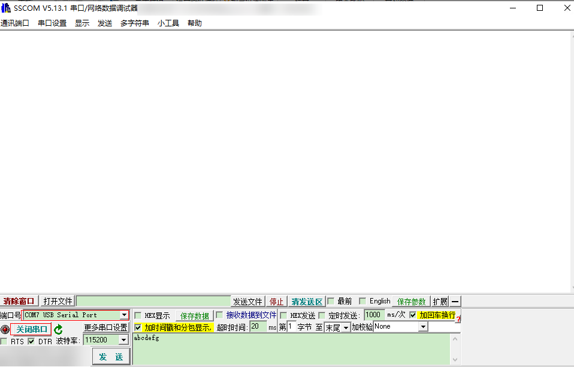

当硬件与串口工具处于连接状态时，如果单板发生死机，串口工具能够接收到复位前OS打印的死机信息。如[图2](#fig18838131174015)所示。

**图 2**  串口工具中捕获的死机信息<a name="fig18838131174015"></a>  
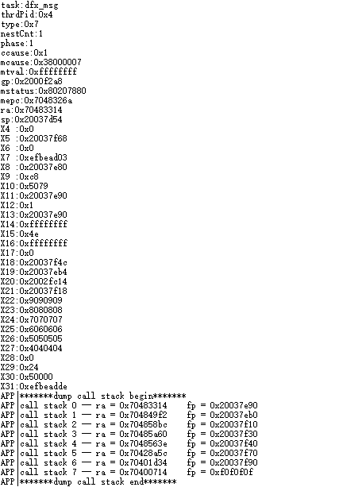

### DebugKits工具获取信息<a name="ZH-CN_TOPIC_0000001837766153"></a>

**工具准备<a name="section1975118511320"></a>**

首先进入工具页面点击options再选择change chip，在弹框中选择BS2X确定芯片类型，参考[图1](#fig3383638205710)。

**图 1**  选择芯片<a name="fig3383638205710"></a>  


**图 2**  修改芯片类型为BS21<a name="fig159105010441"></a>  
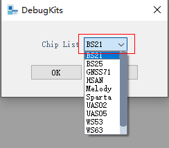

然后点击Connection选择Connect在弹窗中选择连接方式以及对应的通道序号进行连接，参考[图3](#fig7102432074)。

**图 3**  连接芯片<a name="fig7102432074"></a>  


如果是第一次连接芯片或者芯片有新版本的程序，需要更新HDB并重新连接之后，日志的打印才能正确的显示，在Option菜单下选择Update HDB，选择生成的database目录（\\output\\bx2x\\database\_evb）再点击OK即可完成配置，具体参考[图4](#fig173346313114)。

**图 4**  配置database<a name="fig173346313114"></a>  
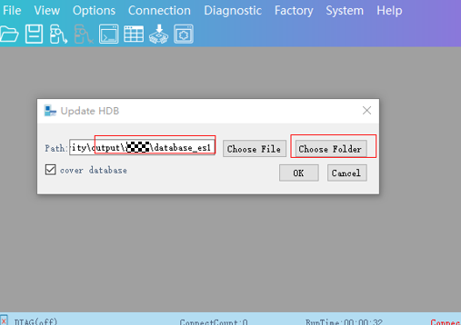

通过DebugKits工具可以实时观测芯片运行时打印的具体信息，可以参考[图5](#fig1915112116514)。当死机发生时Message视图将会打印出last word以及last dump信息。

**图 5**  DebugKits日志打印<a name="fig1915112116514"></a>  
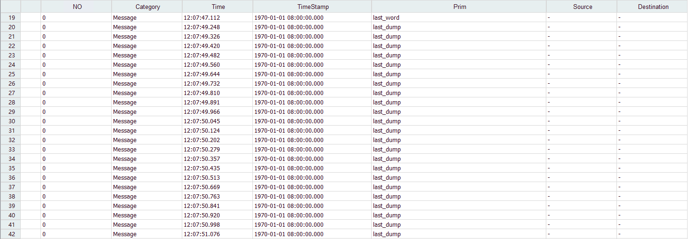

**获取last word<a name="section293192518313"></a>**

last word信息是死机发生时，将PC地址、返回地址、栈地址、CPU寄存器信息发送出来，用户可以根据last word的具体信息分析错误类型、定位错误原因，具体可以参考[图6](#fig09401013124317)。

**图 6**  last word信息<a name="fig09401013124317"></a>  


**获取last dump信息<a name="section12903431310"></a>**

last dump信息将会把内存中的部分信息打包生成bin文件存储到DebugKits的安装目录中的DumpInfo子目录之下，具体参考[图7](#fig1695614017813)。用户可以通过解析这些文件定位错误位置。使用方法详见[Dump解析](Dump解析.md)。

**图 7**  last dump生成文件<a name="fig1695614017813"></a>  
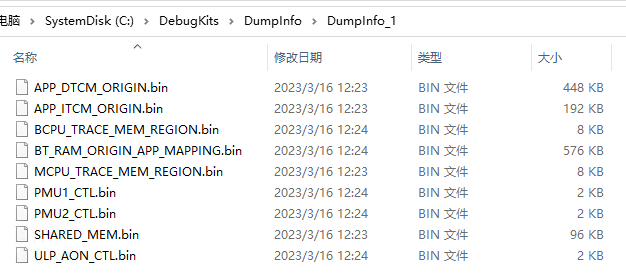

> **说明：** 
>将内存dump到DebugKits中需要一定时间（Liteos：1～2 min，FreeRtos：4～5 min），因此如果需要使用last dump分析死机信息，注意不要在发生死机故障后立即复位，否则last dump信息可能无法完整获取。

### 连接J-Link调试器导出<a name="ZH-CN_TOPIC_0000001790807024"></a>

在允许连接JTAG调试器的场景下，用户可连接劳特巴赫或J-Link仿真器等工具进一步获取死机现场的相关信息。以下主要介绍通过J-Link仿真器获取死机相关信息的过程。

在条件允许的情况下，建议开启死机不复位功能进行死机定位。死机现场时，连接J-Link，可以查看“[串口界面输出](串口界面输出.md)”小节所展示的信息，还可查询内存信息、栈信息、外设寄存器、维测变量等更丰富的数据。本小节主要介绍在死机现场使用J-Link调试器导出死机的过程。

使用J-Link仿真器调试需先连接单板的20PIN排针，具体排针位置以实际产品为准。

硬件连接后，双击工具包（sdk\\tools\\bin\\jlink\_tool\\bx2x）中的Commandline\_bx2x\_mcpu.bat脚本，脚本将自动进行连接（其他核的连接操作可参照此方法进行）。

**图 1**  J-Link连接MCPU示意图<a name="fig14167439113313"></a>  
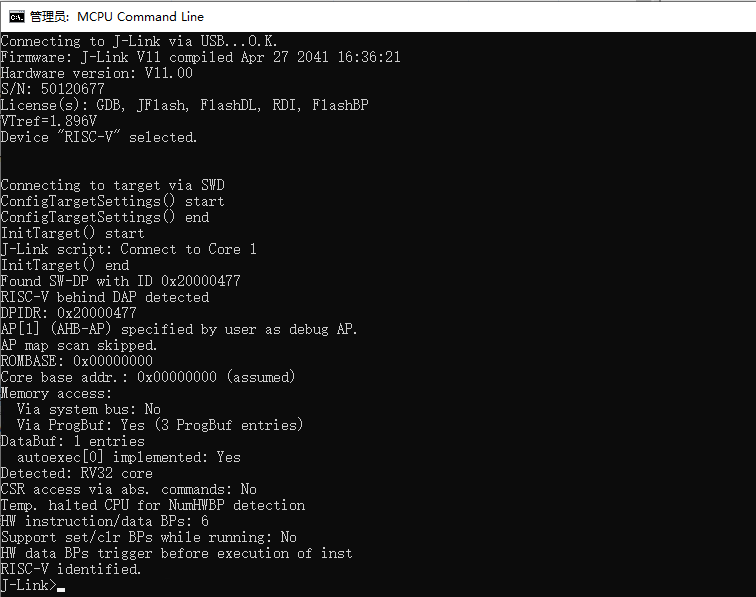

> **须知：** 
>注意RISC-V架构处理器需要使用V10及以上版本的J-Link仿真器。

**表 1**  J-Link常用命令

<a name="table1061103533519"></a>
<table><thead align="left"><tr id="row116113515356"><th class="cellrowborder" valign="top" width="32.18%" id="mcps1.2.3.1.1"><p id="p762153512353"><a name="p762153512353"></a><a name="p762153512353"></a>命令</p>
</th>
<th class="cellrowborder" valign="top" width="67.82000000000001%" id="mcps1.2.3.1.2"><p id="p186214355358"><a name="p186214355358"></a><a name="p186214355358"></a>描述</p>
</th>
</tr>
</thead>
<tbody><tr id="row7621535103515"><td class="cellrowborder" valign="top" width="32.18%" headers="mcps1.2.3.1.1 "><p id="p13621135173511"><a name="p13621135173511"></a><a name="p13621135173511"></a>con/connect</p>
</td>
<td class="cellrowborder" valign="top" width="67.82000000000001%" headers="mcps1.2.3.1.2 "><p id="p962735173518"><a name="p962735173518"></a><a name="p962735173518"></a>连接。</p>
</td>
</tr>
<tr id="row1462535133520"><td class="cellrowborder" valign="top" width="32.18%" headers="mcps1.2.3.1.1 "><p id="p96273533516"><a name="p96273533516"></a><a name="p96273533516"></a>h/halt</p>
</td>
<td class="cellrowborder" valign="top" width="67.82000000000001%" headers="mcps1.2.3.1.2 "><p id="p962183593518"><a name="p962183593518"></a><a name="p962183593518"></a>暂停，停止。</p>
</td>
</tr>
<tr id="row76216355359"><td class="cellrowborder" valign="top" width="32.18%" headers="mcps1.2.3.1.1 "><p id="p66253515351"><a name="p66253515351"></a><a name="p66253515351"></a>g/go</p>
</td>
<td class="cellrowborder" valign="top" width="67.82000000000001%" headers="mcps1.2.3.1.2 "><p id="p762735133516"><a name="p762735133516"></a><a name="p762735133516"></a>继续，运行。</p>
</td>
</tr>
<tr id="row186210355352"><td class="cellrowborder" valign="top" width="32.18%" headers="mcps1.2.3.1.1 "><p id="p1606533664"><a name="p1606533664"></a><a name="p1606533664"></a>mem32</p>
<p id="p362153519353"><a name="p362153519353"></a><a name="p362153519353"></a>mem16</p>
<p id="p1682961920116"><a name="p1682961920116"></a><a name="p1682961920116"></a>mem8</p>
</td>
<td class="cellrowborder" valign="top" width="67.82000000000001%" headers="mcps1.2.3.1.2 "><p id="p7623350357"><a name="p7623350357"></a><a name="p7623350357"></a>I/O读32bit：mem32 &lt;Addr&gt;, &lt;NumItems&gt; (hex) (Addr表示内存地址 NumItems表示从Addr开始连续读几个32bit )</p>
<p id="p13585583213"><a name="p13585583213"></a><a name="p13585583213"></a>I/O读16bit：mem16 &lt;Addr&gt;, &lt;NumItems&gt; (hex)</p>
<p id="p6973914223"><a name="p6973914223"></a><a name="p6973914223"></a>I/O读8bit：mem8 &lt;Addr&gt;, &lt;NumItems&gt; (hex)</p>
</td>
</tr>
<tr id="row106243513510"><td class="cellrowborder" valign="top" width="32.18%" headers="mcps1.2.3.1.1 "><p id="p1111715614617"><a name="p1111715614617"></a><a name="p1111715614617"></a>w4</p>
<p id="p6510013716"><a name="p6510013716"></a><a name="p6510013716"></a>w2</p>
<p id="p96217354358"><a name="p96217354358"></a><a name="p96217354358"></a>w1</p>
</td>
<td class="cellrowborder" valign="top" width="67.82000000000001%" headers="mcps1.2.3.1.2 "><p id="p988117579397"><a name="p988117579397"></a><a name="p988117579397"></a>I/O写4Byte：w4 &lt;Addr&gt;, &lt;Data&gt; (hex)</p>
<p id="p1874975115281"><a name="p1874975115281"></a><a name="p1874975115281"></a>I/O写2Byte：w2 &lt;Addr&gt;, &lt;Data&gt; (hex)</p>
<p id="p132883527285"><a name="p132883527285"></a><a name="p132883527285"></a>I/O写1Byte：w1 &lt;Addr&gt;, &lt;Data&gt; (hex)</p>
</td>
</tr>
<tr id="row14970194993820"><td class="cellrowborder" valign="top" width="32.18%" headers="mcps1.2.3.1.1 "><p id="p1197154963810"><a name="p1197154963810"></a><a name="p1197154963810"></a>readcsr</p>
</td>
<td class="cellrowborder" valign="top" width="67.82000000000001%" headers="mcps1.2.3.1.2 "><p id="p39711649103817"><a name="p39711649103817"></a><a name="p39711649103817"></a>读riscv csr寄存器：ReadCSR &lt;RegIndex&gt;</p>
</td>
</tr>
<tr id="row054423113918"><td class="cellrowborder" valign="top" width="32.18%" headers="mcps1.2.3.1.1 "><p id="p4544933392"><a name="p4544933392"></a><a name="p4544933392"></a>writecsr</p>
</td>
<td class="cellrowborder" valign="top" width="67.82000000000001%" headers="mcps1.2.3.1.2 "><p id="p15442373913"><a name="p15442373913"></a><a name="p15442373913"></a>写riscv csr寄存器：WriteCSR &lt;RegIndex&gt;,&lt;Value&gt;</p>
</td>
</tr>
</tbody>
</table>

**查询I/O信息<a name="section329mcpsimp"></a>**

1.  查询CPU寄存器信息，如[图2](#fig17023605514)所示。

    **图 2**  查询CPU寄存器值<a name="fig17023605514"></a>  
    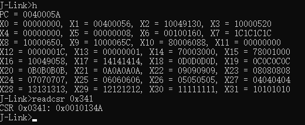

2.  查询内存信息，获取维测变量值或普通变量值。
    1.  在\\output\\bx2x\\xxx\_core\\xxx\_bx2x\_xxx\\xxx.nm中获取nm文件，在nm文件中获取想要查询的变量地址如[图3](#fig47228444013)中“g-exception-dump-callback”变量的地址为0x20025950。

        **图 3**  变量地址<a name="fig47228444013"></a>  
        

    2.  通过J-Link获取状态信息，如[图4](#fig1027883918595)。

        **图 4**  变量值<a name="fig1027883918595"></a>  
        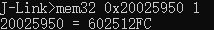

> **说明：** 
>以上地址信息仅作为演示使用，查询步骤供用户参考使用。

## 死机问题定位<a name="ZH-CN_TOPIC_0000001790807032"></a>


### 串口死机信息查看<a name="ZH-CN_TOPIC_0000001837646201"></a>

在死机故障发生时，一般会在串口输出[串口界面输出](串口界面输出.md)中描述的死机信息。其中包含几个部分：异常信息汇总、CPU寄存器信息、函数调用栈信息。


#### 异常信息汇总<a name="ZH-CN_TOPIC_0000001790807016"></a>

**表 1**  异常信息汇总

<a name="table123725012514"></a>
<table><thead align="left"><tr id="row19376506258"><th class="cellrowborder" valign="top" width="19.439999999999998%" id="mcps1.2.3.1.1"><p id="p133735018259"><a name="p133735018259"></a><a name="p133735018259"></a>成员</p>
</th>
<th class="cellrowborder" valign="top" width="80.56%" id="mcps1.2.3.1.2"><p id="p1737175052516"><a name="p1737175052516"></a><a name="p1737175052516"></a>描述</p>
</th>
</tr>
</thead>
<tbody><tr id="row037135012253"><td class="cellrowborder" valign="top" width="19.439999999999998%" headers="mcps1.2.3.1.1 "><p id="p203718501253"><a name="p203718501253"></a><a name="p203718501253"></a>task</p>
</td>
<td class="cellrowborder" valign="top" width="80.56%" headers="mcps1.2.3.1.2 "><p id="p03755010251"><a name="p03755010251"></a><a name="p03755010251"></a>死机的任务名称。</p>
</td>
</tr>
<tr id="row23713503252"><td class="cellrowborder" valign="top" width="19.439999999999998%" headers="mcps1.2.3.1.1 "><p id="p183712502254"><a name="p183712502254"></a><a name="p183712502254"></a>thrdPid</p>
</td>
<td class="cellrowborder" valign="top" width="80.56%" headers="mcps1.2.3.1.2 "><p id="p17373506254"><a name="p17373506254"></a><a name="p17373506254"></a>死机的任务ID。</p>
</td>
</tr>
<tr id="row123715019250"><td class="cellrowborder" valign="top" width="19.439999999999998%" headers="mcps1.2.3.1.1 "><p id="p1137250142513"><a name="p1137250142513"></a><a name="p1137250142513"></a>type</p>
</td>
<td class="cellrowborder" valign="top" width="80.56%" headers="mcps1.2.3.1.2 "><p id="p173785013251"><a name="p173785013251"></a><a name="p173785013251"></a>死机类型。</p>
</td>
</tr>
</tbody>
</table>

#### CPU寄存器信息<a name="ZH-CN_TOPIC_0000001790966736"></a>

**表 1**  死机相关CPU寄存器描述

<a name="table452381744315"></a>
<table><thead align="left"><tr id="row185241717104310"><th class="cellrowborder" valign="top" width="18.38%" id="mcps1.2.3.1.1"><p id="p1449123094319"><a name="p1449123094319"></a><a name="p1449123094319"></a>成员</p>
</th>
<th class="cellrowborder" valign="top" width="81.62%" id="mcps1.2.3.1.2"><p id="p135245172436"><a name="p135245172436"></a><a name="p135245172436"></a>描述</p>
</th>
</tr>
</thead>
<tbody><tr id="row18524191734320"><td class="cellrowborder" valign="top" width="18.38%" headers="mcps1.2.3.1.1 "><p id="p35245177430"><a name="p35245177430"></a><a name="p35245177430"></a>mepc</p>
</td>
<td class="cellrowborder" valign="top" width="81.62%" headers="mcps1.2.3.1.2 "><p id="p7524717164320"><a name="p7524717164320"></a><a name="p7524717164320"></a>机器异常程序计数器。当发生异常时，mepc指向导致异常的指令；对于中断，mepc指向中断处理后应该恢复的位置。</p>
</td>
</tr>
<tr id="row17524121712434"><td class="cellrowborder" valign="top" width="18.38%" headers="mcps1.2.3.1.1 "><p id="p20524171715438"><a name="p20524171715438"></a><a name="p20524171715438"></a>mstatus</p>
</td>
<td class="cellrowborder" valign="top" width="81.62%" headers="mcps1.2.3.1.2 "><p id="p9524191734312"><a name="p9524191734312"></a><a name="p9524191734312"></a>机器状态寄存器。</p>
</td>
</tr>
<tr id="row11524717104319"><td class="cellrowborder" valign="top" width="18.38%" headers="mcps1.2.3.1.1 "><p id="p13524171716432"><a name="p13524171716432"></a><a name="p13524171716432"></a>mtval</p>
</td>
<td class="cellrowborder" valign="top" width="81.62%" headers="mcps1.2.3.1.2 "><p id="p5524171715436"><a name="p5524171715436"></a><a name="p5524171715436"></a>机器陷入寄存器。保存地址异常中出错的地址或者发生指令异常的指令本身，对于其他错误，其值为零。</p>
</td>
</tr>
<tr id="row8524151794317"><td class="cellrowborder" valign="top" width="18.38%" headers="mcps1.2.3.1.1 "><p id="p1952411714436"><a name="p1952411714436"></a><a name="p1952411714436"></a>mcause</p>
</td>
<td class="cellrowborder" valign="top" width="81.62%" headers="mcps1.2.3.1.2 "><p id="p0526121714431"><a name="p0526121714431"></a><a name="p0526121714431"></a>机器异常寄存器。保存目前异常或者中断的原因，通过查询<a href="#table349710585554">表2</a>得到目前异常或者中断的类型。</p>
</td>
</tr>
<tr id="row2526517194317"><td class="cellrowborder" valign="top" width="18.38%" headers="mcps1.2.3.1.1 "><p id="p852641716436"><a name="p852641716436"></a><a name="p852641716436"></a>ccause</p>
</td>
<td class="cellrowborder" valign="top" width="81.62%" headers="mcps1.2.3.1.2 "><p id="p1352621713435"><a name="p1352621713435"></a><a name="p1352621713435"></a>与mcause类似，ccause为mcause的补充说明，对于某些异常通过读取ccause寄存器的内容可以进一步明确异常类型。</p>
</td>
</tr>
</tbody>
</table>

**表 2**  mcause&ccause异常描述表

<a name="table349710585554"></a>
<table><thead align="left"><tr id="row6497105820558"><th class="cellrowborder" valign="top" width="22.759999999999998%" id="mcps1.2.4.1.1"><p id="p94972588556"><a name="p94972588556"></a><a name="p94972588556"></a>异常码</p>
</th>
<th class="cellrowborder" valign="top" width="43.91%" id="mcps1.2.4.1.2"><p id="p54971586557"><a name="p54971586557"></a><a name="p54971586557"></a>mcause异常描述</p>
</th>
<th class="cellrowborder" valign="top" width="33.33%" id="mcps1.2.4.1.3"><p id="p04981958155512"><a name="p04981958155512"></a><a name="p04981958155512"></a>ccause异常描述</p>
</th>
</tr>
</thead>
<tbody><tr id="row204988584551"><td class="cellrowborder" valign="top" width="22.759999999999998%" headers="mcps1.2.4.1.1 "><p id="p1949895895513"><a name="p1949895895513"></a><a name="p1949895895513"></a>0x0</p>
</td>
<td class="cellrowborder" valign="top" width="43.91%" headers="mcps1.2.4.1.2 "><p id="p2498105815510"><a name="p2498105815510"></a><a name="p2498105815510"></a>Instruction address misaligned</p>
</td>
<td class="cellrowborder" valign="top" width="33.33%" headers="mcps1.2.4.1.3 "><p id="p0498155810551"><a name="p0498155810551"></a><a name="p0498155810551"></a>Not available</p>
</td>
</tr>
<tr id="row54981582554"><td class="cellrowborder" valign="top" width="22.759999999999998%" headers="mcps1.2.4.1.1 "><p id="p102006432594"><a name="p102006432594"></a><a name="p102006432594"></a>0x1</p>
</td>
<td class="cellrowborder" valign="top" width="43.91%" headers="mcps1.2.4.1.2 "><p id="p12498458105520"><a name="p12498458105520"></a><a name="p12498458105520"></a>Instruction access fault</p>
</td>
<td class="cellrowborder" valign="top" width="33.33%" headers="mcps1.2.4.1.3 "><p id="p64981585551"><a name="p64981585551"></a><a name="p64981585551"></a>Memory map region access fault</p>
</td>
</tr>
<tr id="row1149814587552"><td class="cellrowborder" valign="top" width="22.759999999999998%" headers="mcps1.2.4.1.1 "><p id="p44981358105510"><a name="p44981358105510"></a><a name="p44981358105510"></a>0x2</p>
</td>
<td class="cellrowborder" valign="top" width="43.91%" headers="mcps1.2.4.1.2 "><p id="p849855805510"><a name="p849855805510"></a><a name="p849855805510"></a>Illegal instruction</p>
</td>
<td class="cellrowborder" valign="top" width="33.33%" headers="mcps1.2.4.1.3 "><p id="p1749812588553"><a name="p1749812588553"></a><a name="p1749812588553"></a>AXIM error response</p>
</td>
</tr>
<tr id="row17498175835510"><td class="cellrowborder" valign="top" width="22.759999999999998%" headers="mcps1.2.4.1.1 "><p id="p24981958105516"><a name="p24981958105516"></a><a name="p24981958105516"></a>0x3</p>
</td>
<td class="cellrowborder" valign="top" width="43.91%" headers="mcps1.2.4.1.2 "><p id="p9498125865517"><a name="p9498125865517"></a><a name="p9498125865517"></a>Breakpoint</p>
</td>
<td class="cellrowborder" valign="top" width="33.33%" headers="mcps1.2.4.1.3 "><p id="p1499105814555"><a name="p1499105814555"></a><a name="p1499105814555"></a>AHBM error response</p>
</td>
</tr>
<tr id="row114991558175514"><td class="cellrowborder" valign="top" width="22.759999999999998%" headers="mcps1.2.4.1.1 "><p id="p2499185813555"><a name="p2499185813555"></a><a name="p2499185813555"></a>0x4</p>
</td>
<td class="cellrowborder" valign="top" width="43.91%" headers="mcps1.2.4.1.2 "><p id="p164995588559"><a name="p164995588559"></a><a name="p164995588559"></a>Load address misaligned</p>
</td>
<td class="cellrowborder" valign="top" width="33.33%" headers="mcps1.2.4.1.3 "><p id="p6500758115511"><a name="p6500758115511"></a><a name="p6500758115511"></a>Crossing PMP entries</p>
</td>
</tr>
<tr id="row650018588556"><td class="cellrowborder" valign="top" width="22.759999999999998%" headers="mcps1.2.4.1.1 "><p id="p050065845510"><a name="p050065845510"></a><a name="p050065845510"></a>0x5</p>
</td>
<td class="cellrowborder" valign="top" width="43.91%" headers="mcps1.2.4.1.2 "><p id="p1250055820559"><a name="p1250055820559"></a><a name="p1250055820559"></a>Load access fault</p>
</td>
<td class="cellrowborder" valign="top" width="33.33%" headers="mcps1.2.4.1.3 "><p id="p1250025819557"><a name="p1250025819557"></a><a name="p1250025819557"></a>System register access fault</p>
</td>
</tr>
<tr id="row11501558135518"><td class="cellrowborder" valign="top" width="22.759999999999998%" headers="mcps1.2.4.1.1 "><p id="p16501758125520"><a name="p16501758125520"></a><a name="p16501758125520"></a>0x6</p>
</td>
<td class="cellrowborder" valign="top" width="43.91%" headers="mcps1.2.4.1.2 "><p id="p350175815518"><a name="p350175815518"></a><a name="p350175815518"></a>Store/AMO address misaligned</p>
</td>
<td class="cellrowborder" valign="top" width="33.33%" headers="mcps1.2.4.1.3 "><p id="p13501105865514"><a name="p13501105865514"></a><a name="p13501105865514"></a>No PMP entry matched</p>
</td>
</tr>
<tr id="row85012058175517"><td class="cellrowborder" valign="top" width="22.759999999999998%" headers="mcps1.2.4.1.1 "><p id="p175017585553"><a name="p175017585553"></a><a name="p175017585553"></a>0x7</p>
</td>
<td class="cellrowborder" valign="top" width="43.91%" headers="mcps1.2.4.1.2 "><p id="p105018585556"><a name="p105018585556"></a><a name="p105018585556"></a>Store/AMO access fault</p>
</td>
<td class="cellrowborder" valign="top" width="33.33%" headers="mcps1.2.4.1.3 "><p id="p5501105817553"><a name="p5501105817553"></a><a name="p5501105817553"></a>PMP access fault</p>
</td>
</tr>
<tr id="row1950195816557"><td class="cellrowborder" valign="top" width="22.759999999999998%" headers="mcps1.2.4.1.1 "><p id="p1250120588557"><a name="p1250120588557"></a><a name="p1250120588557"></a>0x8</p>
</td>
<td class="cellrowborder" valign="top" width="43.91%" headers="mcps1.2.4.1.2 "><p id="p1650125813555"><a name="p1650125813555"></a><a name="p1650125813555"></a>Environment call from U-mode</p>
</td>
<td class="cellrowborder" valign="top" width="33.33%" headers="mcps1.2.4.1.3 "><p id="p1950165885513"><a name="p1950165885513"></a><a name="p1950165885513"></a>CMO access fault</p>
</td>
</tr>
<tr id="row10501105875514"><td class="cellrowborder" valign="top" width="22.759999999999998%" headers="mcps1.2.4.1.1 "><p id="p850111588558"><a name="p850111588558"></a><a name="p850111588558"></a>0x9</p>
</td>
<td class="cellrowborder" valign="top" width="43.91%" headers="mcps1.2.4.1.2 "><p id="p7693831744"><a name="p7693831744"></a><a name="p7693831744"></a>Environment call from S-mode</p>
</td>
<td class="cellrowborder" valign="top" width="33.33%" headers="mcps1.2.4.1.3 "><p id="p1250185865514"><a name="p1250185865514"></a><a name="p1250185865514"></a>CSR access fault</p>
</td>
</tr>
<tr id="row175013580553"><td class="cellrowborder" valign="top" width="22.759999999999998%" headers="mcps1.2.4.1.1 "><p id="p17501155813558"><a name="p17501155813558"></a><a name="p17501155813558"></a>0xa</p>
</td>
<td class="cellrowborder" valign="top" width="43.91%" headers="mcps1.2.4.1.2 "><p id="p02523325418"><a name="p02523325418"></a><a name="p02523325418"></a>Reserved</p>
</td>
<td class="cellrowborder" valign="top" width="33.33%" headers="mcps1.2.4.1.3 "><p id="p2050120588551"><a name="p2050120588551"></a><a name="p2050120588551"></a>LDM/STMIA instruction</p>
</td>
</tr>
<tr id="row10501105814557"><td class="cellrowborder" valign="top" width="22.759999999999998%" headers="mcps1.2.4.1.1 "><p id="p15501115819555"><a name="p15501115819555"></a><a name="p15501115819555"></a>0xb</p>
</td>
<td class="cellrowborder" valign="top" width="43.91%" headers="mcps1.2.4.1.2 "><p id="p145011058175510"><a name="p145011058175510"></a><a name="p145011058175510"></a>Environment call from M-mode</p>
</td>
<td class="cellrowborder" valign="top" width="33.33%" headers="mcps1.2.4.1.3 "><p id="p1350165816551"><a name="p1350165816551"></a><a name="p1350165816551"></a>ITCM write access fault</p>
</td>
</tr>
<tr id="row75011581553"><td class="cellrowborder" valign="top" width="22.759999999999998%" headers="mcps1.2.4.1.1 "><p id="p125011558105513"><a name="p125011558105513"></a><a name="p125011558105513"></a>0xc</p>
</td>
<td class="cellrowborder" valign="top" width="43.91%" headers="mcps1.2.4.1.2 "><p id="p15501258135511"><a name="p15501258135511"></a><a name="p15501258135511"></a>Instruction page fault</p>
</td>
<td class="cellrowborder" valign="top" width="33.33%" headers="mcps1.2.4.1.3 "><p id="p145031958105511"><a name="p145031958105511"></a><a name="p145031958105511"></a>Not available</p>
</td>
</tr>
<tr id="row10503125825516"><td class="cellrowborder" valign="top" width="22.759999999999998%" headers="mcps1.2.4.1.1 "><p id="p14503858115514"><a name="p14503858115514"></a><a name="p14503858115514"></a>0xd</p>
</td>
<td class="cellrowborder" valign="top" width="43.91%" headers="mcps1.2.4.1.2 "><p id="p20503125814554"><a name="p20503125814554"></a><a name="p20503125814554"></a>Load page fault</p>
</td>
<td class="cellrowborder" valign="top" width="33.33%" headers="mcps1.2.4.1.3 "><p id="p1250319581557"><a name="p1250319581557"></a><a name="p1250319581557"></a>Not available</p>
</td>
</tr>
<tr id="row850325875515"><td class="cellrowborder" valign="top" width="22.759999999999998%" headers="mcps1.2.4.1.1 "><p id="p1950315865519"><a name="p1950315865519"></a><a name="p1950315865519"></a>0xe</p>
</td>
<td class="cellrowborder" valign="top" width="43.91%" headers="mcps1.2.4.1.2 "><p id="p950318582553"><a name="p950318582553"></a><a name="p950318582553"></a>Reserved</p>
</td>
<td class="cellrowborder" valign="top" width="33.33%" headers="mcps1.2.4.1.3 "><p id="p11503135810550"><a name="p11503135810550"></a><a name="p11503135810550"></a>Not available</p>
</td>
</tr>
<tr id="row195031758175511"><td class="cellrowborder" valign="top" width="22.759999999999998%" headers="mcps1.2.4.1.1 "><p id="p115035586556"><a name="p115035586556"></a><a name="p115035586556"></a>0xf</p>
</td>
<td class="cellrowborder" valign="top" width="43.91%" headers="mcps1.2.4.1.2 "><p id="p165034584555"><a name="p165034584555"></a><a name="p165034584555"></a>Store/AMO page fault</p>
</td>
<td class="cellrowborder" valign="top" width="33.33%" headers="mcps1.2.4.1.3 "><p id="p1250335815514"><a name="p1250335815514"></a><a name="p1250335815514"></a>Not available</p>
</td>
</tr>
<tr id="row850335811557"><td class="cellrowborder" valign="top" width="22.759999999999998%" headers="mcps1.2.4.1.1 "><p id="p4503858195518"><a name="p4503858195518"></a><a name="p4503858195518"></a>＞0xf</p>
</td>
<td class="cellrowborder" valign="top" width="43.91%" headers="mcps1.2.4.1.2 "><p id="p19503135845514"><a name="p19503135845514"></a><a name="p19503135845514"></a>Reserved</p>
</td>
<td class="cellrowborder" valign="top" width="33.33%" headers="mcps1.2.4.1.3 "><p id="p350315585555"><a name="p350315585555"></a><a name="p350315585555"></a>Not available</p>
</td>
</tr>
</tbody>
</table>

#### 函数调用栈信息<a name="ZH-CN_TOPIC_0000001837646205"></a>

函数调用栈call stack会显示与异常相关的所有函数调用指令。用户可以根据函数调用栈检查异常发生时函数调用的上下文定位。其中call back 0为栈顶函数，其对应的ra为栈顶函数的地址，以此类推。

用户可以到output/bx2x/acore/standard-bx2x-app-evb/application.lst中找到对应的函数。

### last word信息查看<a name="ZH-CN_TOPIC_0000001790807020"></a>

如“[DebugKits工具获取信息](DebugKits工具获取信息.md)”中描述，在发生死机故障时，同时会将last word信息发送到DebugKits工具上。

last word上报的内容及含义如[表1](#table32188330)所示（具体含义中括号里面的为代称）。

**表 1**  last word内容

<a name="table32188330"></a>
<table><thead align="left"><tr id="row132168232"><th class="cellrowborder" valign="top" width="50%" id="mcps1.2.3.1.1"><p id="p14211086312"><a name="p14211086312"></a><a name="p14211086312"></a>变量名称</p>
</th>
<th class="cellrowborder" valign="top" width="50%" id="mcps1.2.3.1.2"><p id="p521186311"><a name="p521186311"></a><a name="p521186311"></a>具体含义</p>
</th>
</tr>
</thead>
<tbody><tr id="row2021481336"><td class="cellrowborder" valign="top" width="50%" headers="mcps1.2.3.1.1 "><p id="p1721781136"><a name="p1721781136"></a><a name="p1721781136"></a>stack_limit</p>
</td>
<td class="cellrowborder" valign="top" width="50%" headers="mcps1.2.3.1.2 "><p id="p321981832"><a name="p321981832"></a><a name="p321981832"></a>系统栈大小。</p>
</td>
</tr>
<tr id="row1521681638"><td class="cellrowborder" valign="top" width="50%" headers="mcps1.2.3.1.1 "><p id="p16211080317"><a name="p16211080317"></a><a name="p16211080317"></a>fault_type</p>
</td>
<td class="cellrowborder" valign="top" width="50%" headers="mcps1.2.3.1.2 "><p id="p721881238"><a name="p721881238"></a><a name="p721881238"></a>错误类型。</p>
</td>
</tr>
<tr id="row0213819318"><td class="cellrowborder" valign="top" width="50%" headers="mcps1.2.3.1.1 "><p id="p421481031"><a name="p421481031"></a><a name="p421481031"></a>fault_address</p>
</td>
<td class="cellrowborder" valign="top" width="50%" headers="mcps1.2.3.1.2 "><p id="p1211811317"><a name="p1211811317"></a><a name="p1211811317"></a>错误地址，属性值无意义。</p>
</td>
</tr>
<tr id="row921208930"><td class="cellrowborder" valign="top" width="50%" headers="mcps1.2.3.1.1 "><p id="p1821288317"><a name="p1821288317"></a><a name="p1821288317"></a>fault_reason</p>
</td>
<td class="cellrowborder" valign="top" width="50%" headers="mcps1.2.3.1.2 "><p id="p121818339414"><a name="p121818339414"></a><a name="p121818339414"></a>错误原因，属性值无意义。</p>
</td>
</tr>
<tr id="row182112819317"><td class="cellrowborder" valign="top" width="50%" headers="mcps1.2.3.1.1 "><p id="p15211281633"><a name="p15211281633"></a><a name="p15211281633"></a>reg_value</p>
</td>
<td class="cellrowborder" valign="top" width="50%" headers="mcps1.2.3.1.2 "><p id="p16211282314"><a name="p16211282314"></a><a name="p16211282314"></a>保存寄存器值。</p>
</td>
</tr>
<tr id="row9211682313"><td class="cellrowborder" valign="top" width="50%" headers="mcps1.2.3.1.1 "><p id="p1922158931"><a name="p1922158931"></a><a name="p1922158931"></a>psp_value</p>
</td>
<td class="cellrowborder" valign="top" width="50%" headers="mcps1.2.3.1.2 "><p id="p1522198635"><a name="p1522198635"></a><a name="p1522198635"></a>栈指针。</p>
</td>
</tr>
<tr id="row22248238"><td class="cellrowborder" valign="top" width="50%" headers="mcps1.2.3.1.1 "><p id="p172213816319"><a name="p172213816319"></a><a name="p172213816319"></a>lr_value</p>
</td>
<td class="cellrowborder" valign="top" width="50%" headers="mcps1.2.3.1.2 "><p id="p1122178435"><a name="p1122178435"></a><a name="p1122178435"></a>返回地址。</p>
</td>
</tr>
<tr id="row1221681316"><td class="cellrowborder" valign="top" width="50%" headers="mcps1.2.3.1.1 "><p id="p15226814313"><a name="p15226814313"></a><a name="p15226814313"></a>pc_value</p>
</td>
<td class="cellrowborder" valign="top" width="50%" headers="mcps1.2.3.1.2 "><p id="p202208236"><a name="p202208236"></a><a name="p202208236"></a>发生错误的指令地址（mepc）。</p>
</td>
</tr>
<tr id="row1022188317"><td class="cellrowborder" valign="top" width="50%" headers="mcps1.2.3.1.1 "><p id="p4221181739"><a name="p4221181739"></a><a name="p4221181739"></a>psps_value</p>
</td>
<td class="cellrowborder" valign="top" width="50%" headers="mcps1.2.3.1.2 "><p id="p192217815312"><a name="p192217815312"></a><a name="p192217815312"></a>全局指针。</p>
</td>
</tr>
<tr id="row1822148636"><td class="cellrowborder" valign="top" width="50%" headers="mcps1.2.3.1.1 "><p id="p6221281433"><a name="p6221281433"></a><a name="p6221281433"></a>primask_value</p>
</td>
<td class="cellrowborder" valign="top" width="50%" headers="mcps1.2.3.1.2 "><p id="p15221689316"><a name="p15221689316"></a><a name="p15221689316"></a>异常状态寄存器（mstatus）。</p>
</td>
</tr>
<tr id="row322988310"><td class="cellrowborder" valign="top" width="50%" headers="mcps1.2.3.1.1 "><p id="p1422682030"><a name="p1422682030"></a><a name="p1422682030"></a>fault_mask_value</p>
</td>
<td class="cellrowborder" valign="top" width="50%" headers="mcps1.2.3.1.2 "><p id="p8221485314"><a name="p8221485314"></a><a name="p8221485314"></a>CPU访问异常地址或异常值（mtval）。</p>
</td>
</tr>
<tr id="row1522385318"><td class="cellrowborder" valign="top" width="50%" headers="mcps1.2.3.1.1 "><p id="p10224819314"><a name="p10224819314"></a><a name="p10224819314"></a>bserpri_value</p>
</td>
<td class="cellrowborder" valign="top" width="50%" headers="mcps1.2.3.1.2 "><p id="p13221181531"><a name="p13221181531"></a><a name="p13221181531"></a>自定义异常状态寄存器（ccause）。</p>
</td>
</tr>
<tr id="row12227818311"><td class="cellrowborder" valign="top" width="50%" headers="mcps1.2.3.1.1 "><p id="p8221781932"><a name="p8221781932"></a><a name="p8221781932"></a>control_value</p>
</td>
<td class="cellrowborder" valign="top" width="50%" headers="mcps1.2.3.1.2 "><p id="p6727111512519"><a name="p6727111512519"></a><a name="p6727111512519"></a>CPU访问异常地址或异常值（mtval）。</p>
</td>
</tr>
</tbody>
</table>

对于last word上面内容里面保存的寄存器的值（reg\_value）具体含义如[表2](#table16496164717509)所示。

**表 2**  reg\_value成员含义

<a name="table16496164717509"></a>
<table><thead align="left"><tr id="row949644775019"><th class="cellrowborder" valign="top" width="33.96%" id="mcps1.2.3.1.1"><p id="p10496134712503"><a name="p10496134712503"></a><a name="p10496134712503"></a>成员名称</p>
</th>
<th class="cellrowborder" valign="top" width="66.03999999999999%" id="mcps1.2.3.1.2"><p id="p349620477502"><a name="p349620477502"></a><a name="p349620477502"></a>成员含义</p>
</th>
</tr>
</thead>
<tbody><tr id="row149744710505"><td class="cellrowborder" valign="top" width="33.96%" headers="mcps1.2.3.1.1 "><p id="p1249764755017"><a name="p1249764755017"></a><a name="p1249764755017"></a>reg_value[0]</p>
</td>
<td class="cellrowborder" valign="top" width="66.03999999999999%" headers="mcps1.2.3.1.2 "><p id="p949718471504"><a name="p949718471504"></a><a name="p949718471504"></a>无意义</p>
</td>
</tr>
<tr id="row11497144711501"><td class="cellrowborder" valign="top" width="33.96%" headers="mcps1.2.3.1.1 "><p id="p11393645125612"><a name="p11393645125612"></a><a name="p11393645125612"></a>reg_value[1]</p>
</td>
<td class="cellrowborder" valign="top" width="66.03999999999999%" headers="mcps1.2.3.1.2 "><p id="p184975478503"><a name="p184975478503"></a><a name="p184975478503"></a>返回地址（ra）</p>
</td>
</tr>
<tr id="row1817123814524"><td class="cellrowborder" valign="top" width="33.96%" headers="mcps1.2.3.1.1 "><p id="p7981144555618"><a name="p7981144555618"></a><a name="p7981144555618"></a>reg_value[2]</p>
</td>
<td class="cellrowborder" valign="top" width="66.03999999999999%" headers="mcps1.2.3.1.2 "><p id="p17172133812521"><a name="p17172133812521"></a><a name="p17172133812521"></a>栈指针（sp）</p>
</td>
</tr>
<tr id="row9645151920526"><td class="cellrowborder" valign="top" width="33.96%" headers="mcps1.2.3.1.1 "><p id="p761315466563"><a name="p761315466563"></a><a name="p761315466563"></a>reg_value[3]</p>
</td>
<td class="cellrowborder" valign="top" width="66.03999999999999%" headers="mcps1.2.3.1.2 "><p id="p10645019195212"><a name="p10645019195212"></a><a name="p10645019195212"></a>全局指针（gp）</p>
</td>
</tr>
<tr id="row9335436155212"><td class="cellrowborder" valign="top" width="33.96%" headers="mcps1.2.3.1.1 "><p id="p22201047145614"><a name="p22201047145614"></a><a name="p22201047145614"></a>reg_value[4]</p>
</td>
<td class="cellrowborder" valign="top" width="66.03999999999999%" headers="mcps1.2.3.1.2 "><p id="p8335436155210"><a name="p8335436155210"></a><a name="p8335436155210"></a>线程指针（tp）</p>
</td>
</tr>
<tr id="row84231634105219"><td class="cellrowborder" valign="top" width="33.96%" headers="mcps1.2.3.1.1 "><p id="p411394915566"><a name="p411394915566"></a><a name="p411394915566"></a>reg_value[5]</p>
</td>
<td class="cellrowborder" valign="top" width="66.03999999999999%" headers="mcps1.2.3.1.2 "><p id="p1642373465219"><a name="p1642373465219"></a><a name="p1642373465219"></a>临时寄存器（t0）</p>
</td>
</tr>
<tr id="row1769632105214"><td class="cellrowborder" valign="top" width="33.96%" headers="mcps1.2.3.1.1 "><p id="p782218499565"><a name="p782218499565"></a><a name="p782218499565"></a>reg_value[6]</p>
</td>
<td class="cellrowborder" valign="top" width="66.03999999999999%" headers="mcps1.2.3.1.2 "><p id="p46933295211"><a name="p46933295211"></a><a name="p46933295211"></a>临时寄存器（t1）</p>
</td>
</tr>
<tr id="row18984182945213"><td class="cellrowborder" valign="top" width="33.96%" headers="mcps1.2.3.1.1 "><p id="p15210105119566"><a name="p15210105119566"></a><a name="p15210105119566"></a>reg_value[7]</p>
</td>
<td class="cellrowborder" valign="top" width="66.03999999999999%" headers="mcps1.2.3.1.2 "><p id="p10984129145210"><a name="p10984129145210"></a><a name="p10984129145210"></a>临时寄存器（t2）</p>
</td>
</tr>
<tr id="row579252714525"><td class="cellrowborder" valign="top" width="33.96%" headers="mcps1.2.3.1.1 "><p id="p9583451135614"><a name="p9583451135614"></a><a name="p9583451135614"></a>reg_value[8]</p>
</td>
<td class="cellrowborder" valign="top" width="66.03999999999999%" headers="mcps1.2.3.1.2 "><p id="p8792027105216"><a name="p8792027105216"></a><a name="p8792027105216"></a>被调函数需要保存用的寄存器/调用栈的帧指针（s0）</p>
</td>
</tr>
<tr id="row5789132517525"><td class="cellrowborder" valign="top" width="33.96%" headers="mcps1.2.3.1.1 "><p id="p2951135105616"><a name="p2951135105616"></a><a name="p2951135105616"></a>reg_value[9]</p>
</td>
<td class="cellrowborder" valign="top" width="66.03999999999999%" headers="mcps1.2.3.1.2 "><p id="p14789525165220"><a name="p14789525165220"></a><a name="p14789525165220"></a>被调函数需要保存用的寄存器（s1）</p>
</td>
</tr>
<tr id="row20513202316522"><td class="cellrowborder" valign="top" width="33.96%" headers="mcps1.2.3.1.1 "><p id="p7352952165616"><a name="p7352952165616"></a><a name="p7352952165616"></a>reg_value[10]</p>
</td>
<td class="cellrowborder" valign="top" width="66.03999999999999%" headers="mcps1.2.3.1.2 "><p id="p05131623115216"><a name="p05131623115216"></a><a name="p05131623115216"></a>函数参数/返回值（a0）</p>
</td>
</tr>
<tr id="row20940235529"><td class="cellrowborder" valign="top" width="33.96%" headers="mcps1.2.3.1.1 "><p id="p980415265615"><a name="p980415265615"></a><a name="p980415265615"></a>reg_value[11]</p>
</td>
<td class="cellrowborder" valign="top" width="66.03999999999999%" headers="mcps1.2.3.1.2 "><p id="p1594014313523"><a name="p1594014313523"></a><a name="p1594014313523"></a>函数参数/返回值（a1）</p>
</td>
</tr>
<tr id="row7511112111521"><td class="cellrowborder" valign="top" width="33.96%" headers="mcps1.2.3.1.1 "><p id="p931116539566"><a name="p931116539566"></a><a name="p931116539566"></a>reg_value[12]</p>
</td>
<td class="cellrowborder" valign="top" width="66.03999999999999%" headers="mcps1.2.3.1.2 "><p id="p1951115213526"><a name="p1951115213526"></a><a name="p1951115213526"></a>函数参数（a2）</p>
</td>
</tr>
<tr id="row1647621795216"><td class="cellrowborder" valign="top" width="33.96%" headers="mcps1.2.3.1.1 "><p id="p18770195311567"><a name="p18770195311567"></a><a name="p18770195311567"></a>reg_value[13]</p>
</td>
<td class="cellrowborder" valign="top" width="66.03999999999999%" headers="mcps1.2.3.1.2 "><p id="p54764170525"><a name="p54764170525"></a><a name="p54764170525"></a>函数参数（a3）</p>
</td>
</tr>
<tr id="row13577111525214"><td class="cellrowborder" valign="top" width="33.96%" headers="mcps1.2.3.1.1 "><p id="p9172654145617"><a name="p9172654145617"></a><a name="p9172654145617"></a>reg_value[14]</p>
</td>
<td class="cellrowborder" valign="top" width="66.03999999999999%" headers="mcps1.2.3.1.2 "><p id="p9577815195215"><a name="p9577815195215"></a><a name="p9577815195215"></a>函数参数（a4）</p>
</td>
</tr>
<tr id="row125031113175216"><td class="cellrowborder" valign="top" width="33.96%" headers="mcps1.2.3.1.1 "><p id="p757015415617"><a name="p757015415617"></a><a name="p757015415617"></a>reg_value[15]</p>
</td>
<td class="cellrowborder" valign="top" width="66.03999999999999%" headers="mcps1.2.3.1.2 "><p id="p150351316529"><a name="p150351316529"></a><a name="p150351316529"></a>函数参数（a5）</p>
</td>
</tr>
<tr id="row1571931015211"><td class="cellrowborder" valign="top" width="33.96%" headers="mcps1.2.3.1.1 "><p id="p1210145555615"><a name="p1210145555615"></a><a name="p1210145555615"></a>reg_value[16]</p>
</td>
<td class="cellrowborder" valign="top" width="66.03999999999999%" headers="mcps1.2.3.1.2 "><p id="p1671951016529"><a name="p1671951016529"></a><a name="p1671951016529"></a>函数参数（a6）</p>
</td>
</tr>
<tr id="row19609168115213"><td class="cellrowborder" valign="top" width="33.96%" headers="mcps1.2.3.1.1 "><p id="p7430145555619"><a name="p7430145555619"></a><a name="p7430145555619"></a>reg_value[17]</p>
</td>
<td class="cellrowborder" valign="top" width="66.03999999999999%" headers="mcps1.2.3.1.2 "><p id="p126101689526"><a name="p126101689526"></a><a name="p126101689526"></a>函数参数（a7）</p>
</td>
</tr>
<tr id="row1581136125211"><td class="cellrowborder" valign="top" width="33.96%" headers="mcps1.2.3.1.1 "><p id="p13790135595614"><a name="p13790135595614"></a><a name="p13790135595614"></a>reg_value[18]</p>
</td>
<td class="cellrowborder" valign="top" width="66.03999999999999%" headers="mcps1.2.3.1.2 "><p id="p98216605211"><a name="p98216605211"></a><a name="p98216605211"></a>被调函数需要保存用的寄存器（s2）</p>
</td>
</tr>
<tr id="row2959195516512"><td class="cellrowborder" valign="top" width="33.96%" headers="mcps1.2.3.1.1 "><p id="p91609565567"><a name="p91609565567"></a><a name="p91609565567"></a>reg_value[19]</p>
</td>
<td class="cellrowborder" valign="top" width="66.03999999999999%" headers="mcps1.2.3.1.2 "><p id="p1196055518516"><a name="p1196055518516"></a><a name="p1196055518516"></a>被调函数需要保存用的寄存器（s3）</p>
</td>
</tr>
<tr id="row1793412125218"><td class="cellrowborder" valign="top" width="33.96%" headers="mcps1.2.3.1.1 "><p id="p115691956125611"><a name="p115691956125611"></a><a name="p115691956125611"></a>reg_value[20]</p>
</td>
<td class="cellrowborder" valign="top" width="66.03999999999999%" headers="mcps1.2.3.1.2 "><p id="p593415165212"><a name="p593415165212"></a><a name="p593415165212"></a>被调函数需要保存用的寄存器（s4）</p>
</td>
</tr>
<tr id="row641945355118"><td class="cellrowborder" valign="top" width="33.96%" headers="mcps1.2.3.1.1 "><p id="p4973185635616"><a name="p4973185635616"></a><a name="p4973185635616"></a>reg_value[21]</p>
</td>
<td class="cellrowborder" valign="top" width="66.03999999999999%" headers="mcps1.2.3.1.2 "><p id="p54191253205115"><a name="p54191253205115"></a><a name="p54191253205115"></a>被调函数需要保存用的寄存器（s5）</p>
</td>
</tr>
<tr id="row1179985816517"><td class="cellrowborder" valign="top" width="33.96%" headers="mcps1.2.3.1.1 "><p id="p3380135785619"><a name="p3380135785619"></a><a name="p3380135785619"></a>reg_value[22]</p>
</td>
<td class="cellrowborder" valign="top" width="66.03999999999999%" headers="mcps1.2.3.1.2 "><p id="p1280011581516"><a name="p1280011581516"></a><a name="p1280011581516"></a>被调函数需要保存用的寄存器（s6）</p>
</td>
</tr>
<tr id="row1749734712502"><td class="cellrowborder" valign="top" width="33.96%" headers="mcps1.2.3.1.1 "><p id="p27815575563"><a name="p27815575563"></a><a name="p27815575563"></a>reg_value[23]</p>
</td>
<td class="cellrowborder" valign="top" width="66.03999999999999%" headers="mcps1.2.3.1.2 "><p id="p0497204711504"><a name="p0497204711504"></a><a name="p0497204711504"></a>被调函数需要保存用的寄存器（s7）</p>
</td>
</tr>
<tr id="row1549717476501"><td class="cellrowborder" valign="top" width="33.96%" headers="mcps1.2.3.1.1 "><p id="p3162205813564"><a name="p3162205813564"></a><a name="p3162205813564"></a>reg_value[24]</p>
</td>
<td class="cellrowborder" valign="top" width="66.03999999999999%" headers="mcps1.2.3.1.2 "><p id="p849744711509"><a name="p849744711509"></a><a name="p849744711509"></a>被调函数需要保存用的寄存器（s8）</p>
</td>
</tr>
<tr id="row734435185114"><td class="cellrowborder" valign="top" width="33.96%" headers="mcps1.2.3.1.1 "><p id="p460155818560"><a name="p460155818560"></a><a name="p460155818560"></a>reg_value[25]</p>
</td>
<td class="cellrowborder" valign="top" width="66.03999999999999%" headers="mcps1.2.3.1.2 "><p id="p934415175111"><a name="p934415175111"></a><a name="p934415175111"></a>被调函数需要保存用的寄存器（s9）</p>
</td>
</tr>
<tr id="row936913487516"><td class="cellrowborder" valign="top" width="33.96%" headers="mcps1.2.3.1.1 "><p id="p4101959145618"><a name="p4101959145618"></a><a name="p4101959145618"></a>reg_value[26]</p>
</td>
<td class="cellrowborder" valign="top" width="66.03999999999999%" headers="mcps1.2.3.1.2 "><p id="p43701748165116"><a name="p43701748165116"></a><a name="p43701748165116"></a>被调函数需要保存用的寄存器（s10）</p>
</td>
</tr>
<tr id="row4497144719505"><td class="cellrowborder" valign="top" width="33.96%" headers="mcps1.2.3.1.1 "><p id="p193801059135611"><a name="p193801059135611"></a><a name="p193801059135611"></a>reg_value[27]</p>
</td>
<td class="cellrowborder" valign="top" width="66.03999999999999%" headers="mcps1.2.3.1.2 "><p id="p3497164775013"><a name="p3497164775013"></a><a name="p3497164775013"></a>被调函数需要保存用的寄存器（s11）</p>
</td>
</tr>
<tr id="row10497154735017"><td class="cellrowborder" valign="top" width="33.96%" headers="mcps1.2.3.1.1 "><p id="p15810155913568"><a name="p15810155913568"></a><a name="p15810155913568"></a>reg_value[28]</p>
</td>
<td class="cellrowborder" valign="top" width="66.03999999999999%" headers="mcps1.2.3.1.2 "><p id="p6497184775015"><a name="p6497184775015"></a><a name="p6497184775015"></a>临时寄存器（t3）</p>
</td>
</tr>
<tr id="row15701523155110"><td class="cellrowborder" valign="top" width="33.96%" headers="mcps1.2.3.1.1 "><p id="p022280165710"><a name="p022280165710"></a><a name="p022280165710"></a>reg_value[29]</p>
</td>
<td class="cellrowborder" valign="top" width="66.03999999999999%" headers="mcps1.2.3.1.2 "><p id="p12711523105120"><a name="p12711523105120"></a><a name="p12711523105120"></a>临时寄存器（t4）</p>
</td>
</tr>
<tr id="row12814184417517"><td class="cellrowborder" valign="top" width="33.96%" headers="mcps1.2.3.1.1 "><p id="p1567312017572"><a name="p1567312017572"></a><a name="p1567312017572"></a>reg_value[30]</p>
</td>
<td class="cellrowborder" valign="top" width="66.03999999999999%" headers="mcps1.2.3.1.2 "><p id="p8814144445113"><a name="p8814144445113"></a><a name="p8814144445113"></a>临时寄存器（t5）</p>
</td>
</tr>
<tr id="row114975476505"><td class="cellrowborder" valign="top" width="33.96%" headers="mcps1.2.3.1.1 "><p id="p910015116578"><a name="p910015116578"></a><a name="p910015116578"></a>reg_value[31]</p>
</td>
<td class="cellrowborder" valign="top" width="66.03999999999999%" headers="mcps1.2.3.1.2 "><p id="p154971747185019"><a name="p154971747185019"></a><a name="p154971747185019"></a>临时寄存器（t6）</p>
</td>
</tr>
</tbody>
</table>

### 内存last dump信息查看<a name="ZH-CN_TOPIC_0000001790807028"></a>

如“[DebugKits工具获取信息](DebugKits工具获取信息.md)”中描述，当死机故障发生时，同时会将当前的内存dump到DebugKits保存下来，并可使用相关工具做进一步解析。详细使用方法请参见“[Dump解析](Dump解析.md)”。

### 看门狗重启问题定位<a name="ZH-CN_TOPIC_0000001837766145"></a>

看门狗死机导致的重启问题，大概率为代码中存在死循环（包含次数很大的循环）或某个业务一直被执行（例如灌包），使得IDLE任务无法得到调度，规定时间内未进行喂狗造成的重启。通常可以通过[表1](#_table23412448246)中的信息并结合lst文件，确定具体的死机位置。

**表 1**  看门狗死机关键信息

<a name="_table23412448246"></a>
<table><thead align="left"><tr id="row622mcpsimp"><th class="cellrowborder" valign="top" width="21.42%" id="mcps1.2.3.1.1"><p id="p624mcpsimp"><a name="p624mcpsimp"></a><a name="p624mcpsimp"></a>成员</p>
</th>
<th class="cellrowborder" valign="top" width="78.58000000000001%" id="mcps1.2.3.1.2"><p id="p626mcpsimp"><a name="p626mcpsimp"></a><a name="p626mcpsimp"></a>描述</p>
</th>
</tr>
</thead>
<tbody><tr id="row628mcpsimp"><td class="cellrowborder" valign="top" width="21.42%" headers="mcps1.2.3.1.1 "><p id="p630mcpsimp"><a name="p630mcpsimp"></a><a name="p630mcpsimp"></a>mepc</p>
</td>
<td class="cellrowborder" valign="top" width="78.58000000000001%" headers="mcps1.2.3.1.2 "><p id="p632mcpsimp"><a name="p632mcpsimp"></a><a name="p632mcpsimp"></a>通过mepc确定看门狗到期时的pc。根据概率推测可知，该代码基本为死循环中会调用的代码。</p>
</td>
</tr>
<tr id="row633mcpsimp"><td class="cellrowborder" valign="top" width="21.42%" headers="mcps1.2.3.1.1 "><p id="p635mcpsimp"><a name="p635mcpsimp"></a><a name="p635mcpsimp"></a>返回地址（ra）和栈</p>
</td>
<td class="cellrowborder" valign="top" width="78.58000000000001%" headers="mcps1.2.3.1.2 "><p id="p637mcpsimp"><a name="p637mcpsimp"></a><a name="p637mcpsimp"></a>如果mepc在通用函数中，例如memcpy函数中，可以通过ra和栈内容进一步确认函数调用流程。</p>
</td>
</tr>
</tbody>
</table>

### CPU异常触发重启问题定位<a name="ZH-CN_TOPIC_0000001837766161"></a>

通过fault\_type值的含义的描述内容，可确认CPU异常触发重启具体为哪种死机问题。

**表 1**  CPU异常的fault\_type含义

<a name="table640mcpsimp"></a>
<table><thead align="left"><tr id="row645mcpsimp"><th class="cellrowborder" valign="top" width="30.72%" id="mcps1.2.3.1.1"><p id="p34162013141819"><a name="p34162013141819"></a><a name="p34162013141819"></a>fault_type错误</p>
</th>
<th class="cellrowborder" valign="top" width="69.28%" id="mcps1.2.3.1.2"><p id="p649mcpsimp"><a name="p649mcpsimp"></a><a name="p649mcpsimp"></a>描述</p>
</th>
</tr>
</thead>
<tbody><tr id="row11380187131915"><td class="cellrowborder" valign="top" width="30.72%" headers="mcps1.2.3.1.1 "><p id="p2381676194"><a name="p2381676194"></a><a name="p2381676194"></a>Instruction address misaligned</p>
</td>
<td class="cellrowborder" valign="top" width="69.28%" headers="mcps1.2.3.1.2 "><p id="p19381175191"><a name="p19381175191"></a><a name="p19381175191"></a>取址地址不对齐，riscv要求指令双字节对齐位置。</p>
</td>
</tr>
<tr id="row1324782415194"><td class="cellrowborder" valign="top" width="30.72%" headers="mcps1.2.3.1.1 "><p id="p1624752419197"><a name="p1624752419197"></a><a name="p1624752419197"></a>Instruction access fault</p>
</td>
<td class="cellrowborder" valign="top" width="69.28%" headers="mcps1.2.3.1.2 "><p id="p152471224171919"><a name="p152471224171919"></a><a name="p152471224171919"></a>取址地址异常。</p>
</td>
</tr>
<tr id="row2606112118196"><td class="cellrowborder" valign="top" width="30.72%" headers="mcps1.2.3.1.1 "><p id="p7606321161910"><a name="p7606321161910"></a><a name="p7606321161910"></a>Illegal instruction</p>
</td>
<td class="cellrowborder" valign="top" width="69.28%" headers="mcps1.2.3.1.2 "><p id="p2606192191916"><a name="p2606192191916"></a><a name="p2606192191916"></a>非法指令。</p>
</td>
</tr>
<tr id="row1683141831915"><td class="cellrowborder" valign="top" width="30.72%" headers="mcps1.2.3.1.1 "><p id="p1683131821913"><a name="p1683131821913"></a><a name="p1683131821913"></a>Load address misaligned</p>
</td>
<td class="cellrowborder" valign="top" width="69.28%" headers="mcps1.2.3.1.2 "><p id="p116831318171910"><a name="p116831318171910"></a><a name="p116831318171910"></a>取数据的目标地址不对齐。</p>
</td>
</tr>
<tr id="row09211510191"><td class="cellrowborder" valign="top" width="30.72%" headers="mcps1.2.3.1.1 "><p id="p892141531913"><a name="p892141531913"></a><a name="p892141531913"></a>Load access fault</p>
</td>
<td class="cellrowborder" valign="top" width="69.28%" headers="mcps1.2.3.1.2 "><p id="p179271513194"><a name="p179271513194"></a><a name="p179271513194"></a>取数据的目的地址是禁止进行读操作的地址。</p>
</td>
</tr>
<tr id="row16523112101913"><td class="cellrowborder" valign="top" width="30.72%" headers="mcps1.2.3.1.1 "><p id="p05238122193"><a name="p05238122193"></a><a name="p05238122193"></a>Store/AMO address misaligned</p>
</td>
<td class="cellrowborder" valign="top" width="69.28%" headers="mcps1.2.3.1.2 "><p id="p145231512131917"><a name="p145231512131917"></a><a name="p145231512131917"></a>存储数据目标地址不对齐。</p>
</td>
</tr>
<tr id="row651mcpsimp"><td class="cellrowborder" valign="top" width="30.72%" headers="mcps1.2.3.1.1 "><p id="p23463717202"><a name="p23463717202"></a><a name="p23463717202"></a>Store/AMO access fault</p>
</td>
<td class="cellrowborder" valign="top" width="69.28%" headers="mcps1.2.3.1.2 "><p id="p2804105410207"><a name="p2804105410207"></a><a name="p2804105410207"></a>存储数据的目的地址是禁止进行写操作的地址。</p>
</td>
</tr>
</tbody>
</table>


#### Store或Load异常<a name="ZH-CN_TOPIC_0000001837646197"></a>

**表 1**  store或load异常关键信息

<a name="table183011652142212"></a>
<table><thead align="left"><tr id="row33025520220"><th class="cellrowborder" valign="top" width="18.63%" id="mcps1.2.3.1.1"><p id="p16104162815230"><a name="p16104162815230"></a><a name="p16104162815230"></a>成员</p>
</th>
<th class="cellrowborder" valign="top" width="81.37%" id="mcps1.2.3.1.2"><p id="p11302165272210"><a name="p11302165272210"></a><a name="p11302165272210"></a>描述</p>
</th>
</tr>
</thead>
<tbody><tr id="row10302175252219"><td class="cellrowborder" valign="top" width="18.63%" headers="mcps1.2.3.1.1 "><p id="p1946383218239"><a name="p1946383218239"></a><a name="p1946383218239"></a>mepc</p>
</td>
<td class="cellrowborder" valign="top" width="81.37%" headers="mcps1.2.3.1.2 "><p id="p130225252216"><a name="p130225252216"></a><a name="p130225252216"></a>通过mepc确定异常的语句。</p>
</td>
</tr>
<tr id="row3302115218221"><td class="cellrowborder" valign="top" width="18.63%" headers="mcps1.2.3.1.1 "><p id="p635mcpsimp"><a name="p635mcpsimp"></a><a name="p635mcpsimp"></a>返回地址（ra）和栈</p>
</td>
<td class="cellrowborder" valign="top" width="81.37%" headers="mcps1.2.3.1.2 "><p id="p1330213529221"><a name="p1330213529221"></a><a name="p1330213529221"></a>如果mepc在通用函数中，如memcpy中，可以通过ra和栈内容进一步确认函数调用流程。</p>
</td>
</tr>
<tr id="row113021552122212"><td class="cellrowborder" valign="top" width="18.63%" headers="mcps1.2.3.1.1 "><p id="p413113782311"><a name="p413113782311"></a><a name="p413113782311"></a>mtval</p>
</td>
<td class="cellrowborder" valign="top" width="81.37%" headers="mcps1.2.3.1.2 "><p id="p12302652182219"><a name="p12302652182219"></a><a name="p12302652182219"></a>通过mtval确认访问的的异常地址。</p>
</td>
</tr>
<tr id="row73023528223"><td class="cellrowborder" valign="top" width="18.63%" headers="mcps1.2.3.1.1 "><p id="p16302165215222"><a name="p16302165215222"></a><a name="p16302165215222"></a>寄存器值</p>
</td>
<td class="cellrowborder" valign="top" width="81.37%" headers="mcps1.2.3.1.2 "><p id="p9802596234"><a name="p9802596234"></a><a name="p9802596234"></a>如mepc指向下面语句时，可以确认a1值是否合法。</p>
<a name="ul14809599237"></a><a name="ul14809599237"></a><ul id="ul14809599237"><li>lw a0,0(a1)：将a0存储到a1指向的位置。</li><li>sw a0,0(a1)：从a1指向位置获取内容到a0。</li></ul>
</td>
</tr>
</tbody>
</table>

> **说明：** 
>由于存储存在异步性，存储异常时mepc指向的语句可能不是异常语句。

#### 取指异常<a name="ZH-CN_TOPIC_0000001837766149"></a>

取指异常通常为PC跑飞造成的。首先可以确认mepc的范围是否正常，通过ra和调用栈分析可以确认代码跑飞的位置。

造成代码跑飞主要原因如下：

-   存储函数跳转地址的钩子变量被踩，导致函数跳转到非法地址。
-   栈被踩，导致函数无法正确返回上一级函数而跑飞。
-   代码段本身被踩。

# Dump解析<a name="ZH-CN_TOPIC_0000001837766169"></a>


## 概述<a name="ZH-CN_TOPIC_0000001790966716"></a>

Dump解析功能是指死机导出文件的内容解析，将.bin文件解析为可读性较好的文本文件，为问题定位提供参考信息。

## 功能描述<a name="ZH-CN_TOPIC_0000001790966720"></a>

Dump解析功能主要包括两个部分：

-   第一部分主要功能是解析elf文件中DWAEF信息的.debug\_info段，将对应的tag解析生成python格式的class文件，同时解析符号表，获取全局变量信息。此步骤当前集成在版本构建流程中，通过build/config/target\_config/bx2x/target\_config.py内的gen\_prase\_tools宏控制，设置为True编译时会生成DebugKits解析需要的数据。
-   第二部分主要功能是将第一步生成的文件作为输入，解析死机Dump文件，生成文本信息。此步骤当前集成在DebugKits工具中。


### 场景说明<a name="ZH-CN_TOPIC_0000001837646209"></a>

针对死机问题定位信息少，问题定位困难等场景，提供Dump解析功能，为死机问题定位提供更多的参考信息。

### 工作流程<a name="ZH-CN_TOPIC_0000001837766157"></a>

1.  死机dump文件获取，请参考“[DebugKits工具获取信息](DebugKits工具获取信息.md)”。其中，DebugKits工具导出的last dump生成文件就是待解析的死机文件（last dump功能是否开启通过DUMP\_NUM\_SUPPORT、DUMP\_REG\_SUPPORT、SUPPORT\_DFX\_EXCEPTION这三个宏控制）。
2.  编译构建生成解析工具。上文已经介绍了解析功能的第一步集成在版本构建流程中，dump解析前需要先进行版本编译构建获取parse\_tool解析工具。
    1.  获取源码进行版本编译，编译环境需要支持python3，dump解析功能所需脚本和中间文件在版本编译过程中生成，编译过程中会提示信息：Build parse tool success。
    2.  编译结果确认，在output目录/output/bx2x/acore/<target-name\>/下生成application.nm、application.info以及parse\_tool文件夹，其中parse\_tool文件夹下包括如下文件。

        ├── auto\_class.py       此文件在编译过程中生成，内存解析脚本需要import的python模块

        ├── auto\_struct.txt     database路径下mss\_cmd\_db.xml文件内结构体自动生成结果，可拷贝到Debugkits工具的database路径下，用于Debugkits工具解析日志。

        ├── global.txt    此文件在编译过程中生成，内存解析时需要导入的全局变量信息

        ├── config.py      内存解析脚本配置文件

        **├── **parse\_basic.py   内存解析脚本

        ├── parse\_elf.py       内存解析脚本

        ├── parse\_freertos.py   freertos系统解析脚本

        ├── parse\_liteos.py    liteos系统解析脚本

        ├── parse\_main\_phase1.py    内存解析脚本的第一阶段入口，已集成在编译构建过程中，主要目的时生成上面的auto\_class.py，auto\_struct.txt以及global.txt文件

        ├──parse\_main\_liteos206\_phase2.py    liteos206版本内存解析脚本的第二阶段入口，对应liteos206版本的解析，在DebugKits工具界面调用，用于将全内存.bin文件解析为用户可见的文本信息。

        ├──parse\_main\_liteos207\_phase2.py    liteos207版本内存解析脚本的第二阶段入口，对应liteos207版本的解析，在DebugKits工具界面调用，用于将全内存.bin文件解析为用户可见的文本信息。

        ├──parse\_main\_liteos208\_phase2.py    liteos208版本内存解析脚本的第二阶段入口，对应liteos208版本的解析，在DebugKits工具界面调用，用于将全内存.bin文件解析为用户可见的文本信息。

        ├── parse\_main\_freertos\_phase2.py  freertos版本内存解析脚本的第二阶段入口，对应freertos版本的解析，在DebugKits工具界面调用，用于将全内存.bin文件解析为用户可见的文本信息。

        ├── parse\_print\_global\_var.py  内存解析脚本

        └── xml\_main.py  内存解析脚本

3.  执行dump解析。在执行dump解析之前，确保运行解析工具的PC上已安装python3和DebugKits工具。
    1.  在DebugKits工具的System界面选取DumpAnalys选项，在对应的选项上选取相应的路径；如[图1](#fig4649846102019)所示（注：也可以将编译后的parse\_tool文件夹，application.nm文件及last dump内存导出文件拷贝到本地PC上进行处理，工具选取对应路径即可）。

        **图 1**  DebugKits工具Dump解析界面<a name="fig4649846102019"></a>  
        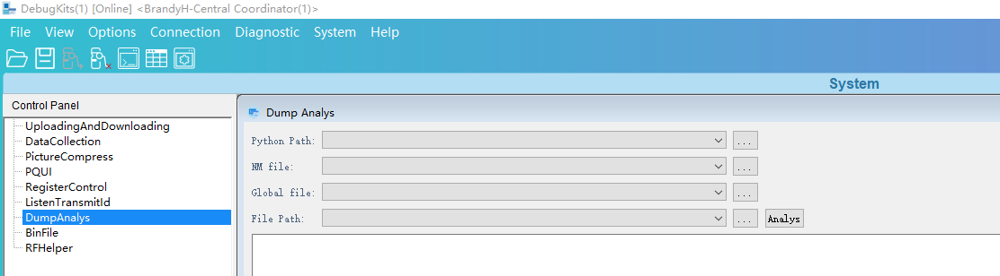

        -   Python Path是解析脚本的路径，需要用户选取，例如/output/bx2x/acore/<target-name\>/parse\_tool/ parse\_main\_\*\*\*\*\_phase2.py。根据用户使用的OS不同，Liteos版本使用parse\_main\_liteos208\_phase2.py。
        -   NM file为内存解析脚本的输入文件，在版本构建时通过编译命令解析elf文件生成，路径为/output/bx2x/acore/<target-name\>/application.nm。
        -   Global file为内存解析时需要导入的全局变量信息，在版本构建时通过解析脚本的第一步生成，路径为/output/bx2x/acore/<target-name\>/parse\_tool/global.txt。
        -   File Path为待解析的内存文件路径（即通过DebugKits工具导出的内存bin文件的存储路径），只需要选取路径即可，工具会自动加载该路径下相关的.bin文件。

    2.  点击Dump Analys界面的Analys按钮，正常情况下DebugKits工具界面会显示解析结果，并且File Path路径（即工具选取的内存.bin文件路径）下会生成memory\_result.txt解析结果，如果没有显示结果，则参考“[异常处理](异常处理.md)”的介绍进行处理。

        **图 2**  Dump解析结果文件<a name="fig09111234111616"></a>  
        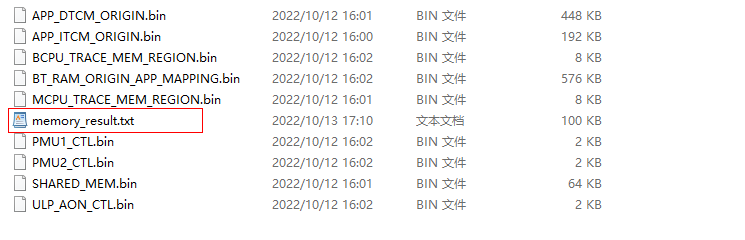

    3.  分析解析结果。

        打开memory\_result.txt文件可以查询到当前的中断信息、任务信息、消息队列、信号量、全局变量、死机信息等。

        **图 3**  Dump解析结果片段<a name="fig1299610121443"></a>  
        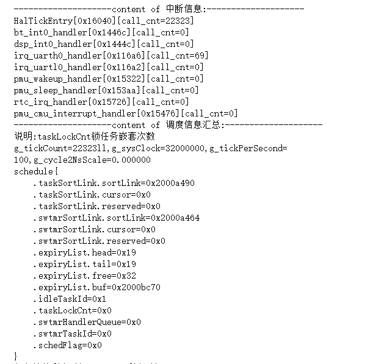

### 异常处理<a name="ZH-CN_TOPIC_0000001790807012"></a>

1.  如果执行Dump解析后DebugKits工具没有显示解析结果，首先需要确认application.nm、application.info文件、parse\_tool脚本及导出的.bin文件是否出自同一个软件版本。不同版本的输入不匹配可能会导致异常。
2.  DebugKits工具导入待解析的.bin文件时选取的是整个目录，要保证DebugKits工具配置文件\\DebugKits\\Source-Datas\\bin\\config\\config.ini中的配置与DumpInfo文件夹下导出文件的地址及大小一致，否则也会导致解析异常。

    可以将config.ini中的DumpInfo配置项与源码middleware\\chips\\bx2x\\dfx\\last\_dump\_adapt.c中的g\_mem\_dump\_info数组中的元素进行对比。如不一致，则要按照g\_mem\_dump\_info数组的定义修改config.ini中的DumpInfo配置项。

    例如[图1](#fig11424194165912)中的APP\_ITCM\_ORIGIN\_StartAddr的值应该等于[图2](#fig169099423153)中的APP\_ITCM\_ORIGIN的值，APP\_ITCM\_ORIGIN\_Length的值应该等于APP\_ITCM\_LENGTH的值。

    **图 1**  config.ini中配置信息<a name="fig11424194165912"></a>  
    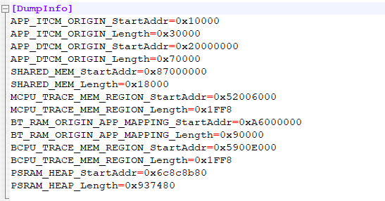

    **图 2**  g\_mem\_dump\_info数组<a name="fig169099423153"></a>  
    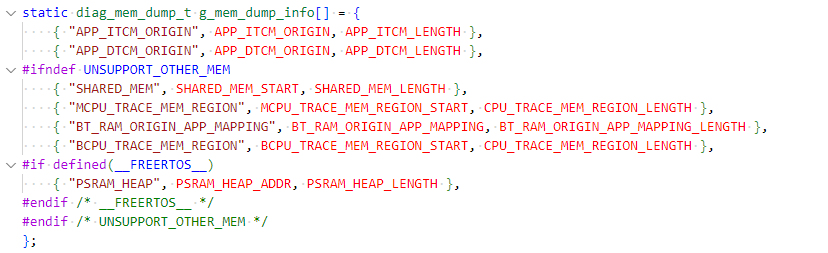

3.  上述两点都排查无误后，需要手工执行脚本进行问题定位。

    方法如下：

    1.  打开DebugKits工具安装目录下的log.txt，找到工具调用解析脚本的命令。[图3](#fig1279412154)中cmd后面双引号内的内容即执行dump解析的命令，注意需要删除其中的转义字符“\\”。

        **图 3**  DebugKits工具调用解析脚本的命令<a name="fig1279412154"></a>  
        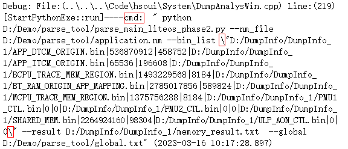

    2.  将命令拷贝到cmd窗口执行，可以看到解析脚本的执行结果。[图4](#fig15249427161813)中是正确执行的结果。如果出现错误，可以根据错误提示，进一步定位问题。

        **图 4**  Dump解析在命令行窗口执行结果<a name="fig15249427161813"></a>  
        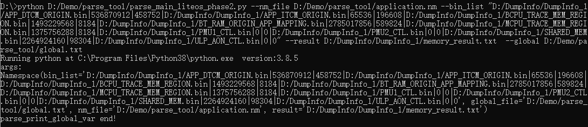

