# 前言<a name="ZH-CN_TOPIC_0000001664984038"></a>

**概述<a name="section4537382116410"></a>**

本文档主要介绍BS2X设备驱动开发的相关内容，主要包括工作原理、按场景描述接口使用方法和注意事项。

本文档以BS21为例进行说明示例，后续不再单独说明，请用户知悉。

所有的驱动接口都有返回值，用户使用时，建议每个接口都进行下返回值校验，根据返回值，判断是否执行成功。返回值错误码详见“include/errcode.h”。

**产品版本<a name="section12266191774710"></a>**

<a name="table2270181717471"></a>
<table><thead align="left"><tr id="row15364171712479"><th class="cellrowborder" valign="top" width="31.759999999999998%" id="mcps1.1.3.1.1"><p id="p123646174478"><a name="p123646174478"></a><a name="p123646174478"></a><strong id="b4974171818546"><a name="b4974171818546"></a><a name="b4974171818546"></a>产品名称</strong></p>
</th>
<th class="cellrowborder" valign="top" width="68.24%" id="mcps1.1.3.1.2"><p id="p1936401717470"><a name="p1936401717470"></a><a name="p1936401717470"></a><strong id="b14976118115417"><a name="b14976118115417"></a><a name="b14976118115417"></a>产品版本</strong></p>
</th>
</tr>
</thead>
<tbody><tr id="row19364317104716"><td class="cellrowborder" valign="top" width="31.759999999999998%" headers="mcps1.1.3.1.1 "><p id="p14623132513473"><a name="p14623132513473"></a><a name="p14623132513473"></a>BS2X</p>
</td>
<td class="cellrowborder" valign="top" width="68.24%" headers="mcps1.1.3.1.2 "><p id="p56214251471"><a name="p56214251471"></a><a name="p56214251471"></a>V100</p>
</td>
</tr>
</tbody>
</table>

**读者对象<a name="section4378592816410"></a>**

本文档主要适用于以下工程师：

-   技术支持工程师
-   软件开发工程师

**符号约定<a name="section133020216410"></a>**

在本文中可能出现下列标志，它们所代表的含义如下。

<a name="table2622507016410"></a>
<table><thead align="left"><tr id="row1530720816410"><th class="cellrowborder" valign="top" width="20.580000000000002%" id="mcps1.1.3.1.1"><p id="p6450074116410"><a name="p6450074116410"></a><a name="p6450074116410"></a><strong id="b2136615816410"><a name="b2136615816410"></a><a name="b2136615816410"></a>符号</strong></p>
</th>
<th class="cellrowborder" valign="top" width="79.42%" id="mcps1.1.3.1.2"><p id="p5435366816410"><a name="p5435366816410"></a><a name="p5435366816410"></a><strong id="b5941558116410"><a name="b5941558116410"></a><a name="b5941558116410"></a>说明</strong></p>
</th>
</tr>
</thead>
<tbody><tr id="row1372280416410"><td class="cellrowborder" valign="top" width="20.580000000000002%" headers="mcps1.1.3.1.1 "><p id="p3734547016410"><a name="p3734547016410"></a><a name="p3734547016410"></a><a name="image2670064316410"></a><a name="image2670064316410"></a><span></span></p>
</td>
<td class="cellrowborder" valign="top" width="79.42%" headers="mcps1.1.3.1.2 "><p id="p1757432116410"><a name="p1757432116410"></a><a name="p1757432116410"></a>表示如不避免则将会导致死亡或严重伤害的具有高等级风险的危害。</p>
</td>
</tr>
<tr id="row466863216410"><td class="cellrowborder" valign="top" width="20.580000000000002%" headers="mcps1.1.3.1.1 "><p id="p1432579516410"><a name="p1432579516410"></a><a name="p1432579516410"></a><a name="image4895582316410"></a><a name="image4895582316410"></a><span></span></p>
</td>
<td class="cellrowborder" valign="top" width="79.42%" headers="mcps1.1.3.1.2 "><p id="p959197916410"><a name="p959197916410"></a><a name="p959197916410"></a>表示如不避免则可能导致死亡或严重伤害的具有中等级风险的危害。</p>
</td>
</tr>
<tr id="row123863216410"><td class="cellrowborder" valign="top" width="20.580000000000002%" headers="mcps1.1.3.1.1 "><p id="p1232579516410"><a name="p1232579516410"></a><a name="p1232579516410"></a><a name="image1235582316410"></a><a name="image1235582316410"></a><span></span></p>
</td>
<td class="cellrowborder" valign="top" width="79.42%" headers="mcps1.1.3.1.2 "><p id="p123197916410"><a name="p123197916410"></a><a name="p123197916410"></a>表示如不避免则可能导致轻微或中度伤害的具有低等级风险的危害。</p>
</td>
</tr>
<tr id="row5786682116410"><td class="cellrowborder" valign="top" width="20.580000000000002%" headers="mcps1.1.3.1.1 "><p id="p2204984716410"><a name="p2204984716410"></a><a name="p2204984716410"></a><a name="image4504446716410"></a><a name="image4504446716410"></a><span></span></p>
</td>
<td class="cellrowborder" valign="top" width="79.42%" headers="mcps1.1.3.1.2 "><p id="p4388861916410"><a name="p4388861916410"></a><a name="p4388861916410"></a>用于传递设备或环境安全警示信息。如不避免则可能会导致设备损坏、数据丢失、设备性能降低或其它不可预知的结果。</p>
<p id="p1238861916410"><a name="p1238861916410"></a><a name="p1238861916410"></a>“须知”不涉及人身伤害。</p>
</td>
</tr>
<tr id="row2856923116410"><td class="cellrowborder" valign="top" width="20.580000000000002%" headers="mcps1.1.3.1.1 "><p id="p5555360116410"><a name="p5555360116410"></a><a name="p5555360116410"></a><a name="image799324016410"></a><a name="image799324016410"></a><span></span></p>
</td>
<td class="cellrowborder" valign="top" width="79.42%" headers="mcps1.1.3.1.2 "><p id="p4612588116410"><a name="p4612588116410"></a><a name="p4612588116410"></a>对正文中重点信息的补充说明。</p>
<p id="p1232588116410"><a name="p1232588116410"></a><a name="p1232588116410"></a>“说明”不是安全警示信息，不涉及人身、设备及环境伤害信息。</p>
</td>
</tr>
</tbody>
</table>

**修改记录<a name="section2467512116410"></a>**

<a name="table1557726816410"></a>
<table><thead align="left"><tr id="row2942532716410"><th class="cellrowborder" valign="top" width="18.7%" id="mcps1.1.4.1.1"><p id="p3778275416410"><a name="p3778275416410"></a><a name="p3778275416410"></a><strong id="b5687322716410"><a name="b5687322716410"></a><a name="b5687322716410"></a>文档版本</strong></p>
</th>
<th class="cellrowborder" valign="top" width="20.24%" id="mcps1.1.4.1.2"><p id="p5627845516410"><a name="p5627845516410"></a><a name="p5627845516410"></a><strong id="b5800814916410"><a name="b5800814916410"></a><a name="b5800814916410"></a>发布日期</strong></p>
</th>
<th class="cellrowborder" valign="top" width="61.06%" id="mcps1.1.4.1.3"><p id="p2382284816410"><a name="p2382284816410"></a><a name="p2382284816410"></a><strong id="b3316380216410"><a name="b3316380216410"></a><a name="b3316380216410"></a>修改说明</strong></p>
</th>
</tr>
</thead>
<tbody><tr id="row38251145121716"><td class="cellrowborder" valign="top" width="18.7%" headers="mcps1.1.4.1.1 "><p id="p78261345151715"><a name="p78261345151715"></a><a name="p78261345151715"></a><span id="ph330444731712"><a name="ph330444731712"></a><a name="ph330444731712"></a>05</span></p>
</td>
<td class="cellrowborder" valign="top" width="20.24%" headers="mcps1.1.4.1.2 "><p id="p682619456178"><a name="p682619456178"></a><a name="p682619456178"></a><span id="ph15182114941717"><a name="ph15182114941717"></a><a name="ph15182114941717"></a>2025-03-26</span></p>
</td>
<td class="cellrowborder" valign="top" width="61.06%" headers="mcps1.1.4.1.3 "><a name="ul63460595179"></a><a name="ul63460595179"></a><ul id="ul63460595179"><li>更新“<a href="Pinctrl.md">Pinctrl</a>”章节内容。</li><li>更新“<a href="SPI.md">SPI</a>”章节内容。</li><li>更新“<a href="KCONFIG配置-17.md">KCONFIG配置</a>”章节内容。</li><li>更新“<a href="ADC.md">ADC</a>”章节内容。</li><li>更新“<a href="Flash.md">Flash</a>”章节内容。</li><li>更新“<a href="PDM.md">PDM</a>”章节内容。</li></ul>
</td>
</tr>
<tr id="row164061558155320"><td class="cellrowborder" valign="top" width="18.7%" headers="mcps1.1.4.1.1 "><p id="p1440611586536"><a name="p1440611586536"></a><a name="p1440611586536"></a>04</p>
</td>
<td class="cellrowborder" valign="top" width="20.24%" headers="mcps1.1.4.1.2 "><p id="p640615810534"><a name="p640615810534"></a><a name="p640615810534"></a>2025-01-24</p>
</td>
<td class="cellrowborder" valign="top" width="61.06%" headers="mcps1.1.4.1.3 "><a name="ul615755620593"></a><a name="ul615755620593"></a><ul id="ul615755620593"><li>更新“<a href="Pinctrl.md">Pinctrl</a>”章节内容。</li><li>更新“<a href="GPIO.md">GPIO</a>”章节内容。</li><li>更新“<a href="UART.md">UART</a>”章节内容。</li><li>更新“<a href="SPI.md">SPI</a>”章节内容。</li><li>更新“<a href="ADC.md">ADC</a>”章节内容。</li><li>更新“<a href="注意事项-29.md">注意事项</a>”章节内容。</li><li>更新“<a href="功能描述-56.md">功能描述</a>”章节内容。</li><li>更新“<a href="开发指引-72.md">开发指引</a>”章节内容。</li></ul>
</td>
</tr>
<tr id="row414616224214"><td class="cellrowborder" valign="top" width="18.7%" headers="mcps1.1.4.1.1 "><p id="p1814732211217"><a name="p1814732211217"></a><a name="p1814732211217"></a>03</p>
</td>
<td class="cellrowborder" valign="top" width="20.24%" headers="mcps1.1.4.1.2 "><p id="p121473221426"><a name="p121473221426"></a><a name="p121473221426"></a>2024-08-29</p>
</td>
<td class="cellrowborder" valign="top" width="61.06%" headers="mcps1.1.4.1.3 "><a name="ul1445518311325"></a><a name="ul1445518311325"></a><ul id="ul1445518311325"><li>更新“<a href="UART.md">UART</a>”~“<a href="KEYSCAN.md">KEYSCAN</a>”章节内容。</li><li>新增“<a href="附-MIDDLEWARE.md">附：MIDDLEWARE</a>”章节内容。</li></ul>
</td>
</tr>
<tr id="row56526215381"><td class="cellrowborder" valign="top" width="18.7%" headers="mcps1.1.4.1.1 "><p id="p196527203819"><a name="p196527203819"></a><a name="p196527203819"></a>02</p>
</td>
<td class="cellrowborder" valign="top" width="20.24%" headers="mcps1.1.4.1.2 "><p id="p26526219385"><a name="p26526219385"></a><a name="p26526219385"></a>2024-07-05</p>
</td>
<td class="cellrowborder" valign="top" width="61.06%" headers="mcps1.1.4.1.3 "><a name="ul61901041124413"></a><a name="ul61901041124413"></a><ul id="ul61901041124413"><li>更新“<a href="GPIO.md">GPIO</a>”章节内容。</li><li>更新“<a href="UART.md">UART</a>”章节内容。</li><li>更新“<a href="SPI.md">SPI</a>”章节内容。</li><li>更新“<a href="I2C.md">I2C</a>”章节内容。</li><li>更新“<a href="ADC.md">ADC</a>”章节内容。</li><li>更新“<a href="PWM.md">PWM</a>”章节内容。</li><li>更新“<a href="WDT.md">WDT</a>”章节内容。</li><li>更新“<a href="Timer.md">Timer</a>”章节内容。</li><li>新增“<a href="SFC.md">SFC</a>”章节内容。</li><li>更新“<a href="KEYSCAN.md">KEYSCAN</a>”章节内容。</li></ul>
</td>
</tr>
<tr id="row476215371297"><td class="cellrowborder" valign="top" width="18.7%" headers="mcps1.1.4.1.1 "><p id="p127628371694"><a name="p127628371694"></a><a name="p127628371694"></a>01</p>
</td>
<td class="cellrowborder" valign="top" width="20.24%" headers="mcps1.1.4.1.2 "><p id="p14762133718911"><a name="p14762133718911"></a><a name="p14762133718911"></a>2024-05-24</p>
</td>
<td class="cellrowborder" valign="top" width="61.06%" headers="mcps1.1.4.1.3 "><p id="p169114261115"><a name="p169114261115"></a><a name="p169114261115"></a>第一次正式版本发布。</p>
<p id="p1283729124819"><a name="p1283729124819"></a><a name="p1283729124819"></a>新增“<a href="zh-cn_topic_0000001893716542.md">CAN（仅限BS21A使用）</a>”章节内容。</p>
</td>
</tr>
<tr id="row17170182910502"><td class="cellrowborder" valign="top" width="18.7%" headers="mcps1.1.4.1.1 "><p id="p71709297505"><a name="p71709297505"></a><a name="p71709297505"></a>00B03</p>
</td>
<td class="cellrowborder" valign="top" width="20.24%" headers="mcps1.1.4.1.2 "><p id="p1017016291507"><a name="p1017016291507"></a><a name="p1017016291507"></a>2024-03-01</p>
</td>
<td class="cellrowborder" valign="top" width="61.06%" headers="mcps1.1.4.1.3 "><a name="ul086961118191"></a><a name="ul086961118191"></a><ul id="ul086961118191"><li>新增“<a href="ADC.md">ADC</a>”章节内容。</li><li>新增“<a href="Flash.md">Flash</a>”章节内容。</li></ul>
</td>
</tr>
<tr id="row1451783420416"><td class="cellrowborder" valign="top" width="18.7%" headers="mcps1.1.4.1.1 "><p id="p45178349411"><a name="p45178349411"></a><a name="p45178349411"></a>00B02</p>
</td>
<td class="cellrowborder" valign="top" width="20.24%" headers="mcps1.1.4.1.2 "><p id="p139931361649"><a name="p139931361649"></a><a name="p139931361649"></a>2023-10-27</p>
</td>
<td class="cellrowborder" valign="top" width="61.06%" headers="mcps1.1.4.1.3 "><p id="p13313221169"><a name="p13313221169"></a><a name="p13313221169"></a>新增“<a href="USB_DFU.md">USB_DFU</a>”章节内容。</p>
</td>
</tr>
<tr id="row5947359616410"><td class="cellrowborder" valign="top" width="18.7%" headers="mcps1.1.4.1.1 "><p id="p2149706016410"><a name="p2149706016410"></a><a name="p2149706016410"></a>00B01</p>
</td>
<td class="cellrowborder" valign="top" width="20.24%" headers="mcps1.1.4.1.2 "><p id="p648803616410"><a name="p648803616410"></a><a name="p648803616410"></a>2023-09-27</p>
</td>
<td class="cellrowborder" valign="top" width="61.06%" headers="mcps1.1.4.1.3 "><p id="p1946537916410"><a name="p1946537916410"></a><a name="p1946537916410"></a>第一次临时版本发布。</p>
</td>
</tr>
</tbody>
</table>

# Pinctrl<a name="ZH-CN_TOPIC_0000001665143778"></a>


## 概述<a name="ZH-CN_TOPIC_0000001713103581"></a>

提供Pinctrl控制器用于控制IO管脚的复用功能，可配置规格如下：

-   支持配置32个IO管脚。
-   支持配置IO驱动能力、IO功能复用以及设置IO上下拉状态等功能。

## 功能描述<a name="ZH-CN_TOPIC_0000001665143782"></a>

Pinctrl驱动模块提供的接口及功能如下：

-   uapi\_pin\_init（void）：初始化Pinctrl。
-   uapi\_pin\_deinit（void）：去初始化Pinctrl。
-   uapi\_pin\_set\_mode（pin\_t pin, pin\_mode\_t mode）：设置指定IO复用模式（pin表示当前IO管脚，mode表示当前引脚需要配置的复用模式）。
-   uapi\_pin\_get\_mode（pin\_t pin）：获取指定IO的复用模式（pin表示当前IO管脚）。
-   uapi\_pin\_set\_ds（pin\_t pin, pin\_drive\_strength\_t ds）：设置指定IO驱动能力（pin表示当前IO管脚，ds表示当前引脚需要配置的驱动能力）。
-   uapi\_pin\_get\_ds（pin\_t pin）：获取指定IO驱动能力（pin表示当前IO管脚）。
-   uapi\_pin\_set\_pull（pin\_t pin, pin\_pull\_t pull\_type）：设置指定IO的上拉/下拉状态（pin表示当前IO管脚，pull\_type表示当前引脚需要配置的上下拉状态）。
-   uapi\_pin\_get\_pull（pin\_t pin）：获取指定IO的上拉/下拉状态（pin表示当前IO管脚）。
-   uapi\_pin\_set\_ie（pin\_t pin，pin\_input\_enable\_t ie）：设置指定IO的IE使能/去使能（pin表示当前IO管脚，ie表示当前引脚需要配置的输入中断使能状态）。（打开CONFIG\_PINCTRL\_SUPPORT\_IE宏才能使用）
-   uapi\_pin\_get\_ie（pin\_t pin）：获取指定IO的IE使能/去使能（pin表示当前IO管脚）。（打开CONFIG\_PINCTRL\_SUPPORT\_IE宏才能使用）

## KCONFIG配置<a name="ZH-CN_TOPIC_0000001896045838"></a>

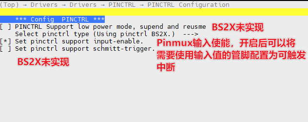

> **说明：** 
>若上述图片所示与[表1](#table16629938173916)描述不一致，请以[表1](#table16629938173916)为准。

配置宏具体描述如[表1](#table16629938173916)所示。

**表 1**  PINCTRL相关宏描述

<a name="table16629938173916"></a>
<table><thead align="left"><tr id="row1462913813915"><th class="cellrowborder" valign="top" width="22.657734226577347%" id="mcps1.2.7.1.1"><p id="p1962923853920"><a name="p1962923853920"></a><a name="p1962923853920"></a>宏名称（CONFIG_是默认添加的前缀）</p>
</th>
<th class="cellrowborder" valign="top" width="21.1078892110789%" id="mcps1.2.7.1.2"><p id="p962916388395"><a name="p962916388395"></a><a name="p962916388395"></a>kconfig界面显示的具体描述</p>
</th>
<th class="cellrowborder" valign="top" width="19.878012198780127%" id="mcps1.2.7.1.3"><p id="p18731420115119"><a name="p18731420115119"></a><a name="p18731420115119"></a>使用场景</p>
</th>
<th class="cellrowborder" valign="top" width="10.618938106189384%" id="mcps1.2.7.1.4"><p id="p537485457"><a name="p537485457"></a><a name="p537485457"></a>是否已经实现</p>
</th>
<th class="cellrowborder" valign="top" width="11.338866113388663%" id="mcps1.2.7.1.5"><p id="p1162915382392"><a name="p1162915382392"></a><a name="p1162915382392"></a>是否依赖其他宏</p>
</th>
<th class="cellrowborder" valign="top" width="14.398560143985604%" id="mcps1.2.7.1.6"><p id="p1162923893911"><a name="p1162923893911"></a><a name="p1162923893911"></a>是否选择打开</p>
</th>
</tr>
</thead>
<tbody><tr id="row16629338103916"><td class="cellrowborder" valign="top" width="22.657734226577347%" headers="mcps1.2.7.1.1 "><p id="p166291338133910"><a name="p166291338133910"></a><a name="p166291338133910"></a>CONFIG_PINCTRL_SUPPORT_LPM</p>
</td>
<td class="cellrowborder" valign="top" width="21.1078892110789%" headers="mcps1.2.7.1.2 "><p id="p106291638163910"><a name="p106291638163910"></a><a name="p106291638163910"></a>PINCTRL support low power mode, supend and reusme.</p>
</td>
<td class="cellrowborder" valign="top" width="19.878012198780127%" headers="mcps1.2.7.1.3 "><p id="p77352085114"><a name="p77352085114"></a><a name="p77352085114"></a>该宏仅用于低功耗情况下使用</p>
</td>
<td class="cellrowborder" valign="top" width="10.618938106189384%" headers="mcps1.2.7.1.4 "><p id="p166297382397"><a name="p166297382397"></a><a name="p166297382397"></a>否</p>
</td>
<td class="cellrowborder" valign="top" width="11.338866113388663%" headers="mcps1.2.7.1.5 "><p id="p162983873917"><a name="p162983873917"></a><a name="p162983873917"></a>否</p>
</td>
<td class="cellrowborder" valign="top" width="14.398560143985604%" headers="mcps1.2.7.1.6 "><p id="p0629838133914"><a name="p0629838133914"></a><a name="p0629838133914"></a>默认打开，本产品实际暂未实现，建议关闭</p>
</td>
</tr>
<tr id="row166299383394"><td class="cellrowborder" valign="top" width="22.657734226577347%" headers="mcps1.2.7.1.1 "><p id="p14629173813920"><a name="p14629173813920"></a><a name="p14629173813920"></a>CONFIG_PINCTRL_USING_BS2X</p>
</td>
<td class="cellrowborder" valign="top" width="21.1078892110789%" headers="mcps1.2.7.1.2 "><p id="p962923816395"><a name="p962923816395"></a><a name="p962923816395"></a>Using pinctrl BS2X.</p>
</td>
<td class="cellrowborder" valign="top" width="19.878012198780127%" headers="mcps1.2.7.1.3 "><p id="p1373182005115"><a name="p1373182005115"></a><a name="p1373182005115"></a>BS2X系列特定宏</p>
</td>
<td class="cellrowborder" valign="top" width="10.618938106189384%" headers="mcps1.2.7.1.4 "><p id="p166291838143916"><a name="p166291838143916"></a><a name="p166291838143916"></a>是</p>
</td>
<td class="cellrowborder" valign="top" width="11.338866113388663%" headers="mcps1.2.7.1.5 "><p id="p2629138193917"><a name="p2629138193917"></a><a name="p2629138193917"></a>否</p>
</td>
<td class="cellrowborder" valign="top" width="14.398560143985604%" headers="mcps1.2.7.1.6 "><p id="p126297381398"><a name="p126297381398"></a><a name="p126297381398"></a>默认打开，必选</p>
</td>
</tr>
<tr id="row3629193823919"><td class="cellrowborder" valign="top" width="22.657734226577347%" headers="mcps1.2.7.1.1 "><p id="p262983811395"><a name="p262983811395"></a><a name="p262983811395"></a>CONFIG_PINCTRL_SUPPORT_IE</p>
</td>
<td class="cellrowborder" valign="top" width="21.1078892110789%" headers="mcps1.2.7.1.2 "><p id="p9629538173914"><a name="p9629538173914"></a><a name="p9629538173914"></a>Set pinctrl support input-enable.</p>
</td>
<td class="cellrowborder" valign="top" width="19.878012198780127%" headers="mcps1.2.7.1.3 "><p id="p117352016518"><a name="p117352016518"></a><a name="p117352016518"></a>该宏代表Pinctrl的输入中断使能，若某个管脚配成输入模式或者有输入功能，要想使其输入值或者输入中断生效，则该宏必须打开，否则视情况选择</p>
</td>
<td class="cellrowborder" valign="top" width="10.618938106189384%" headers="mcps1.2.7.1.4 "><p id="p3629133873917"><a name="p3629133873917"></a><a name="p3629133873917"></a>是</p>
</td>
<td class="cellrowborder" valign="top" width="11.338866113388663%" headers="mcps1.2.7.1.5 "><p id="p062910387397"><a name="p062910387397"></a><a name="p062910387397"></a>否</p>
</td>
<td class="cellrowborder" valign="top" width="14.398560143985604%" headers="mcps1.2.7.1.6 "><p id="p1963621910"><a name="p1963621910"></a><a name="p1963621910"></a>默认打开，建议打开</p>
</td>
</tr>
<tr id="row962920381394"><td class="cellrowborder" valign="top" width="22.657734226577347%" headers="mcps1.2.7.1.1 "><p id="p1629738173912"><a name="p1629738173912"></a><a name="p1629738173912"></a>CONFIG_PINCTRL_SUPPORT_ST</p>
</td>
<td class="cellrowborder" valign="top" width="21.1078892110789%" headers="mcps1.2.7.1.2 "><p id="p186301738203918"><a name="p186301738203918"></a><a name="p186301738203918"></a>Set pinctrl support schmitt-trigger.</p>
</td>
<td class="cellrowborder" valign="top" width="19.878012198780127%" headers="mcps1.2.7.1.3 "><p id="p12731220125113"><a name="p12731220125113"></a><a name="p12731220125113"></a>Pinctrl支持施密特触发</p>
</td>
<td class="cellrowborder" valign="top" width="10.618938106189384%" headers="mcps1.2.7.1.4 "><p id="p7630938143910"><a name="p7630938143910"></a><a name="p7630938143910"></a>否</p>
</td>
<td class="cellrowborder" valign="top" width="11.338866113388663%" headers="mcps1.2.7.1.5 "><p id="p56301938153913"><a name="p56301938153913"></a><a name="p56301938153913"></a>否</p>
</td>
<td class="cellrowborder" valign="top" width="14.398560143985604%" headers="mcps1.2.7.1.6 "><p id="p19630238203917"><a name="p19630238203917"></a><a name="p19630238203917"></a>默认关闭，本产品实际暂未实现，建议关闭</p>
</td>
</tr>
</tbody>
</table>

## 开发指引<a name="ZH-CN_TOPIC_0000001665143786"></a>

Pinctrl接口使用遵循如下操作步骤（以下步骤根据实际需要可选）：

1.  调用uapi\_pin\_init接口，初始化PINCTRL模块。
2.  调用uapi\_pin\_set\_ie、uapi\_pin\_get\_ie接口，设置/查看指定IO的IE输入中断使能/去使能。
3.  调用uapi\_pin\_set\_mode、uapi\_pin\_get\_mode接口，设置/查看指定IO的复用模式。
4.  调用uapi\_pin\_set\_ds、uapi\_pin\_get\_ds接口，设置/查看指定IO的驱动能力。
5.  调用uapi\_pin\_set\_pull、uapi\_pin\_get\_pull接口，设置/查看指定IO的上拉/下拉状态。
6.  调用uapi\_pin\_deinit接口，去初始化PINCTRL模块。

示例：

```
    /* 初始化PINCTRL模块 */ 
    uapi_pin_init();
    /* 设置S_MGPIO19的IE使能 */
    uapi_pin_set_ie(S_MGPIO19, PIN_IE_1);
    /* 设置S_MGPIO19的复用功能为gpio */
    uapi_pin_set_mode(S_MGPIO19, HAL_PIO_FUNC_GPIO);
    /* 获取S_MGPIO19的复用功能为gpio */
    pin_mode_t mode = uapi_pin_get_mode(S_MGPIO19);
    /* 设置S_MGPIO19的驱动能力为PIN_DS_2 */
    uapi_pin_set_ds(S_MGPIO19, PIN_DS_2);
    /* 获取S_MGPIO19的驱动能力为PIN_DS_2 */
    pin_drive_strength_t ds = uapi_pin_get_ds(S_MGPIO19);
    /* 设置S_MGPIO19为上拉模式 */
    uapi_pin_set_pull(S_MGPIO19, PIN_PULL_UP);
    /* 获取S_MGPIO19为上拉模式 */
    pin_pull_t pull = uapi_pin_get_pull(S_MGPIO19);
    /* 去初始化PINCTRL模块 */ 
    uapi_pin_deinit();
```

## 注意事项<a name="ZH-CN_TOPIC_0000001664984034"></a>

1.  配置IO复用功能时，应关注此IO是否支持目标功能或者已经被复用为其他功能，避免影响既有功能， IO复用请参考“sdk\\drivers\\chips\\bs2x\\porting\\pinctrl\\pinctrl\_porting.h”源码中“pin\_mode\_t”结构体的定义。

1.  SDK默认配置的管脚IE全部为使能，一般来说，对于管脚上会发生中断或者承担数据的传输的管脚，要使能IE，避免影响IP功能；除此之外的管脚，可以去使能IE，避免不必要的IO漏电，影响功耗。

    本产品已经将需要IE使能的管脚在对应的驱动内配置完毕。

    配置流程 ：通过函数uapi\_pin\_set\_ie\(pin,  PIN\_IE\_0/PIN\_IE\_1\)去使能/使能IE，并确保CONFIG\_PINCTRL\_SUPPORT\_IE宏打开。

2.  驱动能力PIN\_DS\_0为最弱，PIN\_DS\_3为最强。

> **说明：** 
>如果IE不使能但是注册了gpio低电平中断，CPU会一直收到中断。
>**IE是控制输入中断使能的功能，如果GPIO配置输出为高电平，建议Pinctrl配置上拉，否则会漏电。。**

# GPIO<a name="ZH-CN_TOPIC_0000001664984030"></a>


## 概述<a name="ZH-CN_TOPIC_0000001713023593"></a>

GPIO（General-purpose input/output）是通用输入输出的缩写，是一种通用的I/O接口标准。可以配置为输入或输出模式，以便控制外部设备或与其他设备通信。可用于连接各种设备，如LED灯、传感器、执行器等。

GPIO规格如下：

-   支持设置/获取GPIO管脚方向、设置/获取输出电平状态。
-   支持外部电平中断以及外部边沿中断上报。
-   支持每个GPIO独立中断。

## 功能描述<a name="ZH-CN_TOPIC_0000001713023597"></a>

GPIO模块提供的接口及功能如下：

-   uapi\_gpio\_init（void）：初始化GPIO。
-   uapi\_gpio\_deinit（void）：去初始化GPIO。
-   uapi\_gpio\_set\_dir（pin\_t pin, gpio\_direction\_t dir）：设置指定GPIO方向（输入/输出）（pin表示当前IO管脚，dir表示当前引脚需要配置的输入输出方向）。
-   uapi\_gpio\_get\_dir（pin\_t pin）：获取指定GPIO方向（输入/输出）（pin表示当前IO管脚）。
-   uapi\_gpio\_set\_val（pin\_t pin, gpio\_level\_t level）：设置指定GPIO输出电平状态（pin表示当前IO管脚，level表示当前引脚需要配置的电平状态）。
-   uapi\_gpio\_get\_val（pin\_t pin）：获取指定GPIO的输入电平状态（pin表示当前IO管脚）。
-   uapi\_gpio\_get\_output\_val（pin\_t pin）：获取指定GPIO的输出电平状态（pin表示当前IO管脚）。
-   uapi\_gpio\_toggle（pin\_t pin）：GPIO输出电平状态翻转（pin表示当前IO管脚）。
-   uapi\_gpio\_register\_isr\_func（pin\_t pin, uint32\_t trigger, gpio\_callback\_t callback）：注册指定GPIO中断（pin表示当前IO管脚，trigger表示当前引脚需要配置的中断类型，callback表示当前引脚配置的回调函数）。
-   uapi\_gpio\_unregister\_isr\_func（pin\_t pin）：去注册指定GPIO中断（pin表示当前IO管脚）。
-   uapi\_gpio\_enable\_interrupt（pin\_t pin）：使能GPIO中断（pin表示当前IO管脚）。
-   uapi\_gpio\_disable\_interrupt（pin\_t pin）: 关闭GPIO中断（pin表示当前IO管脚）。
-   uapi\_gpio\_clear\_interrupt（pin\_t pin）：清除GPIO中断（pin表示当前IO管脚）。

## KCONFIG配置<a name="ZH-CN_TOPIC_0000001896206494"></a>

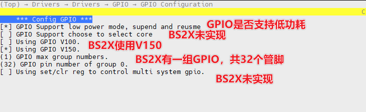

> **说明：** 
>若上述图片所示与[表1](#table16629938173916)描述不一致，请以表格为准。

配置宏具体描述如[表1](#table16629938173916)所示。

**表 1**  GPIO相关宏描述

<a name="table16629938173916"></a>
<table><thead align="left"><tr id="row1462913813915"><th class="cellrowborder" valign="top" width="22.62773722627738%" id="mcps1.2.7.1.1"><p id="p1962923853920"><a name="p1962923853920"></a><a name="p1962923853920"></a>宏名称（CONFIG_是默认添加的前缀）</p>
</th>
<th class="cellrowborder" valign="top" width="21.137886211378866%" id="mcps1.2.7.1.2"><p id="p962916388395"><a name="p962916388395"></a><a name="p962916388395"></a>kconfig界面显示的具体描述</p>
</th>
<th class="cellrowborder" valign="top" width="19.878012198780127%" id="mcps1.2.7.1.3"><p id="p18731420115119"><a name="p18731420115119"></a><a name="p18731420115119"></a>使用场景</p>
</th>
<th class="cellrowborder" valign="top" width="10.618938106189384%" id="mcps1.2.7.1.4"><p id="p537485457"><a name="p537485457"></a><a name="p537485457"></a>是否已经实现</p>
</th>
<th class="cellrowborder" valign="top" width="11.338866113388663%" id="mcps1.2.7.1.5"><p id="p1162915382392"><a name="p1162915382392"></a><a name="p1162915382392"></a>是否依赖其他宏</p>
</th>
<th class="cellrowborder" valign="top" width="14.398560143985604%" id="mcps1.2.7.1.6"><p id="p1449914917569"><a name="p1449914917569"></a><a name="p1449914917569"></a>是否选择打开或修改配置</p>
</th>
</tr>
</thead>
<tbody><tr id="row16629338103916"><td class="cellrowborder" valign="top" width="22.62773722627738%" headers="mcps1.2.7.1.1 "><p id="p166291338133910"><a name="p166291338133910"></a><a name="p166291338133910"></a>CONFIG_GPIO_SUPPORT_LPM</p>
</td>
<td class="cellrowborder" valign="top" width="21.137886211378866%" headers="mcps1.2.7.1.2 "><p id="p106291638163910"><a name="p106291638163910"></a><a name="p106291638163910"></a>GPIO support low power mode, supend and reusme.</p>
</td>
<td class="cellrowborder" valign="top" width="19.878012198780127%" headers="mcps1.2.7.1.3 "><p id="p77352085114"><a name="p77352085114"></a><a name="p77352085114"></a>该宏仅用于低功耗情况下使用</p>
</td>
<td class="cellrowborder" valign="top" width="10.618938106189384%" headers="mcps1.2.7.1.4 "><p id="p166297382397"><a name="p166297382397"></a><a name="p166297382397"></a>是</p>
</td>
<td class="cellrowborder" valign="top" width="11.338866113388663%" headers="mcps1.2.7.1.5 "><p id="p162983873917"><a name="p162983873917"></a><a name="p162983873917"></a>否</p>
</td>
<td class="cellrowborder" valign="top" width="14.398560143985604%" headers="mcps1.2.7.1.6 "><p id="p0629838133914"><a name="p0629838133914"></a><a name="p0629838133914"></a>默认打开，视情况选择，建议打开</p>
</td>
</tr>
<tr id="row166299383394"><td class="cellrowborder" valign="top" width="22.62773722627738%" headers="mcps1.2.7.1.1 "><p id="p14629173813920"><a name="p14629173813920"></a><a name="p14629173813920"></a>CONFIG_GPIO_SELECT_CORE</p>
</td>
<td class="cellrowborder" valign="top" width="21.137886211378866%" headers="mcps1.2.7.1.2 "><p id="p962923816395"><a name="p962923816395"></a><a name="p962923816395"></a>GPIO support choose to select core.</p>
</td>
<td class="cellrowborder" valign="top" width="19.878012198780127%" headers="mcps1.2.7.1.3 "><p id="p1373182005115"><a name="p1373182005115"></a><a name="p1373182005115"></a>GPIO支持多核选择，本产品是单核，不使用</p>
</td>
<td class="cellrowborder" valign="top" width="10.618938106189384%" headers="mcps1.2.7.1.4 "><p id="p166291838143916"><a name="p166291838143916"></a><a name="p166291838143916"></a>否</p>
</td>
<td class="cellrowborder" valign="top" width="11.338866113388663%" headers="mcps1.2.7.1.5 "><p id="p2629138193917"><a name="p2629138193917"></a><a name="p2629138193917"></a>否</p>
</td>
<td class="cellrowborder" valign="top" width="14.398560143985604%" headers="mcps1.2.7.1.6 "><p id="p126297381398"><a name="p126297381398"></a><a name="p126297381398"></a>默认关闭，本产品暂未使用，建议关闭</p>
</td>
</tr>
<tr id="row3629193823919"><td class="cellrowborder" valign="top" width="22.62773722627738%" headers="mcps1.2.7.1.1 "><p id="p262983811395"><a name="p262983811395"></a><a name="p262983811395"></a>CONFIG_GPIO_USING_V100</p>
</td>
<td class="cellrowborder" valign="top" width="21.137886211378866%" headers="mcps1.2.7.1.2 "><p id="p1173515130188"><a name="p1173515130188"></a><a name="p1173515130188"></a>Using GPIO V100.</p>
</td>
<td class="cellrowborder" valign="top" width="19.878012198780127%" headers="mcps1.2.7.1.3 "><p id="p117352016518"><a name="p117352016518"></a><a name="p117352016518"></a>该宏代表使用GPIO V100的驱动规格，本产品不使用该规格</p>
</td>
<td class="cellrowborder" valign="top" width="10.618938106189384%" headers="mcps1.2.7.1.4 "><p id="p3629133873917"><a name="p3629133873917"></a><a name="p3629133873917"></a>是</p>
</td>
<td class="cellrowborder" valign="top" width="11.338866113388663%" headers="mcps1.2.7.1.5 "><p id="p062910387397"><a name="p062910387397"></a><a name="p062910387397"></a>否</p>
</td>
<td class="cellrowborder" valign="top" width="14.398560143985604%" headers="mcps1.2.7.1.6 "><p id="p1963621910"><a name="p1963621910"></a><a name="p1963621910"></a>默认关闭，必须关闭</p>
</td>
</tr>
<tr id="row962920381394"><td class="cellrowborder" valign="top" width="22.62773722627738%" headers="mcps1.2.7.1.1 "><p id="p1629738173912"><a name="p1629738173912"></a><a name="p1629738173912"></a>CONFIG_GPIO_USING_V150</p>
</td>
<td class="cellrowborder" valign="top" width="21.137886211378866%" headers="mcps1.2.7.1.2 "><p id="p1286173422617"><a name="p1286173422617"></a><a name="p1286173422617"></a>Using GPIO V150.</p>
</td>
<td class="cellrowborder" valign="top" width="19.878012198780127%" headers="mcps1.2.7.1.3 "><p id="p1391712438269"><a name="p1391712438269"></a><a name="p1391712438269"></a>该宏代表使用GPIO V150的驱动规格，本产品默认使用该规格</p>
</td>
<td class="cellrowborder" valign="top" width="10.618938106189384%" headers="mcps1.2.7.1.4 "><p id="p7630938143910"><a name="p7630938143910"></a><a name="p7630938143910"></a>是</p>
</td>
<td class="cellrowborder" valign="top" width="11.338866113388663%" headers="mcps1.2.7.1.5 "><p id="p56301938153913"><a name="p56301938153913"></a><a name="p56301938153913"></a>否</p>
</td>
<td class="cellrowborder" valign="top" width="14.398560143985604%" headers="mcps1.2.7.1.6 "><p id="p19630238203917"><a name="p19630238203917"></a><a name="p19630238203917"></a>默认打开，必选</p>
</td>
</tr>
<tr id="row62681237271"><td class="cellrowborder" valign="top" width="22.62773722627738%" headers="mcps1.2.7.1.1 "><p id="p112401826112812"><a name="p112401826112812"></a><a name="p112401826112812"></a>CONFIG_GPIO_BANK_NUM</p>
</td>
<td class="cellrowborder" valign="top" width="21.137886211378866%" headers="mcps1.2.7.1.2 "><p id="p73358962919"><a name="p73358962919"></a><a name="p73358962919"></a>GPIO max group numbers.</p>
</td>
<td class="cellrowborder" valign="top" width="19.878012198780127%" headers="mcps1.2.7.1.3 "><p id="p826922312278"><a name="p826922312278"></a><a name="p826922312278"></a>本产品当前仅支持一组GPIO，默认管脚数是32</p>
</td>
<td class="cellrowborder" valign="top" width="10.618938106189384%" headers="mcps1.2.7.1.4 "><p id="p5269202314277"><a name="p5269202314277"></a><a name="p5269202314277"></a>是</p>
</td>
<td class="cellrowborder" valign="top" width="11.338866113388663%" headers="mcps1.2.7.1.5 "><p id="p2269122314274"><a name="p2269122314274"></a><a name="p2269122314274"></a>否</p>
</td>
<td class="cellrowborder" valign="top" width="14.398560143985604%" headers="mcps1.2.7.1.6 "><p id="p12269623182717"><a name="p12269623182717"></a><a name="p12269623182717"></a>默认值是1，建议不做修改</p>
</td>
</tr>
<tr id="row17817572040"><td class="cellrowborder" valign="top" width="22.62773722627738%" headers="mcps1.2.7.1.1 "><p id="p53019141514"><a name="p53019141514"></a><a name="p53019141514"></a>CONFIG_GPIO0_WIDTH</p>
</td>
<td class="cellrowborder" valign="top" width="21.137886211378866%" headers="mcps1.2.7.1.2 "><p id="p36957616613"><a name="p36957616613"></a><a name="p36957616613"></a>GPIO pin number of  group 0.</p>
</td>
<td class="cellrowborder" valign="top" width="19.878012198780127%" headers="mcps1.2.7.1.3 "><p id="p391457342"><a name="p391457342"></a><a name="p391457342"></a>本产品当前仅支持一组GPIO的默认管脚数</p>
</td>
<td class="cellrowborder" valign="top" width="10.618938106189384%" headers="mcps1.2.7.1.4 "><p id="p17919571246"><a name="p17919571246"></a><a name="p17919571246"></a>是</p>
</td>
<td class="cellrowborder" valign="top" width="11.338866113388663%" headers="mcps1.2.7.1.5 "><p id="p79175714418"><a name="p79175714418"></a><a name="p79175714418"></a>否</p>
</td>
<td class="cellrowborder" valign="top" width="14.398560143985604%" headers="mcps1.2.7.1.6 "><p id="p10915715416"><a name="p10915715416"></a><a name="p10915715416"></a>默认值是32，建议不做修改</p>
</td>
</tr>
<tr id="row040511461781"><td class="cellrowborder" valign="top" width="22.62773722627738%" headers="mcps1.2.7.1.1 "><p id="p2085465116817"><a name="p2085465116817"></a><a name="p2085465116817"></a>CONFIG_GPIO_SUPPORT_MULTISYSTEM</p>
</td>
<td class="cellrowborder" valign="top" width="21.137886211378866%" headers="mcps1.2.7.1.2 "><p id="p2424598911"><a name="p2424598911"></a><a name="p2424598911"></a>Using set/clr reg to control multi system gpio.</p>
</td>
<td class="cellrowborder" valign="top" width="19.878012198780127%" headers="mcps1.2.7.1.3 "><p id="p10405246788"><a name="p10405246788"></a><a name="p10405246788"></a>GPIO支持多子系统，本产品不使用</p>
</td>
<td class="cellrowborder" valign="top" width="10.618938106189384%" headers="mcps1.2.7.1.4 "><p id="p1640513469812"><a name="p1640513469812"></a><a name="p1640513469812"></a>是</p>
</td>
<td class="cellrowborder" valign="top" width="11.338866113388663%" headers="mcps1.2.7.1.5 "><p id="p194051046681"><a name="p194051046681"></a><a name="p194051046681"></a>否</p>
</td>
<td class="cellrowborder" valign="top" width="14.398560143985604%" headers="mcps1.2.7.1.6 "><p id="p154053469813"><a name="p154053469813"></a><a name="p154053469813"></a>默认关闭，本产品暂未使用，建议关闭</p>
</td>
</tr>
</tbody>
</table>

## 开发指引<a name="ZH-CN_TOPIC_0000001713103585"></a>

GPIO接口使用遵循如下操作步骤：

1.  调用uapi\_pin\_init，uapi\_gpio\_init接口，初始化PINCTRL模块以及GPIO模块。
2.  调用uapi\_pin\_set\_mode接口，将PIN复用为GPIO功能。
3.  根据用户开发需求，可设置GPIO接口为输出、输入和中断模式，设置方法如下：
    -   输出模式：
        1.  调用uapi\_gpio\_set\_dir接口，设置GPIO方向为OUT，可通过调用uapi\_gpio\_get\_dir接口，确定该GPIO方向是否设置合适。
        2.  调用uapi\_gpio\_set\_val接口，设置GPIO输出电平状态（高/低）。

    -   输入模式：
        1.  调用uapi\_gpio\_set\_dir接口，设置GPIO方向为IN，可通过调用uapi\_gpio\_get\_dir接口，确定该GPIO方向是否设置合适。
        2.  调用uapi\_pin\_set\_pull接口，配置pull up\\pull done\\pull none。
        3.  调用uapi\_gpio\_get\_val接口，获取GPIO输入电平状态。

    -   中断模式：
        1.  调用uapi\_gpio\_set\_dir接口，设置GPIO方向为IN，可通过调用uapi\_gpio\_get\_dir接口，确定该GPIO方向是否设置合适。
        2.  调用uapi\_gpio\_register\_isr\_func接口，注册GPIO中断回调函数。
        3.  调用uapi\_gpio\_enable\_interrupt接口，使能GPIO中断。
        4.  调用uapi\_gpio\_unregister\_isr\_func接口，注销GPIO中断回调函数（去注册中断时调用）。
        5.  调用uapi\_gpio\_disable\_interrupt接口，去使能GPIO中断。
        6.  调用uapi\_gpio\_clear\_interrupt接口：清除GPIO中断。

4.  调用uapi\_gpio\_deinit接口，去初始化GPIO模块。

此处以输入模式为例：

```
#include "gpio.h"
void gpio_callback_func(pin_t pin, uintptr_t param)
{
    unused(param);
    uapi_gpio_disable_interrupt(pin);
    osal_printk("PIN:%d interrupt success. \r\n", pin);
}
errcode_t sample_gpio_test(pin_t pin)
{
    uapi_pin_init();
    uapi_gpio_init();
    uapi_pin_set_mode(pin, HAL_PIO_FUNC_GPIO); /* 设置指定IO复用为GPIO模式 */
    uapi_gpio_set_dir(pin, GPIO_DIRECTION_INPUT); /* 设置指定GPIO为输入模式 */
    /* 注册指定GPIO上升沿中断，回调函数为gpio_callback_func */
    if (uapi_gpio_register_isr_func(pin, GPIO_INTERRUPT_RISING_EDGE, gpio_callback_func) != ERRCODE_SUCC) {
        uapi_gpio_unregister_isr_func(pin); /* 清理残留 */
        return ERRCODE_FAIL;
    }
    uapi_gpio_enable_interrupt(pin)；
    return ERRCODE_SUCC;
}
```

## 注意事项<a name="ZH-CN_TOPIC_0000001713103577"></a>

-   在使用GPIO电平中断时，需要在回调函数中清除中断并暂时去使能中短触发，否则会导致系统一直处于中断处理中，无法执行其他功能。
-   触发方式（trigger）在没有明确需求场景时，推荐使用默认配置。

# UART<a name="ZH-CN_TOPIC_0000001665143766"></a>


## 概述<a name="ZH-CN_TOPIC_0000001665143762"></a>

UART（Universal Asynchronous Receiver/Transmitter）是通用异步收发器的缩写，是一种串行、异步、全双工的通信协议，用于设备间的数据传输。UART是最常用的设备间通信协议之一，正确配置后，UART可以配合许多不同类型的涉及发送和接收串行数据的串行协议工作 。

芯片MCU侧提供了3个可配置的UART外设单元：UART0（UART\_L0）、UART1（UART\_H0）、UART2（UART\_L1）。

UART规格如下：

-   支持可编程数据位、可编程停止位、可编程校验位。
-   UART支持流控工作模式，并支持配置RTS水线。
-   提供64×8的TX FIFO以及RX FIFO。
-   支持接收FIFO中断、发送FIFO中断、接收超时中断、错误中断等中断屏蔽与响应。
-   支持DMA数据搬移方式。

## 功能描述<a name="ZH-CN_TOPIC_0000001664984006"></a>

> **说明：** 
>若UART驱动需要支持DMA数据收发，需确保DMA驱动已完成初始化。DMA初始化请参考“[DMA](DMA.md)”进行配置。

驱动代码在include\\driver\\uart.h声明了UART驱动相关函数，提供的接口及功能如下：

-   uapi\_uart\_init（uart\_bus\_t bus, const uart\_pin\_config\_t \*pins, const uart\_attr\_t \*attr, const uart\_extra\_attr\_t \*extra\_attr, uart\_buffer\_config\_t \*uart\_buffer\_config）：初始化UART模块（bus表示当前UART bus串口号，pins表示UART中使用的PIN，包括TX, RX, RTS和CTS，attr表示UART的基础配置参数，extra\_attr表示UART的高级配置参数，uart\_buffer\_config表示指定UART的接收Buffer）。
-   uapi\_uart\_deinit（uart\_bus\_t bus）：去初始化UART（bus表示当前UART bus串口号）。
-   uapi\_uart\_set\_attr（uart\_bus\_t bus, const uart\_attr\_t \*attr）：设置UART配置参数（bus表示当前UART bus串口号，attr表示UART的基础配置参数）。
-   uapi\_uart\_get\_attr（uart\_bus\_t bus, const uart\_attr\_t \*attr）：获取UART配置参数（bus表示当前UART bus串口号，attr表示UART的基础配置参数）。
-   uapi\_uart\_has\_pending\_transmissions（uart\_bus\_t bus）：查询UART是否正在传输数据（bus表示当前UART bus串口号）。
-   uapi\_uart\_rx\_fifo\_is\_empty（uart\_bus\_t bus）：判断RX FIFO是否为空（bus表示当前UART bus串口号）。
-   uapi\_uart\_tx\_fifo\_is\_empty（uart\_bus\_t bus）：判断TX FIFO是否为空（bus表示当前UART bus串口号）。
-   uapi\_uart\_write（uart\_bus\_t bus, const uint8\_t \*buffer, uint32\_t length, uint32\_t timeout）：将数据发送到已经打开的UART上，使用直接发送的方式（bus表示当前UART bus串口号，buffer表示要发送的数据Buffer，length表示要发送的数据Buffer长度，timeout表示超时时间，该参数暂未使用）。（打开CONFIG\_UART\_SUPPORT\_TX宏才能使用）
-   uapi\_uart\_write\_nolock（uart\_bus\_t bus, const uint8\_t \*buffer, uint32\_t length, uint32\_t timeout）：将数据发送到已经打开的UART上，使用直接发送不会锁中断的方式（bus表示当前UART bus串口号，buffer表示要发送的数据Buffer，length表示要发送的数据Buffer长度，timeout表示超时时间，该参数暂未使用）。（打开CONFIG\_UART\_SUPPORT\_TX宏才能使用）
-   uapi\_uart\_write\_int（uart\_bus\_t bus, const uint8\_t \*buffer, uint32\_t length, void \*params, uart\_tx\_callback\_t finished\_with\_buffer\_func）：使用中断模式将数据发送到已打开的UART上，当数据发送完成，会调用回调函数（bus表示当前UART bus串口号，buffer表示要发送的数据Buffer，length表示要发送的数据Buffer长度，params表示传递到完成传输的回调函数的参数，finished\_with\_buffer\_func表示数据发送完成后的回调函数）。（打开CONFIG\_UART\_SUPPORT\_TX宏才能使用）
-   uapi\_uart\_write\_by\_dma（uart\_bus\_t bus, const void \*buffer, uint32\_t length, uart\_write\_dma\_config\_t \*dma\_cfg）：通过DMA发送数据（bus表示当前UART bus串口号，buffer表示要发送的数据Buffer，length表示要发送的数据Buffer长度，dma\_cfg表示发送数据时的DMA配置）。（打开CONFIG\_UART\_SUPPORT\_TX以及CONFIG\_UART\_SUPPORT\_DMA宏才能使用）
-   uapi\_uart\_read\_by\_dma（uart\_bus\_t bus, const void \*buffer, uint32\_t length, uart\_write\_dma\_config\_t \*dma\_cfg）：通过DMA接收数据（bus表示当前UART bus串口号，buffer表示存储接收数据的Buffer，length表示存储接收数据的Buffer长度，dma\_cfg表示接收数据时的DMA配置）。（打开CONFIG\_UART\_SUPPORT\_TX以及CONFIG\_UART\_SUPPORT\_DMA宏才能使用）
-   uapi\_uart\_register\_read\_by\_dma\_callback（uart\_bus\_t bus, uart\_write\_dma\_config\_t \*dma\_cfg）：注册中断触发DMA搬运的回调（bus表示当前UART bus串口号，dma\_cfg表示接收数据时的DMA配置）。

    （打开CONFIG\_UART\_SUPPORT\_TX、CONFIG\_UART\_SUPPORT\_DMA以及CONFIG\_UART\_SUPPORT\_INT\_TRIGGER\_DMA宏才能使用）

-   uapi\_uart\_unregister\_read\_by\_dma\_callback（uart\_bus\_t bus）：去注册中断触发DMA搬运的回调（bus表示当前UART bus串口号）。（打开CONFIG\_UART\_SUPPORT\_TX、CONFIG\_UART\_SUPPORT\_DMA以及CONFIG\_UART\_SUPPORT\_INT\_TRIGGER\_DMA宏才能使用）
-   uapi\_uart\_register\_write\_by\_dma\_callback（uart\_bus\_t bus, uart\_tx\_by\_dma\_callback\_t tx\_dma\_cb）：注册在DMA中断里直接调用DMA写的回调函数（bus表示当前UART bus串口号，tx\_dma\_cb表示DMA完成中断里调用DMA写的回调函数）。（打开CONFIG\_UART\_SUPPORT\_SEND\_IN\_DMA\_ISR宏才能使用）
-   uapi\_uart\_register\_rx\_callback（uart\_bus\_t bus, uart\_rx\_condition\_t condition, uint32\_t size, uart\_rx\_callback\_t callback）：注册接收回调函数，此回调函数会根据触发条件和Size触发（bus表示当前UART bus串口号，condition表示回调触发的条件，size表示如果触发条件涉及到数据长度，该参数就表示需要的数据长度，callback表示接收数据后的回调函数）。（打开CONFIG\_UART\_SUPPORT\_RX宏才能使用）
-   uapi\_uart\_unregister\_rx\_callback（uart\_bus\_t bus）：取消注册接收回调函数（bus表示当前UART bus串口号）。（打开CONFIG\_UART\_SUPPORT\_RX宏才能使用）
-   uapi\_uart\_register\_parity\_error\_callback（uart\_bus\_t bus, uart\_error\_callback\_t callback）：注册奇偶校验错误处理的回调函数（bus表示当前UART bus串口号，callback表示奇偶校验错误处理回调函数）。（打开CONFIG\_UART\_SUPPORT\_RX宏才能使用）
-   uapi\_uart\_register\_frame\_error\_callback（uart\_bus\_t bus, uart\_error\_callback\_t callback）：注册帧错误处理回调函数（bus表示当前UART bus串口号，callback表示帧错误错误处理回调函数）。（打开CONFIG\_UART\_SUPPORT\_RX宏才能使用）
-   uapi\_uart\_register\_overrun\_error\_callback（uart\_bus\_t bus, uart\_error\_callback\_t callback）：注册溢出错误处理回调函数（bus表示当前UART bus串口号，callback表示溢出错误错误处理回调函数）。（打开CONFIG\_UART\_SUPPORT\_RX宏才能使用）
-   uapi\_uart\_read（uart\_bus\_t bus, const uint8\_t \*buffer, uint32\_t length, uint32\_t timeout）：从UART读数据（bus表示当前UART bus串口号，buffer表示存储接收数据的Buffer，length表示存储接收数据的Buffer长度，timeout表示超时时间，该参数暂未使用）。（打开CONFIG\_UART\_SUPPORT\_RX宏才能使用）
-   uapi\_uart\_flush\_rx\_data（uart\_bus\_t bus）：刷新UART接收Buffer中的数据（bus表示当前UART bus串口号）。（打开CONFIG\_UART\_SUPPORT\_RX宏才能使用）
-   uapi\_uart\_update\_rx\_buffer（uart\_bus\_t bus, uint8\_t \*rx\_buffer, uint16\_t rx\_buffer\_size）：更新UART接收Buffer的地址和长度（bus表示当前UART bus串口号，rx\_buffer表示存储接收数据的Buffer，length表示存储接收数据的Buffer长度）。（打开CONFIG\_UART\_SUPPORT\_RX宏才能使用）
-   uapi\_uart\_suspend（uintptr\_t arg）：挂起所有的UART通道，低功耗情况使用（arg表示挂起时所需要的参数）。（打开CONFIG\_UART\_SUPPORT\_LPM宏才能使用）
-   uapi\_uart\_resume（uintptr\_t arg）：恢复所有的UART通道，低功耗情况使用（arg表示恢复时所需要的参数）。（打开CONFIG\_UART\_SUPPORT\_LPM宏才能使用）
-   uart\_port\_lli\_init\_config：配置UART所需管脚的接口，入参为测试需要的UART通道。
-   uapi\_uart\_dma\_send：使用UART-DMA循环链表发送的接口入参为测试所用的UART、发送数据的buffer地址、发送数据的长度和发送数据后的回调函数。回调函数类型为typedef void \(\*uart\_data\_send\_cb\_t\)\(uint8\_t channel, errcode\_t result\) ，errcode\_t result会返回发送数据时出现错误的类型。该接口调用一次发送一次数据，多包传输需要重复调用。该接口内可以通过\(Top\) → Drivers → Drivers → UART → Uart Configuration → Whether DMA need send head or not.的Kconfig来控制是否发送包头，如果要发送不定长的数据包，则必须要发送包头。如果发送定长数据包则可以在DMA初始化配置中确认好数据长度。
-   uapi\_uart\_dma\_recv\_register：使用UART-DMA做接收的初始化接口，入参为测试所用的UART、接收数据的buffer地址、接收数据的长度和接收到数据后的回调函数。回调函数类型为typedef bool \(\*uart\_data\_recv\_cb\_t\)\(uint8\_t channel, uint16\_t length, errcode\_t result\)，返回值的布尔型告知驱动内是否可以继续接受，errcode\_t result会返回接收数据时出现的错误的类型。收数据只需要注册好回调即可自动接收，故只需要调用一次。
-   uapi\_uart\_dma\_recv\_register：恢复UART-DMA循环链表接收的接口,接收方可以选择在uapi\_uart\_dma\_recv\_register函数的回调函数里返回false来暂停接收，在需要恢复接收时调用uapi\_uart\_dma\_lli\_continue\_recv来继续接收。
-   uapi\_uart\_update\_dma\_recv\_buff：切换UART-DMA循环链表接收buffer地址的接口,接收方可以使用该接口来实现如乒乓buffer的功能。


### 中断描述<a name="ZH-CN_TOPIC_0000002023581769"></a>

驱动代码在drivers\\drivers\\hal\\uart\\v151\\hal\_uart\_v151\_regs\_op.h文件里声明了UART中断类型，如下[图1](#fig1254135332116)所示，具体描述可参考[表1](#table2970103418466)。

**图 1**  UART中断类型<a name="fig1254135332116"></a>  
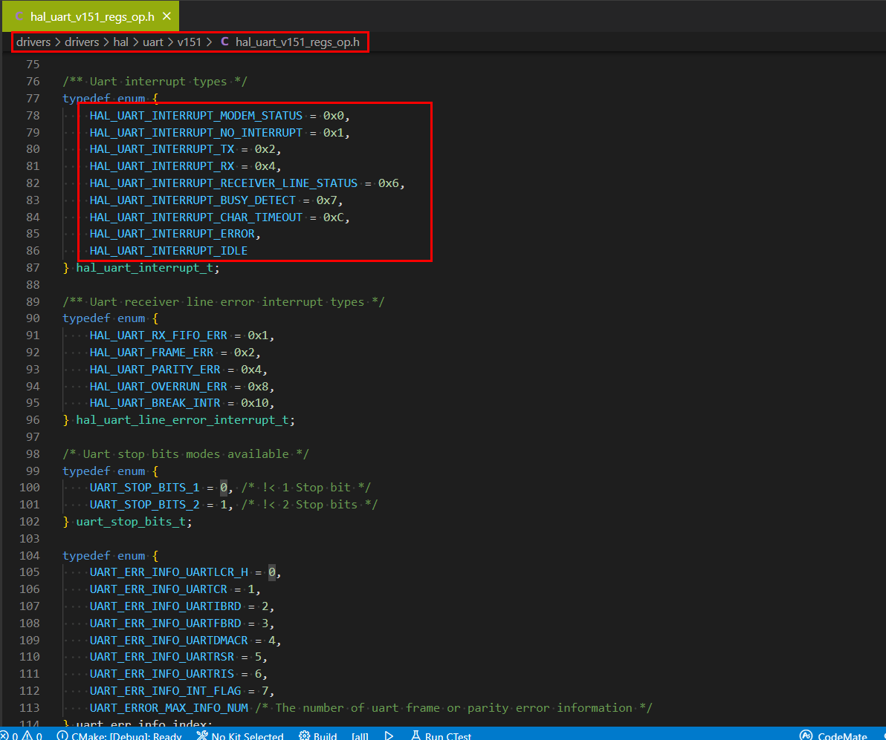

**表 1**  中断描述

<a name="table2970103418466"></a>
<table><thead align="left"><tr id="row6971153414617"><th class="cellrowborder" valign="top" width="14.478552144785523%" id="mcps1.2.5.1.1"><p id="p2097116346466"><a name="p2097116346466"></a><a name="p2097116346466"></a>Interrupt ID</p>
</th>
<th class="cellrowborder" valign="top" width="22.277772222777724%" id="mcps1.2.5.1.2"><p id="p17974667489"><a name="p17974667489"></a><a name="p17974667489"></a>Interrupt  Type</p>
</th>
<th class="cellrowborder" valign="top" width="32.41675832416758%" id="mcps1.2.5.1.3"><p id="p152252210511"><a name="p152252210511"></a><a name="p152252210511"></a>Software Interrupt  Type</p>
</th>
<th class="cellrowborder" valign="top" width="30.826917308269174%" id="mcps1.2.5.1.4"><p id="p197123444612"><a name="p197123444612"></a><a name="p197123444612"></a>Interrupt Source</p>
</th>
</tr>
</thead>
<tbody><tr id="row1597173414461"><td class="cellrowborder" valign="top" width="14.478552144785523%" headers="mcps1.2.5.1.1 "><p id="p597120340468"><a name="p597120340468"></a><a name="p597120340468"></a>0x0</p>
</td>
<td class="cellrowborder" valign="top" width="22.277772222777724%" headers="mcps1.2.5.1.2 "><p id="p5971143418466"><a name="p5971143418466"></a><a name="p5971143418466"></a>Modem status</p>
</td>
<td class="cellrowborder" valign="top" width="32.41675832416758%" headers="mcps1.2.5.1.3 "><p id="p2023122214517"><a name="p2023122214517"></a><a name="p2023122214517"></a>HAL_UART_INTERRUPT_MODEM_STATUS</p>
</td>
<td class="cellrowborder" valign="top" width="30.826917308269174%" headers="mcps1.2.5.1.4 "><p id="p1530041112710"><a name="p1530041112710"></a><a name="p1530041112710"></a>清除发送或数据就绪或数据载体检测。如果启用了自动流控模式，CTS 的更改不会引起中断</p>
<p id="p0411163505211"><a name="p0411163505211"></a><a name="p0411163505211"></a><strong id="b16741943102717"><a name="b16741943102717"></a><a name="b16741943102717"></a>该中断本产品暂不涉及</strong></p>
</td>
</tr>
<tr id="row14971123464614"><td class="cellrowborder" valign="top" width="14.478552144785523%" headers="mcps1.2.5.1.1 "><p id="p79711134194612"><a name="p79711134194612"></a><a name="p79711134194612"></a>0x1</p>
</td>
<td class="cellrowborder" valign="top" width="22.277772222777724%" headers="mcps1.2.5.1.2 "><p id="p1397153474618"><a name="p1397153474618"></a><a name="p1397153474618"></a>None</p>
</td>
<td class="cellrowborder" valign="top" width="32.41675832416758%" headers="mcps1.2.5.1.3 "><p id="p223162217518"><a name="p223162217518"></a><a name="p223162217518"></a>HAL_UART_INTERRUPT_NO_INTERRUPT</p>
</td>
<td class="cellrowborder" valign="top" width="30.826917308269174%" headers="mcps1.2.5.1.4 "><p id="p7971234174611"><a name="p7971234174611"></a><a name="p7971234174611"></a>无</p>
</td>
</tr>
<tr id="row0971834124618"><td class="cellrowborder" valign="top" width="14.478552144785523%" headers="mcps1.2.5.1.1 "><p id="p1971334184618"><a name="p1971334184618"></a><a name="p1971334184618"></a>0x2</p>
</td>
<td class="cellrowborder" valign="top" width="22.277772222777724%" headers="mcps1.2.5.1.2 "><p id="p4971183454610"><a name="p4971183454610"></a><a name="p4971183454610"></a>Transmit holding register empty</p>
</td>
<td class="cellrowborder" valign="top" width="32.41675832416758%" headers="mcps1.2.5.1.3 "><p id="p13238225518"><a name="p13238225518"></a><a name="p13238225518"></a>HAL_UART_INTERRUPT_TX</p>
</td>
<td class="cellrowborder" valign="top" width="30.826917308269174%" headers="mcps1.2.5.1.4 "><p id="p185939542515"><a name="p185939542515"></a><a name="p185939542515"></a>情况一：发送器保持寄存器为空（THRE模式已禁用）</p>
<p id="p179712344469"><a name="p179712344469"></a><a name="p179712344469"></a>情况二：FIFO低于阈值（ THRE模式已启用）</p>
</td>
</tr>
<tr id="row1597183414469"><td class="cellrowborder" valign="top" width="14.478552144785523%" headers="mcps1.2.5.1.1 "><p id="p11971133414465"><a name="p11971133414465"></a><a name="p11971133414465"></a>0x4</p>
</td>
<td class="cellrowborder" valign="top" width="22.277772222777724%" headers="mcps1.2.5.1.2 "><p id="p17971334144612"><a name="p17971334144612"></a><a name="p17971334144612"></a>Received data available</p>
</td>
<td class="cellrowborder" valign="top" width="32.41675832416758%" headers="mcps1.2.5.1.3 "><p id="p223172214516"><a name="p223172214516"></a><a name="p223172214516"></a>HAL_UART_INTERRUPT_RX</p>
</td>
<td class="cellrowborder" valign="top" width="30.826917308269174%" headers="mcps1.2.5.1.4 "><p id="p15609152715250"><a name="p15609152715250"></a><a name="p15609152715250"></a>情况一：接收器数据可用（非 FIFO 模式或 FIFO  禁用）</p>
<p id="p7474115114611"><a name="p7474115114611"></a><a name="p7474115114611"></a>情况二：RCVR FIFO  达到水线触发级别（FIFO  模式和 FIFO 已启用）</p>
</td>
</tr>
<tr id="row1797116348463"><td class="cellrowborder" valign="top" width="14.478552144785523%" headers="mcps1.2.5.1.1 "><p id="p397193417463"><a name="p397193417463"></a><a name="p397193417463"></a>0x6</p>
</td>
<td class="cellrowborder" valign="top" width="22.277772222777724%" headers="mcps1.2.5.1.2 "><p id="p179711434144610"><a name="p179711434144610"></a><a name="p179711434144610"></a>Receiver line status</p>
</td>
<td class="cellrowborder" valign="top" width="32.41675832416758%" headers="mcps1.2.5.1.3 "><p id="p14237228516"><a name="p14237228516"></a><a name="p14237228516"></a>HAL_UART_INTERRUPT_RECEIVER_LINE_STATUS</p>
</td>
<td class="cellrowborder" valign="top" width="30.826917308269174%" headers="mcps1.2.5.1.4 "><p id="p597112342462"><a name="p597112342462"></a><a name="p597112342462"></a>发生溢出/奇偶校验/帧同步错误中断、断点中断或地址接收中断的时候会触发该中断</p>
</td>
</tr>
<tr id="row29711334174615"><td class="cellrowborder" valign="top" width="14.478552144785523%" headers="mcps1.2.5.1.1 "><p id="p497112342466"><a name="p497112342466"></a><a name="p497112342466"></a>0x7</p>
</td>
<td class="cellrowborder" valign="top" width="22.277772222777724%" headers="mcps1.2.5.1.2 "><p id="p69712346468"><a name="p69712346468"></a><a name="p69712346468"></a>Busy detect indication</p>
</td>
<td class="cellrowborder" valign="top" width="32.41675832416758%" headers="mcps1.2.5.1.3 "><p id="p1123162205116"><a name="p1123162205116"></a><a name="p1123162205116"></a>HAL_UART_INTERRUPT_BUSY_DETECT</p>
</td>
<td class="cellrowborder" valign="top" width="30.826917308269174%" headers="mcps1.2.5.1.4 "><p id="p5971153413469"><a name="p5971153413469"></a><a name="p5971153413469"></a>UART工作的时候重新配置UART_CTL寄存器的值会触发该中断</p>
</td>
</tr>
<tr id="row209711034184616"><td class="cellrowborder" valign="top" width="14.478552144785523%" headers="mcps1.2.5.1.1 "><p id="p1297163418462"><a name="p1297163418462"></a><a name="p1297163418462"></a>0xC</p>
</td>
<td class="cellrowborder" valign="top" width="22.277772222777724%" headers="mcps1.2.5.1.2 "><p id="p497183414616"><a name="p497183414616"></a><a name="p497183414616"></a>Character timeout indication</p>
</td>
<td class="cellrowborder" valign="top" width="32.41675832416758%" headers="mcps1.2.5.1.3 "><p id="p142392217519"><a name="p142392217519"></a><a name="p142392217519"></a>HAL_UART_INTERRUPT_CHAR_TIMEOUT</p>
</td>
<td class="cellrowborder" valign="top" width="30.826917308269174%" headers="mcps1.2.5.1.4 "><p id="p179711534104619"><a name="p179711534104619"></a><a name="p179711534104619"></a>原意是指在过去的4个字符时间内，接收器FIFO中没有字符进出，但在此期间至少有1个字符存在（即RX FIFO中有数，但是未达到水线且tx不再发送数据过来，一段时间后会触发该中断）。实际在本产品同0x4中断</p>
</td>
</tr>
<tr id="row1915914611499"><td class="cellrowborder" valign="top" width="14.478552144785523%" headers="mcps1.2.5.1.1 "><p id="p171596469496"><a name="p171596469496"></a><a name="p171596469496"></a>0xD</p>
</td>
<td class="cellrowborder" valign="top" width="22.277772222777724%" headers="mcps1.2.5.1.2 "><p id="p3159164614494"><a name="p3159164614494"></a><a name="p3159164614494"></a>None</p>
</td>
<td class="cellrowborder" valign="top" width="32.41675832416758%" headers="mcps1.2.5.1.3 "><p id="p1123102210514"><a name="p1123102210514"></a><a name="p1123102210514"></a>HAL_UART_INTERRUPT_ERROR</p>
</td>
<td class="cellrowborder" valign="top" width="30.826917308269174%" headers="mcps1.2.5.1.4 "><p id="p69601331427"><a name="p69601331427"></a><a name="p69601331427"></a>实际在本产品同0x6中断</p>
</td>
</tr>
<tr id="row586875054916"><td class="cellrowborder" valign="top" width="14.478552144785523%" headers="mcps1.2.5.1.1 "><p id="p1586855010497"><a name="p1586855010497"></a><a name="p1586855010497"></a>0xE</p>
</td>
<td class="cellrowborder" valign="top" width="22.277772222777724%" headers="mcps1.2.5.1.2 "><p id="p1656148145513"><a name="p1656148145513"></a><a name="p1656148145513"></a>None</p>
</td>
<td class="cellrowborder" valign="top" width="32.41675832416758%" headers="mcps1.2.5.1.3 "><p id="p142310220510"><a name="p142310220510"></a><a name="p142310220510"></a>HAL_UART_INTERRUPT_IDLE</p>
</td>
<td class="cellrowborder" valign="top" width="30.826917308269174%" headers="mcps1.2.5.1.4 "><p id="p086855094916"><a name="p086855094916"></a><a name="p086855094916"></a><strong id="b7961445152712"><a name="b7961445152712"></a><a name="b7961445152712"></a>该中断本产品不涉及</strong></p>
</td>
</tr>
</tbody>
</table>

## KCONFIG配置<a name="ZH-CN_TOPIC_0000001937046649"></a>

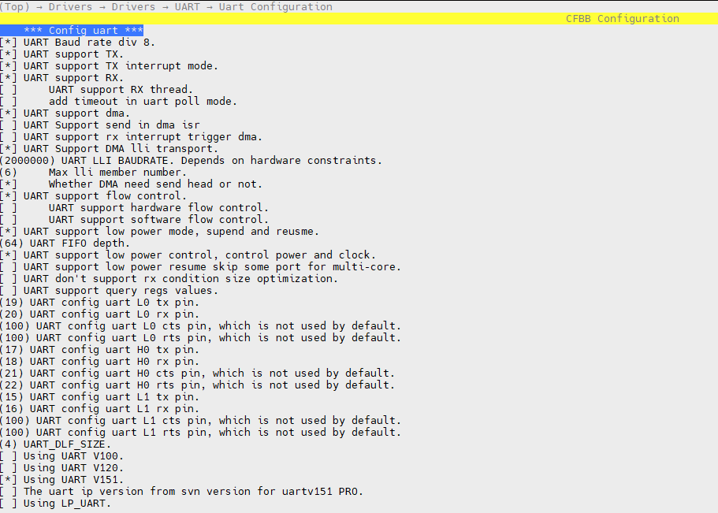

> **说明：** 
>若上述图片所示与表格描述不一致，请以表格为准。

配置宏具体描述如[表1](#table16629938173916)所示。

**表 1**  UART相关宏描述

<a name="table16629938173916"></a>
<table><thead align="left"><tr id="row1462913813915"><th class="cellrowborder" valign="top" width="22.62773722627737%" id="mcps1.2.7.1.1"><p id="p1962923853920"><a name="p1962923853920"></a><a name="p1962923853920"></a>宏名称（CONFIG_是默认添加的前缀）</p>
</th>
<th class="cellrowborder" valign="top" width="21.137886211378863%" id="mcps1.2.7.1.2"><p id="p962916388395"><a name="p962916388395"></a><a name="p962916388395"></a>kconfig界面显示的具体描述</p>
</th>
<th class="cellrowborder" valign="top" width="19.878012198780123%" id="mcps1.2.7.1.3"><p id="p18731420115119"><a name="p18731420115119"></a><a name="p18731420115119"></a>使用场景</p>
</th>
<th class="cellrowborder" valign="top" width="10.608939106089391%" id="mcps1.2.7.1.4"><p id="p537485457"><a name="p537485457"></a><a name="p537485457"></a>是否已经实现</p>
</th>
<th class="cellrowborder" valign="top" width="11.348865113488651%" id="mcps1.2.7.1.5"><p id="p1162915382392"><a name="p1162915382392"></a><a name="p1162915382392"></a>是否依赖其他宏</p>
</th>
<th class="cellrowborder" valign="top" width="14.3985601439856%" id="mcps1.2.7.1.6"><p id="p1162923893911"><a name="p1162923893911"></a><a name="p1162923893911"></a>是否选择打开或修改配置</p>
</th>
</tr>
</thead>
<tbody><tr id="row16629338103916"><td class="cellrowborder" valign="top" width="22.62773722627737%" headers="mcps1.2.7.1.1 "><p id="p166291338133910"><a name="p166291338133910"></a><a name="p166291338133910"></a>CONFIG_UART_BAUD_RATE_DIV_8</p>
</td>
<td class="cellrowborder" valign="top" width="21.137886211378863%" headers="mcps1.2.7.1.2 "><p id="p1773165692817"><a name="p1773165692817"></a><a name="p1773165692817"></a>UART Baud rate div 8.</p>
</td>
<td class="cellrowborder" valign="top" width="19.878012198780123%" headers="mcps1.2.7.1.3 "><p id="p148018553156"><a name="p148018553156"></a><a name="p148018553156"></a>UART采用8分频后的波特率，本产品暂未使用</p>
</td>
<td class="cellrowborder" valign="top" width="10.608939106089391%" headers="mcps1.2.7.1.4 "><p id="p166297382397"><a name="p166297382397"></a><a name="p166297382397"></a>否</p>
</td>
<td class="cellrowborder" valign="top" width="11.348865113488651%" headers="mcps1.2.7.1.5 "><p id="p162983873917"><a name="p162983873917"></a><a name="p162983873917"></a>否</p>
</td>
<td class="cellrowborder" valign="top" width="14.3985601439856%" headers="mcps1.2.7.1.6 "><p id="p142312269162"><a name="p142312269162"></a><a name="p142312269162"></a>默认打开，本产品实际暂未使用，建议关闭</p>
</td>
</tr>
<tr id="row166299383394"><td class="cellrowborder" valign="top" width="22.62773722627737%" headers="mcps1.2.7.1.1 "><p id="p14629173813920"><a name="p14629173813920"></a><a name="p14629173813920"></a>CONFIG_UART_SUPPORT_TX</p>
</td>
<td class="cellrowborder" valign="top" width="21.137886211378863%" headers="mcps1.2.7.1.2 "><p id="p130716441711"><a name="p130716441711"></a><a name="p130716441711"></a>UART support TX.</p>
</td>
<td class="cellrowborder" valign="top" width="19.878012198780123%" headers="mcps1.2.7.1.3 "><p id="p1373182005115"><a name="p1373182005115"></a><a name="p1373182005115"></a>UART支持TX发送，视情况选择，和CONFIG_UART_SUPPORT_RX至少二选一打开，建议都打开</p>
</td>
<td class="cellrowborder" valign="top" width="10.608939106089391%" headers="mcps1.2.7.1.4 "><p id="p166291838143916"><a name="p166291838143916"></a><a name="p166291838143916"></a>是</p>
</td>
<td class="cellrowborder" valign="top" width="11.348865113488651%" headers="mcps1.2.7.1.5 "><p id="p2629138193917"><a name="p2629138193917"></a><a name="p2629138193917"></a>否</p>
</td>
<td class="cellrowborder" valign="top" width="14.3985601439856%" headers="mcps1.2.7.1.6 "><p id="p16717115134416"><a name="p16717115134416"></a><a name="p16717115134416"></a>默认打开，建议打开</p>
</td>
</tr>
<tr id="row3629193823919"><td class="cellrowborder" valign="top" width="22.62773722627737%" headers="mcps1.2.7.1.1 "><p id="p262983811395"><a name="p262983811395"></a><a name="p262983811395"></a>CONFIG_UART_SUPPORT_TX_INT</p>
</td>
<td class="cellrowborder" valign="top" width="21.137886211378863%" headers="mcps1.2.7.1.2 "><p id="p1584710182301"><a name="p1584710182301"></a><a name="p1584710182301"></a>UART support TX interrupt mode.</p>
</td>
<td class="cellrowborder" valign="top" width="19.878012198780123%" headers="mcps1.2.7.1.3 "><p id="p117352016518"><a name="p117352016518"></a><a name="p117352016518"></a>UART支持tx中断模式发送，视情况选择</p>
</td>
<td class="cellrowborder" valign="top" width="10.608939106089391%" headers="mcps1.2.7.1.4 "><p id="p3629133873917"><a name="p3629133873917"></a><a name="p3629133873917"></a>是</p>
</td>
<td class="cellrowborder" valign="top" width="11.348865113488651%" headers="mcps1.2.7.1.5 "><p id="p062910387397"><a name="p062910387397"></a><a name="p062910387397"></a>否</p>
</td>
<td class="cellrowborder" valign="top" width="14.3985601439856%" headers="mcps1.2.7.1.6 "><p id="p732198195217"><a name="p732198195217"></a><a name="p732198195217"></a>默认关闭，建议关闭</p>
</td>
</tr>
<tr id="row962920381394"><td class="cellrowborder" valign="top" width="22.62773722627737%" headers="mcps1.2.7.1.1 "><p id="p1629738173912"><a name="p1629738173912"></a><a name="p1629738173912"></a>CONFIG_UART_SUPPORT_RX</p>
</td>
<td class="cellrowborder" valign="top" width="21.137886211378863%" headers="mcps1.2.7.1.2 "><p id="p6473114617301"><a name="p6473114617301"></a><a name="p6473114617301"></a>UART support RX.</p>
</td>
<td class="cellrowborder" valign="top" width="19.878012198780123%" headers="mcps1.2.7.1.3 "><p id="p7601132985220"><a name="p7601132985220"></a><a name="p7601132985220"></a>UART支持RX接收，视情况选择，和CONFIG_UART_SUPPORT_TX至少二选一打开，建议都打开</p>
</td>
<td class="cellrowborder" valign="top" width="10.608939106089391%" headers="mcps1.2.7.1.4 "><p id="p7630938143910"><a name="p7630938143910"></a><a name="p7630938143910"></a>是</p>
</td>
<td class="cellrowborder" valign="top" width="11.348865113488651%" headers="mcps1.2.7.1.5 "><p id="p56301938153913"><a name="p56301938153913"></a><a name="p56301938153913"></a>否</p>
</td>
<td class="cellrowborder" valign="top" width="14.3985601439856%" headers="mcps1.2.7.1.6 "><p id="p55269547522"><a name="p55269547522"></a><a name="p55269547522"></a>默认打开，建议打开</p>
</td>
</tr>
<tr id="row1279742495"><td class="cellrowborder" valign="top" width="22.62773722627737%" headers="mcps1.2.7.1.1 "><p id="p10803194681011"><a name="p10803194681011"></a><a name="p10803194681011"></a>CONFIG_UART_SUPPORT_RX_THREAD</p>
</td>
<td class="cellrowborder" valign="top" width="21.137886211378863%" headers="mcps1.2.7.1.2 "><p id="p2794422917"><a name="p2794422917"></a><a name="p2794422917"></a>UART support RX thread.</p>
</td>
<td class="cellrowborder" valign="top" width="19.878012198780123%" headers="mcps1.2.7.1.3 "><p id="p187910421994"><a name="p187910421994"></a><a name="p187910421994"></a>UART支持RX线程，本产品暂未使用</p>
</td>
<td class="cellrowborder" valign="top" width="10.608939106089391%" headers="mcps1.2.7.1.4 "><p id="p8794422912"><a name="p8794422912"></a><a name="p8794422912"></a>是</p>
</td>
<td class="cellrowborder" valign="top" width="11.348865113488651%" headers="mcps1.2.7.1.5 "><p id="p77914210916"><a name="p77914210916"></a><a name="p77914210916"></a>CONFIG_UART_SUPPORT_RX</p>
</td>
<td class="cellrowborder" valign="top" width="14.3985601439856%" headers="mcps1.2.7.1.6 "><p id="p147911421296"><a name="p147911421296"></a><a name="p147911421296"></a>默认关闭，本产品实际暂未使用，建议关闭</p>
</td>
</tr>
<tr id="row62681237271"><td class="cellrowborder" valign="top" width="22.62773722627737%" headers="mcps1.2.7.1.1 "><p id="p112401826112812"><a name="p112401826112812"></a><a name="p112401826112812"></a>CONFIG_UART_SUPPORT_DMA</p>
</td>
<td class="cellrowborder" valign="top" width="21.137886211378863%" headers="mcps1.2.7.1.2 "><p id="p73358962919"><a name="p73358962919"></a><a name="p73358962919"></a>UART support dma.</p>
</td>
<td class="cellrowborder" valign="top" width="19.878012198780123%" headers="mcps1.2.7.1.3 "><p id="p2865183705310"><a name="p2865183705310"></a><a name="p2865183705310"></a>UART支持DMA模式，视情况选择，若选择采用UART DMA模式，则需同步选择DMA驱动的KCONFIG配置，请参考“<a href="KCONFIG配置-27.md">KCONFIG配置</a>”</p>
</td>
<td class="cellrowborder" valign="top" width="10.608939106089391%" headers="mcps1.2.7.1.4 "><p id="p5269202314277"><a name="p5269202314277"></a><a name="p5269202314277"></a>是</p>
</td>
<td class="cellrowborder" valign="top" width="11.348865113488651%" headers="mcps1.2.7.1.5 "><p id="p115505376560"><a name="p115505376560"></a><a name="p115505376560"></a>CONFIG_DRIVER_SUPPORT_DMA</p>
</td>
<td class="cellrowborder" valign="top" width="14.3985601439856%" headers="mcps1.2.7.1.6 "><p id="p91685144576"><a name="p91685144576"></a><a name="p91685144576"></a>默认关闭，视情况选择</p>
</td>
</tr>
<tr id="row17817572040"><td class="cellrowborder" valign="top" width="22.62773722627737%" headers="mcps1.2.7.1.1 "><p id="p109831846175713"><a name="p109831846175713"></a><a name="p109831846175713"></a>CONFIG_UART_SUPPORT_INT_TRIGGER_DMA</p>
</td>
<td class="cellrowborder" valign="top" width="21.137886211378863%" headers="mcps1.2.7.1.2 "><p id="p36957616613"><a name="p36957616613"></a><a name="p36957616613"></a>UART support rx interrupt trigger dma.</p>
</td>
<td class="cellrowborder" valign="top" width="19.878012198780123%" headers="mcps1.2.7.1.3 "><p id="p0369111616584"><a name="p0369111616584"></a><a name="p0369111616584"></a>UART支持在RX中断里触发DMA，视情况选择</p>
</td>
<td class="cellrowborder" valign="top" width="10.608939106089391%" headers="mcps1.2.7.1.4 "><p id="p17919571246"><a name="p17919571246"></a><a name="p17919571246"></a>是</p>
</td>
<td class="cellrowborder" valign="top" width="11.348865113488651%" headers="mcps1.2.7.1.5 "><p id="p12620160105914"><a name="p12620160105914"></a><a name="p12620160105914"></a>CONFIG_UART_SUPPORT_DMA</p>
</td>
<td class="cellrowborder" valign="top" width="14.3985601439856%" headers="mcps1.2.7.1.6 "><p id="p182001731221"><a name="p182001731221"></a><a name="p182001731221"></a>默认关闭，视情况选择</p>
</td>
</tr>
<tr id="row13208965433"><td class="cellrowborder" valign="top" width="22.62773722627737%" headers="mcps1.2.7.1.1 "><p id="p188394434"><a name="p188394434"></a><a name="p188394434"></a>CONFIG_UART_SUPPORT_SEND_IN_DMA_ISR</p>
</td>
<td class="cellrowborder" valign="top" width="21.137886211378863%" headers="mcps1.2.7.1.2 "><p id="p158893437"><a name="p158893437"></a><a name="p158893437"></a>UART support send in dma isr.</p>
</td>
<td class="cellrowborder" valign="top" width="19.878012198780123%" headers="mcps1.2.7.1.3 "><p id="p148599438"><a name="p148599438"></a><a name="p148599438"></a>UART支持在DMA中断里发送数据，视情况选择，若选择采用UART DMA模式，则需同步选择DMA驱动的KCONFIG配置，请参考“<a href="KCONFIG配置-27.md">KCONFIG配置</a>”</p>
</td>
<td class="cellrowborder" valign="top" width="10.608939106089391%" headers="mcps1.2.7.1.4 "><p id="p198093439"><a name="p198093439"></a><a name="p198093439"></a>是</p>
</td>
<td class="cellrowborder" valign="top" width="11.348865113488651%" headers="mcps1.2.7.1.5 "><p id="p1381298438"><a name="p1381298438"></a><a name="p1381298438"></a>CONFIG_DRIVER_SUPPORT_DMA</p>
</td>
<td class="cellrowborder" valign="top" width="14.3985601439856%" headers="mcps1.2.7.1.6 "><p id="p13839124310"><a name="p13839124310"></a><a name="p13839124310"></a>默认关闭，视情况选择</p>
</td>
</tr>
<tr id="row1564512592210"><td class="cellrowborder" valign="top" width="22.62773722627737%" headers="mcps1.2.7.1.1 "><p id="p864665912219"><a name="p864665912219"></a><a name="p864665912219"></a>CONFIG_UART_SUPPORT_DMA_LLI</p>
</td>
<td class="cellrowborder" valign="top" width="21.137886211378863%" headers="mcps1.2.7.1.2 "><p id="p1164665915220"><a name="p1164665915220"></a><a name="p1164665915220"></a>UART Support DMA lli transport.</p>
</td>
<td class="cellrowborder" valign="top" width="19.878012198780123%" headers="mcps1.2.7.1.3 "><p id="p126463593210"><a name="p126463593210"></a><a name="p126463593210"></a>UART支持DMA LLI传输</p>
</td>
<td class="cellrowborder" valign="top" width="10.608939106089391%" headers="mcps1.2.7.1.4 "><p id="p14646165910211"><a name="p14646165910211"></a><a name="p14646165910211"></a>是</p>
</td>
<td class="cellrowborder" valign="top" width="11.348865113488651%" headers="mcps1.2.7.1.5 "><p id="p16646125912218"><a name="p16646125912218"></a><a name="p16646125912218"></a>CONFIG_DRIVER_SUPPORT_DMA</p>
</td>
<td class="cellrowborder" valign="top" width="14.3985601439856%" headers="mcps1.2.7.1.6 "><p id="p1364612591122"><a name="p1364612591122"></a><a name="p1364612591122"></a>默认关闭，视情况选择</p>
</td>
</tr>
<tr id="row196625101645"><td class="cellrowborder" valign="top" width="22.62773722627737%" headers="mcps1.2.7.1.1 "><p id="p11662161017417"><a name="p11662161017417"></a><a name="p11662161017417"></a>CONFIG_UART_LLI_BAUDRATE</p>
</td>
<td class="cellrowborder" valign="top" width="21.137886211378863%" headers="mcps1.2.7.1.2 "><p id="p0662110849"><a name="p0662110849"></a><a name="p0662110849"></a>UART LLI BAUDRATE. Depends on hardware constraints.</p>
</td>
<td class="cellrowborder" valign="top" width="19.878012198780123%" headers="mcps1.2.7.1.3 "><p id="p56620108415"><a name="p56620108415"></a><a name="p56620108415"></a>UART使用DMA传输时的波特率</p>
</td>
<td class="cellrowborder" valign="top" width="10.608939106089391%" headers="mcps1.2.7.1.4 "><p id="p2662610146"><a name="p2662610146"></a><a name="p2662610146"></a>是</p>
</td>
<td class="cellrowborder" valign="top" width="11.348865113488651%" headers="mcps1.2.7.1.5 "><p id="p966215105412"><a name="p966215105412"></a><a name="p966215105412"></a>CONFIG_UART_SUPPORT_DMA_LLI</p>
</td>
<td class="cellrowborder" valign="top" width="14.3985601439856%" headers="mcps1.2.7.1.6 "><p id="p566214107413"><a name="p566214107413"></a><a name="p566214107413"></a>默认值是115200，视硬件限制选择</p>
</td>
</tr>
<tr id="row887119364519"><td class="cellrowborder" valign="top" width="22.62773722627737%" headers="mcps1.2.7.1.1 "><p id="p1787173619519"><a name="p1787173619519"></a><a name="p1787173619519"></a>CONFIG_UART_DMA_LLI_MAX_MEMBER</p>
</td>
<td class="cellrowborder" valign="top" width="21.137886211378863%" headers="mcps1.2.7.1.2 "><p id="p128713364511"><a name="p128713364511"></a><a name="p128713364511"></a>Max lli member number.</p>
</td>
<td class="cellrowborder" valign="top" width="19.878012198780123%" headers="mcps1.2.7.1.3 "><p id="p48715366511"><a name="p48715366511"></a><a name="p48715366511"></a>UART LLI发送队列的深度。</p>
</td>
<td class="cellrowborder" valign="top" width="10.608939106089391%" headers="mcps1.2.7.1.4 "><p id="p5871153615515"><a name="p5871153615515"></a><a name="p5871153615515"></a>是</p>
</td>
<td class="cellrowborder" valign="top" width="11.348865113488651%" headers="mcps1.2.7.1.5 "><p id="p587143619510"><a name="p587143619510"></a><a name="p587143619510"></a>CONFIG_UART_SUPPORT_DMA_LLI</p>
</td>
<td class="cellrowborder" valign="top" width="14.3985601439856%" headers="mcps1.2.7.1.6 "><p id="p1087116369520"><a name="p1087116369520"></a><a name="p1087116369520"></a>默认值是6，视情况选择</p>
</td>
</tr>
<tr id="row35161934135"><td class="cellrowborder" valign="top" width="22.62773722627737%" headers="mcps1.2.7.1.1 "><p id="p125165321316"><a name="p125165321316"></a><a name="p125165321316"></a>CONFIG_UART_TX_DMA_NEED_HEADER</p>
</td>
<td class="cellrowborder" valign="top" width="21.137886211378863%" headers="mcps1.2.7.1.2 "><p id="p1451613319138"><a name="p1451613319138"></a><a name="p1451613319138"></a>Whether DMA need send head or not.</p>
</td>
<td class="cellrowborder" valign="top" width="19.878012198780123%" headers="mcps1.2.7.1.3 "><p id="p105164311316"><a name="p105164311316"></a><a name="p105164311316"></a>UART是否发送包头信息。</p>
</td>
<td class="cellrowborder" valign="top" width="10.608939106089391%" headers="mcps1.2.7.1.4 "><p id="p1516143111314"><a name="p1516143111314"></a><a name="p1516143111314"></a>是</p>
</td>
<td class="cellrowborder" valign="top" width="11.348865113488651%" headers="mcps1.2.7.1.5 "><p id="p15161138136"><a name="p15161138136"></a><a name="p15161138136"></a>CONFIG_UART_SUPPORT_DMA_LLI</p>
</td>
<td class="cellrowborder" valign="top" width="14.3985601439856%" headers="mcps1.2.7.1.6 "><p id="p25161339131"><a name="p25161339131"></a><a name="p25161339131"></a>默认开启，如果发送的包长固定则可以关闭。</p>
</td>
</tr>
<tr id="row1071318918131"><td class="cellrowborder" valign="top" width="22.62773722627737%" headers="mcps1.2.7.1.1 "><p id="p671319910134"><a name="p671319910134"></a><a name="p671319910134"></a>CONFIG_UART_SUPPORT_FLOW_CTRL</p>
</td>
<td class="cellrowborder" valign="top" width="21.137886211378863%" headers="mcps1.2.7.1.2 "><p id="p20713179151319"><a name="p20713179151319"></a><a name="p20713179151319"></a>UART support flow control.</p>
</td>
<td class="cellrowborder" valign="top" width="19.878012198780123%" headers="mcps1.2.7.1.3 "><p id="p17131797138"><a name="p17131797138"></a><a name="p17131797138"></a>UART支持流控，该宏只有在调用初始化接口flow_ctrl参数配3的情况下打开才会生效，否则无用</p>
</td>
<td class="cellrowborder" valign="top" width="10.608939106089391%" headers="mcps1.2.7.1.4 "><p id="p1571316971311"><a name="p1571316971311"></a><a name="p1571316971311"></a>是</p>
</td>
<td class="cellrowborder" valign="top" width="11.348865113488651%" headers="mcps1.2.7.1.5 "><p id="p37135917132"><a name="p37135917132"></a><a name="p37135917132"></a>否</p>
</td>
<td class="cellrowborder" valign="top" width="14.3985601439856%" headers="mcps1.2.7.1.6 "><p id="p57965521033"><a name="p57965521033"></a><a name="p57965521033"></a>默认关闭，视情况选择</p>
</td>
</tr>
<tr id="row1663153711314"><td class="cellrowborder" valign="top" width="22.62773722627737%" headers="mcps1.2.7.1.1 "><p id="p13663183721310"><a name="p13663183721310"></a><a name="p13663183721310"></a>CONFIG_UART_SUPPORT_HW_FLOW_CTRL</p>
</td>
<td class="cellrowborder" valign="top" width="21.137886211378863%" headers="mcps1.2.7.1.2 "><p id="p066323716134"><a name="p066323716134"></a><a name="p066323716134"></a>UART support hardware flow control.</p>
</td>
<td class="cellrowborder" valign="top" width="19.878012198780123%" headers="mcps1.2.7.1.3 "><p id="p1166311372137"><a name="p1166311372137"></a><a name="p1166311372137"></a>UART支持硬件流控，本产品暂未使用</p>
</td>
<td class="cellrowborder" valign="top" width="10.608939106089391%" headers="mcps1.2.7.1.4 "><p id="p186635371131"><a name="p186635371131"></a><a name="p186635371131"></a>否</p>
</td>
<td class="cellrowborder" valign="top" width="11.348865113488651%" headers="mcps1.2.7.1.5 "><p id="p1366323711131"><a name="p1366323711131"></a><a name="p1366323711131"></a>CONFIG_UART_SUPPORT_FLOW_CTRL</p>
</td>
<td class="cellrowborder" valign="top" width="14.3985601439856%" headers="mcps1.2.7.1.6 "><p id="p5326122414510"><a name="p5326122414510"></a><a name="p5326122414510"></a>默认关闭，本产品实际暂未实现，建议关闭</p>
</td>
</tr>
<tr id="row1115204491314"><td class="cellrowborder" valign="top" width="22.62773722627737%" headers="mcps1.2.7.1.1 "><p id="p20115184431314"><a name="p20115184431314"></a><a name="p20115184431314"></a>CONFIG_UART_SUPPORT_SW_FLOW_CTRL</p>
</td>
<td class="cellrowborder" valign="top" width="21.137886211378863%" headers="mcps1.2.7.1.2 "><p id="p1211594421319"><a name="p1211594421319"></a><a name="p1211594421319"></a>UART support software flow control.</p>
</td>
<td class="cellrowborder" valign="top" width="19.878012198780123%" headers="mcps1.2.7.1.3 "><p id="p4115184491311"><a name="p4115184491311"></a><a name="p4115184491311"></a>UART支持软件流控，本产品暂未使用</p>
</td>
<td class="cellrowborder" valign="top" width="10.608939106089391%" headers="mcps1.2.7.1.4 "><p id="p9115124411312"><a name="p9115124411312"></a><a name="p9115124411312"></a>否</p>
</td>
<td class="cellrowborder" valign="top" width="11.348865113488651%" headers="mcps1.2.7.1.5 "><p id="p5115544151311"><a name="p5115544151311"></a><a name="p5115544151311"></a>CONFIG_UART_SUPPORT_FLOW_CTRL</p>
</td>
<td class="cellrowborder" valign="top" width="14.3985601439856%" headers="mcps1.2.7.1.6 "><p id="p1518312251351"><a name="p1518312251351"></a><a name="p1518312251351"></a>默认关闭，本产品实际暂未实现，建议关闭</p>
</td>
</tr>
<tr id="row9686349171316"><td class="cellrowborder" valign="top" width="22.62773722627737%" headers="mcps1.2.7.1.1 "><p id="p2068610490135"><a name="p2068610490135"></a><a name="p2068610490135"></a>CONFIG_UART_SUPPORT_LPM</p>
</td>
<td class="cellrowborder" valign="top" width="21.137886211378863%" headers="mcps1.2.7.1.2 "><p id="p16686174971317"><a name="p16686174971317"></a><a name="p16686174971317"></a>UART support low power mode, supend and reusme.</p>
</td>
<td class="cellrowborder" valign="top" width="19.878012198780123%" headers="mcps1.2.7.1.3 "><p id="p77352085114"><a name="p77352085114"></a><a name="p77352085114"></a>该宏仅用于低功耗情况下使用</p>
</td>
<td class="cellrowborder" valign="top" width="10.608939106089391%" headers="mcps1.2.7.1.4 "><p id="p12686184941312"><a name="p12686184941312"></a><a name="p12686184941312"></a>是</p>
</td>
<td class="cellrowborder" valign="top" width="11.348865113488651%" headers="mcps1.2.7.1.5 "><p id="p26871249111313"><a name="p26871249111313"></a><a name="p26871249111313"></a>否</p>
</td>
<td class="cellrowborder" valign="top" width="14.3985601439856%" headers="mcps1.2.7.1.6 "><p id="p0629838133914"><a name="p0629838133914"></a><a name="p0629838133914"></a>默认打开，视情况选择，建议打开</p>
</td>
</tr>
<tr id="row1688144313116"><td class="cellrowborder" valign="top" width="22.62773722627737%" headers="mcps1.2.7.1.1 "><p id="p12881043133120"><a name="p12881043133120"></a><a name="p12881043133120"></a>CONFIG_UART_LOG_WRITE_WITH_NOLOCK</p>
</td>
<td class="cellrowborder" valign="top" width="21.137886211378863%" headers="mcps1.2.7.1.2 "><p id="p12881343163110"><a name="p12881343163110"></a><a name="p12881343163110"></a>UART support write logs with nolock.</p>
</td>
<td class="cellrowborder" valign="top" width="19.878012198780123%" headers="mcps1.2.7.1.3 "><p id="p17881843193112"><a name="p17881843193112"></a><a name="p17881843193112"></a>UART支持不锁中断日志</p>
</td>
<td class="cellrowborder" valign="top" width="10.608939106089391%" headers="mcps1.2.7.1.4 "><p id="p78914430312"><a name="p78914430312"></a><a name="p78914430312"></a>是</p>
</td>
<td class="cellrowborder" valign="top" width="11.348865113488651%" headers="mcps1.2.7.1.5 "><p id="p38913431312"><a name="p38913431312"></a><a name="p38913431312"></a>否</p>
</td>
<td class="cellrowborder" valign="top" width="14.3985601439856%" headers="mcps1.2.7.1.6 "><p id="p689164303111"><a name="p689164303111"></a><a name="p689164303111"></a>默认打开，视情况选择，建议打开</p>
</td>
</tr>
<tr id="row10100123917141"><td class="cellrowborder" valign="top" width="22.62773722627737%" headers="mcps1.2.7.1.1 "><p id="p6359290154"><a name="p6359290154"></a><a name="p6359290154"></a>CONFIG_UART_FIFO_DEPTH</p>
</td>
<td class="cellrowborder" valign="top" width="21.137886211378863%" headers="mcps1.2.7.1.2 "><p id="p5100113916144"><a name="p5100113916144"></a><a name="p5100113916144"></a>UART FIFO depth.</p>
</td>
<td class="cellrowborder" valign="top" width="19.878012198780123%" headers="mcps1.2.7.1.3 "><p id="p151004394147"><a name="p151004394147"></a><a name="p151004394147"></a>UART FIFO深度配置，本产品默认FIFO深度为64，建议保持默认值</p>
</td>
<td class="cellrowborder" valign="top" width="10.608939106089391%" headers="mcps1.2.7.1.4 "><p id="p131001439161420"><a name="p131001439161420"></a><a name="p131001439161420"></a>是</p>
</td>
<td class="cellrowborder" valign="top" width="11.348865113488651%" headers="mcps1.2.7.1.5 "><p id="p110083912148"><a name="p110083912148"></a><a name="p110083912148"></a>否</p>
</td>
<td class="cellrowborder" valign="top" width="14.3985601439856%" headers="mcps1.2.7.1.6 "><p id="p126297381398"><a name="p126297381398"></a><a name="p126297381398"></a>默认值是64，建议不做修改</p>
</td>
</tr>
<tr id="row9604124541418"><td class="cellrowborder" valign="top" width="22.62773722627737%" headers="mcps1.2.7.1.1 "><p id="p1198461021518"><a name="p1198461021518"></a><a name="p1198461021518"></a>CONFIG_UART_SUPPORT_LPC</p>
</td>
<td class="cellrowborder" valign="top" width="21.137886211378863%" headers="mcps1.2.7.1.2 "><p id="p18604645131413"><a name="p18604645131413"></a><a name="p18604645131413"></a>UART support low power control, control power and clock.</p>
</td>
<td class="cellrowborder" valign="top" width="19.878012198780123%" headers="mcps1.2.7.1.3 "><p id="p1605194513147"><a name="p1605194513147"></a><a name="p1605194513147"></a>UART 工作时钟</p>
</td>
<td class="cellrowborder" valign="top" width="10.608939106089391%" headers="mcps1.2.7.1.4 "><p id="p1860512452145"><a name="p1860512452145"></a><a name="p1860512452145"></a>是</p>
</td>
<td class="cellrowborder" valign="top" width="11.348865113488651%" headers="mcps1.2.7.1.5 "><p id="p13605145101411"><a name="p13605145101411"></a><a name="p13605145101411"></a>否</p>
</td>
<td class="cellrowborder" valign="top" width="14.3985601439856%" headers="mcps1.2.7.1.6 "><p id="p1459646100"><a name="p1459646100"></a><a name="p1459646100"></a>默认打开，必选</p>
</td>
</tr>
<tr id="row4155553141"><td class="cellrowborder" valign="top" width="22.62773722627737%" headers="mcps1.2.7.1.1 "><p id="p2119131217152"><a name="p2119131217152"></a><a name="p2119131217152"></a>CONFIG_UART_MULTI_CORE_RESUME</p>
</td>
<td class="cellrowborder" valign="top" width="21.137886211378863%" headers="mcps1.2.7.1.2 "><p id="p1615125519141"><a name="p1615125519141"></a><a name="p1615125519141"></a>UART support low power resume skip some port for multi-core.</p>
</td>
<td class="cellrowborder" valign="top" width="19.878012198780123%" headers="mcps1.2.7.1.3 "><p id="p815135541416"><a name="p815135541416"></a><a name="p815135541416"></a>该宏仅用于多核场景下UART低功耗恢复使用，本产品暂未使用</p>
</td>
<td class="cellrowborder" valign="top" width="10.608939106089391%" headers="mcps1.2.7.1.4 "><p id="p201555511146"><a name="p201555511146"></a><a name="p201555511146"></a>否</p>
</td>
<td class="cellrowborder" valign="top" width="11.348865113488651%" headers="mcps1.2.7.1.5 "><p id="p1280317457132"><a name="p1280317457132"></a><a name="p1280317457132"></a>CONFIG_UART_SUPPORT_LPM</p>
</td>
<td class="cellrowborder" valign="top" width="14.3985601439856%" headers="mcps1.2.7.1.6 "><p id="p31511558144"><a name="p31511558144"></a><a name="p31511558144"></a>默认关闭，本产品实际暂未使用，建议关闭</p>
</td>
</tr>
<tr id="row155854071519"><td class="cellrowborder" valign="top" width="22.62773722627737%" headers="mcps1.2.7.1.1 "><p id="p1289513201519"><a name="p1289513201519"></a><a name="p1289513201519"></a>CONFIG_UART_NOT_SUPPORT_RX_CONDITON_SIZE_OPTIMIZE</p>
</td>
<td class="cellrowborder" valign="top" width="21.137886211378863%" headers="mcps1.2.7.1.2 "><p id="p1158530101513"><a name="p1158530101513"></a><a name="p1158530101513"></a>UART don't support rx condition size optimization.</p>
</td>
<td class="cellrowborder" valign="top" width="19.878012198780123%" headers="mcps1.2.7.1.3 "><p id="p25855014155"><a name="p25855014155"></a><a name="p25855014155"></a>UART不支持RX条件大小优化，主要用来影响回调触发条件</p>
</td>
<td class="cellrowborder" valign="top" width="10.608939106089391%" headers="mcps1.2.7.1.4 "><p id="p145852091517"><a name="p145852091517"></a><a name="p145852091517"></a>是</p>
</td>
<td class="cellrowborder" valign="top" width="11.348865113488651%" headers="mcps1.2.7.1.5 "><p id="p178719416558"><a name="p178719416558"></a><a name="p178719416558"></a>CONFIG_UART_SUPPORT_RX</p>
</td>
<td class="cellrowborder" valign="top" width="14.3985601439856%" headers="mcps1.2.7.1.6 "><p id="p12585190171517"><a name="p12585190171517"></a><a name="p12585190171517"></a>默认关闭，建议关闭</p>
</td>
</tr>
<tr id="row1120612316161"><td class="cellrowborder" valign="top" width="22.62773722627737%" headers="mcps1.2.7.1.1 "><p id="p12207162314169"><a name="p12207162314169"></a><a name="p12207162314169"></a>CONFIG_UART_SUPPORT_QUERY_REGS</p>
</td>
<td class="cellrowborder" valign="top" width="21.137886211378863%" headers="mcps1.2.7.1.2 "><p id="p2020717234168"><a name="p2020717234168"></a><a name="p2020717234168"></a>UART support query regs values.</p>
</td>
<td class="cellrowborder" valign="top" width="19.878012198780123%" headers="mcps1.2.7.1.3 "><p id="p22076234162"><a name="p22076234162"></a><a name="p22076234162"></a>UART支持回读所有相关寄存器的值，视情况选择</p>
</td>
<td class="cellrowborder" valign="top" width="10.608939106089391%" headers="mcps1.2.7.1.4 "><p id="p10207202331613"><a name="p10207202331613"></a><a name="p10207202331613"></a>是</p>
</td>
<td class="cellrowborder" valign="top" width="11.348865113488651%" headers="mcps1.2.7.1.5 "><p id="p22077234164"><a name="p22077234164"></a><a name="p22077234164"></a>否</p>
</td>
<td class="cellrowborder" valign="top" width="14.3985601439856%" headers="mcps1.2.7.1.6 "><p id="p3285141385920"><a name="p3285141385920"></a><a name="p3285141385920"></a>默认关闭，视情况选择</p>
</td>
</tr>
<tr id="row18951740131615"><td class="cellrowborder" valign="top" width="22.62773722627737%" headers="mcps1.2.7.1.1 "><p id="p197481234181715"><a name="p197481234181715"></a><a name="p197481234181715"></a>CONFIG_UART_L0_TX_PIN</p>
</td>
<td class="cellrowborder" valign="top" width="21.137886211378863%" headers="mcps1.2.7.1.2 "><p id="p1795194031611"><a name="p1795194031611"></a><a name="p1795194031611"></a>UART config uart L0 tx pin.</p>
</td>
<td class="cellrowborder" valign="top" width="19.878012198780123%" headers="mcps1.2.7.1.3 "><p id="p139544011168"><a name="p139544011168"></a><a name="p139544011168"></a>UART配置BUS 0即L0的TX 管脚，本产品默认使用SMGPIO19</p>
</td>
<td class="cellrowborder" valign="top" width="10.608939106089391%" headers="mcps1.2.7.1.4 "><p id="p16957407165"><a name="p16957407165"></a><a name="p16957407165"></a>是</p>
</td>
<td class="cellrowborder" valign="top" width="11.348865113488651%" headers="mcps1.2.7.1.5 "><p id="p395194031613"><a name="p395194031613"></a><a name="p395194031613"></a>否</p>
</td>
<td class="cellrowborder" valign="top" width="14.3985601439856%" headers="mcps1.2.7.1.6 "><p id="p13953404160"><a name="p13953404160"></a><a name="p13953404160"></a>默认值是19，建议不做修改</p>
</td>
</tr>
<tr id="row16469746171619"><td class="cellrowborder" valign="top" width="22.62773722627737%" headers="mcps1.2.7.1.1 "><p id="p13831935111710"><a name="p13831935111710"></a><a name="p13831935111710"></a>CONFIG_UART_L0_RX_PIN</p>
</td>
<td class="cellrowborder" valign="top" width="21.137886211378863%" headers="mcps1.2.7.1.2 "><p id="p946904611617"><a name="p946904611617"></a><a name="p946904611617"></a>UART config uart L0 rx pin.</p>
</td>
<td class="cellrowborder" valign="top" width="19.878012198780123%" headers="mcps1.2.7.1.3 "><p id="p56134571811"><a name="p56134571811"></a><a name="p56134571811"></a>UART配置BUS 0即L0的RX 管脚，本产品默认使用SMGPIO20</p>
</td>
<td class="cellrowborder" valign="top" width="10.608939106089391%" headers="mcps1.2.7.1.4 "><p id="p154691146191615"><a name="p154691146191615"></a><a name="p154691146191615"></a>是</p>
</td>
<td class="cellrowborder" valign="top" width="11.348865113488651%" headers="mcps1.2.7.1.5 "><p id="p746920467167"><a name="p746920467167"></a><a name="p746920467167"></a>否</p>
</td>
<td class="cellrowborder" valign="top" width="14.3985601439856%" headers="mcps1.2.7.1.6 "><p id="p91371523322"><a name="p91371523322"></a><a name="p91371523322"></a>默认值是20，建议不做修改</p>
</td>
</tr>
<tr id="row17463553171619"><td class="cellrowborder" valign="top" width="22.62773722627737%" headers="mcps1.2.7.1.1 "><p id="p8789036121717"><a name="p8789036121717"></a><a name="p8789036121717"></a>CONFIG_UART_H0_TX_PIN</p>
</td>
<td class="cellrowborder" valign="top" width="21.137886211378863%" headers="mcps1.2.7.1.2 "><p id="p184631653181611"><a name="p184631653181611"></a><a name="p184631653181611"></a>UART config uart H0 tx pin.</p>
</td>
<td class="cellrowborder" valign="top" width="19.878012198780123%" headers="mcps1.2.7.1.3 "><p id="p2463115311616"><a name="p2463115311616"></a><a name="p2463115311616"></a>UART配置BUS 1即H0的TX 管脚，本产品默认使用SMGPIO17</p>
</td>
<td class="cellrowborder" valign="top" width="10.608939106089391%" headers="mcps1.2.7.1.4 "><p id="p10463185313162"><a name="p10463185313162"></a><a name="p10463185313162"></a>是</p>
</td>
<td class="cellrowborder" valign="top" width="11.348865113488651%" headers="mcps1.2.7.1.5 "><p id="p1246320533166"><a name="p1246320533166"></a><a name="p1246320533166"></a>否</p>
</td>
<td class="cellrowborder" valign="top" width="14.3985601439856%" headers="mcps1.2.7.1.6 "><p id="p858814111435"><a name="p858814111435"></a><a name="p858814111435"></a>默认值是17，建议不做修改</p>
</td>
</tr>
<tr id="row14602145714168"><td class="cellrowborder" valign="top" width="22.62773722627737%" headers="mcps1.2.7.1.1 "><p id="p1677313715179"><a name="p1677313715179"></a><a name="p1677313715179"></a>CONFIG_UART_H0_RX_PIN</p>
</td>
<td class="cellrowborder" valign="top" width="21.137886211378863%" headers="mcps1.2.7.1.2 "><p id="p1360215761612"><a name="p1360215761612"></a><a name="p1360215761612"></a>UART config uart H0 rx pin.</p>
</td>
<td class="cellrowborder" valign="top" width="19.878012198780123%" headers="mcps1.2.7.1.3 "><p id="p8602115731614"><a name="p8602115731614"></a><a name="p8602115731614"></a>UART配置BUS 1即H0的RX 管脚，本产品默认使用SMGPIO18</p>
</td>
<td class="cellrowborder" valign="top" width="10.608939106089391%" headers="mcps1.2.7.1.4 "><p id="p2602175711166"><a name="p2602175711166"></a><a name="p2602175711166"></a>是</p>
</td>
<td class="cellrowborder" valign="top" width="11.348865113488651%" headers="mcps1.2.7.1.5 "><p id="p10602125711615"><a name="p10602125711615"></a><a name="p10602125711615"></a>否</p>
</td>
<td class="cellrowborder" valign="top" width="14.3985601439856%" headers="mcps1.2.7.1.6 "><p id="p542416131533"><a name="p542416131533"></a><a name="p542416131533"></a>默认值是18，建议不做修改</p>
</td>
</tr>
<tr id="row135198402166"><td class="cellrowborder" valign="top" width="22.62773722627737%" headers="mcps1.2.7.1.1 "><p id="p45191940181615"><a name="p45191940181615"></a><a name="p45191940181615"></a>CONFIG_UART_H0_CTS_PIN</p>
</td>
<td class="cellrowborder" valign="top" width="21.137886211378863%" headers="mcps1.2.7.1.2 "><p id="p16519540161619"><a name="p16519540161619"></a><a name="p16519540161619"></a>UART config uart H0 cts pin, which is not used by default.</p>
</td>
<td class="cellrowborder" valign="top" width="19.878012198780123%" headers="mcps1.2.7.1.3 "><p id="p751914081619"><a name="p751914081619"></a><a name="p751914081619"></a>UART配置BUS 1即H0的CTS管脚</p>
</td>
<td class="cellrowborder" valign="top" width="10.608939106089391%" headers="mcps1.2.7.1.4 "><p id="p351934016163"><a name="p351934016163"></a><a name="p351934016163"></a>是</p>
</td>
<td class="cellrowborder" valign="top" width="11.348865113488651%" headers="mcps1.2.7.1.5 "><p id="p1451954014169"><a name="p1451954014169"></a><a name="p1451954014169"></a>CONFIG_UART_SUPPORT_FLOW_CTRL</p>
</td>
<td class="cellrowborder" valign="top" width="14.3985601439856%" headers="mcps1.2.7.1.6 "><p id="p451910406169"><a name="p451910406169"></a><a name="p451910406169"></a>默认值是100，该值不生效，按实际情况配置</p>
</td>
</tr>
<tr id="row1773113105199"><td class="cellrowborder" valign="top" width="22.62773722627737%" headers="mcps1.2.7.1.1 "><p id="p11524131681917"><a name="p11524131681917"></a><a name="p11524131681917"></a>CONFIG_UART_H0_RTS_PIN</p>
</td>
<td class="cellrowborder" valign="top" width="21.137886211378863%" headers="mcps1.2.7.1.2 "><p id="p13524121691916"><a name="p13524121691916"></a><a name="p13524121691916"></a>UART config uart H0 rts pin, which is not used by default.</p>
</td>
<td class="cellrowborder" valign="top" width="19.878012198780123%" headers="mcps1.2.7.1.3 "><p id="p195243161196"><a name="p195243161196"></a><a name="p195243161196"></a>UART配置BUS 1即H0的RTS管脚</p>
</td>
<td class="cellrowborder" valign="top" width="10.608939106089391%" headers="mcps1.2.7.1.4 "><p id="p1652481612197"><a name="p1652481612197"></a><a name="p1652481612197"></a>是</p>
</td>
<td class="cellrowborder" valign="top" width="11.348865113488651%" headers="mcps1.2.7.1.5 "><p id="p45241016121917"><a name="p45241016121917"></a><a name="p45241016121917"></a>CONFIG_UART_SUPPORT_FLOW_CTRL</p>
</td>
<td class="cellrowborder" valign="top" width="14.3985601439856%" headers="mcps1.2.7.1.6 "><p id="p0524616181916"><a name="p0524616181916"></a><a name="p0524616181916"></a>默认值是100，该值不生效，按实际情况配置</p>
</td>
</tr>
<tr id="row15351447199"><td class="cellrowborder" valign="top" width="22.62773722627737%" headers="mcps1.2.7.1.1 "><p id="p93512417190"><a name="p93512417190"></a><a name="p93512417190"></a>CONFIG_UART_DLF_SIZE</p>
</td>
<td class="cellrowborder" valign="top" width="21.137886211378863%" headers="mcps1.2.7.1.2 "><p id="p193514491918"><a name="p193514491918"></a><a name="p193514491918"></a>UART_DLF_SIZE.</p>
</td>
<td class="cellrowborder" valign="top" width="19.878012198780123%" headers="mcps1.2.7.1.3 "><p id="p73511143194"><a name="p73511143194"></a><a name="p73511143194"></a>UART DLF SIZE，本产品暂未使用</p>
</td>
<td class="cellrowborder" valign="top" width="10.608939106089391%" headers="mcps1.2.7.1.4 "><p id="p1335117461910"><a name="p1335117461910"></a><a name="p1335117461910"></a>否</p>
</td>
<td class="cellrowborder" valign="top" width="11.348865113488651%" headers="mcps1.2.7.1.5 "><p id="p173517401914"><a name="p173517401914"></a><a name="p173517401914"></a>否</p>
</td>
<td class="cellrowborder" valign="top" width="14.3985601439856%" headers="mcps1.2.7.1.6 "><p id="p1848835517417"><a name="p1848835517417"></a><a name="p1848835517417"></a>默认值是4，本产品实际暂未使用，建议不做修改</p>
</td>
</tr>
<tr id="row1471759124912"><td class="cellrowborder" valign="top" width="22.62773722627737%" headers="mcps1.2.7.1.1 "><p id="p101381201495"><a name="p101381201495"></a><a name="p101381201495"></a>CONFIG_UART_USING_V100</p>
</td>
<td class="cellrowborder" valign="top" width="21.137886211378863%" headers="mcps1.2.7.1.2 "><p id="p613882074918"><a name="p613882074918"></a><a name="p613882074918"></a>Using UART V100.</p>
</td>
<td class="cellrowborder" valign="top" width="19.878012198780123%" headers="mcps1.2.7.1.3 "><p id="p913832074920"><a name="p913832074920"></a><a name="p913832074920"></a>该宏代表使用UART V100的驱动规格，本产品不使用该规格</p>
</td>
<td class="cellrowborder" valign="top" width="10.608939106089391%" headers="mcps1.2.7.1.4 "><p id="p113892019499"><a name="p113892019499"></a><a name="p113892019499"></a>是</p>
</td>
<td class="cellrowborder" valign="top" width="11.348865113488651%" headers="mcps1.2.7.1.5 "><p id="p16138182017498"><a name="p16138182017498"></a><a name="p16138182017498"></a>否</p>
</td>
<td class="cellrowborder" valign="top" width="14.3985601439856%" headers="mcps1.2.7.1.6 "><p id="p9138720194915"><a name="p9138720194915"></a><a name="p9138720194915"></a>默认关闭，必须关闭</p>
</td>
</tr>
<tr id="row1680219818199"><td class="cellrowborder" valign="top" width="22.62773722627737%" headers="mcps1.2.7.1.1 "><p id="p18024819197"><a name="p18024819197"></a><a name="p18024819197"></a>CONFIG_UART_USING_V120</p>
</td>
<td class="cellrowborder" valign="top" width="21.137886211378863%" headers="mcps1.2.7.1.2 "><p id="p128021084193"><a name="p128021084193"></a><a name="p128021084193"></a>Using UART V120.</p>
</td>
<td class="cellrowborder" valign="top" width="19.878012198780123%" headers="mcps1.2.7.1.3 "><p id="p16500105619513"><a name="p16500105619513"></a><a name="p16500105619513"></a>该宏代表使用UART V120的驱动规格，本产品不使用该规格</p>
</td>
<td class="cellrowborder" valign="top" width="10.608939106089391%" headers="mcps1.2.7.1.4 "><p id="p168021812199"><a name="p168021812199"></a><a name="p168021812199"></a>是</p>
</td>
<td class="cellrowborder" valign="top" width="11.348865113488651%" headers="mcps1.2.7.1.5 "><p id="p4802983199"><a name="p4802983199"></a><a name="p4802983199"></a>否</p>
</td>
<td class="cellrowborder" valign="top" width="14.3985601439856%" headers="mcps1.2.7.1.6 "><p id="p1780211812190"><a name="p1780211812190"></a><a name="p1780211812190"></a>默认关闭，必须关闭</p>
</td>
</tr>
<tr id="row281619136194"><td class="cellrowborder" valign="top" width="22.62773722627737%" headers="mcps1.2.7.1.1 "><p id="p3816201315190"><a name="p3816201315190"></a><a name="p3816201315190"></a>CONFIG_UART_USING_V151</p>
</td>
<td class="cellrowborder" valign="top" width="21.137886211378863%" headers="mcps1.2.7.1.2 "><p id="p16816101312194"><a name="p16816101312194"></a><a name="p16816101312194"></a>Using UART V151.</p>
</td>
<td class="cellrowborder" valign="top" width="19.878012198780123%" headers="mcps1.2.7.1.3 "><p id="p1559411017615"><a name="p1559411017615"></a><a name="p1559411017615"></a>该宏代表使用UART V151的驱动规格，本产品默认使用该规格</p>
</td>
<td class="cellrowborder" valign="top" width="10.608939106089391%" headers="mcps1.2.7.1.4 "><p id="p981621371911"><a name="p981621371911"></a><a name="p981621371911"></a>是</p>
</td>
<td class="cellrowborder" valign="top" width="11.348865113488651%" headers="mcps1.2.7.1.5 "><p id="p1816413131911"><a name="p1816413131911"></a><a name="p1816413131911"></a>否</p>
</td>
<td class="cellrowborder" valign="top" width="14.3985601439856%" headers="mcps1.2.7.1.6 "><p id="p139131454172"><a name="p139131454172"></a><a name="p139131454172"></a>默认打开，必选</p>
</td>
</tr>
<tr id="row205961436131915"><td class="cellrowborder" valign="top" width="22.62773722627737%" headers="mcps1.2.7.1.1 "><p id="p14596113651914"><a name="p14596113651914"></a><a name="p14596113651914"></a>CONFIG_UART_IP_VERSION_V151_PRO</p>
</td>
<td class="cellrowborder" valign="top" width="21.137886211378863%" headers="mcps1.2.7.1.2 "><p id="p10596123616191"><a name="p10596123616191"></a><a name="p10596123616191"></a>The uart ip version from svn version for uartv151 PRO.</p>
</td>
<td class="cellrowborder" valign="top" width="19.878012198780123%" headers="mcps1.2.7.1.3 "><p id="p1159613360195"><a name="p1159613360195"></a><a name="p1159613360195"></a>本产品不使用UART V151 PRO</p>
</td>
<td class="cellrowborder" valign="top" width="10.608939106089391%" headers="mcps1.2.7.1.4 "><p id="p4647261666"><a name="p4647261666"></a><a name="p4647261666"></a>是</p>
</td>
<td class="cellrowborder" valign="top" width="11.348865113488651%" headers="mcps1.2.7.1.5 "><p id="p1559663611199"><a name="p1559663611199"></a><a name="p1559663611199"></a>否</p>
</td>
<td class="cellrowborder" valign="top" width="14.3985601439856%" headers="mcps1.2.7.1.6 "><p id="p238311131790"><a name="p238311131790"></a><a name="p238311131790"></a>默认关闭，本产品实际暂未使用，建议关闭</p>
</td>
</tr>
<tr id="row1227014402193"><td class="cellrowborder" valign="top" width="22.62773722627737%" headers="mcps1.2.7.1.1 "><p id="p192701740141919"><a name="p192701740141919"></a><a name="p192701740141919"></a>CONFIG_UART_RX_EMPTY_TRIG_H</p>
</td>
<td class="cellrowborder" valign="top" width="21.137886211378863%" headers="mcps1.2.7.1.2 "><p id="p527054081917"><a name="p527054081917"></a><a name="p527054081917"></a>The rx empty high trigger for uartv151 PRO.</p>
</td>
<td class="cellrowborder" valign="top" width="19.878012198780123%" headers="mcps1.2.7.1.3 "><p id="p12702400196"><a name="p12702400196"></a><a name="p12702400196"></a>该宏仅用于UART V151 PRO的RX空触发使用，本产品不使用</p>
</td>
<td class="cellrowborder" valign="top" width="10.608939106089391%" headers="mcps1.2.7.1.4 "><p id="p1883112261263"><a name="p1883112261263"></a><a name="p1883112261263"></a>是</p>
</td>
<td class="cellrowborder" valign="top" width="11.348865113488651%" headers="mcps1.2.7.1.5 "><p id="p14414181113105"><a name="p14414181113105"></a><a name="p14414181113105"></a>CONFIG_UART_IP_VERSION_V151_PRO</p>
</td>
<td class="cellrowborder" valign="top" width="14.3985601439856%" headers="mcps1.2.7.1.6 "><p id="p1873711103127"><a name="p1873711103127"></a><a name="p1873711103127"></a>默认关闭，本产品实际暂未使用，建议关闭</p>
</td>
</tr>
<tr id="row159961392215"><td class="cellrowborder" valign="top" width="22.62773722627737%" headers="mcps1.2.7.1.1 "><p id="p1723219153212"><a name="p1723219153212"></a><a name="p1723219153212"></a>CONFIG_UART_USING_LP_UART</p>
</td>
<td class="cellrowborder" valign="top" width="21.137886211378863%" headers="mcps1.2.7.1.2 "><p id="p29960992114"><a name="p29960992114"></a><a name="p29960992114"></a>Using LP_UART.</p>
</td>
<td class="cellrowborder" valign="top" width="19.878012198780123%" headers="mcps1.2.7.1.3 "><p id="p498745791310"><a name="p498745791310"></a><a name="p498745791310"></a>本产品不使用</p>
</td>
<td class="cellrowborder" valign="top" width="10.608939106089391%" headers="mcps1.2.7.1.4 "><p id="p08380271667"><a name="p08380271667"></a><a name="p08380271667"></a>是</p>
</td>
<td class="cellrowborder" valign="top" width="11.348865113488651%" headers="mcps1.2.7.1.5 "><p id="p119965914210"><a name="p119965914210"></a><a name="p119965914210"></a>否</p>
</td>
<td class="cellrowborder" valign="top" width="14.3985601439856%" headers="mcps1.2.7.1.6 "><p id="p399613952110"><a name="p399613952110"></a><a name="p399613952110"></a>默认关闭，本产品实际暂未使用，建议关闭</p>
</td>
</tr>
</tbody>
</table>

## 开发指引<a name="ZH-CN_TOPIC_0000001664984014"></a>

以应用UART1为例，数据收发流程如下：

1.  配置IO复用。将对应的IO分别复用为UART1的TX、RX、RTS、CTS功能。

    如果不需要支持硬件流控，仅配置TX、RX即可。

    ```
    void usr_uart_io_config(void)
    {
        /* 如下IO复用配置，也可集中在SDK中的usr_io_init函数中进行配置 */
        uapi_pin_set_mode(S_AGPIO5, HAL_PIO_UART_H0_RTS); /* uart1 rts */
        uapi_pin_set_mode(S_AGPIO6, HAL_PIO_UART_H0_CTS); /* uart1 cts */
        uapi_pin_set_mode(S_AGPIO12, HAL_PIO_UART_H0_TXD); /* uart1 tx */
        uapi_pin_set_mode(S_AGPIO13, HAL_PIO_UART_H0_RXD); /* uart1 rx */
    }
    ```

2.  UART初始化。配置UART的波特率、数据位等属性，并使能UART。

    ```
    #define TEST_UART_RX_BUFF_SIZE　0x40
    unsigned char g_uart_rx_buff[TEST_UART_RX_BUFF_SIZE] = { 0 };
    uart_buffer_config_t g_uart_buffer_config = {
        .rx_buffer = g_uart_rx_buff,
        .rx_buffer_size = TEST_UART_RX_BUFF_SIZE
    };
    errcode_t usr_uart_init_config(void)
    {
        errcode_t errcode;
        uart_attr_t attr = {
            .baud_rate = 115200, /* 波特率 */
            .data_bits = 3,      /* 8bit数据位 */
            .stop_bits = 0,      /* 1bit停止位 */
            .parity = 0,         /* 校验位 */
            .flow_ctrl = 0       /* 流控 */
        };
        uart_pin_config_t pin_config = {
            .tx_pin = S_AGPIO12, /* uart1 tx */
            .rx_pin = S_AGPIO13, /* uart1 rx */
            .cts_pin = S_AGPIO6, /* 流控功能，可选 */
            .rts_pin = S_AGPIO5  /* 流控功能，可选 */
        };
        uapi_uart_deinit(UART_BUS_1);   /* 此处去初始化操作，是为了清除之前在其他地方使用的一些配置，排除干扰 */
        errcode = uapi_uart_init(UART_BUS_1, &pin_config, &attr, NULL, &g_uart_buffer_config);
        if (errcode != ERRCODE_SUCC) {
            osal_printk("uart init fail\r\n");
        }
        return errcode;
    }
    ```

3.  UART数据收发。调用UART轮询读写数据接口，进行数据收发。

    ```
    void usr_uart_read_data(void)
    {
        int len;
        unsigned char g_test_uart_rx_buffer[64];
        len = uapi_uart_read(UART_BUS_1, g_test_uart_rx_buffer, 64, 0);
        if(len > 0) {
            /* process */
        }
    }
    int usr_uart_write_data(unsigned int size, char* buff)
    {
        unsigned char tx_buff[64] = { 0 };
        if (memcpy_s(tx_buff, 64, buff, size) != EOK) {
            return ERRCODE_FAIL;
        }
        int ret = uapi_uart_write(UART_BUS_1, tx_buff, size, 0);
        if(ret == -1) {
            return ERRCODE_FAIL;
        }
        return ERRCODE_SUCC;
    }
    ```

UART DMA模式发送数据流程如下：

1.  配置IO复用。将对应的IO复用为UART1的TX、RX、RTS、CTS功能。

    如果不需要支持硬件流控，仅配置TX、RX即可。

    ```
    void usr_uart_io_config(void)
    {
        /* 如下IO复用配置，也可集中在SDK中的usr_io_init函数中进行配置 */
        uapi_pin_set_mode(S_MGPIO21, HAL_PIO_UART_H0_RTS); /* uart1 rts */
        uapi_pin_set_mode(S_MGPIO22, HAL_PIO_UART_H0_CTS); /* uart1 cts */
        uapi_pin_set_mode(S_MGPIO17, HAL_PIO_UART_H0_TXD); /* uart1 tx */
        uapi_pin_set_mode(S_MGPIO18, HAL_PIO_UART_H0_RXD); /* uart1 rx */
    }
    ```

2.  UART初始化。配置UART的波特率、数据位等属性，并使能UART。

    ```
    errcode_t usr_uart_init_config(void)
    {
        errcode_t errcode;
        uart_attr_t attr = {
            .baud_rate = 115200, /* 波特率 */
            .data_bits = 3,      /* 8bit数据位 */
            .stop_bits = 0,      /* 1bit停止位 */
            .parity = 0,         /* 校验位 */
            .flow_ctrl = 0       /* 流控 */
        };
        uart_pin_config_t pin_config = {
            .tx_pin = S_MGPIO17, /* uart1 tx */
            .rx_pin = S_MGPIO18, /* uart1 rx */
            .cts_pin = S_MGPIO22, /* 流控功能，可选 */
            .rts_pin = S_MGPIO21/* 流控功能，可选 */
        };
        uart_extra_attr_t ext_config = {
            .tx_dma_enable = true,
            .tx_int_threshold = UART_FIFO_INT_TX_LEVEL_EQ_0_CHARACTER,
            .rx_dma_enable = true,
            .rx_int_threshold = UART_FIFO_INT_RX_LEVEL_1_CHARACTER
        }
        errcode = uapi_uart_init(UART_BUS_1, &pin_config, &attr, &ext_config, &g_uart_buffer_config);
        if (errcode != ERRCODE_SUCC) {
            osal_printk("uart init fail\r\n");
        }
        return errcode;
    }
    ```

3.  UART DMA数据收发。

    ```
    #define TEST_UART_DMA_SEND_BUFF_SIZE 1024
    
    
    static errcode_t test_uart_read_by_dma(void)
    {
        int len;
        unsigned char g_test_uart_rx_buffer[TEST_UART_DMA_SEND_BUFF_SIZE] = { 0 };
        uart_write_dma_config_t dma_cfg = {
            .src_width = HAL_DMA_TRANSFER_WIDTH_8,              /* 0代表8bit */
            .dest_width = HAL_DMA_TRANSFER_WIDTH_8,             /* 0代表8bit */
            .burst_length = HAL_DMA_BURST_TRANSACTION_LENGTH_1, /* 代表1字节 */
            .priority = 0                                       /* 优先级0 */
        };
        len = uapi_uart_read_by_dma(UART_BUS_1, g_test_uart_rx_buffer, TEST_UART_DMA_SEND_BUFF_SIZE, &dma_cfg);
        if(len > 0) {
            /* process */
        }
    }
    static errcode_t test_uart_write_by_dma(void)
    {
        uint8_t dma_buff[TEST_UART_DMA_SEND_BUFF_SIZE] = { 0 };
        if (memset_s(dma_buff, TEST_UART_DMA_SEND_BUFF_SIZE, 0XA5, TEST_UART_DMA_SEND_BUFF_SIZE) != 0) {
            return ERRCODE_FAIL;
        }
        uart_write_dma_config_t dma_cfg = {
            .src_width = HAL_DMA_TRANSFER_WIDTH_8,              /* 0代表8bit */
            .dest_width = HAL_DMA_TRANSFER_WIDTH_8,             /* 0代表8bit */
            .burst_length = HAL_DMA_BURST_TRANSACTION_LENGTH_1, /* 代表1字节 */
            .priority = 0                                       /* 优先级0 */
        };
        if (uapi_uart_write_by_dma(UART_BUS_1, dma_buff, len, &dma_cfg) != len) {
            osal_printk("[UART] *** memory to uart fail!\r\n");
            return ERRCODE_FAIL;
        }
        return ERRCODE_SUCC;
    }
    ```

三种模式（轮询模式、中断模式、DMA模式）下的UART收发完整代码流程可参考以下代码：

```
#include "pinctrl.h"
#include "uart.h"
#include "watchdog.h"
#include "soc_osal.h"
#include "app_init.h"
#if defined(CONFIG_UART_SUPPORT_DMA)
#include "dma.h"
#include "hal_dma.h"
#endif

#define UART_BAUDRATE                      115200
#define CONFIG_UART_INT_WAIT_MS            5

#define UART_TASK_PRIO                     24
#define UART_TASK_STACK_SIZE               0x1000

static uint8_t g_app_uart_rx_buff[CONFIG_UART_TRANSFER_SIZE] = { 0 };
#if defined(CONFIG_UART_SUPPORT_INT_MODE)
static uint8_t g_app_uart_int_rx_flag = 0;
static volatile uint8_t g_app_uart_int_index = 0;
static uint8_t g_app_uart_int_rx_buff[CONFIG_UART_TRANSFER_SIZE] = { 0 };
#endif
static uart_buffer_config_t g_app_uart_buffer_config = {
    .rx_buffer = g_app_uart_rx_buff,
    .rx_buffer_size = CONFIG_UART_TRANSFER_SIZE
};

#if defined(CONFIG_UART_SUPPORT_DMA)
uart_write_dma_config_t g_app_dma_cfg = {
    .src_width = HAL_DMA_TRANSFER_WIDTH_8,
    .dest_width = HAL_DMA_TRANSFER_WIDTH_8,
    .burst_length = HAL_DMA_BURST_TRANSACTION_LENGTH_1,
    .priority = HAL_DMA_CH_PRIORITY_0
};
#endif

static void app_uart_init_pin(void)
{
#if defined(CONFIG_PINCTRL_SUPPORT_IE)
    uapi_pin_set_ie(CONFIG_UART_RXD_PIN, PIN_IE_1);
#endif /* CONFIG_PINCTRL_SUPPORT_IE */
    uapi_pin_set_mode(CONFIG_UART_TXD_PIN, CONFIG_UART_TXD_PIN_MODE);
    uapi_pin_set_mode(CONFIG_UART_RXD_PIN, CONFIG_UART_RXD_PIN_MODE);
}

static void app_uart_init_config(void)
{
    uart_attr_t attr = {
        .baud_rate = UART_BAUDRATE,
        .data_bits = UART_DATA_BIT_8,
        .stop_bits = UART_STOP_BIT_1,
        .parity = UART_PARITY_NONE，
        .flow_ctrl = 0       /* 流控，配0表示不开流控 */
    };

    uart_pin_config_t pin_config = {
        .tx_pin = CONFIG_UART_TXD_PIN,
        .rx_pin = CONFIG_UART_RXD_PIN,
        .cts_pin = PIN_NONE,
        .rts_pin = PIN_NONE
    };

#if defined(CONFIG_UART_SUPPORT_DMA)
    uart_extra_attr_t extra_attr = {
        .tx_dma_enable = true,
        .tx_int_threshold = UART_FIFO_INT_TX_LEVEL_EQ_0_CHARACTER,
        .rx_dma_enable = true,
        .rx_int_threshold = UART_FIFO_INT_RX_LEVEL_1_CHARACTER
    };
    uapi_dma_init();
    uapi_dma_open();
    uapi_uart_deinit(CONFIG_UART_BUS_ID); /* 在此处调用仅表示排除在其他地方使用的配置，排除干扰。*/
    uapi_uart_init(CONFIG_UART_BUS_ID, &pin_config, &attr, &extra_attr, &g_app_uart_buffer_config);
#else
    uapi_uart_deinit(CONFIG_UART_BUS_ID);
    uapi_uart_init(CONFIG_UART_BUS_ID, &pin_config, &attr, NULL, &g_app_uart_buffer_config);
#endif
}

#if defined(CONFIG_UART_SUPPORT_INT_MODE)
static void app_uart_read_int_handler(const void *buffer, uint16_t length, bool error)
{
    unused(error);
    if (buffer == NULL || length == 0) {
        osal_printk("uart%d int mode transfer illegal data!\r\n", CONFIG_UART_BUS_ID);
        return;
    }

    uint8_t *buff = (uint8_t *)buffer;
    if (memcpy_s(g_app_uart_rx_buff, length, buff, length) != EOK) {
        osal_printk("uart%d int mode data copy fail!\r\n", CONFIG_UART_BUS_ID);
        return;
    }
    if (memcpy_s(g_app_uart_int_rx_buff + g_app_uart_int_index, length, g_app_uart_rx_buff, length) != EOK) {
        g_app_uart_int_index = 0;
        osal_printk("uart%d int mode data2 copy fail!\r\n", CONFIG_UART_BUS_ID);
    }
    g_app_uart_int_index += length;
    g_app_uart_int_rx_flag = 1;
}

static void app_uart_write_int_handler(const void *buffer, uint32_t length, const void *params)
{
    unused(params);
    uint8_t *buff = (void *)buffer;
    for (uint8_t i = 0; i < length; i++) {
        osal_printk("uart%d write data[%d] = %d\r\n", CONFIG_UART_BUS_ID, i, buff[i]);
    }
}

static void app_uart_register_rx_callback(void)
{
    osal_printk("uart%d int mode register receive callback start!\r\n", CONFIG_UART_BUS_ID);
    if (uapi_uart_register_rx_callback(CONFIG_UART_BUS_ID, UART_RX_CONDITION_FULL_OR_SUFFICIENT_DATA_OR_IDLE,
                                       1, app_uart_read_int_handler) == ERRCODE_SUCC) {
        osal_printk("uart%d int mode register receive callback succ!\r\n", CONFIG_UART_BUS_ID);
    }
}
#endif

static void *uart_task(const char *arg)
{
    unused(arg);
#if defined(CONFIG_UART_SUPPORT_DMA)
    int32_t ret = CONFIG_UART_TRANSFER_SIZE;
#if defined(CONFIG_UART_USING_V151)
    ret = ERRCODE_SUCC;
#endif
#endif
    /* UART pinmux. */
    app_uart_init_pin();

    /* UART init config. */
    app_uart_init_config();

#if defined(CONFIG_UART_SUPPORT_INT_MODE)
    app_uart_register_rx_callback();
#endif

    while (1) {
#if defined(CONFIG_UART_SUPPORT_INT_MODE)
        while (g_app_uart_int_rx_flag != 1) { osal_msleep(CONFIG_UART_INT_WAIT_MS); }
        g_app_uart_int_rx_flag = 0;
        osal_printk("uart%d int mode send back!\r\n", CONFIG_UART_BUS_ID);
        if (uapi_uart_write_int(CONFIG_UART_BUS_ID, g_app_uart_int_rx_buff, CONFIG_UART_TRANSFER_SIZE, 0,
                                app_uart_write_int_handler) == ERRCODE_SUCC) {
            osal_printk("uart%d int mode send back succ!\r\n", CONFIG_UART_BUS_ID);
        }
#elif defined(CONFIG_UART_SUPPORT_DMA)
        osal_printk("uart%d dma mode receive start!\r\n", CONFIG_UART_BUS_ID);
        if (uapi_uart_read_by_dma(CONFIG_UART_BUS_ID, g_app_uart_rx_buff, CONFIG_UART_TRANSFER_SIZE,
            &g_app_dma_cfg) == ret) {
            osal_printk("uart%d dma mode receive succ!\r\n", CONFIG_UART_BUS_ID);
        }
        osal_printk("uart%d dma mode send back!\r\n", CONFIG_UART_BUS_ID);
        if (uapi_uart_write_by_dma(CONFIG_UART_BUS_ID, g_app_uart_rx_buff, CONFIG_UART_TRANSFER_SIZE,
            &g_app_dma_cfg) == ret) {
            osal_printk("uart%d dma mode send back succ!\r\n", CONFIG_UART_BUS_ID);
        }
#else
        osal_printk("uart%d poll mode receive start!\r\n", CONFIG_UART_BUS_ID);
        (void)uapi_watchdog_kick();
        if (uapi_uart_read(CONFIG_UART_BUS_ID, g_app_uart_rx_buff, CONFIG_UART_TRANSFER_SIZE,
            0) == CONFIG_UART_TRANSFER_SIZE) {
            osal_printk("uart%d poll mode receive succ!\r\n", CONFIG_UART_BUS_ID);
        }
        osal_printk("uart%d poll mode send back!\r\n", CONFIG_UART_BUS_ID);
        if (uapi_uart_write(CONFIG_UART_BUS_ID, g_app_uart_rx_buff, CONFIG_UART_TRANSFER_SIZE,
            0) == CONFIG_UART_TRANSFER_SIZE) {
            osal_printk("uart%d poll mode send back succ!\r\n", CONFIG_UART_BUS_ID);
        }
#endif
    }

    return NULL;
}

static void uart_entry(void)
{
    osal_task *task_handle = NULL;
    osal_kthread_lock();
    task_handle = osal_kthread_create((osal_kthread_handler)uart_task, 0, "UartTask", UART_TASK_STACK_SIZE);
    if (task_handle != NULL) {
        osal_kthread_set_priority(task_handle, UART_TASK_PRIO);
    }
    osal_kthread_unlock();
}

/* Run the uart_entry. */
app_run(uart_entry);

------------------------------------------------------------------

双板UART DMA链表收发完整代码流程可参考以下代码：
master侧代码：
#include <string.h>
#include <stdlib.h>
#include <time.h>
#include "app_init.h"
#include "osal_task.h"
#include "dma.h"
#include "uart.h"
#include "osal_debug.h"
#define UART_TASK_PRIO                     24
#define UART_TASK_DURATION_MS              500
#define UART_TASK_STACK_SIZE               0x1000
#define UART_PAYLOAD_LEN                   255
rn uart_pin_config_t g_pin_config_map[UART_BUS_MAX_NUM];
static uint8_t g_app_uart_tx_payload_buff[UART_PAYLOAD_LEN] = { 0 };
static uint8_t g_app_uart_rx_payload_buff[UART_PAYLOAD_LEN] = { 0 };
volatile uint32_t g_success = 0;
volatile uint32_t g_fail = 0;
static void uart_dma_lli_write_cb(uint8_t channel, errcode_t result)
{
    unused(result);
    unused(channel);
}
static bool uart_dma_lli_read_cb(uint8_t channel, uint16_t length, errcode_t result)
{
    unused(channel);
    unused(length);
    unused(result);
    if (memcmp(g_app_uart_rx_payload_buff, g_app_uart_tx_payload_buff, UART_PAYLOAD_LEN) == 0) {
        g_success++;
    } else {
        g_fail++;
        for (uint32_t i = 0; i < UART_PAYLOAD_LEN; i++) {
            osal_printk("[%d] tx:0x%x,rx:0x%x\r\n", i, g_app_uart_tx_payload_buff[i], g_app_uart_rx_payload_buff[i]);
        }
    }
    if ((g_success + g_fail) % 0x400 == 0) {
        osal_printk("g_success:%d\r\n", g_success);
        osal_printk("g_fail:%d\r\n", g_fail);
    }
    for (uint16_t i = 0; i < UART_PAYLOAD_LEN; i++) {
        g_app_uart_tx_payload_buff[i] = rand() % 0xff;
    }
    uapi_uart_dma_send(CONFIG_UART_BUS_ID, g_app_uart_tx_payload_buff, UART_PAYLOAD_LEN, uart_dma_lli_write_cb);
    return true;
}
static void uart_dma_lli_master_entry(void)
{
    for (uint16_t i = 0; i < UART_PAYLOAD_LEN; i++) {
        g_app_uart_tx_payload_buff[i] = rand() % 0xff;
    }
    uapi_pin_set_pull(g_pin_config_map[bus].rx_pin, PIN_PULL_UP);
    uart_port_lli_init_config(CONFIG_UART_BUS_ID);
    uapi_uart_dma_recv_register(CONFIG_UABUS_ID, g_app_uart_rx_payload_buff, UART_PAYLOAD_LEN, uart_dma_lli_read_cb);
    uapi_uart_dma_send(CONFIG_UART_BUS_ID, g_app_uart_tx_payload_buff, UART_PAYLOAD_LEN, uart_dma_lli_write_cb);
    return;
}
/* Run the uart_dma_lli_master_entry. */
app_run(uart_dma_lli_master_entry);

#include "app_init.h"
#include "uart.h"
#include "osal_debug.h"
#define UART_TASK_PRIO                     24
#define UART_TASK_DURATION_MS              500
#define UART_TASK_STACK_SIZE               0x1000
#define UART_PAYLOAD_LEN                   255
extern uart_pin_config_t g_pin_config_map[UART_BUS_MAX_NUM];
static uint8_t g_app_uart_tx_payload_buff[UART_PAYLOAD_LEN] = { 0 };
static uint8_t g_app_uart_rx_payload_buff[UART_PAYLOAD_LEN] = { 0 };
static uint8_t g_app_uart_rx_payload_buff1[UART_PAYLOAD_LEN] = { 0 };
static bool g_double_rx_buffer = true;
volatile uint32_t g_recv_count = 0;
static void uart_dma_lli_write_cb(uint8_t channel, errcode_t result)
{
    unused(result & channel);
}
static bool uart_dma_lli_read_cb(uint8_t channel, uint16_t length, errcode_t result)
{
    unused(channel);
    unused(length);
    unused(result);
    if (g_recv_count++ % 0x200 == 0) {
        osal_printk("g_recv_count:%d\r\n", g_recv_count);
    }
    if (g_double_rx_buffer) {
        uapi_uart_dma_send(CONFIG_UART_BUS_ID, g_app_uart_rx_payload_buff, UART_PAYLOAD_LEN, uart_dma_lli_write_cb);
        uapi_uart_update_dma_recv_buff(CONFIG_UART_BUS_ID, g_app_uart_rx_payload_buff1, UART_PAYLOAD_LEN);
        g_double_rx_buffer = false;
    } else {
        uapi_uart_dma_send(CONFIG_UART_BUS_ID, g_app_uart_rx_payload_buff1, UART_PAYLOAD_LEN, uart_dma_lli_write_cb);
        uapi_uart_update_dma_recv_buff(CONFIG_UART_BUS_ID, g_app_uart_rx_payload_buff, UART_PAYLOAD_LEN);
        g_double_rx_buffer = true;
    }
    return true;
}
static void uart_dma_lli_slave_entry(void)
{
    uapi_pin_set_pull(g_pin_config_map[bus].rx_pin, PIN_PULL_UP);
    uart_port_lli_init_config(CONFIG_UART_BUS_ID);
    uapi_uart_dma_recv_register(CONFIG_UART_BUS_ID, g_app_uart_rx_payload_buff, UART_PAYLOAD_LEN,
                                uart_dma_lli_read_cb);
    return;
}
/* Run the uart_dma_lli_slave_entry. */
app_run(uart_dma_lli_slave_entry);
```

## 注意事项<a name="ZH-CN_TOPIC_0000001664983946"></a>

-   SDK中，UART0（UART\_L0）默认作为程序烧写、Testsuite、AT以及数据打印共享串口。
-   SDK中，UART1（UART\_H0）默认作为DebugKits工具维测数据通道。
-   当使用DMA传输时，UART的RX管脚需要在初始化时配置为输入上拉。
-   UART的管脚配置在drivers/chips/bs2x/porting/uart/uart\_porting.c的全局变量g\_pin\_config\_map中生效。

# SPI<a name="ZH-CN_TOPIC_0000001713023517"></a>


## 概述<a name="ZH-CN_TOPIC_0000001664983958"></a>

SPI（Serial Peripheral Interface）是一种高速、全双工、同步的通信总线。它可以使MCU与各种外围设备以串行方式进行通信以交换信息。SPI总线可直接与各个厂家生产的多种标准外围器件相连，包括FLASH、RAM、网络控制器、LCD显示驱动器、A/D转换器和MCU等。标准SPI总线一般使用4条线：串行时钟线（SCLK）、主机输入/从机输出数据线MISO、主机输出/从机输入数据线MOSI和低电平有效的从机选择线CS 。

本产品提供SPI0～SPI2共3组可配置的全双工标准SPI外设，SPI规格如下：

-   3组都支持Master/Slave模式。
-   每个SPI具有收发分开的位宽为32bit×8的FIFO。
-   支持最大传输位宽为32bit。
-   3组都支持单线（标准）、三线、四线模式。

## 功能描述<a name="ZH-CN_TOPIC_0000001664983954"></a>

> **说明：** 
>如果SPI驱动想配置DMA模式读写数据，需要确保DMA驱动已经初始化。DMA初始化请参考“[DMA](DMA.md)”进行配置。

SPI主模式支持轮询模式读写、中断模式读写以及DMA模式读写；从模式支持中断模式读写和DMA模式读写。

BS2X SPI支持单线SPI和三线SPI：

-   单线SPI，即为标准SPI，它共有四个引脚：CLK、CS、MISO、MOSI，标准SPI是全双工的，MISO、MOSI分别负责不同方向的传输数据，收发数据可同时进行。库上默认配置即为标准SPI，除管脚配置外无需进行修改。
-   三线SPI，总共有三个引脚：CLK、CS、MOSI，此时的SPI为半双工的，数据收发只有一根线，主机只发送或只接收从机的数据，收发不能同时进行。

SPI模块提供的接口及功能如下：

-   uapi\_spi\_init（spi\_bus\_t bus, spi\_attr\_t \*attr, spi\_extra\_attr\_t \*extra\_attr）：初始化SPI（包括：主从设备、极性、相性、帧协议、传输频率、传输位宽等设定）（bus表示当前使用的SPI bus，attr表示SPI的基础配置参数，extra\_attr表示SPI的高级配置参数）。
-   uapi\_spi\_deinit（spi\_bus\_t bus）：去初始化SPI（关闭相应的SPI单元，释放资源）（bus表示当前使用的SPI bus）。
-   uapi\_spi\_set\_tmod（spi\_bus\_t bus, hal\_spi\_trans\_mode\_t tmod, uint8\_t data\_frame\_num）：设置SPI的传输模式（bus表示当前使用的SPI bus，tmod表示SPI传输模式，data\_frame\_num表示SPI RX数据帧的数量）。
-   uapi\_spi\_set\_attr（spi\_bus\_t bus, spi\_attr\_t \*attr）：设置SPI的基础配置参数（bus表示当前使用的SPI bus，attr表示SPI的基础配置参数）。
-   uapi\_spi\_get\_attr（spi\_bus\_t bus, spi\_attr\_t \*attr）:  获取SPI的基础配置参数（主从模式、时钟极性、时钟相位、时钟分频系数、SPI工作频率、串行传输协议、SPI帧格式、SPI帧长度、SPI传输模式等）（bus表示当前使用的SPI bus，attr表示SPI的基础配置参数）。
-   uapi\_spi\_set\_extra\_attr（spi\_bus\_t bus, spi\_extra\_attr\_t \*extra\_attr）：设置SPI的高级配置参数（bus表示当前使用的SPI bus，attr表示SPI的高级配置参数）。
-   uapi\_spi\_get\_extra\_attr（spi\_bus\_t bus, spi\_extra\_attr\_t \*extra\_attr）：获取SPI的高级配置参数（SPI是否使用DMA发送数据、SPI是否使用DMA接收数据、QSPI参数等）（bus表示当前使用的SPI bus，attr表示SPI的高级配置参数）。
-   uapi\_spi\_set\_dma\_mode（spi\_bus\_t bus, bool en, const spi\_dma\_config\_t \*dma\_cfg）：使能/去使能DMA模式下SPI传输（bus表示当前使用的SPI bus，en表示是否使能DMA传输，dma\_cfg表示SPI DMA的相关配置）。（打开CONFIG\_SPI\_SUPPORT\_DMA且不打开CONFIG\_SPI\_SUPPORT\_POLL\_AND\_DMA\_AUTO\_SWITCH宏才能使用）
-   uapi\_spi\_set\_irq\_mode（spi\_bus\_t bus, bool irq\_en, spi\_rx\_callback\_t rx\_callback, spi\_tx\_callback\_t tx\_callback）：使能/去使能中断模式在主机模式下传输SPI数据（bus表示当前使用的SPI bus，irq\_en表示是否使能中断传输，rx\_callback表示接收数据完成时的回调函数，tx\_callback表示数据发送完成时的回调函数）。（打开CONFIG\_SPI\_SUPPORT\_INTERRUPT且不打开CONFIG\_SPI\_SUPPORT\_POLL\_AND\_DMA\_AUTO\_SWITCH宏才能使用）
-   uapi\_spi\_set\_loop\_back\_mode（spi\_bus\_t bus, bool loopback\_en）：设置环回测试模式（bus表示当前使用的SPI bus，loopback\_en表示是否使能环回模式传输）。（打开CONFIG\_SPI\_SUPPORT\_LOOPBACK宏才能使用，本产品暂未实现）
-   uapi\_spi\_set\_crc\_mode（spi\_bus\_t bus, const spi\_crc\_config\_t \*crc\_config, spi\_crc\_err\_callback\_t cb）：设置SPI发送和接收CRC模式（bus表示当前使用的SPI bus，crc\_config表示配置SPI的crc参数，cb表示crc检验错误回调函数）。（打开CONFIG\_SPI\_SUPPORT\_CRC宏才能使用，本产品暂未实现）
-   uapi\_spi\_select\_slave（spi\_bus\_t bus, spi\_slave\_t cs）：Master模式下选择需要对通的Slave设备（bus表示当前使用的SPI bus，cs表示被选中的Slave设备）。（打开CONFIG\_SPI\_SUPPORT\_MASTER宏才能使用）
-   uapi\_spi\_master\_write（spi\_bus\_t bus, const spi\_xfer\_data\_t \*data, uint32\_t timeout）：SPI主机向从机发送数据（bus表示当前使用的SPI bus，data表示SPI传输的数据，timeout表示当前传输的超时时间）。（打开CONFIG\_SPI\_SUPPORT\_MASTER宏才能使用）
-   uapi\_spi\_master\_read（spi\_bus\_t bus, const spi\_xfer\_data\_t \*data, uint32\_t timeout）：SPI主机从从机读取数据（bus表示当前使用的SPI bus，data表示SPI传输的数据，timeout表示当前传输的超时时间）。（打开CONFIG\_SPI\_SUPPORT\_MASTER宏才能使用）
-   uapi\_spi\_master\_writeread（spi\_bus\_t bus, const spi\_xfer\_data\_t \*data, uint32\_t timeout）：SPI主机全双工收发数据（bus表示当前使用的SPI bus，data表示SPI传输的数据，timeout表示当前传输的超时时间）。（打开CONFIG\_SPI\_SUPPORT\_MASTER宏才能使用）
-   uapi\_spi\_slave\_write（spi\_bus\_t bus, const spi\_xfer\_data\_t \*data, uint32\_t timeout）：SPI从机向主机发送数据（bus表示当前使用的SPI bus，data表示SPI传输的数据，timeout表示当前传输的超时时间）。（打开CONFIG\_SPI\_SUPPORT\_SLAVE宏才能使用）
-   uapi\_spi\_slave\_read（spi\_bus\_t bus, const spi\_xfer\_data\_t \*data, uint32\_t timeout）：SPI从机从主机读取数据（bus表示当前使用的SPI bus，data表示SPI传输的数据，timeout表示当前传输的超时时间）。（打开CONFIG\_SPI\_SUPPORT\_SLAVE宏才能使用）
-   uapi\_spi\_slave\_writeread（spi\_bus\_t bus, const spi\_xfer\_data\_t \*data, uint32\_t timeout）：SPI从机全双工收发数据（bus表示当前使用的SPI bus，data表示SPI传输的数据，timeout表示当前传输的超时时间）。（打开CONFIG\_SPI\_SUPPORT\_SLAVE宏才能使用）
-   uapi\_spi\_suspend（uintptr\_t arg）：挂起所有SPI通道，低功耗情况使用（arg表示挂起时所需要的参数）。（打开CONFIG\_SPI\_SUPPORT\_LPM宏才能使用）
-   uapi\_spi\_resume（uintptr\_t arg）：恢复所有SPI通道，低功耗情况使用（arg表示恢复时所需要的参数）。（打开CONFIG\_SPI\_SUPPORT\_LPM宏才能使用）
-   spi\_porting\_set\_rx\_mode\(spi\_bus\_t bus, uint16\_t num\)：将SPI配置为EEPROM模式接收数据，num表示多少个数据进行一次传输。
-   spi\_porting\_set\_tx\_mode\(spi\_bus\_t bus\)：将SPI配置为TX模式发送数据。
-   spi\_porting\_set\_txrx\_mode\(spi\_bus\_t bus\)：将SPI配置为TXRX模式收发数据。

## KCONFIG配置<a name="ZH-CN_TOPIC_0000001896207234"></a>

单线（标准）SPI Kconfig宏配置如下：

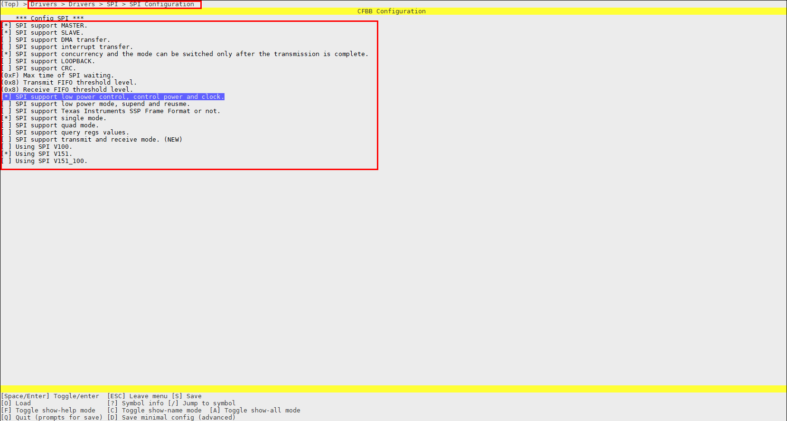

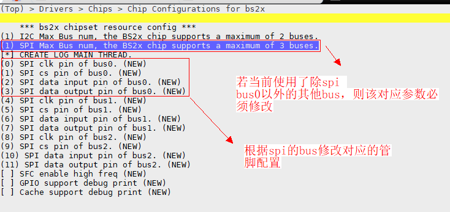

> **说明：** 
>若上述图片所示与表格描述不一致，请以表格为准。

配置宏具体描述如[表1](#table16629938173916)所示。

**表 1**  SPI相关宏描述

<a name="table16629938173916"></a>
<table><thead align="left"><tr id="row1462913813915"><th class="cellrowborder" valign="top" width="22.62773722627737%" id="mcps1.2.7.1.1"><p id="p1962923853920"><a name="p1962923853920"></a><a name="p1962923853920"></a>宏名称（CONFIG_是默认添加的前缀）</p>
</th>
<th class="cellrowborder" valign="top" width="21.07789221077892%" id="mcps1.2.7.1.2"><p id="p962916388395"><a name="p962916388395"></a><a name="p962916388395"></a>kconfig界面显示的具体描述</p>
</th>
<th class="cellrowborder" valign="top" width="19.938006199380062%" id="mcps1.2.7.1.3"><p id="p18731420115119"><a name="p18731420115119"></a><a name="p18731420115119"></a>使用场景</p>
</th>
<th class="cellrowborder" valign="top" width="10.608939106089391%" id="mcps1.2.7.1.4"><p id="p537485457"><a name="p537485457"></a><a name="p537485457"></a>是否已经实现</p>
</th>
<th class="cellrowborder" valign="top" width="11.348865113488651%" id="mcps1.2.7.1.5"><p id="p1162915382392"><a name="p1162915382392"></a><a name="p1162915382392"></a>是否依赖其他宏</p>
</th>
<th class="cellrowborder" valign="top" width="14.3985601439856%" id="mcps1.2.7.1.6"><p id="p1162923893911"><a name="p1162923893911"></a><a name="p1162923893911"></a>是否选择打开或修改配置</p>
</th>
</tr>
</thead>
<tbody><tr id="row16629338103916"><td class="cellrowborder" valign="top" width="22.62773722627737%" headers="mcps1.2.7.1.1 "><p id="p166291338133910"><a name="p166291338133910"></a><a name="p166291338133910"></a>CONFIG_SPI_SUPPORT_MASTER</p>
</td>
<td class="cellrowborder" valign="top" width="21.07789221077892%" headers="mcps1.2.7.1.2 "><p id="p1773165692817"><a name="p1773165692817"></a><a name="p1773165692817"></a>SPI support MASTER.</p>
</td>
<td class="cellrowborder" valign="top" width="19.938006199380062%" headers="mcps1.2.7.1.3 "><p id="p182789183235"><a name="p182789183235"></a><a name="p182789183235"></a>SPI支持主机选择，视情况选择</p>
</td>
<td class="cellrowborder" valign="top" width="10.608939106089391%" headers="mcps1.2.7.1.4 "><p id="p166297382397"><a name="p166297382397"></a><a name="p166297382397"></a>是</p>
</td>
<td class="cellrowborder" valign="top" width="11.348865113488651%" headers="mcps1.2.7.1.5 "><p id="p162983873917"><a name="p162983873917"></a><a name="p162983873917"></a>否</p>
</td>
<td class="cellrowborder" valign="top" width="14.3985601439856%" headers="mcps1.2.7.1.6 "><p id="p142312269162"><a name="p142312269162"></a><a name="p142312269162"></a>默认打开，建议打开</p>
</td>
</tr>
<tr id="row166299383394"><td class="cellrowborder" valign="top" width="22.62773722627737%" headers="mcps1.2.7.1.1 "><p id="p14629173813920"><a name="p14629173813920"></a><a name="p14629173813920"></a>CONFIG_SPI_SUPPORT_SLAVE</p>
</td>
<td class="cellrowborder" valign="top" width="21.07789221077892%" headers="mcps1.2.7.1.2 "><p id="p6314610193820"><a name="p6314610193820"></a><a name="p6314610193820"></a>SPI support SLAVE.</p>
</td>
<td class="cellrowborder" valign="top" width="19.938006199380062%" headers="mcps1.2.7.1.3 "><p id="p750495852813"><a name="p750495852813"></a><a name="p750495852813"></a>SPI支持从机选择，视情况选择</p>
</td>
<td class="cellrowborder" valign="top" width="10.608939106089391%" headers="mcps1.2.7.1.4 "><p id="p166291838143916"><a name="p166291838143916"></a><a name="p166291838143916"></a>是</p>
</td>
<td class="cellrowborder" valign="top" width="11.348865113488651%" headers="mcps1.2.7.1.5 "><p id="p2629138193917"><a name="p2629138193917"></a><a name="p2629138193917"></a>否</p>
</td>
<td class="cellrowborder" valign="top" width="14.3985601439856%" headers="mcps1.2.7.1.6 "><p id="p16717115134416"><a name="p16717115134416"></a><a name="p16717115134416"></a>默认打开，建议打开</p>
</td>
</tr>
<tr id="row3629193823919"><td class="cellrowborder" valign="top" width="22.62773722627737%" headers="mcps1.2.7.1.1 "><p id="p262983811395"><a name="p262983811395"></a><a name="p262983811395"></a>CONFIG_SPI_SUPPORT_DMA</p>
</td>
<td class="cellrowborder" valign="top" width="21.07789221077892%" headers="mcps1.2.7.1.2 "><p id="p53508282388"><a name="p53508282388"></a><a name="p53508282388"></a>SPI support DMA transfer.</p>
</td>
<td class="cellrowborder" valign="top" width="19.938006199380062%" headers="mcps1.2.7.1.3 "><p id="p1164428144915"><a name="p1164428144915"></a><a name="p1164428144915"></a>SPI支持DMA模式，视情况选择，若选择采用SPI DMA模式，则需同步选择DMA驱动的KCONFIG配置，请参考“<a href="KCONFIG配置-27.md">KCONFIG配置</a>”。</p>
</td>
<td class="cellrowborder" valign="top" width="10.608939106089391%" headers="mcps1.2.7.1.4 "><p id="p3629133873917"><a name="p3629133873917"></a><a name="p3629133873917"></a>是</p>
</td>
<td class="cellrowborder" valign="top" width="11.348865113488651%" headers="mcps1.2.7.1.5 "><p id="p8473437181816"><a name="p8473437181816"></a><a name="p8473437181816"></a>CONFIG_DRIVER_SUPPORT_DMA</p>
</td>
<td class="cellrowborder" valign="top" width="14.3985601439856%" headers="mcps1.2.7.1.6 "><p id="p732198195217"><a name="p732198195217"></a><a name="p732198195217"></a>默认关闭，视情况选择</p>
</td>
</tr>
<tr id="row962920381394"><td class="cellrowborder" valign="top" width="22.62773722627737%" headers="mcps1.2.7.1.1 "><p id="p1629738173912"><a name="p1629738173912"></a><a name="p1629738173912"></a>CONFIG_SPI_SUPPORT_POLL_AND_DMA_AUTO_SWITCH</p>
</td>
<td class="cellrowborder" valign="top" width="21.07789221077892%" headers="mcps1.2.7.1.2 "><p id="p1326114416384"><a name="p1326114416384"></a><a name="p1326114416384"></a>SPI support poll and dma mode switch.</p>
</td>
<td class="cellrowborder" valign="top" width="19.938006199380062%" headers="mcps1.2.7.1.3 "><p id="p7601132985220"><a name="p7601132985220"></a><a name="p7601132985220"></a>SPI支持根据设定的阈值大小自动切换轮询和DMA模式，视情况选择</p>
</td>
<td class="cellrowborder" valign="top" width="10.608939106089391%" headers="mcps1.2.7.1.4 "><p id="p7630938143910"><a name="p7630938143910"></a><a name="p7630938143910"></a>是</p>
</td>
<td class="cellrowborder" valign="top" width="11.348865113488651%" headers="mcps1.2.7.1.5 "><p id="p184291153201819"><a name="p184291153201819"></a><a name="p184291153201819"></a>CONFIG_SPI_SUPPORT_DMA</p>
</td>
<td class="cellrowborder" valign="top" width="14.3985601439856%" headers="mcps1.2.7.1.6 "><p id="p55269547522"><a name="p55269547522"></a><a name="p55269547522"></a>默认关闭，视情况选择</p>
</td>
</tr>
<tr id="row62681237271"><td class="cellrowborder" valign="top" width="22.62773722627737%" headers="mcps1.2.7.1.1 "><p id="p112401826112812"><a name="p112401826112812"></a><a name="p112401826112812"></a>CONFIG_SPI_AUTO_SWITCH_DMA_THRESHOLD</p>
</td>
<td class="cellrowborder" valign="top" width="21.07789221077892%" headers="mcps1.2.7.1.2 "><p id="p1844945715385"><a name="p1844945715385"></a><a name="p1844945715385"></a>SPI indicates the threshold of the automatic switchover mode.</p>
</td>
<td class="cellrowborder" valign="top" width="19.938006199380062%" headers="mcps1.2.7.1.3 "><p id="p1369200125313"><a name="p1369200125313"></a><a name="p1369200125313"></a>SPI支持自动切换轮询和DMA模式时设置的阈值大小，默认值是32个数</p>
</td>
<td class="cellrowborder" valign="top" width="10.608939106089391%" headers="mcps1.2.7.1.4 "><p id="p5269202314277"><a name="p5269202314277"></a><a name="p5269202314277"></a>是</p>
</td>
<td class="cellrowborder" valign="top" width="11.348865113488651%" headers="mcps1.2.7.1.5 "><p id="p115505376560"><a name="p115505376560"></a><a name="p115505376560"></a>CONFIG_SPI_SUPPORT_POLL_AND_DMA_AUTO_SWITCH</p>
</td>
<td class="cellrowborder" valign="top" width="14.3985601439856%" headers="mcps1.2.7.1.6 "><p id="p91685144576"><a name="p91685144576"></a><a name="p91685144576"></a>默认值是32，视情况选择配置</p>
</td>
</tr>
<tr id="row17817572040"><td class="cellrowborder" valign="top" width="22.62773722627737%" headers="mcps1.2.7.1.1 "><p id="p109831846175713"><a name="p109831846175713"></a><a name="p109831846175713"></a>CONFIG_SPI_SUPPORT_INTERRUPT</p>
</td>
<td class="cellrowborder" valign="top" width="21.07789221077892%" headers="mcps1.2.7.1.2 "><p id="p124319334619"><a name="p124319334619"></a><a name="p124319334619"></a>SPI support interrupt transfer.</p>
</td>
<td class="cellrowborder" valign="top" width="19.938006199380062%" headers="mcps1.2.7.1.3 "><p id="p0369111616584"><a name="p0369111616584"></a><a name="p0369111616584"></a>SPI支持中断模式，视情况选择</p>
</td>
<td class="cellrowborder" valign="top" width="10.608939106089391%" headers="mcps1.2.7.1.4 "><p id="p17919571246"><a name="p17919571246"></a><a name="p17919571246"></a>是</p>
</td>
<td class="cellrowborder" valign="top" width="11.348865113488651%" headers="mcps1.2.7.1.5 "><p id="p12620160105914"><a name="p12620160105914"></a><a name="p12620160105914"></a>否</p>
</td>
<td class="cellrowborder" valign="top" width="14.3985601439856%" headers="mcps1.2.7.1.6 "><p id="p182001731221"><a name="p182001731221"></a><a name="p182001731221"></a>默认关闭，视情况选择</p>
</td>
</tr>
<tr id="row1071318918131"><td class="cellrowborder" valign="top" width="22.62773722627737%" headers="mcps1.2.7.1.1 "><p id="p671319910134"><a name="p671319910134"></a><a name="p671319910134"></a>CONFIG_SPI_SUPPORT_CONCURRENCY</p>
</td>
<td class="cellrowborder" valign="top" width="21.07789221077892%" headers="mcps1.2.7.1.2 "><p id="p438114181463"><a name="p438114181463"></a><a name="p438114181463"></a>SPI support concurrency and the mode can be switched only after the transmission is complete.</p>
</td>
<td class="cellrowborder" valign="top" width="19.938006199380062%" headers="mcps1.2.7.1.3 "><p id="p17131797138"><a name="p17131797138"></a><a name="p17131797138"></a>如果打开该宏，则能够确保当前传输的完整性，只有在当前传输完成后才会进行下一次传输，没加锁的情况下要打开该宏</p>
</td>
<td class="cellrowborder" valign="top" width="10.608939106089391%" headers="mcps1.2.7.1.4 "><p id="p1571316971311"><a name="p1571316971311"></a><a name="p1571316971311"></a>是</p>
</td>
<td class="cellrowborder" valign="top" width="11.348865113488651%" headers="mcps1.2.7.1.5 "><p id="p37135917132"><a name="p37135917132"></a><a name="p37135917132"></a>否</p>
</td>
<td class="cellrowborder" valign="top" width="14.3985601439856%" headers="mcps1.2.7.1.6 "><p id="p57965521033"><a name="p57965521033"></a><a name="p57965521033"></a>默认关闭，视情况选择，建议打开</p>
</td>
</tr>
<tr id="row1663153711314"><td class="cellrowborder" valign="top" width="22.62773722627737%" headers="mcps1.2.7.1.1 "><p id="p13663183721310"><a name="p13663183721310"></a><a name="p13663183721310"></a>CONFIG_SPI_SUPPORT_LOOPBACK</p>
</td>
<td class="cellrowborder" valign="top" width="21.07789221077892%" headers="mcps1.2.7.1.2 "><p id="p066323716134"><a name="p066323716134"></a><a name="p066323716134"></a>SPI support LOOPBACK.</p>
</td>
<td class="cellrowborder" valign="top" width="19.938006199380062%" headers="mcps1.2.7.1.3 "><p id="p185305517595"><a name="p185305517595"></a><a name="p185305517595"></a>SPI支持回环模式，本产品暂未实现</p>
</td>
<td class="cellrowborder" valign="top" width="10.608939106089391%" headers="mcps1.2.7.1.4 "><p id="p186635371131"><a name="p186635371131"></a><a name="p186635371131"></a>否</p>
</td>
<td class="cellrowborder" valign="top" width="11.348865113488651%" headers="mcps1.2.7.1.5 "><p id="p1366323711131"><a name="p1366323711131"></a><a name="p1366323711131"></a>否</p>
</td>
<td class="cellrowborder" valign="top" width="14.3985601439856%" headers="mcps1.2.7.1.6 "><p id="p5326122414510"><a name="p5326122414510"></a><a name="p5326122414510"></a>默认关闭，本产品实际暂未实现，建议关闭</p>
</td>
</tr>
<tr id="row1115204491314"><td class="cellrowborder" valign="top" width="22.62773722627737%" headers="mcps1.2.7.1.1 "><p id="p20115184431314"><a name="p20115184431314"></a><a name="p20115184431314"></a>CONFIG_SPI_SUPPORT_CRC</p>
</td>
<td class="cellrowborder" valign="top" width="21.07789221077892%" headers="mcps1.2.7.1.2 "><p id="p1211594421319"><a name="p1211594421319"></a><a name="p1211594421319"></a>SPI support CRC.</p>
</td>
<td class="cellrowborder" valign="top" width="19.938006199380062%" headers="mcps1.2.7.1.3 "><p id="p4115184491311"><a name="p4115184491311"></a><a name="p4115184491311"></a>SPI支持CRC模式，本产品暂未实现</p>
</td>
<td class="cellrowborder" valign="top" width="10.608939106089391%" headers="mcps1.2.7.1.4 "><p id="p9115124411312"><a name="p9115124411312"></a><a name="p9115124411312"></a>否</p>
</td>
<td class="cellrowborder" valign="top" width="11.348865113488651%" headers="mcps1.2.7.1.5 "><p id="p5115544151311"><a name="p5115544151311"></a><a name="p5115544151311"></a>否</p>
</td>
<td class="cellrowborder" valign="top" width="14.3985601439856%" headers="mcps1.2.7.1.6 "><p id="p1518312251351"><a name="p1518312251351"></a><a name="p1518312251351"></a>默认关闭，本产品实际暂未实现，建议关闭</p>
</td>
</tr>
<tr id="row9686349171316"><td class="cellrowborder" valign="top" width="22.62773722627737%" headers="mcps1.2.7.1.1 "><p id="p2068610490135"><a name="p2068610490135"></a><a name="p2068610490135"></a>CONFIG_SPI_MAX_TIMEOUT</p>
</td>
<td class="cellrowborder" valign="top" width="21.07789221077892%" headers="mcps1.2.7.1.2 "><p id="p16686174971317"><a name="p16686174971317"></a><a name="p16686174971317"></a>Max time of SPI waiting.</p>
</td>
<td class="cellrowborder" valign="top" width="19.938006199380062%" headers="mcps1.2.7.1.3 "><p id="p1534582015113"><a name="p1534582015113"></a><a name="p1534582015113"></a>SPI发送限制的最大超时时间</p>
</td>
<td class="cellrowborder" valign="top" width="10.608939106089391%" headers="mcps1.2.7.1.4 "><p id="p12686184941312"><a name="p12686184941312"></a><a name="p12686184941312"></a>是</p>
</td>
<td class="cellrowborder" valign="top" width="11.348865113488651%" headers="mcps1.2.7.1.5 "><p id="p26871249111313"><a name="p26871249111313"></a><a name="p26871249111313"></a>否</p>
</td>
<td class="cellrowborder" valign="top" width="14.3985601439856%" headers="mcps1.2.7.1.6 "><p id="p0629838133914"><a name="p0629838133914"></a><a name="p0629838133914"></a>默认值是0xF，视情况选择配置，建议不做修改</p>
</td>
</tr>
<tr id="row10100123917141"><td class="cellrowborder" valign="top" width="22.62773722627737%" headers="mcps1.2.7.1.1 "><p id="p6359290154"><a name="p6359290154"></a><a name="p6359290154"></a>CONFIG_SPI_TXFTLR</p>
</td>
<td class="cellrowborder" valign="top" width="21.07789221077892%" headers="mcps1.2.7.1.2 "><p id="p1057216107476"><a name="p1057216107476"></a><a name="p1057216107476"></a>Transmit FIFO threshold level.</p>
</td>
<td class="cellrowborder" valign="top" width="19.938006199380062%" headers="mcps1.2.7.1.3 "><p id="p151004394147"><a name="p151004394147"></a><a name="p151004394147"></a>SPI TX FIFO阈值</p>
</td>
<td class="cellrowborder" valign="top" width="10.608939106089391%" headers="mcps1.2.7.1.4 "><p id="p131001439161420"><a name="p131001439161420"></a><a name="p131001439161420"></a>是</p>
</td>
<td class="cellrowborder" valign="top" width="11.348865113488651%" headers="mcps1.2.7.1.5 "><p id="p110083912148"><a name="p110083912148"></a><a name="p110083912148"></a>否</p>
</td>
<td class="cellrowborder" valign="top" width="14.3985601439856%" headers="mcps1.2.7.1.6 "><p id="p126297381398"><a name="p126297381398"></a><a name="p126297381398"></a>默认值是8，建议不做修改</p>
</td>
</tr>
<tr id="row9604124541418"><td class="cellrowborder" valign="top" width="22.62773722627737%" headers="mcps1.2.7.1.1 "><p id="p1198461021518"><a name="p1198461021518"></a><a name="p1198461021518"></a>CONFIG_SPI_RXFTLR</p>
</td>
<td class="cellrowborder" valign="top" width="21.07789221077892%" headers="mcps1.2.7.1.2 "><p id="p32191422114710"><a name="p32191422114710"></a><a name="p32191422114710"></a>Receive FIFO threshold level.</p>
</td>
<td class="cellrowborder" valign="top" width="19.938006199380062%" headers="mcps1.2.7.1.3 "><p id="p61281017113016"><a name="p61281017113016"></a><a name="p61281017113016"></a>SPI RX FIFO阈值</p>
</td>
<td class="cellrowborder" valign="top" width="10.608939106089391%" headers="mcps1.2.7.1.4 "><p id="p1860512452145"><a name="p1860512452145"></a><a name="p1860512452145"></a>是</p>
</td>
<td class="cellrowborder" valign="top" width="11.348865113488651%" headers="mcps1.2.7.1.5 "><p id="p13605145101411"><a name="p13605145101411"></a><a name="p13605145101411"></a>否</p>
</td>
<td class="cellrowborder" valign="top" width="14.3985601439856%" headers="mcps1.2.7.1.6 "><p id="p876127301"><a name="p876127301"></a><a name="p876127301"></a>默认值是8，建议不做修改</p>
</td>
</tr>
<tr id="row4155553141"><td class="cellrowborder" valign="top" width="22.62773722627737%" headers="mcps1.2.7.1.1 "><p id="p2119131217152"><a name="p2119131217152"></a><a name="p2119131217152"></a>CONFIG_SPI_SUPPORT_LPC</p>
</td>
<td class="cellrowborder" valign="top" width="21.07789221077892%" headers="mcps1.2.7.1.2 "><p id="p879573724713"><a name="p879573724713"></a><a name="p879573724713"></a>SPI support low power control, control power and clock.</p>
</td>
<td class="cellrowborder" valign="top" width="19.938006199380062%" headers="mcps1.2.7.1.3 "><p id="p1605194513147"><a name="p1605194513147"></a><a name="p1605194513147"></a>SPI 工作时钟</p>
</td>
<td class="cellrowborder" valign="top" width="10.608939106089391%" headers="mcps1.2.7.1.4 "><p id="p201555511146"><a name="p201555511146"></a><a name="p201555511146"></a>是</p>
</td>
<td class="cellrowborder" valign="top" width="11.348865113488651%" headers="mcps1.2.7.1.5 "><p id="p1280317457132"><a name="p1280317457132"></a><a name="p1280317457132"></a>否</p>
</td>
<td class="cellrowborder" valign="top" width="14.3985601439856%" headers="mcps1.2.7.1.6 "><p id="p31511558144"><a name="p31511558144"></a><a name="p31511558144"></a>默认打开，必选</p>
</td>
</tr>
<tr id="row155854071519"><td class="cellrowborder" valign="top" width="22.62773722627737%" headers="mcps1.2.7.1.1 "><p id="p1289513201519"><a name="p1289513201519"></a><a name="p1289513201519"></a>CONFIG_SPI_SUPPORT_LPM</p>
</td>
<td class="cellrowborder" valign="top" width="21.07789221077892%" headers="mcps1.2.7.1.2 "><p id="p148922050174717"><a name="p148922050174717"></a><a name="p148922050174717"></a>SPI support low power mode, supend and reusme.</p>
</td>
<td class="cellrowborder" valign="top" width="19.938006199380062%" headers="mcps1.2.7.1.3 "><p id="p77352085114"><a name="p77352085114"></a><a name="p77352085114"></a>该宏仅用于低功耗情况下使用</p>
</td>
<td class="cellrowborder" valign="top" width="10.608939106089391%" headers="mcps1.2.7.1.4 "><p id="p145852091517"><a name="p145852091517"></a><a name="p145852091517"></a>是</p>
</td>
<td class="cellrowborder" valign="top" width="11.348865113488651%" headers="mcps1.2.7.1.5 "><p id="p178719416558"><a name="p178719416558"></a><a name="p178719416558"></a>否</p>
</td>
<td class="cellrowborder" valign="top" width="14.3985601439856%" headers="mcps1.2.7.1.6 "><p id="p12585190171517"><a name="p12585190171517"></a><a name="p12585190171517"></a>默认关闭，视情况选择</p>
</td>
</tr>
<tr id="row1120612316161"><td class="cellrowborder" valign="top" width="22.62773722627737%" headers="mcps1.2.7.1.1 "><p id="p12207162314169"><a name="p12207162314169"></a><a name="p12207162314169"></a>CONFIG_SPI_NOT_SUPPORT_TEXAS_FORMAT</p>
</td>
<td class="cellrowborder" valign="top" width="21.07789221077892%" headers="mcps1.2.7.1.2 "><p id="p1374816884814"><a name="p1374816884814"></a><a name="p1374816884814"></a>SPI support Texas Instruments SSP Frame Format or not.</p>
</td>
<td class="cellrowborder" valign="top" width="19.938006199380062%" headers="mcps1.2.7.1.3 "><p id="p1477573283217"><a name="p1477573283217"></a><a name="p1477573283217"></a>SPI支持使用德州仪器SSP帧格式</p>
</td>
<td class="cellrowborder" valign="top" width="10.608939106089391%" headers="mcps1.2.7.1.4 "><p id="p10207202331613"><a name="p10207202331613"></a><a name="p10207202331613"></a>是</p>
</td>
<td class="cellrowborder" valign="top" width="11.348865113488651%" headers="mcps1.2.7.1.5 "><p id="p22077234164"><a name="p22077234164"></a><a name="p22077234164"></a>否</p>
</td>
<td class="cellrowborder" valign="top" width="14.3985601439856%" headers="mcps1.2.7.1.6 "><p id="p3285141385920"><a name="p3285141385920"></a><a name="p3285141385920"></a>默认关闭，视情况选择</p>
</td>
</tr>
<tr id="row152811134161910"><td class="cellrowborder" valign="top" width="22.62773722627737%" headers="mcps1.2.7.1.1 "><p id="p13281173411919"><a name="p13281173411919"></a><a name="p13281173411919"></a>CONFIG_SPI_SUPPORT_SINGLE_SPI</p>
</td>
<td class="cellrowborder" valign="top" width="21.07789221077892%" headers="mcps1.2.7.1.2 "><p id="p3282133471911"><a name="p3282133471911"></a><a name="p3282133471911"></a>SPI support single mode.</p>
</td>
<td class="cellrowborder" valign="top" width="19.938006199380062%" headers="mcps1.2.7.1.3 "><p id="p49436402184"><a name="p49436402184"></a><a name="p49436402184"></a>SPI支持单线模式（即SCLK线，CS线以及DATA收发线）</p>
</td>
<td class="cellrowborder" valign="top" width="10.608939106089391%" headers="mcps1.2.7.1.4 "><p id="p17282183411919"><a name="p17282183411919"></a><a name="p17282183411919"></a>是</p>
</td>
<td class="cellrowborder" valign="top" width="11.348865113488651%" headers="mcps1.2.7.1.5 "><p id="p19282143413191"><a name="p19282143413191"></a><a name="p19282143413191"></a>否</p>
</td>
<td class="cellrowborder" valign="top" width="14.3985601439856%" headers="mcps1.2.7.1.6 "><p id="p20595241182012"><a name="p20595241182012"></a><a name="p20595241182012"></a>默认打开，视情况选择，建议关闭</p>
</td>
</tr>
<tr id="row152919554295"><td class="cellrowborder" valign="top" width="22.62773722627737%" headers="mcps1.2.7.1.1 "><p id="p1955124143113"><a name="p1955124143113"></a><a name="p1955124143113"></a>CONFIG_SPI_SUPPORT_QUAD_SPI</p>
</td>
<td class="cellrowborder" valign="top" width="21.07789221077892%" headers="mcps1.2.7.1.2 "><p id="p92921755102918"><a name="p92921755102918"></a><a name="p92921755102918"></a>SPI support quad mode.</p>
</td>
<td class="cellrowborder" valign="top" width="19.938006199380062%" headers="mcps1.2.7.1.3 "><p id="p1292155112913"><a name="p1292155112913"></a><a name="p1292155112913"></a>SPI支持四线模式</p>
</td>
<td class="cellrowborder" valign="top" width="10.608939106089391%" headers="mcps1.2.7.1.4 "><p id="p2292145513291"><a name="p2292145513291"></a><a name="p2292145513291"></a>是</p>
</td>
<td class="cellrowborder" valign="top" width="11.348865113488651%" headers="mcps1.2.7.1.5 "><p id="p829212557292"><a name="p829212557292"></a><a name="p829212557292"></a>否</p>
</td>
<td class="cellrowborder" valign="top" width="14.3985601439856%" headers="mcps1.2.7.1.6 "><p id="p1919510457322"><a name="p1919510457322"></a><a name="p1919510457322"></a>BS2X不支持</p>
</td>
</tr>
<tr id="row18951740131615"><td class="cellrowborder" valign="top" width="22.62773722627737%" headers="mcps1.2.7.1.1 "><p id="p197481234181715"><a name="p197481234181715"></a><a name="p197481234181715"></a>CONFIG_SPI_SUPPORT_QUERY_REGS</p>
</td>
<td class="cellrowborder" valign="top" width="21.07789221077892%" headers="mcps1.2.7.1.2 "><p id="p14910182004815"><a name="p14910182004815"></a><a name="p14910182004815"></a>SPI support query regs values.</p>
</td>
<td class="cellrowborder" valign="top" width="19.938006199380062%" headers="mcps1.2.7.1.3 "><p id="p139544011168"><a name="p139544011168"></a><a name="p139544011168"></a>SPI支持回读所有相关寄存器的值，供维测使用</p>
</td>
<td class="cellrowborder" valign="top" width="10.608939106089391%" headers="mcps1.2.7.1.4 "><p id="p16957407165"><a name="p16957407165"></a><a name="p16957407165"></a>是</p>
</td>
<td class="cellrowborder" valign="top" width="11.348865113488651%" headers="mcps1.2.7.1.5 "><p id="p395194031613"><a name="p395194031613"></a><a name="p395194031613"></a>否</p>
</td>
<td class="cellrowborder" valign="top" width="14.3985601439856%" headers="mcps1.2.7.1.6 "><p id="p1817114179353"><a name="p1817114179353"></a><a name="p1817114179353"></a>默认关闭，视情况选择，建议关闭</p>
</td>
</tr>
<tr id="row1744519541612"><td class="cellrowborder" valign="top" width="22.62773722627737%" headers="mcps1.2.7.1.1 "><p id="p1644525191612"><a name="p1644525191612"></a><a name="p1644525191612"></a>CONFIG_SPI_SUPPORT_TXRX_TRANS_MODE</p>
</td>
<td class="cellrowborder" valign="top" width="21.07789221077892%" headers="mcps1.2.7.1.2 "><p id="p54451957163"><a name="p54451957163"></a><a name="p54451957163"></a>SPI support transmit and receive mode.</p>
</td>
<td class="cellrowborder" valign="top" width="19.938006199380062%" headers="mcps1.2.7.1.3 "><p id="p1144565111618"><a name="p1144565111618"></a><a name="p1144565111618"></a>SPI支持全双工模式，</p>
</td>
<td class="cellrowborder" valign="top" width="10.608939106089391%" headers="mcps1.2.7.1.4 "><p id="p644620510169"><a name="p644620510169"></a><a name="p644620510169"></a>是</p>
</td>
<td class="cellrowborder" valign="top" width="11.348865113488651%" headers="mcps1.2.7.1.5 "><p id="p11446165121612"><a name="p11446165121612"></a><a name="p11446165121612"></a>否</p>
</td>
<td class="cellrowborder" valign="top" width="14.3985601439856%" headers="mcps1.2.7.1.6 "><p id="p3446135121614"><a name="p3446135121614"></a><a name="p3446135121614"></a>默认关闭，视情况选择，建议关闭</p>
</td>
</tr>
<tr id="row102331352100"><td class="cellrowborder" valign="top" width="22.62773722627737%" headers="mcps1.2.7.1.1 "><p id="p42341510109"><a name="p42341510109"></a><a name="p42341510109"></a>CONFIG_SPI_SUPPORT_DELAY_FOR_WRITEREAD</p>
</td>
<td class="cellrowborder" valign="top" width="21.07789221077892%" headers="mcps1.2.7.1.2 "><p id="p923410501011"><a name="p923410501011"></a><a name="p923410501011"></a>SPI support delay between write and read.</p>
</td>
<td class="cellrowborder" valign="top" width="19.938006199380062%" headers="mcps1.2.7.1.3 "><p id="p1093515477108"><a name="p1093515477108"></a><a name="p1093515477108"></a>该宏仅用于TX和RX之间需要更长时间准备的场景，目前仅用于特殊的sensor使用</p>
</td>
<td class="cellrowborder" valign="top" width="10.608939106089391%" headers="mcps1.2.7.1.4 "><p id="p33262715111"><a name="p33262715111"></a><a name="p33262715111"></a>是</p>
</td>
<td class="cellrowborder" valign="top" width="11.348865113488651%" headers="mcps1.2.7.1.5 "><p id="p232637121112"><a name="p232637121112"></a><a name="p232637121112"></a>否</p>
</td>
<td class="cellrowborder" valign="top" width="14.3985601439856%" headers="mcps1.2.7.1.6 "><p id="p17326974112"><a name="p17326974112"></a><a name="p17326974112"></a>默认关闭，视情况选择，建议关闭</p>
</td>
</tr>
<tr id="row16613625171211"><td class="cellrowborder" valign="top" width="22.62773722627737%" headers="mcps1.2.7.1.1 "><p id="p19613122510126"><a name="p19613122510126"></a><a name="p19613122510126"></a>CONFIG_SPI_AUTO_TMOD</p>
</td>
<td class="cellrowborder" valign="top" width="21.07789221077892%" headers="mcps1.2.7.1.2 "><p id="p17613102515125"><a name="p17613102515125"></a><a name="p17613102515125"></a>SPI support auto tmod switch.</p>
</td>
<td class="cellrowborder" valign="top" width="19.938006199380062%" headers="mcps1.2.7.1.3 "><p id="p561352517129"><a name="p561352517129"></a><a name="p561352517129"></a>SPI支持自动TMOD切换</p>
</td>
<td class="cellrowborder" valign="top" width="10.608939106089391%" headers="mcps1.2.7.1.4 "><p id="p163451157121216"><a name="p163451157121216"></a><a name="p163451157121216"></a>是</p>
</td>
<td class="cellrowborder" valign="top" width="11.348865113488651%" headers="mcps1.2.7.1.5 "><p id="p134555721215"><a name="p134555721215"></a><a name="p134555721215"></a>否</p>
</td>
<td class="cellrowborder" valign="top" width="14.3985601439856%" headers="mcps1.2.7.1.6 "><p id="p1534515577129"><a name="p1534515577129"></a><a name="p1534515577129"></a>默认关闭，视情况选择，建议关闭</p>
</td>
</tr>
<tr id="row16469746171619"><td class="cellrowborder" valign="top" width="22.62773722627737%" headers="mcps1.2.7.1.1 "><p id="p13831935111710"><a name="p13831935111710"></a><a name="p13831935111710"></a>CONFIG_SPI_USING_V100</p>
</td>
<td class="cellrowborder" valign="top" width="21.07789221077892%" headers="mcps1.2.7.1.2 "><p id="p163157475481"><a name="p163157475481"></a><a name="p163157475481"></a>Using SPI V100.</p>
</td>
<td class="cellrowborder" valign="top" width="19.938006199380062%" headers="mcps1.2.7.1.3 "><p id="p56134571811"><a name="p56134571811"></a><a name="p56134571811"></a>该宏代表使用SPI V100的驱动规格，本产品不使用该规格</p>
</td>
<td class="cellrowborder" valign="top" width="10.608939106089391%" headers="mcps1.2.7.1.4 "><p id="p154691146191615"><a name="p154691146191615"></a><a name="p154691146191615"></a>是</p>
</td>
<td class="cellrowborder" valign="top" width="11.348865113488651%" headers="mcps1.2.7.1.5 "><p id="p746920467167"><a name="p746920467167"></a><a name="p746920467167"></a>否</p>
</td>
<td class="cellrowborder" valign="top" width="14.3985601439856%" headers="mcps1.2.7.1.6 "><p id="p1633165718345"><a name="p1633165718345"></a><a name="p1633165718345"></a>默认关闭，必须关闭</p>
</td>
</tr>
<tr id="row17463553171619"><td class="cellrowborder" valign="top" width="22.62773722627737%" headers="mcps1.2.7.1.1 "><p id="p8789036121717"><a name="p8789036121717"></a><a name="p8789036121717"></a>CONFIG_SPI_USING_V151</p>
</td>
<td class="cellrowborder" valign="top" width="21.07789221077892%" headers="mcps1.2.7.1.2 "><p id="p37632529481"><a name="p37632529481"></a><a name="p37632529481"></a>Using SPI V151.</p>
</td>
<td class="cellrowborder" valign="top" width="19.938006199380062%" headers="mcps1.2.7.1.3 "><p id="p2463115311616"><a name="p2463115311616"></a><a name="p2463115311616"></a>该宏代表使用SPI V151的驱动规格，本产品默认使用该规格</p>
</td>
<td class="cellrowborder" valign="top" width="10.608939106089391%" headers="mcps1.2.7.1.4 "><p id="p10463185313162"><a name="p10463185313162"></a><a name="p10463185313162"></a>是</p>
</td>
<td class="cellrowborder" valign="top" width="11.348865113488651%" headers="mcps1.2.7.1.5 "><p id="p1246320533166"><a name="p1246320533166"></a><a name="p1246320533166"></a>否</p>
</td>
<td class="cellrowborder" valign="top" width="14.3985601439856%" headers="mcps1.2.7.1.6 "><p id="p20821243153619"><a name="p20821243153619"></a><a name="p20821243153619"></a>默认打开，必选</p>
</td>
</tr>
<tr id="row178551721398"><td class="cellrowborder" valign="top" width="22.62773722627737%" headers="mcps1.2.7.1.1 "><p id="p285517212919"><a name="p285517212919"></a><a name="p285517212919"></a>CONFIG_SPI_USING_V151_100</p>
</td>
<td class="cellrowborder" valign="top" width="21.07789221077892%" headers="mcps1.2.7.1.2 "><p id="p1485522117910"><a name="p1485522117910"></a><a name="p1485522117910"></a>Using SPI V151_100.</p>
</td>
<td class="cellrowborder" valign="top" width="19.938006199380062%" headers="mcps1.2.7.1.3 "><p id="p17855152115916"><a name="p17855152115916"></a><a name="p17855152115916"></a>该宏代表使用SPI V151_100的驱动规格，本产品不使用该规格</p>
</td>
<td class="cellrowborder" valign="top" width="10.608939106089391%" headers="mcps1.2.7.1.4 "><p id="p1485519211792"><a name="p1485519211792"></a><a name="p1485519211792"></a>是</p>
</td>
<td class="cellrowborder" valign="top" width="11.348865113488651%" headers="mcps1.2.7.1.5 "><p id="p178551211491"><a name="p178551211491"></a><a name="p178551211491"></a>否</p>
</td>
<td class="cellrowborder" valign="top" width="14.3985601439856%" headers="mcps1.2.7.1.6 "><p id="p78557211499"><a name="p78557211499"></a><a name="p78557211499"></a>默认关闭，必须关闭</p>
</td>
</tr>
<tr id="row183271017204017"><td class="cellrowborder" valign="top" width="22.62773722627737%" headers="mcps1.2.7.1.1 "><p id="p0328717114020"><a name="p0328717114020"></a><a name="p0328717114020"></a>CONFIG_SPI_BUS_MAX_NUM</p>
</td>
<td class="cellrowborder" valign="top" width="21.07789221077892%" headers="mcps1.2.7.1.2 "><p id="p10328517204012"><a name="p10328517204012"></a><a name="p10328517204012"></a>SPI Max Bus num, the BS2x chip supports a maximum of 3 buses.</p>
</td>
<td class="cellrowborder" valign="top" width="19.938006199380062%" headers="mcps1.2.7.1.3 "><p id="p1232891710407"><a name="p1232891710407"></a><a name="p1232891710407"></a>该宏表示SPI BUS的最大数量，默认值是1，若使用除SPI BUS0以外的BUS，则必须对应修改该宏，否则会出现异常情况</p>
</td>
<td class="cellrowborder" valign="top" width="10.608939106089391%" headers="mcps1.2.7.1.4 "><p id="p123283175403"><a name="p123283175403"></a><a name="p123283175403"></a>是</p>
</td>
<td class="cellrowborder" valign="top" width="11.348865113488651%" headers="mcps1.2.7.1.5 "><p id="p9328151794011"><a name="p9328151794011"></a><a name="p9328151794011"></a>CONFIG_DRIVER_SUPPORT_SPI</p>
</td>
<td class="cellrowborder" valign="top" width="14.3985601439856%" headers="mcps1.2.7.1.6 "><p id="p12328191719406"><a name="p12328191719406"></a><a name="p12328191719406"></a>默认值是1，根据实际SPI BUS使用情况修改配置</p>
</td>
</tr>
</tbody>
</table>

## 开发指引<a name="ZH-CN_TOPIC_0000001664983974"></a>

SPI用于对接支持SPI协议的设备，SPI单元可以作为主设备或从设备。以SPI单元作为主设备为例，写数据操作如下：

1.  通过IO复用，复用SPI功能用到的管脚为SPI功能。

    管脚复用各功能请参考platform\_core.h中各个管脚功能的定义。

    ```
    #define SPI_PIN_MISO_PINMUX     HAL_PIO_SPI2_RXD
    #define SPI_PIN_MOSI_PINMUX     HAL_PIO_SPI2_TXD
    #define SPI_PIN_CLK_PINMUX      HAL_PIO_SPI2_CLK
    #define SPI_PIN_CS_PINMUX       HAL_PIO_SPI2_CS0
    #define SPI_PIN_MISO    S_MGPIO16
    #define SPI_PIN_MOSI    S_MGPIO17
    #define SPI_PIN_CLK     S_MGPIO18
    #define SPI_PIN_CS      S_MGPIO19
    void usr_spi_io_init(void)
    {
        /* 设置spi pinmux */
        uapi_pin_set_mode(SPI_PIN_MISO, SPI_PIN_MISO_PINMUX);       /* 设置 spi miso pinmux */
        uapi_pin_set_mode(SPI_PIN_MOSI, SPI_PIN_MOSI_PINMUX);       /* 设置 spi mosi pinmux */
        uapi_pin_set_mode(SPI_PIN_CLK, SPI_PIN_CLK_PINMUX);         /* 设置 spi clk pinmux */
        uapi_pin_set_mode(SPI_PIN_CS, SPI_PIN_CS_PINMUX);           /* 设置 spi cs pinmux */
    }
    ```

2.  调用uapi\_spi\_init，初始化SPI资源，选择SPI功能单元以及配置SPI参数。

    ```
    #define TEST_SPI                SPI_BUS_2
    #define BUS_CLOCK               32000000    /* 32M */
    #define SPI_FREQUENCY           2
    errcode_t usr_spi_init(void)
    {
        spi_attr_t config = { 0 };
        spi_extra_attr_t ext_config = { 0 };
        ext_config.sspi_param.wait_cycles = 0x10;
        usr_spi_io_init();
        config.freq_mhz = SPI_FREQUENCY;                            /* spi 分频值 */
        config.is_slave = false;                                    /* 主机模式 */
        config.frame_size = HAL_SPI_FRAME_SIZE_8;                   /* spi 帧大小，使用8位 */
        config.salve_num = 1;                                       /* 使用片选 0 */
        config.spi_frame_format = HAL_SPI_FRAME_FORMAT_STANDARD;    /* spi传输模式：标准spi */
        config.bus_clk = BUS_CLOCK;                                 /* spi传输速率 */
        config.frame_format = SPI_CFG_FRAME_FORMAT_MOTOROLA_SPI;    /* spi协议格式：摩托罗拉SPI协议格式 */
        config.tmod = HAL_SPI_TRANS_MODE_TXRX;                      /* spi传输模式：收发模式 */
        config.clk_phase = SPI_CFG_CLK_CPHA_0;                      /* spi相位：SPI_CFG_CLK_CPHA_0 */
        config.clk_polarity = SPI_CFG_CLK_CPOL_0;                   /* spi极性：SPI_CFG_CLK_CPOL_0 */
        /* 初始化spi */
        errcode_t err = uapi_spi_init(TEST_SPI, &config, &ext_config);
        return err;
    }
    ```

3.  调用uapi\_spi\_master\_writeread，进行SPI主设备写读操作。

    以主设备写读数据为例：

    ```
    errcode_t usr_spi_writeread(uint8_t *wdata, uint8_t wlen, uint8_t *rdata, uint8_t rlen)
    {
        spi_xfer_data_t spi_recv_xfer = { 0 };
        spi_recv_xfer.tx_buff = wdata;                               /* 设置 tx buff */
        spi_recv_xfer.tx_bytes = wlen;                               /* 设置 tx buff 长度 */
        spi_recv_xfer.rx_buff = rdata;                               /* 设置 rx buff */
        spi_recv_xfer.rx_bytes = rlen;                               /* 设置 rx buff 长度 */
        spi_porting_set_rx_mode(TEST_SPI, rlen);                     /* 设置 写读接口的 rx 接收模式*/
        return uapi_spi_master_writeread(TEST_SPI, &spi_recv_xfer, 100); /* 读取数据 */
    }
    ```

双板SPI三种模式（轮询模式、中断模式、DMA模式）下主从收发完整代码流程可参考以下代码：

```
#include "pinctrl.h"
#include "spi.h"
#include "soc_osal.h"
#include "app_init.h"
#include "dma.h"

#define SPI_SLAVE_NUM                   1
#define SPI_FREQUENCY                   2
#define SPI_CLK_POLARITY                0
#define SPI_CLK_PHASE                   0
#define SPI_FRAME_FORMAT                0
#define SPI_FRAME_FORMAT_STANDARD       0
#define SPI_FRAME_SIZE                  0x1f
#define SPI_TMOD                        0
#define SPI_WAIT_CYCLES                 0x10
#if defined(CONFIG_SPI_SUPPORT_DMA) && !(defined(CONFIG_SPI_SUPPORT_POLL_AND_DMA_AUTO_SWITCH))
#define SPI_DMA_WIDTH                   2
#endif
#if defined(CONFIG_SPI_MASTER_SUPPORT_QSPI)
#define QSPI_WRITE_CMD                  0x38
#define QSPI_WRITE_ADDR                 0x123
#endif
#define SPI_TASK_DURATION_MS            500
#define SPI_TASK_PRIO                   24
#define SPI_TASK_STACK_SIZE             0x1000

static void app_spi_init_pin(void)
{
#if defined(CONFIG_PINCTRL_SUPPORT_IE)
    uapi_pin_set_ie(CONFIG_SPI_MASTER_DI_PIN, PIN_IE_1);
#endif /* CONFIG_PINCTRL_SUPPORT_IE */
    uapi_pin_set_mode(CONFIG_SPI_MASTER_CLK_PIN, CONFIG_SPI_MASTER_CLK_PIN_MODE);
    uapi_pin_set_mode(CONFIG_SPI_MASTER_CS_PIN, CONFIG_SPI_MASTER_CS_PIN_MODE);
    uapi_pin_set_mode(CONFIG_SPI_MASTER_DI_PIN, CONFIG_SPI_MASTER_DI_PIN_MODE);
    uapi_pin_set_mode(CONFIG_SPI_MASTER_DO_PIN, CONFIG_SPI_MASTER_DO_PIN_MODE);
}

#if defined(CONFIG_SPI_SUPPORT_INTERRUPT) && (CONFIG_SPI_SUPPORT_INTERRUPT == 1)
static void app_spi_master_write_int_handler(const void *buffer, uint32_t length)
{
    unused(buffer);
    unused(length);
    osal_printk("spi master write interrupt start!\r\n");
}

static void app_spi_master_rx_callback(const void *buffer, uint32_t length, bool error)
{
    if (buffer == NULL || length == 0) {
        osal_printk("spi master transfer illegal data!\r\n");
        return;
    }
    if (error) {
        osal_printk("app_spi_master_read_int error!\r\n");
        return;
    }

    uint8_t *buff = (uint8_t *)buffer;
    for (uint32_t i = 0; i < length; i++) {
        osal_printk("buff[%d] = %x\r\n", i, buff[i]);
    }
    osal_printk("app_spi_master_read_int success!\r\n");
}
#endif  /* CONFIG_SPI_SUPPORT_INTERRUPT */

static void app_spi_master_init_config(void)
{
    spi_attr_t config = { 0 };
    spi_extra_attr_t ext_config = { 0 };

    config.is_slave = false;
    config.slave_num = SPI_SLAVE_NUM;
    config.bus_clk = SPI_CLK_FREQ;
    config.freq_mhz = SPI_FREQUENCY;
    config.clk_polarity = SPI_CLK_POLARITY;
    config.clk_phase = SPI_CLK_PHASE;
    config.frame_format = SPI_FRAME_FORMAT;
    config.spi_frame_format = HAL_SPI_FRAME_FORMAT_STANDARD;
    config.frame_size = SPI_FRAME_SIZE;
    config.tmod = SPI_TMOD;
    config.sste = 0;

    ext_config.qspi_param.wait_cycles = SPI_WAIT_CYCLES;
    uapi_spi_init(CONFIG_SPI_MASTER_BUS_ID, &config, &ext_config);
#if defined(CONFIG_SPI_SUPPORT_DMA) && (CONFIG_SPI_SUPPORT_DMA == 1)
    uapi_dma_init();
    uapi_dma_open();
#ifndef CONFIG_SPI_SUPPORT_POLL_AND_DMA_AUTO_SWITCH
    spi_dma_config_t dma_cfg = {
        .src_width = SPI_DMA_WIDTH,
        .dest_width = SPI_DMA_WIDTH,
        .burst_length = 0,
        .priority = 0
    };
    if (uapi_spi_set_dma_mode(CONFIG_SPI_MASTER_BUS_ID, true, &dma_cfg) != ERRCODE_SUCC) {
        osal_printk("spi%d master set dma mode fail!\r\n");
    }
#endif
#endif  /* CONFIG_SPI_SUPPORT_DMA */

#if defined(CONFIG_SPI_SUPPORT_INTERRUPT) && (CONFIG_SPI_SUPPORT_INTERRUPT == 1)
    if (uapi_spi_set_irq_mode(CONFIG_SPI_MASTER_BUS_ID, true, app_spi_master_rx_callback,
        app_spi_master_write_int_handler) == ERRCODE_SUCC) {
        osal_printk("spi%d master set irq mode succ!\r\n", CONFIG_SPI_MASTER_BUS_ID);
    }
#endif  /* CONFIG_SPI_SUPPORT_INTERRUPT */
}

static void *spi_master_task(const char *arg)
{
    unused(arg);
    /* SPI pinmux. */
    app_spi_init_pin();

    /* SPI master init config. */
    app_spi_master_init_config();

    /* SPI data config. */
    uint8_t tx_data[CONFIG_SPI_TRANSFER_LEN] = { 0 };
    for (uint32_t loop = 0; loop < CONFIG_SPI_TRANSFER_LEN; loop++) {
        tx_data[loop] = (loop & 0xFF);
    }
    uint8_t rx_data[CONFIG_SPI_TRANSFER_LEN] = { 0 };
    spi_xfer_data_t data = {
        .tx_buff = tx_data,
        .tx_bytes = CONFIG_SPI_TRANSFER_LEN,
        .rx_buff = rx_data,
        .rx_bytes = CONFIG_SPI_TRANSFER_LEN,
#if defined(CONFIG_SPI_MASTER_SUPPORT_QSPI)
        .cmd = QSPI_WRITE_CMD,
        .addr = QSPI_WRITE_ADDR,
#endif
    };

    while (1) {
        osal_msleep(SPI_TASK_DURATION_MS);
#ifndef CONFIG_SPI_MASTER_SUPPORT_WRITEREAD
        osal_printk("spi%d master send start!\r\n", CONFIG_SPI_MASTER_BUS_ID);
        if (uapi_spi_master_write(CONFIG_SPI_MASTER_BUS_ID, &data, 0xFFFFFFFF) == ERRCODE_SUCC) {
            osal_printk("spi%d master send succ!\r\n", CONFIG_SPI_MASTER_BUS_ID);
        } else {
            continue;
        }
        osal_printk("spi%d master receive start!\r\n", CONFIG_SPI_MASTER_BUS_ID);
        if (uapi_spi_master_read(CONFIG_SPI_MASTER_BUS_ID, &data, 0xFFFFFFFF) == ERRCODE_SUCC) {
#ifndef CONFIG_SPI_SUPPORT_INTERRUPT
            for (uint32_t i = 0; i < data.rx_bytes; i++) {
                osal_printk("spi%d master receive data is %x\r\n", CONFIG_SPI_MASTER_BUS_ID, data.rx_buff[i]);
            }
#endif
            osal_printk("spi%d master receive succ!\r\n", CONFIG_SPI_MASTER_BUS_ID);
        }
#else
        osal_printk("spi%d master writeread start!\r\n", CONFIG_SPI_MASTER_BUS_ID);
        if (uapi_spi_master_writeread(CONFIG_SPI_MASTER_BUS_ID, &data, 0xFFFFFFFF) == ERRCODE_SUCC) {
            for (uint32_t i = 0; i < data.rx_bytes; i++) {
                osal_printk("spi%d master writeread data is %x\r\n", CONFIG_SPI_MASTER_BUS_ID, data.rx_buff[i]);
            }
            osal_printk("spi%d master writeread succ!\r\n", CONFIG_SPI_MASTER_BUS_ID);
        }
#endif
    }

    return NULL;
}

static void spi_master_entry(void)
{
    osal_task *task_handle = NULL;
    osal_kthread_lock();
    task_handle = osal_kthread_create((osal_kthread_handler)spi_master_task, 0, "SpiMasterTask", SPI_TASK_STACK_SIZE);
    if (task_handle != NULL) {
        osal_kthread_set_priority(task_handle, SPI_TASK_PRIO);
    }
    osal_kthread_unlock();
}

/* Run the spi_master_entry. */
app_run(spi_master_entry);

------------------------------------------------------------------------------

#include "pinctrl.h"
#include "spi.h"
#include "soc_osal.h"
#include "app_init.h"
#include "dma.h"

#define SPI_SLAVE_NUM                   1
#define SPI_FREQUENCY                   2
#define SPI_CLK_POLARITY                0
#define SPI_CLK_PHASE                   0
#define SPI_FRAME_FORMAT                0
#define SPI_FRAME_FORMAT_STANDARD       0
#define SPI_FRAME_SIZE                  0x1f
#define SPI_TMOD                        0
#define SPI_WAIT_CYCLES                 0x10
#if defined(CONFIG_SPI_SUPPORT_DMA) && !(defined(CONFIG_SPI_SUPPORT_POLL_AND_DMA_AUTO_SWITCH))
#define SPI_DMA_WIDTH                   2
#endif

#define SPI_TASK_DURATION_MS            500
#define SPI_TASK_PRIO                   24
#define SPI_TASK_STACK_SIZE             0x1000

static void app_spi_init_pin(void)
{
#if defined(CONFIG_PINCTRL_SUPPORT_IE)
    uapi_pin_set_ie(CONFIG_SPI_SLAVE_CLK_PIN, PIN_IE_1);
    uapi_pin_set_ie(CONFIG_SPI_SLAVE_CS_PIN, PIN_IE_1);
    uapi_pin_set_ie(CONFIG_SPI_SLAVE_DI_PIN, PIN_IE_1);
#endif /* CONFIG_PINCTRL_SUPPORT_IE */
    uapi_pin_set_mode(CONFIG_SPI_SLAVE_CLK_PIN, CONFIG_SPI_SLAVE_CLK_PIN_MODE);
    uapi_pin_set_mode(CONFIG_SPI_SLAVE_CS_PIN, CONFIG_SPI_SLAVE_CS_PIN_MODE);
    uapi_pin_set_mode(CONFIG_SPI_SLAVE_DI_PIN, CONFIG_SPI_SLAVE_DI_PIN_MODE);
    uapi_pin_set_mode(CONFIG_SPI_SLAVE_DO_PIN, CONFIG_SPI_SLAVE_DO_PIN_MODE);
}

#if defined(CONFIG_SPI_SUPPORT_INTERRUPT) && (CONFIG_SPI_SUPPORT_INTERRUPT == 1)
static void app_spi_slave_write_int_handler(const void *buffer, uint32_t length)
{
    unused(buffer);
    unused(length);
    osal_printk("spi slave write interrupt start!\r\n");
}

static void app_spi_slave_rx_callback(const void *buffer, uint32_t length, bool error)
{
    if (buffer == NULL || length == 0) {
        osal_printk("spi slave transfer illegal data!\r\n");
        return;
    }
    if (error) {
        osal_printk("app_spi_slave_read_int error!\r\n");
        return;
    }

    uint8_t *buff = (uint8_t *)buffer;
    for (uint32_t i = 0; i < length; i++) {
        osal_printk("buff[%d] = %x\r\n", i, buff[i]);
    }
    osal_printk("app_spi_slave_read_int success!\r\n");
}
#endif  /* CONFIG_SPI_SUPPORT_INTERRUPT */

static void app_spi_slave_init_config(void)
{
    spi_attr_t config = { 0 };
    spi_extra_attr_t ext_config = { 0 };

    config.is_slave = true;
    config.slave_num = SPI_SLAVE_NUM;
    config.bus_clk = SPI_CLK_FREQ;
    config.freq_mhz = SPI_FREQUENCY;
    config.clk_polarity = SPI_CLK_POLARITY;
    config.clk_phase = SPI_CLK_PHASE;
    config.frame_format = SPI_FRAME_FORMAT;
    config.spi_frame_format = HAL_SPI_FRAME_FORMAT_STANDARD;
    config.frame_size = SPI_FRAME_SIZE;
    config.tmod = SPI_TMOD;
    config.sste = 0;

    ext_config.qspi_param.wait_cycles = SPI_WAIT_CYCLES;

    uapi_spi_init(CONFIG_SPI_SLAVE_BUS_ID, &config, &ext_config);
#if defined(CONFIG_SPI_SUPPORT_DMA) && (CONFIG_SPI_SUPPORT_DMA == 1)
    uapi_dma_init();
    uapi_dma_open();
#ifndef CONFIG_SPI_SUPPORT_POLL_AND_DMA_AUTO_SWITCH
    spi_dma_config_t dma_cfg = {
        .src_width = SPI_DMA_WIDTH,
        .dest_width = SPI_DMA_WIDTH,
        .burst_length = 0,
        .priority = 0
    };
    if (uapi_spi_set_dma_mode(CONFIG_SPI_SLAVE_BUS_ID, true, &dma_cfg) != ERRCODE_SUCC) {
        osal_printk("spi%d slave set dma mode fail!\r\n");
    }
#endif
#endif  /* CONFIG_SPI_SUPPORT_DMA */

#if defined(CONFIG_SPI_SUPPORT_INTERRUPT) && (CONFIG_SPI_SUPPORT_INTERRUPT == 1)
    if (uapi_spi_set_irq_mode(CONFIG_SPI_SLAVE_BUS_ID, true, app_spi_slave_rx_callback,
        app_spi_slave_write_int_handler) == ERRCODE_SUCC) {
        osal_printk("spi%d slave set irq mode succ!\r\n", CONFIG_SPI_SLAVE_BUS_ID);
    }
#endif  /* CONFIG_SPI_SUPPORT_INTERRUPT */
}

static void *spi_slave_task(const char *arg)
{
    unused(arg);
    /* SPI pinmux. */
    app_spi_init_pin();

    /* SPI slave init config. */
    app_spi_slave_init_config();

    /* SPI data config. */
    uint8_t tx_data[CONFIG_SPI_TRANSFER_LEN] = { 0 };
    for (uint32_t loop = 0; loop < CONFIG_SPI_TRANSFER_LEN; loop++) {
        tx_data[loop] = (loop & 0xFF);
    }
    uint8_t rx_data[CONFIG_SPI_TRANSFER_LEN] = { 0 };
    spi_xfer_data_t data = {
        .tx_buff = tx_data,
        .tx_bytes = CONFIG_SPI_TRANSFER_LEN,
        .rx_buff = rx_data,
        .rx_bytes = CONFIG_SPI_TRANSFER_LEN,
    };

    while (1) {
        osal_msleep(SPI_TASK_DURATION_MS);
#ifndef CONFIG_SPI_SLAVE_SUPPORT_WRITEREAD
        osal_printk("spi%d slave receive start!\r\n", CONFIG_SPI_SLAVE_BUS_ID);
        if (uapi_spi_slave_read(CONFIG_SPI_SLAVE_BUS_ID, &data, 0xFFFFFFFF) == ERRCODE_SUCC) {
#ifndef CONFIG_SPI_SUPPORT_INTERRUPT
            for (uint32_t i = 0; i < data.rx_bytes; i++) {
                osal_printk("spi%d slave receive data is %x\r\n", CONFIG_SPI_SLAVE_BUS_ID, data.rx_buff[i]);
            }
#endif
            osal_printk("spi%d slave receive succ!\r\n", CONFIG_SPI_SLAVE_BUS_ID);
        }
        osal_printk("spi%d slave send start!\r\n", CONFIG_SPI_SLAVE_BUS_ID);
        if (uapi_spi_slave_write(CONFIG_SPI_SLAVE_BUS_ID, &data, 0xFFFFFFFF) == ERRCODE_SUCC) {
            osal_printk("spi%d slave send succ!\r\n", CONFIG_SPI_SLAVE_BUS_ID);
        } else {
            continue;
        }
#else
        osal_printk("spi%d slave writeread start!\r\n", CONFIG_SPI_SLAVE_BUS_ID);
        if (uapi_spi_slave_writeread(CONFIG_SPI_SLAVE_BUS_ID, &data, 0xFFFFFFFF) == ERRCODE_SUCC) {
            for (uint32_t i = 0; i < data.rx_bytes; i++) {
                osal_printk("spi%d slave writeread data is %x\r\n", CONFIG_SPI_SLAVE_BUS_ID, data.rx_buff[i]);
            }
            osal_printk("spi%d slave writeread succ!\r\n", CONFIG_SPI_SLAVE_BUS_ID);
        }
#endif
    }

    return NULL;
}

static void spi_slave_entry(void)
{
    osal_task *task_handle = NULL;
    osal_kthread_lock();
    task_handle = osal_kthread_create((osal_kthread_handler)spi_slave_task, 0, "SpiSlaveTask", SPI_TASK_STACK_SIZE);
    if (task_handle != NULL) {
        osal_kthread_set_priority(task_handle, SPI_TASK_PRIO);
    }
    osal_kthread_unlock();
}

/* Run the spi_slave_entry. */
app_run(spi_slave_entry);
```

三线SPI在使用时要注意2点：

1.  SPI的CS管脚不能配置为片选模式，而是配置为gpio模式，输出高电平：

    ```
    void spi_set_pinctrl(void)
    {
    #if defined(CONFIG_PINCTRL_SUPPORT_IE)
        uapi_pin_set_ie(CONFIG_MOUSE_PIN_SPI_MISO, PIN_IE_1);
    #endif
        uapi_pin_set_mode(CONFIG_MOUSE_PIN_SPI_MISO, SPI_PIN_MISO_PINMUX);
        uapi_pin_set_mode(CONFIG_MOUSE_PIN_SPI_MOSI, SPI_PIN_MOSI_PINMUX);
        uapi_pin_set_mode(CONFIG_MOUSE_PIN_SPI_CLK, SPI_PIN_CLK_PINMUX);
        uapi_pin_set_pull(CONFIG_MOUSE_PIN_SPI_CLK, PIN_PULL_UP);
        uapi_pin_set_mode(CONFIG_MOUSE_PIN_SPI_CS, HAL_PIO_FUNC_GPIO);
        uapi_gpio_set_dir(CONFIG_MOUSE_PIN_SPI_CS, GPIO_DIRECTION_OUTPUT);
        uapi_gpio_set_val(CONFIG_MOUSE_PIN_SPI_CS, GPIO_LEVEL_HIGH);
    }
    ```

2.  在每次调用SPI读写接口时，需手动改变CS管脚电平，使SPI在读写期间保持低电平。

    以主设备写读数据为例：

    ```
    errcode_t usr_spi_writeread(uint8_t *wdata, uint8_t wlen, uint8_t *rdata, uint8_t rlen)
    {
        spi_xfer_data_t spi_recv_xfer = { 0 };
        spi_recv_xfer.tx_buff = wdata;                               /* 设置 tx buff */
        spi_recv_xfer.tx_bytes = wlen;                               /* 设置 tx buff 长度 */
        spi_recv_xfer.rx_buff = rdata;                               /* 设置 rx buff */
        spi_recv_xfer.rx_bytes = rlen;                               /* 设置 rx buff 长度 */
        spi_porting_set_rx_mode(TEST_SPI, rlen);                     /* 设置 写读接口的 rx 接收模式 */
        uapi_gpio_set_val(TEST_SPI, GPIO_LEVEL_LOW);                 /* 设置 cs管脚为低电平 */
        return uapi_spi_master_writeread(TEST_SPI, &spi_recv_xfer, 100); /* 读取数据 */
        uapi_gpio_set_val(TEST_SPI, GPIO_LEVEL_HIGH);                /* 设置 cs管脚为高电平 */
    }
    ```

## 注意事项<a name="ZH-CN_TOPIC_0000001713103533"></a>

-   当不再使用SPI时，必须调用uapi\_spi\_deinit进行资源释放，否则再进行初始化时将返回错误。
-   使用microwire帧协议时，由于microwire帧协议限制，主设备只能发送8bit位宽数据。
-   芯片作为主设备时，如果从设备速率较慢，主设备在每次调用读写接口后进行适当延时，避免从设备因读写数据太慢导致数据出错。

# I2C<a name="ZH-CN_TOPIC_0000001665143690"></a>


## 概述<a name="ZH-CN_TOPIC_0000001713023553"></a>

IIC（Inter-Integrated Circuit）也叫做I2C，译作集成电路总线，是一种串行通信总线，使用主从架构，便于MCU与周边设备组件之间的通讯。

I2C总线包含两条线：SDA（Serial Data Line）和SCL（Serial Clock Line），其中SDA是数据线，SCL是时钟线。I2C总线上的每个设备都有一个唯一的地址，主机可以通过该地址与设备进行通信 。

提供I2C0～I2C1共2组支持Master/Slaver模式的I2C外设，I2C规格如下：

-   支持标速、快速以及高速三种工作模式，在串行8位双向数据传输场景下，标准模式下可达100kbit/s，快速模式下可达400kbit/s，高速模式下可达3.4Mbit/s。
-   支持位宽为32bit×8的FIFO。
-   支持7bit/10bit寻址模式。

## 功能描述<a name="ZH-CN_TOPIC_0000001713023509"></a>

> **说明：** 
>如果I2C驱动想配置DMA模式读写数据，需要确保DMA驱动已经初始化。DMA初始化请参考“[DMA](DMA.md)”进行配置。

I2C模块提供的接口及功能如下：

-   uapi\_i2c\_master\_init（i2c\_bus\_t bus, uint32\_t baudrate, uint8\_t hscode）：初始化该I2C设备为主机，需要传入的参数有总线号、波特率、高速模式主机码（只有高速模式需要配置，范围0～7）（bus表示当前使用的I2C bus总线，baudrate表示I2C波特率，hscode表示I2C高速模式主机码）。（打开CONFIG\_I2C\_SUPPORT\_MASTER宏才能使用）
-   uapi\_i2c\_master\_write（i2c\_bus\_t bus, uint16\_t dev\_addr, i2c\_data\_t \*data）：I2C主机将数据发送到目标从机上（bus表示当前使用的I2C bus总线，dev\_addr表示目标从机地址，data表示I2C发送的数据）。（打开CONFIG\_I2C\_SUPPORT\_MASTER宏才能使用）
-   uapi\_i2c\_master\_read（i2c\_bus\_t bus, uint16\_t dev\_addr, i2c\_data\_t \*data）：主机接收来自目标I2C从机的数据（bus表示当前使用的I2C bus总线，dev\_addr表示目标从机地址，data表示I2C接收的数据）。（打开CONFIG\_I2C\_SUPPORT\_MASTER宏才能使用）
-   uapi\_i2c\_master\_writeread（i2c\_bus\_t bus, uint16\_t dev\_addr, i2c\_data\_t \*data）：主机发送数据到目标I2C从机，并接收来自此从机的数据（bus表示当前使用的I2C bus总线，dev\_addr表示目标从机地址，data表示I2C数据配置）。（打开CONFIG\_I2C\_SUPPORT\_MASTER宏才能使用）
-   uapi\_i2c\_slave\_init（i2c\_bus\_t bus, uint32\_t baudrate, uint16\_t addr）：初始化该I2C设备为从机，需要传入的参数有总线号、波特率、从机地址（支持7/10位地址寻址）（bus表示当前使用的I2C bus总线，baudrate表示I2C波特率，addr表示I2C作为从机工作时的从机地址）。（打开CONFIG\_I2C\_SUPPORT\_SLAVE宏才能使用）
-   uapi\_i2c\_slave\_write（i2c\_bus\_t bus, i2c\_data\_t \*data）：从机将数据发送给主机（bus表示当前使用的I2C bus总线，data表示I2C发送的数据）。（打开CONFIG\_I2C\_SUPPORT\_SLAVE宏才能使用）
-   uapi\_i2c\_slave\_read（i2c\_bus\_t bus, i2c\_data\_t \*data）：从机接收来自主机的数据（bus表示当前使用的I2C bus总线，data表示I2C接收的数据）。（打开CONFIG\_I2C\_SUPPORT\_SLAVE宏才能使用）
-   uapi\_i2c\_deinit（i2c\_bus\_t bus）：去初始化I2C设备，支持主从机（bus表示当前使用的I2C bus总线）。
-   uapi\_i2c\_set\_baudrate（i2c\_bus\_t bus, uint32\_t baudrate）：对已初始化的I2C重置波特率，支持主从机（bus表示当前使用的I2C bus总线，baudrate表示I2C波特率）。
-   uapi\_i2c\_set\_dma\_mode（i2c\_bus\_t bus, bool en）：使能/去使能DMA模式下I2C传输（bus表示当前使用的I2C bus总线，en表示是否使能DMA传输）。（打开CONFIG\_I2C\_SUPPORT\_DMA宏才能使用）
-   uapi\_i2c\_set\_irq\_mode（i2c\_bus\_t bus, bool irq\_en）：设置是是否使用中断模式传输数据（bus表示当前使用的I2C bus总线，en表示是否使能中断模式传输）。（打开CONFIG\_I2C\_SUPPORT\_INT宏才能使用）
-   uapi\_i2c\_register\_irq\_callback（i2c\_bus\_t bus, i2c\_irq\_callback\_t callback）：注册I2C中断事件回调函数（bus表示当前使用的I2C bus总线，callback表示I2C中断事件回调函数）。（打开CONFIG\_I2C\_SUPPORT\_INT宏才能使用）
-   uapi\_i2c\_unregister\_irq\_callback（i2c\_bus\_t bus）：取消注册I2C中断事件回调函数（bus表示当前使用的I2C bus总线）。（打开CONFIG\_I2C\_SUPPORT\_INT宏才能使用）
-   uapi\_i2c\_suspend（uintptr\_t arg）：挂起所有I2C通道，低功耗情况使用（arg表示挂起时所需要的参数）。（打开CONFIG\_I2C\_SUPPORT\_LPM宏才能使用）
-   uapi\_i2c\_resume（uintptr\_t arg）：恢复所有I2C通道，低功耗情况使用（arg表示恢复时所需要的参数）。（打开CONFIG\_I2C\_SUPPORT\_LPM宏才能使用）

## KCONFIG配置<a name="ZH-CN_TOPIC_0000001937047161"></a>

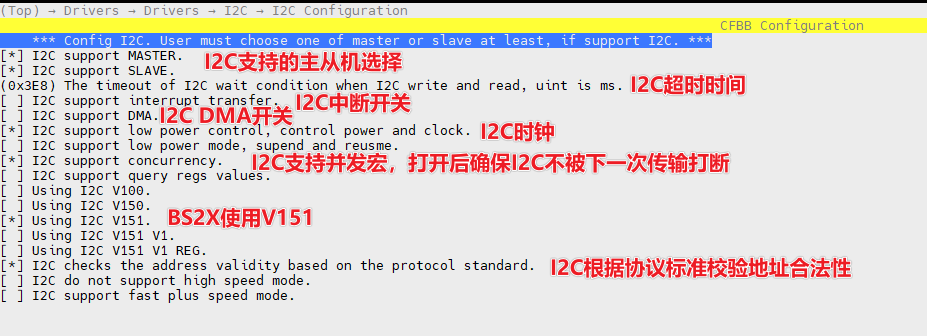

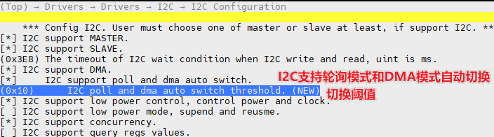

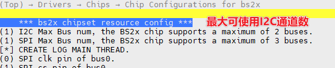

> **说明：** 
>若上述图片所示与表格描述不一致，请以表格为准。

配置宏具体描述如[表1](#table16629938173916)所示。

**表 1**  I2C相关宏描述

<a name="table16629938173916"></a>
<table><thead align="left"><tr id="row1462913813915"><th class="cellrowborder" valign="top" width="22.62773722627737%" id="mcps1.2.7.1.1"><p id="p1962923853920"><a name="p1962923853920"></a><a name="p1962923853920"></a>宏名称（CONFIG_是默认添加的前缀）</p>
</th>
<th class="cellrowborder" valign="top" width="21.137886211378863%" id="mcps1.2.7.1.2"><p id="p962916388395"><a name="p962916388395"></a><a name="p962916388395"></a>kconfig界面显示的具体描述</p>
</th>
<th class="cellrowborder" valign="top" width="19.878012198780123%" id="mcps1.2.7.1.3"><p id="p18731420115119"><a name="p18731420115119"></a><a name="p18731420115119"></a>使用场景</p>
</th>
<th class="cellrowborder" valign="top" width="10.608939106089391%" id="mcps1.2.7.1.4"><p id="p537485457"><a name="p537485457"></a><a name="p537485457"></a>是否已经实现</p>
</th>
<th class="cellrowborder" valign="top" width="11.348865113488651%" id="mcps1.2.7.1.5"><p id="p1162915382392"><a name="p1162915382392"></a><a name="p1162915382392"></a>是否依赖其他宏</p>
</th>
<th class="cellrowborder" valign="top" width="14.3985601439856%" id="mcps1.2.7.1.6"><p id="p1162923893911"><a name="p1162923893911"></a><a name="p1162923893911"></a>是否选择打开或修改配置</p>
</th>
</tr>
</thead>
<tbody><tr id="row16629338103916"><td class="cellrowborder" valign="top" width="22.62773722627737%" headers="mcps1.2.7.1.1 "><p id="p166291338133910"><a name="p166291338133910"></a><a name="p166291338133910"></a>CONFIG_I2C_SUPPORT_MASTER</p>
</td>
<td class="cellrowborder" valign="top" width="21.137886211378863%" headers="mcps1.2.7.1.2 "><p id="p28673381813"><a name="p28673381813"></a><a name="p28673381813"></a>I2C support MASTER.</p>
</td>
<td class="cellrowborder" valign="top" width="19.878012198780123%" headers="mcps1.2.7.1.3 "><p id="p182789183235"><a name="p182789183235"></a><a name="p182789183235"></a>I2C支持主机选择，视情况选择</p>
</td>
<td class="cellrowborder" valign="top" width="10.608939106089391%" headers="mcps1.2.7.1.4 "><p id="p166297382397"><a name="p166297382397"></a><a name="p166297382397"></a>是</p>
</td>
<td class="cellrowborder" valign="top" width="11.348865113488651%" headers="mcps1.2.7.1.5 "><p id="p162983873917"><a name="p162983873917"></a><a name="p162983873917"></a>否</p>
</td>
<td class="cellrowborder" valign="top" width="14.3985601439856%" headers="mcps1.2.7.1.6 "><p id="p142312269162"><a name="p142312269162"></a><a name="p142312269162"></a>默认打开，建议打开</p>
</td>
</tr>
<tr id="row166299383394"><td class="cellrowborder" valign="top" width="22.62773722627737%" headers="mcps1.2.7.1.1 "><p id="p14629173813920"><a name="p14629173813920"></a><a name="p14629173813920"></a>CONFIG_I2C_SUPPORT_SLAVE</p>
</td>
<td class="cellrowborder" valign="top" width="21.137886211378863%" headers="mcps1.2.7.1.2 "><p id="p6314610193820"><a name="p6314610193820"></a><a name="p6314610193820"></a>I2C support SLAVE.</p>
</td>
<td class="cellrowborder" valign="top" width="19.878012198780123%" headers="mcps1.2.7.1.3 "><p id="p750495852813"><a name="p750495852813"></a><a name="p750495852813"></a>I2C支持从机选择，视情况选择</p>
</td>
<td class="cellrowborder" valign="top" width="10.608939106089391%" headers="mcps1.2.7.1.4 "><p id="p166291838143916"><a name="p166291838143916"></a><a name="p166291838143916"></a>是</p>
</td>
<td class="cellrowborder" valign="top" width="11.348865113488651%" headers="mcps1.2.7.1.5 "><p id="p2629138193917"><a name="p2629138193917"></a><a name="p2629138193917"></a>否</p>
</td>
<td class="cellrowborder" valign="top" width="14.3985601439856%" headers="mcps1.2.7.1.6 "><p id="p16717115134416"><a name="p16717115134416"></a><a name="p16717115134416"></a>默认打开，建议打开</p>
</td>
</tr>
<tr id="row3629193823919"><td class="cellrowborder" valign="top" width="22.62773722627737%" headers="mcps1.2.7.1.1 "><p id="p262983811395"><a name="p262983811395"></a><a name="p262983811395"></a>CONFIG_I2C_WAIT_CONDITION_TIMEOUT</p>
</td>
<td class="cellrowborder" valign="top" width="21.137886211378863%" headers="mcps1.2.7.1.2 "><p id="p1534374635"><a name="p1534374635"></a><a name="p1534374635"></a>The timeout of I2C wait condition when I2C write and read, uint is ms.</p>
</td>
<td class="cellrowborder" valign="top" width="19.878012198780123%" headers="mcps1.2.7.1.3 "><p id="p1534582015113"><a name="p1534582015113"></a><a name="p1534582015113"></a>I2C等待的最大超时时间</p>
</td>
<td class="cellrowborder" valign="top" width="10.608939106089391%" headers="mcps1.2.7.1.4 "><p id="p3629133873917"><a name="p3629133873917"></a><a name="p3629133873917"></a>是</p>
</td>
<td class="cellrowborder" valign="top" width="11.348865113488651%" headers="mcps1.2.7.1.5 "><p id="p8473437181816"><a name="p8473437181816"></a><a name="p8473437181816"></a>否</p>
</td>
<td class="cellrowborder" valign="top" width="14.3985601439856%" headers="mcps1.2.7.1.6 "><p id="p97001027124119"><a name="p97001027124119"></a><a name="p97001027124119"></a>默认值是0x3E8，视情况选择配置，建议不做修改</p>
</td>
</tr>
<tr id="row962920381394"><td class="cellrowborder" valign="top" width="22.62773722627737%" headers="mcps1.2.7.1.1 "><p id="p1629738173912"><a name="p1629738173912"></a><a name="p1629738173912"></a>CONFIG_I2C_SUPPORT_INT</p>
</td>
<td class="cellrowborder" valign="top" width="21.137886211378863%" headers="mcps1.2.7.1.2 "><p id="p1326114416384"><a name="p1326114416384"></a><a name="p1326114416384"></a>I2C support interrupt transfer.</p>
</td>
<td class="cellrowborder" valign="top" width="19.878012198780123%" headers="mcps1.2.7.1.3 "><p id="p0369111616584"><a name="p0369111616584"></a><a name="p0369111616584"></a>I2C支持中断模式，视情况选择</p>
</td>
<td class="cellrowborder" valign="top" width="10.608939106089391%" headers="mcps1.2.7.1.4 "><p id="p7630938143910"><a name="p7630938143910"></a><a name="p7630938143910"></a>是</p>
</td>
<td class="cellrowborder" valign="top" width="11.348865113488651%" headers="mcps1.2.7.1.5 "><p id="p184291153201819"><a name="p184291153201819"></a><a name="p184291153201819"></a>否</p>
</td>
<td class="cellrowborder" valign="top" width="14.3985601439856%" headers="mcps1.2.7.1.6 "><p id="p55269547522"><a name="p55269547522"></a><a name="p55269547522"></a>默认关闭，视情况选择</p>
</td>
</tr>
<tr id="row62681237271"><td class="cellrowborder" valign="top" width="22.62773722627737%" headers="mcps1.2.7.1.1 "><p id="p112401826112812"><a name="p112401826112812"></a><a name="p112401826112812"></a>CONFIG_I2C_SUPPORT_IN_CHIP_LOOPBACK</p>
</td>
<td class="cellrowborder" valign="top" width="21.137886211378863%" headers="mcps1.2.7.1.2 "><p id="p824263818316"><a name="p824263818316"></a><a name="p824263818316"></a>I2C support loopback, which can read and write in one chip with two diferrent I2C buses.</p>
</td>
<td class="cellrowborder" valign="top" width="19.878012198780123%" headers="mcps1.2.7.1.3 "><p id="p185305517595"><a name="p185305517595"></a><a name="p185305517595"></a>I2C支持同一块单板不同的BUS中断回环模式</p>
</td>
<td class="cellrowborder" valign="top" width="10.608939106089391%" headers="mcps1.2.7.1.4 "><p id="p5269202314277"><a name="p5269202314277"></a><a name="p5269202314277"></a>是</p>
</td>
<td class="cellrowborder" valign="top" width="11.348865113488651%" headers="mcps1.2.7.1.5 "><p id="p115505376560"><a name="p115505376560"></a><a name="p115505376560"></a>CONFIG_I2C_SUPPORT_INT</p>
</td>
<td class="cellrowborder" valign="top" width="14.3985601439856%" headers="mcps1.2.7.1.6 "><p id="p198015734219"><a name="p198015734219"></a><a name="p198015734219"></a>默认关闭，视情况选择</p>
</td>
</tr>
<tr id="row17817572040"><td class="cellrowborder" valign="top" width="22.62773722627737%" headers="mcps1.2.7.1.1 "><p id="p109831846175713"><a name="p109831846175713"></a><a name="p109831846175713"></a>CONFIG_I2C_SUPPORT_DMA</p>
</td>
<td class="cellrowborder" valign="top" width="21.137886211378863%" headers="mcps1.2.7.1.2 "><p id="p1092835010319"><a name="p1092835010319"></a><a name="p1092835010319"></a>I2C support DMA.</p>
</td>
<td class="cellrowborder" valign="top" width="19.878012198780123%" headers="mcps1.2.7.1.3 "><p id="p1164428144915"><a name="p1164428144915"></a><a name="p1164428144915"></a>I2C支持DMA模式，视情况选择，若选择采用I2C DMA模式，则需同步选择DMA驱动的KCONFIG配置，请参考<a href="KCONFIG配置-27.md">KCONFIG配置</a></p>
</td>
<td class="cellrowborder" valign="top" width="10.608939106089391%" headers="mcps1.2.7.1.4 "><p id="p17919571246"><a name="p17919571246"></a><a name="p17919571246"></a>是</p>
</td>
<td class="cellrowborder" valign="top" width="11.348865113488651%" headers="mcps1.2.7.1.5 "><p id="p151126287424"><a name="p151126287424"></a><a name="p151126287424"></a>CONFIG_DRIVER_SUPPORT_DMA</p>
</td>
<td class="cellrowborder" valign="top" width="14.3985601439856%" headers="mcps1.2.7.1.6 "><p id="p182001731221"><a name="p182001731221"></a><a name="p182001731221"></a>默认关闭，视情况选择</p>
</td>
</tr>
<tr id="row1071318918131"><td class="cellrowborder" valign="top" width="22.62773722627737%" headers="mcps1.2.7.1.1 "><p id="p671319910134"><a name="p671319910134"></a><a name="p671319910134"></a>CONFIG_I2C_SUPPORT_POLL_AND_DMA_AUTO_SWITCH</p>
</td>
<td class="cellrowborder" valign="top" width="21.137886211378863%" headers="mcps1.2.7.1.2 "><p id="p2086620416410"><a name="p2086620416410"></a><a name="p2086620416410"></a>I2C support poll and dma auto switch.</p>
</td>
<td class="cellrowborder" valign="top" width="19.878012198780123%" headers="mcps1.2.7.1.3 "><p id="p7601132985220"><a name="p7601132985220"></a><a name="p7601132985220"></a>I2C支持根据设定的阈值大小自动切换轮询和DMA模式，视情况选择</p>
</td>
<td class="cellrowborder" valign="top" width="10.608939106089391%" headers="mcps1.2.7.1.4 "><p id="p1571316971311"><a name="p1571316971311"></a><a name="p1571316971311"></a>是</p>
</td>
<td class="cellrowborder" valign="top" width="11.348865113488651%" headers="mcps1.2.7.1.5 "><p id="p15555194716423"><a name="p15555194716423"></a><a name="p15555194716423"></a>CONFIG_I2C_SUPPORT_DMA</p>
</td>
<td class="cellrowborder" valign="top" width="14.3985601439856%" headers="mcps1.2.7.1.6 "><p id="p57965521033"><a name="p57965521033"></a><a name="p57965521033"></a>默认关闭，视情况选择</p>
</td>
</tr>
<tr id="row1663153711314"><td class="cellrowborder" valign="top" width="22.62773722627737%" headers="mcps1.2.7.1.1 "><p id="p13663183721310"><a name="p13663183721310"></a><a name="p13663183721310"></a>CONFIG_I2C_POLL_AND_DMA_AUTO_SWITCH_THRESHOLD</p>
</td>
<td class="cellrowborder" valign="top" width="21.137886211378863%" headers="mcps1.2.7.1.2 "><p id="p1030517151649"><a name="p1030517151649"></a><a name="p1030517151649"></a>I2C poll and dma auto switch threshold.</p>
</td>
<td class="cellrowborder" valign="top" width="19.878012198780123%" headers="mcps1.2.7.1.3 "><p id="p1369200125313"><a name="p1369200125313"></a><a name="p1369200125313"></a>I2C支持自动切换轮询和DMA模式时设置的阈值大小，默认值是16个数</p>
</td>
<td class="cellrowborder" valign="top" width="10.608939106089391%" headers="mcps1.2.7.1.4 "><p id="p186635371131"><a name="p186635371131"></a><a name="p186635371131"></a>是</p>
</td>
<td class="cellrowborder" valign="top" width="11.348865113488651%" headers="mcps1.2.7.1.5 "><p id="p16793105954210"><a name="p16793105954210"></a><a name="p16793105954210"></a>CONFIG_I2C_SUPPORT_POLL_AND_DMA_AUTO_SWITCH</p>
</td>
<td class="cellrowborder" valign="top" width="14.3985601439856%" headers="mcps1.2.7.1.6 "><p id="p125242276524"><a name="p125242276524"></a><a name="p125242276524"></a>默认值是16，视情况选择配置</p>
</td>
</tr>
<tr id="row1115204491314"><td class="cellrowborder" valign="top" width="22.62773722627737%" headers="mcps1.2.7.1.1 "><p id="p20115184431314"><a name="p20115184431314"></a><a name="p20115184431314"></a>CONFIG_I2C_SUPPORT_LPC</p>
</td>
<td class="cellrowborder" valign="top" width="21.137886211378863%" headers="mcps1.2.7.1.2 "><p id="p1038192719410"><a name="p1038192719410"></a><a name="p1038192719410"></a>I2C support low power control, control power and clock.</p>
</td>
<td class="cellrowborder" valign="top" width="19.878012198780123%" headers="mcps1.2.7.1.3 "><p id="p1539110454437"><a name="p1539110454437"></a><a name="p1539110454437"></a>I2C工作时钟</p>
</td>
<td class="cellrowborder" valign="top" width="10.608939106089391%" headers="mcps1.2.7.1.4 "><p id="p9115124411312"><a name="p9115124411312"></a><a name="p9115124411312"></a>是</p>
</td>
<td class="cellrowborder" valign="top" width="11.348865113488651%" headers="mcps1.2.7.1.5 "><p id="p5115544151311"><a name="p5115544151311"></a><a name="p5115544151311"></a>否</p>
</td>
<td class="cellrowborder" valign="top" width="14.3985601439856%" headers="mcps1.2.7.1.6 "><p id="p4131579442"><a name="p4131579442"></a><a name="p4131579442"></a>默认打开，必选</p>
</td>
</tr>
<tr id="row9686349171316"><td class="cellrowborder" valign="top" width="22.62773722627737%" headers="mcps1.2.7.1.1 "><p id="p2068610490135"><a name="p2068610490135"></a><a name="p2068610490135"></a>CONFIG_I2C_SUPPORT_LPM</p>
</td>
<td class="cellrowborder" valign="top" width="21.137886211378863%" headers="mcps1.2.7.1.2 "><p id="p1699112401448"><a name="p1699112401448"></a><a name="p1699112401448"></a>I2C support low power mode, supend and reusme.</p>
</td>
<td class="cellrowborder" valign="top" width="19.878012198780123%" headers="mcps1.2.7.1.3 "><p id="p1435013136441"><a name="p1435013136441"></a><a name="p1435013136441"></a>该宏仅用于低功耗情况下使用</p>
</td>
<td class="cellrowborder" valign="top" width="10.608939106089391%" headers="mcps1.2.7.1.4 "><p id="p12686184941312"><a name="p12686184941312"></a><a name="p12686184941312"></a>是</p>
</td>
<td class="cellrowborder" valign="top" width="11.348865113488651%" headers="mcps1.2.7.1.5 "><p id="p26871249111313"><a name="p26871249111313"></a><a name="p26871249111313"></a>否</p>
</td>
<td class="cellrowborder" valign="top" width="14.3985601439856%" headers="mcps1.2.7.1.6 "><p id="p10435326114414"><a name="p10435326114414"></a><a name="p10435326114414"></a>默认关闭，视情况选择</p>
</td>
</tr>
<tr id="row10100123917141"><td class="cellrowborder" valign="top" width="22.62773722627737%" headers="mcps1.2.7.1.1 "><p id="p6359290154"><a name="p6359290154"></a><a name="p6359290154"></a>CONFIG_I2C_SUPPORT_CONCURRENCY</p>
</td>
<td class="cellrowborder" valign="top" width="21.137886211378863%" headers="mcps1.2.7.1.2 "><p id="p23825532410"><a name="p23825532410"></a><a name="p23825532410"></a>I2C support concurrency.</p>
</td>
<td class="cellrowborder" valign="top" width="19.878012198780123%" headers="mcps1.2.7.1.3 "><p id="p17131797138"><a name="p17131797138"></a><a name="p17131797138"></a>如果打开该宏，则能够确保当前传输的完整性，只有在当前传输完成后才会进行下一次传输，没加锁的情况下要打开该宏</p>
</td>
<td class="cellrowborder" valign="top" width="10.608939106089391%" headers="mcps1.2.7.1.4 "><p id="p131001439161420"><a name="p131001439161420"></a><a name="p131001439161420"></a>是</p>
</td>
<td class="cellrowborder" valign="top" width="11.348865113488651%" headers="mcps1.2.7.1.5 "><p id="p110083912148"><a name="p110083912148"></a><a name="p110083912148"></a>否</p>
</td>
<td class="cellrowborder" valign="top" width="14.3985601439856%" headers="mcps1.2.7.1.6 "><p id="p49849494449"><a name="p49849494449"></a><a name="p49849494449"></a>默认打开，建议打开</p>
</td>
</tr>
<tr id="row9604124541418"><td class="cellrowborder" valign="top" width="22.62773722627737%" headers="mcps1.2.7.1.1 "><p id="p1198461021518"><a name="p1198461021518"></a><a name="p1198461021518"></a>CONFIG_I2C_SUPPORT_QUERY_REGS</p>
</td>
<td class="cellrowborder" valign="top" width="21.137886211378863%" headers="mcps1.2.7.1.2 "><p id="p142671250514"><a name="p142671250514"></a><a name="p142671250514"></a>I2C support query regs values.</p>
</td>
<td class="cellrowborder" valign="top" width="19.878012198780123%" headers="mcps1.2.7.1.3 "><p id="p438154074512"><a name="p438154074512"></a><a name="p438154074512"></a>I2C支持回读所有相关寄存器的值，视情况选择</p>
</td>
<td class="cellrowborder" valign="top" width="10.608939106089391%" headers="mcps1.2.7.1.4 "><p id="p1860512452145"><a name="p1860512452145"></a><a name="p1860512452145"></a>是</p>
</td>
<td class="cellrowborder" valign="top" width="11.348865113488651%" headers="mcps1.2.7.1.5 "><p id="p13605145101411"><a name="p13605145101411"></a><a name="p13605145101411"></a>否</p>
</td>
<td class="cellrowborder" valign="top" width="14.3985601439856%" headers="mcps1.2.7.1.6 "><p id="p1817114179353"><a name="p1817114179353"></a><a name="p1817114179353"></a>默认关闭，视情况选择，建议关闭</p>
</td>
</tr>
<tr id="row4155553141"><td class="cellrowborder" valign="top" width="22.62773722627737%" headers="mcps1.2.7.1.1 "><p id="p2119131217152"><a name="p2119131217152"></a><a name="p2119131217152"></a>CONFIG_I2C_USING_V100</p>
</td>
<td class="cellrowborder" valign="top" width="21.137886211378863%" headers="mcps1.2.7.1.2 "><p id="p879573724713"><a name="p879573724713"></a><a name="p879573724713"></a>Using I2C V100.</p>
</td>
<td class="cellrowborder" valign="top" width="19.878012198780123%" headers="mcps1.2.7.1.3 "><p id="p1605194513147"><a name="p1605194513147"></a><a name="p1605194513147"></a>该宏代表使用I2C V100的驱动规格，本产品不使用该规格</p>
</td>
<td class="cellrowborder" valign="top" width="10.608939106089391%" headers="mcps1.2.7.1.4 "><p id="p201555511146"><a name="p201555511146"></a><a name="p201555511146"></a>是</p>
</td>
<td class="cellrowborder" valign="top" width="11.348865113488651%" headers="mcps1.2.7.1.5 "><p id="p1280317457132"><a name="p1280317457132"></a><a name="p1280317457132"></a>否</p>
</td>
<td class="cellrowborder" valign="top" width="14.3985601439856%" headers="mcps1.2.7.1.6 "><p id="p7644175334613"><a name="p7644175334613"></a><a name="p7644175334613"></a>默认关闭，必须关闭</p>
</td>
</tr>
<tr id="row155854071519"><td class="cellrowborder" valign="top" width="22.62773722627737%" headers="mcps1.2.7.1.1 "><p id="p1289513201519"><a name="p1289513201519"></a><a name="p1289513201519"></a>CONFIG_I2C_USING_V150</p>
</td>
<td class="cellrowborder" valign="top" width="21.137886211378863%" headers="mcps1.2.7.1.2 "><p id="p191602044299"><a name="p191602044299"></a><a name="p191602044299"></a>Using I2C V150.</p>
</td>
<td class="cellrowborder" valign="top" width="19.878012198780123%" headers="mcps1.2.7.1.3 "><p id="p123612018467"><a name="p123612018467"></a><a name="p123612018467"></a>该宏代表使用I2C V150的驱动规格，本产品不使用该规格</p>
</td>
<td class="cellrowborder" valign="top" width="10.608939106089391%" headers="mcps1.2.7.1.4 "><p id="p145852091517"><a name="p145852091517"></a><a name="p145852091517"></a>是</p>
</td>
<td class="cellrowborder" valign="top" width="11.348865113488651%" headers="mcps1.2.7.1.5 "><p id="p178719416558"><a name="p178719416558"></a><a name="p178719416558"></a>否</p>
</td>
<td class="cellrowborder" valign="top" width="14.3985601439856%" headers="mcps1.2.7.1.6 "><p id="p2184155224611"><a name="p2184155224611"></a><a name="p2184155224611"></a>默认关闭，必须关闭</p>
</td>
</tr>
<tr id="row1120612316161"><td class="cellrowborder" valign="top" width="22.62773722627737%" headers="mcps1.2.7.1.1 "><p id="p12207162314169"><a name="p12207162314169"></a><a name="p12207162314169"></a>CONFIG_I2C_USING_V151</p>
</td>
<td class="cellrowborder" valign="top" width="21.137886211378863%" headers="mcps1.2.7.1.2 "><p id="p1744711148101"><a name="p1744711148101"></a><a name="p1744711148101"></a>Using I2C V151.</p>
</td>
<td class="cellrowborder" valign="top" width="19.878012198780123%" headers="mcps1.2.7.1.3 "><p id="p1357732211468"><a name="p1357732211468"></a><a name="p1357732211468"></a>该宏代表使用I2C V151的驱动规格，本产品默认使用该规格</p>
</td>
<td class="cellrowborder" valign="top" width="10.608939106089391%" headers="mcps1.2.7.1.4 "><p id="p10207202331613"><a name="p10207202331613"></a><a name="p10207202331613"></a>是</p>
</td>
<td class="cellrowborder" valign="top" width="11.348865113488651%" headers="mcps1.2.7.1.5 "><p id="p22077234164"><a name="p22077234164"></a><a name="p22077234164"></a>否</p>
</td>
<td class="cellrowborder" valign="top" width="14.3985601439856%" headers="mcps1.2.7.1.6 "><p id="p7730154612468"><a name="p7730154612468"></a><a name="p7730154612468"></a>默认打开，必选</p>
</td>
</tr>
<tr id="row18951740131615"><td class="cellrowborder" valign="top" width="22.62773722627737%" headers="mcps1.2.7.1.1 "><p id="p197481234181715"><a name="p197481234181715"></a><a name="p197481234181715"></a>CONFIG_I2C_ADDR_VALID_CHECK</p>
</td>
<td class="cellrowborder" valign="top" width="21.137886211378863%" headers="mcps1.2.7.1.2 "><p id="p199591808107"><a name="p199591808107"></a><a name="p199591808107"></a>I2C checks the address validity based on the protocol standard.</p>
</td>
<td class="cellrowborder" valign="top" width="19.878012198780123%" headers="mcps1.2.7.1.3 "><p id="p139544011168"><a name="p139544011168"></a><a name="p139544011168"></a>I2C根据协议标准校验地址合法性</p>
</td>
<td class="cellrowborder" valign="top" width="10.608939106089391%" headers="mcps1.2.7.1.4 "><p id="p16957407165"><a name="p16957407165"></a><a name="p16957407165"></a>是</p>
</td>
<td class="cellrowborder" valign="top" width="11.348865113488651%" headers="mcps1.2.7.1.5 "><p id="p395194031613"><a name="p395194031613"></a><a name="p395194031613"></a>否</p>
</td>
<td class="cellrowborder" valign="top" width="14.3985601439856%" headers="mcps1.2.7.1.6 "><p id="p6820628174715"><a name="p6820628174715"></a><a name="p6820628174715"></a>默认打开，建议打开</p>
</td>
</tr>
<tr id="row16469746171619"><td class="cellrowborder" valign="top" width="22.62773722627737%" headers="mcps1.2.7.1.1 "><p id="p13831935111710"><a name="p13831935111710"></a><a name="p13831935111710"></a>CONFIG_I2C_NOT_SUPPORT_HIGH_SPEED</p>
</td>
<td class="cellrowborder" valign="top" width="21.137886211378863%" headers="mcps1.2.7.1.2 "><p id="p19991173441010"><a name="p19991173441010"></a><a name="p19991173441010"></a>I2C do not support high speed mode.</p>
</td>
<td class="cellrowborder" valign="top" width="19.878012198780123%" headers="mcps1.2.7.1.3 "><p id="p56134571811"><a name="p56134571811"></a><a name="p56134571811"></a>I2C不支持高速波特率，本产品暂不使用</p>
</td>
<td class="cellrowborder" valign="top" width="10.608939106089391%" headers="mcps1.2.7.1.4 "><p id="p154691146191615"><a name="p154691146191615"></a><a name="p154691146191615"></a>是</p>
</td>
<td class="cellrowborder" valign="top" width="11.348865113488651%" headers="mcps1.2.7.1.5 "><p id="p746920467167"><a name="p746920467167"></a><a name="p746920467167"></a>否</p>
</td>
<td class="cellrowborder" valign="top" width="14.3985601439856%" headers="mcps1.2.7.1.6 "><p id="p33021419134716"><a name="p33021419134716"></a><a name="p33021419134716"></a>默认关闭，本产品实际暂未使用，建议关闭</p>
</td>
</tr>
<tr id="row17463553171619"><td class="cellrowborder" valign="top" width="22.62773722627737%" headers="mcps1.2.7.1.1 "><p id="p8789036121717"><a name="p8789036121717"></a><a name="p8789036121717"></a>CONFIG_I2C_SUPPORT_FAST_PLUS_SPEED</p>
</td>
<td class="cellrowborder" valign="top" width="21.137886211378863%" headers="mcps1.2.7.1.2 "><p id="p58451146121010"><a name="p58451146121010"></a><a name="p58451146121010"></a>I2C support fast plus speed mode.</p>
</td>
<td class="cellrowborder" valign="top" width="19.878012198780123%" headers="mcps1.2.7.1.3 "><p id="p2463115311616"><a name="p2463115311616"></a><a name="p2463115311616"></a>I2C支持快速plus波特率</p>
</td>
<td class="cellrowborder" valign="top" width="10.608939106089391%" headers="mcps1.2.7.1.4 "><p id="p10463185313162"><a name="p10463185313162"></a><a name="p10463185313162"></a>是</p>
</td>
<td class="cellrowborder" valign="top" width="11.348865113488651%" headers="mcps1.2.7.1.5 "><p id="p1246320533166"><a name="p1246320533166"></a><a name="p1246320533166"></a>否</p>
</td>
<td class="cellrowborder" valign="top" width="14.3985601439856%" headers="mcps1.2.7.1.6 "><p id="p697712013479"><a name="p697712013479"></a><a name="p697712013479"></a>默认关闭，视情况选择，建议关闭</p>
</td>
</tr>
<tr id="row133512133512"><td class="cellrowborder" valign="top" width="22.62773722627737%" headers="mcps1.2.7.1.1 "><p id="p0328717114020"><a name="p0328717114020"></a><a name="p0328717114020"></a>CONFIG_I2C_BUS_MAX_NUM</p>
</td>
<td class="cellrowborder" valign="top" width="21.137886211378863%" headers="mcps1.2.7.1.2 "><p id="p117931759173519"><a name="p117931759173519"></a><a name="p117931759173519"></a>I2C Max Bus num, the BS2x chip supports a maximum of 2 buses.</p>
</td>
<td class="cellrowborder" valign="top" width="19.878012198780123%" headers="mcps1.2.7.1.3 "><p id="p1232891710407"><a name="p1232891710407"></a><a name="p1232891710407"></a>该宏表示I2C BUS的最大数量，默认值是1，若使用除I2C BUS0以外的BUS，则必须对应修改该宏，否则会出现异常情况</p>
</td>
<td class="cellrowborder" valign="top" width="10.608939106089391%" headers="mcps1.2.7.1.4 "><p id="p123283175403"><a name="p123283175403"></a><a name="p123283175403"></a>是</p>
</td>
<td class="cellrowborder" valign="top" width="11.348865113488651%" headers="mcps1.2.7.1.5 "><p id="p9328151794011"><a name="p9328151794011"></a><a name="p9328151794011"></a>CONFIG_DRIVER_SUPPORT_I2C</p>
</td>
<td class="cellrowborder" valign="top" width="14.3985601439856%" headers="mcps1.2.7.1.6 "><p id="p12328191719406"><a name="p12328191719406"></a><a name="p12328191719406"></a>默认值是1，根据实际I2C BUS使用情况修改配置</p>
</td>
</tr>
</tbody>
</table>

## 开发指引<a name="ZH-CN_TOPIC_0000001665143718"></a>

I2C用于对接支持I2C协议的设备，I2C单元可以作为主设备或从设备。以I2C单元作为主设备为例：

1.  通过IO复用，将用到的管脚复用为I2C功能。
2.  调用uapi\_i2c\_init接口，初始化I2C资源，此处以初始化I2C主机为例：

    ```
    #define TEST_I2C                I2C_BUS_0
    #define I2C_BAUDRATE            400000    /* 400kHz */
    #define I2C_PIN_CLK_PINMUX      HAL_PIO_I2C0_CLK
    #define I2C_PIN_DAT_PINMUX      HAL_PIO_I2C0_DATA
    #define I2C_PIN_CLK             S_MGPIO24
    #define I2C_PIN_DAT             S_MGPIO25
    errcode_t sample_i2c_init(void)
    {
        /* 设置 i2c pinmux */
        uapi_pin_set_mode(I2C_PIN_CLK, I2C_PIN_CLK_PINMUX);       /* 设置 i2c clk pinmux */
        uapi_pin_set_mode(I2C_PIN_DAT, I2C_PIN_DAT_PINMUX);       /* 设置 i2c dat pinmux */
        /* 初始化 i2c */
        return uapi_i2c_master_init(TEST_I2C, I2C_BAUDRATE, 0);     /* 初始化 i2c0 */
    }
    ```

3.  调用uapi\_i2c\_master\_write接口，实现主机发送数据。

    ```
    errcode_t sample_i2c_write(uint8_t *data, uint8_t len, uint16_t addr)
    {
        i2c_data_t i2c_send_data = { 0 };
        i2c_send_data.send_buf = data;                                   /* 设置 tx buff */
        i2c_send_data.send_len = len;                                    /* 设置 tx buff 长度 */
        return uapi_i2c_master_write(TEST_I2C, addr, &i2c_send_data);     /* 发送数据 */
    }
    ```

双板I2C三种模式（轮询模式、中断模式、DMA模式）下主从收发完整代码流程可参考以下代码：

```
#include "pinctrl.h"
#include "i2c.h"
#include "soc_osal.h"
#include "app_init.h"
#if defined(CONFIG_I2C_SUPPORT_DMA) && (CONFIG_I2C_SUPPORT_DMA == 1)
#include "dma.h"
#endif

#define I2C_MASTER_ADDR                   0x0
#define I2C_SLAVE_ADDR                    0x8
#define I2C_SET_BAUDRATE                  400000
#define I2C_TASK_DURATION_MS              500
#if defined(CONFIG_I2C_SUPPORT_INT) && (CONFIG_I2C_SUPPORT_INT == 1)
#define I2C_INT_TRANSFER_DELAY_MS         800
#endif

#define I2C_TASK_PRIO                     24
#define I2C_TASK_STACK_SIZE               0x1000

static i2c_data_t data = { 0 };
static uint8_t tx_buff[CONFIG_I2C_TRANSFER_LEN] = { 0 };
static uint8_t rx_buff[CONFIG_I2C_TRANSFER_LEN] = { 0 };

static void app_i2c_init_pin(void)
{
#if defined(CONFIG_PINCTRL_SUPPORT_IE)
    uapi_pin_set_ie(CONFIG_I2C_MASTER_SCL_PIN, PIN_IE_1);
    uapi_pin_set_ie(CONFIG_I2C_MASTER_SDA_PIN, PIN_IE_1);
#endif /* CONFIG_PINCTRL_SUPPORT_IE */
    /* I2C pinmux. */
    uapi_pin_set_mode(CONFIG_I2C_MASTER_SCL_PIN, CONFIG_I2C_MASTER_SCL_PIN_MODE);
    uapi_pin_set_mode(CONFIG_I2C_MASTER_SDA_PIN, CONFIG_I2C_MASTER_SDA_PIN_MODE);
}

static void app_i2c_data_config(void)
{
    /* I2C data config. */
    for (uint32_t loop = 0; loop < CONFIG_I2C_TRANSFER_LEN; loop++) {
        tx_buff[loop] = (loop & 0xFF);
    }
    data.send_buf = tx_buff;
    data.send_len = CONFIG_I2C_TRANSFER_LEN;
    data.receive_buf = rx_buff;
    data.receive_len = CONFIG_I2C_TRANSFER_LEN;
}

static void *i2c_master_task(const char *arg)
{
    unused(arg);

    uint32_t baudrate = I2C_SET_BAUDRATE;
    uint8_t hscode = I2C_MASTER_ADDR;
    uint16_t dev_addr = I2C_SLAVE_ADDR;

#if defined(CONFIG_I2C_SUPPORT_DMA) && (CONFIG_I2C_SUPPORT_DMA == 1)
    uapi_dma_init();
    uapi_dma_open();
#ifndef CONFIG_I2C_SUPPORT_POLL_AND_DMA_AUTO_SWITCH
    uapi_i2c_set_dma_mode(CONFIG_I2C_MASTER_BUS_ID, true);
#endif
#endif  /* CONFIG_I2C_SUPPORT_DMA */

    /* I2C master init config. */
    app_i2c_init_pin();
    uapi_i2c_master_init(CONFIG_I2C_MASTER_BUS_ID, baudrate, hscode);

#if defined(CONFIG_I2C_SUPPORT_INT) && (CONFIG_I2C_SUPPORT_INT == 1)
    uapi_i2c_set_irq_mode(CONFIG_I2C_MASTER_BUS_ID, true);
#endif  /* CONFIG_I2C_SUPPORT_INT */

    app_i2c_data_config();

    while (1) {
        osal_msleep(I2C_TASK_DURATION_MS);
#ifndef CONFIG_I2C_MASTER_SUPPORT_WRITEREAD
        osal_printk("i2c%d master send start!\r\n", CONFIG_I2C_MASTER_BUS_ID);
        if (uapi_i2c_master_write(CONFIG_I2C_MASTER_BUS_ID, dev_addr, &data) == ERRCODE_SUCC) {
            osal_printk("i2c%d master send succ!\r\n", CONFIG_I2C_MASTER_BUS_ID);
        } else {
            continue;
        }
#if defined(CONFIG_I2C_SUPPORT_INT) && (CONFIG_I2C_SUPPORT_INT == 1)
        osal_msleep(I2C_INT_TRANSFER_DELAY_MS);
#endif
        osal_printk("i2c%d master receive start!\r\n", CONFIG_I2C_MASTER_BUS_ID);
        if (uapi_i2c_master_read(CONFIG_I2C_MASTER_BUS_ID, dev_addr, &data) == ERRCODE_SUCC) {
            for (uint32_t i = 0; i < data.receive_len; i++) {
                osal_printk("i2c%d master receive data is %x\r\n", CONFIG_I2C_MASTER_BUS_ID, data.receive_buf[i]);
            }
            osal_printk("i2c%d master receive succ!\r\n", CONFIG_I2C_MASTER_BUS_ID);
        }
#else
        osal_printk("i2c%d master writeread start!\r\n", CONFIG_I2C_MASTER_BUS_ID);
        if (uapi_i2c_master_writeread(CONFIG_I2C_MASTER_BUS_ID, dev_addr, &data) == ERRCODE_SUCC) {
            for (uint32_t i = 0; i < data.receive_len; i++) {
                osal_printk("i2c%d master writeread data is %x\r\n", CONFIG_I2C_MASTER_BUS_ID, data.receive_buf[i]);
            }
            osal_printk("i2c%d master writeread succ!\r\n", CONFIG_I2C_MASTER_BUS_ID);
        }
#endif
    }

    return NULL;
}

static void i2c_master_entry(void)
{
    osal_task *task_handle = NULL;
    osal_kthread_lock();
    task_handle = osal_kthread_create((osal_kthread_handler)i2c_master_task, 0, "I2cMasterTask", I2C_TASK_STACK_SIZE);
    if (task_handle != NULL) {
        osal_kthread_set_priority(task_handle, I2C_TASK_PRIO);
    }
    osal_kthread_unlock();
}

/* Run the i2c_master_entry. */
app_run(i2c_master_entry);

----------------------------------------------------------------

#include "pinctrl.h"
#include "i2c.h"
#include "soc_osal.h"
#include "app_init.h"
#if defined(CONFIG_I2C_SUPPORT_DMA) && (CONFIG_I2C_SUPPORT_DMA == 1)
#include "dma.h"
#endif

#define I2C_SLAVE_ADDR                    0x8
#define I2C_SET_BAUDRATE                  500000
#define I2C_TASK_DURATION_MS              100
#if defined(CONFIG_I2C_SUPPORT_DMA) && (CONFIG_I2C_SUPPORT_DMA == 1)
#define I2C_DMA_TRANSFER_DELAY_MS         500
#endif

#define I2C_TASK_PRIO                     24
#define I2C_TASK_STACK_SIZE               0x1000

static void app_i2c_init_pin(void)
{
#if defined(CONFIG_PINCTRL_SUPPORT_IE)
    uapi_pin_set_ie(CONFIG_I2C_SLAVE_SCL_PIN, PIN_IE_1);
    uapi_pin_set_ie(CONFIG_I2C_SLAVE_SDA_PIN, PIN_IE_1);
#endif /* CONFIG_PINCTRL_SUPPORT_IE */
    /* I2C pinmux. */
    uapi_pin_set_mode(CONFIG_I2C_SLAVE_SCL_PIN, CONFIG_I2C_SLAVE_SCL_PIN_MODE);
    uapi_pin_set_mode(CONFIG_I2C_SLAVE_SDA_PIN, CONFIG_I2C_SLAVE_SDA_PIN_MODE);
}

void *i2c_slave_task(const char *arg)
{
    unused(arg);
    i2c_data_t data = { 0 };

    uint32_t baudrate = I2C_SET_BAUDRATE;
    uint16_t dev_addr = I2C_SLAVE_ADDR;

#if defined(CONFIG_I2C_SUPPORT_DMA) && (CONFIG_I2C_SUPPORT_DMA == 1)
    uapi_dma_init();
    uapi_dma_open();
#ifndef CONFIG_I2C_SUPPORT_POLL_AND_DMA_AUTO_SWITCH
    uapi_i2c_set_dma_mode(CONFIG_I2C_SLAVE_BUS_ID, true);
#endif
#endif  /* CONFIG_I2C_SUPPORT_DMA */

    /* I2C slave init config. */
    app_i2c_init_pin();
    uapi_i2c_slave_init(CONFIG_I2C_SLAVE_BUS_ID, baudrate, dev_addr);

#if defined(CONFIG_I2C_SUPPORT_INT) && (CONFIG_I2C_SUPPORT_INT == 1)
    uapi_i2c_set_irq_mode(CONFIG_I2C_SLAVE_BUS_ID, true);
#endif /* CONFIG_I2C_SUPPORT_INT */

    /* I2C data config. */
    uint8_t tx_buff[CONFIG_I2C_TRANSFER_LEN] = { 0 };
    for (uint32_t loop = 0; loop < CONFIG_I2C_TRANSFER_LEN; loop++) {
        tx_buff[loop] = (loop & 0xFF);
    }

    uint8_t rx_buff[CONFIG_I2C_TRANSFER_LEN] = { 0 };
    data.send_buf = tx_buff;
    data.send_len = CONFIG_I2C_TRANSFER_LEN;
    data.receive_buf = rx_buff;
    data.receive_len = CONFIG_I2C_TRANSFER_LEN;

    while (1) {
        osal_msleep(I2C_TASK_DURATION_MS);
        osal_printk("i2c%d slave receive start!\r\n", CONFIG_I2C_SLAVE_BUS_ID);
        if (uapi_i2c_slave_read(CONFIG_I2C_SLAVE_BUS_ID, &data) == ERRCODE_SUCC) {
            for (uint32_t i = 0; i < data.receive_len; i++) {
                osal_printk("i2c slave receive data is %x\r\n", data.receive_buf[i]);
            }
            osal_printk("i2c%d slave receive succ!\r\n", CONFIG_I2C_SLAVE_BUS_ID);
        } else {
            continue;
        }
        osal_printk("i2c%d slave send start!\r\n", CONFIG_I2C_SLAVE_BUS_ID);
#if defined(CONFIG_I2C_SUPPORT_DMA) && (CONFIG_I2C_SUPPORT_DMA == 1)
        osal_msleep(I2C_DMA_TRANSFER_DELAY_MS);
#endif
        if (uapi_i2c_slave_write(CONFIG_I2C_SLAVE_BUS_ID, &data) == ERRCODE_SUCC) {
            osal_printk("i2c%d slave send succ!\r\n", CONFIG_I2C_SLAVE_BUS_ID);
        }
    }

    return NULL;
}

static void i2c_slave_entry(void)
{
    osal_task *task_handle = NULL;
    osal_kthread_lock();
    task_handle = osal_kthread_create((osal_kthread_handler)i2c_slave_task, 0, "I2cSlaveTask", I2C_TASK_STACK_SIZE);
    if (task_handle != NULL) {
        osal_kthread_set_priority(task_handle, I2C_TASK_PRIO);
    }
    osal_kthread_unlock();
}

/* Run the i2c_slave_entry. */
app_run(i2c_slave_entry);

```

## 注意事项<a name="ZH-CN_TOPIC_0000001665143726"></a>

-   函数uapi\_i2c\_set\_baudrate需要先初始化，再调用，方便修改波特率。如果I2C未经过初始化，直接调用uapi\_i2c\_set\_baudrate函数，会返回错误码ERRCODE\_I2C\_NOT\_INIT。
-   需要主动确保数据发送指针send\_buf和数据接收指针receive\_buf不可传入空指针。
-   当发送的数据大于对接设备的可接受范围时，会发送失败；如果发送数据失败，再切换另一个I2C设备继续发送时，会造成总线挂死，所有I2C设备都无法正确发送数据。
-   uapi\_i2c\_master\_init不能多次初始化，使用完成后需要调用uapi\_i2c\_deinit进行去初始化。

# ADC<a name="ZH-CN_TOPIC_0000001665143710"></a>


## 概述<a name="ZH-CN_TOPIC_0000001713023537"></a>

ADC（Analog-to-Digital Converter）模/数转换器，是指将连续变化的模拟信号转换为离散的数位信号的器件。

真实世界的模拟信号，例如温度、压力、声音或者图像等，需要转换成更容易储存、处理和发送的数字信号，模/数转换器可以实现这个功能，可应用于电量检测、按键检测等。

提供GAFE（General Analog Front End）、AAFE（Audio Analog Front End）两种模式开发者选择：

-   GAFE：8通道 13bit 1.6Msps SAR ADC，提供过采样和buf功能，用于Tag-ID、Battery电压测量、NTC温度测量等低频单端/差分量测场景。
-   AAFE：40dB前级放大，复用SAR ADC，数据域降采样到16ksps或32ksps，适用于模拟麦克风采样场景。

## 功能描述<a name="ZH-CN_TOPIC_0000001713023585"></a>

ADC模块提供的接口及功能如下：

-   uapi\_adc\_init（adc\_clock\_t clock）：初始化ADC模块（clock表示ADC采样的时钟）。
-   uapi\_adc\_deinit（void）：去初始化ADC。
-   uapi\_adc\_power\_en（afe\_scan\_mode\_t afe\_scan\_mode, bool en）：上下电并启用或关闭ADC（afe\_scan\_mode表示需要使用的AFE精度模式，en表示上电或下电状态）。
-   uapi\_adc\_is\_using（void）：检查ADC是否正在使用。
-   adc\_calibration：ADC校准，包含4步校准。
-   uapi\_adc\_open\_channel（uint8\_t channel）：开启一个ADC通道\(适用于所有Channel\)（channel表示需要开启的ADC通道）。
-   uapi\_adc\_close\_channel（uint8\_t channel）：关闭一个ADC通道\(适用于所有Channel\)（channel表示需要关闭的ADC通道）。
-   uapi\_adc\_open\_differential\_channel（uint8\_t postive\_ch, uint8\_t negative\_ch）：开启差分ADC通道\(适用于GADC\_CHANNEL\_6与GADC\_CHANNEL\_7\)（postive\_ch表示ADC正极通道，negative\_ch表示ADC负极通道）。（打开CONFIG\_ADC\_SUPPORT\_DIFFERENTIAL宏才能使用）
-   uapi\_adc\_close\_differential\_channel（uint8\_t postive\_ch, uint8\_t negative\_ch）：关闭差分ADC通道\(适用于GADC\_CHANNEL\_6与GADC\_CHANNEL\_7\)（postive\_ch表示ADC正极通道，negative\_ch表示ADC负极通道）。（打开CONFIG\_ADC\_SUPPORT\_DIFFERENTIAL宏才能使用）
-   uapi\_adc\_auto\_sample（uint8\_t channel）：ADC采样接口，上报值为与参考电压的码字值\(32位有符号数\)，需要按公式转换为电压值（channel表示ADC通道）。（打开CONFIG\_ADC\_SUPPORT\_AFE宏才能使用）
-   adc\_port\_gadc\_entirely\_open\(adc\_channel\_t channel, bool self\_cali\)：包含初始化一个GADC通道的全部流程，self\_cali参数表示本次初始化是否要校准ADC，如校准则需要花费约170ms，如已存储校准值，则可以传入false。
-   adc\_port\_gadc\_entirely\_sample\(adc\_channel\_t channel\)：包含采样一个GADC通道的全部流程，返回值是转换为mV的电压值。
-   adc\_port\_gadc\_entirely\_close\(adc\_channel\_t channel\)：包含关闭GADC通道的全部流程，会记录下当前的校准值。

## KCONFIG配置<a name="ZH-CN_TOPIC_0000001896048146"></a>

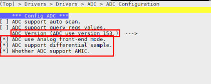

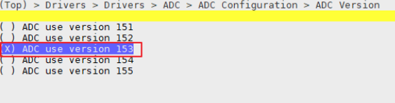

> **说明：** 
>若上述图片所示与表格描述不一致，请以表格为准。

配置宏具体描述如[表1](#table16629938173916)所示。

**表 1**  ADC相关宏描述

<a name="table16629938173916"></a>
<table><thead align="left"><tr id="row1462913813915"><th class="cellrowborder" valign="top" width="22.62773722627738%" id="mcps1.2.7.1.1"><p id="p1962923853920"><a name="p1962923853920"></a><a name="p1962923853920"></a>宏名称（CONFIG_是默认添加的前缀）</p>
</th>
<th class="cellrowborder" valign="top" width="21.137886211378866%" id="mcps1.2.7.1.2"><p id="p962916388395"><a name="p962916388395"></a><a name="p962916388395"></a>kconfig界面显示的具体描述</p>
</th>
<th class="cellrowborder" valign="top" width="19.878012198780127%" id="mcps1.2.7.1.3"><p id="p18731420115119"><a name="p18731420115119"></a><a name="p18731420115119"></a>使用场景</p>
</th>
<th class="cellrowborder" valign="top" width="10.618938106189384%" id="mcps1.2.7.1.4"><p id="p537485457"><a name="p537485457"></a><a name="p537485457"></a>是否已经实现</p>
</th>
<th class="cellrowborder" valign="top" width="11.338866113388663%" id="mcps1.2.7.1.5"><p id="p1162915382392"><a name="p1162915382392"></a><a name="p1162915382392"></a>是否依赖其他宏</p>
</th>
<th class="cellrowborder" valign="top" width="14.398560143985604%" id="mcps1.2.7.1.6"><p id="p1449914917569"><a name="p1449914917569"></a><a name="p1449914917569"></a>是否选择打开或修改配置</p>
</th>
</tr>
</thead>
<tbody><tr id="row16629338103916"><td class="cellrowborder" valign="top" width="22.62773722627738%" headers="mcps1.2.7.1.1 "><p id="p166291338133910"><a name="p166291338133910"></a><a name="p166291338133910"></a>CONFIG_ADC_SUPPORT_AUTO_SCAN</p>
</td>
<td class="cellrowborder" valign="top" width="21.137886211378866%" headers="mcps1.2.7.1.2 "><p id="p1185915431020"><a name="p1185915431020"></a><a name="p1185915431020"></a>ADC support auto scan.</p>
</td>
<td class="cellrowborder" valign="top" width="19.878012198780127%" headers="mcps1.2.7.1.3 "><p id="p77352085114"><a name="p77352085114"></a><a name="p77352085114"></a>ADC支持自动扫描采样</p>
</td>
<td class="cellrowborder" valign="top" width="10.618938106189384%" headers="mcps1.2.7.1.4 "><p id="p166297382397"><a name="p166297382397"></a><a name="p166297382397"></a>否</p>
</td>
<td class="cellrowborder" valign="top" width="11.338866113388663%" headers="mcps1.2.7.1.5 "><p id="p162983873917"><a name="p162983873917"></a><a name="p162983873917"></a>否</p>
</td>
<td class="cellrowborder" valign="top" width="14.398560143985604%" headers="mcps1.2.7.1.6 "><p id="p0629838133914"><a name="p0629838133914"></a><a name="p0629838133914"></a>默认关闭，建议关闭，非BS2X使用</p>
</td>
</tr>
<tr id="row166299383394"><td class="cellrowborder" valign="top" width="22.62773722627738%" headers="mcps1.2.7.1.1 "><p id="p14629173813920"><a name="p14629173813920"></a><a name="p14629173813920"></a>CONFIG_ADC_SUPPORT_LONG_SAMPLE</p>
</td>
<td class="cellrowborder" valign="top" width="21.137886211378866%" headers="mcps1.2.7.1.2 "><p id="p1564384212"><a name="p1564384212"></a><a name="p1564384212"></a>ADC support long sample mode.</p>
</td>
<td class="cellrowborder" valign="top" width="19.878012198780127%" headers="mcps1.2.7.1.3 "><p id="p592505317814"><a name="p592505317814"></a><a name="p592505317814"></a>ADC支持周期自动采样</p>
</td>
<td class="cellrowborder" valign="top" width="10.618938106189384%" headers="mcps1.2.7.1.4 "><p id="p166291838143916"><a name="p166291838143916"></a><a name="p166291838143916"></a>是</p>
</td>
<td class="cellrowborder" valign="top" width="11.338866113388663%" headers="mcps1.2.7.1.5 "><p id="p1883235116213"><a name="p1883235116213"></a><a name="p1883235116213"></a>CONFIG_ADC_SUPPORT_AUTO_SCAN</p>
</td>
<td class="cellrowborder" valign="top" width="14.398560143985604%" headers="mcps1.2.7.1.6 "><p id="p126297381398"><a name="p126297381398"></a><a name="p126297381398"></a>默认关闭，建议关闭</p>
</td>
</tr>
<tr id="row3629193823919"><td class="cellrowborder" valign="top" width="22.62773722627738%" headers="mcps1.2.7.1.1 "><p id="p262983811395"><a name="p262983811395"></a><a name="p262983811395"></a>CONFIG_ADC_SUPPORT_QUERY_REGS</p>
</td>
<td class="cellrowborder" valign="top" width="21.137886211378866%" headers="mcps1.2.7.1.2 "><p id="p29813275215"><a name="p29813275215"></a><a name="p29813275215"></a>ADC support query regs values.</p>
</td>
<td class="cellrowborder" valign="top" width="19.878012198780127%" headers="mcps1.2.7.1.3 "><p id="p438154074512"><a name="p438154074512"></a><a name="p438154074512"></a>ADC支持回读所有相关寄存器的值，视情况选择</p>
</td>
<td class="cellrowborder" valign="top" width="10.618938106189384%" headers="mcps1.2.7.1.4 "><p id="p3629133873917"><a name="p3629133873917"></a><a name="p3629133873917"></a>是</p>
</td>
<td class="cellrowborder" valign="top" width="11.338866113388663%" headers="mcps1.2.7.1.5 "><p id="p062910387397"><a name="p062910387397"></a><a name="p062910387397"></a>否</p>
</td>
<td class="cellrowborder" valign="top" width="14.398560143985604%" headers="mcps1.2.7.1.6 "><p id="p1963621910"><a name="p1963621910"></a><a name="p1963621910"></a>默认关闭，视情况选择，建议关闭</p>
</td>
</tr>
<tr id="row962920381394"><td class="cellrowborder" valign="top" width="22.62773722627738%" headers="mcps1.2.7.1.1 "><p id="p1629738173912"><a name="p1629738173912"></a><a name="p1629738173912"></a>CONFIG_ADC_USING_V153</p>
</td>
<td class="cellrowborder" valign="top" width="21.137886211378866%" headers="mcps1.2.7.1.2 "><p id="p158881061121"><a name="p158881061121"></a><a name="p158881061121"></a>ADC use version 153.</p>
</td>
<td class="cellrowborder" valign="top" width="19.878012198780127%" headers="mcps1.2.7.1.3 "><p id="p1391712438269"><a name="p1391712438269"></a><a name="p1391712438269"></a>该宏代表使用ADC V153的驱动规格，本产品默认使用该规格</p>
</td>
<td class="cellrowborder" valign="top" width="10.618938106189384%" headers="mcps1.2.7.1.4 "><p id="p7630938143910"><a name="p7630938143910"></a><a name="p7630938143910"></a>是</p>
</td>
<td class="cellrowborder" valign="top" width="11.338866113388663%" headers="mcps1.2.7.1.5 "><p id="p56301938153913"><a name="p56301938153913"></a><a name="p56301938153913"></a>否</p>
</td>
<td class="cellrowborder" valign="top" width="14.398560143985604%" headers="mcps1.2.7.1.6 "><p id="p19630238203917"><a name="p19630238203917"></a><a name="p19630238203917"></a>默认打开，必选</p>
</td>
</tr>
<tr id="row62681237271"><td class="cellrowborder" valign="top" width="22.62773722627738%" headers="mcps1.2.7.1.1 "><p id="p112401826112812"><a name="p112401826112812"></a><a name="p112401826112812"></a>CONFIG_ADC_SUPPORT_AFE</p>
</td>
<td class="cellrowborder" valign="top" width="21.137886211378866%" headers="mcps1.2.7.1.2 "><p id="p1923311414113"><a name="p1923311414113"></a><a name="p1923311414113"></a>ADC use Analog front-end mode.</p>
</td>
<td class="cellrowborder" valign="top" width="19.878012198780127%" headers="mcps1.2.7.1.3 "><p id="p826922312278"><a name="p826922312278"></a><a name="p826922312278"></a>支持模拟前端ADC</p>
</td>
<td class="cellrowborder" valign="top" width="10.618938106189384%" headers="mcps1.2.7.1.4 "><p id="p5269202314277"><a name="p5269202314277"></a><a name="p5269202314277"></a>是</p>
</td>
<td class="cellrowborder" valign="top" width="11.338866113388663%" headers="mcps1.2.7.1.5 "><p id="p882352916313"><a name="p882352916313"></a><a name="p882352916313"></a>CONFIG_ADC_USING_V153</p>
</td>
<td class="cellrowborder" valign="top" width="14.398560143985604%" headers="mcps1.2.7.1.6 "><p id="p12269623182717"><a name="p12269623182717"></a><a name="p12269623182717"></a>默认打开，建议打开</p>
</td>
</tr>
<tr id="row17817572040"><td class="cellrowborder" valign="top" width="22.62773722627738%" headers="mcps1.2.7.1.1 "><p id="p53019141514"><a name="p53019141514"></a><a name="p53019141514"></a>CONFIG_ADC_SUPPORT_DIFFERENTIAL</p>
</td>
<td class="cellrowborder" valign="top" width="21.137886211378866%" headers="mcps1.2.7.1.2 "><p id="p20825133117020"><a name="p20825133117020"></a><a name="p20825133117020"></a>ADC support differential sample.</p>
</td>
<td class="cellrowborder" valign="top" width="19.878012198780127%" headers="mcps1.2.7.1.3 "><p id="p391457342"><a name="p391457342"></a><a name="p391457342"></a>ADC支持使用差分通道进行采样</p>
</td>
<td class="cellrowborder" valign="top" width="10.618938106189384%" headers="mcps1.2.7.1.4 "><p id="p17919571246"><a name="p17919571246"></a><a name="p17919571246"></a>是</p>
</td>
<td class="cellrowborder" valign="top" width="11.338866113388663%" headers="mcps1.2.7.1.5 "><p id="p1343315396319"><a name="p1343315396319"></a><a name="p1343315396319"></a>CONFIG_ADC_USING_V153</p>
</td>
<td class="cellrowborder" valign="top" width="14.398560143985604%" headers="mcps1.2.7.1.6 "><p id="p4964172110154"><a name="p4964172110154"></a><a name="p4964172110154"></a>默认打开，建议打开</p>
</td>
</tr>
<tr id="row040511461781"><td class="cellrowborder" valign="top" width="22.62773722627738%" headers="mcps1.2.7.1.1 "><p id="p2085465116817"><a name="p2085465116817"></a><a name="p2085465116817"></a>CONFIG_ADC_SUPPORT_AMIC</p>
</td>
<td class="cellrowborder" valign="top" width="21.137886211378866%" headers="mcps1.2.7.1.2 "><p id="p1134919919020"><a name="p1134919919020"></a><a name="p1134919919020"></a>Whether ADC support AMIC.</p>
</td>
<td class="cellrowborder" valign="top" width="19.878012198780127%" headers="mcps1.2.7.1.3 "><p id="p19643163201514"><a name="p19643163201514"></a><a name="p19643163201514"></a>ADC支持AMIC</p>
</td>
<td class="cellrowborder" valign="top" width="10.618938106189384%" headers="mcps1.2.7.1.4 "><p id="p1640513469812"><a name="p1640513469812"></a><a name="p1640513469812"></a>是</p>
</td>
<td class="cellrowborder" valign="top" width="11.338866113388663%" headers="mcps1.2.7.1.5 "><p id="p1528213471933"><a name="p1528213471933"></a><a name="p1528213471933"></a>CONFIG_ADC_USING_V153</p>
</td>
<td class="cellrowborder" valign="top" width="14.398560143985604%" headers="mcps1.2.7.1.6 "><p id="p154053469813"><a name="p154053469813"></a><a name="p154053469813"></a>默认打开，建议打开</p>
</td>
</tr>
<tr id="row1835411465910"><td class="cellrowborder" valign="top" width="22.62773722627738%" headers="mcps1.2.7.1.1 "><p id="p235571412597"><a name="p235571412597"></a><a name="p235571412597"></a>CONFIG_AFE_SAMPLE_TIMES</p>
</td>
<td class="cellrowborder" valign="top" width="21.137886211378866%" headers="mcps1.2.7.1.2 "><p id="p13355191414594"><a name="p13355191414594"></a><a name="p13355191414594"></a>The numbers ADC sample to average.</p>
</td>
<td class="cellrowborder" valign="top" width="19.878012198780127%" headers="mcps1.2.7.1.3 "><p id="p105932017171618"><a name="p105932017171618"></a><a name="p105932017171618"></a>ADC数采配置的默认长度，本产品暂未使用</p>
</td>
<td class="cellrowborder" valign="top" width="10.618938106189384%" headers="mcps1.2.7.1.4 "><p id="p1235501495919"><a name="p1235501495919"></a><a name="p1235501495919"></a>是</p>
</td>
<td class="cellrowborder" valign="top" width="11.338866113388663%" headers="mcps1.2.7.1.5 "><p id="p895101445"><a name="p895101445"></a><a name="p895101445"></a>否</p>
</td>
<td class="cellrowborder" valign="top" width="14.398560143985604%" headers="mcps1.2.7.1.6 "><p id="p97001027124119"><a name="p97001027124119"></a><a name="p97001027124119"></a>默认值是4，本产品实际暂未使用，建议不做修改</p>
</td>
</tr>
</tbody>
</table>

## 开发指引<a name="ZH-CN_TOPIC_0000001665143746"></a>

可配置项主要在ADC对应的porting层头文件中，下文将介绍重要可配置项的功能。

GAFE：

-   cfg\_adc\_data0.b.data\_num：计数模式下采样点数为2<sup>x</sup>个。
-   cfg\_adc\_data0.b.wait\_num：等待数据链路稳定抛弃的采样值数目。
-   cfg\_adc\_data1.b.osr\_len：过采样累加样点数。
-   cfg\_adc\_data1.b.osr\_sel：过采样平均样数，和累加样点数配置为相同值，上报值为（data1+data2+...+data\_osr\_len）/osr\_sel。
-   如果想要减短GADC采样时间，可以减少上述四个变量的值，此处给出一组极限值：
-   .cfg\_adc\_data0.b.data\_num = 0xa,

    .cfg\_adc\_data0.b.wait\_num = 4,

    .cfg\_adc\_data1.b.osr\_len= 2,

    .cfg\_adc\_data1.b.osr\_sel= 2,

AAFE：

-   .pga\_gain:AAFE电路前极放大器PGA增益倍数。

示例：

GAFE使能：

```
static void test_afe_set_io(uint8_t channel)
{
    pin_t adc_pin[] = {S_MGPIO2, S_MGPIO3, S_MGPIO4, S_MGPIO5, S_MGPIO28, S_MGPIO29, S_MGPIO30, S_MGPIO31};
    uapi_pin_set_mode(adc_pin[channel], PIN_MODE_0);
    uapi_gpio_set_dir(adc_pin[channel], GPIO_DIRECTION_INPUT);
    uapi_pin_set_pull(adc_pin[channel], PIN_PULL_NONE);
    uapi_pin_set_ie(adc_pin[channel], PIN_IE_1);
}
int gadc_open_demo(void)
{
)   uint8_t channel = GADC_CHANNEL_0;
    if (channel >= ADC_CHANNEL_MAX_NUM) {
        return ERROR_BAD_PARAMS;
    }
    test_afe_set_io(channel);
    uapi_adc_init(ADC_CLOCK_NONE);
    uapi_adc_power_en(AFE_GADC_MODE, true);
    uapi_adc_open_channel(channel);
    adc_calibration(AFE_GADC_MODE, true, true, true);
    return TEST_OK;
}

```

GAFE采样：

```
#define ADC_AUTO_SAMPLE_TEST_TIMES 10
int adc_auto_sample_demo(void)
{
    adc_v153_gadc_channel_sel_t channel = GADC_CHANNEL_1;  // 采样时选择希望采样的channel
    uapi_adc_open_channel(channel);
    int adc_value = 0;
    for (int i = 0; i < ADC_AUTO_SAMPLE_TEST_TIMES; i++) {
        adc_value =  adc_port_gadc_entirely_sample(channel);
        test_suite_log_stringf("adc:%dmV%x\n", adc_value);
    }
    return TEST_OK;
}

```

GAFE通道切换采样：

```
int adc_auto_sample_demo(void)
{
    adc_v153_gadc_channel_sel_t channel = GADC_CHANNEL_1;  // 采样时选择希望采样的channel
 
    int adc_value = 0;
    for (int i = 0; i < ADC_AUTO_SAMPLE_TEST_TIMES; i++) {
        adc_value =  adc_port_gadc_entirely_sample(channel);
        test_suite_log_stringf("adc: %dmV%x\n", adc_value);
    }
    channel = GADC_CHANNEL_3;  // 切换到下一个需要采样的channel
    for (int i = 0; i < ADC_AUTO_SAMPLE_TEST_TIMES; i++) {
        adc_value =  adc_port_gadc_entirely_sample(channel);
        test_suite_log_stringf("adc: %dmV%x\n", adc_value);
    }
    return TEST_OK;
}

GAFE entire接口使用：
void adc_entire_demo(void) {
    uint8_t gadc_channel1 = GADC_CHANNEL_0;
    uint8_t gadc_channel2 = GADC_CHANNEL_5;
    int adc_value = 0;
    adc_port_gadc_entirely_open(gadc_channel1,true); // ADC第一次开启，传入true表示本次校准.
    adc_value =  adc_port_gadc_entirely_sample(gadc_channel1);
    osal_printk("gadc: %dmv\n", adc_value );
    adc_port_gadc_entirely_close(gadc_channel1);    //close时会记录校准值
    adc_port_gadc_entirely_open(gadc_channel1, false);  // False表示本次开启使用记录好的校准值.
    adc_value =  adc_port_gadc_entirely_sample(gadc_channel2);
    osal_printk("gadc_channel2: %dmv\n", adc_value);
    adc_port_gadc_entirely_close(gadc_channel2);
}

```

```
AAFE使能&采样：
int amic_open_demo(void)
{
    test_afe_set_io(AMIC_CHANNEL_0);
    test_afe_set_io(AMIC_CHANNEL_1);
    uapi_adc_init(ADC_CLOCK_NONE);
    uapi_adc_power_en(AFE_AMIC_MODE, true);
    uapi_adc_open_differential_channel(AMIC_CHANNEL_0, AMIC_CHANNEL_1);
    adc_calibration(AFE_AMIC_MODE, true, true, true);
    uapi_adc_auto_sample(AMIC_CHANNEL_0);  // 开启采样后数据需要被音频驱动搬走
    return TEST_OK;
}

```

```

```

## 注意事项<a name="ZH-CN_TOPIC_0000001713103493"></a>

-   GAFE模拟输入电压范围。

    受限于数模复用的GPIO供电电压，ADC参考电压为1.5V，故八个端口只能输入0\~1.5V电压，禁止输入1.5V以上电压。更高电压建议片外电阻分压到1.5V以内再接到GAFE输入。**分压电路设计请与硬件工程师沟通后再投板**。增加分压电路后，可能因存在电容导致引入充放电时间，需要实测确定。

-   AAFE采集音频信号处理方法。

    通过uapi\_adc\_auto\_sample采集到的音频信号与GAFE采集到的电量信号格式相同，包含13bit有效位及1bit符号位，处理完的值通过PDM模块发送，具体实现参考“[开发指引](开发指引-77.md)”章节。

-   推荐使用带entirely的三个接口，较为简洁。上电后第一次初始化时校准即可。

# DMA<a name="ZH-CN_TOPIC_0000001713023505"></a>


## 概述<a name="ZH-CN_TOPIC_0000001665143702"></a>

DMA（Directory Memory Access）直接存储器访问是一种完全由硬件执行数据交换的工作方式。在这种方式中，直接存储器访问控制器DMAC（Directory Memory Access Controller）直接在存储器和外设、外设和外设、存储器和存储器之间进行数据传输，减少处理器的干涉和开销。

DMA方式一般用于高速传输成组的数据。DMAC在收到DMA传输请求后根据CPU对通道的配置启动总线主控制器，向存储器和外设发出地址和控制信号，对传输数据的个数计数，并以中断方式向CPU报告传输操作的结束或错误。

提供的DMA规格如下：

-   支持存储器到存储器、存储器到外设、外设到存储器、外设到外设传输类型。
-   MCU侧DMA支持8个通道，16个硬件握手接口，且通道参数优先级可配置。
-   所有通道支持单个包长度最大4095Byte数据，4K数据需要在同一个sector内。
-   支持大小端可配置。

## 功能描述<a name="ZH-CN_TOPIC_0000001713103545"></a>

> **说明：** 
>如果需要在SPI/UART/I2C/I2S/PDM中使用DMA传输数据，需要在系统启动时进行DMA初始化。

DMA模块提供的接口及功能如下：

-   uapi\_dma\_init（void）：初始化DMA。
-   uapi\_dma\_deinit（void）：去初始化DMA。
-   uapi\_dma\_open（void）：打开DMA。
-   uapi\_dma\_close（void）：关闭DMA。
-   uapi\_dma\_start\_transfer（uint8\_t channel）：启动指定通道的DMA传输（channel表示需要开启的DMA通道数）。
-   uapi\_dma\_end\_transfer（uint8\_t channel）：停止指定通道的DMA传输（channel表示需要停止的DMA通道数）。
-   uapi\_dma\_get\_block\_ts（uint8\_t channel）：获取DMA传输的数据量（channel表示DMA通道数）。
-   uapi\_dma\_transfer\_memory\_single（const dma\_ch\_user\_memory\_config\_t \*user\_cfg, dma\_transfer\_cb\_t callback, uintptr\_t arg）：通过DMA通道传输类型为内存到内存的数据（user\_cfg表示DMA通道传输配置，callback表示通道传输完成回调函数，arg表示传输完成时回传给回调函数的参数）。
-   uapi\_dma\_configure\_peripheral\_transfer\_single（const dma\_ch\_user\_peripheral\_config\_t \*user\_cfg, uint8\_t \*channel, dma\_transfer\_cb\_t callback, uintptr\_t arg）：通过DMA通道传输类型为内存到外设或外设到内存的数据（user\_cfg表示DMA通道传输配置，channel表示被选择的DMA通道数，callback表示通道传输完成回调函数，arg表示传输完成时回传给回调函数的参数）。
-   uapi\_dma\_get\_lli\_channel（uint8\_t burst\_length, uint8\_t handshaking）：获取DMA链表传输通道（burst\_length表示DMA的burst传输长度，handshaking表示DMA传输外设种类）。（打开CONFIG\_DMA\_SUPPORT\_LLI宏才能使用）
-   uapi\_dma\_transfer\_memory\_lli（uint8\_t channel, const dma\_ch\_user\_memory\_config\_t \*user\_cfg, dma\_transfer\_cb\_t callback）：通过DMA通道以链表模式传输类型为内存到内存的数据（channel表示DMA通道数，user\_cfg表示DMA通道传输配置，callback表示通道传输完成回调函数）。（打开CONFIG\_DMA\_SUPPORT\_LLI宏才能使用）
-   uapi\_dma\_configure\_peripheral\_transfer\_lli（uint8\_t channel, const dma\_ch\_user\_peripheral\_config\_t \*user\_cfg, dma\_transfer\_cb\_t callback）：通过DMA通道以链表模式传输类型为内存到外设或外设到内存的数据channel表示DMA通道数，user\_cfg表示DMA通道传输配置，callback表示通道传输完成回调函数）。（打开CONFIG\_DMA\_SUPPORT\_LLI宏才能使用）
-   uapi\_dma\_enbale\_lli（uint8\_t channel, dma\_transfer\_cb\_t callback, uintptr\_t arg）：启用DMA链表传输（channel表示DMA通道数，callback表示通道传输完成回调函数，arg表示传输完成时回传给回调函数的参数）。

    （打开CONFIG\_DMA\_SUPPORT\_LLI宏才能使用）

## KCONFIG配置<a name="ZH-CN_TOPIC_0000001896048578"></a>

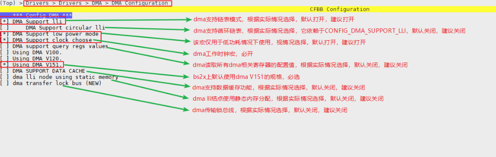

> **说明：** 
>若上述图片所示与表格描述不一致，请以表格为准。

配置宏具体描述如[表1](#table16629938173916)所示。

**表 1**  DMA相关宏描述

<a name="table16629938173916"></a>
<table><thead align="left"><tr id="row1462913813915"><th class="cellrowborder" valign="top" width="22.62773722627738%" id="mcps1.2.7.1.1"><p id="p1962923853920"><a name="p1962923853920"></a><a name="p1962923853920"></a>宏名称（CONFIG_是默认添加的前缀）</p>
</th>
<th class="cellrowborder" valign="top" width="21.137886211378866%" id="mcps1.2.7.1.2"><p id="p962916388395"><a name="p962916388395"></a><a name="p962916388395"></a>kconfig界面显示的具体描述</p>
</th>
<th class="cellrowborder" valign="top" width="19.878012198780127%" id="mcps1.2.7.1.3"><p id="p18731420115119"><a name="p18731420115119"></a><a name="p18731420115119"></a>使用场景</p>
</th>
<th class="cellrowborder" valign="top" width="10.618938106189384%" id="mcps1.2.7.1.4"><p id="p537485457"><a name="p537485457"></a><a name="p537485457"></a>是否已经实现</p>
</th>
<th class="cellrowborder" valign="top" width="11.338866113388663%" id="mcps1.2.7.1.5"><p id="p1162915382392"><a name="p1162915382392"></a><a name="p1162915382392"></a>是否依赖其他宏</p>
</th>
<th class="cellrowborder" valign="top" width="14.398560143985604%" id="mcps1.2.7.1.6"><p id="p1449914917569"><a name="p1449914917569"></a><a name="p1449914917569"></a>是否选择打开或修改配置</p>
</th>
</tr>
</thead>
<tbody><tr id="row16629338103916"><td class="cellrowborder" valign="top" width="22.62773722627738%" headers="mcps1.2.7.1.1 "><p id="p166291338133910"><a name="p166291338133910"></a><a name="p166291338133910"></a>CONFIG_DMA_SUPPORT_LLI</p>
</td>
<td class="cellrowborder" valign="top" width="21.137886211378866%" headers="mcps1.2.7.1.2 "><p id="p14396164714308"><a name="p14396164714308"></a><a name="p14396164714308"></a>DMA support lli.</p>
</td>
<td class="cellrowborder" valign="top" width="19.878012198780127%" headers="mcps1.2.7.1.3 "><p id="p77352085114"><a name="p77352085114"></a><a name="p77352085114"></a>DMA支持链表模式</p>
</td>
<td class="cellrowborder" valign="top" width="10.618938106189384%" headers="mcps1.2.7.1.4 "><p id="p166297382397"><a name="p166297382397"></a><a name="p166297382397"></a>是</p>
</td>
<td class="cellrowborder" valign="top" width="11.338866113388663%" headers="mcps1.2.7.1.5 "><p id="p162983873917"><a name="p162983873917"></a><a name="p162983873917"></a>否</p>
</td>
<td class="cellrowborder" valign="top" width="14.398560143985604%" headers="mcps1.2.7.1.6 "><p id="p0629838133914"><a name="p0629838133914"></a><a name="p0629838133914"></a>默认打开，视情况选择，建议打开</p>
</td>
</tr>
<tr id="row166299383394"><td class="cellrowborder" valign="top" width="22.62773722627738%" headers="mcps1.2.7.1.1 "><p id="p14629173813920"><a name="p14629173813920"></a><a name="p14629173813920"></a>CONFIG_DMA_SUPPORT_CIRCULAR_LLI</p>
</td>
<td class="cellrowborder" valign="top" width="21.137886211378866%" headers="mcps1.2.7.1.2 "><p id="p11482105911301"><a name="p11482105911301"></a><a name="p11482105911301"></a>DMA support circular lli.</p>
</td>
<td class="cellrowborder" valign="top" width="19.878012198780127%" headers="mcps1.2.7.1.3 "><p id="p269811784116"><a name="p269811784116"></a><a name="p269811784116"></a>DMA支持循环链表模式</p>
</td>
<td class="cellrowborder" valign="top" width="10.618938106189384%" headers="mcps1.2.7.1.4 "><p id="p166291838143916"><a name="p166291838143916"></a><a name="p166291838143916"></a>是</p>
</td>
<td class="cellrowborder" valign="top" width="11.338866113388663%" headers="mcps1.2.7.1.5 "><p id="p17391013114112"><a name="p17391013114112"></a><a name="p17391013114112"></a>CONFIG_DMA_SUPPORT_LLI</p>
</td>
<td class="cellrowborder" valign="top" width="14.398560143985604%" headers="mcps1.2.7.1.6 "><p id="p126297381398"><a name="p126297381398"></a><a name="p126297381398"></a>默认关闭，建议关闭</p>
</td>
</tr>
<tr id="row3629193823919"><td class="cellrowborder" valign="top" width="22.62773722627738%" headers="mcps1.2.7.1.1 "><p id="p262983811395"><a name="p262983811395"></a><a name="p262983811395"></a>CONFIG_DMA_SUPPORT_LPM</p>
</td>
<td class="cellrowborder" valign="top" width="21.137886211378866%" headers="mcps1.2.7.1.2 "><p id="p889162011315"><a name="p889162011315"></a><a name="p889162011315"></a>DMA support low power mode.</p>
</td>
<td class="cellrowborder" valign="top" width="19.878012198780127%" headers="mcps1.2.7.1.3 "><p id="p1746412917425"><a name="p1746412917425"></a><a name="p1746412917425"></a>该宏仅用于低功耗情况下使用</p>
</td>
<td class="cellrowborder" valign="top" width="10.618938106189384%" headers="mcps1.2.7.1.4 "><p id="p3629133873917"><a name="p3629133873917"></a><a name="p3629133873917"></a>是</p>
</td>
<td class="cellrowborder" valign="top" width="11.338866113388663%" headers="mcps1.2.7.1.5 "><p id="p062910387397"><a name="p062910387397"></a><a name="p062910387397"></a>否</p>
</td>
<td class="cellrowborder" valign="top" width="14.398560143985604%" headers="mcps1.2.7.1.6 "><p id="p1963621910"><a name="p1963621910"></a><a name="p1963621910"></a>默认打开，视情况选择</p>
</td>
</tr>
<tr id="row962920381394"><td class="cellrowborder" valign="top" width="22.62773722627738%" headers="mcps1.2.7.1.1 "><p id="p1629738173912"><a name="p1629738173912"></a><a name="p1629738173912"></a>CONFIG_DMA_SUPPORT_CLOCK</p>
</td>
<td class="cellrowborder" valign="top" width="21.137886211378866%" headers="mcps1.2.7.1.2 "><p id="p183421327311"><a name="p183421327311"></a><a name="p183421327311"></a>DMA choose clock.</p>
</td>
<td class="cellrowborder" valign="top" width="19.878012198780127%" headers="mcps1.2.7.1.3 "><p id="p1391712438269"><a name="p1391712438269"></a><a name="p1391712438269"></a>DMA 工作时钟</p>
</td>
<td class="cellrowborder" valign="top" width="10.618938106189384%" headers="mcps1.2.7.1.4 "><p id="p7630938143910"><a name="p7630938143910"></a><a name="p7630938143910"></a>是</p>
</td>
<td class="cellrowborder" valign="top" width="11.338866113388663%" headers="mcps1.2.7.1.5 "><p id="p56301938153913"><a name="p56301938153913"></a><a name="p56301938153913"></a>否</p>
</td>
<td class="cellrowborder" valign="top" width="14.398560143985604%" headers="mcps1.2.7.1.6 "><p id="p19630238203917"><a name="p19630238203917"></a><a name="p19630238203917"></a>默认打开，必选</p>
</td>
</tr>
<tr id="row62681237271"><td class="cellrowborder" valign="top" width="22.62773722627738%" headers="mcps1.2.7.1.1 "><p id="p112401826112812"><a name="p112401826112812"></a><a name="p112401826112812"></a>CONFIG_DMA_SUPPORT_QUERY_REGS</p>
</td>
<td class="cellrowborder" valign="top" width="21.137886211378866%" headers="mcps1.2.7.1.2 "><p id="p914354217316"><a name="p914354217316"></a><a name="p914354217316"></a>DMA support query regs values.</p>
</td>
<td class="cellrowborder" valign="top" width="19.878012198780127%" headers="mcps1.2.7.1.3 "><p id="p438154074512"><a name="p438154074512"></a><a name="p438154074512"></a>DMA支持回读所有相关寄存器的值，视情况选择</p>
</td>
<td class="cellrowborder" valign="top" width="10.618938106189384%" headers="mcps1.2.7.1.4 "><p id="p5269202314277"><a name="p5269202314277"></a><a name="p5269202314277"></a>是</p>
</td>
<td class="cellrowborder" valign="top" width="11.338866113388663%" headers="mcps1.2.7.1.5 "><p id="p882352916313"><a name="p882352916313"></a><a name="p882352916313"></a>否</p>
</td>
<td class="cellrowborder" valign="top" width="14.398560143985604%" headers="mcps1.2.7.1.6 "><p id="p137491622194215"><a name="p137491622194215"></a><a name="p137491622194215"></a>默认关闭，视情况选择，建议关闭</p>
</td>
</tr>
<tr id="row17817572040"><td class="cellrowborder" valign="top" width="22.62773722627738%" headers="mcps1.2.7.1.1 "><p id="p53019141514"><a name="p53019141514"></a><a name="p53019141514"></a>CONFIG_DMA_USING_V100</p>
</td>
<td class="cellrowborder" valign="top" width="21.137886211378866%" headers="mcps1.2.7.1.2 "><p id="p20825133117020"><a name="p20825133117020"></a><a name="p20825133117020"></a>Using DMA V100.</p>
</td>
<td class="cellrowborder" valign="top" width="19.878012198780127%" headers="mcps1.2.7.1.3 "><p id="p391457342"><a name="p391457342"></a><a name="p391457342"></a>该宏代表使用DMA V100的驱动规格，本产品不使用该规格</p>
</td>
<td class="cellrowborder" valign="top" width="10.618938106189384%" headers="mcps1.2.7.1.4 "><p id="p17919571246"><a name="p17919571246"></a><a name="p17919571246"></a>是</p>
</td>
<td class="cellrowborder" valign="top" width="11.338866113388663%" headers="mcps1.2.7.1.5 "><p id="p1343315396319"><a name="p1343315396319"></a><a name="p1343315396319"></a>否</p>
</td>
<td class="cellrowborder" valign="top" width="14.398560143985604%" headers="mcps1.2.7.1.6 "><p id="p1421054374413"><a name="p1421054374413"></a><a name="p1421054374413"></a>默认关闭，必须关闭</p>
</td>
</tr>
<tr id="row040511461781"><td class="cellrowborder" valign="top" width="22.62773722627738%" headers="mcps1.2.7.1.1 "><p id="p2085465116817"><a name="p2085465116817"></a><a name="p2085465116817"></a>CONFIG_DMA_USING_V120</p>
</td>
<td class="cellrowborder" valign="top" width="21.137886211378866%" headers="mcps1.2.7.1.2 "><p id="p8562112919367"><a name="p8562112919367"></a><a name="p8562112919367"></a>Using DMA V120.</p>
</td>
<td class="cellrowborder" valign="top" width="19.878012198780127%" headers="mcps1.2.7.1.3 "><p id="p1605194513147"><a name="p1605194513147"></a><a name="p1605194513147"></a>该宏代表使用DMA V120的驱动规格，本产品不使用该规格</p>
</td>
<td class="cellrowborder" valign="top" width="10.618938106189384%" headers="mcps1.2.7.1.4 "><p id="p1640513469812"><a name="p1640513469812"></a><a name="p1640513469812"></a>是</p>
</td>
<td class="cellrowborder" valign="top" width="11.338866113388663%" headers="mcps1.2.7.1.5 "><p id="p1528213471933"><a name="p1528213471933"></a><a name="p1528213471933"></a>否</p>
</td>
<td class="cellrowborder" valign="top" width="14.398560143985604%" headers="mcps1.2.7.1.6 "><p id="p154053469813"><a name="p154053469813"></a><a name="p154053469813"></a>默认关闭，必须关闭</p>
</td>
</tr>
<tr id="row1835411465910"><td class="cellrowborder" valign="top" width="22.62773722627738%" headers="mcps1.2.7.1.1 "><p id="p235571412597"><a name="p235571412597"></a><a name="p235571412597"></a>CONFIG_DMA_USING_V151</p>
</td>
<td class="cellrowborder" valign="top" width="21.137886211378866%" headers="mcps1.2.7.1.2 "><p id="p13355191414594"><a name="p13355191414594"></a><a name="p13355191414594"></a>Using DMA V151.</p>
</td>
<td class="cellrowborder" valign="top" width="19.878012198780127%" headers="mcps1.2.7.1.3 "><p id="p105932017171618"><a name="p105932017171618"></a><a name="p105932017171618"></a>该宏代表使用DMA V151的驱动规格，本产品默认使用该规格</p>
</td>
<td class="cellrowborder" valign="top" width="10.618938106189384%" headers="mcps1.2.7.1.4 "><p id="p1235501495919"><a name="p1235501495919"></a><a name="p1235501495919"></a>是</p>
</td>
<td class="cellrowborder" valign="top" width="11.338866113388663%" headers="mcps1.2.7.1.5 "><p id="p895101445"><a name="p895101445"></a><a name="p895101445"></a>否</p>
</td>
<td class="cellrowborder" valign="top" width="14.398560143985604%" headers="mcps1.2.7.1.6 "><p id="p72841723184417"><a name="p72841723184417"></a><a name="p72841723184417"></a>默认打开，必选</p>
</td>
</tr>
<tr id="row15869683373"><td class="cellrowborder" valign="top" width="22.62773722627738%" headers="mcps1.2.7.1.1 "><p id="p7870131514375"><a name="p7870131514375"></a><a name="p7870131514375"></a>CONFIG_DMA_TRANSFER_LOCK_BUS</p>
</td>
<td class="cellrowborder" valign="top" width="21.137886211378866%" headers="mcps1.2.7.1.2 "><p id="p208701185372"><a name="p208701185372"></a><a name="p208701185372"></a>DMA transfer lock bus.</p>
</td>
<td class="cellrowborder" valign="top" width="19.878012198780127%" headers="mcps1.2.7.1.3 "><p id="p587038153717"><a name="p587038153717"></a><a name="p587038153717"></a>DMA支持锁总线，本产品暂未使用</p>
</td>
<td class="cellrowborder" valign="top" width="10.618938106189384%" headers="mcps1.2.7.1.4 "><p id="p48701288378"><a name="p48701288378"></a><a name="p48701288378"></a>是</p>
</td>
<td class="cellrowborder" valign="top" width="11.338866113388663%" headers="mcps1.2.7.1.5 "><p id="p47969352373"><a name="p47969352373"></a><a name="p47969352373"></a>CONFIG_DMA_USING_V151</p>
</td>
<td class="cellrowborder" valign="top" width="14.398560143985604%" headers="mcps1.2.7.1.6 "><p id="p13614102414451"><a name="p13614102414451"></a><a name="p13614102414451"></a>默认关闭，本产品实际暂未使用，建议关闭</p>
</td>
</tr>
<tr id="row934483818326"><td class="cellrowborder" valign="top" width="22.62773722627738%" headers="mcps1.2.7.1.1 "><p id="p3864842337"><a name="p3864842337"></a><a name="p3864842337"></a>CONFIG_DMA_SUPPORT_SMDMA</p>
</td>
<td class="cellrowborder" valign="top" width="21.137886211378866%" headers="mcps1.2.7.1.2 "><p id="p134514381325"><a name="p134514381325"></a><a name="p134514381325"></a>DMA support SMDMA.</p>
</td>
<td class="cellrowborder" valign="top" width="19.878012198780127%" headers="mcps1.2.7.1.3 "><p id="p63451738133213"><a name="p63451738133213"></a><a name="p63451738133213"></a>支持使用SMDMA,</p>
<p id="p9453417114710"><a name="p9453417114710"></a><a name="p9453417114710"></a>本产品暂未使用</p>
</td>
<td class="cellrowborder" valign="top" width="10.618938106189384%" headers="mcps1.2.7.1.4 "><p id="p3345173819320"><a name="p3345173819320"></a><a name="p3345173819320"></a>是</p>
</td>
<td class="cellrowborder" valign="top" width="11.338866113388663%" headers="mcps1.2.7.1.5 "><p id="p137053279382"><a name="p137053279382"></a><a name="p137053279382"></a>CONFIG_DMA_USING_V100</p>
</td>
<td class="cellrowborder" valign="top" width="14.398560143985604%" headers="mcps1.2.7.1.6 "><p id="p914192814612"><a name="p914192814612"></a><a name="p914192814612"></a>默认关闭，本产品实际暂未使用，建议关闭</p>
</td>
</tr>
<tr id="row2891124283218"><td class="cellrowborder" valign="top" width="22.62773722627738%" headers="mcps1.2.7.1.1 "><p id="p19452172613352"><a name="p19452172613352"></a><a name="p19452172613352"></a>CONFIG_SUPPORT_DATA_CACHE</p>
</td>
<td class="cellrowborder" valign="top" width="21.137886211378866%" headers="mcps1.2.7.1.2 "><p id="p8891174273220"><a name="p8891174273220"></a><a name="p8891174273220"></a>DMA support DATA CACHE.</p>
</td>
<td class="cellrowborder" valign="top" width="19.878012198780127%" headers="mcps1.2.7.1.3 "><p id="p489174216326"><a name="p489174216326"></a><a name="p489174216326"></a>DMA支持数据缓存</p>
</td>
<td class="cellrowborder" valign="top" width="10.618938106189384%" headers="mcps1.2.7.1.4 "><p id="p489117427322"><a name="p489117427322"></a><a name="p489117427322"></a>是</p>
</td>
<td class="cellrowborder" valign="top" width="11.338866113388663%" headers="mcps1.2.7.1.5 "><p id="p489144243219"><a name="p489144243219"></a><a name="p489144243219"></a>否</p>
</td>
<td class="cellrowborder" valign="top" width="14.398560143985604%" headers="mcps1.2.7.1.6 "><p id="p9229105374715"><a name="p9229105374715"></a><a name="p9229105374715"></a>默认关闭，视情况选择，建议关闭</p>
</td>
</tr>
<tr id="row19625232143511"><td class="cellrowborder" valign="top" width="22.62773722627738%" headers="mcps1.2.7.1.1 "><p id="p8294036143513"><a name="p8294036143513"></a><a name="p8294036143513"></a>CONFIG_DMA_LLI_NODE_FIX_MEM</p>
</td>
<td class="cellrowborder" valign="top" width="21.137886211378866%" headers="mcps1.2.7.1.2 "><p id="p1262510321355"><a name="p1262510321355"></a><a name="p1262510321355"></a>DMA lli node using static memory.</p>
</td>
<td class="cellrowborder" valign="top" width="19.878012198780127%" headers="mcps1.2.7.1.3 "><p id="p66258325359"><a name="p66258325359"></a><a name="p66258325359"></a>DMA链表结点分配使用静态内存</p>
</td>
<td class="cellrowborder" valign="top" width="10.618938106189384%" headers="mcps1.2.7.1.4 "><p id="p1262573233514"><a name="p1262573233514"></a><a name="p1262573233514"></a>是</p>
</td>
<td class="cellrowborder" valign="top" width="11.338866113388663%" headers="mcps1.2.7.1.5 "><p id="p262516326357"><a name="p262516326357"></a><a name="p262516326357"></a>否</p>
</td>
<td class="cellrowborder" valign="top" width="14.398560143985604%" headers="mcps1.2.7.1.6 "><p id="p2625103283514"><a name="p2625103283514"></a><a name="p2625103283514"></a>默认关闭，视情况选择，建议关闭</p>
</td>
</tr>
<tr id="row515824115353"><td class="cellrowborder" valign="top" width="22.62773722627738%" headers="mcps1.2.7.1.1 "><p id="p12606144419357"><a name="p12606144419357"></a><a name="p12606144419357"></a>CONFIG_DMA_LLI_NODE_MAX</p>
</td>
<td class="cellrowborder" valign="top" width="21.137886211378866%" headers="mcps1.2.7.1.2 "><p id="p4158144115359"><a name="p4158144115359"></a><a name="p4158144115359"></a>DMA lli node max count.</p>
</td>
<td class="cellrowborder" valign="top" width="19.878012198780127%" headers="mcps1.2.7.1.3 "><p id="p1815874110356"><a name="p1815874110356"></a><a name="p1815874110356"></a>DMA链表结点分配最大个数，默认值是4</p>
</td>
<td class="cellrowborder" valign="top" width="10.618938106189384%" headers="mcps1.2.7.1.4 "><p id="p19158241133512"><a name="p19158241133512"></a><a name="p19158241133512"></a>是</p>
</td>
<td class="cellrowborder" valign="top" width="11.338866113388663%" headers="mcps1.2.7.1.5 "><p id="p11441554394"><a name="p11441554394"></a><a name="p11441554394"></a>CONFIG_DMA_LLI_NODE_FIX_MEM</p>
</td>
<td class="cellrowborder" valign="top" width="14.398560143985604%" headers="mcps1.2.7.1.6 "><p id="p131586414353"><a name="p131586414353"></a><a name="p131586414353"></a>默认值是4，视情况选择配置，建议不做修改</p>
</td>
</tr>
</tbody>
</table>

## 开发指引<a name="ZH-CN_TOPIC_0000001665143686"></a>

DMA接口仅对外提供存储器到存储器的拷贝功能（其他拷贝方式可参考本文档内对应外设驱动开发指引），操作步骤如下：

1.  调用uapi\_dma\_init接口，初始化DMA模块。
2.  调用uapi\_dma\_open接口，打开DMA通道。
3.  调用uapi\_dma\_transfer接口，DMA开始传输，通过参数block可以设置是否为阻塞模式。

示例：

```
#include "dma.h"
#include "hal_dma.h"
/* 传输完成后回调函数处理 */
static bool g_dma_trans_done;
static bool g_dma_trans_succ;
void test_dma_trans_done_callback(uint8_t intr, uint8_t channel, uintptr_t arg)
{
    unused(channel);
    unused(arg);
    switch (intr) {
        case HAL_DMA_INTERRUPT_TFR:
            g_dma_trans_done = true;
            g_dma_trans_succ = true;
            break;
        case HAL_DMA_INTERRUPT_BLOCK:
            g_dma_trans_done = true;
            g_dma_trans_succ = true;
            break;
        case HAL_DMA_INTERRUPT_ERR:
            g_dma_trans_done = true;
            g_dma_trans_succ = false;
            break;
        default:
            break;
    }
    osal_printk("[DMA] int_type is %d. \r\n", intr);
}
static void test_fill_test_buffer(void *data, unsigned int length)
{
    for (unsigned int i = 0; i < length; i++) {
        *((unsigned char *)data + i) = (unsigned char)i;
    }
}
static void test_clear_test_buffer(void *data, unsigned int length)
{
    memset_s(data, length, 0, length);
}
errcode_t test_dma_mem_to_mem_single(void)
{
    dma_ch_user_memory_config_t transfer_config;
    /* 填充源地址要发送的数据 */
    test_fill_test_buffer((void *)(uintptr_t)g_dma_src_data, sizeof(g_dma_src_data));
    /* 清空目的地址的数据 */
    test_clear_test_buffer((void *)(uintptr_t)g_dma_desc_data, sizeof(g_dma_desc_data));
    /* 初始化DMA */
    uapi_dma_init();
    /* 开启DMA模块 */
    uapi_dma_open();
    /* 源地址 */
    transfer_config.src = ((uint32_t)(uintptr_t)g_dma_src_data);
    /* 目的地址 */
    transfer_config.dest = ((uint32_t)(uintptr_t)g_dma_desc_data);
    /* 传输数目 */
    transfer_config.transfer_num = 100;
    /* 优先级0-3, 0最低 */
    transfer_config.priority = 0;
    /* 传输宽度 0:1字节 1:2字节 2:4字节 */
    transfer_config.width = 0;
    /* 调用接口按块发送函数，并注册回调函数 */
    if (uapi_dma_transfer_memory_single(&transfer_config, test_dma_trans_done_callback, 0) != ERRCODE_SUCC) {
        return ERRCODE_FAIL;
    }
    /* 等待发送完成 */
    while (!g_dma_trans_done) { }
    if (!g_dma_trans_succ) {
        return ERRCODE_FAIL;
    }
    return ERRCODE_SUCC;
}

DMA完整代码流程可参考以下代码：
#include "hal_dma.h"
#include "soc_osal.h"
#include "securec.h"
#include "app_init.h"
#include "dma.h"

#define DMA_TRANSFER_WORD_NUM       32
#define DMA_TRANSFER_PRIORITY       0
#define DMA_TRANSFER_WIDTH          2
#define DMA_TASK_DURATION_MS        500

#define DMA_TASK_PRIO               24
#define DMA_TASK_STACK_SIZE         0x1000

static uint32_t g_app_dma_src_data[DMA_TRANSFER_WORD_NUM] = { 0 };
static uint32_t g_app_dma_desc_data[DMA_TRANSFER_WORD_NUM] = { 0 };
static uint8_t g_dma_trans_done = 0;

static void app_dma_trans_done_callback(uint8_t int_type, uint8_t channel, uintptr_t arg)
{
    unused(arg);
    unused(channel);
    switch (int_type) {
        case HAL_DMA_INTERRUPT_TFR:
            g_dma_trans_done = 1;
            break;
        case HAL_DMA_INTERRUPT_BLOCK:
            g_dma_trans_done = 1;
            break;
        case HAL_DMA_INTERRUPT_ERR:
            osal_printk("DMA transfer error.\r\n");
            break;
        default:
            break;
    }
}

static void *dma_task(const char *arg)
{
    unused(arg);
    /* DMA init. */
    uapi_dma_deinit();
    uapi_dma_init();
    uapi_dma_open();

#if defined(CONFIG_DMA_MEMORY_LLI_TRANSFER_MODE)
    dma_channel_t dma_channel = DMA_CHANNEL_NONE;
    /* The following two input parameters need to be adapted according to the actual situation when using SMDMA. */
    dma_channel = uapi_dma_get_lli_channel(0, HAL_DMA_HANDSHAKING_MAX_NUM);
#endif

    for (uint32_t i = 0; i < DMA_TRANSFER_WORD_NUM; i++) {
        g_app_dma_src_data[i] = i;
    }
    memset_s(g_app_dma_desc_data, DMA_TRANSFER_WORD_NUM, 0, DMA_TRANSFER_WORD_NUM);

    dma_ch_user_memory_config_t transfer_config = { 0 };
    transfer_config.src = (uint32_t)(uintptr_t)g_app_dma_src_data;
    transfer_config.dest = (uint32_t)(uintptr_t)g_app_dma_desc_data;
    transfer_config.transfer_num = DMA_TRANSFER_WORD_NUM;
    transfer_config.priority = DMA_TRANSFER_PRIORITY;
    transfer_config.width = DMA_TRANSFER_WIDTH;

    while (1) {
        osal_msleep(DMA_TASK_DURATION_MS);
        g_dma_trans_done = 0;
#if defined(CONFIG_DMA_MEMORY_LLI_TRANSFER_MODE)
/* 此处链表只配置了一个结点且执行的是内存到内存之间的搬运，外设到内存搬运的接口使用请参考其他驱动示例代码 */
        osal_printk("dma config link list item of memory to memory start!\r\n");
        if (uapi_dma_transfer_memory_lli(dma_channel, &transfer_config, app_dma_trans_done_callback) == ERRCODE_SUCC) {
            osal_printk("dma config link list item of memory to memory succ!\r\n");
        }
        osal_printk("dma enable lli memory transfer start!\r\n");
        if (uapi_dma_enable_lli(dma_channel, app_dma_trans_done_callback, (uintptr_t)NULL) == ERRCODE_SUCC) {
            osal_printk("dma enable lli memory transfer succ!\r\n");
        }
        while (!g_dma_trans_done) {}
        if (uapi_dma_end_transfer(dma_channel) == ERRCODE_SUCC) {
            osal_printk("dma channel transfer finish!\r\n");
        }
#else
        osal_printk("dma single memory transfer start!\r\n");
        if (uapi_dma_transfer_memory_single(&transfer_config, app_dma_trans_done_callback,
                                            (uintptr_t)NULL) == ERRCODE_SUCC) {
            osal_printk("dma single memory transfer succ!\r\n");
        }
        while (!g_dma_trans_done) {}
        osal_printk("dma checking transfer from 0x%08x to 0x%08x...\r\n", transfer_config.src, transfer_config.dest);
        if (memcmp((void *)transfer_config.src, (void *)transfer_config.dest, transfer_config.transfer_num) == 0) {
            osal_printk("dma memory copy test succ, length = %d block\r\n", transfer_config.transfer_num);
        }
#endif
    }

    return NULL;
}

static void dma_entry(void)
{
    osal_task *task_handle = NULL;
    osal_kthread_lock();
    task_handle = osal_kthread_create((osal_kthread_handler)dma_task, 0, "DmaTask", DMA_TASK_STACK_SIZE);
    if (task_handle != NULL) {
        osal_kthread_set_priority(task_handle, DMA_TASK_PRIO);
    }
    osal_kthread_unlock();
}

/* Run the dma_entry. */
app_run(dma_entry);

```

## 注意事项<a name="ZH-CN_TOPIC_0000001713023549"></a>

-   建议仅在需要非阻塞进行数据拷贝的场景下使用DMA，此时可让出CPU，传输完成之后CPU会上报中断，可以在回调函数中根据事件类型判断传输成功与失败。传输阻塞场景下，仍建议使用memcpy\_s进行数据拷贝。
-   DMA的IDLE中断不会在FIFO为空的时候触发，只有在FIFO有数且一段时间未到达水线时触发，故水线设为1字节时也不会触发IDLE中断。

# PWM<a name="ZH-CN_TOPIC_0000001713103501"></a>


## 概述<a name="ZH-CN_TOPIC_0000001713023561"></a>

PWM（Pulse Width Modulation）脉宽调制模块通过对一系列脉冲的宽度进行调制，等效出所需波形。即对模拟信号电平进行数字编码，通过调节频率、占空比的变化来调节信号的变化。

PWM规格如下：

-   支持12路PWM输出，寄存器单独可配置。
-   支持PWM分组，一个组可以分配多个通道，同一个通道不能同时位于不同的组里。
-   支持0电平宽度和1电平宽度可调。
-   支持固定周期数发送模式。
-   支持发送完成中断，支持中断清除和中断查询。
-   仅支持低16bit的相位控制计数、频率控制计数以及占空比计数。

## 功能描述<a name="ZH-CN_TOPIC_0000001713103505"></a>

PWM模块提供的接口及功能如下：

-   uapi\_pwm\_init（void）：初始化PWM。
-   uapi\_pwm\_deinit（void）：去初始化PWM。
-   uapi\_pwm\_open（uint8\_t channel, const pwm\_config\_t \*cfg）：打开PWM通道（channel表示PWM通道数，cfg表示PWM设备的配置信息）。
-   uapi\_pwm\_close（uint8\_t channel）：关闭PWM通道（channel表示PWM通道数）。
-   uapi\_pwm\_get\_frequency（uint8\_t channel）：获取PWM工作频率（channel表示PWM通道数）。
-   uapi\_pwm\_start（uint8\_t channel）：启动PWM信号输出（channel表示PWM通道数）。
-   -   uapi\_pwm\_isr（uint8\_t channel）：PWM中断服务例程（channel表示PWM通道数）。
-   uapi\_pwm\_register\_interrupt（uint8\_t channel, pwm\_callback\_t callback）：为PWM注册中断回调（channel表示PWM通道数，callback表示PWM通道传输完成的回调函数）。
-   uapi\_pwm\_unregister\_interrupt（uint8\_t channel）：去PWM注册中断回调（channel表示PWM通道数）。
-   -   uapi\_pwm\_set\_group（uint8\_t group, const uint8\_t \*channel\_set, uint32\_t channel\_set\_len）：为PWM通道分组（group表示PWM组数，channel\_set表示进行分组设置的通道集合，channel\_set\_len表示进行分组设置的通道集合长度）。（打开CONFIG\_PWM\_USING\_V151宏才能使用）
-   uapi\_pwm\_clear\_group（uint8\_t group）：清理PWM通道分组（group表示PWM组数）。（打开CONFIG\_PWM\_USING\_V151宏才能使用）
-   uapi\_pwm\_start\_group（uint8\_t group）：启动指定分组的PWM（group表示PWM组数）。（打开CONFIG\_PWM\_USING\_V151宏才能使用）
-   uapi\_pwm\_stop\_group（uint8\_t group）：停止指定分组的PWM（group表示PWM组数）。（打开CONFIG\_PWM\_USING\_V151宏才能使用）
-   uapi\_pwm\_update\_cfg（uint8\_t channel, const pwm\_config\_t \*cfg）：更新指定PWM通道的配置（channel表示PWM通道数，cfg表示PWM设备的配置信息）。（打开CONFIG\_PWM\_USING\_V151宏才能使用）
-   uapi\_pwm\_config\_preload（uint8\_t group, uint8\_t channel, const pwm\_config\_t \*cfg）：PWM预配置，当上一个PWM配置完成时，此配置会自动加载（group表示PWM组数，channel表示PWM通道数，cfg表示PWM设备的配置信息）。（打开CONFIG\_PWM\_USING\_V151以及CONFIG\_PWM\_PRELOAD宏才能使用）
-   uapi\_pwm\_suspend（uintptr\_t arg）：挂起所有PWM通道，低功耗情况使用（arg表示挂起时所需要的参数）。（打开CONFIG\_PWM\_SUPPORT\_LPM宏才能使用）
-   uapi\_pwm\_resume（uintptr\_t arg）：恢复所有PWM通道，低功耗情况使用（arg表示恢复时所需要的参数）。（打开CONFIG\_PWM\_SUPPORT\_LPM宏才能使用）

## KCONFIG配置<a name="ZH-CN_TOPIC_0000001937049169"></a>

> **说明：** 
>若上述图片所示与表格描述不一致，请以表格为准。

配置宏具体描述如[表1](#table16629938173916)所示。

**表 1**  PWM相关宏描述

<a name="table16629938173916"></a>
<table><thead align="left"><tr id="row1462913813915"><th class="cellrowborder" valign="top" width="22.62773722627737%" id="mcps1.2.7.1.1"><p id="p1962923853920"><a name="p1962923853920"></a><a name="p1962923853920"></a>宏名称（CONFIG_是默认添加的前缀）</p>
</th>
<th class="cellrowborder" valign="top" width="21.137886211378863%" id="mcps1.2.7.1.2"><p id="p962916388395"><a name="p962916388395"></a><a name="p962916388395"></a>kconfig界面显示的具体描述</p>
</th>
<th class="cellrowborder" valign="top" width="19.878012198780123%" id="mcps1.2.7.1.3"><p id="p18731420115119"><a name="p18731420115119"></a><a name="p18731420115119"></a>使用场景</p>
</th>
<th class="cellrowborder" valign="top" width="10.598940105989401%" id="mcps1.2.7.1.4"><p id="p537485457"><a name="p537485457"></a><a name="p537485457"></a>是否已经实现</p>
</th>
<th class="cellrowborder" valign="top" width="11.358864113588641%" id="mcps1.2.7.1.5"><p id="p1162915382392"><a name="p1162915382392"></a><a name="p1162915382392"></a>是否依赖其他宏</p>
</th>
<th class="cellrowborder" valign="top" width="14.3985601439856%" id="mcps1.2.7.1.6"><p id="p1449914917569"><a name="p1449914917569"></a><a name="p1449914917569"></a>是否选择打开或修改配置</p>
</th>
</tr>
</thead>
<tbody><tr id="row16629338103916"><td class="cellrowborder" valign="top" width="22.62773722627737%" headers="mcps1.2.7.1.1 "><p id="p166291338133910"><a name="p166291338133910"></a><a name="p166291338133910"></a>CONFIG_PWM_SUPPORT_LPM</p>
</td>
<td class="cellrowborder" valign="top" width="21.137886211378863%" headers="mcps1.2.7.1.2 "><p id="p82401455135819"><a name="p82401455135819"></a><a name="p82401455135819"></a>PWM support low power mode, supend and reusme.</p>
</td>
<td class="cellrowborder" valign="top" width="19.878012198780123%" headers="mcps1.2.7.1.3 "><p id="p1746412917425"><a name="p1746412917425"></a><a name="p1746412917425"></a>该宏仅用于低功耗情况下使用</p>
</td>
<td class="cellrowborder" valign="top" width="10.598940105989401%" headers="mcps1.2.7.1.4 "><p id="p166297382397"><a name="p166297382397"></a><a name="p166297382397"></a>是</p>
</td>
<td class="cellrowborder" valign="top" width="11.358864113588641%" headers="mcps1.2.7.1.5 "><p id="p162983873917"><a name="p162983873917"></a><a name="p162983873917"></a>否</p>
</td>
<td class="cellrowborder" valign="top" width="14.3985601439856%" headers="mcps1.2.7.1.6 "><p id="p0629838133914"><a name="p0629838133914"></a><a name="p0629838133914"></a>默认关闭，视情况选择</p>
</td>
</tr>
<tr id="row166299383394"><td class="cellrowborder" valign="top" width="22.62773722627737%" headers="mcps1.2.7.1.1 "><p id="p14629173813920"><a name="p14629173813920"></a><a name="p14629173813920"></a>CONFIG_PWM_USING_V150</p>
</td>
<td class="cellrowborder" valign="top" width="21.137886211378863%" headers="mcps1.2.7.1.2 "><p id="p4944112916213"><a name="p4944112916213"></a><a name="p4944112916213"></a>Using PWM V150.</p>
</td>
<td class="cellrowborder" valign="top" width="19.878012198780123%" headers="mcps1.2.7.1.3 "><p id="p118818331937"><a name="p118818331937"></a><a name="p118818331937"></a>该宏代表使用PWM V150的驱动规格，本产品不使用该规格</p>
</td>
<td class="cellrowborder" valign="top" width="10.598940105989401%" headers="mcps1.2.7.1.4 "><p id="p166291838143916"><a name="p166291838143916"></a><a name="p166291838143916"></a>是</p>
</td>
<td class="cellrowborder" valign="top" width="11.358864113588641%" headers="mcps1.2.7.1.5 "><p id="p104251259727"><a name="p104251259727"></a><a name="p104251259727"></a>否</p>
</td>
<td class="cellrowborder" valign="top" width="14.3985601439856%" headers="mcps1.2.7.1.6 "><p id="p126297381398"><a name="p126297381398"></a><a name="p126297381398"></a>默认关闭，必须关闭</p>
</td>
</tr>
<tr id="row3629193823919"><td class="cellrowborder" valign="top" width="22.62773722627737%" headers="mcps1.2.7.1.1 "><p id="p262983811395"><a name="p262983811395"></a><a name="p262983811395"></a>CONFIG_PWM_USING_V151</p>
</td>
<td class="cellrowborder" valign="top" width="21.137886211378863%" headers="mcps1.2.7.1.2 "><p id="p92293371213"><a name="p92293371213"></a><a name="p92293371213"></a>Using PWM V151.</p>
</td>
<td class="cellrowborder" valign="top" width="19.878012198780123%" headers="mcps1.2.7.1.3 "><p id="p7781949410"><a name="p7781949410"></a><a name="p7781949410"></a>该宏代表使用PWM V151的驱动规格，本产品默认使用该规格</p>
</td>
<td class="cellrowborder" valign="top" width="10.598940105989401%" headers="mcps1.2.7.1.4 "><p id="p3629133873917"><a name="p3629133873917"></a><a name="p3629133873917"></a>是</p>
</td>
<td class="cellrowborder" valign="top" width="11.358864113588641%" headers="mcps1.2.7.1.5 "><p id="p062910387397"><a name="p062910387397"></a><a name="p062910387397"></a>否</p>
</td>
<td class="cellrowborder" valign="top" width="14.3985601439856%" headers="mcps1.2.7.1.6 "><p id="p1963621910"><a name="p1963621910"></a><a name="p1963621910"></a>默认打开，必选</p>
</td>
</tr>
<tr id="row962920381394"><td class="cellrowborder" valign="top" width="22.62773722627737%" headers="mcps1.2.7.1.1 "><p id="p1629738173912"><a name="p1629738173912"></a><a name="p1629738173912"></a>CONFIG_PWM_PRELOAD</p>
</td>
<td class="cellrowborder" valign="top" width="21.137886211378863%" headers="mcps1.2.7.1.2 "><p id="p17631164919215"><a name="p17631164919215"></a><a name="p17631164919215"></a>Using PWM preload.</p>
</td>
<td class="cellrowborder" valign="top" width="19.878012198780123%" headers="mcps1.2.7.1.3 "><p id="p1391712438269"><a name="p1391712438269"></a><a name="p1391712438269"></a>该宏主要用来重新配置PWM的相关参数</p>
<p id="p83281914415"><a name="p83281914415"></a><a name="p83281914415"></a></p>
</td>
<td class="cellrowborder" valign="top" width="10.598940105989401%" headers="mcps1.2.7.1.4 "><p id="p7630938143910"><a name="p7630938143910"></a><a name="p7630938143910"></a>是</p>
</td>
<td class="cellrowborder" valign="top" width="11.358864113588641%" headers="mcps1.2.7.1.5 "><p id="p1183214531423"><a name="p1183214531423"></a><a name="p1183214531423"></a>CONFIG_PWM_USING_V151</p>
</td>
<td class="cellrowborder" valign="top" width="14.3985601439856%" headers="mcps1.2.7.1.6 "><p id="p6329334103"><a name="p6329334103"></a><a name="p6329334103"></a>默认关闭，视情况选择</p>
</td>
</tr>
<tr id="row62681237271"><td class="cellrowborder" valign="top" width="22.62773722627737%" headers="mcps1.2.7.1.1 "><p id="p112401826112812"><a name="p112401826112812"></a><a name="p112401826112812"></a>CONFIG_PWM_GROUP_NUM</p>
</td>
<td class="cellrowborder" valign="top" width="21.137886211378863%" headers="mcps1.2.7.1.2 "><p id="p1669719161435"><a name="p1669719161435"></a><a name="p1669719161435"></a>The number of groups in PWM.</p>
</td>
<td class="cellrowborder" valign="top" width="19.878012198780123%" headers="mcps1.2.7.1.3 "><p id="p438154074512"><a name="p438154074512"></a><a name="p438154074512"></a>PWM配置的分组数，默认值是6</p>
</td>
<td class="cellrowborder" valign="top" width="10.598940105989401%" headers="mcps1.2.7.1.4 "><p id="p5269202314277"><a name="p5269202314277"></a><a name="p5269202314277"></a>是</p>
</td>
<td class="cellrowborder" valign="top" width="11.358864113588641%" headers="mcps1.2.7.1.5 "><p id="p882352916313"><a name="p882352916313"></a><a name="p882352916313"></a>否</p>
</td>
<td class="cellrowborder" valign="top" width="14.3985601439856%" headers="mcps1.2.7.1.6 "><p id="p137491622194215"><a name="p137491622194215"></a><a name="p137491622194215"></a>默认值是6，视情况选择配置，建议不做修改</p>
</td>
</tr>
<tr id="row17817572040"><td class="cellrowborder" valign="top" width="22.62773722627737%" headers="mcps1.2.7.1.1 "><p id="p53019141514"><a name="p53019141514"></a><a name="p53019141514"></a>CONFIG_PWM_CHANNEL_NUM</p>
</td>
<td class="cellrowborder" valign="top" width="21.137886211378863%" headers="mcps1.2.7.1.2 "><p id="p20825133117020"><a name="p20825133117020"></a><a name="p20825133117020"></a>PWM channel number.</p>
</td>
<td class="cellrowborder" valign="top" width="19.878012198780123%" headers="mcps1.2.7.1.3 "><p id="p391457342"><a name="p391457342"></a><a name="p391457342"></a>PWM通道数配置，默认值是12</p>
</td>
<td class="cellrowborder" valign="top" width="10.598940105989401%" headers="mcps1.2.7.1.4 "><p id="p17919571246"><a name="p17919571246"></a><a name="p17919571246"></a>是</p>
</td>
<td class="cellrowborder" valign="top" width="11.358864113588641%" headers="mcps1.2.7.1.5 "><p id="p1343315396319"><a name="p1343315396319"></a><a name="p1343315396319"></a>否</p>
</td>
<td class="cellrowborder" valign="top" width="14.3985601439856%" headers="mcps1.2.7.1.6 "><p id="p142715574917"><a name="p142715574917"></a><a name="p142715574917"></a>默认值是12，视情况选择配置，建议不做修改</p>
</td>
</tr>
</tbody>
</table>

## 开发指引<a name="ZH-CN_TOPIC_0000001713103561"></a>

PWM利用微处理器的数字输出对模拟电路进行控制，操作步骤如下：

1.  调用uapi\_pin\_set\_mode接口，将IO复用为PWM功能。
2.  调用uapi\_pwm\_init对PWM进行初始化。
3.  调用uapi\_pwm\_set\_group对PWM进行分组设置。
4.  调用uapi\_pwm\_open，配置PWM参数，打开指定通道。
5.  调用uapi\_pwm\_register\_interrupt接口，注册PWM中断的回调函数。
6.  调用uapi\_pwm\_start或者uapi\_pwm\_start\_group接口，开启指定ID或者指定分组的PWM信号输出。
7.  调用uapi\_pwm\_stop\_group接口，停止指定分组的PWM信号输出。
8.  调用uapi\_pwm\_close接口，关闭指定ID的PWM信号输出。
9.  调用uapi\_pwm\_deinit接口，去初始化PWM模块。

示例：

```
#include "pwm.h"
#include "pwm_porting.h"
#define TEST_MAX_TIMES 10
#define TEST_DELAY_MS 1000
#define GROUP_ID      0
/* PWM注册中断回调函数 */
static errcode_t pwm_test_callback(pwm_channel_t channel)
{
    osal_printk("PWM channel number is %d, func of interrupt start. \r\n", channel);
    uapi_pwm_isr(channel);
    return ERRCODE_SUCC;
}
void test_pwm_sample(pin_t pin, pin_mode_t mode, pwm_channel_t channel)
{
    /* 设置循环次数 */
    unsigned int test_times;
    /* 配置 low_time、high_time、cycles, repeat. 当repeat为true时候，cycles无效 */
    /* offset_time 未使用到配置为0 */
    pwm_config_t cfg_repeat = { 100, 100, 0, 0, true };
    /* 设置可作为PWM IO的模式 */
    uapi_pin_set_mode(pin, mode);
    uapi_pwm_init();
    uint8_t channel_id = channel;
    uapi_pwm_set_group(GROUP_ID, channel_id, 1);
    /* 打开指定channel的PWM */
    uapi_pwm_open(channel, &cfg_repeat);
    /* 注册回调函数 */
    uapi_pwm_register_interrupt(channel, pwm_test_callback);
    /* 启动指定channel pwm输出 */
    uapi_pwm_start(channel);
    /* 当前设置为循环输出，循环TEST_MAX_TIMES次，每次delay TEST_DELAY_MS,后关闭pwm输出 */
    for (test_times = 0; test_times <= TEST_MAX_TIMES; test_times++) {
    if (test_times == TEST_MAX_TIMES) {
            uapi_pwm_stop_group(GROUP_ID);
            uapi_pwm_close(channel);
            osal_printk("now close the pwm output and trigger interrupt \r\n");
        }
        osal_mdelay(TEST_DELAY_MS);
    }
    uapi_pwm_deinit();
    return;
}

PWM 完整代码流程可参考以下代码：
#if defined(CONFIG_PWM_SUPPORT_LPM)
#include "pm_veto.h"
#endif
#include "common_def.h"
#include "pinctrl.h"
#include "pwm.h"
#include "tcxo.h"
#include "soc_osal.h"
#include "app_init.h"

#define TEST_TCXO_DELAY_500MS      500
#define PWM_LOW_TIME_CYC           0
#define PWM_HIGH_TIME_CYC          20
#define PWM_TASK_PRIO              24
#define PWM_TASK_STACK_SIZE        0x1000

static uint32_t g_pwm_cyc_done_cnt = 0;
static errcode_t pwm_sample_callback(uint8_t channel)
{
    unused(channel);
    g_pwm_cyc_done_cnt++;
    return ERRCODE_SUCC;
}

void pwm_repeat_mode(void)
{
    pwm_config_t cfg_repeat = {
        PWM_LOW_TIME_CYC,
        PWM_HIGH_TIME_CYC,
        0,
        0xFF,
        true
    };

    uapi_pwm_init();
    uapi_pwm_open(CONFIG_PWM_CHANNEL, &cfg_repeat);
    uapi_pwm_register_interrupt(CONFIG_PWM_CHANNEL, pwm_sample_callback);
#if defined(CONFIG_PWM_SUPPORT_LPM)
    /* veto sleep, or pwm will stop after sleep */
    uapi_pm_add_sleep_veto(PM_USER0_VETO_ID);
#endif
#ifdef CONFIG_PWM_USING_V151
    uint8_t channel_id = CONFIG_PWM_CHANNEL;
    uapi_pwm_set_group(CONFIG_PWM_GROUP_ID, &channel_id, 1);
    uapi_pwm_start_group(CONFIG_PWM_GROUP_ID);
#else
    uapi_pwm_start(CONFIG_PWM_CHANNEL);
#endif
    uapi_tcxo_delay_ms((uint32_t)TEST_TCXO_DELAY_500MS);

#ifdef CONFIG_PWM_USING_V151
    /* update duty ratio config */
    while (cfg_repeat.low_time <= PWM_HIGH_TIME_CYC) {
        uapi_pwm_update_cfg(CONFIG_PWM_CHANNEL, &cfg_repeat);
        uapi_tcxo_delay_ms((uint32_t)TEST_TCXO_DELAY_500MS);
        osal_printk("pwm cyc_done_cnt:%u, duty_radio:[%u/%u]\r\n", g_pwm_cyc_done_cnt,
            cfg_repeat.high_time, cfg_repeat.high_time + cfg_repeat.low_time);
        cfg_repeat.low_time++;
        cfg_repeat.high_time--;
    }
    uapi_pwm_stop_group(CONFIG_PWM_GROUP_ID);
#endif

#if defined(CONFIG_PWM_SUPPORT_LPM)
    uapi_pm_remove_sleep_veto(PM_USER0_VETO_ID);  /* remove veto sleep */
#endif
    uapi_pwm_close(CONFIG_PWM_CHANNEL);
    uapi_pwm_deinit();
}

static void *pwm_task(const char *arg)
{
    unused(arg);
    pwm_config_t cfg_no_repeat = {
        100,
        100,
        0,
        0xFF,
        false
    };

    uapi_pin_set_mode(CONFIG_PWM_PIN, CONFIG_PWM_PIN_MODE);
    uapi_pwm_init();
    uapi_pwm_open(CONFIG_PWM_CHANNEL, &cfg_no_repeat);
    uapi_pwm_register_interrupt(CONFIG_PWM_CHANNEL, pwm_sample_callback);
#ifdef CONFIG_PWM_USING_V151
    uint8_t channel_id = CONFIG_PWM_CHANNEL;
    /* channel_id can also choose to configure multiple channels, and the third parameter also needs to be adjusted
        accordingly. */
    uapi_pwm_set_group(CONFIG_PWM_GROUP_ID, &channel_id, 1);
    /* Here you can also call the uapi_pwm_start interface to open each channel individually. */
    uapi_pwm_start_group(CONFIG_PWM_GROUP_ID);
#else
    uapi_pwm_start(CONFIG_PWM_CHANNEL);
#endif

    uapi_tcxo_delay_ms((uint32_t)TEST_TCXO_DELAY_500MS);
    uapi_pwm_close(CONFIG_PWM_CHANNEL);
    uapi_pwm_deinit();

    /* pwm repeat mode */
    pwm_repeat_mode();

    return NULL;
}

static void pwm_entry(void)
{
    osal_task *task_handle = NULL;
    osal_kthread_lock();
    task_handle = osal_kthread_create((osal_kthread_handler)pwm_task, 0, "PwmTask", PWM_TASK_STACK_SIZE);
    if (task_handle != NULL) {
        osal_kthread_set_priority(task_handle, PWM_TASK_PRIO);
    }
    osal_kthread_unlock();
}

/* Run the pwm_entry. */
app_run(pwm_entry);

```

## 注意事项<a name="ZH-CN_TOPIC_0000001664983942"></a>

-   在调用uapi\_pwm\_deinit接口之前，需要先调用uapi\_pwm\_close接口。
-   PWM支持占空比为0。
-   PWM支持多路互补输出。
-   深睡唤醒之后需要先配置复用关系，再调用uapi\_pwm\_deinit接口去初始化，之后调用uapi\_pwm\_init接口初始化。

# WDT<a name="ZH-CN_TOPIC_0000001713103557"></a>


## 概述<a name="ZH-CN_TOPIC_0000001713023501"></a>

WDT（Watch Dog Timer）看门狗计时器，一般用于CPU运行异常时实现异常恢复，如果系统正常运行，会定期喂狗，以防止计时器超时。如果系统由于某种原因停止运行或无法正常喂狗，导致计时器在设定的超时时间内未被重置，此时看门狗会认为系统出现故障，触发相应的处理措施，如复位系统或执行特定的错误处理程序。

WDT规格如下：

-   拥有一个CPU看门狗以及一个PMU看门狗，其中PMU看门狗不对用户开放使用。
-   CPU看门狗超时时间支持2s～32768s可调。
-   CPU看门狗支持直接复位以及中断后复位两种工作模式。

## 功能描述<a name="ZH-CN_TOPIC_0000001664983938"></a>

WDT模块提供的接口及功能如下：

-   uapi\_watchdog\_init（uint32\_t timeout）：初始化Watchdog功能，设置看门狗超时时间，单位s（timeout表示看门狗超时时间）。
-   uapi\_watchdog\_deinit（void）：去初始化Watchdog功能。
-   uapi\_watchdog\_set\_time（uint32\_t timeout）：设置看门狗超时时间，单位s（如不设置，默认时间是8s）（timeout表示看门狗超时时间）。
-   uapi\_watchdog\_kick（void）：重新启动计数器。
-   uapi\_watchdog\_enable（wdt\_mode\_t mode）：使能看门狗（mode表示看门狗模式）。
-   uapi\_watchdog\_disable（void）：关闭看门狗。
-   uapi\_watchdog\_get\_left\_time（uint32\_t \*timeout）：获取看门狗剩余时间，单位ms（timeout表示剩余时间值）。
-   uapi\_register\_watchdog\_callback（watchdog\_callback\_t callback）：注册看门狗回调（callback表示看门狗超时后处理异常的回调函数）。
-   uapi\_watchdog\_suspend（uintptr\_t arg）：挂起看门狗模块，低功耗情况使用（arg表示挂起时所需要的参数）。（打开CONFIG\_WATCHDOG\_SUPPORT\_LPM宏才能使用）
-   uapi\_watchdog\_resume（uintptr\_t arg）：恢复看门狗模块，低功耗情况使用（arg表示恢复时所需要的参数）。（打开CONFIG\_WATCHDOG\_SUPPORT\_LPM宏才能使用）

## KCONFIG配置<a name="ZH-CN_TOPIC_0000001896049970"></a>

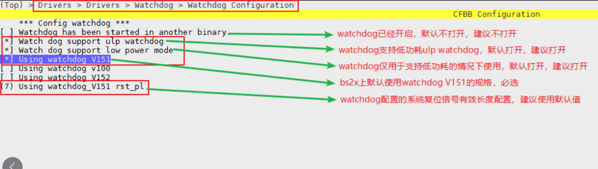

> **说明：** 
>若上述图片所示与表格描述不一致，请以表格为准。

配置宏具体描述如[表1](#table16629938173916)所示。

**表 1**  WATCHDOG相关宏描述

<a name="table16629938173916"></a>
<table><thead align="left"><tr id="row1462913813915"><th class="cellrowborder" valign="top" width="22.62773722627738%" id="mcps1.2.7.1.1"><p id="p1962923853920"><a name="p1962923853920"></a><a name="p1962923853920"></a>宏名称（CONFIG_是默认添加的前缀）</p>
</th>
<th class="cellrowborder" valign="top" width="21.137886211378866%" id="mcps1.2.7.1.2"><p id="p962916388395"><a name="p962916388395"></a><a name="p962916388395"></a>kconfig界面显示的具体描述</p>
</th>
<th class="cellrowborder" valign="top" width="19.878012198780127%" id="mcps1.2.7.1.3"><p id="p18731420115119"><a name="p18731420115119"></a><a name="p18731420115119"></a>使用场景</p>
</th>
<th class="cellrowborder" valign="top" width="10.618938106189384%" id="mcps1.2.7.1.4"><p id="p537485457"><a name="p537485457"></a><a name="p537485457"></a>是否已经实现</p>
</th>
<th class="cellrowborder" valign="top" width="11.338866113388663%" id="mcps1.2.7.1.5"><p id="p1162915382392"><a name="p1162915382392"></a><a name="p1162915382392"></a>是否依赖其他宏</p>
</th>
<th class="cellrowborder" valign="top" width="14.398560143985604%" id="mcps1.2.7.1.6"><p id="p1449914917569"><a name="p1449914917569"></a><a name="p1449914917569"></a>是否选择打开或修改配置</p>
</th>
</tr>
</thead>
<tbody><tr id="row16629338103916"><td class="cellrowborder" valign="top" width="22.62773722627738%" headers="mcps1.2.7.1.1 "><p id="p166291338133910"><a name="p166291338133910"></a><a name="p166291338133910"></a>CONFIG_WATCHDOG_ALREADY_START</p>
</td>
<td class="cellrowborder" valign="top" width="21.137886211378866%" headers="mcps1.2.7.1.2 "><p id="p4239943111619"><a name="p4239943111619"></a><a name="p4239943111619"></a>Watchdog has been started in another binary.</p>
</td>
<td class="cellrowborder" valign="top" width="19.878012198780127%" headers="mcps1.2.7.1.3 "><p id="p882925153018"><a name="p882925153018"></a><a name="p882925153018"></a>该宏表示WATCHDOG已经开启，无需再重复配置</p>
</td>
<td class="cellrowborder" valign="top" width="10.618938106189384%" headers="mcps1.2.7.1.4 "><p id="p166297382397"><a name="p166297382397"></a><a name="p166297382397"></a>是</p>
</td>
<td class="cellrowborder" valign="top" width="11.338866113388663%" headers="mcps1.2.7.1.5 "><p id="p162983873917"><a name="p162983873917"></a><a name="p162983873917"></a>否</p>
</td>
<td class="cellrowborder" valign="top" width="14.398560143985604%" headers="mcps1.2.7.1.6 "><p id="p12981192883014"><a name="p12981192883014"></a><a name="p12981192883014"></a>默认关闭，视情况选择，建议关闭</p>
</td>
</tr>
<tr id="row166299383394"><td class="cellrowborder" valign="top" width="22.62773722627738%" headers="mcps1.2.7.1.1 "><p id="p14629173813920"><a name="p14629173813920"></a><a name="p14629173813920"></a>CONFIG_WATCHDOG_SUPPORT_ULP_WDT</p>
</td>
<td class="cellrowborder" valign="top" width="21.137886211378866%" headers="mcps1.2.7.1.2 "><p id="p4944112916213"><a name="p4944112916213"></a><a name="p4944112916213"></a>Watchdog support ulp watchdog.</p>
</td>
<td class="cellrowborder" valign="top" width="19.878012198780127%" headers="mcps1.2.7.1.3 "><p id="p118818331937"><a name="p118818331937"></a><a name="p118818331937"></a>支持低功耗ulp WATCHDOG</p>
</td>
<td class="cellrowborder" valign="top" width="10.618938106189384%" headers="mcps1.2.7.1.4 "><p id="p166291838143916"><a name="p166291838143916"></a><a name="p166291838143916"></a>是</p>
</td>
<td class="cellrowborder" valign="top" width="11.338866113388663%" headers="mcps1.2.7.1.5 "><p id="p104251259727"><a name="p104251259727"></a><a name="p104251259727"></a>否</p>
</td>
<td class="cellrowborder" valign="top" width="14.398560143985604%" headers="mcps1.2.7.1.6 "><p id="p466161893814"><a name="p466161893814"></a><a name="p466161893814"></a>默认打开，建议打开</p>
</td>
</tr>
<tr id="row3629193823919"><td class="cellrowborder" valign="top" width="22.62773722627738%" headers="mcps1.2.7.1.1 "><p id="p262983811395"><a name="p262983811395"></a><a name="p262983811395"></a>CONFIG_WATCHDOG_SUPPORT_LPM</p>
</td>
<td class="cellrowborder" valign="top" width="21.137886211378866%" headers="mcps1.2.7.1.2 "><p id="p6888342162111"><a name="p6888342162111"></a><a name="p6888342162111"></a>Watchdog support low power mode.</p>
</td>
<td class="cellrowborder" valign="top" width="19.878012198780127%" headers="mcps1.2.7.1.3 "><p id="p1746412917425"><a name="p1746412917425"></a><a name="p1746412917425"></a>该宏仅用于低功耗情况下使用</p>
</td>
<td class="cellrowborder" valign="top" width="10.618938106189384%" headers="mcps1.2.7.1.4 "><p id="p3629133873917"><a name="p3629133873917"></a><a name="p3629133873917"></a>是</p>
</td>
<td class="cellrowborder" valign="top" width="11.338866113388663%" headers="mcps1.2.7.1.5 "><p id="p062910387397"><a name="p062910387397"></a><a name="p062910387397"></a>否</p>
</td>
<td class="cellrowborder" valign="top" width="14.398560143985604%" headers="mcps1.2.7.1.6 "><p id="p0629838133914"><a name="p0629838133914"></a><a name="p0629838133914"></a>默认打开，视情况选择，建议打开</p>
</td>
</tr>
<tr id="row962920381394"><td class="cellrowborder" valign="top" width="22.62773722627738%" headers="mcps1.2.7.1.1 "><p id="p1629738173912"><a name="p1629738173912"></a><a name="p1629738173912"></a>CONFIG_WATCHDOG_USING_V100</p>
</td>
<td class="cellrowborder" valign="top" width="21.137886211378866%" headers="mcps1.2.7.1.2 "><p id="p17631164919215"><a name="p17631164919215"></a><a name="p17631164919215"></a>Using watchdog V100.</p>
</td>
<td class="cellrowborder" valign="top" width="19.878012198780127%" headers="mcps1.2.7.1.3 "><p id="p1391712438269"><a name="p1391712438269"></a><a name="p1391712438269"></a>该宏代表使用WATCHDOG V100的驱动规格，本产品不使用该规格</p>
<p id="p83281914415"><a name="p83281914415"></a><a name="p83281914415"></a></p>
</td>
<td class="cellrowborder" valign="top" width="10.618938106189384%" headers="mcps1.2.7.1.4 "><p id="p7630938143910"><a name="p7630938143910"></a><a name="p7630938143910"></a>是</p>
</td>
<td class="cellrowborder" valign="top" width="11.338866113388663%" headers="mcps1.2.7.1.5 "><p id="p1183214531423"><a name="p1183214531423"></a><a name="p1183214531423"></a>否</p>
</td>
<td class="cellrowborder" valign="top" width="14.398560143985604%" headers="mcps1.2.7.1.6 "><p id="p165302711299"><a name="p165302711299"></a><a name="p165302711299"></a>默认关闭，必须关闭</p>
</td>
</tr>
<tr id="row62681237271"><td class="cellrowborder" valign="top" width="22.62773722627738%" headers="mcps1.2.7.1.1 "><p id="p112401826112812"><a name="p112401826112812"></a><a name="p112401826112812"></a>CONFIG_WATCHDOG_USING_V151</p>
</td>
<td class="cellrowborder" valign="top" width="21.137886211378866%" headers="mcps1.2.7.1.2 "><p id="p421072052213"><a name="p421072052213"></a><a name="p421072052213"></a>Using watchdog v151.</p>
</td>
<td class="cellrowborder" valign="top" width="19.878012198780127%" headers="mcps1.2.7.1.3 "><p id="p167838112284"><a name="p167838112284"></a><a name="p167838112284"></a>该宏代表使用WATCHDOG V151的驱动规格，本产品默认使用该规格</p>
</td>
<td class="cellrowborder" valign="top" width="10.618938106189384%" headers="mcps1.2.7.1.4 "><p id="p5269202314277"><a name="p5269202314277"></a><a name="p5269202314277"></a>是</p>
</td>
<td class="cellrowborder" valign="top" width="11.338866113388663%" headers="mcps1.2.7.1.5 "><p id="p882352916313"><a name="p882352916313"></a><a name="p882352916313"></a>否</p>
</td>
<td class="cellrowborder" valign="top" width="14.398560143985604%" headers="mcps1.2.7.1.6 "><p id="p997411916292"><a name="p997411916292"></a><a name="p997411916292"></a>默认打开，必选</p>
</td>
</tr>
<tr id="row17817572040"><td class="cellrowborder" valign="top" width="22.62773722627738%" headers="mcps1.2.7.1.1 "><p id="p53019141514"><a name="p53019141514"></a><a name="p53019141514"></a>CONFIG_WATCHDOG_USING_V152</p>
</td>
<td class="cellrowborder" valign="top" width="21.137886211378866%" headers="mcps1.2.7.1.2 "><p id="p4395254122619"><a name="p4395254122619"></a><a name="p4395254122619"></a>Using watchdog v152.</p>
</td>
<td class="cellrowborder" valign="top" width="19.878012198780127%" headers="mcps1.2.7.1.3 "><p id="p52954333289"><a name="p52954333289"></a><a name="p52954333289"></a>该宏代表使用WATCHDOG V152的驱动规格，本产品不使用该规格</p>
</td>
<td class="cellrowborder" valign="top" width="10.618938106189384%" headers="mcps1.2.7.1.4 "><p id="p17919571246"><a name="p17919571246"></a><a name="p17919571246"></a>是</p>
</td>
<td class="cellrowborder" valign="top" width="11.338866113388663%" headers="mcps1.2.7.1.5 "><p id="p1343315396319"><a name="p1343315396319"></a><a name="p1343315396319"></a>否</p>
</td>
<td class="cellrowborder" valign="top" width="14.398560143985604%" headers="mcps1.2.7.1.6 "><p id="p142715574917"><a name="p142715574917"></a><a name="p142715574917"></a>默认关闭，必须关闭</p>
</td>
</tr>
<tr id="row177121859141412"><td class="cellrowborder" valign="top" width="22.62773722627738%" headers="mcps1.2.7.1.1 "><p id="p6712259101414"><a name="p6712259101414"></a><a name="p6712259101414"></a>CONFIG_WATCHDOG_USING_V151_RST_PL</p>
</td>
<td class="cellrowborder" valign="top" width="21.137886211378866%" headers="mcps1.2.7.1.2 "><p id="p167121459141412"><a name="p167121459141412"></a><a name="p167121459141412"></a>Using watchdog V151 rst_pl.</p>
</td>
<td class="cellrowborder" valign="top" width="19.878012198780127%" headers="mcps1.2.7.1.3 "><p id="p17712259141415"><a name="p17712259141415"></a><a name="p17712259141415"></a>WATCHDOG 配置的系统复位有效长度</p>
</td>
<td class="cellrowborder" valign="top" width="10.618938106189384%" headers="mcps1.2.7.1.4 "><p id="p11713185971415"><a name="p11713185971415"></a><a name="p11713185971415"></a>是</p>
</td>
<td class="cellrowborder" valign="top" width="11.338866113388663%" headers="mcps1.2.7.1.5 "><p id="p163714292912"><a name="p163714292912"></a><a name="p163714292912"></a>CONFIG_WATCHDOG_USING_V151</p>
</td>
<td class="cellrowborder" valign="top" width="14.398560143985604%" headers="mcps1.2.7.1.6 "><p id="p671315931413"><a name="p671315931413"></a><a name="p671315931413"></a>默认值是7，视情况选择配置，建议不做修改</p>
</td>
</tr>
</tbody>
</table>

## 开发指引<a name="ZH-CN_TOPIC_0000001713103569"></a>

WDT一般用于检测是否死机，如果超过喂狗等待的时间没有进行喂狗操作，根据Watchdog配置的使能模式产生一个系统复位或者上报狗中断。参考代码如下：

1.  调用uapi\_watchdog\_init初始化并设置看门狗超时时间。
2.  调用uapi\_watchdog\_enable，使能看门狗模块，可配置复位模式和中断模式。
3.  调用uapi\_watchdog\_kick，进行喂狗操作，此时在idle任务中已实现了喂狗操作。
4.  调用uapi\_watchdog\_get\_left\_time，获取看门狗定时器剩余时间（可选）。
5.  调用uapi\_watchdog\_disable，关闭看门狗（正常情况下不建议关闭看门狗）。

示例：

```
#include "watchdog.h"
#include "watchdog_porting.h"
void sample_wdt(void)
{
    uint32_t sample_remain_ms;
    /* 设置开门狗超时时间 */
    uapi_watchdog_init(CHIP_WDT_TIMEOUT_32S);/* 设置超时时间 */
    uapi_watchdog_enable(WDT_MODE_RESET);/* 使能看门狗 */
    osal_mdelay(5000); /* delay 5000 ms */
    uapi_watchdog_kick(); /* 喂狗 */
    uapi_watchdog_get_left_time(&sample_remain_ms); /* 获取剩余超时时间 */
    osal_printk("sample_remain_ms = %x! \n", sample_remain_ms);
    uapi_watchdog_disable();/* 关闭看门狗 */
}
```

## 注意事项<a name="ZH-CN_TOPIC_0000001664983970"></a>

-   如果获取时间为0xFFFFFFFF，说明看门狗处于未使能状态。
-   看门狗在SDK中已经使能且已存在喂狗动作，在特殊场景下，如需长时间占用CPU，可将看门狗去使能或在业务代码中增加喂狗操作，避免正常业务场景引起看门狗复位。
-   看门狗默认超时时间为8s，flashboot中将狗重新配置为32s，使用时请注意。一般情况下，不建议修改超时时间。

# Timer<a name="ZH-CN_TOPIC_0000001713023573"></a>


## 概述<a name="ZH-CN_TOPIC_0000001665143754"></a>

Timer是一种用来计时和产生定时事件的重要模块。它通常由一个计数器和一些相关的寄存器组成。定时器的核心功能是根据设定的时钟源和预设的计数值来进行计数，并在特定条件下产生中断或触发其他事件。

Timer规格如下：

-   提供4个定时器（Timer0～3）。
-   每个定时器提供两个32位寄存器用于计数。
-   支持超时中断以及重装载值。

## 功能描述<a name="ZH-CN_TOPIC_0000001664983994"></a>

Timer模块提供的接口及功能如下：

-   uapi\_timer\_adapter（timer\_index\_t index, uint32\_t int\_id, uint16\_t int\_priority）：适配定时器配置（index表示硬件定时器索引，int\_id表示硬件定时器中断ID，int\_priority表示硬件定时器中断优先级）。
-   uapi\_timer\_init（void）：初始化Timer。
-   uapi\_timer\_deinit（void）：去初始化Timer。
-   uapi\_timer\_create（timer\_index\_t index, timer\_handle\_t \*timer）：创建定时器（index表示硬件定时器索引，timer表示定时器处理返回值）。
-   uapi\_timer\_delete（timer\_handle\_t timer）：删除指定定时器（timer表示被创建后的定时器）。
-   uapi\_timer\_start（timer\_handle\_t timer, uint32\_t time\_us, timer\_callback\_t callback, uintptr\_t data）：开启指定的定时器，开始计时（timer表示被创建后的定时器，time\_us表示定时器超时时间，callback表示定时器回调函数，data表示传递给定时器回调函数的参数）。
-   uapi\_timer\_stop（timer\_handle\_t timer）：停止当前定时器计时（timer表示被创建后的定时器）。
-   uapi\_timer\_get\_max\_us（void）：用户可以获取到Timer最大可以设置的延时时间（us）。
-   uapi\_timer\_get\_current\_time\_us（timer\_index\_t index, uint32\_t \*current\_time\_us）：获取指定底层Timer定时器的当前时间（us）（index表示底层Timer定时器索引，current\_time\_us表示底层Timer定时器当前时间us值）。
-   uapi\_timer\_start\_high\_precision（timer\_index\_t index, timer\_trigger\_mode\_t mode, uint32\_t time\_us, timer\_irq\_info\_t\* irq\_info, high\_precision\_timer\_callback\_t callback）：启动一个高精度的专用定时器（index表示硬件定时器索引，mode表示计时模式，time\_us表示定时器超时时间，irq\_info表示中断信息，callback表示定时器回调函数）。（打开CONFIG\_TIMER\_SUPPORT\_HIGH\_PRECISION宏才能使用）
-   uapi\_timer\_reset\_high\_precision（timer\_index\_t index, timer\_trigger\_mode\_t mode, uint32\_t time\_us）：重启一个高精度的专用定时器（index表示硬件定时器索引，mode表示计时模式，time\_us表示定时器超时时间）。

    （打开CONFIG\_TIMER\_SUPPORT\_HIGH\_PRECISION宏才能使用）

-   uapi\_timer\_stop\_high\_precision（timer\_index\_t index）：停止一个高精度的专用定时器（index表示硬件定时器索引）。（打开CONFIG\_TIMER\_SUPPORT\_HIGH\_PRECISION宏才能使用）
-   uapi\_timer\_suspend（uintptr\_t val）：挂起定时器模块，低功耗情况使用（val表示挂起时所需要的参数）。（打开CONFIG\_TIMER\_SUPPORT\_LPM宏才能使用）
-   uapi\_timer\_resume（uintptr\_t val）：恢复定时器模块，低功耗情况使用（val表示恢复时所需要的参数）。（打开CONFIG\_TIMER\_SUPPORT\_LPM宏才能使用）

## KCONFIG配置<a name="ZH-CN_TOPIC_0000001896050934"></a>

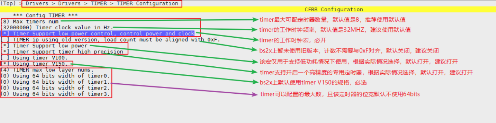

> **说明：** 
>若上述图片所示与表格描述不一致，请以表格为准。

配置宏具体描述如[表1](#table16629938173916)所示。

**表 1**  TIMER相关宏描述

<a name="table16629938173916"></a>
<table><thead align="left"><tr id="row1462913813915"><th class="cellrowborder" valign="top" width="22.62773722627738%" id="mcps1.2.7.1.1"><p id="p1962923853920"><a name="p1962923853920"></a><a name="p1962923853920"></a>宏名称（CONFIG_是默认添加的前缀）</p>
</th>
<th class="cellrowborder" valign="top" width="21.137886211378866%" id="mcps1.2.7.1.2"><p id="p962916388395"><a name="p962916388395"></a><a name="p962916388395"></a>kconfig界面显示的具体描述</p>
</th>
<th class="cellrowborder" valign="top" width="19.878012198780127%" id="mcps1.2.7.1.3"><p id="p18731420115119"><a name="p18731420115119"></a><a name="p18731420115119"></a>使用场景</p>
</th>
<th class="cellrowborder" valign="top" width="10.618938106189384%" id="mcps1.2.7.1.4"><p id="p537485457"><a name="p537485457"></a><a name="p537485457"></a>是否已经实现</p>
</th>
<th class="cellrowborder" valign="top" width="11.338866113388663%" id="mcps1.2.7.1.5"><p id="p1162915382392"><a name="p1162915382392"></a><a name="p1162915382392"></a>是否依赖其他宏</p>
</th>
<th class="cellrowborder" valign="top" width="14.398560143985604%" id="mcps1.2.7.1.6"><p id="p1449914917569"><a name="p1449914917569"></a><a name="p1449914917569"></a>是否选择打开或修改配置</p>
</th>
</tr>
</thead>
<tbody><tr id="row16629338103916"><td class="cellrowborder" valign="top" width="22.62773722627738%" headers="mcps1.2.7.1.1 "><p id="p166291338133910"><a name="p166291338133910"></a><a name="p166291338133910"></a>CONFIG_TIMER_MAX_TIMERS_NUM</p>
</td>
<td class="cellrowborder" valign="top" width="21.137886211378866%" headers="mcps1.2.7.1.2 "><p id="p1643543516587"><a name="p1643543516587"></a><a name="p1643543516587"></a>Max timers num.</p>
</td>
<td class="cellrowborder" valign="top" width="19.878012198780127%" headers="mcps1.2.7.1.3 "><p id="p882925153018"><a name="p882925153018"></a><a name="p882925153018"></a>最大可配TIMER定时器数量，默认值是8</p>
</td>
<td class="cellrowborder" valign="top" width="10.618938106189384%" headers="mcps1.2.7.1.4 "><p id="p166297382397"><a name="p166297382397"></a><a name="p166297382397"></a>是</p>
</td>
<td class="cellrowborder" valign="top" width="11.338866113388663%" headers="mcps1.2.7.1.5 "><p id="p162983873917"><a name="p162983873917"></a><a name="p162983873917"></a>否</p>
</td>
<td class="cellrowborder" valign="top" width="14.398560143985604%" headers="mcps1.2.7.1.6 "><p id="p1815310485618"><a name="p1815310485618"></a><a name="p1815310485618"></a>默认值是8，视情况选择配置，建议不做修改</p>
</td>
</tr>
<tr id="row166299383394"><td class="cellrowborder" valign="top" width="22.62773722627738%" headers="mcps1.2.7.1.1 "><p id="p14629173813920"><a name="p14629173813920"></a><a name="p14629173813920"></a>CONFIG_TIMER_CLOCK_VALUE</p>
</td>
<td class="cellrowborder" valign="top" width="21.137886211378866%" headers="mcps1.2.7.1.2 "><p id="p4944112916213"><a name="p4944112916213"></a><a name="p4944112916213"></a>Timer clock value in Hz.</p>
</td>
<td class="cellrowborder" valign="top" width="19.878012198780127%" headers="mcps1.2.7.1.3 "><p id="p118818331937"><a name="p118818331937"></a><a name="p118818331937"></a>TIMER的工作时钟频率，默认是32MHZ</p>
</td>
<td class="cellrowborder" valign="top" width="10.618938106189384%" headers="mcps1.2.7.1.4 "><p id="p166291838143916"><a name="p166291838143916"></a><a name="p166291838143916"></a>是</p>
</td>
<td class="cellrowborder" valign="top" width="11.338866113388663%" headers="mcps1.2.7.1.5 "><p id="p104251259727"><a name="p104251259727"></a><a name="p104251259727"></a>否</p>
</td>
<td class="cellrowborder" valign="top" width="14.398560143985604%" headers="mcps1.2.7.1.6 "><p id="p466161893814"><a name="p466161893814"></a><a name="p466161893814"></a>默认值是32000000，建议不做修改</p>
</td>
</tr>
<tr id="row3629193823919"><td class="cellrowborder" valign="top" width="22.62773722627738%" headers="mcps1.2.7.1.1 "><p id="p262983811395"><a name="p262983811395"></a><a name="p262983811395"></a>CONFIG_TIMER_SUPPORT_LPC</p>
</td>
<td class="cellrowborder" valign="top" width="21.137886211378866%" headers="mcps1.2.7.1.2 "><p id="p6888342162111"><a name="p6888342162111"></a><a name="p6888342162111"></a>Timer support low power control, control power and clock.</p>
</td>
<td class="cellrowborder" valign="top" width="19.878012198780127%" headers="mcps1.2.7.1.3 "><p id="p5454183113"><a name="p5454183113"></a><a name="p5454183113"></a>TIMER 工作时钟</p>
</td>
<td class="cellrowborder" valign="top" width="10.618938106189384%" headers="mcps1.2.7.1.4 "><p id="p3629133873917"><a name="p3629133873917"></a><a name="p3629133873917"></a>是</p>
</td>
<td class="cellrowborder" valign="top" width="11.338866113388663%" headers="mcps1.2.7.1.5 "><p id="p062910387397"><a name="p062910387397"></a><a name="p062910387397"></a>否</p>
</td>
<td class="cellrowborder" valign="top" width="14.398560143985604%" headers="mcps1.2.7.1.6 "><p id="p0629838133914"><a name="p0629838133914"></a><a name="p0629838133914"></a>默认打开，必选</p>
</td>
</tr>
<tr id="row962920381394"><td class="cellrowborder" valign="top" width="22.62773722627738%" headers="mcps1.2.7.1.1 "><p id="p1629738173912"><a name="p1629738173912"></a><a name="p1629738173912"></a>CONFIG_TIMER_USING_OLD_VERSION</p>
</td>
<td class="cellrowborder" valign="top" width="21.137886211378866%" headers="mcps1.2.7.1.2 "><p id="p137922171306"><a name="p137922171306"></a><a name="p137922171306"></a>Timer ip using old version, load count must be aligned with 0xF.</p>
</td>
<td class="cellrowborder" valign="top" width="19.878012198780127%" headers="mcps1.2.7.1.3 "><p id="p83281914415"><a name="p83281914415"></a><a name="p83281914415"></a>本产品暂未使用旧版本，计数无需与0xF对齐</p>
</td>
<td class="cellrowborder" valign="top" width="10.618938106189384%" headers="mcps1.2.7.1.4 "><p id="p7630938143910"><a name="p7630938143910"></a><a name="p7630938143910"></a>是</p>
</td>
<td class="cellrowborder" valign="top" width="11.338866113388663%" headers="mcps1.2.7.1.5 "><p id="p1183214531423"><a name="p1183214531423"></a><a name="p1183214531423"></a>否</p>
</td>
<td class="cellrowborder" valign="top" width="14.398560143985604%" headers="mcps1.2.7.1.6 "><p id="p165302711299"><a name="p165302711299"></a><a name="p165302711299"></a>默认关闭，本产品暂未使用，建议关闭</p>
</td>
</tr>
<tr id="row62681237271"><td class="cellrowborder" valign="top" width="22.62773722627738%" headers="mcps1.2.7.1.1 "><p id="p112401826112812"><a name="p112401826112812"></a><a name="p112401826112812"></a>CONFIG_TIMER_SUPPORT_LPM</p>
</td>
<td class="cellrowborder" valign="top" width="21.137886211378866%" headers="mcps1.2.7.1.2 "><p id="p35371214103514"><a name="p35371214103514"></a><a name="p35371214103514"></a>Timer support low power mode, supend and reusme.</p>
</td>
<td class="cellrowborder" valign="top" width="19.878012198780127%" headers="mcps1.2.7.1.3 "><p id="p1746412917425"><a name="p1746412917425"></a><a name="p1746412917425"></a>该宏仅用于低功耗情况下使用</p>
</td>
<td class="cellrowborder" valign="top" width="10.618938106189384%" headers="mcps1.2.7.1.4 "><p id="p5269202314277"><a name="p5269202314277"></a><a name="p5269202314277"></a>是</p>
</td>
<td class="cellrowborder" valign="top" width="11.338866113388663%" headers="mcps1.2.7.1.5 "><p id="p882352916313"><a name="p882352916313"></a><a name="p882352916313"></a>否</p>
</td>
<td class="cellrowborder" valign="top" width="14.398560143985604%" headers="mcps1.2.7.1.6 "><p id="p997411916292"><a name="p997411916292"></a><a name="p997411916292"></a>默认打开，视情况选择，建议打开</p>
</td>
</tr>
<tr id="row17817572040"><td class="cellrowborder" valign="top" width="22.62773722627738%" headers="mcps1.2.7.1.1 "><p id="p53019141514"><a name="p53019141514"></a><a name="p53019141514"></a>CONFIG_TIMER_SUPPORT_HIGH_PRECISION</p>
</td>
<td class="cellrowborder" valign="top" width="21.137886211378866%" headers="mcps1.2.7.1.2 "><p id="p168891142503"><a name="p168891142503"></a><a name="p168891142503"></a>Timer support timer high precision.</p>
</td>
<td class="cellrowborder" valign="top" width="19.878012198780127%" headers="mcps1.2.7.1.3 "><p id="p52954333289"><a name="p52954333289"></a><a name="p52954333289"></a>支持一个高精度的专用定时器</p>
</td>
<td class="cellrowborder" valign="top" width="10.618938106189384%" headers="mcps1.2.7.1.4 "><p id="p17919571246"><a name="p17919571246"></a><a name="p17919571246"></a>是</p>
</td>
<td class="cellrowborder" valign="top" width="11.338866113388663%" headers="mcps1.2.7.1.5 "><p id="p1343315396319"><a name="p1343315396319"></a><a name="p1343315396319"></a>否</p>
</td>
<td class="cellrowborder" valign="top" width="14.398560143985604%" headers="mcps1.2.7.1.6 "><p id="p142715574917"><a name="p142715574917"></a><a name="p142715574917"></a>默认打开，建议打开</p>
</td>
</tr>
<tr id="row177121859141412"><td class="cellrowborder" valign="top" width="22.62773722627738%" headers="mcps1.2.7.1.1 "><p id="p6712259101414"><a name="p6712259101414"></a><a name="p6712259101414"></a>CONFIG_TIMER_USING_V100</p>
</td>
<td class="cellrowborder" valign="top" width="21.137886211378866%" headers="mcps1.2.7.1.2 "><p id="p20237175914112"><a name="p20237175914112"></a><a name="p20237175914112"></a>Using Timer V100.</p>
</td>
<td class="cellrowborder" valign="top" width="19.878012198780127%" headers="mcps1.2.7.1.3 "><p id="p1391712438269"><a name="p1391712438269"></a><a name="p1391712438269"></a>该宏代表使用TIMER V100的驱动规格，本产品不使用该规格</p>
</td>
<td class="cellrowborder" valign="top" width="10.618938106189384%" headers="mcps1.2.7.1.4 "><p id="p11713185971415"><a name="p11713185971415"></a><a name="p11713185971415"></a>是</p>
</td>
<td class="cellrowborder" valign="top" width="11.338866113388663%" headers="mcps1.2.7.1.5 "><p id="p15514045111319"><a name="p15514045111319"></a><a name="p15514045111319"></a>否</p>
</td>
<td class="cellrowborder" valign="top" width="14.398560143985604%" headers="mcps1.2.7.1.6 "><p id="p27481819161514"><a name="p27481819161514"></a><a name="p27481819161514"></a>默认关闭，必须关闭</p>
</td>
</tr>
<tr id="row34351345185210"><td class="cellrowborder" valign="top" width="22.62773722627738%" headers="mcps1.2.7.1.1 "><p id="p7435474536"><a name="p7435474536"></a><a name="p7435474536"></a>CONFIG_TIMER_USING_V150</p>
</td>
<td class="cellrowborder" valign="top" width="21.137886211378866%" headers="mcps1.2.7.1.2 "><p id="p154351045205212"><a name="p154351045205212"></a><a name="p154351045205212"></a>Using Timer V150.</p>
</td>
<td class="cellrowborder" valign="top" width="19.878012198780127%" headers="mcps1.2.7.1.3 "><p id="p1942744612315"><a name="p1942744612315"></a><a name="p1942744612315"></a>该宏代表使用TIMER V150的驱动规格，本产品默认使用该规格</p>
</td>
<td class="cellrowborder" valign="top" width="10.618938106189384%" headers="mcps1.2.7.1.4 "><p id="p17361155861310"><a name="p17361155861310"></a><a name="p17361155861310"></a>是</p>
</td>
<td class="cellrowborder" valign="top" width="11.338866113388663%" headers="mcps1.2.7.1.5 "><p id="p143584516525"><a name="p143584516525"></a><a name="p143584516525"></a>否</p>
</td>
<td class="cellrowborder" valign="top" width="14.398560143985604%" headers="mcps1.2.7.1.6 "><p id="p436365811413"><a name="p436365811413"></a><a name="p436365811413"></a>默认打开，必选</p>
</td>
</tr>
<tr id="row1374155013523"><td class="cellrowborder" valign="top" width="22.62773722627738%" headers="mcps1.2.7.1.1 "><p id="p7386158145310"><a name="p7386158145310"></a><a name="p7386158145310"></a>CONFIG_TIMER_MAX_NUM</p>
</td>
<td class="cellrowborder" valign="top" width="21.137886211378866%" headers="mcps1.2.7.1.2 "><p id="p07435018521"><a name="p07435018521"></a><a name="p07435018521"></a>Timer max low layer nums.</p>
</td>
<td class="cellrowborder" valign="top" width="19.878012198780127%" headers="mcps1.2.7.1.3 "><p id="p074135019525"><a name="p074135019525"></a><a name="p074135019525"></a>TIMER 可配置的最大定时器数量</p>
</td>
<td class="cellrowborder" valign="top" width="10.618938106189384%" headers="mcps1.2.7.1.4 "><p id="p1274135013525"><a name="p1274135013525"></a><a name="p1274135013525"></a>是</p>
</td>
<td class="cellrowborder" valign="top" width="11.338866113388663%" headers="mcps1.2.7.1.5 "><p id="p174155020526"><a name="p174155020526"></a><a name="p174155020526"></a>否</p>
</td>
<td class="cellrowborder" valign="top" width="14.398560143985604%" headers="mcps1.2.7.1.6 "><p id="p1274115014524"><a name="p1274115014524"></a><a name="p1274115014524"></a>默认值是4，视情况选择配置，建议不做修改</p>
</td>
</tr>
<tr id="row208303537521"><td class="cellrowborder" valign="top" width="22.62773722627738%" headers="mcps1.2.7.1.1 "><p id="p33336914539"><a name="p33336914539"></a><a name="p33336914539"></a>CONFIG_TIMER_0_WIDTH_64</p>
</td>
<td class="cellrowborder" valign="top" width="21.137886211378866%" headers="mcps1.2.7.1.2 "><p id="p1422772618212"><a name="p1422772618212"></a><a name="p1422772618212"></a>Using 64 bits width of Timer0.</p>
</td>
<td class="cellrowborder" valign="top" width="19.878012198780127%" headers="mcps1.2.7.1.3 "><p id="p118301653105211"><a name="p118301653105211"></a><a name="p118301653105211"></a>定时器0位宽默认使用64bits</p>
</td>
<td class="cellrowborder" valign="top" width="10.618938106189384%" headers="mcps1.2.7.1.4 "><p id="p188300538525"><a name="p188300538525"></a><a name="p188300538525"></a>是</p>
</td>
<td class="cellrowborder" valign="top" width="11.338866113388663%" headers="mcps1.2.7.1.5 "><p id="p19830135385212"><a name="p19830135385212"></a><a name="p19830135385212"></a>CONFIG_TIMER_USING_V150 &amp;&amp;</p>
<p id="p1246835961715"><a name="p1246835961715"></a><a name="p1246835961715"></a>CONFIG_TIMER_MAX_NUM</p>
</td>
<td class="cellrowborder" valign="top" width="14.398560143985604%" headers="mcps1.2.7.1.6 "><p id="p528392119184"><a name="p528392119184"></a><a name="p528392119184"></a>默认值是0，视情况选择配置，建议不做修改</p>
</td>
</tr>
<tr id="row966925717524"><td class="cellrowborder" valign="top" width="22.62773722627738%" headers="mcps1.2.7.1.1 "><p id="p182637104539"><a name="p182637104539"></a><a name="p182637104539"></a>CONFIG_TIMER_1_WIDTH_64</p>
</td>
<td class="cellrowborder" valign="top" width="21.137886211378866%" headers="mcps1.2.7.1.2 "><p id="p267015572520"><a name="p267015572520"></a><a name="p267015572520"></a>Using 64 bits width of Timer1.</p>
</td>
<td class="cellrowborder" valign="top" width="19.878012198780127%" headers="mcps1.2.7.1.3 "><p id="p209725851610"><a name="p209725851610"></a><a name="p209725851610"></a>定时器1位宽默认使用64bits</p>
</td>
<td class="cellrowborder" valign="top" width="10.618938106189384%" headers="mcps1.2.7.1.4 "><p id="p46701957165210"><a name="p46701957165210"></a><a name="p46701957165210"></a>是</p>
</td>
<td class="cellrowborder" valign="top" width="11.338866113388663%" headers="mcps1.2.7.1.5 "><p id="p98681632189"><a name="p98681632189"></a><a name="p98681632189"></a>CONFIG_TIMER_USING_V150 &amp;&amp;</p>
<p id="p138687313182"><a name="p138687313182"></a><a name="p138687313182"></a>CONFIG_TIMER_MAX_NUM</p>
</td>
<td class="cellrowborder" valign="top" width="14.398560143985604%" headers="mcps1.2.7.1.6 "><p id="p5243175114182"><a name="p5243175114182"></a><a name="p5243175114182"></a>默认值是0，视情况选择配置，建议不做修改</p>
</td>
</tr>
<tr id="row134868485542"><td class="cellrowborder" valign="top" width="22.62773722627738%" headers="mcps1.2.7.1.1 "><p id="p5487104819549"><a name="p5487104819549"></a><a name="p5487104819549"></a>CONFIG_TIMER_2_WIDTH_64</p>
</td>
<td class="cellrowborder" valign="top" width="21.137886211378866%" headers="mcps1.2.7.1.2 "><p id="p748764895413"><a name="p748764895413"></a><a name="p748764895413"></a>Using 64 bits width of Timer2.</p>
</td>
<td class="cellrowborder" valign="top" width="19.878012198780127%" headers="mcps1.2.7.1.3 "><p id="p1185735819161"><a name="p1185735819161"></a><a name="p1185735819161"></a>定时器2位宽默认使用64bits</p>
</td>
<td class="cellrowborder" valign="top" width="10.618938106189384%" headers="mcps1.2.7.1.4 "><p id="p448754835418"><a name="p448754835418"></a><a name="p448754835418"></a>是</p>
</td>
<td class="cellrowborder" valign="top" width="11.338866113388663%" headers="mcps1.2.7.1.5 "><p id="p213145181818"><a name="p213145181818"></a><a name="p213145181818"></a>CONFIG_TIMER_USING_V150 &amp;&amp;</p>
<p id="p111315561820"><a name="p111315561820"></a><a name="p111315561820"></a>CONFIG_TIMER_MAX_NUM</p>
</td>
<td class="cellrowborder" valign="top" width="14.398560143985604%" headers="mcps1.2.7.1.6 "><p id="p1620445201815"><a name="p1620445201815"></a><a name="p1620445201815"></a>默认值是0，视情况选择配置，建议不做修改</p>
</td>
</tr>
<tr id="row1346415537543"><td class="cellrowborder" valign="top" width="22.62773722627738%" headers="mcps1.2.7.1.1 "><p id="p146425319548"><a name="p146425319548"></a><a name="p146425319548"></a>CONFIG_TIMER_3_WIDTH_64</p>
</td>
<td class="cellrowborder" valign="top" width="21.137886211378866%" headers="mcps1.2.7.1.2 "><p id="p1046415539549"><a name="p1046415539549"></a><a name="p1046415539549"></a>Using 64 bits width of Timer3.</p>
</td>
<td class="cellrowborder" valign="top" width="19.878012198780127%" headers="mcps1.2.7.1.3 "><p id="p124933591164"><a name="p124933591164"></a><a name="p124933591164"></a>定时器3位宽默认使用64bits</p>
</td>
<td class="cellrowborder" valign="top" width="10.618938106189384%" headers="mcps1.2.7.1.4 "><p id="p7464155325414"><a name="p7464155325414"></a><a name="p7464155325414"></a>是</p>
</td>
<td class="cellrowborder" valign="top" width="11.338866113388663%" headers="mcps1.2.7.1.5 "><p id="p1561739151819"><a name="p1561739151819"></a><a name="p1561739151819"></a>CONFIG_TIMER_USING_V150 &amp;&amp;</p>
<p id="p136171392182"><a name="p136171392182"></a><a name="p136171392182"></a>CONFIG_TIMER_MAX_NUM</p>
</td>
<td class="cellrowborder" valign="top" width="14.398560143985604%" headers="mcps1.2.7.1.6 "><p id="p1171195318186"><a name="p1171195318186"></a><a name="p1171195318186"></a>默认值是0，视情况选择配置，建议不做修改</p>
</td>
</tr>
<tr id="row11117570546"><td class="cellrowborder" valign="top" width="22.62773722627738%" headers="mcps1.2.7.1.1 "><p id="p101195785410"><a name="p101195785410"></a><a name="p101195785410"></a>CONFIG_TIMER_4_WIDTH_64</p>
</td>
<td class="cellrowborder" valign="top" width="21.137886211378866%" headers="mcps1.2.7.1.2 "><p id="p311175775415"><a name="p311175775415"></a><a name="p311175775415"></a>Using 64 bits width of Timer4.</p>
</td>
<td class="cellrowborder" valign="top" width="19.878012198780127%" headers="mcps1.2.7.1.3 "><p id="p14294190161718"><a name="p14294190161718"></a><a name="p14294190161718"></a>定时器4位宽默认使用64bits</p>
</td>
<td class="cellrowborder" valign="top" width="10.618938106189384%" headers="mcps1.2.7.1.4 "><p id="p81116577548"><a name="p81116577548"></a><a name="p81116577548"></a>是</p>
</td>
<td class="cellrowborder" valign="top" width="11.338866113388663%" headers="mcps1.2.7.1.5 "><p id="p15728465187"><a name="p15728465187"></a><a name="p15728465187"></a>CONFIG_TIMER_USING_V150 &amp;&amp;</p>
<p id="p17728663189"><a name="p17728663189"></a><a name="p17728663189"></a>CONFIG_TIMER_MAX_NUM</p>
</td>
<td class="cellrowborder" valign="top" width="14.398560143985604%" headers="mcps1.2.7.1.6 "><p id="p10209185501812"><a name="p10209185501812"></a><a name="p10209185501812"></a>默认值是0，视情况选择配置，建议不做修改</p>
</td>
</tr>
<tr id="row28477017553"><td class="cellrowborder" valign="top" width="22.62773722627738%" headers="mcps1.2.7.1.1 "><p id="p198472001554"><a name="p198472001554"></a><a name="p198472001554"></a>CONFIG_TIMER_5_WIDTH_64</p>
</td>
<td class="cellrowborder" valign="top" width="21.137886211378866%" headers="mcps1.2.7.1.2 "><p id="p48471901553"><a name="p48471901553"></a><a name="p48471901553"></a>Using 64 bits width of Timer5.</p>
</td>
<td class="cellrowborder" valign="top" width="19.878012198780127%" headers="mcps1.2.7.1.3 "><p id="p181303112173"><a name="p181303112173"></a><a name="p181303112173"></a>定时器5位宽默认使用64bits</p>
</td>
<td class="cellrowborder" valign="top" width="10.618938106189384%" headers="mcps1.2.7.1.4 "><p id="p11847140135512"><a name="p11847140135512"></a><a name="p11847140135512"></a>是</p>
</td>
<td class="cellrowborder" valign="top" width="11.338866113388663%" headers="mcps1.2.7.1.5 "><p id="p1794067191815"><a name="p1794067191815"></a><a name="p1794067191815"></a>CONFIG_TIMER_USING_V150 &amp;&amp;</p>
<p id="p12941275186"><a name="p12941275186"></a><a name="p12941275186"></a>CONFIG_TIMER_MAX_NUM</p>
</td>
<td class="cellrowborder" valign="top" width="14.398560143985604%" headers="mcps1.2.7.1.6 "><p id="p1134105651819"><a name="p1134105651819"></a><a name="p1134105651819"></a>默认值是0，视情况选择配置，建议不做修改</p>
</td>
</tr>
<tr id="row11822625519"><td class="cellrowborder" valign="top" width="22.62773722627738%" headers="mcps1.2.7.1.1 "><p id="p28215665518"><a name="p28215665518"></a><a name="p28215665518"></a>CONFIG_TIMER_6_WIDTH_64</p>
</td>
<td class="cellrowborder" valign="top" width="21.137886211378866%" headers="mcps1.2.7.1.2 "><p id="p2839611551"><a name="p2839611551"></a><a name="p2839611551"></a>Using 64 bits width of Timer6.</p>
</td>
<td class="cellrowborder" valign="top" width="19.878012198780127%" headers="mcps1.2.7.1.3 "><p id="p1191881191711"><a name="p1191881191711"></a><a name="p1191881191711"></a>定时器6位宽默认使用64bits</p>
</td>
<td class="cellrowborder" valign="top" width="10.618938106189384%" headers="mcps1.2.7.1.4 "><p id="p88346105515"><a name="p88346105515"></a><a name="p88346105515"></a>是</p>
</td>
<td class="cellrowborder" valign="top" width="11.338866113388663%" headers="mcps1.2.7.1.5 "><p id="p532010112180"><a name="p532010112180"></a><a name="p532010112180"></a>CONFIG_TIMER_USING_V150 &amp;&amp;</p>
<p id="p1832021117185"><a name="p1832021117185"></a><a name="p1832021117185"></a>CONFIG_TIMER_MAX_NUM</p>
</td>
<td class="cellrowborder" valign="top" width="14.398560143985604%" headers="mcps1.2.7.1.6 "><p id="p1561715731814"><a name="p1561715731814"></a><a name="p1561715731814"></a>默认值是0，视情况选择配置，建议不做修改</p>
</td>
</tr>
<tr id="row7824121255510"><td class="cellrowborder" valign="top" width="22.62773722627738%" headers="mcps1.2.7.1.1 "><p id="p18241112145511"><a name="p18241112145511"></a><a name="p18241112145511"></a>CONFIG_TIMER_7_WIDTH_64</p>
</td>
<td class="cellrowborder" valign="top" width="21.137886211378866%" headers="mcps1.2.7.1.2 "><p id="p08241012175519"><a name="p08241012175519"></a><a name="p08241012175519"></a>Using 64 bits width of Timer7.</p>
</td>
<td class="cellrowborder" valign="top" width="19.878012198780127%" headers="mcps1.2.7.1.3 "><p id="p1667815219171"><a name="p1667815219171"></a><a name="p1667815219171"></a>定时器7位宽默认使用64bits</p>
</td>
<td class="cellrowborder" valign="top" width="10.618938106189384%" headers="mcps1.2.7.1.4 "><p id="p68241412125513"><a name="p68241412125513"></a><a name="p68241412125513"></a>是</p>
</td>
<td class="cellrowborder" valign="top" width="11.338866113388663%" headers="mcps1.2.7.1.5 "><p id="p11484181241819"><a name="p11484181241819"></a><a name="p11484181241819"></a>CONFIG_TIMER_USING_V150 &amp;&amp;</p>
<p id="p54844123183"><a name="p54844123183"></a><a name="p54844123183"></a>CONFIG_TIMER_MAX_NUM</p>
</td>
<td class="cellrowborder" valign="top" width="14.398560143985604%" headers="mcps1.2.7.1.6 "><p id="p154421586181"><a name="p154421586181"></a><a name="p154421586181"></a>默认值是0，视情况选择配置，建议不做修改</p>
</td>
</tr>
</tbody>
</table>

## 开发指引<a name="ZH-CN_TOPIC_0000001713103521"></a>

使用Timer驱动接口创建一个5ms周期触发中断的定时器，参考步骤如下：

1.  调用uapi\_timer\_adapter接口，配置定时器索引、定时器中断号和中断优先级。
2.  调用uapi\_timer\_init接口，初始化定时器功能。
3.  调用uapi\_timer\_create接口，创建一个定时器，函数参数句柄为唯一定时器标识。
4.  调用uapi\_timer\_start接口，设置超时时间、超时回调函数、回调函数入参以及启动定时器。
5.  调用uapi\_timer\_stop接口，停止当前定时器计时。
6.  调用uapi\_timer\_delete接口，删除当前定时器。

示例：

```
#include "timer.h"
#define DELAY_5MS       5000
#define DELAY_1S        1000000
#define TIMER_IRQ_PRIO  3      /* 中断优先级范围，从高到低:  0~7 */
static timer_handle_t timer1_handle = 0;
static void timer1_callback(uintptr_t data);
void timer1_callback(uintptr_t data)
{
    unused(data);
    osal_printk("Timer1 5ms int test!\r\n");
    /* 开启下一次timer中断 */
    uapi_timer_start(timer1_handle, DELAY_5MS, timer1_callback, 0);
}
errcode_t test_timer_sample(void)
{
    errcode_t ret;
    /* timer 软件初始化 */
    uapi_timer_init();
    /* 设置 timer1 硬件初始化，设置中断号，配置优先级 */
    ret = uapi_timer_adapter(TIMER_INDEX_1, TIMER_1_IRQN, TIMER_IRQ_PRIO);
    /* 创建 timer1 软件定时器控制句柄 */
    uapi_timer_create(TIMER_INDEX_1, &timer1_handle);
    /* 启动定时器 */
    uapi_timer_start(timer1_handle, DELAY_5MS, timer1_callback, 0);
    osal_mdelay(DELAY_1S);
    /* 停止定时器 */
    uapi_timer_stop(timer1_handle);
    /* 删除定时器 */
    uapi_timer_delete(timer1_handle);
    return ret;
}
```

## 注意事项<a name="ZH-CN_TOPIC_0000001713023565"></a>

-   Timer创建的定时器超时时间单位为μs。
-   默认最多可同时创建3个高精度定时器（Timer0～2）。
-   Timer3默认作为liteos的系统时钟源，禁止使用uapi接口配置。
-   在非低功耗模式下，Timer可配置的最大超时时间约为4294s。
-   确定不需要使用当前高精度定时器后，需要调用uapi\_timer\_delete接口，释放该定时器资源。
-   禁止在Timer的回调函数中调用uapi\_timer\_stop、uapi\_timer\_delete等接口。

# Systick<a name="ZH-CN_TOPIC_0000001665143734"></a>


## 概述<a name="ZH-CN_TOPIC_0000001713103553"></a>

Systick是单片机系统中的一种硬件设备或功能模块，用于提供精确的时间基准和定时功能。

系统定时规格如下：

-   Systick提供了两个32位的寄存器用于存放计数值，最高可计数到264-1。
-   可使用外部32.768kHz晶振或内部32kHz时钟作为时钟源。

## 功能描述<a name="ZH-CN_TOPIC_0000001713103509"></a>

Systick模块提供的接口及功能如下：

-   uapi\_systick\_init（void）：初始化Systick。
-   uapi\_systick\_deinit（void）：去初始化Systick。
-   uapi\_systick\_count\_clear（void）：清除Systick计数。
-   uapi\_systick\_get\_count（void）：获取Systick计数值。
-   uapi\_systick\_get\_s（void）：获取Systick计数秒值。
-   uapi\_systick\_get\_ms（void）：获取Systick计数毫秒值。
-   uapi\_systick\_get\_us（void）：获取Systick计数微秒值。
-   uapi\_systick\_delay\_count（uint64\_t c\_delay）：按count计数延时（c\_delay表示延时时间）。
-   uapi\_systick\_delay\_s（uint32\_t s\_delay）：按秒数延时（s\_delay表示延时时间）。
-   uapi\_systick\_delay\_ms（uint32\_t m\_delay）：按毫秒数延时（m\_delay表示延时时间）。
-   uapi\_systick\_delay\_us（uint32\_t u\_delay）：按微秒数延时（us\_delay表示延时时间）。
-   uapi\_systick\_suspend（uintptr\_t arg）：挂起Systick模块，低功耗情况使用（arg表示挂起时所需要的参数）。（打开CONFIG\_SYSTICK\_SUPPORT\_LPM宏才能使用）
-   uapi\_systick\_resume（uintptr\_t arg）：恢复Systick模块，低功耗情况使用（arg表示恢复时所需要的参数）。（打开CONFIG\_SYSTICK\_SUPPORT\_LPM宏才能使用）

## KCONFIG配置<a name="ZH-CN_TOPIC_0000001896053166"></a>


配置宏具体描述如[表1](#table16629938173916)所示。

**表 1**  SYSTICK相关宏描述

<a name="table16629938173916"></a>
<table><thead align="left"><tr id="row1462913813915"><th class="cellrowborder" valign="top" width="22.62773722627738%" id="mcps1.2.7.1.1"><p id="p1962923853920"><a name="p1962923853920"></a><a name="p1962923853920"></a>宏名称（CONFIG_是默认添加的前缀）</p>
</th>
<th class="cellrowborder" valign="top" width="21.137886211378866%" id="mcps1.2.7.1.2"><p id="p962916388395"><a name="p962916388395"></a><a name="p962916388395"></a>kconfig界面显示的具体描述</p>
</th>
<th class="cellrowborder" valign="top" width="19.878012198780127%" id="mcps1.2.7.1.3"><p id="p18731420115119"><a name="p18731420115119"></a><a name="p18731420115119"></a>使用场景</p>
</th>
<th class="cellrowborder" valign="top" width="10.618938106189384%" id="mcps1.2.7.1.4"><p id="p537485457"><a name="p537485457"></a><a name="p537485457"></a>是否已经实现</p>
</th>
<th class="cellrowborder" valign="top" width="11.338866113388663%" id="mcps1.2.7.1.5"><p id="p1162915382392"><a name="p1162915382392"></a><a name="p1162915382392"></a>是否依赖其他宏</p>
</th>
<th class="cellrowborder" valign="top" width="14.398560143985604%" id="mcps1.2.7.1.6"><p id="p1449914917569"><a name="p1449914917569"></a><a name="p1449914917569"></a>是否选择打开或修改配置</p>
</th>
</tr>
</thead>
<tbody><tr id="row16629338103916"><td class="cellrowborder" valign="top" width="22.62773722627738%" headers="mcps1.2.7.1.1 "><p id="p166291338133910"><a name="p166291338133910"></a><a name="p166291338133910"></a>CONFIG_SYSTICK_SUPPORT_LPM</p>
</td>
<td class="cellrowborder" valign="top" width="21.137886211378866%" headers="mcps1.2.7.1.2 "><p id="p205561537172212"><a name="p205561537172212"></a><a name="p205561537172212"></a>Systick support low power mode, supend and reusme.</p>
</td>
<td class="cellrowborder" valign="top" width="19.878012198780127%" headers="mcps1.2.7.1.3 "><p id="p1746412917425"><a name="p1746412917425"></a><a name="p1746412917425"></a>该宏仅用于低功耗情况下使用</p>
</td>
<td class="cellrowborder" valign="top" width="10.618938106189384%" headers="mcps1.2.7.1.4 "><p id="p166297382397"><a name="p166297382397"></a><a name="p166297382397"></a>是</p>
</td>
<td class="cellrowborder" valign="top" width="11.338866113388663%" headers="mcps1.2.7.1.5 "><p id="p162983873917"><a name="p162983873917"></a><a name="p162983873917"></a>否</p>
</td>
<td class="cellrowborder" valign="top" width="14.398560143985604%" headers="mcps1.2.7.1.6 "><p id="p997411916292"><a name="p997411916292"></a><a name="p997411916292"></a>默认打开，视情况选择，建议打开</p>
</td>
</tr>
<tr id="row166299383394"><td class="cellrowborder" valign="top" width="22.62773722627738%" headers="mcps1.2.7.1.1 "><p id="p14629173813920"><a name="p14629173813920"></a><a name="p14629173813920"></a>CONFIG_SYSTICK_WITH_TWO_DATA_REGS</p>
</td>
<td class="cellrowborder" valign="top" width="21.137886211378866%" headers="mcps1.2.7.1.2 "><p id="p4944112916213"><a name="p4944112916213"></a><a name="p4944112916213"></a>Systick calculated with two data registers.</p>
</td>
<td class="cellrowborder" valign="top" width="19.878012198780127%" headers="mcps1.2.7.1.3 "><p id="p118818331937"><a name="p118818331937"></a><a name="p118818331937"></a>该宏表示使用两个数据寄存器来计算数据</p>
</td>
<td class="cellrowborder" valign="top" width="10.618938106189384%" headers="mcps1.2.7.1.4 "><p id="p166291838143916"><a name="p166291838143916"></a><a name="p166291838143916"></a>是</p>
</td>
<td class="cellrowborder" valign="top" width="11.338866113388663%" headers="mcps1.2.7.1.5 "><p id="p104251259727"><a name="p104251259727"></a><a name="p104251259727"></a>否</p>
</td>
<td class="cellrowborder" valign="top" width="14.398560143985604%" headers="mcps1.2.7.1.6 "><p id="p165302711299"><a name="p165302711299"></a><a name="p165302711299"></a>默认关闭，建议关闭</p>
</td>
</tr>
</tbody>
</table>

## 开发指引<a name="ZH-CN_TOPIC_0000001665143738"></a>

1.  调用uapi\_systick\_init接口，初始化Systick模块。
2.  调用uapi\_systick\_get\_count接口，获取当前Systick计数值。
3.  调用uapi\_systick\_delay\_ms接口，延迟入参传入的时间。
4.  再次调用uapi\_systick\_get\_count接口，获取当前Systick计数值。

示例：

```
#include "systick.h"
void test_systick_sample(void)
{
    uint64_t count_before_delay_count;
    uint64_t count_after_delay_count;
    /* systick模块初始化 */
    uapi_systick_init();
    /* 通过count数差值验证延迟时间 */
    count_before_delay_count= uapi_systick_get_count();
    uapi_systick_delay_ms(1000);
    count_after_delay_count = uapi_systick_get_count();
    osal_printk("test case delay count %lu.\r\n", count_before_delay_count - count_after_delay_count);
}
```

## 注意事项<a name="ZH-CN_TOPIC_0000001664984010"></a>

-   Systick时钟源使用外部32.768k或者内部32k时钟，最小计数单元为30μs左右，使用μs延时接口请注意。
-   Systick一般用于提供了一个稳定的时钟信号，作为整个单片机系统的基准时钟。高精度延时则使用TCXO。

# TCXO<a name="ZH-CN_TOPIC_0000001664983986"></a>


## 概述<a name="ZH-CN_TOPIC_0000001664984002"></a>

TCXO（Temperature Compensated Crystal Oscillator）是一种温度补偿晶体振荡器，通过在电路中引入温度传感器和温度补偿电路，以降低温度对振荡频率的影响，从而提供更稳定的时钟信号。芯片内置了一块TCXO晶振及其计数单元，用于计数和延时，用户也可以修改时钟配置，使用外部晶振作为TCXO计数单元的时钟输入，TCXO规格如下：

-   内部TCXO高达32M，最小计数单元约为32ns。
-   TCXO计数器提供了两个32位的寄存器用于存放计数值，最高可计数到2^64-1。

## 功能描述<a name="ZH-CN_TOPIC_0000001664983998"></a>

TCXO模块提供的接口及功能如下：

-   uapi\_tcxo\_init（void）：初始化TCXO。
-   uapi\_tcxo\_deinit（void）：去初始化TCXO。
-   uapi\_tcxo\_get\_count（void）：获取TCXO计数值。
-   uapi\_tcxo\_get\_ms（void）：获取TCXO计数毫秒值。
-   uapi\_tcxo\_get\_us（void）：获取TCXO计数微秒值。
-   uapi\_tcxo\_delay\_ms（uint32\_t m\_delay）：设置延迟毫秒数（m\_delay表示延时毫秒数）。
-   uapi\_tcxo\_delay\_us（uint32\_t u\_delay）：设置延迟微秒数（u\_delay表示延时微秒数）。
-   uapi\_tcxo\_suspend（uintptr\_t arg）：挂起TCXO模块，低功耗情况使用（arg表示挂起时所需要的参数）。（打开CONFIG\_TCXO\_SUPPORT\_LPM宏才能使用）
-   uapi\_tcxo\_resume（uintptr\_t arg）：恢复TCXO模块，低功耗情况使用（arg表示恢复时所需要的参数）。（打开CONFIG\_TCXO\_SUPPORT\_LPM宏才能使用）

## KCONFIG配置<a name="ZH-CN_TOPIC_0000001896053322"></a>

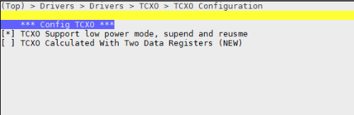

配置宏具体描述如[表1](#table16629938173916)所示。

**表 1**  TCXO相关宏描述

<a name="table16629938173916"></a>
<table><thead align="left"><tr id="row1462913813915"><th class="cellrowborder" valign="top" width="22.62773722627738%" id="mcps1.2.7.1.1"><p id="p1962923853920"><a name="p1962923853920"></a><a name="p1962923853920"></a>宏名称（CONFIG_是默认添加的前缀）</p>
</th>
<th class="cellrowborder" valign="top" width="21.137886211378866%" id="mcps1.2.7.1.2"><p id="p962916388395"><a name="p962916388395"></a><a name="p962916388395"></a>kconfig界面显示的具体描述</p>
</th>
<th class="cellrowborder" valign="top" width="19.878012198780127%" id="mcps1.2.7.1.3"><p id="p18731420115119"><a name="p18731420115119"></a><a name="p18731420115119"></a>使用场景</p>
</th>
<th class="cellrowborder" valign="top" width="10.618938106189384%" id="mcps1.2.7.1.4"><p id="p537485457"><a name="p537485457"></a><a name="p537485457"></a>是否已经实现</p>
</th>
<th class="cellrowborder" valign="top" width="11.338866113388663%" id="mcps1.2.7.1.5"><p id="p1162915382392"><a name="p1162915382392"></a><a name="p1162915382392"></a>是否依赖其他宏</p>
</th>
<th class="cellrowborder" valign="top" width="14.398560143985604%" id="mcps1.2.7.1.6"><p id="p1449914917569"><a name="p1449914917569"></a><a name="p1449914917569"></a>是否选择打开或修改配置</p>
</th>
</tr>
</thead>
<tbody><tr id="row16629338103916"><td class="cellrowborder" valign="top" width="22.62773722627738%" headers="mcps1.2.7.1.1 "><p id="p166291338133910"><a name="p166291338133910"></a><a name="p166291338133910"></a>CONFIG_TCXO_SUPPORT_LPM</p>
</td>
<td class="cellrowborder" valign="top" width="21.137886211378866%" headers="mcps1.2.7.1.2 "><p id="p205561537172212"><a name="p205561537172212"></a><a name="p205561537172212"></a>TCXO support low power mode, supend and reusme.</p>
</td>
<td class="cellrowborder" valign="top" width="19.878012198780127%" headers="mcps1.2.7.1.3 "><p id="p1746412917425"><a name="p1746412917425"></a><a name="p1746412917425"></a>该宏仅用于低功耗情况下使用</p>
</td>
<td class="cellrowborder" valign="top" width="10.618938106189384%" headers="mcps1.2.7.1.4 "><p id="p166297382397"><a name="p166297382397"></a><a name="p166297382397"></a>是</p>
</td>
<td class="cellrowborder" valign="top" width="11.338866113388663%" headers="mcps1.2.7.1.5 "><p id="p162983873917"><a name="p162983873917"></a><a name="p162983873917"></a>否</p>
</td>
<td class="cellrowborder" valign="top" width="14.398560143985604%" headers="mcps1.2.7.1.6 "><p id="p997411916292"><a name="p997411916292"></a><a name="p997411916292"></a>默认打开，视情况选择，建议打开</p>
</td>
</tr>
<tr id="row166299383394"><td class="cellrowborder" valign="top" width="22.62773722627738%" headers="mcps1.2.7.1.1 "><p id="p14629173813920"><a name="p14629173813920"></a><a name="p14629173813920"></a>CONFIG_TCXO_WITH_TWO_DATA_REGS</p>
</td>
<td class="cellrowborder" valign="top" width="21.137886211378866%" headers="mcps1.2.7.1.2 "><p id="p14167949112712"><a name="p14167949112712"></a><a name="p14167949112712"></a>TCXO calculated with two data registers.</p>
</td>
<td class="cellrowborder" valign="top" width="19.878012198780127%" headers="mcps1.2.7.1.3 "><p id="p118818331937"><a name="p118818331937"></a><a name="p118818331937"></a>该宏表示使用两个数据寄存器来计算数据</p>
</td>
<td class="cellrowborder" valign="top" width="10.618938106189384%" headers="mcps1.2.7.1.4 "><p id="p166291838143916"><a name="p166291838143916"></a><a name="p166291838143916"></a>是</p>
</td>
<td class="cellrowborder" valign="top" width="11.338866113388663%" headers="mcps1.2.7.1.5 "><p id="p104251259727"><a name="p104251259727"></a><a name="p104251259727"></a>否</p>
</td>
<td class="cellrowborder" valign="top" width="14.398560143985604%" headers="mcps1.2.7.1.6 "><p id="p165302711299"><a name="p165302711299"></a><a name="p165302711299"></a>默认关闭，建议关闭</p>
</td>
</tr>
</tbody>
</table>

## 开发指引<a name="ZH-CN_TOPIC_0000001665143770"></a>

1.  调用uapi\_tcxo\_init接口，初始化TCXO模块。
2.  调用uapi\_tcxo\_get\_count接口，获取当前TCXO计数值。
3.  调用uapi\_tcxo\_delay\_ms接口，延迟入参传入的时间。

示例：

```
#include "tcxo.h"
void test_tcxo_sample(void)
{
    uint64_t count_before_delay_count;
    uint64_t count_after_delay_count;
    /* tcxo模块初始化 */
    uapi_tcxo_init();
    /* 通过count差值验证延迟时间 */
    count_before_delay_count = uapi_tcxo_get_count();
    uapi_tcxo_delay_ms(1000);
    count_after_delay_count= uapi_tcxo_get_count();
    osal_printk("test case delay count %lu.\r\n", count_before_delay_count - count_after_delay_count);
    return;
}
```

## 注意事项<a name="ZH-CN_TOPIC_0000001713023557"></a>

无。

# Flash<a name="ZH-CN_TOPIC_0000001664983962"></a>


## 概述<a name="ZH-CN_TOPIC_0000001664983978"></a>

Flash是一种非易失快闪记忆体技术，又称为闪存，通常支持SPI协议。Flash可以通过SPI协议实现读、写和擦除等多种命令。

## 功能描述<a name="ZH-CN_TOPIC_0000001664983990"></a>

Flash模块提供的接口及功能如下如下：

-   uapi\_flash\_init（flash\_id\_t id）：初始化Flash（id表示flash id）。
-   uapi\_flash\_deinit（flash\_id\_t id）：去初始化Flash（id表示flash id）。
-   uapi\_flash\_write\_data（flash\_id\_t id, uint32\_t addr, const uint8\_t \*src, uint32\_t length）：写入数据到Flash（id表示flash id，addr表示flash写入地址，src表示数据地址，length表示数据长度）。
-   uapi\_flash\_write\_data\_without\_align（flash\_id\_t id, uint32\_t addr, const uint8\_t \*src, uint32\_t length）：以非对齐地址写入数据到Flash（id表示flash id，addr表示flash写入地址，src表示数据地址，length表示数据长度）。
-   uapi\_flash\_read\_data（flash\_id\_t id, uint32\_t addr, uint8\_t \*dst, uint32\_t length）：从Flash读取数据（id表示flash id，addr表示flash读入地址，dst表示数据地址，length表示数据长度）。
-   uapi\_flash\_read\_data\_without\_align（flash\_id\_t id, uint32\_t addr, uint8\_t \*dst, uint32\_t length）：以非对齐地址从Flash读取数据（id表示flash id，addr表示flash读入地址，dst表示数据地址，length表示数据长度）。
-   uapi\_flash\_chip\_erase（flash\_id\_t id）：擦除整片Flash数据（id表示flash id）。
-   uapi\_flash\_block\_erase（flash\_id\_t id, uint32\_t addr, uint32\_t length, bool is\_wait）：按块擦除Flash数据（id表示flash id，addr表示flash擦除地址，length表示擦除长度，is\_wait表示是否等待擦除完成）。
-   uapi\_flash\_sector\_erase（flash\_id\_t id, uint32\_t addr, bool is\_wait）：按扇区擦除Flash数据（id表示flash id，addr表示flash擦除地址，is\_wait表示是否等待擦除完成）。
-   uapi\_flash\_suspend（flash\_id\_t id）：Flash休眠（id表示flash id）。
-   uapi\_flash\_resume（flash\_id\_t id）：Flash休眠唤醒（id表示flash id）。
-   uapi\_flash\_switch\_to\_deeppower（flash\_id\_t id）：Flash进入掉电模式（id表示flash id）。
-   uapi\_flash\_resume\_from\_deeppower（flash\_id\_t id）：Flash掉电模式唤醒（id表示flash id）。
-   uapi\_flash\_read\_security\_status（flash\_id\_t id, uint8\_t \*read\_data）：读取Flash安全寄存器状态（id表示flash id，read\_data表示读取的数据）。
-   uapi\_flash\_send\_cmd\_exe（flash\_id\_t id, flash\_cmd\_exe\_t \*cmd\_exe）：发送命令到Flash（id表示flash id，cmd\_exe表示flash命令）。
-   uapi\_flash\_get\_info（flash\_id\_t id, flash\_info\_t \*flash\_info）：获取Flash当前信息（id表示flash id，flash\_info表示flash信息）。
-   uapi\_flash\_reset（flash\_id\_t id）：Flash复位（id表示flash id）。
-   uapi\_flash\_is\_processing（flash\_id\_t id）：Flash是否正在工作（id表示flash id）。
-   uapi\_flash\_read\_id（flash\_id\_t id, uint32\_t \*manufacture\_id）：Flash读取制造ID（id表示flash id，manufacture\_id表示flash制造id）。
-   uapi\_flash\_read\_unique\_id\(flash\_id\_t id, uint8\_t \*unique\_id：Flash读取唯一ID（id表示flash id，manufacture\_id表示flash唯一id）。
-   uapi\_flash\_read\_device\_id（flash\_id\_t id, uint16\_t \*device\_id）：Flash读取设备ID（id表示flash id，device\_id表示flash设备id）。
-   uapi\_flash\_read\_status（flash\_id\_t id, uint8\_t \*status）：读Flash状态等待空闲（id表示flash id，status表示flash状态）。
-   uapi\_flash\_save\_manufacture（flash\_id\_t id, uint32\_t manufacture\_id）：保存Flash制造ID（id表示flash id，manufacture\_id表示flash制造id）。
-   uapi\_flash\_set\_spi\_baud（flash\_id\_t id, uint32\_t bus\_clk, uint32\_t freq\_mhz）：设置SPI波特率（id表示flash id，bus\_clk表示总线时钟，freq\_mhz表示SPI的工作时钟频率）。

## KCONFIG配置<a name="ZH-CN_TOPIC_0000001989357845"></a>

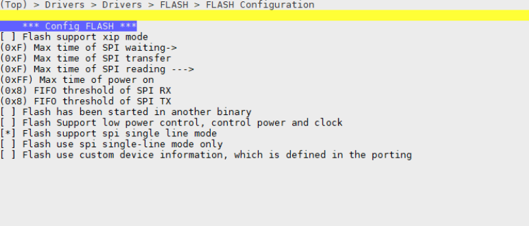

配置宏具体描述如[表1](#table16629938173916)所示。

**表 1**  FLASH相关宏描述

<a name="table16629938173916"></a>
<table><thead align="left"><tr id="row1462913813915"><th class="cellrowborder" valign="top" width="22.62773722627738%" id="mcps1.2.7.1.1"><p id="p1962923853920"><a name="p1962923853920"></a><a name="p1962923853920"></a>宏名称（CONFIG_是默认添加的前缀）</p>
</th>
<th class="cellrowborder" valign="top" width="21.137886211378866%" id="mcps1.2.7.1.2"><p id="p962916388395"><a name="p962916388395"></a><a name="p962916388395"></a>kconfig界面显示的具体描述</p>
</th>
<th class="cellrowborder" valign="top" width="19.878012198780127%" id="mcps1.2.7.1.3"><p id="p18731420115119"><a name="p18731420115119"></a><a name="p18731420115119"></a>使用场景</p>
</th>
<th class="cellrowborder" valign="top" width="10.618938106189384%" id="mcps1.2.7.1.4"><p id="p537485457"><a name="p537485457"></a><a name="p537485457"></a>是否已经实现</p>
</th>
<th class="cellrowborder" valign="top" width="11.338866113388663%" id="mcps1.2.7.1.5"><p id="p1162915382392"><a name="p1162915382392"></a><a name="p1162915382392"></a>是否依赖其他宏</p>
</th>
<th class="cellrowborder" valign="top" width="14.398560143985604%" id="mcps1.2.7.1.6"><p id="p1449914917569"><a name="p1449914917569"></a><a name="p1449914917569"></a>是否选择打开或修改配置</p>
</th>
</tr>
</thead>
<tbody><tr id="row16629338103916"><td class="cellrowborder" valign="top" width="22.62773722627738%" headers="mcps1.2.7.1.1 "><p id="p166291338133910"><a name="p166291338133910"></a><a name="p166291338133910"></a>CONFIG_FLASH_SUPPORT_XIP</p>
</td>
<td class="cellrowborder" valign="top" width="21.137886211378866%" headers="mcps1.2.7.1.2 "><p id="p205561537172212"><a name="p205561537172212"></a><a name="p205561537172212"></a>Flash support xip mode.</p>
</td>
<td class="cellrowborder" valign="top" width="19.878012198780127%" headers="mcps1.2.7.1.3 "><p id="p1746412917425"><a name="p1746412917425"></a><a name="p1746412917425"></a>Flash支持XIP模式，本产品暂未使用</p>
</td>
<td class="cellrowborder" valign="top" width="10.618938106189384%" headers="mcps1.2.7.1.4 "><p id="p166297382397"><a name="p166297382397"></a><a name="p166297382397"></a>是</p>
</td>
<td class="cellrowborder" valign="top" width="11.338866113388663%" headers="mcps1.2.7.1.5 "><p id="p162983873917"><a name="p162983873917"></a><a name="p162983873917"></a>否</p>
</td>
<td class="cellrowborder" valign="top" width="14.398560143985604%" headers="mcps1.2.7.1.6 "><p id="p997411916292"><a name="p997411916292"></a><a name="p997411916292"></a>默认关闭，本产品实际暂不使用，建议关闭</p>
</td>
</tr>
<tr id="row166299383394"><td class="cellrowborder" valign="top" width="22.62773722627738%" headers="mcps1.2.7.1.1 "><p id="p14629173813920"><a name="p14629173813920"></a><a name="p14629173813920"></a>CONFIG_SPI_WAIT_FIFO_LONG_TIMEOUT</p>
</td>
<td class="cellrowborder" valign="top" width="21.137886211378866%" headers="mcps1.2.7.1.2 "><p id="p815093564710"><a name="p815093564710"></a><a name="p815093564710"></a>Max time of SPI waiting.</p>
</td>
<td class="cellrowborder" valign="top" width="19.878012198780127%" headers="mcps1.2.7.1.3 "><p id="p118818331937"><a name="p118818331937"></a><a name="p118818331937"></a>SPI等待最大超时时间</p>
</td>
<td class="cellrowborder" valign="top" width="10.618938106189384%" headers="mcps1.2.7.1.4 "><p id="p166291838143916"><a name="p166291838143916"></a><a name="p166291838143916"></a>是</p>
</td>
<td class="cellrowborder" valign="top" width="11.338866113388663%" headers="mcps1.2.7.1.5 "><p id="p104251259727"><a name="p104251259727"></a><a name="p104251259727"></a>否</p>
</td>
<td class="cellrowborder" valign="top" width="14.398560143985604%" headers="mcps1.2.7.1.6 "><p id="p97001027124119"><a name="p97001027124119"></a><a name="p97001027124119"></a>默认值是0xF，建议不做修改</p>
</td>
</tr>
<tr id="row987405934816"><td class="cellrowborder" valign="top" width="22.62773722627738%" headers="mcps1.2.7.1.1 "><p id="p91931020155011"><a name="p91931020155011"></a><a name="p91931020155011"></a>CONFIG_SPI_TRAN_MAX_TIMEOUT</p>
</td>
<td class="cellrowborder" valign="top" width="21.137886211378866%" headers="mcps1.2.7.1.2 "><p id="p1487519596487"><a name="p1487519596487"></a><a name="p1487519596487"></a>Max time of SPI transfer.</p>
</td>
<td class="cellrowborder" valign="top" width="19.878012198780127%" headers="mcps1.2.7.1.3 "><p id="p1487535944815"><a name="p1487535944815"></a><a name="p1487535944815"></a>SPI传输最大超时时间</p>
</td>
<td class="cellrowborder" valign="top" width="10.618938106189384%" headers="mcps1.2.7.1.4 "><p id="p1169992145119"><a name="p1169992145119"></a><a name="p1169992145119"></a>是</p>
</td>
<td class="cellrowborder" valign="top" width="11.338866113388663%" headers="mcps1.2.7.1.5 "><p id="p13805209155118"><a name="p13805209155118"></a><a name="p13805209155118"></a>否</p>
</td>
<td class="cellrowborder" valign="top" width="14.398560143985604%" headers="mcps1.2.7.1.6 "><p id="p8875145915486"><a name="p8875145915486"></a><a name="p8875145915486"></a>默认值是0xF，建议不做修改</p>
</td>
</tr>
<tr id="row1117187104919"><td class="cellrowborder" valign="top" width="22.62773722627738%" headers="mcps1.2.7.1.1 "><p id="p1758216226512"><a name="p1758216226512"></a><a name="p1758216226512"></a>CONFIG_SPI_WAIT_READ_TIMEOUT</p>
</td>
<td class="cellrowborder" valign="top" width="21.137886211378866%" headers="mcps1.2.7.1.2 "><p id="p411727104913"><a name="p411727104913"></a><a name="p411727104913"></a>Max time of SPI reading.</p>
</td>
<td class="cellrowborder" valign="top" width="19.878012198780127%" headers="mcps1.2.7.1.3 "><p id="p0117277493"><a name="p0117277493"></a><a name="p0117277493"></a>SPI读取数据最大超时时间</p>
</td>
<td class="cellrowborder" valign="top" width="10.618938106189384%" headers="mcps1.2.7.1.4 "><p id="p05781317514"><a name="p05781317514"></a><a name="p05781317514"></a>是</p>
</td>
<td class="cellrowborder" valign="top" width="11.338866113388663%" headers="mcps1.2.7.1.5 "><p id="p14453121114511"><a name="p14453121114511"></a><a name="p14453121114511"></a>否</p>
</td>
<td class="cellrowborder" valign="top" width="14.398560143985604%" headers="mcps1.2.7.1.6 "><p id="p2011714713496"><a name="p2011714713496"></a><a name="p2011714713496"></a>默认值是0xF，建议不做修改</p>
</td>
</tr>
<tr id="row181391113491"><td class="cellrowborder" valign="top" width="22.62773722627738%" headers="mcps1.2.7.1.1 "><p id="p12139141154911"><a name="p12139141154911"></a><a name="p12139141154911"></a>CONFIG_FLASH_POWER_ON_TIMEOUT</p>
</td>
<td class="cellrowborder" valign="top" width="21.137886211378866%" headers="mcps1.2.7.1.2 "><p id="p913911194915"><a name="p913911194915"></a><a name="p913911194915"></a>Max time of power on.</p>
</td>
<td class="cellrowborder" valign="top" width="19.878012198780127%" headers="mcps1.2.7.1.3 "><p id="p181391811124914"><a name="p181391811124914"></a><a name="p181391811124914"></a>Flash上电最大超时时间</p>
</td>
<td class="cellrowborder" valign="top" width="10.618938106189384%" headers="mcps1.2.7.1.4 "><p id="p136210415120"><a name="p136210415120"></a><a name="p136210415120"></a>是</p>
</td>
<td class="cellrowborder" valign="top" width="11.338866113388663%" headers="mcps1.2.7.1.5 "><p id="p12850121016519"><a name="p12850121016519"></a><a name="p12850121016519"></a>否</p>
</td>
<td class="cellrowborder" valign="top" width="14.398560143985604%" headers="mcps1.2.7.1.6 "><p id="p14139311164910"><a name="p14139311164910"></a><a name="p14139311164910"></a>默认值是0xFF，建议不做修改</p>
</td>
</tr>
<tr id="row6148111564916"><td class="cellrowborder" valign="top" width="22.62773722627738%" headers="mcps1.2.7.1.1 "><p id="p10148171515498"><a name="p10148171515498"></a><a name="p10148171515498"></a>CONFIG_SPI_RX_FIFO_THRESHOLD</p>
</td>
<td class="cellrowborder" valign="top" width="21.137886211378866%" headers="mcps1.2.7.1.2 "><p id="p21481815204919"><a name="p21481815204919"></a><a name="p21481815204919"></a>FIFO threshold of SPI RX.</p>
</td>
<td class="cellrowborder" valign="top" width="19.878012198780127%" headers="mcps1.2.7.1.3 "><p id="p6148111554917"><a name="p6148111554917"></a><a name="p6148111554917"></a>SPI RX FIFO水线</p>
</td>
<td class="cellrowborder" valign="top" width="10.618938106189384%" headers="mcps1.2.7.1.4 "><p id="p122759535118"><a name="p122759535118"></a><a name="p122759535118"></a>是</p>
</td>
<td class="cellrowborder" valign="top" width="11.338866113388663%" headers="mcps1.2.7.1.5 "><p id="p153123121515"><a name="p153123121515"></a><a name="p153123121515"></a>否</p>
</td>
<td class="cellrowborder" valign="top" width="14.398560143985604%" headers="mcps1.2.7.1.6 "><p id="p014821513494"><a name="p014821513494"></a><a name="p014821513494"></a>默认值是0x8，建议不做修改</p>
</td>
</tr>
<tr id="row589491834910"><td class="cellrowborder" valign="top" width="22.62773722627738%" headers="mcps1.2.7.1.1 "><p id="p1989471864918"><a name="p1989471864918"></a><a name="p1989471864918"></a>CONFIG_SPI_TX_FIFO_THRESHOLD</p>
</td>
<td class="cellrowborder" valign="top" width="21.137886211378866%" headers="mcps1.2.7.1.2 "><p id="p848384635420"><a name="p848384635420"></a><a name="p848384635420"></a>FIFO threshold of SPI TX.</p>
</td>
<td class="cellrowborder" valign="top" width="19.878012198780127%" headers="mcps1.2.7.1.3 "><p id="p138075213543"><a name="p138075213543"></a><a name="p138075213543"></a>SPI TX FIFO水线</p>
</td>
<td class="cellrowborder" valign="top" width="10.618938106189384%" headers="mcps1.2.7.1.4 "><p id="p49001257515"><a name="p49001257515"></a><a name="p49001257515"></a>是</p>
</td>
<td class="cellrowborder" valign="top" width="11.338866113388663%" headers="mcps1.2.7.1.5 "><p id="p17991141205114"><a name="p17991141205114"></a><a name="p17991141205114"></a>否</p>
</td>
<td class="cellrowborder" valign="top" width="14.398560143985604%" headers="mcps1.2.7.1.6 "><p id="p1889411180497"><a name="p1889411180497"></a><a name="p1889411180497"></a>默认值是0x8，建议不做修改</p>
</td>
</tr>
<tr id="row20484202318497"><td class="cellrowborder" valign="top" width="22.62773722627738%" headers="mcps1.2.7.1.1 "><p id="p11484142344916"><a name="p11484142344916"></a><a name="p11484142344916"></a>CONFIG_FLASH_ALREADY_START</p>
</td>
<td class="cellrowborder" valign="top" width="21.137886211378866%" headers="mcps1.2.7.1.2 "><p id="p2484323184915"><a name="p2484323184915"></a><a name="p2484323184915"></a>Flash has been started in another binary.</p>
</td>
<td class="cellrowborder" valign="top" width="19.878012198780127%" headers="mcps1.2.7.1.3 "><p id="p148472334912"><a name="p148472334912"></a><a name="p148472334912"></a>该宏表示Flash已经开启，无需再重复配置，本产品暂未使用</p>
</td>
<td class="cellrowborder" valign="top" width="10.618938106189384%" headers="mcps1.2.7.1.4 "><p id="p8589186125116"><a name="p8589186125116"></a><a name="p8589186125116"></a>否</p>
</td>
<td class="cellrowborder" valign="top" width="11.338866113388663%" headers="mcps1.2.7.1.5 "><p id="p665020131511"><a name="p665020131511"></a><a name="p665020131511"></a>否</p>
</td>
<td class="cellrowborder" valign="top" width="14.398560143985604%" headers="mcps1.2.7.1.6 "><p id="p154841523134912"><a name="p154841523134912"></a><a name="p154841523134912"></a>默认关闭，本产品实际暂未使用，建议关闭</p>
</td>
</tr>
<tr id="row121856369581"><td class="cellrowborder" valign="top" width="22.62773722627738%" headers="mcps1.2.7.1.1 "><p id="p10185113665819"><a name="p10185113665819"></a><a name="p10185113665819"></a>CONFIG_FLASH_SUPPORT_LPC</p>
</td>
<td class="cellrowborder" valign="top" width="21.137886211378866%" headers="mcps1.2.7.1.2 "><p id="p4185123695818"><a name="p4185123695818"></a><a name="p4185123695818"></a>Flash support low power control, control power and clock.</p>
</td>
<td class="cellrowborder" valign="top" width="19.878012198780127%" headers="mcps1.2.7.1.3 "><p id="p1218643665815"><a name="p1218643665815"></a><a name="p1218643665815"></a>该宏仅用于低功耗情况下使用</p>
</td>
<td class="cellrowborder" valign="top" width="10.618938106189384%" headers="mcps1.2.7.1.4 "><p id="p318683695810"><a name="p318683695810"></a><a name="p318683695810"></a>是</p>
</td>
<td class="cellrowborder" valign="top" width="11.338866113388663%" headers="mcps1.2.7.1.5 "><p id="p1218617361580"><a name="p1218617361580"></a><a name="p1218617361580"></a>否</p>
</td>
<td class="cellrowborder" valign="top" width="14.398560143985604%" headers="mcps1.2.7.1.6 "><p id="p181861436195817"><a name="p181861436195817"></a><a name="p181861436195817"></a>默认关闭，视情况选择，建议关闭</p>
</td>
</tr>
<tr id="row5844174075812"><td class="cellrowborder" valign="top" width="22.62773722627738%" headers="mcps1.2.7.1.1 "><p id="p148441405583"><a name="p148441405583"></a><a name="p148441405583"></a>CONFIG_FLASH_SUPPORT_SPI_SINGLE_LINE_MODE</p>
</td>
<td class="cellrowborder" valign="top" width="21.137886211378866%" headers="mcps1.2.7.1.2 "><p id="p20844114016586"><a name="p20844114016586"></a><a name="p20844114016586"></a>Flash support spi single line mode.</p>
</td>
<td class="cellrowborder" valign="top" width="19.878012198780127%" headers="mcps1.2.7.1.3 "><p id="p118441240205815"><a name="p118441240205815"></a><a name="p118441240205815"></a>Flash支持使用SPI单线模式，本产品暂未使用</p>
</td>
<td class="cellrowborder" valign="top" width="10.618938106189384%" headers="mcps1.2.7.1.4 "><p id="p17844124075819"><a name="p17844124075819"></a><a name="p17844124075819"></a>否</p>
</td>
<td class="cellrowborder" valign="top" width="11.338866113388663%" headers="mcps1.2.7.1.5 "><p id="p15844154025817"><a name="p15844154025817"></a><a name="p15844154025817"></a>否</p>
</td>
<td class="cellrowborder" valign="top" width="14.398560143985604%" headers="mcps1.2.7.1.6 "><p id="p813510551770"><a name="p813510551770"></a><a name="p813510551770"></a>默认打开，本产品实际暂未使用，建议关闭</p>
</td>
</tr>
<tr id="row1185364845816"><td class="cellrowborder" valign="top" width="22.62773722627738%" headers="mcps1.2.7.1.1 "><p id="p285310486584"><a name="p285310486584"></a><a name="p285310486584"></a>CONFIG_FLASH_USE_SPI_SINGLE_LINE_MODE_ONLY</p>
</td>
<td class="cellrowborder" valign="top" width="21.137886211378866%" headers="mcps1.2.7.1.2 "><p id="p1885314895816"><a name="p1885314895816"></a><a name="p1885314895816"></a>Flash use spi single-line mode only.</p>
</td>
<td class="cellrowborder" valign="top" width="19.878012198780127%" headers="mcps1.2.7.1.3 "><p id="p17991333084"><a name="p17991333084"></a><a name="p17991333084"></a>Flash仅支持使用SPI单线模式</p>
</td>
<td class="cellrowborder" valign="top" width="10.618938106189384%" headers="mcps1.2.7.1.4 "><p id="p68531848155815"><a name="p68531848155815"></a><a name="p68531848155815"></a>是</p>
</td>
<td class="cellrowborder" valign="top" width="11.338866113388663%" headers="mcps1.2.7.1.5 "><p id="p14853748185819"><a name="p14853748185819"></a><a name="p14853748185819"></a>否</p>
</td>
<td class="cellrowborder" valign="top" width="14.398560143985604%" headers="mcps1.2.7.1.6 "><p id="p1764293714815"><a name="p1764293714815"></a><a name="p1764293714815"></a>默认关闭，视情况选择</p>
</td>
</tr>
<tr id="row178031753105817"><td class="cellrowborder" valign="top" width="22.62773722627738%" headers="mcps1.2.7.1.1 "><p id="p1780385305811"><a name="p1780385305811"></a><a name="p1780385305811"></a>CONFIG_FLASH_USE_CUSTOMIZED_DEVICE_INFO</p>
</td>
<td class="cellrowborder" valign="top" width="21.137886211378866%" headers="mcps1.2.7.1.2 "><p id="p680385313586"><a name="p680385313586"></a><a name="p680385313586"></a>Flash use custom device information, which is defined in the porting.</p>
</td>
<td class="cellrowborder" valign="top" width="19.878012198780127%" headers="mcps1.2.7.1.3 "><p id="p168037534585"><a name="p168037534585"></a><a name="p168037534585"></a>Flash使用自定义设备信息</p>
</td>
<td class="cellrowborder" valign="top" width="10.618938106189384%" headers="mcps1.2.7.1.4 "><p id="p158036534582"><a name="p158036534582"></a><a name="p158036534582"></a>是</p>
</td>
<td class="cellrowborder" valign="top" width="11.338866113388663%" headers="mcps1.2.7.1.5 "><p id="p1380385355819"><a name="p1380385355819"></a><a name="p1380385355819"></a>否</p>
</td>
<td class="cellrowborder" valign="top" width="14.398560143985604%" headers="mcps1.2.7.1.6 "><p id="p4803253155812"><a name="p4803253155812"></a><a name="p4803253155812"></a>默认关闭，视情况选择</p>
</td>
</tr>
</tbody>
</table>

## 开发指引<a name="ZH-CN_TOPIC_0000001664984022"></a>

外部Flash开发适配需由客户自己选型和适配，部分参考代码见文件：drivers/chips/bs2x/porting/flash/flash\_porting.c和drivers/chips/bs2x/main\_init/main\_init.c

```
/* drivers/chips/bs2x/porting/flash/flash_porting.c */
static flash_cfg_t g_flash_porting_config[FLASH_MAX] = {
    {
        .isinit = 0,
        .flash_manufacturer = FLASH_MANUFACTURER_MAX,
        .unique_id = 0,
        .bus = SPI_BUS_1,
        .mode = HAL_SPI_FRAME_FORMAT_STANDARD,
        .is_xip = false,
        .attr = {
            .is_slave = false,
            .slave_num = 1,
            .bus_clk = SPI_CLK_FREQ,
            .freq_mhz = 4,
            .clk_polarity = (uint32_t)SPI_CFG_CLK_CPOL_0,
            .clk_phase = (uint32_t)SPI_CFG_CLK_CPHA_0,
            .frame_format = SPI_CFG_FRAME_FORMAT_MOTOROLA_SPI,
            .spi_frame_format = (uint32_t)HAL_SPI_FRAME_FORMAT_STANDARD,
            .frame_size = (uint32_t)HAL_SPI_FRAME_SIZE_8,
            .sste = SPI_CFG_SSTE_DISABLE,
        },
        .extra_attr = {
            .tx_use_dma = false,
            .rx_use_dma = false,
            .qspi_param = { 0 },
        },
    },
};

/* drivers/chips/bs2x/main_init/main_init.c */
static void ota_extern_flash_init(void)
{
#if defined(SUPPORT_EXTERN_FLASH)
    flash_porting_pinmux_cfg(0);
    uint32_t manufacture_id = 0;
    uapi_flash_init(0);
    uapi_flash_read_id(0, &manufacture_id);
    flash_save_manufacturer(0, manufacture_id);
#endif
}

```

## 注意事项<a name="ZH-CN_TOPIC_0000001713023545"></a>

-   不支持XIP模式。
-   对Flash进行读写擦操作时，请确保Flash已完成初始化。
-   需客户基于Flash选型自行适配。

# SFC<a name="ZH-CN_TOPIC_0000001664984018"></a>


## 概述<a name="ZH-CN_TOPIC_0000001713023581"></a>

SFC\(SPI Flash Controller\)是一个AHB SPI Flash控制器，可通过对SFC的映射地址区间以AHB Slave访问来操作SFC模块挂载的Flash。其同样支持以APB Slave方式以类似传统SPI的形式访问挂载的Flash。

## 功能描述<a name="ZH-CN_TOPIC_0000001713103573"></a>

-   uapi\_sfc\_init（sfc\_flash\_config\_t \*config）: 初始化SFC模块，配置参数包括对映射地址空间和读写形式的配置（config表示初始化参数）。
-   uapi\_sfc\_init\_rom（sfc\_flash\_config\_t \*config）: 以兼容模式初始化SFC模块，此接口下仅mapping\_addr参数生效，读写形式均以Flash通用的读（0x03）写（0x02）指令进行。在uapi\_sfc\_init返回值为 ERRCODE\_SFC\_FLASH\_NOT\_SUPPORT（0x80001341）时也会套用该配置（config表示初始化参数）。
-   uapi\_sfc\_deinit（void）: 对SFC驱动进行去初始化。
-   uapi\_sfc\_reg\_read（uint32\_t flash\_addr, uint8\_t \*read\_buffer, uint32\_t read\_size）: 提供寄存器模式读功能，读取的数据将按字节存入read\_buffer中。不允许在中断中调用（flash\_addr表示数据所在的Flash首地址，read\_buffer表示用于接收数据的buffer，read\_size表示读取的字节数）。
-   uapi\_sfc\_reg\_write（uint32\_t flash\_addr, uint8\_t \*write\_data, uint32\_t write\_size）: 提供寄存器模式写功能，预计写入的数据按字节存入write\_data中。不允许在中断中调用（flash\_addr表示目标Flash首地址，write\_data表示预计写入的数据，write\_size表示写入数据的字节数）。
-   uapi\_sfc\_reg\_erase（uint32\_t flash\_addr, uint32\_t erase\_size）: 使用寄存器模式进行对Flash的擦除，不使能写回时强制要求地址和大小按扇区对齐。不允许在中断中调用（flash\_addr表示擦除的首地址，erase\_size表示擦除的Flash空间的大小）。
-   uapi\_sfc\_reg\_erase\_chip（void）: 使用寄存器模式对整片Flash进行擦除。不允许在中断中调用。
-   uapi\_sfc\_regs\_other\_flash\_opt（sfc\_flash\_op\_t cmd\_type, uint8\_t cmd, uint8\_t \*buffer, uint32\_t length）: 使用寄存器模式对Flash属性进行读写。不允许在中断中调用（cmd\_type表示设置指令的读写类型，cmd表示SPI指令，buffer表示数据缓冲区，length表示需要读/写的数据长度，其值需要小于4）。
-   uapi\_sfc\_lock\_protect（sfc\_flash\_protect\_region\_t region）: 使能SFC写保护（region表示Flash保护的区域）。（打开CONFIG\_SFC\_SUPPORT\_WRITE\_PROTECT宏才能使用）
-   uapi\_sfc\_unlock\_protect（void）: 封装接口，关闭Flash写保护。（打开CONFIG\_SFC\_SUPPORT\_WRITE\_PROTECT宏才能使用）
-   uapi\_sfc\_dma\_write（uint32\_t flash\_addr, uint8\_t \*write\_buffer, uint32\_t write\_size）：提供寄存器模式写功能，预计写入的数据按字节存入write\_data中。不允许在中断中调用（flash\_addr表示目标Flash首地址，write\_buffer表示预计写入的数据，write\_size表示写入数据的字节数）。（打开CONFIG\_SFC\_SUPPORT\_DMA宏才能使用）
-   uapi\_sfc\_dma\_read（uint32\_t flash\_addr, uint8\_t \*read\_buffer, uint32\_t read\_size）：提供DMA模式读功能，读取的数据将按字节存入read\_buffer中。不允许在中断中调用（flash\_addr表示数据所在的Flash首地址，read\_buffer表示用于接收数据的buffer，read\_size表示读取的字节数）。（打开CONFIG\_SFC\_SUPPORT\_DMA宏才能使用）
-   uapi\_sfc\_suspend（uintptr\_t arg）：挂起SFC模块，低功耗情况使用（arg表示挂起时所需要的参数）。（打开CONFIG\_SFC\_SUPPORT\_LPM宏才能使用）
-   uapi\_sfc\_resume（uintptr\_t arg）：恢复SFC模块，低功耗情况使用（arg表示恢复时所需要的参数）。（打开CONFIG\_SFC\_SUPPORT\_LPM宏才能使用）

## KCONFIG配置<a name="ZH-CN_TOPIC_0000001937055097"></a>

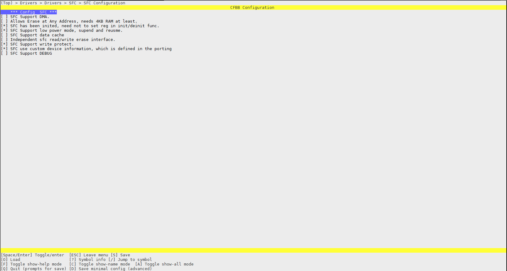

配置宏具体描述如[表1](#table16629938173916)所示。

**表 1**  SFC相关宏描述

<a name="table16629938173916"></a>
<table><thead align="left"><tr id="row1462913813915"><th class="cellrowborder" valign="top" width="22.62773722627737%" id="mcps1.2.7.1.1"><p id="p1962923853920"><a name="p1962923853920"></a><a name="p1962923853920"></a>宏名称（CONFIG_是默认添加的前缀）</p>
</th>
<th class="cellrowborder" valign="top" width="21.10788921107889%" id="mcps1.2.7.1.2"><p id="p962916388395"><a name="p962916388395"></a><a name="p962916388395"></a>kconfig界面显示的具体描述</p>
</th>
<th class="cellrowborder" valign="top" width="19.908009199080094%" id="mcps1.2.7.1.3"><p id="p18731420115119"><a name="p18731420115119"></a><a name="p18731420115119"></a>使用场景</p>
</th>
<th class="cellrowborder" valign="top" width="10.608939106089391%" id="mcps1.2.7.1.4"><p id="p537485457"><a name="p537485457"></a><a name="p537485457"></a>是否已经实现</p>
</th>
<th class="cellrowborder" valign="top" width="11.348865113488651%" id="mcps1.2.7.1.5"><p id="p1162915382392"><a name="p1162915382392"></a><a name="p1162915382392"></a>是否依赖其他宏</p>
</th>
<th class="cellrowborder" valign="top" width="14.3985601439856%" id="mcps1.2.7.1.6"><p id="p1449914917569"><a name="p1449914917569"></a><a name="p1449914917569"></a>是否选择打开或修改配置</p>
</th>
</tr>
</thead>
<tbody><tr id="row16629338103916"><td class="cellrowborder" valign="top" width="22.62773722627737%" headers="mcps1.2.7.1.1 "><p id="p166291338133910"><a name="p166291338133910"></a><a name="p166291338133910"></a>CONFIG_SFC_SUPPORT_DMA</p>
</td>
<td class="cellrowborder" valign="top" width="21.10788921107889%" headers="mcps1.2.7.1.2 "><p id="p205561537172212"><a name="p205561537172212"></a><a name="p205561537172212"></a>SFC support DMA.</p>
</td>
<td class="cellrowborder" valign="top" width="19.908009199080094%" headers="mcps1.2.7.1.3 "><p id="p137814538264"><a name="p137814538264"></a><a name="p137814538264"></a>SFC支持DMA模式，本产品的SFC规格不支持APB_MASTER DMA访问，故在此定义下的uapi_sfc_dma_xxx接口不可用</p>
</td>
<td class="cellrowborder" valign="top" width="10.608939106089391%" headers="mcps1.2.7.1.4 "><p id="p166297382397"><a name="p166297382397"></a><a name="p166297382397"></a>是</p>
</td>
<td class="cellrowborder" valign="top" width="11.348865113488651%" headers="mcps1.2.7.1.5 "><p id="p162983873917"><a name="p162983873917"></a><a name="p162983873917"></a>否</p>
</td>
<td class="cellrowborder" valign="top" width="14.3985601439856%" headers="mcps1.2.7.1.6 "><p id="p779420187284"><a name="p779420187284"></a><a name="p779420187284"></a>默认关闭，本产品实际暂不支持，建议关闭</p>
</td>
</tr>
<tr id="row166299383394"><td class="cellrowborder" valign="top" width="22.62773722627737%" headers="mcps1.2.7.1.1 "><p id="p14629173813920"><a name="p14629173813920"></a><a name="p14629173813920"></a>CONFIG_SFC_ALLOW_ERASE_WRITEBACK</p>
</td>
<td class="cellrowborder" valign="top" width="21.10788921107889%" headers="mcps1.2.7.1.2 "><p id="p89961436254"><a name="p89961436254"></a><a name="p89961436254"></a>Allows Erase at Any Address, needs 4KB RAM at least.</p>
</td>
<td class="cellrowborder" valign="top" width="19.908009199080094%" headers="mcps1.2.7.1.3 "><p id="p1850314917285"><a name="p1850314917285"></a><a name="p1850314917285"></a>擦除接口内部自动回写，需要8K的DTCM空间充当全局变量，本产品的规格不建议开启</p>
</td>
<td class="cellrowborder" valign="top" width="10.608939106089391%" headers="mcps1.2.7.1.4 "><p id="p166291838143916"><a name="p166291838143916"></a><a name="p166291838143916"></a>是</p>
</td>
<td class="cellrowborder" valign="top" width="11.348865113488651%" headers="mcps1.2.7.1.5 "><p id="p104251259727"><a name="p104251259727"></a><a name="p104251259727"></a>否</p>
</td>
<td class="cellrowborder" valign="top" width="14.3985601439856%" headers="mcps1.2.7.1.6 "><p id="p165302711299"><a name="p165302711299"></a><a name="p165302711299"></a>默认关闭，视情况选择，建议关闭</p>
</td>
</tr>
<tr id="row4358183692215"><td class="cellrowborder" valign="top" width="22.62773722627737%" headers="mcps1.2.7.1.1 "><p id="p335883682215"><a name="p335883682215"></a><a name="p335883682215"></a>CONFIG_SFC_ALREADY_INIT</p>
</td>
<td class="cellrowborder" valign="top" width="21.10788921107889%" headers="mcps1.2.7.1.2 "><p id="p163581036122213"><a name="p163581036122213"></a><a name="p163581036122213"></a>SFC has been inited, need not to set reg in init/deinit func.</p>
</td>
<td class="cellrowborder" valign="top" width="19.908009199080094%" headers="mcps1.2.7.1.3 "><p id="p10358153642219"><a name="p10358153642219"></a><a name="p10358153642219"></a>该宏代表SFC已经初始化，不做重复操作</p>
</td>
<td class="cellrowborder" valign="top" width="10.608939106089391%" headers="mcps1.2.7.1.4 "><p id="p21931525112314"><a name="p21931525112314"></a><a name="p21931525112314"></a>是</p>
</td>
<td class="cellrowborder" valign="top" width="11.348865113488651%" headers="mcps1.2.7.1.5 "><p id="p793553232311"><a name="p793553232311"></a><a name="p793553232311"></a>否</p>
</td>
<td class="cellrowborder" valign="top" width="14.3985601439856%" headers="mcps1.2.7.1.6 "><p id="p10354145515340"><a name="p10354145515340"></a><a name="p10354145515340"></a>默认打开，视情况选择，建议打开</p>
</td>
</tr>
<tr id="row20546154010224"><td class="cellrowborder" valign="top" width="22.62773722627737%" headers="mcps1.2.7.1.1 "><p id="p1154619402221"><a name="p1154619402221"></a><a name="p1154619402221"></a>CONFIG_SFC_SUPPORT_LPM</p>
</td>
<td class="cellrowborder" valign="top" width="21.10788921107889%" headers="mcps1.2.7.1.2 "><p id="p15461140192213"><a name="p15461140192213"></a><a name="p15461140192213"></a>SFC support low power mode, supend and reusme.</p>
</td>
<td class="cellrowborder" valign="top" width="19.908009199080094%" headers="mcps1.2.7.1.3 "><p id="p1746412917425"><a name="p1746412917425"></a><a name="p1746412917425"></a>该宏仅用于低功耗情况下使用，支持SFC低功耗现场保存恢复，SDK内部低功耗流程默认已经实现，调试低功耗请务必打开此配置项</p>
</td>
<td class="cellrowborder" valign="top" width="10.608939106089391%" headers="mcps1.2.7.1.4 "><p id="p14823162552316"><a name="p14823162552316"></a><a name="p14823162552316"></a>是</p>
</td>
<td class="cellrowborder" valign="top" width="11.348865113488651%" headers="mcps1.2.7.1.5 "><p id="p18809333172314"><a name="p18809333172314"></a><a name="p18809333172314"></a>否</p>
</td>
<td class="cellrowborder" valign="top" width="14.3985601439856%" headers="mcps1.2.7.1.6 "><p id="p997411916292"><a name="p997411916292"></a><a name="p997411916292"></a>默认打开，视情况选择，建议打开</p>
</td>
</tr>
<tr id="row13118124518221"><td class="cellrowborder" valign="top" width="22.62773722627737%" headers="mcps1.2.7.1.1 "><p id="p1611815458228"><a name="p1611815458228"></a><a name="p1611815458228"></a>CONFIG_SFC_SUPPORT_DATA_CACHE</p>
</td>
<td class="cellrowborder" valign="top" width="21.10788921107889%" headers="mcps1.2.7.1.2 "><p id="p6118104510227"><a name="p6118104510227"></a><a name="p6118104510227"></a>SFC support data cache.</p>
</td>
<td class="cellrowborder" valign="top" width="19.908009199080094%" headers="mcps1.2.7.1.3 "><p id="p8118194510229"><a name="p8118194510229"></a><a name="p8118194510229"></a>SFC支持数据缓存</p>
</td>
<td class="cellrowborder" valign="top" width="10.608939106089391%" headers="mcps1.2.7.1.4 "><p id="p86954265232"><a name="p86954265232"></a><a name="p86954265232"></a>是</p>
</td>
<td class="cellrowborder" valign="top" width="11.348865113488651%" headers="mcps1.2.7.1.5 "><p id="p16327183415238"><a name="p16327183415238"></a><a name="p16327183415238"></a>否</p>
</td>
<td class="cellrowborder" valign="top" width="14.3985601439856%" headers="mcps1.2.7.1.6 "><p id="p654061114350"><a name="p654061114350"></a><a name="p654061114350"></a>默认关闭，视情况选择，建议关闭</p>
</td>
</tr>
<tr id="row18158164922218"><td class="cellrowborder" valign="top" width="22.62773722627737%" headers="mcps1.2.7.1.1 "><p id="p6158204918223"><a name="p6158204918223"></a><a name="p6158204918223"></a>CONFIG_SFC_SUPPORT_RWE_INDEPENDENT</p>
</td>
<td class="cellrowborder" valign="top" width="21.10788921107889%" headers="mcps1.2.7.1.2 "><p id="p121581549192215"><a name="p121581549192215"></a><a name="p121581549192215"></a>Independent sfc read/write erase interface.</p>
</td>
<td class="cellrowborder" valign="top" width="19.908009199080094%" headers="mcps1.2.7.1.3 "><p id="p31586493228"><a name="p31586493228"></a><a name="p31586493228"></a>支持独立的sfc读/写擦除接口</p>
</td>
<td class="cellrowborder" valign="top" width="10.608939106089391%" headers="mcps1.2.7.1.4 "><p id="p19395727182320"><a name="p19395727182320"></a><a name="p19395727182320"></a>是</p>
</td>
<td class="cellrowborder" valign="top" width="11.348865113488651%" headers="mcps1.2.7.1.5 "><p id="p89401234132319"><a name="p89401234132319"></a><a name="p89401234132319"></a>否</p>
</td>
<td class="cellrowborder" valign="top" width="14.3985601439856%" headers="mcps1.2.7.1.6 "><p id="p0133759123611"><a name="p0133759123611"></a><a name="p0133759123611"></a>默认关闭，视情况选择，建议关闭</p>
</td>
</tr>
<tr id="row1312817533227"><td class="cellrowborder" valign="top" width="22.62773722627737%" headers="mcps1.2.7.1.1 "><p id="p61281653122210"><a name="p61281653122210"></a><a name="p61281653122210"></a>CONFIG_SFC_SUPPORT_WRITE_PROTECT</p>
</td>
<td class="cellrowborder" valign="top" width="21.10788921107889%" headers="mcps1.2.7.1.2 "><p id="p1128135382214"><a name="p1128135382214"></a><a name="p1128135382214"></a>SFC support write protect.</p>
</td>
<td class="cellrowborder" valign="top" width="19.908009199080094%" headers="mcps1.2.7.1.3 "><p id="p15128135342214"><a name="p15128135342214"></a><a name="p15128135342214"></a>开启SDK内部封装的写保护接口</p>
</td>
<td class="cellrowborder" valign="top" width="10.608939106089391%" headers="mcps1.2.7.1.4 "><p id="p15153528142319"><a name="p15153528142319"></a><a name="p15153528142319"></a>是</p>
</td>
<td class="cellrowborder" valign="top" width="11.348865113488651%" headers="mcps1.2.7.1.5 "><p id="p151321236132315"><a name="p151321236132315"></a><a name="p151321236132315"></a>否</p>
</td>
<td class="cellrowborder" valign="top" width="14.3985601439856%" headers="mcps1.2.7.1.6 "><p id="p91282053102219"><a name="p91282053102219"></a><a name="p91282053102219"></a>默认打开，视情况选择，建议打开</p>
</td>
</tr>
<tr id="row101239583227"><td class="cellrowborder" valign="top" width="22.62773722627737%" headers="mcps1.2.7.1.1 "><p id="p512315872212"><a name="p512315872212"></a><a name="p512315872212"></a>CONFIG_SFC_USE_CUSTOMIZED_DEVICE_INFO</p>
</td>
<td class="cellrowborder" valign="top" width="21.10788921107889%" headers="mcps1.2.7.1.2 "><p id="p1312305815225"><a name="p1312305815225"></a><a name="p1312305815225"></a>SFC use custom device information, which is defined in the porting.</p>
</td>
<td class="cellrowborder" valign="top" width="19.908009199080094%" headers="mcps1.2.7.1.3 "><p id="p01231658102213"><a name="p01231658102213"></a><a name="p01231658102213"></a>打开即使用porting层进行适配的自定义配置组，关闭该宏则使用SDK内部include/driver/sfc/sfc_config_info.h中默认适配的配置项。合封Flash已于SDK中自定义配置组中适配，打开该宏即可</p>
</td>
<td class="cellrowborder" valign="top" width="10.608939106089391%" headers="mcps1.2.7.1.4 "><p id="p59541285235"><a name="p59541285235"></a><a name="p59541285235"></a>是</p>
</td>
<td class="cellrowborder" valign="top" width="11.348865113488651%" headers="mcps1.2.7.1.5 "><p id="p3945736192320"><a name="p3945736192320"></a><a name="p3945736192320"></a>否</p>
</td>
<td class="cellrowborder" valign="top" width="14.3985601439856%" headers="mcps1.2.7.1.6 "><p id="p15123115817224"><a name="p15123115817224"></a><a name="p15123115817224"></a>默认打开，视情况选择，建议打开</p>
</td>
</tr>
<tr id="row7231614315"><td class="cellrowborder" valign="top" width="22.62773722627737%" headers="mcps1.2.7.1.1 "><p id="p11230115315"><a name="p11230115315"></a><a name="p11230115315"></a>CONFIG_SFC_DEBUG</p>
</td>
<td class="cellrowborder" valign="top" width="21.10788921107889%" headers="mcps1.2.7.1.2 "><p id="p8235113317"><a name="p8235113317"></a><a name="p8235113317"></a>SFC support DEBUG.</p>
</td>
<td class="cellrowborder" valign="top" width="19.908009199080094%" headers="mcps1.2.7.1.3 "><p id="p12341103118"><a name="p12341103118"></a><a name="p12341103118"></a>SFC支持debug调试</p>
</td>
<td class="cellrowborder" valign="top" width="10.608939106089391%" headers="mcps1.2.7.1.4 "><p id="p18235119318"><a name="p18235119318"></a><a name="p18235119318"></a>是</p>
</td>
<td class="cellrowborder" valign="top" width="11.348865113488651%" headers="mcps1.2.7.1.5 "><p id="p12311111312"><a name="p12311111312"></a><a name="p12311111312"></a>否</p>
</td>
<td class="cellrowborder" valign="top" width="14.3985601439856%" headers="mcps1.2.7.1.6 "><p id="p1762719286324"><a name="p1762719286324"></a><a name="p1762719286324"></a>默认关闭，视情况选择，建议关闭</p>
</td>
</tr>
</tbody>
</table>

-   SFC\_SUPPORT\_DMA：SFC规格不支持APB\_MASTER DMA访问，故在此定义下的uapi\_sfc\_dma\_xxx接口不可用。
-   SFC\_ALLOW\_ERASE\_WRITEBACK：擦除接口内部自动回写，需要8K的DTCM空间充当全局变量，本产品的规格不建议开启。
-   SFC\_SUPPORT\_LPM：支持SFC低功耗现场保存恢复，SDK内部低功耗流程默认已经实现，调试低功耗请务必打开此配置项。
-   SFC\_SUPPORT\_WRITE\_PROTECT：开启SDK内部封装的写保护接口。
-   SFC\_USE\_CUSTOMIZED\_DEVICE\_INFO：打开即使用porting层进行适配的自定义配置组，关闭该宏则使用SDK内部include/driver/sfc/sfc\_config\_info.h中默认适配的配置项。合封Flash已于SDK中自定义配置组中适配，打开该宏即可。

## 开发指引<a name="ZH-CN_TOPIC_0000001713103541"></a>

SDK默认会对SFC驱动进行初始化，使用APB Slave接口时无需初始化，示例代码如下：

```
#include "soc_osal.h"
#include "securec.h"
#include "sfc.h"
#include "sfc_porting.h"
#include "app_init.h"
#include "memory_config_common.h"

#define SFC_TASK_PRIO                   24
#define SFC_TASK_STACK_SIZE             0x1000
#define SFC_SAMPLE_LEN                  0x80000
#define SFC_PRINT_BUFF_LEN              32
uint8_t g_print_data_buff[SFC_PRINT_BUFF_LEN] = {0};
uint8_t g_write_data_buff[SFC_PRINT_BUFF_LEN] = {0};

static void sfc_sample_start_api_test(void)
{
    osal_printk("API test start\r\n");
    uint32_t remained_len = CONFIG_SFC_SAMPLE_USER_SIZE;
    uint32_t start_addr = CONFIG_SFC_SAMPLE_USER_ADDR;
    while (remained_len > 0) {
        uint32_t cur_len = remained_len > SFC_PRINT_BUFF_LEN ? SFC_PRINT_BUFF_LEN : remained_len;
        uapi_sfc_reg_read(start_addr, g_print_data_buff, cur_len);
        for (uint8_t i = 0; i < cur_len; i++) {
            osal_printk("%02x ", g_print_data_buff[i]);
        }
        uapi_sfc_reg_write(start_addr, g_write_data_buff, cur_len);
        start_addr += cur_len;
        remained_len -= cur_len;
        osal_printk("\r\n");
    }
    start_addr = CONFIG_SFC_SAMPLE_USER_ADDR;
    remained_len = CONFIG_SFC_SAMPLE_USER_SIZE;
    while (remained_len > 0) {
        uint32_t cur_len = remained_len > SFC_PRINT_BUFF_LEN ? SFC_PRINT_BUFF_LEN : remained_len;
        uapi_sfc_reg_read(start_addr, g_print_data_buff, cur_len);
        for (uint8_t i = 0; i < cur_len; i++) {
            osal_printk("%02x ", g_print_data_buff[i]);
        }
        start_addr += cur_len;
        remained_len -= cur_len;
        osal_printk("\r\n");
    }
}

static void *sfc_task(const char *arg)
{
    unused(arg);
    for (uint8_t i = 0; i < SFC_PRINT_BUFF_LEN; i++) {
        g_write_data_buff[i] = i;
    }
    /* Erase User space */
    osal_printk("Erasing for API sample...\r\n");
    errcode_t ret = uapi_sfc_reg_erase(CONFIG_SFC_SAMPLE_USER_ADDR, CONFIG_SFC_SAMPLE_USER_SIZE);
    if (ret != ERRCODE_SUCC) {
        osal_printk("flash erase failed! ret = %x\r\n", ret);
        return NULL;
    }
    osal_printk("Start API read sample...\r\n");
    sfc_sample_start_api_test();
    return NULL;
}

static void sfc_entry(void)
{
    osal_task *task_handle = NULL;
    osal_kthread_lock();
    task_handle = osal_kthread_create((osal_kthread_handler)sfc_task, 0, "SFCTask", SFC_TASK_STACK_SIZE);
    if (task_handle != NULL) {
        osal_kthread_set_priority(task_handle, SFC_TASK_PRIO);
        osal_kfree(task_handle);
    }
    osal_kthread_unlock();
}

```

## 注意事项<a name="ZH-CN_TOPIC_0000001665143742"></a>

-   SFC相关的代码请务必放在ITCM上，本产品的SFC驱动是保持XIP执行链路的唯一手段。
-   XIP执行时，取指性能将降低10\~60倍\(取决于Flash性能及老化程度\)，故有性能要求的驱动务必不要放到Flash上使用XIP执行。
-   驱动提供的uapi形式的APB slave接口，传入的地址为Flash真实地址而非映射地址。
-   根据芯片限制，严禁使用直接访问映射地址的形式写合封Flash。

# QDEC<a name="ZH-CN_TOPIC_0000001665143694"></a>


## 概述<a name="ZH-CN_TOPIC_0000001713103549"></a>

QDEC（Quadrature Decoder）为正交编码器，提供正交编码传感器信号的缓冲解码。编码器内有2个监测点，相位相差90°，这意味着一个监测点的电平总是在另一个监测点之前改变。滚轮拨动一格，2个监测点将分别检测到一个脉冲。当正交编码器启动时，解码器对两种输入波形进行连续采样，并将当前采样\(n\)与前一采样\(n-1\)进行比较解码，比较结果如[表1](#table1934195705217)所示。

**表 1**  QDEC输入波形采样结果对比

<a name="table1934195705217"></a>
<table><thead align="left"><tr id="row15277582522"><th class="cellrowborder" colspan="2" valign="top" id="mcps1.2.9.1.1"><p id="p1827155818529"><a name="p1827155818529"></a><a name="p1827155818529"></a><span>前一采样</span>（n-1）</p>
</th>
<th class="cellrowborder" colspan="2" valign="top" id="mcps1.2.9.1.2"><p id="p9273585528"><a name="p9273585528"></a><a name="p9273585528"></a><span>当前采样</span>（n）</p>
</th>
<th class="cellrowborder" valign="top" id="mcps1.2.9.1.3"><p id="p127105811525"><a name="p127105811525"></a><a name="p127105811525"></a>采样寄存器</p>
</th>
<th class="cellrowborder" valign="top" id="mcps1.2.9.1.4"><p id="p52795816528"><a name="p52795816528"></a><a name="p52795816528"></a>累加寄存器</p>
</th>
<th class="cellrowborder" valign="top" id="mcps1.2.9.1.5"><p id="p52705812522"><a name="p52705812522"></a><a name="p52705812522"></a>双滚寄存器</p>
</th>
<th class="cellrowborder" valign="top" id="mcps1.2.9.1.6"><p id="p7279581526"><a name="p7279581526"></a><a name="p7279581526"></a>描述</p>
</th>
</tr>
</thead>
<tbody><tr id="row927135855218"><td class="cellrowborder" valign="top" width="9.509049095090493%" headers="mcps1.2.9.1.1 "><p id="p927135805219"><a name="p927135805219"></a><a name="p927135805219"></a>A</p>
</td>
<td class="cellrowborder" valign="top" width="9.509049095090493%" headers="mcps1.2.9.1.1 "><p id="p227155815219"><a name="p227155815219"></a><a name="p227155815219"></a>B</p>
</td>
<td class="cellrowborder" valign="top" width="8.589141085891413%" headers="mcps1.2.9.1.2 "><p id="p1927175845216"><a name="p1927175845216"></a><a name="p1927175845216"></a>A</p>
</td>
<td class="cellrowborder" valign="top" width="8.589141085891413%" headers="mcps1.2.9.1.2 "><p id="p928185811527"><a name="p928185811527"></a><a name="p928185811527"></a>B</p>
</td>
<td class="cellrowborder" valign="top" width="14.258574142585745%" headers="mcps1.2.9.1.3 "><p id="p32835815521"><a name="p32835815521"></a><a name="p32835815521"></a>-</p>
</td>
<td class="cellrowborder" valign="top" width="11.518848115188483%" headers="mcps1.2.9.1.4 "><p id="p152895835214"><a name="p152895835214"></a><a name="p152895835214"></a>-</p>
</td>
<td class="cellrowborder" valign="top" width="15.538446155384467%" headers="mcps1.2.9.1.5 "><p id="p42895865217"><a name="p42895865217"></a><a name="p42895865217"></a>-</p>
</td>
<td class="cellrowborder" valign="top" width="22.487751224877517%" headers="mcps1.2.9.1.6 "><p id="p1228195811529"><a name="p1228195811529"></a><a name="p1228195811529"></a>-</p>
</td>
</tr>
<tr id="row72825895215"><td class="cellrowborder" valign="top" width="9.509049095090493%" headers="mcps1.2.9.1.1 "><p id="p728205816522"><a name="p728205816522"></a><a name="p728205816522"></a>0</p>
</td>
<td class="cellrowborder" valign="top" width="9.509049095090493%" headers="mcps1.2.9.1.1 "><p id="p1128115817522"><a name="p1128115817522"></a><a name="p1128115817522"></a>0</p>
</td>
<td class="cellrowborder" valign="top" width="8.589141085891413%" headers="mcps1.2.9.1.2 "><p id="p172818587520"><a name="p172818587520"></a><a name="p172818587520"></a>0</p>
</td>
<td class="cellrowborder" valign="top" width="8.589141085891413%" headers="mcps1.2.9.1.2 "><p id="p9286581525"><a name="p9286581525"></a><a name="p9286581525"></a>0</p>
</td>
<td class="cellrowborder" valign="top" width="14.258574142585745%" headers="mcps1.2.9.1.3 "><p id="p182815813522"><a name="p182815813522"></a><a name="p182815813522"></a>0</p>
</td>
<td class="cellrowborder" valign="top" width="11.518848115188483%" headers="mcps1.2.9.1.4 "><p id="p82825825217"><a name="p82825825217"></a><a name="p82825825217"></a>No change</p>
</td>
<td class="cellrowborder" valign="top" width="15.538446155384467%" headers="mcps1.2.9.1.5 "><p id="p102815835214"><a name="p102815835214"></a><a name="p102815835214"></a>No change</p>
</td>
<td class="cellrowborder" valign="top" width="22.487751224877517%" headers="mcps1.2.9.1.6 "><p id="p1228558145216"><a name="p1228558145216"></a><a name="p1228558145216"></a>No movement</p>
</td>
</tr>
<tr id="row172845865213"><td class="cellrowborder" valign="top" width="9.509049095090493%" headers="mcps1.2.9.1.1 "><p id="p192813586522"><a name="p192813586522"></a><a name="p192813586522"></a>0</p>
</td>
<td class="cellrowborder" valign="top" width="9.509049095090493%" headers="mcps1.2.9.1.1 "><p id="p228105865215"><a name="p228105865215"></a><a name="p228105865215"></a>0</p>
</td>
<td class="cellrowborder" valign="top" width="8.589141085891413%" headers="mcps1.2.9.1.2 "><p id="p12281158155220"><a name="p12281158155220"></a><a name="p12281158155220"></a>0</p>
</td>
<td class="cellrowborder" valign="top" width="8.589141085891413%" headers="mcps1.2.9.1.2 "><p id="p1028115855219"><a name="p1028115855219"></a><a name="p1028115855219"></a>1</p>
</td>
<td class="cellrowborder" valign="top" width="14.258574142585745%" headers="mcps1.2.9.1.3 "><p id="p9283586528"><a name="p9283586528"></a><a name="p9283586528"></a>1</p>
</td>
<td class="cellrowborder" valign="top" width="11.518848115188483%" headers="mcps1.2.9.1.4 "><p id="p19289586525"><a name="p19289586525"></a><a name="p19289586525"></a>Increment</p>
</td>
<td class="cellrowborder" valign="top" width="15.538446155384467%" headers="mcps1.2.9.1.5 "><p id="p52895811523"><a name="p52895811523"></a><a name="p52895811523"></a>No change</p>
</td>
<td class="cellrowborder" valign="top" width="22.487751224877517%" headers="mcps1.2.9.1.6 "><p id="p2281958175214"><a name="p2281958175214"></a><a name="p2281958175214"></a>Movement in positive direction</p>
</td>
</tr>
<tr id="row3288587526"><td class="cellrowborder" valign="top" width="9.509049095090493%" headers="mcps1.2.9.1.1 "><p id="p2028758165213"><a name="p2028758165213"></a><a name="p2028758165213"></a>0</p>
</td>
<td class="cellrowborder" valign="top" width="9.509049095090493%" headers="mcps1.2.9.1.1 "><p id="p228205895212"><a name="p228205895212"></a><a name="p228205895212"></a>0</p>
</td>
<td class="cellrowborder" valign="top" width="8.589141085891413%" headers="mcps1.2.9.1.2 "><p id="p1228135812523"><a name="p1228135812523"></a><a name="p1228135812523"></a>1</p>
</td>
<td class="cellrowborder" valign="top" width="8.589141085891413%" headers="mcps1.2.9.1.2 "><p id="p1428158145217"><a name="p1428158145217"></a><a name="p1428158145217"></a>0</p>
</td>
<td class="cellrowborder" valign="top" width="14.258574142585745%" headers="mcps1.2.9.1.3 "><p id="p42815813529"><a name="p42815813529"></a><a name="p42815813529"></a>-1</p>
</td>
<td class="cellrowborder" valign="top" width="11.518848115188483%" headers="mcps1.2.9.1.4 "><p id="p228195813524"><a name="p228195813524"></a><a name="p228195813524"></a>Decrement</p>
</td>
<td class="cellrowborder" valign="top" width="15.538446155384467%" headers="mcps1.2.9.1.5 "><p id="p02885814521"><a name="p02885814521"></a><a name="p02885814521"></a>No change</p>
</td>
<td class="cellrowborder" valign="top" width="22.487751224877517%" headers="mcps1.2.9.1.6 "><p id="p112810584524"><a name="p112810584524"></a><a name="p112810584524"></a>Movement in negative direction</p>
</td>
</tr>
<tr id="row11289586526"><td class="cellrowborder" valign="top" width="9.509049095090493%" headers="mcps1.2.9.1.1 "><p id="p1828658125212"><a name="p1828658125212"></a><a name="p1828658125212"></a>0</p>
</td>
<td class="cellrowborder" valign="top" width="9.509049095090493%" headers="mcps1.2.9.1.1 "><p id="p1628115865218"><a name="p1628115865218"></a><a name="p1628115865218"></a>0</p>
</td>
<td class="cellrowborder" valign="top" width="8.589141085891413%" headers="mcps1.2.9.1.2 "><p id="p192845865218"><a name="p192845865218"></a><a name="p192845865218"></a>1</p>
</td>
<td class="cellrowborder" valign="top" width="8.589141085891413%" headers="mcps1.2.9.1.2 "><p id="p228165816529"><a name="p228165816529"></a><a name="p228165816529"></a>1</p>
</td>
<td class="cellrowborder" valign="top" width="14.258574142585745%" headers="mcps1.2.9.1.3 "><p id="p82895812526"><a name="p82895812526"></a><a name="p82895812526"></a>2</p>
</td>
<td class="cellrowborder" valign="top" width="11.518848115188483%" headers="mcps1.2.9.1.4 "><p id="p19283584525"><a name="p19283584525"></a><a name="p19283584525"></a>No change</p>
</td>
<td class="cellrowborder" valign="top" width="15.538446155384467%" headers="mcps1.2.9.1.5 "><p id="p92819589527"><a name="p92819589527"></a><a name="p92819589527"></a>Increment</p>
</td>
<td class="cellrowborder" valign="top" width="22.487751224877517%" headers="mcps1.2.9.1.6 "><p id="p1429155819522"><a name="p1429155819522"></a><a name="p1429155819522"></a>Error: Double transition</p>
</td>
</tr>
<tr id="row12925817524"><td class="cellrowborder" valign="top" width="9.509049095090493%" headers="mcps1.2.9.1.1 "><p id="p192945865212"><a name="p192945865212"></a><a name="p192945865212"></a>0</p>
</td>
<td class="cellrowborder" valign="top" width="9.509049095090493%" headers="mcps1.2.9.1.1 "><p id="p62985811525"><a name="p62985811525"></a><a name="p62985811525"></a>1</p>
</td>
<td class="cellrowborder" valign="top" width="8.589141085891413%" headers="mcps1.2.9.1.2 "><p id="p18295587527"><a name="p18295587527"></a><a name="p18295587527"></a>0</p>
</td>
<td class="cellrowborder" valign="top" width="8.589141085891413%" headers="mcps1.2.9.1.2 "><p id="p929165885217"><a name="p929165885217"></a><a name="p929165885217"></a>0</p>
</td>
<td class="cellrowborder" valign="top" width="14.258574142585745%" headers="mcps1.2.9.1.3 "><p id="p20291858125217"><a name="p20291858125217"></a><a name="p20291858125217"></a>-1</p>
</td>
<td class="cellrowborder" valign="top" width="11.518848115188483%" headers="mcps1.2.9.1.4 "><p id="p429958125214"><a name="p429958125214"></a><a name="p429958125214"></a>Decrement</p>
</td>
<td class="cellrowborder" valign="top" width="15.538446155384467%" headers="mcps1.2.9.1.5 "><p id="p1529125845216"><a name="p1529125845216"></a><a name="p1529125845216"></a>No change</p>
</td>
<td class="cellrowborder" valign="top" width="22.487751224877517%" headers="mcps1.2.9.1.6 "><p id="p4291458175211"><a name="p4291458175211"></a><a name="p4291458175211"></a>Movement in negative direction</p>
</td>
</tr>
<tr id="row1929185855217"><td class="cellrowborder" valign="top" width="9.509049095090493%" headers="mcps1.2.9.1.1 "><p id="p15291458145214"><a name="p15291458145214"></a><a name="p15291458145214"></a>0</p>
</td>
<td class="cellrowborder" valign="top" width="9.509049095090493%" headers="mcps1.2.9.1.1 "><p id="p182985814526"><a name="p182985814526"></a><a name="p182985814526"></a>1</p>
</td>
<td class="cellrowborder" valign="top" width="8.589141085891413%" headers="mcps1.2.9.1.2 "><p id="p1329165875213"><a name="p1329165875213"></a><a name="p1329165875213"></a>0</p>
</td>
<td class="cellrowborder" valign="top" width="8.589141085891413%" headers="mcps1.2.9.1.2 "><p id="p9292583529"><a name="p9292583529"></a><a name="p9292583529"></a>1</p>
</td>
<td class="cellrowborder" valign="top" width="14.258574142585745%" headers="mcps1.2.9.1.3 "><p id="p1029958145217"><a name="p1029958145217"></a><a name="p1029958145217"></a>0</p>
</td>
<td class="cellrowborder" valign="top" width="11.518848115188483%" headers="mcps1.2.9.1.4 "><p id="p132925819528"><a name="p132925819528"></a><a name="p132925819528"></a>No change</p>
</td>
<td class="cellrowborder" valign="top" width="15.538446155384467%" headers="mcps1.2.9.1.5 "><p id="p1829258115219"><a name="p1829258115219"></a><a name="p1829258115219"></a>No change</p>
</td>
<td class="cellrowborder" valign="top" width="22.487751224877517%" headers="mcps1.2.9.1.6 "><p id="p16295582525"><a name="p16295582525"></a><a name="p16295582525"></a>No movement</p>
</td>
</tr>
<tr id="row1829145875219"><td class="cellrowborder" valign="top" width="9.509049095090493%" headers="mcps1.2.9.1.1 "><p id="p15295587529"><a name="p15295587529"></a><a name="p15295587529"></a>0</p>
</td>
<td class="cellrowborder" valign="top" width="9.509049095090493%" headers="mcps1.2.9.1.1 "><p id="p1429195855217"><a name="p1429195855217"></a><a name="p1429195855217"></a>1</p>
</td>
<td class="cellrowborder" valign="top" width="8.589141085891413%" headers="mcps1.2.9.1.2 "><p id="p132917586521"><a name="p132917586521"></a><a name="p132917586521"></a>1</p>
</td>
<td class="cellrowborder" valign="top" width="8.589141085891413%" headers="mcps1.2.9.1.2 "><p id="p1829175885220"><a name="p1829175885220"></a><a name="p1829175885220"></a>0</p>
</td>
<td class="cellrowborder" valign="top" width="14.258574142585745%" headers="mcps1.2.9.1.3 "><p id="p1529155817529"><a name="p1529155817529"></a><a name="p1529155817529"></a>2</p>
</td>
<td class="cellrowborder" valign="top" width="11.518848115188483%" headers="mcps1.2.9.1.4 "><p id="p1629155835211"><a name="p1629155835211"></a><a name="p1629155835211"></a>No change</p>
</td>
<td class="cellrowborder" valign="top" width="15.538446155384467%" headers="mcps1.2.9.1.5 "><p id="p1229858155216"><a name="p1229858155216"></a><a name="p1229858155216"></a>Increment</p>
</td>
<td class="cellrowborder" valign="top" width="22.487751224877517%" headers="mcps1.2.9.1.6 "><p id="p229145855219"><a name="p229145855219"></a><a name="p229145855219"></a>Error: Double transition</p>
</td>
</tr>
<tr id="row102925815520"><td class="cellrowborder" valign="top" width="9.509049095090493%" headers="mcps1.2.9.1.1 "><p id="p629165895217"><a name="p629165895217"></a><a name="p629165895217"></a>0</p>
</td>
<td class="cellrowborder" valign="top" width="9.509049095090493%" headers="mcps1.2.9.1.1 "><p id="p152955845213"><a name="p152955845213"></a><a name="p152955845213"></a>1</p>
</td>
<td class="cellrowborder" valign="top" width="8.589141085891413%" headers="mcps1.2.9.1.2 "><p id="p829658185217"><a name="p829658185217"></a><a name="p829658185217"></a>1</p>
</td>
<td class="cellrowborder" valign="top" width="8.589141085891413%" headers="mcps1.2.9.1.2 "><p id="p182995825213"><a name="p182995825213"></a><a name="p182995825213"></a>1</p>
</td>
<td class="cellrowborder" valign="top" width="14.258574142585745%" headers="mcps1.2.9.1.3 "><p id="p1829958205217"><a name="p1829958205217"></a><a name="p1829958205217"></a>1</p>
</td>
<td class="cellrowborder" valign="top" width="11.518848115188483%" headers="mcps1.2.9.1.4 "><p id="p6297584528"><a name="p6297584528"></a><a name="p6297584528"></a>Increment</p>
</td>
<td class="cellrowborder" valign="top" width="15.538446155384467%" headers="mcps1.2.9.1.5 "><p id="p5290581529"><a name="p5290581529"></a><a name="p5290581529"></a>No change</p>
</td>
<td class="cellrowborder" valign="top" width="22.487751224877517%" headers="mcps1.2.9.1.6 "><p id="p42915835214"><a name="p42915835214"></a><a name="p42915835214"></a>Movement in positive direction</p>
</td>
</tr>
<tr id="row7291058155217"><td class="cellrowborder" valign="top" width="9.509049095090493%" headers="mcps1.2.9.1.1 "><p id="p132916588529"><a name="p132916588529"></a><a name="p132916588529"></a>1</p>
</td>
<td class="cellrowborder" valign="top" width="9.509049095090493%" headers="mcps1.2.9.1.1 "><p id="p142914589525"><a name="p142914589525"></a><a name="p142914589525"></a>0</p>
</td>
<td class="cellrowborder" valign="top" width="8.589141085891413%" headers="mcps1.2.9.1.2 "><p id="p12995816528"><a name="p12995816528"></a><a name="p12995816528"></a>0</p>
</td>
<td class="cellrowborder" valign="top" width="8.589141085891413%" headers="mcps1.2.9.1.2 "><p id="p130558105213"><a name="p130558105213"></a><a name="p130558105213"></a>0</p>
</td>
<td class="cellrowborder" valign="top" width="14.258574142585745%" headers="mcps1.2.9.1.3 "><p id="p13025845211"><a name="p13025845211"></a><a name="p13025845211"></a>1</p>
</td>
<td class="cellrowborder" valign="top" width="11.518848115188483%" headers="mcps1.2.9.1.4 "><p id="p5300582523"><a name="p5300582523"></a><a name="p5300582523"></a>Increment</p>
</td>
<td class="cellrowborder" valign="top" width="15.538446155384467%" headers="mcps1.2.9.1.5 "><p id="p1030558165212"><a name="p1030558165212"></a><a name="p1030558165212"></a>No change</p>
</td>
<td class="cellrowborder" valign="top" width="22.487751224877517%" headers="mcps1.2.9.1.6 "><p id="p93055815210"><a name="p93055815210"></a><a name="p93055815210"></a>Movement in positive direction</p>
</td>
</tr>
<tr id="row1430458185213"><td class="cellrowborder" valign="top" width="9.509049095090493%" headers="mcps1.2.9.1.1 "><p id="p630125810521"><a name="p630125810521"></a><a name="p630125810521"></a>1</p>
</td>
<td class="cellrowborder" valign="top" width="9.509049095090493%" headers="mcps1.2.9.1.1 "><p id="p15301158105216"><a name="p15301158105216"></a><a name="p15301158105216"></a>0</p>
</td>
<td class="cellrowborder" valign="top" width="8.589141085891413%" headers="mcps1.2.9.1.2 "><p id="p143065818524"><a name="p143065818524"></a><a name="p143065818524"></a>0</p>
</td>
<td class="cellrowborder" valign="top" width="8.589141085891413%" headers="mcps1.2.9.1.2 "><p id="p9301858105213"><a name="p9301858105213"></a><a name="p9301858105213"></a>1</p>
</td>
<td class="cellrowborder" valign="top" width="14.258574142585745%" headers="mcps1.2.9.1.3 "><p id="p830558135215"><a name="p830558135215"></a><a name="p830558135215"></a>2</p>
</td>
<td class="cellrowborder" valign="top" width="11.518848115188483%" headers="mcps1.2.9.1.4 "><p id="p18304586522"><a name="p18304586522"></a><a name="p18304586522"></a>No change</p>
</td>
<td class="cellrowborder" valign="top" width="15.538446155384467%" headers="mcps1.2.9.1.5 "><p id="p93005819521"><a name="p93005819521"></a><a name="p93005819521"></a>Increment</p>
</td>
<td class="cellrowborder" valign="top" width="22.487751224877517%" headers="mcps1.2.9.1.6 "><p id="p33085815212"><a name="p33085815212"></a><a name="p33085815212"></a>Error: Double transition</p>
</td>
</tr>
<tr id="row8307588524"><td class="cellrowborder" valign="top" width="9.509049095090493%" headers="mcps1.2.9.1.1 "><p id="p330058165216"><a name="p330058165216"></a><a name="p330058165216"></a>1</p>
</td>
<td class="cellrowborder" valign="top" width="9.509049095090493%" headers="mcps1.2.9.1.1 "><p id="p163016582528"><a name="p163016582528"></a><a name="p163016582528"></a>0</p>
</td>
<td class="cellrowborder" valign="top" width="8.589141085891413%" headers="mcps1.2.9.1.2 "><p id="p8306586521"><a name="p8306586521"></a><a name="p8306586521"></a>1</p>
</td>
<td class="cellrowborder" valign="top" width="8.589141085891413%" headers="mcps1.2.9.1.2 "><p id="p1830158115216"><a name="p1830158115216"></a><a name="p1830158115216"></a>0</p>
</td>
<td class="cellrowborder" valign="top" width="14.258574142585745%" headers="mcps1.2.9.1.3 "><p id="p4301558155215"><a name="p4301558155215"></a><a name="p4301558155215"></a>0</p>
</td>
<td class="cellrowborder" valign="top" width="11.518848115188483%" headers="mcps1.2.9.1.4 "><p id="p13301858195212"><a name="p13301858195212"></a><a name="p13301858195212"></a>No change</p>
</td>
<td class="cellrowborder" valign="top" width="15.538446155384467%" headers="mcps1.2.9.1.5 "><p id="p9306585527"><a name="p9306585527"></a><a name="p9306585527"></a>No change</p>
</td>
<td class="cellrowborder" valign="top" width="22.487751224877517%" headers="mcps1.2.9.1.6 "><p id="p43095810525"><a name="p43095810525"></a><a name="p43095810525"></a>No movement</p>
</td>
</tr>
<tr id="row133015825210"><td class="cellrowborder" valign="top" width="9.509049095090493%" headers="mcps1.2.9.1.1 "><p id="p73010581528"><a name="p73010581528"></a><a name="p73010581528"></a>1</p>
</td>
<td class="cellrowborder" valign="top" width="9.509049095090493%" headers="mcps1.2.9.1.1 "><p id="p93055816526"><a name="p93055816526"></a><a name="p93055816526"></a>0</p>
</td>
<td class="cellrowborder" valign="top" width="8.589141085891413%" headers="mcps1.2.9.1.2 "><p id="p193055816525"><a name="p193055816525"></a><a name="p193055816525"></a>1</p>
</td>
<td class="cellrowborder" valign="top" width="8.589141085891413%" headers="mcps1.2.9.1.2 "><p id="p183012588521"><a name="p183012588521"></a><a name="p183012588521"></a>1</p>
</td>
<td class="cellrowborder" valign="top" width="14.258574142585745%" headers="mcps1.2.9.1.3 "><p id="p1330115818525"><a name="p1330115818525"></a><a name="p1330115818525"></a>-1</p>
</td>
<td class="cellrowborder" valign="top" width="11.518848115188483%" headers="mcps1.2.9.1.4 "><p id="p73085805220"><a name="p73085805220"></a><a name="p73085805220"></a>Decrement</p>
</td>
<td class="cellrowborder" valign="top" width="15.538446155384467%" headers="mcps1.2.9.1.5 "><p id="p530158195212"><a name="p530158195212"></a><a name="p530158195212"></a>No change</p>
</td>
<td class="cellrowborder" valign="top" width="22.487751224877517%" headers="mcps1.2.9.1.6 "><p id="p153035819522"><a name="p153035819522"></a><a name="p153035819522"></a>Movement in negative direction</p>
</td>
</tr>
<tr id="row23016582521"><td class="cellrowborder" valign="top" width="9.509049095090493%" headers="mcps1.2.9.1.1 "><p id="p23075805213"><a name="p23075805213"></a><a name="p23075805213"></a>1</p>
</td>
<td class="cellrowborder" valign="top" width="9.509049095090493%" headers="mcps1.2.9.1.1 "><p id="p13301558155220"><a name="p13301558155220"></a><a name="p13301558155220"></a>1</p>
</td>
<td class="cellrowborder" valign="top" width="8.589141085891413%" headers="mcps1.2.9.1.2 "><p id="p43025875218"><a name="p43025875218"></a><a name="p43025875218"></a>0</p>
</td>
<td class="cellrowborder" valign="top" width="8.589141085891413%" headers="mcps1.2.9.1.2 "><p id="p1230135816529"><a name="p1230135816529"></a><a name="p1230135816529"></a>0</p>
</td>
<td class="cellrowborder" valign="top" width="14.258574142585745%" headers="mcps1.2.9.1.3 "><p id="p1030158195219"><a name="p1030158195219"></a><a name="p1030158195219"></a>2</p>
</td>
<td class="cellrowborder" valign="top" width="11.518848115188483%" headers="mcps1.2.9.1.4 "><p id="p20311958165215"><a name="p20311958165215"></a><a name="p20311958165215"></a>No change</p>
</td>
<td class="cellrowborder" valign="top" width="15.538446155384467%" headers="mcps1.2.9.1.5 "><p id="p831858115211"><a name="p831858115211"></a><a name="p831858115211"></a>Increment</p>
</td>
<td class="cellrowborder" valign="top" width="22.487751224877517%" headers="mcps1.2.9.1.6 "><p id="p0312058175212"><a name="p0312058175212"></a><a name="p0312058175212"></a>Error: Double transition</p>
</td>
</tr>
<tr id="row123115825213"><td class="cellrowborder" valign="top" width="9.509049095090493%" headers="mcps1.2.9.1.1 "><p id="p431858105216"><a name="p431858105216"></a><a name="p431858105216"></a>1</p>
</td>
<td class="cellrowborder" valign="top" width="9.509049095090493%" headers="mcps1.2.9.1.1 "><p id="p1131115813527"><a name="p1131115813527"></a><a name="p1131115813527"></a>1</p>
</td>
<td class="cellrowborder" valign="top" width="8.589141085891413%" headers="mcps1.2.9.1.2 "><p id="p831758115216"><a name="p831758115216"></a><a name="p831758115216"></a>0</p>
</td>
<td class="cellrowborder" valign="top" width="8.589141085891413%" headers="mcps1.2.9.1.2 "><p id="p931175820524"><a name="p931175820524"></a><a name="p931175820524"></a>1</p>
</td>
<td class="cellrowborder" valign="top" width="14.258574142585745%" headers="mcps1.2.9.1.3 "><p id="p031145835213"><a name="p031145835213"></a><a name="p031145835213"></a>-1</p>
</td>
<td class="cellrowborder" valign="top" width="11.518848115188483%" headers="mcps1.2.9.1.4 "><p id="p13311058115218"><a name="p13311058115218"></a><a name="p13311058115218"></a>Decrement</p>
</td>
<td class="cellrowborder" valign="top" width="15.538446155384467%" headers="mcps1.2.9.1.5 "><p id="p1632135810521"><a name="p1632135810521"></a><a name="p1632135810521"></a>No change</p>
</td>
<td class="cellrowborder" valign="top" width="22.487751224877517%" headers="mcps1.2.9.1.6 "><p id="p193217588520"><a name="p193217588520"></a><a name="p193217588520"></a>Movement in negative direction</p>
</td>
</tr>
<tr id="row103211583528"><td class="cellrowborder" valign="top" width="9.509049095090493%" headers="mcps1.2.9.1.1 "><p id="p1132758195215"><a name="p1132758195215"></a><a name="p1132758195215"></a>1</p>
</td>
<td class="cellrowborder" valign="top" width="9.509049095090493%" headers="mcps1.2.9.1.1 "><p id="p1632125865212"><a name="p1632125865212"></a><a name="p1632125865212"></a>1</p>
</td>
<td class="cellrowborder" valign="top" width="8.589141085891413%" headers="mcps1.2.9.1.2 "><p id="p73218584526"><a name="p73218584526"></a><a name="p73218584526"></a>1</p>
</td>
<td class="cellrowborder" valign="top" width="8.589141085891413%" headers="mcps1.2.9.1.2 "><p id="p1932155855219"><a name="p1932155855219"></a><a name="p1932155855219"></a>0</p>
</td>
<td class="cellrowborder" valign="top" width="14.258574142585745%" headers="mcps1.2.9.1.3 "><p id="p33285875214"><a name="p33285875214"></a><a name="p33285875214"></a>1</p>
</td>
<td class="cellrowborder" valign="top" width="11.518848115188483%" headers="mcps1.2.9.1.4 "><p id="p11325588521"><a name="p11325588521"></a><a name="p11325588521"></a>Increment</p>
</td>
<td class="cellrowborder" valign="top" width="15.538446155384467%" headers="mcps1.2.9.1.5 "><p id="p832115865210"><a name="p832115865210"></a><a name="p832115865210"></a>No change</p>
</td>
<td class="cellrowborder" valign="top" width="22.487751224877517%" headers="mcps1.2.9.1.6 "><p id="p17321958105219"><a name="p17321958105219"></a><a name="p17321958105219"></a>Movement in positive direction</p>
</td>
</tr>
<tr id="row7321458145216"><td class="cellrowborder" valign="top" width="9.509049095090493%" headers="mcps1.2.9.1.1 "><p id="p1332185885218"><a name="p1332185885218"></a><a name="p1332185885218"></a>1</p>
</td>
<td class="cellrowborder" valign="top" width="9.509049095090493%" headers="mcps1.2.9.1.1 "><p id="p113235816527"><a name="p113235816527"></a><a name="p113235816527"></a>1</p>
</td>
<td class="cellrowborder" valign="top" width="8.589141085891413%" headers="mcps1.2.9.1.2 "><p id="p133210587526"><a name="p133210587526"></a><a name="p133210587526"></a>1</p>
</td>
<td class="cellrowborder" valign="top" width="8.589141085891413%" headers="mcps1.2.9.1.2 "><p id="p432458115215"><a name="p432458115215"></a><a name="p432458115215"></a>1</p>
</td>
<td class="cellrowborder" valign="top" width="14.258574142585745%" headers="mcps1.2.9.1.3 "><p id="p1632458125215"><a name="p1632458125215"></a><a name="p1632458125215"></a>0</p>
</td>
<td class="cellrowborder" valign="top" width="11.518848115188483%" headers="mcps1.2.9.1.4 "><p id="p103235818522"><a name="p103235818522"></a><a name="p103235818522"></a>No change</p>
</td>
<td class="cellrowborder" valign="top" width="15.538446155384467%" headers="mcps1.2.9.1.5 "><p id="p1632205855218"><a name="p1632205855218"></a><a name="p1632205855218"></a>No change</p>
</td>
<td class="cellrowborder" valign="top" width="22.487751224877517%" headers="mcps1.2.9.1.6 "><p id="p83212588524"><a name="p83212588524"></a><a name="p83212588524"></a>No movement</p>
</td>
</tr>
</tbody>
</table>

## 功能描述<a name="ZH-CN_TOPIC_0000001664983966"></a>

QDEC模块提供的接口及功能如下：

-   uapi\_qdec\_init（qdec\_config\_t const \*config）：初始化QDEC模块（config表示初始化配置参数）。
-   uapi\_qdec\_deinit（void）：去初始化QDEC。
-   uapi\_qdec\_enable（void）：使能QDEC。
-   uapi\_qdec\_disable（void）：去使能QDEC。
-   uapi\_qdec\_read\_accumulators（int16\_t \*acc, int16\_t \*accdbl）：读取QDEC累加寄存器（acc表示注册累计有效转换的次数，accdbl表示注册累计检测到重复转换的次数）。
-   uapi\_qdec\_register\_callback（qdec\_callback\_t callback）：注册QDEC中断回调函数（callback表示QDEC中断回调函数）。
-   qdec\_port\_set\_acc\_per\_roll\(uint8\_t acc\_per\_roll\)：配置滚轮滚动一次时，累加器增加的值，适用于较为特殊的光栅传感器。

## 开发指引<a name="ZH-CN_TOPIC_0000001713023513"></a>

示例：

1.  首先调用qdec\_port\_pinmux\_init接口，将IO复用为QDEC功能。
2.  其次调用uapi\_qdec\_init接口，对QDEC做初始化，初始化时可配的参数如结构体所示。

    uapi\_qdec\_init入参结构体：

    ```
    typedef struct {
        hal_qdec_report_per_t reportper;            /*!< @if Eng Report period in samples.
                                                         @else   样本报告周期 @endif */
        hal_qdec_sample_per_t sampleper;            /*!< @if Eng Sampling period in microseconds.
                                                         @else   采样周期（微秒级） @endif */
        hal_qdec_defen_num_t  defen_num;            /*!< @if Eng Debounce num.
                                                         @else   去抖周期 @endif */
        uint32_t              psela;                /*!< @if Eng Pin number for A input.
                                                         @else   A输入的管脚编号 @endif */
        uint32_t              pselb;                /*!< @if Eng Pin number for B input.
                                                         @else   B输入的管脚编号 @endif */
        uint32_t              pselled;              /*!< @if Eng Pin number for LED output.
                                                         @else   LED输出的管脚编号 @endif */
        uint32_t              ledpre;               /*!< @if Eng Time of LED is switched on before sampling in microseconds
                                                         @else   采样前LED打开的时间（微秒级） @endif */
        hal_qdec_led_pol_t    ledpol;               /*!< @if Eng Active LED polarity.
                                                         @else   有源LED极性 @endif */
        bool                  defence;              /*!< @if Eng Switch of debouncing filter.
                                                         @else   去抖滤波器功能开关 @endif */
        bool                  sample_inten;         /*!< @if Eng Enabling sample ready interrupt.
                                                         @else   使能样本就绪中断 @endif */
        uint8_t               interrupt_priority;   /*!< @if Eng QDEC interrupt priority.
                                                         @else   QDEC中断优先级 @endif */
    } qdec_config_t;
    #define QDEC_DEFAULT_CONFIG                                              \
    {                                                                        \
        .reportper           = QDEC_REPORTPER_1,                             \
        .sampleper           = QDEC_SAMPLEPER_512US,                         \
        .defen_num           = QDEC_DEBOUNCE_NUM_2,                          \
        .psela               = QDEC_CONFIG_PIO_A,                            \
        .pselb               = QDEC_CONFIG_PIO_B,                            \
        .pselled             = QDEC_CONFIG_PIO_LED,                          \
        .ledpre              = 256,                                          \
        .ledpol              = QDEC_LED_POL_ACTIVE_HIGH,                     \
        .defence             = true,                                         \
        .sample_inten        = false,                                        \
        .interrupt_priority  = IRQ_QDEC,                                     \
    }
    ```

3.  调用uapi\_qdec\_register\_callback以及uapi\_qdec\_enable接口，注册QDEC中断触发时的回调函数并使能QDEC。

    ```
    static qdec_config_t g_qdec_config = QDEC_DEFAULT_CONFIG;
    static int32_t qdec_report_callback(int argc, char *argv[])
    {
        UNUSED(argv);
        g_qdec_count += argc;
        printf("curren count is: %d. \r\n", g_qdec_count);
        return ERRCODE_SUCC;
    }
    int32_t test_qdec_open(void)
    {
        uapi_qdec_init(&g_qdec_config);
        uapi_qdec_register_callback(qdec_report_callback);
        uapi_qdec_enable();
        return TEST_SUITE_OK;
    }
    ```

## 注意事项<a name="ZH-CN_TOPIC_0000001713103565"></a>

如果接地错误，很容易出现双滚错误或误报滚动。首次初始化时管脚可能产生电平变化导致上报一次双滚错误，该错误可忽略。

# KEYSCAN<a name="ZH-CN_TOPIC_0000001665143750"></a>


## 概述<a name="ZH-CN_TOPIC_0000001665143774"></a>

KEYSCAN为键盘扫描模块，支持行扫描和列扫描模式，最大支持16×8矩阵键盘，未使用的引脚可以通过配置寄存器关闭，支持芯片算法防鬼键，支持IO端口可旁路的防抖设计。

## 功能描述<a name="ZH-CN_TOPIC_0000001713023529"></a>

KEYSCAN模块提供的接口及功能如下：

-   uapi\_keyscan\_init（keyscan\_pulse\_time\_t time, keyscan\_mode\_t mode, keyscan\_int\_t event\_type）：KEYSCAN初始化（time表示Keyscan配置扫描时长，mode表示 Keyscan配置扫描模式，event\_type表示Keyscan配置中断类型）。
-   uapi\_keyscan\_deinit（void）：KEYSCAN去初始化。
-   uapi\_keyscan\_enable（void）：KEYSCAN使能。
-   uapi\_keyscan\_disable（void）：KEYSCAN去使能。
-   uapi\_keyscan\_register\_callback（keyscan\_report\_callback\_t callback）：KEYSCAN回调注册（callback表示Keyscan的回调函数）。
-   uapi\_keyscan\_unregister\_callback（keyscan\_report\_callback\_t callback）：KEYSCAN回调去注册（callback表示Keyscan的回调函数）。
-   uapi\_set\_keyscan\_value\_map（uint8\_t \*\*map\_addr, uint16\_t row, uint8\_t col）：KEYSCAN键值map注册（map\_addr表示键值矩阵地址，row表示键值矩阵的行数，col表示键值矩阵的列数）。
-   uapi\_keyscan\_suspend（uintptr\_t arg）：挂起所有Keyscan通道，低功耗情况使用（arg表示挂起时所需要的参数）。（打开CONFIG\_KEYSCAN\_SUPPORT\_LPM宏才能使用）
-   uapi\_keyscan\_resume（uintptr\_t arg）：恢复所有Keyscan通道，低功耗情况使用（arg表示恢复时所需要的参数）。（打开CONFIG\_KEYSCAN\_SUPPORT\_LPM宏才能使用）

## KCONFIG配置<a name="ZH-CN_TOPIC_0000001937055885"></a>

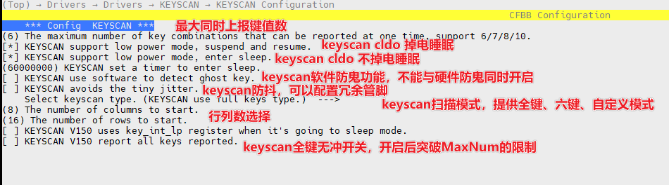

> **说明：** 
>注意：若上述图片所示与表格描述不一致，请以表格为准。

配置宏具体描述如[表1](#table16629938173916)所示。

**表 1**  KEYSCAN相关宏描述

<a name="table16629938173916"></a>
<table><thead align="left"><tr id="row1462913813915"><th class="cellrowborder" valign="top" width="22.62773722627738%" id="mcps1.2.7.1.1"><p id="p1962923853920"><a name="p1962923853920"></a><a name="p1962923853920"></a>宏名称（CONFIG_是默认添加的前缀）</p>
</th>
<th class="cellrowborder" valign="top" width="21.137886211378866%" id="mcps1.2.7.1.2"><p id="p962916388395"><a name="p962916388395"></a><a name="p962916388395"></a>kconfig界面显示的具体描述</p>
</th>
<th class="cellrowborder" valign="top" width="19.878012198780127%" id="mcps1.2.7.1.3"><p id="p18731420115119"><a name="p18731420115119"></a><a name="p18731420115119"></a>使用场景</p>
</th>
<th class="cellrowborder" valign="top" width="10.618938106189384%" id="mcps1.2.7.1.4"><p id="p537485457"><a name="p537485457"></a><a name="p537485457"></a>是否已经实现</p>
</th>
<th class="cellrowborder" valign="top" width="11.338866113388663%" id="mcps1.2.7.1.5"><p id="p1162915382392"><a name="p1162915382392"></a><a name="p1162915382392"></a>是否依赖其他宏</p>
</th>
<th class="cellrowborder" valign="top" width="14.398560143985604%" id="mcps1.2.7.1.6"><p id="p1449914917569"><a name="p1449914917569"></a><a name="p1449914917569"></a>是否选择打开或修改配置</p>
</th>
</tr>
</thead>
<tbody><tr id="row16629338103916"><td class="cellrowborder" valign="top" width="22.62773722627738%" headers="mcps1.2.7.1.1 "><p id="p166291338133910"><a name="p166291338133910"></a><a name="p166291338133910"></a>CONFIG_KEYSCAN_REPORT_MAX_NUMS</p>
</td>
<td class="cellrowborder" valign="top" width="21.137886211378866%" headers="mcps1.2.7.1.2 "><p id="p212917397349"><a name="p212917397349"></a><a name="p212917397349"></a>The maximum number of key combinations that can be reported at one time, support 6/7/8/10.</p>
</td>
<td class="cellrowborder" valign="top" width="19.878012198780127%" headers="mcps1.2.7.1.3 "><p id="p77352085114"><a name="p77352085114"></a><a name="p77352085114"></a>KEYSCAN最多同时上报的按键数，默认值是6</p>
</td>
<td class="cellrowborder" valign="top" width="10.618938106189384%" headers="mcps1.2.7.1.4 "><p id="p166297382397"><a name="p166297382397"></a><a name="p166297382397"></a>是</p>
</td>
<td class="cellrowborder" valign="top" width="11.338866113388663%" headers="mcps1.2.7.1.5 "><p id="p162983873917"><a name="p162983873917"></a><a name="p162983873917"></a>否</p>
</td>
<td class="cellrowborder" valign="top" width="14.398560143985604%" headers="mcps1.2.7.1.6 "><p id="p29271419451"><a name="p29271419451"></a><a name="p29271419451"></a>默认值是6，视情况选择配置，建议不做修改</p>
</td>
</tr>
<tr id="row166299383394"><td class="cellrowborder" valign="top" width="22.62773722627738%" headers="mcps1.2.7.1.1 "><p id="p14629173813920"><a name="p14629173813920"></a><a name="p14629173813920"></a>CONFIG_KEYSCAN_SUPPORT_LPM</p>
</td>
<td class="cellrowborder" valign="top" width="21.137886211378866%" headers="mcps1.2.7.1.2 "><p id="p1850294718349"><a name="p1850294718349"></a><a name="p1850294718349"></a>KEYSCAN support low power mode, suspend and resume.</p>
</td>
<td class="cellrowborder" valign="top" width="19.878012198780127%" headers="mcps1.2.7.1.3 "><p id="p1746412917425"><a name="p1746412917425"></a><a name="p1746412917425"></a>该宏仅用于低功耗情况下使用，视情况选择</p>
</td>
<td class="cellrowborder" valign="top" width="10.618938106189384%" headers="mcps1.2.7.1.4 "><p id="p166291838143916"><a name="p166291838143916"></a><a name="p166291838143916"></a>是</p>
</td>
<td class="cellrowborder" valign="top" width="11.338866113388663%" headers="mcps1.2.7.1.5 "><p id="p13977417409"><a name="p13977417409"></a><a name="p13977417409"></a>否</p>
</td>
<td class="cellrowborder" valign="top" width="14.398560143985604%" headers="mcps1.2.7.1.6 "><p id="p158811250184312"><a name="p158811250184312"></a><a name="p158811250184312"></a>默认打开，视情况选择，建议打开</p>
</td>
</tr>
<tr id="row3629193823919"><td class="cellrowborder" valign="top" width="22.62773722627738%" headers="mcps1.2.7.1.1 "><p id="p262983811395"><a name="p262983811395"></a><a name="p262983811395"></a>CONFIG_KEYSCAN_SUPPORT_SLEEP</p>
</td>
<td class="cellrowborder" valign="top" width="21.137886211378866%" headers="mcps1.2.7.1.2 "><p id="p1432210183513"><a name="p1432210183513"></a><a name="p1432210183513"></a>KEYSCAN support low power mode, enter sleep.</p>
</td>
<td class="cellrowborder" valign="top" width="19.878012198780127%" headers="mcps1.2.7.1.3 "><p id="p28881144184315"><a name="p28881144184315"></a><a name="p28881144184315"></a>该宏仅用于KEYSCAN低功耗进入睡眠的情况</p>
</td>
<td class="cellrowborder" valign="top" width="10.618938106189384%" headers="mcps1.2.7.1.4 "><p id="p3629133873917"><a name="p3629133873917"></a><a name="p3629133873917"></a>是</p>
</td>
<td class="cellrowborder" valign="top" width="11.338866113388663%" headers="mcps1.2.7.1.5 "><p id="p062910387397"><a name="p062910387397"></a><a name="p062910387397"></a>否</p>
</td>
<td class="cellrowborder" valign="top" width="14.398560143985604%" headers="mcps1.2.7.1.6 "><p id="p16847613194811"><a name="p16847613194811"></a><a name="p16847613194811"></a>默认打开，视情况选择，建议打开</p>
</td>
</tr>
<tr id="row962920381394"><td class="cellrowborder" valign="top" width="22.62773722627738%" headers="mcps1.2.7.1.1 "><p id="p1629738173912"><a name="p1629738173912"></a><a name="p1629738173912"></a>CONFIG_KEYSCAN_IDLE_WAIT_US</p>
</td>
<td class="cellrowborder" valign="top" width="21.137886211378866%" headers="mcps1.2.7.1.2 "><p id="p183421327311"><a name="p183421327311"></a><a name="p183421327311"></a>KEYSCAN set a timer to enter sleep.</p>
</td>
<td class="cellrowborder" valign="top" width="19.878012198780127%" headers="mcps1.2.7.1.3 "><p id="p1391712438269"><a name="p1391712438269"></a><a name="p1391712438269"></a>设置KEYSCAN进入睡眠的时间，默认值是60000000us</p>
</td>
<td class="cellrowborder" valign="top" width="10.618938106189384%" headers="mcps1.2.7.1.4 "><p id="p7630938143910"><a name="p7630938143910"></a><a name="p7630938143910"></a>是</p>
</td>
<td class="cellrowborder" valign="top" width="11.338866113388663%" headers="mcps1.2.7.1.5 "><p id="p56301938153913"><a name="p56301938153913"></a><a name="p56301938153913"></a>否</p>
</td>
<td class="cellrowborder" valign="top" width="14.398560143985604%" headers="mcps1.2.7.1.6 "><p id="p958622210495"><a name="p958622210495"></a><a name="p958622210495"></a>默认值是60000000，视情况选择配置，建议不做修改</p>
</td>
</tr>
<tr id="row6616111510320"><td class="cellrowborder" valign="top" width="22.62773722627738%" headers="mcps1.2.7.1.1 "><p id="p11616181516313"><a name="p11616181516313"></a><a name="p11616181516313"></a>CONFIG_KEYSCAN_SUPPORT_SW_DEFENCE</p>
</td>
<td class="cellrowborder" valign="top" width="21.137886211378866%" headers="mcps1.2.7.1.2 "><p id="p2616121518311"><a name="p2616121518311"></a><a name="p2616121518311"></a>KEYSCAN avoids the tiny jitter.</p>
</td>
<td class="cellrowborder" valign="top" width="19.878012198780127%" headers="mcps1.2.7.1.3 "><p id="p1161610154317"><a name="p1161610154317"></a><a name="p1161610154317"></a>该宏用于KEYSCAN滤抖场景，过滤毛刺抖动</p>
</td>
<td class="cellrowborder" valign="top" width="10.618938106189384%" headers="mcps1.2.7.1.4 "><p id="p156163151530"><a name="p156163151530"></a><a name="p156163151530"></a>是</p>
</td>
<td class="cellrowborder" valign="top" width="11.338866113388663%" headers="mcps1.2.7.1.5 "><p id="p176164153317"><a name="p176164153317"></a><a name="p176164153317"></a>否</p>
</td>
<td class="cellrowborder" valign="top" width="14.398560143985604%" headers="mcps1.2.7.1.6 "><p id="p21673172913"><a name="p21673172913"></a><a name="p21673172913"></a>默认关闭，视情况选择</p>
</td>
</tr>
<tr id="row1873511419311"><td class="cellrowborder" valign="top" width="22.62773722627738%" headers="mcps1.2.7.1.1 "><p id="p1735104137"><a name="p1735104137"></a><a name="p1735104137"></a>CONFIG_KEYSCAN_ANOTHER_COL</p>
</td>
<td class="cellrowborder" valign="top" width="21.137886211378866%" headers="mcps1.2.7.1.2 "><p id="p97361845316"><a name="p97361845316"></a><a name="p97361845316"></a>This pulled down column makes all rows continuously scanning if the software defence function is open.</p>
</td>
<td class="cellrowborder" valign="top" width="19.878012198780127%" headers="mcps1.2.7.1.3 "><p id="p117369416318"><a name="p117369416318"></a><a name="p117369416318"></a>改宏用于配置滤抖功能开启时的冗余列管脚，默认值是0</p>
</td>
<td class="cellrowborder" valign="top" width="10.618938106189384%" headers="mcps1.2.7.1.4 "><p id="p1273612411315"><a name="p1273612411315"></a><a name="p1273612411315"></a>是</p>
</td>
<td class="cellrowborder" valign="top" width="11.338866113388663%" headers="mcps1.2.7.1.5 "><p id="p207368412315"><a name="p207368412315"></a><a name="p207368412315"></a>CONFIG_KEYSCAN_SUPPORT_SW_DEFENCE</p>
</td>
<td class="cellrowborder" valign="top" width="14.398560143985604%" headers="mcps1.2.7.1.6 "><p id="p16736241632"><a name="p16736241632"></a><a name="p16736241632"></a>默认关闭，默认值为0，是请款选择</p>
</td>
</tr>
<tr id="row62681237271"><td class="cellrowborder" valign="top" width="22.62773722627738%" headers="mcps1.2.7.1.1 "><p id="p112401826112812"><a name="p112401826112812"></a><a name="p112401826112812"></a>CONFIG_KEYSCAN_USE_FULL_KEYS_TYPE</p>
</td>
<td class="cellrowborder" valign="top" width="21.137886211378866%" headers="mcps1.2.7.1.2 "><p id="p9468113615407"><a name="p9468113615407"></a><a name="p9468113615407"></a>KEYSCAN use full keys type.</p>
</td>
<td class="cellrowborder" valign="top" width="19.878012198780127%" headers="mcps1.2.7.1.3 "><p id="p438154074512"><a name="p438154074512"></a><a name="p438154074512"></a>KEYSCAN支持全键模式</p>
</td>
<td class="cellrowborder" valign="top" width="10.618938106189384%" headers="mcps1.2.7.1.4 "><p id="p5269202314277"><a name="p5269202314277"></a><a name="p5269202314277"></a>是</p>
</td>
<td class="cellrowborder" valign="top" width="11.338866113388663%" headers="mcps1.2.7.1.5 "><p id="p882352916313"><a name="p882352916313"></a><a name="p882352916313"></a>否</p>
</td>
<td class="cellrowborder" valign="top" width="14.398560143985604%" headers="mcps1.2.7.1.6 "><p id="p137491622194215"><a name="p137491622194215"></a><a name="p137491622194215"></a>默认打开，视情况选择，建议打开</p>
</td>
</tr>
<tr id="row17817572040"><td class="cellrowborder" valign="top" width="22.62773722627738%" headers="mcps1.2.7.1.1 "><p id="p53019141514"><a name="p53019141514"></a><a name="p53019141514"></a>CONFIG_KEYSCAN_USE_SIX_KEYS_TYPE</p>
</td>
<td class="cellrowborder" valign="top" width="21.137886211378866%" headers="mcps1.2.7.1.2 "><p id="p14544194924012"><a name="p14544194924012"></a><a name="p14544194924012"></a>KEYSCAN use six keys type.</p>
</td>
<td class="cellrowborder" valign="top" width="19.878012198780127%" headers="mcps1.2.7.1.3 "><p id="p14269192913525"><a name="p14269192913525"></a><a name="p14269192913525"></a>KEYSCAN支持六键模式</p>
</td>
<td class="cellrowborder" valign="top" width="10.618938106189384%" headers="mcps1.2.7.1.4 "><p id="p17919571246"><a name="p17919571246"></a><a name="p17919571246"></a>是</p>
</td>
<td class="cellrowborder" valign="top" width="11.338866113388663%" headers="mcps1.2.7.1.5 "><p id="p1343315396319"><a name="p1343315396319"></a><a name="p1343315396319"></a>否</p>
</td>
<td class="cellrowborder" valign="top" width="14.398560143985604%" headers="mcps1.2.7.1.6 "><p id="p1421054374413"><a name="p1421054374413"></a><a name="p1421054374413"></a>默认关闭，视情况选择</p>
</td>
</tr>
<tr id="row040511461781"><td class="cellrowborder" valign="top" width="22.62773722627738%" headers="mcps1.2.7.1.1 "><p id="p2085465116817"><a name="p2085465116817"></a><a name="p2085465116817"></a>CONFIG_KEYSCAN_USER_CONFIG_TYPE</p>
</td>
<td class="cellrowborder" valign="top" width="21.137886211378866%" headers="mcps1.2.7.1.2 "><p id="p14393171311411"><a name="p14393171311411"></a><a name="p14393171311411"></a>KEYSCAN user config type.</p>
</td>
<td class="cellrowborder" valign="top" width="19.878012198780127%" headers="mcps1.2.7.1.3 "><p id="p10124183720522"><a name="p10124183720522"></a><a name="p10124183720522"></a>KEYSCAN支持自定义按键模式</p>
</td>
<td class="cellrowborder" valign="top" width="10.618938106189384%" headers="mcps1.2.7.1.4 "><p id="p1640513469812"><a name="p1640513469812"></a><a name="p1640513469812"></a>是</p>
</td>
<td class="cellrowborder" valign="top" width="11.338866113388663%" headers="mcps1.2.7.1.5 "><p id="p1528213471933"><a name="p1528213471933"></a><a name="p1528213471933"></a>否</p>
</td>
<td class="cellrowborder" valign="top" width="14.398560143985604%" headers="mcps1.2.7.1.6 "><p id="p154053469813"><a name="p154053469813"></a><a name="p154053469813"></a>默认关闭，视情况选择</p>
</td>
</tr>
<tr id="row1835411465910"><td class="cellrowborder" valign="top" width="22.62773722627738%" headers="mcps1.2.7.1.1 "><p id="p235571412597"><a name="p235571412597"></a><a name="p235571412597"></a>CONFIG_KEYSCAN_ENABLE_COL</p>
</td>
<td class="cellrowborder" valign="top" width="21.137886211378866%" headers="mcps1.2.7.1.2 "><p id="p154901910164216"><a name="p154901910164216"></a><a name="p154901910164216"></a>The number of columns to start.</p>
</td>
<td class="cellrowborder" valign="top" width="19.878012198780127%" headers="mcps1.2.7.1.3 "><p id="p1574795965220"><a name="p1574795965220"></a><a name="p1574795965220"></a>KEYSCAN列数配置</p>
</td>
<td class="cellrowborder" valign="top" width="10.618938106189384%" headers="mcps1.2.7.1.4 "><p id="p1235501495919"><a name="p1235501495919"></a><a name="p1235501495919"></a>是</p>
</td>
<td class="cellrowborder" valign="top" width="11.338866113388663%" headers="mcps1.2.7.1.5 "><p id="p895101445"><a name="p895101445"></a><a name="p895101445"></a>否</p>
</td>
<td class="cellrowborder" valign="top" width="14.398560143985604%" headers="mcps1.2.7.1.6 "><p id="p72841723184417"><a name="p72841723184417"></a><a name="p72841723184417"></a>默认全键模式的列数，值为8，如果配置成其他键盘模式，需自行调整</p>
</td>
</tr>
<tr id="row15869683373"><td class="cellrowborder" valign="top" width="22.62773722627738%" headers="mcps1.2.7.1.1 "><p id="p7870131514375"><a name="p7870131514375"></a><a name="p7870131514375"></a>CONFIG_KEYSCAN_ENABLE_ROW</p>
</td>
<td class="cellrowborder" valign="top" width="21.137886211378866%" headers="mcps1.2.7.1.2 "><p id="p192463257425"><a name="p192463257425"></a><a name="p192463257425"></a>The number of rows to start.</p>
</td>
<td class="cellrowborder" valign="top" width="19.878012198780127%" headers="mcps1.2.7.1.3 "><p id="p721822011539"><a name="p721822011539"></a><a name="p721822011539"></a>KEYSCAN行数配置</p>
</td>
<td class="cellrowborder" valign="top" width="10.618938106189384%" headers="mcps1.2.7.1.4 "><p id="p48701288378"><a name="p48701288378"></a><a name="p48701288378"></a>是</p>
</td>
<td class="cellrowborder" valign="top" width="11.338866113388663%" headers="mcps1.2.7.1.5 "><p id="p145114119409"><a name="p145114119409"></a><a name="p145114119409"></a>否</p>
</td>
<td class="cellrowborder" valign="top" width="14.398560143985604%" headers="mcps1.2.7.1.6 "><p id="p167962272585"><a name="p167962272585"></a><a name="p167962272585"></a>默认全键模式的行数，值为16，如果配置成其他键盘模式，需自行调整</p>
</td>
</tr>
<tr id="row934483818326"><td class="cellrowborder" valign="top" width="22.62773722627738%" headers="mcps1.2.7.1.1 "><p id="p3864842337"><a name="p3864842337"></a><a name="p3864842337"></a>CONFIG_KEYSCAN_USE_LP</p>
</td>
<td class="cellrowborder" valign="top" width="21.137886211378866%" headers="mcps1.2.7.1.2 "><p id="p10305154754211"><a name="p10305154754211"></a><a name="p10305154754211"></a>KEYSCAN V150 uses key_int_lp register when it's going to sleep mode.</p>
</td>
<td class="cellrowborder" valign="top" width="19.878012198780127%" headers="mcps1.2.7.1.3 "><p id="p63451738133213"><a name="p63451738133213"></a><a name="p63451738133213"></a>该宏仅在睡眠场景下使用</p>
</td>
<td class="cellrowborder" valign="top" width="10.618938106189384%" headers="mcps1.2.7.1.4 "><p id="p3345173819320"><a name="p3345173819320"></a><a name="p3345173819320"></a>是</p>
</td>
<td class="cellrowborder" valign="top" width="11.338866113388663%" headers="mcps1.2.7.1.5 "><p id="p1160114311393"><a name="p1160114311393"></a><a name="p1160114311393"></a>CONFIG_KEYSCAN_SUPPORT_SLEEP</p>
</td>
<td class="cellrowborder" valign="top" width="14.398560143985604%" headers="mcps1.2.7.1.6 "><p id="p914192814612"><a name="p914192814612"></a><a name="p914192814612"></a>默认关闭，建议关闭</p>
</td>
</tr>
<tr id="row2891124283218"><td class="cellrowborder" valign="top" width="22.62773722627738%" headers="mcps1.2.7.1.1 "><p id="p19452172613352"><a name="p19452172613352"></a><a name="p19452172613352"></a>CONFIG_KEYSCAN_ENABLE_REP_ALL_KEY</p>
</td>
<td class="cellrowborder" valign="top" width="21.137886211378866%" headers="mcps1.2.7.1.2 "><p id="p3968125954216"><a name="p3968125954216"></a><a name="p3968125954216"></a>KEYSCAN V150 report all keys reported.</p>
</td>
<td class="cellrowborder" valign="top" width="19.878012198780127%" headers="mcps1.2.7.1.3 "><p id="p489174216326"><a name="p489174216326"></a><a name="p489174216326"></a>KEYSCAN全键无冲功能开关，开启后MaxNum配置无作用</p>
</td>
<td class="cellrowborder" valign="top" width="10.618938106189384%" headers="mcps1.2.7.1.4 "><p id="p489117427322"><a name="p489117427322"></a><a name="p489117427322"></a>是</p>
</td>
<td class="cellrowborder" valign="top" width="11.338866113388663%" headers="mcps1.2.7.1.5 "><p id="p489144243219"><a name="p489144243219"></a><a name="p489144243219"></a>否</p>
</td>
<td class="cellrowborder" valign="top" width="14.398560143985604%" headers="mcps1.2.7.1.6 "><p id="p9229105374715"><a name="p9229105374715"></a><a name="p9229105374715"></a>默认关闭，视情况选择，建议关闭</p>
</td>
</tr>
<tr id="row16902048181514"><td class="cellrowborder" valign="top" width="22.62773722627738%" headers="mcps1.2.7.1.1 "><p id="p690254814156"><a name="p690254814156"></a><a name="p690254814156"></a>CONFIG_KEYSCAN_SOFTWARE_GHOST_DETECT</p>
</td>
<td class="cellrowborder" valign="top" width="21.137886211378866%" headers="mcps1.2.7.1.2 "><p id="p13902174811153"><a name="p13902174811153"></a><a name="p13902174811153"></a>KEYSCAN use software to detect ghost key</p>
</td>
<td class="cellrowborder" valign="top" width="19.878012198780127%" headers="mcps1.2.7.1.3 "><p id="p8902164820157"><a name="p8902164820157"></a><a name="p8902164820157"></a>KEYSCAN软件防鬼开关，不能与硬件防鬼同时打开</p>
</td>
<td class="cellrowborder" valign="top" width="10.618938106189384%" headers="mcps1.2.7.1.4 "><p id="p10902194891513"><a name="p10902194891513"></a><a name="p10902194891513"></a>是</p>
</td>
<td class="cellrowborder" valign="top" width="11.338866113388663%" headers="mcps1.2.7.1.5 "><p id="p11902164818158"><a name="p11902164818158"></a><a name="p11902164818158"></a>否</p>
</td>
<td class="cellrowborder" valign="top" width="14.398560143985604%" headers="mcps1.2.7.1.6 "><p id="p12902114814151"><a name="p12902114814151"></a><a name="p12902114814151"></a>默认关闭，视情况选择</p>
</td>
</tr>
</tbody>
</table>

## 开发指引<a name="ZH-CN_TOPIC_0000001713103513"></a>

可配置项主要在KEYSCAN对应的porting层头文件中，下文将介绍重要可配置项的功能。

```
#define KEYSCAN_DEFAULT_CONFIG                       \
{                                                    \
.direction             = ROW_SCAN_DIR,               \    行列扫描方向
.scan_mode             = HAL_KEYSCAN_MODE_0,         \    行列扫描模式
.pulse_time            = EVERY_ROW_PULSE_10_US,      \   扫描脉冲时长
.wait_time             = WAITING_30_AND_5_US,        \  扫描持续时长
.idle_time             = IDLE_3_MS_AFTER_SCAN,       \  多次扫描间等待时长
.defence_time          = SAMPLE_3TIMES_DEFENCE,      \   防抖次数
.ghost_check           = false,                      \硬件防鬼开关
.io_de                = true,                      \
}
//  keyscan两级分频器的分频比配置，分频系数为CLK_HIGH_DIV*CLK_LOW_DIV，默认配置为
#define CLK_HIGH_DIV 0x28
#define CLK_LOW_DIV  0xa
//  如需降低分频比以优化keyscan时延，推荐配置为8M，即
#define CLK_HIGH_DIV 0x2
#define CLK_LOW_DIV  0x2
```

示例：

1.  如使用自定义模式，首先调用keyscan\_porting\_set\_gpio接口确认要使用的goio，先写row，再写column。

    \#if defined\(CONFIG\_KEYSCAN\_USER\_CONFIG\_TYPE\)

        uint8\_t user\_gpio\_map\[CONFIG\_KEYSCAN\_ENABLE\_ROW + CONFIG\_KEYSCAN\_ENABLE\_COL\] = \{ 31, 24, 14, 23, 27, 28, 10, 11, 30, 13, 15, 16, 25, 26, 12, 22, 

    2, 3, 4, 5, 6, 21, 9, 29\};

    if \(keyscan\_porting\_set\_gpio\(user\_gpio\_map\)\) \{

    return;

    \}

    \#endif

2.  调用uapi\_set\_keyscan\_value\_map接口进行键值map注册，键值map数组的行列需要和行列最大值一致，不使用的按键填充为0x00即可。

    ```
    uint8_t g_key_map_test[KEY_SCAN_MAX_ROW][KEY_SCAN_MAX_COL] = {
        { 0x29, 0x2B, 0x14, 0x35, 0x04, 0x1E, 0x1D, 0x00 },
        { 0x3D, 0x3C, 0x08, 0x3B, 0x07, 0x20, 0x06, 0x00 },
        { 0x00, 0x39, 0x1A, 0x3A, 0x16, 0x1F, 0x1B, 0x00 },
        { 0x00, 0x00, 0x00, 0xE0, 0x00, 0x00, 0xE4, 0x00 },
        { 0x0A, 0x17, 0x15, 0x22, 0x09, 0x21, 0x19, 0x05 },
        { 0x0B, 0x1C, 0x18, 0x23, 0x0D, 0x24, 0x10, 0x11 },
        { 0x3F, 0x30, 0x0C, 0x2E, 0x0E, 0x25, 0x36, 0x00 },
        { 0x00, 0x00, 0x12, 0x40, 0x0F, 0x26, 0x37, 0x00 },
        { 0x34, 0x2F, 0x13, 0x2D, 0x33, 0x27, 0x00, 0x38 },
        { 0x3E, 0x2A, 0x00, 0x41, 0x31, 0x42, 0x28, 0x2C },
        { 0x00, 0x00, 0xE3, 0x00, 0x00, 0x43, 0x00, 0x51 },
        { 0xE2, 0x00, 0x00, 0x00, 0x00, 0x45, 0xE5, 0xE6 },
        { 0x00, 0x53, 0x00, 0x00, 0xE1, 0x44, 0x00, 0x4F },
        { 0x52, 0x00, 0x00, 0x00, 0x00, 0x00, 0x4C, 0x50 },
        { 0x5F, 0x5C, 0x61, 0x5E, 0x59, 0x62, 0x55, 0x5B },
        { 0x54, 0x60, 0x56, 0x57, 0x5D, 0x5A, 0x58, 0x63 },
    };
    uapi_set_keyscan_value_map((uint8_t **)g_key_map_test, KEY_SCAN_MAX_ROW, KEY_SCAN_MAX_COL);
    ```

3.  调用uapi\_keyscan\_init接口，初始化KEYSCAN，当前入参为脉冲时间（param1）、扫描模式（param2）、中断时间（param3），默认值为0、0、3。

    ```
    uapi_keyscan_init(pulse, mode, scan_int);
    ```

4.  调用uapi\_keyscan\_register\_callback以及uapi\_keyscan\_enable接口，注册KEYSCAN中断回调函数并使能KEYSCAN。

    ```
    int test_key_scan_funcs(void)
    {
        errcode_t ret = ERRCODE_FAIL;
        ret = uapi_keyscan_register_callback(key_scan_report_callback);
        if (ret != ERRCODE_SUCC) {
            return TEST_SUITE_TEST_FAILED;
        }
        uapi_keyscan_enable();
        return TEST_SUITE_OK;
    }
    ```

**全键无冲模式<a name="section17811101414518"></a>**

开启CONFIG\_KEYSCAN\_ENABLE\_REP\_ALL\_KEY后，中断上报将换为keyscan\_porting\_all\_keys\_report，会上报同时按下的所有按键，长按时会每个扫描周期上报一次，用户需根据扫描频率调整中断响应的阈值。

**防抖模式<a name="section11396202710511"></a>**

开启CONFIG\_KEYSCAN\_SUPPORT\_SW\_DEFENCE宏后，将一个空闲的管脚配置到CONFIG\_KEYSCAN\_ANOTHER\_COL，并将列管脚的个数+1。keyscan功能执行时便不会出现微小抖动下的按键误报。由于按键防抖功能开启后会占用一个gpio管脚，因此CONFIG\_KEYSCAN\_SUPPORT\_SW\_DEFENCE宏默认关闭，需要用户根据情况进行配置。

**软件防鬼模式<a name="section48517365510"></a>**

BS2X提供了软件防鬼键功能，开启CONFIG\_KEYSCAN\_SOFTWARE\_GHOST\_DETECT后，Keyscan的回调函数里会添加keyscan\_sw\_ghost\_detect，将形成鬼键的第三个按键和鬼键上报的第四个按键从上报的buffer中删除，只上报最初按下的两个键，与此同时新按下的其余按键也不会继续上报，以此告知用户出现了鬼键现象。软件防鬼功能不能与硬件防鬼同时打开。

## 注意事项<a name="ZH-CN_TOPIC_0000001713103489"></a>

KEYSCAN使用时需要做好接地，否则会出现键值误报的问题。

# PDM<a name="ZH-CN_TOPIC_0000001713023521"></a>


## 概述<a name="ZH-CN_TOPIC_0000001713023541"></a>

PDM（Pulse Density Modulation）是一种用数字信号表示模拟信号的调制方法。而另一种常用的将模拟量转换为数字量的方法PCM则使用等间隔采样方法，将每次采样的模拟分量幅度表示为N位的数字分量（N = 量化深度），因此PCM方式每次采样的结果都是N bit字长的数据。PDM使用远高于PCM采样率的时钟采样调制模拟分量，只有1位输出时，为0或1。因此通过PDM方式表示的数字音频也被称为Oversampled 1-bit Audio。

282X搭载的音频数模转换模块采用PDM方法进行采样，处理后**输出PCM数据**。数据来源可以为DMIC或AMIC。

## 功能描述<a name="ZH-CN_TOPIC_0000001713023569"></a>

PDM模块提供的接口及功能如下：

-   uapi\_pdm\_init（void）：初始化PDM。
-   uapi\_pdm\_deinit（void）：去初始化PDM。
-   uapi\_pdm\_set\_attr（uint8\_t mic, const pdm\_config\_t \*attr）：设置PDM通道的属性（mic表示需要配置的通道，attr表示配置参数）。
-   uapi\_pdm\_get\_attr（uint8\_t mic, pdm\_config\_t \*attr）：获取PDM通道的属性（mic表示需要获取的通道，attr表示用于存储获取的属性参数）。
-   uapi\_pdm\_start（void）：启动PDM采样。
-   uapi\_pdm\_stop（void）：停止PDM采样。
-   uapi\_pdm\_get\_fifo\_addr（void）：获取PDM的FIFO基地址。
-   uapi\_pdm\_get\_fifo\_deepth（void）：获取PDM的FIFO深度。

## KCONFIG配置<a name="ZH-CN_TOPIC_0000001937056313"></a>

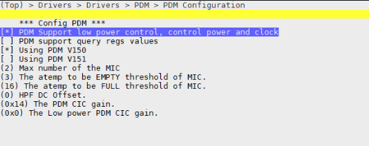

配置宏具体描述如[表1](#table16629938173916)所示。

**表 1**  PDM相关宏描述

<a name="table16629938173916"></a>
<table><thead align="left"><tr id="row1462913813915"><th class="cellrowborder" valign="top" width="22.62773722627738%" id="mcps1.2.7.1.1"><p id="p1962923853920"><a name="p1962923853920"></a><a name="p1962923853920"></a>宏名称（CONFIG_是默认添加的前缀）</p>
</th>
<th class="cellrowborder" valign="top" width="21.137886211378866%" id="mcps1.2.7.1.2"><p id="p962916388395"><a name="p962916388395"></a><a name="p962916388395"></a>kconfig界面显示的具体描述</p>
</th>
<th class="cellrowborder" valign="top" width="19.878012198780127%" id="mcps1.2.7.1.3"><p id="p18731420115119"><a name="p18731420115119"></a><a name="p18731420115119"></a>使用场景</p>
</th>
<th class="cellrowborder" valign="top" width="10.618938106189384%" id="mcps1.2.7.1.4"><p id="p537485457"><a name="p537485457"></a><a name="p537485457"></a>是否已经实现</p>
</th>
<th class="cellrowborder" valign="top" width="11.338866113388663%" id="mcps1.2.7.1.5"><p id="p1162915382392"><a name="p1162915382392"></a><a name="p1162915382392"></a>是否依赖其他宏</p>
</th>
<th class="cellrowborder" valign="top" width="14.398560143985604%" id="mcps1.2.7.1.6"><p id="p1449914917569"><a name="p1449914917569"></a><a name="p1449914917569"></a>是否选择打开或修改配置</p>
</th>
</tr>
</thead>
<tbody><tr id="row16629338103916"><td class="cellrowborder" valign="top" width="22.62773722627738%" headers="mcps1.2.7.1.1 "><p id="p166291338133910"><a name="p166291338133910"></a><a name="p166291338133910"></a>CONFIG_PDM_SUPPORT_LPC</p>
</td>
<td class="cellrowborder" valign="top" width="21.137886211378866%" headers="mcps1.2.7.1.2 "><p id="p212917397349"><a name="p212917397349"></a><a name="p212917397349"></a>PDM support low power control, control power and clock.</p>
</td>
<td class="cellrowborder" valign="top" width="19.878012198780127%" headers="mcps1.2.7.1.3 "><p id="p77352085114"><a name="p77352085114"></a><a name="p77352085114"></a>PDM 工作时钟</p>
</td>
<td class="cellrowborder" valign="top" width="10.618938106189384%" headers="mcps1.2.7.1.4 "><p id="p166297382397"><a name="p166297382397"></a><a name="p166297382397"></a>是</p>
</td>
<td class="cellrowborder" valign="top" width="11.338866113388663%" headers="mcps1.2.7.1.5 "><p id="p162983873917"><a name="p162983873917"></a><a name="p162983873917"></a>否</p>
</td>
<td class="cellrowborder" valign="top" width="14.398560143985604%" headers="mcps1.2.7.1.6 "><p id="p1049793984718"><a name="p1049793984718"></a><a name="p1049793984718"></a>默认打开，必选</p>
</td>
</tr>
<tr id="row166299383394"><td class="cellrowborder" valign="top" width="22.62773722627738%" headers="mcps1.2.7.1.1 "><p id="p14629173813920"><a name="p14629173813920"></a><a name="p14629173813920"></a>CONFIG_PDM_SUPPORT_QUERY_REGS</p>
</td>
<td class="cellrowborder" valign="top" width="21.137886211378866%" headers="mcps1.2.7.1.2 "><p id="p15501102411376"><a name="p15501102411376"></a><a name="p15501102411376"></a>PDM support query regs values.</p>
</td>
<td class="cellrowborder" valign="top" width="19.878012198780127%" headers="mcps1.2.7.1.3 "><p id="p9684133534814"><a name="p9684133534814"></a><a name="p9684133534814"></a>PDM支持回读所有相关寄存器的值，视情况选择</p>
</td>
<td class="cellrowborder" valign="top" width="10.618938106189384%" headers="mcps1.2.7.1.4 "><p id="p166291838143916"><a name="p166291838143916"></a><a name="p166291838143916"></a>是</p>
</td>
<td class="cellrowborder" valign="top" width="11.338866113388663%" headers="mcps1.2.7.1.5 "><p id="p13977417409"><a name="p13977417409"></a><a name="p13977417409"></a>否</p>
</td>
<td class="cellrowborder" valign="top" width="14.398560143985604%" headers="mcps1.2.7.1.6 "><p id="p158811250184312"><a name="p158811250184312"></a><a name="p158811250184312"></a>默认关闭，视情况选择，建议关闭</p>
</td>
</tr>
<tr id="row3629193823919"><td class="cellrowborder" valign="top" width="22.62773722627738%" headers="mcps1.2.7.1.1 "><p id="p262983811395"><a name="p262983811395"></a><a name="p262983811395"></a>CONFIG_PDM_USING_V150</p>
</td>
<td class="cellrowborder" valign="top" width="21.137886211378866%" headers="mcps1.2.7.1.2 "><p id="p1432210183513"><a name="p1432210183513"></a><a name="p1432210183513"></a>Using PDM V150.</p>
</td>
<td class="cellrowborder" valign="top" width="19.878012198780127%" headers="mcps1.2.7.1.3 "><p id="p28881144184315"><a name="p28881144184315"></a><a name="p28881144184315"></a>该宏代表使用PDM V150的驱动规格，本产品默认使用该规格</p>
</td>
<td class="cellrowborder" valign="top" width="10.618938106189384%" headers="mcps1.2.7.1.4 "><p id="p3629133873917"><a name="p3629133873917"></a><a name="p3629133873917"></a>是</p>
</td>
<td class="cellrowborder" valign="top" width="11.338866113388663%" headers="mcps1.2.7.1.5 "><p id="p062910387397"><a name="p062910387397"></a><a name="p062910387397"></a>否</p>
</td>
<td class="cellrowborder" valign="top" width="14.398560143985604%" headers="mcps1.2.7.1.6 "><p id="p16847613194811"><a name="p16847613194811"></a><a name="p16847613194811"></a>默认打开，必选</p>
</td>
</tr>
<tr id="row962920381394"><td class="cellrowborder" valign="top" width="22.62773722627738%" headers="mcps1.2.7.1.1 "><p id="p1629738173912"><a name="p1629738173912"></a><a name="p1629738173912"></a>CONFIG_PDM_USING_V151</p>
</td>
<td class="cellrowborder" valign="top" width="21.137886211378866%" headers="mcps1.2.7.1.2 "><p id="p13179182754416"><a name="p13179182754416"></a><a name="p13179182754416"></a>Using PDM V151.</p>
</td>
<td class="cellrowborder" valign="top" width="19.878012198780127%" headers="mcps1.2.7.1.3 "><p id="p173853198511"><a name="p173853198511"></a><a name="p173853198511"></a>该宏代表使用PDM V151的驱动规格，本产品不使用该规格</p>
</td>
<td class="cellrowborder" valign="top" width="10.618938106189384%" headers="mcps1.2.7.1.4 "><p id="p7630938143910"><a name="p7630938143910"></a><a name="p7630938143910"></a>是</p>
</td>
<td class="cellrowborder" valign="top" width="11.338866113388663%" headers="mcps1.2.7.1.5 "><p id="p56301938153913"><a name="p56301938153913"></a><a name="p56301938153913"></a>否</p>
</td>
<td class="cellrowborder" valign="top" width="14.398560143985604%" headers="mcps1.2.7.1.6 "><p id="p6118155155211"><a name="p6118155155211"></a><a name="p6118155155211"></a>默认关闭，必须关闭</p>
</td>
</tr>
<tr id="row62681237271"><td class="cellrowborder" valign="top" width="22.62773722627738%" headers="mcps1.2.7.1.1 "><p id="p112401826112812"><a name="p112401826112812"></a><a name="p112401826112812"></a>CONFIG_MIC_CH_NUM</p>
</td>
<td class="cellrowborder" valign="top" width="21.137886211378866%" headers="mcps1.2.7.1.2 "><p id="p18634144924414"><a name="p18634144924414"></a><a name="p18634144924414"></a>Max number of the MIC.</p>
</td>
<td class="cellrowborder" valign="top" width="19.878012198780127%" headers="mcps1.2.7.1.3 "><p id="p438154074512"><a name="p438154074512"></a><a name="p438154074512"></a>PDM支持的MIC通道数</p>
</td>
<td class="cellrowborder" valign="top" width="10.618938106189384%" headers="mcps1.2.7.1.4 "><p id="p5269202314277"><a name="p5269202314277"></a><a name="p5269202314277"></a>是</p>
</td>
<td class="cellrowborder" valign="top" width="11.338866113388663%" headers="mcps1.2.7.1.5 "><p id="p5506649114616"><a name="p5506649114616"></a><a name="p5506649114616"></a>CONFIG_PDM_USING_V150</p>
</td>
<td class="cellrowborder" valign="top" width="14.398560143985604%" headers="mcps1.2.7.1.6 "><p id="p131586414353"><a name="p131586414353"></a><a name="p131586414353"></a>默认值是2，视情况选择配置，建议不做修改</p>
</td>
</tr>
<tr id="row17817572040"><td class="cellrowborder" valign="top" width="22.62773722627738%" headers="mcps1.2.7.1.1 "><p id="p53019141514"><a name="p53019141514"></a><a name="p53019141514"></a>CONFIG_PDM_AFIFO_AEMPTY_TH</p>
</td>
<td class="cellrowborder" valign="top" width="21.137886211378866%" headers="mcps1.2.7.1.2 "><p id="p7184481450"><a name="p7184481450"></a><a name="p7184481450"></a>The atemp to be EMPTY threshold of MIC.</p>
</td>
<td class="cellrowborder" valign="top" width="19.878012198780127%" headers="mcps1.2.7.1.3 "><p id="p14269192913525"><a name="p14269192913525"></a><a name="p14269192913525"></a>配置PDM FIFO将空的阈值，默认值是3</p>
</td>
<td class="cellrowborder" valign="top" width="10.618938106189384%" headers="mcps1.2.7.1.4 "><p id="p17919571246"><a name="p17919571246"></a><a name="p17919571246"></a>是</p>
</td>
<td class="cellrowborder" valign="top" width="11.338866113388663%" headers="mcps1.2.7.1.5 "><p id="p1343315396319"><a name="p1343315396319"></a><a name="p1343315396319"></a>否</p>
</td>
<td class="cellrowborder" valign="top" width="14.398560143985604%" headers="mcps1.2.7.1.6 "><p id="p271622620218"><a name="p271622620218"></a><a name="p271622620218"></a>默认值是3，视情况选择配置，建议不做修改</p>
</td>
</tr>
<tr id="row040511461781"><td class="cellrowborder" valign="top" width="22.62773722627738%" headers="mcps1.2.7.1.1 "><p id="p2085465116817"><a name="p2085465116817"></a><a name="p2085465116817"></a>CONFIG_PDM_AFIFO_AFULL_TH</p>
</td>
<td class="cellrowborder" valign="top" width="21.137886211378866%" headers="mcps1.2.7.1.2 "><p id="p1061343484519"><a name="p1061343484519"></a><a name="p1061343484519"></a>The atemp to be FULL threshold of MIC.</p>
</td>
<td class="cellrowborder" valign="top" width="19.878012198780127%" headers="mcps1.2.7.1.3 "><p id="p144901341918"><a name="p144901341918"></a><a name="p144901341918"></a>配置PDM FIFO将满的阈值，默认值是16</p>
</td>
<td class="cellrowborder" valign="top" width="10.618938106189384%" headers="mcps1.2.7.1.4 "><p id="p1640513469812"><a name="p1640513469812"></a><a name="p1640513469812"></a>是</p>
</td>
<td class="cellrowborder" valign="top" width="11.338866113388663%" headers="mcps1.2.7.1.5 "><p id="p1528213471933"><a name="p1528213471933"></a><a name="p1528213471933"></a>否</p>
</td>
<td class="cellrowborder" valign="top" width="14.398560143985604%" headers="mcps1.2.7.1.6 "><p id="p154053469813"><a name="p154053469813"></a><a name="p154053469813"></a>默认值是16，视情况选择配置，建议不做修改</p>
</td>
</tr>
<tr id="row1835411465910"><td class="cellrowborder" valign="top" width="22.62773722627738%" headers="mcps1.2.7.1.1 "><p id="p235571412597"><a name="p235571412597"></a><a name="p235571412597"></a>CONFIG_PDM_ADC_DC_OFFSET</p>
</td>
<td class="cellrowborder" valign="top" width="21.137886211378866%" headers="mcps1.2.7.1.2 "><p id="p154901910164216"><a name="p154901910164216"></a><a name="p154901910164216"></a>HPF DC Offset.</p>
</td>
<td class="cellrowborder" valign="top" width="19.878012198780127%" headers="mcps1.2.7.1.3 "><p id="p1574795965220"><a name="p1574795965220"></a><a name="p1574795965220"></a>配置PDM ADC HPF DC偏移值，默认值是0</p>
</td>
<td class="cellrowborder" valign="top" width="10.618938106189384%" headers="mcps1.2.7.1.4 "><p id="p1235501495919"><a name="p1235501495919"></a><a name="p1235501495919"></a>是</p>
</td>
<td class="cellrowborder" valign="top" width="11.338866113388663%" headers="mcps1.2.7.1.5 "><p id="p895101445"><a name="p895101445"></a><a name="p895101445"></a>否</p>
</td>
<td class="cellrowborder" valign="top" width="14.398560143985604%" headers="mcps1.2.7.1.6 "><p id="p189401051515"><a name="p189401051515"></a><a name="p189401051515"></a>默认值是0，建议不做修改</p>
</td>
</tr>
<tr id="row15869683373"><td class="cellrowborder" valign="top" width="22.62773722627738%" headers="mcps1.2.7.1.1 "><p id="p7870131514375"><a name="p7870131514375"></a><a name="p7870131514375"></a>CONFIG_PDM_CIC_GAIN</p>
</td>
<td class="cellrowborder" valign="top" width="21.137886211378866%" headers="mcps1.2.7.1.2 "><p id="p3426121019467"><a name="p3426121019467"></a><a name="p3426121019467"></a>The PDM CIC gain.</p>
</td>
<td class="cellrowborder" valign="top" width="19.878012198780127%" headers="mcps1.2.7.1.3 "><p id="p721822011539"><a name="p721822011539"></a><a name="p721822011539"></a>配置PDM ADC CIC gain值，默认值是0x14</p>
</td>
<td class="cellrowborder" valign="top" width="10.618938106189384%" headers="mcps1.2.7.1.4 "><p id="p48701288378"><a name="p48701288378"></a><a name="p48701288378"></a>是</p>
</td>
<td class="cellrowborder" valign="top" width="11.338866113388663%" headers="mcps1.2.7.1.5 "><p id="p145114119409"><a name="p145114119409"></a><a name="p145114119409"></a>否</p>
</td>
<td class="cellrowborder" valign="top" width="14.398560143985604%" headers="mcps1.2.7.1.6 "><p id="p9742182910615"><a name="p9742182910615"></a><a name="p9742182910615"></a>默认值是0x14，建议不做修改</p>
</td>
</tr>
<tr id="row934483818326"><td class="cellrowborder" valign="top" width="22.62773722627738%" headers="mcps1.2.7.1.1 "><p id="p3864842337"><a name="p3864842337"></a><a name="p3864842337"></a>CONFIG_PDM_LP_CIC_GAIN</p>
</td>
<td class="cellrowborder" valign="top" width="21.137886211378866%" headers="mcps1.2.7.1.2 "><p id="p827732113463"><a name="p827732113463"></a><a name="p827732113463"></a>The low power PDM CIC gain.</p>
</td>
<td class="cellrowborder" valign="top" width="19.878012198780127%" headers="mcps1.2.7.1.3 "><p id="p16151648363"><a name="p16151648363"></a><a name="p16151648363"></a>配置低功耗情况下的PDM ADC CIC gain值，默认值是0x0</p>
</td>
<td class="cellrowborder" valign="top" width="10.618938106189384%" headers="mcps1.2.7.1.4 "><p id="p3345173819320"><a name="p3345173819320"></a><a name="p3345173819320"></a>是</p>
</td>
<td class="cellrowborder" valign="top" width="11.338866113388663%" headers="mcps1.2.7.1.5 "><p id="p1160114311393"><a name="p1160114311393"></a><a name="p1160114311393"></a>否</p>
</td>
<td class="cellrowborder" valign="top" width="14.398560143985604%" headers="mcps1.2.7.1.6 "><p id="p14446111712711"><a name="p14446111712711"></a><a name="p14446111712711"></a>默认值是0x0，建议不做修改</p>
</td>
</tr>
</tbody>
</table>

## 开发指引<a name="ZH-CN_TOPIC_0000001664983950"></a>

示例：

1.  首先进行PDM通道参数配置，目前可配的参数如下结构体所示。

    ```
    信号源为DMIC时按如下配置：
    int test_pdm_config(void)
    {
        pdm_config_t config = { 0 };
        if (argc != PDM_CONFIG_PARAM_NUM) {
            return ERRCODE_TEST_SUITE_ERROR_BAD_PARAMS;
        }
        pdm_mic_t mic = (pdm_mic_t)HAL_PDM_DMIC_0;
        config.srcdn_src_mode = DOUBLE_EXTRACT;
        errcode_t ret = uapi_pdm_set_attr(mic, &config);
        if (ret != ERRCODE_SUCC) {
            return ERRCODE_TEST_SUITE_CONFIG_FAILED;
        }
        return ERRCODE_TEST_SUITE_OK;
    }
    信号源为AMIC时按如下配置：
    void test_pdm_config(void)
    {
        uint8_t mic = HAL_PDM_AMIC;
        pdm_config_t config = { 0 };
        config.srcdn_src_mode = TRIPLE_EXTRACT;
        if (uapi_pdm_set_attr(mic, &config) == ERRCODE_SUCC) {
            osal_printk("pdm config attr succ!\r\n");
        } else {
            osal_printk("pdm config attr fail!\r\n");
        }
    }
    ```

2.  开启PDM采样并从FIFO中读取采样值。

    ```
    int32_t app_pdm_start_dma_transfer(uint32_t *pdm_buffer, dma_transfer_cb_t trans_done, dma_channel_t *channel)
    {
        dma_ch_user_peripheral_config_t transfer_config;
    
        transfer_config.src = uapi_pdm_get_fifo_addr();
        transfer_config.dest = (uint32_t)(uintptr_t)pdm_buffer;
        transfer_config.transfer_num = CONFIG_PDM_TRANSFER_LEN_BY_DMA;
        transfer_config.src_handshaking = HAL_DMA_HANDSHAKING_MIC45_UPLINK_REQ;
        transfer_config.dest_handshaking = 0;
        transfer_config.trans_type = HAL_DMA_TRANS_PERIPHERAL_TO_MEMORY_DMA;
        transfer_config.trans_dir = HAL_DMA_TRANSFER_DIR_PERIPHERAL_TO_MEM;
        transfer_config.priority = PDM_DMA_PRIORITY;
        transfer_config.src_width = HAL_DMA_TRANSFER_WIDTH_32;
        transfer_config.dest_width = HAL_DMA_TRANSFER_WIDTH_32;
        transfer_config.burst_length = 0;
        transfer_config.src_increment = HAL_DMA_ADDRESS_INC_NO_CHANGE;
        transfer_config.dest_increment = HAL_DMA_ADDRESS_INC_INCREMENT;
        transfer_config.protection = HAL_DMA_PROTECTION_CONTROL_BUFFERABLE;
    
        if (uapi_dma_configure_peripheral_transfer_single(&transfer_config, channel, trans_done,
                                                          (uintptr_t)NULL) != ERRCODE_SUCC) {
            osal_printk("DMA configure fail.\r\n");
            return 1;
        }
    
        if (uapi_dma_start_transfer((uint8_t)*channel) != ERRCODE_SUCC) {
            osal_printk("DMA start transfer fail.\r\n");
            return 1;
        }
    
        return 0;
    }
    static void app_dma_transfer_done_callback(uint8_t int_type, uint8_t channel, uintptr_t arg)
    {
        unused(arg);
        unused(channel);
        switch (int_type) {
            case HAL_DMA_INTERRUPT_TFR:
                g_dma_trans_done = 1;
                break;
            case HAL_DMA_INTERRUPT_BLOCK:
                g_dma_trans_done = 1;
                break;
            case HAL_DMA_INTERRUPT_ERR:
                osal_printk("DMA transfer error.\r\n");
                break;
            default:
                break;
        }
    }
    信号源为DMIC时按如下配置：
    void *pdm_task(const char *arg)
    {
        unused(arg);
        dma_channel_t channel;
        app_pdm_init_pin();
        /* PDM init. */
        uapi_pdm_deinit();
        uapi_pdm_init();
        app_pdm_set_config();
        if (uapi_pdm_start() == ERRCODE_SUCC) {
            osal_printk("pdm start transfer succ!\r\n");
        }
        uapi_dma_init();
        uapi_dma_open();
        while (1) {
            g_dma_trans_done = 0;
            if (app_pdm_start_dma_transfer(g_app_pdm_dma_data, app_dma_transfer_done_callback, &channel) != 0) {
                continue;
            }
            while (!g_dma_trans_done) {
                uapi_watchdog_kick();
            }
            uapi_dma_end_transfer(channel);
            for (uint32_t i = 0; i < CONFIG_PDM_TRANSFER_LEN_BY_DMA; i++) {
                g_app_pdm_buffer[g_app_pdm_buffer_filled_count++] = (uint8_t)(g_app_pdm_dma_data[i] >> PDM_OFFSET_16);
                g_app_pdm_buffer[g_app_pdm_buffer_filled_count++] = (uint8_t)(g_app_pdm_dma_data[i] >> PDM_OFFSET_24);
            }
            if (g_app_pdm_buffer_filled_count < CONFIG_PDM_MAX_RECORD_DATA) {
                continue;
            } else {
                osal_printk("The current number of records in PDM exceeds the maximum allowed limit,addr:0x%x\r\n",
                            (uintptr_t)(&g_app_pdm_buffer));
                uapi_pdm_stop();
                return NULL;
            }
        }
        return NULL;
    }
    信号源为AMIC时按如下配置：
    void *pdm_amic_task(const char *arg)
    {
        unused(arg);
        dma_channel_t channel;
        app_pdm_init_pin(CONFIG_ADC_USE_PIN1);
        app_pdm_init_pin(CONFIG_ADC_USE_PIN2);
        uapi_adc_init(ADC_CLOCK_NONE);
        uapi_adc_power_en(AFE_AMIC_MODE, true);
        uapi_adc_open_differential_channel(ADC_POSTIVE_CHANNEL, ADC_NEGATIVE_CHANNEL);
        adc_calibration(AFE_AMIC_MODE, true, true, true);
        /* PDM init. */
        uapi_pdm_init();
        app_pdm_set_config();
        if (uapi_pdm_start() == ERRCODE_SUCC) {
            osal_printk("pdm start transfer succ!\r\n");
        }  else {
            osal_printk("pdm start transfer fail!\r\n");
        }
        uapi_dma_init();
        uapi_dma_open();
        while (1) {
            g_dma_trans_done = 0;
            if (app_pdm_start_dma_transfer(g_app_pdm_dma_data, app_dma_transfer_done_callback, &channel) != 0) {
                continue;
            }
            while (!g_dma_trans_done) {
                uapi_watchdog_kick();
            }
            uapi_dma_end_transfer(channel);
            for (uint32_t i = 0; i < CONFIG_PDM_TRANSFER_LEN_BY_DMA; i++) {
                g_app_pdm_buffer[g_app_pdm_buffer_filled_count++] = (uint8_t)(g_app_pdm_dma_data[i] >> PDM_OFFSET_16);
                g_app_pdm_buffer[g_app_pdm_buffer_filled_count++] = (uint8_t)(g_app_pdm_dma_data[i] >> PDM_OFFSET_24);
            }
            if (g_app_pdm_buffer_filled_count < CONFIG_PDM_MAX_RECORD_DATA_SIZE) {
                osal_msleep(1);
                continue;
            } else {
                osal_printk("The current number of records in PDM exceeds the maximum allowed limit,addr:0x%x\r\n",
                            (uintptr_t)(&g_app_pdm_buffer));
                uapi_pdm_stop();
                dma_port_clock_disable();
                return NULL;
            }
        }
        return NULL;
    }
    
    ```

## 注意事项<a name="ZH-CN_TOPIC_0000001713103497"></a>

如果读取FIFO不及时，会出现FIFO full的错误，读取完FIFO后，要写CLR位清除对应的状态。

# USB\_HID<a name="ZH-CN_TOPIC_0000001665143706"></a>


## 概述<a name="ZH-CN_TOPIC_0000001665143698"></a>

USB\_HID类是USB设备的一个标准设备类，属于人机交互操作的设备，包括鼠标、键盘等，主要用于人与计算机进行交互。还可用来传输数据、控制设备等，如影像显示设备可能使用HID接口来做亮度、对比度的软件控制，而使用传统的影像接口来传送要显示的数据。USB扩音器可以使用实时传输来播放语音，同时使用HID接口来控制音量等。HID设备可以作为低速、 全速、高速设备用。由于HID设备要求用户输入能得到及时响应，故其传输方式通常采用中断方式。

## 功能概述<a name="ZH-CN_TOPIC_0000001665143714"></a>

HID模块提供的接口及功能如下：

-   usb\_init：初始化USB。
-   usb\_deinit：去初始化USB。

-   usbd\_set\_device\_info：设置device设备的VID、PID、设备版本号和厂商、产品、序列号字符串信息。
-   hid\_add\_report\_desc\_hid：配置报告描述符信息，设置报告数据格式和功能。
-   fhid\_send\_data：鼠标数据发送。
-   fhid\_recv\_data: 鼠标数据接收，最大接收长度为64字节。为阻塞式接口，需要独自起一个线程调用。

## KCONFIG配置<a name="ZH-CN_TOPIC_0000001896056968"></a>

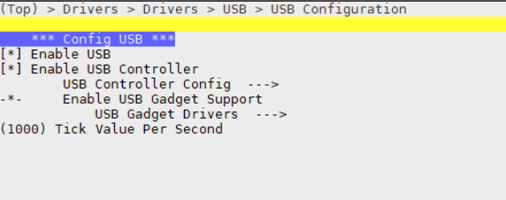

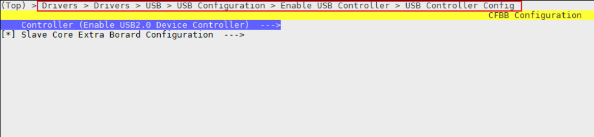

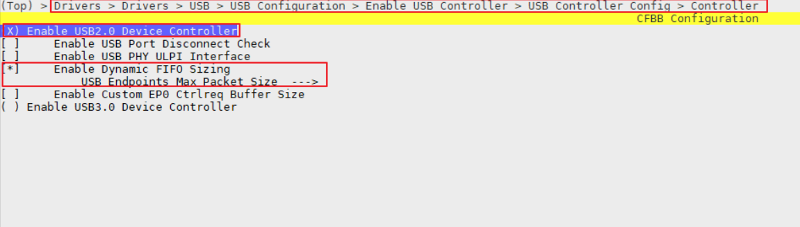

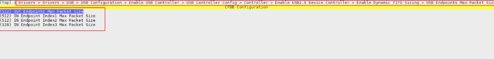

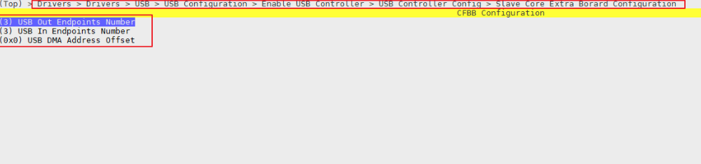

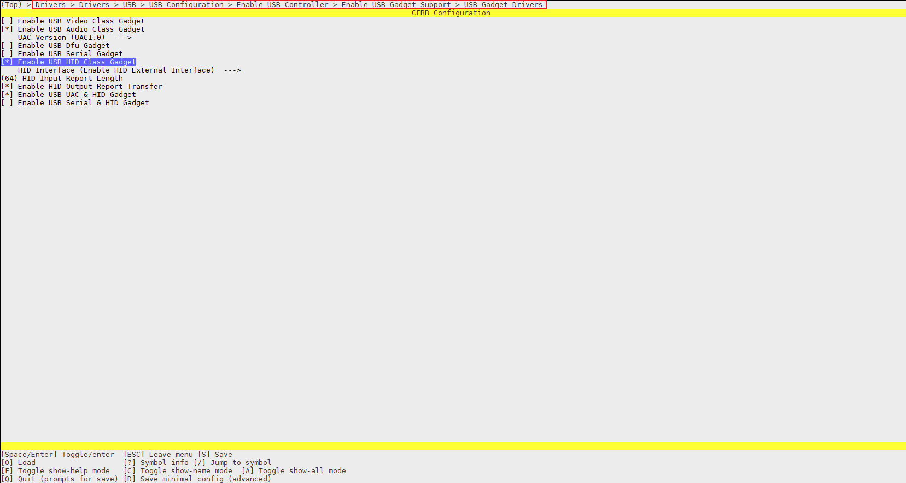

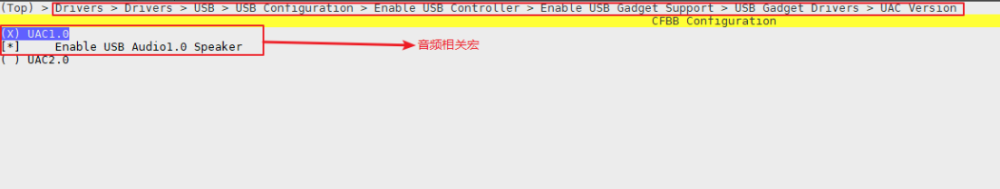

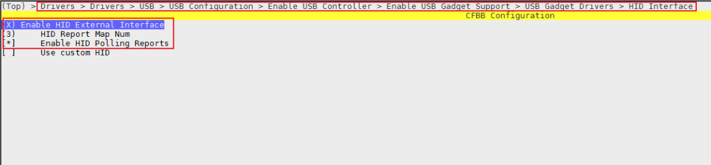

## 开发指引<a name="ZH-CN_TOPIC_0000001664984026"></a>

示例：

1.  配置报告描述符信息，设置报告数据格式和功能。

    ```
    int tesetsuit_usb_set_report_desc_hid(void)
    {
        return hid_add_report_descriptor(g_report_desc_hid, sizeof(g_report_desc_hid), 0);
    }
    ```

    g\_report\_desc\_hid为报告描述符，返回值为描述符的索引，用在“[4](#li129087107101)”中的发送接口里。

1.  首先配置device设备的VID、 PID、设备版本号和厂商、产品、序列号字符串信息。

    ```
        const char manufacturer[TEST_USB_MANUFACTURER_LEN] =  TEST_USB_MANUFACTURER;  /* 厂商ID */
        struct device_string str_manufacturer = {
            .str = manufacturer,
            .len = TEST_USB_MANUFACTURER_LEN  /* 厂商ID长度 */
        };
        const char product[TEST_USB_PRODUCT_LEN] = TEST_USB_PRODUCT;  /* 产品ID */
        struct device_string str_product = {
            .str = product,
            .len = TEST_USB_PRODUCT_LEN  /* 产品ID长度 */
        };
        const char serial[TEST_USB_SERIAL_LEN] = TEST_USB_SERIAL;  /* 序列号 */
        struct device_string str_serial_number = {
            .str = serial,
            .len = TEST_USB_SERIAL_LEN  /* 序列号长度 */
        };
        struct device_id dev_id = {
            .vendor_id = 0x1111,  /* VID */
            .product_id = 0x0009,  /* PID */
            .release_num = 0x0800  /* 版本号 */
        };
    
        if (usbd_set_device_info(dtype, &str_manufacturer, &str_product, &str_serial_number, dev_id) != 0) {
            test_suite_log_stringf("set device info fail!\n");
            return TEST_SUITE_TEST_FAILED;
        }
    ```

1.  USB初始化。device type为DEV\_HID。

    ```
    if (usb_init(DEVICE, dtype) != 0) {
            test_suite_log_stringf("usb_init failed!\n");
            return TEST_SUITE_TEST_FAILED;
    }
    ```

2.  <a name="li129087107101"></a>发送鼠标数据。这里以SOF中断中发送数据举例，也可自行调用发送数据的接口。

    ```
    uint8_t g_mouse_init_flag = 0;
    void usb_sof_intr_callback(void)
    {
        if (g_mouse_init_flag == 0) {
            return;
        }
        static uint8_t usb_sof_cnt = 0;
        usb_sof_cnt = (usb_sof_cnt + 1) % g_usb_mouse_polling_rate;
        if (usb_sof_cnt != 0) {
            return;
        }
        int16_t x = 0;
        int16_t y = 0;
        g_usb_hid_hs_mouse_operator.get_xy(&x, &y);
        g_send_mouse_msg.x = x;
        g_send_mouse_msg.y = y;
        fhid_send_data(g_mouse_index, (char *)&g_send_mouse_msg, USB_MOUSE_REPORTER_LEN);
    }
    ```

    由于数据接收接口为阻塞式接口，因此接收host数据。需要新起一个线程，在线程里执行数据接收操作，fhid\_recv\_data返回值为实际接收数据的长度，当返回值为负数时表示当前设备未连接、参数有误或者设备断连。

    下述样例为：接收host发送的数据，判断数据是否为切换至dfu设备的命令，如果是则执行去初始化再初始化为dfu设备\(dfu设备一般做升级用，详见USB\_DFU章节\)

    ```
    osal_kthread_create(usb_recv_task, NULL, "lcd_task", USB_RECV_STACK_SIZE); // 起线程
    int usb_recv_task(void *para) // 数据接收线程
    {
        UNUSED(para);
        uint8_t recv_data[RECV_MAX_LENGTH];
        for (;;) {
            int32_t ret = fhid_recv_data(tesetsuit_usb_get_hid_index(), (char*)recv_data, RECV_MAX_LENGTH); // 接收数据
            if (ret <= 0) {
                osDelay(USB_RECV_TASK_DELAY);
                continue;
            }
            if (ret == RECV_MAX_LENGTH && recv_data[0] == CUSTUMER_PAGE_REPORT_ID) { // 判断接收数据类型
                seboot_switch_dfu_t command;
                if (memcpy_s(&command, sizeof(seboot_switch_dfu_t), &recv_data[1], RECV_MAX_LENGTH - 1) != EOK) {
                    continue;
                }
                osal_printk("start_flag:%x\r\n", command.start_flag);
                osal_printk("packet_size:%x\r\n", command.packet_size);
                osal_printk("frame_type:%x\r\n", command.frame_type);
                osal_printk("frame_type_reserve:%x\r\n", command.frame_type_reserve);
                osal_printk("flag:%x\r\n", command.flag);
                osal_printk("check_sum:%x\r\n", command.check_sum);
                if (command.frame_type == SWITCH_TO_DFU_FLAG) {
                    osal_printk("start dfu\n");
                    usb_deinit();
                    usb_dfu_init(); // 初始化为dfu设备，详见USB_DFU章节
                    break;
                }
            }
        }
        osal_printk("usb recv task over\n");
        return 0;
    }
    
    ```

## 注意事项<a name="ZH-CN_TOPIC_0000001665143730"></a>

HID报告描述符配置后返回的索引一定要和发送数据接口的第一个参数保持一致，并且发送数据的格式是根据报告描述符定义的，也需要保持一致。

host下发的数据的第一个字节需要同报告描述符描述的report\_id一致，字节长度也需和报告描述符描述一致。

> **说明：** 
>若usb\_deinit接口的调用同fhid\_recv\_data不在同一个线程，则需要保证fhid\_recv\_data所在的线程的优先级比usb\_deinit所在线程的优先级高。以此确保在usb\_deinit时fhid\_recv\_data能够及时退出，防止deinit失败。

# USB\_DFU<a name="ZH-CN_TOPIC_0000001713023589"></a>


## 概述<a name="ZH-CN_TOPIC_0000001664983982"></a>

USB DFU设备全称为Device Firmware Upgrade设备固件更新，支持从host处接收新固件做升级。

## 功能概述<a name="ZH-CN_TOPIC_0000001713103529"></a>

DFU设备类型为通用串行总线设备，支持从host处接收大量数据，一般做设备升级用。

## KCONFIG配置<a name="ZH-CN_TOPIC_0000001937056821"></a>

暂无。

## 开发指引<a name="ZH-CN_TOPIC_0000001665143758"></a>

1.  配置device设备的VID、 PID、设备版本号和厂商、产品、序列号字符串信息。

    ```
    #define DFU_MANUFACTURER  { 'H', 0, 'H', 0, 'H', 0, 'H', 0, 'l', 0, 'i', 0, 'c', 0, 'o', 0, 'n', 0 }
    #define DFU_MANUFACTURER_LEN   20
    #define DFU_PRODUCT  { 'H', 0, 'H', 0, '6', 0, '6', 0, '6', 0, '6', 0, ' ', 0, 'U', 0, 'S', 0, 'B', 0 }
    #define DFU_PRODUCT_LEN        22
    #define DFU_SERIAL   { '2', 0, '0', 0, '2', 0, '0', 0, '0', 0, '6', 0, '2', 0, '4', 0 }
    #define DFU_SERIAL_LEN         16
    int usb_dfu_init(void)
    {
        int ret;
        const char manufacturer[DFU_MANUFACTURER_LEN] = DFU_MANUFACTURER;
        struct device_string str_manufacturer = {
            .str = manufacturer,
            .len = DFU_MANUFACTURER_LEN
        };
        const char product[DFU_PRODUCT_LEN] = DFU_PRODUCT;
        struct device_string str_product = {
            .str = product,
            .len = DFU_PRODUCT_LEN
        };
        const char serial[DFU_SERIAL_LEN] = DFU_SERIAL;
        struct device_string str_serial_number = {
            .str = serial,
            .len = DFU_SERIAL_LEN
        };
        struct device_id dev_id = {
            .vendor_id = 0x1111,
            .product_id = 0xa,
            .release_num = 0x0119
        };
        ret = usbd_set_device_info(DEV_DFU, &str_manufacturer, &str_product, &str_serial_number, dev_id); // 配置设备类型和设备信息
        if (ret != 0) {
            osal_printk("set device info fail!\n");
            return -1;
        }
        ret = usb_init(DEVICE, DEV_DFU);  // usb初始化为dfu设备
        if (ret != 0) {
            osal_printk("usb_init failed!\n");
            return -1;
        }
        return 0;
    }
    ```

2.  数据接收和处理。

    usb\_dfu\_download\_callback\(const uint8\_t \*buf, uint32\_t len\)为dfu设备数据接收的回调函数，当设备接收到数据时会自动调用此函数，参数表示数据地址和长度，下述示例为dfu升级流程：

    ```
    
    void usb_dfu_download_callback(const uint8_t *buf, uint32_t len)
    {
        static bool is_pack_header = true;
        if (buf == NULL || len == 0) {
            printf("upgrade done\r\n");  // 数据接收完成
            return;
        }
        if (is_pack_header) {
            dfu_packge_header_t *head = (dfu_packge_header_t *)buf;
            osal_printk("is_pack_header:%x\r\n", is_pack_header);
            osal_printk("start_flag:%x\r\n", head->start_flag);
            osal_printk("packet_size:%x\r\n", head->packet_size);
            osal_printk("frame_type:%x\r\n", head->frame_type);
            osal_printk("frame_type_reverse:%x\r\n", head->frame_type_reverse);
            osal_printk("file_addr:%x\r\n", head->file_addr);
            osal_printk("file_len:%x\r\n", head->file_len);
            osal_printk("erase_size:%x\r\n", head->erase_size);
            osal_printk("formal:%x\r\n", head->formal);
            osal_printk("formal_reverse:%x\r\n", head->formal_reverse);
            osal_printk("checksum:%x\r\n", head->checksum);
            is_pack_header = false;
            return;
        }
        osal_printk("          buf:");
        for (int i = 0; i < DFU_SERIAL_LEN; i++) {
            osal_printk("%x  ", buf[i]);
        }
        osal_printk("\n");
        uapi_eflash_erase((uint32_t)g_dfu_data, len);  // 将g_dfu_data处起始的flash空间清除len个字节
        uapi_eflash_write((uint32_t)g_dfu_data, (uint32_t *)(uintptr_t)buf, len); // 将接收到的数据写入flash
        g_dfu_write_len += len;
        if (uapi_crc16(0, buf, len) != uapi_crc16(0, (uint8_t *)(g_dfu_data + EMBED_FLASH_START), len)) {  // 验证写入flash后的数据和接收的数据一致
            osal_printk("check fail!\r\n");
            uapi_eflash_erase(FRAME_DOWNLOAD_OFFSET, g_dfu_write_len);
            cpu_utils_reset_chip_with_log((cores_t)APPS, REBOOT_CAUSE_APPLICATION_SYSRESETREQ);
        }
        for (int i = 0; i < DFU_SERIAL_LEN; i++) {
            osal_printk("%x  ", *(char *)(g_dfu_data + EMBED_FLASH_START + i));
        }
        osal_printk("\ng_dfu_write_len:%u  \n", g_dfu_write_len);
        g_dfu_data += len;
    }
    
    ```

## 注意事项<a name="ZH-CN_TOPIC_0000001713103517"></a>

USB在切换为DFU设备后其他功能无法正常使用，比如原先是HID鼠标设备，切换为DFU设备做升级时鼠标功能不会生效。

DFU设备和正常功能的设备的PID不能一样，例如：如果HID鼠标设备，PID为0x9, 在切换为DFU设备做升级时需要配置DFU设备的PID不等于0x9，否则在切换为DFU设备后host任会将设备识别成HID鼠标设备而不时DFU设备。

# I2S<a name="ZH-CN_TOPIC_0000001965127884"></a>


## 概述<a name="ZH-CN_TOPIC_0000001965130048"></a>

I2S（Inter-IC Sound, Integrated Interchip Sound，或简写IIS），是一种数字音频传输标准，用于数字音频数据在系统内部器件之间传输，例如编解码器 CODEC、DSP、数字输入/输出接口、ADC、DAC 和数字滤波器等。I2S是一个简单的数字接口协议，没有地址或设备选择机制，只能同时存在一个主设备和发送设备。在 I2S 总线上，提供时钟\(SCK 和 WS\)的设备为主设备。 I2S主要是通过SIO（Serial Input&Output）串行输入输出模块实现其功能，SIO接口支持I2S模式，I2S接口通常用于高保真音频应用，如音频播放器、音频录制设备和音频处理器等。

I2S总线包含四条线：时钟信号SCK，左右声道选择信号WS，数据输入信号DI，数据输出信号DO。

产品仅提供了I2S0这一组支持Master/Slaver模式的I2S外设，I2S规格如下：

-   支持两种操作模式，主模式和从模式，主模式SCK需要模块内部自己产生，而从模式由外部提供。
-   支持位宽为32bit×8的FIFO。

## 功能描述<a name="ZH-CN_TOPIC_0000002001610297"></a>

> **说明：** 
>如果I2S驱动想配置DMA模式读写数据，需要确保DMA驱动已经初始化。DMA初始化请参考“[DMA](DMA.md)”进行配置。

I2S模块提供的接口及功能如下：

-   uapi\_i2s\_init（sio\_bus\_t bus, i2s\_callback\_t callback）：初始化该I2S模块（bus表示当前使用的I2S bus总线，callback表示I2S设备的回调函数）。
-   uapi\_i2s\_deinit（sio\_bus\_t bus）：去初始化I2S模块（bus表示当前使用的I2S bus总线）。
-   uapi\_i2s\_set\_config（sio\_bus\_t bus, const i2s\_config\_t \*config）：设置I2S设备的配置信息（bus表示当前使用的I2S bus总线，config表示I2S设备的配置信息）。
-   uapi\_i2s\_get\_config（sio\_bus\_t bus, i2s\_config\_t \*config）：获取I2S设备的配置信息（bus表示当前使用的I2S bus总线，config表示I2S设备的配置信息）。
-   uapi\_i2s\_write\_data（sio\_bus\_t bus, i2s\_tx\_data\_t \*data）：I2S发送数据（bus表示当前使用的I2S bus总线，data表示I2S需要发送的数据）。
-   uapi\_i2s\_read\_start（sio\_bus\_t bus）：I2S rx使能，开始接收数据（bus表示当前使用的I2S bus总线）。
-   uapi\_i2s\_loopback（sio\_bus\_t bus, bool en）：设置I2S回环自测模式（bus表示当前使用的I2S bus总线，en表示是否配置I2S回环自测模式）。（打开CONFIG\_I2S\_SUPPORT\_LOOPBACK宏才能使用）
-   uapi\_i2s\_loop\_trans（sio\_bus\_t bus, i2s\_tx\_data\_t \*data）：开启I2S回环自测（bus表示当前使用的I2S bus总线，data表示I2S的数据传输配置）。
-   uapi\_i2s\_dma\_config（sio\_bus\_t bus, i2s\_dma\_attr\_t \*i2s\_dma\_cfg）：配置I2S DMA传输参数（bus表示当前使用的I2S bus总线，i2s\_dma\_cfg表示I2S DMA传输时的配置参数）。（打开CONFIG\_I2S\_SUPPORT\_DMA宏才能使用）
-   uapi\_i2s\_merge\_write\_by\_dma（sio\_bus\_t bus, const void \*buffer, uint32\_t length, i2s\_dma\_config\_t \*dma\_cfg, uintptr\_t arg, bool block）：merge模式下I2S通过DMA写数据（bus表示当前使用的I2S bus总线，buffer表示I2S需要发送的数据，length表示发送数据的长度，dma\_cfg表示I2S DMA传输时的配置参数，arg表示自定义参数指针，可被传递到中断处理函数，block表示阻塞传输还是非阻塞）。（打开CONFIG\_I2S\_SUPPORT\_DMA宏才能使用）
-   uapi\_i2s\_merge\_read\_by\_dma（sio\_bus\_t bus, const void \*buffer, uint32\_t length, i2s\_dma\_config\_t \*dma\_cfg, uintptr\_t arg, bool block）：merge模式下I2S通过DMA读数据（bus表示当前使用的I2S bus总线，buffer表示I2S读取数据缓冲区，length表示读取数据的长度，dma\_cfg表示I2S DMA传输时的配置参数，arg表示自定义参数指针，可被传递到中断处理函数，block表示阻塞传输还是非阻塞）。（打开CONFIG\_I2S\_SUPPORT\_DMA宏才能使用）

## KCONFIG配置<a name="ZH-CN_TOPIC_0000002001450849"></a>

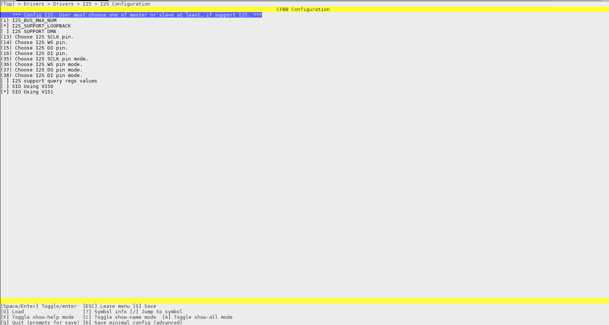

> **说明：** 
>若上述图片所示与表格描述不一致，请以表格为准。

配置宏具体描述如[表1](#table124761510114)所示。

**表 1**  I2S相关宏描述

<a name="table124761510114"></a>
<table><thead align="left"><tr id="row1248415121110"><th class="cellrowborder" valign="top" width="22.62773722627738%" id="mcps1.2.7.1.1"><p id="p1348201516115"><a name="p1348201516115"></a><a name="p1348201516115"></a>宏名称（CONFIG_是默认添加的前缀）</p>
</th>
<th class="cellrowborder" valign="top" width="21.137886211378866%" id="mcps1.2.7.1.2"><p id="p74861571119"><a name="p74861571119"></a><a name="p74861571119"></a>kconfig界面显示的具体描述</p>
</th>
<th class="cellrowborder" valign="top" width="19.878012198780127%" id="mcps1.2.7.1.3"><p id="p04818159112"><a name="p04818159112"></a><a name="p04818159112"></a>使用场景</p>
</th>
<th class="cellrowborder" valign="top" width="10.608939106089393%" id="mcps1.2.7.1.4"><p id="p948111510117"><a name="p948111510117"></a><a name="p948111510117"></a>是否已经实现</p>
</th>
<th class="cellrowborder" valign="top" width="11.328867113288673%" id="mcps1.2.7.1.5"><p id="p948181514115"><a name="p948181514115"></a><a name="p948181514115"></a>是否依赖其他宏</p>
</th>
<th class="cellrowborder" valign="top" width="14.418558144185583%" id="mcps1.2.7.1.6"><p id="p1162923893911"><a name="p1162923893911"></a><a name="p1162923893911"></a>是否选择打开或修改配置</p>
</th>
</tr>
</thead>
<tbody><tr id="row548141591113"><td class="cellrowborder" valign="top" width="22.62773722627738%" headers="mcps1.2.7.1.1 "><p id="p134819151113"><a name="p134819151113"></a><a name="p134819151113"></a>CONFIG_I2S_BUS_MAX_NUM</p>
</td>
<td class="cellrowborder" valign="top" width="21.137886211378866%" headers="mcps1.2.7.1.2 "><p id="p28673381813"><a name="p28673381813"></a><a name="p28673381813"></a>I2S_BUS_MAX_NUM.</p>
</td>
<td class="cellrowborder" valign="top" width="19.878012198780127%" headers="mcps1.2.7.1.3 "><p id="p182789183235"><a name="p182789183235"></a><a name="p182789183235"></a>I2S最大可配总线数量，本产品仅支持一组（I2S BUS0总线）</p>
</td>
<td class="cellrowborder" valign="top" width="10.608939106089393%" headers="mcps1.2.7.1.4 "><p id="p12489158112"><a name="p12489158112"></a><a name="p12489158112"></a>是</p>
</td>
<td class="cellrowborder" valign="top" width="11.328867113288673%" headers="mcps1.2.7.1.5 "><p id="p248815101112"><a name="p248815101112"></a><a name="p248815101112"></a>否</p>
</td>
<td class="cellrowborder" valign="top" width="14.418558144185583%" headers="mcps1.2.7.1.6 "><p id="p151371543346"><a name="p151371543346"></a><a name="p151371543346"></a>默认值是1，建议不做修改</p>
</td>
</tr>
<tr id="row1048121512114"><td class="cellrowborder" valign="top" width="22.62773722627738%" headers="mcps1.2.7.1.1 "><p id="p5486153111"><a name="p5486153111"></a><a name="p5486153111"></a>CONFIG_I2S_SUPPORT_LOOPBACK</p>
</td>
<td class="cellrowborder" valign="top" width="21.137886211378866%" headers="mcps1.2.7.1.2 "><p id="p6314610193820"><a name="p6314610193820"></a><a name="p6314610193820"></a>I2S_SUPPORT_LOOPBACK.</p>
</td>
<td class="cellrowborder" valign="top" width="19.878012198780127%" headers="mcps1.2.7.1.3 "><p id="p750495852813"><a name="p750495852813"></a><a name="p750495852813"></a>I2S支持单板回环模式</p>
</td>
<td class="cellrowborder" valign="top" width="10.608939106089393%" headers="mcps1.2.7.1.4 "><p id="p14483159117"><a name="p14483159117"></a><a name="p14483159117"></a>是</p>
</td>
<td class="cellrowborder" valign="top" width="11.328867113288673%" headers="mcps1.2.7.1.5 "><p id="p2629138193917"><a name="p2629138193917"></a><a name="p2629138193917"></a>否</p>
</td>
<td class="cellrowborder" valign="top" width="14.418558144185583%" headers="mcps1.2.7.1.6 "><p id="p16717115134416"><a name="p16717115134416"></a><a name="p16717115134416"></a>默认打开，建议打开</p>
</td>
</tr>
<tr id="row174821511118"><td class="cellrowborder" valign="top" width="22.62773722627738%" headers="mcps1.2.7.1.1 "><p id="p164871501115"><a name="p164871501115"></a><a name="p164871501115"></a>CONFIG_I2S_SUPPORT_DMA</p>
</td>
<td class="cellrowborder" valign="top" width="21.137886211378866%" headers="mcps1.2.7.1.2 "><p id="p1534374635"><a name="p1534374635"></a><a name="p1534374635"></a>I2S SUPPORT DMA.</p>
</td>
<td class="cellrowborder" valign="top" width="19.878012198780127%" headers="mcps1.2.7.1.3 "><p id="p1534582015113"><a name="p1534582015113"></a><a name="p1534582015113"></a>I2S支持DMA模式</p>
</td>
<td class="cellrowborder" valign="top" width="10.608939106089393%" headers="mcps1.2.7.1.4 "><p id="p1481815141111"><a name="p1481815141111"></a><a name="p1481815141111"></a>是</p>
</td>
<td class="cellrowborder" valign="top" width="11.328867113288673%" headers="mcps1.2.7.1.5 "><p id="p8473437181816"><a name="p8473437181816"></a><a name="p8473437181816"></a>否</p>
</td>
<td class="cellrowborder" valign="top" width="14.418558144185583%" headers="mcps1.2.7.1.6 "><p id="p97001027124119"><a name="p97001027124119"></a><a name="p97001027124119"></a>默认关闭，视情况选择</p>
</td>
</tr>
<tr id="row1848115131117"><td class="cellrowborder" valign="top" width="22.62773722627738%" headers="mcps1.2.7.1.1 "><p id="p548181571118"><a name="p548181571118"></a><a name="p548181571118"></a>CONFIG_I2S_SCLK_PIN</p>
</td>
<td class="cellrowborder" valign="top" width="21.137886211378866%" headers="mcps1.2.7.1.2 "><p id="p1326114416384"><a name="p1326114416384"></a><a name="p1326114416384"></a>Choose I2S SCLK pin.</p>
</td>
<td class="cellrowborder" valign="top" width="19.878012198780127%" headers="mcps1.2.7.1.3 "><p id="p0369111616584"><a name="p0369111616584"></a><a name="p0369111616584"></a>I2S时钟管脚</p>
</td>
<td class="cellrowborder" valign="top" width="10.608939106089393%" headers="mcps1.2.7.1.4 "><p id="p154813150114"><a name="p154813150114"></a><a name="p154813150114"></a>是</p>
</td>
<td class="cellrowborder" valign="top" width="11.328867113288673%" headers="mcps1.2.7.1.5 "><p id="p184291153201819"><a name="p184291153201819"></a><a name="p184291153201819"></a>否</p>
</td>
<td class="cellrowborder" valign="top" width="14.418558144185583%" headers="mcps1.2.7.1.6 "><p id="p621764843713"><a name="p621764843713"></a><a name="p621764843713"></a>默认值是13，视情况选择配置</p>
</td>
</tr>
<tr id="row194815159113"><td class="cellrowborder" valign="top" width="22.62773722627738%" headers="mcps1.2.7.1.1 "><p id="p124801510112"><a name="p124801510112"></a><a name="p124801510112"></a>CONFIG_I2S_WS_PIN</p>
</td>
<td class="cellrowborder" valign="top" width="21.137886211378866%" headers="mcps1.2.7.1.2 "><p id="p824263818316"><a name="p824263818316"></a><a name="p824263818316"></a>Choose I2S WS pin.</p>
</td>
<td class="cellrowborder" valign="top" width="19.878012198780127%" headers="mcps1.2.7.1.3 "><p id="p9328125416384"><a name="p9328125416384"></a><a name="p9328125416384"></a>I2S左右声道管脚</p>
</td>
<td class="cellrowborder" valign="top" width="10.608939106089393%" headers="mcps1.2.7.1.4 "><p id="p348215161113"><a name="p348215161113"></a><a name="p348215161113"></a>是</p>
</td>
<td class="cellrowborder" valign="top" width="11.328867113288673%" headers="mcps1.2.7.1.5 "><p id="p115505376560"><a name="p115505376560"></a><a name="p115505376560"></a>否</p>
</td>
<td class="cellrowborder" valign="top" width="14.418558144185583%" headers="mcps1.2.7.1.6 "><p id="p188515553711"><a name="p188515553711"></a><a name="p188515553711"></a>默认值是14，视情况选择配置</p>
</td>
</tr>
<tr id="row1048181518112"><td class="cellrowborder" valign="top" width="22.62773722627738%" headers="mcps1.2.7.1.1 "><p id="p109831846175713"><a name="p109831846175713"></a><a name="p109831846175713"></a>CONFIG_I2S_DO_PIN</p>
</td>
<td class="cellrowborder" valign="top" width="21.137886211378866%" headers="mcps1.2.7.1.2 "><p id="p1092835010319"><a name="p1092835010319"></a><a name="p1092835010319"></a>Choose I2S DO pin.</p>
</td>
<td class="cellrowborder" valign="top" width="19.878012198780127%" headers="mcps1.2.7.1.3 "><p id="p590039143911"><a name="p590039143911"></a><a name="p590039143911"></a>I2S输出管脚</p>
</td>
<td class="cellrowborder" valign="top" width="10.608939106089393%" headers="mcps1.2.7.1.4 "><p id="p24911531115"><a name="p24911531115"></a><a name="p24911531115"></a>是</p>
</td>
<td class="cellrowborder" valign="top" width="11.328867113288673%" headers="mcps1.2.7.1.5 "><p id="p49831518183718"><a name="p49831518183718"></a><a name="p49831518183718"></a>否</p>
</td>
<td class="cellrowborder" valign="top" width="14.418558144185583%" headers="mcps1.2.7.1.6 "><p id="p0846144113716"><a name="p0846144113716"></a><a name="p0846144113716"></a>默认值是15，视情况选择配置</p>
</td>
</tr>
<tr id="row1071318918131"><td class="cellrowborder" valign="top" width="22.62773722627738%" headers="mcps1.2.7.1.1 "><p id="p671319910134"><a name="p671319910134"></a><a name="p671319910134"></a>CONFIG_I2S_DI_PIN</p>
</td>
<td class="cellrowborder" valign="top" width="21.137886211378866%" headers="mcps1.2.7.1.2 "><p id="p2086620416410"><a name="p2086620416410"></a><a name="p2086620416410"></a>Choose I2S DI pin..</p>
</td>
<td class="cellrowborder" valign="top" width="19.878012198780127%" headers="mcps1.2.7.1.3 "><p id="p71937216399"><a name="p71937216399"></a><a name="p71937216399"></a>I2S输入管脚</p>
</td>
<td class="cellrowborder" valign="top" width="10.608939106089393%" headers="mcps1.2.7.1.4 "><p id="p1571316971311"><a name="p1571316971311"></a><a name="p1571316971311"></a>是</p>
</td>
<td class="cellrowborder" valign="top" width="11.328867113288673%" headers="mcps1.2.7.1.5 "><p id="p3642132173716"><a name="p3642132173716"></a><a name="p3642132173716"></a>否</p>
</td>
<td class="cellrowborder" valign="top" width="14.418558144185583%" headers="mcps1.2.7.1.6 "><p id="p348812572375"><a name="p348812572375"></a><a name="p348812572375"></a>默认值是16，视情况选择配置</p>
</td>
</tr>
<tr id="row1663153711314"><td class="cellrowborder" valign="top" width="22.62773722627738%" headers="mcps1.2.7.1.1 "><p id="p13663183721310"><a name="p13663183721310"></a><a name="p13663183721310"></a>CONFIG_I2S_SCLK_PIN_MODE</p>
</td>
<td class="cellrowborder" valign="top" width="21.137886211378866%" headers="mcps1.2.7.1.2 "><p id="p1030517151649"><a name="p1030517151649"></a><a name="p1030517151649"></a>Choose I2S SCLK pin mode.</p>
</td>
<td class="cellrowborder" valign="top" width="19.878012198780127%" headers="mcps1.2.7.1.3 "><p id="p116051364020"><a name="p116051364020"></a><a name="p116051364020"></a>I2S时钟管脚对应配置的模式</p>
</td>
<td class="cellrowborder" valign="top" width="10.608939106089393%" headers="mcps1.2.7.1.4 "><p id="p186635371131"><a name="p186635371131"></a><a name="p186635371131"></a>是</p>
</td>
<td class="cellrowborder" valign="top" width="11.328867113288673%" headers="mcps1.2.7.1.5 "><p id="p116001823133710"><a name="p116001823133710"></a><a name="p116001823133710"></a>否</p>
</td>
<td class="cellrowborder" valign="top" width="14.418558144185583%" headers="mcps1.2.7.1.6 "><p id="p125242276524"><a name="p125242276524"></a><a name="p125242276524"></a>默认值是35，视情况选择配置</p>
</td>
</tr>
<tr id="row1115204491314"><td class="cellrowborder" valign="top" width="22.62773722627738%" headers="mcps1.2.7.1.1 "><p id="p20115184431314"><a name="p20115184431314"></a><a name="p20115184431314"></a>CONFIG_I2S_WS_PIN_MODE</p>
</td>
<td class="cellrowborder" valign="top" width="21.137886211378866%" headers="mcps1.2.7.1.2 "><p id="p1038192719410"><a name="p1038192719410"></a><a name="p1038192719410"></a>Choose I2S WS pin mode.</p>
</td>
<td class="cellrowborder" valign="top" width="19.878012198780127%" headers="mcps1.2.7.1.3 "><p id="p2584933174017"><a name="p2584933174017"></a><a name="p2584933174017"></a>I2S左右声道管脚对应配置的模式</p>
</td>
<td class="cellrowborder" valign="top" width="10.608939106089393%" headers="mcps1.2.7.1.4 "><p id="p9115124411312"><a name="p9115124411312"></a><a name="p9115124411312"></a>是</p>
</td>
<td class="cellrowborder" valign="top" width="11.328867113288673%" headers="mcps1.2.7.1.5 "><p id="p5115544151311"><a name="p5115544151311"></a><a name="p5115544151311"></a>否</p>
</td>
<td class="cellrowborder" valign="top" width="14.418558144185583%" headers="mcps1.2.7.1.6 "><p id="p1581862173810"><a name="p1581862173810"></a><a name="p1581862173810"></a>默认值是36，视情况选择配置</p>
</td>
</tr>
<tr id="row9686349171316"><td class="cellrowborder" valign="top" width="22.62773722627738%" headers="mcps1.2.7.1.1 "><p id="p2068610490135"><a name="p2068610490135"></a><a name="p2068610490135"></a>CONFIG_I2S_DO_PIN_MODE</p>
</td>
<td class="cellrowborder" valign="top" width="21.137886211378866%" headers="mcps1.2.7.1.2 "><p id="p1699112401448"><a name="p1699112401448"></a><a name="p1699112401448"></a>Choose I2S DO pin mode.</p>
</td>
<td class="cellrowborder" valign="top" width="19.878012198780127%" headers="mcps1.2.7.1.3 "><p id="p104611368409"><a name="p104611368409"></a><a name="p104611368409"></a>I2S输出管脚对应配置的模式</p>
</td>
<td class="cellrowborder" valign="top" width="10.608939106089393%" headers="mcps1.2.7.1.4 "><p id="p12686184941312"><a name="p12686184941312"></a><a name="p12686184941312"></a>是</p>
</td>
<td class="cellrowborder" valign="top" width="11.328867113288673%" headers="mcps1.2.7.1.5 "><p id="p26871249111313"><a name="p26871249111313"></a><a name="p26871249111313"></a>否</p>
</td>
<td class="cellrowborder" valign="top" width="14.418558144185583%" headers="mcps1.2.7.1.6 "><p id="p19767274385"><a name="p19767274385"></a><a name="p19767274385"></a>默认值是37，视情况选择配置</p>
</td>
</tr>
<tr id="row10100123917141"><td class="cellrowborder" valign="top" width="22.62773722627738%" headers="mcps1.2.7.1.1 "><p id="p6359290154"><a name="p6359290154"></a><a name="p6359290154"></a>CONFIG_I2S_DI_PIN_MODE</p>
</td>
<td class="cellrowborder" valign="top" width="21.137886211378866%" headers="mcps1.2.7.1.2 "><p id="p15555612193419"><a name="p15555612193419"></a><a name="p15555612193419"></a>Choose I2S DI pin mode.</p>
</td>
<td class="cellrowborder" valign="top" width="19.878012198780127%" headers="mcps1.2.7.1.3 "><p id="p84591138144018"><a name="p84591138144018"></a><a name="p84591138144018"></a>I2S输入管脚对应配置的模式</p>
</td>
<td class="cellrowborder" valign="top" width="10.608939106089393%" headers="mcps1.2.7.1.4 "><p id="p131001439161420"><a name="p131001439161420"></a><a name="p131001439161420"></a>是</p>
</td>
<td class="cellrowborder" valign="top" width="11.328867113288673%" headers="mcps1.2.7.1.5 "><p id="p110083912148"><a name="p110083912148"></a><a name="p110083912148"></a>否</p>
</td>
<td class="cellrowborder" valign="top" width="14.418558144185583%" headers="mcps1.2.7.1.6 "><p id="p3987163313819"><a name="p3987163313819"></a><a name="p3987163313819"></a>默认值是38，视情况选择配置</p>
</td>
</tr>
<tr id="row9604124541418"><td class="cellrowborder" valign="top" width="22.62773722627738%" headers="mcps1.2.7.1.1 "><p id="p1198461021518"><a name="p1198461021518"></a><a name="p1198461021518"></a>CONFIG_I2S_SUPPORT_QUERY_REGS</p>
</td>
<td class="cellrowborder" valign="top" width="21.137886211378866%" headers="mcps1.2.7.1.2 "><p id="p142671250514"><a name="p142671250514"></a><a name="p142671250514"></a>I2S support query regs values.</p>
</td>
<td class="cellrowborder" valign="top" width="19.878012198780127%" headers="mcps1.2.7.1.3 "><p id="p14915153115"><a name="p14915153115"></a><a name="p14915153115"></a>I2S支持回读所有相关寄存器的值，视情况选择</p>
</td>
<td class="cellrowborder" valign="top" width="10.608939106089393%" headers="mcps1.2.7.1.4 "><p id="p1860512452145"><a name="p1860512452145"></a><a name="p1860512452145"></a>是</p>
</td>
<td class="cellrowborder" valign="top" width="11.328867113288673%" headers="mcps1.2.7.1.5 "><p id="p13605145101411"><a name="p13605145101411"></a><a name="p13605145101411"></a>否</p>
</td>
<td class="cellrowborder" valign="top" width="14.418558144185583%" headers="mcps1.2.7.1.6 "><p id="p1817114179353"><a name="p1817114179353"></a><a name="p1817114179353"></a>默认关闭，视情况选择，建议关闭</p>
</td>
</tr>
<tr id="row4155553141"><td class="cellrowborder" valign="top" width="22.62773722627738%" headers="mcps1.2.7.1.1 "><p id="p2119131217152"><a name="p2119131217152"></a><a name="p2119131217152"></a>CONFIG_SIO_USING_V150</p>
</td>
<td class="cellrowborder" valign="top" width="21.137886211378866%" headers="mcps1.2.7.1.2 "><p id="p879573724713"><a name="p879573724713"></a><a name="p879573724713"></a>SIO Using V150.</p>
</td>
<td class="cellrowborder" valign="top" width="19.878012198780127%" headers="mcps1.2.7.1.3 "><p id="p174918153116"><a name="p174918153116"></a><a name="p174918153116"></a>该宏代表使用SIO V150的驱动规格，本产品不使用该规格</p>
</td>
<td class="cellrowborder" valign="top" width="10.608939106089393%" headers="mcps1.2.7.1.4 "><p id="p201555511146"><a name="p201555511146"></a><a name="p201555511146"></a>是</p>
</td>
<td class="cellrowborder" valign="top" width="11.328867113288673%" headers="mcps1.2.7.1.5 "><p id="p1280317457132"><a name="p1280317457132"></a><a name="p1280317457132"></a>否</p>
</td>
<td class="cellrowborder" valign="top" width="14.418558144185583%" headers="mcps1.2.7.1.6 "><p id="p7644175334613"><a name="p7644175334613"></a><a name="p7644175334613"></a>默认关闭，必须关闭</p>
</td>
</tr>
<tr id="row155854071519"><td class="cellrowborder" valign="top" width="22.62773722627738%" headers="mcps1.2.7.1.1 "><p id="p1289513201519"><a name="p1289513201519"></a><a name="p1289513201519"></a>CONFIG_DATA_LEN_MAX</p>
</td>
<td class="cellrowborder" valign="top" width="21.137886211378866%" headers="mcps1.2.7.1.2 "><p id="p191602044299"><a name="p191602044299"></a><a name="p191602044299"></a>DATA_LEN_MAX.</p>
</td>
<td class="cellrowborder" valign="top" width="19.878012198780127%" headers="mcps1.2.7.1.3 "><p id="p123612018467"><a name="p123612018467"></a><a name="p123612018467"></a>I2S发送数据的最大长度，本产品不使用</p>
</td>
<td class="cellrowborder" valign="top" width="10.608939106089393%" headers="mcps1.2.7.1.4 "><p id="p145852091517"><a name="p145852091517"></a><a name="p145852091517"></a>是</p>
</td>
<td class="cellrowborder" valign="top" width="11.328867113288673%" headers="mcps1.2.7.1.5 "><p id="p9786113516223"><a name="p9786113516223"></a><a name="p9786113516223"></a>CONFIG_SIO_USING_V150</p>
</td>
<td class="cellrowborder" valign="top" width="14.418558144185583%" headers="mcps1.2.7.1.6 "><p id="p2184155224611"><a name="p2184155224611"></a><a name="p2184155224611"></a>默认关闭，必须关闭</p>
</td>
</tr>
<tr id="row1120612316161"><td class="cellrowborder" valign="top" width="22.62773722627738%" headers="mcps1.2.7.1.1 "><p id="p12207162314169"><a name="p12207162314169"></a><a name="p12207162314169"></a>CONFIG_I2S_RX_THRESHOLD</p>
</td>
<td class="cellrowborder" valign="top" width="21.137886211378866%" headers="mcps1.2.7.1.2 "><p id="p1744711148101"><a name="p1744711148101"></a><a name="p1744711148101"></a>Threshold of the I2S RX channel.</p>
</td>
<td class="cellrowborder" valign="top" width="19.878012198780127%" headers="mcps1.2.7.1.3 "><p id="p1357732211468"><a name="p1357732211468"></a><a name="p1357732211468"></a>I2S的RX水线阈值，本产品不使用</p>
</td>
<td class="cellrowborder" valign="top" width="10.608939106089393%" headers="mcps1.2.7.1.4 "><p id="p10207202331613"><a name="p10207202331613"></a><a name="p10207202331613"></a>是</p>
</td>
<td class="cellrowborder" valign="top" width="11.328867113288673%" headers="mcps1.2.7.1.5 "><p id="p160038202210"><a name="p160038202210"></a><a name="p160038202210"></a>CONFIG_SIO_USING_V150</p>
</td>
<td class="cellrowborder" valign="top" width="14.418558144185583%" headers="mcps1.2.7.1.6 "><p id="p102101238132610"><a name="p102101238132610"></a><a name="p102101238132610"></a>默认关闭，必须关闭</p>
</td>
</tr>
<tr id="row18951740131615"><td class="cellrowborder" valign="top" width="22.62773722627738%" headers="mcps1.2.7.1.1 "><p id="p197481234181715"><a name="p197481234181715"></a><a name="p197481234181715"></a>CONFIG_I2S_TX_THRESHOLD</p>
</td>
<td class="cellrowborder" valign="top" width="21.137886211378866%" headers="mcps1.2.7.1.2 "><p id="p199591808107"><a name="p199591808107"></a><a name="p199591808107"></a>Threshold of the I2S TX channel.</p>
</td>
<td class="cellrowborder" valign="top" width="19.878012198780127%" headers="mcps1.2.7.1.3 "><p id="p18943035112516"><a name="p18943035112516"></a><a name="p18943035112516"></a>I2S的TX水线阈值，本产品不使用</p>
</td>
<td class="cellrowborder" valign="top" width="10.608939106089393%" headers="mcps1.2.7.1.4 "><p id="p16957407165"><a name="p16957407165"></a><a name="p16957407165"></a>是</p>
</td>
<td class="cellrowborder" valign="top" width="11.328867113288673%" headers="mcps1.2.7.1.5 "><p id="p1747283962219"><a name="p1747283962219"></a><a name="p1747283962219"></a>CONFIG_SIO_USING_V150</p>
</td>
<td class="cellrowborder" valign="top" width="14.418558144185583%" headers="mcps1.2.7.1.6 "><p id="p10101124013263"><a name="p10101124013263"></a><a name="p10101124013263"></a>默认关闭，必须关闭</p>
</td>
</tr>
<tr id="row16469746171619"><td class="cellrowborder" valign="top" width="22.62773722627738%" headers="mcps1.2.7.1.1 "><p id="p13831935111710"><a name="p13831935111710"></a><a name="p13831935111710"></a>CONFIG_I2S_BCLK_DIV_NUM</p>
</td>
<td class="cellrowborder" valign="top" width="21.137886211378866%" headers="mcps1.2.7.1.2 "><p id="p19991173441010"><a name="p19991173441010"></a><a name="p19991173441010"></a>NUM of the I2S BCLK DIV.</p>
</td>
<td class="cellrowborder" valign="top" width="19.878012198780127%" headers="mcps1.2.7.1.3 "><p id="p56134571811"><a name="p56134571811"></a><a name="p56134571811"></a>I2S BCLK分频数，本产品暂不使用</p>
</td>
<td class="cellrowborder" valign="top" width="10.608939106089393%" headers="mcps1.2.7.1.4 "><p id="p154691146191615"><a name="p154691146191615"></a><a name="p154691146191615"></a>是</p>
</td>
<td class="cellrowborder" valign="top" width="11.328867113288673%" headers="mcps1.2.7.1.5 "><p id="p4914440172218"><a name="p4914440172218"></a><a name="p4914440172218"></a>CONFIG_SIO_USING_V150</p>
</td>
<td class="cellrowborder" valign="top" width="14.418558144185583%" headers="mcps1.2.7.1.6 "><p id="p121651642142612"><a name="p121651642142612"></a><a name="p121651642142612"></a>默认关闭，必须关闭</p>
</td>
</tr>
<tr id="row133512133512"><td class="cellrowborder" valign="top" width="22.62773722627738%" headers="mcps1.2.7.1.1 "><p id="p0328717114020"><a name="p0328717114020"></a><a name="p0328717114020"></a>CONFIG_SIO_USING_V151</p>
</td>
<td class="cellrowborder" valign="top" width="21.137886211378866%" headers="mcps1.2.7.1.2 "><p id="p117931759173519"><a name="p117931759173519"></a><a name="p117931759173519"></a>SIO Using V151.</p>
</td>
<td class="cellrowborder" valign="top" width="19.878012198780127%" headers="mcps1.2.7.1.3 "><p id="p187131459122518"><a name="p187131459122518"></a><a name="p187131459122518"></a>该宏代表使用SIO V151的驱动规格，本产品默认使用该规格</p>
</td>
<td class="cellrowborder" valign="top" width="10.608939106089393%" headers="mcps1.2.7.1.4 "><p id="p123283175403"><a name="p123283175403"></a><a name="p123283175403"></a>是</p>
</td>
<td class="cellrowborder" valign="top" width="11.328867113288673%" headers="mcps1.2.7.1.5 "><p id="p9328151794011"><a name="p9328151794011"></a><a name="p9328151794011"></a>否</p>
</td>
<td class="cellrowborder" valign="top" width="14.418558144185583%" headers="mcps1.2.7.1.6 "><p id="p12328191719406"><a name="p12328191719406"></a><a name="p12328191719406"></a>默认打开，必选</p>
</td>
</tr>
</tbody>
</table>

## 开发指引<a name="ZH-CN_TOPIC_0000001964970260"></a>

I2S用于对接支持I2S协议的设备，I2S单元可以作为主设备或从设备。以I2S单元作为主设备为例：

1.  通过调用sio\_porting\_i2s\_pinmux接口，进行IO复用，将用到的管脚复用为I2S功能。
2.  调用uapi\_i2s\_init以及uapi\_i2s\_set\_config接口，初始化I2S资源，此处以初始化I2S主机为例：

    ```
    void sample_i2s_init(void)
    {
        i2s_config_t config = {
            .drive_mode= MASTER,
            .transfer_mode = STD_MODE,
            .data_width = TWENTY_FOUR_BIT,
            .channels_num = TWO_CH,
            .timing = NONE_TIMING_MODE,
            .clk_edge = RISING_EDGE,
            .div_number = I2S_DIV_NUM,
            .number_of_channels = I2S_NUMBER_OF_CHANNELS,
        };
        /* 设置 i2s pinmux */
        sio_porting_i2s_pinmux();       /* 设置 i2s pinmux */
        /* 初始化 i2s0 */
        uapi_i2s_init(SIO_BUS_0, app_i2s_rx_callback);
        uapi_i2s_set_config(SIO_BUS_0, &config);
    }
    ```

3.  调用uapi\_i2s\_write\_data接口，实现主机发送数据。

    ```
    errcode_t sample_i2s_write(i2s_tx_data_t *data)
    {
        return uapi_i2s_write_data(SIO_BUS_0, &data);     /* 发送数据 */
    }
    ```

I2S DMA主从收发完整代码流程可参考以下代码：

```
#include "i2s.h"
#include "watchdog.h"
#include "hal_sio.h"
#include "hal_dma.h"
#include "soc_osal.h"
#include "app_init.h"

#define I2S_DIV_NUMBER              32
#define I2S_CHANNEL_NUMBER          2
#define I2S_TX_INT_THRESHOLD        7
#define I2S_RX_INT_THRESHOLD        1
#define I2S_DMA_SRC_WIDTH           2
#define I2S_DMA_DEST_WIDTH          2
#define I2S_DMA_BURST_LENGTH        0
#define I2S_DMA_TRANS_STEP          2

#define I2S_TASK_PRIO               24
#define I2S_TASK_STACK_SIZE         0xc00

static uint32_t g_i2s_first_data = 0x10000000;    /* 32 bits */
static uint32_t g_i2s_send_dma_data[CONFIG_I2S_TRANSFER_LEN_OF_DMA] = { 0 };

static void *i2s_dma_master_task(const char *arg)
{
    unused(arg);
    int32_t ret = CONFIG_I2S_TRANSFER_LEN_OF_DMA;
#if defined(CONFIG_SIO_USING_V151)
    ret = ERRCODE_SUCC;
#endif
    uapi_i2s_deinit(SIO_BUS_0);
    uapi_dma_deinit();
    uapi_i2s_init(SIO_BUS_0, NULL);
    sio_porting_i2s_pinmux();
    i2s_config_t config = {
        .drive_mode= MASTER,
        .transfer_mode = STD_MODE,
        .data_width = THIRTY_TWO_BIT,
        .channels_num = TWO_CH,
        .timing = NONE_TIMING_MODE,
        .clk_edge = RISING_EDGE,
        .div_number = I2S_DIV_NUMBER,
        .number_of_channels = I2S_CHANNEL_NUMBER,
    };
    i2s_dma_attr_t attr = {
        .tx_dma_enable = 1,
        .tx_int_threshold = I2S_TX_INT_THRESHOLD,
        .rx_dma_enable = 0,
        .rx_int_threshold = I2S_RX_INT_THRESHOLD,
    };
    i2s_dma_config_t dma_cfg = {
        .src_width = I2S_DMA_SRC_WIDTH,
        .dest_width = I2S_DMA_DEST_WIDTH,
        .burst_length = I2S_DMA_BURST_LENGTH,
        .priority = 0,
    };
    uapi_i2s_set_config(SIO_BUS_0, &config);
    uapi_i2s_dma_config(SIO_BUS_0, &attr);

    for (uint32_t i = 0; i < CONFIG_I2S_TRANSFER_LEN_OF_DMA; i += I2S_DMA_TRANS_STEP) {
        g_i2s_send_dma_data[i] = g_i2s_first_data;
        g_i2s_send_dma_data[i + 1] = g_i2s_first_data;
        g_i2s_first_data++;
    }
    /* DMA init. */
    uapi_dma_init();
    uapi_dma_open();

    osal_printk("DMA master transfer start.\r\n");
    while (1) {
        uapi_watchdog_kick();
        if (uapi_i2s_merge_write_by_dma(SIO_BUS_0, &g_i2s_send_dma_data, CONFIG_I2S_TRANSFER_LEN_OF_DMA, &dma_cfg,
            (uintptr_t)NULL, true) != ret) {
            osal_printk("master uapi_i2s_merge_write_by_dma error.\r\n");
        }
    }
    return NULL;
}

static void i2s_entry(void)
{
    osal_task *task_handle = NULL;
    osal_kthread_lock();
    task_handle = osal_kthread_create((osal_kthread_handler)i2s_dma_master_task, 0, "I2sDmaMasterTask",
                                      I2S_TASK_STACK_SIZE);
    if (task_handle != NULL) {
        osal_kthread_set_priority(task_handle, I2S_TASK_PRIO);
    }
    osal_kthread_unlock();
}

/* Run the i2s_entry. */
app_run(i2s_entry);

-----------------------------------------------------------------

#include "i2s.h"
#include "watchdog.h"
#include "hal_sio.h"
#include "hal_dma.h"
#include "soc_osal.h"
#include "app_init.h"

#define I2S_DIV_NUMBER              32
#define I2S_CHANNEL_NUMBER          2
#define I2S_TX_INT_THRESHOLD        7
#define I2S_RX_INT_THRESHOLD        1
#define I2S_DMA_TRANSFER_EVENT      1
#define I2S_RING_BUFFER_NUMBER      4

#define I2S_TASK_PRIO               24
#define I2S_TASK_STACK_SIZE         0xc00

static uint32_t g_i2s_dma_data0[CONFIG_I2S_TRANSFER_LEN_OF_DMA] = { 0 };
static uint32_t g_i2s_dma_data1[CONFIG_I2S_TRANSFER_LEN_OF_DMA] = { 0 };
static uint32_t g_i2s_dma_data2[CONFIG_I2S_TRANSFER_LEN_OF_DMA] = { 0 };
static uint32_t g_i2s_dma_data3[CONFIG_I2S_TRANSFER_LEN_OF_DMA] = { 0 };
static uint32_t *g_i2s_dma_data[I2S_RING_BUFFER_NUMBER] = {
    g_i2s_dma_data0, g_i2s_dma_data1, g_i2s_dma_data2, g_i2s_dma_data3};
static uint8_t g_read_buffer_state = 0;
static osal_event g_i2s_dma_id;

static void i2s_dma_transfer_restart(void);

static int32_t i2s_start_dma_transfer(uint32_t *i2s_buffer, dma_transfer_cb_t trans_done)
{
    dma_ch_user_peripheral_config_t transfer_config;
    uint8_t channel = 0;

    transfer_config.src = i2s_porting_rx_merge_data_addr_get(SIO_BUS_0);
    transfer_config.dest = (uint32_t)(uintptr_t)i2s_buffer;
    transfer_config.transfer_num = (uint16_t)CONFIG_I2S_TRANSFER_LEN_OF_DMA;
    transfer_config.src_handshaking = HAL_DMA_HANDSHAKING_I2S_RX;
    transfer_config.dest_handshaking = 0;
    transfer_config.trans_type = HAL_DMA_TRANS_PERIPHERAL_TO_MEMORY_DMA;
    transfer_config.trans_dir = HAL_DMA_TRANSFER_DIR_PERIPHERAL_TO_MEM;
    transfer_config.priority = 0;
    transfer_config.src_width = HAL_DMA_TRANSFER_WIDTH_32;
    transfer_config.dest_width = HAL_DMA_TRANSFER_WIDTH_32;
    transfer_config.burst_length = 0;
    transfer_config.src_increment = HAL_DMA_ADDRESS_INC_NO_CHANGE;
    transfer_config.dest_increment = HAL_DMA_ADDRESS_INC_INCREMENT;
    transfer_config.protection = HAL_DMA_PROTECTION_CONTROL_BUFFERABLE;

    errcode_t ret = uapi_dma_configure_peripheral_transfer_single(&transfer_config, &channel,
                                                                  trans_done, (uintptr_t)NULL);
    if (ret != ERRCODE_SUCC) {
        osal_printk("%s Configure the DMA fail. %x\r\n", "i2s dma", ret);
        return 1;
    }
    ret = uapi_dma_start_transfer(channel);
    if (ret != ERRCODE_SUCC) {
        osal_printk("%s Start the DMA fail. %x\r\n", "i2s dma", ret);
        return 1;
    }
    hal_sio_set_rx_enable(SIO_BUS_0, 1);
    return 0;
}

static void i2s_dma_trans_done_callback(uint8_t intr, uint8_t channel, uintptr_t arg)
{
    unused(channel);
    unused(arg);
    switch (intr) {
        case HAL_DMA_INTERRUPT_TFR:
            i2s_dma_transfer_restart();
            break;
        case HAL_DMA_INTERRUPT_ERR:
            osal_printk("i2s DMA transfer error.\r\n");
            break;
        default:
            break;
    }
}

static void i2s_dma_transfer_restart(void)
{
    g_read_buffer_state = (g_read_buffer_state + 1) % I2S_RING_BUFFER_NUMBER;
    if (osal_event_write(&g_i2s_dma_id, I2S_DMA_TRANSFER_EVENT) != OSAL_SUCCESS) {
        osal_printk("osal_event_write fail!\r\n");
        return;
    }
    if (i2s_start_dma_transfer(g_i2s_dma_data[g_read_buffer_state], i2s_dma_trans_done_callback) != 0) {
        return;
    }
}

static void *i2s_dma_slave_task(const char *arg)
{
    unused(arg);
    if (osal_event_init(&g_i2s_dma_id) != OSAL_SUCCESS) {
        return NULL;
    }
    uapi_i2s_deinit(SIO_BUS_0);
    uapi_dma_deinit();
    uapi_i2s_init(SIO_BUS_0, NULL);
    sio_porting_i2s_pinmux();
    i2s_config_t config = {
        .drive_mode= SLAVE,
        .transfer_mode = STD_MODE,
        .data_width = THIRTY_TWO_BIT,
        .channels_num = TWO_CH,
        .timing = NONE_TIMING_MODE,
        .clk_edge = RISING_EDGE,
        .div_number = I2S_DIV_NUMBER,
        .number_of_channels = I2S_CHANNEL_NUMBER,
    };
    i2s_dma_attr_t attr = {
        .tx_dma_enable = 0,
        .tx_int_threshold = I2S_TX_INT_THRESHOLD,
        .rx_dma_enable = 1,
        .rx_int_threshold = I2S_RX_INT_THRESHOLD,
    };

    uapi_i2s_set_config(SIO_BUS_0, &config);
    uapi_i2s_dma_config(SIO_BUS_0, &attr);

    /* DMA init. */
    uapi_dma_init();
    uapi_dma_open();
    if (i2s_start_dma_transfer(g_i2s_dma_data[g_read_buffer_state], i2s_dma_trans_done_callback) != 0) {
        return NULL;
    }
    osal_printk("DMA slave receive start.\r\n");
    while (1) {
        if (!(osal_event_read(&g_i2s_dma_id, I2S_DMA_TRANSFER_EVENT, OSAL_WAIT_FOREVER,
                              OSAL_WAITMODE_AND | OSAL_WAITMODE_CLR))) {
            uapi_watchdog_kick();
            continue;
        }
    }
    return NULL;
}

static void i2s_entry(void)
{
    osal_task *task_handle = NULL;
    osal_kthread_lock();
    task_handle = osal_kthread_create((osal_kthread_handler)i2s_dma_slave_task, 0, "I2sDmaSlaveTask",
                                      I2S_TASK_STACK_SIZE);
    if (task_handle != NULL) {
        osal_kthread_set_priority(task_handle, I2S_TASK_PRIO);
    }
    osal_kthread_unlock();
}

/* Run the i2s_entry. */
app_run(i2s_entry);

I2S DMA循环链表主从收发完整代码流程可参考以下代码（此处slave端使用DMA循环链表完全接收数据）：
#include "i2s.h"
#include "watchdog.h"
#include "hal_sio.h"
#include "hal_dma.h"
#include "soc_osal.h"
#include "app_init.h"
#include "dma.h"

#define I2S_DIV_NUMBER              32
#define I2S_CHANNEL_NUMBER          2
#define I2S_TX_INT_THRESHOLD        7
#define I2S_RX_INT_THRESHOLD        1
#define I2S_DMA_SRC_WIDTH           2
#define I2S_DMA_DEST_WIDTH          2
#define I2S_DMA_BURST_LENGTH        0
#define I2S_DMA_TRANS_STEP          2

#define I2S_TASK_PRIO               24
#define I2S_TASK_STACK_SIZE         0xc00

static uint32_t g_i2s_first_data = 0x10000000;    /* 32 bits */
static uint32_t g_i2s_send_dma_data[CONFIG_I2S_TRANSFER_LEN_OF_DMA_LLI] = { 0 };

static void *i2s_dma_master_task(const char *arg)
{
    unused(arg);
    int32_t ret = CONFIG_I2S_TRANSFER_LEN_OF_DMA_LLI;
#if defined(CONFIG_SIO_USING_V151)
    ret = ERRCODE_SUCC;
#endif
    uapi_i2s_deinit(SIO_BUS_0);
    uapi_i2s_init(SIO_BUS_0, NULL);
    sio_porting_i2s_pinmux();
    i2s_config_t config = {
        .drive_mode= MASTER,
        .transfer_mode = STD_MODE,
        .data_width = THIRTY_TWO_BIT,
        .channels_num = TWO_CH,
        .timing = NONE_TIMING_MODE,
        .clk_edge = RISING_EDGE,
        .div_number = I2S_DIV_NUMBER,
        .number_of_channels = I2S_CHANNEL_NUMBER,
    };
    i2s_dma_attr_t attr = {
        .tx_dma_enable = 1,
        .tx_int_threshold = I2S_TX_INT_THRESHOLD,
        .rx_dma_enable = 0,
        .rx_int_threshold = I2S_RX_INT_THRESHOLD,
    };
    i2s_dma_config_t dma_cfg = {
        .src_width = I2S_DMA_SRC_WIDTH,
        .dest_width = I2S_DMA_DEST_WIDTH,
        .burst_length = I2S_DMA_BURST_LENGTH,
        .priority = 0,
    };
    uapi_i2s_set_config(SIO_BUS_0, &config);
    uapi_i2s_dma_config(SIO_BUS_0, &attr);

    for (uint32_t i = 0; i < CONFIG_I2S_TRANSFER_LEN_OF_DMA_LLI; i += I2S_DMA_TRANS_STEP) {
        g_i2s_send_dma_data[i] = g_i2s_first_data;
        g_i2s_send_dma_data[i + 1] = g_i2s_first_data;
        g_i2s_first_data++;
    }
    /* DMA init. */
    uapi_dma_init();
    uapi_dma_open();

    osal_printk("DMA master transfer start.\r\n");
    while (1) {
        uapi_watchdog_kick();
        if (uapi_i2s_merge_write_by_dma(SIO_BUS_0, &g_i2s_send_dma_data, CONFIG_I2S_TRANSFER_LEN_OF_DMA_LLI, &dma_cfg,
            (uintptr_t)NULL, true) != ret) {
            osal_printk("master uapi_i2s_merge_write_by_dma error.\r\n");
        }
    }
    return NULL;
}

static void i2s_entry(void)
{
    osal_task *task_handle = NULL;
    osal_kthread_lock();
    task_handle = osal_kthread_create((osal_kthread_handler)i2s_dma_master_task, 0, "I2sDmaMasterTask",
                                      I2S_TASK_STACK_SIZE);
    if (task_handle != NULL) {
        osal_kthread_set_priority(task_handle, I2S_TASK_PRIO);
    }
    osal_kthread_unlock();
}

/* Run the i2s_entry. */
app_run(i2s_entry);
#include "i2s.h"
#include "watchdog.h"
#include "hal_sio.h"
#include "hal_dma.h"
#include "soc_osal.h"
#include "app_init.h"
#include "dma.h"

#define I2S_DIV_NUMBER              32
#define I2S_CHANNEL_NUMBER          2
#define I2S_TX_INT_THRESHOLD        7
#define I2S_RX_INT_THRESHOLD        1
#define I2S_DMA_SRC_WIDTH           2
#define I2S_DMA_DEST_WIDTH          2
#define I2S_DMA_BURST_LENGTH        0
#define I2S_DMA_TRANS_STEP          2

#define I2S_TASK_PRIO               24
#define I2S_TASK_STACK_SIZE         0xc00

static uint32_t g_i2s_first_data = 0x10000000;    /* 32 bits */
static uint32_t g_i2s_send_dma_data[CONFIG_I2S_TRANSFER_LEN_OF_DMA_LLI] = { 0 };

static void *i2s_dma_master_task(const char *arg)
{
    unused(arg);
    int32_t ret = CONFIG_I2S_TRANSFER_LEN_OF_DMA_LLI;
#if defined(CONFIG_SIO_USING_V151)
    ret = ERRCODE_SUCC;
#endif
    uapi_i2s_deinit(SIO_BUS_0);
    uapi_i2s_init(SIO_BUS_0, NULL);
    sio_porting_i2s_pinmux();
    i2s_config_t config = {
        .drive_mode= MASTER,
        .transfer_mode = STD_MODE,
        .data_width = THIRTY_TWO_BIT,
        .channels_num = TWO_CH,
        .timing = NONE_TIMING_MODE,
        .clk_edge = RISING_EDGE,
        .div_number = I2S_DIV_NUMBER,
        .number_of_channels = I2S_CHANNEL_NUMBER,
    };
    i2s_dma_attr_t attr = {
        .tx_dma_enable = 1,
        .tx_int_threshold = I2S_TX_INT_THRESHOLD,
        .rx_dma_enable = 0,
        .rx_int_threshold = I2S_RX_INT_THRESHOLD,
    };
    i2s_dma_config_t dma_cfg = {
        .src_width = I2S_DMA_SRC_WIDTH,
        .dest_width = I2S_DMA_DEST_WIDTH,
        .burst_length = I2S_DMA_BURST_LENGTH,
        .priority = 0,
    };
    uapi_i2s_set_config(SIO_BUS_0, &config);
    uapi_i2s_dma_config(SIO_BUS_0, &attr);

    for (uint32_t i = 0; i < CONFIG_I2S_TRANSFER_LEN_OF_DMA_LLI; i += I2S_DMA_TRANS_STEP) {
        g_i2s_send_dma_data[i] = g_i2s_first_data;
        g_i2s_send_dma_data[i + 1] = g_i2s_first_data;
        g_i2s_first_data++;
    }
    /* DMA init. */
    uapi_dma_init();
    uapi_dma_open();

    osal_printk("DMA master transfer start.\r\n");
    while (1) {
        uapi_watchdog_kick();
        if (uapi_i2s_merge_write_by_dma(SIO_BUS_0, &g_i2s_send_dma_data, CONFIG_I2S_TRANSFER_LEN_OF_DMA_LLI, &dma_cfg,
            (uintptr_t)NULL, true) != ret) {
            osal_printk("master uapi_i2s_merge_write_by_dma error.\r\n");
        }
    }
    return NULL;
}

static void i2s_entry(void)
{
    osal_task *task_handle = NULL;
    osal_kthread_lock();
    task_handle = osal_kthread_create((osal_kthread_handler)i2s_dma_master_task, 0, "I2sDmaMasterTask",
                                      I2S_TASK_STACK_SIZE);
    if (task_handle != NULL) {
        osal_kthread_set_priority(task_handle, I2S_TASK_PRIO);
    }
    osal_kthread_unlock();
}

/* Run the i2s_entry. */
app_run(i2s_entry);

---------------------------------------------------------------------

#include "i2s.h"
#include "watchdog.h"
#include "hal_sio.h"
#include "hal_dma.h"
#include "soc_osal.h"
#include "app_init.h"
#include "dma.h"

#define I2S_DIV_NUMBER              32
#define I2S_CHANNEL_NUMBER          2
#define I2S_TX_INT_THRESHOLD        7
#define I2S_RX_INT_THRESHOLD        1
#define I2S_DMA_TRANSFER_EVENT      1
#define I2S_RING_BUFFER_NUMBER      4
#define I2S_DMA_DATA_CMP_MIDDLE     9
#define I2S_DMA_DATA_CMP_END        (CONFIG_I2S_TRANSFER_LEN_OF_DMA_LLI - 1)

#define I2S_TASK_PRIO               24
#define I2S_TASK_STACK_SIZE         0xc00

static uint32_t g_i2s_dma_data0[CONFIG_I2S_TRANSFER_LEN_OF_DMA_LLI] = { 0 };
static uint32_t g_i2s_dma_data1[CONFIG_I2S_TRANSFER_LEN_OF_DMA_LLI] = { 0 };
static uint32_t g_i2s_dma_data2[CONFIG_I2S_TRANSFER_LEN_OF_DMA_LLI] = { 0 };
static uint32_t g_i2s_dma_data3[CONFIG_I2S_TRANSFER_LEN_OF_DMA_LLI] = { 0 };
static uint32_t *g_i2s_dma_data[I2S_RING_BUFFER_NUMBER] = {
    g_i2s_dma_data0, g_i2s_dma_data1, g_i2s_dma_data2, g_i2s_dma_data3};
static osal_event g_i2s_dma_id;
static uint8_t g_transfer_err_flag = 0;
static uint32_t g_cb_count = 0;

static int32_t i2s_add_dma_lli_node(uint8_t index, dma_channel_t dma_channel, dma_transfer_cb_t trans_done)
{
    dma_ch_user_peripheral_config_t transfer_config;

    transfer_config.src = i2s_porting_rx_merge_data_addr_get(SIO_BUS_0);
    transfer_config.dest = (uint32_t)(uintptr_t)g_i2s_dma_data[index];
    transfer_config.transfer_num = (uint16_t)CONFIG_I2S_TRANSFER_LEN_OF_DMA_LLI;
    transfer_config.src_handshaking = HAL_DMA_HANDSHAKING_I2S_RX;
    transfer_config.dest_handshaking = 0;
    transfer_config.trans_type = HAL_DMA_TRANS_PERIPHERAL_TO_MEMORY_DMA;
    transfer_config.trans_dir = HAL_DMA_TRANSFER_DIR_PERIPHERAL_TO_MEM;
    transfer_config.priority = 0;
    transfer_config.src_width = HAL_DMA_TRANSFER_WIDTH_32;
    transfer_config.dest_width = HAL_DMA_TRANSFER_WIDTH_32;
    transfer_config.burst_length = 0;
    transfer_config.src_increment = HAL_DMA_ADDRESS_INC_NO_CHANGE;
    transfer_config.dest_increment = HAL_DMA_ADDRESS_INC_INCREMENT;
    transfer_config.protection = HAL_DMA_PROTECTION_CONTROL_BUFFERABLE;

    errcode_t ret = uapi_dma_configure_peripheral_transfer_lli(dma_channel, &transfer_config, trans_done);
    if (ret != ERRCODE_SUCC) {
        osal_printk("%s Configure the DMA fail. %x\r\n", "i2s dma lli", ret);
        return 1;
    }
    return 0;
}

void app_printf_err(void)
{
    if (g_cb_count >= I2S_RING_BUFFER_NUMBER && g_transfer_err_flag)
    {
        if ((g_i2s_dma_data0[0] == g_i2s_dma_data1[0]) && (g_i2s_dma_data1[0] == g_i2s_dma_data2[0]) &&
            (g_i2s_dma_data2[0] == g_i2s_dma_data3[0]) &&
            (g_i2s_dma_data0[I2S_DMA_DATA_CMP_MIDDLE] == g_i2s_dma_data1[I2S_DMA_DATA_CMP_MIDDLE]) &&
            (g_i2s_dma_data1[I2S_DMA_DATA_CMP_MIDDLE] == g_i2s_dma_data2[I2S_DMA_DATA_CMP_MIDDLE]) &&
            (g_i2s_dma_data2[I2S_DMA_DATA_CMP_MIDDLE] == g_i2s_dma_data3[I2S_DMA_DATA_CMP_MIDDLE]) &&
            (g_i2s_dma_data0[I2S_DMA_DATA_CMP_END] == g_i2s_dma_data1[I2S_DMA_DATA_CMP_END]) &&
            (g_i2s_dma_data1[I2S_DMA_DATA_CMP_END] == g_i2s_dma_data2[I2S_DMA_DATA_CMP_END]) &&
            (g_i2s_dma_data2[I2S_DMA_DATA_CMP_END] == g_i2s_dma_data3[I2S_DMA_DATA_CMP_END]))
        {
            osal_printk("recv OK\r\n");
        } else {
            for (uint32_t j = 0; j < I2S_RING_BUFFER_NUMBER; j++) {
                for (uint32_t i = 0; i < CONFIG_I2S_TRANSFER_LEN_OF_DMA_LLI; i += 2) {
                    osal_printk("%d, %d  ~  %x\r\n", j, i, g_i2s_dma_data[j][i]);
                }
            }
        }
        g_transfer_err_flag = 0;
    }
}

static void i2s_dma_trans_done_callback(uint8_t intr, uint8_t channel, uintptr_t arg)
{
    unused(channel);
    unused(arg);
    switch (intr) {
        case HAL_DMA_INTERRUPT_TFR:
            g_cb_count++;
            if (g_cb_count >= I2S_RING_BUFFER_NUMBER) {
                g_transfer_err_flag = 1;
            }
            if (osal_event_write(&g_i2s_dma_id, I2S_DMA_TRANSFER_EVENT) != OSAL_SUCCESS) {
                osal_printk("osal_event_write fail!\r\n");
                return;
            }
            break;
        case HAL_DMA_INTERRUPT_ERR:
            osal_printk("i2s DMA transfer error.\r\n");
            break;
        default:
            break;
    }
}

static void *i2s_dma_slave_task(const char *arg)
{
    unused(arg);
    if (osal_event_init(&g_i2s_dma_id) != OSAL_SUCCESS) {
        return NULL;
    }
    uapi_i2s_deinit(SIO_BUS_0);
    uapi_i2s_init(SIO_BUS_0, NULL);
    sio_porting_i2s_pinmux();
    i2s_config_t config = {
        .drive_mode= SLAVE,
        .transfer_mode = STD_MODE,
        .data_width = THIRTY_TWO_BIT,
        .channels_num = TWO_CH,
        .timing = NONE_TIMING_MODE,
        .clk_edge = RISING_EDGE,
        .div_number = I2S_DIV_NUMBER,
        .number_of_channels = I2S_CHANNEL_NUMBER,
    };
    i2s_dma_attr_t attr = {
        .tx_dma_enable = 0,
        .tx_int_threshold = I2S_TX_INT_THRESHOLD,
        .rx_dma_enable = 1,
        .rx_int_threshold = I2S_RX_INT_THRESHOLD,
    };

    uapi_i2s_set_config(SIO_BUS_0, &config);
    uapi_i2s_dma_config(SIO_BUS_0, &attr);

    /* DMA init. */
    uapi_dma_init();
    uapi_dma_open();

    dma_channel_t dma_channel = uapi_dma_get_lli_channel(0, HAL_DMA_HANDSHAKING_MAX_NUM);
    for (uint8_t i = 0; i < I2S_RING_BUFFER_NUMBER; i++) {
        if (i2s_add_dma_lli_node(i, dma_channel, i2s_dma_trans_done_callback) != 0) {
            osal_printk("i2s_add_dma_lli_node fail!\r\n");
            return NULL;
        }
    }

    if (uapi_dma_enable_lli(dma_channel, i2s_dma_trans_done_callback, (uintptr_t)NULL) == ERRCODE_SUCC) {
        osal_printk("dma enable lli memory transfer succ!\r\n");
    }
    hal_sio_set_rx_enable(SIO_BUS_0, 1);

    while (1) {
        if (!(osal_event_read(&g_i2s_dma_id, I2S_DMA_TRANSFER_EVENT, OSAL_WAIT_FOREVER,
                              OSAL_WAITMODE_AND | OSAL_WAITMODE_CLR))) {
            uapi_watchdog_kick();
            continue;
        }
        app_printf_err();
    }
    return NULL;
}

static void i2s_entry(void)
{
    osal_task *task_handle = NULL;
    osal_kthread_lock();
    task_handle = osal_kthread_create((osal_kthread_handler)i2s_dma_slave_task, 0, "I2sDmaSlaveTask",
                                      I2S_TASK_STACK_SIZE);
    if (task_handle != NULL) {
        osal_kthread_set_priority(task_handle, I2S_TASK_PRIO);
    }
    osal_kthread_unlock();
}

/* Run the i2s_entry. */
app_run(i2s_entry);

```

## 注意事项<a name="ZH-CN_TOPIC_0000001965130052"></a>

若要保证接收数据的连续性，建议slave端使用I2S DMA循环链表接收数据，普通的I2S接口因为主从时序性的问题，接收数据无法完全保证数据连续性，可能会出现丢失数据或者接收到0的存在。

# 附：MIDDLEWARE<a name="ZH-CN_TOPIC_0000001992677677"></a>

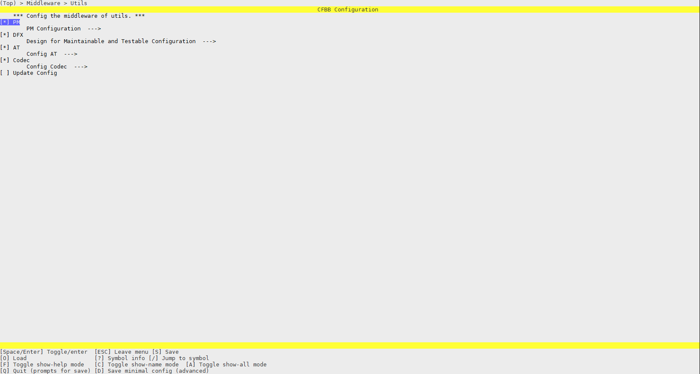

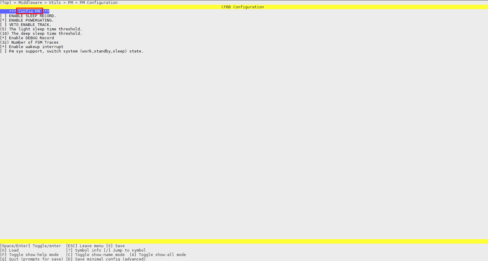

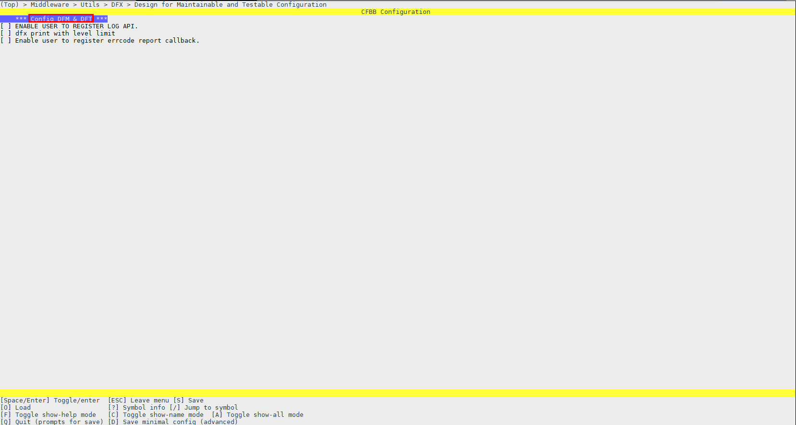

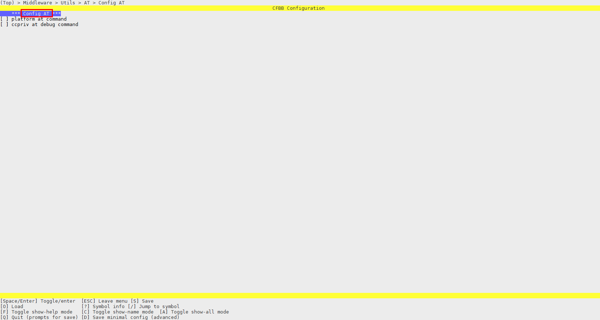

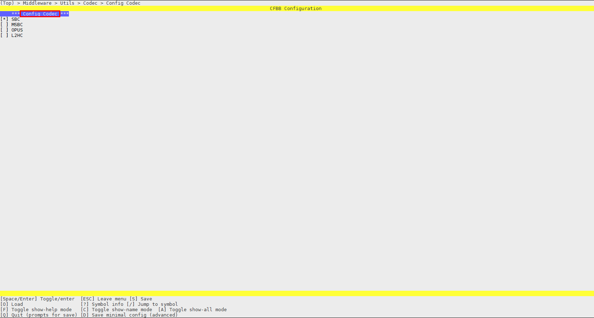

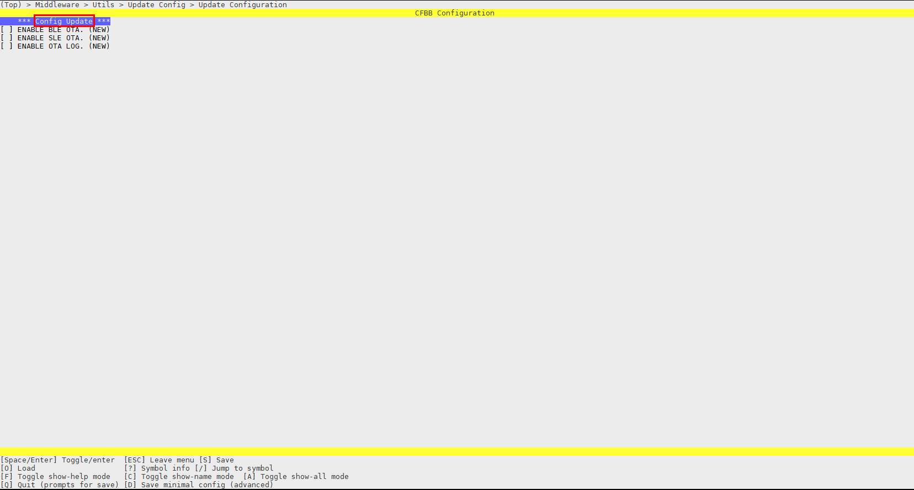

配置宏具体描述如[表1](#table16629938173916)所示。

**表 1**  middleware相关宏描述

<a name="table16629938173916"></a>
<table><thead align="left"><tr id="row1462913813915"><th class="cellrowborder" valign="top" width="11.65883411658834%" id="mcps1.2.8.1.1"><p id="p6525134791719"><a name="p6525134791719"></a><a name="p6525134791719"></a>归属菜单</p>
</th>
<th class="cellrowborder" valign="top" width="16.78832116788321%" id="mcps1.2.8.1.2"><p id="p1962923853920"><a name="p1962923853920"></a><a name="p1962923853920"></a>宏名称（CONFIG_是默认添加的前缀）</p>
</th>
<th class="cellrowborder" valign="top" width="19.548045195480455%" id="mcps1.2.8.1.3"><p id="p962916388395"><a name="p962916388395"></a><a name="p962916388395"></a>kconfig界面显示的具体描述</p>
</th>
<th class="cellrowborder" valign="top" width="18.378162183781622%" id="mcps1.2.8.1.4"><p id="p18731420115119"><a name="p18731420115119"></a><a name="p18731420115119"></a>使用场景</p>
</th>
<th class="cellrowborder" valign="top" width="9.819018098190181%" id="mcps1.2.8.1.5"><p id="p537485457"><a name="p537485457"></a><a name="p537485457"></a>是否已经实现</p>
</th>
<th class="cellrowborder" valign="top" width="10.48895110488951%" id="mcps1.2.8.1.6"><p id="p1162915382392"><a name="p1162915382392"></a><a name="p1162915382392"></a>是否依赖其他宏</p>
</th>
<th class="cellrowborder" valign="top" width="13.318668133186684%" id="mcps1.2.8.1.7"><p id="p1449914917569"><a name="p1449914917569"></a><a name="p1449914917569"></a>是否选择打开或修改配置</p>
</th>
</tr>
</thead>
<tbody><tr id="row16629338103916"><td class="cellrowborder" rowspan="11" valign="top" width="11.65883411658834%" headers="mcps1.2.8.1.1 "><p id="p15921858201814"><a name="p15921858201814"></a><a name="p15921858201814"></a>PM</p>
</td>
<td class="cellrowborder" valign="top" width="16.78832116788321%" headers="mcps1.2.8.1.2 "><p id="p166291338133910"><a name="p166291338133910"></a><a name="p166291338133910"></a>CONFIG_PM_SLEEP_RECORD_ENABLE</p>
</td>
<td class="cellrowborder" valign="top" width="19.548045195480455%" headers="mcps1.2.8.1.3 "><p id="p1413663112225"><a name="p1413663112225"></a><a name="p1413663112225"></a>ENABLE SLEEP RECORD.</p>
</td>
<td class="cellrowborder" valign="top" width="18.378162183781622%" headers="mcps1.2.8.1.4 "><p id="p77352085114"><a name="p77352085114"></a><a name="p77352085114"></a>记录睡眠状况信息</p>
</td>
<td class="cellrowborder" valign="top" width="9.819018098190181%" headers="mcps1.2.8.1.5 "><p id="p166297382397"><a name="p166297382397"></a><a name="p166297382397"></a>是</p>
</td>
<td class="cellrowborder" valign="top" width="10.48895110488951%" headers="mcps1.2.8.1.6 "><p id="p162983873917"><a name="p162983873917"></a><a name="p162983873917"></a>否</p>
</td>
<td class="cellrowborder" valign="top" width="13.318668133186684%" headers="mcps1.2.8.1.7 "><p id="p0629838133914"><a name="p0629838133914"></a><a name="p0629838133914"></a>默认关闭，视情况选择</p>
</td>
</tr>
<tr id="row166299383394"><td class="cellrowborder" valign="top" headers="mcps1.2.8.1.1 "><p id="p14629173813920"><a name="p14629173813920"></a><a name="p14629173813920"></a>CONFIG_PM_POWER_GATING_ENABLE</p>
</td>
<td class="cellrowborder" valign="top" headers="mcps1.2.8.1.2 "><p id="p3472184016222"><a name="p3472184016222"></a><a name="p3472184016222"></a>ENABLE POWERGATING.</p>
</td>
<td class="cellrowborder" valign="top" headers="mcps1.2.8.1.3 "><p id="p269811784116"><a name="p269811784116"></a><a name="p269811784116"></a>使能POWERGATING</p>
</td>
<td class="cellrowborder" valign="top" headers="mcps1.2.8.1.4 "><p id="p166291838143916"><a name="p166291838143916"></a><a name="p166291838143916"></a>是</p>
</td>
<td class="cellrowborder" valign="top" headers="mcps1.2.8.1.5 "><p id="p32111666307"><a name="p32111666307"></a><a name="p32111666307"></a>否</p>
</td>
<td class="cellrowborder" valign="top" headers="mcps1.2.8.1.6 "><p id="p126297381398"><a name="p126297381398"></a><a name="p126297381398"></a>默认打开，建议打开</p>
</td>
</tr>
<tr id="row3629193823919"><td class="cellrowborder" valign="top" headers="mcps1.2.8.1.1 "><p id="p262983811395"><a name="p262983811395"></a><a name="p262983811395"></a>CONFIG_PM_VETO_TRACK_ENABLE</p>
</td>
<td class="cellrowborder" valign="top" headers="mcps1.2.8.1.2 "><p id="p37191448152210"><a name="p37191448152210"></a><a name="p37191448152210"></a>VETO ENABLE TRACK.</p>
</td>
<td class="cellrowborder" valign="top" headers="mcps1.2.8.1.3 "><p id="p1746412917425"><a name="p1746412917425"></a><a name="p1746412917425"></a>主要用于睡眠投票使用</p>
</td>
<td class="cellrowborder" valign="top" headers="mcps1.2.8.1.4 "><p id="p3629133873917"><a name="p3629133873917"></a><a name="p3629133873917"></a>是</p>
</td>
<td class="cellrowborder" valign="top" headers="mcps1.2.8.1.5 "><p id="p062910387397"><a name="p062910387397"></a><a name="p062910387397"></a>否</p>
</td>
<td class="cellrowborder" valign="top" headers="mcps1.2.8.1.6 "><p id="p1963621910"><a name="p1963621910"></a><a name="p1963621910"></a>默认关闭，视情况选择</p>
</td>
</tr>
<tr id="row962920381394"><td class="cellrowborder" valign="top" headers="mcps1.2.8.1.1 "><p id="p1629738173912"><a name="p1629738173912"></a><a name="p1629738173912"></a>CONFIG_PM_LIGHT_SLEEP_THRESHOLD_MS</p>
</td>
<td class="cellrowborder" valign="top" headers="mcps1.2.8.1.2 "><p id="p0760135522218"><a name="p0760135522218"></a><a name="p0760135522218"></a>The light sleep time threshold.</p>
</td>
<td class="cellrowborder" valign="top" headers="mcps1.2.8.1.3 "><p id="p1391712438269"><a name="p1391712438269"></a><a name="p1391712438269"></a>浅睡时间阈值</p>
</td>
<td class="cellrowborder" valign="top" headers="mcps1.2.8.1.4 "><p id="p7630938143910"><a name="p7630938143910"></a><a name="p7630938143910"></a>是</p>
</td>
<td class="cellrowborder" valign="top" headers="mcps1.2.8.1.5 "><p id="p56301938153913"><a name="p56301938153913"></a><a name="p56301938153913"></a>否</p>
</td>
<td class="cellrowborder" valign="top" headers="mcps1.2.8.1.6 "><p id="p19630238203917"><a name="p19630238203917"></a><a name="p19630238203917"></a>默认值是5ms，建议不做修改</p>
</td>
</tr>
<tr id="row62681237271"><td class="cellrowborder" valign="top" headers="mcps1.2.8.1.1 "><p id="p112401826112812"><a name="p112401826112812"></a><a name="p112401826112812"></a>CONFIG_PM_DEEP_SLEEP_THRESHOLD_MS</p>
</td>
<td class="cellrowborder" valign="top" headers="mcps1.2.8.1.2 "><p id="p8213143162319"><a name="p8213143162319"></a><a name="p8213143162319"></a>The deep sleep time threshold.</p>
</td>
<td class="cellrowborder" valign="top" headers="mcps1.2.8.1.3 "><p id="p1276438103319"><a name="p1276438103319"></a><a name="p1276438103319"></a>深睡时间阈值</p>
</td>
<td class="cellrowborder" valign="top" headers="mcps1.2.8.1.4 "><p id="p5269202314277"><a name="p5269202314277"></a><a name="p5269202314277"></a>是</p>
</td>
<td class="cellrowborder" valign="top" headers="mcps1.2.8.1.5 "><p id="p882352916313"><a name="p882352916313"></a><a name="p882352916313"></a>否</p>
</td>
<td class="cellrowborder" valign="top" headers="mcps1.2.8.1.6 "><p id="p137491622194215"><a name="p137491622194215"></a><a name="p137491622194215"></a>默认值是10ms，建议不做修改</p>
</td>
</tr>
<tr id="row17817572040"><td class="cellrowborder" valign="top" headers="mcps1.2.8.1.1 "><p id="p53019141514"><a name="p53019141514"></a><a name="p53019141514"></a>CONFIG_PM_DEBUG</p>
</td>
<td class="cellrowborder" valign="top" headers="mcps1.2.8.1.2 "><p id="p19391191717233"><a name="p19391191717233"></a><a name="p19391191717233"></a>Enable DEBUG Record.</p>
</td>
<td class="cellrowborder" valign="top" headers="mcps1.2.8.1.3 "><p id="p391457342"><a name="p391457342"></a><a name="p391457342"></a>主要用于PM调试追踪使用</p>
</td>
<td class="cellrowborder" valign="top" headers="mcps1.2.8.1.4 "><p id="p17919571246"><a name="p17919571246"></a><a name="p17919571246"></a>是</p>
</td>
<td class="cellrowborder" valign="top" headers="mcps1.2.8.1.5 "><p id="p1343315396319"><a name="p1343315396319"></a><a name="p1343315396319"></a>否</p>
</td>
<td class="cellrowborder" valign="top" headers="mcps1.2.8.1.6 "><p id="p5875145793416"><a name="p5875145793416"></a><a name="p5875145793416"></a>默认打开，建议打开</p>
</td>
</tr>
<tr id="row040511461781"><td class="cellrowborder" valign="top" headers="mcps1.2.8.1.1 "><p id="p2085465116817"><a name="p2085465116817"></a><a name="p2085465116817"></a>CONFIG_PM_FSM_TRACE_NUM</p>
</td>
<td class="cellrowborder" valign="top" headers="mcps1.2.8.1.2 "><p id="p8562112919367"><a name="p8562112919367"></a><a name="p8562112919367"></a>Number of FSM Traces.</p>
</td>
<td class="cellrowborder" valign="top" headers="mcps1.2.8.1.3 "><p id="p1605194513147"><a name="p1605194513147"></a><a name="p1605194513147"></a>配置PM FSM系统状态机数量，用于debug使用</p>
</td>
<td class="cellrowborder" valign="top" headers="mcps1.2.8.1.4 "><p id="p1640513469812"><a name="p1640513469812"></a><a name="p1640513469812"></a>是</p>
</td>
<td class="cellrowborder" valign="top" headers="mcps1.2.8.1.5 "><p id="p1528213471933"><a name="p1528213471933"></a><a name="p1528213471933"></a>否</p>
</td>
<td class="cellrowborder" valign="top" headers="mcps1.2.8.1.6 "><p id="p154053469813"><a name="p154053469813"></a><a name="p154053469813"></a>默认值是32，建议不做修改</p>
</td>
</tr>
<tr id="row1835411465910"><td class="cellrowborder" valign="top" headers="mcps1.2.8.1.1 "><p id="p235571412597"><a name="p235571412597"></a><a name="p235571412597"></a>CONFIG_PM_ENABLE_WAKEUP_INTERRUPT</p>
</td>
<td class="cellrowborder" valign="top" headers="mcps1.2.8.1.2 "><p id="p13355191414594"><a name="p13355191414594"></a><a name="p13355191414594"></a>Enable wakeup interrupt.</p>
</td>
<td class="cellrowborder" valign="top" headers="mcps1.2.8.1.3 "><p id="p105932017171618"><a name="p105932017171618"></a><a name="p105932017171618"></a>主要用于使能唤醒中断</p>
</td>
<td class="cellrowborder" valign="top" headers="mcps1.2.8.1.4 "><p id="p1235501495919"><a name="p1235501495919"></a><a name="p1235501495919"></a>是</p>
</td>
<td class="cellrowborder" valign="top" headers="mcps1.2.8.1.5 "><p id="p895101445"><a name="p895101445"></a><a name="p895101445"></a>否</p>
</td>
<td class="cellrowborder" valign="top" headers="mcps1.2.8.1.6 "><p id="p72841723184417"><a name="p72841723184417"></a><a name="p72841723184417"></a>默认打开，建议打开</p>
</td>
</tr>
<tr id="row15869683373"><td class="cellrowborder" valign="top" headers="mcps1.2.8.1.1 "><p id="p7870131514375"><a name="p7870131514375"></a><a name="p7870131514375"></a>CONFIG_PM_SYS_SUPPORT</p>
</td>
<td class="cellrowborder" valign="top" headers="mcps1.2.8.1.2 "><p id="p208701185372"><a name="p208701185372"></a><a name="p208701185372"></a>Pm sys support, switch system (work,standby,sleep) state.</p>
</td>
<td class="cellrowborder" valign="top" headers="mcps1.2.8.1.3 "><p id="p587038153717"><a name="p587038153717"></a><a name="p587038153717"></a>主要用于PM状态切换使用</p>
</td>
<td class="cellrowborder" valign="top" headers="mcps1.2.8.1.4 "><p id="p48701288378"><a name="p48701288378"></a><a name="p48701288378"></a>是</p>
</td>
<td class="cellrowborder" valign="top" headers="mcps1.2.8.1.5 "><p id="p47969352373"><a name="p47969352373"></a><a name="p47969352373"></a>否</p>
</td>
<td class="cellrowborder" valign="top" headers="mcps1.2.8.1.6 "><p id="p13614102414451"><a name="p13614102414451"></a><a name="p13614102414451"></a>默认关闭，建议关闭</p>
</td>
</tr>
<tr id="row934483818326"><td class="cellrowborder" valign="top" headers="mcps1.2.8.1.1 "><p id="p3864842337"><a name="p3864842337"></a><a name="p3864842337"></a>CONFIG_PM_SYS_SUPPORT_MSGQUEUE</p>
</td>
<td class="cellrowborder" valign="top" headers="mcps1.2.8.1.2 "><p id="p134514381325"><a name="p134514381325"></a><a name="p134514381325"></a>Pm sys support message queue.</p>
</td>
<td class="cellrowborder" valign="top" headers="mcps1.2.8.1.3 "><p id="p9453417114710"><a name="p9453417114710"></a><a name="p9453417114710"></a>PM状态机支持使用消息队列</p>
</td>
<td class="cellrowborder" valign="top" headers="mcps1.2.8.1.4 "><p id="p3345173819320"><a name="p3345173819320"></a><a name="p3345173819320"></a>是</p>
</td>
<td class="cellrowborder" valign="top" headers="mcps1.2.8.1.5 "><p id="p1297535924114"><a name="p1297535924114"></a><a name="p1297535924114"></a>CONFIG_PM_SYS_SUPPORT</p>
</td>
<td class="cellrowborder" valign="top" headers="mcps1.2.8.1.6 "><p id="p914192814612"><a name="p914192814612"></a><a name="p914192814612"></a>默认关闭，建议关闭</p>
</td>
</tr>
<tr id="row2891124283218"><td class="cellrowborder" valign="top" headers="mcps1.2.8.1.1 "><p id="p19452172613352"><a name="p19452172613352"></a><a name="p19452172613352"></a>CONFIG_PM_SYS_STACK_SIZE</p>
</td>
<td class="cellrowborder" valign="top" headers="mcps1.2.8.1.2 "><p id="p5334153904411"><a name="p5334153904411"></a><a name="p5334153904411"></a>Pm sys stack size.</p>
</td>
<td class="cellrowborder" valign="top" headers="mcps1.2.8.1.3 "><p id="p457616320447"><a name="p457616320447"></a><a name="p457616320447"></a>PM状态机支持使用消息队列的栈大小</p>
</td>
<td class="cellrowborder" valign="top" headers="mcps1.2.8.1.4 "><p id="p489117427322"><a name="p489117427322"></a><a name="p489117427322"></a>是</p>
</td>
<td class="cellrowborder" valign="top" headers="mcps1.2.8.1.5 "><p id="p1312362394418"><a name="p1312362394418"></a><a name="p1312362394418"></a>CONFIG_PM_SYS_SUPPORT_MSGQUEUE</p>
</td>
<td class="cellrowborder" valign="top" headers="mcps1.2.8.1.6 "><p id="p9229105374715"><a name="p9229105374715"></a><a name="p9229105374715"></a>默认关闭，视情况选择，建议关闭</p>
</td>
</tr>
<tr id="row515824115353"><td class="cellrowborder" rowspan="3" valign="top" width="11.65883411658834%" headers="mcps1.2.8.1.1 "><p id="p145469360302"><a name="p145469360302"></a><a name="p145469360302"></a>DFX</p>
</td>
<td class="cellrowborder" valign="top" width="16.78832116788321%" headers="mcps1.2.8.1.2 "><p id="p12606144419357"><a name="p12606144419357"></a><a name="p12606144419357"></a>CONFIG_DFX_SUPPORT_USERS_PRINT</p>
</td>
<td class="cellrowborder" valign="top" width="19.548045195480455%" headers="mcps1.2.8.1.3 "><p id="p189901729183119"><a name="p189901729183119"></a><a name="p189901729183119"></a>ENABLE USER TO REGISTER LOG API.</p>
</td>
<td class="cellrowborder" valign="top" width="18.378162183781622%" headers="mcps1.2.8.1.4 "><p id="p1815874110356"><a name="p1815874110356"></a><a name="p1815874110356"></a>主要用于使能用户自定义的寄存器日志信息接口</p>
</td>
<td class="cellrowborder" valign="top" width="9.819018098190181%" headers="mcps1.2.8.1.5 "><p id="p19158241133512"><a name="p19158241133512"></a><a name="p19158241133512"></a>是</p>
</td>
<td class="cellrowborder" valign="top" width="10.48895110488951%" headers="mcps1.2.8.1.6 "><p id="p11441554394"><a name="p11441554394"></a><a name="p11441554394"></a>否</p>
</td>
<td class="cellrowborder" valign="top" width="13.318668133186684%" headers="mcps1.2.8.1.7 "><p id="p3121172263210"><a name="p3121172263210"></a><a name="p3121172263210"></a>默认关闭，视情况选择</p>
</td>
</tr>
<tr id="row1591518240300"><td class="cellrowborder" valign="top" headers="mcps1.2.8.1.1 "><p id="p1714019579303"><a name="p1714019579303"></a><a name="p1714019579303"></a>CONFIG_DFX_SUPPORT_PRINT</p>
</td>
<td class="cellrowborder" valign="top" headers="mcps1.2.8.1.2 "><p id="p7915124133016"><a name="p7915124133016"></a><a name="p7915124133016"></a>dfx print with level limit.</p>
</td>
<td class="cellrowborder" valign="top" headers="mcps1.2.8.1.3 "><p id="p658392923418"><a name="p658392923418"></a><a name="p658392923418"></a>主要用于打印DFX日志信息</p>
</td>
<td class="cellrowborder" valign="top" headers="mcps1.2.8.1.4 "><p id="p199151424193020"><a name="p199151424193020"></a><a name="p199151424193020"></a>是</p>
</td>
<td class="cellrowborder" valign="top" headers="mcps1.2.8.1.5 "><p id="p159158247303"><a name="p159158247303"></a><a name="p159158247303"></a>否</p>
</td>
<td class="cellrowborder" valign="top" headers="mcps1.2.8.1.6 "><p id="p5871559143311"><a name="p5871559143311"></a><a name="p5871559143311"></a>默认关闭，视情况选择</p>
</td>
</tr>
<tr id="row183852963015"><td class="cellrowborder" valign="top" headers="mcps1.2.8.1.1 "><p id="p18174195893012"><a name="p18174195893012"></a><a name="p18174195893012"></a>CONFIG_CONFIG_ERRCODE_SUPPORT_REPORT</p>
</td>
<td class="cellrowborder" valign="top" headers="mcps1.2.8.1.2 "><p id="p13838152920309"><a name="p13838152920309"></a><a name="p13838152920309"></a>Enable user to register errcode report callback.</p>
</td>
<td class="cellrowborder" valign="top" headers="mcps1.2.8.1.3 "><p id="p12838192993014"><a name="p12838192993014"></a><a name="p12838192993014"></a>主要用于使能用户自定义接口errcode上报回调使用</p>
</td>
<td class="cellrowborder" valign="top" headers="mcps1.2.8.1.4 "><p id="p0838132943014"><a name="p0838132943014"></a><a name="p0838132943014"></a>是</p>
</td>
<td class="cellrowborder" valign="top" headers="mcps1.2.8.1.5 "><p id="p1483992911309"><a name="p1483992911309"></a><a name="p1483992911309"></a>否</p>
</td>
<td class="cellrowborder" valign="top" headers="mcps1.2.8.1.6 "><p id="p24797411348"><a name="p24797411348"></a><a name="p24797411348"></a>默认关闭，视情况选择</p>
</td>
</tr>
<tr id="row788515183396"><td class="cellrowborder" rowspan="2" valign="top" width="11.65883411658834%" headers="mcps1.2.8.1.1 "><p id="p157380348397"><a name="p157380348397"></a><a name="p157380348397"></a>AT</p>
</td>
<td class="cellrowborder" valign="top" width="16.78832116788321%" headers="mcps1.2.8.1.2 "><p id="p088516189396"><a name="p088516189396"></a><a name="p088516189396"></a>CONFIG_AT_SUPPORT_PLT</p>
</td>
<td class="cellrowborder" valign="top" width="19.548045195480455%" headers="mcps1.2.8.1.3 "><p id="p178859187395"><a name="p178859187395"></a><a name="p178859187395"></a>platform at command.</p>
</td>
<td class="cellrowborder" valign="top" width="18.378162183781622%" headers="mcps1.2.8.1.4 "><p id="p488561893916"><a name="p488561893916"></a><a name="p488561893916"></a>主要用于平台AT命令</p>
</td>
<td class="cellrowborder" valign="top" width="9.819018098190181%" headers="mcps1.2.8.1.5 "><p id="p16885318103913"><a name="p16885318103913"></a><a name="p16885318103913"></a>是</p>
</td>
<td class="cellrowborder" valign="top" width="10.48895110488951%" headers="mcps1.2.8.1.6 "><p id="p148851018193918"><a name="p148851018193918"></a><a name="p148851018193918"></a>否</p>
</td>
<td class="cellrowborder" valign="top" width="13.318668133186684%" headers="mcps1.2.8.1.7 "><p id="p68853185396"><a name="p68853185396"></a><a name="p68853185396"></a>默认关闭，视情况选择</p>
</td>
</tr>
<tr id="row2644192310391"><td class="cellrowborder" valign="top" headers="mcps1.2.8.1.1 "><p id="p164492317399"><a name="p164492317399"></a><a name="p164492317399"></a>CONFIG_AT_DEBUG_REGISTER_CCPRIV</p>
</td>
<td class="cellrowborder" valign="top" headers="mcps1.2.8.1.2 "><p id="p2644823143913"><a name="p2644823143913"></a><a name="p2644823143913"></a>ccpriv at debug command.</p>
</td>
<td class="cellrowborder" valign="top" headers="mcps1.2.8.1.3 "><p id="p7441640194213"><a name="p7441640194213"></a><a name="p7441640194213"></a>主要用于debug AT命令</p>
</td>
<td class="cellrowborder" valign="top" headers="mcps1.2.8.1.4 "><p id="p1864452319390"><a name="p1864452319390"></a><a name="p1864452319390"></a>是</p>
</td>
<td class="cellrowborder" valign="top" headers="mcps1.2.8.1.5 "><p id="p16644102319398"><a name="p16644102319398"></a><a name="p16644102319398"></a>否</p>
</td>
<td class="cellrowborder" valign="top" headers="mcps1.2.8.1.6 "><p id="p11644202311393"><a name="p11644202311393"></a><a name="p11644202311393"></a>默认关闭，视情况选择</p>
</td>
</tr>
<tr id="row1922691064311"><td class="cellrowborder" rowspan="4" valign="top" width="11.65883411658834%" headers="mcps1.2.8.1.1 "><p id="p97101628134319"><a name="p97101628134319"></a><a name="p97101628134319"></a>CODEC</p>
</td>
<td class="cellrowborder" valign="top" width="16.78832116788321%" headers="mcps1.2.8.1.2 "><p id="p722612101435"><a name="p722612101435"></a><a name="p722612101435"></a>CONFIG_CODEC_ENABLE_SBC</p>
</td>
<td class="cellrowborder" valign="top" width="19.548045195480455%" headers="mcps1.2.8.1.3 "><p id="p1122691054313"><a name="p1122691054313"></a><a name="p1122691054313"></a>SBC</p>
</td>
<td class="cellrowborder" valign="top" width="18.378162183781622%" headers="mcps1.2.8.1.4 "><p id="p622611064318"><a name="p622611064318"></a><a name="p622611064318"></a>支持使用SBC编解码</p>
</td>
<td class="cellrowborder" valign="top" width="9.819018098190181%" headers="mcps1.2.8.1.5 "><p id="p822611064316"><a name="p822611064316"></a><a name="p822611064316"></a>是</p>
</td>
<td class="cellrowborder" valign="top" width="10.48895110488951%" headers="mcps1.2.8.1.6 "><p id="p11226111054310"><a name="p11226111054310"></a><a name="p11226111054310"></a>否</p>
</td>
<td class="cellrowborder" valign="top" width="13.318668133186684%" headers="mcps1.2.8.1.7 "><p id="p72266107436"><a name="p72266107436"></a><a name="p72266107436"></a>默认打开，视情况选择</p>
</td>
</tr>
<tr id="row1895141484313"><td class="cellrowborder" valign="top" headers="mcps1.2.8.1.1 "><p id="p8952201484316"><a name="p8952201484316"></a><a name="p8952201484316"></a>CONFIG_CODEC_ENABLE_MSBC</p>
</td>
<td class="cellrowborder" valign="top" headers="mcps1.2.8.1.2 "><p id="p2218189104516"><a name="p2218189104516"></a><a name="p2218189104516"></a>MSBC</p>
</td>
<td class="cellrowborder" valign="top" headers="mcps1.2.8.1.3 "><p id="p32472038164517"><a name="p32472038164517"></a><a name="p32472038164517"></a>支持使用MSBC编解码</p>
</td>
<td class="cellrowborder" valign="top" headers="mcps1.2.8.1.4 "><p id="p18952101404310"><a name="p18952101404310"></a><a name="p18952101404310"></a>是</p>
</td>
<td class="cellrowborder" valign="top" headers="mcps1.2.8.1.5 "><p id="p1395221414439"><a name="p1395221414439"></a><a name="p1395221414439"></a>否</p>
</td>
<td class="cellrowborder" valign="top" headers="mcps1.2.8.1.6 "><p id="p169524144438"><a name="p169524144438"></a><a name="p169524144438"></a>默认关闭，视情况选择</p>
</td>
</tr>
<tr id="row9351151917438"><td class="cellrowborder" valign="top" headers="mcps1.2.8.1.1 "><p id="p1735111193437"><a name="p1735111193437"></a><a name="p1735111193437"></a>CONFIG_CODEC_ENABLE_OPUS</p>
</td>
<td class="cellrowborder" valign="top" headers="mcps1.2.8.1.2 "><p id="p5351151917436"><a name="p5351151917436"></a><a name="p5351151917436"></a>OPUS</p>
</td>
<td class="cellrowborder" valign="top" headers="mcps1.2.8.1.3 "><p id="p1725734219456"><a name="p1725734219456"></a><a name="p1725734219456"></a>支持使用OPUS编解码</p>
</td>
<td class="cellrowborder" valign="top" headers="mcps1.2.8.1.4 "><p id="p14351619104313"><a name="p14351619104313"></a><a name="p14351619104313"></a>是</p>
</td>
<td class="cellrowborder" valign="top" headers="mcps1.2.8.1.5 "><p id="p1351619184314"><a name="p1351619184314"></a><a name="p1351619184314"></a>否</p>
</td>
<td class="cellrowborder" valign="top" headers="mcps1.2.8.1.6 "><p id="p113511519164311"><a name="p113511519164311"></a><a name="p113511519164311"></a>默认关闭，视情况选择</p>
</td>
</tr>
<tr id="row9220182364311"><td class="cellrowborder" valign="top" headers="mcps1.2.8.1.1 "><p id="p422082364318"><a name="p422082364318"></a><a name="p422082364318"></a>CONFIG_CODEC_ENABLE_L2HC</p>
</td>
<td class="cellrowborder" valign="top" headers="mcps1.2.8.1.2 "><p id="p1522042334319"><a name="p1522042334319"></a><a name="p1522042334319"></a>L2HC</p>
</td>
<td class="cellrowborder" valign="top" headers="mcps1.2.8.1.3 "><p id="p4213155012454"><a name="p4213155012454"></a><a name="p4213155012454"></a>支持使用L2HC编解码</p>
</td>
<td class="cellrowborder" valign="top" headers="mcps1.2.8.1.4 "><p id="p10220162374320"><a name="p10220162374320"></a><a name="p10220162374320"></a>是</p>
</td>
<td class="cellrowborder" valign="top" headers="mcps1.2.8.1.5 "><p id="p1822082314433"><a name="p1822082314433"></a><a name="p1822082314433"></a>否</p>
</td>
<td class="cellrowborder" valign="top" headers="mcps1.2.8.1.6 "><p id="p7220723124314"><a name="p7220723124314"></a><a name="p7220723124314"></a>默认关闭，视情况选择</p>
</td>
</tr>
</tbody>
</table>

