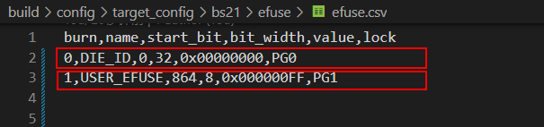
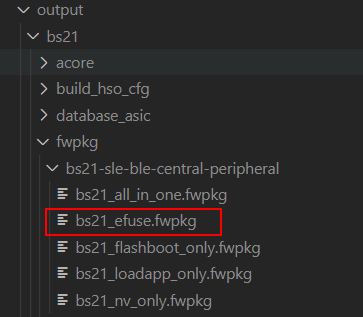
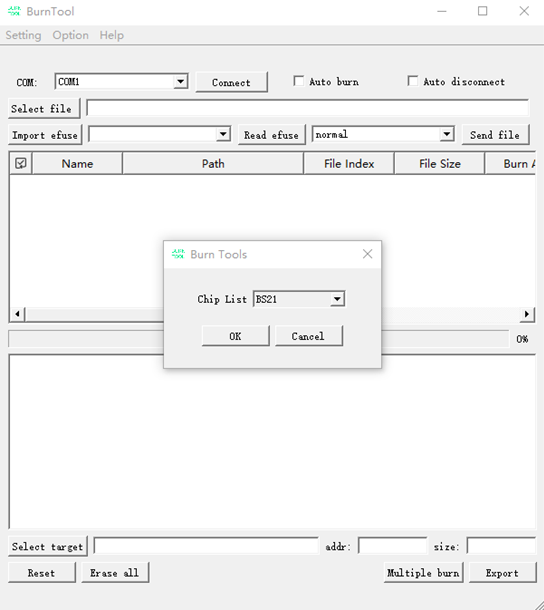
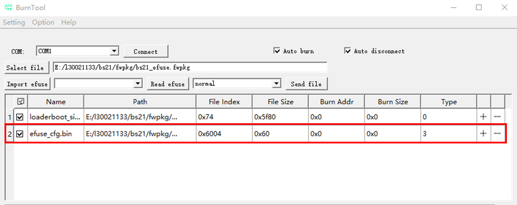
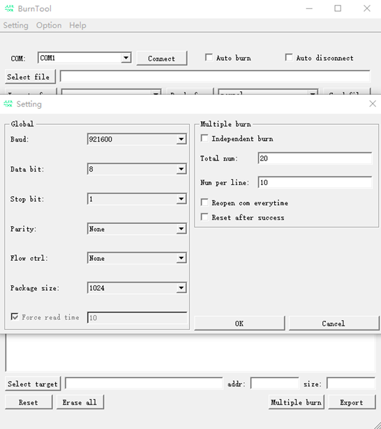
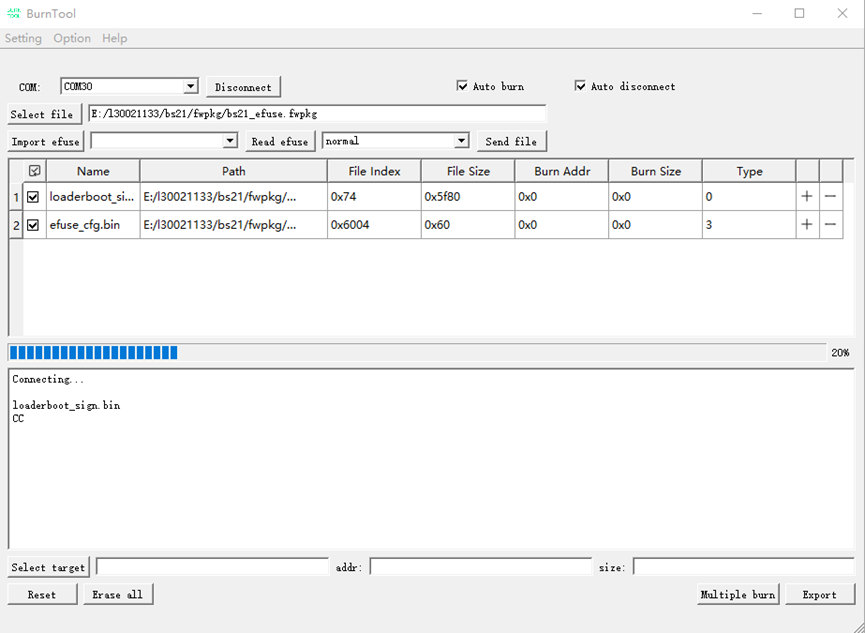

# 前言<a name="ZH-CN_TOPIC_0000001884238273"></a>

**概述<a name="section4537382116410"></a>**

本文档主要描述了BS2XV100的客户预留EFUSE位域的使用方法。

注：本文档部分内容暂以BS21为例，后续不再单独说明。

**产品版本<a name="section578420251745"></a>**

与本文档对应的产品版本如下。

<a name="table06171831652"></a>
<table><thead align="left"><tr id="row761817313520"><th class="cellrowborder" valign="top" width="50%" id="mcps1.1.3.1.1"><p id="p1361973854"><a name="p1361973854"></a><a name="p1361973854"></a><strong id="b8778123341615"><a name="b8778123341615"></a><a name="b8778123341615"></a>产品名称</strong></p>
</th>
<th class="cellrowborder" valign="top" width="50%" id="mcps1.1.3.1.2"><p id="p1961917310511"><a name="p1961917310511"></a><a name="p1961917310511"></a><strong id="b12785103341614"><a name="b12785103341614"></a><a name="b12785103341614"></a>产品版本</strong></p>
</th>
</tr>
</thead>
<tbody><tr id="row11619103553"><td class="cellrowborder" valign="top" width="50%" headers="mcps1.1.3.1.1 "><p id="p061923257"><a name="p061923257"></a><a name="p061923257"></a>BS2X</p>
</td>
<td class="cellrowborder" valign="top" width="50%" headers="mcps1.1.3.1.2 "><p id="p26191931853"><a name="p26191931853"></a><a name="p26191931853"></a>V100</p>
</td>
</tr>
</tbody>
</table>

**读者对象<a name="section4378592816410"></a>**

本文档主要适用于以下人员：

-   技术支持工程师
-   软件开发工程师

**符号约定<a name="section133020216410"></a>**

在本文中可能出现下列标志，它们所代表的含义如下。

<a name="table2622507016410"></a>
<table><thead align="left"><tr id="row1530720816410"><th class="cellrowborder" valign="top" width="20.580000000000002%" id="mcps1.1.3.1.1"><p id="p6450074116410"><a name="p6450074116410"></a><a name="p6450074116410"></a><strong id="b2136615816410"><a name="b2136615816410"></a><a name="b2136615816410"></a>符号</strong></p>
</th>
<th class="cellrowborder" valign="top" width="79.42%" id="mcps1.1.3.1.2"><p id="p5435366816410"><a name="p5435366816410"></a><a name="p5435366816410"></a><strong id="b5941558116410"><a name="b5941558116410"></a><a name="b5941558116410"></a>说明</strong></p>
</th>
</tr>
</thead>
<tbody><tr id="row1372280416410"><td class="cellrowborder" valign="top" width="20.580000000000002%" headers="mcps1.1.3.1.1 "><p id="p3734547016410"><a name="p3734547016410"></a><a name="p3734547016410"></a><a name="image2670064316410"></a><a name="image2670064316410"></a><span></span></p>
</td>
<td class="cellrowborder" valign="top" width="79.42%" headers="mcps1.1.3.1.2 "><p id="p1757432116410"><a name="p1757432116410"></a><a name="p1757432116410"></a>表示如不避免则将会导致死亡或严重伤害的具有高等级风险的危害。</p>
</td>
</tr>
<tr id="row466863216410"><td class="cellrowborder" valign="top" width="20.580000000000002%" headers="mcps1.1.3.1.1 "><p id="p1432579516410"><a name="p1432579516410"></a><a name="p1432579516410"></a><a name="image4895582316410"></a><a name="image4895582316410"></a><span></span></p>
</td>
<td class="cellrowborder" valign="top" width="79.42%" headers="mcps1.1.3.1.2 "><p id="p959197916410"><a name="p959197916410"></a><a name="p959197916410"></a>表示如不避免则可能导致死亡或严重伤害的具有中等级风险的危害。</p>
</td>
</tr>
<tr id="row123863216410"><td class="cellrowborder" valign="top" width="20.580000000000002%" headers="mcps1.1.3.1.1 "><p id="p1232579516410"><a name="p1232579516410"></a><a name="p1232579516410"></a><a name="image1235582316410"></a><a name="image1235582316410"></a><span></span></p>
</td>
<td class="cellrowborder" valign="top" width="79.42%" headers="mcps1.1.3.1.2 "><p id="p123197916410"><a name="p123197916410"></a><a name="p123197916410"></a>表示如不避免则可能导致轻微或中度伤害的具有低等级风险的危害。</p>
</td>
</tr>
<tr id="row5786682116410"><td class="cellrowborder" valign="top" width="20.580000000000002%" headers="mcps1.1.3.1.1 "><p id="p2204984716410"><a name="p2204984716410"></a><a name="p2204984716410"></a><a name="image4504446716410"></a><a name="image4504446716410"></a><span></span></p>
</td>
<td class="cellrowborder" valign="top" width="79.42%" headers="mcps1.1.3.1.2 "><p id="p4388861916410"><a name="p4388861916410"></a><a name="p4388861916410"></a>用于传递设备或环境安全警示信息。如不避免则可能会导致设备损坏、数据丢失、设备性能降低或其它不可预知的结果。</p>
<p id="p1238861916410"><a name="p1238861916410"></a><a name="p1238861916410"></a>“须知”不涉及人身伤害。</p>
</td>
</tr>
<tr id="row2856923116410"><td class="cellrowborder" valign="top" width="20.580000000000002%" headers="mcps1.1.3.1.1 "><p id="p5555360116410"><a name="p5555360116410"></a><a name="p5555360116410"></a><a name="image799324016410"></a><a name="image799324016410"></a><span></span></p>
</td>
<td class="cellrowborder" valign="top" width="79.42%" headers="mcps1.1.3.1.2 "><p id="p4612588116410"><a name="p4612588116410"></a><a name="p4612588116410"></a>对正文中重点信息的补充说明。</p>
<p id="p1232588116410"><a name="p1232588116410"></a><a name="p1232588116410"></a>“说明”不是安全警示信息，不涉及人身、设备及环境伤害信息。</p>
</td>
</tr>
</tbody>
</table>

**修改记录<a name="section2467512116410"></a>**

<a name="table1557726816410"></a>
<table><thead align="left"><tr id="row2942532716410"><th class="cellrowborder" valign="top" width="12.280000000000001%" id="mcps1.1.4.1.1"><p id="p3778275416410"><a name="p3778275416410"></a><a name="p3778275416410"></a><strong id="b5687322716410"><a name="b5687322716410"></a><a name="b5687322716410"></a>文档版本</strong></p>
</th>
<th class="cellrowborder" valign="top" width="19.97%" id="mcps1.1.4.1.2"><p id="p5627845516410"><a name="p5627845516410"></a><a name="p5627845516410"></a><strong id="b5800814916410"><a name="b5800814916410"></a><a name="b5800814916410"></a>发布日期</strong></p>
</th>
<th class="cellrowborder" valign="top" width="67.75%" id="mcps1.1.4.1.3"><p id="p2382284816410"><a name="p2382284816410"></a><a name="p2382284816410"></a><strong id="b3316380216410"><a name="b3316380216410"></a><a name="b3316380216410"></a>修改说明</strong></p>
</th>
</tr>
</thead>
<tbody><tr id="row1581395714113"><td class="cellrowborder" valign="top" width="12.280000000000001%" headers="mcps1.1.4.1.1 "><p id="p16814957164118"><a name="p16814957164118"></a><a name="p16814957164118"></a>02</p>
</td>
<td class="cellrowborder" valign="top" width="19.97%" headers="mcps1.1.4.1.2 "><p id="p48141057184110"><a name="p48141057184110"></a><a name="p48141057184110"></a>2025-01-24</p>
</td>
<td class="cellrowborder" valign="top" width="67.75%" headers="mcps1.1.4.1.3 "><p id="p108141657174118"><a name="p108141657174118"></a><a name="p108141657174118"></a>更新“<a href="软件编程接口使用指导.md">软件编程接口使用指导</a>”章节内容。</p>
</td>
</tr>
<tr id="row5947359616410"><td class="cellrowborder" valign="top" width="12.280000000000001%" headers="mcps1.1.4.1.1 "><p id="p2149706016410"><a name="p2149706016410"></a><a name="p2149706016410"></a>01</p>
</td>
<td class="cellrowborder" valign="top" width="19.97%" headers="mcps1.1.4.1.2 "><p id="p648803616410"><a name="p648803616410"></a><a name="p648803616410"></a>2024-05-15</p>
</td>
<td class="cellrowborder" valign="top" width="67.75%" headers="mcps1.1.4.1.3 "><p id="p1946537916410"><a name="p1946537916410"></a><a name="p1946537916410"></a>第一次正式版本发布。</p>
</td>
</tr>
</tbody>
</table>

# 概述<a name="ZH-CN_TOPIC_0000001838078500"></a>

EFUSE是一种可编程的存储单元，由于其只可编程一次的特征，多用于芯片保存Chip ID、密钥或其他一次性存储数据。

BS2X提供了两种使用方式：

-   通过软件驱动接口直接读写用户预留的128bit EFUSE空间。
-   通过烧写工具操作整个2048bit空间。

# 软件编程接口使用指导<a name="ZH-CN_TOPIC_0000001838237236"></a>

EFUSE模块提供的接口及功能如下：

头文件路径: include\\driver\\efuseh

-   uapi\_efuse\_read\_bit：读取EFUSE中的指定Bit位。uapi\_efuse\_read\_buffer：读取EFUSE中多个字节，进入提供的缓冲区。
-   uapi\_efuse\_write\_bit：写EFUSE中的指定Bit位。
-   uapi\_efuse\_write\_buffer：从提供的缓冲区向EFUSE写入多个字节。

示例：

1.  按照buffer写EFUSE值。

    ```
    uint8_t efuse_data[8] = {0x11,0x22,0x33,0x44,0x55,0x66,0x77,0x88};
    uint32_t byte_number = 1;
    uint16_t length = 8;
    uint32_t ret;
    // 第1byte开始写入8个字节
    ret = uapi_efuse_write_buffer(byte_number, efuse_data, length);
    if (ret != 0) {
        // 异常处理
    }
    ```

2.  按照buffer读取EFUSE值。

    ```
    uint8_t efuse_data[8] = {0};
    uint32_t byte_number = 1;
    uint16_t length = 8;
    uint32_t ret;
    // 第1byte开始读取8个字节
    ret = uapi_efuse_read_bit(byte_number, efuse_data, length);
    if (ret != 0) {
        // 异常处理
    }
    ```

1.  按照bit读取EFUSE值。

    ```
    uint8_t bit_pos = 1;
    uint8_t value;
    uint32_t byte_number = 1;
    uint32_t ret;
    // 读取第一个byte的bit1的值，存入value中（0 or 1）
    ret = uapi_efuse_read_bit(byte_number, bit_pos, &value);
    if (ret != 0) {
        // 异常处理
    }
    ```

1.  按照bit写入EFUSE值。

    ```
    uint8_t value;
    uint32_t byte_number = 1;
    uint32_t ret;
    // 向第一个byte的bit1写入1
    ret = uapi_efuse_write_bit(byte_number, bit_pos);
    if (ret != 0) {
        // 异常处理
    }
    ```

# BurnTool烧写efuse\_cfg.bin说明<a name="ZH-CN_TOPIC_0000001838078508"></a>


## 生成efuse\_cfg.bin<a name="ZH-CN_TOPIC_0000001884397793"></a>

1.  数据准备（路径：build\\config\\target\_config\\bs21\\efuse\\efuse.csv）

    **图 1**  efuse.csv配置<a name="fig188866401584"></a>  
    

    如[图1](#fig188866401584)所示，字段说明：

    -   burn：

        0：当前位域不烧写；

        1：当前位域烧写。

    -   name：当前EFUSE位域名字。
    -   start\_bit：位域起始bit位。
    -   bit\_width：当前位域bit长度。
    -   values：烧写值。
    -   lock：锁定位。

    示例：

    0,DIE\_ID,0,32,0x00000000,PG0：die\_id 从bit0开始，长度是32bit，不烧写；

    1,USER\_EFUSE,864,8,0x000000FF,PG1：USER\_EFUSE从bit864开始，长度为8bit，烧写值为0xFF。

1.  烧写文件生成

1.  调用脚本efuse\_cfg\_gen.py，生成efuse\_cfg.bin，路径：build\\config\\target\_config\\bs21\\efuse\\efuse\_cfg\_gen.py。
2.  编译对应的application.bin，编译成功后，会将efuse\_cfg.bin单独打包成fwpkg，如[图2](#fig15214153395819)。

**图 2**  EFUSE烧录版本<a name="fig15214153395819"></a>  


> **说明：** 
>BS2X中，用户可配置的efuse number为108\~125，长度为18Byte，即从bit864开始，长度为144bit。

## 烧录流程<a name="ZH-CN_TOPIC_0000001884238265"></a>

准备烧写工具“BurnTool”通过BurnTool工具烧写镜像。具体步骤如下：

1.  在BurnTool界面中，单击“Option”按钮，选择“Change chip”，从“Chip List”下拉菜单中选择“BS21”，并单击“OK”即可，如[图1](#fig749721661114)所示。

    **图 1**  BurnTool更换芯片示例<a name="fig749721661114"></a>  
    

2.  在BurnTool界面中，单击“COM”按钮选择PC机串口（串口选择，请参考开发板使用指南）；单击“Select file”按钮，选择各产品编译生成的固件包，并单击“OK”，如[图2](#fig524843652914)所示。efuse\_cfg.bin为待烧录数据，烧录类型为3。

    **图 2**  烧录文件选择示例<a name="fig524843652914"></a>  
    

3.  勾选“Auto burn”以及“Auto disconnect”选项；

    选择“Setting”→“Settings”，配置串口参数，默认配置如[图3](#fig327052934116)所示，baud配置为921600。

    > **说明：** 
    >Force Read Time：定时读取的时间，以毫秒为单位。勾选时为定时读取串口，不勾选时为事件触发读取串口。适用于不勾选该选项无法正常烧录的场景。

    **图 3**  串口设置示例<a name="fig327052934116"></a>  
    

    选择目标串口号并单击“Connect”按钮（单击后“Connect”变为“Disconnect”），复位单板。自动烧录效果如[图4](#fig680845815298)所示。

    **图 4**  自动烧录示意图<a name="fig680845815298"></a>  
    

    等待传输完成后结束烧写，烧写完成会出现“All images burn successfully”。烧写完成效果如[图5](#zh-cn_topic_0000001162123482_zh-cn_topic_0279549073_fig11410377529)所示。

    **图 5**  烧写完成示意图<a name="zh-cn_topic_0000001162123482_zh-cn_topic_0279549073_fig11410377529"></a>  
    

