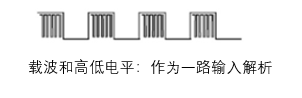
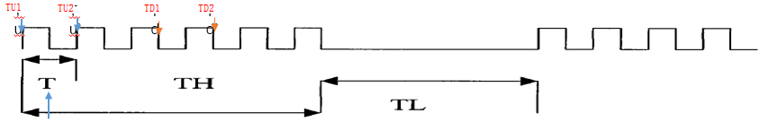
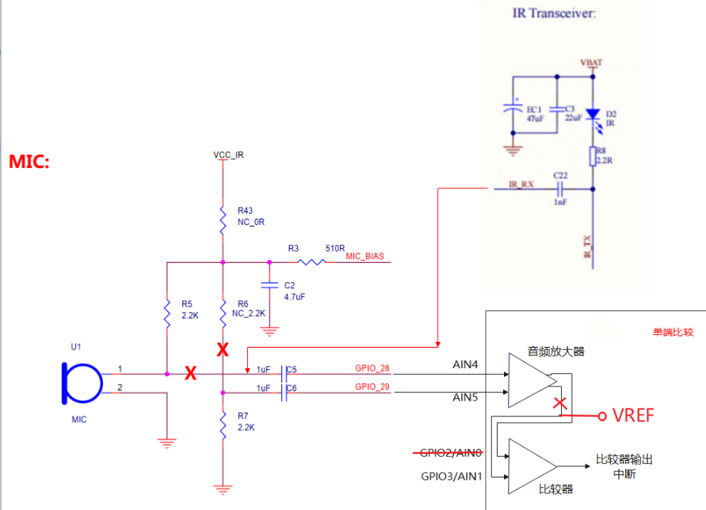

# 前言<a name="ZH-CN_TOPIC_0000001916630580"></a>

**概述<a name="section4537382116410"></a>**

BS2XV100通过API（Application Programming Interface）向开发者提供红外学习的相关接口，包括红外学习、发送以及恢复默认设置等相关接口。

**读者对象<a name="section4378592816410"></a>**

本文档主要适用于以下工程师：

-   技术支持工程师
-   软件开发工程师
-   软件测试工程师

**符号约定<a name="section133020216410"></a>**

在本文中可能出现下列标志，它们所代表的含义如下。

<a name="table2622507016410"></a>
<table><thead align="left"><tr id="row1530720816410"><th class="cellrowborder" valign="top" width="20.580000000000002%" id="mcps1.1.3.1.1"><p id="p6450074116410"><a name="p6450074116410"></a><a name="p6450074116410"></a><strong id="b2136615816410"><a name="b2136615816410"></a><a name="b2136615816410"></a>符号</strong></p>
</th>
<th class="cellrowborder" valign="top" width="79.42%" id="mcps1.1.3.1.2"><p id="p5435366816410"><a name="p5435366816410"></a><a name="p5435366816410"></a><strong id="b5941558116410"><a name="b5941558116410"></a><a name="b5941558116410"></a>说明</strong></p>
</th>
</tr>
</thead>
<tbody><tr id="row1372280416410"><td class="cellrowborder" valign="top" width="20.580000000000002%" headers="mcps1.1.3.1.1 "><p id="p3734547016410"><a name="p3734547016410"></a><a name="p3734547016410"></a><a name="image2670064316410"></a><a name="image2670064316410"></a><span></span></p>
</td>
<td class="cellrowborder" valign="top" width="79.42%" headers="mcps1.1.3.1.2 "><p id="p1757432116410"><a name="p1757432116410"></a><a name="p1757432116410"></a>表示如不避免则将会导致死亡或严重伤害的具有高等级风险的危害。</p>
</td>
</tr>
<tr id="row466863216410"><td class="cellrowborder" valign="top" width="20.580000000000002%" headers="mcps1.1.3.1.1 "><p id="p1432579516410"><a name="p1432579516410"></a><a name="p1432579516410"></a><a name="image4895582316410"></a><a name="image4895582316410"></a><span></span></p>
</td>
<td class="cellrowborder" valign="top" width="79.42%" headers="mcps1.1.3.1.2 "><p id="p959197916410"><a name="p959197916410"></a><a name="p959197916410"></a>表示如不避免则可能导致死亡或严重伤害的具有中等级风险的危害。</p>
</td>
</tr>
<tr id="row123863216410"><td class="cellrowborder" valign="top" width="20.580000000000002%" headers="mcps1.1.3.1.1 "><p id="p1232579516410"><a name="p1232579516410"></a><a name="p1232579516410"></a><a name="image1235582316410"></a><a name="image1235582316410"></a><span></span></p>
</td>
<td class="cellrowborder" valign="top" width="79.42%" headers="mcps1.1.3.1.2 "><p id="p123197916410"><a name="p123197916410"></a><a name="p123197916410"></a>表示如不避免则可能导致轻微或中度伤害的具有低等级风险的危害。</p>
</td>
</tr>
<tr id="row5786682116410"><td class="cellrowborder" valign="top" width="20.580000000000002%" headers="mcps1.1.3.1.1 "><p id="p2204984716410"><a name="p2204984716410"></a><a name="p2204984716410"></a><a name="image4504446716410"></a><a name="image4504446716410"></a><span></span></p>
</td>
<td class="cellrowborder" valign="top" width="79.42%" headers="mcps1.1.3.1.2 "><p id="p4388861916410"><a name="p4388861916410"></a><a name="p4388861916410"></a>用于传递设备或环境安全警示信息。如不避免则可能会导致设备损坏、数据丢失、设备性能降低或其它不可预知的结果。</p>
<p id="p1238861916410"><a name="p1238861916410"></a><a name="p1238861916410"></a>“须知”不涉及人身伤害。</p>
</td>
</tr>
<tr id="row2856923116410"><td class="cellrowborder" valign="top" width="20.580000000000002%" headers="mcps1.1.3.1.1 "><p id="p5555360116410"><a name="p5555360116410"></a><a name="p5555360116410"></a><a name="image799324016410"></a><a name="image799324016410"></a><span></span></p>
</td>
<td class="cellrowborder" valign="top" width="79.42%" headers="mcps1.1.3.1.2 "><p id="p4612588116410"><a name="p4612588116410"></a><a name="p4612588116410"></a>对正文中重点信息的补充说明。</p>
<p id="p1232588116410"><a name="p1232588116410"></a><a name="p1232588116410"></a>“说明”不是安全警示信息，不涉及人身、设备及环境伤害信息。</p>
</td>
</tr>
</tbody>
</table>

**修改记录<a name="section2467512116410"></a>**

<a name="table1557726816410"></a>
<table><thead align="left"><tr id="row2942532716410"><th class="cellrowborder" valign="top" width="16.59%" id="mcps1.1.4.1.1"><p id="p3778275416410"><a name="p3778275416410"></a><a name="p3778275416410"></a><strong id="b5687322716410"><a name="b5687322716410"></a><a name="b5687322716410"></a>文档版本</strong></p>
</th>
<th class="cellrowborder" valign="top" width="21.73%" id="mcps1.1.4.1.2"><p id="p5627845516410"><a name="p5627845516410"></a><a name="p5627845516410"></a><strong id="b5800814916410"><a name="b5800814916410"></a><a name="b5800814916410"></a>发布日期</strong></p>
</th>
<th class="cellrowborder" valign="top" width="61.68%" id="mcps1.1.4.1.3"><p id="p2382284816410"><a name="p2382284816410"></a><a name="p2382284816410"></a><strong id="b3316380216410"><a name="b3316380216410"></a><a name="b3316380216410"></a>修改说明</strong></p>
</th>
</tr>
</thead>
<tbody><tr id="row175323314381"><td class="cellrowborder" valign="top" width="16.59%" headers="mcps1.1.4.1.1 "><p id="p453233193814"><a name="p453233193814"></a><a name="p453233193814"></a><span id="ph929283413813"><a name="ph929283413813"></a><a name="ph929283413813"></a>02</span></p>
</td>
<td class="cellrowborder" valign="top" width="21.73%" headers="mcps1.1.4.1.2 "><p id="p12535331381"><a name="p12535331381"></a><a name="p12535331381"></a><span id="ph1321073693818"><a name="ph1321073693818"></a><a name="ph1321073693818"></a>2025-03-26</span></p>
</td>
<td class="cellrowborder" valign="top" width="61.68%" headers="mcps1.1.4.1.3 "><a name="ul29521464398"></a><a name="ul29521464398"></a><ul id="ul29521464398"><li>更新“<a href="红外学习方式.md">红外学习方式</a>”章节内容。</li><li>更新“<a href="通过比较器进行红外学习.md">通过比较器进行红外学习</a>”章节内容。</li></ul>
</td>
</tr>
<tr id="row1874055133411"><td class="cellrowborder" valign="top" width="16.59%" headers="mcps1.1.4.1.1 "><p id="p0413131712"><a name="p0413131712"></a><a name="p0413131712"></a>01</p>
</td>
<td class="cellrowborder" valign="top" width="21.73%" headers="mcps1.1.4.1.2 "><p id="p184131311111"><a name="p184131311111"></a><a name="p184131311111"></a>2024-07-03</p>
</td>
<td class="cellrowborder" valign="top" width="61.68%" headers="mcps1.1.4.1.3 "><p id="p169114261115"><a name="p169114261115"></a><a name="p169114261115"></a>第一次正式版本发布。</p>
</td>
</tr>
</tbody>
</table>

# 红外学习方式<a name="ZH-CN_TOPIC_0000001939306369"></a>

**波形拷贝式学习方式<a name="section648524210116"></a>**

描述方法：**载波频率+高低电平持续时间，也就是高低电平描述方式。**

设计思想：把原遥控器所发出的信号进行完全拷贝，而不管遥控器是什么格式，目前将学习的波形数据通过SFC接口存储在memory\_config\_common.h中定义的IR Region地址中，在发送的时候读出数据进行发送。

优点：通用性非常好，可以描述一些协议，不用管逻辑值的定义。载波频率和高低电平也是非常容易获取的信息。

波形拷贝式学习方法解析

环境准备：红外接收器需要可以接受到红外载波并输入，载波周期和高低电平一起解析。



**载波频率解析方法<a name="section267555215112"></a>**

计算两个下降沿时间差值。载波周期：Td1 – Td2 \(us\),载波频率：1/\(Td1 – Td2\) \(us\)。使用tcxo分别记录两次下降沿的时间，求差值，在学习结束之后将所有的差值进行平均值运算，计算出载波频率。

计算两个上升沿时间差值。载波周期：Tu1 – Tu2 \(us\),载波频率：1/\(Td1 – Td2\) \(us\)。使用tcxo分别记录两次下降沿的时间，求差值，在学习结束之后将所有的差值进行平均值运算，计算出载波频率。

**图 1**  红外载波计算<a name="fig18990105120280"></a>  


**高低电平解析方法<a name="section1726914719127"></a>**

1.  <a name="li133mcpsimp"></a>在Tu处记录当前时间，在计算完载波频率后，启动一个timer定时器，定时大约为两个载波周期的时间。
2.  在下一次gpio中断来的时候，清除并重启timer定时器。
3.  <a name="li135mcpsimp"></a>在进入timer定时器中断的时候就证明没有gpio中断了，红外波形进入低电平阶段了，这是计算下TH，并在第一次定时器中断的时候起一个超时定时器，设置时间为200ms，用作学习结束处理中断。
4.  在下一次进入gpio中断，计算下TL。然后重复[步骤1](#li133mcpsimp)\~[步骤3](#li135mcpsimp)。

这样就计算出高低电平时间。

```
static void ir_tickentry(void)
{
    uint64_t current_time = uapi_tcxo_get_us();
    if (g_rx_count == 0) {
        g_carrier_timer = (g_carrier_timer / IR_TICK_COUNT) + IR_TIMER_DELAY;
    }
    g_rx_pattern[g_rx_count] = (int16_t)(current_time - IR_TIMER1_OUT_US + g_carrier_timer - g_rx_start);
    g_rx_count++;
    g_rx_start = current_time  - IR_TIMER1_OUT_US;
    g_timer_flag = true;
    if (g_rx_count == 1) {
        ir_clock_check_study_end(IR_TIMER0_OUT_US);
    }
ir_port_tick_timer1_eoi_clr();
osal_irq_clear(TIMER_1_IRQN);
}
```

# 通过比较器进行红外学习<a name="ZH-CN_TOPIC_0000001900706844"></a>

新增uapi\_ir\_study\_by\_cmp\_start接口，需要硬件改板，暂时未在demo中使用，遥控器为了降低Boom成本的驱动下，尝试用芯片内比较器做红外RX，以减少板级有源管子的数量来降Boom成本。

红外Transceiver管R2经限流电阻R8接到红外控制IR\_TX，在红外接收状态下IR\_TX上拉高电平，D2在红外光照下会产生感光电压，该电压通过C22交流耦合至BS2X的比较器输入管脚，BS2X的芯片比较器需要直流偏置，通过20k/10k电阻产生1/3VDD的偏置，同时为了降低该电阻的静态漏电，可以通过GPIO来关断控制。

**图 1**  红外学习原理图<a name="fig19483162338"></a>  


**比较器学习方式<a name="section4754184811318"></a>**

用比较器中断代替原有红外rx的gpio输入中断，解析方法与“[红外学习方式](红外学习方式.md)”相同，其他操作不变，直接调用uapi\_ir\_study\_by\_cmp\_start即可。

# 使用指南<a name="ZH-CN_TOPIC_0000001900546940"></a>

1.  调用uapi\_ir\_study\_start接口开始学习，参数为学习的按键键值。

    ```
    void uapi_ir_study_start(uint8_t key_value)
    {
        g_rx_key = key_value;
        g_rx_count = 0;
        g_rx_start = 0;
        g_carrier_count = 0;
        g_carrier_timer_start = 0;
        g_carrier_timer = 0;
        g_carrier_flag = false;
        g_timer_flag = false;
        (void)memset_s(g_rx_pattern, PATTERN_LEN * sizeof(int16_t), 0, PATTERN_LEN * sizeof(int16_t));
        ir_port_flash_reg_read(IR_FLASH_OFFSET, (uint8_t*)(g_study_tmp_buff[0]), 0xFA0);
        ir_port_flash_reg_erase(IR_FLASH_OFFSET, 0x1000);
        ir_flash_write(key_value, (uint32_t**)g_study_tmp_buff);
        ir_port_unregister_irq(TIMER_1_IRQN);
        ir_port_register_irq(TIMER_1_IRQN, (osal_irq_handler)ir_tickentry);
        ir_port_unregister_irq(TIMER_0_IRQN);
        ir_port_register_irq(TIMER_0_IRQN, (osal_irq_handler)ir_study_end_tickentry);
        ir_port_gpio_init();
        ir_port_unregister_irq(GPIO_0_IRQN);
        ir_port_register_irq(GPIO_0_IRQN, (osal_irq_handler)ir_gpio_irq_handler);
    }
    ```

1.  timer1为载波超时中断，只有在大约两个载波周期没有来gpio中断后，才会进入timer1中断函数中，进入timer1中断函数时gpio电平为持续低电平，此时计算上一段高电平时间。

    ```
    static void ir_tickentry(void)
    {
        uint64_t current_time = uapi_tcxo_get_us();
        if (g_rx_count == 0) {
            g_carrier_timer = (g_carrier_timer / IR_TICK_COUNT) + IR_TIMER_DELAY;
        }
        g_rx_pattern[g_rx_count] = (int16_t)(current_time - IR_TIMER1_OUT_US + g_carrier_timer - g_rx_start);
        g_rx_count++;
        g_rx_start = current_time  - IR_TIMER1_OUT_US;
        g_timer_flag = true;
        if (g_rx_count == 1) {
            ir_clock_check_study_end(IR_TIMER0_OUT_US);
        }
        ir_port_tick_timer1_eoi_clr();
        osal_irq_clear(TIMER_1_IRQN);
    }
    ```

1.  timer0为学习超时/结束中断，在第一次进入timer1中断函数是开始计时，时间为200ms，在该中断函数中将学习到的载波数据写入flash中。

    ```
    static void ir_study_end_tickentry(void)
    {
        ir_port_tick_timer1_disable();
        ir_port_tick_timer0_disable();
        ir_port_gpio_mask_interrupt();
        uint32_t addr = 0;
        rx_pattern_info_t rx_info;
        rx_info.length = (uint32_t)g_rx_count;
        g_rx_count = 0;
        rx_info.rx_buff = g_rx_pattern;
        uint32_t irq_sts = osal_irq_lock();
        for (uint8_t i = 0; i < IR_KEY_NUM; i++) {
            if (g_rx_key == g_rx_key_index[i]) {
                addr = g_rx_addr_map[i];
                break;
            }
    }
    
    ir_study_freq_set(&rx_info.freq);
    
    if (rx_info.freq == 0 && g_ir_cb_register_flag == true) {
        g_ir_callback(IR_STUDY_FAILURE);
    }
    
    if (addr < IR_FLASH_OFFSET || addr > IR_FLASH_OFFSET + IR_FLASH_LENGTH) {
        osal_irq_restore(irq_sts);
        ir_port_cmp_deinit();
        osal_irq_clear(TIMER_0_IRQN);
        osal_printk("ir study addr error:0x%x\n", addr);
        return;
    }
    ir_port_flash_reg_write(addr, (uint8_t *)(&rx_info),
                            sizeof(uint32_t) * IR_FLASH_REG_OFFSET);
    ir_port_flash_reg_write(addr + sizeof(uint32_t) * IR_FLASH_REG_OFFSET, (uint8_t *) 
                           (rx_info.rx_buff), (rx_info.length) * sizeof(int16_t));
    if (g_ir_cb_register_flag == true) {
        g_ir_callback(IR_STUDY_SUCCESS);
    }
    osal_irq_restore(irq_sts);
    ir_port_tick_timer0_eoi_clr();
    osal_irq_clear(TIMER_0_IRQN);
    }
    ```

注意：当前留给红外学习的flash空间为4K，起始地址为IR\_FLASH\_OFFSET。

