# 前言<a name="ZH-CN_TOPIC_0000001820546189"></a>

**概述<a name="section4537382116410"></a>**

本文档详细描述了BS2XV100的系统低功耗模式及应用开发指导，用于指导用户进行低功耗开发。

**产品版本<a name="section578420251745"></a>**

与本文档对应的产品版本如下。

<a name="table06171831652"></a>
<table><thead align="left"><tr id="row761817313520"><th class="cellrowborder" valign="top" width="50%" id="mcps1.1.3.1.1"><p id="p1361973854"><a name="p1361973854"></a><a name="p1361973854"></a><strong id="b138501913165"><a name="b138501913165"></a><a name="b138501913165"></a>产品名称</strong></p>
</th>
<th class="cellrowborder" valign="top" width="50%" id="mcps1.1.3.1.2"><p id="p1961917310511"><a name="p1961917310511"></a><a name="p1961917310511"></a><strong id="b5855151161619"><a name="b5855151161619"></a><a name="b5855151161619"></a>产品版本</strong></p>
</th>
</tr>
</thead>
<tbody><tr id="row11619103553"><td class="cellrowborder" valign="top" width="50%" headers="mcps1.1.3.1.1 "><p id="p14623132513473"><a name="p14623132513473"></a><a name="p14623132513473"></a>BS2X</p>
</td>
<td class="cellrowborder" valign="top" width="50%" headers="mcps1.1.3.1.2 "><p id="p56214251471"><a name="p56214251471"></a><a name="p56214251471"></a>V100</p>
</td>
</tr>
</tbody>
</table>

**读者对象<a name="section4378592816410"></a>**

本文档主要适用于以下工程师：

-   技术支持工程师
-   软件开发工程师

**符号约定<a name="section133020216410"></a>**

在本文中可能出现下列标志，它们所代表的含义如下。

<a name="table2622507016410"></a>
<table><thead align="left"><tr id="row1530720816410"><th class="cellrowborder" valign="top" width="20.580000000000002%" id="mcps1.1.3.1.1"><p id="p6450074116410"><a name="p6450074116410"></a><a name="p6450074116410"></a><strong id="b2136615816410"><a name="b2136615816410"></a><a name="b2136615816410"></a>符号</strong></p>
</th>
<th class="cellrowborder" valign="top" width="79.42%" id="mcps1.1.3.1.2"><p id="p5435366816410"><a name="p5435366816410"></a><a name="p5435366816410"></a><strong id="b5941558116410"><a name="b5941558116410"></a><a name="b5941558116410"></a>说明</strong></p>
</th>
</tr>
</thead>
<tbody><tr id="row1372280416410"><td class="cellrowborder" valign="top" width="20.580000000000002%" headers="mcps1.1.3.1.1 "><p id="p3734547016410"><a name="p3734547016410"></a><a name="p3734547016410"></a><a name="image2670064316410"></a><a name="image2670064316410"></a><span></span></p>
</td>
<td class="cellrowborder" valign="top" width="79.42%" headers="mcps1.1.3.1.2 "><p id="p1757432116410"><a name="p1757432116410"></a><a name="p1757432116410"></a>表示如不避免则将会导致死亡或严重伤害的具有高等级风险的危害。</p>
</td>
</tr>
<tr id="row466863216410"><td class="cellrowborder" valign="top" width="20.580000000000002%" headers="mcps1.1.3.1.1 "><p id="p1432579516410"><a name="p1432579516410"></a><a name="p1432579516410"></a><a name="image4895582316410"></a><a name="image4895582316410"></a><span></span></p>
</td>
<td class="cellrowborder" valign="top" width="79.42%" headers="mcps1.1.3.1.2 "><p id="p959197916410"><a name="p959197916410"></a><a name="p959197916410"></a>表示如不避免则可能导致死亡或严重伤害的具有中等级风险的危害。</p>
</td>
</tr>
<tr id="row123863216410"><td class="cellrowborder" valign="top" width="20.580000000000002%" headers="mcps1.1.3.1.1 "><p id="p1232579516410"><a name="p1232579516410"></a><a name="p1232579516410"></a><a name="image1235582316410"></a><a name="image1235582316410"></a><span></span></p>
</td>
<td class="cellrowborder" valign="top" width="79.42%" headers="mcps1.1.3.1.2 "><p id="p123197916410"><a name="p123197916410"></a><a name="p123197916410"></a>表示如不避免则可能导致轻微或中度伤害的具有低等级风险的危害。</p>
</td>
</tr>
<tr id="row5786682116410"><td class="cellrowborder" valign="top" width="20.580000000000002%" headers="mcps1.1.3.1.1 "><p id="p2204984716410"><a name="p2204984716410"></a><a name="p2204984716410"></a><a name="image4504446716410"></a><a name="image4504446716410"></a><span></span></p>
</td>
<td class="cellrowborder" valign="top" width="79.42%" headers="mcps1.1.3.1.2 "><p id="p4388861916410"><a name="p4388861916410"></a><a name="p4388861916410"></a>用于传递设备或环境安全警示信息。如不避免则可能会导致设备损坏、数据丢失、设备性能降低或其它不可预知的结果。</p>
<p id="p1238861916410"><a name="p1238861916410"></a><a name="p1238861916410"></a>“须知”不涉及人身伤害。</p>
</td>
</tr>
<tr id="row2856923116410"><td class="cellrowborder" valign="top" width="20.580000000000002%" headers="mcps1.1.3.1.1 "><p id="p5555360116410"><a name="p5555360116410"></a><a name="p5555360116410"></a><a name="image799324016410"></a><a name="image799324016410"></a><span></span></p>
</td>
<td class="cellrowborder" valign="top" width="79.42%" headers="mcps1.1.3.1.2 "><p id="p4612588116410"><a name="p4612588116410"></a><a name="p4612588116410"></a>对正文中重点信息的补充说明。</p>
<p id="p1232588116410"><a name="p1232588116410"></a><a name="p1232588116410"></a>“说明”不是安全警示信息，不涉及人身、设备及环境伤害信息。</p>
</td>
</tr>
</tbody>
</table>

**修改记录<a name="section2467512116410"></a>**

<a name="table1557726816410"></a>
<table><thead align="left"><tr id="row2942532716410"><th class="cellrowborder" valign="top" width="20.72%" id="mcps1.1.4.1.1"><p id="p3778275416410"><a name="p3778275416410"></a><a name="p3778275416410"></a><strong id="b5687322716410"><a name="b5687322716410"></a><a name="b5687322716410"></a>文档版本</strong></p>
</th>
<th class="cellrowborder" valign="top" width="26.08%" id="mcps1.1.4.1.2"><p id="p5627845516410"><a name="p5627845516410"></a><a name="p5627845516410"></a><strong id="b5800814916410"><a name="b5800814916410"></a><a name="b5800814916410"></a>发布日期</strong></p>
</th>
<th class="cellrowborder" valign="top" width="53.2%" id="mcps1.1.4.1.3"><p id="p2382284816410"><a name="p2382284816410"></a><a name="p2382284816410"></a><strong id="b3316380216410"><a name="b3316380216410"></a><a name="b3316380216410"></a>修改说明</strong></p>
</th>
</tr>
</thead>
<tbody><tr id="row3651849103218"><td class="cellrowborder" valign="top" width="20.72%" headers="mcps1.1.4.1.1 "><p id="p126511649133212"><a name="p126511649133212"></a><a name="p126511649133212"></a>03</p>
</td>
<td class="cellrowborder" valign="top" width="26.08%" headers="mcps1.1.4.1.2 "><p id="p765164913328"><a name="p765164913328"></a><a name="p765164913328"></a>2024-08-29</p>
</td>
<td class="cellrowborder" valign="top" width="53.2%" headers="mcps1.1.4.1.3 "><p id="p11929532173318"><a name="p11929532173318"></a><a name="p11929532173318"></a>更新“<a href="低功耗维测.md">低功耗维测</a>”小节内容。</p>
</td>
</tr>
<tr id="row846113542"><td class="cellrowborder" valign="top" width="20.72%" headers="mcps1.1.4.1.1 "><p id="p18461733416"><a name="p18461733416"></a><a name="p18461733416"></a>02</p>
</td>
<td class="cellrowborder" valign="top" width="26.08%" headers="mcps1.1.4.1.2 "><p id="p546234411"><a name="p546234411"></a><a name="p546234411"></a>2024-07-04</p>
</td>
<td class="cellrowborder" valign="top" width="53.2%" headers="mcps1.1.4.1.3 "><p id="p2036745842"><a name="p2036745842"></a><a name="p2036745842"></a>更新“<a href="低功耗维测.md">低功耗维测</a>”小节内容。</p>
</td>
</tr>
<tr id="row1014723019411"><td class="cellrowborder" valign="top" width="20.72%" headers="mcps1.1.4.1.1 "><p id="p0413131712"><a name="p0413131712"></a><a name="p0413131712"></a>01</p>
</td>
<td class="cellrowborder" valign="top" width="26.08%" headers="mcps1.1.4.1.2 "><p id="p184131311111"><a name="p184131311111"></a><a name="p184131311111"></a>2024-05-15</p>
</td>
<td class="cellrowborder" valign="top" width="53.2%" headers="mcps1.1.4.1.3 "><p id="p169114261115"><a name="p169114261115"></a><a name="p169114261115"></a>第一次正式版本发布。</p>
<a name="ul9881151163816"></a><a name="ul9881151163816"></a><ul id="ul9881151163816"><li>更新“<a href="主频-睡眠投票.md">主频&amp;睡眠投票</a>”小节内容。</li><li>更新“<a href="低功耗开发说明.md">低功耗开发说明</a>”小节内容。</li></ul>
</td>
</tr>
<tr id="row65666133919"><td class="cellrowborder" valign="top" width="20.72%" headers="mcps1.1.4.1.1 "><p id="p12569613916"><a name="p12569613916"></a><a name="p12569613916"></a>00B04</p>
</td>
<td class="cellrowborder" valign="top" width="26.08%" headers="mcps1.1.4.1.2 "><p id="p1561164390"><a name="p1561164390"></a><a name="p1561164390"></a>2024-04-12</p>
</td>
<td class="cellrowborder" valign="top" width="53.2%" headers="mcps1.1.4.1.3 "><a name="ul15112824113914"></a><a name="ul15112824113914"></a><ul id="ul15112824113914"><li>更新“<a href="低功耗模式.md">低功耗模式</a>”小节内容。</li><li>更新“<a href="主频-睡眠投票.md">主频&amp;睡眠投票</a>”小节内容。</li><li>更新“<a href="保连电流.md">保连电流</a>”小节内容。</li></ul>
</td>
</tr>
<tr id="row16590656192019"><td class="cellrowborder" valign="top" width="20.72%" headers="mcps1.1.4.1.1 "><p id="p13590185614201"><a name="p13590185614201"></a><a name="p13590185614201"></a>00B03</p>
</td>
<td class="cellrowborder" valign="top" width="26.08%" headers="mcps1.1.4.1.2 "><p id="p559095672014"><a name="p559095672014"></a><a name="p559095672014"></a>2024-03-18</p>
</td>
<td class="cellrowborder" valign="top" width="53.2%" headers="mcps1.1.4.1.3 "><a name="ul2272623182110"></a><a name="ul2272623182110"></a><ul id="ul2272623182110"><li>更新“<a href="低功耗原理.md">低功耗原理</a>”小节内容。</li><li>更新“<a href="低功耗模式.md">低功耗模式</a>”小节内容。</li></ul>
</td>
</tr>
<tr id="row1128175019298"><td class="cellrowborder" valign="top" width="20.72%" headers="mcps1.1.4.1.1 "><p id="p1028155092920"><a name="p1028155092920"></a><a name="p1028155092920"></a>00B02</p>
</td>
<td class="cellrowborder" valign="top" width="26.08%" headers="mcps1.1.4.1.2 "><p id="p1128120508296"><a name="p1128120508296"></a><a name="p1128120508296"></a>2024-02-29</p>
</td>
<td class="cellrowborder" valign="top" width="53.2%" headers="mcps1.1.4.1.3 "><a name="ul1823315122082"></a><a name="ul1823315122082"></a><ul id="ul1823315122082"><li>更新“<a href="睡眠唤醒流程.md">睡眠唤醒流程</a>”小节内容。</li><li>更新“<a href="外设下电.md">外设下电</a>”小节内容。</li><li>更新“<a href="主频-睡眠投票.md">主频&amp;睡眠投票</a>”小节内容。</li><li>更新“<a href="低功耗维测.md">低功耗维测</a>”小节内容。</li></ul>
</td>
</tr>
<tr id="row5615142573419"><td class="cellrowborder" valign="top" width="20.72%" headers="mcps1.1.4.1.1 "><p id="p7616122512348"><a name="p7616122512348"></a><a name="p7616122512348"></a>00B01</p>
</td>
<td class="cellrowborder" valign="top" width="26.08%" headers="mcps1.1.4.1.2 "><p id="p1661610257342"><a name="p1661610257342"></a><a name="p1661610257342"></a>2024-01-26</p>
</td>
<td class="cellrowborder" valign="top" width="53.2%" headers="mcps1.1.4.1.3 "><p id="p161672515341"><a name="p161672515341"></a><a name="p161672515341"></a>第一次临时版本发布。</p>
</td>
</tr>
</tbody>
</table>

# 低功耗概述<a name="ZH-CN_TOPIC_0000001773746488"></a>


## 低功耗原理<a name="ZH-CN_TOPIC_0000001773906196"></a>

低功耗的本质是指从功耗的角度对电子设备的设计进行优化，以达到在满足功能需求的同时，尽可能降低功耗的目的。通常涉及到对硬件设计、软件优化、材料选择等方面的深入研究和优化。对软件设计而言，可以通过系统空闲时CPU停止工作，中断或事件唤醒后继续工作等方法来优化功耗。对于无OS运行的系统而言，程序可以“随时随地”进低功耗；但是对于带OS的系统，系统无法“随时随地”，必须遵循OS的运行流程。

在OS中，通常包含一个IDLE任务，该任务的优先级最低且一直保持就绪状态，当高优先级任务阻塞时，OS执行IDLE任务。一般地，未进行低功耗处理时，CPU在IDLE任务中循环执行空指令。低功耗管理组件在IDLE任务中，通过对CPU、时钟和设备等进行管理，从而有效降低系统的功耗，系统唤醒时再对CPU、时钟和设备等进行恢复，从而保证程序在退出低功耗后能正常运行。

**图 1**  OS低功耗<a name="fig18109192919457"></a>  
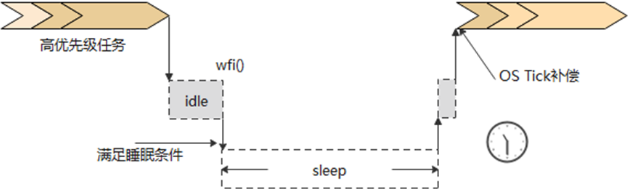

BS2XV100使用的操作系统为LiteOS，低功耗管理接口在LiteOS的IDLE线程中已经被调用，无需应用层主动调用，满足睡眠条件即可进入睡眠。

## 低功耗模式<a name="ZH-CN_TOPIC_0000001820426129"></a>

**表 1**  低功耗模式说明

<a name="table22471849163017"></a>
<table><thead align="left"><tr id="row6248124923010"><th class="cellrowborder" valign="top" width="14.79147914791479%" id="mcps1.2.4.1.1"><p id="p5248164910306"><a name="p5248164910306"></a><a name="p5248164910306"></a><strong id="b1240216311478"><a name="b1240216311478"></a><a name="b1240216311478"></a>模式</strong></p>
</th>
<th class="cellrowborder" valign="top" width="35.66356635663566%" id="mcps1.2.4.1.2"><p id="p724894963010"><a name="p724894963010"></a><a name="p724894963010"></a><strong id="b1140211313477"><a name="b1140211313477"></a><a name="b1140211313477"></a>芯片状态</strong></p>
</th>
<th class="cellrowborder" valign="top" width="49.544954495449545%" id="mcps1.2.4.1.3"><p id="p224814963016"><a name="p224814963016"></a><a name="p224814963016"></a><strong id="b240393110474"><a name="b240393110474"></a><a name="b240393110474"></a>特点</strong></p>
</th>
</tr>
</thead>
<tbody><tr id="row2248114983017"><td class="cellrowborder" valign="top" width="14.79147914791479%" headers="mcps1.2.4.1.1 "><p id="p102481449173012"><a name="p102481449173012"></a><a name="p102481449173012"></a>WFI模式</p>
</td>
<td class="cellrowborder" valign="top" width="35.66356635663566%" headers="mcps1.2.4.1.2 "><a name="ul1071114193819"></a><a name="ul1071114193819"></a><ul id="ul1071114193819"><li>CPU停止工作。</li><li>部分时钟降频/关闭。</li></ul>
</td>
<td class="cellrowborder" valign="top" width="49.544954495449545%" headers="mcps1.2.4.1.3 "><a name="ul1632311917380"></a><a name="ul1632311917380"></a><ul id="ul1632311917380"><li>WFI即Wait For Interrupt ，所有中断都能打断这一状态，让CPU继续工作。</li><li>OsTick正常保持（周期：1ms）。</li></ul>
</td>
</tr>
<tr id="row1224814491301"><td class="cellrowborder" valign="top" width="14.79147914791479%" headers="mcps1.2.4.1.1 "><p id="p02489496302"><a name="p02489496302"></a><a name="p02489496302"></a>浅睡模式</p>
</td>
<td class="cellrowborder" valign="top" width="35.66356635663566%" headers="mcps1.2.4.1.2 "><a name="ul8595335433"></a><a name="ul8595335433"></a><ul id="ul8595335433"><li>CPU不下电，RAM不下电，所有外设可控下电。</li><li>只支持部分外设中断唤醒。</li></ul>
</td>
<td class="cellrowborder" valign="top" width="49.544954495449545%" headers="mcps1.2.4.1.3 "><a name="ul257145964310"></a><a name="ul257145964310"></a><ul id="ul257145964310"><li>蓝牙/星闪广播/连接保持正常。</li><li>支持GPIO输出电平保持。</li></ul>
</td>
</tr>
<tr id="row1824814496306"><td class="cellrowborder" valign="top" width="14.79147914791479%" headers="mcps1.2.4.1.1 "><p id="p13248849163014"><a name="p13248849163014"></a><a name="p13248849163014"></a>深睡模式</p>
</td>
<td class="cellrowborder" valign="top" width="35.66356635663566%" headers="mcps1.2.4.1.2 "><a name="ul1248403814816"></a><a name="ul1248403814816"></a><ul id="ul1248403814816"><li>CPU下电，RAM不下电，ULP_GPIO、ULP_WDT以外其他外设下电。</li><li>只支持少数外设中断唤醒。</li></ul>
</td>
<td class="cellrowborder" valign="top" width="49.544954495449545%" headers="mcps1.2.4.1.3 "><a name="ul196531838124716"></a><a name="ul196531838124716"></a><ul id="ul196531838124716"><li>蓝牙/星闪广播/连接保持正常。</li><li>uapi_gpio_set_val输出保持不生效，uapi_pin_set_pull管脚上下拉继续生效。</li><li>osal_timer定时功能不受影响。</li><li>用户自己初始化的外设，唤醒后需自行恢复。</li></ul>
</td>
</tr>
</tbody>
</table>

# 低功耗方案<a name="ZH-CN_TOPIC_0000001773906200"></a>


## 睡眠条件<a name="ZH-CN_TOPIC_0000001820426137"></a>

**图 1**  睡眠条件<a name="fig2091003616529"></a>  


-   睡眠否决票

    添加睡眠否决票接口：errcode\_t uapi\_pm\_add\_sleep\_veto\(pm\_veto\_id\_t veto\_id\)

    移除睡眠否决票接口：errcode\_t uapi\_pm\_remove\_sleep\_veto\(pm\_veto\_id\_t veto\_id\)

    系统初始化时，有调用“uapi\_pm\_add\_sleep\_veto\(PM\_VETO\_ID\_MCU\)”接口投了一票睡眠否决票，如想让系统进睡眠则需要移除该否决票，调用“uapi\_pm\_remove\_sleep\_veto\(PM\_VETO\_ID\_MCU\)”即可。

-   空闲时间

    系统空闲时间由LiteOS管理，在睡眠投票满足时，睡眠管理接口中会判断睡眠时间是否满足深睡阈值，满足即进到深睡流程。低功耗管理接口会根据系统空闲时间添加唤醒计时器，保证系统能在预期时间点醒来。

> **说明：** 
>-   系统空闲时间受用户自己创建的线程/定时器影响，如果睡眠否决票已被全部移除，但是系统无法睡眠或者被频繁唤醒，请用户自行检查业务代码中是否有不合理的设计。
>-   如果系统当前处于广播态/连接态，系统也会周期性的醒来以维持广播/连接。

## 睡眠唤醒流程<a name="ZH-CN_TOPIC_0000001820546197"></a>

**图 1**  睡眠唤醒流程<a name="fig0123149678"></a>  
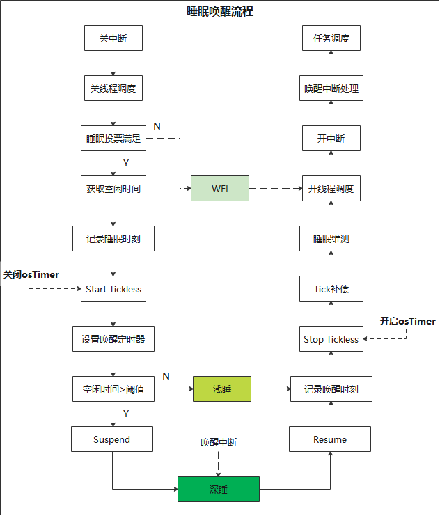

上述流程见“pm\_sleep.c”中的“uapi\_pm\_enter\_sleep”接口。

> **说明：** 
>Tickless：即OsTick减少，BS2X的OsTick是用外部Timer中断实现的（周期：1ms），系统睡眠前会主动关闭该Timer，系统唤醒后会根据实际睡眠时间对OsTick进行补偿，以保证OS线程/定时器调度不受睡眠影响。

## 唤醒源<a name="ZH-CN_TOPIC_0000001773746492"></a>

-   浅睡唤醒源

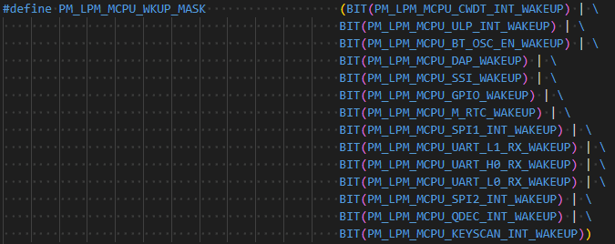

-   深睡唤醒源

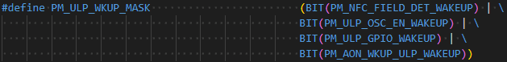

代码位置：middleware/chips/bs2x/pm/pm\_sleep/pm\_sleep\_porting.c

> **说明：** 
>1.  唤醒源使能本身并不会增加功耗，不要因为系统频繁唤醒就侵入式修改/删除唤醒源。有异常唤醒就正面定位，不建议采用删除唤醒源的方式规避！
>2.  实际上，用户在投票睡眠后，即可当成所有外设都下电了，最终外设唤醒是通过ulp\_gpio唤醒的。
>3.  如果用户有定时唤醒的需求，有两种方式可以实现，第一种通过线程延时（osal\_msleep）等待，第二种可通过软Timer（osal\_timer\_start）。

## 外设下电<a name="ZH-CN_TOPIC_0000001773746496"></a>

**表 1**  外设下电

<a name="table1525122116588"></a>
<table><thead align="left"><tr id="row12252152120583"><th class="cellrowborder" valign="top" width="5.36%" id="mcps1.2.5.1.1"><p id="p101224365815"><a name="p101224365815"></a><a name="p101224365815"></a><strong id="b18401162912591"><a name="b18401162912591"></a><a name="b18401162912591"></a>序号</strong></p>
</th>
<th class="cellrowborder" valign="top" width="12.86%" id="mcps1.2.5.1.2"><p id="p91264315582"><a name="p91264315582"></a><a name="p91264315582"></a><strong id="b1041517299593"><a name="b1041517299593"></a><a name="b1041517299593"></a>驱动</strong></p>
</th>
<th class="cellrowborder" valign="top" width="37.88%" id="mcps1.2.5.1.3"><p id="p101234311583"><a name="p101234311583"></a><a name="p101234311583"></a><strong id="b9430132910595"><a name="b9430132910595"></a><a name="b9430132910595"></a>深睡外设下电说明</strong></p>
</th>
<th class="cellrowborder" valign="top" width="43.9%" id="mcps1.2.5.1.4"><p id="p91294310587"><a name="p91294310587"></a><a name="p91294310587"></a><strong id="b943116296598"><a name="b943116296598"></a><a name="b943116296598"></a>恢复说明</strong></p>
</th>
</tr>
</thead>
<tbody><tr id="row1625218216586"><td class="cellrowborder" valign="top" width="5.36%" headers="mcps1.2.5.1.1 "><p id="p13121443175812"><a name="p13121443175812"></a><a name="p13121443175812"></a>1</p>
</td>
<td class="cellrowborder" valign="top" width="12.86%" headers="mcps1.2.5.1.2 "><p id="p1212243155819"><a name="p1212243155819"></a><a name="p1212243155819"></a>Pinctrl</p>
</td>
<td class="cellrowborder" valign="top" width="37.88%" headers="mcps1.2.5.1.3 "><p id="p2127434585"><a name="p2127434585"></a><a name="p2127434585"></a>mode下电、pull不下电、ds不下电。</p>
</td>
<td class="cellrowborder" valign="top" width="43.9%" headers="mcps1.2.5.1.4 "><p id="p1712343165814"><a name="p1712343165814"></a><a name="p1712343165814"></a>直接使用uapi_pin_set_mode恢复各个外设的管脚模式即可。</p>
</td>
</tr>
<tr id="row1225222112586"><td class="cellrowborder" valign="top" width="5.36%" headers="mcps1.2.5.1.1 "><p id="p71234325810"><a name="p71234325810"></a><a name="p71234325810"></a>2</p>
</td>
<td class="cellrowborder" valign="top" width="12.86%" headers="mcps1.2.5.1.2 "><p id="p112143185819"><a name="p112143185819"></a><a name="p112143185819"></a>uapi_gpio</p>
</td>
<td class="cellrowborder" valign="top" width="37.88%" headers="mcps1.2.5.1.3 "><p id="p1475017425584"><a name="p1475017425584"></a><a name="p1475017425584"></a>下电，睡眠不支持唤醒，唤醒中断需注册于ulp_gpio中，唤醒后挂在本IP的中断可以正常响应。</p>
<p id="p19614133265616"><a name="p19614133265616"></a><a name="p19614133265616"></a>睡眠时uapi_gpio本身会下电，SDK里已将uapi_gpio的输出配置同步到ulp_gpio，故睡眠时IO输出可保持。</p>
</td>
<td class="cellrowborder" valign="top" width="43.9%" headers="mcps1.2.5.1.4 "><p id="p512134345813"><a name="p512134345813"></a><a name="p512134345813"></a>参照正常流程恢复。</p>
</td>
</tr>
<tr id="row1225272155812"><td class="cellrowborder" valign="top" width="5.36%" headers="mcps1.2.5.1.1 "><p id="p212134395818"><a name="p212134395818"></a><a name="p212134395818"></a>3</p>
</td>
<td class="cellrowborder" valign="top" width="12.86%" headers="mcps1.2.5.1.2 "><p id="p91234375813"><a name="p91234375813"></a><a name="p91234375813"></a>UART</p>
</td>
<td class="cellrowborder" valign="top" width="37.88%" headers="mcps1.2.5.1.3 "><p id="p1312184319585"><a name="p1312184319585"></a><a name="p1312184319585"></a>下电，唤醒时SDK代码中已默认恢复。</p>
</td>
<td class="cellrowborder" valign="top" width="43.9%" headers="mcps1.2.5.1.4 "><p id="p191224395819"><a name="p191224395819"></a><a name="p191224395819"></a>通过 CONFIG_UART_SUPPORT_LPM 控制SDK恢复UART。</p>
</td>
</tr>
<tr id="row202522216587"><td class="cellrowborder" valign="top" width="5.36%" headers="mcps1.2.5.1.1 "><p id="p3121343155811"><a name="p3121343155811"></a><a name="p3121343155811"></a>4</p>
</td>
<td class="cellrowborder" valign="top" width="12.86%" headers="mcps1.2.5.1.2 "><p id="p212174355819"><a name="p212174355819"></a><a name="p212174355819"></a>I2C</p>
</td>
<td class="cellrowborder" valign="top" width="37.88%" headers="mcps1.2.5.1.3 "><p id="p1412643205815"><a name="p1412643205815"></a><a name="p1412643205815"></a>下电，需用户自行恢复。</p>
</td>
<td class="cellrowborder" valign="top" width="43.9%" headers="mcps1.2.5.1.4 "><p id="p1812114312581"><a name="p1812114312581"></a><a name="p1812114312581"></a>参照正常流程。</p>
</td>
</tr>
<tr id="row1925272114585"><td class="cellrowborder" valign="top" width="5.36%" headers="mcps1.2.5.1.1 "><p id="p18123434587"><a name="p18123434587"></a><a name="p18123434587"></a>5</p>
</td>
<td class="cellrowborder" valign="top" width="12.86%" headers="mcps1.2.5.1.2 "><p id="p312164311580"><a name="p312164311580"></a><a name="p312164311580"></a>ADC</p>
</td>
<td class="cellrowborder" valign="top" width="37.88%" headers="mcps1.2.5.1.3 "><p id="p12121643125818"><a name="p12121643125818"></a><a name="p12121643125818"></a>下电，需用户自行恢复。</p>
</td>
<td class="cellrowborder" valign="top" width="43.9%" headers="mcps1.2.5.1.4 "><p id="p1012144335811"><a name="p1012144335811"></a><a name="p1012144335811"></a>参照正常流程。</p>
</td>
</tr>
<tr id="row4252021175812"><td class="cellrowborder" valign="top" width="5.36%" headers="mcps1.2.5.1.1 "><p id="p81274310581"><a name="p81274310581"></a><a name="p81274310581"></a>6</p>
</td>
<td class="cellrowborder" valign="top" width="12.86%" headers="mcps1.2.5.1.2 "><p id="p3122435581"><a name="p3122435581"></a><a name="p3122435581"></a>DMA</p>
</td>
<td class="cellrowborder" valign="top" width="37.88%" headers="mcps1.2.5.1.3 "><p id="p1312104313581"><a name="p1312104313581"></a><a name="p1312104313581"></a>下电，需用户自行恢复。</p>
</td>
<td class="cellrowborder" valign="top" width="43.9%" headers="mcps1.2.5.1.4 "><p id="p121215431584"><a name="p121215431584"></a><a name="p121215431584"></a>参照正常流程。</p>
</td>
</tr>
<tr id="row13252182155810"><td class="cellrowborder" valign="top" width="5.36%" headers="mcps1.2.5.1.1 "><p id="p181214395812"><a name="p181214395812"></a><a name="p181214395812"></a>7</p>
</td>
<td class="cellrowborder" valign="top" width="12.86%" headers="mcps1.2.5.1.2 "><p id="p4121443185810"><a name="p4121443185810"></a><a name="p4121443185810"></a>PWM</p>
</td>
<td class="cellrowborder" valign="top" width="37.88%" headers="mcps1.2.5.1.3 "><p id="p181264313580"><a name="p181264313580"></a><a name="p181264313580"></a>下电，需用户自行恢复。</p>
</td>
<td class="cellrowborder" valign="top" width="43.9%" headers="mcps1.2.5.1.4 "><p id="p111234365814"><a name="p111234365814"></a><a name="p111234365814"></a>参照正常流程。</p>
</td>
</tr>
<tr id="row1125232118583"><td class="cellrowborder" valign="top" width="5.36%" headers="mcps1.2.5.1.1 "><p id="p121214315810"><a name="p121214315810"></a><a name="p121214315810"></a>8</p>
</td>
<td class="cellrowborder" valign="top" width="12.86%" headers="mcps1.2.5.1.2 "><p id="p41284314580"><a name="p41284314580"></a><a name="p41284314580"></a>WDT</p>
</td>
<td class="cellrowborder" valign="top" width="37.88%" headers="mcps1.2.5.1.3 "><p id="p4121143195816"><a name="p4121143195816"></a><a name="p4121143195816"></a>下电，SDK唤醒时已默认恢复。</p>
</td>
<td class="cellrowborder" valign="top" width="43.9%" headers="mcps1.2.5.1.4 "><p id="p181211432588"><a name="p181211432588"></a><a name="p181211432588"></a>通过CONFIG_WATCHDOG_SUPPORT_LPM 控制SDK恢复WDT。</p>
</td>
</tr>
<tr id="row1525213215580"><td class="cellrowborder" valign="top" width="5.36%" headers="mcps1.2.5.1.1 "><p id="p1312164365812"><a name="p1312164365812"></a><a name="p1312164365812"></a>9</p>
</td>
<td class="cellrowborder" valign="top" width="12.86%" headers="mcps1.2.5.1.2 "><p id="p1012143155810"><a name="p1012143155810"></a><a name="p1012143155810"></a>uapi_timer</p>
</td>
<td class="cellrowborder" valign="top" width="37.88%" headers="mcps1.2.5.1.3 "><p id="p212154314583"><a name="p212154314583"></a><a name="p212154314583"></a>下电，可SDK恢复和补偿。</p>
</td>
<td class="cellrowborder" valign="top" width="43.9%" headers="mcps1.2.5.1.4 "><p id="p191244318580"><a name="p191244318580"></a><a name="p191244318580"></a>通过CONFIG_TIMER_SUPPORT_LPM控制</p>
<p id="p612154375818"><a name="p612154375818"></a><a name="p612154375818"></a>（不建议开，会增加保连场景的工作时间）。</p>
</td>
</tr>
<tr id="row15253921205819"><td class="cellrowborder" valign="top" width="5.36%" headers="mcps1.2.5.1.1 "><p id="p71214431582"><a name="p71214431582"></a><a name="p71214431582"></a>10</p>
</td>
<td class="cellrowborder" valign="top" width="12.86%" headers="mcps1.2.5.1.2 "><p id="p6123435587"><a name="p6123435587"></a><a name="p6123435587"></a>uapi_rtc</p>
</td>
<td class="cellrowborder" valign="top" width="37.88%" headers="mcps1.2.5.1.3 "><p id="p51311437582"><a name="p51311437582"></a><a name="p51311437582"></a>下电，需用户自行恢复。</p>
</td>
<td class="cellrowborder" valign="top" width="43.9%" headers="mcps1.2.5.1.4 "><p id="p1813243115819"><a name="p1813243115819"></a><a name="p1813243115819"></a>通过CONFIG_RTC_SUPPORT_LPM控制</p>
<p id="p10131438585"><a name="p10131438585"></a><a name="p10131438585"></a>（不建议开，会增加保连场景的工作时间）。</p>
</td>
</tr>
<tr id="row125372111584"><td class="cellrowborder" valign="top" width="5.36%" headers="mcps1.2.5.1.1 "><p id="p181374318589"><a name="p181374318589"></a><a name="p181374318589"></a>11</p>
</td>
<td class="cellrowborder" valign="top" width="12.86%" headers="mcps1.2.5.1.2 "><p id="p913643135816"><a name="p913643135816"></a><a name="p913643135816"></a>Systick</p>
</td>
<td class="cellrowborder" valign="top" width="37.88%" headers="mcps1.2.5.1.3 "><p id="p51334318586"><a name="p51334318586"></a><a name="p51334318586"></a>下电，需用户自行恢复。</p>
</td>
<td class="cellrowborder" valign="top" width="43.9%" headers="mcps1.2.5.1.4 "><p id="p1613114315811"><a name="p1613114315811"></a><a name="p1613114315811"></a>通过CONFIG_SYSTICK_SUPPORT_LPM控制SDK恢复。</p>
</td>
</tr>
<tr id="row1825382116586"><td class="cellrowborder" valign="top" width="5.36%" headers="mcps1.2.5.1.1 "><p id="p141374313582"><a name="p141374313582"></a><a name="p141374313582"></a>12</p>
</td>
<td class="cellrowborder" valign="top" width="12.86%" headers="mcps1.2.5.1.2 "><p id="p1132043145818"><a name="p1132043145818"></a><a name="p1132043145818"></a>Tcxo</p>
</td>
<td class="cellrowborder" valign="top" width="37.88%" headers="mcps1.2.5.1.3 "><p id="p513164319588"><a name="p513164319588"></a><a name="p513164319588"></a>下电，唤醒时SDK代码中已默认恢复。</p>
</td>
<td class="cellrowborder" valign="top" width="43.9%" headers="mcps1.2.5.1.4 "><p id="p151354365817"><a name="p151354365817"></a><a name="p151354365817"></a>通过CONFIG_TCXO_SUPPORT_LPM控制SDK恢复。</p>
</td>
</tr>
<tr id="row17253621135816"><td class="cellrowborder" valign="top" width="5.36%" headers="mcps1.2.5.1.1 "><p id="p51394317583"><a name="p51394317583"></a><a name="p51394317583"></a>13</p>
</td>
<td class="cellrowborder" valign="top" width="12.86%" headers="mcps1.2.5.1.2 "><p id="p191364365817"><a name="p191364365817"></a><a name="p191364365817"></a>SFC</p>
</td>
<td class="cellrowborder" valign="top" width="37.88%" headers="mcps1.2.5.1.3 "><p id="p1313443195815"><a name="p1313443195815"></a><a name="p1313443195815"></a>下电，唤醒时SDK代码中已默认恢复。</p>
</td>
<td class="cellrowborder" valign="top" width="43.9%" headers="mcps1.2.5.1.4 "><p id="p1113243115811"><a name="p1113243115811"></a><a name="p1113243115811"></a>通过CONFIG_SFC_SUPPORT_LPM控制SDK恢复</p>
</td>
</tr>
<tr id="row225352195813"><td class="cellrowborder" valign="top" width="5.36%" headers="mcps1.2.5.1.1 "><p id="p91394311585"><a name="p91394311585"></a><a name="p91394311585"></a>14</p>
</td>
<td class="cellrowborder" valign="top" width="12.86%" headers="mcps1.2.5.1.2 "><p id="p213134311581"><a name="p213134311581"></a><a name="p213134311581"></a>外部Flash</p>
</td>
<td class="cellrowborder" valign="top" width="37.88%" headers="mcps1.2.5.1.3 "><p id="p213114313588"><a name="p213114313588"></a><a name="p213114313588"></a>非芯片供电，Flash所用SPI等需用户自行恢复。</p>
</td>
<td class="cellrowborder" valign="top" width="43.9%" headers="mcps1.2.5.1.4 "><p id="p913114385819"><a name="p913114385819"></a><a name="p913114385819"></a>-</p>
</td>
</tr>
<tr id="row1625311217588"><td class="cellrowborder" valign="top" width="5.36%" headers="mcps1.2.5.1.1 "><p id="p31384375818"><a name="p31384375818"></a><a name="p31384375818"></a>15</p>
</td>
<td class="cellrowborder" valign="top" width="12.86%" headers="mcps1.2.5.1.2 "><p id="p1413124325818"><a name="p1413124325818"></a><a name="p1413124325818"></a>SPI</p>
</td>
<td class="cellrowborder" valign="top" width="37.88%" headers="mcps1.2.5.1.3 "><p id="p713174345813"><a name="p713174345813"></a><a name="p713174345813"></a>下电，需用户自行恢复。</p>
</td>
<td class="cellrowborder" valign="top" width="43.9%" headers="mcps1.2.5.1.4 "><p id="p111394305815"><a name="p111394305815"></a><a name="p111394305815"></a>uapi_spi_suspend/uapi_spi_resume。</p>
</td>
</tr>
<tr id="row6253172115583"><td class="cellrowborder" valign="top" width="5.36%" headers="mcps1.2.5.1.1 "><p id="p1413443125815"><a name="p1413443125815"></a><a name="p1413443125815"></a>16</p>
</td>
<td class="cellrowborder" valign="top" width="12.86%" headers="mcps1.2.5.1.2 "><p id="p813174375815"><a name="p813174375815"></a><a name="p813174375815"></a>Qdec</p>
</td>
<td class="cellrowborder" valign="top" width="37.88%" headers="mcps1.2.5.1.3 "><p id="p7135436588"><a name="p7135436588"></a><a name="p7135436588"></a>下电，需用户自行恢复。</p>
</td>
<td class="cellrowborder" valign="top" width="43.9%" headers="mcps1.2.5.1.4 "><p id="p19132434586"><a name="p19132434586"></a><a name="p19132434586"></a>参照正常流程。</p>
</td>
</tr>
<tr id="row182532021155812"><td class="cellrowborder" valign="top" width="5.36%" headers="mcps1.2.5.1.1 "><p id="p213124335818"><a name="p213124335818"></a><a name="p213124335818"></a>17</p>
</td>
<td class="cellrowborder" valign="top" width="12.86%" headers="mcps1.2.5.1.2 "><p id="p13131043125812"><a name="p13131043125812"></a><a name="p13131043125812"></a>Keyscan</p>
</td>
<td class="cellrowborder" valign="top" width="37.88%" headers="mcps1.2.5.1.3 "><p id="p15131443105818"><a name="p15131443105818"></a><a name="p15131443105818"></a>下电，需用户自行恢复。</p>
</td>
<td class="cellrowborder" valign="top" width="43.9%" headers="mcps1.2.5.1.4 "><p id="p9131343115812"><a name="p9131343115812"></a><a name="p9131343115812"></a>参照正常流程。</p>
</td>
</tr>
<tr id="row7253112113589"><td class="cellrowborder" valign="top" width="5.36%" headers="mcps1.2.5.1.1 "><p id="p151324305810"><a name="p151324305810"></a><a name="p151324305810"></a>18</p>
</td>
<td class="cellrowborder" valign="top" width="12.86%" headers="mcps1.2.5.1.2 "><p id="p1913124317581"><a name="p1913124317581"></a><a name="p1913124317581"></a>osal_timer</p>
</td>
<td class="cellrowborder" valign="top" width="37.88%" headers="mcps1.2.5.1.3 "><p id="p513114305818"><a name="p513114305818"></a><a name="p513114305818"></a>下电，唤醒时SDK代码中已默认恢复。</p>
</td>
<td class="cellrowborder" valign="top" width="43.9%" headers="mcps1.2.5.1.4 "><p id="p19661228201719"><a name="p19661228201719"></a><a name="p19661228201719"></a>-</p>
</td>
</tr>
<tr id="row16253221115816"><td class="cellrowborder" valign="top" width="5.36%" headers="mcps1.2.5.1.1 "><p id="p1113164320581"><a name="p1113164320581"></a><a name="p1113164320581"></a>19</p>
</td>
<td class="cellrowborder" valign="top" width="12.86%" headers="mcps1.2.5.1.2 "><p id="p121312436582"><a name="p121312436582"></a><a name="p121312436582"></a>ulp_gpio</p>
</td>
<td class="cellrowborder" valign="top" width="37.88%" headers="mcps1.2.5.1.3 "><p id="p013184385815"><a name="p013184385815"></a><a name="p013184385815"></a>不下电，建议该GPIO只用来唤醒。</p>
</td>
<td class="cellrowborder" valign="top" width="43.9%" headers="mcps1.2.5.1.4 "><p id="p3665162831714"><a name="p3665162831714"></a><a name="p3665162831714"></a>-</p>
</td>
</tr>
<tr id="row1725319217580"><td class="cellrowborder" valign="top" width="5.36%" headers="mcps1.2.5.1.1 "><p id="p613184395812"><a name="p613184395812"></a><a name="p613184395812"></a>20</p>
</td>
<td class="cellrowborder" valign="top" width="12.86%" headers="mcps1.2.5.1.2 "><p id="p613443185814"><a name="p613443185814"></a><a name="p613443185814"></a>ulp_rtc</p>
</td>
<td class="cellrowborder" valign="top" width="37.88%" headers="mcps1.2.5.1.3 "><p id="p51313439583"><a name="p51313439583"></a><a name="p51313439583"></a>只用来在睡眠流程定时唤醒和计算timer补偿用。</p>
</td>
<td class="cellrowborder" valign="top" width="43.9%" headers="mcps1.2.5.1.4 "><p id="p136671328181714"><a name="p136671328181714"></a><a name="p136671328181714"></a>-</p>
</td>
</tr>
<tr id="row132531321105811"><td class="cellrowborder" valign="top" width="5.36%" headers="mcps1.2.5.1.1 "><p id="p4130436581"><a name="p4130436581"></a><a name="p4130436581"></a>21</p>
</td>
<td class="cellrowborder" valign="top" width="12.86%" headers="mcps1.2.5.1.2 "><p id="p181354395812"><a name="p181354395812"></a><a name="p181354395812"></a>ulp_wdt</p>
</td>
<td class="cellrowborder" valign="top" width="37.88%" headers="mcps1.2.5.1.3 "><p id="p191314345813"><a name="p191314345813"></a><a name="p191314345813"></a>不下电，睡眠场景保持该wdt在的话需注意喂狗。</p>
</td>
<td class="cellrowborder" valign="top" width="43.9%" headers="mcps1.2.5.1.4 "><p id="p13668142810178"><a name="p13668142810178"></a><a name="p13668142810178"></a>-</p>
</td>
</tr>
<tr id="row12253152155815"><td class="cellrowborder" valign="top" width="5.36%" headers="mcps1.2.5.1.1 "><p id="p4132435580"><a name="p4132435580"></a><a name="p4132435580"></a>22</p>
</td>
<td class="cellrowborder" valign="top" width="12.86%" headers="mcps1.2.5.1.2 "><p id="p181313433583"><a name="p181313433583"></a><a name="p181313433583"></a>RAM&amp;内部Flash</p>
</td>
<td class="cellrowborder" valign="top" width="37.88%" headers="mcps1.2.5.1.3 "><p id="p3131543155811"><a name="p3131543155811"></a><a name="p3131543155811"></a>不下电。</p>
</td>
<td class="cellrowborder" valign="top" width="43.9%" headers="mcps1.2.5.1.4 "><p id="p1167022819178"><a name="p1167022819178"></a><a name="p1167022819178"></a>-</p>
</td>
</tr>
</tbody>
</table>

> **说明：** 
>BS2X系统深睡时，绝大多数外设均下电，基础外设，如sfc、wdt、tcxo、uart、osal\_timer等在SDK中有恢复，其他由用户初始化的外设，在唤醒后需用户进行恢复，该流程放在用户的低功耗状态机中自行管理即可。

# 开发指引<a name="ZH-CN_TOPIC_0000001773906184"></a>

时钟/电源管理逻辑已在SDK中配置，用户不必关心时钟树/电源树具体结构，对于用户所需要的低功耗相关接口会在下面介绍。


## 主频&睡眠投票<a name="ZH-CN_TOPIC_0000001773906204"></a>

1.  主频配置

    对于CPU频率的配置提供2个档位即32M、64M，分别调用以下接口即可：

    （需\#include "pm\_clock.h"）

    -   主频32M：

        uapi\_clock\_control\(CLOCK\_CONTROL\_FREQ\_LEVEL\_CONFIG, CLOCK\_FREQ\_LEVEL\_LOW\_POWER\);

    -   主频64M：

        uapi\_clock\_control\(CLOCK\_CONTROL\_FREQ\_LEVEL\_CONFIG, CLOCK\_FREQ\_LEVEL\_HIGH\);

    -   获取主频：

        uapi\_clock\_crg\_get\_freq\(CLOCK\_CRG\_ID\_MCU\_CORE\);

2.  睡眠投票

    （需\#include "pm\_veto.h"）

    -   添加睡眠否决票：errcode\_t uapi\_pm\_add\_sleep\_veto\(pm\_veto\_id\_t veto\_id\)
    -   移除睡眠否决票：errcode\_t uapi\_pm\_remove\_sleep\_veto\(pm\_veto\_id\_t veto\_id\)
    -   添加带超时的睡眠否决票：errcode\_t uapi\_pm\_add\_sleep\_veto\_with\_timeout\(pm\_veto\_id\_t veto\_id, uint32\_t timeout\_ms\)，

        可以控制系统在指定时间内不进入睡眠，超时时间到了之后自动清除否决投票。

## 低功耗开发说明<a name="ZH-CN_TOPIC_0000001773906188"></a>

BS2X睡眠投票使用的是否决票接口，即如果没有模块进行投票，则系统在空闲时间满足时会进入深睡眠。

SDK中当前投了一票否决票，即在“uapi\_pm\_lpc\_init”中调用“uapi\_pm\_add\_sleep\_veto\(PM\_VETO\_ID\_MCU\);”投否决票，如[图1](#fig44554298155)所示。

**图 1**  SDK默认否决投票<a name="fig44554298155"></a>  
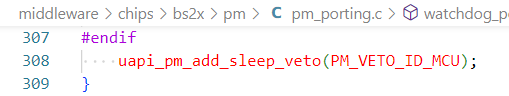

所以当前SDK只会在系统空闲时进入“WFI”，如果用户需要让系统进睡眠，还需要按照下面进行配置。

-   用户如果需要让MCU进睡眠时，可以调用“uapi\_pm\_remove\_sleep\_veto\(PM\_VETO\_ID\_MCU\);”接口，否决票为0，系统即可进入睡眠。
-   uapi\_pm\_add\_sleep\_veto和uapi\_pm\_remove\_sleep\_veto成对出现，调用uapi\_pm\_add\_sleep\_veto增加否决票（系统无法睡眠），调用uapi\_pm\_remove\_sleep\_veto移除否决票（系统可睡眠）。
-   另外又提供了带超时的投票接口“uapi\_pm\_add\_sleep\_veto\_with\_timeout”，调用该接口时需要传入一个超时时间参数（单位：ms），可以控制系统在指定时间内不进入睡眠，超时时间到了之后自动清除否决投票。

> **说明：** 
>用户在低功耗管理时应该自己设计系统状态机，如：何时进保连、何时进睡眠、保连参数配置、唤醒时参数恢复等等，这些只能由上层业务实现，上层业务通过调用“添加/移除睡眠否决票”的接口进而控制系统状态切换。
>BS2X SDK提供了一套简单状态机管理的代码，详细说明见《BS2XV100 低功耗sample使用指南》

## 低功耗维测<a name="ZH-CN_TOPIC_0000001801391326"></a>

1.  中断&任务调度

    添加编译宏（config.py中添加）：OS\_DFX\_SUPPORT，程序运行时会有如下打印：

    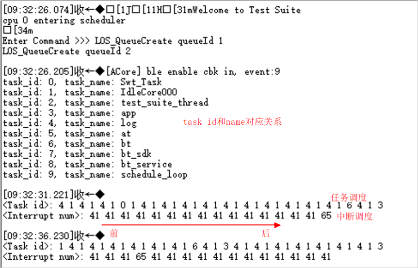

    -   app\_main初始化时打印task id和task name的对应关系；或者发送AT命令“AT+OSDFXPRINT”也可以进行打印。
    -   在周期性任务中按照调用顺序，从前往后打印“任务ID”和“中断号”。
    -   中断号见：chip\_core\_irq.h。

2.  工作&空闲时间统计

    product\_evb\_standard.h 文件中打开宏：PM\_MCPU\_MIPS\_STATISTICS\_ENABLE

3.  唤醒原因打印

    product\_evb\_standard.h 文件中打开宏：PM\_SLEEP\_DEBUG\_ENABLE，深睡流程唤醒源见打印“ulp-wkup evt”，对应bit为1则表示是该唤醒源唤醒，各bit对应唤醒源为：

    bit1：ulp\_gpio；

    bit2：ulp\_rtc（包含task中的osal\_msleep行为定时调度和osal\_timer软调度）;

    bit3：osc\_en（和BT业务有关，收发数据前需提前唤醒）；

    bit4：NFC；

    bit0：较为特殊，一般是由于在睡眠过程中被其他唤醒源唤醒导致，定位原因仍需看其他bit。

4.  获取投票信息：pm\_veto\_t \*uapi\_pm\_veto\_get\_info\(void\)
5.  获取睡眠信息：sleep\_info\_t \*uapi\_pm\_get\_sleep\_info\(void\)，需打开kconfig宏：CONFIG\_PM\_SLEEP\_RECORD\_ENABLE
6.  task timer和sw timer打印：使能宏OS\_TIMER\_DEBUG\_SUPPORT，发送AT命令“AT+OSTIMERPRINT”；或者调用接口os\_task\_timer\_print和os\_sw\_timer\_print进行打印；只看sw timer的话，也可以调用接口os\_sw\_timer\_print\_flag\_set控制软timer调度时进行打印。
7.  睡眠投票和BT状态打印：使能宏SLP\_VETO\_AT\_SUPPORT，发送AT“AT+PMVETOINFO”即可打印投票信息和BT状态信息。

> **说明：** 
>维测会增加软件运行时间，前期调试和问题定位时可以打开，正式版本建议全部关闭。

## 其他说明<a name="ZH-CN_TOPIC_0000001899142830"></a>


### BUCK/LDO供电模式配置<a name="ZH-CN_TOPIC_0000001900710056"></a>

参考《BS2XV100 硬件指南》，芯片内部电源模块支持BUCK模式和LDO模式供电。

通常推荐芯片按照BUCK模式设计电路，效率高。如果对PCB面积有约束，且对模块的功耗不敏感，可采用LDO模式。

默认SDK版本为BUCK模式，使用LDO模式时需打开宏（CONFIG\_POWER\_SUPPLY\_BY\_LDO），配置如下：

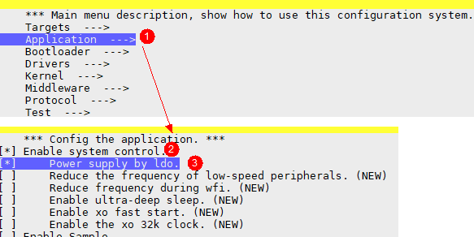

### 32K时钟切换<a name="ZH-CN_TOPIC_0000001900550168"></a>

BS2X芯片32K时钟可以选用内部RC也可以选用外部XO，SDK默认使用的是内部RC32K时钟，用户如需选用XO32K，可以通过配置宏“CONFIG\_XO\_32K\_ENABLE”进行切换，如下所示：

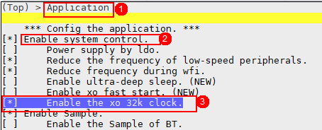

### GPIO相关<a name="ZH-CN_TOPIC_0000001939309589"></a>

**GPIO中断注册<a name="section14838743121218"></a>**

睡眠时uapi\_gpio接口对应驱动会全部下电，所以无法通过工作时注册的uapi\_gpio中断唤醒，需要用户通过ulp\_gpio接口注册中断。uapi\_gpio可注册32个中断，和Pin脚一一对应；ulp\_gpio只能注册8个中断，需自定义进行Pin脚绑定。

-   唤醒中断配置接口：void ulp\_gpio\_int\_wkup\_config\(ulp\_gpio\_int\_wkup\_cfg\_t \*cfg, uint8\_t array\_num\)，睡眠前将所需的IO注册到唤醒中断上。一般情况下，uapi\_gpio和ulp\_gpio只能使用一个，所以睡眠前需去初始化uapi\_gpio，并初始化ulp\_gpio，之后再注册ulp\_gpio中断。以鼠标按键为例，使用示例如下：

    ```
    static ulp_gpio_int_wkup_cfg_t g_wk_cfg[] = {
        { 1, CONFIG_MOUSE_PIN_QDEC_A, true, ULP_GPIO_INTERRUPT_FALLING_EDGE, ulp_gpio_wkup_handler },    // qdec唤醒
        { 2, CONFIG_MOUSE_PIN_LEFT, true, ULP_GPIO_INTERRUPT_FALLING_EDGE, ulp_gpio_wkup_handler },      // 左键唤醒
        { 3, CONFIG_MOUSE_PIN_RIGHT, true, ULP_GPIO_INTERRUPT_FALLING_EDGE, ulp_gpio_wkup_handler },     // 右键唤醒
        { 4, CONFIG_MOUSE_PIN_MID, true, ULP_GPIO_INTERRUPT_FALLING_EDGE, ulp_gpio_wkup_handler },       // 中键唤醒
        { 5, CONFIG_MOUSE_PIN_MONTION, true, ULP_GPIO_INTERRUPT_FALLING_EDGE, ulp_gpio_wkup_handler },   // Sensor唤醒
    };
    // 睡眠前切换到ulp_gpio并注册中断
    static void mouse_enable_ulpgpio_wkup(void)
    {
        uapi_gpio_deinit();
        ulp_gpio_init();
        ulp_gpio_int_wkup_config(g_wk_cfg, sizeof(g_wk_cfg) / sizeof(ulp_gpio_int_wkup_cfg_t));
    }
    // 唤醒后切换到uapi_gpio
    static void mouse_disable_ulpgpio_wkup(void)
    {
        ulp_gpio_deinit();
        uapi_gpio_init();
    }
    ```

-   多个IO口绑定到一个mask接口：void ulp\_gpio\_mask\_pin\_set\(ulp\_gpio\_wk\_t wk\_sel, uint32\_t pin\_map\)，ulp\_gpio只能注册8个中断，如果多于8个IO口要响应唤醒中断，需要使用该接口将多个IO口绑定到一个mask上，参数pin\_map每个bit对应一个IO（bit0即s\_mgpio0），对应bit为1即表示选定对应IO。
-   参数说明：

    ```
    typedef struct ulp_gpio_int_wkup_cfg {
    /* ulp_gpio共有8个(0~7) */
    uint8_t ulp_gpio;
    /**
    *0~31：IO管脚，参考 pin_t 。
    *32：swd_clk管脚
    *33：swd_io管脚
    *34：gpio或mask0，低电平：0，高电平：1，可以将多个低电平管脚绑定成或mask0，中断触发选上升沿或高电平，一个脚被拉高即触发中断。
    *35：gpio与mask0，低电平：0，高电平：1，可以将多个高电平管脚绑定成与mask0，中断触发选下降沿或低电平，一个脚被拉低即触发中断。
    *36：gpio或mask1，低电平：0，高电平：1，可以将多个低电平管脚绑定成或mask1，中断触发选上升沿或高电平，一个脚被拉高即触发中断。
    *37：gpio与mask1，低电平：0，高电平：1，可以将多个高电平管脚绑定成与mask1，中断触发选下降沿或低电平，一个脚被拉低即触发中断。
    补充：mask管脚绑定可以使用接口 ulp_gpio_mask_pin_set。
    */
    uint8_t wk_mux;
    bool int_enable;
    ulp_gpio_interrupt_t trigger;
    ulp_gpio_irq_cb_t irq_cb;
    } ulp_gpio_int_wkup_cfg_t;
    ```

**GPIO输出保持<a name="section13722120139"></a>**

系统深睡时，uapi\_gpio会下电，所以在睡眠时需要通过ulp\_gpio进行GPIO输出。当前SDK中已自动在睡眠时将uapi\_gpio输出配置同步到ulp\_gpio，唤醒后再同步回来。如果有GPIO输出需求，直接使用uapi\_gpio接口配置即可；如果用户不需要使GPIO保持输出功能，同样，使用uapi\_gpio\_set\_dir接口将其配置成输入功能即可。

**IO管脚IE配置<a name="section384062701318"></a>**

IE即Input Enable，即需要保持IO为输入功能（接收中断）时需要使用uapi\_pin\_set\_ie接口，将对应IO口配置使能。

为了避免IO上不必要的漏电，当前SDK中已经将默认管脚的IE功能disable，用户如果需要对应IO口能响应GPIO中断，需要将IE使能。另外，如UART RX等管脚IE也需要使能，当前SDK中也已经按需配置。

**IO状态打印&配置接口<a name="section379114631312"></a>**

-   状态打印接口：void pm\_gpio\_state\_print\(void\)，可以在睡眠前调用该接口打印出所有管脚的管脚ID、管脚模式、输入输出方向、内部上下拉状态、输出状态。

-   IO状态配置接口：void pm\_gpio\_group\_config\(gpio\_info\_cfg\_t \*cfg, uint8\_t array\_num\)，该接口实现旨在提供给用户一个IO整体配置的方法（也可自行实现），搭配状态打印接口使用，可以在睡眠前进行IO配置和显示，进而辅助功耗优化。

> **说明：** 
>系统深睡功耗排查，主要是排查IO漏电，而IO上下拉/输入输出配置一般又和外围电路有关。IO状态打印&配置接口，可以对IO进行整体配置及打印，进而和硬件同事相互对齐即可。

### 32K时钟观测<a name="ZH-CN_TOPIC_0000001900710060"></a>

SDK中提供了观测32K时钟的接口：uapi\_clock\_control\(CLOCK\_CONTROL\_32K\_TEST\_ENABLE, xxx\)，即使用Pin xxx口观测32K时钟，该接口使用时需打开宏“CLOCK\_TEST\_ENABLE”。

### XO快速起振配置<a name="ZH-CN_TOPIC_0000001900550172"></a>

当前SDK中XO起振时间按照1ms配置，如果XO晶体电容为8pF的话，XO起振时间可以缩短到250us。可以通过使能宏CONFIG\_PM\_XO\_FAST\_START\_ENABLE缩短XO起振时间，进而减少“工作时间”并降低功耗。宏配置如下：

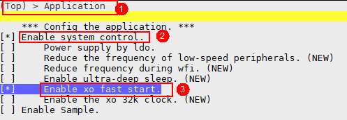

### 外设保存恢复<a name="ZH-CN_TOPIC_0000001948369757"></a>

根据2.4章节知道：睡眠时绝大部分外设是自动掉电的，唤醒时需要软件流程重新配置恢复，当前SDK中默认已进行部分外设恢复。

个别外设用户也可以配置不恢复，以缩减唤醒后的软件工作时间，进而降低一些保连功耗。这些外设包括：watchdog、uart、cpu\_trace，可分别关闭宏 CONFIG\_WATCHDOG\_SUPPORT\_LPM、CONFIG\_UART\_SUPPORT\_LPM、CONFIG\_CPU\_TRACE\_SUPPORT\_LPM。

-   uapi\_watchdog休眠时下电，唤醒后默认上电（超时时间为8s），唤醒后不主动恢复也不会影响其功能；休眠时ulp\_wdt可以保持不下电，可以在睡眠期间起到保护作用。
-   uart当前睡眠唤醒前后做了保存和恢复，该动作用户可以放到自己的代码中去做，可以直接调用deinit和init接口重新初始化即可。
-   cpu\_trace功能会在每次函数跳转进行记录，在异常后可以导出trace分析函数接口调用轨迹。在正式商用版本上，该功能也可以考虑关掉。

### 低速外设降频<a name="ZH-CN_TOPIC_0000001918890744"></a>

当前SDK固定将低速外设（包括timer、uart l0、uart l1、i2c、keyscan、qdec）时钟源的频率固定配置为32M，为进一步降低工作功耗，用户可以打开宏 CONFIG\_REDUCE\_PERP\_LS\_FREQ 降低低速外设时钟源频率（8M），如下所示：

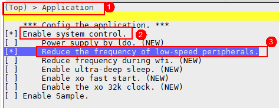

该宏打开时，部分外设总线频率会降低，上述外设性能会稍微有一些影响，用户根据测试情况可以考虑带上该优化配置。

### WFI状态降频<a name="ZH-CN_TOPIC_0000001918730808"></a>

> **须知：** 
>“低速外设降频”和“WFI状态降频”，在USB工作场景下慎用（性能不足），其他场景暂未发现问题。

CPU空闲时系统进入WFI状态，为进一步降低该状态下的功耗，可以打开宏 CONFIG\_REDUCE\_FREQ\_DURING\_WFI，降低该状态时的CPU和总线频率，以及临时关闭flash时钟，配置如下：

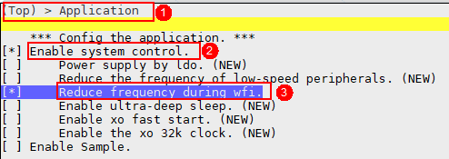

### 睡眠时关闭ulp\_wdt<a name="ZH-CN_TOPIC_0000001926907686"></a>

> **须知：** 
>1.  通过上述方法关闭ulp\_wdt时，软件会同时降低32k时钟（内置RC32K）的驱动能力，32k时钟精度会受到影响，所以建议在只有GPIO唤醒的情况下使用，即断连、无周期性定时器和任务。
>2.  睡眠时如果关闭ulp\_wdt，休眠唤醒期间部分软硬件流程无法守护住，如果在此期间芯片异常，系统则无法主动复位，不建议没有主动复位按键或插拔电池复位的产品使用。

系统睡眠时uapi\_watchdog下电，ulp\_wdt不下电。深睡场景，为了防止狗超时，系统需要唤醒去喂狗，对于长时间不工作场景，每次让系统醒来专门去喂狗，既增加功耗也显得不太必要，所以用户可以打开宏 CONFIG\_SUPPORT\_CLOSE\_ULP\_WDT\_DURING\_SLP 控制系统在休眠时关闭ulp\_wdt，如下：

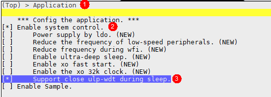

打开上述宏之后可以使用接口 void pm\_close\_ulp\_wdt\_during\_slp\(bool close\) 控制休眠时是否关闭ulp\_wdt。

# 功耗优化<a name="ZH-CN_TOPIC_0000001820426133"></a>

芯片功耗分为静态功耗和动态功耗。优化深睡功耗时，由于时钟都已关闭，所以基本没有动态功耗，主要优化静态功耗；对于工作场景，则主要优化动态功耗。下面将具体介绍睡眠电流和工作电流的优化方法。


## 睡眠电流<a name="ZH-CN_TOPIC_0000001820426117"></a>

系统睡眠时，高频时钟都已关闭，CPU和外设也均下电，此场景如果电流异常，主要是IO漏电导致。

-   硬件上可通过测量每个IO管脚电压，进而判断漏电情况，然后软件将IO电压配平即可。
-   GPIO非必须尽量不要配置成输出模式，建议配置成输入模式。
-   如果IO管脚上没有对接外围器件的话，建议该IO管脚配置成输入下拉。
-   对于部分管脚，如I2C、QSPI\_CS等一般配置成输入上拉功耗最低，用户可自行排查测试。
-   IO管脚如果配置成高阻态的话，IO管脚上可能会有积攒电荷，一般情况下，配置成上拉/下拉状态更优。

> **说明：** 
>Qdec使用的A/B两个管脚，为了减少漏电，一般该管脚都会板级上加上拉电阻，由于该管脚状态不定，软件配置上拉或者下拉都会漏电，所以该管脚一般都会配置成浮空态。

## 工作电流<a name="ZH-CN_TOPIC_0000001820426125"></a>

-   SDK中已经自适应的进行了电源和时钟的开关，所以对于工作功耗优化，主要在于主频配置和IO配置。
-   CPU工作占空比会影响功耗，例如日志打印较多会造成CPU进WFI的时间缩短，进而增加功耗；此外代码在RAM中的执行速度比Flash上高很多，所以用户为了进一步降低工作电流，需提取热点函数到RAM上。
-   另外，用户调用BTH接口配置的interval、latency和发射功率等参数也会影响工作功耗。

## 保连电流<a name="ZH-CN_TOPIC_0000001848004021"></a>

一般地，睡眠电流和工作电流优化完毕之后，保连电流不需要额外的优化了。保连电流会受连接参数 interval和latency 影响比较大。

# 常见问题<a name="ZH-CN_TOPIC_0000001820546177"></a>

请参见《BS2XV100 低功耗FAQ》。

