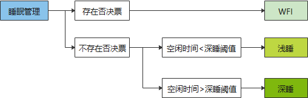
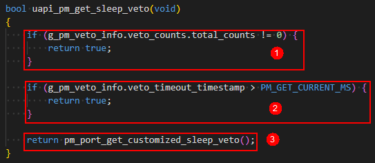
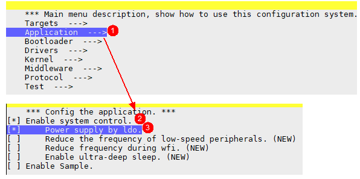
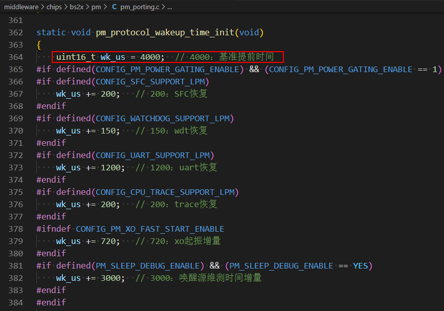

# 前言<a name="ZH-CN_TOPIC_0000001800389360"></a>

**概述<a name="section4537382116410"></a>**

本文档详细的描述了BS2XV100低功耗调测时可能遇到的问题，并根据经验提供了问题解决的方法，用户调测低功耗时遇到问题可以进行参考。

**读者对象<a name="section4378592816410"></a>**

本文档主要适用于以下工程师：

-   技术支持工程师
-   软件开发工程师

**符号约定<a name="section133020216410"></a>**

在本文中可能出现下列标志，它们所代表的含义如下。

<a name="table2622507016410"></a>
<table><thead align="left"><tr id="row1530720816410"><th class="cellrowborder" valign="top" width="20.580000000000002%" id="mcps1.1.3.1.1"><p id="p6450074116410"><a name="p6450074116410"></a><a name="p6450074116410"></a><strong id="b2136615816410"><a name="b2136615816410"></a><a name="b2136615816410"></a>符号</strong></p>
</th>
<th class="cellrowborder" valign="top" width="79.42%" id="mcps1.1.3.1.2"><p id="p5435366816410"><a name="p5435366816410"></a><a name="p5435366816410"></a><strong id="b5941558116410"><a name="b5941558116410"></a><a name="b5941558116410"></a>说明</strong></p>
</th>
</tr>
</thead>
<tbody><tr id="row1372280416410"><td class="cellrowborder" valign="top" width="20.580000000000002%" headers="mcps1.1.3.1.1 "><p id="p3734547016410"><a name="p3734547016410"></a><a name="p3734547016410"></a><a name="image2670064316410"></a><a name="image2670064316410"></a><span></span></p>
</td>
<td class="cellrowborder" valign="top" width="79.42%" headers="mcps1.1.3.1.2 "><p id="p1757432116410"><a name="p1757432116410"></a><a name="p1757432116410"></a>表示如不避免则将会导致死亡或严重伤害的具有高等级风险的危害。</p>
</td>
</tr>
<tr id="row466863216410"><td class="cellrowborder" valign="top" width="20.580000000000002%" headers="mcps1.1.3.1.1 "><p id="p1432579516410"><a name="p1432579516410"></a><a name="p1432579516410"></a><a name="image4895582316410"></a><a name="image4895582316410"></a><span></span></p>
</td>
<td class="cellrowborder" valign="top" width="79.42%" headers="mcps1.1.3.1.2 "><p id="p959197916410"><a name="p959197916410"></a><a name="p959197916410"></a>表示如不避免则可能导致死亡或严重伤害的具有中等级风险的危害。</p>
</td>
</tr>
<tr id="row123863216410"><td class="cellrowborder" valign="top" width="20.580000000000002%" headers="mcps1.1.3.1.1 "><p id="p1232579516410"><a name="p1232579516410"></a><a name="p1232579516410"></a><a name="image1235582316410"></a><a name="image1235582316410"></a><span></span></p>
</td>
<td class="cellrowborder" valign="top" width="79.42%" headers="mcps1.1.3.1.2 "><p id="p123197916410"><a name="p123197916410"></a><a name="p123197916410"></a>表示如不避免则可能导致轻微或中度伤害的具有低等级风险的危害。</p>
</td>
</tr>
<tr id="row5786682116410"><td class="cellrowborder" valign="top" width="20.580000000000002%" headers="mcps1.1.3.1.1 "><p id="p2204984716410"><a name="p2204984716410"></a><a name="p2204984716410"></a><a name="image4504446716410"></a><a name="image4504446716410"></a><span></span></p>
</td>
<td class="cellrowborder" valign="top" width="79.42%" headers="mcps1.1.3.1.2 "><p id="p4388861916410"><a name="p4388861916410"></a><a name="p4388861916410"></a>用于传递设备或环境安全警示信息。如不避免则可能会导致设备损坏、数据丢失、设备性能降低或其它不可预知的结果。</p>
<p id="p1238861916410"><a name="p1238861916410"></a><a name="p1238861916410"></a>“须知”不涉及人身伤害。</p>
</td>
</tr>
<tr id="row2856923116410"><td class="cellrowborder" valign="top" width="20.580000000000002%" headers="mcps1.1.3.1.1 "><p id="p5555360116410"><a name="p5555360116410"></a><a name="p5555360116410"></a><a name="image799324016410"></a><a name="image799324016410"></a><span></span></p>
</td>
<td class="cellrowborder" valign="top" width="79.42%" headers="mcps1.1.3.1.2 "><p id="p4612588116410"><a name="p4612588116410"></a><a name="p4612588116410"></a>对正文中重点信息的补充说明。</p>
<p id="p1232588116410"><a name="p1232588116410"></a><a name="p1232588116410"></a>“说明”不是安全警示信息，不涉及人身、设备及环境伤害信息。</p>
</td>
</tr>
</tbody>
</table>

**修改记录<a name="section12787162012256"></a>**

<a name="table1557726816410"></a>
<table><thead align="left"><tr id="row2942532716410"><th class="cellrowborder" valign="top" width="20.72%" id="mcps1.1.4.1.1"><p id="p3778275416410"><a name="p3778275416410"></a><a name="p3778275416410"></a><strong id="b5687322716410"><a name="b5687322716410"></a><a name="b5687322716410"></a>文档版本</strong></p>
</th>
<th class="cellrowborder" valign="top" width="26.119999999999997%" id="mcps1.1.4.1.2"><p id="p5627845516410"><a name="p5627845516410"></a><a name="p5627845516410"></a><strong id="b5800814916410"><a name="b5800814916410"></a><a name="b5800814916410"></a>发布日期</strong></p>
</th>
<th class="cellrowborder" valign="top" width="53.16%" id="mcps1.1.4.1.3"><p id="p2382284816410"><a name="p2382284816410"></a><a name="p2382284816410"></a><strong id="b3316380216410"><a name="b3316380216410"></a><a name="b3316380216410"></a>修改说明</strong></p>
</th>
</tr>
</thead>
<tbody><tr id="row530911260812"><td class="cellrowborder" valign="top" width="20.72%" headers="mcps1.1.4.1.1 "><p id="p630913262816"><a name="p630913262816"></a><a name="p630913262816"></a><span id="ph1495913271286"><a name="ph1495913271286"></a><a name="ph1495913271286"></a>04</span></p>
</td>
<td class="cellrowborder" valign="top" width="26.119999999999997%" headers="mcps1.1.4.1.2 "><p id="p10309226587"><a name="p10309226587"></a><a name="p10309226587"></a><span id="ph06137281087"><a name="ph06137281087"></a><a name="ph06137281087"></a>2025-03-26</span></p>
</td>
<td class="cellrowborder" valign="top" width="53.16%" headers="mcps1.1.4.1.3 "><p id="p184161737186"><a name="p184161737186"></a><a name="p184161737186"></a>更新“<a href="IO无法唤醒系统.md">IO无法唤醒系统</a>”章节内容。</p>
</td>
</tr>
<tr id="row126557395911"><td class="cellrowborder" valign="top" width="20.72%" headers="mcps1.1.4.1.1 "><p id="p1365520385916"><a name="p1365520385916"></a><a name="p1365520385916"></a>03</p>
</td>
<td class="cellrowborder" valign="top" width="26.119999999999997%" headers="mcps1.1.4.1.2 "><p id="p76551535599"><a name="p76551535599"></a><a name="p76551535599"></a>2024-08-29</p>
</td>
<td class="cellrowborder" valign="top" width="53.16%" headers="mcps1.1.4.1.3 "><a name="ul889722410137"></a><a name="ul889722410137"></a><ul id="ul889722410137"><li>更新“<a href="低功耗导致OTA升级异常.md">低功耗导致OTA升级异常</a>”章节内容。</li><li>新增“<a href="提前唤醒时间问题.md">提前唤醒时间问题</a>”章节内容。</li></ul>
</td>
</tr>
<tr id="row11834117715"><td class="cellrowborder" valign="top" width="20.72%" headers="mcps1.1.4.1.1 "><p id="p283413117713"><a name="p283413117713"></a><a name="p283413117713"></a>02</p>
</td>
<td class="cellrowborder" valign="top" width="26.119999999999997%" headers="mcps1.1.4.1.2 "><p id="p2834811178"><a name="p2834811178"></a><a name="p2834811178"></a>2024-07-04</p>
</td>
<td class="cellrowborder" valign="top" width="53.16%" headers="mcps1.1.4.1.3 "><a name="ul12916110673"></a><a name="ul12916110673"></a><ul id="ul12916110673"><li>更新“<a href="系统无法睡眠.md">系统无法睡眠</a>”章节内容。</li><li>更新“<a href="IO无法唤醒系统.md">IO无法唤醒系统</a>”章节内容。</li></ul>
</td>
</tr>
<tr id="row62911234133915"><td class="cellrowborder" valign="top" width="20.72%" headers="mcps1.1.4.1.1 "><p id="p0413131712"><a name="p0413131712"></a><a name="p0413131712"></a>01</p>
</td>
<td class="cellrowborder" valign="top" width="26.119999999999997%" headers="mcps1.1.4.1.2 "><p id="p184131311111"><a name="p184131311111"></a><a name="p184131311111"></a>2024-05-24</p>
</td>
<td class="cellrowborder" valign="top" width="53.16%" headers="mcps1.1.4.1.3 "><p id="p169114261115"><a name="p169114261115"></a><a name="p169114261115"></a>第一次正式版本发布。</p>
<a name="ul4732433579"></a><a name="ul4732433579"></a><ul id="ul4732433579"><li>更新“<a href="功耗比预期高.md">功耗比预期高</a>”章节内容。</li><li>新增“<a href="供电模式-软件配置.md">供电模式&amp;软件配置</a>”章节内容。</li></ul>
</td>
</tr>
<tr id="row17855333201319"><td class="cellrowborder" valign="top" width="20.72%" headers="mcps1.1.4.1.1 "><p id="p13855123310138"><a name="p13855123310138"></a><a name="p13855123310138"></a>00B02</p>
</td>
<td class="cellrowborder" valign="top" width="26.119999999999997%" headers="mcps1.1.4.1.2 "><p id="p1485553351312"><a name="p1485553351312"></a><a name="p1485553351312"></a>2024-04-12</p>
</td>
<td class="cellrowborder" valign="top" width="53.16%" headers="mcps1.1.4.1.3 "><p id="p785593319137"><a name="p785593319137"></a><a name="p785593319137"></a>更新“<a href="系统无法睡眠.md">系统无法睡眠</a>”章节内容。</p>
</td>
</tr>
<tr id="row5615142573419"><td class="cellrowborder" valign="top" width="20.72%" headers="mcps1.1.4.1.1 "><p id="p7616122512348"><a name="p7616122512348"></a><a name="p7616122512348"></a>00B01</p>
</td>
<td class="cellrowborder" valign="top" width="26.119999999999997%" headers="mcps1.1.4.1.2 "><p id="p1661610257342"><a name="p1661610257342"></a><a name="p1661610257342"></a>2024-03-01</p>
</td>
<td class="cellrowborder" valign="top" width="53.16%" headers="mcps1.1.4.1.3 "><p id="p161672515341"><a name="p161672515341"></a><a name="p161672515341"></a>第一次临时版本发布。</p>
</td>
</tr>
</tbody>
</table>

# 系统无法睡眠<a name="ZH-CN_TOPIC_0000001800548732"></a>

参考《BS2XV100 低功耗 开发指南》，BS2X想要进入睡眠需满足两个条件，即“不存在睡眠投票”和“系统空闲时间足够”。

**图 1**  睡眠条件<a name="fig20895824101319"></a>  


-   睡眠否决票

    

    1.  投票总数：uapi\_pm\_add\_sleep\_veto添加的投票，需使用uapi\_pm\_remove\_sleep\_veto移除。
    2.  超时投票：uapi\_pm\_add\_sleep\_veto\_with\_timeout投了不允许睡眠的时间。
    3.  客制化投票：pm\_port\_get\_customized\_sleep\_veto。

    以上投票，有一个存在则无法满足睡眠条件。票型信息可通过uapi\_pm\_veto\_get\_info获取查看，通过查看veto\_counts成员即可查看当前投票箱状态。

-   系统空闲时间

    系统空闲时间受LiteOS管理，在睡眠投票满足时，睡眠管理接口中会判断睡眠时间是否满足深睡阈值，满足即进到深睡流程。

根据上述睡眠条件介绍，下面将举例一些原因：

1.  定时器不合理（定时器时间小于睡眠阈值）
    -   举例：启动10ms周期定时器。
    -   分析：系统在入睡前会检查是否有定时器即将到期，如果定时器即将到期，系统则不允许进入睡眠模式。
    -   建议：根据实际业务启动定时器，业务控制进睡眠前将定时器合理关闭。

2.  任务不合理
    -   举例：任务体中循环操作，使用osal\_msleep让出CPU时间过短，或者信号量/事件/消息等频繁触发。
    -   分析：系统在入睡前会检查任务阻塞时间，任务让出时间太短也会导致系统无法睡眠。
    -   建议：任务应当合理设置阻塞时间，如果不同场景需阻塞的时间不一样，也可以通过判断设置不同的阻塞时间；或者在睡眠前将任务挂起，唤醒的时候再恢复。

3.  投票接口使用不合理
    -   举例：投票接口未成对使用。
    -   分析：系统在睡眠前会检查睡眠否决状态，只要存在否决票，则系统就无法睡眠。
    -   建议：严格检查是否成对使用，并保证否决睡眠的时间尽量短，以保证系统能睡眠更多。

4.  日志打印不合理
    -   举例：在判断睡眠投票前添加了打印。
    -   分析：客制化睡眠投票接口（pm\_port\_get\_customized\_sleep\_veto）有判断UART TX是否有数据，如果TX还有数据，则投否决票。
    -   建议：减少日志打印，避免在睡眠流程中添加不合理的维测。

5.  蓝牙参数设置不合理
    -   举例：BT连接参数配置问题，如interval配置过短。
    -   分析：interval配置过短会导致系统无法进睡眠或者睡眠后马上被唤醒。
    -   建议：合理设置BT连接参数，或者抓取数据包看BT数据包间隔，一般地，间隔太短无法睡眠。

6.  异常中断频来
    -   举例：某GPIO管脚由于配置或硬件问题导致中断频来。如：gpio17管脚，无法在系统深睡过程中保持上拉；gpio9和gpio10有时候会受nfc影响导致波形频繁发生变化。
    -   分析：中断频来，一来会导致中断处理大量CPU时间导致空闲时间少，二来中断到来时会上报给CPU进而打断WFI流程。
    -   建议：可以通过《BS21V100 低功耗 开发指南》中介绍的维测方法排查。

> **说明：** 
>“系统无法睡眠”有时并非“未睡眠”，有可能是“频唤醒”，需合理利用维测分析。
>业务开发用户应当对整个系统运行非常熟悉，熟悉之后不仅利于问题定位，更有利于写出更优的软件代码，进而降低功耗。

# IO无法唤醒系统<a name="ZH-CN_TOPIC_0000001849335705"></a>

1.  硬件上该IO管脚确实没有触发相应的中断脉冲。
    -   举例：鼠标睡眠后，按键可以唤醒，但移动无法唤醒。
    -   解释：鼠标移动时会拉低motion管脚，sensor数据读取完毕会拉高motion管脚。一般睡眠前会注册motion管脚的下降沿中断，如果睡眠前motion数据未被读走，那么睡眠后再移动鼠标，motion管脚也不会来下降沿波形的，进而无法产生GPIO中断，那么系统便不能唤醒。
    -   分析：通过抓取硬件波形，辅助软件进行分析。

2.  中断注册时脉冲/电平参数设置不合理。
3.  ulp\_gpio接口未初始化或者ulp\_gpio中断设置错误。
4.  IO管脚没有在睡眠前配置配置为gpio模式。
    -   解释：由于系统睡眠前会将所有gpio管脚信息刷到pad\_out\_en和pad\_out寄存器中，之前保存的其他管脚模式的信息会被覆盖掉，故而对应的管脚无法在深睡中正常工作。
    -   分析：通过管脚波形，再读取0x5702c820 \~ 0x5702c82c寄存器查看IO管脚模式是否被覆盖掉。
    -   方案：在功能对应的suspend函数中通过uapi\_pin\_set\_mode\(\)将管脚配置为gpio模式。
    -   补充说明：

        BS2XV100睡眠时，uapi\_gpio下电，所以通过uapi\_gpio接口注册的中断无法唤醒系统，需要切换到ulp\_gpio注册中断唤醒系统。

        ulp\_gpio和io管脚并非一一对应的关系，ulp\_gpio只有8个。

        低功耗sample中有ulp\_gpio使用方法的示例如下。

        ```
        static ulp_gpio_int_wkup_cfg_t g_pm_wk_cfg[] = {
            { 0, PM_SAMPLE_GPIO_NUM, true, ULP_GPIO_INTERRUPT_FALLING_EDGE, pm_ulpgpio_wkup_handler },    // ulpgpio唤醒
        };
        static void pm_gpio_slp_cfg(void)
        {
            uapi_gpio_deinit();
            ulp_gpio_init();
            ulp_gpio_int_wkup_config(g_pm_wk_cfg, sizeof(g_pm_wk_cfg) / sizeof(ulp_gpio_int_wkup_cfg_t));
        }
        ```

# 唤醒后外设异常<a name="ZH-CN_TOPIC_0000001802656662"></a>

1.  唤醒后外设未恢复。

    > **说明：** 
    >睡眠时CPU和绝大多数外设是下电的，唤醒后SDK只恢复了CPU和部分必要外设（tcxo、sfc、uart等）。
    >所以由用户初始化的外设，如spi、qdec、adc、pwm等，在唤醒后及使用之前应当由用户自行恢复，外设恢复都需要时间，SDK中无法在每次唤醒后都对这些外设进行恢复，这会增加保连功耗。

2.  唤醒后访问外设异常。
    -   举例：唤醒后读取spi数据时挂死。
    -   分析：唤醒流程可能用时较长，如果spi尚未恢复就调用spi读取数据接口时，那么这一操作必然导致系统异常。
    -   建议：关于低功耗的很多问题，往往是业务状态机管理问题，业务代码设计合理，自然能避免这些稳定性问题。

# 低功耗导致OTA升级异常<a name="ZH-CN_TOPIC_0000001849215661"></a>

1.  OTA升级一半时系统睡眠。

    这是系统状态机管理问题，OTA升级时应当保证系统状态不被动发生切换，应当设计出合理的代码主动消灭这一可能性。

2.  系统非工作状态触发了OTA升级。

    OTA升级前需确保当前状态是工作状态，如非工作状态需要将系统切换到工作状态。

3.  唤醒后OTA升级失败。
    -   OTA升级如果会用到外置Flash，请确保升级前外设Flash有正常恢复。

# 功耗比预期高<a name="ZH-CN_TOPIC_0000001802496858"></a>

1.  芯片功耗正常，整机功耗高。
    -   Sensor工作异常，reset管脚配置不合理会导致sensor进不了低功耗状态，请确保reset管脚在睡眠时保持正常电平。
    -   外设Flash工作异常，spi\_cs管脚拉低会让Flash认为处于工作态，请确保该管脚电流保持拉高。
    -   IO电平设置不合理导致板级向芯片漏电：如板级高电平，芯片管脚配置成输入拉低。

        睡眠状态下IO配置：

        -   若管脚有外接上拉电阻，该管脚需配置为浮空。
        -   管脚有外接下拉电阻，该管脚可配置为下拉。
        -   其余情况，该管脚配置为下拉。

2.  芯片工作电流高于预期。
    -   主频设置成64M，导致功耗增加。
    -   热点函数放在Flash中执行，导致CPU WFI占空比低。
    -   一直来异常中断，导致CPU无法空闲。
    -   部分不需要常开外设使用后未及时关闭。
    -   BLE和SLE都同时打开。
    -   部分IO配置不合理导致漏电。
    -   日志太多导致CPU空闲时间少。
    -   有不合理的业务经常工作。

3.  芯片睡眠电流高于预期。
    -   部分IO配置不合理导致漏电。
    -   有周期性任务或者定时器导致系统经常唤醒。
    -   BT连接参数设置不合理，保连周期短，系统唤醒频繁。
    -   每次唤醒后打印太多日志导致唤醒后工作时间长。

# 锁中断导致BT业务阻塞<a name="ZH-CN_TOPIC_0000001849646005"></a>

唤醒恢复锁中断时间太长：

-   操作时间太长的流程不适合一味的加锁中断，锁中断时BT业务无法及时响应很容易有稳定性问题。
-   做好业务统筹管理，恢复时完全无必要通过过长的锁中断去规避系统管理问题。

# 概率性狗超时<a name="ZH-CN_TOPIC_0000001802847186"></a>

唤醒恢复期间狗超时：

如果恢复流程较长，建议恢复之前先喂狗。

# 供电模式&软件配置<a name="ZH-CN_TOPIC_0000001891763188"></a>

芯片支持BUCK和LDO两种模式供电，默认SDK版本为BUCK模式，使用LDO模式时需打开宏（CONFIG\_POWER\_SUPPLY\_BY\_LDO），配置如下：



# 提前唤醒时间问题<a name="ZH-CN_TOPIC_0000002007260232"></a>

系统睡眠时为保证BT在固定的时间窗口进行TRX，需要在BT业务中断来之前提前将系统唤醒，系统唤醒后进行软硬件恢复，软件会配置预留此恢复时间。



如果在某些软件版本中由于一些链接脚本修改导致软件处理变慢，下面这个时间可能不够，会出现蓝牙丢业务中断进而导致睡眠唤醒异常。如果不带蓝牙业务时睡眠正常，带蓝牙业务时也已正常调大interval/latency，系统无法睡眠，并且蓝牙业务异常，大概率是此时间不够，需要适当增加以解决该问题。

