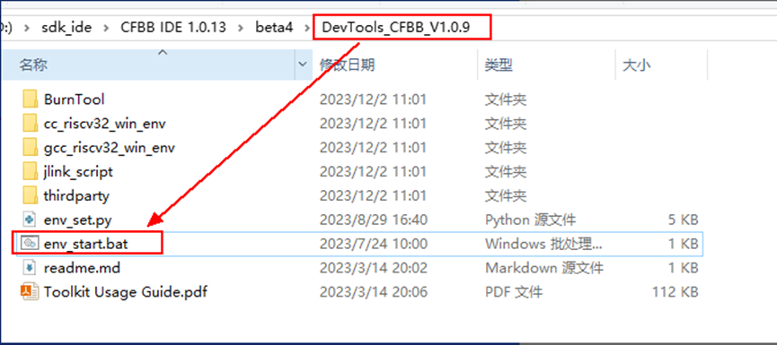
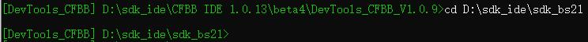
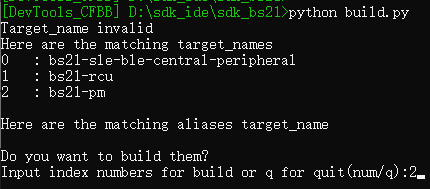
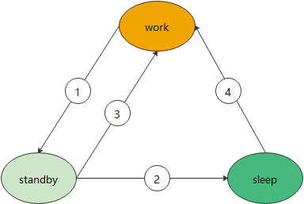
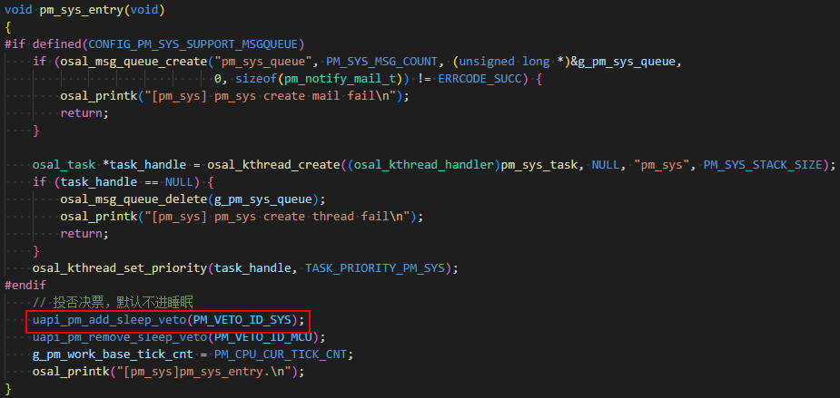
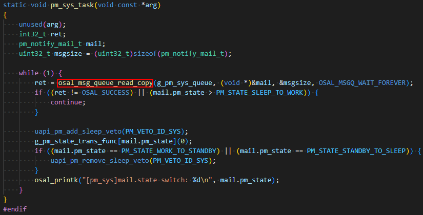
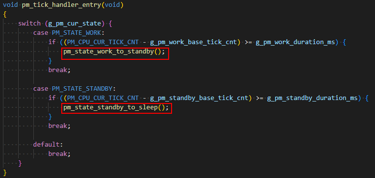
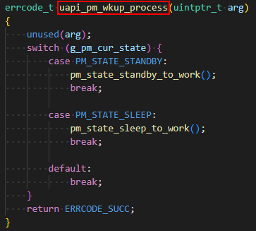
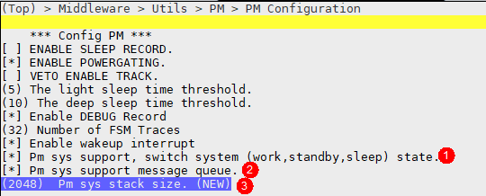

# 前言<a name="ZH-CN_TOPIC_0000001800390676"></a>

**概述<a name="section4537382116410"></a>**

本文档详细介绍了BS2XV100 低功耗sample的使用方法，旨在方便用户开发。用户在实际开发中可以完全重新写一套状态管理的代码，也可以利用该sample进行拓展开发。

BS2X系列包含BS21/BS22/BS26，本文档以BS21为例。

**读者对象<a name="section4378592816410"></a>**

本文档主要适用于以下工程师：

-   技术支持工程师
-   软件开发工程师

**符号约定<a name="section133020216410"></a>**

在本文中可能出现下列标志，它们所代表的含义如下。

<a name="table2622507016410"></a>
<table><thead align="left"><tr id="row1530720816410"><th class="cellrowborder" valign="top" width="20.580000000000002%" id="mcps1.1.3.1.1"><p id="p6450074116410"><a name="p6450074116410"></a><a name="p6450074116410"></a><strong id="b2136615816410"><a name="b2136615816410"></a><a name="b2136615816410"></a>符号</strong></p>
</th>
<th class="cellrowborder" valign="top" width="79.42%" id="mcps1.1.3.1.2"><p id="p5435366816410"><a name="p5435366816410"></a><a name="p5435366816410"></a><strong id="b5941558116410"><a name="b5941558116410"></a><a name="b5941558116410"></a>说明</strong></p>
</th>
</tr>
</thead>
<tbody><tr id="row1372280416410"><td class="cellrowborder" valign="top" width="20.580000000000002%" headers="mcps1.1.3.1.1 "><p id="p3734547016410"><a name="p3734547016410"></a><a name="p3734547016410"></a><a name="image2670064316410"></a><a name="image2670064316410"></a><span></span></p>
</td>
<td class="cellrowborder" valign="top" width="79.42%" headers="mcps1.1.3.1.2 "><p id="p1757432116410"><a name="p1757432116410"></a><a name="p1757432116410"></a>表示如不避免则将会导致死亡或严重伤害的具有高等级风险的危害。</p>
</td>
</tr>
<tr id="row466863216410"><td class="cellrowborder" valign="top" width="20.580000000000002%" headers="mcps1.1.3.1.1 "><p id="p1432579516410"><a name="p1432579516410"></a><a name="p1432579516410"></a><a name="image4895582316410"></a><a name="image4895582316410"></a><span></span></p>
</td>
<td class="cellrowborder" valign="top" width="79.42%" headers="mcps1.1.3.1.2 "><p id="p959197916410"><a name="p959197916410"></a><a name="p959197916410"></a>表示如不避免则可能导致死亡或严重伤害的具有中等级风险的危害。</p>
</td>
</tr>
<tr id="row123863216410"><td class="cellrowborder" valign="top" width="20.580000000000002%" headers="mcps1.1.3.1.1 "><p id="p1232579516410"><a name="p1232579516410"></a><a name="p1232579516410"></a><a name="image1235582316410"></a><a name="image1235582316410"></a><span></span></p>
</td>
<td class="cellrowborder" valign="top" width="79.42%" headers="mcps1.1.3.1.2 "><p id="p123197916410"><a name="p123197916410"></a><a name="p123197916410"></a>表示如不避免则可能导致轻微或中度伤害的具有低等级风险的危害。</p>
</td>
</tr>
<tr id="row5786682116410"><td class="cellrowborder" valign="top" width="20.580000000000002%" headers="mcps1.1.3.1.1 "><p id="p2204984716410"><a name="p2204984716410"></a><a name="p2204984716410"></a><a name="image4504446716410"></a><a name="image4504446716410"></a><span></span></p>
</td>
<td class="cellrowborder" valign="top" width="79.42%" headers="mcps1.1.3.1.2 "><p id="p4388861916410"><a name="p4388861916410"></a><a name="p4388861916410"></a>用于传递设备或环境安全警示信息。如不避免则可能会导致设备损坏、数据丢失、设备性能降低或其它不可预知的结果。</p>
<p id="p1238861916410"><a name="p1238861916410"></a><a name="p1238861916410"></a>“须知”不涉及人身伤害。</p>
</td>
</tr>
<tr id="row2856923116410"><td class="cellrowborder" valign="top" width="20.580000000000002%" headers="mcps1.1.3.1.1 "><p id="p5555360116410"><a name="p5555360116410"></a><a name="p5555360116410"></a><a name="image799324016410"></a><a name="image799324016410"></a><span></span></p>
</td>
<td class="cellrowborder" valign="top" width="79.42%" headers="mcps1.1.3.1.2 "><p id="p4612588116410"><a name="p4612588116410"></a><a name="p4612588116410"></a>对正文中重点信息的补充说明。</p>
<p id="p1232588116410"><a name="p1232588116410"></a><a name="p1232588116410"></a>“说明”不是安全警示信息，不涉及人身、设备及环境伤害信息。</p>
</td>
</tr>
</tbody>
</table>

**修改记录<a name="section12787162012256"></a>**

<a name="table1557726816410"></a>
<table><thead align="left"><tr id="row2942532716410"><th class="cellrowborder" valign="top" width="20.72%" id="mcps1.1.4.1.1"><p id="p3778275416410"><a name="p3778275416410"></a><a name="p3778275416410"></a><strong id="b5687322716410"><a name="b5687322716410"></a><a name="b5687322716410"></a>文档版本</strong></p>
</th>
<th class="cellrowborder" valign="top" width="26.119999999999997%" id="mcps1.1.4.1.2"><p id="p5627845516410"><a name="p5627845516410"></a><a name="p5627845516410"></a><strong id="b5800814916410"><a name="b5800814916410"></a><a name="b5800814916410"></a>发布日期</strong></p>
</th>
<th class="cellrowborder" valign="top" width="53.16%" id="mcps1.1.4.1.3"><p id="p2382284816410"><a name="p2382284816410"></a><a name="p2382284816410"></a><strong id="b3316380216410"><a name="b3316380216410"></a><a name="b3316380216410"></a>修改说明</strong></p>
</th>
</tr>
</thead>
<tbody><tr id="row5830425563"><td class="cellrowborder" valign="top" width="20.72%" headers="mcps1.1.4.1.1 "><p id="p1583020255616"><a name="p1583020255616"></a><a name="p1583020255616"></a>02</p>
</td>
<td class="cellrowborder" valign="top" width="26.119999999999997%" headers="mcps1.1.4.1.2 "><p id="p783002145619"><a name="p783002145619"></a><a name="p783002145619"></a>2025-01-14</p>
</td>
<td class="cellrowborder" valign="top" width="53.16%" headers="mcps1.1.4.1.3 "><p id="p883017211563"><a name="p883017211563"></a><a name="p883017211563"></a>更新“<a href="用户指南.md">用户指南</a>”章节内容。</p>
</td>
</tr>
<tr id="row104141231143713"><td class="cellrowborder" valign="top" width="20.72%" headers="mcps1.1.4.1.1 "><p id="p0413131712"><a name="p0413131712"></a><a name="p0413131712"></a>01</p>
</td>
<td class="cellrowborder" valign="top" width="26.119999999999997%" headers="mcps1.1.4.1.2 "><p id="p184131311111"><a name="p184131311111"></a><a name="p184131311111"></a>2024-05-15</p>
</td>
<td class="cellrowborder" valign="top" width="53.16%" headers="mcps1.1.4.1.3 "><p id="p169114261115"><a name="p169114261115"></a><a name="p169114261115"></a>第一次正式版本发布。</p>
</td>
</tr>
<tr id="row5615142573419"><td class="cellrowborder" valign="top" width="20.72%" headers="mcps1.1.4.1.1 "><p id="p7616122512348"><a name="p7616122512348"></a><a name="p7616122512348"></a>00B01</p>
</td>
<td class="cellrowborder" valign="top" width="26.119999999999997%" headers="mcps1.1.4.1.2 "><p id="p1661610257342"><a name="p1661610257342"></a><a name="p1661610257342"></a>2024-03-01</p>
</td>
<td class="cellrowborder" valign="top" width="53.16%" headers="mcps1.1.4.1.3 "><p id="p161672515341"><a name="p161672515341"></a><a name="p161672515341"></a>第一次临时版本发布。</p>
</td>
</tr>
</tbody>
</table>

# 编译&测试<a name="ZH-CN_TOPIC_0000001800390348"></a>


## 编译说明<a name="ZH-CN_TOPIC_0000001848689813"></a>

1.  打开IDE工具目录，双击env\_start.bat打开终端命令行。

    

2.  命令行进到SDK对应路径。

    

3.  执行“python build.py”。

    

    输入bs21-pm序号回车即执行编译。

4.  去SDK目录下tools\\pkg\\fwpkg\\bs21取镜像包烧录即可。

## 测试说明<a name="ZH-CN_TOPIC_0000001801930964"></a>

1.  烧录bs21-pm对应镜像。
2.  搜索并连接蓝牙“BS21-pm-demo”（pm\_ble\_server\_adv.c中配置）。
3.  系统会根据宏 DURATION\_MS\_OF\_WORK\_TO\_STANDBY 设置的时间进入保连。
4.  系统会根据宏 DURATION\_MS\_OF\_STANDBY\_TO\_SLEEP 设置的时间进入睡眠。
5.  系统会根据宏 PM\_SAMPLE\_GPIO\_NUM 设置的管脚拉低时唤醒，之后重复步骤3和步骤4。

# 系统状态管理<a name="ZH-CN_TOPIC_0000001802052154"></a>


## 系统状态<a name="ZH-CN_TOPIC_0000001848849777"></a>

低功耗sample中将系统状态划分为工作（work）、待机（standby）和睡眠（sleep），状态切换如[图1](#fig310616017135)所示。

**图 1**  系统状态机<a name="fig310616017135"></a>  


1.  工作空闲一段时间进待机（保连）状态
2.  待机（保连）空闲一段时间进深睡状态
3.  待机（保连）状态唤醒后进入工作状态
4.  深睡状态唤醒后进入工作状态

> **说明：** 
>待机（standby）态时系统也会进睡眠，只是在此sample中“待机”时蓝牙未断连，“睡眠”时蓝牙断连了。
>如果用户不需要“保连”或者“断连”，那么系统只需进入“待机”态即可，用户只需在状态转移回调函数中实现相应功能即可。

## 接口说明<a name="ZH-CN_TOPIC_0000001802090744"></a>

-   注册低功耗状态管理接口：errcode\_t uapi\_pm\_state\_trans\_handler\_register\(pm\_state\_trans\_handler\_t \*handler\);

    ```
    typedef struct pm_state_trans_handler {
        pm_state_trans_func_t work_to_standby;  /* 工作态转换到待机状态（如interval调大） */
        pm_state_trans_func_t standby_to_sleep; /* 工作态转换到深睡状态（如断连、关广播） */
        pm_state_trans_func_t standby_to_work;  /* 待机态转换到工作状态（如interval调小） */
        pm_state_trans_func_t sleep_to_work;    /* 深睡态转换到工作状态（如开广播） */
    } pm_state_trans_handler_t;
    ```

-   设置低功耗状态转移的时间：errcode\_t uapi\_pm\_set\_state\_trans\_duration\(uint32\_t work\_to\_standby, uint32\_t standby\_to\_sleep\);
    -   work\_to\_standby：从工作到待机的时间，单位：ms。
    -   standby\_to\_sleep：从待机到睡眠的时间，单位：ms。

-   重置工作状态接口（重置工作到待机的计时器）：errcode\_t uapi\_pm\_work\_state\_reset\(void\);
-   低功耗唤醒处理接口（在外设唤醒的时候调用以切换到工作状态）：errcode\_t uapi\_pm\_wkup\_process\(uintptr\_t arg\);

## 状态机原理<a name="ZH-CN_TOPIC_0000001848689817"></a>


### 概述<a name="ZH-CN_TOPIC_0000001848891933"></a>

由《BS2XV100 低功耗 开发指南》中的介绍可以知道，睡眠管理模块在LiteOs的IDLE线程中被调用到，满足睡眠条件系统则进睡眠。

**图 1**  睡眠条件<a name="fig35531471565"></a>  


其中一个条件是“不存在睡眠否决票”，系统状态机入口中有投了一个睡眠否决票，如[图2](#fig37501916123)所示。

**图 2**  pm\_sys初始化<a name="fig37501916123"></a>  


睡眠管理接口判定存在否决票则不进睡眠，在“适当”的时候将该否决票移除掉，则系统就可以进睡眠。

对于BS2X的产品形态来说，一般要控制系统“何时”进入保连态、“何时”进入睡眠态，所以这里必然要有一个“定时器”。

低功耗sample中利用OsTick实现了这一计时功能（当然，用户也可以用软Timer或者周期性线程实现）。

### 详细介绍<a name="ZH-CN_TOPIC_0000001848731989"></a>

pm\_sys\_entry初始化时，创建了一线程，即pm\_sys\_task，该线程由消息触发进入：



什么时候来消息呢？

1.  “工作-\>待机”或者“待机-\>睡眠”定时时间到，如下：

    

2.  由“待机”态或“睡眠”态唤醒时，主动切换到“工作”态，如下：

    

状态切换时会调用用户由 uapi\_pm\_state\_trans\_handler\_register 接口注册的状态切换回调函数，用户需在此回调函数中实现，BT保连、断连、唤醒回连等参数配置。

此外，系统在睡眠时（standby或sleep），用户需在相应回调函数中注册唤醒源，在唤醒时需对用户所使用的外设进行恢复。

示例见：application/samples/products/lowpower/lowpower.c

> **说明：** 
>BS2XV100睡眠时CPU和绝大多数外设会下电，唤醒后SDK中有对CPU和部分通用外设进行恢复，用户自己初始化的外设需要在状态机管理接口中自行恢复。
>详情见《BS2XV100低功耗 开发指南》。

## 使用配置说明<a name="ZH-CN_TOPIC_0000001849591453"></a>

**图 1**  KConfig配置<a name="fig761635991717"></a>  


-   KConfig中打开宏①，即可开启pm\_sys这块驱动，之后使用2.2章节中的接口说明即可。
-   KConfig中打开宏②，即可开启pm\_sys的消息队列功能，建议打开。
-   KConfig中修改宏③，即可调整消息队列栈空间大小，默认2K。

> **说明：** 
>消息队列可以起到缓冲、异步、解耦等作用，这里更适合消息队列的使用，但是消息队列使用了线程，增加了一部分空间。理论上，非内存紧缺的情况下，强烈建议使用消息队列。
>非消息队列的方式虽然节省了一些空间，但是很多软件处理是直接放在中断中进行的，这里软件处理时间长可能会导致其他中断被阻塞。
>此外，消息队列的方式可扩展性也更强，用户在后续拓展开发时也更方便添加新的实例或节点。

# 用户指南<a name="ZH-CN_TOPIC_0000001801892382"></a>

1.  低功耗sample提供了一种业务状态机管理的方法，这一层代码属于业务逻辑，本应由用户自行实现。SDK中通过该sample向用户演示了一套状态管理示例方法，旨在方便用户开发。用户在实际开发中可以完全重新写一套状态管理的代码，也可以利用该sample进行拓展开发。
2.  低功耗sample功能比较简单，用户在实际使用时，如果要基于该sample进行开发，肯定要进行适当拓展的。
3.  低功耗sample中使用的BT相关的接口也都是从别的sample中抄来的，并不保证完全正确，用户在开发时请斟酌使用。
4.  低功耗sample旨在演示低功耗管理/开发方法，仅借用BLE接口作了个演示，用户实际开发时也会涉及到SLE场景以及BLE和SLE共存场景，在此无法提供这一开发指导。
5.  用户在开发拓展之前可以先基于此sample简单做个功耗测试，以对功耗情况有个大概了解。
6.  pm\_sys定时状态机任务优先级被设定为最低的30，如需使用请注意任务优先级关系，不建议将其他任务的优先级设置为30。

> **说明：** 
>uapi\_pm\_work\_state\_reset 用来重置计时器，不重置的话到了“work\_to\_standby”的设定时间，系统就会进入待机，该sample中在 PM\_SAMPLE\_GPIO\_NUM 拉低时调用该接口进行定时器重置。用户实际使用场景可能会更加复杂，有时可能无法及时调用该接口重置定时器。
>在用户实际使用时，除了 uapi\_pm\_work\_state\_reset 接口，也可以灵活使用 uapi\_pm\_set\_state\_trans\_duration 接口，该接口会控制“work\_to\_standby”和“standby\_to\_sleep”的定时器时间，灵活设置该时间也可以达到控制“不进睡眠”和“何时进睡眠”的效果。

