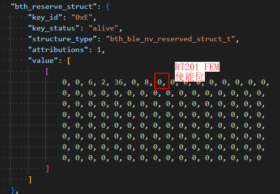
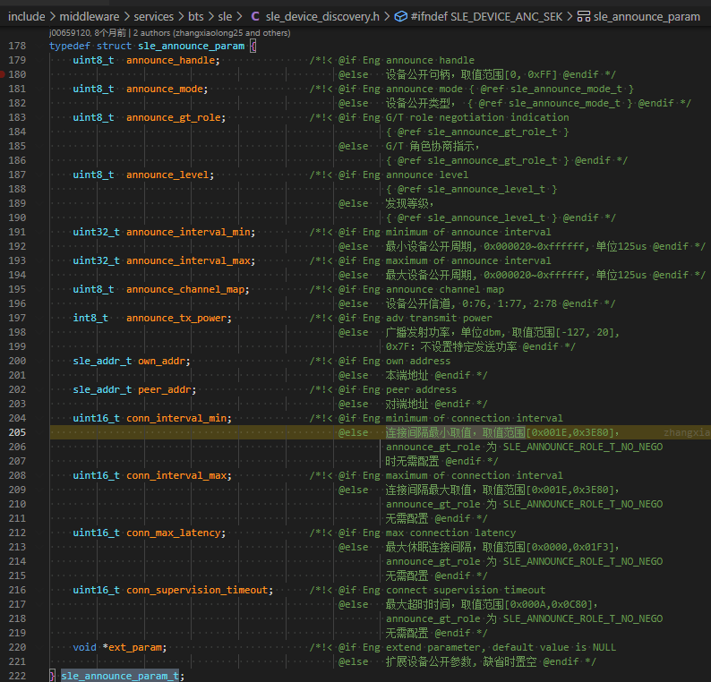
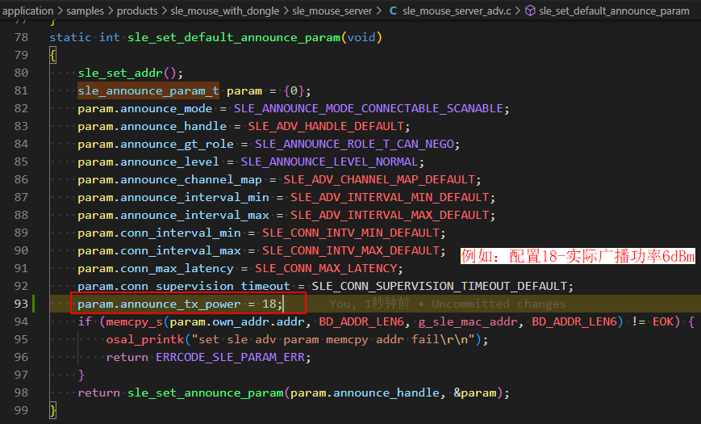
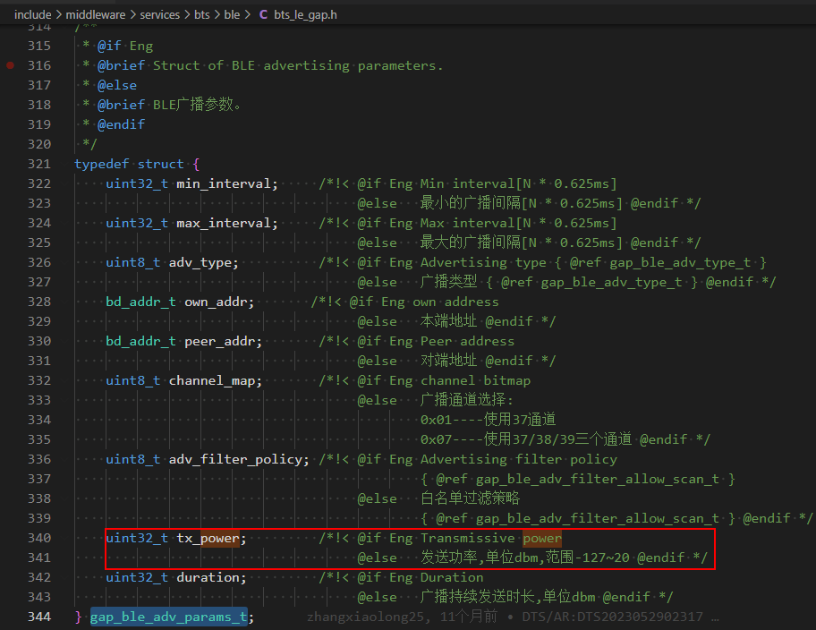
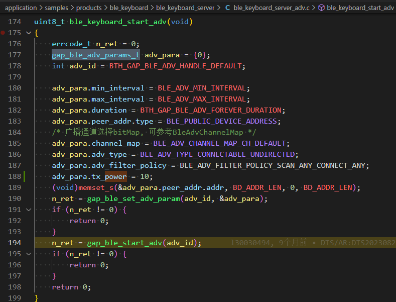

# 前言<a name="ZH-CN_TOPIC_0000001890222464"></a>

**概述<a name="section4537382116410"></a>**

本文档详细的描述了BS2X各种场景下功率调整方式以及具体的操作指导，同时提供了常见的注意事项。

**读者对象<a name="section4378592816410"></a>**

本文档主要适用于以下工程师：

-   技术支持工程师
-   软件开发工程师

**符号约定<a name="section133020216410"></a>**

在本文中可能出现下列标志，它们所代表的含义如下。

<a name="table2622507016410"></a>
<table><thead align="left"><tr id="row1530720816410"><th class="cellrowborder" valign="top" width="20.580000000000002%" id="mcps1.1.3.1.1"><p id="p6450074116410"><a name="p6450074116410"></a><a name="p6450074116410"></a><strong id="b2136615816410"><a name="b2136615816410"></a><a name="b2136615816410"></a>符号</strong></p>
</th>
<th class="cellrowborder" valign="top" width="79.42%" id="mcps1.1.3.1.2"><p id="p5435366816410"><a name="p5435366816410"></a><a name="p5435366816410"></a><strong id="b5941558116410"><a name="b5941558116410"></a><a name="b5941558116410"></a>说明</strong></p>
</th>
</tr>
</thead>
<tbody><tr id="row1372280416410"><td class="cellrowborder" valign="top" width="20.580000000000002%" headers="mcps1.1.3.1.1 "><p id="p3734547016410"><a name="p3734547016410"></a><a name="p3734547016410"></a><a name="image2670064316410"></a><a name="image2670064316410"></a><span></span></p>
</td>
<td class="cellrowborder" valign="top" width="79.42%" headers="mcps1.1.3.1.2 "><p id="p1757432116410"><a name="p1757432116410"></a><a name="p1757432116410"></a>表示如不避免则将会导致死亡或严重伤害的具有高等级风险的危害。</p>
</td>
</tr>
<tr id="row466863216410"><td class="cellrowborder" valign="top" width="20.580000000000002%" headers="mcps1.1.3.1.1 "><p id="p1432579516410"><a name="p1432579516410"></a><a name="p1432579516410"></a><a name="image4895582316410"></a><a name="image4895582316410"></a><span></span></p>
</td>
<td class="cellrowborder" valign="top" width="79.42%" headers="mcps1.1.3.1.2 "><p id="p959197916410"><a name="p959197916410"></a><a name="p959197916410"></a>表示如不避免则可能导致死亡或严重伤害的具有中等级风险的危害。</p>
</td>
</tr>
<tr id="row123863216410"><td class="cellrowborder" valign="top" width="20.580000000000002%" headers="mcps1.1.3.1.1 "><p id="p1232579516410"><a name="p1232579516410"></a><a name="p1232579516410"></a><a name="image1235582316410"></a><a name="image1235582316410"></a><span></span></p>
</td>
<td class="cellrowborder" valign="top" width="79.42%" headers="mcps1.1.3.1.2 "><p id="p123197916410"><a name="p123197916410"></a><a name="p123197916410"></a>表示如不避免则可能导致轻微或中度伤害的具有低等级风险的危害。</p>
</td>
</tr>
<tr id="row5786682116410"><td class="cellrowborder" valign="top" width="20.580000000000002%" headers="mcps1.1.3.1.1 "><p id="p2204984716410"><a name="p2204984716410"></a><a name="p2204984716410"></a><a name="image4504446716410"></a><a name="image4504446716410"></a><span></span></p>
</td>
<td class="cellrowborder" valign="top" width="79.42%" headers="mcps1.1.3.1.2 "><p id="p4388861916410"><a name="p4388861916410"></a><a name="p4388861916410"></a>用于传递设备或环境安全警示信息。如不避免则可能会导致设备损坏、数据丢失、设备性能降低或其它不可预知的结果。</p>
<p id="p1238861916410"><a name="p1238861916410"></a><a name="p1238861916410"></a>“须知”不涉及人身伤害。</p>
</td>
</tr>
<tr id="row2856923116410"><td class="cellrowborder" valign="top" width="20.580000000000002%" headers="mcps1.1.3.1.1 "><p id="p5555360116410"><a name="p5555360116410"></a><a name="p5555360116410"></a><a name="image799324016410"></a><a name="image799324016410"></a><span></span></p>
</td>
<td class="cellrowborder" valign="top" width="79.42%" headers="mcps1.1.3.1.2 "><p id="p4612588116410"><a name="p4612588116410"></a><a name="p4612588116410"></a>对正文中重点信息的补充说明。</p>
<p id="p1232588116410"><a name="p1232588116410"></a><a name="p1232588116410"></a>“说明”不是安全警示信息，不涉及人身、设备及环境伤害信息。</p>
</td>
</tr>
</tbody>
</table>

**修改记录<a name="section12787162012256"></a>**

<a name="table1557726816410"></a>
<table><thead align="left"><tr id="row2942532716410"><th class="cellrowborder" valign="top" width="20.72%" id="mcps1.1.4.1.1"><p id="p3778275416410"><a name="p3778275416410"></a><a name="p3778275416410"></a><strong id="b5687322716410"><a name="b5687322716410"></a><a name="b5687322716410"></a>文档版本</strong></p>
</th>
<th class="cellrowborder" valign="top" width="21.9%" id="mcps1.1.4.1.2"><p id="p5627845516410"><a name="p5627845516410"></a><a name="p5627845516410"></a><strong id="b5800814916410"><a name="b5800814916410"></a><a name="b5800814916410"></a>发布日期</strong></p>
</th>
<th class="cellrowborder" valign="top" width="57.379999999999995%" id="mcps1.1.4.1.3"><p id="p2382284816410"><a name="p2382284816410"></a><a name="p2382284816410"></a><strong id="b3316380216410"><a name="b3316380216410"></a><a name="b3316380216410"></a>修改说明</strong></p>
</th>
</tr>
</thead>
<tbody><tr id="row20675681543"><td class="cellrowborder" valign="top" width="20.72%" headers="mcps1.1.4.1.1 "><p id="p1167514812412"><a name="p1167514812412"></a><a name="p1167514812412"></a>03</p>
</td>
<td class="cellrowborder" valign="top" width="21.9%" headers="mcps1.1.4.1.2 "><p id="p4675682416"><a name="p4675682416"></a><a name="p4675682416"></a>2025-01-14</p>
</td>
<td class="cellrowborder" valign="top" width="57.379999999999995%" headers="mcps1.1.4.1.3 "><p id="p182261818949"><a name="p182261818949"></a><a name="p182261818949"></a>更新“<a href="定制化NV结构.md">定制化NV结构</a>”小节内容。</p>
</td>
</tr>
<tr id="row893117816217"><td class="cellrowborder" valign="top" width="20.72%" headers="mcps1.1.4.1.1 "><p id="p16931786217"><a name="p16931786217"></a><a name="p16931786217"></a>02</p>
</td>
<td class="cellrowborder" valign="top" width="21.9%" headers="mcps1.1.4.1.2 "><p id="p13931118132111"><a name="p13931118132111"></a><a name="p13931118132111"></a>2024-09-13</p>
</td>
<td class="cellrowborder" valign="top" width="57.379999999999995%" headers="mcps1.1.4.1.3 "><p id="p1593118812219"><a name="p1593118812219"></a><a name="p1593118812219"></a>更新“<a href="定制化NV结构.md">定制化NV结构</a>”小节内容。</p>
</td>
</tr>
<tr id="row62911234133915"><td class="cellrowborder" valign="top" width="20.72%" headers="mcps1.1.4.1.1 "><p id="p0413131712"><a name="p0413131712"></a><a name="p0413131712"></a>01</p>
</td>
<td class="cellrowborder" valign="top" width="21.9%" headers="mcps1.1.4.1.2 "><p id="p184131311111"><a name="p184131311111"></a><a name="p184131311111"></a>2024-05-22</p>
</td>
<td class="cellrowborder" valign="top" width="57.379999999999995%" headers="mcps1.1.4.1.3 "><p id="p169114261115"><a name="p169114261115"></a><a name="p169114261115"></a>第一次正式版本发布。</p>
</td>
</tr>
</tbody>
</table>

# 射频功率配置说明<a name="ZH-CN_TOPIC_0000001920407529"></a>


## 产线TX测试功率<a name="ZH-CN_TOPIC_0000001874288514"></a>


### BLE/SLE GFSK TX<a name="ZH-CN_TOPIC_0000001874448378"></a>


#### 功率档位说明<a name="ZH-CN_TOPIC_0000001920287873"></a>

BS2X BLE/SLE GFSK定义了0\~5一共6个功率档位，最大档位是5档，默认为6dBm。每往下一档递减2dB。

<a name="table108mcpsimp"></a>
<table><thead align="left"><tr id="row113mcpsimp"><th class="cellrowborder" valign="top" width="48.77%" id="mcps1.1.3.1.1"><p id="p115mcpsimp"><a name="p115mcpsimp"></a><a name="p115mcpsimp"></a>档位</p>
</th>
<th class="cellrowborder" valign="top" width="51.23%" id="mcps1.1.3.1.2"><p id="p117mcpsimp"><a name="p117mcpsimp"></a><a name="p117mcpsimp"></a>参数描述</p>
</th>
</tr>
</thead>
<tbody><tr id="row118mcpsimp"><td class="cellrowborder" valign="top" width="48.77%" headers="mcps1.1.3.1.1 "><p id="p120mcpsimp"><a name="p120mcpsimp"></a><a name="p120mcpsimp"></a>5</p>
</td>
<td class="cellrowborder" valign="top" width="51.23%" headers="mcps1.1.3.1.2 "><p id="p122mcpsimp"><a name="p122mcpsimp"></a><a name="p122mcpsimp"></a>6dBm</p>
</td>
</tr>
<tr id="row123mcpsimp"><td class="cellrowborder" valign="top" width="48.77%" headers="mcps1.1.3.1.1 "><p id="p125mcpsimp"><a name="p125mcpsimp"></a><a name="p125mcpsimp"></a>4</p>
</td>
<td class="cellrowborder" valign="top" width="51.23%" headers="mcps1.1.3.1.2 "><p id="p127mcpsimp"><a name="p127mcpsimp"></a><a name="p127mcpsimp"></a>4dBm</p>
</td>
</tr>
<tr id="row128mcpsimp"><td class="cellrowborder" valign="top" width="48.77%" headers="mcps1.1.3.1.1 "><p id="p130mcpsimp"><a name="p130mcpsimp"></a><a name="p130mcpsimp"></a>3</p>
</td>
<td class="cellrowborder" valign="top" width="51.23%" headers="mcps1.1.3.1.2 "><p id="p132mcpsimp"><a name="p132mcpsimp"></a><a name="p132mcpsimp"></a>2dBm</p>
</td>
</tr>
<tr id="row133mcpsimp"><td class="cellrowborder" valign="top" width="48.77%" headers="mcps1.1.3.1.1 "><p id="p135mcpsimp"><a name="p135mcpsimp"></a><a name="p135mcpsimp"></a>2</p>
</td>
<td class="cellrowborder" valign="top" width="51.23%" headers="mcps1.1.3.1.2 "><p id="p137mcpsimp"><a name="p137mcpsimp"></a><a name="p137mcpsimp"></a>0dBm</p>
</td>
</tr>
<tr id="row138mcpsimp"><td class="cellrowborder" valign="top" width="48.77%" headers="mcps1.1.3.1.1 "><p id="p140mcpsimp"><a name="p140mcpsimp"></a><a name="p140mcpsimp"></a>1</p>
</td>
<td class="cellrowborder" valign="top" width="51.23%" headers="mcps1.1.3.1.2 "><p id="p142mcpsimp"><a name="p142mcpsimp"></a><a name="p142mcpsimp"></a>-2dBm</p>
</td>
</tr>
<tr id="row143mcpsimp"><td class="cellrowborder" valign="top" width="48.77%" headers="mcps1.1.3.1.1 "><p id="p145mcpsimp"><a name="p145mcpsimp"></a><a name="p145mcpsimp"></a>0</p>
</td>
<td class="cellrowborder" valign="top" width="51.23%" headers="mcps1.1.3.1.2 "><p id="p147mcpsimp"><a name="p147mcpsimp"></a><a name="p147mcpsimp"></a>-4dBm</p>
</td>
</tr>
</tbody>
</table>

> **说明：** 
>产测BLE测试模式常发（非信令）的功率为上电默认的最大功率档位，只能通过配置“最大功率”修改（详见“[定制化最大功率](定制化最大功率.md)”），不能通过指令参数调整功率档位。

测试模式SLE GFSK调制的功率调整可通过修改AT指令第二个参数实现。

1M GFSK测试模式TX：

```
AT+SLETX=0,5,255,0,0,0,0,0,0,50
```

第二个参数为5，说明此时发射功率为最大档6dBm。

### SLE PSK TX<a name="ZH-CN_TOPIC_0000001920407533"></a>


#### 功率档位说明<a name="ZH-CN_TOPIC_0000001874288518"></a>

BS2X SLE PSK定义了0\~5共6个功率档位，最大档位是5档，默认为2dBm。每往下一档递减2dB。

<a name="table157mcpsimp"></a>
<table><thead align="left"><tr id="row162mcpsimp"><th class="cellrowborder" valign="top" width="45.76%" id="mcps1.1.3.1.1"><p id="p164mcpsimp"><a name="p164mcpsimp"></a><a name="p164mcpsimp"></a>档位</p>
</th>
<th class="cellrowborder" valign="top" width="54.24%" id="mcps1.1.3.1.2"><p id="p166mcpsimp"><a name="p166mcpsimp"></a><a name="p166mcpsimp"></a>参数描述</p>
</th>
</tr>
</thead>
<tbody><tr id="row167mcpsimp"><td class="cellrowborder" valign="top" width="45.76%" headers="mcps1.1.3.1.1 "><p id="p169mcpsimp"><a name="p169mcpsimp"></a><a name="p169mcpsimp"></a>5</p>
</td>
<td class="cellrowborder" valign="top" width="54.24%" headers="mcps1.1.3.1.2 "><p id="p171mcpsimp"><a name="p171mcpsimp"></a><a name="p171mcpsimp"></a>2dBm</p>
</td>
</tr>
<tr id="row172mcpsimp"><td class="cellrowborder" valign="top" width="45.76%" headers="mcps1.1.3.1.1 "><p id="p174mcpsimp"><a name="p174mcpsimp"></a><a name="p174mcpsimp"></a>4</p>
</td>
<td class="cellrowborder" valign="top" width="54.24%" headers="mcps1.1.3.1.2 "><p id="p176mcpsimp"><a name="p176mcpsimp"></a><a name="p176mcpsimp"></a>0dBm</p>
</td>
</tr>
<tr id="row177mcpsimp"><td class="cellrowborder" valign="top" width="45.76%" headers="mcps1.1.3.1.1 "><p id="p179mcpsimp"><a name="p179mcpsimp"></a><a name="p179mcpsimp"></a>3</p>
</td>
<td class="cellrowborder" valign="top" width="54.24%" headers="mcps1.1.3.1.2 "><p id="p181mcpsimp"><a name="p181mcpsimp"></a><a name="p181mcpsimp"></a>-2dBm</p>
</td>
</tr>
<tr id="row182mcpsimp"><td class="cellrowborder" valign="top" width="45.76%" headers="mcps1.1.3.1.1 "><p id="p184mcpsimp"><a name="p184mcpsimp"></a><a name="p184mcpsimp"></a>2</p>
</td>
<td class="cellrowborder" valign="top" width="54.24%" headers="mcps1.1.3.1.2 "><p id="p186mcpsimp"><a name="p186mcpsimp"></a><a name="p186mcpsimp"></a>-4dBm</p>
</td>
</tr>
<tr id="row187mcpsimp"><td class="cellrowborder" valign="top" width="45.76%" headers="mcps1.1.3.1.1 "><p id="p189mcpsimp"><a name="p189mcpsimp"></a><a name="p189mcpsimp"></a>1</p>
</td>
<td class="cellrowborder" valign="top" width="54.24%" headers="mcps1.1.3.1.2 "><p id="p191mcpsimp"><a name="p191mcpsimp"></a><a name="p191mcpsimp"></a>-6dBm</p>
</td>
</tr>
<tr id="row192mcpsimp"><td class="cellrowborder" valign="top" width="45.76%" headers="mcps1.1.3.1.1 "><p id="p194mcpsimp"><a name="p194mcpsimp"></a><a name="p194mcpsimp"></a>0</p>
</td>
<td class="cellrowborder" valign="top" width="54.24%" headers="mcps1.1.3.1.2 "><p id="p196mcpsimp"><a name="p196mcpsimp"></a><a name="p196mcpsimp"></a>-8dBm</p>
</td>
</tr>
</tbody>
</table>

测试模式SLE PSK 调制的功率调整可通过修改AT指令第二个参数实现。

1M QPSK测试模式TX：

AT+SLETX=0,5,255,0,0,2,2,3,2,50

第二个参数为5，说明此时发射功率为最大档2dBm。

phy和帧类型、导频、编码等参数配置请参见《BS2XV100 射频 AT测试指南》。

## 定制化最大功率<a name="ZH-CN_TOPIC_0000001874448382"></a>


### NV存储定制化功率<a name="ZH-CN_TOPIC_0000001920287877"></a>

由于产品特性差异，sdk开发者可根据需求修改BLE TX和SLE TX信号的最大功率，修改后，产线测试和商用版本实际业务场景的最大功率将被定制化，即最大档位（5档）的实际功率变为定制化的功率，之后的4-0档依次递减2dB。

由于实际影响功率的寄存器配置会在下电后清零，因此需要把功率配置保存在非易失性内存（Non-Volatile Memory）中。

注意：通过修改NV配置最大功率影响整个芯片的射频TX，即包括产线测试的TX信号强度和实际业务的最大档位发射信号强度。


#### NV介绍<a name="ZH-CN_TOPIC_0000001920407537"></a>

NV全称Non-Volatile Memory ，即非易失性内存。BS2X的NV是一块flash memory。

#### 定制化NV结构<a name="ZH-CN_TOPIC_0000001874288522"></a>

\#define BTH\_BLE\_NV\_RESERVED\_ID 0xE

NV结构体使用预留的ID为0xE的结构

```
typedef struct {            /* Keys that indexes by addr */
    uint8_t reserve[BTH_BLE_RESERVE_LEN];
} bth_ble_nv_reserved_struct_t;
"bth_reserve_struct": {
    "key_id": "0xE",
    "key_status": "alive",
    "structure_type": "bth_ble_nv_reserved_struct_t",
    "attributions": 1,
    "value": [
    [
    01, 02, 63, 24, 36, 0, 8, 05, 0, 0, 0, 0, 0, 0, 0, 0,
    0, 0, 0, 0, 0, 0, 0, 0, 0, 0, 0, 0, 0, 0, 0, 0,
    0, 0, 0, 0, 0, 0, 0, 0, 0, 0, 0, 0, 0, 0, 0, 0,
    0, 0, 0, 0, 0, 0, 0, 0, 0, 0, 0, 0, 0, 0, 0, 0,
    0, 0, 0, 0, 0, 0, 0, 0, 0, 0, 0, 0, 0, 0, 0, 0,
    0, 0, 0, 0, 0, 0, 0, 0, 0, 0, 0, 0, 0, 0, 0, 0,
    0, 0, 0, 0, 0, 0, 0, 0, 0, 0, 0, 0, 0, 0, 0, 0,
    0, 0, 0, 0, 0, 0, 0, 0, 0, 0, 0, 0, 0, 0, 0, 0
    ]
    ]
},
```

目前已使用的字节如下：

<a name="table232mcpsimp"></a>
<table><thead align="left"><tr id="row238mcpsimp"><th class="cellrowborder" valign="top" width="16.34%" id="mcps1.1.4.1.1"><p id="p240mcpsimp"><a name="p240mcpsimp"></a><a name="p240mcpsimp"></a>序号</p>
</th>
<th class="cellrowborder" valign="top" width="31.66%" id="mcps1.1.4.1.2"><p id="p243mcpsimp"><a name="p243mcpsimp"></a><a name="p243mcpsimp"></a>字节偏移</p>
</th>
<th class="cellrowborder" valign="top" width="52%" id="mcps1.1.4.1.3"><p id="p246mcpsimp"><a name="p246mcpsimp"></a><a name="p246mcpsimp"></a>含义解释</p>
</th>
</tr>
</thead>
<tbody><tr id="row248mcpsimp"><td class="cellrowborder" valign="top" width="16.34%" headers="mcps1.1.4.1.1 "><p id="p250mcpsimp"><a name="p250mcpsimp"></a><a name="p250mcpsimp"></a>1、2</p>
</td>
<td class="cellrowborder" valign="top" width="31.66%" headers="mcps1.1.4.1.2 "><p id="p252mcpsimp"><a name="p252mcpsimp"></a><a name="p252mcpsimp"></a>0~1 Byte</p>
</td>
<td class="cellrowborder" valign="top" width="52%" headers="mcps1.1.4.1.3 "><p id="p254mcpsimp"><a name="p254mcpsimp"></a><a name="p254mcpsimp"></a>定制化使能flag，</p>
<a name="ul18655351103814"></a><a name="ul18655351103814"></a><ul id="ul18655351103814"><li>bit[0]：BLE、SLE GFSK功率enable。</li><li>bit[1]：SLE PSK功率enable。</li></ul>
</td>
</tr>
<tr id="row257mcpsimp"><td class="cellrowborder" valign="top" width="16.34%" headers="mcps1.1.4.1.1 "><p id="p259mcpsimp"><a name="p259mcpsimp"></a><a name="p259mcpsimp"></a>3</p>
</td>
<td class="cellrowborder" valign="top" width="31.66%" headers="mcps1.1.4.1.2 "><p id="p261mcpsimp"><a name="p261mcpsimp"></a><a name="p261mcpsimp"></a>2 Byte</p>
</td>
<td class="cellrowborder" valign="top" width="52%" headers="mcps1.1.4.1.3 "><p id="p263mcpsimp"><a name="p263mcpsimp"></a><a name="p263mcpsimp"></a>BLE、SLE GFSK最大功率</p>
<p id="p264mcpsimp"><a name="p264mcpsimp"></a><a name="p264mcpsimp"></a>取值范围：[-12, 6] 单位：dBm</p>
<p id="p265mcpsimp"><a name="p265mcpsimp"></a><a name="p265mcpsimp"></a>*高功率场景：配置7或8，实际功率可达到8dBm左右。</p>
</td>
</tr>
<tr id="row266mcpsimp"><td class="cellrowborder" valign="top" width="16.34%" headers="mcps1.1.4.1.1 "><p id="p268mcpsimp"><a name="p268mcpsimp"></a><a name="p268mcpsimp"></a>4</p>
</td>
<td class="cellrowborder" valign="top" width="31.66%" headers="mcps1.1.4.1.2 "><p id="p270mcpsimp"><a name="p270mcpsimp"></a><a name="p270mcpsimp"></a>3 Byte</p>
</td>
<td class="cellrowborder" valign="top" width="52%" headers="mcps1.1.4.1.3 "><p id="p272mcpsimp"><a name="p272mcpsimp"></a><a name="p272mcpsimp"></a>SLE PSK 最大功率</p>
<p id="p273mcpsimp"><a name="p273mcpsimp"></a><a name="p273mcpsimp"></a>取值范围：[-16, 2] 单位：dBm</p>
<p id="p1929241018508"><a name="p1929241018508"></a><a name="p1929241018508"></a>注意：高功率场景：BLE字段配置7或8，SLE实际功率可达到4dBm左右。（SLE字段不需要修改，默认2dBm）</p>
</td>
</tr>
</tbody>
</table>

例如：修改BLE和SLE GFSK调制信号的功率最大值为2dBm（默认最大6dBm），以及修改SLE PSK调制的最大功率为-2dBm（默认最大2dBm）需要修改以下几点：

-   第三字节的6改为2（十进制），第四字节2改为-2（十进制，负数直接写-号）。
-   第一字节的bit\[0\]写1，即使能BLE功率的配置；bit\[1\]写1，即使能SLE PSK调制的功率配置，合起来，第一字节的低两bit位拉高，即0b00000011，第一字节写成3（十进制）。

**注意：以上两个修改缺一不可，通过接口修改NV时，也需要修改第一字节的flag标志位。**

#### NV的读写<a name="ZH-CN_TOPIC_0000001874448386"></a>

NV只能根据结构体ID整块读写，不能单独读取几个字节。 写NV时需要先整块读出，可根据偏移修改部分内容后写回。

#### 读NV接口<a name="ZH-CN_TOPIC_0000001920287881"></a>

errcode\_t uapi\_nv\_read\(uint16\_t key, uint16\_t kvalue\_max\_length, uint16\_t \*kvalue\_length, uint8\_t \*kvalue\);

<a name="table295mcpsimp"></a>
<table><tbody><tr id="row300mcpsimp"><th class="firstcol" valign="top" width="27%" id="mcps1.1.3.1.1"><p id="p302mcpsimp"><a name="p302mcpsimp"></a><a name="p302mcpsimp"></a>uapi_nv_read</p>
</th>
<td class="cellrowborder" valign="top" width="73%" headers="mcps1.1.3.1.1 "><p id="p305mcpsimp"><a name="p305mcpsimp"></a><a name="p305mcpsimp"></a>读取指定NV数据项的值，默认不获取key的属性值。</p>
</td>
</tr>
<tr id="row308mcpsimp"><th class="firstcol" valign="top" width="27%" id="mcps1.1.3.2.1"><p id="p310mcpsimp"><a name="p310mcpsimp"></a><a name="p310mcpsimp"></a>key</p>
</th>
<td class="cellrowborder" valign="top" width="73%" headers="mcps1.1.3.2.1 "><p id="p312mcpsimp"><a name="p312mcpsimp"></a><a name="p312mcpsimp"></a>要读取的NV项的key ID，用于索引。</p>
</td>
</tr>
<tr id="row313mcpsimp"><th class="firstcol" valign="top" width="27%" id="mcps1.1.3.3.1"><p id="p315mcpsimp"><a name="p315mcpsimp"></a><a name="p315mcpsimp"></a>kvalue_max_length</p>
</th>
<td class="cellrowborder" valign="top" width="73%" headers="mcps1.1.3.3.1 "><p id="p317mcpsimp"><a name="p317mcpsimp"></a><a name="p317mcpsimp"></a>允许存储数据的最大长度，单位：Byte。</p>
</td>
</tr>
<tr id="row318mcpsimp"><th class="firstcol" valign="top" width="27%" id="mcps1.1.3.4.1"><p id="p320mcpsimp"><a name="p320mcpsimp"></a><a name="p320mcpsimp"></a>*kvalue_length</p>
</th>
<td class="cellrowborder" valign="top" width="73%" headers="mcps1.1.3.4.1 "><p id="p322mcpsimp"><a name="p322mcpsimp"></a><a name="p322mcpsimp"></a>实际读取到的数据长度（读取以四字节对齐）。</p>
</td>
</tr>
<tr id="row323mcpsimp"><th class="firstcol" valign="top" width="27%" id="mcps1.1.3.5.1"><p id="p325mcpsimp"><a name="p325mcpsimp"></a><a name="p325mcpsimp"></a>*kvalue</p>
</th>
<td class="cellrowborder" valign="top" width="73%" headers="mcps1.1.3.5.1 "><p id="p327mcpsimp"><a name="p327mcpsimp"></a><a name="p327mcpsimp"></a>指向保存读取数据的buffer的指针。</p>
</td>
</tr>
</tbody>
</table>

使用实例：

```
uint16_t key = TEST_KEY;
uint16_t key_len= test_len;
uint16_t real_len= 0;
uint8_t *read_value = uapi_malloc(key_len);
if (uapi_nv_read(key, key_len, &real_len, read_value) != ERRCODE_SUCC) {
    /* ERROR PROCESS */
    uapi_free(read_value);
    return ERRCODE_FAIL;
}
/* APP PROCESS */
uapi_free(read_value);
return ERRCODE_SUCC;
```

#### 写NV接口<a name="ZH-CN_TOPIC_0000001920407541"></a>

errcode\_t uapi\_nv\_write\(uint16\_t key, const uint8\_t \*kvalue, uint16\_t kvalue\_length\);

<a name="table365mcpsimp"></a>
<table><tbody><tr id="row370mcpsimp"><th class="firstcol" valign="top" width="27%" id="mcps1.1.3.1.1"><p id="p372mcpsimp"><a name="p372mcpsimp"></a><a name="p372mcpsimp"></a>uapi_nv_write</p>
</th>
<td class="cellrowborder" valign="top" width="73%" headers="mcps1.1.3.1.1 "><p id="p375mcpsimp"><a name="p375mcpsimp"></a><a name="p375mcpsimp"></a>写入NV数据项，默认属性Normal，无回调函数。</p>
</td>
</tr>
<tr id="row378mcpsimp"><th class="firstcol" valign="top" width="27%" id="mcps1.1.3.2.1"><p id="p380mcpsimp"><a name="p380mcpsimp"></a><a name="p380mcpsimp"></a>key</p>
</th>
<td class="cellrowborder" valign="top" width="73%" headers="mcps1.1.3.2.1 "><p id="p382mcpsimp"><a name="p382mcpsimp"></a><a name="p382mcpsimp"></a>要写入的NV项的key ID，用于索引。</p>
</td>
</tr>
<tr id="row383mcpsimp"><th class="firstcol" valign="top" width="27%" id="mcps1.1.3.3.1"><p id="p385mcpsimp"><a name="p385mcpsimp"></a><a name="p385mcpsimp"></a>*kvalue</p>
</th>
<td class="cellrowborder" valign="top" width="73%" headers="mcps1.1.3.3.1 "><p id="p387mcpsimp"><a name="p387mcpsimp"></a><a name="p387mcpsimp"></a>指向要写入的NV项的值的指针。</p>
</td>
</tr>
<tr id="row388mcpsimp"><th class="firstcol" valign="top" width="27%" id="mcps1.1.3.4.1"><p id="p390mcpsimp"><a name="p390mcpsimp"></a><a name="p390mcpsimp"></a>kvalue_length</p>
</th>
<td class="cellrowborder" valign="top" width="73%" headers="mcps1.1.3.4.1 "><p id="p392mcpsimp"><a name="p392mcpsimp"></a><a name="p392mcpsimp"></a>写入数据的长度，单位：Byte。</p>
</td>
</tr>
</tbody>
</table>

使用实例：

写入默认Normal类型NV。

```
uint8_t *test_nv_value;  /* 要写入的NV value保存在test_nv_value中 */
uint32_t test_len = 15;  /* 长度为test_len ，例中为15*/
uint16_t key = TEST_KEY; /* TEST_KEY 为该Key的ID*/
uint16_t key_len= test_len;
uint8_t *write_value = uapi_malloc(key_len);
(void)memcpy_s(write_value, key_len, test_nv_value, key_len);
errcode_t nv_ret_value = uapi_nv_write(key, write_value, key_len);
if (nv_ret_value != ERRCODE_SUCC) {
    /* ERROR PROCESS */
    uapi_free(wrt_value);
    return ERRCODE_FAIL;
}
/* APP PROCESS */
uapi_free(wrt_value);
return ERRCODE_SUCC;
```

### 应用NV配置<a name="ZH-CN_TOPIC_0000001874288526"></a>

上电时，调用读NV接口把功率配置读出，配置到实际生效的寄存器中，应用代码sdk不可见。

## RT201 FEM 配置说明<a name="ZH-CN_TOPIC_0000001883149946"></a>

> **说明：** 
>本章仅供前端使用RT201型号的FEM模组的产品参考。

NV结构参见“[定制化NV结构](定制化NV结构.md)”章节。

其中控制RT201 FEM使能的字节为第7个字节，写1表示版本带FEM配置。



除了修改app.json , 还提供AT指令”AT+FEMENABLE=1” ”AT+FEMENABLE=0”来使能和关闭FEM配置，AT指令发送后需重新上下电生效。

## Sample广播功率<a name="ZH-CN_TOPIC_0000001874448390"></a>

SDK开发sample时，需要手动配置广播参数，其中广播功率的大小也可以通过参数配置。


### SLE广播<a name="ZH-CN_TOPIC_0000001920287885"></a>


#### SLE广播参数结构<a name="ZH-CN_TOPIC_0000001920407545"></a>



如图announce\_tx\_power为广播功率参数，取值范围\[20,-127\]。

> **说明：** 
>取值范围的单位是dBm，实际广播发送功率最大值取决于第二章定制化最大功率的配置，如果没有定制，则默认为6dBm。

#### 广播功率配置<a name="ZH-CN_TOPIC_0000001874288530"></a>

实际功率档位为当前配置的功率向下最接近的档位功率。

例如：announce\_tx\_power配置为18，实际发出的广播功率就是最大档位6dBm。如果配置的值小于-4，则直接返回0，也就是最低档位，实际发出功率为-4dBm。



### BLE广播<a name="ZH-CN_TOPIC_0000001874448394"></a>


#### BLE广播参数结构<a name="ZH-CN_TOPIC_0000001920287889"></a>



实际功率档位为当前配置的功率向下最接近的档位功率。

例如：tx\_power配置为10，实际发出的广播功率则为最大档位6dBm。如果配置的值小于-4，则直接返回0，也就是最低档位，实际发出功率为-4dBm。



