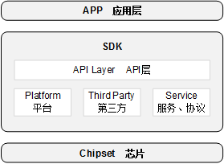
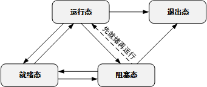

# 前言<a name="ZH-CN_TOPIC_0000001665142194"></a>

**概述<a name="section4537382116410"></a>**

本文档主要介绍BS2X的SDK开发相关内容，包括SDK架构、接口实现机制与使用说明（包括工作原理、按场景描述接口使用方法和注意事项）。

注：本文档以BS21为例，不再单独说明。

**产品版本<a name="section12266191774710"></a>**

与本文档相对应的产品版本如下。

<a name="table2270181717471"></a>
<table><thead align="left"><tr id="row15364171712479"><th class="cellrowborder" valign="top" width="31.759999999999998%" id="mcps1.1.3.1.1"><p id="p123646174478"><a name="p123646174478"></a><a name="p123646174478"></a><strong id="b26989121817"><a name="b26989121817"></a><a name="b26989121817"></a>产品名称</strong></p>
</th>
<th class="cellrowborder" valign="top" width="68.24%" id="mcps1.1.3.1.2"><p id="p1936401717470"><a name="p1936401717470"></a><a name="p1936401717470"></a><strong id="b271120129810"><a name="b271120129810"></a><a name="b271120129810"></a>产品版本</strong></p>
</th>
</tr>
</thead>
<tbody><tr id="row19364317104716"><td class="cellrowborder" valign="top" width="31.759999999999998%" headers="mcps1.1.3.1.1 "><p id="p31080012"><a name="p31080012"></a><a name="p31080012"></a>BS2X</p>
</td>
<td class="cellrowborder" valign="top" width="68.24%" headers="mcps1.1.3.1.2 "><p id="p34453054"><a name="p34453054"></a><a name="p34453054"></a>V100</p>
</td>
</tr>
</tbody>
</table>

**读者对象<a name="section4378592816410"></a>**

本文档主要适用于以下工程师：

-   技术支持工程师
-   软件开发工程师

**符号约定<a name="section133020216410"></a>**

在本文中可能出现下列标志，它们所代表的含义如下。

<a name="table2622507016410"></a>
<table><thead align="left"><tr id="row1530720816410"><th class="cellrowborder" valign="top" width="20.580000000000002%" id="mcps1.1.3.1.1"><p id="p6450074116410"><a name="p6450074116410"></a><a name="p6450074116410"></a><strong id="b2136615816410"><a name="b2136615816410"></a><a name="b2136615816410"></a>符号</strong></p>
</th>
<th class="cellrowborder" valign="top" width="79.42%" id="mcps1.1.3.1.2"><p id="p5435366816410"><a name="p5435366816410"></a><a name="p5435366816410"></a><strong id="b5941558116410"><a name="b5941558116410"></a><a name="b5941558116410"></a>说明</strong></p>
</th>
</tr>
</thead>
<tbody><tr id="row1372280416410"><td class="cellrowborder" valign="top" width="20.580000000000002%" headers="mcps1.1.3.1.1 "><p id="p3734547016410"><a name="p3734547016410"></a><a name="p3734547016410"></a><a name="image2670064316410"></a><a name="image2670064316410"></a><span></span></p>
</td>
<td class="cellrowborder" valign="top" width="79.42%" headers="mcps1.1.3.1.2 "><p id="p1757432116410"><a name="p1757432116410"></a><a name="p1757432116410"></a>表示如不避免则将会导致死亡或严重伤害的具有高等级风险的危害。</p>
</td>
</tr>
<tr id="row466863216410"><td class="cellrowborder" valign="top" width="20.580000000000002%" headers="mcps1.1.3.1.1 "><p id="p1432579516410"><a name="p1432579516410"></a><a name="p1432579516410"></a><a name="image4895582316410"></a><a name="image4895582316410"></a><span></span></p>
</td>
<td class="cellrowborder" valign="top" width="79.42%" headers="mcps1.1.3.1.2 "><p id="p959197916410"><a name="p959197916410"></a><a name="p959197916410"></a>表示如不避免则可能导致死亡或严重伤害的具有中等级风险的危害。</p>
</td>
</tr>
<tr id="row123863216410"><td class="cellrowborder" valign="top" width="20.580000000000002%" headers="mcps1.1.3.1.1 "><p id="p1232579516410"><a name="p1232579516410"></a><a name="p1232579516410"></a><a name="image1235582316410"></a><a name="image1235582316410"></a><span></span></p>
</td>
<td class="cellrowborder" valign="top" width="79.42%" headers="mcps1.1.3.1.2 "><p id="p123197916410"><a name="p123197916410"></a><a name="p123197916410"></a>表示如不避免则可能导致轻微或中度伤害的具有低等级风险的危害。</p>
</td>
</tr>
<tr id="row5786682116410"><td class="cellrowborder" valign="top" width="20.580000000000002%" headers="mcps1.1.3.1.1 "><p id="p2204984716410"><a name="p2204984716410"></a><a name="p2204984716410"></a><a name="image4504446716410"></a><a name="image4504446716410"></a><span></span></p>
</td>
<td class="cellrowborder" valign="top" width="79.42%" headers="mcps1.1.3.1.2 "><p id="p4388861916410"><a name="p4388861916410"></a><a name="p4388861916410"></a>用于传递设备或环境安全警示信息。如不避免则可能会导致设备损坏、数据丢失、设备性能降低或其它不可预知的结果。</p>
<p id="p1238861916410"><a name="p1238861916410"></a><a name="p1238861916410"></a>“须知”不涉及人身伤害。</p>
</td>
</tr>
<tr id="row2856923116410"><td class="cellrowborder" valign="top" width="20.580000000000002%" headers="mcps1.1.3.1.1 "><p id="p5555360116410"><a name="p5555360116410"></a><a name="p5555360116410"></a><a name="image799324016410"></a><a name="image799324016410"></a><span></span></p>
</td>
<td class="cellrowborder" valign="top" width="79.42%" headers="mcps1.1.3.1.2 "><p id="p4612588116410"><a name="p4612588116410"></a><a name="p4612588116410"></a>对正文中重点信息的补充说明。</p>
<p id="p1232588116410"><a name="p1232588116410"></a><a name="p1232588116410"></a>“说明”不是安全警示信息，不涉及人身、设备及环境伤害信息。</p>
</td>
</tr>
</tbody>
</table>

**修改记录<a name="section2467512116410"></a>**

<a name="table1557726816410"></a>
<table><thead align="left"><tr id="row2942532716410"><th class="cellrowborder" valign="top" width="16.1%" id="mcps1.1.4.1.1"><p id="p3778275416410"><a name="p3778275416410"></a><a name="p3778275416410"></a><strong id="b5687322716410"><a name="b5687322716410"></a><a name="b5687322716410"></a>文档版本</strong></p>
</th>
<th class="cellrowborder" valign="top" width="21.29%" id="mcps1.1.4.1.2"><p id="p5627845516410"><a name="p5627845516410"></a><a name="p5627845516410"></a><strong id="b5800814916410"><a name="b5800814916410"></a><a name="b5800814916410"></a>发布日期</strong></p>
</th>
<th class="cellrowborder" valign="top" width="62.61%" id="mcps1.1.4.1.3"><p id="p2382284816410"><a name="p2382284816410"></a><a name="p2382284816410"></a><strong id="b3316380216410"><a name="b3316380216410"></a><a name="b3316380216410"></a>修改说明</strong></p>
</th>
</tr>
</thead>
<tbody><tr id="row169853804119"><td class="cellrowborder" valign="top" width="16.1%" headers="mcps1.1.4.1.1 "><p id="p6986484417"><a name="p6986484417"></a><a name="p6986484417"></a>03</p>
</td>
<td class="cellrowborder" valign="top" width="21.29%" headers="mcps1.1.4.1.2 "><p id="p5986118204118"><a name="p5986118204118"></a><a name="p5986118204118"></a>2025-01-24</p>
</td>
<td class="cellrowborder" valign="top" width="62.61%" headers="mcps1.1.4.1.3 "><p id="p06691169419"><a name="p06691169419"></a><a name="p06691169419"></a>更新“<a href="注意事项-8.md">注意事项</a>”小节内容。</p>
</td>
</tr>
<tr id="row133411721194217"><td class="cellrowborder" valign="top" width="16.1%" headers="mcps1.1.4.1.1 "><p id="p13341172174219"><a name="p13341172174219"></a><a name="p13341172174219"></a>02</p>
</td>
<td class="cellrowborder" valign="top" width="21.29%" headers="mcps1.1.4.1.2 "><p id="p1734192119425"><a name="p1734192119425"></a><a name="p1734192119425"></a>2024-07-04</p>
</td>
<td class="cellrowborder" valign="top" width="62.61%" headers="mcps1.1.4.1.3 "><p id="p16598129194216"><a name="p16598129194216"></a><a name="p16598129194216"></a>更新“<a href="使用约束.md">使用约束</a>”小节内容。</p>
</td>
</tr>
<tr id="row1695234912313"><td class="cellrowborder" valign="top" width="16.1%" headers="mcps1.1.4.1.1 "><p id="p182910614321"><a name="p182910614321"></a><a name="p182910614321"></a>01</p>
</td>
<td class="cellrowborder" valign="top" width="21.29%" headers="mcps1.1.4.1.2 "><p id="p52917613321"><a name="p52917613321"></a><a name="p52917613321"></a>2024-05-15</p>
</td>
<td class="cellrowborder" valign="top" width="62.61%" headers="mcps1.1.4.1.3 "><p id="p1290663212"><a name="p1290663212"></a><a name="p1290663212"></a>第一次正式版本发布。</p>
</td>
</tr>
<tr id="row12907103279"><td class="cellrowborder" valign="top" width="16.1%" headers="mcps1.1.4.1.1 "><p id="p7911910172719"><a name="p7911910172719"></a><a name="p7911910172719"></a>00B03</p>
</td>
<td class="cellrowborder" valign="top" width="21.29%" headers="mcps1.1.4.1.2 "><p id="p139161062713"><a name="p139161062713"></a><a name="p139161062713"></a>2024-02-29</p>
</td>
<td class="cellrowborder" valign="top" width="62.61%" headers="mcps1.1.4.1.3 "><p id="p179161022718"><a name="p179161022718"></a><a name="p179161022718"></a>更新“<a href="使用约束.md">使用约束</a>”小节内容。</p>
</td>
</tr>
<tr id="row324613324336"><td class="cellrowborder" valign="top" width="16.1%" headers="mcps1.1.4.1.1 "><p id="p4246532113318"><a name="p4246532113318"></a><a name="p4246532113318"></a>00B02</p>
</td>
<td class="cellrowborder" valign="top" width="21.29%" headers="mcps1.1.4.1.2 "><p id="p12246153217339"><a name="p12246153217339"></a><a name="p12246153217339"></a>2023-10-27</p>
</td>
<td class="cellrowborder" valign="top" width="62.61%" headers="mcps1.1.4.1.3 "><p id="p109124293312"><a name="p109124293312"></a><a name="p109124293312"></a>第二次临时版本发布。</p>
</td>
</tr>
<tr id="row5947359616410"><td class="cellrowborder" valign="top" width="16.1%" headers="mcps1.1.4.1.1 "><p id="p2149706016410"><a name="p2149706016410"></a><a name="p2149706016410"></a>00B01</p>
</td>
<td class="cellrowborder" valign="top" width="21.29%" headers="mcps1.1.4.1.2 "><p id="p648803616410"><a name="p648803616410"></a><a name="p648803616410"></a>2023-09-27</p>
</td>
<td class="cellrowborder" valign="top" width="62.61%" headers="mcps1.1.4.1.3 "><p id="p1946537916410"><a name="p1946537916410"></a><a name="p1946537916410"></a>第一次临时版本发布。</p>
</td>
</tr>
</tbody>
</table>

# 概述<a name="ZH-CN_TOPIC_0000001664982518"></a>


## 背景介绍<a name="ZH-CN_TOPIC_0000001713022045"></a>

BS2X系列的平台软件对应用层实现了底层屏蔽，并对应用软件直接提供API（Application Programming Interface）接口完成相应功能。典型的系统应用架构如[图1](#fig16620102217403)所示。

**图 1**  系统应用框架图<a name="fig16620102217403"></a>  


该框架可以分为以下几个层次：

-   APP层：即应用层。
-   API层：提供基于SDK开发的通用接口。
-   Platform平台层：提供SOC系统板级支持包，包括如下功能。
    -   芯片和外围器件驱动。
    -   操作系统。
    -   系统管理。

-   Service服务层：提供包含BT等应用协议栈。用于上层应用软件进行数据收发等操作。
-   第三方库：提供给Service服务层或提供给应用层使用的第三方软件库。

## 使用约束<a name="ZH-CN_TOPIC_0000001665142230"></a>

-   系统在启动过程中已完成UART、Flash、WDT、NV等驱动的初始化。用户在开发过程中，请勿重复初始化这些模块，否则会引起系统错误。
-   系统启动运行后，会占用一些系统资源：中断、内存、任务、消息队列、事件、信号量、定时器、互斥锁等。用户在应用层开发中释放资源时，仅可释放用户申请的资源，请勿释放系统资源。
-   Liteos系统资源配置位于“sdk/kernel/liteos/liteos\_v208.6.0\_b017/Huawei\_LiteOS/tools/build/config/bs2x.config”\(bs2x.config默认和芯片对应；特殊版本的，和build/config/target\_config/bs20\(bs21/bs21a/bs22/bs26\)/config.py中的liteos\_kconfig选项对应。）以bs21为例，默认使用sdk/kernel/liteos/liteos\_v208.6.0\_b017/Huawei\_LiteOS/tools/build/config/bs21.config；

    config.py中的bs21-rcu配置了liteos\_kconfig': 'bs21\_rcu’，则使用“sdk/kernel/liteos/liteos\_v208.6.0\_b017/Huawei\_LiteOS/tools/build/config/bs21\_rcu.config”文件，用户调整资源使用时，需要修改此文档。

# 系统接口<a name="ZH-CN_TOPIC_0000001713102053"></a>


## 概述<a name="ZH-CN_TOPIC_0000001713102061"></a>

系统接口是包括对任务、事件等系统资源进行所需操作的接口。

SDK支持用户客制化系统资源，以BS21为例，资源配置需编辑“sdk\\kernel\\liteos\\liteos\_v208.5.0\\Huawei\_LiteOS\\tools\\build\\config\\bs21.config”文件，按需合理地配置资源项将有效降低系统资源浪费，提高运行效率，又可避免资源不足。常用配置项如[表1](#table1130973994118)所示。

**表 1**  bs21.config中的常用资源配置项

<a name="table1130973994118"></a>
<table><thead align="left"><tr id="row1730913924111"><th class="cellrowborder" valign="top" width="44.1%" id="mcps1.2.3.1.1"><p id="p1030911396414"><a name="p1030911396414"></a><a name="p1030911396414"></a>配置项</p>
</th>
<th class="cellrowborder" valign="top" width="55.900000000000006%" id="mcps1.2.3.1.2"><p id="p163101039184114"><a name="p163101039184114"></a><a name="p163101039184114"></a>描述</p>
</th>
</tr>
</thead>
<tbody><tr id="row7310103920418"><td class="cellrowborder" valign="top" width="44.1%" headers="mcps1.2.3.1.1 "><p id="p0310939194115"><a name="p0310939194115"></a><a name="p0310939194115"></a>LOSCFG_BASE_CORE_TSK_LIMIT</p>
</td>
<td class="cellrowborder" valign="top" width="55.900000000000006%" headers="mcps1.2.3.1.2 "><p id="p17310173918418"><a name="p17310173918418"></a><a name="p17310173918418"></a>系统任务数上限。创建任务时，ID超过此数值将创建失败。</p>
</td>
</tr>
<tr id="row6310193984115"><td class="cellrowborder" valign="top" width="44.1%" headers="mcps1.2.3.1.1 "><p id="p193216106472"><a name="p193216106472"></a><a name="p193216106472"></a>LOSCFG_BASE_IPC_SEM_LIMIT</p>
</td>
<td class="cellrowborder" valign="top" width="55.900000000000006%" headers="mcps1.2.3.1.2 "><p id="p15310439124111"><a name="p15310439124111"></a><a name="p15310439124111"></a>系统信号量个数上限。资源不足时，引起创建信号量失败。</p>
</td>
</tr>
<tr id="row531015392416"><td class="cellrowborder" valign="top" width="44.1%" headers="mcps1.2.3.1.1 "><p id="p531033904111"><a name="p531033904111"></a><a name="p531033904111"></a>LOSCFG_BASE_IPC_MUX_LIMIT</p>
</td>
<td class="cellrowborder" valign="top" width="55.900000000000006%" headers="mcps1.2.3.1.2 "><p id="p113107392415"><a name="p113107392415"></a><a name="p113107392415"></a>系统互斥锁个数上限。资源不足时，引起创建互斥锁失败。</p>
</td>
</tr>
<tr id="row18310173974113"><td class="cellrowborder" valign="top" width="44.1%" headers="mcps1.2.3.1.1 "><p id="p318655018472"><a name="p318655018472"></a><a name="p318655018472"></a>LOSCFG_BASE_IPC_QUEUE_LIMIT</p>
</td>
<td class="cellrowborder" valign="top" width="55.900000000000006%" headers="mcps1.2.3.1.2 "><p id="p8310173917417"><a name="p8310173917417"></a><a name="p8310173917417"></a>消息队列个数上限。资源不足时，创建消息队列将失败。</p>
</td>
</tr>
<tr id="row4488132611506"><td class="cellrowborder" valign="top" width="44.1%" headers="mcps1.2.3.1.1 "><p id="p154898266503"><a name="p154898266503"></a><a name="p154898266503"></a>LOSCFG_BASE_CORE_SWTMR_LIMIT</p>
</td>
<td class="cellrowborder" valign="top" width="55.900000000000006%" headers="mcps1.2.3.1.2 "><p id="p154891526185012"><a name="p154891526185012"></a><a name="p154891526185012"></a>软件定时器个数上限。资源不足时，创建软件定时器将失败。</p>
</td>
</tr>
<tr id="row434413401517"><td class="cellrowborder" valign="top" width="44.1%" headers="mcps1.2.3.1.1 "><p id="p73451640155113"><a name="p73451640155113"></a><a name="p73451640155113"></a>LOSCFG_BASE_CORE_TSK_IDLE_STACK_SIZE</p>
</td>
<td class="cellrowborder" valign="top" width="55.900000000000006%" headers="mcps1.2.3.1.2 "><p id="p1034520401512"><a name="p1034520401512"></a><a name="p1034520401512"></a>IDLE任务的栈大小。</p>
</td>
</tr>
<tr id="row37134175535"><td class="cellrowborder" valign="top" width="44.1%" headers="mcps1.2.3.1.1 "><p id="p11712162924811"><a name="p11712162924811"></a><a name="p11712162924811"></a>LOSCFG_BASE_CORE_TSK_SWTMR_STACK_SIZE</p>
</td>
<td class="cellrowborder" valign="top" width="55.900000000000006%" headers="mcps1.2.3.1.2 "><p id="p57131317195314"><a name="p57131317195314"></a><a name="p57131317195314"></a>软件定时器任务的栈大小。</p>
</td>
</tr>
</tbody>
</table>

## 任务<a name="ZH-CN_TOPIC_0000001664982514"></a>


### 概述<a name="ZH-CN_TOPIC_0000001713102057"></a>

任务是竞争系统资源的最小运行单元。任务可以使用或等待CPU、使用内存空间等系统资源，并独立于其它任务运行。任务模块可以给用户提供多个任务，实现了任务之间的切换和通信，帮助用户管理业务程序流程。任务模块具有如下特性：

-   支持多任务，一个任务表示一个线程。
-   任务是抢占式调度机制，同时支持时间片轮转调度方式。
-   高优先级的任务可打断低优先级任务，低优先级任务必须在高优先级任务阻塞或结束后才能得到调度。
-   有32个优先级\[0，31\]，最高优先级为0，最低优先级为31。由于系统自身任务需要及时调度，建议用户使用任务优先级范围是\[10,30\]。应用级任务建议使用低于系统级任务的优先级。

**重要概念<a name="section068413489911"></a>**

-   任务状态

    系统中的每一个任务都有多种运行状态。系统初始化完成后，创建的任务就可以在系统中竞争一定的资源，由内核进行调度。

    任务状态通常分为以下4种：

    -   就绪态（Ready）：该任务在就绪列表中，只等待CPU。
    -   运行态（Running）：该任务正在执行。
    -   阻塞态（Blocked）：该任务不在就绪列表中。包含任务被挂起、任务被延时、任务正在等待信号量、读写队列或者等待读事件等。
    -   退出态（Dead）：该任务运行结束，等待系统回收资源。

    **图 1**  任务状态示意图<a name="fig109201259173111"></a>  
    
    

    任务状态迁移说明：

    -   就绪态→运行态：

        任务创建后进入就绪态，发生任务切换时，就绪列表中最高优先级的任务被执行，从而进入运行态，但此刻该任务依旧在就绪列表中。

    -   运行态→阻塞态：

        正在运行的任务发生阻塞（挂起、延时、读信号量等）时，该任务会从就绪列表中删除，任务状态由运行态变成阻塞态，然后发生任务切换，运行就绪列表中剩余最高优先级任务。

    -   阻塞态→就绪态（阻塞态→运行态）：

        阻塞的任务被恢复后（任务恢复、延时时间超时、读信号量超时或读到信号量等），此时被恢复的任务会被加入就绪列表，从而由阻塞态变成就绪态；此时如果被恢复任务的优先级高于正在运行任务的优先级，则会发生任务切换，将该任务由就绪态变成运行态。

    -   就绪态→阻塞态：

        任务也有可能在就绪态时被阻塞（挂起），此时任务状态会有就绪态转变为阻塞态，该任务从就绪列表中删除，不会参与任务调度，直到该任务被恢复。

    -   运行态→就绪态：

        有更高优先级任务创建或者恢复后，会发生任务调度，此刻就绪列表中最高优先级任务变为运行态，那么原先运行的任务由运行态变为就绪态，依然在就绪列表中。

    -   运行态→退出态

        运行中的任务运行结束，任务状态由运行态变为退出态。退出态包含任务运行结束的正常退出以及Invalid状态。例如，未设置分离属性（LOS\_TASK\_STATUS\_DETACHED）的任务，运行结束后对外呈现的是Invalid状态，即退出态。

    -   阻塞态→退出态

        阻塞的任务调用删除接口，任务状态由阻塞态变为退出态。

-   任务ID

    任务ID，在任务创建时通过参数返回给用户，作为任务的一个非常重要的标识。用户可以通过任务ID对指定任务进行任务挂起、任务恢复、查询任务名等操作。

-   任务优先级

    优先级表示任务执行的优先顺序。任务的优先级决定了在发生任务切换时即将要执行的任务。在就绪列表中的最高优先级的任务将得到执行。

-   任务入口函数

    每个新任务得到调度后将执行的函数。该函数由用户实现，在任务创建时，通过任务创建结构体指定。

-   任务控制块TCB

    每一个任务都含有一个任务控制块（TCB）。TCB包含了任务上下文栈指针（stack pointer）、任务状态、任务优先级、任务ID、任务名、任务栈大小等信息。TCB可以反映出每个任务运行情况。

-   任务栈

    每一个任务都拥有一个独立的栈空间，我们称为任务栈。栈空间里保存的信息包含局部变量、寄存器、函数参数、函数返回地址等。任务在任务切换时会将切出任务的上下文信息保存在自身的任务栈空间里面，以便任务恢复时还原现场，从而在任务恢复后在切出点继续开始执行。

-   任务上下文

    任务在运行过程中使用到的一些资源，如寄存器等，我们称为任务上下文。当这个任务挂起时，其他任务继续执行，在任务恢复后，如果没有把任务上下文保存下来，有可能任务切换会修改寄存器中的值，从而导致未知错误。因此，在任务挂起的时候会将本任务的任务上下文信息，保存在自己的任务栈里面，以便任务恢复后，从栈空间中恢复挂起时的上下文信息，从而继续执行被挂起时被打断的代码。

-   任务切换

    任务切换包含获取就绪列表中最高优先级任务、切出任务上下文保存、切入任务上下文恢复等动作。

**运行机制<a name="section1860719353913"></a>**

系统任务管理模块提供如下功能：

-   任务创建。
-   任务延时。
-   任务挂起和任务恢复。
-   锁任务调度和解锁任务调度。
-   根据ID查询任务控制块信息。

用户创建任务时，系统会将任务栈进行初始化，预置上下文。此外，系统还会将“任务入口函数”地址放在系统任务控制相关数据结构内。这样在任务第一次启动进入运行态时，将会执行“任务入口函数”。

### 开发流程<a name="ZH-CN_TOPIC_0000001664982522"></a>

**使用场景<a name="section6187155810234"></a>**

任务创建后，内核可以执行锁任务调度，解锁任务调度，挂起，恢复，延时等操作，同时也可以设置任务优先级，获取任务优先级。任务结束的时候，如果任务的状态是自删除状态（LOS\_TASK\_STATUS\_DETACHED），则进行当前任务自删除操作。

用户的代码需实现app\_main接口。系统初始化阶段会调用app\_main接口，用户的初始化操作可在app\_main中完成。如果用户需要多个任务，可在app\_main中创建新任务。建议用户使用任务优先级范围是10～30。应用级任务建议使用低于系统级任务的优先级。

**功能说明<a name="section17138981244"></a>**

系统中的任务管理模块为用户提供的功能如[表1](#table1899129194418)所示。

**表 1**  系统任务管理模块接口说明

<a name="table1899129194418"></a>
<table><thead align="left"><tr id="row49915915447"><th class="cellrowborder" valign="top" width="27.99%" id="mcps1.2.3.1.1"><p id="p179911497446"><a name="p179911497446"></a><a name="p179911497446"></a>接口名称</p>
</th>
<th class="cellrowborder" valign="top" width="72.00999999999999%" id="mcps1.2.3.1.2"><p id="p1799129184416"><a name="p1799129184416"></a><a name="p1799129184416"></a>说明</p>
</th>
</tr>
</thead>
<tbody><tr id="row1999215994416"><td class="cellrowborder" valign="top" width="27.99%" headers="mcps1.2.3.1.1 "><p id="p31364121914"><a name="p31364121914"></a><a name="p31364121914"></a>osal_kthread_create</p>
</td>
<td class="cellrowborder" valign="top" width="72.00999999999999%" headers="mcps1.2.3.1.2 "><p id="p188819218451"><a name="p188819218451"></a><a name="p188819218451"></a>创建任务。</p>
</td>
</tr>
<tr id="row1899220920447"><td class="cellrowborder" valign="top" width="27.99%" headers="mcps1.2.3.1.1 "><p id="p137209575913"><a name="p137209575913"></a><a name="p137209575913"></a>osal_kthread_destroy</p>
</td>
<td class="cellrowborder" valign="top" width="72.00999999999999%" headers="mcps1.2.3.1.2 "><p id="p1799210994414"><a name="p1799210994414"></a><a name="p1799210994414"></a>删除指定的任务</p>
</td>
</tr>
<tr id="row19921199447"><td class="cellrowborder" valign="top" width="27.99%" headers="mcps1.2.3.1.1 "><p id="p178692012192617"><a name="p178692012192617"></a><a name="p178692012192617"></a>osal_kthread_suspend</p>
</td>
<td class="cellrowborder" valign="top" width="72.00999999999999%" headers="mcps1.2.3.1.2 "><p id="p189921997446"><a name="p189921997446"></a><a name="p189921997446"></a>挂起指定任务。</p>
</td>
</tr>
<tr id="row799211964413"><td class="cellrowborder" valign="top" width="27.99%" headers="mcps1.2.3.1.1 "><p id="p127061418172611"><a name="p127061418172611"></a><a name="p127061418172611"></a>osal_kthread_resume</p>
</td>
<td class="cellrowborder" valign="top" width="72.00999999999999%" headers="mcps1.2.3.1.2 "><p id="p139921195446"><a name="p139921195446"></a><a name="p139921195446"></a>恢复挂起指定任务。</p>
</td>
</tr>
<tr id="row49921397448"><td class="cellrowborder" valign="top" width="27.99%" headers="mcps1.2.3.1.1 "><p id="p193561321113517"><a name="p193561321113517"></a><a name="p193561321113517"></a>osal_kthread_set_priority</p>
</td>
<td class="cellrowborder" valign="top" width="72.00999999999999%" headers="mcps1.2.3.1.2 "><p id="p799209154420"><a name="p799209154420"></a><a name="p799209154420"></a>设置任务优先级。</p>
</td>
</tr>
<tr id="row1141917445544"><td class="cellrowborder" valign="top" width="27.99%" headers="mcps1.2.3.1.1 "><p id="p348754514238"><a name="p348754514238"></a><a name="p348754514238"></a>osal_get_current_tid</p>
</td>
<td class="cellrowborder" valign="top" width="72.00999999999999%" headers="mcps1.2.3.1.2 "><p id="p5419134485412"><a name="p5419134485412"></a><a name="p5419134485412"></a>获取当前任务ID。</p>
</td>
</tr>
<tr id="row436565435417"><td class="cellrowborder" valign="top" width="27.99%" headers="mcps1.2.3.1.1 "><p id="p197162276912"><a name="p197162276912"></a><a name="p197162276912"></a>osal_kthread_lock</p>
</td>
<td class="cellrowborder" valign="top" width="72.00999999999999%" headers="mcps1.2.3.1.2 "><p id="p193661154145417"><a name="p193661154145417"></a><a name="p193661154145417"></a>禁止系统任务调度。</p>
</td>
</tr>
<tr id="row1929216285520"><td class="cellrowborder" valign="top" width="27.99%" headers="mcps1.2.3.1.1 "><p id="p18593113217916"><a name="p18593113217916"></a><a name="p18593113217916"></a>osal_kthread_unlock</p>
</td>
<td class="cellrowborder" valign="top" width="72.00999999999999%" headers="mcps1.2.3.1.2 "><p id="p62921255519"><a name="p62921255519"></a><a name="p62921255519"></a>允许系统任务调度。</p>
</td>
</tr>
<tr id="row132351610145513"><td class="cellrowborder" valign="top" width="27.99%" headers="mcps1.2.3.1.1 "><p id="p17687173611255"><a name="p17687173611255"></a><a name="p17687173611255"></a>osal_msleep</p>
</td>
<td class="cellrowborder" valign="top" width="72.00999999999999%" headers="mcps1.2.3.1.2 "><p id="p16236210175515"><a name="p16236210175515"></a><a name="p16236210175515"></a>任务睡眠，单位ms。</p>
</td>
</tr>
</tbody>
</table>

**开发流程<a name="section8617161982617"></a>**

以bs21创建任务为例，创建任务的开发流程：

1.  在bs21.config中配置任务数。

    配置LOSCFG\_BASE\_CORE\_TSK\_LIMIT系统支持最大任务数需要根据用户需求配置。

2.  调用锁任务接口：osal\_kthread\_lock，锁住任务，防止高优先级任务调度。
3.  调用创建任务接口：osal\_kthread\_create。
4.  调用解锁任务接口：osal\_kthread\_unlock，让任务按照优先级进行调度。
5.  调用挂起指定的任务接口：osal\_kthread\_suspend，任务挂起等待恢复操作。
6.  调用恢复挂起的任务接口：osal\_kthread\_resume。

**错误码<a name="section713711582716"></a>**

osal接口支持维测打印开关，关闭OSALLOG\_DISABLE宏定义后，osal接口运行过程中出现异常结果会打印异常信息。

异常错误码请参考“sdk\\kernel\\liteos\\liteos\_v208.5.0\\Huawei\_LiteOS\\kernel\\include\\los\_task.h”中错误说明。

任务错误码如[表2](#table17697228719)所示。

**表 2**  任务错误码说明

<a name="table17697228719"></a>
<table><thead align="left"><tr id="row569762976"><th class="cellrowborder" valign="top" width="6.3100000000000005%" id="mcps1.2.6.1.1"><p id="p1927051110717"><a name="p1927051110717"></a><a name="p1927051110717"></a>序号</p>
</th>
<th class="cellrowborder" valign="top" width="26.38%" id="mcps1.2.6.1.2"><p id="p62701111274"><a name="p62701111274"></a><a name="p62701111274"></a>定义</p>
</th>
<th class="cellrowborder" valign="top" width="12.34%" id="mcps1.2.6.1.3"><p id="p62707111778"><a name="p62707111778"></a><a name="p62707111778"></a>实际数值</p>
</th>
<th class="cellrowborder" valign="top" width="26.58%" id="mcps1.2.6.1.4"><p id="p18270811475"><a name="p18270811475"></a><a name="p18270811475"></a>说明</p>
</th>
<th class="cellrowborder" valign="top" width="28.389999999999997%" id="mcps1.2.6.1.5"><p id="p62704117715"><a name="p62704117715"></a><a name="p62704117715"></a>参考解决方案</p>
</th>
</tr>
</thead>
<tbody><tr id="row11697028713"><td class="cellrowborder" valign="top" width="6.3100000000000005%" headers="mcps1.2.6.1.1 "><p id="p1027014111779"><a name="p1027014111779"></a><a name="p1027014111779"></a>1</p>
</td>
<td class="cellrowborder" valign="top" width="26.38%" headers="mcps1.2.6.1.2 "><p id="p172707112077"><a name="p172707112077"></a><a name="p172707112077"></a>LOS_ERRNO_TSK_NO_MEMORY</p>
</td>
<td class="cellrowborder" valign="top" width="12.34%" headers="mcps1.2.6.1.3 "><p id="p1927010111274"><a name="p1927010111274"></a><a name="p1927010111274"></a>0x03000200</p>
</td>
<td class="cellrowborder" valign="top" width="26.58%" headers="mcps1.2.6.1.4 "><p id="p82708110720"><a name="p82708110720"></a><a name="p82708110720"></a>内存空间不足。</p>
</td>
<td class="cellrowborder" valign="top" width="28.389999999999997%" headers="mcps1.2.6.1.5 "><p id="p927014117713"><a name="p927014117713"></a><a name="p927014117713"></a>增大动态内存空间，有两种方式可以实现：</p>
<a name="ul1627010111371"></a><a name="ul1627010111371"></a><ul id="ul1627010111371"><li>设置更大的系统动态内存池</li><li>释放一部分动态内存。</li></ul>
<p id="p17270171120715"><a name="p17270171120715"></a><a name="p17270171120715"></a>如果错误发生在LiteOS启动过程中的任务初始化，还可以通过减少系统支持的最大任务数来解决；如果错误发生在任务创建过程中，也可以减小任务栈大小来解决。</p>
</td>
</tr>
<tr id="row1669752574"><td class="cellrowborder" valign="top" width="6.3100000000000005%" headers="mcps1.2.6.1.1 "><p id="p627012111272"><a name="p627012111272"></a><a name="p627012111272"></a>2</p>
</td>
<td class="cellrowborder" valign="top" width="26.38%" headers="mcps1.2.6.1.2 "><p id="p32707111373"><a name="p32707111373"></a><a name="p32707111373"></a>LOS_ERRNO_TSK_PTR_NULL</p>
</td>
<td class="cellrowborder" valign="top" width="12.34%" headers="mcps1.2.6.1.3 "><p id="p3270201113714"><a name="p3270201113714"></a><a name="p3270201113714"></a>0x02000201</p>
</td>
<td class="cellrowborder" valign="top" width="26.58%" headers="mcps1.2.6.1.4 "><p id="p172702117715"><a name="p172702117715"></a><a name="p172702117715"></a>传递给任务创建接口的任务参数为空指针，或者传递给任务信息获取的接口的参数为空指针。</p>
</td>
<td class="cellrowborder" valign="top" width="28.389999999999997%" headers="mcps1.2.6.1.5 "><p id="p132709111478"><a name="p132709111478"></a><a name="p132709111478"></a>确保传入的参数不为空指针。</p>
</td>
</tr>
<tr id="row196975219719"><td class="cellrowborder" valign="top" width="6.3100000000000005%" headers="mcps1.2.6.1.1 "><p id="p132701011977"><a name="p132701011977"></a><a name="p132701011977"></a>3</p>
</td>
<td class="cellrowborder" valign="top" width="26.38%" headers="mcps1.2.6.1.2 "><p id="p227021113714"><a name="p227021113714"></a><a name="p227021113714"></a>LOS_ERRNO_TSK_PRIOR_ERROR</p>
</td>
<td class="cellrowborder" valign="top" width="12.34%" headers="mcps1.2.6.1.3 "><p id="p427020111871"><a name="p427020111871"></a><a name="p427020111871"></a>0x02000203</p>
</td>
<td class="cellrowborder" valign="top" width="26.58%" headers="mcps1.2.6.1.4 "><p id="p1727012111371"><a name="p1727012111371"></a><a name="p1727012111371"></a>创建任务或者设置任务优先级时，传入的优先级参数不正确。</p>
</td>
<td class="cellrowborder" valign="top" width="28.389999999999997%" headers="mcps1.2.6.1.5 "><p id="p16270141114715"><a name="p16270141114715"></a><a name="p16270141114715"></a>检查任务优先级，必须在0～31的范围内。</p>
</td>
</tr>
<tr id="row19697121719"><td class="cellrowborder" valign="top" width="6.3100000000000005%" headers="mcps1.2.6.1.1 "><p id="p0270111118714"><a name="p0270111118714"></a><a name="p0270111118714"></a>4</p>
</td>
<td class="cellrowborder" valign="top" width="26.38%" headers="mcps1.2.6.1.2 "><p id="p027011119717"><a name="p027011119717"></a><a name="p027011119717"></a>LOS_ERRNO_TSK_ENTRY_NULL</p>
</td>
<td class="cellrowborder" valign="top" width="12.34%" headers="mcps1.2.6.1.3 "><p id="p1727013111273"><a name="p1727013111273"></a><a name="p1727013111273"></a>0x02000204</p>
</td>
<td class="cellrowborder" valign="top" width="26.58%" headers="mcps1.2.6.1.4 "><p id="p5270101111714"><a name="p5270101111714"></a><a name="p5270101111714"></a>创建任务时传入的任务入口函数为空指针。</p>
</td>
<td class="cellrowborder" valign="top" width="28.389999999999997%" headers="mcps1.2.6.1.5 "><p id="p1327041119718"><a name="p1327041119718"></a><a name="p1327041119718"></a>定义任务入口函数。</p>
</td>
</tr>
<tr id="row26972021173"><td class="cellrowborder" valign="top" width="6.3100000000000005%" headers="mcps1.2.6.1.1 "><p id="p152707111172"><a name="p152707111172"></a><a name="p152707111172"></a>5</p>
</td>
<td class="cellrowborder" valign="top" width="26.38%" headers="mcps1.2.6.1.2 "><p id="p13270181112712"><a name="p13270181112712"></a><a name="p13270181112712"></a>LOS_ERRNO_TSK_NAME_EMPTY</p>
</td>
<td class="cellrowborder" valign="top" width="12.34%" headers="mcps1.2.6.1.3 "><p id="p1627010111974"><a name="p1627010111974"></a><a name="p1627010111974"></a>0x02000205</p>
</td>
<td class="cellrowborder" valign="top" width="26.58%" headers="mcps1.2.6.1.4 "><p id="p527010111071"><a name="p527010111071"></a><a name="p527010111071"></a>创建任务时传入的任务名为空指针。</p>
</td>
<td class="cellrowborder" valign="top" width="28.389999999999997%" headers="mcps1.2.6.1.5 "><p id="p10270101117720"><a name="p10270101117720"></a><a name="p10270101117720"></a>设置任务名。</p>
</td>
</tr>
<tr id="row26981021173"><td class="cellrowborder" valign="top" width="6.3100000000000005%" headers="mcps1.2.6.1.1 "><p id="p12270131117712"><a name="p12270131117712"></a><a name="p12270131117712"></a>6</p>
</td>
<td class="cellrowborder" valign="top" width="26.38%" headers="mcps1.2.6.1.2 "><p id="p52700115712"><a name="p52700115712"></a><a name="p52700115712"></a>LOS_ERRNO_TSK_STKSZ_TOO_SMALL</p>
</td>
<td class="cellrowborder" valign="top" width="12.34%" headers="mcps1.2.6.1.3 "><p id="p12709111072"><a name="p12709111072"></a><a name="p12709111072"></a>0x02000206</p>
</td>
<td class="cellrowborder" valign="top" width="26.58%" headers="mcps1.2.6.1.4 "><p id="p327116111875"><a name="p327116111875"></a><a name="p327116111875"></a>创建任务时传入的任务栈太小。</p>
</td>
<td class="cellrowborder" valign="top" width="28.389999999999997%" headers="mcps1.2.6.1.5 "><p id="p182714111272"><a name="p182714111272"></a><a name="p182714111272"></a>增大任务的任务栈大小使之不小于系统设置最小任务栈大小。</p>
</td>
</tr>
<tr id="row36981221179"><td class="cellrowborder" valign="top" width="6.3100000000000005%" headers="mcps1.2.6.1.1 "><p id="p192701311875"><a name="p192701311875"></a><a name="p192701311875"></a>7</p>
</td>
<td class="cellrowborder" valign="top" width="26.38%" headers="mcps1.2.6.1.2 "><p id="p627114114711"><a name="p627114114711"></a><a name="p627114114711"></a>LOS_ERRNO_TSK_ID_INVALID</p>
</td>
<td class="cellrowborder" valign="top" width="12.34%" headers="mcps1.2.6.1.3 "><p id="p227181110719"><a name="p227181110719"></a><a name="p227181110719"></a>0x02000207</p>
</td>
<td class="cellrowborder" valign="top" width="26.58%" headers="mcps1.2.6.1.4 "><p id="p52711117710"><a name="p52711117710"></a><a name="p52711117710"></a>超出OS支持范围内的无效的任务ID。</p>
</td>
<td class="cellrowborder" valign="top" width="28.389999999999997%" headers="mcps1.2.6.1.5 "><p id="p127113116717"><a name="p127113116717"></a><a name="p127113116717"></a>检查任务ID。</p>
</td>
</tr>
<tr id="row146981027712"><td class="cellrowborder" valign="top" width="6.3100000000000005%" headers="mcps1.2.6.1.1 "><p id="p1827116112711"><a name="p1827116112711"></a><a name="p1827116112711"></a>8</p>
</td>
<td class="cellrowborder" valign="top" width="26.38%" headers="mcps1.2.6.1.2 "><p id="p827131119716"><a name="p827131119716"></a><a name="p827131119716"></a>LOS_ERRNO_TSK_ALREADY_SUSPENDED</p>
</td>
<td class="cellrowborder" valign="top" width="12.34%" headers="mcps1.2.6.1.3 "><p id="p1727111112716"><a name="p1727111112716"></a><a name="p1727111112716"></a>0x02000208</p>
</td>
<td class="cellrowborder" valign="top" width="26.58%" headers="mcps1.2.6.1.4 "><p id="p927119111279"><a name="p927119111279"></a><a name="p927119111279"></a>挂起任务时，发现任务已经被挂起。</p>
</td>
<td class="cellrowborder" valign="top" width="28.389999999999997%" headers="mcps1.2.6.1.5 "><p id="p3271611978"><a name="p3271611978"></a><a name="p3271611978"></a>等待这个任务被恢复后，再去尝试挂起这个任务。</p>
</td>
</tr>
<tr id="row206982021874"><td class="cellrowborder" valign="top" width="6.3100000000000005%" headers="mcps1.2.6.1.1 "><p id="p1227121112712"><a name="p1227121112712"></a><a name="p1227121112712"></a>9</p>
</td>
<td class="cellrowborder" valign="top" width="26.38%" headers="mcps1.2.6.1.2 "><p id="p327120111578"><a name="p327120111578"></a><a name="p327120111578"></a>LOS_ERRNO_TSK_NOT_SUSPENDED</p>
</td>
<td class="cellrowborder" valign="top" width="12.34%" headers="mcps1.2.6.1.3 "><p id="p927141115713"><a name="p927141115713"></a><a name="p927141115713"></a>0x02000209</p>
</td>
<td class="cellrowborder" valign="top" width="26.58%" headers="mcps1.2.6.1.4 "><p id="p1027112111675"><a name="p1027112111675"></a><a name="p1027112111675"></a>恢复任务时，发现任务未被挂起。</p>
</td>
<td class="cellrowborder" valign="top" width="28.389999999999997%" headers="mcps1.2.6.1.5 "><p id="p102711211975"><a name="p102711211975"></a><a name="p102711211975"></a>挂起这个任务后，再去尝试恢复这个任务。</p>
</td>
</tr>
<tr id="row2069820218720"><td class="cellrowborder" valign="top" width="6.3100000000000005%" headers="mcps1.2.6.1.1 "><p id="p14271411979"><a name="p14271411979"></a><a name="p14271411979"></a>10</p>
</td>
<td class="cellrowborder" valign="top" width="26.38%" headers="mcps1.2.6.1.2 "><p id="p92202509811"><a name="p92202509811"></a><a name="p92202509811"></a>LOS_ERRNO_TSK_NOT_CREATED</p>
</td>
<td class="cellrowborder" valign="top" width="12.34%" headers="mcps1.2.6.1.3 "><p id="p16220450181"><a name="p16220450181"></a><a name="p16220450181"></a>0x0200020a</p>
</td>
<td class="cellrowborder" valign="top" width="26.58%" headers="mcps1.2.6.1.4 "><p id="p192204501281"><a name="p192204501281"></a><a name="p192204501281"></a>未创建任务。</p>
</td>
<td class="cellrowborder" valign="top" width="28.389999999999997%" headers="mcps1.2.6.1.5 "><p id="p16220115020818"><a name="p16220115020818"></a><a name="p16220115020818"></a>创建这个任务，这个错误可能会发生在以下操作中：</p>
<a name="ul1622016501084"></a><a name="ul1622016501084"></a><ul id="ul1622016501084"><li>删除任务。</li><li>恢复/挂起任务。</li><li>设置指定任务的优先级。</li><li>获取指定任务的信息。</li><li>设置指定任务的运行CPU集合。</li></ul>
</td>
</tr>
<tr id="row136981125710"><td class="cellrowborder" valign="top" width="6.3100000000000005%" headers="mcps1.2.6.1.1 "><p id="p162201750885"><a name="p162201750885"></a><a name="p162201750885"></a>11</p>
</td>
<td class="cellrowborder" valign="top" width="26.38%" headers="mcps1.2.6.1.2 "><p id="p4221150381"><a name="p4221150381"></a><a name="p4221150381"></a>LOS_ERRNO_TSK_DELETE_LOCKED</p>
</td>
<td class="cellrowborder" valign="top" width="12.34%" headers="mcps1.2.6.1.3 "><p id="p132217501583"><a name="p132217501583"></a><a name="p132217501583"></a>0x0300020b</p>
</td>
<td class="cellrowborder" valign="top" width="26.58%" headers="mcps1.2.6.1.4 "><p id="p82216504811"><a name="p82216504811"></a><a name="p82216504811"></a>删除任务时，任务处于锁定状态。</p>
</td>
<td class="cellrowborder" valign="top" width="28.389999999999997%" headers="mcps1.2.6.1.5 "><p id="p9221550785"><a name="p9221550785"></a><a name="p9221550785"></a>解锁任务之后再删除任务。</p>
</td>
</tr>
<tr id="row14698162679"><td class="cellrowborder" valign="top" width="6.3100000000000005%" headers="mcps1.2.6.1.1 "><p id="p42218501812"><a name="p42218501812"></a><a name="p42218501812"></a>12</p>
</td>
<td class="cellrowborder" valign="top" width="26.38%" headers="mcps1.2.6.1.2 "><p id="p172213500816"><a name="p172213500816"></a><a name="p172213500816"></a>LOS_ERRNO_TSK_DELAY_IN_INT</p>
</td>
<td class="cellrowborder" valign="top" width="12.34%" headers="mcps1.2.6.1.3 "><p id="p1922117508813"><a name="p1922117508813"></a><a name="p1922117508813"></a>0x0300020d</p>
</td>
<td class="cellrowborder" valign="top" width="26.58%" headers="mcps1.2.6.1.4 "><p id="p112211850282"><a name="p112211850282"></a><a name="p112211850282"></a>中断期间，进行任务延时。</p>
</td>
<td class="cellrowborder" valign="top" width="28.389999999999997%" headers="mcps1.2.6.1.5 "><p id="p52211750785"><a name="p52211750785"></a><a name="p52211750785"></a>等待退出中断后再进行延时操作。</p>
</td>
</tr>
<tr id="row10698221573"><td class="cellrowborder" valign="top" width="6.3100000000000005%" headers="mcps1.2.6.1.1 "><p id="p16221450489"><a name="p16221450489"></a><a name="p16221450489"></a>13</p>
</td>
<td class="cellrowborder" valign="top" width="26.38%" headers="mcps1.2.6.1.2 "><p id="p10221550784"><a name="p10221550784"></a><a name="p10221550784"></a>LOS_ERRNO_TSK_DELAY_IN_LOCK</p>
</td>
<td class="cellrowborder" valign="top" width="12.34%" headers="mcps1.2.6.1.3 "><p id="p72217501984"><a name="p72217501984"></a><a name="p72217501984"></a>0x0200020e</p>
</td>
<td class="cellrowborder" valign="top" width="26.58%" headers="mcps1.2.6.1.4 "><p id="p1422115020810"><a name="p1422115020810"></a><a name="p1422115020810"></a>在任务锁定状态下，延时该任务。</p>
</td>
<td class="cellrowborder" valign="top" width="28.389999999999997%" headers="mcps1.2.6.1.5 "><p id="p922115501883"><a name="p922115501883"></a><a name="p922115501883"></a>解锁任务之后再延时任务。</p>
</td>
</tr>
<tr id="row869982773"><td class="cellrowborder" valign="top" width="6.3100000000000005%" headers="mcps1.2.6.1.1 "><p id="p1822115501985"><a name="p1822115501985"></a><a name="p1822115501985"></a>14</p>
</td>
<td class="cellrowborder" valign="top" width="26.38%" headers="mcps1.2.6.1.2 "><p id="p125687238915"><a name="p125687238915"></a><a name="p125687238915"></a>LOS_ERRNO_TSK_SUSPEND_LOCKED</p>
</td>
<td class="cellrowborder" valign="top" width="12.34%" headers="mcps1.2.6.1.3 "><p id="p10568723199"><a name="p10568723199"></a><a name="p10568723199"></a>0x03000215</p>
</td>
<td class="cellrowborder" valign="top" width="26.58%" headers="mcps1.2.6.1.4 "><p id="p8568192315913"><a name="p8568192315913"></a><a name="p8568192315913"></a>不允许将处于锁定状态的任务挂起。</p>
</td>
<td class="cellrowborder" valign="top" width="28.389999999999997%" headers="mcps1.2.6.1.5 "><p id="p17568723794"><a name="p17568723794"></a><a name="p17568723794"></a>任务解锁后，再尝试挂起任务。</p>
</td>
</tr>
</tbody>
</table>

### 注意事项<a name="ZH-CN_TOPIC_0000001665142234"></a>

-   创建新任务时，会对之前已删除任务的任务控制块和任务栈进行回收。
-   任务名指针没有分配空间，在设置任务名时，禁止将局部变量的地址赋值给任务名指针。
-   若指定的任务栈大小为0，则使用配置默认的任务栈大小。
-   任务栈的大小按16字节大小对齐。确定任务栈大小的原则为够用即可：多则浪费，少则任务栈溢出。
-   当前任务和已锁定的任务，不能被挂起。
-   Idle任务及软件定时器任务不能被挂起或删除。
-   锁任务调度，并不关中断，因此任务仍可被中断打断。
-   锁任务调度必须和解锁任务调度配合使用。
-   设置任务优先级时可能会发生任务调度。
-   系统可配置的任务资源个数是指整个系统的任务资源总个数，而非用户能使用的任务资源个数。例如：系统软件定时器多占用一个任务资源数，则系统可配置的任务资源就会减少一个。
-   不建议使用osal\_kthread\_set\_priority接口来修改软件定时器任务的优先级，否则可能会导致系统出现问题。
-   osal\_kthread\_set\_priority接口不能在中断中使用。
-   在删除任务时要保证任务申请的资源（如互斥锁、信号量等）已被释放。
-   尽量少创建task，可采用内存池方案避免内存碎片化。

### 编程实例<a name="ZH-CN_TOPIC_0000001713022049"></a>

下面的示例介绍任务的基本操作方法：

代码示例：

```
#include "common_def.h"
#include "soc_osal.h"
#define TASK_PRI            25      /* 任务优先级范围，从高到低:  0～31 */
#define TASK_STACK_SIZE     0x1000
static void example_task_entry(void* arg)
{
    unused(arg);
    osal_printk("Example task is running!\n");
}
void example_task_init(void)
{
    uint32_t ret;
    osal_task *example_task_info;
    /* 创建任务期间锁住任务调度 */
    osal_kthread_lock();
    /* 创建线程 */
    example_task_info = osal_kthread_create((osal_kthread_handler)example_task_entry, NULL, "example_task", TASK_STACK_SIZE);
    /* 设置线程优先级 */
    ret = osal_kthread_set_priority(example_task_info->task, TASK_PRI);
    if (ret != OSAL_SUCCESS) {
        osal_printk("Example_task create failed!\n");
    }
    /* 任务创建完成解锁任务调度 */
    osal_kthread_unlock();
    /* 任务开始调度 */
}
```

结果验证：

```
Example task is running!
```

## 内存管理<a name="ZH-CN_TOPIC_0000001713022005"></a>


### 概述<a name="ZH-CN_TOPIC_0000001664982498"></a>

内存管理模块管理系统的内存资源，通过对内存的申请/释放操作来管理用户和OS对内存的使用，使内存的利用率和效率最优，最大限度地解决系统的内存碎片问题。其中，OS的内存管理为动态内存管理，提供内存初始化、分配、释放等功能。

动态内存是指在动态内存池中分配用户指定大小的内存块。

-   优点：按需分配。
-   缺点：内存池中可能出现碎片。

### 开发流程<a name="ZH-CN_TOPIC_0000001665142218"></a>

**使用场景<a name="section103708451342"></a>**

内存管理的主要工作是动态的划分并管理用户分配好的内存区间。动态内存管理主要是在用户需要使用大小不等的内存块的场景中使用。当用户需要分配内存时，可以通过操作系统的动态内存申请函数索取指定大小内存块，一旦使用完毕，通过动态内存释放函数归还所占用内存，使之可以重复使用。

> **说明：** 
>针对默认不使用OS内存池，单独划分出内存区间进行使用的场景，需要用户修改boot和kernel链接脚本，详细步骤参考“[编程实例](编程实例-5.md)”。

**功能说明<a name="section197367536413"></a>**

动态内存管理模块提供的接口如[表1](#table16057272231)所示。

**表 1**  动态内存管理接口说明

<a name="table16057272231"></a>
<table><thead align="left"><tr id="row15605427142315"><th class="cellrowborder" valign="top" width="20.630000000000003%" id="mcps1.2.3.1.1"><p id="p8567041112312"><a name="p8567041112312"></a><a name="p8567041112312"></a>接口名称</p>
</th>
<th class="cellrowborder" valign="top" width="79.36999999999999%" id="mcps1.2.3.1.2"><p id="p13567114118235"><a name="p13567114118235"></a><a name="p13567114118235"></a>说明</p>
</th>
</tr>
</thead>
<tbody><tr id="row20605162752314"><td class="cellrowborder" valign="top" width="20.630000000000003%" headers="mcps1.2.3.1.1 "><p id="p133013210420"><a name="p133013210420"></a><a name="p133013210420"></a>osal_kmalloc</p>
</td>
<td class="cellrowborder" valign="top" width="79.36999999999999%" headers="mcps1.2.3.1.2 "><p id="p13567134162313"><a name="p13567134162313"></a><a name="p13567134162313"></a>从系统动态内存池中申请一块内存。</p>
</td>
</tr>
<tr id="row11605192713236"><td class="cellrowborder" valign="top" width="20.630000000000003%" headers="mcps1.2.3.1.1 "><p id="p935084617428"><a name="p935084617428"></a><a name="p935084617428"></a>osal_kfree</p>
</td>
<td class="cellrowborder" valign="top" width="79.36999999999999%" headers="mcps1.2.3.1.2 "><p id="p4567104118231"><a name="p4567104118231"></a><a name="p4567104118231"></a>释放系统内存池已申请的内存块。</p>
</td>
</tr>
<tr id="row35272508452"><td class="cellrowborder" valign="top" width="20.630000000000003%" headers="mcps1.2.3.1.1 "><p id="p13611865462"><a name="p13611865462"></a><a name="p13611865462"></a>osal_kmalloc_align</p>
</td>
<td class="cellrowborder" valign="top" width="79.36999999999999%" headers="mcps1.2.3.1.2 "><p id="p1047417541458"><a name="p1047417541458"></a><a name="p1047417541458"></a>从系统内存池申请一块地址对齐的内存。</p>
</td>
</tr>
<tr id="row7439553124516"><td class="cellrowborder" valign="top" width="20.630000000000003%" headers="mcps1.2.3.1.1 "><p id="p10990125214616"><a name="p10990125214616"></a><a name="p10990125214616"></a>osal_pool_mem_init</p>
</td>
<td class="cellrowborder" valign="top" width="79.36999999999999%" headers="mcps1.2.3.1.2 "><p id="p134744548450"><a name="p134744548450"></a><a name="p134744548450"></a>初始化一个内存池。</p>
</td>
</tr>
<tr id="row1564344713465"><td class="cellrowborder" valign="top" width="20.630000000000003%" headers="mcps1.2.3.1.1 "><p id="p174511164715"><a name="p174511164715"></a><a name="p174511164715"></a>osal_pool_mem_alloc</p>
</td>
<td class="cellrowborder" valign="top" width="79.36999999999999%" headers="mcps1.2.3.1.2 "><p id="p46431147164612"><a name="p46431147164612"></a><a name="p46431147164612"></a>从指定的内存池申请一块内存。</p>
</td>
</tr>
<tr id="row1914199124714"><td class="cellrowborder" valign="top" width="20.630000000000003%" headers="mcps1.2.3.1.1 "><p id="p4445826124720"><a name="p4445826124720"></a><a name="p4445826124720"></a>osal_pool_mem_alloc_align</p>
</td>
<td class="cellrowborder" valign="top" width="79.36999999999999%" headers="mcps1.2.3.1.2 "><p id="p9141209194716"><a name="p9141209194716"></a><a name="p9141209194716"></a>从指定的内存池申请一块地址对齐的内存。</p>
</td>
</tr>
<tr id="row16940161324711"><td class="cellrowborder" valign="top" width="20.630000000000003%" headers="mcps1.2.3.1.1 "><p id="p1315211315477"><a name="p1315211315477"></a><a name="p1315211315477"></a>osal_pool_mem_free</p>
</td>
<td class="cellrowborder" valign="top" width="79.36999999999999%" headers="mcps1.2.3.1.2 "><p id="p994011314713"><a name="p994011314713"></a><a name="p994011314713"></a>释放指定内存池已申请的内存块。</p>
</td>
</tr>
</tbody>
</table>

**错误码<a name="section19288114756"></a>**

内存申请成功会返回申请的内存地址，如果申请失败则会返回NULL。

### 注意事项<a name="ZH-CN_TOPIC_0000001713022009"></a>

-   系统中osal\_kmalloc\_xxx和osal\_pool\_mem\_alloc\_xxx函数如果分配成功，返回分配的内存指针。如果分配失败，则返回NULL。
-   系统中多次调用osal的free接口时，第一次会返回成功，但对同一块内存进行多次重复释放会导致非法指针操作，结果不可预知。
-   对于存储到用户指定内存区间的全局变量，系统启动时不会进行初始化或清零，需要用户自行进行管理。

### 编程实例<a name="ZH-CN_TOPIC_0000001713102033"></a>

实例一：演示APP层内存申请以及释放操作。

代码示例：

```
#include "common_def.h"
#include "soc_osal.h"
#define EXAMPLE_MEM_SIZE 100
void example_mem(void)
{
    /* 申请内存 */
    void* mem = osal_kmalloc(EXAMPLE_MEM_SIZE,  NULL);
    if (mem == NULL) {
        osal_printk("Malloc failed!\n");
    }
    osal_printk("Using memory as expected!\n");
    /* 释放内存 */
    osal_kfree(mem);
}
```

结果验证

```
Using memory as expected!
```

## 中断机制<a name="ZH-CN_TOPIC_0000001664982510"></a>


### 概述<a name="ZH-CN_TOPIC_0000001713102017"></a>

中断是指CPU暂停执行当前程序，转而执行新程序的过程。中断相关的硬件可以划分为3类：

-   设备：发起中断的源，当设备需要请求CPU时，产生一个中断信号，该信号连接至中断控制器。
-   中断控制器：接收中断输入并上报给CPU。可以设置中断源的优先级、触发方式、打开和关闭等操作。
-   CPU：判断和执行中断任务。

中断相关的名词解释：

-   中断号：每个中断请求信号都会有特定的标志，使得计算机能够判断是哪个设备提出的中断请求，这个标志就是中断号。
-   中断请求：“紧急事件”需向CPU提出申请（发一个电脉冲信号），要求中断，及要求CPU暂停当前执行的任务，转而处理该“紧急事件”，这一申请过程称为中断申请。
-   中断优先级：为使系统能够及时响应并处理所有中断，系统根据中断事件的重要性和紧迫程度，将中断源分为若干个级别，称作中断优先级。系统中所有的中断源优先级相同，不支持中断嵌套或抢占。
-   中断处理程序：当外设产生中断请求后，CPU暂停当前的任务，转而响应中断申请，即执行中断处理程序。
-   中断触发：中断源发出并送给CPU控制信号，将接口卡上的中断触发器置“1”，表明该中断源产生了中断，要求CPU去响应该中断,CPU暂停当前任务，执行相应的中断处理程序。
-   中断触发类型：外部中断申请通过一个物理信号发送到CPU，可以是电平触发或边沿触发。
-   中断向量：中断服务程序的入口地址。
-   中断向量表：存储中断向量的存储区，中断向量与中断号对应，中断向量在中断向量表中按照中断号顺序存储。

### 开发流程<a name="ZH-CN_TOPIC_0000001664982494"></a>

**使用场景<a name="section1148812535378"></a>**

当有中断请求产生时，CPU暂停当前的任务，转而去响应外设请求。根据需要，用户通过中断申请，注册中断处理程序，可以指定CPU响应中断请求时所执行的具体操作。

**功能说明<a name="section472215313389"></a>**

系统支持的中断机制接口如[表1](#table1656932151615)所示。

**表 1**  中断机制接口说明

<a name="table1656932151615"></a>
<table><thead align="left"><tr id="row456920219161"><th class="cellrowborder" valign="top" width="20.51%" id="mcps1.2.3.1.1"><p id="p11569162151614"><a name="p11569162151614"></a><a name="p11569162151614"></a>接口名称</p>
</th>
<th class="cellrowborder" valign="top" width="79.49000000000001%" id="mcps1.2.3.1.2"><p id="p156932181615"><a name="p156932181615"></a><a name="p156932181615"></a>说明</p>
</th>
</tr>
</thead>
<tbody><tr id="row1156914231611"><td class="cellrowborder" valign="top" width="20.51%" headers="mcps1.2.3.1.1 "><p id="p158954075110"><a name="p158954075110"></a><a name="p158954075110"></a>osal_irq_lock</p>
</td>
<td class="cellrowborder" valign="top" width="79.49000000000001%" headers="mcps1.2.3.1.2 "><p id="p59103382198"><a name="p59103382198"></a><a name="p59103382198"></a>关闭全部中断。</p>
<p id="p2056918218167"><a name="p2056918218167"></a><a name="p2056918218167"></a>关中断后不能执行引起调度的函数，如osal_sleep或其他阻塞接口。</p>
<p id="p6563184451720"><a name="p6563184451720"></a><a name="p6563184451720"></a>关中断仅保护可预期的短时间的操作，否则影响中断响应，可能引起性能问题。</p>
<p id="p626616329536"><a name="p626616329536"></a><a name="p626616329536"></a>返回值为当前中断状态即CPSR值。</p>
</td>
</tr>
<tr id="row11569926161"><td class="cellrowborder" valign="top" width="20.51%" headers="mcps1.2.3.1.1 "><p id="p1740259145214"><a name="p1740259145214"></a><a name="p1740259145214"></a>osal_irq_restore</p>
</td>
<td class="cellrowborder" valign="top" width="79.49000000000001%" headers="mcps1.2.3.1.2 "><p id="p7569202151617"><a name="p7569202151617"></a><a name="p7569202151617"></a>恢复关中断前的状态。</p>
<p id="p556918241620"><a name="p556918241620"></a><a name="p556918241620"></a>入参必须是与之对应的关中断时保存的关中断之前的CPSR的值。</p>
</td>
</tr>
<tr id="row99572612218"><td class="cellrowborder" valign="top" width="20.51%" headers="mcps1.2.3.1.1 "><p id="p199781392512"><a name="p199781392512"></a><a name="p199781392512"></a>osal_in_interrupt</p>
</td>
<td class="cellrowborder" valign="top" width="79.49000000000001%" headers="mcps1.2.3.1.2 "><p id="p563711511195"><a name="p563711511195"></a><a name="p563711511195"></a>检查是否在中断上下文中。</p>
</td>
</tr>
<tr id="row35697271611"><td class="cellrowborder" valign="top" width="20.51%" headers="mcps1.2.3.1.1 "><p id="p1785622535119"><a name="p1785622535119"></a><a name="p1785622535119"></a>osal_irq_enable</p>
</td>
<td class="cellrowborder" valign="top" width="79.49000000000001%" headers="mcps1.2.3.1.2 "><p id="p125698211612"><a name="p125698211612"></a><a name="p125698211612"></a>使能指定中断。</p>
</td>
</tr>
<tr id="row195694271617"><td class="cellrowborder" valign="top" width="20.51%" headers="mcps1.2.3.1.1 "><p id="p5375183220513"><a name="p5375183220513"></a><a name="p5375183220513"></a>osal_irq_disable</p>
</td>
<td class="cellrowborder" valign="top" width="79.49000000000001%" headers="mcps1.2.3.1.2 "><p id="p1056914251610"><a name="p1056914251610"></a><a name="p1056914251610"></a>去使能指定中断。</p>
</td>
</tr>
<tr id="row62036499187"><td class="cellrowborder" valign="top" width="20.51%" headers="mcps1.2.3.1.1 "><p id="p39731045205019"><a name="p39731045205019"></a><a name="p39731045205019"></a>osal_irq_request</p>
</td>
<td class="cellrowborder" valign="top" width="79.49000000000001%" headers="mcps1.2.3.1.2 "><p id="p520494921815"><a name="p520494921815"></a><a name="p520494921815"></a>注册中断。</p>
</td>
</tr>
<tr id="row189171403192"><td class="cellrowborder" valign="top" width="20.51%" headers="mcps1.2.3.1.1 "><p id="p289735310506"><a name="p289735310506"></a><a name="p289735310506"></a>osal_irq_free</p>
</td>
<td class="cellrowborder" valign="top" width="79.49000000000001%" headers="mcps1.2.3.1.2 "><p id="p8918307196"><a name="p8918307196"></a><a name="p8918307196"></a>清除注册中断。</p>
</td>
</tr>
<tr id="row4685198529"><td class="cellrowborder" valign="top" width="20.51%" headers="mcps1.2.3.1.1 "><p id="p71916308553"><a name="p71916308553"></a><a name="p71916308553"></a>osal_irq_set_priority</p>
</td>
<td class="cellrowborder" valign="top" width="79.49000000000001%" headers="mcps1.2.3.1.2 "><p id="p368131985216"><a name="p368131985216"></a><a name="p368131985216"></a>设置中断优先级。</p>
</td>
</tr>
<tr id="row0521142145217"><td class="cellrowborder" valign="top" width="20.51%" headers="mcps1.2.3.1.1 "><p id="p1284945035514"><a name="p1284945035514"></a><a name="p1284945035514"></a>osal_irq_clear</p>
</td>
<td class="cellrowborder" valign="top" width="79.49000000000001%" headers="mcps1.2.3.1.2 "><p id="p95221211522"><a name="p95221211522"></a><a name="p95221211522"></a>清除中断标志。</p>
</td>
</tr>
</tbody>
</table>

**错误码<a name="section15175858164315"></a>**

OSAL接口支持维测打印开关，关闭OSALLOG\_DISABLE宏定义后，OSAL封装的内核接口运行过程中会打印异常信息值，便于快速定位问题。

中断机制错误码如[表2](#table0241246183012)所示。

**表 2**  中断机制错误码说明

<a name="table0241246183012"></a>
<table><thead align="left"><tr id="row1724046173013"><th class="cellrowborder" valign="top" width="6.751543209876544%" id="mcps1.2.6.1.1"><p id="p82415465307"><a name="p82415465307"></a><a name="p82415465307"></a>序号</p>
</th>
<th class="cellrowborder" valign="top" width="18.71141975308642%" id="mcps1.2.6.1.2"><p id="p124846193012"><a name="p124846193012"></a><a name="p124846193012"></a>定义</p>
</th>
<th class="cellrowborder" valign="top" width="7.108410493827161%" id="mcps1.2.6.1.3"><p id="p824124663020"><a name="p824124663020"></a><a name="p824124663020"></a>实际数值</p>
</th>
<th class="cellrowborder" valign="top" width="28.848379629629626%" id="mcps1.2.6.1.4"><p id="p1624346123017"><a name="p1624346123017"></a><a name="p1624346123017"></a>说明</p>
</th>
<th class="cellrowborder" valign="top" width="38.580246913580254%" id="mcps1.2.6.1.5"><p id="p13241946133018"><a name="p13241946133018"></a><a name="p13241946133018"></a>参考解决方案</p>
</th>
</tr>
</thead>
<tbody><tr id="row16242046173014"><td class="cellrowborder" valign="top" width="6.751543209876544%" headers="mcps1.2.6.1.1 "><p id="p16927457191817"><a name="p16927457191817"></a><a name="p16927457191817"></a>1</p>
</td>
<td class="cellrowborder" valign="top" width="18.71141975308642%" headers="mcps1.2.6.1.2 "><p id="p1992713577189"><a name="p1992713577189"></a><a name="p1992713577189"></a>LOS_ERRNO_HWI_NUM_INVALID</p>
</td>
<td class="cellrowborder" valign="top" width="7.108410493827161%" headers="mcps1.2.6.1.3 "><p id="p1092714572182"><a name="p1092714572182"></a><a name="p1092714572182"></a>0x02000900</p>
</td>
<td class="cellrowborder" valign="top" width="28.848379629629626%" headers="mcps1.2.6.1.4 "><p id="p14927165717183"><a name="p14927165717183"></a><a name="p14927165717183"></a>创建或删除中断时，传入了无效中断号。</p>
</td>
<td class="cellrowborder" valign="top" width="38.580246913580254%" headers="mcps1.2.6.1.5 "><p id="p1392713574187"><a name="p1392713574187"></a><a name="p1392713574187"></a>检查中断号，给定有效中断号。</p>
</td>
</tr>
<tr id="row124046133020"><td class="cellrowborder" valign="top" width="6.751543209876544%" headers="mcps1.2.6.1.1 "><p id="p14927115713183"><a name="p14927115713183"></a><a name="p14927115713183"></a>2</p>
</td>
<td class="cellrowborder" valign="top" width="18.71141975308642%" headers="mcps1.2.6.1.2 "><p id="p1992716574182"><a name="p1992716574182"></a><a name="p1992716574182"></a>LOS_ERRNO_HWI_PROC_FUNC_NULL</p>
</td>
<td class="cellrowborder" valign="top" width="7.108410493827161%" headers="mcps1.2.6.1.3 "><p id="p14927195716180"><a name="p14927195716180"></a><a name="p14927195716180"></a>0x02000901</p>
</td>
<td class="cellrowborder" valign="top" width="28.848379629629626%" headers="mcps1.2.6.1.4 "><p id="p10927185791820"><a name="p10927185791820"></a><a name="p10927185791820"></a>创建中断时，传入的中断处理程序指针为空；如果调用其他接口返回此错误码则表示该接口功能不支持。</p>
</td>
<td class="cellrowborder" valign="top" width="38.580246913580254%" headers="mcps1.2.6.1.5 "><p id="p109276576182"><a name="p109276576182"></a><a name="p109276576182"></a>传入非空中断处理程序指针。</p>
</td>
</tr>
<tr id="row1966754951413"><td class="cellrowborder" valign="top" width="6.751543209876544%" headers="mcps1.2.6.1.1 "><p id="p892714578181"><a name="p892714578181"></a><a name="p892714578181"></a>3</p>
</td>
<td class="cellrowborder" valign="top" width="18.71141975308642%" headers="mcps1.2.6.1.2 "><p id="p1492745714187"><a name="p1492745714187"></a><a name="p1492745714187"></a>LOS_ERRNO_HWI_NO_MEMORY</p>
</td>
<td class="cellrowborder" valign="top" width="7.108410493827161%" headers="mcps1.2.6.1.3 "><p id="p3927175701813"><a name="p3927175701813"></a><a name="p3927175701813"></a>0x02000903</p>
</td>
<td class="cellrowborder" valign="top" width="28.848379629629626%" headers="mcps1.2.6.1.4 "><p id="p149274576181"><a name="p149274576181"></a><a name="p149274576181"></a>创建中断时，出现内存不足的情况。</p>
</td>
<td class="cellrowborder" valign="top" width="38.580246913580254%" headers="mcps1.2.6.1.5 "><p id="p5927185761819"><a name="p5927185761819"></a><a name="p5927185761819"></a>增大动态内存空间，有两种方式可以实现：</p>
<a name="ul1492775741815"></a><a name="ul1492775741815"></a><ul id="ul1492775741815"><li>设置更大的系统动态内存池。</li><li>释放一部分动态内存。</li></ul>
</td>
</tr>
<tr id="row454645861420"><td class="cellrowborder" valign="top" width="6.751543209876544%" headers="mcps1.2.6.1.1 "><p id="p1492855712184"><a name="p1492855712184"></a><a name="p1492855712184"></a>4</p>
</td>
<td class="cellrowborder" valign="top" width="18.71141975308642%" headers="mcps1.2.6.1.2 "><p id="p1592819574181"><a name="p1592819574181"></a><a name="p1592819574181"></a>LOS_ERRNO_HWI_ALREADY_CREATED</p>
</td>
<td class="cellrowborder" valign="top" width="7.108410493827161%" headers="mcps1.2.6.1.3 "><p id="p092812575182"><a name="p092812575182"></a><a name="p092812575182"></a>0x02000904</p>
</td>
<td class="cellrowborder" valign="top" width="28.848379629629626%" headers="mcps1.2.6.1.4 "><p id="p09283574184"><a name="p09283574184"></a><a name="p09283574184"></a>创建中断时，发现要注册的中断号已经创建。</p>
</td>
<td class="cellrowborder" valign="top" width="38.580246913580254%" headers="mcps1.2.6.1.5 "><p id="p10928125717182"><a name="p10928125717182"></a><a name="p10928125717182"></a>对于非共享中断号的情况，检查传入的中断号是否已经被创建；对于共享中断号的情况，检查传入中断号的链表中是否已经有匹配函数参数的设备ID。</p>
</td>
</tr>
<tr id="row10321135610317"><td class="cellrowborder" valign="top" width="6.751543209876544%" headers="mcps1.2.6.1.1 "><p id="p19928105714184"><a name="p19928105714184"></a><a name="p19928105714184"></a>5</p>
</td>
<td class="cellrowborder" valign="top" width="18.71141975308642%" headers="mcps1.2.6.1.2 "><p id="p13928257101812"><a name="p13928257101812"></a><a name="p13928257101812"></a>LOS_ERRNO_HWI_PRIO_INVALID</p>
</td>
<td class="cellrowborder" valign="top" width="7.108410493827161%" headers="mcps1.2.6.1.3 "><p id="p179281857151812"><a name="p179281857151812"></a><a name="p179281857151812"></a>0x02000905</p>
</td>
<td class="cellrowborder" valign="top" width="28.848379629629626%" headers="mcps1.2.6.1.4 "><p id="p592805712188"><a name="p592805712188"></a><a name="p592805712188"></a>设置的中断优先级无效。</p>
</td>
<td class="cellrowborder" valign="top" width="38.580246913580254%" headers="mcps1.2.6.1.5 "><p id="p16928757141815"><a name="p16928757141815"></a><a name="p16928757141815"></a>传入有效中断优先级。优先级有效范围依赖于硬件，外部可配。</p>
</td>
</tr>
<tr id="row83991271323"><td class="cellrowborder" valign="top" width="6.751543209876544%" headers="mcps1.2.6.1.1 "><p id="p14928135710181"><a name="p14928135710181"></a><a name="p14928135710181"></a>6</p>
</td>
<td class="cellrowborder" valign="top" width="18.71141975308642%" headers="mcps1.2.6.1.2 "><p id="p15928157201819"><a name="p15928157201819"></a><a name="p15928157201819"></a>LOS_ERRNO_HWI_INTERR</p>
</td>
<td class="cellrowborder" valign="top" width="7.108410493827161%" headers="mcps1.2.6.1.3 "><p id="p69281570182"><a name="p69281570182"></a><a name="p69281570182"></a>0x02000908</p>
</td>
<td class="cellrowborder" valign="top" width="28.848379629629626%" headers="mcps1.2.6.1.4 "><p id="p1792865761819"><a name="p1792865761819"></a><a name="p1792865761819"></a>在中断中调用osal_irq_request接口。</p>
</td>
<td class="cellrowborder" valign="top" width="38.580246913580254%" headers="mcps1.2.6.1.5 "><p id="p19928957191813"><a name="p19928957191813"></a><a name="p19928957191813"></a>查看osal_irq_request接口的使用是否正确。</p>
</td>
</tr>
</tbody>
</table>

### 注意事项<a name="ZH-CN_TOPIC_0000001664982506"></a>

-   根据具体硬件，配置支持的最大中断数及中断初始化操作的寄存器地址。
-   中断处理程序耗时不能过长，影响CPU对中断的及时响应。
-   中断响应过程中不能执行引起任务调度的函数。
-   中断恢复osal\_irq\_restore\(\)的入参必须是与之对应的osal\_irq\_lock\(\)保存的关中断之前的CPSR的值。
-   中断的处理函数中不能使用mutex、malloc、sleep、delay函数，代码须尽量短小、运行快速，对于较复杂的操作需通过抛事件给中断下半部处理。
-   BS2X内核的配置文件bs21.config默认打开了中断嵌套（LOSCFG\_ARCH\_INTERRUPT\_PREEMPTION），BS2X的riscv内核开启中断嵌套时，对于电平触发方式，需要在中断处理程序结束时调用osal\_irq\_clear接口，主动清除中断寄存器状态，该接口只有在中断嵌套场景生效；非嵌套场景用户无需清除中断控制器状态。
-   在使能中断嵌套后，严禁在中断中调整中断优先级，异常的提高优先级，可能会导致中断重入。

### 编程实例<a name="ZH-CN_TOPIC_0000001664982502"></a>

本实例实现如下功能：

-   关闭全部中断。
-   中断使能。
-   中断去使能。
-   恢复关闭中断前的状态。

代码示例：

```
#include "common_def.h"
#include "soc_osal.h"
#define UART_HANDLE_PRIO    1    /* 中断优先级范围，从高到低:  0 - 7 */
void uart_irqhandle(int32_t irq,void *dev)
{
    unused(irq);
    unused(dev);
    osal_printk("\n int the func uart_irqhandle \n");
}
void example_irq(void)
{
    uint32_t irq_idx = 10;
    uint32_t uvIntSave;
    /* 开关所有中断 */
    uvIntSave = osal_irq_lock();
    osal_irq_restore(uvIntSave);
    /* 注册中断 */
    osal_irq_request(irq_idx, (osal_irq_handler)uart_irqhandle, NULL, "uart irq", NULL);
    /* 设置中断优先级 */
    osal_irq_set_priority(irq_idx, UART_HANDLE_PRIO);
    /* 使能中断 */
    osal_irq_enable(irq_idx);
    /* 去使能中断 */
    osal_irq_disable(irq_idx);
}
```

## 队列<a name="ZH-CN_TOPIC_0000001713022037"></a>


### 概述<a name="ZH-CN_TOPIC_0000001665142198"></a>

队列又称消息队列，是一种常用于任务间通信的数据结构，实现了接收来自任务或中断的不固定长度的消息，接收方根据消息ID读取消息。

任务能够从队列里面读取消息：

-   当队列中的消息是空时，挂起读取任务。
-   当队列中有新消息时，挂起的读取任务被唤醒并处理新消息。
-   用户在处理业务时，消息队列提供了异步处理机制，允许将一个消息放入队列，但并不立即处理它，同时队列还能起到缓冲消息作用。

系统中使用队列数据结构实现任务异步通信工作，具有如下特性：

-   消息以先进先出方式排队，支持异步读写工作方式。
-   读队列和写队列都支持超时机制。
-   发送消息类型由通信双方约定，可以允许不同长度（不超过队列节点最大值）消息。
-   一个任务能够从任意一个消息队列接收和发送消息。
-   多个任务能够从同一个消息队列接收和发送消息。
-   当队列使用结束后，如果是动态申请的内存，需要通过释放内存函数回收。

### 开发流程<a name="ZH-CN_TOPIC_0000001665142210"></a>

**使用场景<a name="section1139054114508"></a>**

多任务间通信，可通过消息队列完成。

**功能说明<a name="section98536495216"></a>**

消息队列提供的接口如[表1](#table12647151885317)所示。

**表 1**  队列接口说明

<a name="table12647151885317"></a>
<table><thead align="left"><tr id="row1647161818530"><th class="cellrowborder" valign="top" width="35.68%" id="mcps1.2.3.1.1"><p id="p364720181536"><a name="p364720181536"></a><a name="p364720181536"></a>接口名称</p>
</th>
<th class="cellrowborder" valign="top" width="64.32%" id="mcps1.2.3.1.2"><p id="p176381812471"><a name="p176381812471"></a><a name="p176381812471"></a>说明</p>
</th>
</tr>
</thead>
<tbody><tr id="row16471218135320"><td class="cellrowborder" valign="top" width="35.68%" headers="mcps1.2.3.1.1 "><p id="p71418386511"><a name="p71418386511"></a><a name="p71418386511"></a>osal_msg_queue_create</p>
</td>
<td class="cellrowborder" valign="top" width="64.32%" headers="mcps1.2.3.1.2 "><p id="p66471218175319"><a name="p66471218175319"></a><a name="p66471218175319"></a>创建消息队列。</p>
</td>
</tr>
<tr id="row206471118165319"><td class="cellrowborder" valign="top" width="35.68%" headers="mcps1.2.3.1.1 "><p id="p15365171420589"><a name="p15365171420589"></a><a name="p15365171420589"></a>osal_msg_queue_delete</p>
</td>
<td class="cellrowborder" valign="top" width="64.32%" headers="mcps1.2.3.1.2 "><p id="p564718189532"><a name="p564718189532"></a><a name="p564718189532"></a>删除消息队列。</p>
</td>
</tr>
<tr id="row1647191875311"><td class="cellrowborder" valign="top" width="35.68%" headers="mcps1.2.3.1.1 "><p id="p10143810115919"><a name="p10143810115919"></a><a name="p10143810115919"></a>osal_msg_queue_write_copy</p>
</td>
<td class="cellrowborder" valign="top" width="64.32%" headers="mcps1.2.3.1.2 "><p id="p6647418205314"><a name="p6647418205314"></a><a name="p6647418205314"></a>发送消息到队列尾部。</p>
</td>
</tr>
<tr id="row597131510414"><td class="cellrowborder" valign="top" width="35.68%" headers="mcps1.2.3.1.1 "><p id="p576416144015"><a name="p576416144015"></a><a name="p576416144015"></a>osal_msg_queue_write_head_copy</p>
</td>
<td class="cellrowborder" valign="top" width="64.32%" headers="mcps1.2.3.1.2 "><p id="p64942916266"><a name="p64942916266"></a><a name="p64942916266"></a>发送消息到队列头。</p>
</td>
</tr>
<tr id="row13647191885318"><td class="cellrowborder" valign="top" width="35.68%" headers="mcps1.2.3.1.1 "><p id="p147097540597"><a name="p147097540597"></a><a name="p147097540597"></a>osal_msg_queue_read_copy</p>
</td>
<td class="cellrowborder" valign="top" width="64.32%" headers="mcps1.2.3.1.2 "><p id="p1764713184532"><a name="p1764713184532"></a><a name="p1764713184532"></a>阻塞接收消息，单位：ms。</p>
</td>
</tr>
<tr id="row10711235165416"><td class="cellrowborder" valign="top" width="35.68%" headers="mcps1.2.3.1.1 "><p id="p20724162555812"><a name="p20724162555812"></a><a name="p20724162555812"></a>osal_msg_queue_is_full</p>
</td>
<td class="cellrowborder" valign="top" width="64.32%" headers="mcps1.2.3.1.2 "><p id="p16721335165412"><a name="p16721335165412"></a><a name="p16721335165412"></a>检查消息队列是否已满。</p>
</td>
</tr>
<tr id="row1824574610542"><td class="cellrowborder" valign="top" width="35.68%" headers="mcps1.2.3.1.1 "><p id="p16311249155817"><a name="p16311249155817"></a><a name="p16311249155817"></a>osal_msg_queue_get_msg_num</p>
</td>
<td class="cellrowborder" valign="top" width="64.32%" headers="mcps1.2.3.1.2 "><p id="p424513460545"><a name="p424513460545"></a><a name="p424513460545"></a>获取当前已经使用的消息队列个数。</p>
</td>
</tr>
</tbody>
</table>

**开发流程<a name="section12845154711528"></a>**

使用队列模块的典型流程：

1.  创建消息队列osal\_msg\_queue\_create。创建成功后，可以得到消息队列的ID值。
2.  发送消息osal\_msg\_queue\_write\_copy。
3.  消息等待接收osal\_msg\_queue\_read\_copy。
4.  队列状态管理osal\_msg\_queue\_is\_full、osal\_msg\_queue\_get\_msg\_num。
5.  删除队列osal\_msg\_queue\_delete。

**错误码<a name="section076573115314"></a>**

OSAL接口支持维测打印开关，关闭OSALLOG\_DISABLE宏定义后，OSAL封装的内核接口运行会打印异常信息值，以便快速定位错误原因。

队列操作失败错误码如[表2](#table19356240184719)所示。

**表 2**  队列错误码说明

<a name="table19356240184719"></a>
<table><thead align="left"><tr id="row135711407473"><th class="cellrowborder" valign="top" width="6.740491092922484%" id="mcps1.2.6.1.1"><p id="p1964046154812"><a name="p1964046154812"></a><a name="p1964046154812"></a>序号</p>
</th>
<th class="cellrowborder" valign="top" width="22.37843042850265%" id="mcps1.2.6.1.2"><p id="p364013618484"><a name="p364013618484"></a><a name="p364013618484"></a>定义</p>
</th>
<th class="cellrowborder" valign="top" width="8.021184400577756%" id="mcps1.2.6.1.3"><p id="p9640146144817"><a name="p9640146144817"></a><a name="p9640146144817"></a>实际数值</p>
</th>
<th class="cellrowborder" valign="top" width="36.53346172363987%" id="mcps1.2.6.1.4"><p id="p186400619480"><a name="p186400619480"></a><a name="p186400619480"></a>说明</p>
</th>
<th class="cellrowborder" valign="top" width="26.326432354357244%" id="mcps1.2.6.1.5"><p id="p1664014610485"><a name="p1664014610485"></a><a name="p1664014610485"></a>参考解决方案</p>
</th>
</tr>
</thead>
<tbody><tr id="row33572403475"><td class="cellrowborder" valign="top" width="6.740491092922484%" headers="mcps1.2.6.1.1 "><p id="p136411968485"><a name="p136411968485"></a><a name="p136411968485"></a>1</p>
</td>
<td class="cellrowborder" valign="top" width="22.37843042850265%" headers="mcps1.2.6.1.2 "><p id="p364112654816"><a name="p364112654816"></a><a name="p364112654816"></a>LOS_ERRNO_QUEUE_NO_MEMORY</p>
</td>
<td class="cellrowborder" valign="top" width="8.021184400577756%" headers="mcps1.2.6.1.3 "><p id="p964111620481"><a name="p964111620481"></a><a name="p964111620481"></a>0x02000601</p>
</td>
<td class="cellrowborder" valign="top" width="36.53346172363987%" headers="mcps1.2.6.1.4 "><p id="p86418610482"><a name="p86418610482"></a><a name="p86418610482"></a>队列初始化时，从动态内存池申请内存失败。</p>
</td>
<td class="cellrowborder" valign="top" width="26.326432354357244%" headers="mcps1.2.6.1.5 "><p id="p136411561482"><a name="p136411561482"></a><a name="p136411561482"></a>设置更大的系统动态内存池，配置项为OS_SYS_MEM_SIZE，或减少系统支持的最大队列数。</p>
</td>
</tr>
<tr id="row1535724044719"><td class="cellrowborder" valign="top" width="6.740491092922484%" headers="mcps1.2.6.1.1 "><p id="p17641565485"><a name="p17641565485"></a><a name="p17641565485"></a>2</p>
</td>
<td class="cellrowborder" valign="top" width="22.37843042850265%" headers="mcps1.2.6.1.2 "><p id="p1264120674817"><a name="p1264120674817"></a><a name="p1264120674817"></a>LOS_ERRNO_QUEUE_CREATE_NO_MEMORY</p>
</td>
<td class="cellrowborder" valign="top" width="8.021184400577756%" headers="mcps1.2.6.1.3 "><p id="p186411361484"><a name="p186411361484"></a><a name="p186411361484"></a>0x02000602</p>
</td>
<td class="cellrowborder" valign="top" width="36.53346172363987%" headers="mcps1.2.6.1.4 "><p id="p136416619485"><a name="p136416619485"></a><a name="p136416619485"></a>创建队列时，从动态内存池申请内存失败。</p>
</td>
<td class="cellrowborder" valign="top" width="26.326432354357244%" headers="mcps1.2.6.1.5 "><p id="p166411566481"><a name="p166411566481"></a><a name="p166411566481"></a>设置更大的系统动态内存池，配置项为OS_SYS_MEM_SIZE，或减少要创建队列的队列长度和消息节点大小。</p>
</td>
</tr>
<tr id="row035754010475"><td class="cellrowborder" valign="top" width="6.740491092922484%" headers="mcps1.2.6.1.1 "><p id="p96418664812"><a name="p96418664812"></a><a name="p96418664812"></a>3</p>
</td>
<td class="cellrowborder" valign="top" width="22.37843042850265%" headers="mcps1.2.6.1.2 "><p id="p764118615487"><a name="p764118615487"></a><a name="p764118615487"></a>LOS_ERRNO_QUEUE_SIZE_TOO_BIG</p>
</td>
<td class="cellrowborder" valign="top" width="8.021184400577756%" headers="mcps1.2.6.1.3 "><p id="p11641126104810"><a name="p11641126104810"></a><a name="p11641126104810"></a>0x02000603</p>
</td>
<td class="cellrowborder" valign="top" width="36.53346172363987%" headers="mcps1.2.6.1.4 "><p id="p4641561489"><a name="p4641561489"></a><a name="p4641561489"></a>创建队列时消息节点大小超过上限。</p>
</td>
<td class="cellrowborder" valign="top" width="26.326432354357244%" headers="mcps1.2.6.1.5 "><p id="p1464116611488"><a name="p1464116611488"></a><a name="p1464116611488"></a>更改入参消息节点大小，使之不超过上限。</p>
</td>
</tr>
<tr id="row173577409470"><td class="cellrowborder" valign="top" width="6.740491092922484%" headers="mcps1.2.6.1.1 "><p id="p56412620482"><a name="p56412620482"></a><a name="p56412620482"></a>4</p>
</td>
<td class="cellrowborder" valign="top" width="22.37843042850265%" headers="mcps1.2.6.1.2 "><p id="p10641116144819"><a name="p10641116144819"></a><a name="p10641116144819"></a>LOS_ERRNO_QUEUE_CB_UNAVAILABLE</p>
</td>
<td class="cellrowborder" valign="top" width="8.021184400577756%" headers="mcps1.2.6.1.3 "><p id="p186411169480"><a name="p186411169480"></a><a name="p186411169480"></a>0x02000604</p>
</td>
<td class="cellrowborder" valign="top" width="36.53346172363987%" headers="mcps1.2.6.1.4 "><p id="p86417674815"><a name="p86417674815"></a><a name="p86417674815"></a>创建队列时，系统中已经没有空闲队列。</p>
</td>
<td class="cellrowborder" valign="top" width="26.326432354357244%" headers="mcps1.2.6.1.5 "><p id="p26413612483"><a name="p26413612483"></a><a name="p26413612483"></a>增加系统支持的最大队列数。</p>
</td>
</tr>
<tr id="row93572040114713"><td class="cellrowborder" valign="top" width="6.740491092922484%" headers="mcps1.2.6.1.1 "><p id="p564176194813"><a name="p564176194813"></a><a name="p564176194813"></a>5</p>
</td>
<td class="cellrowborder" valign="top" width="22.37843042850265%" headers="mcps1.2.6.1.2 "><p id="p964116612486"><a name="p964116612486"></a><a name="p964116612486"></a>LOS_ERRNO_QUEUE_NOT_FOUND</p>
</td>
<td class="cellrowborder" valign="top" width="8.021184400577756%" headers="mcps1.2.6.1.3 "><p id="p06417615486"><a name="p06417615486"></a><a name="p06417615486"></a>0x02000605</p>
</td>
<td class="cellrowborder" valign="top" width="36.53346172363987%" headers="mcps1.2.6.1.4 "><p id="p1464118614483"><a name="p1464118614483"></a><a name="p1464118614483"></a>传递给删除队列接口的队列ID大于等于系统支持的最大队列数。</p>
</td>
<td class="cellrowborder" valign="top" width="26.326432354357244%" headers="mcps1.2.6.1.5 "><p id="p1264119664817"><a name="p1264119664817"></a><a name="p1264119664817"></a>确保队列ID是有效的。</p>
</td>
</tr>
<tr id="row1835754019479"><td class="cellrowborder" valign="top" width="6.740491092922484%" headers="mcps1.2.6.1.1 "><p id="p156411634817"><a name="p156411634817"></a><a name="p156411634817"></a>6</p>
</td>
<td class="cellrowborder" valign="top" width="22.37843042850265%" headers="mcps1.2.6.1.2 "><p id="p26412674810"><a name="p26412674810"></a><a name="p26412674810"></a>LOS_ERRNO_QUEUE_PEND_IN_LOCK</p>
</td>
<td class="cellrowborder" valign="top" width="8.021184400577756%" headers="mcps1.2.6.1.3 "><p id="p2064116624813"><a name="p2064116624813"></a><a name="p2064116624813"></a>0x02000606</p>
</td>
<td class="cellrowborder" valign="top" width="36.53346172363987%" headers="mcps1.2.6.1.4 "><p id="p166411469483"><a name="p166411469483"></a><a name="p166411469483"></a>当任务被锁定时，禁止在队列中阻塞等待写消息或读消息。</p>
</td>
<td class="cellrowborder" valign="top" width="26.326432354357244%" headers="mcps1.2.6.1.5 "><p id="p964114614488"><a name="p964114614488"></a><a name="p964114614488"></a>使用队列前解锁任务。</p>
</td>
</tr>
<tr id="row6357134016474"><td class="cellrowborder" valign="top" width="6.740491092922484%" headers="mcps1.2.6.1.1 "><p id="p864156184816"><a name="p864156184816"></a><a name="p864156184816"></a>7</p>
</td>
<td class="cellrowborder" valign="top" width="22.37843042850265%" headers="mcps1.2.6.1.2 "><p id="p6641466485"><a name="p6641466485"></a><a name="p6641466485"></a>LOS_ERRNO_QUEUE_TIMEOUT</p>
</td>
<td class="cellrowborder" valign="top" width="8.021184400577756%" headers="mcps1.2.6.1.3 "><p id="p1764111615481"><a name="p1764111615481"></a><a name="p1764111615481"></a>0x02000607</p>
</td>
<td class="cellrowborder" valign="top" width="36.53346172363987%" headers="mcps1.2.6.1.4 "><p id="p964176194814"><a name="p964176194814"></a><a name="p964176194814"></a>等待处理队列超时。</p>
</td>
<td class="cellrowborder" valign="top" width="26.326432354357244%" headers="mcps1.2.6.1.5 "><p id="p1164146114813"><a name="p1164146114813"></a><a name="p1164146114813"></a>检查设置的超时时间是否合适。</p>
</td>
</tr>
<tr id="row7357340124718"><td class="cellrowborder" valign="top" width="6.740491092922484%" headers="mcps1.2.6.1.1 "><p id="p564113694815"><a name="p564113694815"></a><a name="p564113694815"></a>8</p>
</td>
<td class="cellrowborder" valign="top" width="22.37843042850265%" headers="mcps1.2.6.1.2 "><p id="p864119617483"><a name="p864119617483"></a><a name="p864119617483"></a>LOS_ERRNO_QUEUE_IN_TSKUSE</p>
</td>
<td class="cellrowborder" valign="top" width="8.021184400577756%" headers="mcps1.2.6.1.3 "><p id="p1964111617484"><a name="p1964111617484"></a><a name="p1964111617484"></a>0x02000608</p>
</td>
<td class="cellrowborder" valign="top" width="36.53346172363987%" headers="mcps1.2.6.1.4 "><p id="p9641126134812"><a name="p9641126134812"></a><a name="p9641126134812"></a>队列存在阻塞任务而不能被删除。</p>
</td>
<td class="cellrowborder" valign="top" width="26.326432354357244%" headers="mcps1.2.6.1.5 "><p id="p96413634810"><a name="p96413634810"></a><a name="p96413634810"></a>使任务能够获得资源而不是在队列中被阻塞。</p>
</td>
</tr>
<tr id="row13358154064711"><td class="cellrowborder" valign="top" width="6.740491092922484%" headers="mcps1.2.6.1.1 "><p id="p46419664818"><a name="p46419664818"></a><a name="p46419664818"></a>9</p>
</td>
<td class="cellrowborder" valign="top" width="22.37843042850265%" headers="mcps1.2.6.1.2 "><p id="p12641136134819"><a name="p12641136134819"></a><a name="p12641136134819"></a>LOS_ERRNO_QUEUE_WRITE_IN_INTERRUPT</p>
</td>
<td class="cellrowborder" valign="top" width="8.021184400577756%" headers="mcps1.2.6.1.3 "><p id="p17641669480"><a name="p17641669480"></a><a name="p17641669480"></a>0x02000609</p>
</td>
<td class="cellrowborder" valign="top" width="36.53346172363987%" headers="mcps1.2.6.1.4 "><p id="p264112684812"><a name="p264112684812"></a><a name="p264112684812"></a>在中断处理程序中不能以阻塞模式写队列。</p>
</td>
<td class="cellrowborder" valign="top" width="26.326432354357244%" headers="mcps1.2.6.1.5 "><p id="p26411368487"><a name="p26411368487"></a><a name="p26411368487"></a>将写队列设为非阻塞模式，即将写队列的超时时间设置为0。</p>
</td>
</tr>
<tr id="row43581640124712"><td class="cellrowborder" valign="top" width="6.740491092922484%" headers="mcps1.2.6.1.1 "><p id="p11641864484"><a name="p11641864484"></a><a name="p11641864484"></a>10</p>
</td>
<td class="cellrowborder" valign="top" width="22.37843042850265%" headers="mcps1.2.6.1.2 "><p id="p18641176194817"><a name="p18641176194817"></a><a name="p18641176194817"></a>LOS_ERRNO_QUEUE_NOT_CREATE</p>
</td>
<td class="cellrowborder" valign="top" width="8.021184400577756%" headers="mcps1.2.6.1.3 "><p id="p8641156144814"><a name="p8641156144814"></a><a name="p8641156144814"></a>0x0200060a</p>
</td>
<td class="cellrowborder" valign="top" width="36.53346172363987%" headers="mcps1.2.6.1.4 "><p id="p9641866485"><a name="p9641866485"></a><a name="p9641866485"></a>队列未创建。</p>
</td>
<td class="cellrowborder" valign="top" width="26.326432354357244%" headers="mcps1.2.6.1.5 "><p id="p564113619485"><a name="p564113619485"></a><a name="p564113619485"></a>创建该队列，或更换为一个已经创建的队列。</p>
</td>
</tr>
<tr id="row6358184010472"><td class="cellrowborder" valign="top" width="6.740491092922484%" headers="mcps1.2.6.1.1 "><p id="p19641168487"><a name="p19641168487"></a><a name="p19641168487"></a>11</p>
</td>
<td class="cellrowborder" valign="top" width="22.37843042850265%" headers="mcps1.2.6.1.2 "><p id="p1064118618480"><a name="p1064118618480"></a><a name="p1064118618480"></a>LOS_ERRNO_QUEUE_IN_TSKWRITE</p>
</td>
<td class="cellrowborder" valign="top" width="8.021184400577756%" headers="mcps1.2.6.1.3 "><p id="p96419694814"><a name="p96419694814"></a><a name="p96419694814"></a>0x0200060b</p>
</td>
<td class="cellrowborder" valign="top" width="36.53346172363987%" headers="mcps1.2.6.1.4 "><p id="p186426617482"><a name="p186426617482"></a><a name="p186426617482"></a>队列读写不同步。</p>
</td>
<td class="cellrowborder" valign="top" width="26.326432354357244%" headers="mcps1.2.6.1.5 "><p id="p136421965484"><a name="p136421965484"></a><a name="p136421965484"></a>同步队列的读写，即多个任务不能并发读写同一个队列。</p>
</td>
</tr>
<tr id="row14358114064718"><td class="cellrowborder" valign="top" width="6.740491092922484%" headers="mcps1.2.6.1.1 "><p id="p664276194816"><a name="p664276194816"></a><a name="p664276194816"></a>12</p>
</td>
<td class="cellrowborder" valign="top" width="22.37843042850265%" headers="mcps1.2.6.1.2 "><p id="p1964212612485"><a name="p1964212612485"></a><a name="p1964212612485"></a>LOS_ERRNO_QUEUE_CREAT_PTR_NULL</p>
</td>
<td class="cellrowborder" valign="top" width="8.021184400577756%" headers="mcps1.2.6.1.3 "><p id="p126421468482"><a name="p126421468482"></a><a name="p126421468482"></a>0x0200060c</p>
</td>
<td class="cellrowborder" valign="top" width="36.53346172363987%" headers="mcps1.2.6.1.4 "><p id="p5642136124818"><a name="p5642136124818"></a><a name="p5642136124818"></a>对于创建队列接口，保存队列ID的入参为空指针。</p>
</td>
<td class="cellrowborder" valign="top" width="26.326432354357244%" headers="mcps1.2.6.1.5 "><p id="p86427674813"><a name="p86427674813"></a><a name="p86427674813"></a>确保传入的参数不为空指针。</p>
</td>
</tr>
<tr id="row1235814034718"><td class="cellrowborder" valign="top" width="6.740491092922484%" headers="mcps1.2.6.1.1 "><p id="p13642156144811"><a name="p13642156144811"></a><a name="p13642156144811"></a>13</p>
</td>
<td class="cellrowborder" valign="top" width="22.37843042850265%" headers="mcps1.2.6.1.2 "><p id="p1364212694815"><a name="p1364212694815"></a><a name="p1364212694815"></a>LOS_ERRNO_QUEUE_PARA_ISZERO</p>
</td>
<td class="cellrowborder" valign="top" width="8.021184400577756%" headers="mcps1.2.6.1.3 "><p id="p66421665485"><a name="p66421665485"></a><a name="p66421665485"></a>0x0200060d</p>
</td>
<td class="cellrowborder" valign="top" width="36.53346172363987%" headers="mcps1.2.6.1.4 "><p id="p36421869484"><a name="p36421869484"></a><a name="p36421869484"></a>对于创建队列接口，入参队列长度或消息节点大小为0。</p>
</td>
<td class="cellrowborder" valign="top" width="26.326432354357244%" headers="mcps1.2.6.1.5 "><p id="p146428619486"><a name="p146428619486"></a><a name="p146428619486"></a>传入正确的队列长度和消息节点大小。</p>
</td>
</tr>
<tr id="row4358134064710"><td class="cellrowborder" valign="top" width="6.740491092922484%" headers="mcps1.2.6.1.1 "><p id="p116421168486"><a name="p116421168486"></a><a name="p116421168486"></a>14</p>
</td>
<td class="cellrowborder" valign="top" width="22.37843042850265%" headers="mcps1.2.6.1.2 "><p id="p196421624816"><a name="p196421624816"></a><a name="p196421624816"></a>LOS_ERRNO_QUEUE_INVALID</p>
</td>
<td class="cellrowborder" valign="top" width="8.021184400577756%" headers="mcps1.2.6.1.3 "><p id="p1264214694818"><a name="p1264214694818"></a><a name="p1264214694818"></a>0x0200060e</p>
</td>
<td class="cellrowborder" valign="top" width="36.53346172363987%" headers="mcps1.2.6.1.4 "><p id="p66429610483"><a name="p66429610483"></a><a name="p66429610483"></a>传递给读队列或写队列或获取队列信息接口的队列ID大于等于系统支持的最大队列数。</p>
</td>
<td class="cellrowborder" valign="top" width="26.326432354357244%" headers="mcps1.2.6.1.5 "><p id="p176421616487"><a name="p176421616487"></a><a name="p176421616487"></a>确保队列ID有效。</p>
</td>
</tr>
<tr id="row1835811404474"><td class="cellrowborder" valign="top" width="6.740491092922484%" headers="mcps1.2.6.1.1 "><p id="p12642176194818"><a name="p12642176194818"></a><a name="p12642176194818"></a>15</p>
</td>
<td class="cellrowborder" valign="top" width="22.37843042850265%" headers="mcps1.2.6.1.2 "><p id="p764219620481"><a name="p764219620481"></a><a name="p764219620481"></a>LOS_ERRNO_QUEUE_READ_PTR_NULL</p>
</td>
<td class="cellrowborder" valign="top" width="8.021184400577756%" headers="mcps1.2.6.1.3 "><p id="p1264276204812"><a name="p1264276204812"></a><a name="p1264276204812"></a>0x0200060f</p>
</td>
<td class="cellrowborder" valign="top" width="36.53346172363987%" headers="mcps1.2.6.1.4 "><p id="p10642156164818"><a name="p10642156164818"></a><a name="p10642156164818"></a>传递给读队列接口的指针为空。</p>
</td>
<td class="cellrowborder" valign="top" width="26.326432354357244%" headers="mcps1.2.6.1.5 "><p id="p1064219612489"><a name="p1064219612489"></a><a name="p1064219612489"></a>确保传入的参数不为空指针。</p>
</td>
</tr>
<tr id="row1335834084714"><td class="cellrowborder" valign="top" width="6.740491092922484%" headers="mcps1.2.6.1.1 "><p id="p206429674812"><a name="p206429674812"></a><a name="p206429674812"></a>16</p>
</td>
<td class="cellrowborder" valign="top" width="22.37843042850265%" headers="mcps1.2.6.1.2 "><p id="p17642186144818"><a name="p17642186144818"></a><a name="p17642186144818"></a>LOS_ERRNO_QUEUE_READSIZE_IS_INVALID</p>
</td>
<td class="cellrowborder" valign="top" width="8.021184400577756%" headers="mcps1.2.6.1.3 "><p id="p17642106144810"><a name="p17642106144810"></a><a name="p17642106144810"></a>0x02000610</p>
</td>
<td class="cellrowborder" valign="top" width="36.53346172363987%" headers="mcps1.2.6.1.4 "><p id="p86421769489"><a name="p86421769489"></a><a name="p86421769489"></a>传递给读队列接口的缓冲区大小为0或大于0xFFFB。</p>
</td>
<td class="cellrowborder" valign="top" width="26.326432354357244%" headers="mcps1.2.6.1.5 "><p id="p1464217619485"><a name="p1464217619485"></a><a name="p1464217619485"></a>传入的一个正确的缓冲区大小需要大于0且小于0xFFFC。</p>
</td>
</tr>
<tr id="row10358140174713"><td class="cellrowborder" valign="top" width="6.740491092922484%" headers="mcps1.2.6.1.1 "><p id="p116426634812"><a name="p116426634812"></a><a name="p116426634812"></a>17</p>
</td>
<td class="cellrowborder" valign="top" width="22.37843042850265%" headers="mcps1.2.6.1.2 "><p id="p3642967487"><a name="p3642967487"></a><a name="p3642967487"></a>LOS_ERRNO_QUEUE_WRITE_PTR_NULL</p>
</td>
<td class="cellrowborder" valign="top" width="8.021184400577756%" headers="mcps1.2.6.1.3 "><p id="p14642761487"><a name="p14642761487"></a><a name="p14642761487"></a>0x02000612</p>
</td>
<td class="cellrowborder" valign="top" width="36.53346172363987%" headers="mcps1.2.6.1.4 "><p id="p156429617481"><a name="p156429617481"></a><a name="p156429617481"></a>传递给写队列接口的缓冲区指针为空。</p>
</td>
<td class="cellrowborder" valign="top" width="26.326432354357244%" headers="mcps1.2.6.1.5 "><p id="p9642176174818"><a name="p9642176174818"></a><a name="p9642176174818"></a>确保传入的参数不为空指针。</p>
</td>
</tr>
<tr id="row1135817404479"><td class="cellrowborder" valign="top" width="6.740491092922484%" headers="mcps1.2.6.1.1 "><p id="p16421861484"><a name="p16421861484"></a><a name="p16421861484"></a>18</p>
</td>
<td class="cellrowborder" valign="top" width="22.37843042850265%" headers="mcps1.2.6.1.2 "><p id="p86422614482"><a name="p86422614482"></a><a name="p86422614482"></a>LOS_ERRNO_QUEUE_WRITESIZE_ISZERO</p>
</td>
<td class="cellrowborder" valign="top" width="8.021184400577756%" headers="mcps1.2.6.1.3 "><p id="p36424615484"><a name="p36424615484"></a><a name="p36424615484"></a>0x02000613</p>
</td>
<td class="cellrowborder" valign="top" width="36.53346172363987%" headers="mcps1.2.6.1.4 "><p id="p136426664816"><a name="p136426664816"></a><a name="p136426664816"></a>传递给写队列接口的缓冲区大小为0。</p>
</td>
<td class="cellrowborder" valign="top" width="26.326432354357244%" headers="mcps1.2.6.1.5 "><p id="p6642361484"><a name="p6642361484"></a><a name="p6642361484"></a>传入正确的缓冲区大小。</p>
</td>
</tr>
<tr id="row53588402476"><td class="cellrowborder" valign="top" width="6.740491092922484%" headers="mcps1.2.6.1.1 "><p id="p764296104818"><a name="p764296104818"></a><a name="p764296104818"></a>19</p>
</td>
<td class="cellrowborder" valign="top" width="22.37843042850265%" headers="mcps1.2.6.1.2 "><p id="p664220617483"><a name="p664220617483"></a><a name="p664220617483"></a>LOS_ERRNO_QUEUE_WRITE_SIZE_TOO_BIG</p>
</td>
<td class="cellrowborder" valign="top" width="8.021184400577756%" headers="mcps1.2.6.1.3 "><p id="p76423619483"><a name="p76423619483"></a><a name="p76423619483"></a>0x02000615</p>
</td>
<td class="cellrowborder" valign="top" width="36.53346172363987%" headers="mcps1.2.6.1.4 "><p id="p1864220616489"><a name="p1864220616489"></a><a name="p1864220616489"></a>传递给写队列接口的缓冲区大小比队列的消息节点大小要大。</p>
</td>
<td class="cellrowborder" valign="top" width="26.326432354357244%" headers="mcps1.2.6.1.5 "><p id="p15642867488"><a name="p15642867488"></a><a name="p15642867488"></a>减小缓冲区大小，或增大队列的消息节点大小。</p>
</td>
</tr>
<tr id="row435918402475"><td class="cellrowborder" valign="top" width="6.740491092922484%" headers="mcps1.2.6.1.1 "><p id="p764215694820"><a name="p764215694820"></a><a name="p764215694820"></a>20</p>
</td>
<td class="cellrowborder" valign="top" width="22.37843042850265%" headers="mcps1.2.6.1.2 "><p id="p4642146134819"><a name="p4642146134819"></a><a name="p4642146134819"></a>LOS_ERRNO_QUEUE_ISFULL</p>
</td>
<td class="cellrowborder" valign="top" width="8.021184400577756%" headers="mcps1.2.6.1.3 "><p id="p146428611484"><a name="p146428611484"></a><a name="p146428611484"></a>0x02000616</p>
</td>
<td class="cellrowborder" valign="top" width="36.53346172363987%" headers="mcps1.2.6.1.4 "><p id="p136421260487"><a name="p136421260487"></a><a name="p136421260487"></a>写队列时没有可用的空闲节点。</p>
</td>
<td class="cellrowborder" valign="top" width="26.326432354357244%" headers="mcps1.2.6.1.5 "><p id="p1864236144810"><a name="p1864236144810"></a><a name="p1864236144810"></a>写队列之前，确保在队列中存在可用的空闲节点，或者使用阻塞模式写队列，即设置大于0的写队列超时时间。</p>
</td>
</tr>
<tr id="row1735912406477"><td class="cellrowborder" valign="top" width="6.740491092922484%" headers="mcps1.2.6.1.1 "><p id="p166424654818"><a name="p166424654818"></a><a name="p166424654818"></a>21</p>
</td>
<td class="cellrowborder" valign="top" width="22.37843042850265%" headers="mcps1.2.6.1.2 "><p id="p116421619489"><a name="p116421619489"></a><a name="p116421619489"></a>LOS_ERRNO_QUEUE_PTR_NULL</p>
</td>
<td class="cellrowborder" valign="top" width="8.021184400577756%" headers="mcps1.2.6.1.3 "><p id="p06426618486"><a name="p06426618486"></a><a name="p06426618486"></a>0x02000617</p>
</td>
<td class="cellrowborder" valign="top" width="36.53346172363987%" headers="mcps1.2.6.1.4 "><p id="p86438644811"><a name="p86438644811"></a><a name="p86438644811"></a>传递给获取队列信息接口的指针为空。</p>
</td>
<td class="cellrowborder" valign="top" width="26.326432354357244%" headers="mcps1.2.6.1.5 "><p id="p864318613485"><a name="p864318613485"></a><a name="p864318613485"></a>确保传入的参数不为空指针。</p>
</td>
</tr>
<tr id="row133591402470"><td class="cellrowborder" valign="top" width="6.740491092922484%" headers="mcps1.2.6.1.1 "><p id="p19643196114815"><a name="p19643196114815"></a><a name="p19643196114815"></a>22</p>
</td>
<td class="cellrowborder" valign="top" width="22.37843042850265%" headers="mcps1.2.6.1.2 "><p id="p664306204814"><a name="p664306204814"></a><a name="p664306204814"></a>LOS_ERRNO_QUEUE_READ_IN_INTERRUPT</p>
</td>
<td class="cellrowborder" valign="top" width="8.021184400577756%" headers="mcps1.2.6.1.3 "><p id="p9643146134820"><a name="p9643146134820"></a><a name="p9643146134820"></a>0x02000618</p>
</td>
<td class="cellrowborder" valign="top" width="36.53346172363987%" headers="mcps1.2.6.1.4 "><p id="p3643368484"><a name="p3643368484"></a><a name="p3643368484"></a>在中断处理程序中不能以阻塞模式读队列。</p>
</td>
<td class="cellrowborder" valign="top" width="26.326432354357244%" headers="mcps1.2.6.1.5 "><p id="p664318684814"><a name="p664318684814"></a><a name="p664318684814"></a>将读队列设为非阻塞模式，即将读队列的超时时间设置为0。</p>
</td>
</tr>
<tr id="row1935964020472"><td class="cellrowborder" valign="top" width="6.740491092922484%" headers="mcps1.2.6.1.1 "><p id="p964366164815"><a name="p964366164815"></a><a name="p964366164815"></a>23</p>
</td>
<td class="cellrowborder" valign="top" width="22.37843042850265%" headers="mcps1.2.6.1.2 "><p id="p76431674811"><a name="p76431674811"></a><a name="p76431674811"></a>LOS_ERRNO_QUEUE_ISEMPTY</p>
</td>
<td class="cellrowborder" valign="top" width="8.021184400577756%" headers="mcps1.2.6.1.3 "><p id="p1864326134815"><a name="p1864326134815"></a><a name="p1864326134815"></a>0x0200061d</p>
</td>
<td class="cellrowborder" valign="top" width="36.53346172363987%" headers="mcps1.2.6.1.4 "><p id="p5643064485"><a name="p5643064485"></a><a name="p5643064485"></a>队列已空。</p>
</td>
<td class="cellrowborder" valign="top" width="26.326432354357244%" headers="mcps1.2.6.1.5 "><p id="p86439615484"><a name="p86439615484"></a><a name="p86439615484"></a>读队列之前，确保队列中存在未读的消息，或者使用阻塞模式读队列，即设置大于0的读队列超时时间。</p>
</td>
</tr>
<tr id="row12359140174713"><td class="cellrowborder" valign="top" width="6.740491092922484%" headers="mcps1.2.6.1.1 "><p id="p116431362489"><a name="p116431362489"></a><a name="p116431362489"></a>24</p>
</td>
<td class="cellrowborder" valign="top" width="22.37843042850265%" headers="mcps1.2.6.1.2 "><p id="p14643196164817"><a name="p14643196164817"></a><a name="p14643196164817"></a>LOS_ERRNO_QUEUE_READ_SIZE_TOO_SMALL</p>
</td>
<td class="cellrowborder" valign="top" width="8.021184400577756%" headers="mcps1.2.6.1.3 "><p id="p12643196134811"><a name="p12643196134811"></a><a name="p12643196134811"></a>0x0200061f</p>
</td>
<td class="cellrowborder" valign="top" width="36.53346172363987%" headers="mcps1.2.6.1.4 "><p id="p146438617483"><a name="p146438617483"></a><a name="p146438617483"></a>传递给读队列接口的读缓冲区大小小于队列消息节点大小。</p>
</td>
<td class="cellrowborder" valign="top" width="26.326432354357244%" headers="mcps1.2.6.1.5 "><p id="p14643136164811"><a name="p14643136164811"></a><a name="p14643136164811"></a>增加缓冲区大小，或减小队列消息节点大小。</p>
</td>
</tr>
</tbody>
</table>

### 注意事项<a name="ZH-CN_TOPIC_0000001713102049"></a>

-   等待消息：在中断、关中断、锁任务上下文禁止调用等待消息接口，进而产生不可控的异常调度。
-   发送消息：在关中断上下文禁止调用发送消息接口，进而产生不可控的异常调度。
-   发送消息（超时时间非0）：在中断、锁任务上下文禁止调用超时时间非0发送消息接口，进而产生不可控的异常调度。
-   系统可配置的队列资源个数是指整个系统的队列资源总个数，而非用户能使用的个数。例如：系统软件定时器多占用一个队列资源，那么系统可配置的队列资源就会减少一个。
-   队列接口函数中的入参timeout是指相对时间。
-   当队列使用结束后，如果存在动态申请的内存，需要及时释放这些内存。

### 编程实例<a name="ZH-CN_TOPIC_0000001665142222"></a>

创建一个队列，两个任务：

-   任务1调用发送接口发送消息。
-   任务2通过接收接口接收消息。

步骤如下：

1.  通过osal\_kthread\_create创建任务1和任务2。
2.  通过osal\_msg\_queue\_create创建一个消息队列。
3.  在任务1 调用osal\_msg\_queue\_write\_copy发送消息。
4.  在任务2 调用osal\_msg\_queue\_read\_copy接收消息。
5.  通过osal\_msg\_queue\_delete删除队列。

代码示例：

```
#include "common_def.h"
#include "soc_osal.h"
#define TASK_PRI1       25
#define TASK_PRI2       26
#define MSP_QUEUE_SIZE  15
#define MSG_MAX_LEN     50
static unsigned long g_msg_queue;
uint8_t abuf[] = "test is message x";
/*任务1发送数据*/
void example_send_task(void *arg)
{
    uint32_t i = 0,ret = 0;
    uint32_t uwlen = sizeof(abuf);
    unused(arg);
    while (i < 5) {
        abuf[uwlen - 2] = '0' + i;
        i++;
        /*将abuf里的数据写入队列*/
        ret = osal_msg_queue_write_copy(g_msg_queue, abuf, sizeof(abuf), OSAL_WAIT_FOREVER);
        if(ret != OSAL_SUCCESS) {
            osal_printk("send message failure,error:%x\n",ret);
        }
        osal_msleep(5);
    }
}
/*任务2接收数据*/
void example_recv_task(void *arg)
{
    unused(arg);
    uint8_t msg[50] = {0};
    uint32_t ret = 0;
    /*设置buff缓冲区大小以及存放读取到的消息大小*/
    uint32_t msg_rev_size = 50;
    while (1) {
        /*读取队列里的数据存入msg里*/
        ret = osal_msg_queue_read_copy(g_msg_queue, msg, &msg_rev_size, OSAL_WAIT_FOREVER);
        if(ret != OSAL_SUCCESS) {
            osal_printk("recv message failure,error:%x\n",ret);
            break;
        }
        osal_printk("recv message:%s\n", (char *)msg);
        osal_msleep(5);
    }
    /*删除队列。需根据具体情况删除，大多数情况下无需删除队列，且在有任务占用等情况下删除队列会导致失败。以下代码仅供API展示*/
    osal_msg_queue_delete(g_msg_queue);
}
int example_msg_queue(void)
{
    uint32_t ret = 0;
    osal_task *example_task1_info, *example_task2_info;
    /* 创建队列 */
    ret = osal_msg_queue_create("name", MSP_QUEUE_SIZE, &g_msg_queue, NULL, MSG_MAX_LEN);
    if(ret != OSAL_SUCCESS) {
        osal_printk("create queue failure!,error:%x\n",ret);
    }
    osal_printk("create the queue success! queue_id = %d\n", g_msg_queue);
    /* 创建任务期间锁住任务调度 */
    osal_kthread_lock();
    /* 创建任务1 */
    example_task1_info = osal_kthread_create((osal_kthread_handler)example_send_task, NULL, "example_task1", TASK_STACK_SIZE);
    ret = osal_kthread_set_priority(example_task1_info->task, TASK_PRI1);
    if (ret != OSAL_SUCCESS) {
        osal_printk("Example_task create failed!\n");
    }
    /* 创建任务2 */
    example_task2_info = osal_kthread_create((osal_kthread_handler)example_recv_task, NULL, "example_task2", TASK_STACK_SIZE);
    ret = osal_kthread_set_priority(example_task2_info->task, TASK_PRI2);
    if (ret != OSAL_SUCCESS) {
        osal_printk("Example_task create failed!\n");
    }
    /* 任务创建完成解锁任务调度 */
    osal_kthread_unlock();
    return ret;
}
```

结果验证：

```
create the queue success! queue_id = 2
recv message:test is message 0
recv message:test is message 1
recv message:test is message 2
recv message:test is message 3
recv message:test is message 4
```

## 事件<a name="ZH-CN_TOPIC_0000001713102045"></a>


### 概述<a name="ZH-CN_TOPIC_0000001713102021"></a>

事件是一种任务间通信的机制，可用于实现任务间的同步。

多任务环境下，任务之间往往需要同步操作，一个等待即是一个同步。事件可以提供一对多、多对多的同步操作。

-   一对多同步模型：一个任务等待多个事件的触发。
-   多对多同步模型：多个任务等待多个事件的触发。

任务可以通过创建事件控制块来实现对事件的触发和等待操作。

事件接口具有如下特点：

-   事件不与任务相关联，事件相互独立，内部实现为一个32位的无符号整型变量，用于标识该任务发生的事件类型，其中每一位表示一种事件类型。
    -   0：该事件类型未发生。
    -   1：该事件类型已经发生。

-   事件仅用于任务间的同步，不提供数据传输功能。
-   多次向任务发送同一事件类型等效于只发送一次。
-   多个任务可以对同一事件进行读写操作。
-   支持事件读写超时机制。

在读事件时，可以选择读取模式。读取模式如下：

-   所有事件（OSAL\_WAITMODE\_AND）：读取掩码中所有事件类型，只有读取的所有事件类型都发生，才能读取成功。
-   任一事件（OSAL\_WAITMODE\_OR）： 读取掩码中任一事件类型，读取的事件中任意一种事件类型发生，即可读取成功。
-   清除事件（OSAL\_WAITMODE\_CLR）：这是一种附加读取模式，可以与 OSAL\_WAITMODE\_AND和OSAL\_WAITMODE\_OR结合使用（OSAL\_WAITMODE\_AND| OSAL\_WAITMODE\_CLR或 OSAL\_WAITMODE\_OR| OSAL\_WAITMODE\_CLR），设置该模式读取成功后，对应事件类型位会自动清除。

运行机制：

读事件时，可以根据入参事件掩码类型mask读取事件的单个或多个事件类型。事件读取成功后，如果设置OSAL\_WAITMODE\_CLR会清除已读取到的事件类型，反之不会清除已读到的事件类型，需显式清除。可以通过入参选择读取模式，读取事件掩码类型中所有事件还是读取事件掩码类型中任意事件。

-   写事件时，对指定事件写入指定的事件类型，可以一次同时写多个事件类型。写事件会触发任务调度。
-   清除事件时，根据入参事件和待清除的事件类型，对事件对应位进行清0操作。

### 开发流程<a name="ZH-CN_TOPIC_0000001713022029"></a>

**使用场景<a name="section57961452195911"></a>**

事件可应用于多种任务同步场景，在某些同步场景下可替代信号量。

**功能说明<a name="section1962095915597"></a>**

系统中的事件模块为用户提供的接口如[表1](#table15447173212416)所示。

**表 1**  事件接口说明

<a name="table15447173212416"></a>
<table><thead align="left"><tr id="row9561163274115"><th class="cellrowborder" valign="top" width="42.11%" id="mcps1.2.3.1.1"><p id="p85611032184113"><a name="p85611032184113"></a><a name="p85611032184113"></a>接口名称</p>
</th>
<th class="cellrowborder" valign="top" width="57.89%" id="mcps1.2.3.1.2"><p id="p2561183217419"><a name="p2561183217419"></a><a name="p2561183217419"></a>说明</p>
</th>
</tr>
</thead>
<tbody><tr id="row8382719151718"><td class="cellrowborder" valign="top" width="42.11%" headers="mcps1.2.3.1.1 "><p id="p459318468266"><a name="p459318468266"></a><a name="p459318468266"></a>osal_event_init</p>
</td>
<td class="cellrowborder" valign="top" width="57.89%" headers="mcps1.2.3.1.2 "><p id="p738314199170"><a name="p738314199170"></a><a name="p738314199170"></a>初始化一个事件控制块。</p>
</td>
</tr>
<tr id="row145611932104114"><td class="cellrowborder" valign="top" width="42.11%" headers="mcps1.2.3.1.1 "><p id="p3178516142614"><a name="p3178516142614"></a><a name="p3178516142614"></a>osal_event_read</p>
</td>
<td class="cellrowborder" valign="top" width="57.89%" headers="mcps1.2.3.1.2 "><p id="p1556123284110"><a name="p1556123284110"></a><a name="p1556123284110"></a>阻塞读取指定事件类型，等待超时时间为相对时间，单位：ms。</p>
</td>
</tr>
<tr id="row1056253217417"><td class="cellrowborder" valign="top" width="42.11%" headers="mcps1.2.3.1.1 "><p id="p6436107132613"><a name="p6436107132613"></a><a name="p6436107132613"></a>osal_event_write</p>
</td>
<td class="cellrowborder" valign="top" width="57.89%" headers="mcps1.2.3.1.2 "><p id="p1356223219412"><a name="p1356223219412"></a><a name="p1356223219412"></a>写指定的事件类型。</p>
</td>
</tr>
<tr id="row356233254111"><td class="cellrowborder" valign="top" width="42.11%" headers="mcps1.2.3.1.1 "><p id="p185012720266"><a name="p185012720266"></a><a name="p185012720266"></a>osal_event_clear</p>
</td>
<td class="cellrowborder" valign="top" width="57.89%" headers="mcps1.2.3.1.2 "><p id="p2562832114120"><a name="p2562832114120"></a><a name="p2562832114120"></a>清除指定的事件类型。</p>
</td>
</tr>
<tr id="row0562113216414"><td class="cellrowborder" valign="top" width="42.11%" headers="mcps1.2.3.1.1 "><p id="p1716293312615"><a name="p1716293312615"></a><a name="p1716293312615"></a>osal_event_destroy</p>
</td>
<td class="cellrowborder" valign="top" width="57.89%" headers="mcps1.2.3.1.2 "><p id="p356218329419"><a name="p356218329419"></a><a name="p356218329419"></a>销毁指定的事件控制块。</p>
</td>
</tr>
</tbody>
</table>

**开发流程<a name="section2294508013"></a>**

使用事件模块的典型流程：

1.  调用事件初始化osal\_event\_init接口，初始化事件等待队列。
2.  写事件osal\_event\_write，配置事件掩码类型。
3.  读事件osal\_event\_read，选择读取模式。
4.  清除事件osal\_event\_clear，清除指定的事件类型。
5.  事件调用osal\_event\_destroy完成事件资源回收。

**错误码<a name="section15980814711"></a>**

OSAL接口支持维测打印开关，关闭OSALLOG\_DISABLE宏定义后，OSAL封装的内核接口运行过程中出现异常会打印异常信息值，事件存在失败的可能性操作包括：事件初始化、事件销毁、事件读写、事件清除，便于快速定位问题。

事件错误码如[表2](#table254317371422)所示。

**表 2**  事件错误码说明

<a name="table254317371422"></a>
<table><thead align="left"><tr id="row10720143794217"><th class="cellrowborder" valign="top" width="6.6293370662933695%" id="mcps1.2.6.1.1"><p id="p187201371424"><a name="p187201371424"></a><a name="p187201371424"></a>序号</p>
</th>
<th class="cellrowborder" valign="top" width="23.23767623237676%" id="mcps1.2.6.1.2"><p id="p67204379423"><a name="p67204379423"></a><a name="p67204379423"></a>定义</p>
</th>
<th class="cellrowborder" valign="top" width="8.63913608639136%" id="mcps1.2.6.1.3"><p id="p27201337164217"><a name="p27201337164217"></a><a name="p27201337164217"></a>实际值</p>
</th>
<th class="cellrowborder" valign="top" width="41.975802419758026%" id="mcps1.2.6.1.4"><p id="p1572043715422"><a name="p1572043715422"></a><a name="p1572043715422"></a>说明</p>
</th>
<th class="cellrowborder" valign="top" width="19.518048195180484%" id="mcps1.2.6.1.5"><p id="p16721163784218"><a name="p16721163784218"></a><a name="p16721163784218"></a>参考解决方案</p>
</th>
</tr>
</thead>
<tbody><tr id="row5721137104218"><td class="cellrowborder" valign="top" width="6.6293370662933695%" headers="mcps1.2.6.1.1 "><p id="p19856191693318"><a name="p19856191693318"></a><a name="p19856191693318"></a>1</p>
</td>
<td class="cellrowborder" valign="top" width="23.23767623237676%" headers="mcps1.2.6.1.2 "><p id="p285691613332"><a name="p285691613332"></a><a name="p285691613332"></a>LOS_ERRNO_EVENT_SETBIT_INVALID</p>
</td>
<td class="cellrowborder" valign="top" width="8.63913608639136%" headers="mcps1.2.6.1.3 "><p id="p2856131693317"><a name="p2856131693317"></a><a name="p2856131693317"></a>0x02001c00</p>
</td>
<td class="cellrowborder" valign="top" width="41.975802419758026%" headers="mcps1.2.6.1.4 "><p id="p138566161339"><a name="p138566161339"></a><a name="p138566161339"></a>写事件时，将事件ID的第25个bit设置为1。这个比特位OS内部保留，不允许设置为1。</p>
</td>
<td class="cellrowborder" valign="top" width="19.518048195180484%" headers="mcps1.2.6.1.5 "><p id="p1985641612332"><a name="p1985641612332"></a><a name="p1985641612332"></a>事件ID的第25bit置为0。</p>
</td>
</tr>
<tr id="row177211237194215"><td class="cellrowborder" valign="top" width="6.6293370662933695%" headers="mcps1.2.6.1.1 "><p id="p2085615160335"><a name="p2085615160335"></a><a name="p2085615160335"></a>2</p>
</td>
<td class="cellrowborder" valign="top" width="23.23767623237676%" headers="mcps1.2.6.1.2 "><p id="p8856416163317"><a name="p8856416163317"></a><a name="p8856416163317"></a>LOS_ERRNO_EVENT_READ_TIMEOUT</p>
</td>
<td class="cellrowborder" valign="top" width="8.63913608639136%" headers="mcps1.2.6.1.3 "><p id="p3856161633316"><a name="p3856161633316"></a><a name="p3856161633316"></a>0x02001c01</p>
</td>
<td class="cellrowborder" valign="top" width="41.975802419758026%" headers="mcps1.2.6.1.4 "><p id="p1285614165339"><a name="p1285614165339"></a><a name="p1285614165339"></a>读事件超时。</p>
</td>
<td class="cellrowborder" valign="top" width="19.518048195180484%" headers="mcps1.2.6.1.5 "><p id="p108562161331"><a name="p108562161331"></a><a name="p108562161331"></a>增加等待时间或者重新读取。</p>
</td>
</tr>
<tr id="row117211337134213"><td class="cellrowborder" valign="top" width="6.6293370662933695%" headers="mcps1.2.6.1.1 "><p id="p128561316143310"><a name="p128561316143310"></a><a name="p128561316143310"></a>3</p>
</td>
<td class="cellrowborder" valign="top" width="23.23767623237676%" headers="mcps1.2.6.1.2 "><p id="p5856716143311"><a name="p5856716143311"></a><a name="p5856716143311"></a>LOS_ERRNO_EVENT_EVENTMASK_INVALID</p>
</td>
<td class="cellrowborder" valign="top" width="8.63913608639136%" headers="mcps1.2.6.1.3 "><p id="p178561116193314"><a name="p178561116193314"></a><a name="p178561116193314"></a>0x02001c02</p>
</td>
<td class="cellrowborder" valign="top" width="41.975802419758026%" headers="mcps1.2.6.1.4 "><p id="p1985617168333"><a name="p1985617168333"></a><a name="p1985617168333"></a>入参的事件ID无效。</p>
</td>
<td class="cellrowborder" valign="top" width="19.518048195180484%" headers="mcps1.2.6.1.5 "><p id="p4856151613315"><a name="p4856151613315"></a><a name="p4856151613315"></a>传入有效的事件ID参数。</p>
</td>
</tr>
<tr id="row17211637174218"><td class="cellrowborder" valign="top" width="6.6293370662933695%" headers="mcps1.2.6.1.1 "><p id="p1985641613333"><a name="p1985641613333"></a><a name="p1985641613333"></a>4</p>
</td>
<td class="cellrowborder" valign="top" width="23.23767623237676%" headers="mcps1.2.6.1.2 "><p id="p785661611332"><a name="p785661611332"></a><a name="p785661611332"></a>LOS_ERRNO_EVENT_READ_IN_INTERRUPT</p>
</td>
<td class="cellrowborder" valign="top" width="8.63913608639136%" headers="mcps1.2.6.1.3 "><p id="p15856151623317"><a name="p15856151623317"></a><a name="p15856151623317"></a>0x02001c03</p>
</td>
<td class="cellrowborder" valign="top" width="41.975802419758026%" headers="mcps1.2.6.1.4 "><p id="p685651616330"><a name="p685651616330"></a><a name="p685651616330"></a>在中断中读取事件。</p>
</td>
<td class="cellrowborder" valign="top" width="19.518048195180484%" headers="mcps1.2.6.1.5 "><p id="p98564168336"><a name="p98564168336"></a><a name="p98564168336"></a>启动新的任务来获取事件。</p>
</td>
</tr>
<tr id="row1072113379429"><td class="cellrowborder" valign="top" width="6.6293370662933695%" headers="mcps1.2.6.1.1 "><p id="p2856716193313"><a name="p2856716193313"></a><a name="p2856716193313"></a>5</p>
</td>
<td class="cellrowborder" valign="top" width="23.23767623237676%" headers="mcps1.2.6.1.2 "><p id="p9856916143310"><a name="p9856916143310"></a><a name="p9856916143310"></a>LOS_ERRNO_EVENT_FLAGS_INVALID</p>
</td>
<td class="cellrowborder" valign="top" width="8.63913608639136%" headers="mcps1.2.6.1.3 "><p id="p085614161334"><a name="p085614161334"></a><a name="p085614161334"></a>0x02001c04</p>
</td>
<td class="cellrowborder" valign="top" width="41.975802419758026%" headers="mcps1.2.6.1.4 "><p id="p285611162334"><a name="p285611162334"></a><a name="p285611162334"></a>读取事件的mode无效。</p>
</td>
<td class="cellrowborder" valign="top" width="19.518048195180484%" headers="mcps1.2.6.1.5 "><p id="p13856916193310"><a name="p13856916193310"></a><a name="p13856916193310"></a>传入有效的mode参数。</p>
</td>
</tr>
<tr id="row772210373424"><td class="cellrowborder" valign="top" width="6.6293370662933695%" headers="mcps1.2.6.1.1 "><p id="p18856151616334"><a name="p18856151616334"></a><a name="p18856151616334"></a>6</p>
</td>
<td class="cellrowborder" valign="top" width="23.23767623237676%" headers="mcps1.2.6.1.2 "><p id="p11856111617332"><a name="p11856111617332"></a><a name="p11856111617332"></a>LOS_ERRNO_EVENT_READ_IN_LOCK</p>
</td>
<td class="cellrowborder" valign="top" width="8.63913608639136%" headers="mcps1.2.6.1.3 "><p id="p17856191611338"><a name="p17856191611338"></a><a name="p17856191611338"></a>0x02001c05</p>
</td>
<td class="cellrowborder" valign="top" width="41.975802419758026%" headers="mcps1.2.6.1.4 "><p id="p98563160337"><a name="p98563160337"></a><a name="p98563160337"></a>任务锁住，不能读取事件。</p>
</td>
<td class="cellrowborder" valign="top" width="19.518048195180484%" headers="mcps1.2.6.1.5 "><p id="p16856161693319"><a name="p16856161693319"></a><a name="p16856161693319"></a>解锁任务，再读取事件。</p>
</td>
</tr>
<tr id="row177228375429"><td class="cellrowborder" valign="top" width="6.6293370662933695%" headers="mcps1.2.6.1.1 "><p id="p885681618333"><a name="p885681618333"></a><a name="p885681618333"></a>7</p>
</td>
<td class="cellrowborder" valign="top" width="23.23767623237676%" headers="mcps1.2.6.1.2 "><p id="p7856131613314"><a name="p7856131613314"></a><a name="p7856131613314"></a>LOS_ERRNO_EVENT_PTR_NULL</p>
</td>
<td class="cellrowborder" valign="top" width="8.63913608639136%" headers="mcps1.2.6.1.3 "><p id="p985610162331"><a name="p985610162331"></a><a name="p985610162331"></a>0x02001c06</p>
</td>
<td class="cellrowborder" valign="top" width="41.975802419758026%" headers="mcps1.2.6.1.4 "><p id="p158561316203316"><a name="p158561316203316"></a><a name="p158561316203316"></a>传入的参数为空指针。</p>
</td>
<td class="cellrowborder" valign="top" width="19.518048195180484%" headers="mcps1.2.6.1.5 "><p id="p585641617333"><a name="p585641617333"></a><a name="p585641617333"></a>传入非空入参。</p>
</td>
</tr>
<tr id="row6722203724218"><td class="cellrowborder" valign="top" width="6.6293370662933695%" headers="mcps1.2.6.1.1 "><p id="p12856516123314"><a name="p12856516123314"></a><a name="p12856516123314"></a>8</p>
</td>
<td class="cellrowborder" valign="top" width="23.23767623237676%" headers="mcps1.2.6.1.2 "><p id="p285631643317"><a name="p285631643317"></a><a name="p285631643317"></a>LOS_ERRNO_EVENT_SHOULD_NOT_DESTORY</p>
</td>
<td class="cellrowborder" valign="top" width="8.63913608639136%" headers="mcps1.2.6.1.3 "><p id="p1856141643311"><a name="p1856141643311"></a><a name="p1856141643311"></a>0x02001c08</p>
</td>
<td class="cellrowborder" valign="top" width="41.975802419758026%" headers="mcps1.2.6.1.4 "><p id="p7856181613331"><a name="p7856181613331"></a><a name="p7856181613331"></a>事件链表上仍有任务，无法被销毁。</p>
</td>
<td class="cellrowborder" valign="top" width="19.518048195180484%" headers="mcps1.2.6.1.5 "><p id="p085611693315"><a name="p085611693315"></a><a name="p085611693315"></a>检查事件链表是否为空。</p>
</td>
</tr>
</tbody>
</table>

### 注意事项<a name="ZH-CN_TOPIC_0000001713102041"></a>

-   在系统初始化之前不能调用读写事件接口。如果调用，则系统运行会不正常。
-   在中断中，可以对事件对象进行写操作，但不能进行读操作。
-   在锁任务调度状态下，禁止任务阻塞与读事件。
-   hi\_event\_clear入参值是要清除的指定事件类型的反码（\~event\_bits）。
-   事件掩码支持bit\[0\]～bit\[23\]，bit\[24\]～bit\[31\]不支持。

### 编程实例<a name="ZH-CN_TOPIC_0000001665142214"></a>

本示例中，任务example\_task\_entry\_event 创建一个任务example\_event，example\_event读事件阻塞，example\_task\_entry\_event 向该任务写事件。

1.  在任务example\_task\_entry\_event 创建任务example\_event，其中任务example\_event优先级高于example\_task\_entry\_event 。
2.  在任务example\_event中读事件0x00000001，阻塞，发生任务切换，执行任务 example\_task\_entry\_event。
3.  在任务example\_task\_entry\_event 向任务Example\_Event写事件0x00000001，发生任务切换，执行任务example\_event。
4.  example\_event得以执行，直到任务结束。
5.  example\_task\_entry\_event 得以执行，直到任务结束。

代码示例：

```
#include "common_def.h"
#include "soc_osal.h"
#define TEST_EVENT          (1 << 0)
#define TASK_PRI_EVENT      27
static osal_event g_event_id;
void example_event(void* param)
{
    uint32_t ret;
    unused(param);
    /* 超时 等待方式读事件, 超时时间为永远等待 */
    osal_printk("example_event wait event 0x%x \n", TEST_EVENT);
    ret = osal_event_read(&g_event_id, TEST_EVENT, OSAL_WAIT_FOREVER, OSAL_WAITMODE_AND);
    if (ret == OSAL_SUCCESS) {
        osal_printk("example_event read event :0x%x\n", TEST_EVENT);
    } else {
        osal_printk("example_event read event fail!\n");
    }
}
uint32_t example_task_entry_event(void)
{
    uint32_t ret = 0;
    osal_task *example_task1_info;
    /* 初始化事件 */
    osal_event_init(&g_event_id);
    /* 创建任务期间锁住任务调度 */
    osal_kthread_lock();
    /* 创建任务1 */
    example_task1_info = osal_kthread_create((osal_kthread_handler)example_event, NULL, "example_task1", TASK_STACK_SIZE);
    ret = osal_kthread_set_priority(example_task1_info->task, TASK_PRI_EVENT);
    if (ret != OSAL_SUCCESS) {
        osal_printk("Example_task create failed!\n");
    }
    /* 任务创建完成解锁任务调度 */
    osal_kthread_unlock();
    /* 写用例任务等待的事件 */
    osal_printk("example_task_entry_event write event.\n");
    ret = osal_event_write(&g_event_id, TEST_EVENT);
    if(ret != OSAL_SUCCESS){
        osal_printk("event write failed .\n");
        return OSAL_FAILURE;
    }
    osal_printk("example_task_entry_event event write success .\n");
    /* 清标志位 */
    ret = osal_event_clear(&g_event_id, TEST_EVENT);
    if (ret != OSAL_SUCCESS) {
        osal_printk("event clear failed .\n");
        return OSAL_FAILURE;
    }
    osal_printk("example_task_entry_event event clear success.\n");
    /* 删除任务 */
    osal_kthread_destroy(example_task1_info->task, 0);
    return OSAL_SUCCESS;
}
```

结果验证：

```
example_event wait event 0x1
example_task_entry_event write event .
example_event read event :0x1
example_task_entry_event event write success .
example_task_entry_event event clear success.
```

## 互斥锁<a name="ZH-CN_TOPIC_0000001665142190"></a>


### 概述<a name="ZH-CN_TOPIC_0000001713022033"></a>

互斥锁又称互斥型信号量，是一种特殊的二值性信号量，用于实现对共享资源的独占式处理。任意时刻互斥锁的状态只有两种：

-   闭锁：当有任务持有时，互斥锁处于闭锁状态，这个任务获得该互斥锁的所有权。
-   开锁：当该任务释放它时，该互斥锁被开锁，任务失去该互斥锁的所有权。

当一个任务持有互斥锁时，其他任务将不能再对该互斥锁进行开锁或持有。多任务环境下往往存在多个任务竞争同一共享资源的应用场景，互斥锁可被用于对共享资源的保护从而实现独占式访问。另外，互斥锁可以解决信号量存在的优先级翻转问题。

互斥锁接口具有如下特点：

通过优先级继承算法，解决优先级翻转问题。

### 开发流程<a name="ZH-CN_TOPIC_0000001664982482"></a>

**使用场景<a name="section8966815172611"></a>**

互斥锁可以提供任务之间的互斥机制，用来防止两个任务在同一时刻访问相同的共享资源。

**功能说明<a name="section9663523102618"></a>**

系统中的互斥锁模块为用户提供的功能如[表1](#table15447173212416)所示。

**表 1**  互斥锁接口说明

<a name="table15447173212416"></a>
<table><thead align="left"><tr id="row9561163274115"><th class="cellrowborder" valign="top" width="31.759999999999998%" id="mcps1.2.3.1.1"><p id="p85611032184113"><a name="p85611032184113"></a><a name="p85611032184113"></a>接口名称</p>
</th>
<th class="cellrowborder" valign="top" width="68.24%" id="mcps1.2.3.1.2"><p id="p2561183217419"><a name="p2561183217419"></a><a name="p2561183217419"></a>说明</p>
</th>
</tr>
</thead>
<tbody><tr id="row1556153214412"><td class="cellrowborder" valign="top" width="31.759999999999998%" headers="mcps1.2.3.1.1 "><p id="p1653152834718"><a name="p1653152834718"></a><a name="p1653152834718"></a>osal_mutex_init</p>
</td>
<td class="cellrowborder" valign="top" width="68.24%" headers="mcps1.2.3.1.2 "><p id="p710662151514"><a name="p710662151514"></a><a name="p710662151514"></a>初始化互斥锁。</p>
</td>
</tr>
<tr id="row145611932104114"><td class="cellrowborder" valign="top" width="31.759999999999998%" headers="mcps1.2.3.1.1 "><p id="p1052833534712"><a name="p1052833534712"></a><a name="p1052833534712"></a>osal_mutex_destroy</p>
</td>
<td class="cellrowborder" valign="top" width="68.24%" headers="mcps1.2.3.1.2 "><p id="p19992856141415"><a name="p19992856141415"></a><a name="p19992856141415"></a>删除指定的互斥锁。</p>
</td>
</tr>
<tr id="row8159205284713"><td class="cellrowborder" valign="top" width="31.759999999999998%" headers="mcps1.2.3.1.1 "><p id="p1983025574714"><a name="p1983025574714"></a><a name="p1983025574714"></a>osal_mutex_lock_timeout</p>
</td>
<td class="cellrowborder" valign="top" width="68.24%" headers="mcps1.2.3.1.2 "><p id="p515945219472"><a name="p515945219472"></a><a name="p515945219472"></a>阻塞获取互斥锁，单位：ms。</p>
</td>
</tr>
<tr id="row356233254111"><td class="cellrowborder" valign="top" width="31.759999999999998%" headers="mcps1.2.3.1.1 "><p id="p16971152124910"><a name="p16971152124910"></a><a name="p16971152124910"></a>osal_mutex_unlock</p>
</td>
<td class="cellrowborder" valign="top" width="68.24%" headers="mcps1.2.3.1.2 "><p id="p2562832114120"><a name="p2562832114120"></a><a name="p2562832114120"></a>释放指定的互斥锁。</p>
</td>
</tr>
</tbody>
</table>

**开发流程<a name="section13174122111285"></a>**

互斥锁典型场景的开发流程：

1.  创建互斥锁osal\_mutex\_init。
2.  申请互斥锁osal\_mutex\_lock\_timeout。

    申请模式有3种：

    -   无阻塞模式：任务需要申请互斥锁，若该互斥锁当前没有任务持有，或者持有该互斥锁的任务和申请该互斥锁的任务为同一个任务，则申请成功，超时时间设置为0。
    -   永久阻塞模式：任务需要申请互斥锁，若该互斥锁当前没有被占用，则申请 成功。否则，该任务进入阻塞态，系统切换到就绪任务中优先级高者继续 执行。任务进入阻塞态后，直到有其他任务释放该互斥锁，阻塞任务才会重 新得以执行，超时时间设置为OSAL\_MUTEX\_WAIT\_FOREVER。
    -   定时阻塞模式：任务需要申请互斥锁，若该互斥锁当前没有被占用，则申请 成功。否则该任务进入阻塞态，系统切换到就绪任务中优先级高者继续执行。任务进入阻塞态后，指定时间超时前有其他任务释放该互斥锁，或者用户指定时间超时后，阻塞任务才会重新得以执行，超时时间设置为一个合理的超时值。

3.  释放互斥锁osal\_mutex\_unlock。
    -   如果有任务阻塞于指定互斥锁，则唤醒被阻塞任务中优先级高的，该任务进入就绪态，并进行任务调度。
    -   如果没有任务阻塞于指定互斥锁，则互斥锁释放成功。

4.  删除互斥锁osal\_mutex\_destroy。

**错误码<a name="section19993054135111"></a>**

OSAL接口支持维测打印开关，关闭OSALLOG\_DISABLE宏定义后，OSAL封装的内核接口运行过程中会打印异常信息值，便于快速定位问题。

互斥锁错误码说明如[表2](#table1522683775714)所示。

**表 2**  互斥锁错误码说明

<a name="table1522683775714"></a>
<table><thead align="left"><tr id="row1422673745719"><th class="cellrowborder" valign="top" width="6.766553890768488%" id="mcps1.2.6.1.1"><p id="p16579339175712"><a name="p16579339175712"></a><a name="p16579339175712"></a>序号</p>
</th>
<th class="cellrowborder" valign="top" width="17.38037699371677%" id="mcps1.2.6.1.2"><p id="p2579239195713"><a name="p2579239195713"></a><a name="p2579239195713"></a>定义</p>
</th>
<th class="cellrowborder" valign="top" width="7.897535041082648%" id="mcps1.2.6.1.3"><p id="p65791839145720"><a name="p65791839145720"></a><a name="p65791839145720"></a>实际数值</p>
</th>
<th class="cellrowborder" valign="top" width="23.653939101014984%" id="mcps1.2.6.1.4"><p id="p17579339145720"><a name="p17579339145720"></a><a name="p17579339145720"></a>说明</p>
</th>
<th class="cellrowborder" valign="top" width="44.30159497341711%" id="mcps1.2.6.1.5"><p id="p12579139105716"><a name="p12579139105716"></a><a name="p12579139105716"></a>参考解决方案</p>
</th>
</tr>
</thead>
<tbody><tr id="row22261637195717"><td class="cellrowborder" valign="top" width="6.766553890768488%" headers="mcps1.2.6.1.1 "><p id="p4579153925713"><a name="p4579153925713"></a><a name="p4579153925713"></a>1</p>
</td>
<td class="cellrowborder" valign="top" width="17.38037699371677%" headers="mcps1.2.6.1.2 "><p id="p757919399575"><a name="p757919399575"></a><a name="p757919399575"></a>LOS_ERRNO_MUX_NO_MEMORY</p>
</td>
<td class="cellrowborder" valign="top" width="7.897535041082648%" headers="mcps1.2.6.1.3 "><p id="p35794398573"><a name="p35794398573"></a><a name="p35794398573"></a>0x02001d00</p>
</td>
<td class="cellrowborder" valign="top" width="23.653939101014984%" headers="mcps1.2.6.1.4 "><p id="p1157993985717"><a name="p1157993985717"></a><a name="p1157993985717"></a>初始化互斥锁模块时，内存不足。</p>
</td>
<td class="cellrowborder" valign="top" width="44.30159497341711%" headers="mcps1.2.6.1.5 "><p id="p5579639135715"><a name="p5579639135715"></a><a name="p5579639135715"></a>设置更大的系统动态内存池，配置项为OS_SYS_MEM_SIZE，或减少系统支持的最大互斥锁个数。</p>
</td>
</tr>
<tr id="row22261437175714"><td class="cellrowborder" valign="top" width="6.766553890768488%" headers="mcps1.2.6.1.1 "><p id="p1957919399572"><a name="p1957919399572"></a><a name="p1957919399572"></a>2</p>
</td>
<td class="cellrowborder" valign="top" width="17.38037699371677%" headers="mcps1.2.6.1.2 "><p id="p45791439185715"><a name="p45791439185715"></a><a name="p45791439185715"></a>LOS_ERRNO_MUX_INVALID</p>
</td>
<td class="cellrowborder" valign="top" width="7.897535041082648%" headers="mcps1.2.6.1.3 "><p id="p757963912576"><a name="p757963912576"></a><a name="p757963912576"></a>0x02001d01</p>
</td>
<td class="cellrowborder" valign="top" width="23.653939101014984%" headers="mcps1.2.6.1.4 "><p id="p1257953975716"><a name="p1257953975716"></a><a name="p1257953975716"></a>互斥锁不可用。</p>
</td>
<td class="cellrowborder" valign="top" width="44.30159497341711%" headers="mcps1.2.6.1.5 "><p id="p175791539145710"><a name="p175791539145710"></a><a name="p175791539145710"></a>传入有效的互斥锁ID。</p>
</td>
</tr>
<tr id="row14226937155716"><td class="cellrowborder" valign="top" width="6.766553890768488%" headers="mcps1.2.6.1.1 "><p id="p457983918572"><a name="p457983918572"></a><a name="p457983918572"></a>3</p>
</td>
<td class="cellrowborder" valign="top" width="17.38037699371677%" headers="mcps1.2.6.1.2 "><p id="p15579103975710"><a name="p15579103975710"></a><a name="p15579103975710"></a>LOS_ERRNO_MUX_PTR_NULL</p>
</td>
<td class="cellrowborder" valign="top" width="7.897535041082648%" headers="mcps1.2.6.1.3 "><p id="p657933919573"><a name="p657933919573"></a><a name="p657933919573"></a>0x02001d02</p>
</td>
<td class="cellrowborder" valign="top" width="23.653939101014984%" headers="mcps1.2.6.1.4 "><p id="p165791639155715"><a name="p165791639155715"></a><a name="p165791639155715"></a>创建互斥锁时，入参为空指针。</p>
</td>
<td class="cellrowborder" valign="top" width="44.30159497341711%" headers="mcps1.2.6.1.5 "><p id="p4579193985712"><a name="p4579193985712"></a><a name="p4579193985712"></a>传入有效指针。</p>
</td>
</tr>
<tr id="row622643765718"><td class="cellrowborder" valign="top" width="6.766553890768488%" headers="mcps1.2.6.1.1 "><p id="p3579203914578"><a name="p3579203914578"></a><a name="p3579203914578"></a>4</p>
</td>
<td class="cellrowborder" valign="top" width="17.38037699371677%" headers="mcps1.2.6.1.2 "><p id="p1257923919571"><a name="p1257923919571"></a><a name="p1257923919571"></a>LOS_ERRNO_MUX_ALL_BUSY</p>
</td>
<td class="cellrowborder" valign="top" width="7.897535041082648%" headers="mcps1.2.6.1.3 "><p id="p1457913918577"><a name="p1457913918577"></a><a name="p1457913918577"></a>0x02001d03</p>
</td>
<td class="cellrowborder" valign="top" width="23.653939101014984%" headers="mcps1.2.6.1.4 "><p id="p95791539155717"><a name="p95791539155717"></a><a name="p95791539155717"></a>创建互斥锁时，系统中已经没有可用的互斥锁。</p>
</td>
<td class="cellrowborder" valign="top" width="44.30159497341711%" headers="mcps1.2.6.1.5 "><p id="p175793395573"><a name="p175793395573"></a><a name="p175793395573"></a>增加系统支持的最大互斥锁个数。</p>
</td>
</tr>
<tr id="row192261337145711"><td class="cellrowborder" valign="top" width="6.766553890768488%" headers="mcps1.2.6.1.1 "><p id="p358043917575"><a name="p358043917575"></a><a name="p358043917575"></a>5</p>
</td>
<td class="cellrowborder" valign="top" width="17.38037699371677%" headers="mcps1.2.6.1.2 "><p id="p55801396571"><a name="p55801396571"></a><a name="p55801396571"></a>LOS_ERRNO_MUX_UNAVAILABLE</p>
</td>
<td class="cellrowborder" valign="top" width="7.897535041082648%" headers="mcps1.2.6.1.3 "><p id="p11580173925712"><a name="p11580173925712"></a><a name="p11580173925712"></a>0x02001d04</p>
</td>
<td class="cellrowborder" valign="top" width="23.653939101014984%" headers="mcps1.2.6.1.4 "><p id="p95809396576"><a name="p95809396576"></a><a name="p95809396576"></a>申请互斥锁失败，因为锁已经被其他线程持有。</p>
</td>
<td class="cellrowborder" valign="top" width="44.30159497341711%" headers="mcps1.2.6.1.5 "><p id="p0580139145713"><a name="p0580139145713"></a><a name="p0580139145713"></a>等待其他线程解锁或者设置等待时间。</p>
</td>
</tr>
<tr id="row9226437175713"><td class="cellrowborder" valign="top" width="6.766553890768488%" headers="mcps1.2.6.1.1 "><p id="p158093975713"><a name="p158093975713"></a><a name="p158093975713"></a>6</p>
</td>
<td class="cellrowborder" valign="top" width="17.38037699371677%" headers="mcps1.2.6.1.2 "><p id="p135801039105712"><a name="p135801039105712"></a><a name="p135801039105712"></a>LOS_ERRNO_MUX_PEND_INTERR</p>
</td>
<td class="cellrowborder" valign="top" width="7.897535041082648%" headers="mcps1.2.6.1.3 "><p id="p13580183917574"><a name="p13580183917574"></a><a name="p13580183917574"></a>0x02001d05</p>
</td>
<td class="cellrowborder" valign="top" width="23.653939101014984%" headers="mcps1.2.6.1.4 "><p id="p558015396579"><a name="p558015396579"></a><a name="p558015396579"></a>在中断中使用互斥锁。</p>
</td>
<td class="cellrowborder" valign="top" width="44.30159497341711%" headers="mcps1.2.6.1.5 "><p id="p95801439135711"><a name="p95801439135711"></a><a name="p95801439135711"></a>禁止在中断中申请/释放互斥锁。</p>
</td>
</tr>
<tr id="row12227143713571"><td class="cellrowborder" valign="top" width="6.766553890768488%" headers="mcps1.2.6.1.1 "><p id="p105809390570"><a name="p105809390570"></a><a name="p105809390570"></a>7</p>
</td>
<td class="cellrowborder" valign="top" width="17.38037699371677%" headers="mcps1.2.6.1.2 "><p id="p0580113975714"><a name="p0580113975714"></a><a name="p0580113975714"></a>LOS_ERRNO_MUX_PEND_IN_LOCK</p>
</td>
<td class="cellrowborder" valign="top" width="7.897535041082648%" headers="mcps1.2.6.1.3 "><p id="p658019393575"><a name="p658019393575"></a><a name="p658019393575"></a>0x02001d06</p>
</td>
<td class="cellrowborder" valign="top" width="23.653939101014984%" headers="mcps1.2.6.1.4 "><p id="p15805391573"><a name="p15805391573"></a><a name="p15805391573"></a>锁任务调度时，不允许以阻塞模式申请互斥锁。</p>
</td>
<td class="cellrowborder" valign="top" width="44.30159497341711%" headers="mcps1.2.6.1.5 "><p id="p1858043965711"><a name="p1858043965711"></a><a name="p1858043965711"></a>以非阻塞模式申请互斥锁，或使能任务调度后再阻塞申请互斥锁。</p>
</td>
</tr>
<tr id="row1422773745715"><td class="cellrowborder" valign="top" width="6.766553890768488%" headers="mcps1.2.6.1.1 "><p id="p1158023913571"><a name="p1158023913571"></a><a name="p1158023913571"></a>8</p>
</td>
<td class="cellrowborder" valign="top" width="17.38037699371677%" headers="mcps1.2.6.1.2 "><p id="p11580339175711"><a name="p11580339175711"></a><a name="p11580339175711"></a>LOS_ERRNO_MUX_TIMEOUT</p>
</td>
<td class="cellrowborder" valign="top" width="7.897535041082648%" headers="mcps1.2.6.1.3 "><p id="p35804394574"><a name="p35804394574"></a><a name="p35804394574"></a>0x02001d07</p>
</td>
<td class="cellrowborder" valign="top" width="23.653939101014984%" headers="mcps1.2.6.1.4 "><p id="p758083913576"><a name="p758083913576"></a><a name="p758083913576"></a>申请互斥锁超时。</p>
</td>
<td class="cellrowborder" valign="top" width="44.30159497341711%" headers="mcps1.2.6.1.5 "><p id="p3580173905712"><a name="p3580173905712"></a><a name="p3580173905712"></a>增加等待时间，或采用一直等待模式。</p>
</td>
</tr>
<tr id="row18227103718577"><td class="cellrowborder" valign="top" width="6.766553890768488%" headers="mcps1.2.6.1.1 "><p id="p75801839175710"><a name="p75801839175710"></a><a name="p75801839175710"></a>9</p>
</td>
<td class="cellrowborder" valign="top" width="17.38037699371677%" headers="mcps1.2.6.1.2 "><p id="p19580173915570"><a name="p19580173915570"></a><a name="p19580173915570"></a>LOS_ERRNO_MUX_PENDED</p>
</td>
<td class="cellrowborder" valign="top" width="7.897535041082648%" headers="mcps1.2.6.1.3 "><p id="p658016395571"><a name="p658016395571"></a><a name="p658016395571"></a>0x02001d09</p>
</td>
<td class="cellrowborder" valign="top" width="23.653939101014984%" headers="mcps1.2.6.1.4 "><p id="p175801039175714"><a name="p175801039175714"></a><a name="p175801039175714"></a>删除正在使用的互斥锁。</p>
</td>
<td class="cellrowborder" valign="top" width="44.30159497341711%" headers="mcps1.2.6.1.5 "><p id="p4580139135714"><a name="p4580139135714"></a><a name="p4580139135714"></a>等待解锁后再删除该互斥锁。</p>
</td>
</tr>
</tbody>
</table>

### 注意事项<a name="ZH-CN_TOPIC_0000001713022021"></a>

-   如果由于达到互斥锁数量上限而导致互斥锁创建失败，可以通过配置“bs25.config”文件里面的LOSCFG\_BASE\_IPC\_MUX\_LIMIT来增大互斥锁数量上限。
-   两个任务不能对同一把互斥锁加锁。如果某任务对已被持有的互斥锁加锁，则该任务会被挂起，直到持有该锁的任务对互斥锁解锁，才能执行对这把互斥锁的加锁操作。
-   互斥锁不能在中断服务程序中使用。
-   作为实时操作系统需要保证任务调度的实时性，尽量避免任务的长时间阻塞，因此在获得互斥锁之后，应该尽快释放互斥锁。
-   持有互斥锁的过程中，不得再调用osal\_kthread\_set\_priority等接口更改持有互斥锁任务的优先级。

### 编程实例<a name="ZH-CN_TOPIC_0000001713022041"></a>

本实例实现如下流程：

1.  任务example\_task\_entry\_mux创建一个互斥锁，锁任务调度，创建两个任务example\_mutex\_task1、example\_mutex\_task2，example\_mutex\_task2优先级高于example\_mutex\_task1，解锁任务调度。
2.  example\_mutex\_task2被调度，永久申请互斥锁，然后任务休眠100ms， example\_mutex\_task2挂起，example\_mutex\_task1被唤醒。
3.  example\_mutex\_task1申请互斥锁，等待时间为10ms，因互斥锁仍被example\_mutex\_task2持有，example\_mutex\_task1挂起，10ms后未拿到互斥锁，example\_mutex\_task1被唤醒，试图以永久等待申请互斥锁，example\_mutex\_task1挂起。
4.  100ms后example\_mutex\_task2唤醒， 释放互斥锁后，example\_mutex\_task1被调度 运行，后释放互斥锁。
5.  example\_mutex\_task1执行完，300ms后任务example\_task\_entry\_mux被调度运行，删除互斥锁。

代码示例：

```
#include "common_def.h"
#include "soc_osal.h"
#define TASK_PRI_TASK1      21          
#define TASK_PRI_TASK2      20  
static osal_mutex g_mux_id;
void example_mutex_task1(void* param)
{
    unused(param);
    uint32_t ret;
    osal_printk("task1 try to get mutex,wait 10 ms.\n");
    ret = osal_mutex_lock_timeout(&g_mux_id, 10);
    if (ret == OSAL_SUCCESS) {
        osal_printk("task1 get mutex g_mux_id.\n");
        osal_mutex_unlock(&g_mux_id);
    }else {
        osal_printk("task1 timeout and try to get  mutex, wait forever.\n");
        ret= osal_mutex_lock_timeout(&g_mux_id, OSAL_WAIT_FOREVER);
        if (ret == OSAL_SUCCESS) {
            osal_printk("task1 wait forever,get mutex g_mux_id.\n");
            osal_mutex_unlock(&g_mux_id);
        }
    }
}
void example_mutex_task2(void* param)
{
    unused(param);
    osal_printk("task2 try to get mutex, wait forever.\n");
    osal_mutex_lock_timeout(&g_mux_id, OSAL_WAIT_FOREVER);
    osal_printk("task2 get mutex g_mux_id and suspend 100 ms.\n");
    osal_msleep(100);
    osal_printk("task2 resumed and post the g_mux_id\n");
    osal_mutex_unlock(&g_mux_id);
}
uint32_t example_task_entry_mutex(void)
{
    uint32_t ret = 0;
    osal_task *example_task1_info, *example_task2_info;
    /* 创建互斥量 */
    osal_mutex_init(&g_mux_id);
    /* 创建任务期间锁住任务调度 */
    osal_kthread_lock();
    /* 创建任务1 */
    example_task1_info = osal_kthread_create((osal_kthread_handler)example_mutex_task1, NULL, "example_task1", TASK_STACK_SIZE);
    ret = osal_kthread_set_priority(example_task1_info->task, TASK_PRI_TASK1);
    if (ret != OSAL_SUCCESS) {
        osal_printk("Example_task create failed!\n");
    }
    /* 创建任务2 */
    example_task2_info = osal_kthread_create((osal_kthread_handler)example_mutex_task2, NULL, "example_task2", TASK_STACK_SIZE);
    ret = osal_kthread_set_priority(example_task2_info->task, TASK_PRI_TASK2);
    if (ret != OSAL_SUCCESS) {
        osal_printk("Example_task create failed!\n");
    }
    /* 任务创建完成解锁任务调度 */
    osal_kthread_unlock();
    /* 延时3s，回收资源 */
    osal_msleep(3000);
    osal_mutex_destroy(&g_mux_id);
    osal_kthread_destroy(example_task1_info->task, 0);
    osal_kthread_destroy(example_task2_info->task, 0);
    return OSAL_SUCCESS;
}
```

结果验证：

```
task2 try to get mutex, wait forever.
task2 get mutx g_mux_id and suspend 100 ms.
task1 try to get mutex, wait 10 ms.
task1 timeout and try to get mutex, wait forever.
task2 resumed and post the g_mux_id.
task1 wait forever,get mutex g_mux_id.
```

## 信号量<a name="ZH-CN_TOPIC_0000001665142226"></a>


### 概述<a name="ZH-CN_TOPIC_0000001713022013"></a>

信号量（Semaphore）是一种实现任务间通信的机制，实现任务之间同步或临界资源的互斥访问。常用于协助一组相互竞争的任务来访问临界资源。

在多任务系统中，各任务之间需要同步或互斥实现临界资源的保护，信号量功能可以为用户提供这方面的支持。通常一个信号量的计数值用于对应有效的资源数，表示剩下的可被占用的互斥资源数。其值的含义分2种情况：

-   0：没有积累下来的Post操作，且有可能有在此信号量上阻塞的任务。
-   正值：有一个或多个Post下来的释放操作。

以同步为目的的信号量和以互斥为目的的信号量在使用时有如下不同：

-   用作同步时，信号量在创建后被置为空，任务1取信号量而阻塞，任务2在某种条件发生后，释放信号量，于是任务1得以进入READY或RUNNING态，从而达到了两个任务间的同步。
-   用作互斥时，信号量创建后记数是满的，在需要使用临界资源时，先取信号量使其变空，这样其他任务需要使用临界资源时就会因为无法取到信号量而阻塞，从而保证了临界资源的安全。

信号量运作原理：

-   信号量初始化：为配置的N个信号量申请内存（N值可以由用户自行配置，受内存限制），并把所有的信号量初始化成未使用，并加入到未使用链表中供系统使用。
-   信号量创建：从未使用的信号量链表中获取一个信号量资源，并设定初值。
-   信号量申请：如果其计数器值＞0，则直接减1返回成功。否则任务阻塞，等待其它任务释放该信号量，等待的超时时间可设定。当任务被一个信号量阻塞时，将该任务挂到信号量等待任务队列的队尾。信号量释放，如果没有任务等待该信号量，则直接将计数器加1返回。否则唤醒该信号量等待任务队列上的第一个任务。
-   信号量删除：将正在使用的信号量置为未使用信号量，并挂回到未使用链表。

信号量允许多个任务在同一时刻访问同一资源，但会限制同一时刻访问此资源的大任务数目。访问同一资源的任务数达到该资源的最大数量时，会阻塞其他试图获取该资源的任务，直到有任务释放该信号量。

### 开发流程<a name="ZH-CN_TOPIC_0000001713102013"></a>

**使用场景<a name="section1236713352318"></a>**

信号量是一种非常灵活的同步方式，可以运用在多种场合中，实现锁、同步、资源计数等功能，也能方便用于任务与任务、中断与任务的同步中。

**功能说明<a name="section366174316314"></a>**

系统中的信号量模块为用户提供的功能如[表1](#table15447173212416)所示。

**表 1**  信号量接口说明

<a name="table15447173212416"></a>
<table><thead align="left"><tr id="row9561163274115"><th class="cellrowborder" valign="top" width="33.17%" id="mcps1.2.3.1.1"><p id="p85611032184113"><a name="p85611032184113"></a><a name="p85611032184113"></a>接口描述</p>
</th>
<th class="cellrowborder" valign="top" width="66.83%" id="mcps1.2.3.1.2"><p id="p2561183217419"><a name="p2561183217419"></a><a name="p2561183217419"></a>说明</p>
</th>
</tr>
</thead>
<tbody><tr id="row1556153214412"><td class="cellrowborder" valign="top" width="33.17%" headers="mcps1.2.3.1.1 "><p id="p1076011319141"><a name="p1076011319141"></a><a name="p1076011319141"></a>osal_sem_init</p>
</td>
<td class="cellrowborder" valign="top" width="66.83%" headers="mcps1.2.3.1.2 "><p id="p710662151514"><a name="p710662151514"></a><a name="p710662151514"></a>创建信号量。</p>
</td>
</tr>
<tr id="row7874202653318"><td class="cellrowborder" valign="top" width="33.17%" headers="mcps1.2.3.1.1 "><p id="p18874142612335"><a name="p18874142612335"></a><a name="p18874142612335"></a>osal_sem_binary_sem_init</p>
</td>
<td class="cellrowborder" valign="top" width="66.83%" headers="mcps1.2.3.1.2 "><p id="p42301031173417"><a name="p42301031173417"></a><a name="p42301031173417"></a>创建二进制信号量。</p>
</td>
</tr>
<tr id="row145611932104114"><td class="cellrowborder" valign="top" width="33.17%" headers="mcps1.2.3.1.1 "><p id="p19931185314146"><a name="p19931185314146"></a><a name="p19931185314146"></a>osal_sem_destroy</p>
</td>
<td class="cellrowborder" valign="top" width="66.83%" headers="mcps1.2.3.1.2 "><p id="p19992856141415"><a name="p19992856141415"></a><a name="p19992856141415"></a>销毁指定的信号量。</p>
</td>
</tr>
<tr id="row1056253217417"><td class="cellrowborder" valign="top" width="33.17%" headers="mcps1.2.3.1.1 "><p id="p1281720203151"><a name="p1281720203151"></a><a name="p1281720203151"></a>osal_sem_down_timeout</p>
</td>
<td class="cellrowborder" valign="top" width="66.83%" headers="mcps1.2.3.1.2 "><p id="p1356223219412"><a name="p1356223219412"></a><a name="p1356223219412"></a>阻塞获取指定的信号量，单位：ms。</p>
</td>
</tr>
<tr id="row356233254111"><td class="cellrowborder" valign="top" width="33.17%" headers="mcps1.2.3.1.1 "><p id="p248125911154"><a name="p248125911154"></a><a name="p248125911154"></a>osal_sem_up</p>
</td>
<td class="cellrowborder" valign="top" width="66.83%" headers="mcps1.2.3.1.2 "><p id="p2562832114120"><a name="p2562832114120"></a><a name="p2562832114120"></a>释放指定的信号量。</p>
</td>
</tr>
</tbody>
</table>

**开发流程<a name="section955317245419"></a>**

信号量的开发典型流程：

1.  创建信号量osal\_sem\_init或者osal\_sem\_binary\_sem\_init。
2.  申请信号量osal\_sem\_down\_timeout。

    信号量有3种申请模式：

    -   无阻塞模式：任务需要申请信号量，若当前信号量的任务数没有到信号量设定的上限，则申请成功。否则，立即返回申请失败。超时时间设置为0。
    -   永久阻塞模式：任务需要申请信号量，若当前信号量的任务数没有到信号量设定的上限，则申请成功。否则，该任务进入阻塞态，系统切换到就绪任务中优先级高者继续执行。任务进入阻塞态后，直到有其他任务释放该信号量，阻塞任务才会重新得以执行。超时时间设置为OSAL\_SEM\_WAIT\_FOREVER。
    -   定时阻塞模式：任务需要申请信号量，若当前信号量的任务数没有到信号量设定的上限，则申请成功。否则，该任务进入阻塞态，系统切换到就绪任务中优先级高者继续执行。任务进入阻塞态后，指定时间超时前有其他任务 释放该信号量，或者用户指定时间超时后，阻塞任务才会重新得以执行。超时时间设置为合理的值。

3.  释放信号量osal\_sem\_up。
    -   如果有任务阻塞于指定信号量，则唤醒该信号量阻塞队列上的第一个任务。 该任务进入就绪态，并进行调度。
    -   如果没有任务阻塞于指定信号量，释放信号量成功。

4.  删除信号量osal\_sem\_destroy。

**错误码<a name="section6206046547"></a>**

OSAL接口支持维测打印开关，关闭OSALLOG\_DISABLE宏定义后，OSAL封装的内核接口运行过程中会打印异常信息值，会打印信号量操作失败的情况的错误码，以便快速定位错误原因。

信号量错误码说明如[表2](#table6488173252113)所示。

**表 2**  信号量错误码说明

<a name="table6488173252113"></a>
<table><thead align="left"><tr id="row048813320217"><th class="cellrowborder" valign="top" width="5.75%" id="mcps1.2.6.1.1"><p id="p534873462117"><a name="p534873462117"></a><a name="p534873462117"></a>序号</p>
</th>
<th class="cellrowborder" valign="top" width="25.740000000000002%" id="mcps1.2.6.1.2"><p id="p53485347213"><a name="p53485347213"></a><a name="p53485347213"></a>定义</p>
</th>
<th class="cellrowborder" valign="top" width="12.790000000000001%" id="mcps1.2.6.1.3"><p id="p2348113412114"><a name="p2348113412114"></a><a name="p2348113412114"></a>实际数值</p>
</th>
<th class="cellrowborder" valign="top" width="31.080000000000002%" id="mcps1.2.6.1.4"><p id="p13348143472114"><a name="p13348143472114"></a><a name="p13348143472114"></a>描述</p>
</th>
<th class="cellrowborder" valign="top" width="24.64%" id="mcps1.2.6.1.5"><p id="p634883482119"><a name="p634883482119"></a><a name="p634883482119"></a>参考解决方案</p>
</th>
</tr>
</thead>
<tbody><tr id="row3488132162113"><td class="cellrowborder" valign="top" width="5.75%" headers="mcps1.2.6.1.1 "><p id="p5348734152112"><a name="p5348734152112"></a><a name="p5348734152112"></a>1</p>
</td>
<td class="cellrowborder" valign="top" width="25.740000000000002%" headers="mcps1.2.6.1.2 "><p id="p12348934182110"><a name="p12348934182110"></a><a name="p12348934182110"></a>LOS_ERRNO_SEM_NO_MEMORY</p>
</td>
<td class="cellrowborder" valign="top" width="12.790000000000001%" headers="mcps1.2.6.1.3 "><p id="p33481634152111"><a name="p33481634152111"></a><a name="p33481634152111"></a>0x02000700</p>
</td>
<td class="cellrowborder" valign="top" width="31.080000000000002%" headers="mcps1.2.6.1.4 "><p id="p123488342219"><a name="p123488342219"></a><a name="p123488342219"></a>初始化信号量时，内存空间不足。</p>
</td>
<td class="cellrowborder" valign="top" width="24.64%" headers="mcps1.2.6.1.5 "><p id="p183485349216"><a name="p183485349216"></a><a name="p183485349216"></a>调整OS_SYS_MEM_SIZE以确保有足够的内存供信号量使用，或减小系统支持的最大信号量数LOSCFG_BASE_IPC_SEM_LIMIT。</p>
</td>
</tr>
<tr id="row104881032102112"><td class="cellrowborder" valign="top" width="5.75%" headers="mcps1.2.6.1.1 "><p id="p1534893417214"><a name="p1534893417214"></a><a name="p1534893417214"></a>2</p>
</td>
<td class="cellrowborder" valign="top" width="25.740000000000002%" headers="mcps1.2.6.1.2 "><p id="p163481734162117"><a name="p163481734162117"></a><a name="p163481734162117"></a>LOS_ERRNO_SEM_INVALID</p>
</td>
<td class="cellrowborder" valign="top" width="12.790000000000001%" headers="mcps1.2.6.1.3 "><p id="p2348123412217"><a name="p2348123412217"></a><a name="p2348123412217"></a>0x02000701</p>
</td>
<td class="cellrowborder" valign="top" width="31.080000000000002%" headers="mcps1.2.6.1.4 "><p id="p11348133462114"><a name="p11348133462114"></a><a name="p11348133462114"></a>信号量ID不正确或信号量未创建。</p>
</td>
<td class="cellrowborder" valign="top" width="24.64%" headers="mcps1.2.6.1.5 "><p id="p934883422113"><a name="p934883422113"></a><a name="p934883422113"></a>传入正确的信号量ID或创建信号量后再使用。</p>
</td>
</tr>
<tr id="row1748913323215"><td class="cellrowborder" valign="top" width="5.75%" headers="mcps1.2.6.1.1 "><p id="p33486344218"><a name="p33486344218"></a><a name="p33486344218"></a>3</p>
</td>
<td class="cellrowborder" valign="top" width="25.740000000000002%" headers="mcps1.2.6.1.2 "><p id="p2348153419210"><a name="p2348153419210"></a><a name="p2348153419210"></a>LOS_ERRNO_SEM_PTR_NULL</p>
</td>
<td class="cellrowborder" valign="top" width="12.790000000000001%" headers="mcps1.2.6.1.3 "><p id="p11348173402114"><a name="p11348173402114"></a><a name="p11348173402114"></a>0x02000702</p>
</td>
<td class="cellrowborder" valign="top" width="31.080000000000002%" headers="mcps1.2.6.1.4 "><p id="p1334833413213"><a name="p1334833413213"></a><a name="p1334833413213"></a>传入空指针。</p>
</td>
<td class="cellrowborder" valign="top" width="24.64%" headers="mcps1.2.6.1.5 "><p id="p134811344215"><a name="p134811344215"></a><a name="p134811344215"></a>传入合法指针。</p>
</td>
</tr>
<tr id="row17489432162110"><td class="cellrowborder" valign="top" width="5.75%" headers="mcps1.2.6.1.1 "><p id="p17348334132113"><a name="p17348334132113"></a><a name="p17348334132113"></a>4</p>
</td>
<td class="cellrowborder" valign="top" width="25.740000000000002%" headers="mcps1.2.6.1.2 "><p id="p83481234172112"><a name="p83481234172112"></a><a name="p83481234172112"></a>LOS_ERRNO_SEM_ALL_BUSY</p>
</td>
<td class="cellrowborder" valign="top" width="12.790000000000001%" headers="mcps1.2.6.1.3 "><p id="p134853415212"><a name="p134853415212"></a><a name="p134853415212"></a>0x02000703</p>
</td>
<td class="cellrowborder" valign="top" width="31.080000000000002%" headers="mcps1.2.6.1.4 "><p id="p834813413217"><a name="p834813413217"></a><a name="p834813413217"></a>创建信号量时，系统中已经没有未使用的信号量。</p>
</td>
<td class="cellrowborder" valign="top" width="24.64%" headers="mcps1.2.6.1.5 "><p id="p034811349213"><a name="p034811349213"></a><a name="p034811349213"></a>及时删除无用的信号量或增加系统支持的最大信号量数LOSCFG_BASE_IPC_SEM_LIMIT。</p>
</td>
</tr>
<tr id="row64898320219"><td class="cellrowborder" valign="top" width="5.75%" headers="mcps1.2.6.1.1 "><p id="p12348534192113"><a name="p12348534192113"></a><a name="p12348534192113"></a>5</p>
</td>
<td class="cellrowborder" valign="top" width="25.740000000000002%" headers="mcps1.2.6.1.2 "><p id="p1348113419213"><a name="p1348113419213"></a><a name="p1348113419213"></a>LOS_ERRNO_SEM_UNAVAILABLE</p>
</td>
<td class="cellrowborder" valign="top" width="12.790000000000001%" headers="mcps1.2.6.1.3 "><p id="p6348534202120"><a name="p6348534202120"></a><a name="p6348534202120"></a>0x02000704</p>
</td>
<td class="cellrowborder" valign="top" width="31.080000000000002%" headers="mcps1.2.6.1.4 "><p id="p18348123442110"><a name="p18348123442110"></a><a name="p18348123442110"></a>无阻塞模式下未获取到信号量。</p>
</td>
<td class="cellrowborder" valign="top" width="24.64%" headers="mcps1.2.6.1.5 "><p id="p14348134182117"><a name="p14348134182117"></a><a name="p14348134182117"></a>选择阻塞等待或根据该错误码适当处理。</p>
</td>
</tr>
<tr id="row18489163232115"><td class="cellrowborder" valign="top" width="5.75%" headers="mcps1.2.6.1.1 "><p id="p034883452115"><a name="p034883452115"></a><a name="p034883452115"></a>6</p>
</td>
<td class="cellrowborder" valign="top" width="25.740000000000002%" headers="mcps1.2.6.1.2 "><p id="p123481634122112"><a name="p123481634122112"></a><a name="p123481634122112"></a>LOS_ERRNO_SEM_PEND_INTERR</p>
</td>
<td class="cellrowborder" valign="top" width="12.790000000000001%" headers="mcps1.2.6.1.3 "><p id="p53488343211"><a name="p53488343211"></a><a name="p53488343211"></a>0x02000705</p>
</td>
<td class="cellrowborder" valign="top" width="31.080000000000002%" headers="mcps1.2.6.1.4 "><p id="p16348193462118"><a name="p16348193462118"></a><a name="p16348193462118"></a>中断期间非法调用osal_sem_down_timeout申请信号量。</p>
</td>
<td class="cellrowborder" valign="top" width="24.64%" headers="mcps1.2.6.1.5 "><p id="p11348103416214"><a name="p11348103416214"></a><a name="p11348103416214"></a>中断期间禁止调用osal_sem_down_timeout。</p>
</td>
</tr>
<tr id="row54891332162119"><td class="cellrowborder" valign="top" width="5.75%" headers="mcps1.2.6.1.1 "><p id="p153487345219"><a name="p153487345219"></a><a name="p153487345219"></a>7</p>
</td>
<td class="cellrowborder" valign="top" width="25.740000000000002%" headers="mcps1.2.6.1.2 "><p id="p03481934162112"><a name="p03481934162112"></a><a name="p03481934162112"></a>LOS_ERRNO_SEM_PEND_IN_LOCK</p>
</td>
<td class="cellrowborder" valign="top" width="12.790000000000001%" headers="mcps1.2.6.1.3 "><p id="p1134813432110"><a name="p1134813432110"></a><a name="p1134813432110"></a>0x02000706</p>
</td>
<td class="cellrowborder" valign="top" width="31.080000000000002%" headers="mcps1.2.6.1.4 "><p id="p23482344215"><a name="p23482344215"></a><a name="p23482344215"></a>任务被锁，无法获得信号量。</p>
</td>
<td class="cellrowborder" valign="top" width="24.64%" headers="mcps1.2.6.1.5 "><p id="p1349133422117"><a name="p1349133422117"></a><a name="p1349133422117"></a>在任务被锁时，不能调用osal_sem_down_timeout申请信号量。</p>
</td>
</tr>
<tr id="row1948913272111"><td class="cellrowborder" valign="top" width="5.75%" headers="mcps1.2.6.1.1 "><p id="p193491334112110"><a name="p193491334112110"></a><a name="p193491334112110"></a>8</p>
</td>
<td class="cellrowborder" valign="top" width="25.740000000000002%" headers="mcps1.2.6.1.2 "><p id="p734903420213"><a name="p734903420213"></a><a name="p734903420213"></a>LOS_ERRNO_SEM_TIMEOUT</p>
</td>
<td class="cellrowborder" valign="top" width="12.790000000000001%" headers="mcps1.2.6.1.3 "><p id="p153491534122110"><a name="p153491534122110"></a><a name="p153491534122110"></a>0x02000707</p>
</td>
<td class="cellrowborder" valign="top" width="31.080000000000002%" headers="mcps1.2.6.1.4 "><p id="p6349103416211"><a name="p6349103416211"></a><a name="p6349103416211"></a>获取信号量超时。</p>
</td>
<td class="cellrowborder" valign="top" width="24.64%" headers="mcps1.2.6.1.5 "><p id="p19349183452116"><a name="p19349183452116"></a><a name="p19349183452116"></a>将时间设置在合理范围内。</p>
</td>
</tr>
<tr id="row16490432132112"><td class="cellrowborder" valign="top" width="5.75%" headers="mcps1.2.6.1.1 "><p id="p23491348217"><a name="p23491348217"></a><a name="p23491348217"></a>9</p>
</td>
<td class="cellrowborder" valign="top" width="25.740000000000002%" headers="mcps1.2.6.1.2 "><p id="p7349734172116"><a name="p7349734172116"></a><a name="p7349734172116"></a>LOS_ERRNO_SEM_OVERFLOW</p>
</td>
<td class="cellrowborder" valign="top" width="12.790000000000001%" headers="mcps1.2.6.1.3 "><p id="p1034918345211"><a name="p1034918345211"></a><a name="p1034918345211"></a>0x02000708</p>
</td>
<td class="cellrowborder" valign="top" width="31.080000000000002%" headers="mcps1.2.6.1.4 "><p id="p23491345214"><a name="p23491345214"></a><a name="p23491345214"></a>信号量计数值已达到最大值，无法再继续释放该信号量。</p>
</td>
<td class="cellrowborder" valign="top" width="24.64%" headers="mcps1.2.6.1.5 "><p id="p173491934112114"><a name="p173491934112114"></a><a name="p173491934112114"></a>根据该错误码适当处理。</p>
</td>
</tr>
<tr id="row34901332112117"><td class="cellrowborder" valign="top" width="5.75%" headers="mcps1.2.6.1.1 "><p id="p14349834202115"><a name="p14349834202115"></a><a name="p14349834202115"></a>10</p>
</td>
<td class="cellrowborder" valign="top" width="25.740000000000002%" headers="mcps1.2.6.1.2 "><p id="p8349203442120"><a name="p8349203442120"></a><a name="p8349203442120"></a>LOS_ERRNO_SEM_PENDED</p>
</td>
<td class="cellrowborder" valign="top" width="12.790000000000001%" headers="mcps1.2.6.1.3 "><p id="p1034923412213"><a name="p1034923412213"></a><a name="p1034923412213"></a>0x02000709</p>
</td>
<td class="cellrowborder" valign="top" width="31.080000000000002%" headers="mcps1.2.6.1.4 "><p id="p13349173452119"><a name="p13349173452119"></a><a name="p13349173452119"></a>等待信号量的任务队列不为空。</p>
</td>
<td class="cellrowborder" valign="top" width="24.64%" headers="mcps1.2.6.1.5 "><p id="p113491934182119"><a name="p113491934182119"></a><a name="p113491934182119"></a>唤醒所有等待该信号量的任务后，再删除该信号量。</p>
</td>
</tr>
</tbody>
</table>

### 注意事项<a name="ZH-CN_TOPIC_0000001713022017"></a>

由于中断不能被阻塞，因此在申请信号量时，阻塞模式不能在中断中使用。

### 编程实例<a name="ZH-CN_TOPIC_0000001713102029"></a>

本实例实现两个任务同步获取信号量的功能，步骤如下：

1.  测试任务example\_task\_entry\_sem创建一个信号量，锁任务调度，创建两个任务example\_sem\_task1、example\_sem\_task2，example\_sem\_task2优先级高于example\_sem\_task1，两个任务中申请同一信号量，解锁任务调度后两任务阻塞， 测试任务example\_task\_entry\_sem释放信号量。
2.  example\_sem\_task2得到信号量，被调度，然后任务休眠200ms， example\_sem\_task2延迟，example\_sem\_task1被唤醒。
3.  example\_sem\_task1定时阻塞模式申请信号量，等待时间为100ms，因信号量仍被example\_semtask2持有，example\_sem\_task1挂起，100ms后仍未得到信号量，example\_sem\_task1被唤醒，试图以永久阻塞模式申请信号量，example\_sem\_task1挂起。
4.  200ms后example\_sem\_task2唤醒，释放信号量后，example\_sem\_task1得到信号量被调度运行，后释放信号量。
5.  example\_sem\_task1执行完，400ms后任务example\_task\_entry\_sem被唤醒，执行删除信号量，删除两个任务。

代码示例：

```
#include "common_def.h"
#include "soc_osal.h"
#define TASK_PRIO_TEST 21
static osal_semaphore g_sem_id;
void example_sem_task1(void* param)
{
    unused(param);
    uint32_t ret;
    osal_printk("example_sem_task1 try get sem g_sem_id ,timeout 100 ms.\n");
    /* 定时阻塞模式申请信号量，定时时间为100ms */
    ret = osal_sem_down_timeout(&g_sem_id, 100);
    /* 申请到信号量 */
    if(ret == OSAL_SUCCESS) {
        osal_sem_up(&g_sem_id);
    } else {
        /* 定时时间到，未申请到信号量 */
        osal_printk("example_sem_task1 timeout and try get sem g_sem_id wait forever.\n");
        /* 永久阻塞模式申请信号量 */
        ret = osal_sem_down_timeout(&g_sem_id, OSAL_WAIT_FOREVER);
        osal_printk("example_sem_task1 wait_forever and get sem g_sem_id .\n");
        if (ret == OSAL_SUCCESS) {
            osal_sem_up(&g_sem_id);
        }
    }
}
void example_sem_task2(void* param)
{
    unused(param);
    uint32_t ret;
    osal_printk("example_sem_task2 try get sem g_sem_id wait forever.\n");
    /* 永久阻塞模式申请信号量 */
    ret = osal_sem_down_timeout(&g_sem_id, OSAL_WAIT_FOREVER);
    if (ret == OSAL_SUCCESS) {
        osal_printk("example_sem_task2 get sem g_sem_id and then delay 200ms .\n");
    }
    /* 任务休眠200ms */
    osal_msleep(200);
    osal_printk("example_sem_task2 post sem g_sem_id .\n");
    /* 释放信号量 */
    osal_sem_up(&g_sem_id);
}
uint32_t example_task_entry_sem(void)
{
    uint32_t ret;
    osal_task *example_task1_info, *example_task2_info;
    /* 创建信号量 */
    osal_sem_init(&g_sem_id, 0);
    /* 创建任务期间锁住任务调度 */
    osal_kthread_lock();
    /* 创建任务1 */
    example_task1_info = osal_kthread_create((osal_kthread_handler)example_sem_task1, NULL, "example_task1", TASK_STACK_SIZE);
    ret = osal_kthread_set_priority(example_task1_info->task, TASK_PRI_TASK1);
    if (ret != OSAL_SUCCESS) {
        osal_printk("Example_task create failed!\n");
    }
    /* 创建任务2 */
    example_task2_info = osal_kthread_create((osal_kthread_handler)example_sem_task2, NULL, "example_task2", TASK_STACK_SIZE);
    ret = osal_kthread_set_priority(example_task2_info->task, TASK_PRI_TASK2);
    if (ret != OSAL_SUCCESS) {
        osal_printk("Example_task create failed!\n");
    }
    /* 任务创建完成解锁任务调度 */
    osal_kthread_unlock();
    osal_sem_up(&g_sem_id);
    /*任务休眠400ms*/
    osal_msleep(400);
    /*删除信号量*/
    osal_sem_destroy(&g_sem_id);
    /*删除任务1*/
    osal_kthread_destroy(example_task1_info->task, 0);
    /*删除任务2*/
    osal_kthread_destroy(example_task2_info->task, 0);
    return OSAL_SUCCESS;
}
```

结果验证：

编译运行得到的结果为：

```
example_sem_task2 try get sem g_sem_id wait forever.
example_sem_task1 try get sem g_sem_id ,timeout 100 ms.
example_sem_task2 get sem g_sem_id and then delay 200ms.
example_sem_task1 timeout and tty get sem g_sem_id wait forever.
example_sem_task2 post sem g_sem_id.
example_sem_task1 wait_forever and get sem g_sem_id.
```

## 时间管理<a name="ZH-CN_TOPIC_0000001664982490"></a>


### 概述<a name="ZH-CN_TOPIC_0000001664982478"></a>

时间管理以系统时钟为基础，提供给应用程序所有和时间有关的服务，系统中的时间管理模块提供时间转换、统计、延迟功能以满足用户对时间相关需求的实现。

-   Cycle系统：最小的计时单位。Cycle的时长由系统主频决定，系统主频就是每秒钟的Cycle数。
-   Tick：操作系统的基本时间单位，对应的时长由系统主频及每秒Tick数决定，默认每秒1000个ticks，即每个tick时长为1ms。

时间管理接口主要提供的功能如[表1](#table15447173212416)所示。

**表 1**  时间管理接口说明

<a name="table15447173212416"></a>
<table><thead align="left"><tr id="row9561163274115"><th class="cellrowborder" valign="top" width="40.6%" id="mcps1.2.3.1.1"><p id="p85611032184113"><a name="p85611032184113"></a><a name="p85611032184113"></a>接口名称</p>
</th>
<th class="cellrowborder" valign="top" width="59.4%" id="mcps1.2.3.1.2"><p id="p2561183217419"><a name="p2561183217419"></a><a name="p2561183217419"></a>说明</p>
</th>
</tr>
</thead>
<tbody><tr id="row14691149122015"><td class="cellrowborder" valign="top" width="40.6%" headers="mcps1.2.3.1.1 "><p id="p166612027164119"><a name="p166612027164119"></a><a name="p166612027164119"></a>osal_udelay</p>
</td>
<td class="cellrowborder" valign="top" width="59.4%" headers="mcps1.2.3.1.2 "><p id="p1069220902010"><a name="p1069220902010"></a><a name="p1069220902010"></a>CPU空等时间（单位：μs）。</p>
</td>
</tr>
<tr id="row852650194211"><td class="cellrowborder" valign="top" width="40.6%" headers="mcps1.2.3.1.1 "><p id="p26713414214"><a name="p26713414214"></a><a name="p26713414214"></a>osal_mdelay</p>
</td>
<td class="cellrowborder" valign="top" width="59.4%" headers="mcps1.2.3.1.2 "><p id="p172311911421"><a name="p172311911421"></a><a name="p172311911421"></a>CPU空等时间（单位：ms）。</p>
</td>
</tr>
<tr id="row145611932104114"><td class="cellrowborder" valign="top" width="40.6%" headers="mcps1.2.3.1.1 "><p id="p1937112635612"><a name="p1937112635612"></a><a name="p1937112635612"></a>osal_get_jiffies</p>
</td>
<td class="cellrowborder" valign="top" width="59.4%" headers="mcps1.2.3.1.2 "><p id="p1043513610573"><a name="p1043513610573"></a><a name="p1043513610573"></a>获取当前的Tick数。</p>
</td>
</tr>
<tr id="row356233254111"><td class="cellrowborder" valign="top" width="40.6%" headers="mcps1.2.3.1.1 "><p id="p115568714445"><a name="p115568714445"></a><a name="p115568714445"></a>osal_jiffies_to_msecs</p>
</td>
<td class="cellrowborder" valign="top" width="59.4%" headers="mcps1.2.3.1.2 "><p id="p2562832114120"><a name="p2562832114120"></a><a name="p2562832114120"></a>Tick转换为毫秒。</p>
</td>
</tr>
</tbody>
</table>

### 开发流程<a name="ZH-CN_TOPIC_0000001665142206"></a>

**使用场景<a name="section1665230102210"></a>**

用户需要了解当前系统运行的时间以及Tick与毫秒之间的转换关系，以及需要liteos提供μs级或者ms级的死延时。

**开发流程<a name="section44971610182116"></a>**

时间管理的常用延时函数：

1.  获取当前时间戳。
2.  调用延时接口osal\_mdelay。
3.  获取延时后的时间戳。

**错误码<a name="section361815619203"></a>**

无

### 注意事项<a name="ZH-CN_TOPIC_0000001664982474"></a>

-   系统的Tick数在关中断的情况下不进行计数，故系统Tick数不能作为准确时间计算，延时精度要求高的场景，可使用来源于32M时钟的TCXO计数接口，使用请参见《BS25 设备驱动开发指导书》中“TCXO”章节。
-   osal\_get\_jiffies接口获取的tick每次重新启动后都会重置，在内核启动后开始计时，使用时请注意。
-   使用osal\_xdelay时，底层实现为死循环延时，在开任务调度器的情况下，高优先级依旧可以打断延时线程，低于延时任务优先级的则在延时期间得不到调度。

### 编程实例<a name="ZH-CN_TOPIC_0000001665142186"></a>

统计osal\_mdelay前后的count变化代码示例如下：

```
#include "common_def.h"
#include "soc_osal.h"
void example_delay_init(void)
{
    uint64_t timer1 = osal_get_jiffies();
    osal_mdelay(100);
    uint64_t timer2 = osal_get_jiffies();
    osal_printk("Example_task time delay count = %lld!\n", (uint64_t)(timer2 - timer1));
}
```

## 软件定时器<a name="ZH-CN_TOPIC_0000001664982486"></a>


### 概述<a name="ZH-CN_TOPIC_0000001713102025"></a>

硬件定时器受硬件的限制，数量上不足以满足用户的实际需求，因此为了满足用户需求，提供更多的定时器，系统提供软件定时器功能。软件定时器是基于系统Tick时钟中断且由软件来模拟的定时器，当经过设定的Tick时钟计数值后会触发用户定义的回调函数。定时精度与系统Tick时钟的周期有关。软件定时器扩展了定时器的数量，允许创建更多的定时业务。软件定时器功能支持：

-   软件定时器创建。
-   软件定时器启动。
-   软件定时器停止。
-   软件定时器删除。

运作机制：

-   软件定时器使用了系统的一个队列和一个任务资源，先进先出。定时时间短的定时器总是比定时时间长的靠近队列头，满足优先被触发的准则。
-   当Tick中断到来时，在Tick中断处理函数中扫描软件定时器的计时任务，查看是否有定时器超时，如果有，则将超时的定时器记录到内核数据结构。
-   Tick中断处理函数结束后，软件定时器任务（优先级为最高）被唤醒，在该任务中调用超时定时器的回调函数。

软件定时器提供2类定时器机制：

-   单次触发定时器：在启动后只会触发一次定时器事件。
-   周期触发定时器：会周期性地触发定时器事件，直到用户手动地停止定时器，否则将永远持续执行。

### 开发流程<a name="ZH-CN_TOPIC_0000001713022025"></a>

**使用场景<a name="section4856133722815"></a>**

-   创建一个单次触发的定时器，超时后执行回调函数。
-   创建一个周期性触发的定时器，超时后执行用户自定义的回调函数。

**功能说明<a name="section241595618287"></a>**

系统中的软件定时器模块为用户提供的功能如[表1](#table15447173212416)所示。

**表 1**  软件定时器接口说明

<a name="table15447173212416"></a>
<table><thead align="left"><tr id="row9561163274115"><th class="cellrowborder" valign="top" width="39.6%" id="mcps1.2.3.1.1"><p id="p85611032184113"><a name="p85611032184113"></a><a name="p85611032184113"></a>接口名称</p>
</th>
<th class="cellrowborder" valign="top" width="60.4%" id="mcps1.2.3.1.2"><p id="p2561183217419"><a name="p2561183217419"></a><a name="p2561183217419"></a>说明</p>
</th>
</tr>
</thead>
<tbody><tr id="row1556153214412"><td class="cellrowborder" valign="top" width="39.6%" headers="mcps1.2.3.1.1 "><p id="p831382575013"><a name="p831382575013"></a><a name="p831382575013"></a>osal_timer_init</p>
</td>
<td class="cellrowborder" valign="top" width="60.4%" headers="mcps1.2.3.1.2 "><p id="p1438733716431"><a name="p1438733716431"></a><a name="p1438733716431"></a>创建定时器。</p>
</td>
</tr>
<tr id="row145611932104114"><td class="cellrowborder" valign="top" width="39.6%" headers="mcps1.2.3.1.1 "><p id="p155995655019"><a name="p155995655019"></a><a name="p155995655019"></a>osal_timer_destroy</p>
</td>
<td class="cellrowborder" valign="top" width="60.4%" headers="mcps1.2.3.1.2 "><p id="p1043513610573"><a name="p1043513610573"></a><a name="p1043513610573"></a>删除定时器。</p>
</td>
</tr>
<tr id="row51642022710"><td class="cellrowborder" valign="top" width="39.6%" headers="mcps1.2.3.1.1 "><p id="p10735245145013"><a name="p10735245145013"></a><a name="p10735245145013"></a>osal_timer_start</p>
</td>
<td class="cellrowborder" valign="top" width="60.4%" headers="mcps1.2.3.1.2 "><p id="p151646225110"><a name="p151646225110"></a><a name="p151646225110"></a>启动定时器。定时器超时时间（单位：ms）</p>
</td>
</tr>
<tr id="row178911453412"><td class="cellrowborder" valign="top" width="39.6%" headers="mcps1.2.3.1.1 "><p id="p182531050135014"><a name="p182531050135014"></a><a name="p182531050135014"></a>osal_timer_stop</p>
</td>
<td class="cellrowborder" valign="top" width="60.4%" headers="mcps1.2.3.1.2 "><p id="p17756042194315"><a name="p17756042194315"></a><a name="p17756042194315"></a>停止定时器。</p>
</td>
</tr>
<tr id="row328010243238"><td class="cellrowborder" valign="top" width="39.6%" headers="mcps1.2.3.1.1 "><p id="p20539205513524"><a name="p20539205513524"></a><a name="p20539205513524"></a>osal_timer_mod</p>
</td>
<td class="cellrowborder" valign="top" width="60.4%" headers="mcps1.2.3.1.2 "><p id="p18280172417236"><a name="p18280172417236"></a><a name="p18280172417236"></a>修改定时器，执行后定时器会重启。</p>
</td>
</tr>
</tbody>
</table>

**开发流程<a name="section155678417297"></a>**

ms级软件定时器的典型开发流程：

1.  创建定时器osal\_timer\_init。返回函数运行结果，成功或失败。

1.  启动定时器osal\_timer\_start。
2.  停止定时器osal\_timer\_stop。
3.  删除定时器osal\_timer\_destroy。

**错误码<a name="section653513309300"></a>**

对软件定时器存在失败可能性的操作包括：创建、删除、暂停、重启定时器等，均需要返回对应的错误码，以便快速定位错误原因。

软件定时器错误码如[表2](#table1639141191519)所示。

**表 2**  软件定时器错误码说明

<a name="table1639141191519"></a>
<table><thead align="left"><tr id="row964014117154"><th class="cellrowborder" valign="top" width="7.48%" id="mcps1.2.6.1.1"><p id="p132254171517"><a name="p132254171517"></a><a name="p132254171517"></a>序号</p>
</th>
<th class="cellrowborder" valign="top" width="31.269999999999996%" id="mcps1.2.6.1.2"><p id="p112215412153"><a name="p112215412153"></a><a name="p112215412153"></a>定义</p>
</th>
<th class="cellrowborder" valign="top" width="15.440000000000001%" id="mcps1.2.6.1.3"><p id="p722174181515"><a name="p722174181515"></a><a name="p722174181515"></a>实际值</p>
</th>
<th class="cellrowborder" valign="top" width="25.81%" id="mcps1.2.6.1.4"><p id="p1323144101510"><a name="p1323144101510"></a><a name="p1323144101510"></a>描述</p>
</th>
<th class="cellrowborder" valign="top" width="20%" id="mcps1.2.6.1.5"><p id="p52314118156"><a name="p52314118156"></a><a name="p52314118156"></a>参考解决方案</p>
</th>
</tr>
</thead>
<tbody><tr id="row116401914152"><td class="cellrowborder" valign="top" width="7.48%" headers="mcps1.2.6.1.1 "><p id="p1928612121542"><a name="p1928612121542"></a><a name="p1928612121542"></a>1</p>
</td>
<td class="cellrowborder" valign="top" width="31.269999999999996%" headers="mcps1.2.6.1.2 "><p id="p132863128545"><a name="p132863128545"></a><a name="p132863128545"></a>LOS_ERRNO_SWTMR_PTR_NULL</p>
</td>
<td class="cellrowborder" valign="top" width="15.440000000000001%" headers="mcps1.2.6.1.3 "><p id="p1228671235412"><a name="p1228671235412"></a><a name="p1228671235412"></a>0x02000300</p>
</td>
<td class="cellrowborder" valign="top" width="25.81%" headers="mcps1.2.6.1.4 "><p id="p42861912135412"><a name="p42861912135412"></a><a name="p42861912135412"></a>软件定时器回调函数为空。</p>
</td>
<td class="cellrowborder" valign="top" width="20%" headers="mcps1.2.6.1.5 "><p id="p5286191214543"><a name="p5286191214543"></a><a name="p5286191214543"></a>定义软件定时器回调函数。。</p>
</td>
</tr>
<tr id="row164119112158"><td class="cellrowborder" valign="top" width="7.48%" headers="mcps1.2.6.1.1 "><p id="p182861112205414"><a name="p182861112205414"></a><a name="p182861112205414"></a>2</p>
</td>
<td class="cellrowborder" valign="top" width="31.269999999999996%" headers="mcps1.2.6.1.2 "><p id="p11286101245418"><a name="p11286101245418"></a><a name="p11286101245418"></a>LOS_ERRNO_SWTMR_INTERVAL_NOT_SUITED</p>
</td>
<td class="cellrowborder" valign="top" width="15.440000000000001%" headers="mcps1.2.6.1.3 "><p id="p1328611120544"><a name="p1328611120544"></a><a name="p1328611120544"></a>0x02000301</p>
</td>
<td class="cellrowborder" valign="top" width="25.81%" headers="mcps1.2.6.1.4 "><p id="p228641212542"><a name="p228641212542"></a><a name="p228641212542"></a>软件定时器的定时时长为0。</p>
</td>
<td class="cellrowborder" valign="top" width="20%" headers="mcps1.2.6.1.5 "><p id="p5286191217542"><a name="p5286191217542"></a><a name="p5286191217542"></a>重新定义定时器的定时时长。</p>
</td>
</tr>
<tr id="row106411131511"><td class="cellrowborder" valign="top" width="7.48%" headers="mcps1.2.6.1.1 "><p id="p12286181275413"><a name="p12286181275413"></a><a name="p12286181275413"></a>3</p>
</td>
<td class="cellrowborder" valign="top" width="31.269999999999996%" headers="mcps1.2.6.1.2 "><p id="p02866128542"><a name="p02866128542"></a><a name="p02866128542"></a>LOS_ERRNO_SWTMR_MODE_INVALID</p>
</td>
<td class="cellrowborder" valign="top" width="15.440000000000001%" headers="mcps1.2.6.1.3 "><p id="p1528691215544"><a name="p1528691215544"></a><a name="p1528691215544"></a>0x02000302</p>
</td>
<td class="cellrowborder" valign="top" width="25.81%" headers="mcps1.2.6.1.4 "><p id="p13286612185416"><a name="p13286612185416"></a><a name="p13286612185416"></a>不正确的软件定时器模式。</p>
</td>
<td class="cellrowborder" valign="top" width="20%" headers="mcps1.2.6.1.5 "><p id="p102861129541"><a name="p102861129541"></a><a name="p102861129541"></a>确认软件定时器模式，范围为0～2。</p>
</td>
</tr>
<tr id="row6641161141518"><td class="cellrowborder" valign="top" width="7.48%" headers="mcps1.2.6.1.1 "><p id="p1728671245414"><a name="p1728671245414"></a><a name="p1728671245414"></a>4</p>
</td>
<td class="cellrowborder" valign="top" width="31.269999999999996%" headers="mcps1.2.6.1.2 "><p id="p1528691215545"><a name="p1528691215545"></a><a name="p1528691215545"></a>LOS_ERRNO_SWTMR_RET_PTR_NULL</p>
</td>
<td class="cellrowborder" valign="top" width="15.440000000000001%" headers="mcps1.2.6.1.3 "><p id="p328621245410"><a name="p328621245410"></a><a name="p328621245410"></a>0x02000303</p>
</td>
<td class="cellrowborder" valign="top" width="25.81%" headers="mcps1.2.6.1.4 "><p id="p4287111235412"><a name="p4287111235412"></a><a name="p4287111235412"></a>入参的软件定时器ID指针为NULL。</p>
</td>
<td class="cellrowborder" valign="top" width="20%" headers="mcps1.2.6.1.5 "><p id="p228781285418"><a name="p228781285418"></a><a name="p228781285418"></a>定义ID变量，传入有效指针。</p>
</td>
</tr>
<tr id="row1564211191511"><td class="cellrowborder" valign="top" width="7.48%" headers="mcps1.2.6.1.1 "><p id="p52871112195419"><a name="p52871112195419"></a><a name="p52871112195419"></a>5</p>
</td>
<td class="cellrowborder" valign="top" width="31.269999999999996%" headers="mcps1.2.6.1.2 "><p id="p16287912195420"><a name="p16287912195420"></a><a name="p16287912195420"></a>LOS_ERRNO_SWTMR_MAXSIZE</p>
</td>
<td class="cellrowborder" valign="top" width="15.440000000000001%" headers="mcps1.2.6.1.3 "><p id="p15287151215413"><a name="p15287151215413"></a><a name="p15287151215413"></a>0x02000304</p>
</td>
<td class="cellrowborder" valign="top" width="25.81%" headers="mcps1.2.6.1.4 "><p id="p4287121235410"><a name="p4287121235410"></a><a name="p4287121235410"></a>软件定时器个数超过最大值。</p>
</td>
<td class="cellrowborder" valign="top" width="20%" headers="mcps1.2.6.1.5 "><p id="p428711122540"><a name="p428711122540"></a><a name="p428711122540"></a>重新设置软件定时器最大个数，或者等待一个软件定时器释放资源。</p>
</td>
</tr>
<tr id="row864251181519"><td class="cellrowborder" valign="top" width="7.48%" headers="mcps1.2.6.1.1 "><p id="p52871312145418"><a name="p52871312145418"></a><a name="p52871312145418"></a>6</p>
</td>
<td class="cellrowborder" valign="top" width="31.269999999999996%" headers="mcps1.2.6.1.2 "><p id="p192871412185411"><a name="p192871412185411"></a><a name="p192871412185411"></a>LOS_ERRNO_SWTMR_ID_INVALID</p>
</td>
<td class="cellrowborder" valign="top" width="15.440000000000001%" headers="mcps1.2.6.1.3 "><p id="p428731214546"><a name="p428731214546"></a><a name="p428731214546"></a>0x02000305</p>
</td>
<td class="cellrowborder" valign="top" width="25.81%" headers="mcps1.2.6.1.4 "><p id="p172870123544"><a name="p172870123544"></a><a name="p172870123544"></a>入参的软件定时器ID不正确。</p>
</td>
<td class="cellrowborder" valign="top" width="20%" headers="mcps1.2.6.1.5 "><p id="p0287612115412"><a name="p0287612115412"></a><a name="p0287612115412"></a>确保入参合法。</p>
</td>
</tr>
<tr id="row176439111515"><td class="cellrowborder" valign="top" width="7.48%" headers="mcps1.2.6.1.1 "><p id="p16287171219541"><a name="p16287171219541"></a><a name="p16287171219541"></a>7</p>
</td>
<td class="cellrowborder" valign="top" width="31.269999999999996%" headers="mcps1.2.6.1.2 "><p id="p112877125543"><a name="p112877125543"></a><a name="p112877125543"></a>LOS_ERRNO_SWTMR_NOT_CREATED</p>
</td>
<td class="cellrowborder" valign="top" width="15.440000000000001%" headers="mcps1.2.6.1.3 "><p id="p928719122542"><a name="p928719122542"></a><a name="p928719122542"></a>0x02000306</p>
</td>
<td class="cellrowborder" valign="top" width="25.81%" headers="mcps1.2.6.1.4 "><p id="p10287161216547"><a name="p10287161216547"></a><a name="p10287161216547"></a>软件定时器未创建。</p>
</td>
<td class="cellrowborder" valign="top" width="20%" headers="mcps1.2.6.1.5 "><p id="p1328715124547"><a name="p1328715124547"></a><a name="p1328715124547"></a>创建软件定时器。</p>
</td>
</tr>
<tr id="row1424918184158"><td class="cellrowborder" valign="top" width="7.48%" headers="mcps1.2.6.1.1 "><p id="p1228718125543"><a name="p1228718125543"></a><a name="p1228718125543"></a>8</p>
</td>
<td class="cellrowborder" valign="top" width="31.269999999999996%" headers="mcps1.2.6.1.2 "><p id="p828751217543"><a name="p828751217543"></a><a name="p828751217543"></a>LOS_ERRNO_SWTMR_NO_MEMORY</p>
</td>
<td class="cellrowborder" valign="top" width="15.440000000000001%" headers="mcps1.2.6.1.3 "><p id="p1428741214549"><a name="p1428741214549"></a><a name="p1428741214549"></a>0x02000307</p>
</td>
<td class="cellrowborder" valign="top" width="25.81%" headers="mcps1.2.6.1.4 "><p id="p92871612165419"><a name="p92871612165419"></a><a name="p92871612165419"></a>初始化软件定时器模块时，内存不足。</p>
</td>
<td class="cellrowborder" valign="top" width="20%" headers="mcps1.2.6.1.5 "><p id="p528731205417"><a name="p528731205417"></a><a name="p528731205417"></a>调整OS_SYS_MEM_SIZE，以确保有足够的内存供软件定时器使用。</p>
</td>
</tr>
<tr id="row3249171851519"><td class="cellrowborder" valign="top" width="7.48%" headers="mcps1.2.6.1.1 "><p id="p19287181213542"><a name="p19287181213542"></a><a name="p19287181213542"></a>9</p>
</td>
<td class="cellrowborder" valign="top" width="31.269999999999996%" headers="mcps1.2.6.1.2 "><p id="p728791235420"><a name="p728791235420"></a><a name="p728791235420"></a>LOS_ERRNO_SWTMR_HWI_ACTIVE</p>
</td>
<td class="cellrowborder" valign="top" width="15.440000000000001%" headers="mcps1.2.6.1.3 "><p id="p12287512105416"><a name="p12287512105416"></a><a name="p12287512105416"></a>0x02000309</p>
</td>
<td class="cellrowborder" valign="top" width="25.81%" headers="mcps1.2.6.1.4 "><p id="p528701210543"><a name="p528701210543"></a><a name="p528701210543"></a>在中断中使用定时器。</p>
</td>
<td class="cellrowborder" valign="top" width="20%" headers="mcps1.2.6.1.5 "><p id="p228711128546"><a name="p228711128546"></a><a name="p228711128546"></a>修改源代码确保不在中断中使用。</p>
</td>
</tr>
<tr id="row133559267151"><td class="cellrowborder" valign="top" width="7.48%" headers="mcps1.2.6.1.1 "><p id="p12287131215420"><a name="p12287131215420"></a><a name="p12287131215420"></a>10</p>
</td>
<td class="cellrowborder" valign="top" width="31.269999999999996%" headers="mcps1.2.6.1.2 "><p id="p18287912155416"><a name="p18287912155416"></a><a name="p18287912155416"></a>LOS_ERRNO_SWTMR_QUEUE_CREATE_FAILED</p>
</td>
<td class="cellrowborder" valign="top" width="15.440000000000001%" headers="mcps1.2.6.1.3 "><p id="p228761245419"><a name="p228761245419"></a><a name="p228761245419"></a>0x0200030b</p>
</td>
<td class="cellrowborder" valign="top" width="25.81%" headers="mcps1.2.6.1.4 "><p id="p10287111212546"><a name="p10287111212546"></a><a name="p10287111212546"></a>在软件定时器初始化时，创建定时器队列失败。</p>
</td>
<td class="cellrowborder" valign="top" width="20%" headers="mcps1.2.6.1.5 "><p id="p2287111235412"><a name="p2287111235412"></a><a name="p2287111235412"></a>调整OS_SYS_MEM_SIZE，以确保有足够的内存供软件定时器创建队列。</p>
</td>
</tr>
<tr id="row3249818181520"><td class="cellrowborder" valign="top" width="7.48%" headers="mcps1.2.6.1.1 "><p id="p328713122549"><a name="p328713122549"></a><a name="p328713122549"></a>11</p>
</td>
<td class="cellrowborder" valign="top" width="31.269999999999996%" headers="mcps1.2.6.1.2 "><p id="p628721212540"><a name="p628721212540"></a><a name="p628721212540"></a>LOS_ERRNO_SWTMR_TASK_CREATE_FAILED</p>
</td>
<td class="cellrowborder" valign="top" width="15.440000000000001%" headers="mcps1.2.6.1.3 "><p id="p828731255412"><a name="p828731255412"></a><a name="p828731255412"></a>0x0200030c</p>
</td>
<td class="cellrowborder" valign="top" width="25.81%" headers="mcps1.2.6.1.4 "><p id="p528771217544"><a name="p528771217544"></a><a name="p528771217544"></a>在软件定时器初始化时，创建定时器任务失败。</p>
</td>
<td class="cellrowborder" valign="top" width="20%" headers="mcps1.2.6.1.5 "><p id="p1287121205411"><a name="p1287121205411"></a><a name="p1287121205411"></a>调整OS_SYS_MEM_SIZE，以确保有足够的内存供软件定时器创建任务。</p>
</td>
</tr>
<tr id="row10249151819157"><td class="cellrowborder" valign="top" width="7.48%" headers="mcps1.2.6.1.1 "><p id="p72872012185416"><a name="p72872012185416"></a><a name="p72872012185416"></a>12</p>
</td>
<td class="cellrowborder" valign="top" width="31.269999999999996%" headers="mcps1.2.6.1.2 "><p id="p10287181215413"><a name="p10287181215413"></a><a name="p10287181215413"></a>LOS_ERRNO_SWTMR_NOT_STARTED</p>
</td>
<td class="cellrowborder" valign="top" width="15.440000000000001%" headers="mcps1.2.6.1.3 "><p id="p1128771225413"><a name="p1128771225413"></a><a name="p1128771225413"></a>0x0200030d</p>
</td>
<td class="cellrowborder" valign="top" width="25.81%" headers="mcps1.2.6.1.4 "><p id="p1028761216541"><a name="p1028761216541"></a><a name="p1028761216541"></a>未启动软件定时器。</p>
</td>
<td class="cellrowborder" valign="top" width="20%" headers="mcps1.2.6.1.5 "><p id="p9287191210548"><a name="p9287191210548"></a><a name="p9287191210548"></a>启动软件定时器。</p>
</td>
</tr>
<tr id="row72491818151511"><td class="cellrowborder" valign="top" width="7.48%" headers="mcps1.2.6.1.1 "><p id="p42879125549"><a name="p42879125549"></a><a name="p42879125549"></a>13</p>
</td>
<td class="cellrowborder" valign="top" width="31.269999999999996%" headers="mcps1.2.6.1.2 "><p id="p1287111255411"><a name="p1287111255411"></a><a name="p1287111255411"></a>LOS_ERRNO_SWTMR_STATUS_INVALID</p>
</td>
<td class="cellrowborder" valign="top" width="15.440000000000001%" headers="mcps1.2.6.1.3 "><p id="p192876122545"><a name="p192876122545"></a><a name="p192876122545"></a>0x0200030e</p>
</td>
<td class="cellrowborder" valign="top" width="25.81%" headers="mcps1.2.6.1.4 "><p id="p1528781220540"><a name="p1528781220540"></a><a name="p1528781220540"></a>不正确的软件定时器状态。</p>
</td>
<td class="cellrowborder" valign="top" width="20%" headers="mcps1.2.6.1.5 "><p id="p1228731215420"><a name="p1228731215420"></a><a name="p1228731215420"></a>检查确认软件定时器状态。</p>
</td>
</tr>
<tr id="row924810180157"><td class="cellrowborder" valign="top" width="7.48%" headers="mcps1.2.6.1.1 "><p id="p4287141217541"><a name="p4287141217541"></a><a name="p4287141217541"></a>14</p>
</td>
<td class="cellrowborder" valign="top" width="31.269999999999996%" headers="mcps1.2.6.1.2 "><p id="p1728771218549"><a name="p1728771218549"></a><a name="p1728771218549"></a>LOS_ERRNO_SWTMR_TICK_PTR_NULL</p>
</td>
<td class="cellrowborder" valign="top" width="15.440000000000001%" headers="mcps1.2.6.1.3 "><p id="p14287181214544"><a name="p14287181214544"></a><a name="p14287181214544"></a>0x02000310</p>
</td>
<td class="cellrowborder" valign="top" width="25.81%" headers="mcps1.2.6.1.4 "><p id="p1628791225412"><a name="p1628791225412"></a><a name="p1628791225412"></a>用以获取软件定时器剩余Tick数的入参指针为NULL。</p>
</td>
<td class="cellrowborder" valign="top" width="20%" headers="mcps1.2.6.1.5 "><p id="p20287612155415"><a name="p20287612155415"></a><a name="p20287612155415"></a>定义有效变量以传入有效指针。</p>
</td>
</tr>
<tr id="row142118311541"><td class="cellrowborder" valign="top" width="7.48%" headers="mcps1.2.6.1.1 "><p id="p428781245419"><a name="p428781245419"></a><a name="p428781245419"></a>15</p>
</td>
<td class="cellrowborder" valign="top" width="31.269999999999996%" headers="mcps1.2.6.1.2 "><p id="p1728771215540"><a name="p1728771215540"></a><a name="p1728771215540"></a>LOS_ERRNO_SWTMR_SORTLINK_CREATE_FAILED</p>
</td>
<td class="cellrowborder" valign="top" width="15.440000000000001%" headers="mcps1.2.6.1.3 "><p id="p192881412105419"><a name="p192881412105419"></a><a name="p192881412105419"></a>0x02000311</p>
</td>
<td class="cellrowborder" valign="top" width="25.81%" headers="mcps1.2.6.1.4 "><p id="p128818122540"><a name="p128818122540"></a><a name="p128818122540"></a>在软件定时器初始化时，创建定时器链表失败。</p>
</td>
<td class="cellrowborder" valign="top" width="20%" headers="mcps1.2.6.1.5 "><p id="p10288112155410"><a name="p10288112155410"></a><a name="p10288112155410"></a>调整OS_SYS_MEM_SIZE，以确保有足够的内存供软件定时器创建链表。</p>
</td>
</tr>
<tr id="row1945910618545"><td class="cellrowborder" valign="top" width="7.48%" headers="mcps1.2.6.1.1 "><p id="p4288171285416"><a name="p4288171285416"></a><a name="p4288171285416"></a>16</p>
</td>
<td class="cellrowborder" valign="top" width="31.269999999999996%" headers="mcps1.2.6.1.2 "><p id="p16288191225412"><a name="p16288191225412"></a><a name="p16288191225412"></a>LOS_ERRNO_SWTMR_INVALID_SYNCDEL</p>
</td>
<td class="cellrowborder" valign="top" width="15.440000000000001%" headers="mcps1.2.6.1.3 "><p id="p42881212145410"><a name="p42881212145410"></a><a name="p42881212145410"></a>0x02000312</p>
</td>
<td class="cellrowborder" valign="top" width="25.81%" headers="mcps1.2.6.1.4 "><p id="p82881612115411"><a name="p82881612115411"></a><a name="p82881612115411"></a>在中断或软件定时器回调中尝试同步删除定时器，删除失败。</p>
</td>
<td class="cellrowborder" valign="top" width="20%" headers="mcps1.2.6.1.5 "><p id="p16288312195413"><a name="p16288312195413"></a><a name="p16288312195413"></a>调整代码逻辑，避免在中断或软件定时器回调中同步删除软件定时器。</p>
</td>
</tr>
</tbody>
</table>

### 注意事项<a name="ZH-CN_TOPIC_0000001665142202"></a>

-   软件定时器的回调函数中请勿做过多操作，请勿使用可能引起任务挂起或阻塞的接口或操作。
-   软件定时器使用了系统的一个队列和一个任务资源，软件定时器任务的优先级设定为0，且不允许修改 。
-   系统可配置的软件定时器资源个数是指整个系统可使用的软件定时器资源总个数，而并非是用户可使用的软件定时器资源个数。例如：系统软件定时器多占用一个软件定时器资源数，那么用户能使用的软件定时器资源就会减少一个。
-   定时器创建之后，不会被系统自动删除，用户需要调用定时器删除接口删除定时器，回收定时器资源，避免资源泄露。

### 编程实例<a name="ZH-CN_TOPIC_0000001713102037"></a>

在下面的例子中，演示如下功能：

-   软件定时器创建、启动、删除、暂停操作。
-   单次软件定时器、周期软件定时器使用方法。

代码示例：

```
#include "common_def.h"
#include "soc_osal.h"
static uint32_t g_timercount1 = 0;
static uint32_t g_timercount2 = 0;
osal_timer timer_id1, timer_id2;
void test_timer1_callback(unsigned long arg)  // 回调函数1
{
    unused(arg);
    g_timercount1++;
    osal_printk("g_timercount1=%d\n",g_timercount1);
    /* 开启下一次软件timer定时 */
    osal_timer_start(&timer_id1);
}
void test_timer2_callback(unsigned long arg)  // 回调函数2
{
    unused(arg);
    g_timercount2 ++;
    osal_printk("g_timercount2=%d\n",g_timercount2);
    /* 开启下一次软件timer定时 */
    osal_timer_start(&timer_id2);
}
void example_task_entry_timer(void)
{
    uint32_t ret;
    /* 创建单次软件定时器，时间为1000ms，启动到1000ms数时执行回调函数1 */
    timer_id1.timer = NULL;
    timer_id1.data = NULL;
    timer_id1.handler = test_timer1_callback; /* 回调函数 */
    timer_id1.interval = 1000; /* 1000ms */
    ret = osal_timer_init(&timer_id1);
    if (ret != OSAL_SUCCESS) {
        osal_printk("Example_task timer1 create failed!\n");
    }
    osal_printk("create Timer1 success\n");
    /* 启动一次软件timer定时 */
    osal_timer_start(&timer_id1);
    osal_printk("start Timer1 success\n");
    osal_msleep(1200);//延时1200ms数
    osal_timer_stop(&timer_id1);
    osal_timer_destroy(&timer_id1);//删除软件定时器
    osal_printk("delete Timer1 success\n");
    /*创建单次软件定时器，每100ms数执行回调函数2 */
    timer_id2.timer = NULL;
    timer_id2.data = NULL;
    timer_id2.handler = test_timer2_callback; /* 回调函数 */
    timer_id2.interval = 100; /* 100ms */
    ret = osal_timer_init(&timer_id2);
    if (ret != OSAL_SUCCESS) {
        osal_printk("Example_task timer2 create failed!\n");
    }
    osal_printk("create Timer2 success\n");
    osal_timer_start(&timer_id2);//启动周期性软件定时器
    osal_printk("start Timer2\n");
    osal_msleep(1000);
    osal_timer_stop(&timer_id2);
    osal_timer_destroy(&timer_id2);
    osal_printk("delete Timer2 success\n");
}
```

结果验证：

```
create Timer1 success
start Timer1 success
g_timercount1=1
delete Timer1 success
start Timer2
g_timercount2=1
g_timercount2=2
g_timercount2=3
g_timercount2=4
g_timercount2=5
g_timercount2=6
g_timercount2=7
g_timercount2=8
g_timercount2=9
g_timercount2=10
stop Timer2 success
delete Timer2 success
```

