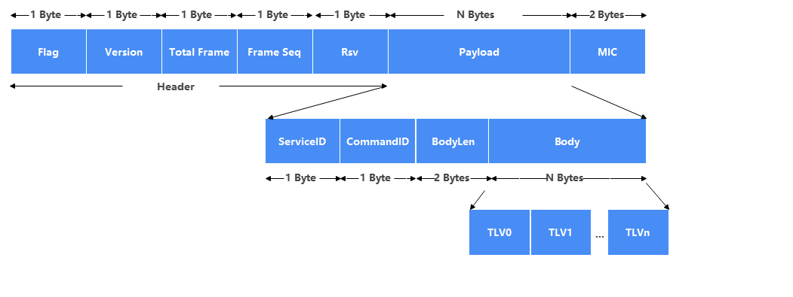
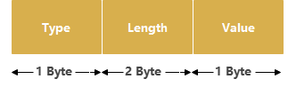
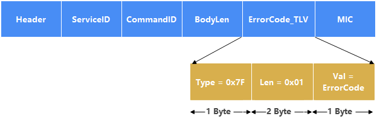
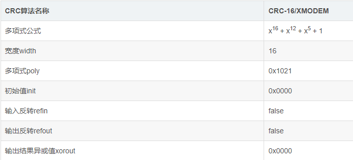
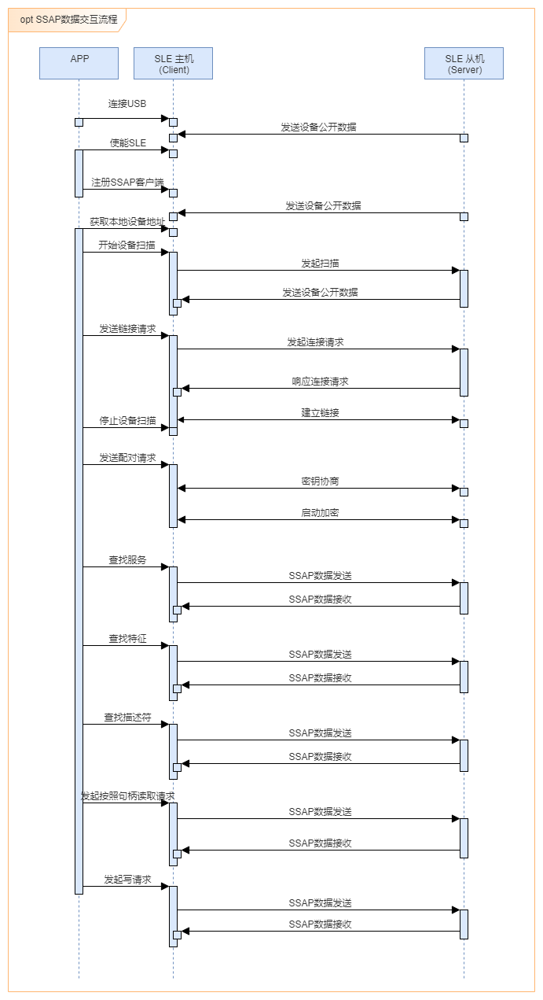

# 前言

**概述**

本文档介绍应用层相关协议，用于指导客户开发。

**读者对象**

本文档主要适用于以下工程师：

-   软件开发工程师

**符号约定**

在本文中可能出现下列标志，它们所代表的含义如下。

<table><thead align="left"><tr id="row1530720816410"><th class="cellrowborder" valign="top" width="20.580000000000002%" id="mcps1.1.3.1.1">
<strong id="b2136615816410">符号</strong>

</th>
<th class="cellrowborder" valign="top" width="79.42%" id="mcps1.1.3.1.2">
<strong id="b5941558116410">说明</strong>

</th>
</tr>
</thead>
<tbody><tr id="row1372280416410"><td class="cellrowborder" valign="top" width="20.580000000000002%" headers="mcps1.1.3.1.1 ">

</td>
<td class="cellrowborder" valign="top" width="79.42%" headers="mcps1.1.3.1.2 ">
表示如不避免则将会导致死亡或严重伤害的具有高等级风险的危害。

</td>
</tr>
<tr id="row466863216410"><td class="cellrowborder" valign="top" width="20.580000000000002%" headers="mcps1.1.3.1.1 ">

</td>
<td class="cellrowborder" valign="top" width="79.42%" headers="mcps1.1.3.1.2 ">
表示如不避免则可能导致死亡或严重伤害的具有中等级风险的危害。

</td>
</tr>
<tr id="row123863216410"><td class="cellrowborder" valign="top" width="20.580000000000002%" headers="mcps1.1.3.1.1 ">

</td>
<td class="cellrowborder" valign="top" width="79.42%" headers="mcps1.1.3.1.2 ">
表示如不避免则可能导致轻微或中度伤害的具有低等级风险的危害。

</td>
</tr>
<tr id="row5786682116410"><td class="cellrowborder" valign="top" width="20.580000000000002%" headers="mcps1.1.3.1.1 ">

</td>
<td class="cellrowborder" valign="top" width="79.42%" headers="mcps1.1.3.1.2 ">
用于传递设备或环境安全警示信息。如不避免则可能会导致设备损坏、数据丢失、设备性能降低或其它不可预知的结果。

“须知”不涉及人身伤害。

</td>
</tr>
<tr id="row2856923116410"><td class="cellrowborder" valign="top" width="20.580000000000002%" headers="mcps1.1.3.1.1 ">

</td>
<td class="cellrowborder" valign="top" width="79.42%" headers="mcps1.1.3.1.2 ">
对正文中重点信息的补充说明。

“说明”不是安全警示信息，不涉及人身、设备及环境伤害信息。

</td>
</tr>
</tbody>
</table>

**修改记录**

<table><thead align="left"><tr id="row2942532716410"><th class="cellrowborder" valign="top" width="20.72%" id="mcps1.1.4.1.1">
<strong id="b5687322716410">文档版本</strong>

</th>
<th class="cellrowborder" valign="top" width="26.119999999999997%" id="mcps1.1.4.1.2">
<strong id="b5800814916410">发布日期</strong>

</th>
<th class="cellrowborder" valign="top" width="53.16%" id="mcps1.1.4.1.3">
<strong id="b3316380216410">修改说明</strong>

</th>
</tr>
</thead>
<tbody><tr id="row1674128202419"><td class="cellrowborder" valign="top" width="20.72%" headers="mcps1.1.4.1.1 ">
01

</td>
<td class="cellrowborder" valign="top" width="26.119999999999997%" headers="mcps1.1.4.1.2 ">
2024-07-04

</td>
<td class="cellrowborder" valign="top" width="53.16%" headers="mcps1.1.4.1.3 ">
第一次正式版本发布。

</td>
</tr>
</tbody>
</table>

# 概述

## 背景

星闪协议要求从机与主机侧交互时，从机和主机侧都搭配星闪芯片。多数场景下，主机侧的星闪芯片只作为桥片使用星闪的controller功能，星闪host部署在主SOC上。但在某些应用场景下，主机侧的星闪芯片需要使用芯片自带的星闪Host，不再作为桥片。为了实现主机SOC应用层与星闪芯片内host之间的交互，需要有对应的协议传输指令和数据。

## 需求

为支撑星闪芯片内host与主机SOC应用层之间进行消息交互，需要在应用层定义新的协议，简称SLE-Link协议。

# SLE Frame格式定义

SLE-Link协议定义了新的SLE Frame格式，格式如下：

## SLE Frame格式定义

**注意： Service ID和Command ID使用0作为非法值**

<table><thead align="left"><tr id="row4485mcpsimp"><th class="cellrowborder" valign="top" width="16%" id="mcps1.1.4.1.1">
字段

</th>
<th class="cellrowborder" valign="top" width="16%" id="mcps1.1.4.1.2">
长度

</th>
<th class="cellrowborder" valign="top" width="68%" id="mcps1.1.4.1.3">
含义

</th>
</tr>
</thead>
<tbody><tr id="row4495mcpsimp"><td class="cellrowborder" valign="top" width="16%" headers="mcps1.1.4.1.1 ">
Flag

</td>
<td class="cellrowborder" valign="top" width="16%" headers="mcps1.1.4.1.2 ">
1Byte

</td>
<td class="cellrowborder" valign="top" width="68%" headers="mcps1.1.4.1.3 ">
Flag为固定值，作为星闪消息数据域的识别符，1字节。

</td>
</tr>
<tr id="row4502mcpsimp"><td class="cellrowborder" valign="top" width="16%" headers="mcps1.1.4.1.1 ">
Version

</td>
<td class="cellrowborder" valign="top" width="16%" headers="mcps1.1.4.1.2 ">
1Byte

</td>
<td class="cellrowborder" valign="top" width="68%" headers="mcps1.1.4.1.3 ">
Version表示对应的软件版本信息，根据需要添加，1字节。

</td>
</tr>
<tr id="row4509mcpsimp"><td class="cellrowborder" valign="top" width="16%" headers="mcps1.1.4.1.1 ">
Total Frame

</td>
<td class="cellrowborder" valign="top" width="16%" headers="mcps1.1.4.1.2 ">
1Byte

</td>
<td class="cellrowborder" valign="top" width="68%" headers="mcps1.1.4.1.3 ">
表示总包数。

</td>
</tr>
<tr id="row4516mcpsimp"><td class="cellrowborder" valign="top" width="16%" headers="mcps1.1.4.1.1 ">
Frame Seq

</td>
<td class="cellrowborder" valign="top" width="16%" headers="mcps1.1.4.1.2 ">
1Byte

</td>
<td class="cellrowborder" valign="top" width="68%" headers="mcps1.1.4.1.3 ">
表示包序号。

</td>
</tr>
<tr id="row4523mcpsimp"><td class="cellrowborder" valign="top" width="16%" headers="mcps1.1.4.1.1 ">
Rsv

</td>
<td class="cellrowborder" valign="top" width="16%" headers="mcps1.1.4.1.2 ">
1Byte

</td>
<td class="cellrowborder" valign="top" width="68%" headers="mcps1.1.4.1.3 ">
保留字段，便于拓展。

</td>
</tr>
<tr id="row4530mcpsimp"><td class="cellrowborder" valign="top" width="16%" headers="mcps1.1.4.1.1 ">
Service ID

</td>
<td class="cellrowborder" valign="top" width="16%" headers="mcps1.1.4.1.2 ">
1Byte

</td>
<td class="cellrowborder" valign="top" width="68%" headers="mcps1.1.4.1.3 ">
每个报文所属的业务类型，比如：设备发现，连接管理，OTA服务等。

</td>
</tr>
<tr id="row4537mcpsimp"><td class="cellrowborder" valign="top" width="16%" headers="mcps1.1.4.1.1 ">
CommandID

</td>
<td class="cellrowborder" valign="top" width="16%" headers="mcps1.1.4.1.2 ">
1Byte

</td>
<td class="cellrowborder" valign="top" width="68%" headers="mcps1.1.4.1.3 ">
每个业务类型下的具体操作，比如：建立连接，断开连接、参数更新。

</td>
</tr>
<tr id="row4544mcpsimp"><td class="cellrowborder" valign="top" width="16%" headers="mcps1.1.4.1.1 ">
BodyLen

</td>
<td class="cellrowborder" valign="top" width="16%" headers="mcps1.1.4.1.2 ">
2Byte

</td>
<td class="cellrowborder" valign="top" width="68%" headers="mcps1.1.4.1.3 ">
指示后续body部分的数据长度。

</td>
</tr>
<tr id="row4551mcpsimp"><td class="cellrowborder" valign="top" width="16%" headers="mcps1.1.4.1.1 ">
Body

</td>
<td class="cellrowborder" valign="top" width="16%" headers="mcps1.1.4.1.2 ">
Variable Byte

</td>
<td class="cellrowborder" valign="top" width="68%" headers="mcps1.1.4.1.3 ">
实际数据，以TLV格式，可以存放多个TLV。

</td>
</tr>
<tr id="row4558mcpsimp"><td class="cellrowborder" valign="top" width="16%" headers="mcps1.1.4.1.1 ">
MIC

</td>
<td class="cellrowborder" valign="top" width="16%" headers="mcps1.1.4.1.2 ">
2Byte

</td>
<td class="cellrowborder" valign="top" width="68%" headers="mcps1.1.4.1.3 ">
Message Integrity Check，消息完整性校验，采用CRC算法。对前面所有数据生成校验结果。

</td>
</tr>
</tbody>
</table>

### Header

Flag固定值：取值为0x1F。

Version：表示对应的软件版本信息。

Total Frame：表示总包数，不分包，该字段为1；如果分包，则该字段≥2。

Frame Seq：如果不分包则置为0，如果需要分包则该字段为帧序号，从1开始依次添加。

### Service ID

Service ID：占1字节，用于标识服务类型。取值0\~255，每个Service ID固定从1开始编号。

Service ID定义如下表。

为了避免各个领域和产品型态的Service ID冲突，将Service ID进行统一划分：

<table><thead align="left"><tr id="row4580mcpsimp"><th class="cellrowborder" valign="top" width="16%" id="mcps1.1.4.1.1">
Service ID

</th>
<th class="cellrowborder" valign="top" width="43%" id="mcps1.1.4.1.2">
Service Name

</th>
<th class="cellrowborder" valign="top" width="41%" id="mcps1.1.4.1.3">
Description

</th>
</tr>
</thead>
<tbody><tr id="row4587mcpsimp"><td class="cellrowborder" valign="top" width="16%" headers="mcps1.1.4.1.1 ">
0x01

</td>
<td class="cellrowborder" valign="top" width="43%" headers="mcps1.1.4.1.2 ">
<a href="Device-Discovery-Service.md">Device Discovery Service</a>

</td>
<td class="cellrowborder" valign="top" width="41%" headers="mcps1.1.4.1.3 ">
设备发现。

</td>
</tr>
<tr id="row4595mcpsimp"><td class="cellrowborder" valign="top" width="16%" headers="mcps1.1.4.1.1 ">
0x02

</td>
<td class="cellrowborder" valign="top" width="43%" headers="mcps1.1.4.1.2 ">
<a href="Connection-Management-Service.md">Connection Management Service</a>

</td>
<td class="cellrowborder" valign="top" width="41%" headers="mcps1.1.4.1.3 ">
连接管理。

</td>
</tr>
<tr id="row4603mcpsimp"><td class="cellrowborder" valign="top" width="16%" headers="mcps1.1.4.1.1 ">
0x03

</td>
<td class="cellrowborder" valign="top" width="43%" headers="mcps1.1.4.1.2 ">
<a href="SSAP-Client-Service.md">SSAP Client Service</a>

</td>
<td class="cellrowborder" valign="top" width="41%" headers="mcps1.1.4.1.3 ">
SSAP Client服务。

</td>
</tr>
<tr id="row4610mcpsimp"><td class="cellrowborder" valign="top" width="16%" headers="mcps1.1.4.1.1 ">
0x04

</td>
<td class="cellrowborder" valign="top" width="43%" headers="mcps1.1.4.1.2 ">
<a href="SSAP-Server-Service.md">SSAP Server Service</a>

</td>
<td class="cellrowborder" valign="top" width="41%" headers="mcps1.1.4.1.3 ">
SSAP Server服务。

</td>
</tr>
<tr id="row4617mcpsimp"><td class="cellrowborder" valign="top" width="16%" headers="mcps1.1.4.1.1 ">
0x05

</td>
<td class="cellrowborder" valign="top" width="43%" headers="mcps1.1.4.1.2 ">
<a href="Factory-Test-Service.md">Factory Test Service</a>

</td>
<td class="cellrowborder" valign="top" width="41%" headers="mcps1.1.4.1.3 ">
产测模式。

</td>
</tr>
<tr id="row4624mcpsimp"><td class="cellrowborder" valign="top" width="16%" headers="mcps1.1.4.1.1 ">
0x06

</td>
<td class="cellrowborder" valign="top" width="43%" headers="mcps1.1.4.1.2 ">
<a href="Low-Latency-Service.md">Low Latency Service</a>

</td>
<td class="cellrowborder" valign="top" width="41%" headers="mcps1.1.4.1.3 ">
低延时模式。

</td>
</tr>
</tbody>
</table>

### Command ID

Command ID：占1字节，用于标识具体命令类型，每个Service ID对应的Command ID都从1开始，表明真实的逻辑行为，具体的Command ID说明在后续的服务接口定义中详细介绍。

### TLV格式

TLVs封装消息中的具体信息。一个Payload的body下可以对应多个TLV。

-   Type：占用1个字节，表示消息类型，取值0\~255。其中0x00，0xFF不使用，0x7F固定用作错误码。
-   Length：占用2个字节，表示后面value的长度，取值范围0\~65535。当Length为0时，表明Value不存在。
-   Value：为具体的数据。

**注：简化处理，不支持Type下再挂子节点。**

### 通用错误码

通用错误码Type值为127，固定为1个字节。格式如下。

<table><thead align="left"><tr id="row4652mcpsimp"><th class="cellrowborder" valign="top" width="16%" id="mcps1.1.4.1.1">
<strong id="b4655mcpsimp">Error</strong>

</th>
<th class="cellrowborder" valign="top" width="12%" id="mcps1.1.4.1.2">
<strong id="b4658mcpsimp">类别</strong>

</th>
<th class="cellrowborder" valign="top" width="72%" id="mcps1.1.4.1.3">
<strong id="b4661mcpsimp">描述</strong>

</th>
</tr>
</thead>
<tbody><tr id="row4662mcpsimp"><td class="cellrowborder" valign="top" width="16%" headers="mcps1.1.4.1.1 ">
0x00

</td>
<td class="cellrowborder" rowspan="9" valign="top" width="12%" headers="mcps1.1.4.1.2 ">
通用错误

</td>
<td class="cellrowborder" valign="top" width="72%" headers="mcps1.1.4.1.3 ">
成功。

</td>
</tr>
<tr id="row4669mcpsimp"><td class="cellrowborder" valign="top" headers="mcps1.1.4.1.1 ">
0x01

</td>
<td class="cellrowborder" valign="top" headers="mcps1.1.4.1.2 ">
未知error类型。

</td>
</tr>
<tr id="row4674mcpsimp"><td class="cellrowborder" valign="top" headers="mcps1.1.4.1.1 ">
0x02

</td>
<td class="cellrowborder" valign="top" headers="mcps1.1.4.1.2 ">
不支持该请求。

</td>
</tr>
<tr id="row4679mcpsimp"><td class="cellrowborder" valign="top" headers="mcps1.1.4.1.1 ">
0x03

</td>
<td class="cellrowborder" valign="top" headers="mcps1.1.4.1.2 ">
无权限。

</td>
</tr>
<tr id="row4684mcpsimp"><td class="cellrowborder" valign="top" headers="mcps1.1.4.1.1 ">
0x04

</td>
<td class="cellrowborder" valign="top" headers="mcps1.1.4.1.2 ">
系统忙。

</td>
</tr>
<tr id="row4689mcpsimp"><td class="cellrowborder" valign="top" headers="mcps1.1.4.1.1 ">
0x05

</td>
<td class="cellrowborder" valign="top" headers="mcps1.1.4.1.2 ">
请求格式错误。

</td>
</tr>
<tr id="row4694mcpsimp"><td class="cellrowborder" valign="top" headers="mcps1.1.4.1.1 ">
0x06

</td>
<td class="cellrowborder" valign="top" headers="mcps1.1.4.1.2 ">
参数错误。

</td>
</tr>
<tr id="row4699mcpsimp"><td class="cellrowborder" valign="top" headers="mcps1.1.4.1.1 ">
0x07

</td>
<td class="cellrowborder" valign="top" headers="mcps1.1.4.1.2 ">
申请内存失败。

</td>
</tr>
<tr id="row4704mcpsimp"><td class="cellrowborder" valign="top" headers="mcps1.1.4.1.1 ">
0x08

</td>
<td class="cellrowborder" valign="top" headers="mcps1.1.4.1.2 ">
响应超时。

</td>
</tr>
</tbody>
</table>

### MIC校验

发送端和接收端，都采用相同的算法进行校验证，接收到当检测到计算出来的MIC与发送端携带的MIC不同时，认为数据不合法，直接丢弃。

MIC采用CRC-16，算法名称：CRC-16/XMODEM，多项式poly：0x1021

### Frame合法性原则

#### 接收Frame Request

Device侧检查DATA内容，Header是0x1F，且对MIC前的所有字段做校验，得到的结果与MIC的2个字节相同，则认为是合法的SLE Frame消息。

#### 接收Frame Response

Host侧检查DATA内容，Header是0x1F, 且对MIC前的所有字段做校验，得到的结果与MIC的2个字节相同，则认为是合法的SLE Frame消息。

# 服务接口定义

## Device Discovery Service

### 使能SLE

<table><thead align="left"><tr id="row4729mcpsimp"><th class="cellrowborder" valign="top" width="21.45%" id="mcps1.1.4.1.1">
Service ID

</th>
<th class="cellrowborder" valign="top" width="22.06%" id="mcps1.1.4.1.2">
Comand ID

</th>
<th class="cellrowborder" valign="top" width="56.489999999999995%" id="mcps1.1.4.1.3">
Description

</th>
</tr>
</thead>
<tbody><tr id="row4736mcpsimp"><td class="cellrowborder" valign="top" width="21.45%" headers="mcps1.1.4.1.1 ">
0x01

</td>
<td class="cellrowborder" valign="top" width="22.06%" headers="mcps1.1.4.1.2 ">
0x01

</td>
<td class="cellrowborder" valign="top" width="56.489999999999995%" headers="mcps1.1.4.1.3 ">
使能SLE协议栈

</td>
</tr>
</tbody>
</table>

**TLV参数：**

无

### 去使能SLE

<table><thead align="left"><tr id="row4753mcpsimp"><th class="cellrowborder" valign="top" width="21.33%" id="mcps1.1.4.1.1">
Service ID

</th>
<th class="cellrowborder" valign="top" width="22.42%" id="mcps1.1.4.1.2">
Comand ID

</th>
<th class="cellrowborder" valign="top" width="56.25%" id="mcps1.1.4.1.3">
Description

</th>
</tr>
</thead>
<tbody><tr id="row4760mcpsimp"><td class="cellrowborder" valign="top" width="21.33%" headers="mcps1.1.4.1.1 ">
0x01

</td>
<td class="cellrowborder" valign="top" width="22.42%" headers="mcps1.1.4.1.2 ">
0x02

</td>
<td class="cellrowborder" valign="top" width="56.25%" headers="mcps1.1.4.1.3 ">
去使能SLE协议栈

</td>
</tr>
</tbody>
</table>

**TLV参数：**

无

### 设置本地设备地址

<table><thead align="left"><tr id="row4777mcpsimp"><th class="cellrowborder" valign="top" width="21.26%" id="mcps1.1.4.1.1">
Service ID

</th>
<th class="cellrowborder" valign="top" width="22.689999999999998%" id="mcps1.1.4.1.2">
Comand ID

</th>
<th class="cellrowborder" valign="top" width="56.05%" id="mcps1.1.4.1.3">
Description

</th>
</tr>
</thead>
<tbody><tr id="row4784mcpsimp"><td class="cellrowborder" valign="top" width="21.26%" headers="mcps1.1.4.1.1 ">
0x01

</td>
<td class="cellrowborder" valign="top" width="22.689999999999998%" headers="mcps1.1.4.1.2 ">
0x03

</td>
<td class="cellrowborder" valign="top" width="56.05%" headers="mcps1.1.4.1.3 ">
去使能SLE协议栈

</td>
</tr>
</tbody>
</table>

**TLV 参数：**

<table><thead align="left"><tr id="row4800mcpsimp"><th class="cellrowborder" valign="top" width="27%" id="mcps1.1.5.1.1">
字段名称

</th>
<th class="cellrowborder" valign="top" width="22%" id="mcps1.1.5.1.2">
Type(bit0~bit6)

</th>
<th class="cellrowborder" valign="top" width="18%" id="mcps1.1.5.1.3">
Length

Size(Oct)

</th>
<th class="cellrowborder" valign="top" width="33%" id="mcps1.1.5.1.4">
Value

数据类型

</th>
</tr>
</thead>
<tbody><tr id="row4811mcpsimp"><td class="cellrowborder" valign="top" width="27%" headers="mcps1.1.5.1.1 ">
type

</td>
<td class="cellrowborder" valign="top" width="22%" headers="mcps1.1.5.1.2 ">
0x01

</td>
<td class="cellrowborder" valign="top" width="18%" headers="mcps1.1.5.1.3 ">
1

</td>
<td class="cellrowborder" valign="top" width="33%" headers="mcps1.1.5.1.4 ">
uint8

</td>
</tr>
<tr id="row4820mcpsimp"><td class="cellrowborder" valign="top" width="27%" headers="mcps1.1.5.1.1 ">
addr

</td>
<td class="cellrowborder" valign="top" width="22%" headers="mcps1.1.5.1.2 ">
0x02

</td>
<td class="cellrowborder" valign="top" width="18%" headers="mcps1.1.5.1.3 ">
6

</td>
<td class="cellrowborder" valign="top" width="33%" headers="mcps1.1.5.1.4 ">
usigned char

</td>
</tr>
</tbody>
</table>

### 获取本地设备地址

<table><thead align="left"><tr id="row4836mcpsimp"><th class="cellrowborder" valign="top" width="21.3%" id="mcps1.1.4.1.1">
Service ID

</th>
<th class="cellrowborder" valign="top" width="22.88%" id="mcps1.1.4.1.2">
Comand ID

</th>
<th class="cellrowborder" valign="top" width="55.82%" id="mcps1.1.4.1.3">
Description

</th>
</tr>
</thead>
<tbody><tr id="row4843mcpsimp"><td class="cellrowborder" valign="top" width="21.3%" headers="mcps1.1.4.1.1 ">
0x01

</td>
<td class="cellrowborder" valign="top" width="22.88%" headers="mcps1.1.4.1.2 ">
0x04

</td>
<td class="cellrowborder" valign="top" width="55.82%" headers="mcps1.1.4.1.3 ">
获取本地设备地址

</td>
</tr>
</tbody>
</table>

**TLV 参数：**

<table><thead align="left"><tr id="row4859mcpsimp"><th class="cellrowborder" valign="top" width="27%" id="mcps1.1.5.1.1">
字段名称

</th>
<th class="cellrowborder" valign="top" width="21.98%" id="mcps1.1.5.1.2">
Type(bit0~bit6)

</th>
<th class="cellrowborder" valign="top" width="18.02%" id="mcps1.1.5.1.3">
Length Size(Oct)

</th>
<th class="cellrowborder" valign="top" width="33%" id="mcps1.1.5.1.4">
Value 数据类型

</th>
</tr>
</thead>
<tbody><tr id="row4870mcpsimp"><td class="cellrowborder" valign="top" width="27%" headers="mcps1.1.5.1.1 ">
type

</td>
<td class="cellrowborder" valign="top" width="21.98%" headers="mcps1.1.5.1.2 ">
0x01

</td>
<td class="cellrowborder" valign="top" width="18.02%" headers="mcps1.1.5.1.3 ">
1

</td>
<td class="cellrowborder" valign="top" width="33%" headers="mcps1.1.5.1.4 ">
uint8

</td>
</tr>
<tr id="row4879mcpsimp"><td class="cellrowborder" valign="top" width="27%" headers="mcps1.1.5.1.1 ">
addr

</td>
<td class="cellrowborder" valign="top" width="21.98%" headers="mcps1.1.5.1.2 ">
0x02

</td>
<td class="cellrowborder" valign="top" width="18.02%" headers="mcps1.1.5.1.3 ">
6

</td>
<td class="cellrowborder" valign="top" width="33%" headers="mcps1.1.5.1.4 ">
usigned char

</td>
</tr>
</tbody>
</table>

### 设置本地设备名称

<table><thead align="left"><tr id="row4895mcpsimp"><th class="cellrowborder" valign="top" width="21.12%" id="mcps1.1.4.1.1">
Service ID

</th>
<th class="cellrowborder" valign="top" width="23.13%" id="mcps1.1.4.1.2">
Comand ID

</th>
<th class="cellrowborder" valign="top" width="55.75%" id="mcps1.1.4.1.3">
Description

</th>
</tr>
</thead>
<tbody><tr id="row4902mcpsimp"><td class="cellrowborder" valign="top" width="21.12%" headers="mcps1.1.4.1.1 ">
0x01

</td>
<td class="cellrowborder" valign="top" width="23.13%" headers="mcps1.1.4.1.2 ">
0x05

</td>
<td class="cellrowborder" valign="top" width="55.75%" headers="mcps1.1.4.1.3 ">
设置本地设备名称

</td>
</tr>
</tbody>
</table>

**TLV 参数：**

<table><thead align="left"><tr id="row4918mcpsimp"><th class="cellrowborder" valign="top" width="27%" id="mcps1.1.5.1.1">
字段名称

</th>
<th class="cellrowborder" valign="top" width="22%" id="mcps1.1.5.1.2">
Type(bit0~bit6)

</th>
<th class="cellrowborder" valign="top" width="18%" id="mcps1.1.5.1.3">
Length Size(Oct)

</th>
<th class="cellrowborder" valign="top" width="33%" id="mcps1.1.5.1.4">
Value数据类型

</th>
</tr>
</thead>
<tbody><tr id="row4929mcpsimp"><td class="cellrowborder" valign="top" width="27%" headers="mcps1.1.5.1.1 ">
name

</td>
<td class="cellrowborder" valign="top" width="22%" headers="mcps1.1.5.1.2 ">
0x01

</td>
<td class="cellrowborder" valign="top" width="18%" headers="mcps1.1.5.1.3 ">
1

</td>
<td class="cellrowborder" valign="top" width="33%" headers="mcps1.1.5.1.4 ">
uint8

</td>
</tr>
<tr id="row4938mcpsimp"><td class="cellrowborder" valign="top" width="27%" headers="mcps1.1.5.1.1 ">
len

</td>
<td class="cellrowborder" valign="top" width="22%" headers="mcps1.1.5.1.2 ">
0x02

</td>
<td class="cellrowborder" valign="top" width="18%" headers="mcps1.1.5.1.3 ">
1

</td>
<td class="cellrowborder" valign="top" width="33%" headers="mcps1.1.5.1.4 ">
uint8

</td>
</tr>
</tbody>
</table>

### 获取本地设备名称

<table><thead align="left"><tr id="row108mcpsimp"><th class="cellrowborder" valign="top" width="20.94%" id="mcps1.1.4.1.1">
Service ID

</th>
<th class="cellrowborder" valign="top" width="23.49%" id="mcps1.1.4.1.2">
Comand ID

</th>
<th class="cellrowborder" valign="top" width="55.57%" id="mcps1.1.4.1.3">
Description

</th>
</tr>
</thead>
<tbody><tr id="row115mcpsimp"><td class="cellrowborder" valign="top" width="20.94%" headers="mcps1.1.4.1.1 ">
0x01

</td>
<td class="cellrowborder" valign="top" width="23.49%" headers="mcps1.1.4.1.2 ">
0x06

</td>
<td class="cellrowborder" valign="top" width="55.57%" headers="mcps1.1.4.1.3 ">
获取本地设备名称

</td>
</tr>
</tbody>
</table>

**TLV 参数：**

<table><thead align="left"><tr id="row131mcpsimp"><th class="cellrowborder" valign="top" width="27%" id="mcps1.1.5.1.1">
字段名称

</th>
<th class="cellrowborder" valign="top" width="22%" id="mcps1.1.5.1.2">
Type(bit0~bit6)

</th>
<th class="cellrowborder" valign="top" width="18%" id="mcps1.1.5.1.3">
Length Size(Oct)

</th>
<th class="cellrowborder" valign="top" width="33%" id="mcps1.1.5.1.4">
Value数据类型

</th>
</tr>
</thead>
<tbody><tr id="row142mcpsimp"><td class="cellrowborder" valign="top" width="27%" headers="mcps1.1.5.1.1 ">
name

</td>
<td class="cellrowborder" valign="top" width="22%" headers="mcps1.1.5.1.2 ">
0x01

</td>
<td class="cellrowborder" valign="top" width="18%" headers="mcps1.1.5.1.3 ">
1

</td>
<td class="cellrowborder" valign="top" width="33%" headers="mcps1.1.5.1.4 ">
uint8

</td>
</tr>
<tr id="row151mcpsimp"><td class="cellrowborder" valign="top" width="27%" headers="mcps1.1.5.1.1 ">
len

</td>
<td class="cellrowborder" valign="top" width="22%" headers="mcps1.1.5.1.2 ">
0x02

</td>
<td class="cellrowborder" valign="top" width="18%" headers="mcps1.1.5.1.3 ">
1

</td>
<td class="cellrowborder" valign="top" width="33%" headers="mcps1.1.5.1.4 ">
uint8

</td>
</tr>
</tbody>
</table>

### 设置设备公开数据

<table><thead align="left"><tr id="row167mcpsimp"><th class="cellrowborder" valign="top" width="20.94%" id="mcps1.1.4.1.1">
Service ID

</th>
<th class="cellrowborder" valign="top" width="23.62%" id="mcps1.1.4.1.2">
Comand ID

</th>
<th class="cellrowborder" valign="top" width="55.44%" id="mcps1.1.4.1.3">
Description

</th>
</tr>
</thead>
<tbody><tr id="row174mcpsimp"><td class="cellrowborder" valign="top" width="20.94%" headers="mcps1.1.4.1.1 ">
0x01

</td>
<td class="cellrowborder" valign="top" width="23.62%" headers="mcps1.1.4.1.2 ">
0x07

</td>
<td class="cellrowborder" valign="top" width="55.44%" headers="mcps1.1.4.1.3 ">
设置设备公开数据

</td>
</tr>
</tbody>
</table>

**TLV 参数：**

<table><thead align="left"><tr id="row190mcpsimp"><th class="cellrowborder" valign="top" width="27%" id="mcps1.1.5.1.1">
字段名称

</th>
<th class="cellrowborder" valign="top" width="22%" id="mcps1.1.5.1.2">
Type(bit0~bit6)

</th>
<th class="cellrowborder" valign="top" width="20.990000000000002%" id="mcps1.1.5.1.3">
Length Size(Oct)

</th>
<th class="cellrowborder" valign="top" width="30.009999999999998%" id="mcps1.1.5.1.4">
Value数据类型

</th>
</tr>
</thead>
<tbody><tr id="row201mcpsimp"><td class="cellrowborder" valign="top" width="27%" headers="mcps1.1.5.1.1 ">
announce_id

</td>
<td class="cellrowborder" valign="top" width="22%" headers="mcps1.1.5.1.2 ">
0x01

</td>
<td class="cellrowborder" valign="top" width="20.990000000000002%" headers="mcps1.1.5.1.3 ">
1

</td>
<td class="cellrowborder" valign="top" width="30.009999999999998%" headers="mcps1.1.5.1.4 ">
uint8

</td>
</tr>
<tr id="row210mcpsimp"><td class="cellrowborder" valign="top" width="27%" headers="mcps1.1.5.1.1 ">
announce_data_len

</td>
<td class="cellrowborder" valign="top" width="22%" headers="mcps1.1.5.1.2 ">
0x02

</td>
<td class="cellrowborder" valign="top" width="20.990000000000002%" headers="mcps1.1.5.1.3 ">
2

</td>
<td class="cellrowborder" valign="top" width="30.009999999999998%" headers="mcps1.1.5.1.4 ">
uint16_t

</td>
</tr>
<tr id="row219mcpsimp"><td class="cellrowborder" valign="top" width="27%" headers="mcps1.1.5.1.1 ">
seek_rsp_data_len

</td>
<td class="cellrowborder" valign="top" width="22%" headers="mcps1.1.5.1.2 ">
0x03

</td>
<td class="cellrowborder" valign="top" width="20.990000000000002%" headers="mcps1.1.5.1.3 ">
2

</td>
<td class="cellrowborder" valign="top" width="30.009999999999998%" headers="mcps1.1.5.1.4 ">
uint16_t

</td>
</tr>
<tr id="row228mcpsimp"><td class="cellrowborder" valign="top" width="27%" headers="mcps1.1.5.1.1 ">
announce_data

</td>
<td class="cellrowborder" valign="top" width="22%" headers="mcps1.1.5.1.2 ">
0x04

</td>
<td class="cellrowborder" valign="top" width="20.990000000000002%" headers="mcps1.1.5.1.3 ">
1

</td>
<td class="cellrowborder" valign="top" width="30.009999999999998%" headers="mcps1.1.5.1.4 ">
uint8_t

</td>
</tr>
<tr id="row237mcpsimp"><td class="cellrowborder" valign="top" width="27%" headers="mcps1.1.5.1.1 ">
seek_rsp_data

</td>
<td class="cellrowborder" valign="top" width="22%" headers="mcps1.1.5.1.2 ">
0x05

</td>
<td class="cellrowborder" valign="top" width="20.990000000000002%" headers="mcps1.1.5.1.3 ">
1

</td>
<td class="cellrowborder" valign="top" width="30.009999999999998%" headers="mcps1.1.5.1.4 ">
uint8_t

</td>
</tr>
</tbody>
</table>

### 设置设备公开参数

<table><thead align="left"><tr id="row253mcpsimp"><th class="cellrowborder" valign="top" width="21%" id="mcps1.1.4.1.1">
Service ID

</th>
<th class="cellrowborder" valign="top" width="23.799999999999997%" id="mcps1.1.4.1.2">
Comand ID

</th>
<th class="cellrowborder" valign="top" width="55.2%" id="mcps1.1.4.1.3">
Description

</th>
</tr>
</thead>
<tbody><tr id="row260mcpsimp"><td class="cellrowborder" valign="top" width="21%" headers="mcps1.1.4.1.1 ">
0x01

</td>
<td class="cellrowborder" valign="top" width="23.799999999999997%" headers="mcps1.1.4.1.2 ">
0x08

</td>
<td class="cellrowborder" valign="top" width="55.2%" headers="mcps1.1.4.1.3 ">
设置设备公开参数

</td>
</tr>
</tbody>
</table>

**TLV 参数：**

<table><thead align="left"><tr id="row276mcpsimp"><th class="cellrowborder" valign="top" width="34.65346534653465%" id="mcps1.1.5.1.1">
字段名称

</th>
<th class="cellrowborder" valign="top" width="17.82178217821782%" id="mcps1.1.5.1.2">
Type(bit0~bit6)

</th>
<th class="cellrowborder" valign="top" width="17.82178217821782%" id="mcps1.1.5.1.3">
Length Size(Oct)

</th>
<th class="cellrowborder" valign="top" width="29.7029702970297%" id="mcps1.1.5.1.4">
Value数据类型

</th>
</tr>
</thead>
<tbody><tr id="row287mcpsimp"><td class="cellrowborder" valign="top" width="34.65346534653465%" headers="mcps1.1.5.1.1 ">
announce_id

</td>
<td class="cellrowborder" valign="top" width="17.82178217821782%" headers="mcps1.1.5.1.2 ">
0x01

</td>
<td class="cellrowborder" valign="top" width="17.82178217821782%" headers="mcps1.1.5.1.3 ">
1

</td>
<td class="cellrowborder" valign="top" width="29.7029702970297%" headers="mcps1.1.5.1.4 ">
uint8

</td>
</tr>
<tr id="row296mcpsimp"><td class="cellrowborder" valign="top" width="34.65346534653465%" headers="mcps1.1.5.1.1 ">
announce_handle

</td>
<td class="cellrowborder" valign="top" width="17.82178217821782%" headers="mcps1.1.5.1.2 ">
0x02

</td>
<td class="cellrowborder" valign="top" width="17.82178217821782%" headers="mcps1.1.5.1.3 ">
1

</td>
<td class="cellrowborder" valign="top" width="29.7029702970297%" headers="mcps1.1.5.1.4 ">
uint16

</td>
</tr>
<tr id="row305mcpsimp"><td class="cellrowborder" valign="top" width="34.65346534653465%" headers="mcps1.1.5.1.1 ">
announce_mode

</td>
<td class="cellrowborder" valign="top" width="17.82178217821782%" headers="mcps1.1.5.1.2 ">
0x03

</td>
<td class="cellrowborder" valign="top" width="17.82178217821782%" headers="mcps1.1.5.1.3 ">
1

</td>
<td class="cellrowborder" valign="top" width="29.7029702970297%" headers="mcps1.1.5.1.4 ">
uint16

</td>
</tr>
<tr id="row314mcpsimp"><td class="cellrowborder" valign="top" width="34.65346534653465%" headers="mcps1.1.5.1.1 ">
announce_gt_role

</td>
<td class="cellrowborder" valign="top" width="17.82178217821782%" headers="mcps1.1.5.1.2 ">
0x04

</td>
<td class="cellrowborder" valign="top" width="17.82178217821782%" headers="mcps1.1.5.1.3 ">
1

</td>
<td class="cellrowborder" valign="top" width="29.7029702970297%" headers="mcps1.1.5.1.4 ">
uint8

</td>
</tr>
<tr id="row323mcpsimp"><td class="cellrowborder" valign="top" width="34.65346534653465%" headers="mcps1.1.5.1.1 ">
announce_level

</td>
<td class="cellrowborder" valign="top" width="17.82178217821782%" headers="mcps1.1.5.1.2 ">
0x05

</td>
<td class="cellrowborder" valign="top" width="17.82178217821782%" headers="mcps1.1.5.1.3 ">
1

</td>
<td class="cellrowborder" valign="top" width="29.7029702970297%" headers="mcps1.1.5.1.4 ">
uint8

</td>
</tr>
<tr id="row332mcpsimp"><td class="cellrowborder" valign="top" width="34.65346534653465%" headers="mcps1.1.5.1.1 ">
announce_interval_min

</td>
<td class="cellrowborder" valign="top" width="17.82178217821782%" headers="mcps1.1.5.1.2 ">
0x06

</td>
<td class="cellrowborder" valign="top" width="17.82178217821782%" headers="mcps1.1.5.1.3 ">
4

</td>
<td class="cellrowborder" valign="top" width="29.7029702970297%" headers="mcps1.1.5.1.4 ">
uint32

</td>
</tr>
<tr id="row341mcpsimp"><td class="cellrowborder" valign="top" width="34.65346534653465%" headers="mcps1.1.5.1.1 ">
announce_interval_max

</td>
<td class="cellrowborder" valign="top" width="17.82178217821782%" headers="mcps1.1.5.1.2 ">
0x07

</td>
<td class="cellrowborder" valign="top" width="17.82178217821782%" headers="mcps1.1.5.1.3 ">
4

</td>
<td class="cellrowborder" valign="top" width="29.7029702970297%" headers="mcps1.1.5.1.4 ">
uint32

</td>
</tr>
<tr id="row350mcpsimp"><td class="cellrowborder" valign="top" width="34.65346534653465%" headers="mcps1.1.5.1.1 ">
announce_channel_map

</td>
<td class="cellrowborder" valign="top" width="17.82178217821782%" headers="mcps1.1.5.1.2 ">
0x08

</td>
<td class="cellrowborder" valign="top" width="17.82178217821782%" headers="mcps1.1.5.1.3 ">
1

</td>
<td class="cellrowborder" valign="top" width="29.7029702970297%" headers="mcps1.1.5.1.4 ">
uint8

</td>
</tr>
<tr id="row359mcpsimp"><td class="cellrowborder" valign="top" width="34.65346534653465%" headers="mcps1.1.5.1.1 ">
announce_tx_power

</td>
<td class="cellrowborder" valign="top" width="17.82178217821782%" headers="mcps1.1.5.1.2 ">
0x09

</td>
<td class="cellrowborder" valign="top" width="17.82178217821782%" headers="mcps1.1.5.1.3 ">
1

</td>
<td class="cellrowborder" valign="top" width="29.7029702970297%" headers="mcps1.1.5.1.4 ">
uint8

</td>
</tr>
<tr id="row368mcpsimp"><td class="cellrowborder" valign="top" width="34.65346534653465%" headers="mcps1.1.5.1.1 ">
own_addr_type

</td>
<td class="cellrowborder" valign="top" width="17.82178217821782%" headers="mcps1.1.5.1.2 ">
0x0A

</td>
<td class="cellrowborder" valign="top" width="17.82178217821782%" headers="mcps1.1.5.1.3 ">
1

</td>
<td class="cellrowborder" valign="top" width="29.7029702970297%" headers="mcps1.1.5.1.4 ">
uint8

</td>
</tr>
<tr id="row377mcpsimp"><td class="cellrowborder" valign="top" width="34.65346534653465%" headers="mcps1.1.5.1.1 ">
own_addr

</td>
<td class="cellrowborder" valign="top" width="17.82178217821782%" headers="mcps1.1.5.1.2 ">
0x0B

</td>
<td class="cellrowborder" valign="top" width="17.82178217821782%" headers="mcps1.1.5.1.3 ">
6

</td>
<td class="cellrowborder" valign="top" width="29.7029702970297%" headers="mcps1.1.5.1.4 ">
unsigned char

</td>
</tr>
<tr id="row386mcpsimp"><td class="cellrowborder" valign="top" width="34.65346534653465%" headers="mcps1.1.5.1.1 ">
peer_addr_type

</td>
<td class="cellrowborder" valign="top" width="17.82178217821782%" headers="mcps1.1.5.1.2 ">
0x0C

</td>
<td class="cellrowborder" valign="top" width="17.82178217821782%" headers="mcps1.1.5.1.3 ">
1

</td>
<td class="cellrowborder" valign="top" width="29.7029702970297%" headers="mcps1.1.5.1.4 ">
uint8

</td>
</tr>
<tr id="row395mcpsimp"><td class="cellrowborder" valign="top" width="34.65346534653465%" headers="mcps1.1.5.1.1 ">
peer_addr

</td>
<td class="cellrowborder" valign="top" width="17.82178217821782%" headers="mcps1.1.5.1.2 ">
0x0D

</td>
<td class="cellrowborder" valign="top" width="17.82178217821782%" headers="mcps1.1.5.1.3 ">
6

</td>
<td class="cellrowborder" valign="top" width="29.7029702970297%" headers="mcps1.1.5.1.4 ">
unsigned char

</td>
</tr>
<tr id="row404mcpsimp"><td class="cellrowborder" valign="top" width="34.65346534653465%" headers="mcps1.1.5.1.1 ">
conn_interval_min

</td>
<td class="cellrowborder" valign="top" width="17.82178217821782%" headers="mcps1.1.5.1.2 ">
0x0E

</td>
<td class="cellrowborder" valign="top" width="17.82178217821782%" headers="mcps1.1.5.1.3 ">
2

</td>
<td class="cellrowborder" valign="top" width="29.7029702970297%" headers="mcps1.1.5.1.4 ">
uint16

</td>
</tr>
<tr id="row413mcpsimp"><td class="cellrowborder" valign="top" width="34.65346534653465%" headers="mcps1.1.5.1.1 ">
conn_interval_max

</td>
<td class="cellrowborder" valign="top" width="17.82178217821782%" headers="mcps1.1.5.1.2 ">
0x0F

</td>
<td class="cellrowborder" valign="top" width="17.82178217821782%" headers="mcps1.1.5.1.3 ">
2

</td>
<td class="cellrowborder" valign="top" width="29.7029702970297%" headers="mcps1.1.5.1.4 ">
uint16

</td>
</tr>
<tr id="row422mcpsimp"><td class="cellrowborder" valign="top" width="34.65346534653465%" headers="mcps1.1.5.1.1 ">
conn_max_latency

</td>
<td class="cellrowborder" valign="top" width="17.82178217821782%" headers="mcps1.1.5.1.2 ">
0x10

</td>
<td class="cellrowborder" valign="top" width="17.82178217821782%" headers="mcps1.1.5.1.3 ">
2

</td>
<td class="cellrowborder" valign="top" width="29.7029702970297%" headers="mcps1.1.5.1.4 ">
uint16

</td>
</tr>
<tr id="row431mcpsimp"><td class="cellrowborder" valign="top" width="34.65346534653465%" headers="mcps1.1.5.1.1 ">
conn_supervision_timeout

</td>
<td class="cellrowborder" valign="top" width="17.82178217821782%" headers="mcps1.1.5.1.2 ">
0x11

</td>
<td class="cellrowborder" valign="top" width="17.82178217821782%" headers="mcps1.1.5.1.3 ">
2

</td>
<td class="cellrowborder" valign="top" width="29.7029702970297%" headers="mcps1.1.5.1.4 ">
uint16

</td>
</tr>
</tbody>
</table>

### 开始设备公开

<table><thead align="left"><tr id="row447mcpsimp"><th class="cellrowborder" valign="top" width="20.43%" id="mcps1.1.4.1.1">
Service ID

</th>
<th class="cellrowborder" valign="top" width="24.51%" id="mcps1.1.4.1.2">
Comand ID

</th>
<th class="cellrowborder" valign="top" width="55.059999999999995%" id="mcps1.1.4.1.3">
Description

</th>
</tr>
</thead>
<tbody><tr id="row454mcpsimp"><td class="cellrowborder" valign="top" width="20.43%" headers="mcps1.1.4.1.1 ">
0x01

</td>
<td class="cellrowborder" valign="top" width="24.51%" headers="mcps1.1.4.1.2 ">
0x09

</td>
<td class="cellrowborder" valign="top" width="55.059999999999995%" headers="mcps1.1.4.1.3 ">
开始设备公开

</td>
</tr>
</tbody>
</table>

**TLV 参数：**

<table><thead align="left"><tr id="row470mcpsimp"><th class="cellrowborder" valign="top" width="28.712871287128717%" id="mcps1.1.5.1.1">
字段名称

</th>
<th class="cellrowborder" valign="top" width="23.762376237623766%" id="mcps1.1.5.1.2">
Type(bit0~bit6)

</th>
<th class="cellrowborder" valign="top" width="17.82178217821782%" id="mcps1.1.5.1.3">
Length Size(Oct)

</th>
<th class="cellrowborder" valign="top" width="29.7029702970297%" id="mcps1.1.5.1.4">
Value数据类型

</th>
</tr>
</thead>
<tbody><tr id="row481mcpsimp"><td class="cellrowborder" valign="top" width="28.712871287128717%" headers="mcps1.1.5.1.1 ">
announce_id

</td>
<td class="cellrowborder" valign="top" width="23.762376237623766%" headers="mcps1.1.5.1.2 ">
0x01

</td>
<td class="cellrowborder" valign="top" width="17.82178217821782%" headers="mcps1.1.5.1.3 ">
1

</td>
<td class="cellrowborder" valign="top" width="29.7029702970297%" headers="mcps1.1.5.1.4 ">
uint8

</td>
</tr>
</tbody>
</table>

### 结束设备公开

<table><thead align="left"><tr id="row497mcpsimp"><th class="cellrowborder" valign="top" width="20.669999999999998%" id="mcps1.1.4.1.1">
Service ID

</th>
<th class="cellrowborder" valign="top" width="24.58%" id="mcps1.1.4.1.2">
Comand ID

</th>
<th class="cellrowborder" valign="top" width="54.75%" id="mcps1.1.4.1.3">
Description

</th>
</tr>
</thead>
<tbody><tr id="row504mcpsimp"><td class="cellrowborder" valign="top" width="20.669999999999998%" headers="mcps1.1.4.1.1 ">
0x01

</td>
<td class="cellrowborder" valign="top" width="24.58%" headers="mcps1.1.4.1.2 ">
0x0A

</td>
<td class="cellrowborder" valign="top" width="54.75%" headers="mcps1.1.4.1.3 ">
结束设备公开

</td>
</tr>
</tbody>
</table>

**TLV 参数：**

<table><thead align="left"><tr id="row520mcpsimp"><th class="cellrowborder" valign="top" width="28.712871287128717%" id="mcps1.1.5.1.1">
字段名称

</th>
<th class="cellrowborder" valign="top" width="23.762376237623766%" id="mcps1.1.5.1.2">
Type(bit0~bit6)

</th>
<th class="cellrowborder" valign="top" width="17.82178217821782%" id="mcps1.1.5.1.3">
Length Size(Oct)

</th>
<th class="cellrowborder" valign="top" width="29.7029702970297%" id="mcps1.1.5.1.4">
Value数据类型

</th>
</tr>
</thead>
<tbody><tr id="row531mcpsimp"><td class="cellrowborder" valign="top" width="28.712871287128717%" headers="mcps1.1.5.1.1 ">
announce_id

</td>
<td class="cellrowborder" valign="top" width="23.762376237623766%" headers="mcps1.1.5.1.2 ">
0x01

</td>
<td class="cellrowborder" valign="top" width="17.82178217821782%" headers="mcps1.1.5.1.3 ">
1

</td>
<td class="cellrowborder" valign="top" width="29.7029702970297%" headers="mcps1.1.5.1.4 ">
uint8

</td>
</tr>
</tbody>
</table>

### 设置设备扫描参数

<table><thead align="left"><tr id="row547mcpsimp"><th class="cellrowborder" valign="top" width="20.61%" id="mcps1.1.4.1.1">
Service ID

</th>
<th class="cellrowborder" valign="top" width="24.63%" id="mcps1.1.4.1.2">
Comand ID

</th>
<th class="cellrowborder" valign="top" width="54.76%" id="mcps1.1.4.1.3">
Description

</th>
</tr>
</thead>
<tbody><tr id="row554mcpsimp"><td class="cellrowborder" valign="top" width="20.61%" headers="mcps1.1.4.1.1 ">
0x01

</td>
<td class="cellrowborder" valign="top" width="24.63%" headers="mcps1.1.4.1.2 ">
0x0B

</td>
<td class="cellrowborder" valign="top" width="54.76%" headers="mcps1.1.4.1.3 ">
设置设备扫描参数

</td>
</tr>
</tbody>
</table>

**TLV 参数：**

<table><thead align="left"><tr id="row570mcpsimp"><th class="cellrowborder" valign="top" width="32.67326732673268%" id="mcps1.1.5.1.1">
字段名称

</th>
<th class="cellrowborder" valign="top" width="21.782178217821784%" id="mcps1.1.5.1.2">
Type(bit0~bit6)

</th>
<th class="cellrowborder" valign="top" width="15.841584158415841%" id="mcps1.1.5.1.3">
Length Size(Oct)

</th>
<th class="cellrowborder" valign="top" width="29.7029702970297%" id="mcps1.1.5.1.4">
Value数据类型

</th>
</tr>
</thead>
<tbody><tr id="row581mcpsimp"><td class="cellrowborder" valign="top" width="32.67326732673268%" headers="mcps1.1.5.1.1 ">
own_addr_type

</td>
<td class="cellrowborder" valign="top" width="21.782178217821784%" headers="mcps1.1.5.1.2 ">
0x01

</td>
<td class="cellrowborder" valign="top" width="15.841584158415841%" headers="mcps1.1.5.1.3 ">
1

</td>
<td class="cellrowborder" valign="top" width="29.7029702970297%" headers="mcps1.1.5.1.4 ">
uint8

</td>
</tr>
<tr id="row590mcpsimp"><td class="cellrowborder" valign="top" width="32.67326732673268%" headers="mcps1.1.5.1.1 ">
filter_duplicates

</td>
<td class="cellrowborder" valign="top" width="21.782178217821784%" headers="mcps1.1.5.1.2 ">
0x02

</td>
<td class="cellrowborder" valign="top" width="15.841584158415841%" headers="mcps1.1.5.1.3 ">
1

</td>
<td class="cellrowborder" valign="top" width="29.7029702970297%" headers="mcps1.1.5.1.4 ">
uint8

</td>
</tr>
<tr id="row599mcpsimp"><td class="cellrowborder" valign="top" width="32.67326732673268%" headers="mcps1.1.5.1.1 ">
seek_filter_policy

</td>
<td class="cellrowborder" valign="top" width="21.782178217821784%" headers="mcps1.1.5.1.2 ">
0x03

</td>
<td class="cellrowborder" valign="top" width="15.841584158415841%" headers="mcps1.1.5.1.3 ">
1

</td>
<td class="cellrowborder" valign="top" width="29.7029702970297%" headers="mcps1.1.5.1.4 ">
uint8

</td>
</tr>
<tr id="row608mcpsimp"><td class="cellrowborder" valign="top" width="32.67326732673268%" headers="mcps1.1.5.1.1 ">
seek_phys

</td>
<td class="cellrowborder" valign="top" width="21.782178217821784%" headers="mcps1.1.5.1.2 ">
0x04

</td>
<td class="cellrowborder" valign="top" width="15.841584158415841%" headers="mcps1.1.5.1.3 ">
1

</td>
<td class="cellrowborder" valign="top" width="29.7029702970297%" headers="mcps1.1.5.1.4 ">
uint8

</td>
</tr>
<tr id="row617mcpsimp"><td class="cellrowborder" valign="top" width="32.67326732673268%" headers="mcps1.1.5.1.1 ">
seek_type

</td>
<td class="cellrowborder" valign="top" width="21.782178217821784%" headers="mcps1.1.5.1.2 ">
0x05

</td>
<td class="cellrowborder" valign="top" width="15.841584158415841%" headers="mcps1.1.5.1.3 ">
3

</td>
<td class="cellrowborder" valign="top" width="29.7029702970297%" headers="mcps1.1.5.1.4 ">
uint8

</td>
</tr>
<tr id="row626mcpsimp"><td class="cellrowborder" valign="top" width="32.67326732673268%" headers="mcps1.1.5.1.1 ">
seek_interval

</td>
<td class="cellrowborder" valign="top" width="21.782178217821784%" headers="mcps1.1.5.1.2 ">
0x06

</td>
<td class="cellrowborder" valign="top" width="15.841584158415841%" headers="mcps1.1.5.1.3 ">
6

</td>
<td class="cellrowborder" valign="top" width="29.7029702970297%" headers="mcps1.1.5.1.4 ">
uint16

</td>
</tr>
<tr id="row635mcpsimp"><td class="cellrowborder" valign="top" width="32.67326732673268%" headers="mcps1.1.5.1.1 ">
seek_window

</td>
<td class="cellrowborder" valign="top" width="21.782178217821784%" headers="mcps1.1.5.1.2 ">
0x07

</td>
<td class="cellrowborder" valign="top" width="15.841584158415841%" headers="mcps1.1.5.1.3 ">
6

</td>
<td class="cellrowborder" valign="top" width="29.7029702970297%" headers="mcps1.1.5.1.4 ">
uint16

</td>
</tr>
</tbody>
</table>

### 上报设备扫描结果

<table><thead align="left"><tr id="row651mcpsimp"><th class="cellrowborder" valign="top" width="21.060000000000002%" id="mcps1.1.4.1.1">
Service ID

</th>
<th class="cellrowborder" valign="top" width="24.81%" id="mcps1.1.4.1.2">
Comand ID

</th>
<th class="cellrowborder" valign="top" width="54.13%" id="mcps1.1.4.1.3">
Description

</th>
</tr>
</thead>
<tbody><tr id="row658mcpsimp"><td class="cellrowborder" valign="top" width="21.060000000000002%" headers="mcps1.1.4.1.1 ">
0x01

</td>
<td class="cellrowborder" valign="top" width="24.81%" headers="mcps1.1.4.1.2 ">
0x0C

</td>
<td class="cellrowborder" valign="top" width="54.13%" headers="mcps1.1.4.1.3 ">
上报设备扫描结果

</td>
</tr>
</tbody>
</table>

**TLV 参数：**

<table><thead align="left"><tr id="row674mcpsimp"><th class="cellrowborder" valign="top" width="32.67326732673268%" id="mcps1.1.5.1.1">
字段名称

</th>
<th class="cellrowborder" valign="top" width="21.782178217821784%" id="mcps1.1.5.1.2">
Type(bit0~bit6)

</th>
<th class="cellrowborder" valign="top" width="15.841584158415841%" id="mcps1.1.5.1.3">
Length Size(Oct)

</th>
<th class="cellrowborder" valign="top" width="29.7029702970297%" id="mcps1.1.5.1.4">
Value数据类型

</th>
</tr>
</thead>
<tbody><tr id="row685mcpsimp"><td class="cellrowborder" valign="top" width="32.67326732673268%" headers="mcps1.1.5.1.1 ">
event_type

</td>
<td class="cellrowborder" valign="top" width="21.782178217821784%" headers="mcps1.1.5.1.2 ">
0x01

</td>
<td class="cellrowborder" valign="top" width="15.841584158415841%" headers="mcps1.1.5.1.3 ">
1

</td>
<td class="cellrowborder" valign="top" width="29.7029702970297%" headers="mcps1.1.5.1.4 ">
uint8

</td>
</tr>
<tr id="row694mcpsimp"><td class="cellrowborder" valign="top" width="32.67326732673268%" headers="mcps1.1.5.1.1 ">
addr_type

</td>
<td class="cellrowborder" valign="top" width="21.782178217821784%" headers="mcps1.1.5.1.2 ">
0x02

</td>
<td class="cellrowborder" valign="top" width="15.841584158415841%" headers="mcps1.1.5.1.3 ">
1

</td>
<td class="cellrowborder" valign="top" width="29.7029702970297%" headers="mcps1.1.5.1.4 ">
uint8

</td>
</tr>
<tr id="row703mcpsimp"><td class="cellrowborder" valign="top" width="32.67326732673268%" headers="mcps1.1.5.1.1 ">
addr

</td>
<td class="cellrowborder" valign="top" width="21.782178217821784%" headers="mcps1.1.5.1.2 ">
0x03

</td>
<td class="cellrowborder" valign="top" width="15.841584158415841%" headers="mcps1.1.5.1.3 ">
6

</td>
<td class="cellrowborder" valign="top" width="29.7029702970297%" headers="mcps1.1.5.1.4 ">
unsigned char

</td>
</tr>
<tr id="row712mcpsimp"><td class="cellrowborder" valign="top" width="32.67326732673268%" headers="mcps1.1.5.1.1 ">
direct_addr_type

</td>
<td class="cellrowborder" valign="top" width="21.782178217821784%" headers="mcps1.1.5.1.2 ">
0x04

</td>
<td class="cellrowborder" valign="top" width="15.841584158415841%" headers="mcps1.1.5.1.3 ">
1

</td>
<td class="cellrowborder" valign="top" width="29.7029702970297%" headers="mcps1.1.5.1.4 ">
uint8

</td>
</tr>
<tr id="row721mcpsimp"><td class="cellrowborder" valign="top" width="32.67326732673268%" headers="mcps1.1.5.1.1 ">
direct_addr

</td>
<td class="cellrowborder" valign="top" width="21.782178217821784%" headers="mcps1.1.5.1.2 ">
0x05

</td>
<td class="cellrowborder" valign="top" width="15.841584158415841%" headers="mcps1.1.5.1.3 ">
6

</td>
<td class="cellrowborder" valign="top" width="29.7029702970297%" headers="mcps1.1.5.1.4 ">
unsigned char

</td>
</tr>
<tr id="row730mcpsimp"><td class="cellrowborder" valign="top" width="32.67326732673268%" headers="mcps1.1.5.1.1 ">
rssi

</td>
<td class="cellrowborder" valign="top" width="21.782178217821784%" headers="mcps1.1.5.1.2 ">
0x06

</td>
<td class="cellrowborder" valign="top" width="15.841584158415841%" headers="mcps1.1.5.1.3 ">
1

</td>
<td class="cellrowborder" valign="top" width="29.7029702970297%" headers="mcps1.1.5.1.4 ">
uint8

</td>
</tr>
<tr id="row739mcpsimp"><td class="cellrowborder" valign="top" width="32.67326732673268%" headers="mcps1.1.5.1.1 ">
data_status

</td>
<td class="cellrowborder" valign="top" width="21.782178217821784%" headers="mcps1.1.5.1.2 ">
0x07

</td>
<td class="cellrowborder" valign="top" width="15.841584158415841%" headers="mcps1.1.5.1.3 ">
1

</td>
<td class="cellrowborder" valign="top" width="29.7029702970297%" headers="mcps1.1.5.1.4 ">
uint8

</td>
</tr>
<tr id="row748mcpsimp"><td class="cellrowborder" valign="top" width="32.67326732673268%" headers="mcps1.1.5.1.1 ">
data_lenth

</td>
<td class="cellrowborder" valign="top" width="21.782178217821784%" headers="mcps1.1.5.1.2 ">
0x08

</td>
<td class="cellrowborder" valign="top" width="15.841584158415841%" headers="mcps1.1.5.1.3 ">
2

</td>
<td class="cellrowborder" valign="top" width="29.7029702970297%" headers="mcps1.1.5.1.4 ">
uint8

</td>
</tr>
<tr id="row757mcpsimp"><td class="cellrowborder" valign="top" width="32.67326732673268%" headers="mcps1.1.5.1.1 ">
data

</td>
<td class="cellrowborder" valign="top" width="21.782178217821784%" headers="mcps1.1.5.1.2 ">
0x09

</td>
<td class="cellrowborder" valign="top" width="15.841584158415841%" headers="mcps1.1.5.1.3 ">
n

</td>
<td class="cellrowborder" valign="top" width="29.7029702970297%" headers="mcps1.1.5.1.4 ">
uint8

</td>
</tr>
</tbody>
</table>

### 开始设备扫描

<table><thead align="left"><tr id="row773mcpsimp"><th class="cellrowborder" valign="top" width="21.75%" id="mcps1.1.4.1.1">
Service ID

</th>
<th class="cellrowborder" valign="top" width="24.8%" id="mcps1.1.4.1.2">
Comand ID

</th>
<th class="cellrowborder" valign="top" width="53.449999999999996%" id="mcps1.1.4.1.3">
Description

</th>
</tr>
</thead>
<tbody><tr id="row780mcpsimp"><td class="cellrowborder" valign="top" width="21.75%" headers="mcps1.1.4.1.1 ">
0x01

</td>
<td class="cellrowborder" valign="top" width="24.8%" headers="mcps1.1.4.1.2 ">
0x0D

</td>
<td class="cellrowborder" valign="top" width="53.449999999999996%" headers="mcps1.1.4.1.3 ">
开始设备扫描

</td>
</tr>
</tbody>
</table>

**TLV 参数：**

无

### 停止设备扫描

<table><thead align="left"><tr id="row797mcpsimp"><th class="cellrowborder" valign="top" width="21.73%" id="mcps1.1.4.1.1">
Service ID

</th>
<th class="cellrowborder" valign="top" width="24.8%" id="mcps1.1.4.1.2">
Comand ID

</th>
<th class="cellrowborder" valign="top" width="53.47%" id="mcps1.1.4.1.3">
Description

</th>
</tr>
</thead>
<tbody><tr id="row804mcpsimp"><td class="cellrowborder" valign="top" width="21.73%" headers="mcps1.1.4.1.1 ">
0x01

</td>
<td class="cellrowborder" valign="top" width="24.8%" headers="mcps1.1.4.1.2 ">
0x0E

</td>
<td class="cellrowborder" valign="top" width="53.47%" headers="mcps1.1.4.1.3 ">
停止设备扫描

</td>
</tr>
</tbody>
</table>

**TLV 参数：**

无

## Connection Management Service

### 发送链接请求

<table><thead align="left"><tr id="row4312mcpsimp"><th class="cellrowborder" valign="top" width="22.06%" id="mcps1.1.4.1.1">
Service ID

</th>
<th class="cellrowborder" valign="top" width="24.560000000000002%" id="mcps1.1.4.1.2">
Comand ID

</th>
<th class="cellrowborder" valign="top" width="53.38%" id="mcps1.1.4.1.3">
Description

</th>
</tr>
</thead>
<tbody><tr id="row4319mcpsimp"><td class="cellrowborder" valign="top" width="22.06%" headers="mcps1.1.4.1.1 ">
0x02

</td>
<td class="cellrowborder" valign="top" width="24.560000000000002%" headers="mcps1.1.4.1.2 ">
0x01

</td>
<td class="cellrowborder" valign="top" width="53.38%" headers="mcps1.1.4.1.3 ">
发送链接请求

</td>
</tr>
</tbody>
</table>

**TLV 参数：**

<table><thead align="left"><tr id="row4335mcpsimp"><th class="cellrowborder" valign="top" width="27%" id="mcps1.1.5.1.1">
字段名称

</th>
<th class="cellrowborder" valign="top" width="22%" id="mcps1.1.5.1.2">
Type(bit0~bit6)

</th>
<th class="cellrowborder" valign="top" width="18%" id="mcps1.1.5.1.3">
Length Size(Oct)

</th>
<th class="cellrowborder" valign="top" width="33%" id="mcps1.1.5.1.4">
Value数据类型

</th>
</tr>
</thead>
<tbody><tr id="row4346mcpsimp"><td class="cellrowborder" valign="top" width="27%" headers="mcps1.1.5.1.1 ">
type

</td>
<td class="cellrowborder" valign="top" width="22%" headers="mcps1.1.5.1.2 ">
0x01

</td>
<td class="cellrowborder" valign="top" width="18%" headers="mcps1.1.5.1.3 ">
1

</td>
<td class="cellrowborder" valign="top" width="33%" headers="mcps1.1.5.1.4 ">
uint8

</td>
</tr>
<tr id="row4355mcpsimp"><td class="cellrowborder" valign="top" width="27%" headers="mcps1.1.5.1.1 ">
addr

</td>
<td class="cellrowborder" valign="top" width="22%" headers="mcps1.1.5.1.2 ">
0x02

</td>
<td class="cellrowborder" valign="top" width="18%" headers="mcps1.1.5.1.3 ">
6

</td>
<td class="cellrowborder" valign="top" width="33%" headers="mcps1.1.5.1.4 ">
usigned char

</td>
</tr>
</tbody>
</table>

### 断开链接请求

<table><thead align="left"><tr id="row824mcpsimp"><th class="cellrowborder" valign="top" width="22.439999999999998%" id="mcps1.1.4.1.1">
Service ID

</th>
<th class="cellrowborder" valign="top" width="24.14%" id="mcps1.1.4.1.2">
Comand ID

</th>
<th class="cellrowborder" valign="top" width="53.42%" id="mcps1.1.4.1.3">
Description

</th>
</tr>
</thead>
<tbody><tr id="row831mcpsimp"><td class="cellrowborder" valign="top" width="22.439999999999998%" headers="mcps1.1.4.1.1 ">
0x02

</td>
<td class="cellrowborder" valign="top" width="24.14%" headers="mcps1.1.4.1.2 ">
0x02

</td>
<td class="cellrowborder" valign="top" width="53.42%" headers="mcps1.1.4.1.3 ">
断开链接请求

</td>
</tr>
</tbody>
</table>

**TLV 参数：**

<table><thead align="left"><tr id="row847mcpsimp"><th class="cellrowborder" valign="top" width="27%" id="mcps1.1.5.1.1">
字段名称

</th>
<th class="cellrowborder" valign="top" width="22%" id="mcps1.1.5.1.2">
Type(bit0~bit6)

</th>
<th class="cellrowborder" valign="top" width="18%" id="mcps1.1.5.1.3">
Length Size(Oct)

</th>
<th class="cellrowborder" valign="top" width="33%" id="mcps1.1.5.1.4">
Value数据类型

</th>
</tr>
</thead>
<tbody><tr id="row858mcpsimp"><td class="cellrowborder" valign="top" width="27%" headers="mcps1.1.5.1.1 ">
type

</td>
<td class="cellrowborder" valign="top" width="22%" headers="mcps1.1.5.1.2 ">
0x01

</td>
<td class="cellrowborder" valign="top" width="18%" headers="mcps1.1.5.1.3 ">
1

</td>
<td class="cellrowborder" valign="top" width="33%" headers="mcps1.1.5.1.4 ">
uint8

</td>
</tr>
<tr id="row867mcpsimp"><td class="cellrowborder" valign="top" width="27%" headers="mcps1.1.5.1.1 ">
addr

</td>
<td class="cellrowborder" valign="top" width="22%" headers="mcps1.1.5.1.2 ">
0x02

</td>
<td class="cellrowborder" valign="top" width="18%" headers="mcps1.1.5.1.3 ">
6

</td>
<td class="cellrowborder" valign="top" width="33%" headers="mcps1.1.5.1.4 ">
usigned char

</td>
</tr>
</tbody>
</table>

### 更新链接参数请求

<table><thead align="left"><tr id="row883mcpsimp"><th class="cellrowborder" valign="top" width="22.81%" id="mcps1.1.4.1.1">
Service ID

</th>
<th class="cellrowborder" valign="top" width="23.919999999999998%" id="mcps1.1.4.1.2">
Comand ID

</th>
<th class="cellrowborder" valign="top" width="53.269999999999996%" id="mcps1.1.4.1.3">
Description

</th>
</tr>
</thead>
<tbody><tr id="row890mcpsimp"><td class="cellrowborder" valign="top" width="22.81%" headers="mcps1.1.4.1.1 ">
0x02

</td>
<td class="cellrowborder" valign="top" width="23.919999999999998%" headers="mcps1.1.4.1.2 ">
0x03

</td>
<td class="cellrowborder" valign="top" width="53.269999999999996%" headers="mcps1.1.4.1.3 ">
更新链接参数请求

</td>
</tr>
</tbody>
</table>

**TLV 参数：**

<table><thead align="left"><tr id="row906mcpsimp"><th class="cellrowborder" valign="top" width="27%" id="mcps1.1.5.1.1">
字段名称

</th>
<th class="cellrowborder" valign="top" width="22%" id="mcps1.1.5.1.2">
Type(bit0~bit6)

</th>
<th class="cellrowborder" valign="top" width="18%" id="mcps1.1.5.1.3">
Length Size(Oct)

</th>
<th class="cellrowborder" valign="top" width="33%" id="mcps1.1.5.1.4">
Value数据类型

</th>
</tr>
</thead>
<tbody><tr id="row917mcpsimp"><td class="cellrowborder" valign="top" width="27%" headers="mcps1.1.5.1.1 ">
conn_id

</td>
<td class="cellrowborder" valign="top" width="22%" headers="mcps1.1.5.1.2 ">
0x01

</td>
<td class="cellrowborder" valign="top" width="18%" headers="mcps1.1.5.1.3 ">
2

</td>
<td class="cellrowborder" valign="top" width="33%" headers="mcps1.1.5.1.4 ">
uint16

</td>
</tr>
<tr id="row926mcpsimp"><td class="cellrowborder" valign="top" width="27%" headers="mcps1.1.5.1.1 ">
interval_min

</td>
<td class="cellrowborder" valign="top" width="22%" headers="mcps1.1.5.1.2 ">
0x02

</td>
<td class="cellrowborder" valign="top" width="18%" headers="mcps1.1.5.1.3 ">
2

</td>
<td class="cellrowborder" valign="top" width="33%" headers="mcps1.1.5.1.4 ">
uint16

</td>
</tr>
<tr id="row935mcpsimp"><td class="cellrowborder" valign="top" width="27%" headers="mcps1.1.5.1.1 ">
interval_max

</td>
<td class="cellrowborder" valign="top" width="22%" headers="mcps1.1.5.1.2 ">
0x03

</td>
<td class="cellrowborder" valign="top" width="18%" headers="mcps1.1.5.1.3 ">
2

</td>
<td class="cellrowborder" valign="top" width="33%" headers="mcps1.1.5.1.4 ">
uint16

</td>
</tr>
<tr id="row944mcpsimp"><td class="cellrowborder" valign="top" width="27%" headers="mcps1.1.5.1.1 ">
max_latency

</td>
<td class="cellrowborder" valign="top" width="22%" headers="mcps1.1.5.1.2 ">
0x04

</td>
<td class="cellrowborder" valign="top" width="18%" headers="mcps1.1.5.1.3 ">
2

</td>
<td class="cellrowborder" valign="top" width="33%" headers="mcps1.1.5.1.4 ">
uint16

</td>
</tr>
<tr id="row953mcpsimp"><td class="cellrowborder" valign="top" width="27%" headers="mcps1.1.5.1.1 ">
supervision_timeout

</td>
<td class="cellrowborder" valign="top" width="22%" headers="mcps1.1.5.1.2 ">
0x05

</td>
<td class="cellrowborder" valign="top" width="18%" headers="mcps1.1.5.1.3 ">
2

</td>
<td class="cellrowborder" valign="top" width="33%" headers="mcps1.1.5.1.4 ">
uint16

</td>
</tr>
</tbody>
</table>

### 发送配对请求

<table><thead align="left"><tr id="row969mcpsimp"><th class="cellrowborder" valign="top" width="22.98%" id="mcps1.1.4.1.1">
Service ID

</th>
<th class="cellrowborder" valign="top" width="23.87%" id="mcps1.1.4.1.2">
Comand ID

</th>
<th class="cellrowborder" valign="top" width="53.15%" id="mcps1.1.4.1.3">
Description

</th>
</tr>
</thead>
<tbody><tr id="row976mcpsimp"><td class="cellrowborder" valign="top" width="22.98%" headers="mcps1.1.4.1.1 ">
0x02

</td>
<td class="cellrowborder" valign="top" width="23.87%" headers="mcps1.1.4.1.2 ">
0x04

</td>
<td class="cellrowborder" valign="top" width="53.15%" headers="mcps1.1.4.1.3 ">
发送配对请求

</td>
</tr>
</tbody>
</table>

**TLV 参数：**

<table><thead align="left"><tr id="row992mcpsimp"><th class="cellrowborder" valign="top" width="27%" id="mcps1.1.5.1.1">
字段名称

</th>
<th class="cellrowborder" valign="top" width="21.98%" id="mcps1.1.5.1.2">
Type(bit0~bit6)

</th>
<th class="cellrowborder" valign="top" width="18.02%" id="mcps1.1.5.1.3">
Length Size(Oct)

</th>
<th class="cellrowborder" valign="top" width="33%" id="mcps1.1.5.1.4">
Value数据类型

</th>
</tr>
</thead>
<tbody><tr id="row1003mcpsimp"><td class="cellrowborder" valign="top" width="27%" headers="mcps1.1.5.1.1 ">
type

</td>
<td class="cellrowborder" valign="top" width="21.98%" headers="mcps1.1.5.1.2 ">
0x01

</td>
<td class="cellrowborder" valign="top" width="18.02%" headers="mcps1.1.5.1.3 ">
1

</td>
<td class="cellrowborder" valign="top" width="33%" headers="mcps1.1.5.1.4 ">
uint8

</td>
</tr>
<tr id="row1012mcpsimp"><td class="cellrowborder" valign="top" width="27%" headers="mcps1.1.5.1.1 ">
addr

</td>
<td class="cellrowborder" valign="top" width="21.98%" headers="mcps1.1.5.1.2 ">
0x02

</td>
<td class="cellrowborder" valign="top" width="18.02%" headers="mcps1.1.5.1.3 ">
6

</td>
<td class="cellrowborder" valign="top" width="33%" headers="mcps1.1.5.1.4 ">
usigned char

</td>
</tr>
</tbody>
</table>

### 删除配对

<table><thead align="left"><tr id="row1028mcpsimp"><th class="cellrowborder" valign="top" width="22.439999999999998%" id="mcps1.1.4.1.1">
Service ID

</th>
<th class="cellrowborder" valign="top" width="24.54%" id="mcps1.1.4.1.2">
Comand ID

</th>
<th class="cellrowborder" valign="top" width="53.02%" id="mcps1.1.4.1.3">
Description

</th>
</tr>
</thead>
<tbody><tr id="row1035mcpsimp"><td class="cellrowborder" valign="top" width="22.439999999999998%" headers="mcps1.1.4.1.1 ">
0x02

</td>
<td class="cellrowborder" valign="top" width="24.54%" headers="mcps1.1.4.1.2 ">
0x05

</td>
<td class="cellrowborder" valign="top" width="53.02%" headers="mcps1.1.4.1.3 ">
删除配对

</td>
</tr>
</tbody>
</table>

**TLV 参数：**

<table><thead align="left"><tr id="row1051mcpsimp"><th class="cellrowborder" valign="top" width="27%" id="mcps1.1.5.1.1">
字段名称

</th>
<th class="cellrowborder" valign="top" width="22%" id="mcps1.1.5.1.2">
Type(bit0~bit6)

</th>
<th class="cellrowborder" valign="top" width="18%" id="mcps1.1.5.1.3">
Length Size(Oct)

</th>
<th class="cellrowborder" valign="top" width="33%" id="mcps1.1.5.1.4">
Value数据类型

</th>
</tr>
</thead>
<tbody><tr id="row1062mcpsimp"><td class="cellrowborder" valign="top" width="27%" headers="mcps1.1.5.1.1 ">
type

</td>
<td class="cellrowborder" valign="top" width="22%" headers="mcps1.1.5.1.2 ">
0x01

</td>
<td class="cellrowborder" valign="top" width="18%" headers="mcps1.1.5.1.3 ">
1

</td>
<td class="cellrowborder" valign="top" width="33%" headers="mcps1.1.5.1.4 ">
uint8

</td>
</tr>
<tr id="row1071mcpsimp"><td class="cellrowborder" valign="top" width="27%" headers="mcps1.1.5.1.1 ">
addr

</td>
<td class="cellrowborder" valign="top" width="22%" headers="mcps1.1.5.1.2 ">
0x02

</td>
<td class="cellrowborder" valign="top" width="18%" headers="mcps1.1.5.1.3 ">
6

</td>
<td class="cellrowborder" valign="top" width="33%" headers="mcps1.1.5.1.4 ">
usigned char

</td>
</tr>
</tbody>
</table>

### 删除所有配对

<table><thead align="left"><tr id="row1087mcpsimp"><th class="cellrowborder" valign="top" width="22.75%" id="mcps1.1.4.1.1">
Service ID

</th>
<th class="cellrowborder" valign="top" width="24.37%" id="mcps1.1.4.1.2">
Comand ID

</th>
<th class="cellrowborder" valign="top" width="52.88%" id="mcps1.1.4.1.3">
Description

</th>
</tr>
</thead>
<tbody><tr id="row1094mcpsimp"><td class="cellrowborder" valign="top" width="22.75%" headers="mcps1.1.4.1.1 ">
0x02

</td>
<td class="cellrowborder" valign="top" width="24.37%" headers="mcps1.1.4.1.2 ">
0x06

</td>
<td class="cellrowborder" valign="top" width="52.88%" headers="mcps1.1.4.1.3 ">
删除所有配对

</td>
</tr>
</tbody>
</table>

**TLV 参数：**

无

### 获取配对设备数量

<table><thead align="left"><tr id="row1111mcpsimp"><th class="cellrowborder" valign="top" width="22.75%" id="mcps1.1.4.1.1">
Service ID

</th>
<th class="cellrowborder" valign="top" width="24.16%" id="mcps1.1.4.1.2">
Comand ID

</th>
<th class="cellrowborder" valign="top" width="53.09%" id="mcps1.1.4.1.3">
Description

</th>
</tr>
</thead>
<tbody><tr id="row1118mcpsimp"><td class="cellrowborder" valign="top" width="22.75%" headers="mcps1.1.4.1.1 ">
0x02

</td>
<td class="cellrowborder" valign="top" width="24.16%" headers="mcps1.1.4.1.2 ">
0x07

</td>
<td class="cellrowborder" valign="top" width="53.09%" headers="mcps1.1.4.1.3 ">
获取配对设备数量

</td>
</tr>
</tbody>
</table>

**TLV 参数：**

<table><thead align="left"><tr id="row1134mcpsimp"><th class="cellrowborder" valign="top" width="27%" id="mcps1.1.5.1.1">
字段名称

</th>
<th class="cellrowborder" valign="top" width="22%" id="mcps1.1.5.1.2">
Type(bit0~bit6)

</th>
<th class="cellrowborder" valign="top" width="18%" id="mcps1.1.5.1.3">
Length Size(Oct)

</th>
<th class="cellrowborder" valign="top" width="33%" id="mcps1.1.5.1.4">
Value数据类型

</th>
</tr>
</thead>
<tbody><tr id="row1145mcpsimp"><td class="cellrowborder" valign="top" width="27%" headers="mcps1.1.5.1.1 ">
number

</td>
<td class="cellrowborder" valign="top" width="22%" headers="mcps1.1.5.1.2 ">
0x01

</td>
<td class="cellrowborder" valign="top" width="18%" headers="mcps1.1.5.1.3 ">
2

</td>
<td class="cellrowborder" valign="top" width="33%" headers="mcps1.1.5.1.4 ">
uint16

</td>
</tr>
</tbody>
</table>

### 获取配对设备

<table><thead align="left"><tr id="row1161mcpsimp"><th class="cellrowborder" valign="top" width="23.189999999999998%" id="mcps1.1.4.1.1">
Service ID

</th>
<th class="cellrowborder" valign="top" width="23.73%" id="mcps1.1.4.1.2">
Comand ID

</th>
<th class="cellrowborder" valign="top" width="53.080000000000005%" id="mcps1.1.4.1.3">
Description

</th>
</tr>
</thead>
<tbody><tr id="row1168mcpsimp"><td class="cellrowborder" valign="top" width="23.189999999999998%" headers="mcps1.1.4.1.1 ">
0x02

</td>
<td class="cellrowborder" valign="top" width="23.73%" headers="mcps1.1.4.1.2 ">
0x08

</td>
<td class="cellrowborder" valign="top" width="53.080000000000005%" headers="mcps1.1.4.1.3 ">
获取配对设备

</td>
</tr>
</tbody>
</table>

**TLV 参数：**

<table><thead align="left"><tr id="row1184mcpsimp"><th class="cellrowborder" valign="top" width="27%" id="mcps1.1.5.1.1">
字段名称

</th>
<th class="cellrowborder" valign="top" width="22%" id="mcps1.1.5.1.2">
Type(bit0~bit6)

</th>
<th class="cellrowborder" valign="top" width="18%" id="mcps1.1.5.1.3">
Length Size(Oct)

</th>
<th class="cellrowborder" valign="top" width="33%" id="mcps1.1.5.1.4">
Value数据类型

</th>
</tr>
</thead>
<tbody><tr id="row1195mcpsimp"><td class="cellrowborder" valign="top" width="27%" headers="mcps1.1.5.1.1 ">
type

</td>
<td class="cellrowborder" valign="top" width="22%" headers="mcps1.1.5.1.2 ">
0x01

</td>
<td class="cellrowborder" valign="top" width="18%" headers="mcps1.1.5.1.3 ">
1

</td>
<td class="cellrowborder" valign="top" width="33%" headers="mcps1.1.5.1.4 ">
uint8

</td>
</tr>
<tr id="row1204mcpsimp"><td class="cellrowborder" valign="top" width="27%" headers="mcps1.1.5.1.1 ">
addr

</td>
<td class="cellrowborder" valign="top" width="22%" headers="mcps1.1.5.1.2 ">
0x02

</td>
<td class="cellrowborder" valign="top" width="18%" headers="mcps1.1.5.1.3 ">
6

</td>
<td class="cellrowborder" valign="top" width="33%" headers="mcps1.1.5.1.4 ">
usigned char

</td>
</tr>
<tr id="row1213mcpsimp"><td class="cellrowborder" valign="top" width="27%" headers="mcps1.1.5.1.1 ">
number

</td>
<td class="cellrowborder" valign="top" width="22%" headers="mcps1.1.5.1.2 ">
0x03

</td>
<td class="cellrowborder" valign="top" width="18%" headers="mcps1.1.5.1.3 ">
2

</td>
<td class="cellrowborder" valign="top" width="33%" headers="mcps1.1.5.1.4 ">
uint16

</td>
</tr>
</tbody>
</table>

### 获取配对状态

<table><thead align="left"><tr id="row1229mcpsimp"><th class="cellrowborder" valign="top" width="23.13%" id="mcps1.1.4.1.1">
Service ID

</th>
<th class="cellrowborder" valign="top" width="23.65%" id="mcps1.1.4.1.2">
Comand ID

</th>
<th class="cellrowborder" valign="top" width="53.22%" id="mcps1.1.4.1.3">
Description

</th>
</tr>
</thead>
<tbody><tr id="row1236mcpsimp"><td class="cellrowborder" valign="top" width="23.13%" headers="mcps1.1.4.1.1 ">
0x02

</td>
<td class="cellrowborder" valign="top" width="23.65%" headers="mcps1.1.4.1.2 ">
0x09

</td>
<td class="cellrowborder" valign="top" width="53.22%" headers="mcps1.1.4.1.3 ">
获取配对状态

</td>
</tr>
</tbody>
</table>

**TLV 参数：**

<table><thead align="left"><tr id="row1252mcpsimp"><th class="cellrowborder" valign="top" width="27%" id="mcps1.1.5.1.1">
字段名称

</th>
<th class="cellrowborder" valign="top" width="22%" id="mcps1.1.5.1.2">
Type(bit0~bit6)

</th>
<th class="cellrowborder" valign="top" width="18%" id="mcps1.1.5.1.3">
Length Size(Oct)

</th>
<th class="cellrowborder" valign="top" width="33%" id="mcps1.1.5.1.4">
Value数据类型

</th>
</tr>
</thead>
<tbody><tr id="row1263mcpsimp"><td class="cellrowborder" valign="top" width="27%" headers="mcps1.1.5.1.1 ">
type

</td>
<td class="cellrowborder" valign="top" width="22%" headers="mcps1.1.5.1.2 ">
0x01

</td>
<td class="cellrowborder" valign="top" width="18%" headers="mcps1.1.5.1.3 ">
1

</td>
<td class="cellrowborder" valign="top" width="33%" headers="mcps1.1.5.1.4 ">
uint8

</td>
</tr>
<tr id="row1272mcpsimp"><td class="cellrowborder" valign="top" width="27%" headers="mcps1.1.5.1.1 ">
addr

</td>
<td class="cellrowborder" valign="top" width="22%" headers="mcps1.1.5.1.2 ">
0x02

</td>
<td class="cellrowborder" valign="top" width="18%" headers="mcps1.1.5.1.3 ">
6

</td>
<td class="cellrowborder" valign="top" width="33%" headers="mcps1.1.5.1.4 ">
usigned char

</td>
</tr>
<tr id="row1281mcpsimp"><td class="cellrowborder" valign="top" width="27%" headers="mcps1.1.5.1.1 ">
state

</td>
<td class="cellrowborder" valign="top" width="22%" headers="mcps1.1.5.1.2 ">
0x03

</td>
<td class="cellrowborder" valign="top" width="18%" headers="mcps1.1.5.1.3 ">
1

</td>
<td class="cellrowborder" valign="top" width="33%" headers="mcps1.1.5.1.4 ">
uint8

</td>
</tr>
</tbody>
</table>

### 读取对端设备RSSI值

<table><thead align="left"><tr id="row1297mcpsimp"><th class="cellrowborder" valign="top" width="23.189999999999998%" id="mcps1.1.4.1.1">
Service ID

</th>
<th class="cellrowborder" valign="top" width="23.79%" id="mcps1.1.4.1.2">
Comand ID

</th>
<th class="cellrowborder" valign="top" width="53.02%" id="mcps1.1.4.1.3">
Description

</th>
</tr>
</thead>
<tbody><tr id="row1304mcpsimp"><td class="cellrowborder" valign="top" width="23.189999999999998%" headers="mcps1.1.4.1.1 ">
0x02

</td>
<td class="cellrowborder" valign="top" width="23.79%" headers="mcps1.1.4.1.2 ">
0x0A

</td>
<td class="cellrowborder" valign="top" width="53.02%" headers="mcps1.1.4.1.3 ">
读取对端设备RSSI值

</td>
</tr>
</tbody>
</table>

**TLV 参数：**

<table><thead align="left"><tr id="row1320mcpsimp"><th class="cellrowborder" valign="top" width="27%" id="mcps1.1.5.1.1">
字段名称

</th>
<th class="cellrowborder" valign="top" width="22%" id="mcps1.1.5.1.2">
Type(bit0~bit6)

</th>
<th class="cellrowborder" valign="top" width="18%" id="mcps1.1.5.1.3">
Length Size(Oct)

</th>
<th class="cellrowborder" valign="top" width="33%" id="mcps1.1.5.1.4">
Value数据类型

</th>
</tr>
</thead>
<tbody><tr id="row1331mcpsimp"><td class="cellrowborder" valign="top" width="27%" headers="mcps1.1.5.1.1 ">
conn_id

</td>
<td class="cellrowborder" valign="top" width="22%" headers="mcps1.1.5.1.2 ">
0x01

</td>
<td class="cellrowborder" valign="top" width="18%" headers="mcps1.1.5.1.3 ">
2

</td>
<td class="cellrowborder" valign="top" width="33%" headers="mcps1.1.5.1.4 ">
uint16

</td>
</tr>
</tbody>
</table>

### 设置ACB链路参数

<table><thead align="left"><tr id="row1347mcpsimp"><th class="cellrowborder" valign="top" width="22.939999999999998%" id="mcps1.1.4.1.1">
Service ID

</th>
<th class="cellrowborder" valign="top" width="23.91%" id="mcps1.1.4.1.2">
Comand ID

</th>
<th class="cellrowborder" valign="top" width="53.15%" id="mcps1.1.4.1.3">
Description

</th>
</tr>
</thead>
<tbody><tr id="row1354mcpsimp"><td class="cellrowborder" valign="top" width="22.939999999999998%" headers="mcps1.1.4.1.1 ">
0x02

</td>
<td class="cellrowborder" valign="top" width="23.91%" headers="mcps1.1.4.1.2 ">
0x0B

</td>
<td class="cellrowborder" valign="top" width="53.15%" headers="mcps1.1.4.1.3 ">
设置ACB链路参数

</td>
</tr>
</tbody>
</table>

**TLV 参数：**

<table><thead align="left"><tr id="row1370mcpsimp"><th class="cellrowborder" valign="top" width="27%" id="mcps1.1.5.1.1">
字段名称

</th>
<th class="cellrowborder" valign="top" width="22%" id="mcps1.1.5.1.2">
Type(bit0~bit6)

</th>
<th class="cellrowborder" valign="top" width="18%" id="mcps1.1.5.1.3">
Length Size(Oct)

</th>
<th class="cellrowborder" valign="top" width="33%" id="mcps1.1.5.1.4">
Value数据类型

</th>
</tr>
</thead>
<tbody><tr id="row1381mcpsimp"><td class="cellrowborder" valign="top" width="27%" headers="mcps1.1.5.1.1 ">
conn_id

</td>
<td class="cellrowborder" valign="top" width="22%" headers="mcps1.1.5.1.2 ">
0x01

</td>
<td class="cellrowborder" valign="top" width="18%" headers="mcps1.1.5.1.3 ">
2

</td>
<td class="cellrowborder" valign="top" width="33%" headers="mcps1.1.5.1.4 ">
uint16

</td>
</tr>
<tr id="row1390mcpsimp"><td class="cellrowborder" valign="top" width="27%" headers="mcps1.1.5.1.1 ">
evt_int

</td>
<td class="cellrowborder" valign="top" width="22%" headers="mcps1.1.5.1.2 ">
0x02

</td>
<td class="cellrowborder" valign="top" width="18%" headers="mcps1.1.5.1.3 ">
2

</td>
<td class="cellrowborder" valign="top" width="33%" headers="mcps1.1.5.1.4 ">
uint16

</td>
</tr>
<tr id="row1399mcpsimp"><td class="cellrowborder" valign="top" width="27%" headers="mcps1.1.5.1.1 ">
evt_num

</td>
<td class="cellrowborder" valign="top" width="22%" headers="mcps1.1.5.1.2 ">
0x03

</td>
<td class="cellrowborder" valign="top" width="18%" headers="mcps1.1.5.1.3 ">
1

</td>
<td class="cellrowborder" valign="top" width="33%" headers="mcps1.1.5.1.4 ">
uint8

</td>
</tr>
</tbody>
</table>

### 设置PHY参数

<table><thead align="left"><tr id="row1415mcpsimp"><th class="cellrowborder" valign="top" width="22.939999999999998%" id="mcps1.1.4.1.1">
Service ID

</th>
<th class="cellrowborder" valign="top" width="23.79%" id="mcps1.1.4.1.2">
Comand ID

</th>
<th class="cellrowborder" valign="top" width="53.269999999999996%" id="mcps1.1.4.1.3">
Description

</th>
</tr>
</thead>
<tbody><tr id="row1422mcpsimp"><td class="cellrowborder" valign="top" width="22.939999999999998%" headers="mcps1.1.4.1.1 ">
0x02

</td>
<td class="cellrowborder" valign="top" width="23.79%" headers="mcps1.1.4.1.2 ">
0x0C

</td>
<td class="cellrowborder" valign="top" width="53.269999999999996%" headers="mcps1.1.4.1.3 ">
设置PHY参数

</td>
</tr>
</tbody>
</table>

**TLV 参数：**

<table><thead align="left"><tr id="row1438mcpsimp"><th class="cellrowborder" valign="top" width="27%" id="mcps1.1.5.1.1">
字段名称

</th>
<th class="cellrowborder" valign="top" width="22%" id="mcps1.1.5.1.2">
Type(bit0~bit6)

</th>
<th class="cellrowborder" valign="top" width="18%" id="mcps1.1.5.1.3">
Length Size(Oct)

</th>
<th class="cellrowborder" valign="top" width="33%" id="mcps1.1.5.1.4">
Value数据类型

</th>
</tr>
</thead>
<tbody><tr id="row1449mcpsimp"><td class="cellrowborder" valign="top" width="27%" headers="mcps1.1.5.1.1 ">
conn_hdl

</td>
<td class="cellrowborder" valign="top" width="22%" headers="mcps1.1.5.1.2 ">
0x01

</td>
<td class="cellrowborder" valign="top" width="18%" headers="mcps1.1.5.1.3 ">
2

</td>
<td class="cellrowborder" valign="top" width="33%" headers="mcps1.1.5.1.4 ">
uint16

</td>
</tr>
<tr id="row1458mcpsimp"><td class="cellrowborder" valign="top" width="27%" headers="mcps1.1.5.1.1 ">
tx_format

</td>
<td class="cellrowborder" valign="top" width="22%" headers="mcps1.1.5.1.2 ">
0x02

</td>
<td class="cellrowborder" valign="top" width="18%" headers="mcps1.1.5.1.3 ">
1

</td>
<td class="cellrowborder" valign="top" width="33%" headers="mcps1.1.5.1.4 ">
uint16

</td>
</tr>
<tr id="row1467mcpsimp"><td class="cellrowborder" valign="top" width="27%" headers="mcps1.1.5.1.1 ">
rx_format

</td>
<td class="cellrowborder" valign="top" width="22%" headers="mcps1.1.5.1.2 ">
0x03

</td>
<td class="cellrowborder" valign="top" width="18%" headers="mcps1.1.5.1.3 ">
1

</td>
<td class="cellrowborder" valign="top" width="33%" headers="mcps1.1.5.1.4 ">
uint8

</td>
</tr>
<tr id="row1476mcpsimp"><td class="cellrowborder" valign="top" width="27%" headers="mcps1.1.5.1.1 ">
tx_phy

</td>
<td class="cellrowborder" valign="top" width="22%" headers="mcps1.1.5.1.2 ">
0x04

</td>
<td class="cellrowborder" valign="top" width="18%" headers="mcps1.1.5.1.3 ">
1

</td>
<td class="cellrowborder" valign="top" width="33%" headers="mcps1.1.5.1.4 ">
uint8

</td>
</tr>
<tr id="row1485mcpsimp"><td class="cellrowborder" valign="top" width="27%" headers="mcps1.1.5.1.1 ">
rx_phy

</td>
<td class="cellrowborder" valign="top" width="22%" headers="mcps1.1.5.1.2 ">
0x05

</td>
<td class="cellrowborder" valign="top" width="18%" headers="mcps1.1.5.1.3 ">
1

</td>
<td class="cellrowborder" valign="top" width="33%" headers="mcps1.1.5.1.4 ">
uint8

</td>
</tr>
<tr id="row1494mcpsimp"><td class="cellrowborder" valign="top" width="27%" headers="mcps1.1.5.1.1 ">
tx_pilot_density

</td>
<td class="cellrowborder" valign="top" width="22%" headers="mcps1.1.5.1.2 ">
0x06

</td>
<td class="cellrowborder" valign="top" width="18%" headers="mcps1.1.5.1.3 ">
1

</td>
<td class="cellrowborder" valign="top" width="33%" headers="mcps1.1.5.1.4 ">
uint8

</td>
</tr>
<tr id="row1503mcpsimp"><td class="cellrowborder" valign="top" width="27%" headers="mcps1.1.5.1.1 ">
rx_pilot_density

</td>
<td class="cellrowborder" valign="top" width="22%" headers="mcps1.1.5.1.2 ">
0x07

</td>
<td class="cellrowborder" valign="top" width="18%" headers="mcps1.1.5.1.3 ">
1

</td>
<td class="cellrowborder" valign="top" width="33%" headers="mcps1.1.5.1.4 ">
uint8

</td>
</tr>
<tr id="row1512mcpsimp"><td class="cellrowborder" valign="top" width="27%" headers="mcps1.1.5.1.1 ">
g_feedback

</td>
<td class="cellrowborder" valign="top" width="22%" headers="mcps1.1.5.1.2 ">
0x08

</td>
<td class="cellrowborder" valign="top" width="18%" headers="mcps1.1.5.1.3 ">
1

</td>
<td class="cellrowborder" valign="top" width="33%" headers="mcps1.1.5.1.4 ">
uint8

</td>
</tr>
<tr id="row1521mcpsimp"><td class="cellrowborder" valign="top" width="27%" headers="mcps1.1.5.1.1 ">
t_feedback

</td>
<td class="cellrowborder" valign="top" width="22%" headers="mcps1.1.5.1.2 ">
0x09

</td>
<td class="cellrowborder" valign="top" width="18%" headers="mcps1.1.5.1.3 ">
1

</td>
<td class="cellrowborder" valign="top" width="33%" headers="mcps1.1.5.1.4 ">
uint8

</td>
</tr>
</tbody>
</table>

### 设置最大功率

<table><thead align="left"><tr id="row1537mcpsimp"><th class="cellrowborder" valign="top" width="23.04%" id="mcps1.1.4.1.1">
Service ID

</th>
<th class="cellrowborder" valign="top" width="23.799999999999997%" id="mcps1.1.4.1.2">
Comand ID

</th>
<th class="cellrowborder" valign="top" width="53.16%" id="mcps1.1.4.1.3">
Description

</th>
</tr>
</thead>
<tbody><tr id="row1544mcpsimp"><td class="cellrowborder" valign="top" width="23.04%" headers="mcps1.1.4.1.1 ">
0x02

</td>
<td class="cellrowborder" valign="top" width="23.799999999999997%" headers="mcps1.1.4.1.2 ">
0x0D

</td>
<td class="cellrowborder" valign="top" width="53.16%" headers="mcps1.1.4.1.3 ">
设置最大功率

</td>
</tr>
</tbody>
</table>

**TLV 参数：**

<table><thead align="left"><tr id="row1560mcpsimp"><th class="cellrowborder" valign="top" width="27%" id="mcps1.1.5.1.1">
字段名称

</th>
<th class="cellrowborder" valign="top" width="22%" id="mcps1.1.5.1.2">
Type(bit0~bit6)

</th>
<th class="cellrowborder" valign="top" width="18%" id="mcps1.1.5.1.3">
Length Size(Oct)

</th>
<th class="cellrowborder" valign="top" width="33%" id="mcps1.1.5.1.4">
Value数据类型

</th>
</tr>
</thead>
<tbody><tr id="row1571mcpsimp"><td class="cellrowborder" valign="top" width="27%" headers="mcps1.1.5.1.1 ">
ble_pwr

</td>
<td class="cellrowborder" valign="top" width="22%" headers="mcps1.1.5.1.2 ">
0x01

</td>
<td class="cellrowborder" valign="top" width="18%" headers="mcps1.1.5.1.3 ">
1

</td>
<td class="cellrowborder" valign="top" width="33%" headers="mcps1.1.5.1.4 ">
uint8

</td>
</tr>
<tr id="row1580mcpsimp"><td class="cellrowborder" valign="top" width="27%" headers="mcps1.1.5.1.1 ">
sle_pwr

</td>
<td class="cellrowborder" valign="top" width="22%" headers="mcps1.1.5.1.2 ">
0x02

</td>
<td class="cellrowborder" valign="top" width="18%" headers="mcps1.1.5.1.3 ">
1

</td>
<td class="cellrowborder" valign="top" width="33%" headers="mcps1.1.5.1.4 ">
uint8

</td>
</tr>
</tbody>
</table>

### 发送链接管理能力查询请求

<table><thead align="left"><tr id="row1596mcpsimp"><th class="cellrowborder" valign="top" width="23.06%" id="mcps1.1.4.1.1">
Service ID

</th>
<th class="cellrowborder" valign="top" width="23.799999999999997%" id="mcps1.1.4.1.2">
Comand ID

</th>
<th class="cellrowborder" valign="top" width="53.14%" id="mcps1.1.4.1.3">
Description

</th>
</tr>
</thead>
<tbody><tr id="row1603mcpsimp"><td class="cellrowborder" valign="top" width="23.06%" headers="mcps1.1.4.1.1 ">
0x02

</td>
<td class="cellrowborder" valign="top" width="23.799999999999997%" headers="mcps1.1.4.1.2 ">
0x0E

</td>
<td class="cellrowborder" valign="top" width="53.14%" headers="mcps1.1.4.1.3 ">
发送链接管理能力查询请求

</td>
</tr>
</tbody>
</table>

**TLV 参数：**

<table><thead align="left"><tr id="row1619mcpsimp"><th class="cellrowborder" valign="top" width="32.67326732673268%" id="mcps1.1.5.1.1">
字段名称

</th>
<th class="cellrowborder" valign="top" width="21.782178217821784%" id="mcps1.1.5.1.2">
Type(bit0~bit6)

</th>
<th class="cellrowborder" valign="top" width="15.841584158415841%" id="mcps1.1.5.1.3">
Length Size(Oct)

</th>
<th class="cellrowborder" valign="top" width="29.7029702970297%" id="mcps1.1.5.1.4">
Value数据类型

</th>
</tr>
</thead>
<tbody><tr id="row1630mcpsimp"><td class="cellrowborder" valign="top" width="32.67326732673268%" headers="mcps1.1.5.1.1 ">
conn_id

</td>
<td class="cellrowborder" valign="top" width="21.782178217821784%" headers="mcps1.1.5.1.2 ">
0x01

</td>
<td class="cellrowborder" valign="top" width="15.841584158415841%" headers="mcps1.1.5.1.3 ">
1

</td>
<td class="cellrowborder" valign="top" width="29.7029702970297%" headers="mcps1.1.5.1.4 ">
uint16

</td>
</tr>
<tr id="row1639mcpsimp"><td class="cellrowborder" valign="top" width="32.67326732673268%" headers="mcps1.1.5.1.1 ">
relay_capability

</td>
<td class="cellrowborder" valign="top" width="21.782178217821784%" headers="mcps1.1.5.1.2 ">
0x02

</td>
<td class="cellrowborder" valign="top" width="15.841584158415841%" headers="mcps1.1.5.1.3 ">
1bit

</td>
<td class="cellrowborder" valign="top" width="29.7029702970297%" headers="mcps1.1.5.1.4 ">
uint32

</td>
</tr>
<tr id="row1648mcpsimp"><td class="cellrowborder" valign="top" width="32.67326732673268%" headers="mcps1.1.5.1.1 ">
trans_mode

</td>
<td class="cellrowborder" valign="top" width="21.782178217821784%" headers="mcps1.1.5.1.2 ">
0x03

</td>
<td class="cellrowborder" valign="top" width="15.841584158415841%" headers="mcps1.1.5.1.3 ">
1bit

</td>
<td class="cellrowborder" valign="top" width="29.7029702970297%" headers="mcps1.1.5.1.4 ">
uint32

</td>
</tr>
<tr id="row1657mcpsimp"><td class="cellrowborder" valign="top" width="32.67326732673268%" headers="mcps1.1.5.1.1 ">
measurement_capability

</td>
<td class="cellrowborder" valign="top" width="21.782178217821784%" headers="mcps1.1.5.1.2 ">
0x04

</td>
<td class="cellrowborder" valign="top" width="15.841584158415841%" headers="mcps1.1.5.1.3 ">
1bit

</td>
<td class="cellrowborder" valign="top" width="29.7029702970297%" headers="mcps1.1.5.1.4 ">
uint32

</td>
</tr>
<tr id="row1666mcpsimp"><td class="cellrowborder" valign="top" width="32.67326732673268%" headers="mcps1.1.5.1.1 ">
access_slb

</td>
<td class="cellrowborder" valign="top" width="21.782178217821784%" headers="mcps1.1.5.1.2 ">
0x05

</td>
<td class="cellrowborder" valign="top" width="15.841584158415841%" headers="mcps1.1.5.1.3 ">
1bit

</td>
<td class="cellrowborder" valign="top" width="29.7029702970297%" headers="mcps1.1.5.1.4 ">
uint32

</td>
</tr>
<tr id="row1675mcpsimp"><td class="cellrowborder" valign="top" width="32.67326732673268%" headers="mcps1.1.5.1.1 ">
access_sle

</td>
<td class="cellrowborder" valign="top" width="21.782178217821784%" headers="mcps1.1.5.1.2 ">
0x06

</td>
<td class="cellrowborder" valign="top" width="15.841584158415841%" headers="mcps1.1.5.1.3 ">
1bit

</td>
<td class="cellrowborder" valign="top" width="29.7029702970297%" headers="mcps1.1.5.1.4 ">
uint32

</td>
</tr>
<tr id="row1684mcpsimp"><td class="cellrowborder" valign="top" width="32.67326732673268%" headers="mcps1.1.5.1.1 ">
mtu

</td>
<td class="cellrowborder" valign="top" width="21.782178217821784%" headers="mcps1.1.5.1.2 ">
0x07

</td>
<td class="cellrowborder" valign="top" width="15.841584158415841%" headers="mcps1.1.5.1.3 ">
1bit

</td>
<td class="cellrowborder" valign="top" width="29.7029702970297%" headers="mcps1.1.5.1.4 ">
uint32

</td>
</tr>
<tr id="row1693mcpsimp"><td class="cellrowborder" valign="top" width="32.67326732673268%" headers="mcps1.1.5.1.1 ">
mps

</td>
<td class="cellrowborder" valign="top" width="21.782178217821784%" headers="mcps1.1.5.1.2 ">
0x08

</td>
<td class="cellrowborder" valign="top" width="15.841584158415841%" headers="mcps1.1.5.1.3 ">
1bit

</td>
<td class="cellrowborder" valign="top" width="29.7029702970297%" headers="mcps1.1.5.1.4 ">
uint32

</td>
</tr>
<tr id="row1702mcpsimp"><td class="cellrowborder" valign="top" width="32.67326732673268%" headers="mcps1.1.5.1.1 ">
reserve

</td>
<td class="cellrowborder" valign="top" width="21.782178217821784%" headers="mcps1.1.5.1.2 ">
0x09

</td>
<td class="cellrowborder" valign="top" width="15.841584158415841%" headers="mcps1.1.5.1.3 ">
25bit

</td>
<td class="cellrowborder" valign="top" width="29.7029702970297%" headers="mcps1.1.5.1.4 ">
uint32

</td>
</tr>
</tbody>
</table>

### 断开所有链接

<table><thead align="left"><tr id="row1718mcpsimp"><th class="cellrowborder" valign="top" width="22.939999999999998%" id="mcps1.1.4.1.1">
Service ID

</th>
<th class="cellrowborder" valign="top" width="24.15%" id="mcps1.1.4.1.2">
Comand ID

</th>
<th class="cellrowborder" valign="top" width="52.910000000000004%" id="mcps1.1.4.1.3">
Description

</th>
</tr>
</thead>
<tbody><tr id="row1725mcpsimp"><td class="cellrowborder" valign="top" width="22.939999999999998%" headers="mcps1.1.4.1.1 ">
0x02

</td>
<td class="cellrowborder" valign="top" width="24.15%" headers="mcps1.1.4.1.2 ">
0x0F

</td>
<td class="cellrowborder" valign="top" width="52.910000000000004%" headers="mcps1.1.4.1.3 ">
断开所有链接

</td>
</tr>
</tbody>
</table>

**TLV 参数：**

空

### 获取绑定设备

<table><thead align="left"><tr id="row1742mcpsimp"><th class="cellrowborder" valign="top" width="23%" id="mcps1.1.4.1.1">
Service ID

</th>
<th class="cellrowborder" valign="top" width="24.22%" id="mcps1.1.4.1.2">
Comand ID

</th>
<th class="cellrowborder" valign="top" width="52.78%" id="mcps1.1.4.1.3">
Description

</th>
</tr>
</thead>
<tbody><tr id="row1749mcpsimp"><td class="cellrowborder" valign="top" width="23%" headers="mcps1.1.4.1.1 ">
0x02

</td>
<td class="cellrowborder" valign="top" width="24.22%" headers="mcps1.1.4.1.2 ">
0x010

</td>
<td class="cellrowborder" valign="top" width="52.78%" headers="mcps1.1.4.1.3 ">
获取绑定设备

</td>
</tr>
</tbody>
</table>

**TLV 参数：**

<table><thead align="left"><tr id="row1765mcpsimp"><th class="cellrowborder" valign="top" width="27%" id="mcps1.1.5.1.1">
字段名称

</th>
<th class="cellrowborder" valign="top" width="22%" id="mcps1.1.5.1.2">
Type(bit0~bit6)

</th>
<th class="cellrowborder" valign="top" width="18%" id="mcps1.1.5.1.3">
Length Size(Oct)

</th>
<th class="cellrowborder" valign="top" width="33%" id="mcps1.1.5.1.4">
Value数据类型

</th>
</tr>
</thead>
<tbody><tr id="row1776mcpsimp"><td class="cellrowborder" valign="top" width="27%" headers="mcps1.1.5.1.1 ">
type

</td>
<td class="cellrowborder" valign="top" width="22%" headers="mcps1.1.5.1.2 ">
0x01

</td>
<td class="cellrowborder" valign="top" width="18%" headers="mcps1.1.5.1.3 ">
1

</td>
<td class="cellrowborder" valign="top" width="33%" headers="mcps1.1.5.1.4 ">
uint8

</td>
</tr>
<tr id="row1785mcpsimp"><td class="cellrowborder" valign="top" width="27%" headers="mcps1.1.5.1.1 ">
addr

</td>
<td class="cellrowborder" valign="top" width="22%" headers="mcps1.1.5.1.2 ">
0x02

</td>
<td class="cellrowborder" valign="top" width="18%" headers="mcps1.1.5.1.3 ">
6

</td>
<td class="cellrowborder" valign="top" width="33%" headers="mcps1.1.5.1.4 ">
usigned char

</td>
</tr>
<tr id="row1794mcpsimp"><td class="cellrowborder" valign="top" width="27%" headers="mcps1.1.5.1.1 ">
number

</td>
<td class="cellrowborder" valign="top" width="22%" headers="mcps1.1.5.1.2 ">
0x03

</td>
<td class="cellrowborder" valign="top" width="18%" headers="mcps1.1.5.1.3 ">
2

</td>
<td class="cellrowborder" valign="top" width="33%" headers="mcps1.1.5.1.4 ">
uint16

</td>
</tr>
</tbody>
</table>

### 设置调制与编码策略

<table><thead align="left"><tr id="row1810mcpsimp"><th class="cellrowborder" valign="top" width="23.189999999999998%" id="mcps1.1.4.1.1">
Service ID

</th>
<th class="cellrowborder" valign="top" width="24.23%" id="mcps1.1.4.1.2">
Comand ID

</th>
<th class="cellrowborder" valign="top" width="52.580000000000005%" id="mcps1.1.4.1.3">
Description

</th>
</tr>
</thead>
<tbody><tr id="row1817mcpsimp"><td class="cellrowborder" valign="top" width="23.189999999999998%" headers="mcps1.1.4.1.1 ">
0x02

</td>
<td class="cellrowborder" valign="top" width="24.23%" headers="mcps1.1.4.1.2 ">
0x11

</td>
<td class="cellrowborder" valign="top" width="52.580000000000005%" headers="mcps1.1.4.1.3 ">
设置MCS

</td>
</tr>
</tbody>
</table>

**TLV 参数：**

<table><thead align="left"><tr id="row1833mcpsimp"><th class="cellrowborder" valign="top" width="27%" id="mcps1.1.5.1.1">
字段名称

</th>
<th class="cellrowborder" valign="top" width="21.98%" id="mcps1.1.5.1.2">
Type(bit0~bit6)

</th>
<th class="cellrowborder" valign="top" width="18.02%" id="mcps1.1.5.1.3">
Length Size(Oct)

</th>
<th class="cellrowborder" valign="top" width="33%" id="mcps1.1.5.1.4">
Value数据类型

</th>
</tr>
</thead>
<tbody><tr id="row1844mcpsimp"><td class="cellrowborder" valign="top" width="27%" headers="mcps1.1.5.1.1 ">
conn_id

</td>
<td class="cellrowborder" valign="top" width="21.98%" headers="mcps1.1.5.1.2 ">
0x01

</td>
<td class="cellrowborder" valign="top" width="18.02%" headers="mcps1.1.5.1.3 ">
2

</td>
<td class="cellrowborder" valign="top" width="33%" headers="mcps1.1.5.1.4 ">
uint16

</td>
</tr>
<tr id="row1853mcpsimp"><td class="cellrowborder" valign="top" width="27%" headers="mcps1.1.5.1.1 ">
mcs

</td>
<td class="cellrowborder" valign="top" width="21.98%" headers="mcps1.1.5.1.2 ">
0x02

</td>
<td class="cellrowborder" valign="top" width="18.02%" headers="mcps1.1.5.1.3 ">
1

</td>
<td class="cellrowborder" valign="top" width="33%" headers="mcps1.1.5.1.4 ">
uint8

</td>
</tr>
</tbody>
</table>

### 设置最大payload字节数

<table><thead align="left"><tr id="row1869mcpsimp"><th class="cellrowborder" valign="top" width="23.380000000000003%" id="mcps1.1.4.1.1">
Service ID

</th>
<th class="cellrowborder" valign="top" width="23.97%" id="mcps1.1.4.1.2">
Comand ID

</th>
<th class="cellrowborder" valign="top" width="52.65%" id="mcps1.1.4.1.3">
Description

</th>
</tr>
</thead>
<tbody><tr id="row1876mcpsimp"><td class="cellrowborder" valign="top" width="23.380000000000003%" headers="mcps1.1.4.1.1 ">
0x02

</td>
<td class="cellrowborder" valign="top" width="23.97%" headers="mcps1.1.4.1.2 ">
0x12

</td>
<td class="cellrowborder" valign="top" width="52.65%" headers="mcps1.1.4.1.3 ">
设置最大payload

</td>
</tr>
</tbody>
</table>

**TLV 参数：**

<table><thead align="left"><tr id="row1892mcpsimp"><th class="cellrowborder" valign="top" width="27%" id="mcps1.1.5.1.1">
字段名称

</th>
<th class="cellrowborder" valign="top" width="22%" id="mcps1.1.5.1.2">
Type(bit0~bit6)

</th>
<th class="cellrowborder" valign="top" width="18%" id="mcps1.1.5.1.3">
Length Size(Oct)

</th>
<th class="cellrowborder" valign="top" width="33%" id="mcps1.1.5.1.4">
Value数据类型

</th>
</tr>
</thead>
<tbody><tr id="row1903mcpsimp"><td class="cellrowborder" valign="top" width="27%" headers="mcps1.1.5.1.1 ">
conn_id

</td>
<td class="cellrowborder" valign="top" width="22%" headers="mcps1.1.5.1.2 ">
0x01

</td>
<td class="cellrowborder" valign="top" width="18%" headers="mcps1.1.5.1.3 ">
2

</td>
<td class="cellrowborder" valign="top" width="33%" headers="mcps1.1.5.1.4 ">
uint16

</td>
</tr>
<tr id="row1912mcpsimp"><td class="cellrowborder" valign="top" width="27%" headers="mcps1.1.5.1.1 ">
tx_octets

</td>
<td class="cellrowborder" valign="top" width="22%" headers="mcps1.1.5.1.2 ">
0x02

</td>
<td class="cellrowborder" valign="top" width="18%" headers="mcps1.1.5.1.3 ">
2

</td>
<td class="cellrowborder" valign="top" width="33%" headers="mcps1.1.5.1.4 ">
uint16

</td>
</tr>
</tbody>
</table>

### 发送连接状态查询请求

<table><thead align="left"><tr id="row15833124364716"><th class="cellrowborder" valign="top" width="23.517648235176484%" id="mcps1.1.4.1.1">
Service ID

</th>
<th class="cellrowborder" valign="top" width="23.877612238776123%" id="mcps1.1.4.1.2">
Comand ID

</th>
<th class="cellrowborder" valign="top" width="52.604739526047396%" id="mcps1.1.4.1.3">
Description

</th>
</tr>
</thead>
<tbody><tr id="row78333437471"><td class="cellrowborder" valign="top" width="23.517648235176484%" headers="mcps1.1.4.1.1 ">
0x02

</td>
<td class="cellrowborder" valign="top" width="23.877612238776123%" headers="mcps1.1.4.1.2 ">
0x13

</td>
<td class="cellrowborder" valign="top" width="52.604739526047396%" headers="mcps1.1.4.1.3 ">
发送连接状态查询请求

</td>
</tr>
</tbody>
</table>

**TLV 参数：**

<table><thead align="left"><tr id="row1983418435477"><th class="cellrowborder" valign="top" width="27.08%" id="mcps1.1.5.1.1">
字段名称

</th>
<th class="cellrowborder" valign="top" width="21.67%" id="mcps1.1.5.1.2">
Type(bit0~bit6)

</th>
<th class="cellrowborder" valign="top" width="17.71%" id="mcps1.1.5.1.3">
Length

Size(Oct)

</th>
<th class="cellrowborder" valign="top" width="33.54%" id="mcps1.1.5.1.4">
Value

数据类型

</th>
</tr>
</thead>
<tbody><tr id="row1183410437475"><td class="cellrowborder" valign="top" width="27.08%" headers="mcps1.1.5.1.1 ">
conn_status

</td>
<td class="cellrowborder" valign="top" width="21.67%" headers="mcps1.1.5.1.2 ">
0x01

</td>
<td class="cellrowborder" valign="top" width="17.71%" headers="mcps1.1.5.1.3 ">
1

</td>
<td class="cellrowborder" valign="top" width="33.54%" headers="mcps1.1.5.1.4 ">
uint8

</td>
</tr>
</tbody>
</table>

## SSAP Client Service

### 注册SSAP客户端

<table><thead align="left"><tr id="row1929mcpsimp"><th class="cellrowborder" valign="top" width="23%" id="mcps1.1.4.1.1">
Service ID

</th>
<th class="cellrowborder" valign="top" width="24.529999999999998%" id="mcps1.1.4.1.2">
Comand ID

</th>
<th class="cellrowborder" valign="top" width="52.470000000000006%" id="mcps1.1.4.1.3">
Description

</th>
</tr>
</thead>
<tbody><tr id="row1936mcpsimp"><td class="cellrowborder" valign="top" width="23%" headers="mcps1.1.4.1.1 ">
0x03

</td>
<td class="cellrowborder" valign="top" width="24.529999999999998%" headers="mcps1.1.4.1.2 ">
0x01

</td>
<td class="cellrowborder" valign="top" width="52.470000000000006%" headers="mcps1.1.4.1.3 ">
注册SSAP客户端

</td>
</tr>
</tbody>
</table>

**TLV 参数：**

<table><thead align="left"><tr id="row1952mcpsimp"><th class="cellrowborder" valign="top" width="27%" id="mcps1.1.5.1.1">
字段名称

</th>
<th class="cellrowborder" valign="top" width="22%" id="mcps1.1.5.1.2">
Type(bit0~bit6)

</th>
<th class="cellrowborder" valign="top" width="17.98%" id="mcps1.1.5.1.3">
Length Size(Oct)

</th>
<th class="cellrowborder" valign="top" width="33.019999999999996%" id="mcps1.1.5.1.4">
Value数据类型

</th>
</tr>
</thead>
<tbody><tr id="row1963mcpsimp"><td class="cellrowborder" valign="top" width="27%" headers="mcps1.1.5.1.1 ">
len

</td>
<td class="cellrowborder" valign="top" width="22%" headers="mcps1.1.5.1.2 ">
0x01

</td>
<td class="cellrowborder" valign="top" width="17.98%" headers="mcps1.1.5.1.3 ">
1

</td>
<td class="cellrowborder" valign="top" width="33.019999999999996%" headers="mcps1.1.5.1.4 ">
uint8

</td>
</tr>
<tr id="row1972mcpsimp"><td class="cellrowborder" valign="top" width="27%" headers="mcps1.1.5.1.1 ">
uuid

</td>
<td class="cellrowborder" valign="top" width="22%" headers="mcps1.1.5.1.2 ">
0x02

</td>
<td class="cellrowborder" valign="top" width="17.98%" headers="mcps1.1.5.1.3 ">
16

</td>
<td class="cellrowborder" valign="top" width="33.019999999999996%" headers="mcps1.1.5.1.4 ">
uint8

</td>
</tr>
<tr id="row1981mcpsimp"><td class="cellrowborder" valign="top" width="27%" headers="mcps1.1.5.1.1 ">
client_id

</td>
<td class="cellrowborder" valign="top" width="22%" headers="mcps1.1.5.1.2 ">
0x03

</td>
<td class="cellrowborder" valign="top" width="17.98%" headers="mcps1.1.5.1.3 ">
1

</td>
<td class="cellrowborder" valign="top" width="33.019999999999996%" headers="mcps1.1.5.1.4 ">
uint8

</td>
</tr>
</tbody>
</table>

### 注销SSAP客户端

<table><thead align="left"><tr id="row1997mcpsimp"><th class="cellrowborder" valign="top" width="23.25%" id="mcps1.1.4.1.1">
Service ID

</th>
<th class="cellrowborder" valign="top" width="24.15%" id="mcps1.1.4.1.2">
Comand ID

</th>
<th class="cellrowborder" valign="top" width="52.6%" id="mcps1.1.4.1.3">
Description

</th>
</tr>
</thead>
<tbody><tr id="row2004mcpsimp"><td class="cellrowborder" valign="top" width="23.25%" headers="mcps1.1.4.1.1 ">
0x03

</td>
<td class="cellrowborder" valign="top" width="24.15%" headers="mcps1.1.4.1.2 ">
0x02

</td>
<td class="cellrowborder" valign="top" width="52.6%" headers="mcps1.1.4.1.3 ">
注销SSAP客户端

</td>
</tr>
</tbody>
</table>

**TLV 参数：**

<table><thead align="left"><tr id="row2020mcpsimp"><th class="cellrowborder" valign="top" width="27%" id="mcps1.1.5.1.1">
字段名称

</th>
<th class="cellrowborder" valign="top" width="22%" id="mcps1.1.5.1.2">
Type(bit0~bit6)

</th>
<th class="cellrowborder" valign="top" width="18%" id="mcps1.1.5.1.3">
Length Size(Oct)

</th>
<th class="cellrowborder" valign="top" width="33%" id="mcps1.1.5.1.4">
Value数据类型

</th>
</tr>
</thead>
<tbody><tr id="row2031mcpsimp"><td class="cellrowborder" valign="top" width="27%" headers="mcps1.1.5.1.1 ">
client_id

</td>
<td class="cellrowborder" valign="top" width="22%" headers="mcps1.1.5.1.2 ">
0x01

</td>
<td class="cellrowborder" valign="top" width="18%" headers="mcps1.1.5.1.3 ">
1

</td>
<td class="cellrowborder" valign="top" width="33%" headers="mcps1.1.5.1.4 ">
uint8

</td>
</tr>
</tbody>
</table>

### 查找服务、特征、描述符

<table><thead align="left"><tr id="row2047mcpsimp"><th class="cellrowborder" valign="top" width="23.189999999999998%" id="mcps1.1.4.1.1">
Service ID

</th>
<th class="cellrowborder" valign="top" width="24.14%" id="mcps1.1.4.1.2">
Comand ID

</th>
<th class="cellrowborder" valign="top" width="52.669999999999995%" id="mcps1.1.4.1.3">
Description

</th>
</tr>
</thead>
<tbody><tr id="row2054mcpsimp"><td class="cellrowborder" valign="top" width="23.189999999999998%" headers="mcps1.1.4.1.1 ">
0x03

</td>
<td class="cellrowborder" valign="top" width="24.14%" headers="mcps1.1.4.1.2 ">
0x03

</td>
<td class="cellrowborder" valign="top" width="52.669999999999995%" headers="mcps1.1.4.1.3 ">
查找服务、特征、描述符

</td>
</tr>
</tbody>
</table>

**TLV 参数：**

<table><thead align="left"><tr id="row2070mcpsimp"><th class="cellrowborder" valign="top" width="27%" id="mcps1.1.5.1.1">
字段名称

</th>
<th class="cellrowborder" valign="top" width="22%" id="mcps1.1.5.1.2">
Type(bit0~bit6)

</th>
<th class="cellrowborder" valign="top" width="18%" id="mcps1.1.5.1.3">
Length Size(Oct)

</th>
<th class="cellrowborder" valign="top" width="33%" id="mcps1.1.5.1.4">
Value数据类型

</th>
</tr>
</thead>
<tbody><tr id="row2081mcpsimp"><td class="cellrowborder" valign="top" width="27%" headers="mcps1.1.5.1.1 ">
client_id

</td>
<td class="cellrowborder" valign="top" width="22%" headers="mcps1.1.5.1.2 ">
0x01

</td>
<td class="cellrowborder" valign="top" width="18%" headers="mcps1.1.5.1.3 ">
1

</td>
<td class="cellrowborder" valign="top" width="33%" headers="mcps1.1.5.1.4 ">
uint8

</td>
</tr>
<tr id="row2090mcpsimp"><td class="cellrowborder" valign="top" width="27%" headers="mcps1.1.5.1.1 ">
conn_id

</td>
<td class="cellrowborder" valign="top" width="22%" headers="mcps1.1.5.1.2 ">
0x02

</td>
<td class="cellrowborder" valign="top" width="18%" headers="mcps1.1.5.1.3 ">
2

</td>
<td class="cellrowborder" valign="top" width="33%" headers="mcps1.1.5.1.4 ">
uint16

</td>
</tr>
<tr id="row2099mcpsimp"><td class="cellrowborder" valign="top" width="27%" headers="mcps1.1.5.1.1 ">
type

</td>
<td class="cellrowborder" valign="top" width="22%" headers="mcps1.1.5.1.2 ">
0x03

</td>
<td class="cellrowborder" valign="top" width="18%" headers="mcps1.1.5.1.3 ">
1

</td>
<td class="cellrowborder" valign="top" width="33%" headers="mcps1.1.5.1.4 ">
uint8

</td>
</tr>
<tr id="row2108mcpsimp"><td class="cellrowborder" valign="top" width="27%" headers="mcps1.1.5.1.1 ">
start_hdl

</td>
<td class="cellrowborder" valign="top" width="22%" headers="mcps1.1.5.1.2 ">
0x04

</td>
<td class="cellrowborder" valign="top" width="18%" headers="mcps1.1.5.1.3 ">
2

</td>
<td class="cellrowborder" valign="top" width="33%" headers="mcps1.1.5.1.4 ">
uint16

</td>
</tr>
<tr id="row2117mcpsimp"><td class="cellrowborder" valign="top" width="27%" headers="mcps1.1.5.1.1 ">
end_hdl

</td>
<td class="cellrowborder" valign="top" width="22%" headers="mcps1.1.5.1.2 ">
0x05

</td>
<td class="cellrowborder" valign="top" width="18%" headers="mcps1.1.5.1.3 ">
2

</td>
<td class="cellrowborder" valign="top" width="33%" headers="mcps1.1.5.1.4 ">
uint16

</td>
</tr>
<tr id="row2126mcpsimp"><td class="cellrowborder" valign="top" width="27%" headers="mcps1.1.5.1.1 ">
len

</td>
<td class="cellrowborder" valign="top" width="22%" headers="mcps1.1.5.1.2 ">
0x06

</td>
<td class="cellrowborder" valign="top" width="18%" headers="mcps1.1.5.1.3 ">
1

</td>
<td class="cellrowborder" valign="top" width="33%" headers="mcps1.1.5.1.4 ">
uint8

</td>
</tr>
<tr id="row2135mcpsimp"><td class="cellrowborder" valign="top" width="27%" headers="mcps1.1.5.1.1 ">
uuid

</td>
<td class="cellrowborder" valign="top" width="22%" headers="mcps1.1.5.1.2 ">
0x07

</td>
<td class="cellrowborder" valign="top" width="18%" headers="mcps1.1.5.1.3 ">
16

</td>
<td class="cellrowborder" valign="top" width="33%" headers="mcps1.1.5.1.4 ">
uint8

</td>
</tr>
<tr id="row2144mcpsimp"><td class="cellrowborder" valign="top" width="27%" headers="mcps1.1.5.1.1 ">
reserve

</td>
<td class="cellrowborder" valign="top" width="22%" headers="mcps1.1.5.1.2 ">
0x08

</td>
<td class="cellrowborder" valign="top" width="18%" headers="mcps1.1.5.1.3 ">
1

</td>
<td class="cellrowborder" valign="top" width="33%" headers="mcps1.1.5.1.4 ">
uint8

</td>
</tr>
</tbody>
</table>

### 发起按照UUID读取请求

<table><thead align="left"><tr id="row2160mcpsimp"><th class="cellrowborder" valign="top" width="23.47%" id="mcps1.1.4.1.1">
Service ID

</th>
<th class="cellrowborder" valign="top" width="24.169999999999998%" id="mcps1.1.4.1.2">
Comand ID

</th>
<th class="cellrowborder" valign="top" width="52.35999999999999%" id="mcps1.1.4.1.3">
Description

</th>
</tr>
</thead>
<tbody><tr id="row2167mcpsimp"><td class="cellrowborder" valign="top" width="23.47%" headers="mcps1.1.4.1.1 ">
0x03

</td>
<td class="cellrowborder" valign="top" width="24.169999999999998%" headers="mcps1.1.4.1.2 ">
0x04

</td>
<td class="cellrowborder" valign="top" width="52.35999999999999%" headers="mcps1.1.4.1.3 ">
发起按照UUID读取请求

</td>
</tr>
</tbody>
</table>

**TLV 参数：**

<table><thead align="left"><tr id="row2183mcpsimp"><th class="cellrowborder" valign="top" width="27%" id="mcps1.1.5.1.1">
字段名称

</th>
<th class="cellrowborder" valign="top" width="22%" id="mcps1.1.5.1.2">
Type(bit0~bit6)

</th>
<th class="cellrowborder" valign="top" width="18%" id="mcps1.1.5.1.3">
Length Size(Oct)

</th>
<th class="cellrowborder" valign="top" width="33%" id="mcps1.1.5.1.4">
Value数据类型

</th>
</tr>
</thead>
<tbody><tr id="row2194mcpsimp"><td class="cellrowborder" valign="top" width="27%" headers="mcps1.1.5.1.1 ">
client_id

</td>
<td class="cellrowborder" valign="top" width="22%" headers="mcps1.1.5.1.2 ">
0x01

</td>
<td class="cellrowborder" valign="top" width="18%" headers="mcps1.1.5.1.3 ">
1

</td>
<td class="cellrowborder" valign="top" width="33%" headers="mcps1.1.5.1.4 ">
uint8

</td>
</tr>
<tr id="row2203mcpsimp"><td class="cellrowborder" valign="top" width="27%" headers="mcps1.1.5.1.1 ">
conn_id

</td>
<td class="cellrowborder" valign="top" width="22%" headers="mcps1.1.5.1.2 ">
0x02

</td>
<td class="cellrowborder" valign="top" width="18%" headers="mcps1.1.5.1.3 ">
2

</td>
<td class="cellrowborder" valign="top" width="33%" headers="mcps1.1.5.1.4 ">
uint16

</td>
</tr>
<tr id="row2212mcpsimp"><td class="cellrowborder" valign="top" width="27%" headers="mcps1.1.5.1.1 ">
type

</td>
<td class="cellrowborder" valign="top" width="22%" headers="mcps1.1.5.1.2 ">
0x03

</td>
<td class="cellrowborder" valign="top" width="18%" headers="mcps1.1.5.1.3 ">
1

</td>
<td class="cellrowborder" valign="top" width="33%" headers="mcps1.1.5.1.4 ">
uint8

</td>
</tr>
<tr id="row2221mcpsimp"><td class="cellrowborder" valign="top" width="27%" headers="mcps1.1.5.1.1 ">
start_hdl

</td>
<td class="cellrowborder" valign="top" width="22%" headers="mcps1.1.5.1.2 ">
0x04

</td>
<td class="cellrowborder" valign="top" width="18%" headers="mcps1.1.5.1.3 ">
2

</td>
<td class="cellrowborder" valign="top" width="33%" headers="mcps1.1.5.1.4 ">
uint16

</td>
</tr>
<tr id="row2230mcpsimp"><td class="cellrowborder" valign="top" width="27%" headers="mcps1.1.5.1.1 ">
end_hdl

</td>
<td class="cellrowborder" valign="top" width="22%" headers="mcps1.1.5.1.2 ">
0x05

</td>
<td class="cellrowborder" valign="top" width="18%" headers="mcps1.1.5.1.3 ">
2

</td>
<td class="cellrowborder" valign="top" width="33%" headers="mcps1.1.5.1.4 ">
uint16

</td>
</tr>
<tr id="row2239mcpsimp"><td class="cellrowborder" valign="top" width="27%" headers="mcps1.1.5.1.1 ">
len

</td>
<td class="cellrowborder" valign="top" width="22%" headers="mcps1.1.5.1.2 ">
0x06

</td>
<td class="cellrowborder" valign="top" width="18%" headers="mcps1.1.5.1.3 ">
1

</td>
<td class="cellrowborder" valign="top" width="33%" headers="mcps1.1.5.1.4 ">
uint8

</td>
</tr>
<tr id="row2248mcpsimp"><td class="cellrowborder" valign="top" width="27%" headers="mcps1.1.5.1.1 ">
uuid

</td>
<td class="cellrowborder" valign="top" width="22%" headers="mcps1.1.5.1.2 ">
0x07

</td>
<td class="cellrowborder" valign="top" width="18%" headers="mcps1.1.5.1.3 ">
16

</td>
<td class="cellrowborder" valign="top" width="33%" headers="mcps1.1.5.1.4 ">
uint8

</td>
</tr>
</tbody>
</table>

### 发起按照句柄读取请求

<table><thead align="left"><tr id="row2264mcpsimp"><th class="cellrowborder" valign="top" width="23.880000000000003%" id="mcps1.1.4.1.1">
Service ID

</th>
<th class="cellrowborder" valign="top" width="23.84%" id="mcps1.1.4.1.2">
Comand ID

</th>
<th class="cellrowborder" valign="top" width="52.28%" id="mcps1.1.4.1.3">
Description

</th>
</tr>
</thead>
<tbody><tr id="row2271mcpsimp"><td class="cellrowborder" valign="top" width="23.880000000000003%" headers="mcps1.1.4.1.1 ">
0x03

</td>
<td class="cellrowborder" valign="top" width="23.84%" headers="mcps1.1.4.1.2 ">
0x05

</td>
<td class="cellrowborder" valign="top" width="52.28%" headers="mcps1.1.4.1.3 ">
发起按照句柄读取请求

</td>
</tr>
</tbody>
</table>

**TLV 参数：**

<table><thead align="left"><tr id="row2287mcpsimp"><th class="cellrowborder" valign="top" width="27%" id="mcps1.1.5.1.1">
字段名称

</th>
<th class="cellrowborder" valign="top" width="22%" id="mcps1.1.5.1.2">
Type(bit0~bit6)

</th>
<th class="cellrowborder" valign="top" width="18%" id="mcps1.1.5.1.3">
Length Size(Oct)

</th>
<th class="cellrowborder" valign="top" width="33%" id="mcps1.1.5.1.4">
Value数据类型

</th>
</tr>
</thead>
<tbody><tr id="row2298mcpsimp"><td class="cellrowborder" valign="top" width="27%" headers="mcps1.1.5.1.1 ">
client_id

</td>
<td class="cellrowborder" valign="top" width="22%" headers="mcps1.1.5.1.2 ">
0x01

</td>
<td class="cellrowborder" valign="top" width="18%" headers="mcps1.1.5.1.3 ">
1

</td>
<td class="cellrowborder" valign="top" width="33%" headers="mcps1.1.5.1.4 ">
uint8

</td>
</tr>
<tr id="row2307mcpsimp"><td class="cellrowborder" valign="top" width="27%" headers="mcps1.1.5.1.1 ">
conn_id

</td>
<td class="cellrowborder" valign="top" width="22%" headers="mcps1.1.5.1.2 ">
0x02

</td>
<td class="cellrowborder" valign="top" width="18%" headers="mcps1.1.5.1.3 ">
2

</td>
<td class="cellrowborder" valign="top" width="33%" headers="mcps1.1.5.1.4 ">
uint16

</td>
</tr>
<tr id="row2316mcpsimp"><td class="cellrowborder" valign="top" width="27%" headers="mcps1.1.5.1.1 ">
handle

</td>
<td class="cellrowborder" valign="top" width="22%" headers="mcps1.1.5.1.2 ">
0x03

</td>
<td class="cellrowborder" valign="top" width="18%" headers="mcps1.1.5.1.3 ">
2

</td>
<td class="cellrowborder" valign="top" width="33%" headers="mcps1.1.5.1.4 ">
uint16

</td>
</tr>
<tr id="row2325mcpsimp"><td class="cellrowborder" valign="top" width="27%" headers="mcps1.1.5.1.1 ">
type

</td>
<td class="cellrowborder" valign="top" width="22%" headers="mcps1.1.5.1.2 ">
0x04

</td>
<td class="cellrowborder" valign="top" width="18%" headers="mcps1.1.5.1.3 ">
1

</td>
<td class="cellrowborder" valign="top" width="33%" headers="mcps1.1.5.1.4 ">
uint8

</td>
</tr>
</tbody>
</table>

### 发起写请求

<table><thead align="left"><tr id="row2341mcpsimp"><th class="cellrowborder" valign="top" width="23.82%" id="mcps1.1.4.1.1">
Service ID

</th>
<th class="cellrowborder" valign="top" width="23.76%" id="mcps1.1.4.1.2">
Comand ID

</th>
<th class="cellrowborder" valign="top" width="52.42%" id="mcps1.1.4.1.3">
Description

</th>
</tr>
</thead>
<tbody><tr id="row2348mcpsimp"><td class="cellrowborder" valign="top" width="23.82%" headers="mcps1.1.4.1.1 ">
0x03

</td>
<td class="cellrowborder" valign="top" width="23.76%" headers="mcps1.1.4.1.2 ">
0x06

</td>
<td class="cellrowborder" valign="top" width="52.42%" headers="mcps1.1.4.1.3 ">
发起写请求

</td>
</tr>
</tbody>
</table>

**TLV 参数：**

<table><thead align="left"><tr id="row2364mcpsimp"><th class="cellrowborder" valign="top" width="27%" id="mcps1.1.5.1.1">
字段名称

</th>
<th class="cellrowborder" valign="top" width="22%" id="mcps1.1.5.1.2">
Type(bit0~bit6)

</th>
<th class="cellrowborder" valign="top" width="18%" id="mcps1.1.5.1.3">
Length Size(Oct)

</th>
<th class="cellrowborder" valign="top" width="33%" id="mcps1.1.5.1.4">
Value数据类型

</th>
</tr>
</thead>
<tbody><tr id="row2375mcpsimp"><td class="cellrowborder" valign="top" width="27%" headers="mcps1.1.5.1.1 ">
client_id

</td>
<td class="cellrowborder" valign="top" width="22%" headers="mcps1.1.5.1.2 ">
0x01

</td>
<td class="cellrowborder" valign="top" width="18%" headers="mcps1.1.5.1.3 ">
1

</td>
<td class="cellrowborder" valign="top" width="33%" headers="mcps1.1.5.1.4 ">
uint8

</td>
</tr>
<tr id="row2384mcpsimp"><td class="cellrowborder" valign="top" width="27%" headers="mcps1.1.5.1.1 ">
conn_id

</td>
<td class="cellrowborder" valign="top" width="22%" headers="mcps1.1.5.1.2 ">
0x02

</td>
<td class="cellrowborder" valign="top" width="18%" headers="mcps1.1.5.1.3 ">
2

</td>
<td class="cellrowborder" valign="top" width="33%" headers="mcps1.1.5.1.4 ">
uint16

</td>
</tr>
<tr id="row2393mcpsimp"><td class="cellrowborder" valign="top" width="27%" headers="mcps1.1.5.1.1 ">
handle

</td>
<td class="cellrowborder" valign="top" width="22%" headers="mcps1.1.5.1.2 ">
0x03

</td>
<td class="cellrowborder" valign="top" width="18%" headers="mcps1.1.5.1.3 ">
2

</td>
<td class="cellrowborder" valign="top" width="33%" headers="mcps1.1.5.1.4 ">
uint16

</td>
</tr>
<tr id="row2402mcpsimp"><td class="cellrowborder" valign="top" width="27%" headers="mcps1.1.5.1.1 ">
type

</td>
<td class="cellrowborder" valign="top" width="22%" headers="mcps1.1.5.1.2 ">
0x04

</td>
<td class="cellrowborder" valign="top" width="18%" headers="mcps1.1.5.1.3 ">
1

</td>
<td class="cellrowborder" valign="top" width="33%" headers="mcps1.1.5.1.4 ">
uint8

</td>
</tr>
<tr id="row2411mcpsimp"><td class="cellrowborder" valign="top" width="27%" headers="mcps1.1.5.1.1 ">
data_len

</td>
<td class="cellrowborder" valign="top" width="22%" headers="mcps1.1.5.1.2 ">
0x05

</td>
<td class="cellrowborder" valign="top" width="18%" headers="mcps1.1.5.1.3 ">
2

</td>
<td class="cellrowborder" valign="top" width="33%" headers="mcps1.1.5.1.4 ">
uint16

</td>
</tr>
<tr id="row2420mcpsimp"><td class="cellrowborder" valign="top" width="27%" headers="mcps1.1.5.1.1 ">
data

</td>
<td class="cellrowborder" valign="top" width="22%" headers="mcps1.1.5.1.2 ">
0x06

</td>
<td class="cellrowborder" valign="top" width="18%" headers="mcps1.1.5.1.3 ">
1

</td>
<td class="cellrowborder" valign="top" width="33%" headers="mcps1.1.5.1.4 ">
uint8

</td>
</tr>
</tbody>
</table>

### 发起写命令

<table><thead align="left"><tr id="row2436mcpsimp"><th class="cellrowborder" valign="top" width="23.94%" id="mcps1.1.4.1.1">
Service ID

</th>
<th class="cellrowborder" valign="top" width="23.630000000000003%" id="mcps1.1.4.1.2">
Comand ID

</th>
<th class="cellrowborder" valign="top" width="52.43%" id="mcps1.1.4.1.3">
Description

</th>
</tr>
</thead>
<tbody><tr id="row2443mcpsimp"><td class="cellrowborder" valign="top" width="23.94%" headers="mcps1.1.4.1.1 ">
0x03

</td>
<td class="cellrowborder" valign="top" width="23.630000000000003%" headers="mcps1.1.4.1.2 ">
0x07

</td>
<td class="cellrowborder" valign="top" width="52.43%" headers="mcps1.1.4.1.3 ">
发起写命令

</td>
</tr>
</tbody>
</table>

**TLV 参数：**

<table><thead align="left"><tr id="row2459mcpsimp"><th class="cellrowborder" valign="top" width="27%" id="mcps1.1.5.1.1">
字段名称

</th>
<th class="cellrowborder" valign="top" width="22%" id="mcps1.1.5.1.2">
Type(bit0~bit6)

</th>
<th class="cellrowborder" valign="top" width="18%" id="mcps1.1.5.1.3">
Length Size(Oct)

</th>
<th class="cellrowborder" valign="top" width="33%" id="mcps1.1.5.1.4">
Value数据类型

</th>
</tr>
</thead>
<tbody><tr id="row2470mcpsimp"><td class="cellrowborder" valign="top" width="27%" headers="mcps1.1.5.1.1 ">
client_id

</td>
<td class="cellrowborder" valign="top" width="22%" headers="mcps1.1.5.1.2 ">
0x01

</td>
<td class="cellrowborder" valign="top" width="18%" headers="mcps1.1.5.1.3 ">
1

</td>
<td class="cellrowborder" valign="top" width="33%" headers="mcps1.1.5.1.4 ">
uint8

</td>
</tr>
<tr id="row2479mcpsimp"><td class="cellrowborder" valign="top" width="27%" headers="mcps1.1.5.1.1 ">
conn_id

</td>
<td class="cellrowborder" valign="top" width="22%" headers="mcps1.1.5.1.2 ">
0x02

</td>
<td class="cellrowborder" valign="top" width="18%" headers="mcps1.1.5.1.3 ">
2

</td>
<td class="cellrowborder" valign="top" width="33%" headers="mcps1.1.5.1.4 ">
uint16

</td>
</tr>
<tr id="row2488mcpsimp"><td class="cellrowborder" valign="top" width="27%" headers="mcps1.1.5.1.1 ">
handle

</td>
<td class="cellrowborder" valign="top" width="22%" headers="mcps1.1.5.1.2 ">
0x03

</td>
<td class="cellrowborder" valign="top" width="18%" headers="mcps1.1.5.1.3 ">
2

</td>
<td class="cellrowborder" valign="top" width="33%" headers="mcps1.1.5.1.4 ">
uint16

</td>
</tr>
<tr id="row2497mcpsimp"><td class="cellrowborder" valign="top" width="27%" headers="mcps1.1.5.1.1 ">
type

</td>
<td class="cellrowborder" valign="top" width="22%" headers="mcps1.1.5.1.2 ">
0x04

</td>
<td class="cellrowborder" valign="top" width="18%" headers="mcps1.1.5.1.3 ">
1

</td>
<td class="cellrowborder" valign="top" width="33%" headers="mcps1.1.5.1.4 ">
uint8

</td>
</tr>
<tr id="row2506mcpsimp"><td class="cellrowborder" valign="top" width="27%" headers="mcps1.1.5.1.1 ">
data_len

</td>
<td class="cellrowborder" valign="top" width="22%" headers="mcps1.1.5.1.2 ">
0x05

</td>
<td class="cellrowborder" valign="top" width="18%" headers="mcps1.1.5.1.3 ">
2

</td>
<td class="cellrowborder" valign="top" width="33%" headers="mcps1.1.5.1.4 ">
uint16

</td>
</tr>
<tr id="row2515mcpsimp"><td class="cellrowborder" valign="top" width="27%" headers="mcps1.1.5.1.1 ">
data

</td>
<td class="cellrowborder" valign="top" width="22%" headers="mcps1.1.5.1.2 ">
0x06

</td>
<td class="cellrowborder" valign="top" width="18%" headers="mcps1.1.5.1.3 ">
1

</td>
<td class="cellrowborder" valign="top" width="33%" headers="mcps1.1.5.1.4 ">
uint8

</td>
</tr>
</tbody>
</table>

### 发送交换info请求

<table><thead align="left"><tr id="row2531mcpsimp"><th class="cellrowborder" valign="top" width="24.11%" id="mcps1.1.4.1.1">
Service ID

</th>
<th class="cellrowborder" valign="top" width="23.46%" id="mcps1.1.4.1.2">
Comand ID

</th>
<th class="cellrowborder" valign="top" width="52.43%" id="mcps1.1.4.1.3">
Description

</th>
</tr>
</thead>
<tbody><tr id="row2538mcpsimp"><td class="cellrowborder" valign="top" width="24.11%" headers="mcps1.1.4.1.1 ">
0x03

</td>
<td class="cellrowborder" valign="top" width="23.46%" headers="mcps1.1.4.1.2 ">
0x08

</td>
<td class="cellrowborder" valign="top" width="52.43%" headers="mcps1.1.4.1.3 ">
发送交换info请求

</td>
</tr>
</tbody>
</table>

**TLV 参数：**

<table><thead align="left"><tr id="row2554mcpsimp"><th class="cellrowborder" valign="top" width="27%" id="mcps1.1.5.1.1">
字段名称

</th>
<th class="cellrowborder" valign="top" width="22%" id="mcps1.1.5.1.2">
Type(bit0~bit6)

</th>
<th class="cellrowborder" valign="top" width="18%" id="mcps1.1.5.1.3">
Length Size(Oct)

</th>
<th class="cellrowborder" valign="top" width="33%" id="mcps1.1.5.1.4">
Value数据类型

</th>
</tr>
</thead>
<tbody><tr id="row2565mcpsimp"><td class="cellrowborder" valign="top" width="27%" headers="mcps1.1.5.1.1 ">
client_id

</td>
<td class="cellrowborder" valign="top" width="22%" headers="mcps1.1.5.1.2 ">
0x01

</td>
<td class="cellrowborder" valign="top" width="18%" headers="mcps1.1.5.1.3 ">
1

</td>
<td class="cellrowborder" valign="top" width="33%" headers="mcps1.1.5.1.4 ">
uint8

</td>
</tr>
<tr id="row2574mcpsimp"><td class="cellrowborder" valign="top" width="27%" headers="mcps1.1.5.1.1 ">
conn_id

</td>
<td class="cellrowborder" valign="top" width="22%" headers="mcps1.1.5.1.2 ">
0x02

</td>
<td class="cellrowborder" valign="top" width="18%" headers="mcps1.1.5.1.3 ">
2

</td>
<td class="cellrowborder" valign="top" width="33%" headers="mcps1.1.5.1.4 ">
uint16

</td>
</tr>
<tr id="row2583mcpsimp"><td class="cellrowborder" valign="top" width="27%" headers="mcps1.1.5.1.1 ">
mtu_size

</td>
<td class="cellrowborder" valign="top" width="22%" headers="mcps1.1.5.1.2 ">
0x03

</td>
<td class="cellrowborder" valign="top" width="18%" headers="mcps1.1.5.1.3 ">
4

</td>
<td class="cellrowborder" valign="top" width="33%" headers="mcps1.1.5.1.4 ">
uint32

</td>
</tr>
<tr id="row2592mcpsimp"><td class="cellrowborder" valign="top" width="27%" headers="mcps1.1.5.1.1 ">
version

</td>
<td class="cellrowborder" valign="top" width="22%" headers="mcps1.1.5.1.2 ">
0x04

</td>
<td class="cellrowborder" valign="top" width="18%" headers="mcps1.1.5.1.3 ">
2

</td>
<td class="cellrowborder" valign="top" width="33%" headers="mcps1.1.5.1.4 ">
uint16

</td>
</tr>
</tbody>
</table>

## SSAP Server Service

### 注册SSAP服务端

<table><thead align="left"><tr id="row2609mcpsimp"><th class="cellrowborder" valign="top" width="23.990000000000002%" id="mcps1.1.4.1.1">
Service ID

</th>
<th class="cellrowborder" valign="top" width="24.11%" id="mcps1.1.4.1.2">
Comand ID

</th>
<th class="cellrowborder" valign="top" width="51.9%" id="mcps1.1.4.1.3">
Description

</th>
</tr>
</thead>
<tbody><tr id="row2616mcpsimp"><td class="cellrowborder" valign="top" width="23.990000000000002%" headers="mcps1.1.4.1.1 ">
0x04

</td>
<td class="cellrowborder" valign="top" width="24.11%" headers="mcps1.1.4.1.2 ">
0x01

</td>
<td class="cellrowborder" valign="top" width="51.9%" headers="mcps1.1.4.1.3 ">
注册SSAP服务端

</td>
</tr>
</tbody>
</table>

**TLV 参数：**

<table><thead align="left"><tr id="row2632mcpsimp"><th class="cellrowborder" valign="top" width="27%" id="mcps1.1.5.1.1">
字段名称

</th>
<th class="cellrowborder" valign="top" width="22%" id="mcps1.1.5.1.2">
Type(bit0~bit6)

</th>
<th class="cellrowborder" valign="top" width="18%" id="mcps1.1.5.1.3">
Length Size(Oct)

</th>
<th class="cellrowborder" valign="top" width="33%" id="mcps1.1.5.1.4">
Value数据类型

</th>
</tr>
</thead>
<tbody><tr id="row2643mcpsimp"><td class="cellrowborder" valign="top" width="27%" headers="mcps1.1.5.1.1 ">
len

</td>
<td class="cellrowborder" valign="top" width="22%" headers="mcps1.1.5.1.2 ">
0x01

</td>
<td class="cellrowborder" valign="top" width="18%" headers="mcps1.1.5.1.3 ">
1

</td>
<td class="cellrowborder" valign="top" width="33%" headers="mcps1.1.5.1.4 ">
uint8

</td>
</tr>
<tr id="row2652mcpsimp"><td class="cellrowborder" valign="top" width="27%" headers="mcps1.1.5.1.1 ">
uuid

</td>
<td class="cellrowborder" valign="top" width="22%" headers="mcps1.1.5.1.2 ">
0x02

</td>
<td class="cellrowborder" valign="top" width="18%" headers="mcps1.1.5.1.3 ">
16

</td>
<td class="cellrowborder" valign="top" width="33%" headers="mcps1.1.5.1.4 ">
uint8

</td>
</tr>
<tr id="row2661mcpsimp"><td class="cellrowborder" valign="top" width="27%" headers="mcps1.1.5.1.1 ">
server_id

</td>
<td class="cellrowborder" valign="top" width="22%" headers="mcps1.1.5.1.2 ">
0x03

</td>
<td class="cellrowborder" valign="top" width="18%" headers="mcps1.1.5.1.3 ">
1

</td>
<td class="cellrowborder" valign="top" width="33%" headers="mcps1.1.5.1.4 ">
uint8

</td>
</tr>
</tbody>
</table>

### 注销SSAP服务端

<table><thead align="left"><tr id="row2677mcpsimp"><th class="cellrowborder" valign="top" width="24.12%" id="mcps1.1.4.1.1">
Service ID

</th>
<th class="cellrowborder" valign="top" width="23.79%" id="mcps1.1.4.1.2">
Comand ID

</th>
<th class="cellrowborder" valign="top" width="52.09%" id="mcps1.1.4.1.3">
Description

</th>
</tr>
</thead>
<tbody><tr id="row2684mcpsimp"><td class="cellrowborder" valign="top" width="24.12%" headers="mcps1.1.4.1.1 ">
0x04

</td>
<td class="cellrowborder" valign="top" width="23.79%" headers="mcps1.1.4.1.2 ">
0x02

</td>
<td class="cellrowborder" valign="top" width="52.09%" headers="mcps1.1.4.1.3 ">
注销SSAP服务端

</td>
</tr>
</tbody>
</table>

**TLV 参数：**

<table><thead align="left"><tr id="row2700mcpsimp"><th class="cellrowborder" valign="top" width="27%" id="mcps1.1.5.1.1">
字段名称

</th>
<th class="cellrowborder" valign="top" width="22%" id="mcps1.1.5.1.2">
Type(bit0~bit6)

</th>
<th class="cellrowborder" valign="top" width="17.98%" id="mcps1.1.5.1.3">
Length Size(Oct)

</th>
<th class="cellrowborder" valign="top" width="33.019999999999996%" id="mcps1.1.5.1.4">
Value数据类型

</th>
</tr>
</thead>
<tbody><tr id="row2711mcpsimp"><td class="cellrowborder" valign="top" width="27%" headers="mcps1.1.5.1.1 ">
server_id

</td>
<td class="cellrowborder" valign="top" width="22%" headers="mcps1.1.5.1.2 ">
0x01

</td>
<td class="cellrowborder" valign="top" width="17.98%" headers="mcps1.1.5.1.3 ">
1

</td>
<td class="cellrowborder" valign="top" width="33.019999999999996%" headers="mcps1.1.5.1.4 ">
uint8

</td>
</tr>
</tbody>
</table>

### 异步添加SSAP服务

<table><thead align="left"><tr id="row2727mcpsimp"><th class="cellrowborder" valign="top" width="24.07%" id="mcps1.1.4.1.1">
Service ID

</th>
<th class="cellrowborder" valign="top" width="24.04%" id="mcps1.1.4.1.2">
Comand ID

</th>
<th class="cellrowborder" valign="top" width="51.89%" id="mcps1.1.4.1.3">
Description

</th>
</tr>
</thead>
<tbody><tr id="row2734mcpsimp"><td class="cellrowborder" valign="top" width="24.07%" headers="mcps1.1.4.1.1 ">
0x04

</td>
<td class="cellrowborder" valign="top" width="24.04%" headers="mcps1.1.4.1.2 ">
0x03

</td>
<td class="cellrowborder" valign="top" width="51.89%" headers="mcps1.1.4.1.3 ">
异步添加SSAP服务

</td>
</tr>
</tbody>
</table>

**TLV 参数：**

<table><thead align="left"><tr id="row2750mcpsimp"><th class="cellrowborder" valign="top" width="27%" id="mcps1.1.5.1.1">
字段名称

</th>
<th class="cellrowborder" valign="top" width="21.98%" id="mcps1.1.5.1.2">
Type(bit0~bit6)

</th>
<th class="cellrowborder" valign="top" width="18.02%" id="mcps1.1.5.1.3">
Length Size(Oct)

</th>
<th class="cellrowborder" valign="top" width="33%" id="mcps1.1.5.1.4">
Value数据类型

</th>
</tr>
</thead>
<tbody><tr id="row2761mcpsimp"><td class="cellrowborder" valign="top" width="27%" headers="mcps1.1.5.1.1 ">
server_id

</td>
<td class="cellrowborder" valign="top" width="21.98%" headers="mcps1.1.5.1.2 ">
0x01

</td>
<td class="cellrowborder" valign="top" width="18.02%" headers="mcps1.1.5.1.3 ">
1

</td>
<td class="cellrowborder" valign="top" width="33%" headers="mcps1.1.5.1.4 ">
uint8

</td>
</tr>
<tr id="row2770mcpsimp"><td class="cellrowborder" valign="top" width="27%" headers="mcps1.1.5.1.1 ">
len

</td>
<td class="cellrowborder" valign="top" width="21.98%" headers="mcps1.1.5.1.2 ">
0x02

</td>
<td class="cellrowborder" valign="top" width="18.02%" headers="mcps1.1.5.1.3 ">
1

</td>
<td class="cellrowborder" valign="top" width="33%" headers="mcps1.1.5.1.4 ">
uint8

</td>
</tr>
<tr id="row2779mcpsimp"><td class="cellrowborder" valign="top" width="27%" headers="mcps1.1.5.1.1 ">
uuid

</td>
<td class="cellrowborder" valign="top" width="21.98%" headers="mcps1.1.5.1.2 ">
0x03

</td>
<td class="cellrowborder" valign="top" width="18.02%" headers="mcps1.1.5.1.3 ">
16

</td>
<td class="cellrowborder" valign="top" width="33%" headers="mcps1.1.5.1.4 ">
uint8

</td>
</tr>
<tr id="row2788mcpsimp"><td class="cellrowborder" valign="top" width="27%" headers="mcps1.1.5.1.1 ">
is_primary

</td>
<td class="cellrowborder" valign="top" width="21.98%" headers="mcps1.1.5.1.2 ">
0x04

</td>
<td class="cellrowborder" valign="top" width="18.02%" headers="mcps1.1.5.1.3 ">
1

</td>
<td class="cellrowborder" valign="top" width="33%" headers="mcps1.1.5.1.4 ">
bool

</td>
</tr>
</tbody>
</table>

### 异步添加SSAP属性

<table><thead align="left"><tr id="row2804mcpsimp"><th class="cellrowborder" valign="top" width="23.630000000000003%" id="mcps1.1.4.1.1">
Service ID

</th>
<th class="cellrowborder" valign="top" width="24.14%" id="mcps1.1.4.1.2">
Comand ID

</th>
<th class="cellrowborder" valign="top" width="52.23%" id="mcps1.1.4.1.3">
Description

</th>
</tr>
</thead>
<tbody><tr id="row2811mcpsimp"><td class="cellrowborder" valign="top" width="23.630000000000003%" headers="mcps1.1.4.1.1 ">
0x04

</td>
<td class="cellrowborder" valign="top" width="24.14%" headers="mcps1.1.4.1.2 ">
0x04

</td>
<td class="cellrowborder" valign="top" width="52.23%" headers="mcps1.1.4.1.3 ">
异步添加SSAP属性

</td>
</tr>
</tbody>
</table>

**TLV 参数：**

<table><thead align="left"><tr id="row2827mcpsimp"><th class="cellrowborder" valign="top" width="27%" id="mcps1.1.5.1.1">
字段名称

</th>
<th class="cellrowborder" valign="top" width="22%" id="mcps1.1.5.1.2">
Type(bit0~bit6)

</th>
<th class="cellrowborder" valign="top" width="18%" id="mcps1.1.5.1.3">
Length Size(Oct)

</th>
<th class="cellrowborder" valign="top" width="33%" id="mcps1.1.5.1.4">
Value数据类型

</th>
</tr>
</thead>
<tbody><tr id="row2838mcpsimp"><td class="cellrowborder" valign="top" width="27%" headers="mcps1.1.5.1.1 ">
server_id

</td>
<td class="cellrowborder" valign="top" width="22%" headers="mcps1.1.5.1.2 ">
0x01

</td>
<td class="cellrowborder" valign="top" width="18%" headers="mcps1.1.5.1.3 ">
1

</td>
<td class="cellrowborder" valign="top" width="33%" headers="mcps1.1.5.1.4 ">
uint8

</td>
</tr>
<tr id="row2847mcpsimp"><td class="cellrowborder" valign="top" width="27%" headers="mcps1.1.5.1.1 ">
service_handle

</td>
<td class="cellrowborder" valign="top" width="22%" headers="mcps1.1.5.1.2 ">
0x02

</td>
<td class="cellrowborder" valign="top" width="18%" headers="mcps1.1.5.1.3 ">
2

</td>
<td class="cellrowborder" valign="top" width="33%" headers="mcps1.1.5.1.4 ">
uint16

</td>
</tr>
<tr id="row2856mcpsimp"><td class="cellrowborder" valign="top" width="27%" headers="mcps1.1.5.1.1 ">
len

</td>
<td class="cellrowborder" valign="top" width="22%" headers="mcps1.1.5.1.2 ">
0x02

</td>
<td class="cellrowborder" valign="top" width="18%" headers="mcps1.1.5.1.3 ">
1

</td>
<td class="cellrowborder" valign="top" width="33%" headers="mcps1.1.5.1.4 ">
uint8

</td>
</tr>
<tr id="row2865mcpsimp"><td class="cellrowborder" valign="top" width="27%" headers="mcps1.1.5.1.1 ">
uuid

</td>
<td class="cellrowborder" valign="top" width="22%" headers="mcps1.1.5.1.2 ">
0x03

</td>
<td class="cellrowborder" valign="top" width="18%" headers="mcps1.1.5.1.3 ">
16

</td>
<td class="cellrowborder" valign="top" width="33%" headers="mcps1.1.5.1.4 ">
uint8

</td>
</tr>
<tr id="row2874mcpsimp"><td class="cellrowborder" valign="top" width="27%" headers="mcps1.1.5.1.1 ">
permissions

</td>
<td class="cellrowborder" valign="top" width="22%" headers="mcps1.1.5.1.2 ">
0x04

</td>
<td class="cellrowborder" valign="top" width="18%" headers="mcps1.1.5.1.3 ">
2

</td>
<td class="cellrowborder" valign="top" width="33%" headers="mcps1.1.5.1.4 ">
uint16

</td>
</tr>
<tr id="row2883mcpsimp"><td class="cellrowborder" valign="top" width="27%" headers="mcps1.1.5.1.1 ">
operate_indication

</td>
<td class="cellrowborder" valign="top" width="22%" headers="mcps1.1.5.1.2 ">
0x05

</td>
<td class="cellrowborder" valign="top" width="18%" headers="mcps1.1.5.1.3 ">
4

</td>
<td class="cellrowborder" valign="top" width="33%" headers="mcps1.1.5.1.4 ">
uint32

</td>
</tr>
<tr id="row2892mcpsimp"><td class="cellrowborder" valign="top" width="27%" headers="mcps1.1.5.1.1 ">
value_len

</td>
<td class="cellrowborder" valign="top" width="22%" headers="mcps1.1.5.1.2 ">
0x06

</td>
<td class="cellrowborder" valign="top" width="18%" headers="mcps1.1.5.1.3 ">
2

</td>
<td class="cellrowborder" valign="top" width="33%" headers="mcps1.1.5.1.4 ">
uint16

</td>
</tr>
<tr id="row2901mcpsimp"><td class="cellrowborder" valign="top" width="27%" headers="mcps1.1.5.1.1 ">
value

</td>
<td class="cellrowborder" valign="top" width="22%" headers="mcps1.1.5.1.2 ">
0x07

</td>
<td class="cellrowborder" valign="top" width="18%" headers="mcps1.1.5.1.3 ">
1

</td>
<td class="cellrowborder" valign="top" width="33%" headers="mcps1.1.5.1.4 ">
uint8

</td>
</tr>
</tbody>
</table>

### 异步添加SSAP描述

<table><thead align="left"><tr id="row2917mcpsimp"><th class="cellrowborder" valign="top" width="23.200000000000003%" id="mcps1.1.4.1.1">
Service ID

</th>
<th class="cellrowborder" valign="top" width="24.52%" id="mcps1.1.4.1.2">
Comand ID

</th>
<th class="cellrowborder" valign="top" width="52.28%" id="mcps1.1.4.1.3">
Description

</th>
</tr>
</thead>
<tbody><tr id="row2924mcpsimp"><td class="cellrowborder" valign="top" width="23.200000000000003%" headers="mcps1.1.4.1.1 ">
0x04

</td>
<td class="cellrowborder" valign="top" width="24.52%" headers="mcps1.1.4.1.2 ">
0x05

</td>
<td class="cellrowborder" valign="top" width="52.28%" headers="mcps1.1.4.1.3 ">
异步添加SSAP描述

</td>
</tr>
</tbody>
</table>

**TLV 参数：**

<table><thead align="left"><tr id="row2940mcpsimp"><th class="cellrowborder" valign="top" width="27%" id="mcps1.1.5.1.1">
字段名称

</th>
<th class="cellrowborder" valign="top" width="22%" id="mcps1.1.5.1.2">
Type(bit0~bit6)

</th>
<th class="cellrowborder" valign="top" width="18%" id="mcps1.1.5.1.3">
Length Size(Oct)

</th>
<th class="cellrowborder" valign="top" width="33%" id="mcps1.1.5.1.4">
Value数据类型

</th>
</tr>
</thead>
<tbody><tr id="row2951mcpsimp"><td class="cellrowborder" valign="top" width="27%" headers="mcps1.1.5.1.1 ">
server_id

</td>
<td class="cellrowborder" valign="top" width="22%" headers="mcps1.1.5.1.2 ">
0x01

</td>
<td class="cellrowborder" valign="top" width="18%" headers="mcps1.1.5.1.3 ">
1

</td>
<td class="cellrowborder" valign="top" width="33%" headers="mcps1.1.5.1.4 ">
uint8

</td>
</tr>
<tr id="row2960mcpsimp"><td class="cellrowborder" valign="top" width="27%" headers="mcps1.1.5.1.1 ">
service_handle

</td>
<td class="cellrowborder" valign="top" width="22%" headers="mcps1.1.5.1.2 ">
0x02

</td>
<td class="cellrowborder" valign="top" width="18%" headers="mcps1.1.5.1.3 ">
2

</td>
<td class="cellrowborder" valign="top" width="33%" headers="mcps1.1.5.1.4 ">
uint16

</td>
</tr>
<tr id="row2969mcpsimp"><td class="cellrowborder" valign="top" width="27%" headers="mcps1.1.5.1.1 ">
property_handle

</td>
<td class="cellrowborder" valign="top" width="22%" headers="mcps1.1.5.1.2 ">
0x03

</td>
<td class="cellrowborder" valign="top" width="18%" headers="mcps1.1.5.1.3 ">
2

</td>
<td class="cellrowborder" valign="top" width="33%" headers="mcps1.1.5.1.4 ">
uint16

</td>
</tr>
<tr id="row2978mcpsimp"><td class="cellrowborder" valign="top" width="27%" headers="mcps1.1.5.1.1 ">
len

</td>
<td class="cellrowborder" valign="top" width="22%" headers="mcps1.1.5.1.2 ">
0x02

</td>
<td class="cellrowborder" valign="top" width="18%" headers="mcps1.1.5.1.3 ">
1

</td>
<td class="cellrowborder" valign="top" width="33%" headers="mcps1.1.5.1.4 ">
uint8

</td>
</tr>
<tr id="row2987mcpsimp"><td class="cellrowborder" valign="top" width="27%" headers="mcps1.1.5.1.1 ">
uuid

</td>
<td class="cellrowborder" valign="top" width="22%" headers="mcps1.1.5.1.2 ">
0x03

</td>
<td class="cellrowborder" valign="top" width="18%" headers="mcps1.1.5.1.3 ">
16

</td>
<td class="cellrowborder" valign="top" width="33%" headers="mcps1.1.5.1.4 ">
uint8

</td>
</tr>
<tr id="row2996mcpsimp"><td class="cellrowborder" valign="top" width="27%" headers="mcps1.1.5.1.1 ">
permissions

</td>
<td class="cellrowborder" valign="top" width="22%" headers="mcps1.1.5.1.2 ">
0x04

</td>
<td class="cellrowborder" valign="top" width="18%" headers="mcps1.1.5.1.3 ">
2

</td>
<td class="cellrowborder" valign="top" width="33%" headers="mcps1.1.5.1.4 ">
uint16

</td>
</tr>
<tr id="row3005mcpsimp"><td class="cellrowborder" valign="top" width="27%" headers="mcps1.1.5.1.1 ">
operate_indication

</td>
<td class="cellrowborder" valign="top" width="22%" headers="mcps1.1.5.1.2 ">
0x05

</td>
<td class="cellrowborder" valign="top" width="18%" headers="mcps1.1.5.1.3 ">
4

</td>
<td class="cellrowborder" valign="top" width="33%" headers="mcps1.1.5.1.4 ">
uint32

</td>
</tr>
<tr id="row3014mcpsimp"><td class="cellrowborder" valign="top" width="27%" headers="mcps1.1.5.1.1 ">
type

</td>
<td class="cellrowborder" valign="top" width="22%" headers="mcps1.1.5.1.2 ">
0x06

</td>
<td class="cellrowborder" valign="top" width="18%" headers="mcps1.1.5.1.3 ">
1

</td>
<td class="cellrowborder" valign="top" width="33%" headers="mcps1.1.5.1.4 ">
uint8

</td>
</tr>
<tr id="row3023mcpsimp"><td class="cellrowborder" valign="top" width="27%" headers="mcps1.1.5.1.1 ">
value_len

</td>
<td class="cellrowborder" valign="top" width="22%" headers="mcps1.1.5.1.2 ">
0x07

</td>
<td class="cellrowborder" valign="top" width="18%" headers="mcps1.1.5.1.3 ">
2

</td>
<td class="cellrowborder" valign="top" width="33%" headers="mcps1.1.5.1.4 ">
uint16

</td>
</tr>
<tr id="row3032mcpsimp"><td class="cellrowborder" valign="top" width="27%" headers="mcps1.1.5.1.1 ">
value

</td>
<td class="cellrowborder" valign="top" width="22%" headers="mcps1.1.5.1.2 ">
0x08

</td>
<td class="cellrowborder" valign="top" width="18%" headers="mcps1.1.5.1.3 ">
1

</td>
<td class="cellrowborder" valign="top" width="33%" headers="mcps1.1.5.1.4 ">
uint8

</td>
</tr>
</tbody>
</table>

### 同步添加SSAP服务

<table><thead align="left"><tr id="row3048mcpsimp"><th class="cellrowborder" valign="top" width="23.31%" id="mcps1.1.4.1.1">
Service ID

</th>
<th class="cellrowborder" valign="top" width="24.34%" id="mcps1.1.4.1.2">
Comand ID

</th>
<th class="cellrowborder" valign="top" width="52.349999999999994%" id="mcps1.1.4.1.3">
Description

</th>
</tr>
</thead>
<tbody><tr id="row3055mcpsimp"><td class="cellrowborder" valign="top" width="23.31%" headers="mcps1.1.4.1.1 ">
0x04

</td>
<td class="cellrowborder" valign="top" width="24.34%" headers="mcps1.1.4.1.2 ">
0x06

</td>
<td class="cellrowborder" valign="top" width="52.349999999999994%" headers="mcps1.1.4.1.3 ">
同步添加SSAP服务

</td>
</tr>
</tbody>
</table>

**TLV 参数：**

<table><thead align="left"><tr id="row3071mcpsimp"><th class="cellrowborder" valign="top" width="27%" id="mcps1.1.5.1.1">
字段名称

</th>
<th class="cellrowborder" valign="top" width="22%" id="mcps1.1.5.1.2">
Type(bit0~bit6)

</th>
<th class="cellrowborder" valign="top" width="18%" id="mcps1.1.5.1.3">
Length Size(Oct)

</th>
<th class="cellrowborder" valign="top" width="33%" id="mcps1.1.5.1.4">
Value数据类型

</th>
</tr>
</thead>
<tbody><tr id="row3082mcpsimp"><td class="cellrowborder" valign="top" width="27%" headers="mcps1.1.5.1.1 ">
server_id

</td>
<td class="cellrowborder" valign="top" width="22%" headers="mcps1.1.5.1.2 ">
0x01

</td>
<td class="cellrowborder" valign="top" width="18%" headers="mcps1.1.5.1.3 ">
1

</td>
<td class="cellrowborder" valign="top" width="33%" headers="mcps1.1.5.1.4 ">
uint8

</td>
</tr>
<tr id="row3091mcpsimp"><td class="cellrowborder" valign="top" width="27%" headers="mcps1.1.5.1.1 ">
len

</td>
<td class="cellrowborder" valign="top" width="22%" headers="mcps1.1.5.1.2 ">
0x02

</td>
<td class="cellrowborder" valign="top" width="18%" headers="mcps1.1.5.1.3 ">
1

</td>
<td class="cellrowborder" valign="top" width="33%" headers="mcps1.1.5.1.4 ">
uint8

</td>
</tr>
<tr id="row3100mcpsimp"><td class="cellrowborder" valign="top" width="27%" headers="mcps1.1.5.1.1 ">
uuid

</td>
<td class="cellrowborder" valign="top" width="22%" headers="mcps1.1.5.1.2 ">
0x03

</td>
<td class="cellrowborder" valign="top" width="18%" headers="mcps1.1.5.1.3 ">
16

</td>
<td class="cellrowborder" valign="top" width="33%" headers="mcps1.1.5.1.4 ">
uint8

</td>
</tr>
<tr id="row3109mcpsimp"><td class="cellrowborder" valign="top" width="27%" headers="mcps1.1.5.1.1 ">
is_primary

</td>
<td class="cellrowborder" valign="top" width="22%" headers="mcps1.1.5.1.2 ">
0x04

</td>
<td class="cellrowborder" valign="top" width="18%" headers="mcps1.1.5.1.3 ">
1

</td>
<td class="cellrowborder" valign="top" width="33%" headers="mcps1.1.5.1.4 ">
bool

</td>
</tr>
<tr id="row3118mcpsimp"><td class="cellrowborder" valign="top" width="27%" headers="mcps1.1.5.1.1 ">
handle

</td>
<td class="cellrowborder" valign="top" width="22%" headers="mcps1.1.5.1.2 ">
0x05

</td>
<td class="cellrowborder" valign="top" width="18%" headers="mcps1.1.5.1.3 ">
2

</td>
<td class="cellrowborder" valign="top" width="33%" headers="mcps1.1.5.1.4 ">
uint16

</td>
</tr>
</tbody>
</table>

### 同步添加SSAP属性

<table><thead align="left"><tr id="row3134mcpsimp"><th class="cellrowborder" valign="top" width="23.169999999999998%" id="mcps1.1.4.1.1">
Service ID

</th>
<th class="cellrowborder" valign="top" width="24.18%" id="mcps1.1.4.1.2">
Comand ID

</th>
<th class="cellrowborder" valign="top" width="52.65%" id="mcps1.1.4.1.3">
Description

</th>
</tr>
</thead>
<tbody><tr id="row3141mcpsimp"><td class="cellrowborder" valign="top" width="23.169999999999998%" headers="mcps1.1.4.1.1 ">
0x04

</td>
<td class="cellrowborder" valign="top" width="24.18%" headers="mcps1.1.4.1.2 ">
0x07

</td>
<td class="cellrowborder" valign="top" width="52.65%" headers="mcps1.1.4.1.3 ">
同步添加SSAP属性

</td>
</tr>
</tbody>
</table>

**TLV 参数：**

<table><thead align="left"><tr id="row3157mcpsimp"><th class="cellrowborder" valign="top" width="27%" id="mcps1.1.5.1.1">
字段名称

</th>
<th class="cellrowborder" valign="top" width="22%" id="mcps1.1.5.1.2">
Type(bit0~bit6)

</th>
<th class="cellrowborder" valign="top" width="18%" id="mcps1.1.5.1.3">
Length Size(Oct)

</th>
<th class="cellrowborder" valign="top" width="33%" id="mcps1.1.5.1.4">
Value数据类型

</th>
</tr>
</thead>
<tbody><tr id="row3168mcpsimp"><td class="cellrowborder" valign="top" width="27%" headers="mcps1.1.5.1.1 ">
server_id

</td>
<td class="cellrowborder" valign="top" width="22%" headers="mcps1.1.5.1.2 ">
0x01

</td>
<td class="cellrowborder" valign="top" width="18%" headers="mcps1.1.5.1.3 ">
1

</td>
<td class="cellrowborder" valign="top" width="33%" headers="mcps1.1.5.1.4 ">
uint8

</td>
</tr>
<tr id="row3177mcpsimp"><td class="cellrowborder" valign="top" width="27%" headers="mcps1.1.5.1.1 ">
service_handle

</td>
<td class="cellrowborder" valign="top" width="22%" headers="mcps1.1.5.1.2 ">
0x02

</td>
<td class="cellrowborder" valign="top" width="18%" headers="mcps1.1.5.1.3 ">
2

</td>
<td class="cellrowborder" valign="top" width="33%" headers="mcps1.1.5.1.4 ">
uint16

</td>
</tr>
<tr id="row3186mcpsimp"><td class="cellrowborder" valign="top" width="27%" headers="mcps1.1.5.1.1 ">
len

</td>
<td class="cellrowborder" valign="top" width="22%" headers="mcps1.1.5.1.2 ">
0x02

</td>
<td class="cellrowborder" valign="top" width="18%" headers="mcps1.1.5.1.3 ">
1

</td>
<td class="cellrowborder" valign="top" width="33%" headers="mcps1.1.5.1.4 ">
uint8

</td>
</tr>
<tr id="row3195mcpsimp"><td class="cellrowborder" valign="top" width="27%" headers="mcps1.1.5.1.1 ">
uuid

</td>
<td class="cellrowborder" valign="top" width="22%" headers="mcps1.1.5.1.2 ">
0x03

</td>
<td class="cellrowborder" valign="top" width="18%" headers="mcps1.1.5.1.3 ">
16

</td>
<td class="cellrowborder" valign="top" width="33%" headers="mcps1.1.5.1.4 ">
uint8

</td>
</tr>
<tr id="row3204mcpsimp"><td class="cellrowborder" valign="top" width="27%" headers="mcps1.1.5.1.1 ">
permissions

</td>
<td class="cellrowborder" valign="top" width="22%" headers="mcps1.1.5.1.2 ">
0x04

</td>
<td class="cellrowborder" valign="top" width="18%" headers="mcps1.1.5.1.3 ">
2

</td>
<td class="cellrowborder" valign="top" width="33%" headers="mcps1.1.5.1.4 ">
uint16

</td>
</tr>
<tr id="row3213mcpsimp"><td class="cellrowborder" valign="top" width="27%" headers="mcps1.1.5.1.1 ">
operate_indication

</td>
<td class="cellrowborder" valign="top" width="22%" headers="mcps1.1.5.1.2 ">
0x05

</td>
<td class="cellrowborder" valign="top" width="18%" headers="mcps1.1.5.1.3 ">
4

</td>
<td class="cellrowborder" valign="top" width="33%" headers="mcps1.1.5.1.4 ">
uint32

</td>
</tr>
<tr id="row3222mcpsimp"><td class="cellrowborder" valign="top" width="27%" headers="mcps1.1.5.1.1 ">
value_len

</td>
<td class="cellrowborder" valign="top" width="22%" headers="mcps1.1.5.1.2 ">
0x06

</td>
<td class="cellrowborder" valign="top" width="18%" headers="mcps1.1.5.1.3 ">
2

</td>
<td class="cellrowborder" valign="top" width="33%" headers="mcps1.1.5.1.4 ">
uint16

</td>
</tr>
<tr id="row3231mcpsimp"><td class="cellrowborder" valign="top" width="27%" headers="mcps1.1.5.1.1 ">
value

</td>
<td class="cellrowborder" valign="top" width="22%" headers="mcps1.1.5.1.2 ">
0x07

</td>
<td class="cellrowborder" valign="top" width="18%" headers="mcps1.1.5.1.3 ">
1

</td>
<td class="cellrowborder" valign="top" width="33%" headers="mcps1.1.5.1.4 ">
uint8

</td>
</tr>
<tr id="row3240mcpsimp"><td class="cellrowborder" valign="top" width="27%" headers="mcps1.1.5.1.1 ">
handle

</td>
<td class="cellrowborder" valign="top" width="22%" headers="mcps1.1.5.1.2 ">
0x05

</td>
<td class="cellrowborder" valign="top" width="18%" headers="mcps1.1.5.1.3 ">
2

</td>
<td class="cellrowborder" valign="top" width="33%" headers="mcps1.1.5.1.4 ">
uint16

</td>
</tr>
</tbody>
</table>

### 同步添加SSAP描述

<table><thead align="left"><tr id="row3256mcpsimp"><th class="cellrowborder" valign="top" width="22.81%" id="mcps1.1.4.1.1">
Service ID

</th>
<th class="cellrowborder" valign="top" width="24.36%" id="mcps1.1.4.1.2">
Comand ID

</th>
<th class="cellrowborder" valign="top" width="52.83%" id="mcps1.1.4.1.3">
Description

</th>
</tr>
</thead>
<tbody><tr id="row3263mcpsimp"><td class="cellrowborder" valign="top" width="22.81%" headers="mcps1.1.4.1.1 ">
0x04

</td>
<td class="cellrowborder" valign="top" width="24.36%" headers="mcps1.1.4.1.2 ">
0x08

</td>
<td class="cellrowborder" valign="top" width="52.83%" headers="mcps1.1.4.1.3 ">
同步添加SSAP描述

</td>
</tr>
</tbody>
</table>

**TLV 参数：**

<table><thead align="left"><tr id="row3279mcpsimp"><th class="cellrowborder" valign="top" width="27%" id="mcps1.1.5.1.1">
字段名称

</th>
<th class="cellrowborder" valign="top" width="22%" id="mcps1.1.5.1.2">
Type(bit0~bit6)

</th>
<th class="cellrowborder" valign="top" width="18%" id="mcps1.1.5.1.3">
Length Size(Oct)

</th>
<th class="cellrowborder" valign="top" width="33%" id="mcps1.1.5.1.4">
Value数据类型

</th>
</tr>
</thead>
<tbody><tr id="row3290mcpsimp"><td class="cellrowborder" valign="top" width="27%" headers="mcps1.1.5.1.1 ">
server_id

</td>
<td class="cellrowborder" valign="top" width="22%" headers="mcps1.1.5.1.2 ">
0x01

</td>
<td class="cellrowborder" valign="top" width="18%" headers="mcps1.1.5.1.3 ">
1

</td>
<td class="cellrowborder" valign="top" width="33%" headers="mcps1.1.5.1.4 ">
uint8

</td>
</tr>
<tr id="row3299mcpsimp"><td class="cellrowborder" valign="top" width="27%" headers="mcps1.1.5.1.1 ">
service_handle

</td>
<td class="cellrowborder" valign="top" width="22%" headers="mcps1.1.5.1.2 ">
0x02

</td>
<td class="cellrowborder" valign="top" width="18%" headers="mcps1.1.5.1.3 ">
2

</td>
<td class="cellrowborder" valign="top" width="33%" headers="mcps1.1.5.1.4 ">
uint16

</td>
</tr>
<tr id="row3308mcpsimp"><td class="cellrowborder" valign="top" width="27%" headers="mcps1.1.5.1.1 ">
property_handle

</td>
<td class="cellrowborder" valign="top" width="22%" headers="mcps1.1.5.1.2 ">
0x03

</td>
<td class="cellrowborder" valign="top" width="18%" headers="mcps1.1.5.1.3 ">
2

</td>
<td class="cellrowborder" valign="top" width="33%" headers="mcps1.1.5.1.4 ">
uint16

</td>
</tr>
<tr id="row3317mcpsimp"><td class="cellrowborder" valign="top" width="27%" headers="mcps1.1.5.1.1 ">
len

</td>
<td class="cellrowborder" valign="top" width="22%" headers="mcps1.1.5.1.2 ">
0x02

</td>
<td class="cellrowborder" valign="top" width="18%" headers="mcps1.1.5.1.3 ">
1

</td>
<td class="cellrowborder" valign="top" width="33%" headers="mcps1.1.5.1.4 ">
uint8

</td>
</tr>
<tr id="row3326mcpsimp"><td class="cellrowborder" valign="top" width="27%" headers="mcps1.1.5.1.1 ">
uuid

</td>
<td class="cellrowborder" valign="top" width="22%" headers="mcps1.1.5.1.2 ">
0x03

</td>
<td class="cellrowborder" valign="top" width="18%" headers="mcps1.1.5.1.3 ">
16

</td>
<td class="cellrowborder" valign="top" width="33%" headers="mcps1.1.5.1.4 ">
uint8

</td>
</tr>
<tr id="row3335mcpsimp"><td class="cellrowborder" valign="top" width="27%" headers="mcps1.1.5.1.1 ">
permissions

</td>
<td class="cellrowborder" valign="top" width="22%" headers="mcps1.1.5.1.2 ">
0x04

</td>
<td class="cellrowborder" valign="top" width="18%" headers="mcps1.1.5.1.3 ">
2

</td>
<td class="cellrowborder" valign="top" width="33%" headers="mcps1.1.5.1.4 ">
uint16

</td>
</tr>
<tr id="row3344mcpsimp"><td class="cellrowborder" valign="top" width="27%" headers="mcps1.1.5.1.1 ">
operate_indication

</td>
<td class="cellrowborder" valign="top" width="22%" headers="mcps1.1.5.1.2 ">
0x05

</td>
<td class="cellrowborder" valign="top" width="18%" headers="mcps1.1.5.1.3 ">
4

</td>
<td class="cellrowborder" valign="top" width="33%" headers="mcps1.1.5.1.4 ">
uint32

</td>
</tr>
<tr id="row3353mcpsimp"><td class="cellrowborder" valign="top" width="27%" headers="mcps1.1.5.1.1 ">
type

</td>
<td class="cellrowborder" valign="top" width="22%" headers="mcps1.1.5.1.2 ">
0x06

</td>
<td class="cellrowborder" valign="top" width="18%" headers="mcps1.1.5.1.3 ">
1

</td>
<td class="cellrowborder" valign="top" width="33%" headers="mcps1.1.5.1.4 ">
uint8

</td>
</tr>
<tr id="row3362mcpsimp"><td class="cellrowborder" valign="top" width="27%" headers="mcps1.1.5.1.1 ">
value_len

</td>
<td class="cellrowborder" valign="top" width="22%" headers="mcps1.1.5.1.2 ">
0x07

</td>
<td class="cellrowborder" valign="top" width="18%" headers="mcps1.1.5.1.3 ">
2

</td>
<td class="cellrowborder" valign="top" width="33%" headers="mcps1.1.5.1.4 ">
uint16

</td>
</tr>
<tr id="row3371mcpsimp"><td class="cellrowborder" valign="top" width="27%" headers="mcps1.1.5.1.1 ">
value

</td>
<td class="cellrowborder" valign="top" width="22%" headers="mcps1.1.5.1.2 ">
0x08

</td>
<td class="cellrowborder" valign="top" width="18%" headers="mcps1.1.5.1.3 ">
1

</td>
<td class="cellrowborder" valign="top" width="33%" headers="mcps1.1.5.1.4 ">
uint8

</td>
</tr>
</tbody>
</table>

### 开始SSAP服务

<table><thead align="left"><tr id="row3387mcpsimp"><th class="cellrowborder" valign="top" width="22.82%" id="mcps1.1.4.1.1">
Service ID

</th>
<th class="cellrowborder" valign="top" width="24.6%" id="mcps1.1.4.1.2">
Comand ID

</th>
<th class="cellrowborder" valign="top" width="52.580000000000005%" id="mcps1.1.4.1.3">
Description

</th>
</tr>
</thead>
<tbody><tr id="row3394mcpsimp"><td class="cellrowborder" valign="top" width="22.82%" headers="mcps1.1.4.1.1 ">
0x04

</td>
<td class="cellrowborder" valign="top" width="24.6%" headers="mcps1.1.4.1.2 ">
0x09

</td>
<td class="cellrowborder" valign="top" width="52.580000000000005%" headers="mcps1.1.4.1.3 ">
开始SSAP服务

</td>
</tr>
</tbody>
</table>

**TLV 参数：**

<table><thead align="left"><tr id="row3410mcpsimp"><th class="cellrowborder" valign="top" width="27%" id="mcps1.1.5.1.1">
字段名称

</th>
<th class="cellrowborder" valign="top" width="21.98%" id="mcps1.1.5.1.2">
Type(bit0~bit6)

</th>
<th class="cellrowborder" valign="top" width="18.02%" id="mcps1.1.5.1.3">
Length Size(Oct)

</th>
<th class="cellrowborder" valign="top" width="33%" id="mcps1.1.5.1.4">
Value数据类型

</th>
</tr>
</thead>
<tbody><tr id="row3421mcpsimp"><td class="cellrowborder" valign="top" width="27%" headers="mcps1.1.5.1.1 ">
server_id

</td>
<td class="cellrowborder" valign="top" width="21.98%" headers="mcps1.1.5.1.2 ">
0x01

</td>
<td class="cellrowborder" valign="top" width="18.02%" headers="mcps1.1.5.1.3 ">
1

</td>
<td class="cellrowborder" valign="top" width="33%" headers="mcps1.1.5.1.4 ">
uint8

</td>
</tr>
<tr id="row3430mcpsimp"><td class="cellrowborder" valign="top" width="27%" headers="mcps1.1.5.1.1 ">
service_handle

</td>
<td class="cellrowborder" valign="top" width="21.98%" headers="mcps1.1.5.1.2 ">
0x02

</td>
<td class="cellrowborder" valign="top" width="18.02%" headers="mcps1.1.5.1.3 ">
2

</td>
<td class="cellrowborder" valign="top" width="33%" headers="mcps1.1.5.1.4 ">
uint16

</td>
</tr>
</tbody>
</table>

### 删除所有SSAP服务

<table><thead align="left"><tr id="row3446mcpsimp"><th class="cellrowborder" valign="top" width="22.81%" id="mcps1.1.4.1.1">
Service ID

</th>
<th class="cellrowborder" valign="top" width="24.67%" id="mcps1.1.4.1.2">
Comand ID

</th>
<th class="cellrowborder" valign="top" width="52.52%" id="mcps1.1.4.1.3">
Description

</th>
</tr>
</thead>
<tbody><tr id="row3453mcpsimp"><td class="cellrowborder" valign="top" width="22.81%" headers="mcps1.1.4.1.1 ">
0x04

</td>
<td class="cellrowborder" valign="top" width="24.67%" headers="mcps1.1.4.1.2 ">
0x0A

</td>
<td class="cellrowborder" valign="top" width="52.52%" headers="mcps1.1.4.1.3 ">
删除所有SSAP服务

</td>
</tr>
</tbody>
</table>

**TLV 参数：**

<table><thead align="left"><tr id="row3469mcpsimp"><th class="cellrowborder" valign="top" width="27%" id="mcps1.1.5.1.1">
字段名称

</th>
<th class="cellrowborder" valign="top" width="21.98%" id="mcps1.1.5.1.2">
Type(bit0~bit6)

</th>
<th class="cellrowborder" valign="top" width="18.02%" id="mcps1.1.5.1.3">
Length Size(Oct)

</th>
<th class="cellrowborder" valign="top" width="33%" id="mcps1.1.5.1.4">
Value数据类型

</th>
</tr>
</thead>
<tbody><tr id="row3480mcpsimp"><td class="cellrowborder" valign="top" width="27%" headers="mcps1.1.5.1.1 ">
server_id

</td>
<td class="cellrowborder" valign="top" width="21.98%" headers="mcps1.1.5.1.2 ">
0x01

</td>
<td class="cellrowborder" valign="top" width="18.02%" headers="mcps1.1.5.1.3 ">
1

</td>
<td class="cellrowborder" valign="top" width="33%" headers="mcps1.1.5.1.4 ">
uint8

</td>
</tr>
</tbody>
</table>

### 发送SSAP响应

<table><thead align="left"><tr id="row3496mcpsimp"><th class="cellrowborder" valign="top" width="22.91%" id="mcps1.1.4.1.1">
Service ID

</th>
<th class="cellrowborder" valign="top" width="24.41%" id="mcps1.1.4.1.2">
Comand ID

</th>
<th class="cellrowborder" valign="top" width="52.68000000000001%" id="mcps1.1.4.1.3">
Description

</th>
</tr>
</thead>
<tbody><tr id="row3503mcpsimp"><td class="cellrowborder" valign="top" width="22.91%" headers="mcps1.1.4.1.1 ">
0x04

</td>
<td class="cellrowborder" valign="top" width="24.41%" headers="mcps1.1.4.1.2 ">
0x0B

</td>
<td class="cellrowborder" valign="top" width="52.68000000000001%" headers="mcps1.1.4.1.3 ">
发送SSAP响应

</td>
</tr>
</tbody>
</table>

**TLV 参数：**

<table><thead align="left"><tr id="row3519mcpsimp"><th class="cellrowborder" valign="top" width="27%" id="mcps1.1.5.1.1">
字段名称

</th>
<th class="cellrowborder" valign="top" width="21.98%" id="mcps1.1.5.1.2">
Type(bit0~bit6)

</th>
<th class="cellrowborder" valign="top" width="18.02%" id="mcps1.1.5.1.3">
Length Size(Oct)

</th>
<th class="cellrowborder" valign="top" width="33%" id="mcps1.1.5.1.4">
Value数据类型

</th>
</tr>
</thead>
<tbody><tr id="row3530mcpsimp"><td class="cellrowborder" valign="top" width="27%" headers="mcps1.1.5.1.1 ">
server_id

</td>
<td class="cellrowborder" valign="top" width="21.98%" headers="mcps1.1.5.1.2 ">
0x01

</td>
<td class="cellrowborder" valign="top" width="18.02%" headers="mcps1.1.5.1.3 ">
1

</td>
<td class="cellrowborder" valign="top" width="33%" headers="mcps1.1.5.1.4 ">
uint8

</td>
</tr>
<tr id="row3539mcpsimp"><td class="cellrowborder" valign="top" width="27%" headers="mcps1.1.5.1.1 ">
conn_id

</td>
<td class="cellrowborder" valign="top" width="21.98%" headers="mcps1.1.5.1.2 ">
0x02

</td>
<td class="cellrowborder" valign="top" width="18.02%" headers="mcps1.1.5.1.3 ">
2

</td>
<td class="cellrowborder" valign="top" width="33%" headers="mcps1.1.5.1.4 ">
uint16

</td>
</tr>
<tr id="row3548mcpsimp"><td class="cellrowborder" valign="top" width="27%" headers="mcps1.1.5.1.1 ">
request_id

</td>
<td class="cellrowborder" valign="top" width="21.98%" headers="mcps1.1.5.1.2 ">
0x03

</td>
<td class="cellrowborder" valign="top" width="18.02%" headers="mcps1.1.5.1.3 ">
2

</td>
<td class="cellrowborder" valign="top" width="33%" headers="mcps1.1.5.1.4 ">
uint16

</td>
</tr>
<tr id="row3557mcpsimp"><td class="cellrowborder" valign="top" width="27%" headers="mcps1.1.5.1.1 ">
status

</td>
<td class="cellrowborder" valign="top" width="21.98%" headers="mcps1.1.5.1.2 ">
0x04

</td>
<td class="cellrowborder" valign="top" width="18.02%" headers="mcps1.1.5.1.3 ">
1

</td>
<td class="cellrowborder" valign="top" width="33%" headers="mcps1.1.5.1.4 ">
uint8

</td>
</tr>
<tr id="row3566mcpsimp"><td class="cellrowborder" valign="top" width="27%" headers="mcps1.1.5.1.1 ">
value_len

</td>
<td class="cellrowborder" valign="top" width="21.98%" headers="mcps1.1.5.1.2 ">
0x05

</td>
<td class="cellrowborder" valign="top" width="18.02%" headers="mcps1.1.5.1.3 ">
2

</td>
<td class="cellrowborder" valign="top" width="33%" headers="mcps1.1.5.1.4 ">
uint16

</td>
</tr>
<tr id="row3575mcpsimp"><td class="cellrowborder" valign="top" width="27%" headers="mcps1.1.5.1.1 ">
value

</td>
<td class="cellrowborder" valign="top" width="21.98%" headers="mcps1.1.5.1.2 ">
0x06

</td>
<td class="cellrowborder" valign="top" width="18.02%" headers="mcps1.1.5.1.3 ">
1

</td>
<td class="cellrowborder" valign="top" width="33%" headers="mcps1.1.5.1.4 ">
uint8

</td>
</tr>
</tbody>
</table>

### 发送通知或指示

<table><thead align="left"><tr id="row3591mcpsimp"><th class="cellrowborder" valign="top" width="22.900000000000002%" id="mcps1.1.4.1.1">
Service ID

</th>
<th class="cellrowborder" valign="top" width="24.6%" id="mcps1.1.4.1.2">
Comand ID

</th>
<th class="cellrowborder" valign="top" width="52.5%" id="mcps1.1.4.1.3">
Description

</th>
</tr>
</thead>
<tbody><tr id="row3598mcpsimp"><td class="cellrowborder" valign="top" width="22.900000000000002%" headers="mcps1.1.4.1.1 ">
0x04

</td>
<td class="cellrowborder" valign="top" width="24.6%" headers="mcps1.1.4.1.2 ">
0x0C

</td>
<td class="cellrowborder" valign="top" width="52.5%" headers="mcps1.1.4.1.3 ">
发送通知或指示

</td>
</tr>
</tbody>
</table>

**TLV 参数：**

<table><thead align="left"><tr id="row3614mcpsimp"><th class="cellrowborder" valign="top" width="27%" id="mcps1.1.5.1.1">
字段名称

</th>
<th class="cellrowborder" valign="top" width="21.98%" id="mcps1.1.5.1.2">
Type(bit0~bit6)

</th>
<th class="cellrowborder" valign="top" width="18.02%" id="mcps1.1.5.1.3">
Length Size(Oct)

</th>
<th class="cellrowborder" valign="top" width="33%" id="mcps1.1.5.1.4">
Value数据类型

</th>
</tr>
</thead>
<tbody><tr id="row3625mcpsimp"><td class="cellrowborder" valign="top" width="27%" headers="mcps1.1.5.1.1 ">
server_id

</td>
<td class="cellrowborder" valign="top" width="21.98%" headers="mcps1.1.5.1.2 ">
0x01

</td>
<td class="cellrowborder" valign="top" width="18.02%" headers="mcps1.1.5.1.3 ">
1

</td>
<td class="cellrowborder" valign="top" width="33%" headers="mcps1.1.5.1.4 ">
uint8

</td>
</tr>
<tr id="row3634mcpsimp"><td class="cellrowborder" valign="top" width="27%" headers="mcps1.1.5.1.1 ">
conn_id

</td>
<td class="cellrowborder" valign="top" width="21.98%" headers="mcps1.1.5.1.2 ">
0x02

</td>
<td class="cellrowborder" valign="top" width="18.02%" headers="mcps1.1.5.1.3 ">
2

</td>
<td class="cellrowborder" valign="top" width="33%" headers="mcps1.1.5.1.4 ">
uint16

</td>
</tr>
<tr id="row3643mcpsimp"><td class="cellrowborder" valign="top" width="27%" headers="mcps1.1.5.1.1 ">
handle

</td>
<td class="cellrowborder" valign="top" width="21.98%" headers="mcps1.1.5.1.2 ">
0x03

</td>
<td class="cellrowborder" valign="top" width="18.02%" headers="mcps1.1.5.1.3 ">
2

</td>
<td class="cellrowborder" valign="top" width="33%" headers="mcps1.1.5.1.4 ">
uint16

</td>
</tr>
<tr id="row3652mcpsimp"><td class="cellrowborder" valign="top" width="27%" headers="mcps1.1.5.1.1 ">
type

</td>
<td class="cellrowborder" valign="top" width="21.98%" headers="mcps1.1.5.1.2 ">
0x04

</td>
<td class="cellrowborder" valign="top" width="18.02%" headers="mcps1.1.5.1.3 ">
1

</td>
<td class="cellrowborder" valign="top" width="33%" headers="mcps1.1.5.1.4 ">
uint8

</td>
</tr>
<tr id="row3661mcpsimp"><td class="cellrowborder" valign="top" width="27%" headers="mcps1.1.5.1.1 ">
value_len

</td>
<td class="cellrowborder" valign="top" width="21.98%" headers="mcps1.1.5.1.2 ">
0x05

</td>
<td class="cellrowborder" valign="top" width="18.02%" headers="mcps1.1.5.1.3 ">
2

</td>
<td class="cellrowborder" valign="top" width="33%" headers="mcps1.1.5.1.4 ">
uint16

</td>
</tr>
<tr id="row3670mcpsimp"><td class="cellrowborder" valign="top" width="27%" headers="mcps1.1.5.1.1 ">
value

</td>
<td class="cellrowborder" valign="top" width="21.98%" headers="mcps1.1.5.1.2 ">
0x06

</td>
<td class="cellrowborder" valign="top" width="18.02%" headers="mcps1.1.5.1.3 ">
1

</td>
<td class="cellrowborder" valign="top" width="33%" headers="mcps1.1.5.1.4 ">
uint8

</td>
</tr>
</tbody>
</table>

### 通过UUID发送通知或指示

<table><thead align="left"><tr id="row3686mcpsimp"><th class="cellrowborder" valign="top" width="22.55%" id="mcps1.1.4.1.1">
Service ID

</th>
<th class="cellrowborder" valign="top" width="24.88%" id="mcps1.1.4.1.2">
Comand ID

</th>
<th class="cellrowborder" valign="top" width="52.56999999999999%" id="mcps1.1.4.1.3">
Description

</th>
</tr>
</thead>
<tbody><tr id="row3693mcpsimp"><td class="cellrowborder" valign="top" width="22.55%" headers="mcps1.1.4.1.1 ">
0x04

</td>
<td class="cellrowborder" valign="top" width="24.88%" headers="mcps1.1.4.1.2 ">
0x0D

</td>
<td class="cellrowborder" valign="top" width="52.56999999999999%" headers="mcps1.1.4.1.3 ">
通过UUID发送通知或指示

</td>
</tr>
</tbody>
</table>

**TLV 参数：**

<table><thead align="left"><tr id="row3709mcpsimp"><th class="cellrowborder" valign="top" width="27%" id="mcps1.1.5.1.1">
字段名称

</th>
<th class="cellrowborder" valign="top" width="22%" id="mcps1.1.5.1.2">
Type(bit0~bit6)

</th>
<th class="cellrowborder" valign="top" width="18%" id="mcps1.1.5.1.3">
Length Size(Oct)

</th>
<th class="cellrowborder" valign="top" width="33%" id="mcps1.1.5.1.4">
Value数据类型

</th>
</tr>
</thead>
<tbody><tr id="row3720mcpsimp"><td class="cellrowborder" valign="top" width="27%" headers="mcps1.1.5.1.1 ">
server_id

</td>
<td class="cellrowborder" valign="top" width="22%" headers="mcps1.1.5.1.2 ">
0x01

</td>
<td class="cellrowborder" valign="top" width="18%" headers="mcps1.1.5.1.3 ">
1

</td>
<td class="cellrowborder" valign="top" width="33%" headers="mcps1.1.5.1.4 ">
uint8

</td>
</tr>
<tr id="row3729mcpsimp"><td class="cellrowborder" valign="top" width="27%" headers="mcps1.1.5.1.1 ">
conn_id

</td>
<td class="cellrowborder" valign="top" width="22%" headers="mcps1.1.5.1.2 ">
0x02

</td>
<td class="cellrowborder" valign="top" width="18%" headers="mcps1.1.5.1.3 ">
2

</td>
<td class="cellrowborder" valign="top" width="33%" headers="mcps1.1.5.1.4 ">
uint16

</td>
</tr>
<tr id="row3738mcpsimp"><td class="cellrowborder" valign="top" width="27%" headers="mcps1.1.5.1.1 ">
len

</td>
<td class="cellrowborder" valign="top" width="22%" headers="mcps1.1.5.1.2 ">
0x03

</td>
<td class="cellrowborder" valign="top" width="18%" headers="mcps1.1.5.1.3 ">
1

</td>
<td class="cellrowborder" valign="top" width="33%" headers="mcps1.1.5.1.4 ">
uint8

</td>
</tr>
<tr id="row3747mcpsimp"><td class="cellrowborder" valign="top" width="27%" headers="mcps1.1.5.1.1 ">
uuid

</td>
<td class="cellrowborder" valign="top" width="22%" headers="mcps1.1.5.1.2 ">
0x04

</td>
<td class="cellrowborder" valign="top" width="18%" headers="mcps1.1.5.1.3 ">
16

</td>
<td class="cellrowborder" valign="top" width="33%" headers="mcps1.1.5.1.4 ">
uint8

</td>
</tr>
<tr id="row3756mcpsimp"><td class="cellrowborder" valign="top" width="27%" headers="mcps1.1.5.1.1 ">
start_handle

</td>
<td class="cellrowborder" valign="top" width="22%" headers="mcps1.1.5.1.2 ">
0x05

</td>
<td class="cellrowborder" valign="top" width="18%" headers="mcps1.1.5.1.3 ">
2

</td>
<td class="cellrowborder" valign="top" width="33%" headers="mcps1.1.5.1.4 ">
uint16

</td>
</tr>
<tr id="row3765mcpsimp"><td class="cellrowborder" valign="top" width="27%" headers="mcps1.1.5.1.1 ">
end_handle

</td>
<td class="cellrowborder" valign="top" width="22%" headers="mcps1.1.5.1.2 ">
0x06

</td>
<td class="cellrowborder" valign="top" width="18%" headers="mcps1.1.5.1.3 ">
2

</td>
<td class="cellrowborder" valign="top" width="33%" headers="mcps1.1.5.1.4 ">
uint16

</td>
</tr>
<tr id="row3774mcpsimp"><td class="cellrowborder" valign="top" width="27%" headers="mcps1.1.5.1.1 ">
type

</td>
<td class="cellrowborder" valign="top" width="22%" headers="mcps1.1.5.1.2 ">
0x07

</td>
<td class="cellrowborder" valign="top" width="18%" headers="mcps1.1.5.1.3 ">
1

</td>
<td class="cellrowborder" valign="top" width="33%" headers="mcps1.1.5.1.4 ">
uint8

</td>
</tr>
<tr id="row3783mcpsimp"><td class="cellrowborder" valign="top" width="27%" headers="mcps1.1.5.1.1 ">
value_len

</td>
<td class="cellrowborder" valign="top" width="22%" headers="mcps1.1.5.1.2 ">
0x08

</td>
<td class="cellrowborder" valign="top" width="18%" headers="mcps1.1.5.1.3 ">
2

</td>
<td class="cellrowborder" valign="top" width="33%" headers="mcps1.1.5.1.4 ">
uint16

</td>
</tr>
<tr id="row3792mcpsimp"><td class="cellrowborder" valign="top" width="27%" headers="mcps1.1.5.1.1 ">
value

</td>
<td class="cellrowborder" valign="top" width="22%" headers="mcps1.1.5.1.2 ">
0x09

</td>
<td class="cellrowborder" valign="top" width="18%" headers="mcps1.1.5.1.3 ">
1

</td>
<td class="cellrowborder" valign="top" width="33%" headers="mcps1.1.5.1.4 ">
uint8

</td>
</tr>
</tbody>
</table>

### 设置服务端info

<table><thead align="left"><tr id="row3808mcpsimp"><th class="cellrowborder" valign="top" width="22.38%" id="mcps1.1.4.1.1">
Service ID

</th>
<th class="cellrowborder" valign="top" width="25.169999999999998%" id="mcps1.1.4.1.2">
Comand ID

</th>
<th class="cellrowborder" valign="top" width="52.449999999999996%" id="mcps1.1.4.1.3">
Description

</th>
</tr>
</thead>
<tbody><tr id="row3815mcpsimp"><td class="cellrowborder" valign="top" width="22.38%" headers="mcps1.1.4.1.1 ">
0x04

</td>
<td class="cellrowborder" valign="top" width="25.169999999999998%" headers="mcps1.1.4.1.2 ">
0x0E

</td>
<td class="cellrowborder" valign="top" width="52.449999999999996%" headers="mcps1.1.4.1.3 ">
设置服务端info

</td>
</tr>
</tbody>
</table>

**TLV 参数：**

<table><thead align="left"><tr id="row3831mcpsimp"><th class="cellrowborder" valign="top" width="27%" id="mcps1.1.5.1.1">
字段名称

</th>
<th class="cellrowborder" valign="top" width="22%" id="mcps1.1.5.1.2">
Type(bit0~bit6)

</th>
<th class="cellrowborder" valign="top" width="18%" id="mcps1.1.5.1.3">
Length Size(Oct)

</th>
<th class="cellrowborder" valign="top" width="33%" id="mcps1.1.5.1.4">
Value数据类型

</th>
</tr>
</thead>
<tbody><tr id="row3842mcpsimp"><td class="cellrowborder" valign="top" width="27%" headers="mcps1.1.5.1.1 ">
server_id

</td>
<td class="cellrowborder" valign="top" width="22%" headers="mcps1.1.5.1.2 ">
0x01

</td>
<td class="cellrowborder" valign="top" width="18%" headers="mcps1.1.5.1.3 ">
1

</td>
<td class="cellrowborder" valign="top" width="33%" headers="mcps1.1.5.1.4 ">
uint8

</td>
</tr>
<tr id="row3851mcpsimp"><td class="cellrowborder" valign="top" width="27%" headers="mcps1.1.5.1.1 ">
mtu_size

</td>
<td class="cellrowborder" valign="top" width="22%" headers="mcps1.1.5.1.2 ">
0x02

</td>
<td class="cellrowborder" valign="top" width="18%" headers="mcps1.1.5.1.3 ">
4

</td>
<td class="cellrowborder" valign="top" width="33%" headers="mcps1.1.5.1.4 ">
uint32

</td>
</tr>
<tr id="row3860mcpsimp"><td class="cellrowborder" valign="top" width="27%" headers="mcps1.1.5.1.1 ">
version

</td>
<td class="cellrowborder" valign="top" width="22%" headers="mcps1.1.5.1.2 ">
0x03

</td>
<td class="cellrowborder" valign="top" width="18%" headers="mcps1.1.5.1.3 ">
2

</td>
<td class="cellrowborder" valign="top" width="33%" headers="mcps1.1.5.1.4 ">
uint16

</td>
</tr>
</tbody>
</table>

## Factory Test Service

### 打开射频发送

<table><thead align="left"><tr id="row3877mcpsimp"><th class="cellrowborder" valign="top" width="22.38%" id="mcps1.1.4.1.1">
Service ID

</th>
<th class="cellrowborder" valign="top" width="25.16%" id="mcps1.1.4.1.2">
Comand ID

</th>
<th class="cellrowborder" valign="top" width="52.459999999999994%" id="mcps1.1.4.1.3">
Description

</th>
</tr>
</thead>
<tbody><tr id="row3884mcpsimp"><td class="cellrowborder" valign="top" width="22.38%" headers="mcps1.1.4.1.1 ">
0x03

</td>
<td class="cellrowborder" valign="top" width="25.16%" headers="mcps1.1.4.1.2 ">
0x01

</td>
<td class="cellrowborder" valign="top" width="52.459999999999994%" headers="mcps1.1.4.1.3 ">
打开射频发送

</td>
</tr>
</tbody>
</table>

**TLV 参数：**

<table><thead align="left"><tr id="row3900mcpsimp"><th class="cellrowborder" valign="top" width="27%" id="mcps1.1.5.1.1">
字段名称

</th>
<th class="cellrowborder" valign="top" width="22%" id="mcps1.1.5.1.2">
Type(bit0~bit6)

</th>
<th class="cellrowborder" valign="top" width="18%" id="mcps1.1.5.1.3">
Length Size(Oct)

</th>
<th class="cellrowborder" valign="top" width="33%" id="mcps1.1.5.1.4">
Value数据类型

</th>
</tr>
</thead>
<tbody><tr id="row3911mcpsimp"><td class="cellrowborder" valign="top" width="27%" headers="mcps1.1.5.1.1 ">
tx_freq

</td>
<td class="cellrowborder" valign="top" width="22%" headers="mcps1.1.5.1.2 ">
0x01

</td>
<td class="cellrowborder" valign="top" width="18%" headers="mcps1.1.5.1.3 ">
1

</td>
<td class="cellrowborder" valign="top" width="33%" headers="mcps1.1.5.1.4 ">
uint8

</td>
</tr>
<tr id="row3920mcpsimp"><td class="cellrowborder" valign="top" width="27%" headers="mcps1.1.5.1.1 ">
tx_power

</td>
<td class="cellrowborder" valign="top" width="22%" headers="mcps1.1.5.1.2 ">
0x02

</td>
<td class="cellrowborder" valign="top" width="18%" headers="mcps1.1.5.1.3 ">
1

</td>
<td class="cellrowborder" valign="top" width="33%" headers="mcps1.1.5.1.4 ">
uint8

</td>
</tr>
<tr id="row3929mcpsimp"><td class="cellrowborder" valign="top" width="27%" headers="mcps1.1.5.1.1 ">
test_data_len

</td>
<td class="cellrowborder" valign="top" width="22%" headers="mcps1.1.5.1.2 ">
0x03

</td>
<td class="cellrowborder" valign="top" width="18%" headers="mcps1.1.5.1.3 ">
2

</td>
<td class="cellrowborder" valign="top" width="33%" headers="mcps1.1.5.1.4 ">
uint16

</td>
</tr>
<tr id="row3938mcpsimp"><td class="cellrowborder" valign="top" width="27%" headers="mcps1.1.5.1.1 ">
pk_payload_type

</td>
<td class="cellrowborder" valign="top" width="22%" headers="mcps1.1.5.1.2 ">
0x04

</td>
<td class="cellrowborder" valign="top" width="18%" headers="mcps1.1.5.1.3 ">
1

</td>
<td class="cellrowborder" valign="top" width="33%" headers="mcps1.1.5.1.4 ">
uint8

</td>
</tr>
<tr id="row3947mcpsimp"><td class="cellrowborder" valign="top" width="27%" headers="mcps1.1.5.1.1 ">
tx_phy

</td>
<td class="cellrowborder" valign="top" width="22%" headers="mcps1.1.5.1.2 ">
0x05

</td>
<td class="cellrowborder" valign="top" width="18%" headers="mcps1.1.5.1.3 ">
1

</td>
<td class="cellrowborder" valign="top" width="33%" headers="mcps1.1.5.1.4 ">
uint8

</td>
</tr>
<tr id="row3956mcpsimp"><td class="cellrowborder" valign="top" width="27%" headers="mcps1.1.5.1.1 ">
tx_format

</td>
<td class="cellrowborder" valign="top" width="22%" headers="mcps1.1.5.1.2 ">
0x06

</td>
<td class="cellrowborder" valign="top" width="18%" headers="mcps1.1.5.1.3 ">
1

</td>
<td class="cellrowborder" valign="top" width="33%" headers="mcps1.1.5.1.4 ">
uint8

</td>
</tr>
<tr id="row3965mcpsimp"><td class="cellrowborder" valign="top" width="27%" headers="mcps1.1.5.1.1 ">
tx_rate

</td>
<td class="cellrowborder" valign="top" width="22%" headers="mcps1.1.5.1.2 ">
0x07

</td>
<td class="cellrowborder" valign="top" width="18%" headers="mcps1.1.5.1.3 ">
1

</td>
<td class="cellrowborder" valign="top" width="33%" headers="mcps1.1.5.1.4 ">
uint8

</td>
</tr>
<tr id="row3974mcpsimp"><td class="cellrowborder" valign="top" width="27%" headers="mcps1.1.5.1.1 ">
tx_pilot_ratio

</td>
<td class="cellrowborder" valign="top" width="22%" headers="mcps1.1.5.1.2 ">
0x08

</td>
<td class="cellrowborder" valign="top" width="18%" headers="mcps1.1.5.1.3 ">
1

</td>
<td class="cellrowborder" valign="top" width="33%" headers="mcps1.1.5.1.4 ">
uint8

</td>
</tr>
<tr id="row3983mcpsimp"><td class="cellrowborder" valign="top" width="27%" headers="mcps1.1.5.1.1 ">
tx_polar_r

</td>
<td class="cellrowborder" valign="top" width="22%" headers="mcps1.1.5.1.2 ">
0x09

</td>
<td class="cellrowborder" valign="top" width="18%" headers="mcps1.1.5.1.3 ">
1

</td>
<td class="cellrowborder" valign="top" width="33%" headers="mcps1.1.5.1.4 ">
uint8

</td>
</tr>
<tr id="row3992mcpsimp"><td class="cellrowborder" valign="top" width="27%" headers="mcps1.1.5.1.1 ">
tx_interval

</td>
<td class="cellrowborder" valign="top" width="22%" headers="mcps1.1.5.1.2 ">
0x0A

</td>
<td class="cellrowborder" valign="top" width="18%" headers="mcps1.1.5.1.3 ">
2

</td>
<td class="cellrowborder" valign="top" width="33%" headers="mcps1.1.5.1.4 ">
uint16

</td>
</tr>
</tbody>
</table>

### 打开射频接收

<table><thead align="left"><tr id="row4008mcpsimp"><th class="cellrowborder" valign="top" width="21.61%" id="mcps1.1.4.1.1">
Service ID

</th>
<th class="cellrowborder" valign="top" width="25.89%" id="mcps1.1.4.1.2">
Comand ID

</th>
<th class="cellrowborder" valign="top" width="52.5%" id="mcps1.1.4.1.3">
Description

</th>
</tr>
</thead>
<tbody><tr id="row4015mcpsimp"><td class="cellrowborder" valign="top" width="21.61%" headers="mcps1.1.4.1.1 ">
0x03

</td>
<td class="cellrowborder" valign="top" width="25.89%" headers="mcps1.1.4.1.2 ">
0x02

</td>
<td class="cellrowborder" valign="top" width="52.5%" headers="mcps1.1.4.1.3 ">
打开射频接收

</td>
</tr>
</tbody>
</table>

**TLV 参数：**

<table><thead align="left"><tr id="row4031mcpsimp"><th class="cellrowborder" valign="top" width="27%" id="mcps1.1.5.1.1">
字段名称

</th>
<th class="cellrowborder" valign="top" width="22%" id="mcps1.1.5.1.2">
Type(bit0~bit6)

</th>
<th class="cellrowborder" valign="top" width="18%" id="mcps1.1.5.1.3">
Length Size(Oct)

</th>
<th class="cellrowborder" valign="top" width="33%" id="mcps1.1.5.1.4">
Value数据类型

</th>
</tr>
</thead>
<tbody><tr id="row4042mcpsimp"><td class="cellrowborder" valign="top" width="27%" headers="mcps1.1.5.1.1 ">
rx_freq

</td>
<td class="cellrowborder" valign="top" width="22%" headers="mcps1.1.5.1.2 ">
0x01

</td>
<td class="cellrowborder" valign="top" width="18%" headers="mcps1.1.5.1.3 ">
1

</td>
<td class="cellrowborder" valign="top" width="33%" headers="mcps1.1.5.1.4 ">
uint8

</td>
</tr>
<tr id="row4051mcpsimp"><td class="cellrowborder" valign="top" width="27%" headers="mcps1.1.5.1.1 ">
rx_phy

</td>
<td class="cellrowborder" valign="top" width="22%" headers="mcps1.1.5.1.2 ">
0x02

</td>
<td class="cellrowborder" valign="top" width="18%" headers="mcps1.1.5.1.3 ">
1

</td>
<td class="cellrowborder" valign="top" width="33%" headers="mcps1.1.5.1.4 ">
uint8

</td>
</tr>
<tr id="row4060mcpsimp"><td class="cellrowborder" valign="top" width="27%" headers="mcps1.1.5.1.1 ">
rx_format

</td>
<td class="cellrowborder" valign="top" width="22%" headers="mcps1.1.5.1.2 ">
0x03

</td>
<td class="cellrowborder" valign="top" width="18%" headers="mcps1.1.5.1.3 ">
1

</td>
<td class="cellrowborder" valign="top" width="33%" headers="mcps1.1.5.1.4 ">
uint8

</td>
</tr>
<tr id="row4069mcpsimp"><td class="cellrowborder" valign="top" width="27%" headers="mcps1.1.5.1.1 ">
rx_pilot_ratio

</td>
<td class="cellrowborder" valign="top" width="22%" headers="mcps1.1.5.1.2 ">
0x04

</td>
<td class="cellrowborder" valign="top" width="18%" headers="mcps1.1.5.1.3 ">
1

</td>
<td class="cellrowborder" valign="top" width="33%" headers="mcps1.1.5.1.4 ">
uint8

</td>
</tr>
<tr id="row4078mcpsimp"><td class="cellrowborder" valign="top" width="27%" headers="mcps1.1.5.1.1 ">
rx_interval

</td>
<td class="cellrowborder" valign="top" width="22%" headers="mcps1.1.5.1.2 ">
0x05

</td>
<td class="cellrowborder" valign="top" width="18%" headers="mcps1.1.5.1.3 ">
2

</td>
<td class="cellrowborder" valign="top" width="33%" headers="mcps1.1.5.1.4 ">
uint16

</td>
</tr>
</tbody>
</table>

### 关闭射频收发

<table><thead align="left"><tr id="row4094mcpsimp"><th class="cellrowborder" valign="top" width="21.38%" id="mcps1.1.4.1.1">
Service ID

</th>
<th class="cellrowborder" valign="top" width="26.200000000000003%" id="mcps1.1.4.1.2">
Comand ID

</th>
<th class="cellrowborder" valign="top" width="52.42%" id="mcps1.1.4.1.3">
Description

</th>
</tr>
</thead>
<tbody><tr id="row4101mcpsimp"><td class="cellrowborder" valign="top" width="21.38%" headers="mcps1.1.4.1.1 ">
0x03

</td>
<td class="cellrowborder" valign="top" width="26.200000000000003%" headers="mcps1.1.4.1.2 ">
0x03

</td>
<td class="cellrowborder" valign="top" width="52.42%" headers="mcps1.1.4.1.3 ">
关闭射频收发

</td>
</tr>
</tbody>
</table>

**TLV 参数：**

无

### 重置射频收发

<table><thead align="left"><tr id="row4118mcpsimp"><th class="cellrowborder" valign="top" width="21.44%" id="mcps1.1.4.1.1">
Service ID

</th>
<th class="cellrowborder" valign="top" width="26.52%" id="mcps1.1.4.1.2">
Comand ID

</th>
<th class="cellrowborder" valign="top" width="52.04%" id="mcps1.1.4.1.3">
Description

</th>
</tr>
</thead>
<tbody><tr id="row4125mcpsimp"><td class="cellrowborder" valign="top" width="21.44%" headers="mcps1.1.4.1.1 ">
0x03

</td>
<td class="cellrowborder" valign="top" width="26.52%" headers="mcps1.1.4.1.2 ">
0x04

</td>
<td class="cellrowborder" valign="top" width="52.04%" headers="mcps1.1.4.1.3 ">
重置射频收发

</td>
</tr>
</tbody>
</table>

**TLV 参数：**

无

### 设置RSSI阈值

<table><thead align="left"><tr id="row4142mcpsimp"><th class="cellrowborder" valign="top" width="21.37%" id="mcps1.1.4.1.1">
Service ID

</th>
<th class="cellrowborder" valign="top" width="26.56%" id="mcps1.1.4.1.2">
Comand ID

</th>
<th class="cellrowborder" valign="top" width="52.07000000000001%" id="mcps1.1.4.1.3">
Description

</th>
</tr>
</thead>
<tbody><tr id="row4149mcpsimp"><td class="cellrowborder" valign="top" width="21.37%" headers="mcps1.1.4.1.1 ">
0x03

</td>
<td class="cellrowborder" valign="top" width="26.56%" headers="mcps1.1.4.1.2 ">
0x05

</td>
<td class="cellrowborder" valign="top" width="52.07000000000001%" headers="mcps1.1.4.1.3 ">
设置RSSI阈值

</td>
</tr>
</tbody>
</table>

**TLV 参数：**

<table><thead align="left"><tr id="row4165mcpsimp"><th class="cellrowborder" valign="top" width="27%" id="mcps1.1.5.1.1">
字段名称

</th>
<th class="cellrowborder" valign="top" width="22%" id="mcps1.1.5.1.2">
Type(bit0~bit6)

</th>
<th class="cellrowborder" valign="top" width="18%" id="mcps1.1.5.1.3">
Length Size(Oct)

</th>
<th class="cellrowborder" valign="top" width="33%" id="mcps1.1.5.1.4">
Value数据类型

</th>
</tr>
</thead>
<tbody><tr id="row4176mcpsimp"><td class="cellrowborder" valign="top" width="27%" headers="mcps1.1.5.1.1 ">
rssi_sheld

</td>
<td class="cellrowborder" valign="top" width="22%" headers="mcps1.1.5.1.2 ">
0x01

</td>
<td class="cellrowborder" valign="top" width="18%" headers="mcps1.1.5.1.3 ">
1

</td>
<td class="cellrowborder" valign="top" width="33%" headers="mcps1.1.5.1.4 ">
uint8

</td>
</tr>
</tbody>
</table>

## Low Latency Service

### 低延时鼠标侧使能

<table><thead align="left"><tr id="row4193mcpsimp"><th class="cellrowborder" valign="top" width="21.15%" id="mcps1.1.4.1.1">
Service ID

</th>
<th class="cellrowborder" valign="top" width="27.250000000000004%" id="mcps1.1.4.1.2">
Comand ID

</th>
<th class="cellrowborder" valign="top" width="51.6%" id="mcps1.1.4.1.3">
Description

</th>
</tr>
</thead>
<tbody><tr id="row4200mcpsimp"><td class="cellrowborder" valign="top" width="21.15%" headers="mcps1.1.4.1.1 ">
0x04

</td>
<td class="cellrowborder" valign="top" width="27.250000000000004%" headers="mcps1.1.4.1.2 ">
0x01

</td>
<td class="cellrowborder" valign="top" width="51.6%" headers="mcps1.1.4.1.3 ">
低延时鼠标侧使能

</td>
</tr>
</tbody>
</table>

**TLV 参数：**

无

### 低延时Dongle侧使能

<table><thead align="left"><tr id="row4217mcpsimp"><th class="cellrowborder" valign="top" width="20.94%" id="mcps1.1.4.1.1">
Service ID

</th>
<th class="cellrowborder" valign="top" width="27.37%" id="mcps1.1.4.1.2">
Comand ID

</th>
<th class="cellrowborder" valign="top" width="51.690000000000005%" id="mcps1.1.4.1.3">
Description

</th>
</tr>
</thead>
<tbody><tr id="row4224mcpsimp"><td class="cellrowborder" valign="top" width="20.94%" headers="mcps1.1.4.1.1 ">
0x04

</td>
<td class="cellrowborder" valign="top" width="27.37%" headers="mcps1.1.4.1.2 ">
0x02

</td>
<td class="cellrowborder" valign="top" width="51.690000000000005%" headers="mcps1.1.4.1.3 ">
低延时Dongle侧使能

</td>
</tr>
</tbody>
</table>

**TLV 参数：**

无

### 低延时参数设置

<table><thead align="left"><tr id="row4241mcpsimp"><th class="cellrowborder" valign="top" width="20.87%" id="mcps1.1.4.1.1">
Service ID

</th>
<th class="cellrowborder" valign="top" width="27.46%" id="mcps1.1.4.1.2">
Comand ID

</th>
<th class="cellrowborder" valign="top" width="51.67%" id="mcps1.1.4.1.3">
Description

</th>
</tr>
</thead>
<tbody><tr id="row4248mcpsimp"><td class="cellrowborder" valign="top" width="20.87%" headers="mcps1.1.4.1.1 ">
0x04

</td>
<td class="cellrowborder" valign="top" width="27.46%" headers="mcps1.1.4.1.2 ">
0x03

</td>
<td class="cellrowborder" valign="top" width="51.67%" headers="mcps1.1.4.1.3 ">
低延时参数设置

</td>
</tr>
</tbody>
</table>

**TLV 参数：**

<table><thead align="left"><tr id="row4264mcpsimp"><th class="cellrowborder" valign="top" width="27%" id="mcps1.1.5.1.1">
字段名称

</th>
<th class="cellrowborder" valign="top" width="22%" id="mcps1.1.5.1.2">
Type(bit0~bit6)

</th>
<th class="cellrowborder" valign="top" width="18%" id="mcps1.1.5.1.3">
Length Size(Oct)

</th>
<th class="cellrowborder" valign="top" width="33%" id="mcps1.1.5.1.4">
Value数据类型

</th>
</tr>
</thead>
<tbody><tr id="row4275mcpsimp"><td class="cellrowborder" valign="top" width="27%" headers="mcps1.1.5.1.1 ">
conn_id

</td>
<td class="cellrowborder" valign="top" width="22%" headers="mcps1.1.5.1.2 ">
0x01

</td>
<td class="cellrowborder" valign="top" width="18%" headers="mcps1.1.5.1.3 ">
2

</td>
<td class="cellrowborder" valign="top" width="33%" headers="mcps1.1.5.1.4 ">
uint16

</td>
</tr>
<tr id="row4284mcpsimp"><td class="cellrowborder" valign="top" width="27%" headers="mcps1.1.5.1.1 ">
enable

</td>
<td class="cellrowborder" valign="top" width="22%" headers="mcps1.1.5.1.2 ">
0x02

</td>
<td class="cellrowborder" valign="top" width="18%" headers="mcps1.1.5.1.3 ">
1

</td>
<td class="cellrowborder" valign="top" width="33%" headers="mcps1.1.5.1.4 ">
uint8

</td>
</tr>
<tr id="row4293mcpsimp"><td class="cellrowborder" valign="top" width="27%" headers="mcps1.1.5.1.1 ">
rate

</td>
<td class="cellrowborder" valign="top" width="22%" headers="mcps1.1.5.1.2 ">
0x03

</td>
<td class="cellrowborder" valign="top" width="18%" headers="mcps1.1.5.1.3 ">
1

</td>
<td class="cellrowborder" valign="top" width="33%" headers="mcps1.1.5.1.4 ">
uint8

</td>
</tr>
</tbody>
</table>

# 交互流程示例

以SSAP交互流程为例，流程图如[图1](#fig0769195551910)所示。

**图 1**  交互流程图  

