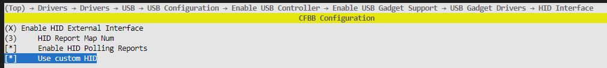
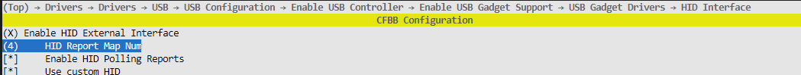

# 前言<a name="ZH-CN_TOPIC_0000001790806556"></a>

**概述<a name="section4537382116410"></a>**

本文档描述了BS2X USB HID复合设备的两种实现方式。

**读者对象<a name="section4378592816410"></a>**

本文档主要适用于以下工程师：

-   产品软件开发工程师
-   技术支持工程师

**符号约定<a name="section133020216410"></a>**

在本文中可能出现下列标志，它们所代表的含义如下。

<a name="table2622507016410"></a>
<table><thead align="left"><tr id="row1530720816410"><th class="cellrowborder" valign="top" width="20.580000000000002%" id="mcps1.1.3.1.1"><p id="p6450074116410"><a name="p6450074116410"></a><a name="p6450074116410"></a><strong id="b2136615816410"><a name="b2136615816410"></a><a name="b2136615816410"></a>符号</strong></p>
</th>
<th class="cellrowborder" valign="top" width="79.42%" id="mcps1.1.3.1.2"><p id="p5435366816410"><a name="p5435366816410"></a><a name="p5435366816410"></a><strong id="b5941558116410"><a name="b5941558116410"></a><a name="b5941558116410"></a>说明</strong></p>
</th>
</tr>
</thead>
<tbody><tr id="row1372280416410"><td class="cellrowborder" valign="top" width="20.580000000000002%" headers="mcps1.1.3.1.1 "><p id="p3734547016410"><a name="p3734547016410"></a><a name="p3734547016410"></a><a name="image2670064316410"></a><a name="image2670064316410"></a><span></span></p>
</td>
<td class="cellrowborder" valign="top" width="79.42%" headers="mcps1.1.3.1.2 "><p id="p1757432116410"><a name="p1757432116410"></a><a name="p1757432116410"></a>表示如不避免则将会导致死亡或严重伤害的具有高等级风险的危害。</p>
</td>
</tr>
<tr id="row466863216410"><td class="cellrowborder" valign="top" width="20.580000000000002%" headers="mcps1.1.3.1.1 "><p id="p1432579516410"><a name="p1432579516410"></a><a name="p1432579516410"></a><a name="image4895582316410"></a><a name="image4895582316410"></a><span></span></p>
</td>
<td class="cellrowborder" valign="top" width="79.42%" headers="mcps1.1.3.1.2 "><p id="p959197916410"><a name="p959197916410"></a><a name="p959197916410"></a>表示如不避免则可能导致死亡或严重伤害的具有中等级风险的危害。</p>
</td>
</tr>
<tr id="row123863216410"><td class="cellrowborder" valign="top" width="20.580000000000002%" headers="mcps1.1.3.1.1 "><p id="p1232579516410"><a name="p1232579516410"></a><a name="p1232579516410"></a><a name="image1235582316410"></a><a name="image1235582316410"></a><span></span></p>
</td>
<td class="cellrowborder" valign="top" width="79.42%" headers="mcps1.1.3.1.2 "><p id="p123197916410"><a name="p123197916410"></a><a name="p123197916410"></a>表示如不避免则可能导致轻微或中度伤害的具有低等级风险的危害。</p>
</td>
</tr>
<tr id="row5786682116410"><td class="cellrowborder" valign="top" width="20.580000000000002%" headers="mcps1.1.3.1.1 "><p id="p2204984716410"><a name="p2204984716410"></a><a name="p2204984716410"></a><a name="image4504446716410"></a><a name="image4504446716410"></a><span></span></p>
</td>
<td class="cellrowborder" valign="top" width="79.42%" headers="mcps1.1.3.1.2 "><p id="p4388861916410"><a name="p4388861916410"></a><a name="p4388861916410"></a>用于传递设备或环境安全警示信息。如不避免则可能会导致设备损坏、数据丢失、设备性能降低或其它不可预知的结果。</p>
<p id="p1238861916410"><a name="p1238861916410"></a><a name="p1238861916410"></a>“须知”不涉及人身伤害。</p>
</td>
</tr>
<tr id="row2856923116410"><td class="cellrowborder" valign="top" width="20.580000000000002%" headers="mcps1.1.3.1.1 "><p id="p5555360116410"><a name="p5555360116410"></a><a name="p5555360116410"></a><a name="image799324016410"></a><a name="image799324016410"></a><span></span></p>
</td>
<td class="cellrowborder" valign="top" width="79.42%" headers="mcps1.1.3.1.2 "><p id="p4612588116410"><a name="p4612588116410"></a><a name="p4612588116410"></a>对正文中重点信息的补充说明。</p>
<p id="p1232588116410"><a name="p1232588116410"></a><a name="p1232588116410"></a>“说明”不是安全警示信息，不涉及人身、设备及环境伤害信息。</p>
</td>
</tr>
</tbody>
</table>

**修改记录<a name="section2467512116410"></a>**

<a name="table1557726816410"></a>
<table><thead align="left"><tr id="row2942532716410"><th class="cellrowborder" valign="top" width="20.72%" id="mcps1.1.4.1.1"><p id="p3778275416410"><a name="p3778275416410"></a><a name="p3778275416410"></a><strong id="b5687322716410"><a name="b5687322716410"></a><a name="b5687322716410"></a>文档版本</strong></p>
</th>
<th class="cellrowborder" valign="top" width="26.119999999999997%" id="mcps1.1.4.1.2"><p id="p5627845516410"><a name="p5627845516410"></a><a name="p5627845516410"></a><strong id="b5800814916410"><a name="b5800814916410"></a><a name="b5800814916410"></a>发布日期</strong></p>
</th>
<th class="cellrowborder" valign="top" width="53.16%" id="mcps1.1.4.1.3"><p id="p2382284816410"><a name="p2382284816410"></a><a name="p2382284816410"></a><strong id="b3316380216410"><a name="b3316380216410"></a><a name="b3316380216410"></a>修改说明</strong></p>
</th>
</tr>
</thead>
<tbody><tr id="row10274135918428"><td class="cellrowborder" valign="top" width="20.72%" headers="mcps1.1.4.1.1 "><p id="p1927545916421"><a name="p1927545916421"></a><a name="p1927545916421"></a>02</p>
</td>
<td class="cellrowborder" valign="top" width="26.119999999999997%" headers="mcps1.1.4.1.2 "><p id="p1027511593426"><a name="p1027511593426"></a><a name="p1027511593426"></a>2024-08-20</p>
</td>
<td class="cellrowborder" valign="top" width="53.16%" headers="mcps1.1.4.1.3 "><p id="p152751559184218"><a name="p152751559184218"></a><a name="p152751559184218"></a>更新“<a href="实现方式.md">实现方式</a>”章节内容。</p>
</td>
</tr>
<tr id="row3664410125015"><td class="cellrowborder" valign="top" width="20.72%" headers="mcps1.1.4.1.1 "><p id="p0413131712"><a name="p0413131712"></a><a name="p0413131712"></a>01</p>
</td>
<td class="cellrowborder" valign="top" width="26.119999999999997%" headers="mcps1.1.4.1.2 "><p id="p184131311111"><a name="p184131311111"></a><a name="p184131311111"></a>2024-05-15</p>
</td>
<td class="cellrowborder" valign="top" width="53.16%" headers="mcps1.1.4.1.3 "><p id="p169114261115"><a name="p169114261115"></a><a name="p169114261115"></a>第一次正式版本发布。</p>
</td>
</tr>
<tr id="row5281780716410"><td class="cellrowborder" valign="top" width="20.72%" headers="mcps1.1.4.1.1 "><p id="p1896592512216"><a name="p1896592512216"></a><a name="p1896592512216"></a>00B01</p>
</td>
<td class="cellrowborder" valign="top" width="26.119999999999997%" headers="mcps1.1.4.1.2 "><p id="p996582514218"><a name="p996582514218"></a><a name="p996582514218"></a>2024-03-08</p>
</td>
<td class="cellrowborder" valign="top" width="53.16%" headers="mcps1.1.4.1.3 "><p id="p55262052201217"><a name="p55262052201217"></a><a name="p55262052201217"></a>第一次临时版本发布。</p>
</td>
</tr>
</tbody>
</table>

# 概述<a name="ZH-CN_TOPIC_0000001790966272"></a>

USB设备的功能是由接口来承载的，对应到代码即是接口描述符，一般一个接口就是一个功能，这个功能可能是鼠标、键盘、手柄等，也可能是自定义功能。HID复合设备是一类多功能设备，例如鼠标+键盘、手柄+键盘等。

# 实现方式<a name="ZH-CN_TOPIC_0000001837765697"></a>

添加任何类型的HID设备都需要调用接口hid\_add\_report\_descriptor。“hid\_add\_report\_descriptor”定义在“f\_hid.c”，其参数及功能如下：

<a name="table178mcpsimp"></a>
<table><thead align="left"><tr id="row183mcpsimp"><th class="cellrowborder" valign="top" width="29.23%" id="mcps1.1.3.1.1"><p id="p185mcpsimp"><a name="p185mcpsimp"></a><a name="p185mcpsimp"></a>参数</p>
</th>
<th class="cellrowborder" valign="top" width="70.77%" id="mcps1.1.3.1.2"><p id="p187mcpsimp"><a name="p187mcpsimp"></a><a name="p187mcpsimp"></a>说明</p>
</th>
</tr>
</thead>
<tbody><tr id="row188mcpsimp"><td class="cellrowborder" valign="top" width="29.23%" headers="mcps1.1.3.1.1 "><p id="p190mcpsimp"><a name="p190mcpsimp"></a><a name="p190mcpsimp"></a>report_desc</p>
</td>
<td class="cellrowborder" valign="top" width="70.77%" headers="mcps1.1.3.1.2 "><p id="p192mcpsimp"><a name="p192mcpsimp"></a><a name="p192mcpsimp"></a>报告描述符的首地址。</p>
</td>
</tr>
<tr id="row193mcpsimp"><td class="cellrowborder" valign="top" width="29.23%" headers="mcps1.1.3.1.1 "><p id="p195mcpsimp"><a name="p195mcpsimp"></a><a name="p195mcpsimp"></a>report_desc_len</p>
</td>
<td class="cellrowborder" valign="top" width="70.77%" headers="mcps1.1.3.1.2 "><p id="p197mcpsimp"><a name="p197mcpsimp"></a><a name="p197mcpsimp"></a>报告描述符的长度。</p>
</td>
</tr>
<tr id="row198mcpsimp"><td class="cellrowborder" valign="top" width="29.23%" headers="mcps1.1.3.1.1 "><p id="p200mcpsimp"><a name="p200mcpsimp"></a><a name="p200mcpsimp"></a>protocol</p>
</td>
<td class="cellrowborder" valign="top" width="70.77%" headers="mcps1.1.3.1.2 "><p id="p202mcpsimp"><a name="p202mcpsimp"></a><a name="p202mcpsimp"></a>报告描述符的协议类型（0=none, 1=keyboard, 2=mouse），其对应接口描述符的bInterfaceProtocol字段。</p>
</td>
</tr>
</tbody>
</table>

函数功能：添加报告描述符并和接口关联，会自动创建接口描述符、hid描述符和端点描述符。

函数返回值：设备功能对应的id号。


## 一个接口实现多个功能<a name="ZH-CN_TOPIC_0000001991265549"></a>

HID设备一个接口对应一个报告描述符，由报告描述符来描述接口的功能，而报告描述符可通过report\_id项来区分同一个报告描述符的不同功能。

报告描述符1如下：

```
// 键盘设备
usage_page(1),      0x01,
usage(1),           0x06,
collection(1),      0x01,
report_id(1),       0x01,
usage_page(1),      0x07,
usage_minimum(1),   0xE0,
usage_maximum(1),   0xE7,
logical_minimum(1), 0x00,
logical_maximum(1), 0x01,
report_size(1),     0x01,
report_count(1),    0x08,
input(1),           0x02,
report_count(1),    0x01,
report_size(1),     0x08,
input(1),           0x01,
report_count(1),    0x05,
report_size(1),     0x01,
usage_page(1),      0x08,
usage_minimum(1),   0x01,
usage_maximum(1),   0x05,
output(1),          0x02,
report_count(1),    0x01,
report_size(1),     0x03,
output(1),          0x01,
report_count(1),    0x06,
report_size(1),     0x08,
logical_minimum(1), 0x00,
logical_maximum(1), 0x65,
usage_page(1),      0x07,
usage_minimum(1),   0x00,
usage_maximum(1),   0x65,
input(1),           0x00,
end_collection(0),
// 自定义数据接收
usage_page(2), 0xB1, 0xFF,
usage(1),           0x1,
collection(1),      0x01,
report_id(1),       0x08,
collection(1),      0x00,
report_count(1),    0xc,
report_size(1),     0x8,
usage_minimum(1),   0x0,
usage_maximum(1),   0xFF,
output(1),           2,
end_collection(0),
end_collection(0),
// 自定义数据收发
usage_page(2), 0xB2, 0xFF,
usage(1),           0x1,
collection(1),      0x01,
report_id(1),       0x09,
collection(1),      0x00,
report_count(1),    0x3f,
report_size(1),     0x8,
usage_minimum(1),   0x0,
usage_maximum(1),   0xFF,
output(1),           2,
usage(1),           0x2,
report_count(1),    0x3f,
report_size(1),     0x8,
usage_minimum(1),   0x0,
usage_maximum(1),   0xFF,
input(1),           0,
end_collection(0),
end_collection(0),
```

上述报告描述符定义了一个键盘设备+自定义数据接收+自定义数据收发三个功能的复合设备，他们通过report\_id+数据的方式来区分功能，即只有一个功能的报告描述符，在发送数据时直接发送数据即可，拥有多个功能的报告描述符在发送数据时需要在数据的头部加上report\_id。

## 多个接口实现多个功能<a name="ZH-CN_TOPIC_0000001991145381"></a>

HID设备一个接口对应一个报告描述符，由报告描述符来描述接口的功能，那么多个接口多个报告描述符也可以实现复合设备功能，BS2X芯片除了端点0之外，一共有三个IN端点，三个OUT端点，因此最多支持三个接口。

多个接口多个报告描述符的示例如下。

报告描述符1如下：

```
usage_page(1),      0x01,
usage(1),         0x06,
collection(1),      0x01,
report_id(1),       0x01,
usage_page(1),      0x07,
usage_minimum(1),    0xE0,
usage_maximum(1),    0xE7,
logical_minimum(1),   0x00,
logical_maximum(1),   0x01,
report_size(1),     0x01,
report_count(1),    0x08,
input(1),         0x02,
report_count(1),    0x01,
report_size(1),     0x08,
input(1),         0x01,
report_count(1),    0x05,
report_size(1),     0x01,
usage_page(1),      0x08,
usage_minimum(1),    0x01,
usage_maximum(1),    0x05,
output(1),        0x02,
report_count(1),    0x01,
report_size(1),     0x03,
output(1),        0x01,
report_count(1),    0x06,
report_size(1),     0x08,
logical_minimum(1),   0x00,
logical_maximum(1),   0x65,
usage_page(1),      0x07,
usage_minimum(1),    0x00,
usage_maximum(1),    0x65,
input(1),         0x00,
end_collection(0),
// 自定义数据接收
usage_page(2),       0xB1, 0xFF,
usage(1),         0x1,
collection(1),      0x01,
report_id(1),       0x08,
collection(1),     0x00,
report_count(1),    0xc,
report_size(1),     0x8,
usage_minimum(1),    0x0,
usage_maximum(1),    0xFF,
output(1),         2,
end_collection(0),
end_collection(0),
// 自定义数据收发
usage_page(2),        0xB2, 0xFF,
usage(1),          0x1,
collection(1),      0x01,
report_id(1),       0x09,
collection(1),      0x00,
report_count(1),     0x3f,
report_size(1),      0x8,
usage_minimum(1),     0x0,
usage_maximum(1),     0xFF,
output(1),          2,
usage(1),          0x2,
report_count(1),     0x3f,
report_size(1),      0x8,
usage_minimum(1),     0x0,
usage_maximum(1),     0xFF,
input(1),           0,
end_collection(0),
end_collection(0),
```

上述报告描述符定义了一个键盘设备+自定义数据接收+自定义数据收发三个功能的复合设备，他们通过report\_id+数据的方式来区分功能，即只有一个功能的报告描述符，在发送数据时直接发送数据即可，拥有多个功能的报告描述符在发送数据时需要在数据的头部加上“report\_id”。此描述符可通过“hid\_add\_report\_descriptor”函数注册到接口0。

报告描述符2如下：

```
usage_page(1),      0x01,
usage(1),          0x02,
collection(1),      0x01,
usage(1),          0x01,
report_count(1),     0x03,
report_size(1),      0x01,
usage_page(1),      0x09,
usage_minimum(1),     0x1,
usage_maximum(1),     0x3,
logical_minimum(1),    0x00,
logical_maximum(1),    0x01,
input(1),          0x02,
report_count(1),     0x01,
report_size(1),      0x05,
input(1),          0x01,
usage_page(1),      0x01,
usage(1),          0x38,
report_count(1),     0x01,
report_size(1),      0x08,
logical_minimum(1),    0x81,
logical_maximum(1),    0x7f,
input(1),          0x06,
usage(1),          0x30,
usage(1),          0x31,
report_count(1),     0x02,
report_size(1),      0x10,
logical_minimum(2),   0x01, 0x80,
logical_maximum(2),   0xff, 0x7f,
input(1),          0x06,
end_collection(0)
```

此描述符描述了鼠标功能。通过再一次调用“hid\_add\_report\_descriptor”函数可将此描述符注册到接口1，会自动创建接口描述符、hid描述符和端点描述符，不需要改“f\_hid.c”。

此时已实现两个接口的复合设备，其中接口0实现的是键盘设备+自定义数据接收+自定义数据收发三个功能，接口1实现的是鼠标功能。示例代码可查看“application/samples/products/usb\_mouse/mouse\_usb/usb\_init\_app.c”。

如果需要更深程度的自定义，比如需要添加out端点/需要添加空的interface，需要在kconfig里开启HID Custom（如下图示）：



开启后会编译f\_hid\_custom.c而不是f\_hid.c, 此时需要自行修改f\_hid\_custom.c里的f\_hid\_desc\_array数组来自定义config描述符\(只需要改config描述符，端点初始化之类的操作都会自动完成\)。注意: 自定义了几个interface就应该调用几次hid\_add\_report\_descriptor函数，如果是空的interface，可以调用hid\_add\_report\_descriptor并传入NULL。

例：实现4个interface，第一个interface使用1个in端点，第二个interface是个空interface，后两个interface都用2个端点，1in 1out。

若要实现4个interface需要在Kconfig更改最大报告描述符数量为4，并使能custom HID 如下图示，



然后修改配置描述符如下，4个interface需要在应用层调用4次hid\_add\_report\_descriptor来将报告描述符注册到对应的interface上，第二个是空interface，故在第二次调用hid\_add\_report\_descriptor时传入NULL即可，其他三次则需要传入对应功能的报告描述符。

```
static struct usb_cfgdesc_s g_fhid_config_desc =
{
    .len         = sizeof(struct usb_cfgdesc_s),
    .type        = USB_DESC_TYPE_CONFIG,
    HSETW(.totallen, 0), /* Size of all descriptors, set later */
    .ninterfaces = 0x1,  /* Number of Interfaces */
    .cfgvalue    = 0x1,  /* ID of this configuration */
    .icfg        = 0x0,  /* Index of string descriptor */
    .attr        = 0xa0, /* Bus-powered and remote wakeup */
    .mxpower     = 0x32  /* Maximum power consumption from the bus */
};
static struct usb_ifdesc_s g_fhid_intf_desc =
{
    .len      = sizeof(struct usb_ifdesc_s),
    .type     = USB_DESC_TYPE_INTERFACE,
    .ifno     = 0,    /* Index number of this interface */
    .alt      = 0,    /* Index of this settings */
    .neps     = 1,    /* Number of endpoint */
    .classid  = 0x03, /* bInterfaceClass: HID */
    .subclass = 1,    /* bInterfaceSubClass : 1=BOOT, 0=no boot */
    .protocol = 0,    /* bInterfaceProtocol : 0=none, 1=keyboard, 2=mouse */
    .iif      = 0     /* Index of string descriptor */
};
static struct usb_hid_desc g_fhid_desc =
{
    .bLength          = sizeof(struct usb_hid_desc),
    .bDescriptorType  = USB_DESC_TYPE_HID, /* HID type is 0x21 */
    HSETW(.bcdHID, 0x0110),                /* bcdHID: HID Class Spec release number HID 1.1 */
    .bCountryCode     = 0x00,              /* bCountryCode: Hardware target country */
    .bNumDescriptors  = 0x01,              /* bNumDescriptors: Number of HID class descriptors to follow */
    {
        {
            .bDescriptorType = 0x22,       /* bDescriptorType */
        }
    }
};
static struct usb_epdesc_s g_fhid_in_ep_desc =
{
    .len      = sizeof(struct usb_epdesc_s),
    .type     = USB_DESC_TYPE_ENDPOINT,
    .addr     = USB_DIR_IN | 0x01,
    .attr     = 0x03,                       /* bmAttributes = 00000011b */
    HSETW(.mxpacketsize, HID_IN_DATA_SIZE), /* wMaxPacketSize = 64 */
    .interval = 1                           /* bInterval = 125us */
};
static struct usb_ifdesc_s g_fhid_intf_desc_null =
{
    .len      = sizeof(struct usb_ifdesc_s),
    .type     = USB_DESC_TYPE_INTERFACE,
    .ifno     = 0,    /* Index number of this interface */
    .alt      = 0,    /* Index of this settings */
    .neps     = 0,    /* Number of endpoint */
    .classid  = 0,    /* bInterfaceClass: HID */
    .subclass = 0,    /* bInterfaceSubClass : 1=BOOT, 0=no boot */
    .protocol = 0,    /* bInterfaceProtocol : 0=none, 1=keyboard, 2=mouse */
    .iif      = 0     /* Index of string descriptor */
};
static struct usb_ifdesc_s g_fhid_intf2_desc =
{
    .len      = sizeof(struct usb_ifdesc_s),
    .type     = USB_DESC_TYPE_INTERFACE,
    .ifno     = 0,    /* Index number of this interface */
    .alt      = 0,    /* Index of this settings */
    .neps     = 2,    /* Number of endpoint */
    .classid  = 0x03, /* bInterfaceClass: HID */
    .subclass = 1,    /* bInterfaceSubClass : 1=BOOT, 0=no boot */
    .protocol = 0,    /* bInterfaceProtocol : 0=none, 1=keyboard, 2=mouse */
    .iif      = 0     /* Index of string descriptor */
};
static struct usb_hid_desc g_fhid2_desc =
{
    .bLength          = sizeof(struct usb_hid_desc),
    .bDescriptorType  = USB_DESC_TYPE_HID, /* HID type is 0x21 */
    HSETW(.bcdHID, 0x0110),                /* bcdHID: HID Class Spec release number HID 1.1 */
    .bCountryCode     = 0x00,              /* bCountryCode: Hardware target country */
    .bNumDescriptors  = 0x01,              /* bNumDescriptors: Number of HID class descriptors to follow */
    {
        {
            .bDescriptorType = 0x22,       /* bDescriptorType */
        }
    }
};
static struct usb_epdesc_s g_fhid_in_ep2_desc =
{
    .len      = sizeof(struct usb_epdesc_s),
    .type     = USB_DESC_TYPE_ENDPOINT,
    .addr     = USB_DIR_IN | 0x02,
    .attr     = 0x03,                       /* bmAttributes = 00000011b */
    HSETW(.mxpacketsize, HID_IN_DATA_SIZE), /* wMaxPacketSize = 64 */
    .interval = 1                           /* bInterval = 125us */
};
static struct usb_epdesc_s g_fhid_out_ep_desc =
{
    .len      = sizeof(struct usb_epdesc_s),
    .type     = USB_DESC_TYPE_ENDPOINT,
    .addr     = USB_DIR_OUT | 0x01,
    .attr     = 0x03,                        /* bmAttributes = 00000011b */
    HSETW(.mxpacketsize, HID_OUT_DATA_SIZE), /* wMaxPacketSize */
    .interval = 1                            /* bInterval = 125us */
};
static struct usb_ifdesc_s g_fhid_intf3_desc =
{
    .len      = sizeof(struct usb_ifdesc_s),
    .type     = USB_DESC_TYPE_INTERFACE,
    .ifno     = 0,    /* Index number of this interface */
    .alt      = 0,    /* Index of this settings */
    .neps     = 2,    /* Number of endpoint */
    .classid  = 0x03, /* bInterfaceClass: HID */
    .subclass = 1,    /* bInterfaceSubClass : 1=BOOT, 0=no boot */
    .protocol = 0,    /* bInterfaceProtocol : 0=none, 1=keyboard, 2=mouse */
    .iif      = 0     /* Index of string descriptor */
};
static struct usb_hid_desc g_fhid3_desc =
{
    .bLength          = sizeof(struct usb_hid_desc),
    .bDescriptorType  = USB_DESC_TYPE_HID, /* HID type is 0x21 */
    HSETW(.bcdHID, 0x0110),                /* bcdHID: HID Class Spec release number HID 1.1 */
    .bCountryCode     = 0x00,              /* bCountryCode: Hardware target country */
    .bNumDescriptors  = 0x01,              /* bNumDescriptors: Number of HID class descriptors to follow */
    {
        {
            .bDescriptorType = 0x22,       /* bDescriptorType */
        }
    }
};
static struct usb_epdesc_s g_fhid_in_ep3_desc =
{
    .len      = sizeof(struct usb_epdesc_s),
    .type     = USB_DESC_TYPE_ENDPOINT,
    .addr     = USB_DIR_IN | 0x03,
    .attr     = 0x03,                       /* bmAttributes = 00000011b */
    HSETW(.mxpacketsize, HID_IN_DATA_SIZE), /* wMaxPacketSize = 64 */
    .interval = 1                           /* bInterval = 125us */
};
static struct usb_epdesc_s g_fhid_out_ep2_desc =
{
    .len      = sizeof(struct usb_epdesc_s),
    .type     = USB_DESC_TYPE_ENDPOINT,
    .addr     = USB_DIR_OUT | 0x02,
    .attr     = 0x03,                        /* bmAttributes = 00000011b */
    HSETW(.mxpacketsize, HID_OUT_DATA_SIZE), /* wMaxPacketSize */
    .interval = 1                            /* bInterval = 125us */
};
/* fhid desc array includes:
 * 1. config_desc (for all report map)
 * 2. iface_desc、hid_desc、in ep_desc (report map 0)
 * 3. iface_desc、hid_desc、in ep_desc (report map 1)
 * ...
 * n+1. iface_desc、hid_desc、in ep_desc (report map n-1)
 *
 * g_fhid_desc_array is like this:
 *
 * config_desc  iface_desc(0)  hid_desc(0)  ep_desc(0) [ep_desc(0)]  iface_desc(1)  hid_desc(1)  ep_desc(1) [ep_desc(1)].. NULL
 *                  |                                     |              |                                     |
 *                  |_ _ _ _ _ _ report map 0 _ _ _ _ _ _ |              |_ _ _ _ _ _ report map 1 _ _ _ _ _ _ |
 *
 * Total Length : 2 + (4) * n
 */
#define HID_SINGLE_PROTOCOL_DESC_NUM 4
#define HID_DESC_ARRAY_MAX_NUM (1 + (HID_SINGLE_PROTOCOL_DESC_NUM) * HID_REPORT_MAP_NUM)
static const uint8_t *g_fhid_desc_array[HID_DESC_ARRAY_MAX_NUM] =
{
    (const uint8_t *)&g_fhid_config_desc,
    (const uint8_t *)&g_fhid_intf_desc,
    (const uint8_t *)&g_fhid_desc,
    (const uint8_t *)&g_fhid_in_ep_desc,
    (const uint8_t *)&g_fhid_intf_desc_null,
    (const uint8_t *)&g_fhid_intf2_desc,
    (const uint8_t *)&g_fhid2_desc,
    (const uint8_t *)&g_fhid_in_ep2_desc,
    (const uint8_t *)&g_fhid_out_ep_desc,
    (const uint8_t *)&g_fhid_intf3_desc,
    (const uint8_t *)&g_fhid3_desc,
    (const uint8_t *)&g_fhid_in_ep3_desc,
    (const uint8_t *)&g_fhid_out_ep2_desc,
    NULL,
};
```

## 实现虚拟串口功能<a name="ZH-CN_TOPIC_0000001991139601"></a>

虚拟串口设备类型是DEV\_SERIAL，但通常情况下，我们使用的是HID+ACM的符合设备，即类型DEV\_SER\_HID。因为ACM设备并非HID设备，所以报告描述符并不需要进行修改，可以使用2.1和2.2中的报告描述符传入

hid\_add\_report\_descriptor，再调用usbd\_set\_device\_info\(DEV\_SER\_HID, &str\_manufacturer, &str\_product, &str\_serial\_number, dev\_id\)和usb\_init\(DEVICE, DEV\_SER\_HID\)即可枚举HID设备和ACM串口。

ACM串口需要新建一个线程进行数据接收，若单板端写数据发送到USB主机，则直接调用write接口；若单板端读取从USB主机发来的数据，open串口后先调用ioctl接口，然后再调用read接口，ioctl用法如下：

usb\_serial\_ioctl\(0, CONSOLE\_CMD\_RD\_BLOCK\_SERIAL, 1\);

创建一个大小4096字节的buffer来存储读取的值（虚拟串口最大支持读写4096字节数据）

usb\_serial\_read\(0, g\_usb\_serial\_recv\_data, SERIAL\_RECV\_DATA\_MAX\_LEN\);usb\_serial\_read的返回值是读取到的数据长度。

usb\_serial\_write\(0, g\_usb\_serial\_recv\_data, recv\_len\);

示例代码可查看“application/samples/products/sle\_dongle/sle\_dongle\_hid\_serial.c”。

## 实现升级功能\(DFU\)<a name="ZH-CN_TOPIC_0000001968134540"></a>

DFU功能依赖于Burntool工具，建议下载和使用尽可能新版本的Burntool。

Burntool工具可以对Usage Page设置为0xFFB1的设备进行DFU升级，如下文描述符：

```
usage_page(2),      0xB1, 0xFF,
usage(1),        0x1,
collection(1),     0x01,
report_id(1),      0x08,
collection(1),     0x00,
report_count(1),    0xc,
report_size(1),    0x8,
usage_minimum(1),   0x0,
usage_maximum(1),   0xFF,
output(1),        2,
end_collection(0),
end_collection(0),
```

在hid接收数据的线程中添加处理Burntool发送的升级消息的分支，当有升级包通过Burntool发送时，Burntool会下发frame\_type为0x1e的消息：

```
if (command.frame_type == 0x1e) {
    osal_printk("start dfu\n");
    usb_deinit();
    osal_msleep(USB_DEINIT_DELAY);
    usb_dfu_init();
    usb_dfu_wait_ugrade_done_and_reset();
    break;
 }
```

middleware/utils/usb\_class/f\_dfu.c中定义了名为usb\_dfu\_download\_callback的弱函数，在开始升级时会调用该函数，需要用户自己将该函数实现以完成升级流程，具体实现可参考“application/samples/products/sle\_dongle/sle\_dongle\_hid\_serial.c”。

## 实现音频数据接口\(UAC\)<a name="ZH-CN_TOPIC_0000001968294344"></a>

音频数据接口设备类型是DEV\_UAC，初始化完成后需要调用uac\_wait\_host接口等待主机发送识别到UAC设备的信号，通常入参传入1表示WAIT\_HOST\_FOREVER，即在声音设置-\>输入中选择该设备，才能完成UAC的初始化。UAC1.0最高支持双声道192Khz 16b的音源，而LiteOS提供的UAC驱动为16Khz 16b，将想要发送的16bit音频数据填充到buffer中，使用vdt\_usb\_uac\_send\_data\(buffer, buffer\_len\)接口发送，具体实现可参考“application/samples/products/usb\_amic\_vdt/vdt\_usb/vdt\_usb.c”。

