# 前言<a name="ZH-CN_TOPIC_0000001803362588"></a>

**概述<a name="section4537382116410"></a>**

本文档详细的描述了BS2XV100升级流程以及相关工具的操作指导，同时提供了常见的问题解答及故障处理方法。

BS2X系列包含BS21/BS21E/BS22/BS26，本文档以BS21为例。

**产品版本<a name="section673mcpsimp"></a>**

与本文档对应的产品版本如下。

<a name="table676mcpsimp"></a>
<table><thead align="left"><tr id="row681mcpsimp"><th class="cellrowborder" valign="top" width="50%" id="mcps1.1.3.1.1"><p id="p683mcpsimp"><a name="p683mcpsimp"></a><a name="p683mcpsimp"></a><strong id="b684mcpsimp"><a name="b684mcpsimp"></a><a name="b684mcpsimp"></a>产品名称</strong></p>
</th>
<th class="cellrowborder" valign="top" width="50%" id="mcps1.1.3.1.2"><p id="p686mcpsimp"><a name="p686mcpsimp"></a><a name="p686mcpsimp"></a><strong id="b687mcpsimp"><a name="b687mcpsimp"></a><a name="b687mcpsimp"></a>产品版本</strong></p>
</th>
</tr>
</thead>
<tbody><tr id="row689mcpsimp"><td class="cellrowborder" valign="top" width="50%" headers="mcps1.1.3.1.1 "><p id="p691mcpsimp"><a name="p691mcpsimp"></a><a name="p691mcpsimp"></a>BS2X</p>
</td>
<td class="cellrowborder" valign="top" width="50%" headers="mcps1.1.3.1.2 "><p id="p693mcpsimp"><a name="p693mcpsimp"></a><a name="p693mcpsimp"></a>V100</p>
</td>
</tr>
</tbody>
</table>

**读者对象<a name="section694mcpsimp"></a>**

本文档主要适用以下工程师：

-   技术支持工程
-   软件开发工程师

**符号约定<a name="section133020216410"></a>**

在本文中可能出现下列标志，它们所代表的含义如下。

<a name="table2622507016410"></a>
<table><thead align="left"><tr id="row1530720816410"><th class="cellrowborder" valign="top" width="20.580000000000002%" id="mcps1.1.3.1.1"><p id="p6450074116410"><a name="p6450074116410"></a><a name="p6450074116410"></a><strong id="b2136615816410"><a name="b2136615816410"></a><a name="b2136615816410"></a>符号</strong></p>
</th>
<th class="cellrowborder" valign="top" width="79.42%" id="mcps1.1.3.1.2"><p id="p5435366816410"><a name="p5435366816410"></a><a name="p5435366816410"></a><strong id="b5941558116410"><a name="b5941558116410"></a><a name="b5941558116410"></a>说明</strong></p>
</th>
</tr>
</thead>
<tbody><tr id="row1372280416410"><td class="cellrowborder" valign="top" width="20.580000000000002%" headers="mcps1.1.3.1.1 "><p id="p3734547016410"><a name="p3734547016410"></a><a name="p3734547016410"></a><a name="image2670064316410"></a><a name="image2670064316410"></a><span></span></p>
</td>
<td class="cellrowborder" valign="top" width="79.42%" headers="mcps1.1.3.1.2 "><p id="p1757432116410"><a name="p1757432116410"></a><a name="p1757432116410"></a>表示如不避免则将会导致死亡或严重伤害的具有高等级风险的危害。</p>
</td>
</tr>
<tr id="row466863216410"><td class="cellrowborder" valign="top" width="20.580000000000002%" headers="mcps1.1.3.1.1 "><p id="p1432579516410"><a name="p1432579516410"></a><a name="p1432579516410"></a><a name="image4895582316410"></a><a name="image4895582316410"></a><span></span></p>
</td>
<td class="cellrowborder" valign="top" width="79.42%" headers="mcps1.1.3.1.2 "><p id="p959197916410"><a name="p959197916410"></a><a name="p959197916410"></a>表示如不避免则可能导致死亡或严重伤害的具有中等级风险的危害。</p>
</td>
</tr>
<tr id="row123863216410"><td class="cellrowborder" valign="top" width="20.580000000000002%" headers="mcps1.1.3.1.1 "><p id="p1232579516410"><a name="p1232579516410"></a><a name="p1232579516410"></a><a name="image1235582316410"></a><a name="image1235582316410"></a><span></span></p>
</td>
<td class="cellrowborder" valign="top" width="79.42%" headers="mcps1.1.3.1.2 "><p id="p123197916410"><a name="p123197916410"></a><a name="p123197916410"></a>表示如不避免则可能导致轻微或中度伤害的具有低等级风险的危害。</p>
</td>
</tr>
<tr id="row5786682116410"><td class="cellrowborder" valign="top" width="20.580000000000002%" headers="mcps1.1.3.1.1 "><p id="p2204984716410"><a name="p2204984716410"></a><a name="p2204984716410"></a><a name="image4504446716410"></a><a name="image4504446716410"></a><span></span></p>
</td>
<td class="cellrowborder" valign="top" width="79.42%" headers="mcps1.1.3.1.2 "><p id="p4388861916410"><a name="p4388861916410"></a><a name="p4388861916410"></a>用于传递设备或环境安全警示信息。如不避免则可能会导致设备损坏、数据丢失、设备性能降低或其它不可预知的结果。</p>
<p id="p1238861916410"><a name="p1238861916410"></a><a name="p1238861916410"></a>“须知”不涉及人身伤害。</p>
</td>
</tr>
<tr id="row2856923116410"><td class="cellrowborder" valign="top" width="20.580000000000002%" headers="mcps1.1.3.1.1 "><p id="p5555360116410"><a name="p5555360116410"></a><a name="p5555360116410"></a><a name="image799324016410"></a><a name="image799324016410"></a><span></span></p>
</td>
<td class="cellrowborder" valign="top" width="79.42%" headers="mcps1.1.3.1.2 "><p id="p4612588116410"><a name="p4612588116410"></a><a name="p4612588116410"></a>对正文中重点信息的补充说明。</p>
<p id="p1232588116410"><a name="p1232588116410"></a><a name="p1232588116410"></a>“说明”不是安全警示信息，不涉及人身、设备及环境伤害信息。</p>
</td>
</tr>
</tbody>
</table>

**修改记录<a name="section2467512116410"></a>**

<a name="table1557726816410"></a>
<table><thead align="left"><tr id="row2942532716410"><th class="cellrowborder" valign="top" width="20.72%" id="mcps1.1.4.1.1"><p id="p3778275416410"><a name="p3778275416410"></a><a name="p3778275416410"></a><strong id="b5687322716410"><a name="b5687322716410"></a><a name="b5687322716410"></a>文档版本</strong></p>
</th>
<th class="cellrowborder" valign="top" width="26.119999999999997%" id="mcps1.1.4.1.2"><p id="p5627845516410"><a name="p5627845516410"></a><a name="p5627845516410"></a><strong id="b5800814916410"><a name="b5800814916410"></a><a name="b5800814916410"></a>发布日期</strong></p>
</th>
<th class="cellrowborder" valign="top" width="53.16%" id="mcps1.1.4.1.3"><p id="p2382284816410"><a name="p2382284816410"></a><a name="p2382284816410"></a><strong id="b3316380216410"><a name="b3316380216410"></a><a name="b3316380216410"></a>修改说明</strong></p>
</th>
</tr>
</thead>
<tbody><tr id="row83031033182413"><td class="cellrowborder" valign="top" width="20.72%" headers="mcps1.1.4.1.1 "><p id="p6303103312418"><a name="p6303103312418"></a><a name="p6303103312418"></a><span id="ph28239364245"><a name="ph28239364245"></a><a name="ph28239364245"></a>05</span></p>
</td>
<td class="cellrowborder" valign="top" width="26.119999999999997%" headers="mcps1.1.4.1.2 "><p id="p10303173312245"><a name="p10303173312245"></a><a name="p10303173312245"></a><span id="ph10521133911241"><a name="ph10521133911241"></a><a name="ph10521133911241"></a>2025-03-26</span></p>
</td>
<td class="cellrowborder" valign="top" width="53.16%" headers="mcps1.1.4.1.3 "><p id="p1216195014242"><a name="p1216195014242"></a><a name="p1216195014242"></a>更新“<a href="BLE传输.md">BLE传输</a>”章节内容。</p>
</td>
</tr>
<tr id="row1026716361689"><td class="cellrowborder" valign="top" width="20.72%" headers="mcps1.1.4.1.1 "><p id="p92682361089"><a name="p92682361089"></a><a name="p92682361089"></a>04</p>
</td>
<td class="cellrowborder" valign="top" width="26.119999999999997%" headers="mcps1.1.4.1.2 "><p id="p926817365819"><a name="p926817365819"></a><a name="p926817365819"></a>2025-01-14</p>
</td>
<td class="cellrowborder" valign="top" width="53.16%" headers="mcps1.1.4.1.3 "><p id="p644127151415"><a name="p644127151415"></a><a name="p644127151415"></a>文档名称由《BS2XV100 星闪&amp;BLE OTA升级方案 指导书》更改为《BS2XV100 升级方案 使用指南》</p>
<a name="ul6546340101010"></a><a name="ul6546340101010"></a><ul id="ul6546340101010"><li>更新“<a href="升级包制作.md">升级包制作</a>”章节内容。</li><li>更新“<a href="星闪传输.md">星闪传输</a>”章节内容。</li><li>新增“<a href="HID升级.md">HID升级</a>”、“<a href="上位机控制HID升级.md">上位机控制HID升级</a>”章节内容。</li></ul>
</td>
</tr>
<tr id="row19550991909"><td class="cellrowborder" valign="top" width="20.72%" headers="mcps1.1.4.1.1 "><p id="p15551991606"><a name="p15551991606"></a><a name="p15551991606"></a>03</p>
</td>
<td class="cellrowborder" valign="top" width="26.119999999999997%" headers="mcps1.1.4.1.2 "><p id="p25511991208"><a name="p25511991208"></a><a name="p25511991208"></a>2024-08-29</p>
</td>
<td class="cellrowborder" valign="top" width="53.16%" headers="mcps1.1.4.1.3 "><a name="ul1390015421011"></a><a name="ul1390015421011"></a><ul id="ul1390015421011"><li>更新“<a href="DFU升级.md">DFU升级</a>”章节内容。</li><li>更新“<a href="FAQ.md">FAQ</a>”章节内容。</li></ul>
</td>
</tr>
<tr id="row315182111915"><td class="cellrowborder" valign="top" width="20.72%" headers="mcps1.1.4.1.1 "><p id="p41511121191"><a name="p41511121191"></a><a name="p41511121191"></a>02</p>
</td>
<td class="cellrowborder" valign="top" width="26.119999999999997%" headers="mcps1.1.4.1.2 "><p id="p1615192131915"><a name="p1615192131915"></a><a name="p1615192131915"></a>2024-07-04</p>
</td>
<td class="cellrowborder" valign="top" width="53.16%" headers="mcps1.1.4.1.3 "><a name="ul2231844152410"></a><a name="ul2231844152410"></a><ul id="ul2231844152410"><li>更新“<a href="升级包制作.md">升级包制作</a>”章节内容。</li><li>更新“<a href="星闪传输.md">星闪传输</a>”和“<a href="星闪Dongle传输.md">星闪Dongle传输</a>”章节内容。</li><li>更新“<a href="Flash分区.md">Flash分区</a>”章节内容。</li><li>更新“<a href="FAQ.md">FAQ</a>”章节内容。</li></ul>
</td>
</tr>
<tr id="row295671719278"><td class="cellrowborder" valign="top" width="20.72%" headers="mcps1.1.4.1.1 "><p id="p0413131712"><a name="p0413131712"></a><a name="p0413131712"></a>01</p>
</td>
<td class="cellrowborder" valign="top" width="26.119999999999997%" headers="mcps1.1.4.1.2 "><p id="p184131311111"><a name="p184131311111"></a><a name="p184131311111"></a>2024-05-24</p>
</td>
<td class="cellrowborder" valign="top" width="53.16%" headers="mcps1.1.4.1.3 "><p id="p169114261115"><a name="p169114261115"></a><a name="p169114261115"></a>第一次正式版本发布。</p>
<p id="p10740111417401"><a name="p10740111417401"></a><a name="p10740111417401"></a>更新“<a href="升级包传输.md">升级包传输</a>”章节内容。</p>
</td>
</tr>
<tr id="row5947359616410"><td class="cellrowborder" valign="top" width="20.72%" headers="mcps1.1.4.1.1 "><p id="p2149706016410"><a name="p2149706016410"></a><a name="p2149706016410"></a>00B01</p>
</td>
<td class="cellrowborder" valign="top" width="26.119999999999997%" headers="mcps1.1.4.1.2 "><p id="p648803616410"><a name="p648803616410"></a><a name="p648803616410"></a>2024-02-28</p>
</td>
<td class="cellrowborder" valign="top" width="53.16%" headers="mcps1.1.4.1.3 "><p id="p1946537916410"><a name="p1946537916410"></a><a name="p1946537916410"></a>第一次临时版本发布。</p>
</td>
</tr>
</tbody>
</table>

# 概述<a name="ZH-CN_TOPIC_0000001802979890"></a>


## 功能描述<a name="ZH-CN_TOPIC_0000001805091786"></a>

固件升级功能可用于对单板芯片的固件进行更新。

BS2X的固件包含分区表、二级引导程序（Flashboot）、用户固件镜像（Application）、NV镜像，支持二级引导程序、用户固件镜像，目前升级方式包括全镜像升级、压缩升级。

-   全镜像升级：新的固件镜像不做处理，直接打包到固件升级包（以下简称为“升级包”）中，在单板上直接将其更新至目标位置。
-   压缩升级：新的固件镜像经过压缩处理后，打包到升级包中，首先在设备上解压恢复，再更新至目标位置。

## 固件升级流程<a name="ZH-CN_TOPIC_0000001805252022"></a>

从端到端来看，整个芯片固件的升级操作包括以下过程。如[图1](#fig16865101514911)所示。

-   升级包制作：固件开发完成后，根据实际情况，将要升级的固件镜像打包生成固件升级包文件的过程。
-   升级包传输：将升级包传输到单板上。根据实际情况，可能有多种传输方式，如BLE、星闪、串口、USB等。
-   升级包保存：将传输到单板的固件升级包保存至本地存储器。在BS2X中，固件升级包存储在Flash中。
-   升级包本地校验：升级程序替换前，在单板上校验升级包的完整性和合法性。
-   升级包本地升级：在单板上将新的固件更新至目标位置。在BS2X中，Flashboot程序负责升级Flashboot自身以及APP镜像。

**图 1**  固件升级流程图<a name="fig16865101514911"></a>  
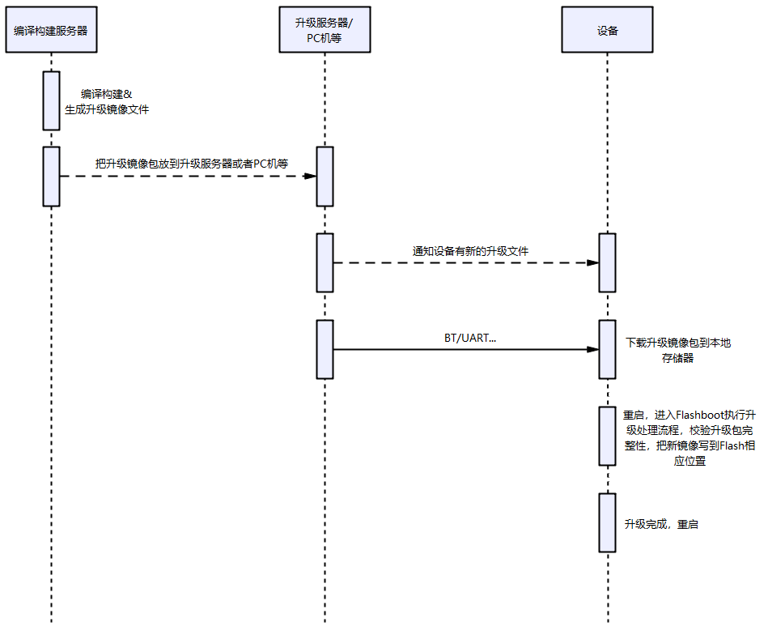

# 升级包制作<a name="ZH-CN_TOPIC_0000001851901485"></a>


## 流程原理<a name="ZH-CN_TOPIC_0000001805112244"></a>

**图 1**  升级包制作流程<a name="fig47601738135110"></a>  
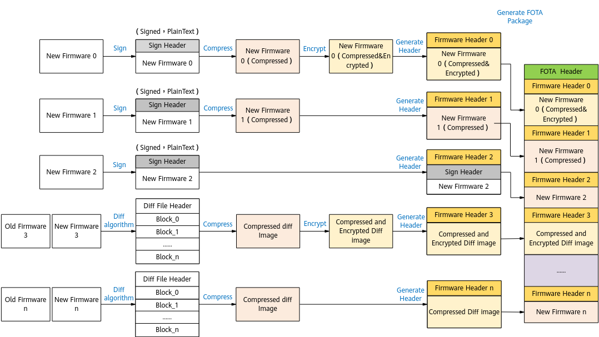

升级包的制作流程示意图如[图1](#fig47601738135110)所示，具体操作步骤如下：

1.  <a name="li8171529465"></a>编译生成带签名的明文新镜像。
2.  <a name="li205945352468"></a>对新镜像进行处理。处理方式包含场景如下：
    -   将新镜像压缩，生成压缩的新镜像。
    -   新镜像不做处理。

3.  <a name="li25431424820"></a>对[步骤2](#li205945352468)中生成的镜像添加升级镜像头。
4.  对所有需要升级的镜像根据所选择的不同处理方式执行[步骤1](#li8171529465)～[步骤3](#li25431424820)。
5.  <a name="li783094165412"></a>将生成的所有带升级镜像头的升级镜像文件合并到最终升级包中，并对整包添加升级包头，进行数字签名。

> **说明：** 
>BS2X不支持安全升级，[步骤5](#li783094165412)中不添加数字签名。

## 升级包格式<a name="ZH-CN_TOPIC_0000001940964372"></a>

升级包格式如[图1](#fig9148219135615)所示，主要分为升级秘钥区、升级信息区、镜像表头区、镜像区，各区保持16字节对齐。相应的结构体见include/middleware/utils/upg.h。

**图 1**  升级包结构图<a name="fig9148219135615"></a>  
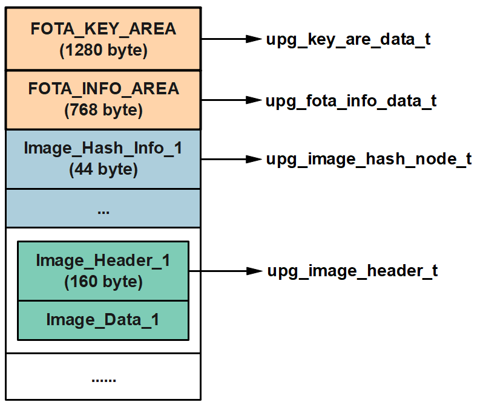

## 开发流程<a name="ZH-CN_TOPIC_0000001805272080"></a>

升级包可以在所有镜像编译完成后，通过执行“build/config/target\_config/bs21/build\_bs21\_update.py”来制作，在“build\_bs21\_update.py”文件中配置各个镜像的路径以及其他脚本所需的参数，并调用升级包制作脚本“build/script/build\_upg\_pkg.py”。“build\_bs21\_update.py”配置的各个路径可以根据实际路径修改。脚本及配置文件说明如下：

-   BS2X在编译生成新固件时，会自动将生成固件打包成升级包，用户只需选择需要升级的固件。配置升级固件的文件路径：build/config/target\_config/bs21/config.py。如[图1](#fig77657269522)所示，在upg\_pkg选项中选择需要升级的固件，支持升级的固件：flashboot，application。

    **图 1**  升级包添加升级镜像<a name="fig77657269522"></a>  
    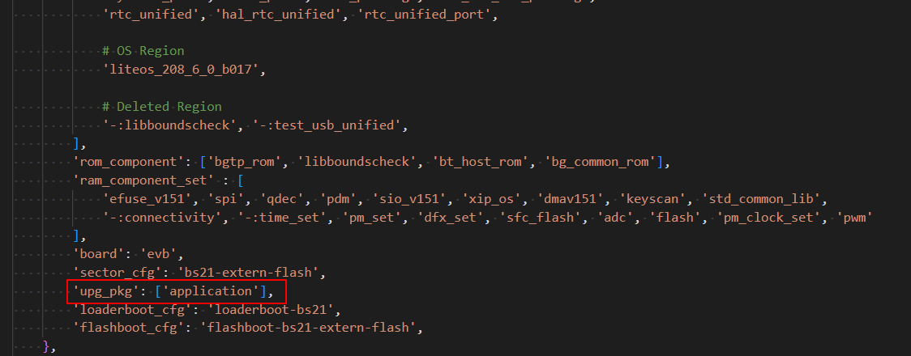

-   升级包路径：output/bs21/acore/bs21-sle-ble-central-peripheral/fota.fwpkg。
-   升级包制作脚本为：build/script/build\_upg\_pkg.py，升级包制作脚本的调用参数说明如[表1](#table2035291410209)所示。
-   配置文件为：build/config/target\_config/bs21/fota/1M\_flash/fota.cfg（外置flash版本为build/config/target\_config/bs21/fota/extern\_flash/fota.cfg），配置文件的各个字段说明如[表2](#table4436131111208)所示。
-   配置文件“fota.cfg”中可配置升级镜像模式，如[表2](#table4436131111208)中的升级镜像模式标记DecompressFlag所示，支持两种升级模式压缩、全量。
-   生成fota包时，会根据芯片类型及用户配置的特征码插入版本特征码，升级时将进行一致性检查。特性宏配置如下图所示。若一致性检查失败，则停止升级并删除当前存储的升级包。

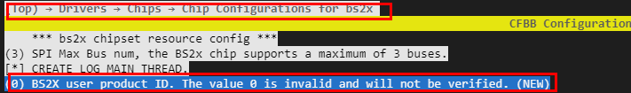

**表 1**  build\_upg\_pkg.py参数说明

<a name="table2035291410209"></a>
<table><thead align="left"><tr id="row143529145203"><th class="cellrowborder" valign="top" width="17.150000000000002%" id="mcps1.2.4.1.1"><p id="p735211142205"><a name="p735211142205"></a><a name="p735211142205"></a>参数</p>
</th>
<th class="cellrowborder" valign="top" width="18.310000000000002%" id="mcps1.2.4.1.2"><p id="p53521142204"><a name="p53521142204"></a><a name="p53521142204"></a>参数值</p>
</th>
<th class="cellrowborder" valign="top" width="64.53999999999999%" id="mcps1.2.4.1.3"><p id="p163521314152015"><a name="p163521314152015"></a><a name="p163521314152015"></a>说明</p>
</th>
</tr>
</thead>
<tbody><tr id="row15352131452018"><td class="cellrowborder" valign="top" width="17.150000000000002%" headers="mcps1.2.4.1.1 "><p id="p15352131417205"><a name="p15352131417205"></a><a name="p15352131417205"></a>-app_name</p>
</td>
<td class="cellrowborder" valign="top" width="18.310000000000002%" headers="mcps1.2.4.1.2 "><p id="p173521914192019"><a name="p173521914192019"></a><a name="p173521914192019"></a>文件名</p>
</td>
<td class="cellrowborder" valign="top" width="64.53999999999999%" headers="mcps1.2.4.1.3 "><p id="p133521414102013"><a name="p133521414102013"></a><a name="p133521414102013"></a>生成的升级包文件名称，以及部分中间文件的名称前缀。</p>
</td>
</tr>
<tr id="row34091350135712"><td class="cellrowborder" valign="top" width="17.150000000000002%" headers="mcps1.2.4.1.1 "><p id="p2040905010579"><a name="p2040905010579"></a><a name="p2040905010579"></a>-upg_format_path</p>
</td>
<td class="cellrowborder" valign="top" width="18.310000000000002%" headers="mcps1.2.4.1.2 "><p id="p3409195055719"><a name="p3409195055719"></a><a name="p3409195055719"></a>升级包结构配置文件</p>
</td>
<td class="cellrowborder" valign="top" width="64.53999999999999%" headers="mcps1.2.4.1.3 "><p id="p1040935075719"><a name="p1040935075719"></a><a name="p1040935075719"></a>升级包的包头结构，包含“fota_key_area”和“fota_info_area”两部分。</p>
</td>
</tr>
<tr id="row13352514102019"><td class="cellrowborder" valign="top" width="17.150000000000002%" headers="mcps1.2.4.1.1 "><p id="p19352141472015"><a name="p19352141472015"></a><a name="p19352141472015"></a>-base</p>
</td>
<td class="cellrowborder" valign="top" width="18.310000000000002%" headers="mcps1.2.4.1.2 "><p id="p1435201418201"><a name="p1435201418201"></a><a name="p1435201418201"></a>基础配置文件路径</p>
</td>
<td class="cellrowborder" valign="top" width="64.53999999999999%" headers="mcps1.2.4.1.3 "><p id="p935241418203"><a name="p935241418203"></a><a name="p935241418203"></a>基础配置文件路径，参考<a href="#table4436131111208">表2</a>。</p>
<p id="p10352161482010"><a name="p10352161482010"></a><a name="p10352161482010"></a>升级包制作过程中，会根据该文件生成中间配置文件，或直接使用该配置文件中的配置值。</p>
</td>
</tr>
<tr id="row1435261402012"><td class="cellrowborder" valign="top" width="17.150000000000002%" headers="mcps1.2.4.1.1 "><p id="p1835218142206"><a name="p1835218142206"></a><a name="p1835218142206"></a>-temp_dir</p>
</td>
<td class="cellrowborder" valign="top" width="18.310000000000002%" headers="mcps1.2.4.1.2 "><p id="p4352141422013"><a name="p4352141422013"></a><a name="p4352141422013"></a>临时文件存放目录</p>
</td>
<td class="cellrowborder" valign="top" width="64.53999999999999%" headers="mcps1.2.4.1.3 "><p id="p17352314132014"><a name="p17352314132014"></a><a name="p17352314132014"></a>存放中间文件的路径。</p>
</td>
</tr>
<tr id="row1435217148209"><td class="cellrowborder" valign="top" width="17.150000000000002%" headers="mcps1.2.4.1.1 "><p id="p435281412203"><a name="p435281412203"></a><a name="p435281412203"></a>-new_images</p>
</td>
<td class="cellrowborder" valign="top" width="18.310000000000002%" headers="mcps1.2.4.1.2 "><p id="p18352181402016"><a name="p18352181402016"></a><a name="p18352181402016"></a>新镜像列表</p>
</td>
<td class="cellrowborder" valign="top" width="64.53999999999999%" headers="mcps1.2.4.1.3 "><p id="p935311411201"><a name="p935311411201"></a><a name="p935311411201"></a>要升级的镜像的路径和类型，每个镜像的格式为: “镜像路径:镜像类型”，镜像之间用“|”进行分割。其中镜像类型与base参数所指定的文件中各个镜像的类型一一对应。</p>
<p id="p183537147203"><a name="p183537147203"></a><a name="p183537147203"></a>列表格式举例：</p>
<p id="p13537146201"><a name="p13537146201"></a><a name="p13537146201"></a>“镜像1路径:镜像类型1|镜像2路径:镜像类型2|...|镜像N路径:镜像类型N”</p>
</td>
</tr>
<tr id="row135341492013"><td class="cellrowborder" valign="top" width="17.150000000000002%" headers="mcps1.2.4.1.1 "><p id="p13353101482015"><a name="p13353101482015"></a><a name="p13353101482015"></a>-output_dir</p>
</td>
<td class="cellrowborder" valign="top" width="18.310000000000002%" headers="mcps1.2.4.1.2 "><p id="p1235351418207"><a name="p1235351418207"></a><a name="p1235351418207"></a>升级文件存放目录</p>
</td>
<td class="cellrowborder" valign="top" width="64.53999999999999%" headers="mcps1.2.4.1.3 "><p id="p11353111416207"><a name="p11353111416207"></a><a name="p11353111416207"></a>base参数所指定的文件中若未指定升级镜像和签名镜像的路径，则会放入该目录中，并以“app_name”作为前缀进行命名。</p>
</td>
</tr>
</tbody>
</table>

**表 2**  fota.cfg主要内容说明

<a name="table4436131111208"></a>
<table><thead align="left"><tr id="row94334119200"><th class="cellrowborder" valign="top" width="23.352335233523352%" id="mcps1.2.4.1.1"><p id="p443331110204"><a name="p443331110204"></a><a name="p443331110204"></a>标签</p>
</th>
<th class="cellrowborder" valign="top" width="25.16251625162516%" id="mcps1.2.4.1.2"><p id="p174331411162013"><a name="p174331411162013"></a><a name="p174331411162013"></a>属性</p>
</th>
<th class="cellrowborder" valign="top" width="51.48514851485149%" id="mcps1.2.4.1.3"><p id="p943314117205"><a name="p943314117205"></a><a name="p943314117205"></a>说明</p>
</th>
</tr>
</thead>
<tbody><tr id="row34331511142017"><td class="cellrowborder" rowspan="6" valign="top" width="23.352335233523352%" headers="mcps1.2.4.1.1 "><p id="p1433111117204"><a name="p1433111117204"></a><a name="p1433111117204"></a>[SIGN_CFG]</p>
</td>
<td class="cellrowborder" valign="top" width="25.16251625162516%" headers="mcps1.2.4.1.2 "><p id="p1843331112202"><a name="p1843331112202"></a><a name="p1843331112202"></a>-</p>
</td>
<td class="cellrowborder" valign="top" width="51.48514851485149%" headers="mcps1.2.4.1.3 "><p id="p643321111203"><a name="p643321111203"></a><a name="p643321111203"></a>签名相关属性。</p>
</td>
</tr>
<tr id="row134341115204"><td class="cellrowborder" valign="top" headers="mcps1.2.4.1.1 "><p id="p2433811102017"><a name="p2433811102017"></a><a name="p2433811102017"></a>SignSuite</p>
</td>
<td class="cellrowborder" valign="top" headers="mcps1.2.4.1.2 "><p id="p043361152015"><a name="p043361152015"></a><a name="p043361152015"></a>签名密钥类型。</p>
<a name="ul1072114011138"></a><a name="ul1072114011138"></a><ul id="ul1072114011138"><li>30：RSA_4096</li><li>34：SHA256(RSA_4096)</li></ul>
</td>
</tr>
<tr id="row1843412110201"><td class="cellrowborder" valign="top" headers="mcps1.2.4.1.1 "><p id="p1394516578212"><a name="p1394516578212"></a><a name="p1394516578212"></a>UpgImagePath</p>
</td>
<td class="cellrowborder" valign="top" headers="mcps1.2.4.1.2 "><p id="p19434181117209"><a name="p19434181117209"></a><a name="p19434181117209"></a>升级包文件路径和名称。</p>
</td>
</tr>
<tr id="row843491119204"><td class="cellrowborder" valign="top" headers="mcps1.2.4.1.1 "><p id="p1255613792220"><a name="p1255613792220"></a><a name="p1255613792220"></a>UpgSignedImagePath</p>
</td>
<td class="cellrowborder" valign="top" headers="mcps1.2.4.1.2 "><p id="p5434141192011"><a name="p5434141192011"></a><a name="p5434141192011"></a>升级包签名后的路径和名称。</p>
</td>
</tr>
<tr id="row17434181132012"><td class="cellrowborder" valign="top" headers="mcps1.2.4.1.1 "><p id="p15434121192020"><a name="p15434121192020"></a><a name="p15434121192020"></a>RootKeyFile</p>
</td>
<td class="cellrowborder" valign="top" headers="mcps1.2.4.1.2 "><p id="p1843415116207"><a name="p1843415116207"></a><a name="p1843415116207"></a>根密钥文件路径。</p>
</td>
</tr>
<tr id="row6434611112013"><td class="cellrowborder" valign="top" headers="mcps1.2.4.1.1 "><p id="p843415117201"><a name="p843415117201"></a><a name="p843415117201"></a>SubKeyFile</p>
</td>
<td class="cellrowborder" valign="top" headers="mcps1.2.4.1.2 "><p id="p9434151152019"><a name="p9434151152019"></a><a name="p9434151152019"></a>二级秘钥文件路径。</p>
</td>
</tr>
<tr id="row134343117207"><td class="cellrowborder" rowspan="3" valign="top" width="23.352335233523352%" headers="mcps1.2.4.1.1 "><p id="p2434311202014"><a name="p2434311202014"></a><a name="p2434311202014"></a>[TOOLS]</p>
</td>
<td class="cellrowborder" valign="top" width="25.16251625162516%" headers="mcps1.2.4.1.2 "><p id="p164344110200"><a name="p164344110200"></a><a name="p164344110200"></a>-</p>
</td>
<td class="cellrowborder" valign="top" width="51.48514851485149%" headers="mcps1.2.4.1.3 "><p id="p1543471111209"><a name="p1543471111209"></a><a name="p1543471111209"></a>制作工具配置属性。</p>
</td>
</tr>
<tr id="row12434191172013"><td class="cellrowborder" valign="top" headers="mcps1.2.4.1.1 "><p id="p34341911162015"><a name="p34341911162015"></a><a name="p34341911162015"></a>UpgToolPath</p>
</td>
<td class="cellrowborder" valign="top" headers="mcps1.2.4.1.2 "><p id="p4434411132010"><a name="p4434411132010"></a><a name="p4434411132010"></a>升级工具路径和名称（升级工具可用作制作差分文件和签名文件）。</p>
</td>
</tr>
<tr id="row14344111208"><td class="cellrowborder" valign="top" headers="mcps1.2.4.1.1 "><p id="p343411116201"><a name="p343411116201"></a><a name="p343411116201"></a>LzmaToolPath</p>
</td>
<td class="cellrowborder" valign="top" headers="mcps1.2.4.1.2 "><p id="p343419115205"><a name="p343419115205"></a><a name="p343419115205"></a>压缩工具路径和名称。</p>
</td>
</tr>
<tr id="row243451115201"><td class="cellrowborder" rowspan="7" valign="top" width="23.352335233523352%" headers="mcps1.2.4.1.1 "><p id="p1843451112018"><a name="p1843451112018"></a><a name="p1843451112018"></a>[FOTA_KEY_AREA]</p>
</td>
<td class="cellrowborder" valign="top" width="25.16251625162516%" headers="mcps1.2.4.1.2 "><p id="p1643471110203"><a name="p1643471110203"></a><a name="p1643471110203"></a>-</p>
</td>
<td class="cellrowborder" valign="top" width="51.48514851485149%" headers="mcps1.2.4.1.3 "><p id="p13434911142016"><a name="p13434911142016"></a><a name="p13434911142016"></a>升级包Key区属性。</p>
</td>
</tr>
<tr id="row2434171172018"><td class="cellrowborder" valign="top" headers="mcps1.2.4.1.1 "><p id="p9434201152020"><a name="p9434201152020"></a><a name="p9434201152020"></a>ImageId</p>
</td>
<td class="cellrowborder" valign="top" headers="mcps1.2.4.1.2 "><p id="p114349117208"><a name="p114349117208"></a><a name="p114349117208"></a>升级包Key区镜像ID，固定为0xCB8D154E。</p>
</td>
</tr>
<tr id="row114351411182013"><td class="cellrowborder" valign="top" headers="mcps1.2.4.1.1 "><p id="p124343115208"><a name="p124343115208"></a><a name="p124343115208"></a>KeyAlg</p>
</td>
<td class="cellrowborder" valign="top" headers="mcps1.2.4.1.2 "><p id="p3434511142018"><a name="p3434511142018"></a><a name="p3434511142018"></a>升级包Key区域密钥算法类型。</p>
<a name="ul114351711202019"></a><a name="ul114351711202019"></a><ul id="ul114351711202019"><li>0x2A13C845：RSA4096+SHA256</li><li>0x2A13C867：SHA256(RSA4096 Format)</li><li>其他值：非法。</li></ul>
</td>
</tr>
<tr id="row164358115205"><td class="cellrowborder" valign="top" headers="mcps1.2.4.1.1 "><p id="p15435161110203"><a name="p15435161110203"></a><a name="p15435161110203"></a>KeyVersion</p>
</td>
<td class="cellrowborder" valign="top" headers="mcps1.2.4.1.2 "><p id="p164352115201"><a name="p164352115201"></a><a name="p164352115201"></a>升级包Key区版本号。</p>
</td>
</tr>
<tr id="row7435411102015"><td class="cellrowborder" valign="top" headers="mcps1.2.4.1.1 "><p id="p1543511112206"><a name="p1543511112206"></a><a name="p1543511112206"></a>KeyVersionMask</p>
</td>
<td class="cellrowborder" valign="top" headers="mcps1.2.4.1.2 "><p id="p643517110206"><a name="p643517110206"></a><a name="p643517110206"></a>升级包Key区版本号掩码。</p>
</td>
</tr>
<tr id="row14308115819439"><td class="cellrowborder" valign="top" headers="mcps1.2.4.1.1 "><p id="p9308195819435"><a name="p9308195819435"></a><a name="p9308195819435"></a>Msid</p>
</td>
<td class="cellrowborder" valign="top" headers="mcps1.2.4.1.2 "><p id="p230855884314"><a name="p230855884314"></a><a name="p230855884314"></a>市场区域ID。</p>
</td>
</tr>
<tr id="row16820174184419"><td class="cellrowborder" valign="top" headers="mcps1.2.4.1.1 "><p id="p128208404411"><a name="p128208404411"></a><a name="p128208404411"></a>MsidMask</p>
</td>
<td class="cellrowborder" valign="top" headers="mcps1.2.4.1.2 "><p id="p1782017464415"><a name="p1782017464415"></a><a name="p1782017464415"></a>市场区域ID掩码。</p>
</td>
</tr>
<tr id="row243581132019"><td class="cellrowborder" rowspan="5" valign="top" width="23.352335233523352%" headers="mcps1.2.4.1.1 "><p id="p16435131152015"><a name="p16435131152015"></a><a name="p16435131152015"></a>[FOTA_INFO_AREA]</p>
</td>
<td class="cellrowborder" valign="top" width="25.16251625162516%" headers="mcps1.2.4.1.2 "><p id="p13435201152011"><a name="p13435201152011"></a><a name="p13435201152011"></a>-</p>
</td>
<td class="cellrowborder" valign="top" width="51.48514851485149%" headers="mcps1.2.4.1.3 "><p id="p14351113205"><a name="p14351113205"></a><a name="p14351113205"></a>升级包INFO区属性。</p>
</td>
</tr>
<tr id="row14351011192019"><td class="cellrowborder" valign="top" headers="mcps1.2.4.1.1 "><p id="p543561112012"><a name="p543561112012"></a><a name="p543561112012"></a>ImageId</p>
</td>
<td class="cellrowborder" valign="top" headers="mcps1.2.4.1.2 "><p id="p943515113207"><a name="p943515113207"></a><a name="p943515113207"></a>升级包INFO区镜像ID，固定为0xCB8D154E。</p>
</td>
</tr>
<tr id="row184351711192013"><td class="cellrowborder" valign="top" headers="mcps1.2.4.1.1 "><p id="p1443561113205"><a name="p1443561113205"></a><a name="p1443561113205"></a>HardwareID</p>
</td>
<td class="cellrowborder" valign="top" headers="mcps1.2.4.1.2 "><p id="p2435121110206"><a name="p2435121110206"></a><a name="p2435121110206"></a>硬件版本号。</p>
</td>
</tr>
<tr id="row2043515114201"><td class="cellrowborder" valign="top" headers="mcps1.2.4.1.1 "><p id="p104350112209"><a name="p104350112209"></a><a name="p104350112209"></a>Msid</p>
</td>
<td class="cellrowborder" valign="top" headers="mcps1.2.4.1.2 "><p id="p443517114208"><a name="p443517114208"></a><a name="p443517114208"></a>市场区域ID。</p>
</td>
</tr>
<tr id="row184351911192010"><td class="cellrowborder" valign="top" headers="mcps1.2.4.1.1 "><p id="p443571102015"><a name="p443571102015"></a><a name="p443571102015"></a>MsidMask</p>
</td>
<td class="cellrowborder" valign="top" headers="mcps1.2.4.1.2 "><p id="p16435191182017"><a name="p16435191182017"></a><a name="p16435191182017"></a>市场区域ID掩码。</p>
</td>
</tr>
<tr id="row14351411112018"><td class="cellrowborder" rowspan="5" valign="top" width="23.352335233523352%" headers="mcps1.2.4.1.1 "><p id="p144351411172010"><a name="p144351411172010"></a><a name="p144351411172010"></a>[flashboot/application]</p>
</td>
<td class="cellrowborder" valign="top" width="25.16251625162516%" headers="mcps1.2.4.1.2 "><p id="p144351119206"><a name="p144351119206"></a><a name="p144351119206"></a>-</p>
</td>
<td class="cellrowborder" valign="top" width="51.48514851485149%" headers="mcps1.2.4.1.3 "><p id="p114351411142020"><a name="p114351411142020"></a><a name="p114351411142020"></a>镜像类型名称。</p>
</td>
</tr>
<tr id="row0435101162016"><td class="cellrowborder" valign="top" headers="mcps1.2.4.1.1 "><p id="p54351211122019"><a name="p54351211122019"></a><a name="p54351211122019"></a>HeaderMagic</p>
</td>
<td class="cellrowborder" valign="top" headers="mcps1.2.4.1.2 "><p id="p743581172016"><a name="p743581172016"></a><a name="p743581172016"></a>头结构魔术字，固定为0x464F5451。</p>
</td>
</tr>
<tr id="row943571182018"><td class="cellrowborder" valign="top" headers="mcps1.2.4.1.1 "><p id="p04351011112012"><a name="p04351011112012"></a><a name="p04351011112012"></a>ImageId</p>
</td>
<td class="cellrowborder" valign="top" headers="mcps1.2.4.1.2 "><p id="p1043517113206"><a name="p1043517113206"></a><a name="p1043517113206"></a>升级镜像ID，与原始镜像的ImageId相同，镜像ID请参考middleware/chips/bs2x/update/include/upg_definitions_porting.h。</p>
</td>
</tr>
<tr id="row164364117208"><td class="cellrowborder" valign="top" headers="mcps1.2.4.1.1 "><p id="p144351911172015"><a name="p144351911172015"></a><a name="p144351911172015"></a>DecompressFlag</p>
</td>
<td class="cellrowborder" valign="top" headers="mcps1.2.4.1.2 "><p id="p12435151117203"><a name="p12435151117203"></a><a name="p12435151117203"></a>升级镜像模式标记。</p>
<a name="ul1436711112015"></a><a name="ul1436711112015"></a><ul id="ul1436711112015"><li>0x3C7896E1：压缩。</li><li>其他：原始镜像不处理。</li></ul>
</td>
</tr>
<tr id="row843651132015"><td class="cellrowborder" valign="top" headers="mcps1.2.4.1.1 "><p id="p1743661119202"><a name="p1743661119202"></a><a name="p1743661119202"></a>ReRncFlag</p>
</td>
<td class="cellrowborder" valign="top" headers="mcps1.2.4.1.2 "><p id="p194361114207"><a name="p194361114207"></a><a name="p194361114207"></a>升级镜像加密标记。</p>
<a name="ul1743611111208"></a><a name="ul1743611111208"></a><ul id="ul1743611111208"><li>0x3C7896E1：加密。</li><li>其他：不加密。</li></ul>
</td>
</tr>
</tbody>
</table>

> **说明：** 
>1.  外置Flash版本只支持全量升级，内置Flash版本支持全量升级、压缩升级。
>2.  升级包最大size请参考“[Flash分区](Flash分区.md)”中分区表配置文件中的fota\_data（0x26）区，其size减去4K升级标记区即为升级包最大size。
>3.  升级包配置文件fota.cfg配置了升级过程需要校验的字段，用户如需要在升级包中添加字段，需要对build\_upg\_pkg.py做二次开发。升级包结构与字段可参见“[升级包格式](升级包格式.md)”和include/middleware/utils/upg.h。

# 升级包传输<a name="ZH-CN_TOPIC_0000001805270688"></a>

升级包的传输，由应用程序实现，可以有多种方式，包括蓝牙、星闪、USB、UART。以下介绍各种传输方式的基本流程以及相关工具的使用。


## BLE传输<a name="ZH-CN_TOPIC_0000001852130093"></a>

BS2X BLE端到端升级交互流程如[图1](#fig209801945145517)所示。Server端使能BLE OTA升级，需要先注册BLE OTA通道，如[图2](#fig5764163615120)，然后注册BLE OTA服务，如[图3](#fig165212612217)。可参考BLE UART Sample，代码路径application/samples/products/ble\_uart。

**图 1**  升级流程图<a name="fig209801945145517"></a>  
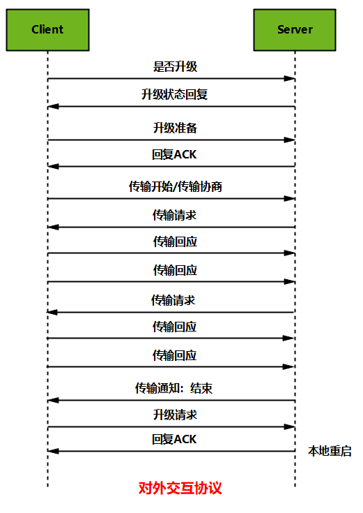

**图 2**  注册BLE OTA通道<a name="fig5764163615120"></a>  
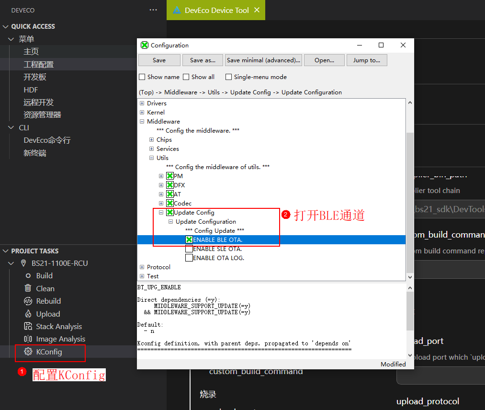

**图 3**  注册BLE OTA服务<a name="fig165212612217"></a>  
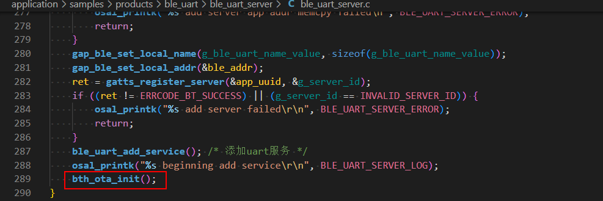

采用DebugKits工具把升级包通过蓝牙传输到单板上，操作流程如下。

1.  扫描设备，如[图4](#fig115471151202620)所示。

    **图 4**  扫描设备<a name="fig115471151202620"></a>  
    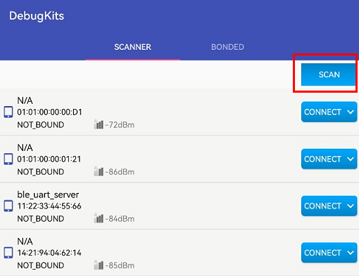

2.  选择连接的目标设备，如[图5](#fig025433292712)所示。

    **图 5**  选择目标设备<a name="fig025433292712"></a>  
    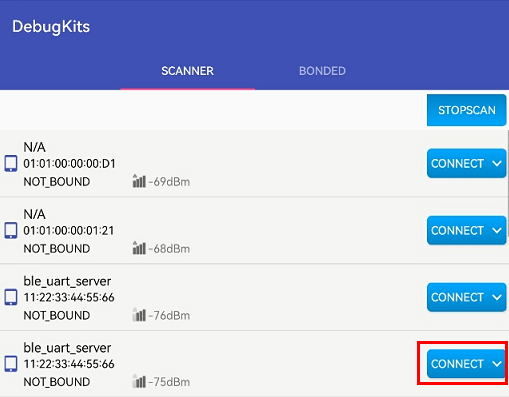

3.  选择绑定配对，如[图6](#fig1727451573410)所示。

    **图 6**  绑定<a name="fig1727451573410"></a>  
    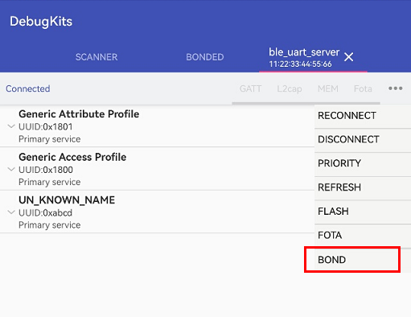

4.  进入OTA升级界面，如[图7](#fig341511309368)所示，选择升级包，选择单包数据长度128字节，单击START。

    **图 7**  BLE OTA升级界面<a name="fig341511309368"></a>  
    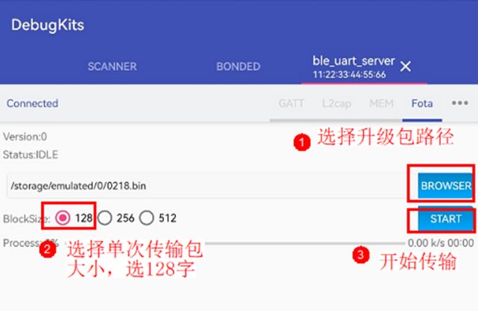

## 星闪传输<a name="ZH-CN_TOPIC_0000001805211364"></a>

星闪端到端升级交互流程与BLE传输一致。

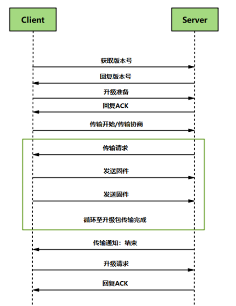

1.  注册星闪OTA通道，如[图1](#fig366716102117)。
2.  注册星闪OTA服务，如[图2](#fig129151340121115)。
3.  注册星闪OTA钩子，如[图 注册OTA钩子函数](#fig893135119203)。

    具体可参考RCU Sample，代码路径application/samples/products/rcu。

**图 1**  注册星闪OTA通道<a name="fig366716102117"></a>  
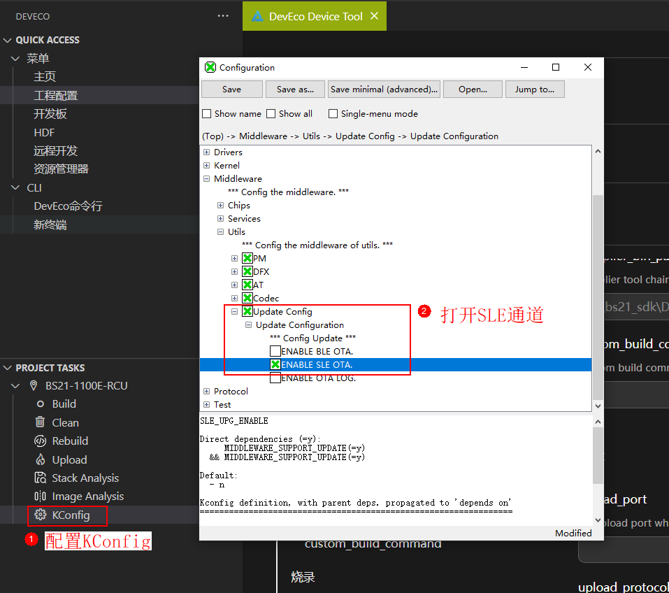

**图 2**  注册星闪OTA服务<a name="fig129151340121115"></a>  
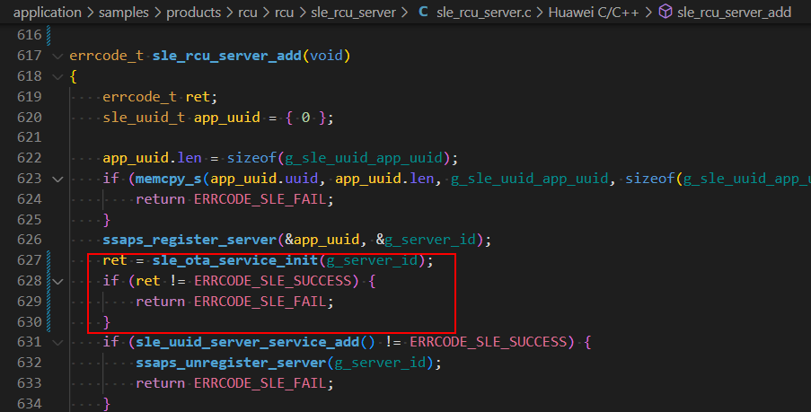

**图 3**  注册OTA钩子函数<a name="fig893135119203"></a>  
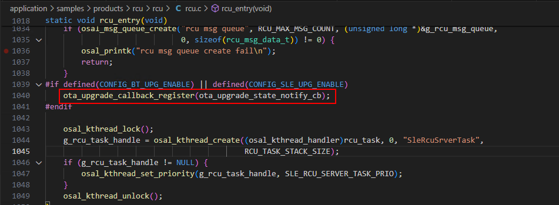

星闪升级工具的具体操作流程如下。注：工具名称：SleOta\_时间.apk

1.  单击SCAN开始扫描设备。

    **图 4**  扫描设备<a name="fig748016464426"></a>  
    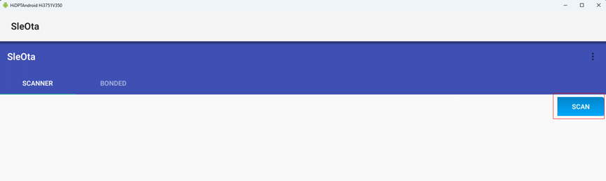

2.  单击STOPSCAN停止扫描设备。

    **图 5**  停止扫描<a name="fig16178235165514"></a>  
    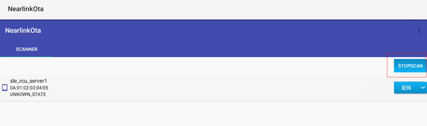

3.  单击配网进入该设备的升级界面。

    **图 6**  单击配网<a name="fig182662419476"></a>  
    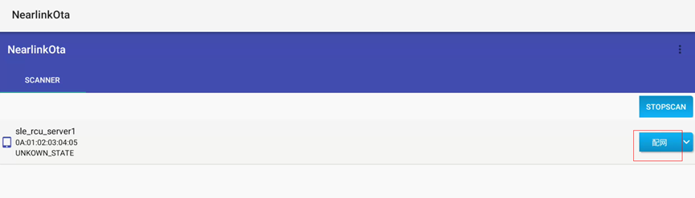

4.  升级界面：设备状态为connected表示已连接，disconnected表示未连接。

    **图 7**  SLE OTA升级界面<a name="fig680385216497"></a>  
    
    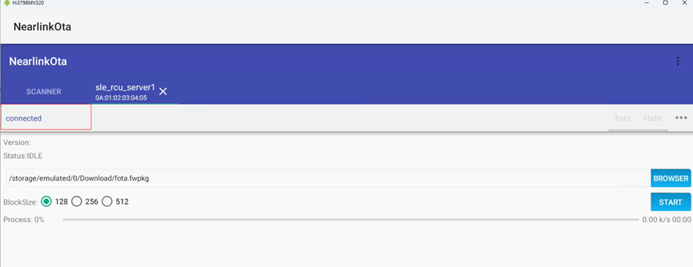

5.  单击BROWSER选择升级文件，若连接状态为disconnected，则无法选择文件。测试时一般将文件放在sdcard/Download目录下（仅供参考）。

    **图 8**  选择文件<a name="fig278874510181"></a>  
    
    

6.  选择好升级文件后，单击START即可开始升级，开始成功后进度条便会前进

    **图 9**  开始升级<a name="fig671663517191"></a>  
    
    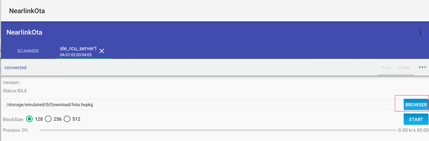

> **说明：** 
>1.  如果配对失败，可以重新打开星闪开关以及重新启动APK来进行配对。
>2.  进入到OTA升级界面后需要查看设备连接状态是否为connected。若选中bin文件后会跳转至权限界面，需要手动允许apk访问所有文件。

## 星闪Dongle传输<a name="ZH-CN_TOPIC_0000001852626669"></a>

星闪协议要求从机与主机侧交互时，从机和主机侧都搭配星闪芯片。由于芯片外销时，市面大部分产品的主SOC不支持星闪功能。为了快速铺开星闪生态，考虑主机侧增加内置星闪芯片的Dongle来实现与从机侧的星闪交互。实现流程如[图1](#fig3901191442020)所示，具体参考SLE OTA Dongle Sample，路径：application/samples/products/sle\_ota\_dongle。Dongle与从机的交互协议具体可参考文档《BS2XV100 星闪应用层SLE-Link协议》。

**图 1**  SLE Dongle传输流程图<a name="fig3901191442020"></a>  
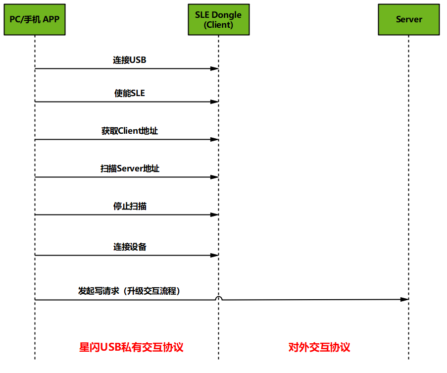

星闪Dongle工具分为安卓版本和Windows版本，安卓工具版本为Debugkits，操作流程如下。

1.  设置对端目标设备SLE地址，如[图2](#fig1418111449257)所示。

    **图 2**  设置对端地址<a name="fig1418111449257"></a>  
    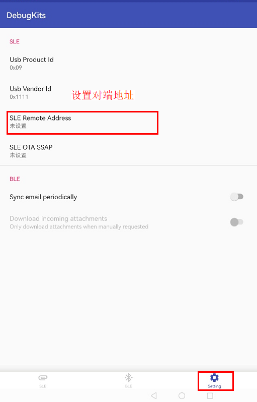

2.  单击CONNUSB按键，与Dongle USB建立连接，如[图3](#fig4838181307)所示。

    **图 3**  连接USB<a name="fig4838181307"></a>  
    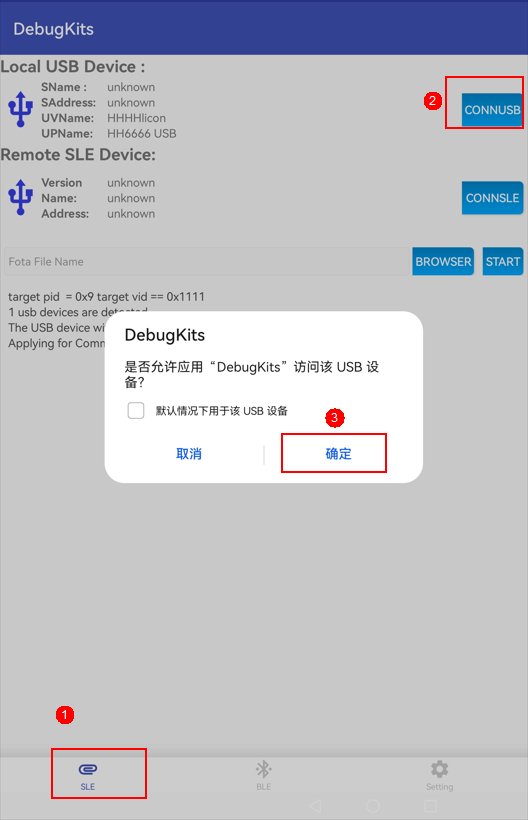

3.  再次单击CONNUSB按键，使能SLE并获取Client端地址，再单击CONNSLE按键，扫描并连接目标设备，如[图4](#fig12866171923810)所示。若显示目标设备地址和版本号（0），则连接成功。

    **图 4**  连接目标设备<a name="fig12866171923810"></a>  
    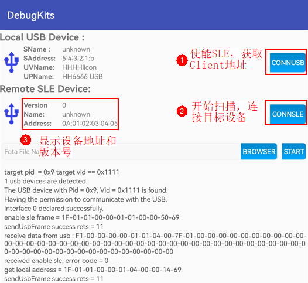

4.  选择升级包路径并开始传输，如[图5](#fig1933412570491)

    **图 5**  传输升级包<a name="fig1933412570491"></a>  
    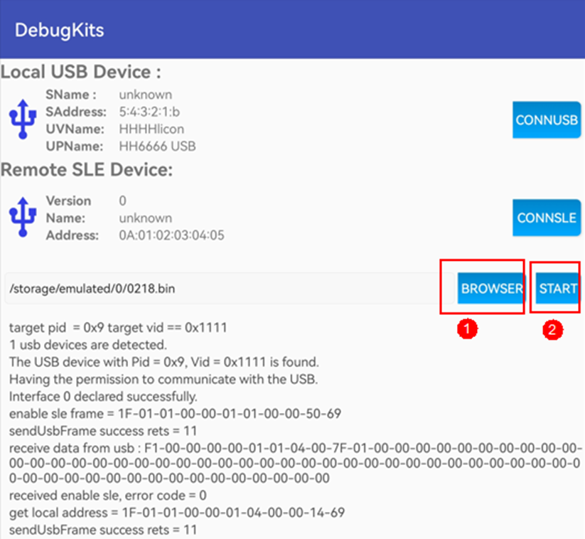

Windows工具为Burntool工具，在Option选项中选择Change chip，选择BS2X-SLE模块，进入界面后的操作流程如下。

1.  选择USB设备，usage page为0xffb2。如[图6](#fig17788525132220)。

    **图 6**  选择设备<a name="fig17788525132220"></a>  
    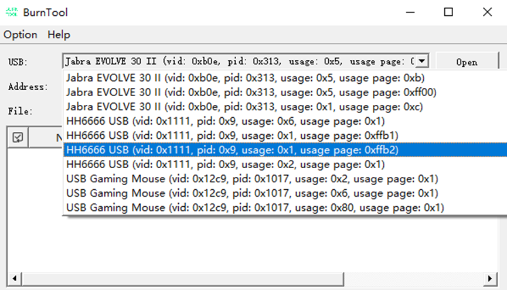

2.  单击Open，连接USB设备。如[图7](#fig1544721015234)。

    **图 7**  连接USB设备<a name="fig1544721015234"></a>  
    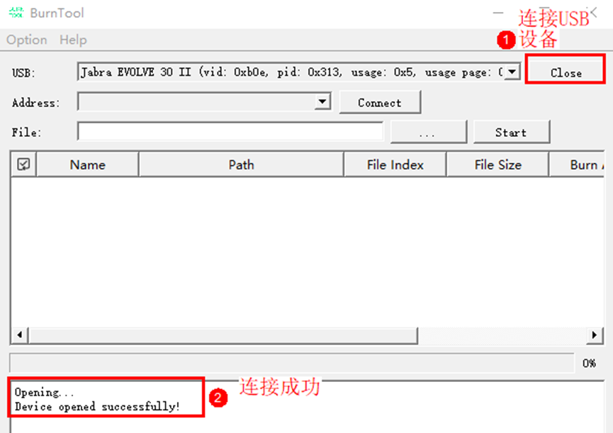

3.  连接USB设备后，Address框会显示扫描到的设备地址，选择对端设备地址。如[图8](#fig62256917243)。

    **图 8**  选择对端地址<a name="fig62256917243"></a>  
    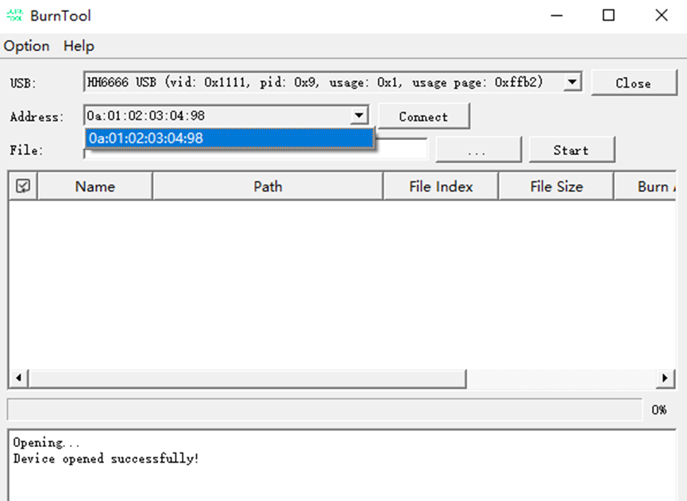

4.  单击Connect，连接目标对端设备。如图[图9](#fig1236075011247)。

    **图 9**  连接设备<a name="fig1236075011247"></a>  
    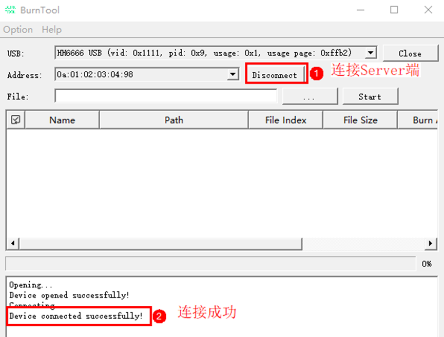

5.  选择升级包路径，单击Start开始传输升级包。如[图10](#fig125139221256)。

    **图 10**  单击开始传输<a name="fig125139221256"></a>  
    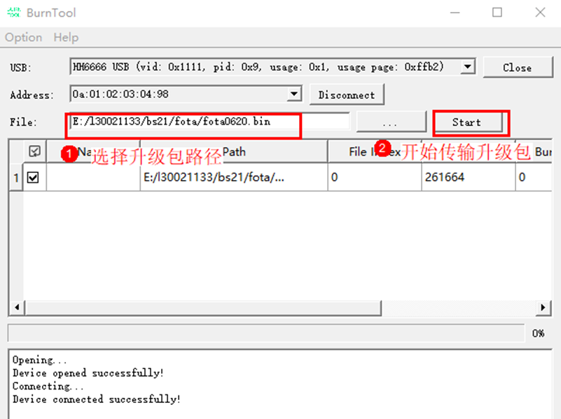

6.  等待进度条为100%，传输结束。如[图11](#fig491435382519)。

    **图 11**  传输完成<a name="fig491435382519"></a>  
    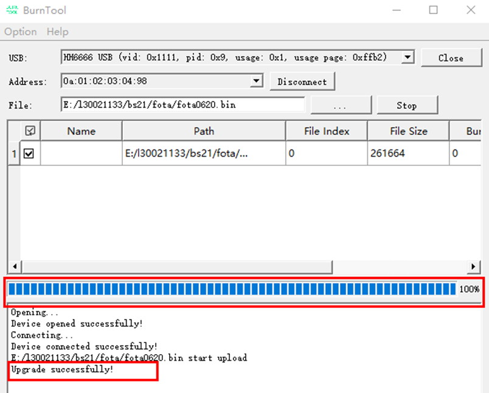

## DFU升级<a name="ZH-CN_TOPIC_0000001852050149"></a>

通过DFU升级交互流程如[图1](#fig10847101116313)所示，升级传输第一包数据为升级准备流程，工具发送一包数据描述升级包信息，包括起始标记、升级包地址、升级包大小等，详见dfu\_packge\_header\_t，文件路径为application/samples/products/sle\_mouse\_with\_dongle/mouse\_usb/usb\_dfu.c。Dongle侧收到第一包数据后，根据文件长度擦除fota区。从第二包开始，工具下发升级包数据，每包长度4KB，直至升级包数据传完。待升级包传输结束，dongle侧写升级标记位，本地重启。

**图 1**  DFU升级交互流程<a name="fig10847101116313"></a>  
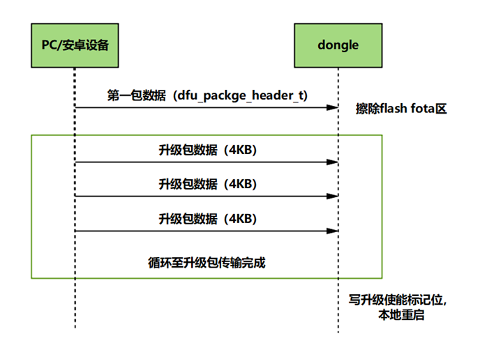

DFU相关代码实现可参考SLE Mouse Sample，代码路径application/samples/products/sle\_mouse\_with\_dongle。工具的操作流程如下。

1.  使用管理员权限打开程序（右键单击应用程序，单击以管理员身份运行，如[图2](#fig76119547597)所示。

    **图 2**  Burntool运行<a name="fig76119547597"></a>  
    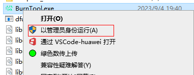

2.  Burntool的option选项选择“BS2X-USB”。
3.  在BurnTool界面的USB处选择所需的USB设备。如[图3](#fig2014515319119)所示。

    **图 3**  Burntool界面选项<a name="fig2014515319119"></a>  
    

4.  在BurnTool界面中单击“Select file”按钮，选择产品编译生成的固件包，并单击“打开”。
5.  在表格中选中需要烧写的文件。
6.  单击“Start burn”按钮（单击后“Start burn”变为“Stop burn”）。
7.  等待传输完成后结束烧写，烧写完成会出现“All images burn successfully”。烧写完成效果，如[图4](#fig79226391163)所示。

    **图 4**  DFU烧录完成<a name="fig79226391163"></a>  
    

## UART升级<a name="ZH-CN_TOPIC_0000001805371192"></a>

产线一般通过UART对空片烧录固件，一般会在烧录商用版本之前烧录产测版本，用于测试、校准等。为了减少烧录商用版本的步骤，可以将商用固件以升级包的形式，和产测固件一并烧录到芯片Flash上，在完成产测测试后写升级标记位并复位芯片，进入Flashboot本地升级流程将产测固件升级为商用固件。UART传输升级包，由Loaderboot程序实现，具体适配流程如下。


### 打包产测固件和商用固件<a name="ZH-CN_TOPIC_0000001852151117"></a>

修改产测固件的打包脚本，将商用固件的升级包与产测固件一并打包成一个fwpkg，产线烧录时烧录该固件即可，打包脚本路径：tools/pkg/chip\_packet/bs2x/packet.py。修改如[图1](#fig1233114218332)所示。图中升级包路径根据实际情况修改，本文只做示例。

**图 1**  烧录的固件中添加升级包<a name="fig1233114218332"></a>  
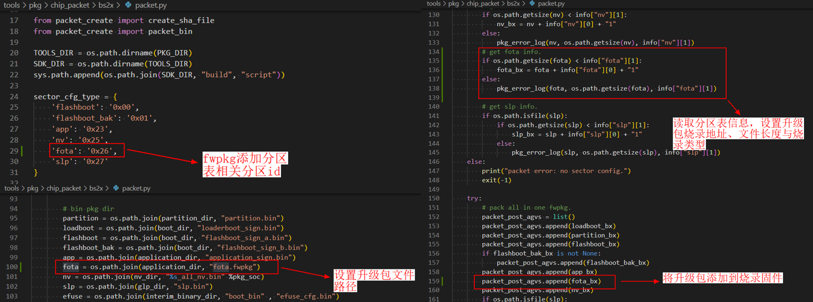

### 产测固件升级到商用固件<a name="ZH-CN_TOPIC_0000001852071177"></a>

在完成产线测试后，需要执行写升级标记位的操作，并进入本地升级流程。升级标记区位于升级包区域最后4KB空间，格式如下，升级标记的结构体详见middleware/utils/update/inner\_include/upg\_definitions.h。

```
typedef struct fota_upgrade_flag_area {
    uint32_t head_magic;
    uint32_t head_before_offset;
    uint32_t package_length;
    uint32_t firmware_num;
    uint8_t  firmware_flag[UPG_FIRMWARE_MAX_NUM][UPG_FLAG_RETYR_TIMES];
    uint8_t  nv_flag[UPG_FLAG_RETYR_TIMES];
    uint8_t  ver_change_flag;
    uint32_t update_result;
    uint32_t nv_data_offset;
    uint32_t nv_data_len;
    uint32_t nv_hash_offset;
    uint32_t nv_hash_len;
    uint32_t complete_flag;
    uint32_t head_end_magic;
} fota_upgrade_flag_area_t;
```

以下为写使能标记位代码示例，供参考：

```
    fota_upgrade_flag_area_t fota_flag;
    memset_s((uint8_t *)&fota_flag, sizeof(fota_upgrade_flag_area_t), 0xff, sizeof(fota_upgrade_flag_area_t));
    fota_flag.head_magic = 0x55aa55aa;
    fota_flag.head_before_offset = 0;
    fota_flag.package_length = fota_len;  // 升级包大小
    fota_flag.firmware_num = fw_num;  // 升级包中固件个数
    fota_flag.head_end_magic = 0xaa55aa55;
    partition_information_t info;
    uapi_partition_init();
    errcode_t ret_val = uapi_partition_get_info(PARTITION_FOTA_DATA, &info);
    uint32_t flag_address = info.part_info.addr_info.addr + info.part_info.addr_info.size - 0x1000;
    uint32_t status = (uint32_t)osal_irq_lock();
    uapi_sfc_reg_erase(flag_address, 0x1000);
    uapi_sfc_reg_write(flag_address, (uint8_t *)&fota_flag, sizeof(fota_upgrade_flag_area_t));
    // uapi_flash_block_erase(0, flag_address, 0x1000);    // 外置flash版本
    // uapi_flash_write_data(0, flag_address, (uint8_t *)&fota_flag, sizeof(fota_upgrade_flag_area_t));    // 外置flash版本
    osal_irq_restore(status);
    upg_reboot();  // 复位单板
```

> **说明：** 
>以上代码，用户需要调整变量fota\_len和fw\_num，fota\_len为升级包大小，fw\_num为升级包中固件个数，比如升级包中只包含Application.bin，则fw\_num = 1。

## HID升级<a name="ZH-CN_TOPIC_0000002096253060"></a>

以BS26为例，SDK共提供三个flashboot，即：

-   flashboot-bs26-n1200：支持OTA升级，即会在OTA升级完成后将FOTA区数据解压拷贝到APP主区
-   flashboot-bs26-n1200-usb：支持USB HID升级，但不支持OTA升级后的拷贝
-   flashboot-bs26-n1200-usb-with-ota：支持USB HID升级，并支持OTA升级后的拷贝

所以如果需要flashboot带HID升级功能，需要使用flashboot-bs26-n1200-usb或flashboot-bs26-n1200-usb-with-ota，即在对应config.py中将'flashboot\_cfg'配置成所需的flashboot。

带USB HID升级功能的flashboot镜像要更大，划分分区时需注意。

USB HID升级需要额外4K分区用来作为升级标志判断，即分区ID为0x26的fota data，和其他OTA升级方式不同的是，HID升级只是要fota data的最后4k用来存储升级标志信息，其他OTA升级方式需要在fota区域存储升级镜像。

另外，USB HID升级需要分区表中额外添加ID 0x29，用来存储vid、pid和io检测信息。

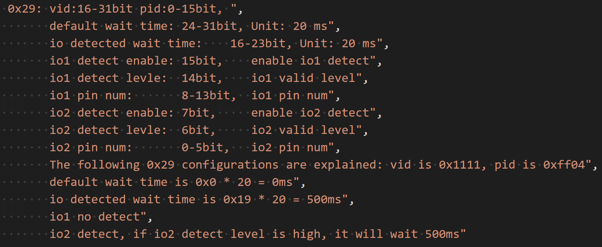

示例如下：

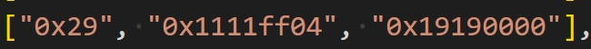

如下图所示，配合vid和pid后，单击Start burn，之后插拔/重启后级开始下载。

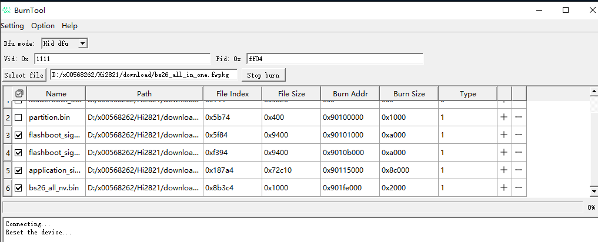

## 上位机控制HID升级<a name="ZH-CN_TOPIC_0000002174742721"></a>

HID升级在上电时（插拔USB）会初始化USB并且等待burntool发送USB升级指令，所以会增加上电时长，为了减少上电时长，故增加一个上位机控制HID升级的flashboot版本。以BS26为例，即

flashboot-bs21e-1100e-usb-with-control 和 flashboot-bs21e-1100e-usb-with-ota-with-control。

打包fwpkg的时候选择带'-with-control'的flashboot版本，默认上电不进行HID升级，需要上位机发送命令控制bs2x写HID升级标志寄存器和软复位寄存器，软复位后进行HID升级。

1.  HID升级标志寄存器：0x5702C010写0x5A。
2.  软复位寄存器：0x57004600写0。

# 升级包保存<a name="ZH-CN_TOPIC_0000001805110840"></a>

在BS2X中，升级包保存在Flash中，包括内置Flash以及外挂Flash，用户可根据产品的需求选择不同方案。Flash的内存分布如下（内置Flash基地址：0x90100000）。


## Flash分区<a name="ZH-CN_TOPIC_0000001805718378"></a>

在BS2X中，客户可根据需要划分Flash分区。在版本的sector\_cfg选项中修改相应的分区，分区表的路径位于build/config/target\_config/bs21/flash\_sector\_config。如[图1](#fig1811911550539)。

**图 1**  分区表配置<a name="fig1811911550539"></a>  
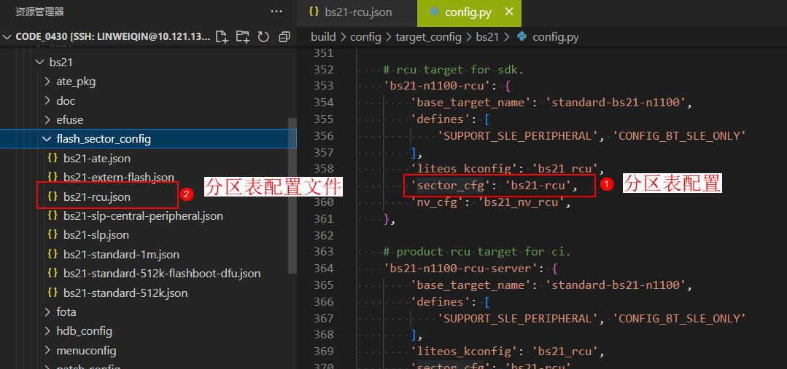

-   512KB内置Flash分区，如[图2](#fig17849157161413)。具体配置见build/config/target\_config/bs21/flash\_sector\_config/bs21-standard-512k.json。

    **图 2**  512KB内置Flash分区图<a name="fig17849157161413"></a>  
    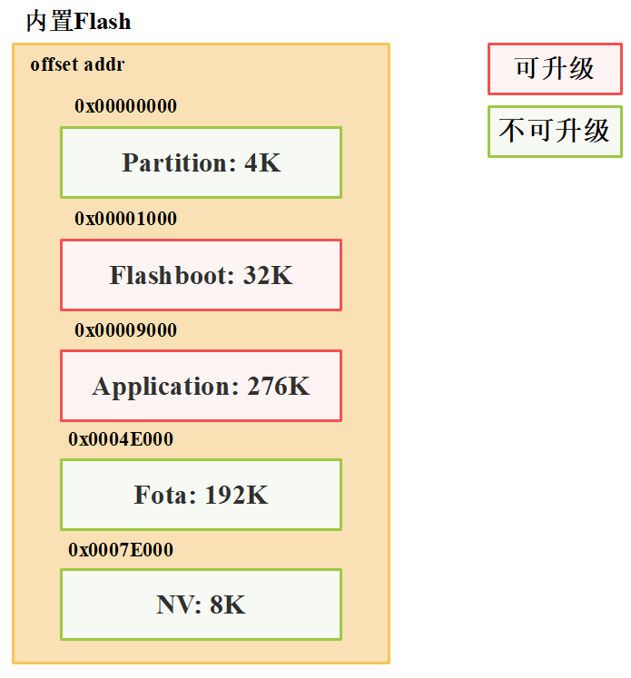

-   1M内置Flash分区，如[图3](#fig9266101461711)。具体配置见build/config/target\_config/bs21/flash\_sector\_config/bs21-standard-1m.json。

    **图 3**  1M内置Flash分区图<a name="fig9266101461711"></a>  
    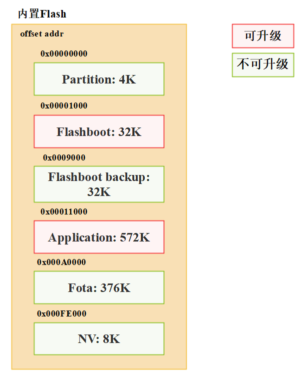

-   512K内置Flash，外挂Flash（外挂Flash大小可根据用户需要调整，不小于512K），如[图4](#fig161271414194)。具体配置见build/config/target\_config/bs21/flash\_sector\_config/bs21-extern-flash.json。

    **图 4**  512KB内置Flash与外挂Flash分区图<a name="fig161271414194"></a>  
    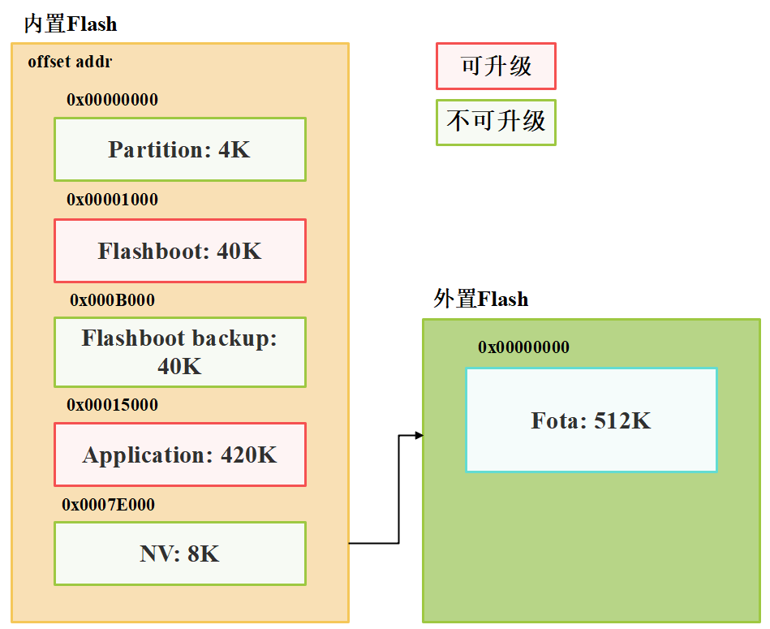

## 外置Flash适配<a name="ZH-CN_TOPIC_0000001852477161"></a>

-   外置Flash选型

    目前BS2X支持的外置Flash选型，详见include/driver/flash/flash\_common\_config.h，如[图1](#fig1979922617314)。其他头文件未列出的Flash类型，用户需自行适配。

    **图 1**  Flash驱动支持的外置Flash选型<a name="fig1979922617314"></a>  
    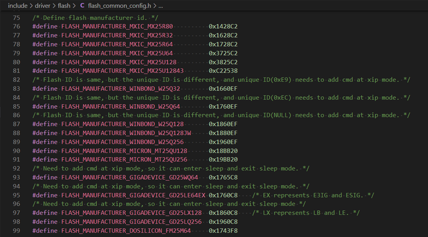

-   外置Flash适配
    -   Flash初始化，参考drivers/chips/bs2x/main\_init/main\_init.c下ota\_extern\_flash\_init\(\)函数，用户根据需要，修改flash\_porting\_pinmux\_cfg函数的管脚配置。如[图2](#fig98971054182219)。
    -   将Flash的manufacturer id添加到驱动中，以GD25WD40为例，修改文件路径：include/driver/flash/flash\_common\_config.h。如[图3](#fig02552034132211)。
    -   修改文件路径：include/driver/flash/flash\_config\_info.h。如[图4](#fig18792111432217)所示。

**图 2**  Flash初始化<a name="fig98971054182219"></a>  
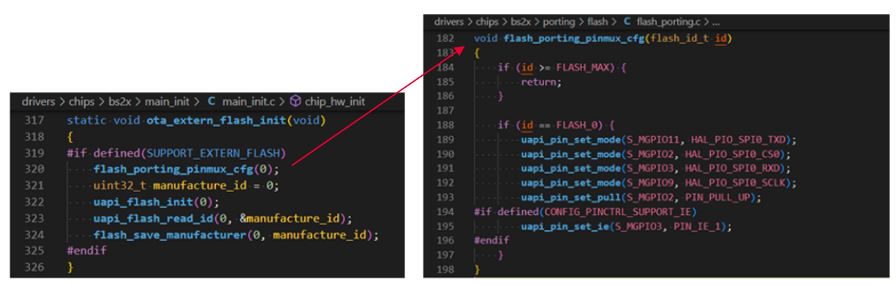

**图 3**  Flash驱动添加manufacturer id<a name="fig02552034132211"></a>  
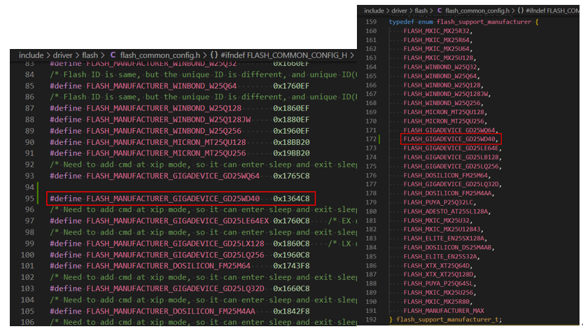

**图 4**  修改Flash驱动info<a name="fig18792111432217"></a>  
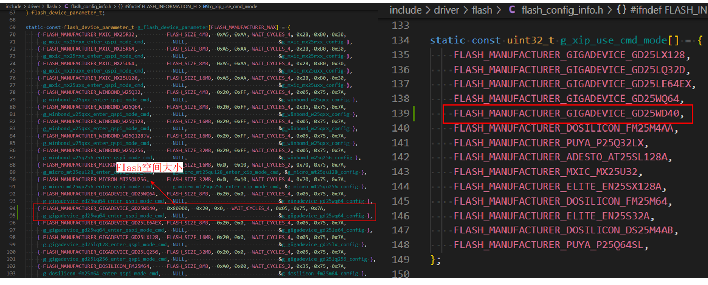

# 升级包本地升级<a name="ZH-CN_TOPIC_0000001805091538"></a>

在BS2X中，本地升级程序主要在Flashboot程序中运行。可升级的镜像为Flashboot、Application。

Flashboot程序升级Flashboot自身时，会将Flashboot拷贝到Flashboot备份区，避免掉电异常。在更新完所有镜像后，单板会自动复位，复位后进入Application镜像。

# FAQ<a name="ZH-CN_TOPIC_0000001893361348"></a>

**问题一：手机与Server端连接正常，但是单击Start无法传输<a name="section1266514922617"></a>**

定位思路：

1.  可以先打开OTA业务的Log开关，如[图1](#fig94541436565)。排查一下版本是否注册OTA业务，DFX是否注册OTA通道，具体参考“[BLE传输](BLE传输.md)”、“[星闪传输](星闪传输.md)”。例如DFX未注册OTA通道时，Client端（手机apk或星闪Dongle）读取对端版本号会失败，如[图2](#fig187017175015)所示。若是OTA业务未注册，升级界面无法进入，如[图3](#fig163782447162)所示。

    **图 1**  打开Server端OTA日志<a name="fig94541436565"></a>  
    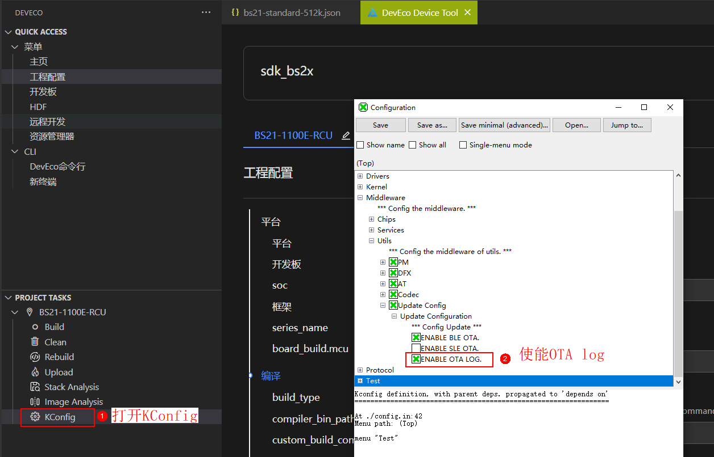

    **图 2**  OTA读取版本号失败<a name="fig187017175015"></a>  
    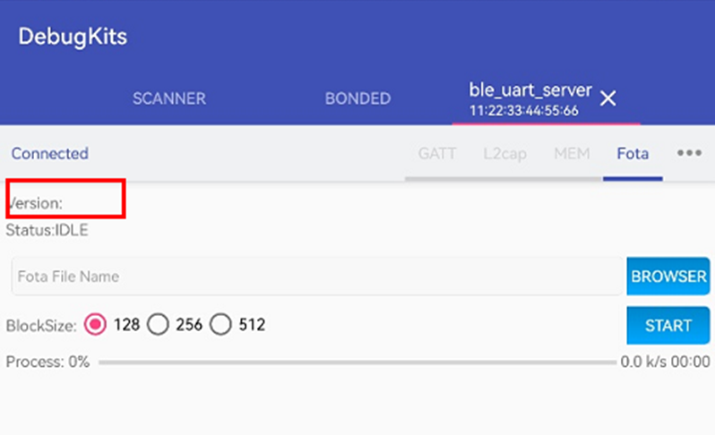

    **图 3**  APK升级界面进入失败<a name="fig163782447162"></a>  
    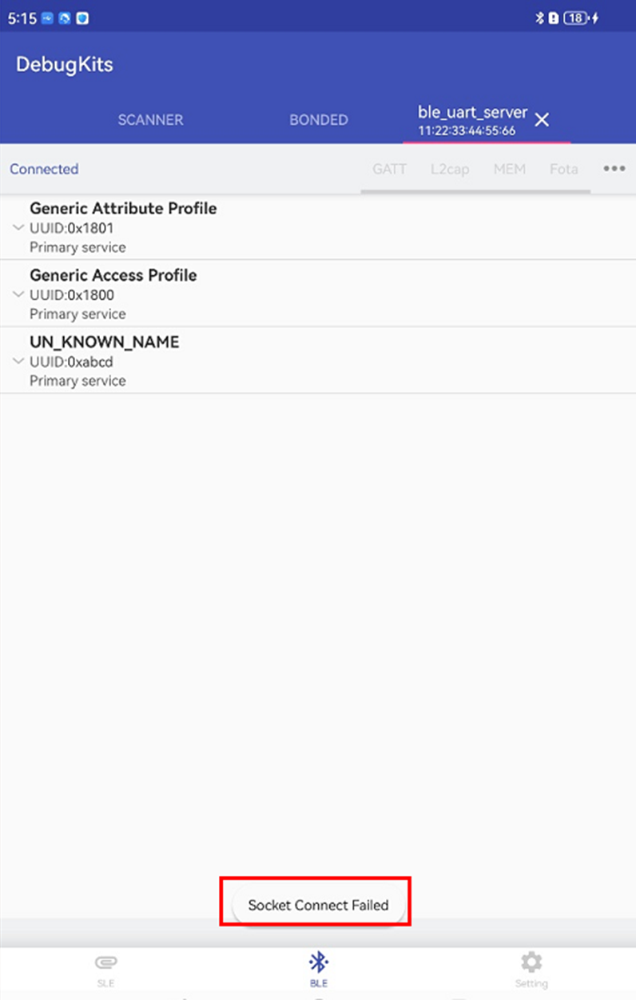

2.  升级包太大，超过FOTA分区大小。日志如[图4](#fig2071344413612)所示。

    **图 4**  升级包超出FOTA分区<a name="fig2071344413612"></a>  
    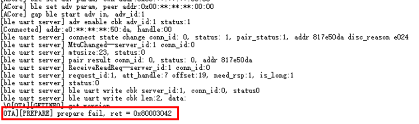

**问题二：升级包传输过程进度条卡住或者传输时间超过10分钟<a name="section634173919267"></a>**

定位思路：

可能是传输过程出现丢包，或者Client发包速度太慢，导致Server端不断向Client端发重传请求。如果是星闪dongle升级，可以排查一下Dongle是否日志加太多影响传输速率。

**问题三：升级包传输完成后Server端不复位<a name="section12846195192617"></a>**

定位思路：

升级包格式不对，排查下升级包版本是否不对，升级包版本路径如[图5](#fig9604195211819)所示。

**图 5**  Server端传输结束后复位失败<a name="fig9604195211819"></a>  
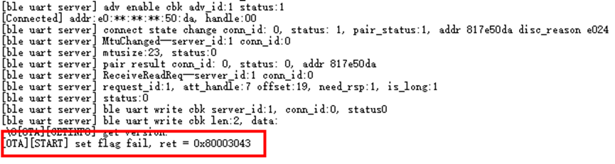

**问题四：升级包传输完成并更新固件复位后变砖<a name="section5450102275"></a>**

定位思路：

防串货机制导致，与Flashboot版本相关，需更新Flashboot版本。Flashboot版本与Application版本需来自同个SDK。

**问题五：升级包更新搬运固件的过程掉电，复位后变砖<a name="section1086114872718"></a>**

定位思路：

BS2X有本地升级掉电保护机制，如果掉电后重新上电后变砖，可能是防串货机制导致，需更新Flashboot版本。Flashboot版本与Application版本需来自同个SDK。

**问题六：如何升级分区表<a name="section17608334185212"></a>**

旧版本分区表升级至新版本分区表，需要升级两次才能完全更新。

> **须知：** 
>1.  升级分区表的流程有变砖风险，用户需谨慎操作，升级过程保证不掉电。
>2.  BS2X启动与升级流程都依赖分区表，原则上分区表不应升级。在产品生产前分区表需固化，后续不应再修改。以上升级分区表的方法不推荐在量产阶段使用。

具体步骤如下：

1.  基于旧版本添加下列修改，编译中间版本。
2.  此中间版本在Application初始化分区表之前，修改旧版本分区表升级区的信息，使其与新版本一致，代码修改如[图6](#fig12844144505817)。

    **图 6**  初始化分区表之前修改分区表升级区信息<a name="fig12844144505817"></a>  
    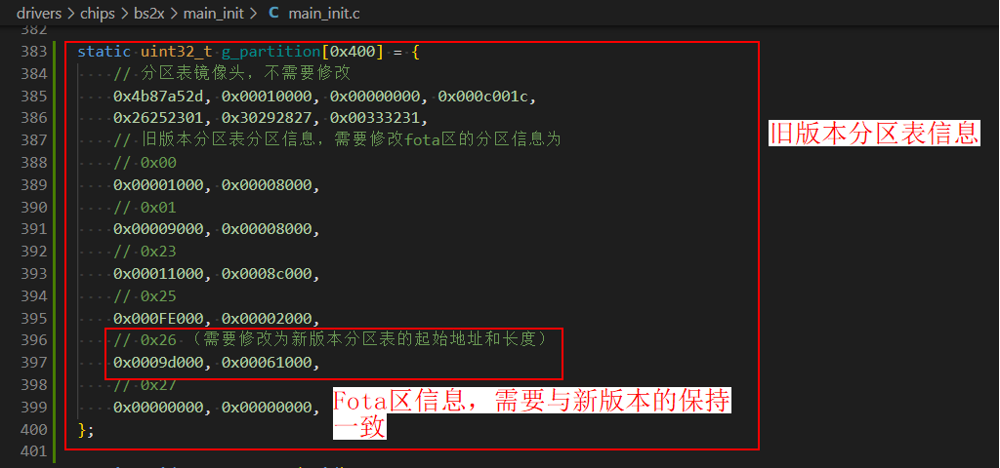

    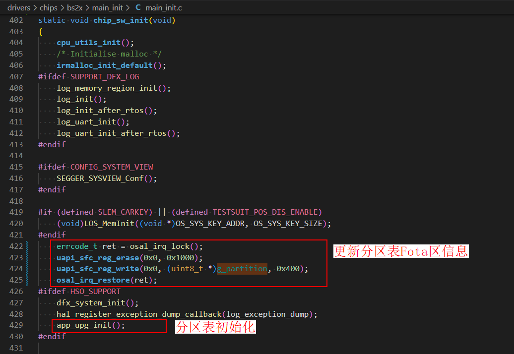

    代码示例：

    ```
    static uint32_t g_partition[0x400] = {
        // 分区表镜像头，不需要修改
        0x4b87a52d, 0x00010000, 0x00000000, 0x000c001c,
        0x26252301, 0x30292827, 0x00333231,
        // 0x00
        0x00001000, 0x00008000,
        // 0x01
        0x00009000, 0x00008000,
        // 0x23
        0x00011000, 0x0008c000,
        // 0x25
        0x000FE000, 0x00002000,
        // 0x26
        0x0009d000, 0x00061000,
        // 0x27
        0x00000000, 0x00000000,
    };
    errcode_t ret = osal_irq_lock();
    uapi_sfc_reg_erase(0x0, 0x1000);
    uapi_sfc_reg_write(0x0, (uint8_t *)g_partition, 0x400);
    osal_irq_restore(ret);
    ```

3.  在升级的传输流程结束后、单板复位前，修改旧版本分区表其他区域区，使分区表与新版本分区表保持一致。DFU升级的代码修改如[图7](#fig114581012115813)，OTA升级的代码修改如[图8](#fig1350478132410)。

    **图 7**  DFU升级传输流程结束后更新分区表<a name="fig114581012115813"></a>  
    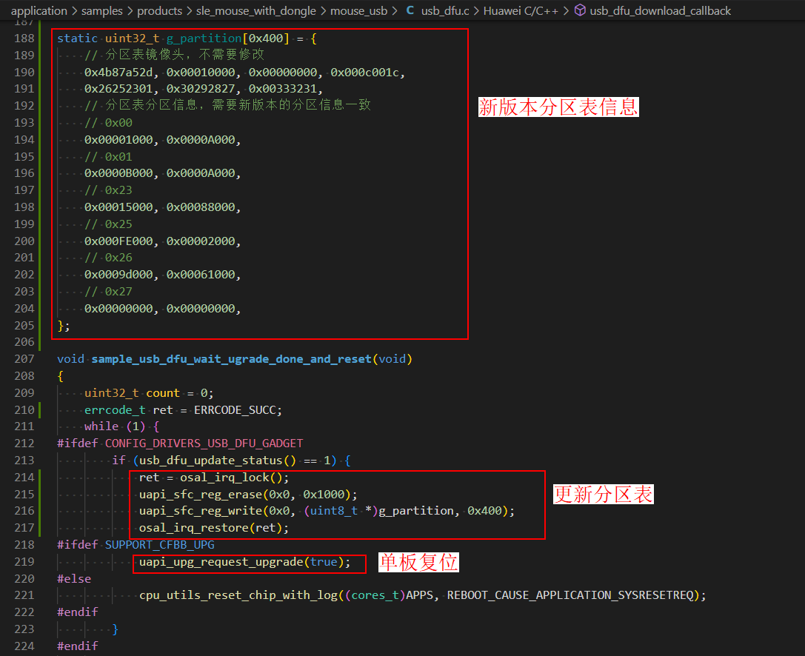

    **图 8**  OTA升级传输流程结束后更新分区表<a name="fig1350478132410"></a>  
    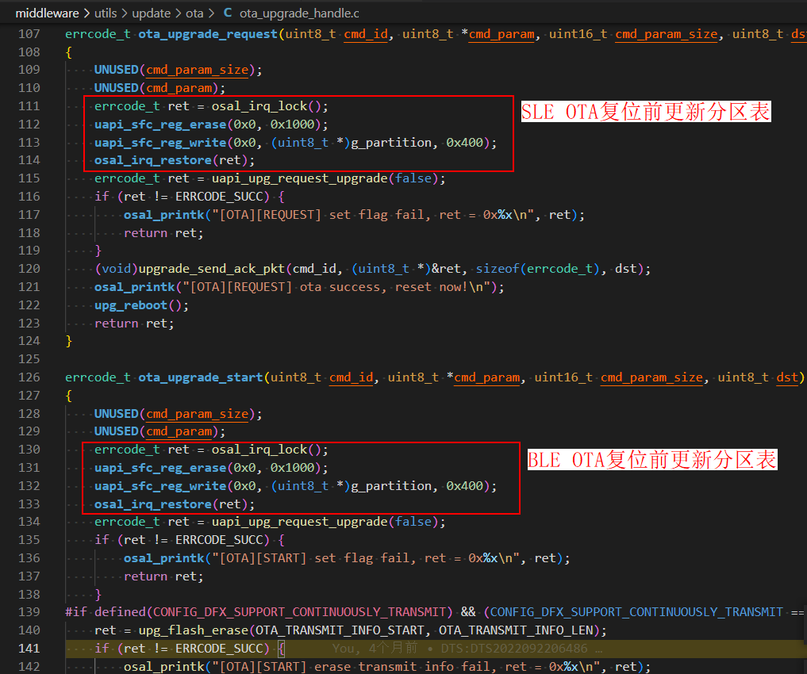

4.  基于上述修改，编译中间版本。旧版本升级该中间版本，完成分区表升级区的更新，然后再升级新版本固件（包括新版本Flashboot、App镜像），即可完成分区表的更新。

