# 前言<a name="ZH-CN_TOPIC_0000001713124201"></a>

**概述<a name="section4537382116410"></a>**

本文档主要介绍BurnTool的使用方法。用于指导工程人员快速使用BurnTool工具进行镜像烧写。

**产品版本<a name="section27775771"></a>**

与本文档相对应的产品版本如下。

<a name="table52250146"></a>
<table><thead align="left"><tr id="row55967882"><th class="cellrowborder" valign="top" width="39.39%" id="mcps1.1.3.1.1"><p id="p37104584"><a name="p37104584"></a><a name="p37104584"></a><strong id="b48174912328"><a name="b48174912328"></a><a name="b48174912328"></a>产品名称</strong></p>
</th>
<th class="cellrowborder" valign="top" width="60.61%" id="mcps1.1.3.1.2"><p id="p52681331"><a name="p52681331"></a><a name="p52681331"></a><strong id="b682239163211"><a name="b682239163211"></a><a name="b682239163211"></a>产品版本</strong></p>
</th>
</tr>
</thead>
<tbody><tr id="row39329394"><td class="cellrowborder" valign="top" width="39.39%" headers="mcps1.1.3.1.1 "><p id="p31080012"><a name="p31080012"></a><a name="p31080012"></a>BS2X</p>
</td>
<td class="cellrowborder" valign="top" width="60.61%" headers="mcps1.1.3.1.2 "><p id="p34453054"><a name="p34453054"></a><a name="p34453054"></a>V100</p>
</td>
</tr>
</tbody>
</table>

**读者对象<a name="section4378592816410"></a>**

本文档主要适用于以下工程师：

-   技术支持工程师
-   软件工程师
-   硬件工程师

**符号约定<a name="section133020216410"></a>**

在本文中可能出现下列标志，它们所代表的含义如下。

<a name="table2622507016410"></a>
<table><thead align="left"><tr id="row1530720816410"><th class="cellrowborder" valign="top" width="20.580000000000002%" id="mcps1.1.3.1.1"><p id="p6450074116410"><a name="p6450074116410"></a><a name="p6450074116410"></a><strong id="b2136615816410"><a name="b2136615816410"></a><a name="b2136615816410"></a>符号</strong></p>
</th>
<th class="cellrowborder" valign="top" width="79.42%" id="mcps1.1.3.1.2"><p id="p5435366816410"><a name="p5435366816410"></a><a name="p5435366816410"></a><strong id="b5941558116410"><a name="b5941558116410"></a><a name="b5941558116410"></a>说明</strong></p>
</th>
</tr>
</thead>
<tbody><tr id="row1372280416410"><td class="cellrowborder" valign="top" width="20.580000000000002%" headers="mcps1.1.3.1.1 "><p id="p3734547016410"><a name="p3734547016410"></a><a name="p3734547016410"></a><a name="image2670064316410"></a><a name="image2670064316410"></a><span></span></p>
</td>
<td class="cellrowborder" valign="top" width="79.42%" headers="mcps1.1.3.1.2 "><p id="p1757432116410"><a name="p1757432116410"></a><a name="p1757432116410"></a>表示如不避免则将会导致死亡或严重伤害的具有高等级风险的危害。</p>
</td>
</tr>
<tr id="row466863216410"><td class="cellrowborder" valign="top" width="20.580000000000002%" headers="mcps1.1.3.1.1 "><p id="p1432579516410"><a name="p1432579516410"></a><a name="p1432579516410"></a><a name="image4895582316410"></a><a name="image4895582316410"></a><span></span></p>
</td>
<td class="cellrowborder" valign="top" width="79.42%" headers="mcps1.1.3.1.2 "><p id="p959197916410"><a name="p959197916410"></a><a name="p959197916410"></a>表示如不避免则可能导致死亡或严重伤害的具有中等级风险的危害。</p>
</td>
</tr>
<tr id="row123863216410"><td class="cellrowborder" valign="top" width="20.580000000000002%" headers="mcps1.1.3.1.1 "><p id="p1232579516410"><a name="p1232579516410"></a><a name="p1232579516410"></a><a name="image1235582316410"></a><a name="image1235582316410"></a><span></span></p>
</td>
<td class="cellrowborder" valign="top" width="79.42%" headers="mcps1.1.3.1.2 "><p id="p123197916410"><a name="p123197916410"></a><a name="p123197916410"></a>表示如不避免则可能导致轻微或中度伤害的具有低等级风险的危害。</p>
</td>
</tr>
<tr id="row5786682116410"><td class="cellrowborder" valign="top" width="20.580000000000002%" headers="mcps1.1.3.1.1 "><p id="p2204984716410"><a name="p2204984716410"></a><a name="p2204984716410"></a><a name="image4504446716410"></a><a name="image4504446716410"></a><span></span></p>
</td>
<td class="cellrowborder" valign="top" width="79.42%" headers="mcps1.1.3.1.2 "><p id="p4388861916410"><a name="p4388861916410"></a><a name="p4388861916410"></a>用于传递设备或环境安全警示信息。如不避免则可能会导致设备损坏、数据丢失、设备性能降低或其它不可预知的结果。</p>
<p id="p1238861916410"><a name="p1238861916410"></a><a name="p1238861916410"></a>“须知”不涉及人身伤害。</p>
</td>
</tr>
<tr id="row2856923116410"><td class="cellrowborder" valign="top" width="20.580000000000002%" headers="mcps1.1.3.1.1 "><p id="p5555360116410"><a name="p5555360116410"></a><a name="p5555360116410"></a><a name="image799324016410"></a><a name="image799324016410"></a><span></span></p>
</td>
<td class="cellrowborder" valign="top" width="79.42%" headers="mcps1.1.3.1.2 "><p id="p4612588116410"><a name="p4612588116410"></a><a name="p4612588116410"></a>对正文中重点信息的补充说明。</p>
<p id="p1232588116410"><a name="p1232588116410"></a><a name="p1232588116410"></a>“说明”不是安全警示信息，不涉及人身、设备及环境伤害信息。</p>
</td>
</tr>
</tbody>
</table>

**修改记录<a name="section2467512116410"></a>**

<a name="table1557726816410"></a>
<table><thead align="left"><tr id="row2942532716410"><th class="cellrowborder" valign="top" width="19.009999999999998%" id="mcps1.1.4.1.1"><p id="p3778275416410"><a name="p3778275416410"></a><a name="p3778275416410"></a><strong id="b5687322716410"><a name="b5687322716410"></a><a name="b5687322716410"></a>文档版本</strong></p>
</th>
<th class="cellrowborder" valign="top" width="25.629999999999995%" id="mcps1.1.4.1.2"><p id="p5627845516410"><a name="p5627845516410"></a><a name="p5627845516410"></a><strong id="b5800814916410"><a name="b5800814916410"></a><a name="b5800814916410"></a>发布日期</strong></p>
</th>
<th class="cellrowborder" valign="top" width="55.36%" id="mcps1.1.4.1.3"><p id="p2382284816410"><a name="p2382284816410"></a><a name="p2382284816410"></a><strong id="b3316380216410"><a name="b3316380216410"></a><a name="b3316380216410"></a>修改说明</strong></p>
</th>
</tr>
</thead>
<tbody><tr id="row1614184205220"><td class="cellrowborder" valign="top" width="19.009999999999998%" headers="mcps1.1.4.1.1 "><p id="p116141544527"><a name="p116141544527"></a><a name="p116141544527"></a>04</p>
</td>
<td class="cellrowborder" valign="top" width="25.629999999999995%" headers="mcps1.1.4.1.2 "><p id="p126151940522"><a name="p126151940522"></a><a name="p126151940522"></a>2025-01-14</p>
</td>
<td class="cellrowborder" valign="top" width="55.36%" headers="mcps1.1.4.1.3 "><p id="p266742611532"><a name="p266742611532"></a><a name="p266742611532"></a>更新“<a href="手动烧写.md">手动烧写</a>”小节内容。</p>
</td>
</tr>
<tr id="row5519411065"><td class="cellrowborder" valign="top" width="19.009999999999998%" headers="mcps1.1.4.1.1 "><p id="p125191111767"><a name="p125191111767"></a><a name="p125191111767"></a>03</p>
</td>
<td class="cellrowborder" valign="top" width="25.629999999999995%" headers="mcps1.1.4.1.2 "><p id="p175191612613"><a name="p175191612613"></a><a name="p175191612613"></a>2024-09-14</p>
</td>
<td class="cellrowborder" valign="top" width="55.36%" headers="mcps1.1.4.1.3 "><a name="ul19109414794"></a><a name="ul19109414794"></a><ul id="ul19109414794"><li>更新“<a href="BurnTool-Dfu.md">BurnTool-Dfu</a>”小节内容。</li><li>更新“<a href="手动烧写.md">手动烧写</a>”小节内容。</li><li>更新“<a href="DFU烧写-2.md">DFU烧写</a>”小节内容。</li><li>更新“<a href="导出镜像.md">导出镜像</a>”小节内容。</li></ul>
</td>
</tr>
<tr id="row174812450910"><td class="cellrowborder" valign="top" width="19.009999999999998%" headers="mcps1.1.4.1.1 "><p id="p94815451096"><a name="p94815451096"></a><a name="p94815451096"></a>02</p>
</td>
<td class="cellrowborder" valign="top" width="25.629999999999995%" headers="mcps1.1.4.1.2 "><p id="p248204517917"><a name="p248204517917"></a><a name="p248204517917"></a>2024-07-05</p>
</td>
<td class="cellrowborder" valign="top" width="55.36%" headers="mcps1.1.4.1.3 "><a name="ul91788569910"></a><a name="ul91788569910"></a><ul id="ul91788569910"><li>更新“<a href="应用场景.md">应用场景</a>”小节内容。</li><li>更新“<a href="界面说明.md">界面说明</a>”小节内容。</li><li>新增“<a href="OTA升级.md">OTA升级</a>”小节内容。</li></ul>
</td>
</tr>
<tr id="row15142143811166"><td class="cellrowborder" valign="top" width="19.009999999999998%" headers="mcps1.1.4.1.1 "><p id="p182910614321"><a name="p182910614321"></a><a name="p182910614321"></a>01</p>
</td>
<td class="cellrowborder" valign="top" width="25.629999999999995%" headers="mcps1.1.4.1.2 "><p id="p52917613321"><a name="p52917613321"></a><a name="p52917613321"></a>2024-05-15</p>
</td>
<td class="cellrowborder" valign="top" width="55.36%" headers="mcps1.1.4.1.3 "><p id="p1290663212"><a name="p1290663212"></a><a name="p1290663212"></a>第一次正式版本发布。</p>
</td>
</tr>
<tr id="row937915514614"><td class="cellrowborder" valign="top" width="19.009999999999998%" headers="mcps1.1.4.1.1 "><p id="p12379125554615"><a name="p12379125554615"></a><a name="p12379125554615"></a>00B03</p>
</td>
<td class="cellrowborder" valign="top" width="25.629999999999995%" headers="mcps1.1.4.1.2 "><p id="p1737917556463"><a name="p1737917556463"></a><a name="p1737917556463"></a>2024-01-08</p>
</td>
<td class="cellrowborder" valign="top" width="55.36%" headers="mcps1.1.4.1.3 "><a name="ul14863155364119"></a><a name="ul14863155364119"></a><ul id="ul14863155364119"><li>更新“<a href="界面说明.md">界面说明</a>”小节内容。</li></ul>
</td>
</tr>
<tr id="row15301143316224"><td class="cellrowborder" valign="top" width="19.009999999999998%" headers="mcps1.1.4.1.1 "><p id="p1830203372219"><a name="p1830203372219"></a><a name="p1830203372219"></a>00B02</p>
</td>
<td class="cellrowborder" valign="top" width="25.629999999999995%" headers="mcps1.1.4.1.2 "><p id="p1130253320226"><a name="p1130253320226"></a><a name="p1130253320226"></a>2023-10-27</p>
</td>
<td class="cellrowborder" valign="top" width="55.36%" headers="mcps1.1.4.1.3 "><p id="p39765564222"><a name="p39765564222"></a><a name="p39765564222"></a>删除“命令行烧写”小节。</p>
</td>
</tr>
<tr id="row5947359616410"><td class="cellrowborder" valign="top" width="19.009999999999998%" headers="mcps1.1.4.1.1 "><p id="p2149706016410"><a name="p2149706016410"></a><a name="p2149706016410"></a>00B01</p>
</td>
<td class="cellrowborder" valign="top" width="25.629999999999995%" headers="mcps1.1.4.1.2 "><p id="p648803616410"><a name="p648803616410"></a><a name="p648803616410"></a>2023-09-27</p>
</td>
<td class="cellrowborder" valign="top" width="55.36%" headers="mcps1.1.4.1.3 "><p id="p1946537916410"><a name="p1946537916410"></a><a name="p1946537916410"></a>第一次临时版本发布。</p>
</td>
</tr>
</tbody>
</table>

# BurnTool工具简介<a name="ZH-CN_TOPIC_0000001713045789"></a>


## 功能说明<a name="ZH-CN_TOPIC_0000001713125793"></a>

BurnTool是芯片配套的烧写工具，通过打断程序启动的方式，对单板烧写镜像文件。

## 应用场景<a name="ZH-CN_TOPIC_0000001665006266"></a>

BurnTool主要适用于以下场景：

-   镜像烧写
-   导出镜像

## 界面说明<a name="ZH-CN_TOPIC_0000001665165990"></a>


### 选择Chip<a name="ZH-CN_TOPIC_0000001985906928"></a>

通过“Option”-“Change chip”打开芯片选择框，用于选择与单板匹配的芯片类型，部分芯片还可选择需要的烧写方式，界面如[图1](#zh-cn_topic_0000001906927033_fig131614316534)所示。

**图 1**  选择Chip界面示意图<a name="zh-cn_topic_0000001906927033_fig131614316534"></a>  
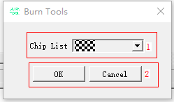

**表 1**  选择Chip界面说明

<a name="zh-cn_topic_0000001906927033_table1923619111210"></a>
<table><thead align="left"><tr id="zh-cn_topic_0000001906927033_row8232019141213"><th class="cellrowborder" valign="top" width="13.66%" id="mcps1.2.3.1.1"><p id="zh-cn_topic_0000001906927033_p12351913126"><a name="zh-cn_topic_0000001906927033_p12351913126"></a><a name="zh-cn_topic_0000001906927033_p12351913126"></a>区域</p>
</th>
<th class="cellrowborder" valign="top" width="86.33999999999999%" id="mcps1.2.3.1.2"><p id="zh-cn_topic_0000001906927033_p9232199124"><a name="zh-cn_topic_0000001906927033_p9232199124"></a><a name="zh-cn_topic_0000001906927033_p9232199124"></a>说明</p>
</th>
</tr>
</thead>
<tbody><tr id="zh-cn_topic_0000001906927033_row1623119111212"><td class="cellrowborder" valign="top" width="13.66%" headers="mcps1.2.3.1.1 "><p id="zh-cn_topic_0000001906927033_p1723219201211"><a name="zh-cn_topic_0000001906927033_p1723219201211"></a><a name="zh-cn_topic_0000001906927033_p1723219201211"></a>1</p>
</td>
<td class="cellrowborder" valign="top" width="86.33999999999999%" headers="mcps1.2.3.1.2 "><a name="zh-cn_topic_0000001906927033_ul15231719181215"></a><a name="zh-cn_topic_0000001906927033_ul15231719181215"></a><ul id="zh-cn_topic_0000001906927033_ul15231719181215"><li>Chip List：可选芯片列表。</li></ul>
</td>
</tr>
<tr id="zh-cn_topic_0000001906927033_row3237195120"><td class="cellrowborder" valign="top" width="13.66%" headers="mcps1.2.3.1.1 "><p id="zh-cn_topic_0000001906927033_p2023219131213"><a name="zh-cn_topic_0000001906927033_p2023219131213"></a><a name="zh-cn_topic_0000001906927033_p2023219131213"></a>2</p>
</td>
<td class="cellrowborder" valign="top" width="86.33999999999999%" headers="mcps1.2.3.1.2 "><a name="zh-cn_topic_0000001906927033_ul1231919191217"></a><a name="zh-cn_topic_0000001906927033_ul1231919191217"></a><ul id="zh-cn_topic_0000001906927033_ul1231919191217"><li>OK：确定选择按钮。</li><li>Cancel：取消选择按钮。</li></ul>
</td>
</tr>
</tbody>
</table>

### BurnTool<a name="ZH-CN_TOPIC_0000001713045793"></a>

BurnTool界面如[图1](#zh-cn_topic_0000001207721967_zh-cn_topic_0279549098_toc17452416)所示。

**图 1**  BurnTool界面示意图<a name="zh-cn_topic_0000001207721967_zh-cn_topic_0279549098_toc17452416"></a>  

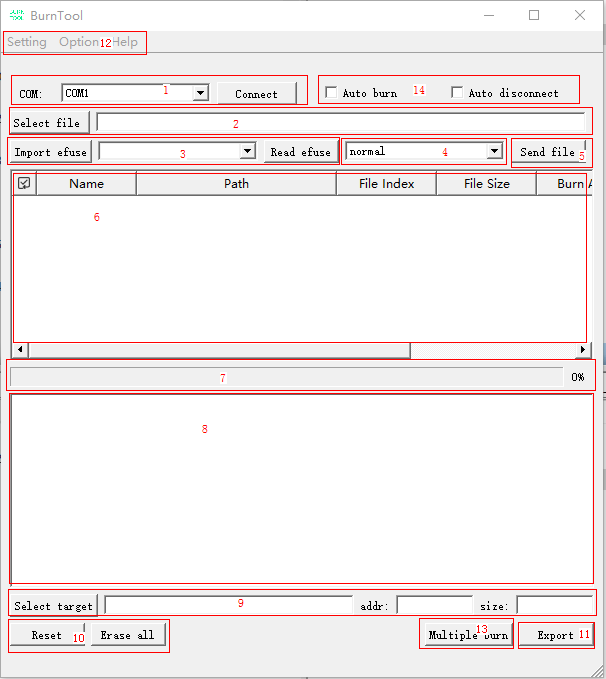

**表 1**  BurnTool界面说明

<a name="zh-cn_topic_0000001207721967_zh-cn_topic_0279549098_table156913141826"></a>
<table><thead align="left"><tr id="zh-cn_topic_0000001207721967_zh-cn_topic_0279549098_row0695148215"><th class="cellrowborder" valign="top" width="13.669999999999998%" id="mcps1.2.3.1.1"><p id="zh-cn_topic_0000001207721967_zh-cn_topic_0279549098_p5455981"><a name="zh-cn_topic_0000001207721967_zh-cn_topic_0279549098_p5455981"></a><a name="zh-cn_topic_0000001207721967_zh-cn_topic_0279549098_p5455981"></a>区域</p>
</th>
<th class="cellrowborder" valign="top" width="86.33%" id="mcps1.2.3.1.2"><p id="zh-cn_topic_0000001207721967_zh-cn_topic_0279549098_p39281331"><a name="zh-cn_topic_0000001207721967_zh-cn_topic_0279549098_p39281331"></a><a name="zh-cn_topic_0000001207721967_zh-cn_topic_0279549098_p39281331"></a>说明</p>
</th>
</tr>
</thead>
<tbody><tr id="zh-cn_topic_0000001207721967_zh-cn_topic_0279549098_row10707148214"><td class="cellrowborder" valign="top" width="13.669999999999998%" headers="mcps1.2.3.1.1 "><p id="zh-cn_topic_0000001207721967_zh-cn_topic_0279549098_p47714657"><a name="zh-cn_topic_0000001207721967_zh-cn_topic_0279549098_p47714657"></a><a name="zh-cn_topic_0000001207721967_zh-cn_topic_0279549098_p47714657"></a>1</p>
</td>
<td class="cellrowborder" valign="top" width="86.33%" headers="mcps1.2.3.1.2 "><a name="zh-cn_topic_0000001207721967_zh-cn_topic_0279549098_ul85142597204"></a><a name="zh-cn_topic_0000001207721967_zh-cn_topic_0279549098_ul85142597204"></a><ul id="zh-cn_topic_0000001207721967_zh-cn_topic_0279549098_ul85142597204"><li>Connect：打开串口并发送打断报文。</li><li>COM：串口号列表，显示当前可用串口号。</li></ul>
</td>
</tr>
<tr id="zh-cn_topic_0000001207721967_zh-cn_topic_0279549098_row7702141527"><td class="cellrowborder" valign="top" width="13.669999999999998%" headers="mcps1.2.3.1.1 "><p id="zh-cn_topic_0000001207721967_zh-cn_topic_0279549098_p63739165"><a name="zh-cn_topic_0000001207721967_zh-cn_topic_0279549098_p63739165"></a><a name="zh-cn_topic_0000001207721967_zh-cn_topic_0279549098_p63739165"></a>2</p>
</td>
<td class="cellrowborder" valign="top" width="86.33%" headers="mcps1.2.3.1.2 "><a name="zh-cn_topic_0000001207721967_zh-cn_topic_0279549098_ul1083103511613"></a><a name="zh-cn_topic_0000001207721967_zh-cn_topic_0279549098_ul1083103511613"></a><ul id="zh-cn_topic_0000001207721967_zh-cn_topic_0279549098_ul1083103511613"><li>Select file：选择烧写镜像。</li><li>Delete：将表格中的选中行删除。</li></ul>
</td>
</tr>
<tr id="zh-cn_topic_0000001207721967_zh-cn_topic_0279549098_row107011141123"><td class="cellrowborder" valign="top" width="13.669999999999998%" headers="mcps1.2.3.1.1 "><p id="zh-cn_topic_0000001207721967_zh-cn_topic_0279549098_p4179377"><a name="zh-cn_topic_0000001207721967_zh-cn_topic_0279549098_p4179377"></a><a name="zh-cn_topic_0000001207721967_zh-cn_topic_0279549098_p4179377"></a>3</p>
</td>
<td class="cellrowborder" valign="top" width="86.33%" headers="mcps1.2.3.1.2 "><a name="zh-cn_topic_0000001207721967_zh-cn_topic_0279549098_ul121341840460"></a><a name="zh-cn_topic_0000001207721967_zh-cn_topic_0279549098_ul121341840460"></a><ul id="zh-cn_topic_0000001207721967_zh-cn_topic_0279549098_ul121341840460"><li>Import Efuse：导入eFuse配置文件。</li><li>Efuse列表：显示当前可读取的eFuse名称。</li><li>Read Efuse：根据选中的eFuse下发读取报文。</li></ul>
</td>
</tr>
<tr id="zh-cn_topic_0000001207721967_zh-cn_topic_0279549098_row1770214822"><td class="cellrowborder" valign="top" width="13.669999999999998%" headers="mcps1.2.3.1.1 "><p id="zh-cn_topic_0000001207721967_zh-cn_topic_0279549098_p57396781"><a name="zh-cn_topic_0000001207721967_zh-cn_topic_0279549098_p57396781"></a><a name="zh-cn_topic_0000001207721967_zh-cn_topic_0279549098_p57396781"></a>4</p>
</td>
<td class="cellrowborder" valign="top" width="86.33%" headers="mcps1.2.3.1.2 "><a name="zh-cn_topic_0000001207721967_zh-cn_topic_0279549098_ul33174514213"></a><a name="zh-cn_topic_0000001207721967_zh-cn_topic_0279549098_ul33174514213"></a><ul id="zh-cn_topic_0000001207721967_zh-cn_topic_0279549098_ul33174514213"><li>Erase Mode：选择擦除模式。<a name="zh-cn_topic_0000001207721967_zh-cn_topic_0279549098_ul11788427400"></a><a name="zh-cn_topic_0000001207721967_zh-cn_topic_0279549098_ul11788427400"></a><ul id="zh-cn_topic_0000001207721967_zh-cn_topic_0279549098_ul11788427400"><li>normal：按照固件包中的参数进行擦除操作。</li><li>erase all：第一个烧写项进行全片擦除，剩余烧写项不再进行擦除操作。</li><li>no erase：不进行擦除操作。注意，该方式需要保证flash为空片或已进行全片擦除。</li></ul>
</li></ul>
</td>
</tr>
<tr id="zh-cn_topic_0000001207721967_zh-cn_topic_0279549098_row14707149214"><td class="cellrowborder" valign="top" width="13.669999999999998%" headers="mcps1.2.3.1.1 "><p id="zh-cn_topic_0000001207721967_zh-cn_topic_0279549098_p23568328"><a name="zh-cn_topic_0000001207721967_zh-cn_topic_0279549098_p23568328"></a><a name="zh-cn_topic_0000001207721967_zh-cn_topic_0279549098_p23568328"></a>5</p>
</td>
<td class="cellrowborder" valign="top" width="86.33%" headers="mcps1.2.3.1.2 "><p id="zh-cn_topic_0000001207721967_zh-cn_topic_0279549098_p543412584714"><a name="zh-cn_topic_0000001207721967_zh-cn_topic_0279549098_p543412584714"></a><a name="zh-cn_topic_0000001207721967_zh-cn_topic_0279549098_p543412584714"></a>Send file：按照表格选中信息依次烧写镜像。</p>
</td>
</tr>
<tr id="zh-cn_topic_0000001207721967_zh-cn_topic_0279549098_row37018141229"><td class="cellrowborder" valign="top" width="13.669999999999998%" headers="mcps1.2.3.1.1 "><p id="zh-cn_topic_0000001207721967_zh-cn_topic_0279549098_p49697568"><a name="zh-cn_topic_0000001207721967_zh-cn_topic_0279549098_p49697568"></a><a name="zh-cn_topic_0000001207721967_zh-cn_topic_0279549098_p49697568"></a>6</p>
</td>
<td class="cellrowborder" valign="top" width="86.33%" headers="mcps1.2.3.1.2 "><p id="zh-cn_topic_0000001207721967_zh-cn_topic_0279549098_p9951144310910"><a name="zh-cn_topic_0000001207721967_zh-cn_topic_0279549098_p9951144310910"></a><a name="zh-cn_topic_0000001207721967_zh-cn_topic_0279549098_p9951144310910"></a>镜像表格：显示可被烧写的镜像信息。各列含义为：</p>
<a name="zh-cn_topic_0000001207721967_zh-cn_topic_0279549098_ul1989564910910"></a><a name="zh-cn_topic_0000001207721967_zh-cn_topic_0279549098_ul1989564910910"></a><ul id="zh-cn_topic_0000001207721967_zh-cn_topic_0279549098_ul1989564910910"><li>Name：名称。</li><li>Path：路径。</li><li>File Index：镜像在文件中的起始索引。</li><li>File Size：镜像大小。</li><li>Burn Addr：烧写的Flash起始地址。</li><li>Burn Size：擦除的Flash大小。</li><li>Type：通用类型，包括：<a name="zh-cn_topic_0000001207721967_zh-cn_topic_0279549098_ul885418294117"></a><a name="zh-cn_topic_0000001207721967_zh-cn_topic_0279549098_ul885418294117"></a><ul id="zh-cn_topic_0000001207721967_zh-cn_topic_0279549098_ul885418294117"><li>0：Loader。</li><li>1：一般镜像文件。</li><li>2：参数文件。</li><li>3：eFuse文件。</li></ul>
<p id="zh-cn_topic_0000001207721967_zh-cn_topic_0279549098_p14365142618416"><a name="zh-cn_topic_0000001207721967_zh-cn_topic_0279549098_p14365142618416"></a><a name="zh-cn_topic_0000001207721967_zh-cn_topic_0279549098_p14365142618416"></a>其他的数字由各产品定义，不一一列举。</p>
</li></ul>
</td>
</tr>
<tr id="zh-cn_topic_0000001207721967_zh-cn_topic_0279549098_row1388672115219"><td class="cellrowborder" valign="top" width="13.669999999999998%" headers="mcps1.2.3.1.1 "><p id="zh-cn_topic_0000001207721967_zh-cn_topic_0279549098_p55310098"><a name="zh-cn_topic_0000001207721967_zh-cn_topic_0279549098_p55310098"></a><a name="zh-cn_topic_0000001207721967_zh-cn_topic_0279549098_p55310098"></a>7</p>
</td>
<td class="cellrowborder" valign="top" width="86.33%" headers="mcps1.2.3.1.2 "><p id="zh-cn_topic_0000001207721967_zh-cn_topic_0279549098_p1612521515910"><a name="zh-cn_topic_0000001207721967_zh-cn_topic_0279549098_p1612521515910"></a><a name="zh-cn_topic_0000001207721967_zh-cn_topic_0279549098_p1612521515910"></a>烧写进度。</p>
</td>
</tr>
<tr id="zh-cn_topic_0000001207721967_zh-cn_topic_0279549098_row288620211526"><td class="cellrowborder" valign="top" width="13.669999999999998%" headers="mcps1.2.3.1.1 "><p id="zh-cn_topic_0000001207721967_zh-cn_topic_0279549098_p36189605"><a name="zh-cn_topic_0000001207721967_zh-cn_topic_0279549098_p36189605"></a><a name="zh-cn_topic_0000001207721967_zh-cn_topic_0279549098_p36189605"></a>8</p>
</td>
<td class="cellrowborder" valign="top" width="86.33%" headers="mcps1.2.3.1.2 "><p id="zh-cn_topic_0000001207721967_zh-cn_topic_0279549098_p31461811102010"><a name="zh-cn_topic_0000001207721967_zh-cn_topic_0279549098_p31461811102010"></a><a name="zh-cn_topic_0000001207721967_zh-cn_topic_0279549098_p31461811102010"></a>回显视图：显示打断之后单板上报的数据。</p>
</td>
</tr>
<tr id="zh-cn_topic_0000001207721967_zh-cn_topic_0279549098_row1539045322012"><td class="cellrowborder" valign="top" width="13.669999999999998%" headers="mcps1.2.3.1.1 "><p id="zh-cn_topic_0000001207721967_zh-cn_topic_0279549098_p1139015311202"><a name="zh-cn_topic_0000001207721967_zh-cn_topic_0279549098_p1139015311202"></a><a name="zh-cn_topic_0000001207721967_zh-cn_topic_0279549098_p1139015311202"></a>9</p>
</td>
<td class="cellrowborder" valign="top" width="86.33%" headers="mcps1.2.3.1.2 "><a name="zh-cn_topic_0000001207721967_zh-cn_topic_0279549098_ul113165792216"></a><a name="zh-cn_topic_0000001207721967_zh-cn_topic_0279549098_ul113165792216"></a><ul id="zh-cn_topic_0000001207721967_zh-cn_topic_0279549098_ul113165792216"><li>Select target：选择导出镜像位置。</li><li>addr：输入要导出的Flash起始地址。</li><li>size：输入要导出的Flash大小。</li></ul>
</td>
</tr>
<tr id="zh-cn_topic_0000001207721967_zh-cn_topic_0279549098_row579172745311"><td class="cellrowborder" valign="top" width="13.669999999999998%" headers="mcps1.2.3.1.1 "><p id="zh-cn_topic_0000001207721967_zh-cn_topic_0279549098_p1479220277536"><a name="zh-cn_topic_0000001207721967_zh-cn_topic_0279549098_p1479220277536"></a><a name="zh-cn_topic_0000001207721967_zh-cn_topic_0279549098_p1479220277536"></a>10</p>
</td>
<td class="cellrowborder" valign="top" width="86.33%" headers="mcps1.2.3.1.2 "><p id="zh-cn_topic_0000001207721967_zh-cn_topic_0279549098_p13684748173011"><a name="zh-cn_topic_0000001207721967_zh-cn_topic_0279549098_p13684748173011"></a><a name="zh-cn_topic_0000001207721967_zh-cn_topic_0279549098_p13684748173011"></a>Reset：重启单板。(本功能仅在烧写loader之后生效)</p>
<p id="zh-cn_topic_0000001207721967_zh-cn_topic_0279549098_p025717111612"><a name="zh-cn_topic_0000001207721967_zh-cn_topic_0279549098_p025717111612"></a><a name="zh-cn_topic_0000001207721967_zh-cn_topic_0279549098_p025717111612"></a>Erase all：全片擦除。(本功能仅在烧写loader之后生效)</p>
</td>
</tr>
<tr id="zh-cn_topic_0000001207721967_zh-cn_topic_0279549098_row649954692020"><td class="cellrowborder" valign="top" width="13.669999999999998%" headers="mcps1.2.3.1.1 "><p id="zh-cn_topic_0000001207721967_zh-cn_topic_0279549098_p13499164652019"><a name="zh-cn_topic_0000001207721967_zh-cn_topic_0279549098_p13499164652019"></a><a name="zh-cn_topic_0000001207721967_zh-cn_topic_0279549098_p13499164652019"></a>11</p>
</td>
<td class="cellrowborder" valign="top" width="86.33%" headers="mcps1.2.3.1.2 "><p id="zh-cn_topic_0000001207721967_zh-cn_topic_0279549098_p10745162311459"><a name="zh-cn_topic_0000001207721967_zh-cn_topic_0279549098_p10745162311459"></a><a name="zh-cn_topic_0000001207721967_zh-cn_topic_0279549098_p10745162311459"></a>Export：导出镜像。(本功能仅在烧写loader之后生效)</p>
</td>
</tr>
<tr id="zh-cn_topic_0000001207721967_zh-cn_topic_0279549098_row1588515211226"><td class="cellrowborder" valign="top" width="13.669999999999998%" headers="mcps1.2.3.1.1 "><p id="zh-cn_topic_0000001207721967_zh-cn_topic_0279549098_p41303584"><a name="zh-cn_topic_0000001207721967_zh-cn_topic_0279549098_p41303584"></a><a name="zh-cn_topic_0000001207721967_zh-cn_topic_0279549098_p41303584"></a>12</p>
</td>
<td class="cellrowborder" valign="top" width="86.33%" headers="mcps1.2.3.1.2 "><a name="zh-cn_topic_0000001207721967_zh-cn_topic_0279549098_ul218617351719"></a><a name="zh-cn_topic_0000001207721967_zh-cn_topic_0279549098_ul218617351719"></a><ul id="zh-cn_topic_0000001207721967_zh-cn_topic_0279549098_ul218617351719"><li>Setting：包括以下菜单：<a name="zh-cn_topic_0000001207721967_zh-cn_topic_0279549098_ul15707193414267"></a><a name="zh-cn_topic_0000001207721967_zh-cn_topic_0279549098_ul15707193414267"></a><ul id="zh-cn_topic_0000001207721967_zh-cn_topic_0279549098_ul15707193414267"><li>Settings：设置串口参数。</li><li>Burn interval：设置打断间隔（选中2ms表示打断时以2ms间隔发送打断报文，10ms同理）。</li><li>Import config：导入配置文件。</li><li>Save config：保存配置文件。</li><li>Language：修改语言。</li></ul>
</li><li>Option：包含以下菜单<a name="zh-cn_topic_0000001207721967_ul14619118971"></a><a name="zh-cn_topic_0000001207721967_ul14619118971"></a><ul id="zh-cn_topic_0000001207721967_ul14619118971"><li>Change chip：切换芯片。</li></ul>
</li><li>Help：显示版本号。</li></ul>
</td>
</tr>
<tr id="zh-cn_topic_0000001207721967_zh-cn_topic_0279549098_row925116613581"><td class="cellrowborder" valign="top" width="13.669999999999998%" headers="mcps1.2.3.1.1 "><p id="zh-cn_topic_0000001207721967_zh-cn_topic_0279549098_p225114685817"><a name="zh-cn_topic_0000001207721967_zh-cn_topic_0279549098_p225114685817"></a><a name="zh-cn_topic_0000001207721967_zh-cn_topic_0279549098_p225114685817"></a>13</p>
</td>
<td class="cellrowborder" valign="top" width="86.33%" headers="mcps1.2.3.1.2 "><p id="zh-cn_topic_0000001207721967_zh-cn_topic_0279549098_p5251156195814"><a name="zh-cn_topic_0000001207721967_zh-cn_topic_0279549098_p5251156195814"></a><a name="zh-cn_topic_0000001207721967_zh-cn_topic_0279549098_p5251156195814"></a>Multiple burn：进入工厂烧写界面。</p>
</td>
</tr>
<tr id="zh-cn_topic_0000001207721967_zh-cn_topic_0279549098_row161301845171317"><td class="cellrowborder" valign="top" width="13.669999999999998%" headers="mcps1.2.3.1.1 "><p id="zh-cn_topic_0000001207721967_zh-cn_topic_0279549098_p613164517135"><a name="zh-cn_topic_0000001207721967_zh-cn_topic_0279549098_p613164517135"></a><a name="zh-cn_topic_0000001207721967_zh-cn_topic_0279549098_p613164517135"></a>14</p>
</td>
<td class="cellrowborder" valign="top" width="86.33%" headers="mcps1.2.3.1.2 "><a name="zh-cn_topic_0000001207721967_zh-cn_topic_0279549098_ul11104195221319"></a><a name="zh-cn_topic_0000001207721967_zh-cn_topic_0279549098_ul11104195221319"></a><ul id="zh-cn_topic_0000001207721967_zh-cn_topic_0279549098_ul11104195221319"><li>Auto burn：打断成功后无需单击“Send file”按钮。工具将按照表格选中的信息依次烧写镜像。<p id="zh-cn_topic_0000001207721967_p6318450978"><a name="zh-cn_topic_0000001207721967_p6318450978"></a><a name="zh-cn_topic_0000001207721967_p6318450978"></a>注意：该功能仅用于烧写，若需要导出镜像或读efuse则不可勾选。</p>
</li><li>Auto disconnect: 在程序烧写完成后自动断开连接。</li></ul>
</td>
</tr>
</tbody>
</table>

### BurnTool-Dfu<a name="ZH-CN_TOPIC_0000002022466549"></a>

DFU升级界面如[图1](#zh-cn_topic_0000001860864884_fig67031058134814)所示，Auto DFU烧写界面如[图2](#zh-cn_topic_0000001860864884_fig450363243119)所示，Hid DFU升级界面如[图3](#zh-cn_topic_0000001860864884_fig965583135018)所示

**图 1**  DFU升级界面<a name="zh-cn_topic_0000001860864884_fig67031058134814"></a>  
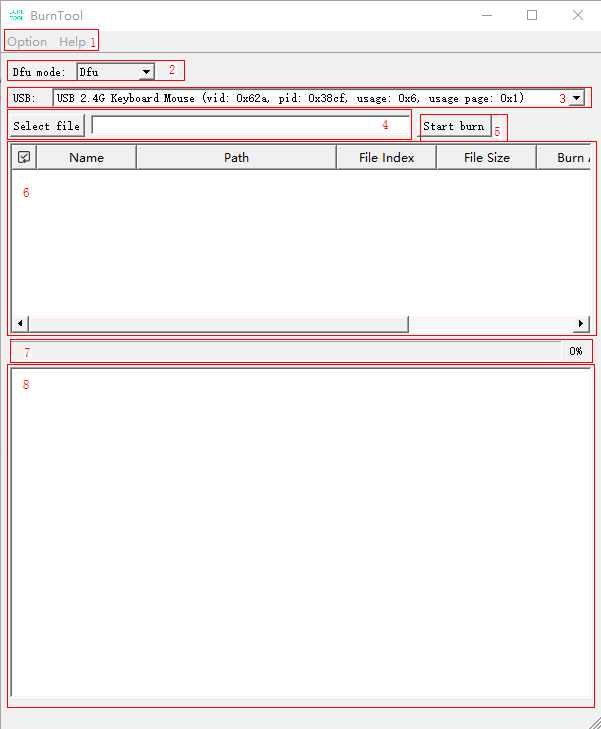

**图 2**  Auto DFU烧写界面<a name="zh-cn_topic_0000001860864884_fig450363243119"></a>  
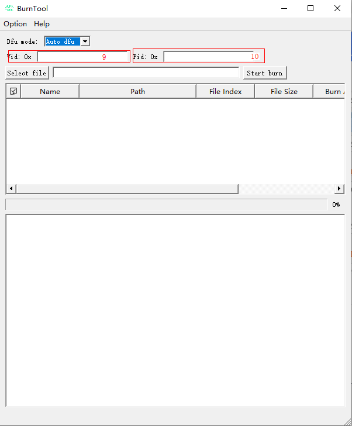

**图 3**  Hid DFU升级界面<a name="zh-cn_topic_0000001860864884_fig965583135018"></a>  
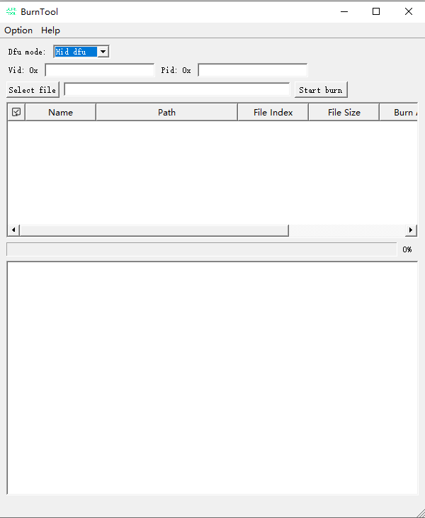

**表 1**  Dfu烧写界面说明

<a name="zh-cn_topic_0000001860864884_table1923619111210"></a>
<table><thead align="left"><tr id="zh-cn_topic_0000001860864884_row8232019141213"><th class="cellrowborder" valign="top" width="13.66%" id="mcps1.2.3.1.1"><p id="zh-cn_topic_0000001860864884_p12351913126"><a name="zh-cn_topic_0000001860864884_p12351913126"></a><a name="zh-cn_topic_0000001860864884_p12351913126"></a>区域</p>
</th>
<th class="cellrowborder" valign="top" width="86.33999999999999%" id="mcps1.2.3.1.2"><p id="zh-cn_topic_0000001860864884_p9232199124"><a name="zh-cn_topic_0000001860864884_p9232199124"></a><a name="zh-cn_topic_0000001860864884_p9232199124"></a>说明</p>
</th>
</tr>
</thead>
<tbody><tr id="zh-cn_topic_0000001860864884_row1623119111212"><td class="cellrowborder" valign="top" width="13.66%" headers="mcps1.2.3.1.1 "><p id="zh-cn_topic_0000001860864884_p1723219201211"><a name="zh-cn_topic_0000001860864884_p1723219201211"></a><a name="zh-cn_topic_0000001860864884_p1723219201211"></a>1</p>
</td>
<td class="cellrowborder" valign="top" width="86.33999999999999%" headers="mcps1.2.3.1.2 "><a name="zh-cn_topic_0000001860864884_ul15231719181215"></a><a name="zh-cn_topic_0000001860864884_ul15231719181215"></a><ul id="zh-cn_topic_0000001860864884_ul15231719181215"><li>Option：包括以下菜单：<a name="zh-cn_topic_0000001860864884_ul1886910264194"></a><a name="zh-cn_topic_0000001860864884_ul1886910264194"></a><ul id="zh-cn_topic_0000001860864884_ul1886910264194"><li>Change Chip：修改产品。</li><li>Language：修改语言。</li></ul>
</li><li>Help：包括以下菜单：<a name="zh-cn_topic_0000001860864884_ul449165114915"></a><a name="zh-cn_topic_0000001860864884_ul449165114915"></a><ul id="zh-cn_topic_0000001860864884_ul449165114915"><li>About：显示版本信息。</li></ul>
</li></ul>
</td>
</tr>
<tr id="zh-cn_topic_0000001860864884_row8226123835212"><td class="cellrowborder" valign="top" width="13.66%" headers="mcps1.2.3.1.1 "><p id="zh-cn_topic_0000001860864884_p19226143818521"><a name="zh-cn_topic_0000001860864884_p19226143818521"></a><a name="zh-cn_topic_0000001860864884_p19226143818521"></a>2</p>
</td>
<td class="cellrowborder" valign="top" width="86.33999999999999%" headers="mcps1.2.3.1.2 "><a name="zh-cn_topic_0000001860864884_ul19532650175210"></a><a name="zh-cn_topic_0000001860864884_ul19532650175210"></a><ul id="zh-cn_topic_0000001860864884_ul19532650175210"><li>Dfu mode：选择DFU的升级模式<a name="zh-cn_topic_0000001860864884_ul8603024165318"></a><a name="zh-cn_topic_0000001860864884_ul8603024165318"></a><ul id="zh-cn_topic_0000001860864884_ul8603024165318"><li>Dfu： 在hid状态切换到dfu升级模式进行dfu升级。</li><li>Auto dfu：直接进入dfu升级模式。</li><li>Hid dfu：在hid状态直接升级。</li></ul>
</li></ul>
</td>
</tr>
<tr id="zh-cn_topic_0000001860864884_row3237195120"><td class="cellrowborder" valign="top" width="13.66%" headers="mcps1.2.3.1.1 "><p id="zh-cn_topic_0000001860864884_p2023219131213"><a name="zh-cn_topic_0000001860864884_p2023219131213"></a><a name="zh-cn_topic_0000001860864884_p2023219131213"></a>3</p>
</td>
<td class="cellrowborder" valign="top" width="86.33999999999999%" headers="mcps1.2.3.1.2 "><a name="zh-cn_topic_0000001860864884_ul1231919191217"></a><a name="zh-cn_topic_0000001860864884_ul1231919191217"></a><ul id="zh-cn_topic_0000001860864884_ul1231919191217"><li>USB：显示所有的USB-HID设备</li></ul>
</td>
</tr>
<tr id="zh-cn_topic_0000001860864884_row723919141213"><td class="cellrowborder" valign="top" width="13.66%" headers="mcps1.2.3.1.1 "><p id="zh-cn_topic_0000001860864884_p1623141971211"><a name="zh-cn_topic_0000001860864884_p1623141971211"></a><a name="zh-cn_topic_0000001860864884_p1623141971211"></a>4</p>
</td>
<td class="cellrowborder" valign="top" width="86.33999999999999%" headers="mcps1.2.3.1.2 "><a name="zh-cn_topic_0000001860864884_ul1023719141210"></a><a name="zh-cn_topic_0000001860864884_ul1023719141210"></a><ul id="zh-cn_topic_0000001860864884_ul1023719141210"><li>Select file：选择格式为fwpkg的烧写镜像，并显示烧写镜像路径。</li></ul>
</td>
</tr>
<tr id="zh-cn_topic_0000001860864884_row19231319171216"><td class="cellrowborder" valign="top" width="13.66%" headers="mcps1.2.3.1.1 "><p id="zh-cn_topic_0000001860864884_p17231219121216"><a name="zh-cn_topic_0000001860864884_p17231219121216"></a><a name="zh-cn_topic_0000001860864884_p17231219121216"></a>5</p>
</td>
<td class="cellrowborder" valign="top" width="86.33999999999999%" headers="mcps1.2.3.1.2 "><a name="zh-cn_topic_0000001860864884_ul153732715383"></a><a name="zh-cn_topic_0000001860864884_ul153732715383"></a><ul id="zh-cn_topic_0000001860864884_ul153732715383"><li>Start burn：按照表格选中信息依次烧写镜像。</li></ul>
</td>
</tr>
<tr id="zh-cn_topic_0000001860864884_row112481931213"><td class="cellrowborder" valign="top" width="13.66%" headers="mcps1.2.3.1.1 "><p id="zh-cn_topic_0000001860864884_p1324219121220"><a name="zh-cn_topic_0000001860864884_p1324219121220"></a><a name="zh-cn_topic_0000001860864884_p1324219121220"></a>6</p>
</td>
<td class="cellrowborder" valign="top" width="86.33999999999999%" headers="mcps1.2.3.1.2 "><p id="zh-cn_topic_0000001860864884_p20241719121218"><a name="zh-cn_topic_0000001860864884_p20241719121218"></a><a name="zh-cn_topic_0000001860864884_p20241719121218"></a>镜像表格：显示可被烧写的镜像信息。各列含义为：</p>
<a name="zh-cn_topic_0000001860864884_ul1824161981218"></a><a name="zh-cn_topic_0000001860864884_ul1824161981218"></a><ul id="zh-cn_topic_0000001860864884_ul1824161981218"><li>Name：名称。</li><li>Path：路径。</li><li>File Index：镜像在文件中的起始索引。</li><li>File Size：镜像大小。</li><li>Burn Addr：烧写的Flash起始地址。</li><li>Burn Size：擦除的Flash大小。</li><li>Type：通用类型，包括：<a name="zh-cn_topic_0000001860864884_zh-cn_topic_0279549098_ul885418294117"></a><a name="zh-cn_topic_0000001860864884_zh-cn_topic_0279549098_ul885418294117"></a><ul id="zh-cn_topic_0000001860864884_zh-cn_topic_0279549098_ul885418294117"><li>0：Loader。</li><li>1：一般镜像文件。</li><li>2：参数文件。</li><li>3：eFuse文件。</li></ul>
<a name="zh-cn_topic_0000001860864884_ul41646461563"></a><a name="zh-cn_topic_0000001860864884_ul41646461563"></a><ul id="zh-cn_topic_0000001860864884_ul41646461563"><li>32：fota文件。</li></ul>
</li></ul>
</td>
</tr>
<tr id="zh-cn_topic_0000001860864884_row824119151216"><td class="cellrowborder" valign="top" width="13.66%" headers="mcps1.2.3.1.1 "><p id="zh-cn_topic_0000001860864884_p1024719131211"><a name="zh-cn_topic_0000001860864884_p1024719131211"></a><a name="zh-cn_topic_0000001860864884_p1024719131211"></a>7</p>
</td>
<td class="cellrowborder" valign="top" width="86.33999999999999%" headers="mcps1.2.3.1.2 "><a name="zh-cn_topic_0000001860864884_ul19822102410408"></a><a name="zh-cn_topic_0000001860864884_ul19822102410408"></a><ul id="zh-cn_topic_0000001860864884_ul19822102410408"><li>烧写进度。</li></ul>
</td>
</tr>
<tr id="zh-cn_topic_0000001860864884_row2024101919122"><td class="cellrowborder" valign="top" width="13.66%" headers="mcps1.2.3.1.1 "><p id="zh-cn_topic_0000001860864884_p82411911120"><a name="zh-cn_topic_0000001860864884_p82411911120"></a><a name="zh-cn_topic_0000001860864884_p82411911120"></a>8</p>
</td>
<td class="cellrowborder" valign="top" width="86.33999999999999%" headers="mcps1.2.3.1.2 "><a name="zh-cn_topic_0000001860864884_ul68661610184110"></a><a name="zh-cn_topic_0000001860864884_ul68661610184110"></a><ul id="zh-cn_topic_0000001860864884_ul68661610184110"><li>日志视图：显示烧写过程中单板上报的日志及工具打印的日志。</li></ul>
</td>
</tr>
<tr id="zh-cn_topic_0000001860864884_row2842044193219"><td class="cellrowborder" valign="top" width="13.66%" headers="mcps1.2.3.1.1 "><p id="zh-cn_topic_0000001860864884_p14842124413213"><a name="zh-cn_topic_0000001860864884_p14842124413213"></a><a name="zh-cn_topic_0000001860864884_p14842124413213"></a>9</p>
</td>
<td class="cellrowborder" valign="top" width="86.33999999999999%" headers="mcps1.2.3.1.2 "><a name="zh-cn_topic_0000001860864884_ul465664163310"></a><a name="zh-cn_topic_0000001860864884_ul465664163310"></a><ul id="zh-cn_topic_0000001860864884_ul465664163310"><li>Vid：设备的Vendor ID。</li></ul>
</td>
</tr>
<tr id="zh-cn_topic_0000001860864884_row5572238203214"><td class="cellrowborder" valign="top" width="13.66%" headers="mcps1.2.3.1.1 "><p id="zh-cn_topic_0000001860864884_p1257363817326"><a name="zh-cn_topic_0000001860864884_p1257363817326"></a><a name="zh-cn_topic_0000001860864884_p1257363817326"></a>10</p>
</td>
<td class="cellrowborder" valign="top" width="86.33999999999999%" headers="mcps1.2.3.1.2 "><a name="zh-cn_topic_0000001860864884_ul1845617330340"></a><a name="zh-cn_topic_0000001860864884_ul1845617330340"></a><ul id="zh-cn_topic_0000001860864884_ul1845617330340"><li>Pid：设备的Product ID。</li></ul>
</td>
</tr>
</tbody>
</table>

### BurnTool-Jlink<a name="ZH-CN_TOPIC_0000001985747196"></a>

Jlink烧写界面如[图1](#zh-cn_topic_0000001906904645_fig12224550243)所示

**图 1**  Jlink烧写界面<a name="zh-cn_topic_0000001906904645_fig12224550243"></a>  
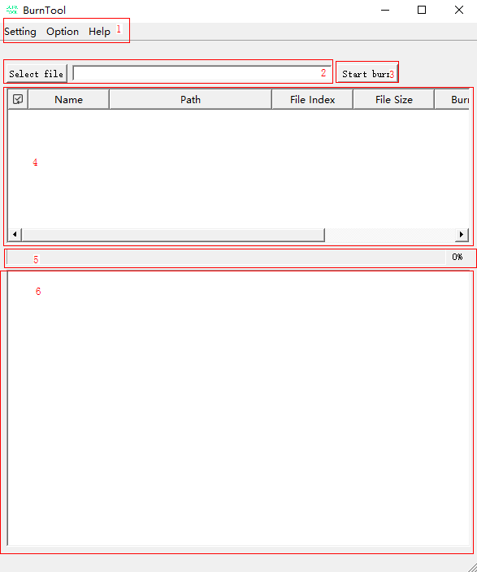

**表 1**  Jlink烧写界面说明

<a name="zh-cn_topic_0000001906904645_table1923619111210"></a>
<table><thead align="left"><tr id="zh-cn_topic_0000001906904645_row8232019141213"><th class="cellrowborder" valign="top" width="13.66%" id="mcps1.2.3.1.1"><p id="zh-cn_topic_0000001906904645_p12351913126"><a name="zh-cn_topic_0000001906904645_p12351913126"></a><a name="zh-cn_topic_0000001906904645_p12351913126"></a>区域</p>
</th>
<th class="cellrowborder" valign="top" width="86.33999999999999%" id="mcps1.2.3.1.2"><p id="zh-cn_topic_0000001906904645_p9232199124"><a name="zh-cn_topic_0000001906904645_p9232199124"></a><a name="zh-cn_topic_0000001906904645_p9232199124"></a>说明</p>
</th>
</tr>
</thead>
<tbody><tr id="zh-cn_topic_0000001906904645_row1623119111212"><td class="cellrowborder" valign="top" width="13.66%" headers="mcps1.2.3.1.1 "><p id="zh-cn_topic_0000001906904645_p1723219201211"><a name="zh-cn_topic_0000001906904645_p1723219201211"></a><a name="zh-cn_topic_0000001906904645_p1723219201211"></a>1</p>
</td>
<td class="cellrowborder" valign="top" width="86.33999999999999%" headers="mcps1.2.3.1.2 "><a name="zh-cn_topic_0000001906904645_ul15231719181215"></a><a name="zh-cn_topic_0000001906904645_ul15231719181215"></a><ul id="zh-cn_topic_0000001906904645_ul15231719181215"><li>Setting：<div class="p" id="zh-cn_topic_0000001906904645_p8924153174517"><a name="zh-cn_topic_0000001906904645_p8924153174517"></a><a name="zh-cn_topic_0000001906904645_p8924153174517"></a>包括以下菜单：<a name="zh-cn_topic_0000001906904645_ul1077410220134"></a><a name="zh-cn_topic_0000001906904645_ul1077410220134"></a><ul id="zh-cn_topic_0000001906904645_ul1077410220134"><li>Jlink Settings：设置Jlink执行文件路径。</li><li>Language：修改语言。</li></ul>
</div>
</li><li>Option：<div class="p" id="zh-cn_topic_0000001906904645_p381645954511"><a name="zh-cn_topic_0000001906904645_p381645954511"></a><a name="zh-cn_topic_0000001906904645_p381645954511"></a>包括以下菜单：<a name="zh-cn_topic_0000001906904645_ul1886910264194"></a><a name="zh-cn_topic_0000001906904645_ul1886910264194"></a><ul id="zh-cn_topic_0000001906904645_ul1886910264194"><li>Change Chip：修改产品。</li></ul>
</div>
</li><li>Help：<div class="p" id="zh-cn_topic_0000001906904645_p45421933465"><a name="zh-cn_topic_0000001906904645_p45421933465"></a><a name="zh-cn_topic_0000001906904645_p45421933465"></a>包括以下菜单：<a name="zh-cn_topic_0000001906904645_ul449165114915"></a><a name="zh-cn_topic_0000001906904645_ul449165114915"></a><ul id="zh-cn_topic_0000001906904645_ul449165114915"><li>About：显示版本信息。</li></ul>
</div>
</li></ul>
</td>
</tr>
<tr id="zh-cn_topic_0000001906904645_row3237195120"><td class="cellrowborder" valign="top" width="13.66%" headers="mcps1.2.3.1.1 "><p id="zh-cn_topic_0000001906904645_p2023219131213"><a name="zh-cn_topic_0000001906904645_p2023219131213"></a><a name="zh-cn_topic_0000001906904645_p2023219131213"></a>2</p>
</td>
<td class="cellrowborder" valign="top" width="86.33999999999999%" headers="mcps1.2.3.1.2 "><p id="zh-cn_topic_0000001906904645_p17153174519450"><a name="zh-cn_topic_0000001906904645_p17153174519450"></a><a name="zh-cn_topic_0000001906904645_p17153174519450"></a>Select file：选择格式为fwpkg的烧写镜像。</p>
</td>
</tr>
<tr id="zh-cn_topic_0000001906904645_row1723121921215"><td class="cellrowborder" valign="top" width="13.66%" headers="mcps1.2.3.1.1 "><p id="zh-cn_topic_0000001906904645_p7232019151215"><a name="zh-cn_topic_0000001906904645_p7232019151215"></a><a name="zh-cn_topic_0000001906904645_p7232019151215"></a>3</p>
</td>
<td class="cellrowborder" valign="top" width="86.33999999999999%" headers="mcps1.2.3.1.2 "><p id="zh-cn_topic_0000001906904645_p19153145184516"><a name="zh-cn_topic_0000001906904645_p19153145184516"></a><a name="zh-cn_topic_0000001906904645_p19153145184516"></a>Start burn：按照表格选中信息依次烧写镜像。</p>
</td>
</tr>
<tr id="zh-cn_topic_0000001906904645_row723919141213"><td class="cellrowborder" valign="top" width="13.66%" headers="mcps1.2.3.1.1 "><p id="zh-cn_topic_0000001906904645_p1623141971211"><a name="zh-cn_topic_0000001906904645_p1623141971211"></a><a name="zh-cn_topic_0000001906904645_p1623141971211"></a>4</p>
</td>
<td class="cellrowborder" valign="top" width="86.33999999999999%" headers="mcps1.2.3.1.2 "><p id="zh-cn_topic_0000001906904645_p858114453113"><a name="zh-cn_topic_0000001906904645_p858114453113"></a><a name="zh-cn_topic_0000001906904645_p858114453113"></a>镜像表格：显示可被烧写的镜像信息。各列含义如下。</p>
<a name="zh-cn_topic_0000001906904645_ul9925203813115"></a><a name="zh-cn_topic_0000001906904645_ul9925203813115"></a><ul id="zh-cn_topic_0000001906904645_ul9925203813115"><li>Name：名称。</li><li>Path：路径。</li><li>File Index：镜像在文件中的起始索引。</li><li>File Size：镜像大小。</li><li>Burn Addr：烧写的Flash起始地址。</li><li>Burn Size：擦除的Flash大小。</li><li>Type：烧写文件类型。</li></ul>
</td>
</tr>
<tr id="zh-cn_topic_0000001906904645_row19231319171216"><td class="cellrowborder" valign="top" width="13.66%" headers="mcps1.2.3.1.1 "><p id="zh-cn_topic_0000001906904645_p17231219121216"><a name="zh-cn_topic_0000001906904645_p17231219121216"></a><a name="zh-cn_topic_0000001906904645_p17231219121216"></a>5</p>
</td>
<td class="cellrowborder" valign="top" width="86.33999999999999%" headers="mcps1.2.3.1.2 "><p id="zh-cn_topic_0000001906904645_p15731542194514"><a name="zh-cn_topic_0000001906904645_p15731542194514"></a><a name="zh-cn_topic_0000001906904645_p15731542194514"></a>烧写进度。</p>
</td>
</tr>
<tr id="zh-cn_topic_0000001906904645_row112481931213"><td class="cellrowborder" valign="top" width="13.66%" headers="mcps1.2.3.1.1 "><p id="zh-cn_topic_0000001906904645_p1324219121220"><a name="zh-cn_topic_0000001906904645_p1324219121220"></a><a name="zh-cn_topic_0000001906904645_p1324219121220"></a>6</p>
</td>
<td class="cellrowborder" valign="top" width="86.33999999999999%" headers="mcps1.2.3.1.2 "><p id="zh-cn_topic_0000001906904645_p77481142134518"><a name="zh-cn_topic_0000001906904645_p77481142134518"></a><a name="zh-cn_topic_0000001906904645_p77481142134518"></a>日志视图：显示烧写过程中单板上报的日志及工具打印的日志。</p>
</td>
</tr>
</tbody>
</table>

### BurnTool-OTA升级<a name="ZH-CN_TOPIC_0000002022347001"></a>

OTA升级界面如[图1](#zh-cn_topic_0000001938380988_fig9360446113611)所示

**图 1**  OTA升级界面示意图<a name="zh-cn_topic_0000001938380988_fig9360446113611"></a>  


**表 1**  Jlink烧写界面说明

<a name="zh-cn_topic_0000001938380988_table1923619111210"></a>
<table><thead align="left"><tr id="zh-cn_topic_0000001938380988_row8232019141213"><th class="cellrowborder" valign="top" width="13.66%" id="mcps1.2.3.1.1"><p id="zh-cn_topic_0000001938380988_p12351913126"><a name="zh-cn_topic_0000001938380988_p12351913126"></a><a name="zh-cn_topic_0000001938380988_p12351913126"></a>区域</p>
</th>
<th class="cellrowborder" valign="top" width="86.33999999999999%" id="mcps1.2.3.1.2"><p id="zh-cn_topic_0000001938380988_p9232199124"><a name="zh-cn_topic_0000001938380988_p9232199124"></a><a name="zh-cn_topic_0000001938380988_p9232199124"></a>说明</p>
</th>
</tr>
</thead>
<tbody><tr id="zh-cn_topic_0000001938380988_row1623119111212"><td class="cellrowborder" valign="top" width="13.66%" headers="mcps1.2.3.1.1 "><p id="zh-cn_topic_0000001938380988_p1723219201211"><a name="zh-cn_topic_0000001938380988_p1723219201211"></a><a name="zh-cn_topic_0000001938380988_p1723219201211"></a>1</p>
</td>
<td class="cellrowborder" valign="top" width="86.33999999999999%" headers="mcps1.2.3.1.2 "><a name="zh-cn_topic_0000001938380988_ul15231719181215"></a><a name="zh-cn_topic_0000001938380988_ul15231719181215"></a><ul id="zh-cn_topic_0000001938380988_ul15231719181215"><li>Option：<div class="p" id="zh-cn_topic_0000001938380988_p381645954511"><a name="zh-cn_topic_0000001938380988_p381645954511"></a><a name="zh-cn_topic_0000001938380988_p381645954511"></a>包括以下菜单：<a name="zh-cn_topic_0000001938380988_ul1886910264194"></a><a name="zh-cn_topic_0000001938380988_ul1886910264194"></a><ul id="zh-cn_topic_0000001938380988_ul1886910264194"><li>Change Chip：修改产品。</li><li>Language：修改语言。</li></ul>
</div>
</li><li>Help：<div class="p" id="zh-cn_topic_0000001938380988_p45421933465"><a name="zh-cn_topic_0000001938380988_p45421933465"></a><a name="zh-cn_topic_0000001938380988_p45421933465"></a>包括以下菜单：<a name="zh-cn_topic_0000001938380988_ul449165114915"></a><a name="zh-cn_topic_0000001938380988_ul449165114915"></a><ul id="zh-cn_topic_0000001938380988_ul449165114915"><li>About：显示版本信息。</li></ul>
</div>
</li></ul>
</td>
</tr>
<tr id="zh-cn_topic_0000001938380988_row3237195120"><td class="cellrowborder" valign="top" width="13.66%" headers="mcps1.2.3.1.1 "><p id="zh-cn_topic_0000001938380988_p2023219131213"><a name="zh-cn_topic_0000001938380988_p2023219131213"></a><a name="zh-cn_topic_0000001938380988_p2023219131213"></a>2</p>
</td>
<td class="cellrowborder" valign="top" width="86.33999999999999%" headers="mcps1.2.3.1.2 "><a name="zh-cn_topic_0000001938380988_ul1231919191217"></a><a name="zh-cn_topic_0000001938380988_ul1231919191217"></a><ul id="zh-cn_topic_0000001938380988_ul1231919191217"><li>USB：显示所有的USB-HID设备。</li></ul>
</td>
</tr>
<tr id="zh-cn_topic_0000001938380988_row1723121921215"><td class="cellrowborder" valign="top" width="13.66%" headers="mcps1.2.3.1.1 "><p id="zh-cn_topic_0000001938380988_p7232019151215"><a name="zh-cn_topic_0000001938380988_p7232019151215"></a><a name="zh-cn_topic_0000001938380988_p7232019151215"></a>3</p>
</td>
<td class="cellrowborder" valign="top" width="86.33999999999999%" headers="mcps1.2.3.1.2 "><a name="zh-cn_topic_0000001938380988_ul613819284312"></a><a name="zh-cn_topic_0000001938380988_ul613819284312"></a><ul id="zh-cn_topic_0000001938380988_ul613819284312"><li>Open：打开所选的USB设备。</li></ul>
</td>
</tr>
<tr id="zh-cn_topic_0000001938380988_row20975142974318"><td class="cellrowborder" valign="top" width="13.66%" headers="mcps1.2.3.1.1 "><p id="zh-cn_topic_0000001938380988_p49753294437"><a name="zh-cn_topic_0000001938380988_p49753294437"></a><a name="zh-cn_topic_0000001938380988_p49753294437"></a>4</p>
</td>
<td class="cellrowborder" valign="top" width="86.33999999999999%" headers="mcps1.2.3.1.2 "><a name="zh-cn_topic_0000001938380988_ul159069338435"></a><a name="zh-cn_topic_0000001938380988_ul159069338435"></a><ul id="zh-cn_topic_0000001938380988_ul159069338435"><li>Address：Open时扫描设备设备地址，扫描到的设备添加其中。</li></ul>
</td>
</tr>
<tr id="zh-cn_topic_0000001938380988_row1244919287444"><td class="cellrowborder" valign="top" width="13.66%" headers="mcps1.2.3.1.1 "><p id="zh-cn_topic_0000001938380988_p444917280440"><a name="zh-cn_topic_0000001938380988_p444917280440"></a><a name="zh-cn_topic_0000001938380988_p444917280440"></a>5</p>
</td>
<td class="cellrowborder" valign="top" width="86.33999999999999%" headers="mcps1.2.3.1.2 "><a name="zh-cn_topic_0000001938380988_ul17307123213442"></a><a name="zh-cn_topic_0000001938380988_ul17307123213442"></a><ul id="zh-cn_topic_0000001938380988_ul17307123213442"><li>Connect：连接设备。</li></ul>
</td>
</tr>
<tr id="zh-cn_topic_0000001938380988_row18390124874411"><td class="cellrowborder" valign="top" width="13.66%" headers="mcps1.2.3.1.1 "><p id="zh-cn_topic_0000001938380988_p19390174824415"><a name="zh-cn_topic_0000001938380988_p19390174824415"></a><a name="zh-cn_topic_0000001938380988_p19390174824415"></a>6</p>
</td>
<td class="cellrowborder" valign="top" width="86.33999999999999%" headers="mcps1.2.3.1.2 "><a name="zh-cn_topic_0000001938380988_ul17987823104519"></a><a name="zh-cn_topic_0000001938380988_ul17987823104519"></a><ul id="zh-cn_topic_0000001938380988_ul17987823104519"><li>File：选择升级文件。</li></ul>
</td>
</tr>
<tr id="zh-cn_topic_0000001938380988_row163871658164519"><td class="cellrowborder" valign="top" width="13.66%" headers="mcps1.2.3.1.1 "><p id="zh-cn_topic_0000001938380988_p19388165811459"><a name="zh-cn_topic_0000001938380988_p19388165811459"></a><a name="zh-cn_topic_0000001938380988_p19388165811459"></a>7</p>
</td>
<td class="cellrowborder" valign="top" width="86.33999999999999%" headers="mcps1.2.3.1.2 "><a name="zh-cn_topic_0000001938380988_ul3363171394620"></a><a name="zh-cn_topic_0000001938380988_ul3363171394620"></a><ul id="zh-cn_topic_0000001938380988_ul3363171394620"><li>Start：开始升级（已经开始时会变成Stop，点击中断升级）。</li></ul>
</td>
</tr>
<tr id="zh-cn_topic_0000001938380988_row723919141213"><td class="cellrowborder" valign="top" width="13.66%" headers="mcps1.2.3.1.1 "><p id="zh-cn_topic_0000001938380988_p1623141971211"><a name="zh-cn_topic_0000001938380988_p1623141971211"></a><a name="zh-cn_topic_0000001938380988_p1623141971211"></a>8</p>
</td>
<td class="cellrowborder" valign="top" width="86.33999999999999%" headers="mcps1.2.3.1.2 "><p id="zh-cn_topic_0000001938380988_p858114453113"><a name="zh-cn_topic_0000001938380988_p858114453113"></a><a name="zh-cn_topic_0000001938380988_p858114453113"></a>镜像表格：显示可被烧写的镜像信息。各列含义如下。</p>
<a name="zh-cn_topic_0000001938380988_ul9925203813115"></a><a name="zh-cn_topic_0000001938380988_ul9925203813115"></a><ul id="zh-cn_topic_0000001938380988_ul9925203813115"><li>Name：名称。</li><li>Path：路径。</li><li>File Index：镜像在文件中的起始索引。</li><li>File Size：镜像大小。</li><li>Burn Addr：烧写的Flash起始地址。</li><li>Burn Size：擦除的Flash大小。</li><li>Type：烧写文件类型。</li></ul>
</td>
</tr>
<tr id="zh-cn_topic_0000001938380988_row19231319171216"><td class="cellrowborder" valign="top" width="13.66%" headers="mcps1.2.3.1.1 "><p id="zh-cn_topic_0000001938380988_p17231219121216"><a name="zh-cn_topic_0000001938380988_p17231219121216"></a><a name="zh-cn_topic_0000001938380988_p17231219121216"></a>9</p>
</td>
<td class="cellrowborder" valign="top" width="86.33999999999999%" headers="mcps1.2.3.1.2 "><a name="zh-cn_topic_0000001938380988_ul165671022164719"></a><a name="zh-cn_topic_0000001938380988_ul165671022164719"></a><ul id="zh-cn_topic_0000001938380988_ul165671022164719"><li>烧写进度。</li></ul>
</td>
</tr>
<tr id="zh-cn_topic_0000001938380988_row112481931213"><td class="cellrowborder" valign="top" width="13.66%" headers="mcps1.2.3.1.1 "><p id="zh-cn_topic_0000001938380988_p1324219121220"><a name="zh-cn_topic_0000001938380988_p1324219121220"></a><a name="zh-cn_topic_0000001938380988_p1324219121220"></a>10</p>
</td>
<td class="cellrowborder" valign="top" width="86.33999999999999%" headers="mcps1.2.3.1.2 "><a name="zh-cn_topic_0000001938380988_ul113511026488"></a><a name="zh-cn_topic_0000001938380988_ul113511026488"></a><ul id="zh-cn_topic_0000001938380988_ul113511026488"><li>日志视图：显示烧写过程中单板上报的日志及工具打印的日志。</li></ul>
</td>
</tr>
</tbody>
</table>

### 工厂烧写<a name="ZH-CN_TOPIC_0000001985906940"></a>

工厂烧写功能用于大批量烧写场景。在打断之后根据表格中的选中顺序发送文件。工厂烧写界面如[图1](#zh-cn_topic_0000001162441960_zh-cn_topic_0281207084_fig24712267)所示。

**图 1**  工厂烧写界面示意图<a name="zh-cn_topic_0000001162441960_zh-cn_topic_0281207084_fig24712267"></a>  
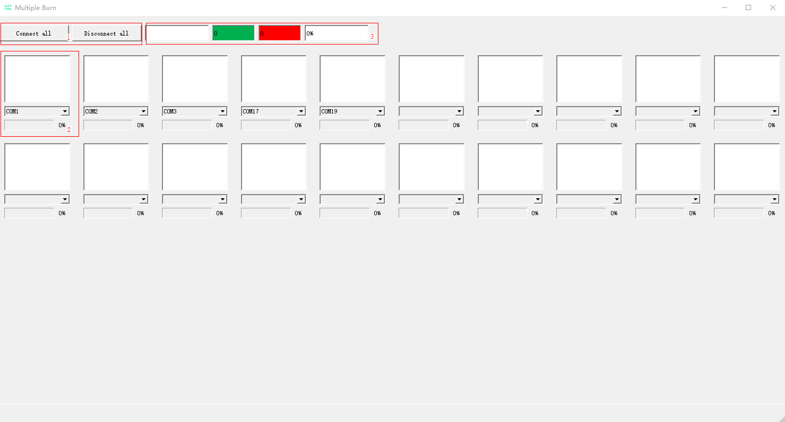

**表 1**  工厂烧写界面说明

<a name="zh-cn_topic_0000001162441960_zh-cn_topic_0281207084_table1435556181"></a>
<table><thead align="left"><tr id="zh-cn_topic_0000001162441960_zh-cn_topic_0281207084_row1835656183"><th class="cellrowborder" valign="top" width="17.77%" id="mcps1.2.3.1.1"><p id="zh-cn_topic_0000001162441960_zh-cn_topic_0281207084_p115311511086"><a name="zh-cn_topic_0000001162441960_zh-cn_topic_0281207084_p115311511086"></a><a name="zh-cn_topic_0000001162441960_zh-cn_topic_0281207084_p115311511086"></a>区域</p>
</th>
<th class="cellrowborder" valign="top" width="82.23%" id="mcps1.2.3.1.2"><p id="zh-cn_topic_0000001162441960_zh-cn_topic_0281207084_p5531145116817"><a name="zh-cn_topic_0000001162441960_zh-cn_topic_0281207084_p5531145116817"></a><a name="zh-cn_topic_0000001162441960_zh-cn_topic_0281207084_p5531145116817"></a>说明</p>
</th>
</tr>
</thead>
<tbody><tr id="zh-cn_topic_0000001162441960_zh-cn_topic_0281207084_row1778202182511"><td class="cellrowborder" valign="top" width="17.77%" headers="mcps1.2.3.1.1 "><p id="zh-cn_topic_0000001162441960_zh-cn_topic_0281207084_p1978218222513"><a name="zh-cn_topic_0000001162441960_zh-cn_topic_0281207084_p1978218222513"></a><a name="zh-cn_topic_0000001162441960_zh-cn_topic_0281207084_p1978218222513"></a>1</p>
</td>
<td class="cellrowborder" valign="top" width="82.23%" headers="mcps1.2.3.1.2 "><a name="zh-cn_topic_0000001162441960_zh-cn_topic_0281207084_ul137862022513"></a><a name="zh-cn_topic_0000001162441960_zh-cn_topic_0281207084_ul137862022513"></a><ul id="zh-cn_topic_0000001162441960_zh-cn_topic_0281207084_ul137862022513"><li>Connect all：连接所有串口。</li><li>Disconnect all：断开所有已打开的串口。</li></ul>
</td>
</tr>
<tr id="zh-cn_topic_0000001162441960_zh-cn_topic_0281207084_row1235619611820"><td class="cellrowborder" valign="top" width="17.77%" headers="mcps1.2.3.1.1 "><p id="zh-cn_topic_0000001162441960_zh-cn_topic_0281207084_p195316518818"><a name="zh-cn_topic_0000001162441960_zh-cn_topic_0281207084_p195316518818"></a><a name="zh-cn_topic_0000001162441960_zh-cn_topic_0281207084_p195316518818"></a>2</p>
</td>
<td class="cellrowborder" valign="top" width="82.23%" headers="mcps1.2.3.1.2 "><a name="zh-cn_topic_0000001162441960_zh-cn_topic_0281207084_ul05676417267"></a><a name="zh-cn_topic_0000001162441960_zh-cn_topic_0281207084_ul05676417267"></a><ul id="zh-cn_topic_0000001162441960_zh-cn_topic_0281207084_ul05676417267"><li>回显视图：显示单板烧写状态“Doing”、“PASS”、“Fail”、“Waiting”。</li><li>串口号列表：显示当前可用的串口号。</li></ul>
</td>
</tr>
<tr id="zh-cn_topic_0000001162441960_zh-cn_topic_0281207084_row735616614819"><td class="cellrowborder" valign="top" width="17.77%" headers="mcps1.2.3.1.1 "><p id="zh-cn_topic_0000001162441960_zh-cn_topic_0281207084_p15531251083"><a name="zh-cn_topic_0000001162441960_zh-cn_topic_0281207084_p15531251083"></a><a name="zh-cn_topic_0000001162441960_zh-cn_topic_0281207084_p15531251083"></a>3</p>
</td>
<td class="cellrowborder" valign="top" width="82.23%" headers="mcps1.2.3.1.2 "><p id="zh-cn_topic_0000001162441960_zh-cn_topic_0281207084_p193431818246"><a name="zh-cn_topic_0000001162441960_zh-cn_topic_0281207084_p193431818246"></a><a name="zh-cn_topic_0000001162441960_zh-cn_topic_0281207084_p193431818246"></a>烧写结果统计：成功数，失败数，成功率，本次烧写时间。</p>
</td>
</tr>
</tbody>
</table>

### 设置界面<a name="ZH-CN_TOPIC_0000002022466557"></a>

设置界面主要用于设置串口参数，设置界面如[图1](#zh-cn_topic_0000001161963482_fig392365342019)所示。

**图 1**  设置界面示意图<a name="zh-cn_topic_0000001161963482_fig392365342019"></a>  
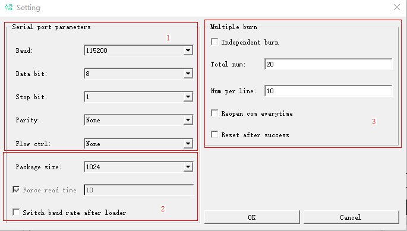

**表 1**  设置界面说明

<a name="zh-cn_topic_0000001161963482_zh-cn_topic_0000001138051779_table1435556181"></a>
<table><thead align="left"><tr id="zh-cn_topic_0000001161963482_zh-cn_topic_0000001138051779_row1835656183"><th class="cellrowborder" valign="top" width="17.77%" id="mcps1.2.3.1.1"><p id="zh-cn_topic_0000001161963482_zh-cn_topic_0000001138051779_p115311511086"><a name="zh-cn_topic_0000001161963482_zh-cn_topic_0000001138051779_p115311511086"></a><a name="zh-cn_topic_0000001161963482_zh-cn_topic_0000001138051779_p115311511086"></a>区域</p>
</th>
<th class="cellrowborder" valign="top" width="82.23%" id="mcps1.2.3.1.2"><p id="zh-cn_topic_0000001161963482_zh-cn_topic_0000001138051779_p5531145116817"><a name="zh-cn_topic_0000001161963482_zh-cn_topic_0000001138051779_p5531145116817"></a><a name="zh-cn_topic_0000001161963482_zh-cn_topic_0000001138051779_p5531145116817"></a>说明</p>
</th>
</tr>
</thead>
<tbody><tr id="zh-cn_topic_0000001161963482_zh-cn_topic_0000001138051779_row1778202182511"><td class="cellrowborder" valign="top" width="17.77%" headers="mcps1.2.3.1.1 "><p id="zh-cn_topic_0000001161963482_zh-cn_topic_0000001138051779_p1978218222513"><a name="zh-cn_topic_0000001161963482_zh-cn_topic_0000001138051779_p1978218222513"></a><a name="zh-cn_topic_0000001161963482_zh-cn_topic_0000001138051779_p1978218222513"></a>1</p>
</td>
<td class="cellrowborder" valign="top" width="82.23%" headers="mcps1.2.3.1.2 "><a name="zh-cn_topic_0000001161963482_zh-cn_topic_0000001138051779_ul137862022513"></a><a name="zh-cn_topic_0000001161963482_zh-cn_topic_0000001138051779_ul137862022513"></a><ul id="zh-cn_topic_0000001161963482_zh-cn_topic_0000001138051779_ul137862022513"><li>Baud：波特率。各产品可支持的波特率范围不同，工具仅列出所有常用波特率，是否可正常使用以产品约束为准</li><li>Data Bit：数据位。</li><li>Stop Bit：停止位。</li><li>Parity：校验位。</li><li>Flow ctrl：流控。</li></ul>
</td>
</tr>
<tr id="zh-cn_topic_0000001161963482_zh-cn_topic_0000001138051779_row1235619611820"><td class="cellrowborder" valign="top" width="17.77%" headers="mcps1.2.3.1.1 "><p id="zh-cn_topic_0000001161963482_zh-cn_topic_0000001138051779_p195316518818"><a name="zh-cn_topic_0000001161963482_zh-cn_topic_0000001138051779_p195316518818"></a><a name="zh-cn_topic_0000001161963482_zh-cn_topic_0000001138051779_p195316518818"></a>2</p>
</td>
<td class="cellrowborder" valign="top" width="82.23%" headers="mcps1.2.3.1.2 "><a name="zh-cn_topic_0000001161963482_zh-cn_topic_0000001138051779_ul05676417267"></a><a name="zh-cn_topic_0000001161963482_zh-cn_topic_0000001138051779_ul05676417267"></a><ul id="zh-cn_topic_0000001161963482_zh-cn_topic_0000001138051779_ul05676417267"><li>Package size：数据传输每包大小，一般只支持1024字节，除非产品有特殊支持，否则不应该修改。</li><li>Force Read Time：串口定时读时间间隔，表示串口两次接收的时间间隔至少为N ms，默认为勾选且时间间隔为10ms（在4.4版本之后，默认强制勾选且无法修改）。默认为勾选可以防止出现如下场景：<a name="zh-cn_topic_0000001161963482_ul121434109233"></a><a name="zh-cn_topic_0000001161963482_ul121434109233"></a><ul id="zh-cn_topic_0000001161963482_ul121434109233"><li>在某些PC环境下BurnTool无法正常使用。</li><li>在一拖多场景下CPU占用率过高。</li></ul>
</li><li>Switch baud rate after loader：在烧写完loader后切换所设置的波特率。loader在高波特率下无法烧写并且其他文件在此波特率下可以烧写时勾选其可以提升烧写速度。</li></ul>
</td>
</tr>
<tr id="zh-cn_topic_0000001161963482_zh-cn_topic_0000001138051779_row829518303389"><td class="cellrowborder" valign="top" width="17.77%" headers="mcps1.2.3.1.1 "><p id="zh-cn_topic_0000001161963482_zh-cn_topic_0000001138051779_p229616307382"><a name="zh-cn_topic_0000001161963482_zh-cn_topic_0000001138051779_p229616307382"></a><a name="zh-cn_topic_0000001161963482_zh-cn_topic_0000001138051779_p229616307382"></a>3</p>
</td>
<td class="cellrowborder" valign="top" width="82.23%" headers="mcps1.2.3.1.2 "><a name="zh-cn_topic_0000001161963482_zh-cn_topic_0000001138051779_ul12554334173812"></a><a name="zh-cn_topic_0000001161963482_zh-cn_topic_0000001138051779_ul12554334173812"></a><ul id="zh-cn_topic_0000001161963482_zh-cn_topic_0000001138051779_ul12554334173812"><li>Independent Burn：独立烧写。勾选后工厂界面所有串口将完全独立，不做整体流程控制，不计算总烧写时间，适用于夹具为单独烧写的工厂；不勾选则工厂界面所有串口会统筹管理，烧写完成后将一起判断夹具抬起操作。</li><li>Total num：工厂界面窗口总个数。</li><li>Num per line：工厂界面每行窗口个数。</li><li>Reopen Com Everytime：勾选后在工厂烧写界面每次烧写完成后，下次开始烧写之前会重新打开串口。</li><li>Reset after success：勾选后在工厂烧写界面每次烧写完成后，会重启单板。</li></ul>
</td>
</tr>
</tbody>
</table>

### 选择Jlink执行程序界面<a name="ZH-CN_TOPIC_0000001985747204"></a>

通过“Setting”-“Jlink Settings”打开Jlink设置，用来配置Jlink执行程序路径，界面如[图1](#zh-cn_topic_0000001907005225_fig4811422716)所示。

**图 1**  选择Jlink执行程序界面<a name="zh-cn_topic_0000001907005225_fig4811422716"></a>  
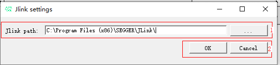

**表 1**  选择JJlink执行程序界面说明

<a name="zh-cn_topic_0000001907005225_zh-cn_topic_0000001138051779_table1435556181"></a>
<table><thead align="left"><tr id="zh-cn_topic_0000001907005225_zh-cn_topic_0000001138051779_row1835656183"><th class="cellrowborder" valign="top" width="17.77%" id="mcps1.2.3.1.1"><p id="zh-cn_topic_0000001907005225_zh-cn_topic_0000001138051779_p115311511086"><a name="zh-cn_topic_0000001907005225_zh-cn_topic_0000001138051779_p115311511086"></a><a name="zh-cn_topic_0000001907005225_zh-cn_topic_0000001138051779_p115311511086"></a>区域</p>
</th>
<th class="cellrowborder" valign="top" width="82.23%" id="mcps1.2.3.1.2"><p id="zh-cn_topic_0000001907005225_zh-cn_topic_0000001138051779_p5531145116817"><a name="zh-cn_topic_0000001907005225_zh-cn_topic_0000001138051779_p5531145116817"></a><a name="zh-cn_topic_0000001907005225_zh-cn_topic_0000001138051779_p5531145116817"></a>说明</p>
</th>
</tr>
</thead>
<tbody><tr id="zh-cn_topic_0000001907005225_zh-cn_topic_0000001138051779_row1778202182511"><td class="cellrowborder" valign="top" width="17.77%" headers="mcps1.2.3.1.1 "><p id="zh-cn_topic_0000001907005225_zh-cn_topic_0000001138051779_p1978218222513"><a name="zh-cn_topic_0000001907005225_zh-cn_topic_0000001138051779_p1978218222513"></a><a name="zh-cn_topic_0000001907005225_zh-cn_topic_0000001138051779_p1978218222513"></a>1</p>
</td>
<td class="cellrowborder" valign="top" width="82.23%" headers="mcps1.2.3.1.2 "><a name="zh-cn_topic_0000001907005225_zh-cn_topic_0000001138051779_ul137862022513"></a><a name="zh-cn_topic_0000001907005225_zh-cn_topic_0000001138051779_ul137862022513"></a><ul id="zh-cn_topic_0000001907005225_zh-cn_topic_0000001138051779_ul137862022513"><li>Jlink path：“...”选择Jlink执行程序所在的文件夹。</li></ul>
</td>
</tr>
<tr id="zh-cn_topic_0000001907005225_row732424895812"><td class="cellrowborder" valign="top" width="17.77%" headers="mcps1.2.3.1.1 "><p id="zh-cn_topic_0000001907005225_p1232404855812"><a name="zh-cn_topic_0000001907005225_p1232404855812"></a><a name="zh-cn_topic_0000001907005225_p1232404855812"></a>2</p>
</td>
<td class="cellrowborder" valign="top" width="82.23%" headers="mcps1.2.3.1.2 "><a name="zh-cn_topic_0000001907005225_ul1773251165910"></a><a name="zh-cn_topic_0000001907005225_ul1773251165910"></a><ul id="zh-cn_topic_0000001907005225_ul1773251165910"><li>OK：确定修改。</li><li>Cancel：取消修改，按照上次所选执行。</li></ul>
</td>
</tr>
</tbody>
</table>

# 操作指南<a name="ZH-CN_TOPIC_0000001713125801"></a>


## 手动烧写<a name="ZH-CN_TOPIC_0000001906979257"></a>


### 串口烧写<a name="ZH-CN_TOPIC_0000001860859784"></a>

1.  在BurnTool界面中单击“Select file”按钮，选择各产品编译生成的固件包，并单击“OK”。
2.  在表格中选中需要烧写的文件（请参考各产品文档中关于烧写的部分）。
3.  选择“Setting”→“Com settings”，配置串口参数，默认配置如[图1](zh-cn_topic_0000001860836886.md#fig323525813325)所示。

    > **说明：** 
    >Force Read Time：定时读取的时间，以毫秒为单位。勾选时为定时读取串口，不勾选时为事件触发读取串口。适用于不勾选该选项无法正常烧录的场景。

    **图 1**  串口设置示例<a name="zh-cn_topic_0000001860836886_fig323525813325"></a>  
    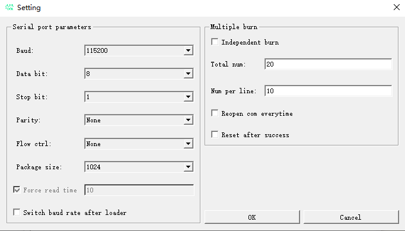

4.  选择目标串口号并单击“Connect”按钮（单击后“Connect”变为“Disconnect”），复位单板。打断后效果如[图2](#zh-cn_topic_0000001860836886_zh-cn_topic_0279549073_fig1957511242357)所示。

    **图 2**  打断效果示意图<a name="zh-cn_topic_0000001860836886_zh-cn_topic_0279549073_fig1957511242357"></a>  
    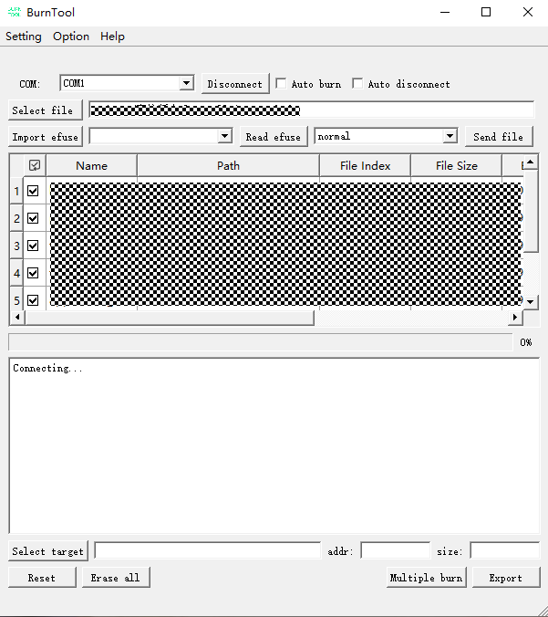

5.  当界面显示字符串“CCC”时，单击“Send file”按钮。不同产品“CCC”上方的字符串可能不同。
6.  等待传输完成后结束烧写，烧写完成会出现“All images burn successfully”。烧写完成效果如[图3](#zh-cn_topic_0000001860836886_zh-cn_topic_0279549073_fig11410377529)所示。

    **图 3**  烧写完成示意图<a name="zh-cn_topic_0000001860836886_zh-cn_topic_0279549073_fig11410377529"></a>  
    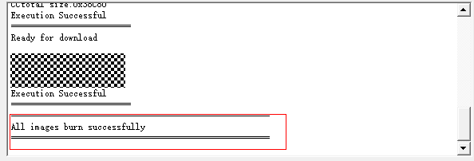

> **说明：** 
>在速率不理想的外部状态下，若多次出现烧写镜像失败的情况，请拷贝至本地烧写

### DFU烧写<a name="ZH-CN_TOPIC_0000001861019624"></a>

1.  使用管理员权限打开程序（右键点击应用程序，点击以管理员身份运行，如[图1](#zh-cn_topic_0000001906956365_fig127414312457)所示）。

    **图 1**  以管理员身份运行示意图<a name="zh-cn_topic_0000001906956365_fig127414312457"></a>  
    

2.  参考“[选择Chip](选择Chip.md#ZH-CN_TOPIC_0000001985906928)”章节选择带DFU后缀的芯片，如“XXX-USB”。
3.  <a name="zh-cn_topic_0000001906956365_li637125023912"></a>选择烧写模式，如[图2](#zh-cn_topic_0000001906956365_fig1636825093917)所示，选择dfu升级模式。

    **图 2**  烧写模式选择示意图<a name="zh-cn_topic_0000001906956365_fig1636825093917"></a>  
    

4.  根据[3](#zh-cn_topic_0000001906956365_li637125023912)选择的模式选择设备或者填写设备信息。Dfu模式时选择设备信息如[图3](#zh-cn_topic_0000001906956365_fig196045434581)所示。Auto dfu和 Hid dfu模式时填写设备信息如[图4](#zh-cn_topic_0000001906956365_fig18275145418455)所示。

    **图 3**  选择USB设备<a name="zh-cn_topic_0000001906956365_fig196045434581"></a>  
    

    **图 4**  填写usb设备信息<a name="zh-cn_topic_0000001906956365_fig18275145418455"></a>  
    

5.  在BurnTool界面中单击“Select file”按钮，选择产品编译生成的固件包，并单击“打开”。
6.  在表格中选中需要烧写的文件。
7.  单击“Start burn”按钮（单击后“Start burn”变为“Stop burn”）。
8.  等待传输完成后结束烧写，烧写完成会出现“All images burn successfully”。烧写完成效果如[图5](#zh-cn_topic_0000001906956365_fig10497621143610)所示。

    **图 5**  烧写完成示意图<a name="zh-cn_topic_0000001906956365_fig10497621143610"></a>  
    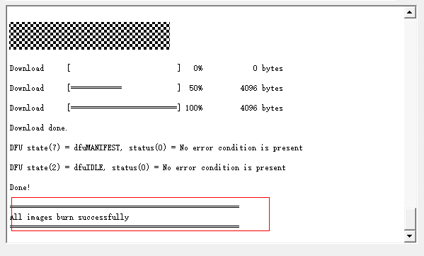

    > **警告：** 
    >警告：在打印“All images burn successfully”之前请一定不要断电，否则单板将有概率异常。

## 工厂烧写<a name="ZH-CN_TOPIC_0000001713125805"></a>

1.  在BurnTool界面中单击“Select file”按钮，选择各产品编译生成的固件包，并单击“OK”。
2.  在表格中选中需要烧写的文件。
3.  选择“Setting”→“Com settings”，配置串口参数，默认配置如[图1](#zh-cn_topic_0000001162441958_zh-cn_topic_0281207485_fig12141552194715)所示。

    **图 1**  串口设置示例<a name="zh-cn_topic_0000001162441958_zh-cn_topic_0281207485_fig12141552194715"></a>  
    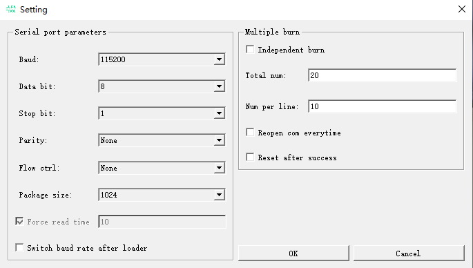

    > **说明：** 
    >Total num在研发测试中最大已压测个数为20，实际烧录最大个数上限理论不限制，一般与电脑性能、夹具、接线稳定性有关。

4.  单击“Multiple burn”按钮，打开工厂烧写窗口，若已有配置会自动读取。若无配置手动选择串口后，可以选择“Setting”→“Save config”生成配置。
5.  单击“Connect all”按钮，并复位所有单板。
6.  等待所有回显视图都显示绿色“PASS”或红色“Fail”。

    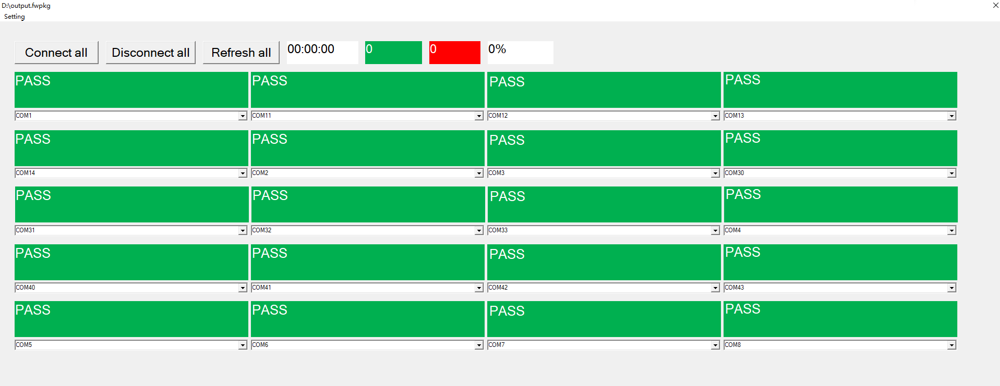

## 命令行烧写<a name="ZH-CN_TOPIC_0000001906899545"></a>


### 串口烧写<a name="ZH-CN_TOPIC_0000001906979261"></a>

在Windows环境下，BurnTool.exe支持以命令行的方式调用，可用于集成到用户已有的工厂产线烧写程序中，调用命令如下：

```
BurnTool.exe params
```

命令之间用空格隔开，如果命令带有参数，命令与参数之间用冒号隔开，最简示例如下：

```
BurnTool.exe -com:1 -bin:C:\test_bin\xxx.fwpkg -signalbaud:921600 
```

BurnTool.exe烧写命令可以配置的params参数如[表1](#zh-cn_topic_0000001906960121_zh-cn_topic_0279549078_table51147202142)所示。

**表 1**  BurnTool.exe烧写命令参数表

<a name="zh-cn_topic_0000001906960121_zh-cn_topic_0279549078_table51147202142"></a>
<table><thead align="left"><tr id="zh-cn_topic_0000001906960121_zh-cn_topic_0279549078_row111472021414"><th class="cellrowborder" valign="top" width="13.72137213721372%" id="mcps1.2.4.1.1"><p id="zh-cn_topic_0000001906960121_zh-cn_topic_0279549078_p1782320288143"><a name="zh-cn_topic_0000001906960121_zh-cn_topic_0279549078_p1782320288143"></a><a name="zh-cn_topic_0000001906960121_zh-cn_topic_0279549078_p1782320288143"></a>命令</p>
</th>
<th class="cellrowborder" valign="top" width="15.02150215021502%" id="mcps1.2.4.1.2"><p id="zh-cn_topic_0000001906960121_zh-cn_topic_0279549078_p4823202816141"><a name="zh-cn_topic_0000001906960121_zh-cn_topic_0279549078_p4823202816141"></a><a name="zh-cn_topic_0000001906960121_zh-cn_topic_0279549078_p4823202816141"></a>参数</p>
</th>
<th class="cellrowborder" valign="top" width="71.25712571257125%" id="mcps1.2.4.1.3"><p id="zh-cn_topic_0000001906960121_zh-cn_topic_0279549078_p782372815142"><a name="zh-cn_topic_0000001906960121_zh-cn_topic_0279549078_p782372815142"></a><a name="zh-cn_topic_0000001906960121_zh-cn_topic_0279549078_p782372815142"></a>说明</p>
</th>
</tr>
</thead>
<tbody><tr id="zh-cn_topic_0000001906960121_zh-cn_topic_0279549078_row4114220111417"><td class="cellrowborder" valign="top" width="13.72137213721372%" headers="mcps1.2.4.1.1 "><p id="zh-cn_topic_0000001906960121_zh-cn_topic_0279549078_p6464935131411"><a name="zh-cn_topic_0000001906960121_zh-cn_topic_0279549078_p6464935131411"></a><a name="zh-cn_topic_0000001906960121_zh-cn_topic_0279549078_p6464935131411"></a>-com:</p>
</td>
<td class="cellrowborder" valign="top" width="15.02150215021502%" headers="mcps1.2.4.1.2 "><p id="zh-cn_topic_0000001906960121_zh-cn_topic_0279549078_p146415352140"><a name="zh-cn_topic_0000001906960121_zh-cn_topic_0279549078_p146415352140"></a><a name="zh-cn_topic_0000001906960121_zh-cn_topic_0279549078_p146415352140"></a>x</p>
</td>
<td class="cellrowborder" valign="top" width="71.25712571257125%" headers="mcps1.2.4.1.3 "><p id="zh-cn_topic_0000001906960121_zh-cn_topic_0279549078_p846410354145"><a name="zh-cn_topic_0000001906960121_zh-cn_topic_0279549078_p846410354145"></a><a name="zh-cn_topic_0000001906960121_zh-cn_topic_0279549078_p846410354145"></a>PC端的串口号（例如：1）。</p>
</td>
</tr>
<tr id="zh-cn_topic_0000001906960121_zh-cn_topic_0279549078_row211482013145"><td class="cellrowborder" valign="top" width="13.72137213721372%" headers="mcps1.2.4.1.1 "><p id="zh-cn_topic_0000001906960121_zh-cn_topic_0279549078_p10464135131419"><a name="zh-cn_topic_0000001906960121_zh-cn_topic_0279549078_p10464135131419"></a><a name="zh-cn_topic_0000001906960121_zh-cn_topic_0279549078_p10464135131419"></a>-bin:</p>
</td>
<td class="cellrowborder" valign="top" width="15.02150215021502%" headers="mcps1.2.4.1.2 "><p id="zh-cn_topic_0000001906960121_zh-cn_topic_0279549078_p3464163511416"><a name="zh-cn_topic_0000001906960121_zh-cn_topic_0279549078_p3464163511416"></a><a name="zh-cn_topic_0000001906960121_zh-cn_topic_0279549078_p3464163511416"></a>path\xxx.bin</p>
</td>
<td class="cellrowborder" valign="top" width="71.25712571257125%" headers="mcps1.2.4.1.3 "><p id="zh-cn_topic_0000001906960121_zh-cn_topic_0279549078_p9464133571410"><a name="zh-cn_topic_0000001906960121_zh-cn_topic_0279549078_p9464133571410"></a><a name="zh-cn_topic_0000001906960121_zh-cn_topic_0279549078_p9464133571410"></a>固件包xxx.bin的绝对路径。固件包的名称和文件类型根据各产品实际情况可能有所不同。（路径不能存在空格字符）</p>
</td>
</tr>
<tr id="zh-cn_topic_0000001906960121_zh-cn_topic_0279549078_row2114162071419"><td class="cellrowborder" valign="top" width="13.72137213721372%" headers="mcps1.2.4.1.1 "><p id="zh-cn_topic_0000001906960121_zh-cn_topic_0279549078_p146433513144"><a name="zh-cn_topic_0000001906960121_zh-cn_topic_0279549078_p146433513144"></a><a name="zh-cn_topic_0000001906960121_zh-cn_topic_0279549078_p146433513144"></a>-signalbaud:</p>
</td>
<td class="cellrowborder" valign="top" width="15.02150215021502%" headers="mcps1.2.4.1.2 "><p id="zh-cn_topic_0000001906960121_zh-cn_topic_0279549078_p19464193571410"><a name="zh-cn_topic_0000001906960121_zh-cn_topic_0279549078_p19464193571410"></a><a name="zh-cn_topic_0000001906960121_zh-cn_topic_0279549078_p19464193571410"></a>115200</p>
</td>
<td class="cellrowborder" valign="top" width="71.25712571257125%" headers="mcps1.2.4.1.3 "><p id="zh-cn_topic_0000001906960121_zh-cn_topic_0279549078_p54641835181410"><a name="zh-cn_topic_0000001906960121_zh-cn_topic_0279549078_p54641835181410"></a><a name="zh-cn_topic_0000001906960121_zh-cn_topic_0279549078_p54641835181410"></a>RomBoot下传输固件包时的串口波特率，默认为115200bit/s。建议根据硬件支持情况，配置成921600bit/s或更高波特率，以提升烧写效率。</p>
</td>
</tr>
<tr id="zh-cn_topic_0000001906960121_zh-cn_topic_0279549078_row2646161518281"><td class="cellrowborder" valign="top" width="13.72137213721372%" headers="mcps1.2.4.1.1 "><p id="zh-cn_topic_0000001906960121_zh-cn_topic_0279549078_p1564761512282"><a name="zh-cn_topic_0000001906960121_zh-cn_topic_0279549078_p1564761512282"></a><a name="zh-cn_topic_0000001906960121_zh-cn_topic_0279549078_p1564761512282"></a>-2ms</p>
</td>
<td class="cellrowborder" valign="top" width="15.02150215021502%" headers="mcps1.2.4.1.2 "><p id="zh-cn_topic_0000001906960121_zh-cn_topic_0279549078_p12647715112818"><a name="zh-cn_topic_0000001906960121_zh-cn_topic_0279549078_p12647715112818"></a><a name="zh-cn_topic_0000001906960121_zh-cn_topic_0279549078_p12647715112818"></a>无</p>
</td>
<td class="cellrowborder" valign="top" width="71.25712571257125%" headers="mcps1.2.4.1.3 "><p id="zh-cn_topic_0000001906960121_zh-cn_topic_0279549078_p86472156282"><a name="zh-cn_topic_0000001906960121_zh-cn_topic_0279549078_p86472156282"></a><a name="zh-cn_topic_0000001906960121_zh-cn_topic_0279549078_p86472156282"></a>使用2ms间隔发送打断报文，常用于快速启动场景。不包含此参数时，间隔则为10ms。</p>
</td>
</tr>
<tr id="zh-cn_topic_0000001906960121_zh-cn_topic_0279549078_row1715818567399"><td class="cellrowborder" valign="top" width="13.72137213721372%" headers="mcps1.2.4.1.1 "><p id="zh-cn_topic_0000001906960121_zh-cn_topic_0279549078_p51584560397"><a name="zh-cn_topic_0000001906960121_zh-cn_topic_0279549078_p51584560397"></a><a name="zh-cn_topic_0000001906960121_zh-cn_topic_0279549078_p51584560397"></a>-forceread:</p>
</td>
<td class="cellrowborder" valign="top" width="15.02150215021502%" headers="mcps1.2.4.1.2 "><p id="zh-cn_topic_0000001906960121_zh-cn_topic_0279549078_p915875623915"><a name="zh-cn_topic_0000001906960121_zh-cn_topic_0279549078_p915875623915"></a><a name="zh-cn_topic_0000001906960121_zh-cn_topic_0279549078_p915875623915"></a>10</p>
</td>
<td class="cellrowborder" valign="top" width="71.25712571257125%" headers="mcps1.2.4.1.3 "><p id="zh-cn_topic_0000001906960121_zh-cn_topic_0279549078_p17683185835817"><a name="zh-cn_topic_0000001906960121_zh-cn_topic_0279549078_p17683185835817"></a><a name="zh-cn_topic_0000001906960121_zh-cn_topic_0279549078_p17683185835817"></a>包含此参数表示打开串口定时读功能，读数据间隔为10ms。</p>
<p id="zh-cn_topic_0000001906960121_zh-cn_topic_0279549078_p6501124013157"><a name="zh-cn_topic_0000001906960121_zh-cn_topic_0279549078_p6501124013157"></a><a name="zh-cn_topic_0000001906960121_zh-cn_topic_0279549078_p6501124013157"></a>一般无需打开，在如下场景可考虑打开：</p>
<a name="zh-cn_topic_0000001906960121_zh-cn_topic_0279549078_ul54691647111514"></a><a name="zh-cn_topic_0000001906960121_zh-cn_topic_0279549078_ul54691647111514"></a><ul id="zh-cn_topic_0000001906960121_zh-cn_topic_0279549078_ul54691647111514"><li>在某些PC环境下BurnTool无法正常使用。</li><li>在一拖多场景下CPU占用率过高。</li></ul>
</td>
</tr>
<tr id="zh-cn_topic_0000001906960121_zh-cn_topic_0279549078_row164607487544"><td class="cellrowborder" valign="top" width="13.72137213721372%" headers="mcps1.2.4.1.1 "><p id="zh-cn_topic_0000001906960121_zh-cn_topic_0279549078_p16460174814546"><a name="zh-cn_topic_0000001906960121_zh-cn_topic_0279549078_p16460174814546"></a><a name="zh-cn_topic_0000001906960121_zh-cn_topic_0279549078_p16460174814546"></a>-erasemode:</p>
</td>
<td class="cellrowborder" valign="top" width="15.02150215021502%" headers="mcps1.2.4.1.2 "><p id="zh-cn_topic_0000001906960121_zh-cn_topic_0279549078_p346034875416"><a name="zh-cn_topic_0000001906960121_zh-cn_topic_0279549078_p346034875416"></a><a name="zh-cn_topic_0000001906960121_zh-cn_topic_0279549078_p346034875416"></a>x</p>
</td>
<td class="cellrowborder" valign="top" width="71.25712571257125%" headers="mcps1.2.4.1.3 "><p id="zh-cn_topic_0000001906960121_zh-cn_topic_0279549078_p57861027194111"><a name="zh-cn_topic_0000001906960121_zh-cn_topic_0279549078_p57861027194111"></a><a name="zh-cn_topic_0000001906960121_zh-cn_topic_0279549078_p57861027194111"></a>擦除模式。其中：</p>
<a name="zh-cn_topic_0000001906960121_zh-cn_topic_0279549078_ul209361847134110"></a><a name="zh-cn_topic_0000001906960121_zh-cn_topic_0279549078_ul209361847134110"></a><ul id="zh-cn_topic_0000001906960121_zh-cn_topic_0279549078_ul209361847134110"><li>0：正常擦除</li><li>1：全片擦除</li><li>2：不擦除</li></ul>
</td>
</tr>
<tr id="zh-cn_topic_0000001906960121_zh-cn_topic_0279549078_row114172595516"><td class="cellrowborder" valign="top" width="13.72137213721372%" headers="mcps1.2.4.1.1 "><p id="zh-cn_topic_0000001906960121_zh-cn_topic_0279549078_p13410258557"><a name="zh-cn_topic_0000001906960121_zh-cn_topic_0279549078_p13410258557"></a><a name="zh-cn_topic_0000001906960121_zh-cn_topic_0279549078_p13410258557"></a>-timeout:</p>
</td>
<td class="cellrowborder" valign="top" width="15.02150215021502%" headers="mcps1.2.4.1.2 "><p id="zh-cn_topic_0000001906960121_zh-cn_topic_0279549078_p74114253559"><a name="zh-cn_topic_0000001906960121_zh-cn_topic_0279549078_p74114253559"></a><a name="zh-cn_topic_0000001906960121_zh-cn_topic_0279549078_p74114253559"></a>x</p>
</td>
<td class="cellrowborder" valign="top" width="71.25712571257125%" headers="mcps1.2.4.1.3 "><p id="zh-cn_topic_0000001906960121_zh-cn_topic_0279549078_p134162513558"><a name="zh-cn_topic_0000001906960121_zh-cn_topic_0279549078_p134162513558"></a><a name="zh-cn_topic_0000001906960121_zh-cn_topic_0279549078_p134162513558"></a>打断的超时时间，单位ms。</p>
</td>
</tr>
<tr id="zh-cn_topic_0000001906960121_zh-cn_topic_0279549078_row684720710565"><td class="cellrowborder" valign="top" width="13.72137213721372%" headers="mcps1.2.4.1.1 "><p id="zh-cn_topic_0000001906960121_zh-cn_topic_0279549078_p1484718711568"><a name="zh-cn_topic_0000001906960121_zh-cn_topic_0279549078_p1484718711568"></a><a name="zh-cn_topic_0000001906960121_zh-cn_topic_0279549078_p1484718711568"></a>-console</p>
</td>
<td class="cellrowborder" valign="top" width="15.02150215021502%" headers="mcps1.2.4.1.2 "><p id="zh-cn_topic_0000001906960121_zh-cn_topic_0279549078_p88479725614"><a name="zh-cn_topic_0000001906960121_zh-cn_topic_0279549078_p88479725614"></a><a name="zh-cn_topic_0000001906960121_zh-cn_topic_0279549078_p88479725614"></a>无</p>
</td>
<td class="cellrowborder" valign="top" width="71.25712571257125%" headers="mcps1.2.4.1.3 "><p id="zh-cn_topic_0000001906960121_zh-cn_topic_0279549078_p284777145614"><a name="zh-cn_topic_0000001906960121_zh-cn_topic_0279549078_p284777145614"></a><a name="zh-cn_topic_0000001906960121_zh-cn_topic_0279549078_p284777145614"></a>使用标准输入输出，为重定向做准备。</p>
</td>
</tr>
<tr id="zh-cn_topic_0000001906960121_zh-cn_topic_0279549078_row22810183011"><td class="cellrowborder" valign="top" width="13.72137213721372%" headers="mcps1.2.4.1.1 "><p id="zh-cn_topic_0000001906960121_zh-cn_topic_0279549078_p122121053012"><a name="zh-cn_topic_0000001906960121_zh-cn_topic_0279549078_p122121053012"></a><a name="zh-cn_topic_0000001906960121_zh-cn_topic_0279549078_p122121053012"></a>-clearlog</p>
</td>
<td class="cellrowborder" valign="top" width="15.02150215021502%" headers="mcps1.2.4.1.2 "><p id="zh-cn_topic_0000001906960121_zh-cn_topic_0279549078_p7217100308"><a name="zh-cn_topic_0000001906960121_zh-cn_topic_0279549078_p7217100308"></a><a name="zh-cn_topic_0000001906960121_zh-cn_topic_0279549078_p7217100308"></a>无</p>
</td>
<td class="cellrowborder" valign="top" width="71.25712571257125%" headers="mcps1.2.4.1.3 "><p id="zh-cn_topic_0000001906960121_zh-cn_topic_0279549078_p132101073010"><a name="zh-cn_topic_0000001906960121_zh-cn_topic_0279549078_p132101073010"></a><a name="zh-cn_topic_0000001906960121_zh-cn_topic_0279549078_p132101073010"></a>屏蔽单板打印的日志。</p>
</td>
</tr>
<tr id="zh-cn_topic_0000001906960121_zh-cn_topic_0279549078_row1349413213114"><td class="cellrowborder" valign="top" width="13.72137213721372%" headers="mcps1.2.4.1.1 "><p id="zh-cn_topic_0000001906960121_zh-cn_topic_0279549078_p174941321818"><a name="zh-cn_topic_0000001906960121_zh-cn_topic_0279549078_p174941321818"></a><a name="zh-cn_topic_0000001906960121_zh-cn_topic_0279549078_p174941321818"></a>-onlyeraseall</p>
</td>
<td class="cellrowborder" valign="top" width="15.02150215021502%" headers="mcps1.2.4.1.2 "><p id="zh-cn_topic_0000001906960121_zh-cn_topic_0279549078_p1494221212"><a name="zh-cn_topic_0000001906960121_zh-cn_topic_0279549078_p1494221212"></a><a name="zh-cn_topic_0000001906960121_zh-cn_topic_0279549078_p1494221212"></a>无</p>
</td>
<td class="cellrowborder" valign="top" width="71.25712571257125%" headers="mcps1.2.4.1.3 "><p id="zh-cn_topic_0000001906960121_zh-cn_topic_0279549078_p149452120110"><a name="zh-cn_topic_0000001906960121_zh-cn_topic_0279549078_p149452120110"></a><a name="zh-cn_topic_0000001906960121_zh-cn_topic_0279549078_p149452120110"></a>仅进行全片擦除</p>
</td>
</tr>
<tr id="zh-cn_topic_0000001906960121_zh-cn_topic_0279549078_row596472420110"><td class="cellrowborder" valign="top" width="13.72137213721372%" headers="mcps1.2.4.1.1 "><p id="zh-cn_topic_0000001906960121_zh-cn_topic_0279549078_p19964132412117"><a name="zh-cn_topic_0000001906960121_zh-cn_topic_0279549078_p19964132412117"></a><a name="zh-cn_topic_0000001906960121_zh-cn_topic_0279549078_p19964132412117"></a>-onlyburn:</p>
</td>
<td class="cellrowborder" valign="top" width="15.02150215021502%" headers="mcps1.2.4.1.2 "><p id="zh-cn_topic_0000001906960121_zh-cn_topic_0279549078_p1696419248120"><a name="zh-cn_topic_0000001906960121_zh-cn_topic_0279549078_p1696419248120"></a><a name="zh-cn_topic_0000001906960121_zh-cn_topic_0279549078_p1696419248120"></a>name</p>
</td>
<td class="cellrowborder" valign="top" width="71.25712571257125%" headers="mcps1.2.4.1.3 "><p id="zh-cn_topic_0000001906960121_zh-cn_topic_0279549078_p7964152410112"><a name="zh-cn_topic_0000001906960121_zh-cn_topic_0279549078_p7964152410112"></a><a name="zh-cn_topic_0000001906960121_zh-cn_topic_0279549078_p7964152410112"></a>指定烧写对应名字的文件，可重复传参，效果累加。</p>
</td>
</tr>
<tr id="zh-cn_topic_0000001906960121_zh-cn_topic_0279549078_row778594311418"><td class="cellrowborder" valign="top" width="13.72137213721372%" headers="mcps1.2.4.1.1 "><p id="zh-cn_topic_0000001906960121_zh-cn_topic_0279549078_p17861143101412"><a name="zh-cn_topic_0000001906960121_zh-cn_topic_0279549078_p17861143101412"></a><a name="zh-cn_topic_0000001906960121_zh-cn_topic_0279549078_p17861143101412"></a>-reset</p>
</td>
<td class="cellrowborder" valign="top" width="15.02150215021502%" headers="mcps1.2.4.1.2 "><p id="zh-cn_topic_0000001906960121_zh-cn_topic_0279549078_p878694313143"><a name="zh-cn_topic_0000001906960121_zh-cn_topic_0279549078_p878694313143"></a><a name="zh-cn_topic_0000001906960121_zh-cn_topic_0279549078_p878694313143"></a>无</p>
</td>
<td class="cellrowborder" valign="top" width="71.25712571257125%" headers="mcps1.2.4.1.3 "><p id="zh-cn_topic_0000001906960121_zh-cn_topic_0279549078_p87869435143"><a name="zh-cn_topic_0000001906960121_zh-cn_topic_0279549078_p87869435143"></a><a name="zh-cn_topic_0000001906960121_zh-cn_topic_0279549078_p87869435143"></a>烧写完成后自动重启设备。</p>
</td>
</tr>
<tr id="zh-cn_topic_0000001906960121_row391712289530"><td class="cellrowborder" valign="top" width="13.72137213721372%" headers="mcps1.2.4.1.1 "><p id="zh-cn_topic_0000001906960121_p169181028125315"><a name="zh-cn_topic_0000001906960121_p169181028125315"></a><a name="zh-cn_topic_0000001906960121_p169181028125315"></a>-packagesize:</p>
</td>
<td class="cellrowborder" valign="top" width="15.02150215021502%" headers="mcps1.2.4.1.2 "><p id="zh-cn_topic_0000001906960121_p69181628165310"><a name="zh-cn_topic_0000001906960121_p69181628165310"></a><a name="zh-cn_topic_0000001906960121_p69181628165310"></a>x</p>
</td>
<td class="cellrowborder" valign="top" width="71.25712571257125%" headers="mcps1.2.4.1.3 "><p id="zh-cn_topic_0000001906960121_p0918172819535"><a name="zh-cn_topic_0000001906960121_p0918172819535"></a><a name="zh-cn_topic_0000001906960121_p0918172819535"></a>每次传输的包大小，当前支持1024，2048，4096，8192</p>
</td>
</tr>
<tr id="zh-cn_topic_0000001906960121_row5728175013533"><td class="cellrowborder" valign="top" width="13.72137213721372%" headers="mcps1.2.4.1.1 "><p id="zh-cn_topic_0000001906960121_p16728450185313"><a name="zh-cn_topic_0000001906960121_p16728450185313"></a><a name="zh-cn_topic_0000001906960121_p16728450185313"></a>-switchafterloader</p>
</td>
<td class="cellrowborder" valign="top" width="15.02150215021502%" headers="mcps1.2.4.1.2 "><p id="zh-cn_topic_0000001906960121_p7728450105310"><a name="zh-cn_topic_0000001906960121_p7728450105310"></a><a name="zh-cn_topic_0000001906960121_p7728450105310"></a>无</p>
</td>
<td class="cellrowborder" valign="top" width="71.25712571257125%" headers="mcps1.2.4.1.3 "><p id="zh-cn_topic_0000001906960121_p97283501536"><a name="zh-cn_topic_0000001906960121_p97283501536"></a><a name="zh-cn_topic_0000001906960121_p97283501536"></a>在加载loader完成后再切换波特率。</p>
</td>
</tr>
</tbody>
</table>

**其他典型场景<a name="zh-cn_topic_0000001906960121_section173263145463"></a>**

-   如果需要使用标准输入输出获取烧写过程的打印，命令如下：

    ```
    BurnTool.exe -com:1 -bin:C:\test_bin\xxx.fwpkg -signalbaud:921600 -console
    ```

-   如果需要指定烧写一个烧录包中的其中两个bin文件，命令如下：

    ```
    BurnTool.exe -com:1 -bin:C:\test_bin\xxx.fwpkg -signalbaud:921600 -onlyburn:a.bin -onlyburn:b.bin
    ```

-   如果需要使用全片擦除且烧写完之后自动复位单板，命令如下：

    ```
    BurnTool.exe -com:1 -bin:C:\test_bin\xxx.fwpkg -signalbaud:921600 -erasemode:1 -reset
    ```

### DFU烧写<a name="ZH-CN_TOPIC_0000001860859788"></a>

> **说明：** 
>命令行烧写需在安装路径下打开Windows命令行程序。

BurnTool.exe支持不打开界面，直接通过命令行进行参数设置与工具启动调度并烧写，可用于集成到用户已有的工厂产线烧写程序中。需在管理员权限下执行命令。调用命令如下：

```
BurnTool.exe params
```

使用C++代码管理员权限调用示例如下：

```
#include <windows.h>
int main(int argc, char *argv[])
{
    char cmd[] = "D:\\BurnTool\\BurnTool.exe";
    ShellExecuteA(NULL, "runas", cmd, "-dfu -vid:0x01 -pid:0x01 -usage:0x01 -usagepage:0x01 -bin:C:\test_bin\xxx.fwpkg -console", NULL, SW_NORMAL);
    return 0;
}
```

命令之间用空格隔开，如果命令带有参数，命令与参数之间用冒号隔开，最简示例如下：

```
BurnTool.exe -dfu -pid:0x01 -vid:0x01 -usage:0x01 -usagepage:0x01 -bin:C:\test_bin\xxx.fwpkg
```

BurnTool.exe dfu模式烧写命令可以配置的params参数如[表1](#zh-cn_topic_0000001906880417_zh-cn_topic_0279549078_table51147202142)所示

**表 1**  BurnTool.exe dfu模式烧写命令参数表

<a name="zh-cn_topic_0000001906880417_zh-cn_topic_0279549078_table51147202142"></a>
<table><thead align="left"><tr id="zh-cn_topic_0000001906880417_zh-cn_topic_0279549078_row111472021414"><th class="cellrowborder" valign="top" width="16.071607160716074%" id="mcps1.2.4.1.1"><p id="zh-cn_topic_0000001906880417_zh-cn_topic_0279549078_p1782320288143"><a name="zh-cn_topic_0000001906880417_zh-cn_topic_0279549078_p1782320288143"></a><a name="zh-cn_topic_0000001906880417_zh-cn_topic_0279549078_p1782320288143"></a>命令</p>
</th>
<th class="cellrowborder" valign="top" width="18.971897189718973%" id="mcps1.2.4.1.2"><p id="zh-cn_topic_0000001906880417_zh-cn_topic_0279549078_p4823202816141"><a name="zh-cn_topic_0000001906880417_zh-cn_topic_0279549078_p4823202816141"></a><a name="zh-cn_topic_0000001906880417_zh-cn_topic_0279549078_p4823202816141"></a>参数</p>
</th>
<th class="cellrowborder" valign="top" width="64.95649564956494%" id="mcps1.2.4.1.3"><p id="zh-cn_topic_0000001906880417_zh-cn_topic_0279549078_p782372815142"><a name="zh-cn_topic_0000001906880417_zh-cn_topic_0279549078_p782372815142"></a><a name="zh-cn_topic_0000001906880417_zh-cn_topic_0279549078_p782372815142"></a>说明</p>
</th>
</tr>
</thead>
<tbody><tr id="zh-cn_topic_0000001906880417_zh-cn_topic_0279549078_row4114220111417"><td class="cellrowborder" valign="top" width="16.071607160716074%" headers="mcps1.2.4.1.1 "><p id="zh-cn_topic_0000001906880417_p21061752165315"><a name="zh-cn_topic_0000001906880417_p21061752165315"></a><a name="zh-cn_topic_0000001906880417_p21061752165315"></a>-dfu</p>
</td>
<td class="cellrowborder" valign="top" width="18.971897189718973%" headers="mcps1.2.4.1.2 "><p id="zh-cn_topic_0000001906880417_zh-cn_topic_0279549078_p146415352140"><a name="zh-cn_topic_0000001906880417_zh-cn_topic_0279549078_p146415352140"></a><a name="zh-cn_topic_0000001906880417_zh-cn_topic_0279549078_p146415352140"></a>-</p>
</td>
<td class="cellrowborder" valign="top" width="64.95649564956494%" headers="mcps1.2.4.1.3 "><p id="zh-cn_topic_0000001906880417_p35265717538"><a name="zh-cn_topic_0000001906880417_p35265717538"></a><a name="zh-cn_topic_0000001906880417_p35265717538"></a>hid状态下dfu烧写模式。和-autodfu，-hiddfu互斥。</p>
</td>
</tr>
<tr id="zh-cn_topic_0000001906880417_row36221954111716"><td class="cellrowborder" valign="top" width="16.071607160716074%" headers="mcps1.2.4.1.1 "><p id="zh-cn_topic_0000001906880417_p1187415222489"><a name="zh-cn_topic_0000001906880417_p1187415222489"></a><a name="zh-cn_topic_0000001906880417_p1187415222489"></a>-autodfu</p>
</td>
<td class="cellrowborder" valign="top" width="18.971897189718973%" headers="mcps1.2.4.1.2 "><p id="zh-cn_topic_0000001906880417_p16874152219484"><a name="zh-cn_topic_0000001906880417_p16874152219484"></a><a name="zh-cn_topic_0000001906880417_p16874152219484"></a>-</p>
</td>
<td class="cellrowborder" valign="top" width="64.95649564956494%" headers="mcps1.2.4.1.3 "><p id="zh-cn_topic_0000001906880417_p88741422134814"><a name="zh-cn_topic_0000001906880417_p88741422134814"></a><a name="zh-cn_topic_0000001906880417_p88741422134814"></a>dfu状态下直接烧写模式。和-dfu, -hiddfu互斥。</p>
</td>
</tr>
<tr id="zh-cn_topic_0000001906880417_row101031547012"><td class="cellrowborder" valign="top" width="16.071607160716074%" headers="mcps1.2.4.1.1 "><p id="zh-cn_topic_0000001906880417_p2010314541005"><a name="zh-cn_topic_0000001906880417_p2010314541005"></a><a name="zh-cn_topic_0000001906880417_p2010314541005"></a>-hiddfu</p>
</td>
<td class="cellrowborder" valign="top" width="18.971897189718973%" headers="mcps1.2.4.1.2 "><p id="zh-cn_topic_0000001906880417_p41031954908"><a name="zh-cn_topic_0000001906880417_p41031954908"></a><a name="zh-cn_topic_0000001906880417_p41031954908"></a>-</p>
</td>
<td class="cellrowborder" valign="top" width="64.95649564956494%" headers="mcps1.2.4.1.3 "><p id="zh-cn_topic_0000001906880417_p8103654802"><a name="zh-cn_topic_0000001906880417_p8103654802"></a><a name="zh-cn_topic_0000001906880417_p8103654802"></a>hid状态下直接进行usb烧写。和-autodfu，-dfu互斥。</p>
</td>
</tr>
<tr id="zh-cn_topic_0000001906880417_zh-cn_topic_0279549078_row211482013145"><td class="cellrowborder" valign="top" width="16.071607160716074%" headers="mcps1.2.4.1.1 "><p id="zh-cn_topic_0000001906880417_zh-cn_topic_0279549078_p10464135131419"><a name="zh-cn_topic_0000001906880417_zh-cn_topic_0279549078_p10464135131419"></a><a name="zh-cn_topic_0000001906880417_zh-cn_topic_0279549078_p10464135131419"></a>-bin:</p>
</td>
<td class="cellrowborder" valign="top" width="18.971897189718973%" headers="mcps1.2.4.1.2 "><p id="zh-cn_topic_0000001906880417_zh-cn_topic_0279549078_p3464163511416"><a name="zh-cn_topic_0000001906880417_zh-cn_topic_0279549078_p3464163511416"></a><a name="zh-cn_topic_0000001906880417_zh-cn_topic_0279549078_p3464163511416"></a>path\xxx.fwpkg</p>
</td>
<td class="cellrowborder" valign="top" width="64.95649564956494%" headers="mcps1.2.4.1.3 "><p id="zh-cn_topic_0000001906880417_zh-cn_topic_0279549078_p9464133571410"><a name="zh-cn_topic_0000001906880417_zh-cn_topic_0279549078_p9464133571410"></a><a name="zh-cn_topic_0000001906880417_zh-cn_topic_0279549078_p9464133571410"></a>固件包xxx.fwpkg的绝对路径。固件包的名称和文件类型根据各产品实际情况可能有所不同。</p>
<div class="note" id="zh-cn_topic_0000001906880417_zh-cn_topic_0279615088_note11987903"><a name="zh-cn_topic_0000001906880417_zh-cn_topic_0279615088_note11987903"></a><a name="zh-cn_topic_0000001906880417_zh-cn_topic_0279615088_note11987903"></a><span class="notetitle"> 说明： </span><div class="notebody"><p id="zh-cn_topic_0000001906880417_p4141645658"><a name="zh-cn_topic_0000001906880417_p4141645658"></a><a name="zh-cn_topic_0000001906880417_p4141645658"></a>路径不能包含空格字符。</p>
</div></div>
</td>
</tr>
<tr id="zh-cn_topic_0000001906880417_zh-cn_topic_0279549078_row2114162071419"><td class="cellrowborder" valign="top" width="16.071607160716074%" headers="mcps1.2.4.1.1 "><p id="zh-cn_topic_0000001906880417_zh-cn_topic_0279549078_p146433513144"><a name="zh-cn_topic_0000001906880417_zh-cn_topic_0279549078_p146433513144"></a><a name="zh-cn_topic_0000001906880417_zh-cn_topic_0279549078_p146433513144"></a>-pid:</p>
</td>
<td class="cellrowborder" valign="top" width="18.971897189718973%" headers="mcps1.2.4.1.2 "><p id="zh-cn_topic_0000001906880417_zh-cn_topic_0279549078_p19464193571410"><a name="zh-cn_topic_0000001906880417_zh-cn_topic_0279549078_p19464193571410"></a><a name="zh-cn_topic_0000001906880417_zh-cn_topic_0279549078_p19464193571410"></a>0x...</p>
</td>
<td class="cellrowborder" valign="top" width="64.95649564956494%" headers="mcps1.2.4.1.3 "><p id="zh-cn_topic_0000001906880417_zh-cn_topic_0279549078_p54641835181410"><a name="zh-cn_topic_0000001906880417_zh-cn_topic_0279549078_p54641835181410"></a><a name="zh-cn_topic_0000001906880417_zh-cn_topic_0279549078_p54641835181410"></a>待烧写设备的pid。</p>
<div class="note" id="zh-cn_topic_0000001906880417_note993072585219"><a name="zh-cn_topic_0000001906880417_note993072585219"></a><a name="zh-cn_topic_0000001906880417_note993072585219"></a><span class="notetitle"> 说明： </span><div class="notebody"><p id="zh-cn_topic_0000001906880417_p34064714513"><a name="zh-cn_topic_0000001906880417_p34064714513"></a><a name="zh-cn_topic_0000001906880417_p34064714513"></a>参数为16进制数字。</p>
</div></div>
</td>
</tr>
<tr id="zh-cn_topic_0000001906880417_zh-cn_topic_0279549078_row2646161518281"><td class="cellrowborder" valign="top" width="16.071607160716074%" headers="mcps1.2.4.1.1 "><p id="zh-cn_topic_0000001906880417_zh-cn_topic_0279549078_p1564761512282"><a name="zh-cn_topic_0000001906880417_zh-cn_topic_0279549078_p1564761512282"></a><a name="zh-cn_topic_0000001906880417_zh-cn_topic_0279549078_p1564761512282"></a>-vid：</p>
</td>
<td class="cellrowborder" valign="top" width="18.971897189718973%" headers="mcps1.2.4.1.2 "><p id="zh-cn_topic_0000001906880417_zh-cn_topic_0279549078_p12647715112818"><a name="zh-cn_topic_0000001906880417_zh-cn_topic_0279549078_p12647715112818"></a><a name="zh-cn_topic_0000001906880417_zh-cn_topic_0279549078_p12647715112818"></a>0x...</p>
</td>
<td class="cellrowborder" valign="top" width="64.95649564956494%" headers="mcps1.2.4.1.3 "><p id="zh-cn_topic_0000001906880417_p1092351313560"><a name="zh-cn_topic_0000001906880417_p1092351313560"></a><a name="zh-cn_topic_0000001906880417_p1092351313560"></a>待烧写设备的vid。</p>
<div class="note" id="zh-cn_topic_0000001906880417_note720952155617"><a name="zh-cn_topic_0000001906880417_note720952155617"></a><a name="zh-cn_topic_0000001906880417_note720952155617"></a><span class="notetitle"> 说明： </span><div class="notebody"><p id="zh-cn_topic_0000001906880417_p1820914214569"><a name="zh-cn_topic_0000001906880417_p1820914214569"></a><a name="zh-cn_topic_0000001906880417_p1820914214569"></a>参数为16进制数字。</p>
</div></div>
</td>
</tr>
<tr id="zh-cn_topic_0000001906880417_row278116507568"><td class="cellrowborder" valign="top" width="16.071607160716074%" headers="mcps1.2.4.1.1 "><p id="zh-cn_topic_0000001906880417_p183111125586"><a name="zh-cn_topic_0000001906880417_p183111125586"></a><a name="zh-cn_topic_0000001906880417_p183111125586"></a>-usage:</p>
</td>
<td class="cellrowborder" valign="top" width="18.971897189718973%" headers="mcps1.2.4.1.2 "><p id="zh-cn_topic_0000001906880417_p3781650125618"><a name="zh-cn_topic_0000001906880417_p3781650125618"></a><a name="zh-cn_topic_0000001906880417_p3781650125618"></a>0x...</p>
</td>
<td class="cellrowborder" valign="top" width="64.95649564956494%" headers="mcps1.2.4.1.3 "><p id="zh-cn_topic_0000001906880417_p490610205582"><a name="zh-cn_topic_0000001906880417_p490610205582"></a><a name="zh-cn_topic_0000001906880417_p490610205582"></a>待烧写设备的usage。</p>
<div class="note" id="zh-cn_topic_0000001906880417_note890652035817"><a name="zh-cn_topic_0000001906880417_note890652035817"></a><a name="zh-cn_topic_0000001906880417_note890652035817"></a><span class="notetitle"> 说明： </span><div class="notebody"><p id="zh-cn_topic_0000001906880417_p1190616202584"><a name="zh-cn_topic_0000001906880417_p1190616202584"></a><a name="zh-cn_topic_0000001906880417_p1190616202584"></a>参数为16进制数字。</p>
</div></div>
</td>
</tr>
<tr id="zh-cn_topic_0000001906880417_row883524665614"><td class="cellrowborder" valign="top" width="16.071607160716074%" headers="mcps1.2.4.1.1 "><p id="zh-cn_topic_0000001906880417_p122421040115816"><a name="zh-cn_topic_0000001906880417_p122421040115816"></a><a name="zh-cn_topic_0000001906880417_p122421040115816"></a>-usagepage:</p>
</td>
<td class="cellrowborder" valign="top" width="18.971897189718973%" headers="mcps1.2.4.1.2 "><p id="zh-cn_topic_0000001906880417_p15835646115617"><a name="zh-cn_topic_0000001906880417_p15835646115617"></a><a name="zh-cn_topic_0000001906880417_p15835646115617"></a>0x...</p>
</td>
<td class="cellrowborder" valign="top" width="64.95649564956494%" headers="mcps1.2.4.1.3 "><p id="zh-cn_topic_0000001906880417_p482603316588"><a name="zh-cn_topic_0000001906880417_p482603316588"></a><a name="zh-cn_topic_0000001906880417_p482603316588"></a>待烧写设备的usagepage。</p>
<div class="note" id="zh-cn_topic_0000001906880417_note1682603312581"><a name="zh-cn_topic_0000001906880417_note1682603312581"></a><a name="zh-cn_topic_0000001906880417_note1682603312581"></a><span class="notetitle"> 说明： </span><div class="notebody"><p id="zh-cn_topic_0000001906880417_p13826113395820"><a name="zh-cn_topic_0000001906880417_p13826113395820"></a><a name="zh-cn_topic_0000001906880417_p13826113395820"></a>参数为16进制数字。</p>
</div></div>
</td>
</tr>
<tr id="zh-cn_topic_0000001906880417_zh-cn_topic_0279549078_row684720710565"><td class="cellrowborder" valign="top" width="16.071607160716074%" headers="mcps1.2.4.1.1 "><p id="zh-cn_topic_0000001906880417_zh-cn_topic_0279549078_p1484718711568"><a name="zh-cn_topic_0000001906880417_zh-cn_topic_0279549078_p1484718711568"></a><a name="zh-cn_topic_0000001906880417_zh-cn_topic_0279549078_p1484718711568"></a>-console</p>
</td>
<td class="cellrowborder" valign="top" width="18.971897189718973%" headers="mcps1.2.4.1.2 "><p id="zh-cn_topic_0000001906880417_zh-cn_topic_0279549078_p88479725614"><a name="zh-cn_topic_0000001906880417_zh-cn_topic_0279549078_p88479725614"></a><a name="zh-cn_topic_0000001906880417_zh-cn_topic_0279549078_p88479725614"></a>无</p>
</td>
<td class="cellrowborder" valign="top" width="64.95649564956494%" headers="mcps1.2.4.1.3 "><p id="zh-cn_topic_0000001906880417_zh-cn_topic_0279549078_p284777145614"><a name="zh-cn_topic_0000001906880417_zh-cn_topic_0279549078_p284777145614"></a><a name="zh-cn_topic_0000001906880417_zh-cn_topic_0279549078_p284777145614"></a>使用标准输入输出，为重定向做准备。</p>
</td>
</tr>
</tbody>
</table>

**其他典型场景<a name="zh-cn_topic_0000001906880417_section173263145463"></a>**

如果需要使用标准输入输出获取烧写过程的打印，命令如下：

```
BurnTool.exe -dfu -pid:0x01 -vid:0x01 -usage:0x01 -usagepage:0x01 -bin:C:\test_bin\xxx.fwpkg -console
```

## 读eFuse<a name="ZH-CN_TOPIC_0000001713125809"></a>

1.  按照“[串口烧写](串口烧写.md#ZH-CN_TOPIC_0000001860859784)”烧写完成loader文件。
2.  单击“Import Efuse”按钮，选择eFuse配置文件。

    eFuse配置文件为ini文件（格式如[图1](#zh-cn_topic_0000001161963486_zh-cn_topic_0279549086_fig866670194315)所示）。一个eFuse项需要包括3个配置：

    -   EFUSE\_NAMEX：在BurnTool中显示的名称。
    -   EFUSE\_START\_BITX：eFuse开始的bit索引。
    -   EFUSE\_BIT\_WIDTHX：该eFuse占用的bit数。各参数结尾的X表示一个自然数，范围为1～1000。

    **图 1**  eFuse配置文件格式示例<a name="zh-cn_topic_0000001161963486_zh-cn_topic_0279549086_fig866670194315"></a>  
    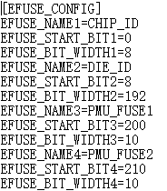

3.  选择需要读取的eFuse条目，单击“Read Efuse”按钮。
4.  查看上报内容，如[图2](#zh-cn_topic_0000001161963486_zh-cn_topic_0279549086_fig1371821614187)所示。

    **图 2**  eFuse读取结果示例<a name="zh-cn_topic_0000001161963486_zh-cn_topic_0279549086_fig1371821614187"></a>  
    

## 导出镜像<a name="ZH-CN_TOPIC_0000001665006282"></a>

1.  按照“[串口烧写](串口烧写.md)”烧写完成loader文件。
2.  单击“Select target”按钮，选择导出文件的存放位置。
3.  在“addr”编辑框中输入读取的Flash起始地址，在“size”编辑框中输入读取的Flash大小。

    注意：“addr”应填写flash相对地址，相对地址等于绝对地址减去基地址0x90100000。

4.  单击“Export”按钮，如[图1](#zh-cn_topic_0000001162282012_zh-cn_topic_0279549096_fig1371821614187)所示。

    **图 1**  导出文件结束示例<a name="zh-cn_topic_0000001162282012_zh-cn_topic_0279549096_fig1371821614187"></a>  
    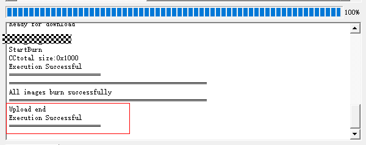

## OTA升级<a name="ZH-CN_TOPIC_0000001945683032"></a>

1.  参考“[选择Chip](选择Chip.md#ZH-CN_TOPIC_0000001985906928)”章节选择带SLE后缀的芯片，如“XXX-SLE”。
2.  选择设备信息如[图1](#zh-cn_topic_0000001966789053_fig11818313201417)所示。

    **图 1**  选择设备信息示意图<a name="zh-cn_topic_0000001966789053_fig11818313201417"></a>  
    

3.  点击“Open”按钮，打开所选设备，并将扫描到的对端设备地址加载到Address中。
4.  选择想要升级的地址，点击“Connect”连接设备，打印出"Device connected successfully"代表连接成功，如[图2](#zh-cn_topic_0000001966789053_fig388834812306)所示。

    **图 2**  连接成功示意图<a name="zh-cn_topic_0000001966789053_fig388834812306"></a>  
    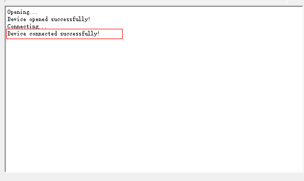

5.  选择所升级的文件，如[图3](#zh-cn_topic_0000001966789053_fig768310475299)所示。

    **图 3**  选择文件示意图<a name="zh-cn_topic_0000001966789053_fig768310475299"></a>  
    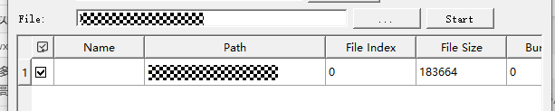

6.  点击“Start”开始升级，“Start”按钮变更为“Stop”按钮（点击“Stop”按钮可停止升级），升级成功打印“Upgrade successfully”。如[图4](#zh-cn_topic_0000001966789053_fig114879911381)所示

    **图 4**  升级成功示意图<a name="zh-cn_topic_0000001966789053_fig114879911381"></a>  
    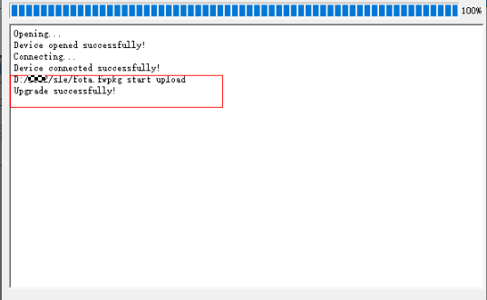

# FAQ<a name="ZH-CN_TOPIC_0000001861171510"></a>


## 工具未进入打断状态<a name="ZH-CN_TOPIC_0000001861331362"></a>

**问题描述<a name="zh-cn_topic_0000001207563437_zh-cn_topic_0279549084_section11476770"></a>**

单击连接、断电重启后，工具并没有进入打断状态。

**解决办法<a name="zh-cn_topic_0000001207563437_zh-cn_topic_0279549084_section36182073"></a>**

-   可能是串口选择错误或没有正常连接串口，请检查串口配置。
-   可能单板设置了1ms快速启动，需要在BurnTool“Setting”→“Burn interval”中选择2ms间隔。
-   可能使用win7系统产生部分兼容性问题，可切换至win10尝试。

## 如何获取符合格式的固件包<a name="ZH-CN_TOPIC_0000001907171289"></a>

**问题描述<a name="zh-cn_topic_0000001207843445_zh-cn_topic_0279549069_section11476770"></a>**

如何获取BurnTool可识别的固件包。

**解决办法<a name="zh-cn_topic_0000001207843445_zh-cn_topic_0279549069_section1639218138286"></a>**

请参见各产品关于编译或固件生成的文档。

## 加载配置文件时出现错误提示<a name="ZH-CN_TOPIC_0000001907290969"></a>

**问题描述<a name="zh-cn_topic_0000001162123484_zh-cn_topic_0000001163417487_section11476770"></a>**

在启动BurnTool后，如果同级目录或C盘BurnTool路径下有配置文件，则会提示“是否加载已存在的配置文件？”；如果选择加载配置文件且配置文件格式不正确，则会提示“文件格式错误，是否继续”。

**解决办法<a name="zh-cn_topic_0000001162123484_zh-cn_topic_0000001163417487_section1427474415433"></a>**

提示“文件格式错误，是否继续”表示当前的配置文件中有部分内容没有配置或配置值不符合预期，造成此问题的原因可能是由于手动修改过配置文件或当前版本没有主动保存过配置文件。此时可以选择不加载配置文件，全部重新手工配置并保存配置文件。

## 工厂烧写时随机串口无法进入doing状态<a name="ZH-CN_TOPIC_0000001861171514"></a>

**问题描述<a name="zh-cn_topic_0000001207563435_zh-cn_topic_0000001166752747_section11476770"></a>**

因串口驱动配合问题，在工厂烧写时，可能会出现随机串口无法进入工作（doing）状态的情况。

**解决办法<a name="zh-cn_topic_0000001207563435_zh-cn_topic_0000001166752747_section1427474415433"></a>**

在“Setting”→“Settings”中查看“Reopen Com Everytime”的勾选状态。

如果未勾选，则尝试勾选并重新开始工厂烧写；如果已勾选，则尝试取消勾选并重新开始工厂烧写。

## 如何提升镜像烧录速度<a name="ZH-CN_TOPIC_0000001861331366"></a>

**问题描述<a name="zh-cn_topic_0000001861324198_zh-cn_topic_0279549084_section11476770"></a>**

产线上烧录大镜像所需时间过长，导致生产成本增加。

**解决办法<a name="zh-cn_topic_0000001861324198_section669815717311"></a>**

1.  将烧写工具波特率设置为所能支持的最大值（目前单板所支持最大值为6M波特率，需串口小板支持6M及以上波特率）。
2.  将每包大小设置为20480。如[图1](#zh-cn_topic_0000001861324198_fig196168229)所示。

    **图 1**  烧写工具配置示意图<a name="zh-cn_topic_0000001861324198_fig196168229"></a>  
    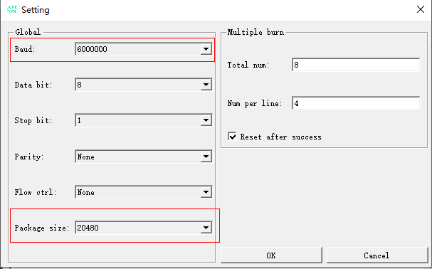

3.  按照“[手动烧写](zh-cn_topic_0000001401914169.md)”章节步骤进行烧写即可。

## 一拖多烧写时反复烧写该如何解决<a name="ZH-CN_TOPIC_0000001907171293"></a>

**问题描述<a name="zh-cn_topic_0000001907283793_zh-cn_topic_0279549084_section11476770"></a>**

一拖多烧写时，每次烧写完成会重新开始烧写，具体表现为在没有进行手动复位的情况下，进度条达到100%后又从0%开始烧录。

**解决办法<a name="zh-cn_topic_0000001907283793_section1437042610496"></a>**

将设置中的“Reset after success”去勾选。

