# 前言<a name="ZH-CN_TOPIC_0000002263567181"></a>

**概述<a name="section4537382116410"></a>**

本文档主要描述IDE工具的安装及使用，IDE工具使用的是HiSpark Studio，该工具主要是用于代码的编辑、编译、镜像烧写。

**读者对象<a name="section4378592816410"></a>**

本文档主要适用于以下工程师：

-   技术支持工程师
-   硬件开发工程师

**符号约定<a name="section133020216410"></a>**

在本文中可能出现下列标志，它们所代表的含义如下。

<a name="table2622507016410"></a>
<table><thead align="left"><tr id="row1530720816410"><th class="cellrowborder" valign="top" width="20.580000000000002%" id="mcps1.1.3.1.1"><p id="p6450074116410"><a name="p6450074116410"></a><a name="p6450074116410"></a><strong id="b2136615816410"><a name="b2136615816410"></a><a name="b2136615816410"></a>符号</strong></p>
</th>
<th class="cellrowborder" valign="top" width="79.42%" id="mcps1.1.3.1.2"><p id="p5435366816410"><a name="p5435366816410"></a><a name="p5435366816410"></a><strong id="b5941558116410"><a name="b5941558116410"></a><a name="b5941558116410"></a>说明</strong></p>
</th>
</tr>
</thead>
<tbody><tr id="row1372280416410"><td class="cellrowborder" valign="top" width="20.580000000000002%" headers="mcps1.1.3.1.1 "><p id="p3734547016410"><a name="p3734547016410"></a><a name="p3734547016410"></a><a name="image2670064316410"></a><a name="image2670064316410"></a><span></span></p>
</td>
<td class="cellrowborder" valign="top" width="79.42%" headers="mcps1.1.3.1.2 "><p id="p1757432116410"><a name="p1757432116410"></a><a name="p1757432116410"></a>表示如不避免则将会导致死亡或严重伤害的具有高等级风险的危害。</p>
</td>
</tr>
<tr id="row466863216410"><td class="cellrowborder" valign="top" width="20.580000000000002%" headers="mcps1.1.3.1.1 "><p id="p1432579516410"><a name="p1432579516410"></a><a name="p1432579516410"></a><a name="image4895582316410"></a><a name="image4895582316410"></a><span></span></p>
</td>
<td class="cellrowborder" valign="top" width="79.42%" headers="mcps1.1.3.1.2 "><p id="p959197916410"><a name="p959197916410"></a><a name="p959197916410"></a>表示如不避免则可能导致死亡或严重伤害的具有中等级风险的危害。</p>
</td>
</tr>
<tr id="row123863216410"><td class="cellrowborder" valign="top" width="20.580000000000002%" headers="mcps1.1.3.1.1 "><p id="p1232579516410"><a name="p1232579516410"></a><a name="p1232579516410"></a><a name="image1235582316410"></a><a name="image1235582316410"></a><span></span></p>
</td>
<td class="cellrowborder" valign="top" width="79.42%" headers="mcps1.1.3.1.2 "><p id="p123197916410"><a name="p123197916410"></a><a name="p123197916410"></a>表示如不避免则可能导致轻微或中度伤害的具有低等级风险的危害。</p>
</td>
</tr>
<tr id="row5786682116410"><td class="cellrowborder" valign="top" width="20.580000000000002%" headers="mcps1.1.3.1.1 "><p id="p2204984716410"><a name="p2204984716410"></a><a name="p2204984716410"></a><a name="image4504446716410"></a><a name="image4504446716410"></a><span></span></p>
</td>
<td class="cellrowborder" valign="top" width="79.42%" headers="mcps1.1.3.1.2 "><p id="p4388861916410"><a name="p4388861916410"></a><a name="p4388861916410"></a>用于传递设备或环境安全警示信息。如不避免则可能会导致设备损坏、数据丢失、设备性能降低或其它不可预知的结果。</p>
<p id="p1238861916410"><a name="p1238861916410"></a><a name="p1238861916410"></a>“须知”不涉及人身伤害。</p>
</td>
</tr>
<tr id="row2856923116410"><td class="cellrowborder" valign="top" width="20.580000000000002%" headers="mcps1.1.3.1.1 "><p id="p5555360116410"><a name="p5555360116410"></a><a name="p5555360116410"></a><a name="image799324016410"></a><a name="image799324016410"></a><span></span></p>
</td>
<td class="cellrowborder" valign="top" width="79.42%" headers="mcps1.1.3.1.2 "><p id="p4612588116410"><a name="p4612588116410"></a><a name="p4612588116410"></a>对正文中重点信息的补充说明。</p>
<p id="p1232588116410"><a name="p1232588116410"></a><a name="p1232588116410"></a>“说明”不是安全警示信息，不涉及人身、设备及环境伤害信息。</p>
</td>
</tr>
</tbody>
</table>

**修改记录<a name="section2467512116410"></a>**

<a name="table1557726816410"></a>
<table><thead align="left"><tr id="row2942532716410"><th class="cellrowborder" valign="top" width="20.72%" id="mcps1.1.4.1.1"><p id="p3778275416410"><a name="p3778275416410"></a><a name="p3778275416410"></a><strong id="b5687322716410"><a name="b5687322716410"></a><a name="b5687322716410"></a>文档版本</strong></p>
</th>
<th class="cellrowborder" valign="top" width="26.119999999999997%" id="mcps1.1.4.1.2"><p id="p5627845516410"><a name="p5627845516410"></a><a name="p5627845516410"></a><strong id="b5800814916410"><a name="b5800814916410"></a><a name="b5800814916410"></a>发布日期</strong></p>
</th>
<th class="cellrowborder" valign="top" width="53.16%" id="mcps1.1.4.1.3"><p id="p2382284816410"><a name="p2382284816410"></a><a name="p2382284816410"></a><strong id="b3316380216410"><a name="b3316380216410"></a><a name="b3316380216410"></a>修改说明</strong></p>
</th>
</tr>
</thead>
<tbody><tr id="row5281780716410"><td class="cellrowborder" valign="top" width="20.72%" headers="mcps1.1.4.1.1 "><p id="p559mcpsimp"><a name="p559mcpsimp"></a><a name="p559mcpsimp"></a>01</p>
</td>
<td class="cellrowborder" valign="top" width="26.119999999999997%" headers="mcps1.1.4.1.2 "><p id="p561mcpsimp"><a name="p561mcpsimp"></a><a name="p561mcpsimp"></a>2025-04-02</p>
</td>
<td class="cellrowborder" valign="top" width="53.16%" headers="mcps1.1.4.1.3 "><p id="p563mcpsimp"><a name="p563mcpsimp"></a><a name="p563mcpsimp"></a>第一次正式版本发布。</p>
</td>
</tr>
</tbody>
</table>

# 工具简介<a name="ZH-CN_TOPIC_0000002228410952"></a>

HiSpark Studio面向智能设备开发者提供一站式集成开发环境，支持代码编辑、编译、烧录和调试等功能，支持C/C++语言，支持操作系统64位Windows10或Windows11，具有以下特点：

-   支持代码查找、代码高亮、代码自动补齐、代码输入提示、代码检查等，开发者可以轻松、高效编码。
-   支持单步调试和查看内存、变量、调用栈、寄存器、汇编等调试信息。
-   支持自动检测各芯片/开发板依赖的工具链是否完备，并提供一键下载和安装缺失工具链。

HiSpark Studio工具主要分为以下5个功能区域，如[图1](#zh-cn_topic_0000001882480117_fig1771114511435)所示。

① 菜单栏：提供文件、编辑、视图、调试、工程等菜单选项

② 工具栏：提供常用功能按钮。新建工程、打开工程、清除、编译、烧录、MCU配置、变量监控等功能。

③ 侧边栏：提供打开工程区、设置、搜索和调试功能。

④ 工程区：展示侧边栏中的具体功能如资源管理器、搜索、调试等。

⑤ 代码编辑区：提供代码的查看、编写、跳转、高亮等功能。

⑥ 输出控制台：提供操作日志的打印、调试命令的输入及命令行工具等功能。

⑦ 状态栏：显示了当前文件的编码格式、行数、列数等信息。

**图 1**  功能分区图<a name="zh-cn_topic_0000001882480117_fig1771114511435"></a>  


HiSpark Studio工具当前支持的芯片和对应特性如[表 HiSpark Studio工具支持的芯片及其特性](#zh-cn_topic_0000001882480117_table82241939151116)所示

**表 1**  HiSpark Studio工具支持的芯片及其特性

<a name="zh-cn_topic_0000001882480117_table82241939151116"></a>
<table><thead align="left"><tr id="zh-cn_topic_0000001882480117_row1022415396111"><th class="cellrowborder" rowspan="2" valign="top" id="mcps1.2.13.1.1"><p id="zh-cn_topic_0000001882480117_p922433961112"><a name="zh-cn_topic_0000001882480117_p922433961112"></a><a name="zh-cn_topic_0000001882480117_p922433961112"></a>芯片系列</p>
</th>
<th class="cellrowborder" rowspan="2" valign="top" id="mcps1.2.13.1.2"><p id="zh-cn_topic_0000001882480117_p222453971118"><a name="zh-cn_topic_0000001882480117_p222453971118"></a><a name="zh-cn_topic_0000001882480117_p222453971118"></a>芯片名称</p>
</th>
<th class="cellrowborder" rowspan="2" valign="top" id="mcps1.2.13.1.3"><p id="zh-cn_topic_0000001882480117_p1822423917119"><a name="zh-cn_topic_0000001882480117_p1822423917119"></a><a name="zh-cn_topic_0000001882480117_p1822423917119"></a>工程管理</p>
</th>
<th class="cellrowborder" rowspan="2" valign="top" id="mcps1.2.13.1.4"><p id="zh-cn_topic_0000001882480117_p202591940690"><a name="zh-cn_topic_0000001882480117_p202591940690"></a><a name="zh-cn_topic_0000001882480117_p202591940690"></a>芯片配置</p>
</th>
<th class="cellrowborder" rowspan="2" valign="top" id="mcps1.2.13.1.5"><p id="zh-cn_topic_0000001882480117_p1628513136102"><a name="zh-cn_topic_0000001882480117_p1628513136102"></a><a name="zh-cn_topic_0000001882480117_p1628513136102"></a>编译运行</p>
</th>
<th class="cellrowborder" colspan="2" valign="top" id="mcps1.2.13.1.6"><p id="zh-cn_topic_0000001882480117_p1791011019106"><a name="zh-cn_topic_0000001882480117_p1791011019106"></a><a name="zh-cn_topic_0000001882480117_p1791011019106"></a>烧录</p>
</th>
<th class="cellrowborder" rowspan="2" valign="top" id="mcps1.2.13.1.7"><p id="zh-cn_topic_0000001882480117_p178217711010"><a name="zh-cn_topic_0000001882480117_p178217711010"></a><a name="zh-cn_topic_0000001882480117_p178217711010"></a>栈分析和镜像分析</p>
</th>
<th class="cellrowborder" rowspan="2" valign="top" id="mcps1.2.13.1.8"><p id="zh-cn_topic_0000001882480117_p862105151010"><a name="zh-cn_topic_0000001882480117_p862105151010"></a><a name="zh-cn_topic_0000001882480117_p862105151010"></a>工程调试</p>
</th>
<th class="cellrowborder" rowspan="2" valign="top" id="mcps1.2.13.1.9"><p id="zh-cn_topic_0000001882480117_p8341338124019"><a name="zh-cn_topic_0000001882480117_p8341338124019"></a><a name="zh-cn_topic_0000001882480117_p8341338124019"></a>串口控制台</p>
</th>
<th class="cellrowborder" rowspan="2" valign="top" id="mcps1.2.13.1.10"><p id="zh-cn_topic_0000001882480117_p13326534108"><a name="zh-cn_topic_0000001882480117_p13326534108"></a><a name="zh-cn_topic_0000001882480117_p13326534108"></a>Kconfig</p>
</th>
<th class="cellrowborder" rowspan="2" valign="top" id="mcps1.2.13.1.11"><p id="zh-cn_topic_0000001882480117_p1648771211383"><a name="zh-cn_topic_0000001882480117_p1648771211383"></a><a name="zh-cn_topic_0000001882480117_p1648771211383"></a>变量监控</p>
</th>
</tr>
<tr id="zh-cn_topic_0000001882480117_row16882133963613"><th class="cellrowborder" valign="top" id="mcps1.2.13.2.1"><p id="zh-cn_topic_0000001882480117_p158827390363"><a name="zh-cn_topic_0000001882480117_p158827390363"></a><a name="zh-cn_topic_0000001882480117_p158827390363"></a>一键烧录</p>
</th>
<th class="cellrowborder" valign="top" id="mcps1.2.13.2.2"><p id="zh-cn_topic_0000001882480117_p1488263923619"><a name="zh-cn_topic_0000001882480117_p1488263923619"></a><a name="zh-cn_topic_0000001882480117_p1488263923619"></a>分bin烧录</p>
</th>
</tr>
</thead>
<tbody><tr id="zh-cn_topic_0000001882480117_row1522414391116"><td class="cellrowborder" rowspan="4" valign="top" width="7.93920607939206%" headers="mcps1.2.13.1.1 mcps1.2.13.2.1 "><p id="zh-cn_topic_0000001882480117_p12246392110"><a name="zh-cn_topic_0000001882480117_p12246392110"></a><a name="zh-cn_topic_0000001882480117_p12246392110"></a>MCU</p>
</td>
<td class="cellrowborder" valign="top" width="7.299270072992699%" headers="mcps1.2.13.1.2 mcps1.2.13.2.2 "><p id="zh-cn_topic_0000001882480117_p522433918113"><a name="zh-cn_topic_0000001882480117_p522433918113"></a><a name="zh-cn_topic_0000001882480117_p522433918113"></a>306xH</p>
</td>
<td class="cellrowborder" valign="top" width="5.109489051094889%" headers="mcps1.2.13.1.3 "><p id="zh-cn_topic_0000001882480117_p102241839141113"><a name="zh-cn_topic_0000001882480117_p102241839141113"></a><a name="zh-cn_topic_0000001882480117_p102241839141113"></a>√</p>
</td>
<td class="cellrowborder" valign="top" width="7.37926207379262%" headers="mcps1.2.13.1.4 "><p id="zh-cn_topic_0000001882480117_p1525914403914"><a name="zh-cn_topic_0000001882480117_p1525914403914"></a><a name="zh-cn_topic_0000001882480117_p1525914403914"></a>√</p>
</td>
<td class="cellrowborder" valign="top" width="7.179282071792819%" headers="mcps1.2.13.1.5 "><p id="zh-cn_topic_0000001882480117_p1935115361269"><a name="zh-cn_topic_0000001882480117_p1935115361269"></a><a name="zh-cn_topic_0000001882480117_p1935115361269"></a>√</p>
</td>
<td class="cellrowborder" valign="top" width="7.639236076392359%" headers="mcps1.2.13.1.6 "><p id="zh-cn_topic_0000001882480117_p178284672610"><a name="zh-cn_topic_0000001882480117_p178284672610"></a><a name="zh-cn_topic_0000001882480117_p178284672610"></a>√</p>
</td>
<td class="cellrowborder" valign="top" width="8.949105089491049%" headers="mcps1.2.13.1.6 "><p id="zh-cn_topic_0000001882480117_p12259162653611"><a name="zh-cn_topic_0000001882480117_p12259162653611"></a><a name="zh-cn_topic_0000001882480117_p12259162653611"></a>×</p>
</td>
<td class="cellrowborder" valign="top" width="9.559044095590439%" headers="mcps1.2.13.1.7 "><p id="zh-cn_topic_0000001882480117_p16784205232610"><a name="zh-cn_topic_0000001882480117_p16784205232610"></a><a name="zh-cn_topic_0000001882480117_p16784205232610"></a>√</p>
</td>
<td class="cellrowborder" valign="top" width="7.419258074192579%" headers="mcps1.2.13.1.8 "><p id="zh-cn_topic_0000001882480117_p1596016209274"><a name="zh-cn_topic_0000001882480117_p1596016209274"></a><a name="zh-cn_topic_0000001882480117_p1596016209274"></a>√</p>
</td>
<td class="cellrowborder" valign="top" width="9.429057094290568%" headers="mcps1.2.13.1.9 "><p id="zh-cn_topic_0000001882480117_p143025343407"><a name="zh-cn_topic_0000001882480117_p143025343407"></a><a name="zh-cn_topic_0000001882480117_p143025343407"></a>√</p>
</td>
<td class="cellrowborder" valign="top" width="11.04889511048895%" headers="mcps1.2.13.1.10 "><p id="zh-cn_topic_0000001882480117_p53262391018"><a name="zh-cn_topic_0000001882480117_p53262391018"></a><a name="zh-cn_topic_0000001882480117_p53262391018"></a>×</p>
</td>
<td class="cellrowborder" valign="top" width="11.04889511048895%" headers="mcps1.2.13.1.11 "><p id="zh-cn_topic_0000001882480117_p1290011973811"><a name="zh-cn_topic_0000001882480117_p1290011973811"></a><a name="zh-cn_topic_0000001882480117_p1290011973811"></a>√</p>
</td>
</tr>
<tr id="zh-cn_topic_0000001882480117_row11240141216133"><td class="cellrowborder" valign="top" headers="mcps1.2.13.1.1 mcps1.2.13.2.1 "><p id="zh-cn_topic_0000001882480117_p7240151231319"><a name="zh-cn_topic_0000001882480117_p7240151231319"></a><a name="zh-cn_topic_0000001882480117_p7240151231319"></a>3065A</p>
</td>
<td class="cellrowborder" valign="top" headers="mcps1.2.13.1.2 mcps1.2.13.2.2 "><p id="zh-cn_topic_0000001882480117_p42401612101310"><a name="zh-cn_topic_0000001882480117_p42401612101310"></a><a name="zh-cn_topic_0000001882480117_p42401612101310"></a>√</p>
</td>
<td class="cellrowborder" valign="top" headers="mcps1.2.13.1.3 "><p id="zh-cn_topic_0000001882480117_p435292615264"><a name="zh-cn_topic_0000001882480117_p435292615264"></a><a name="zh-cn_topic_0000001882480117_p435292615264"></a>√</p>
</td>
<td class="cellrowborder" valign="top" headers="mcps1.2.13.1.4 "><p id="zh-cn_topic_0000001882480117_p027818394266"><a name="zh-cn_topic_0000001882480117_p027818394266"></a><a name="zh-cn_topic_0000001882480117_p027818394266"></a>√</p>
</td>
<td class="cellrowborder" valign="top" headers="mcps1.2.13.1.5 "><p id="zh-cn_topic_0000001882480117_p89771246202613"><a name="zh-cn_topic_0000001882480117_p89771246202613"></a><a name="zh-cn_topic_0000001882480117_p89771246202613"></a>√</p>
</td>
<td class="cellrowborder" valign="top" headers="mcps1.2.13.1.6 "><p id="zh-cn_topic_0000001882480117_p625992613613"><a name="zh-cn_topic_0000001882480117_p625992613613"></a><a name="zh-cn_topic_0000001882480117_p625992613613"></a>×</p>
</td>
<td class="cellrowborder" valign="top" headers="mcps1.2.13.1.6 "><p id="zh-cn_topic_0000001882480117_p15202530269"><a name="zh-cn_topic_0000001882480117_p15202530269"></a><a name="zh-cn_topic_0000001882480117_p15202530269"></a>√</p>
</td>
<td class="cellrowborder" valign="top" headers="mcps1.2.13.1.7 "><p id="zh-cn_topic_0000001882480117_p1472192132717"><a name="zh-cn_topic_0000001882480117_p1472192132717"></a><a name="zh-cn_topic_0000001882480117_p1472192132717"></a>√</p>
</td>
<td class="cellrowborder" valign="top" headers="mcps1.2.13.1.8 "><p id="zh-cn_topic_0000001882480117_p1430263404018"><a name="zh-cn_topic_0000001882480117_p1430263404018"></a><a name="zh-cn_topic_0000001882480117_p1430263404018"></a>√</p>
</td>
<td class="cellrowborder" valign="top" headers="mcps1.2.13.1.9 "><p id="zh-cn_topic_0000001882480117_p173264351012"><a name="zh-cn_topic_0000001882480117_p173264351012"></a><a name="zh-cn_topic_0000001882480117_p173264351012"></a>×</p>
</td>
<td class="cellrowborder" valign="top" headers="mcps1.2.13.1.10 "><p id="zh-cn_topic_0000001882480117_p790017917381"><a name="zh-cn_topic_0000001882480117_p790017917381"></a><a name="zh-cn_topic_0000001882480117_p790017917381"></a>√</p>
</td>
</tr>
<tr id="zh-cn_topic_0000001882480117_row20854162814133"><td class="cellrowborder" valign="top" headers="mcps1.2.13.1.1 mcps1.2.13.2.1 "><p id="zh-cn_topic_0000001882480117_p2854128101313"><a name="zh-cn_topic_0000001882480117_p2854128101313"></a><a name="zh-cn_topic_0000001882480117_p2854128101313"></a>3061M</p>
</td>
<td class="cellrowborder" valign="top" headers="mcps1.2.13.1.2 mcps1.2.13.2.2 "><p id="zh-cn_topic_0000001882480117_p5851125915240"><a name="zh-cn_topic_0000001882480117_p5851125915240"></a><a name="zh-cn_topic_0000001882480117_p5851125915240"></a>√</p>
</td>
<td class="cellrowborder" valign="top" headers="mcps1.2.13.1.3 "><p id="zh-cn_topic_0000001882480117_p68061726152613"><a name="zh-cn_topic_0000001882480117_p68061726152613"></a><a name="zh-cn_topic_0000001882480117_p68061726152613"></a>√</p>
</td>
<td class="cellrowborder" valign="top" headers="mcps1.2.13.1.4 "><p id="zh-cn_topic_0000001882480117_p477114013261"><a name="zh-cn_topic_0000001882480117_p477114013261"></a><a name="zh-cn_topic_0000001882480117_p477114013261"></a>√</p>
</td>
<td class="cellrowborder" valign="top" headers="mcps1.2.13.1.5 "><p id="zh-cn_topic_0000001882480117_p18423174715263"><a name="zh-cn_topic_0000001882480117_p18423174715263"></a><a name="zh-cn_topic_0000001882480117_p18423174715263"></a>√</p>
</td>
<td class="cellrowborder" valign="top" headers="mcps1.2.13.1.6 "><p id="zh-cn_topic_0000001882480117_p32599261362"><a name="zh-cn_topic_0000001882480117_p32599261362"></a><a name="zh-cn_topic_0000001882480117_p32599261362"></a>×</p>
</td>
<td class="cellrowborder" valign="top" headers="mcps1.2.13.1.6 "><p id="zh-cn_topic_0000001882480117_p197710537263"><a name="zh-cn_topic_0000001882480117_p197710537263"></a><a name="zh-cn_topic_0000001882480117_p197710537263"></a>√</p>
</td>
<td class="cellrowborder" valign="top" headers="mcps1.2.13.1.7 "><p id="zh-cn_topic_0000001882480117_p1192710212271"><a name="zh-cn_topic_0000001882480117_p1192710212271"></a><a name="zh-cn_topic_0000001882480117_p1192710212271"></a>√</p>
</td>
<td class="cellrowborder" valign="top" headers="mcps1.2.13.1.8 "><p id="zh-cn_topic_0000001882480117_p143021634164018"><a name="zh-cn_topic_0000001882480117_p143021634164018"></a><a name="zh-cn_topic_0000001882480117_p143021634164018"></a>√</p>
</td>
<td class="cellrowborder" valign="top" headers="mcps1.2.13.1.9 "><p id="zh-cn_topic_0000001882480117_p932620315104"><a name="zh-cn_topic_0000001882480117_p932620315104"></a><a name="zh-cn_topic_0000001882480117_p932620315104"></a>×</p>
</td>
<td class="cellrowborder" valign="top" headers="mcps1.2.13.1.10 "><p id="zh-cn_topic_0000001882480117_p1790010933811"><a name="zh-cn_topic_0000001882480117_p1790010933811"></a><a name="zh-cn_topic_0000001882480117_p1790010933811"></a>√</p>
</td>
</tr>
<tr id="zh-cn_topic_0000001882480117_row8713103921313"><td class="cellrowborder" valign="top" headers="mcps1.2.13.1.1 mcps1.2.13.2.1 "><p id="zh-cn_topic_0000001882480117_p1171412397131"><a name="zh-cn_topic_0000001882480117_p1171412397131"></a><a name="zh-cn_topic_0000001882480117_p1171412397131"></a>Aucu</p>
</td>
<td class="cellrowborder" valign="top" headers="mcps1.2.13.1.2 mcps1.2.13.2.2 "><p id="zh-cn_topic_0000001882480117_p39561702256"><a name="zh-cn_topic_0000001882480117_p39561702256"></a><a name="zh-cn_topic_0000001882480117_p39561702256"></a>√</p>
</td>
<td class="cellrowborder" valign="top" headers="mcps1.2.13.1.3 "><p id="zh-cn_topic_0000001882480117_p622918273269"><a name="zh-cn_topic_0000001882480117_p622918273269"></a><a name="zh-cn_topic_0000001882480117_p622918273269"></a>√</p>
</td>
<td class="cellrowborder" valign="top" headers="mcps1.2.13.1.4 "><p id="zh-cn_topic_0000001882480117_p17615740162615"><a name="zh-cn_topic_0000001882480117_p17615740162615"></a><a name="zh-cn_topic_0000001882480117_p17615740162615"></a>√</p>
</td>
<td class="cellrowborder" valign="top" headers="mcps1.2.13.1.5 "><p id="zh-cn_topic_0000001882480117_p488514716265"><a name="zh-cn_topic_0000001882480117_p488514716265"></a><a name="zh-cn_topic_0000001882480117_p488514716265"></a>√</p>
</td>
<td class="cellrowborder" valign="top" headers="mcps1.2.13.1.6 "><p id="zh-cn_topic_0000001882480117_p02591526163620"><a name="zh-cn_topic_0000001882480117_p02591526163620"></a><a name="zh-cn_topic_0000001882480117_p02591526163620"></a>×</p>
</td>
<td class="cellrowborder" valign="top" headers="mcps1.2.13.1.6 "><p id="zh-cn_topic_0000001882480117_p4904125415268"><a name="zh-cn_topic_0000001882480117_p4904125415268"></a><a name="zh-cn_topic_0000001882480117_p4904125415268"></a>√</p>
</td>
<td class="cellrowborder" valign="top" headers="mcps1.2.13.1.7 "><p id="zh-cn_topic_0000001882480117_p040912221276"><a name="zh-cn_topic_0000001882480117_p040912221276"></a><a name="zh-cn_topic_0000001882480117_p040912221276"></a>√</p>
</td>
<td class="cellrowborder" valign="top" headers="mcps1.2.13.1.8 "><p id="zh-cn_topic_0000001882480117_p1330212343405"><a name="zh-cn_topic_0000001882480117_p1330212343405"></a><a name="zh-cn_topic_0000001882480117_p1330212343405"></a>√</p>
</td>
<td class="cellrowborder" valign="top" headers="mcps1.2.13.1.9 "><p id="zh-cn_topic_0000001882480117_p1326639109"><a name="zh-cn_topic_0000001882480117_p1326639109"></a><a name="zh-cn_topic_0000001882480117_p1326639109"></a>×</p>
</td>
<td class="cellrowborder" valign="top" headers="mcps1.2.13.1.10 "><p id="zh-cn_topic_0000001882480117_p0900179133819"><a name="zh-cn_topic_0000001882480117_p0900179133819"></a><a name="zh-cn_topic_0000001882480117_p0900179133819"></a>√</p>
</td>
</tr>
<tr id="zh-cn_topic_0000001882480117_row222433913117"><td class="cellrowborder" rowspan="3" valign="top" width="7.93920607939206%" headers="mcps1.2.13.1.1 mcps1.2.13.2.1 "><p id="zh-cn_topic_0000001882480117_p22241339191119"><a name="zh-cn_topic_0000001882480117_p22241339191119"></a><a name="zh-cn_topic_0000001882480117_p22241339191119"></a>短距物联</p>
</td>
<td class="cellrowborder" valign="top" width="7.299270072992699%" headers="mcps1.2.13.1.2 mcps1.2.13.2.2 "><p id="zh-cn_topic_0000001882480117_p3224133916116"><a name="zh-cn_topic_0000001882480117_p3224133916116"></a><a name="zh-cn_topic_0000001882480117_p3224133916116"></a>BS21</p>
</td>
<td class="cellrowborder" valign="top" width="5.109489051094889%" headers="mcps1.2.13.1.3 "><p id="zh-cn_topic_0000001882480117_p165292113250"><a name="zh-cn_topic_0000001882480117_p165292113250"></a><a name="zh-cn_topic_0000001882480117_p165292113250"></a>√</p>
</td>
<td class="cellrowborder" valign="top" width="7.37926207379262%" headers="mcps1.2.13.1.4 "><p id="zh-cn_topic_0000001882480117_p858216273262"><a name="zh-cn_topic_0000001882480117_p858216273262"></a><a name="zh-cn_topic_0000001882480117_p858216273262"></a>×</p>
</td>
<td class="cellrowborder" valign="top" width="7.179282071792819%" headers="mcps1.2.13.1.5 "><p id="zh-cn_topic_0000001882480117_p91102414261"><a name="zh-cn_topic_0000001882480117_p91102414261"></a><a name="zh-cn_topic_0000001882480117_p91102414261"></a>√</p>
</td>
<td class="cellrowborder" valign="top" width="7.639236076392359%" headers="mcps1.2.13.1.6 "><p id="zh-cn_topic_0000001882480117_p733410487269"><a name="zh-cn_topic_0000001882480117_p733410487269"></a><a name="zh-cn_topic_0000001882480117_p733410487269"></a>√</p>
</td>
<td class="cellrowborder" valign="top" width="8.949105089491049%" headers="mcps1.2.13.1.6 "><p id="zh-cn_topic_0000001882480117_p42591226173614"><a name="zh-cn_topic_0000001882480117_p42591226173614"></a><a name="zh-cn_topic_0000001882480117_p42591226173614"></a>√</p>
</td>
<td class="cellrowborder" valign="top" width="9.559044095590439%" headers="mcps1.2.13.1.7 "><p id="zh-cn_topic_0000001882480117_p14948201272712"><a name="zh-cn_topic_0000001882480117_p14948201272712"></a><a name="zh-cn_topic_0000001882480117_p14948201272712"></a>√</p>
</td>
<td class="cellrowborder" valign="top" width="7.419258074192579%" headers="mcps1.2.13.1.8 "><p id="zh-cn_topic_0000001882480117_p109361322142717"><a name="zh-cn_topic_0000001882480117_p109361322142717"></a><a name="zh-cn_topic_0000001882480117_p109361322142717"></a>√</p>
</td>
<td class="cellrowborder" valign="top" width="9.429057094290568%" headers="mcps1.2.13.1.9 "><p id="zh-cn_topic_0000001882480117_p153028344400"><a name="zh-cn_topic_0000001882480117_p153028344400"></a><a name="zh-cn_topic_0000001882480117_p153028344400"></a>√</p>
</td>
<td class="cellrowborder" valign="top" width="11.04889511048895%" headers="mcps1.2.13.1.10 "><p id="zh-cn_topic_0000001882480117_p5326153141020"><a name="zh-cn_topic_0000001882480117_p5326153141020"></a><a name="zh-cn_topic_0000001882480117_p5326153141020"></a>√</p>
</td>
<td class="cellrowborder" valign="top" width="11.04889511048895%" headers="mcps1.2.13.1.11 "><p id="zh-cn_topic_0000001882480117_p1790059103813"><a name="zh-cn_topic_0000001882480117_p1790059103813"></a><a name="zh-cn_topic_0000001882480117_p1790059103813"></a>×</p>
</td>
</tr>
<tr id="zh-cn_topic_0000001882480117_row13345165719131"><td class="cellrowborder" valign="top" headers="mcps1.2.13.1.1 mcps1.2.13.2.1 "><p id="zh-cn_topic_0000001882480117_p10345175731316"><a name="zh-cn_topic_0000001882480117_p10345175731316"></a><a name="zh-cn_topic_0000001882480117_p10345175731316"></a>BS25</p>
</td>
<td class="cellrowborder" valign="top" headers="mcps1.2.13.1.2 mcps1.2.13.2.2 "><p id="zh-cn_topic_0000001882480117_p992218259"><a name="zh-cn_topic_0000001882480117_p992218259"></a><a name="zh-cn_topic_0000001882480117_p992218259"></a>√</p>
</td>
<td class="cellrowborder" valign="top" headers="mcps1.2.13.1.3 "><p id="zh-cn_topic_0000001882480117_p20519284263"><a name="zh-cn_topic_0000001882480117_p20519284263"></a><a name="zh-cn_topic_0000001882480117_p20519284263"></a>√</p>
</td>
<td class="cellrowborder" valign="top" headers="mcps1.2.13.1.4 "><p id="zh-cn_topic_0000001882480117_p7602154114264"><a name="zh-cn_topic_0000001882480117_p7602154114264"></a><a name="zh-cn_topic_0000001882480117_p7602154114264"></a>√</p>
</td>
<td class="cellrowborder" valign="top" headers="mcps1.2.13.1.5 "><p id="zh-cn_topic_0000001882480117_p1075134812263"><a name="zh-cn_topic_0000001882480117_p1075134812263"></a><a name="zh-cn_topic_0000001882480117_p1075134812263"></a>√</p>
</td>
<td class="cellrowborder" valign="top" headers="mcps1.2.13.1.6 "><p id="zh-cn_topic_0000001882480117_p151964296373"><a name="zh-cn_topic_0000001882480117_p151964296373"></a><a name="zh-cn_topic_0000001882480117_p151964296373"></a>√</p>
</td>
<td class="cellrowborder" valign="top" headers="mcps1.2.13.1.6 "><p id="zh-cn_topic_0000001882480117_p1432713122713"><a name="zh-cn_topic_0000001882480117_p1432713122713"></a><a name="zh-cn_topic_0000001882480117_p1432713122713"></a>√</p>
</td>
<td class="cellrowborder" valign="top" headers="mcps1.2.13.1.7 "><p id="zh-cn_topic_0000001882480117_p8344122312715"><a name="zh-cn_topic_0000001882480117_p8344122312715"></a><a name="zh-cn_topic_0000001882480117_p8344122312715"></a>√</p>
</td>
<td class="cellrowborder" valign="top" headers="mcps1.2.13.1.8 "><p id="zh-cn_topic_0000001882480117_p2302734184020"><a name="zh-cn_topic_0000001882480117_p2302734184020"></a><a name="zh-cn_topic_0000001882480117_p2302734184020"></a>√</p>
</td>
<td class="cellrowborder" valign="top" headers="mcps1.2.13.1.9 "><p id="zh-cn_topic_0000001882480117_p1232673141014"><a name="zh-cn_topic_0000001882480117_p1232673141014"></a><a name="zh-cn_topic_0000001882480117_p1232673141014"></a>√</p>
</td>
<td class="cellrowborder" valign="top" headers="mcps1.2.13.1.10 "><p id="zh-cn_topic_0000001882480117_p17900897389"><a name="zh-cn_topic_0000001882480117_p17900897389"></a><a name="zh-cn_topic_0000001882480117_p17900897389"></a>×</p>
</td>
</tr>
<tr id="zh-cn_topic_0000001882480117_row176314319149"><td class="cellrowborder" valign="top" headers="mcps1.2.13.1.1 mcps1.2.13.2.1 "><p id="zh-cn_topic_0000001882480117_p126310321414"><a name="zh-cn_topic_0000001882480117_p126310321414"></a><a name="zh-cn_topic_0000001882480117_p126310321414"></a>WS63</p>
</td>
<td class="cellrowborder" valign="top" headers="mcps1.2.13.1.2 mcps1.2.13.2.2 "><p id="zh-cn_topic_0000001882480117_p1550712232518"><a name="zh-cn_topic_0000001882480117_p1550712232518"></a><a name="zh-cn_topic_0000001882480117_p1550712232518"></a>√</p>
</td>
<td class="cellrowborder" valign="top" headers="mcps1.2.13.1.3 "><p id="zh-cn_topic_0000001882480117_p199193113264"><a name="zh-cn_topic_0000001882480117_p199193113264"></a><a name="zh-cn_topic_0000001882480117_p199193113264"></a>×</p>
</td>
<td class="cellrowborder" valign="top" headers="mcps1.2.13.1.4 "><p id="zh-cn_topic_0000001882480117_p593142112617"><a name="zh-cn_topic_0000001882480117_p593142112617"></a><a name="zh-cn_topic_0000001882480117_p593142112617"></a>√</p>
</td>
<td class="cellrowborder" valign="top" headers="mcps1.2.13.1.5 "><p id="zh-cn_topic_0000001882480117_p19192124920269"><a name="zh-cn_topic_0000001882480117_p19192124920269"></a><a name="zh-cn_topic_0000001882480117_p19192124920269"></a>√</p>
</td>
<td class="cellrowborder" valign="top" headers="mcps1.2.13.1.6 "><p id="zh-cn_topic_0000001882480117_p564492953710"><a name="zh-cn_topic_0000001882480117_p564492953710"></a><a name="zh-cn_topic_0000001882480117_p564492953710"></a>√</p>
</td>
<td class="cellrowborder" valign="top" headers="mcps1.2.13.1.6 "><p id="zh-cn_topic_0000001882480117_p178569132279"><a name="zh-cn_topic_0000001882480117_p178569132279"></a><a name="zh-cn_topic_0000001882480117_p178569132279"></a>√</p>
</td>
<td class="cellrowborder" valign="top" headers="mcps1.2.13.1.7 "><p id="zh-cn_topic_0000001882480117_p3799623132710"><a name="zh-cn_topic_0000001882480117_p3799623132710"></a><a name="zh-cn_topic_0000001882480117_p3799623132710"></a>√</p>
</td>
<td class="cellrowborder" valign="top" headers="mcps1.2.13.1.8 "><p id="zh-cn_topic_0000001882480117_p17302173419401"><a name="zh-cn_topic_0000001882480117_p17302173419401"></a><a name="zh-cn_topic_0000001882480117_p17302173419401"></a>√</p>
</td>
<td class="cellrowborder" valign="top" headers="mcps1.2.13.1.9 "><p id="zh-cn_topic_0000001882480117_p932618361010"><a name="zh-cn_topic_0000001882480117_p932618361010"></a><a name="zh-cn_topic_0000001882480117_p932618361010"></a>√</p>
</td>
<td class="cellrowborder" valign="top" headers="mcps1.2.13.1.10 "><p id="zh-cn_topic_0000001882480117_p16900109123812"><a name="zh-cn_topic_0000001882480117_p16900109123812"></a><a name="zh-cn_topic_0000001882480117_p16900109123812"></a>×</p>
</td>
</tr>
<tr id="zh-cn_topic_0000001882480117_row1613915128"><td class="cellrowborder" valign="top" width="7.93920607939206%" headers="mcps1.2.13.1.1 mcps1.2.13.2.1 "><p id="zh-cn_topic_0000001882480117_p96123991212"><a name="zh-cn_topic_0000001882480117_p96123991212"></a><a name="zh-cn_topic_0000001882480117_p96123991212"></a>手机穿戴</p>
</td>
<td class="cellrowborder" valign="top" width="7.299270072992699%" headers="mcps1.2.13.1.2 mcps1.2.13.2.2 "><p id="zh-cn_topic_0000001882480117_p16616394125"><a name="zh-cn_topic_0000001882480117_p16616394125"></a><a name="zh-cn_topic_0000001882480117_p16616394125"></a>BRANDY</p>
</td>
<td class="cellrowborder" valign="top" width="5.109489051094889%" headers="mcps1.2.13.1.3 "><p id="zh-cn_topic_0000001882480117_p142053192513"><a name="zh-cn_topic_0000001882480117_p142053192513"></a><a name="zh-cn_topic_0000001882480117_p142053192513"></a>√</p>
</td>
<td class="cellrowborder" valign="top" width="7.37926207379262%" headers="mcps1.2.13.1.4 "><p id="zh-cn_topic_0000001882480117_p461523114265"><a name="zh-cn_topic_0000001882480117_p461523114265"></a><a name="zh-cn_topic_0000001882480117_p461523114265"></a>×</p>
</td>
<td class="cellrowborder" valign="top" width="7.179282071792819%" headers="mcps1.2.13.1.5 "><p id="zh-cn_topic_0000001882480117_p563714262617"><a name="zh-cn_topic_0000001882480117_p563714262617"></a><a name="zh-cn_topic_0000001882480117_p563714262617"></a>√</p>
</td>
<td class="cellrowborder" valign="top" width="7.639236076392359%" headers="mcps1.2.13.1.6 "><p id="zh-cn_topic_0000001882480117_p7666164910261"><a name="zh-cn_topic_0000001882480117_p7666164910261"></a><a name="zh-cn_topic_0000001882480117_p7666164910261"></a>√</p>
</td>
<td class="cellrowborder" valign="top" width="8.949105089491049%" headers="mcps1.2.13.1.6 "><p id="zh-cn_topic_0000001882480117_p1614093013378"><a name="zh-cn_topic_0000001882480117_p1614093013378"></a><a name="zh-cn_topic_0000001882480117_p1614093013378"></a>√</p>
</td>
<td class="cellrowborder" valign="top" width="9.559044095590439%" headers="mcps1.2.13.1.7 "><p id="zh-cn_topic_0000001882480117_p826461492716"><a name="zh-cn_topic_0000001882480117_p826461492716"></a><a name="zh-cn_topic_0000001882480117_p826461492716"></a>√</p>
</td>
<td class="cellrowborder" valign="top" width="7.419258074192579%" headers="mcps1.2.13.1.8 "><p id="zh-cn_topic_0000001882480117_p63041924192714"><a name="zh-cn_topic_0000001882480117_p63041924192714"></a><a name="zh-cn_topic_0000001882480117_p63041924192714"></a>√</p>
</td>
<td class="cellrowborder" valign="top" width="9.429057094290568%" headers="mcps1.2.13.1.9 "><p id="zh-cn_topic_0000001882480117_p113024346403"><a name="zh-cn_topic_0000001882480117_p113024346403"></a><a name="zh-cn_topic_0000001882480117_p113024346403"></a>√</p>
</td>
<td class="cellrowborder" valign="top" width="11.04889511048895%" headers="mcps1.2.13.1.10 "><p id="zh-cn_topic_0000001882480117_p11326193111017"><a name="zh-cn_topic_0000001882480117_p11326193111017"></a><a name="zh-cn_topic_0000001882480117_p11326193111017"></a>×</p>
</td>
<td class="cellrowborder" valign="top" width="11.04889511048895%" headers="mcps1.2.13.1.11 "><p id="zh-cn_topic_0000001882480117_p1390019943818"><a name="zh-cn_topic_0000001882480117_p1390019943818"></a><a name="zh-cn_topic_0000001882480117_p1390019943818"></a>×</p>
</td>
</tr>
<tr id="zh-cn_topic_0000001882480117_row67644412126"><td class="cellrowborder" rowspan="3" valign="top" width="7.93920607939206%" headers="mcps1.2.13.1.1 mcps1.2.13.2.1 "><p id="zh-cn_topic_0000001882480117_p67641441191220"><a name="zh-cn_topic_0000001882480117_p67641441191220"></a><a name="zh-cn_topic_0000001882480117_p67641441191220"></a>广域物联</p>
</td>
<td class="cellrowborder" valign="top" width="7.299270072992699%" headers="mcps1.2.13.1.2 mcps1.2.13.2.2 "><p id="zh-cn_topic_0000001882480117_p19764114115121"><a name="zh-cn_topic_0000001882480117_p19764114115121"></a><a name="zh-cn_topic_0000001882480117_p19764114115121"></a>NB17</p>
</td>
<td class="cellrowborder" valign="top" width="5.109489051094889%" headers="mcps1.2.13.1.3 "><p id="zh-cn_topic_0000001882480117_p854012302516"><a name="zh-cn_topic_0000001882480117_p854012302516"></a><a name="zh-cn_topic_0000001882480117_p854012302516"></a>√</p>
</td>
<td class="cellrowborder" valign="top" width="7.37926207379262%" headers="mcps1.2.13.1.4 "><p id="zh-cn_topic_0000001882480117_p3150132122610"><a name="zh-cn_topic_0000001882480117_p3150132122610"></a><a name="zh-cn_topic_0000001882480117_p3150132122610"></a>×</p>
</td>
<td class="cellrowborder" valign="top" width="7.179282071792819%" headers="mcps1.2.13.1.5 "><p id="zh-cn_topic_0000001882480117_p10125174312611"><a name="zh-cn_topic_0000001882480117_p10125174312611"></a><a name="zh-cn_topic_0000001882480117_p10125174312611"></a>√</p>
</td>
<td class="cellrowborder" valign="top" width="7.639236076392359%" headers="mcps1.2.13.1.6 "><p id="zh-cn_topic_0000001882480117_p29616507262"><a name="zh-cn_topic_0000001882480117_p29616507262"></a><a name="zh-cn_topic_0000001882480117_p29616507262"></a>√</p>
</td>
<td class="cellrowborder" valign="top" width="8.949105089491049%" headers="mcps1.2.13.1.6 "><p id="zh-cn_topic_0000001882480117_p10614153017372"><a name="zh-cn_topic_0000001882480117_p10614153017372"></a><a name="zh-cn_topic_0000001882480117_p10614153017372"></a>√</p>
</td>
<td class="cellrowborder" valign="top" width="9.559044095590439%" headers="mcps1.2.13.1.7 "><p id="zh-cn_topic_0000001882480117_p468915140272"><a name="zh-cn_topic_0000001882480117_p468915140272"></a><a name="zh-cn_topic_0000001882480117_p468915140272"></a>√</p>
</td>
<td class="cellrowborder" valign="top" width="7.419258074192579%" headers="mcps1.2.13.1.8 "><p id="zh-cn_topic_0000001882480117_p12832172462715"><a name="zh-cn_topic_0000001882480117_p12832172462715"></a><a name="zh-cn_topic_0000001882480117_p12832172462715"></a>√</p>
</td>
<td class="cellrowborder" valign="top" width="9.429057094290568%" headers="mcps1.2.13.1.9 "><p id="zh-cn_topic_0000001882480117_p83023345405"><a name="zh-cn_topic_0000001882480117_p83023345405"></a><a name="zh-cn_topic_0000001882480117_p83023345405"></a>√</p>
</td>
<td class="cellrowborder" valign="top" width="11.04889511048895%" headers="mcps1.2.13.1.10 "><p id="zh-cn_topic_0000001882480117_p1032673171011"><a name="zh-cn_topic_0000001882480117_p1032673171011"></a><a name="zh-cn_topic_0000001882480117_p1032673171011"></a>×</p>
</td>
<td class="cellrowborder" valign="top" width="11.04889511048895%" headers="mcps1.2.13.1.11 "><p id="zh-cn_topic_0000001882480117_p690010913813"><a name="zh-cn_topic_0000001882480117_p690010913813"></a><a name="zh-cn_topic_0000001882480117_p690010913813"></a>×</p>
</td>
</tr>
<tr id="zh-cn_topic_0000001882480117_row2177728131414"><td class="cellrowborder" valign="top" headers="mcps1.2.13.1.1 mcps1.2.13.2.1 "><p id="zh-cn_topic_0000001882480117_p617772817147"><a name="zh-cn_topic_0000001882480117_p617772817147"></a><a name="zh-cn_topic_0000001882480117_p617772817147"></a>NB17E</p>
</td>
<td class="cellrowborder" valign="top" headers="mcps1.2.13.1.2 mcps1.2.13.2.2 "><p id="zh-cn_topic_0000001882480117_p918064132516"><a name="zh-cn_topic_0000001882480117_p918064132516"></a><a name="zh-cn_topic_0000001882480117_p918064132516"></a>√</p>
</td>
<td class="cellrowborder" valign="top" headers="mcps1.2.13.1.3 "><p id="zh-cn_topic_0000001882480117_p126020401911"><a name="zh-cn_topic_0000001882480117_p126020401911"></a><a name="zh-cn_topic_0000001882480117_p126020401911"></a>×</p>
</td>
<td class="cellrowborder" valign="top" headers="mcps1.2.13.1.4 "><p id="zh-cn_topic_0000001882480117_p13615843162613"><a name="zh-cn_topic_0000001882480117_p13615843162613"></a><a name="zh-cn_topic_0000001882480117_p13615843162613"></a>√</p>
</td>
<td class="cellrowborder" valign="top" headers="mcps1.2.13.1.5 "><p id="zh-cn_topic_0000001882480117_p8559125018268"><a name="zh-cn_topic_0000001882480117_p8559125018268"></a><a name="zh-cn_topic_0000001882480117_p8559125018268"></a>√</p>
</td>
<td class="cellrowborder" valign="top" headers="mcps1.2.13.1.6 "><p id="zh-cn_topic_0000001882480117_p39123110372"><a name="zh-cn_topic_0000001882480117_p39123110372"></a><a name="zh-cn_topic_0000001882480117_p39123110372"></a>√</p>
</td>
<td class="cellrowborder" valign="top" headers="mcps1.2.13.1.6 "><p id="zh-cn_topic_0000001882480117_p1624131817275"><a name="zh-cn_topic_0000001882480117_p1624131817275"></a><a name="zh-cn_topic_0000001882480117_p1624131817275"></a>√</p>
</td>
<td class="cellrowborder" valign="top" headers="mcps1.2.13.1.7 "><p id="zh-cn_topic_0000001882480117_p104492025112719"><a name="zh-cn_topic_0000001882480117_p104492025112719"></a><a name="zh-cn_topic_0000001882480117_p104492025112719"></a>√</p>
</td>
<td class="cellrowborder" valign="top" headers="mcps1.2.13.1.8 "><p id="zh-cn_topic_0000001882480117_p530223413405"><a name="zh-cn_topic_0000001882480117_p530223413405"></a><a name="zh-cn_topic_0000001882480117_p530223413405"></a>√</p>
</td>
<td class="cellrowborder" valign="top" headers="mcps1.2.13.1.9 "><p id="zh-cn_topic_0000001882480117_p113263381017"><a name="zh-cn_topic_0000001882480117_p113263381017"></a><a name="zh-cn_topic_0000001882480117_p113263381017"></a>×</p>
</td>
<td class="cellrowborder" valign="top" headers="mcps1.2.13.1.10 "><p id="zh-cn_topic_0000001882480117_p189001791387"><a name="zh-cn_topic_0000001882480117_p189001791387"></a><a name="zh-cn_topic_0000001882480117_p189001791387"></a>×</p>
</td>
</tr>
<tr id="zh-cn_topic_0000001882480117_row175351302145"><td class="cellrowborder" valign="top" headers="mcps1.2.13.1.1 mcps1.2.13.2.1 "><p id="zh-cn_topic_0000001882480117_p1053513304143"><a name="zh-cn_topic_0000001882480117_p1053513304143"></a><a name="zh-cn_topic_0000001882480117_p1053513304143"></a>NB18</p>
</td>
<td class="cellrowborder" valign="top" headers="mcps1.2.13.1.2 mcps1.2.13.2.2 "><p id="zh-cn_topic_0000001882480117_p127882452512"><a name="zh-cn_topic_0000001882480117_p127882452512"></a><a name="zh-cn_topic_0000001882480117_p127882452512"></a>√</p>
</td>
<td class="cellrowborder" valign="top" headers="mcps1.2.13.1.3 "><p id="zh-cn_topic_0000001882480117_p1826054012918"><a name="zh-cn_topic_0000001882480117_p1826054012918"></a><a name="zh-cn_topic_0000001882480117_p1826054012918"></a>×</p>
</td>
<td class="cellrowborder" valign="top" headers="mcps1.2.13.1.4 "><p id="zh-cn_topic_0000001882480117_p109334432614"><a name="zh-cn_topic_0000001882480117_p109334432614"></a><a name="zh-cn_topic_0000001882480117_p109334432614"></a>√</p>
</td>
<td class="cellrowborder" valign="top" headers="mcps1.2.13.1.5 "><p id="zh-cn_topic_0000001882480117_p812810510265"><a name="zh-cn_topic_0000001882480117_p812810510265"></a><a name="zh-cn_topic_0000001882480117_p812810510265"></a>√</p>
</td>
<td class="cellrowborder" valign="top" headers="mcps1.2.13.1.6 "><p id="zh-cn_topic_0000001882480117_p3500431143718"><a name="zh-cn_topic_0000001882480117_p3500431143718"></a><a name="zh-cn_topic_0000001882480117_p3500431143718"></a>√</p>
</td>
<td class="cellrowborder" valign="top" headers="mcps1.2.13.1.6 "><p id="zh-cn_topic_0000001882480117_p146971118102718"><a name="zh-cn_topic_0000001882480117_p146971118102718"></a><a name="zh-cn_topic_0000001882480117_p146971118102718"></a>√</p>
</td>
<td class="cellrowborder" valign="top" headers="mcps1.2.13.1.7 "><p id="zh-cn_topic_0000001882480117_p17985112513279"><a name="zh-cn_topic_0000001882480117_p17985112513279"></a><a name="zh-cn_topic_0000001882480117_p17985112513279"></a>√</p>
</td>
<td class="cellrowborder" valign="top" headers="mcps1.2.13.1.8 "><p id="zh-cn_topic_0000001882480117_p19302143494012"><a name="zh-cn_topic_0000001882480117_p19302143494012"></a><a name="zh-cn_topic_0000001882480117_p19302143494012"></a>√</p>
</td>
<td class="cellrowborder" valign="top" headers="mcps1.2.13.1.9 "><p id="zh-cn_topic_0000001882480117_p832613301019"><a name="zh-cn_topic_0000001882480117_p832613301019"></a><a name="zh-cn_topic_0000001882480117_p832613301019"></a>×</p>
</td>
<td class="cellrowborder" valign="top" headers="mcps1.2.13.1.10 "><p id="zh-cn_topic_0000001882480117_p16900790384"><a name="zh-cn_topic_0000001882480117_p16900790384"></a><a name="zh-cn_topic_0000001882480117_p16900790384"></a>×</p>
</td>
</tr>
</tbody>
</table>

# 开发环境搭建<a name="ZH-CN_TOPIC_0000002263530277"></a>


## 概述<a name="ZH-CN_TOPIC_0000002263570341"></a>

代码编辑、编译、烧录工作全部在Windows系统下完成，本文档主要介绍Windows上的开发环境搭建。

操作系统要求：支持64位Windows10或64位Windows11。

## 安装要求<a name="ZH-CN_TOPIC_0000002228570764"></a>

-   操作系统要求：支持64位Windows10或64位Windows11。
-   硬盘要求：至少有900MB的硬盘空间来安装HiSpark Studio。
-   内存要求：HiSpark Stsudio的最低要求为1GB RAM，建议至少有4GB RAM来安装运行HiSpark Studio。
-   CPU：HiSpark Studio最低要求为1.6GHz或者更高的处理器。
-   C盘空间要求：HiSpark Studio默认会在用户的C盘文件夹中创建一个“HiSpark Studio”的缓存目录，用于存储用户的设置、插件等缓存。建议至少有1GB的C盘剩余空间。

## 安装HiSpark Studio<a name="ZH-CN_TOPIC_0000002228410956"></a>

1.  获取HiSpark Studio安装包。

    安装包为一个可执行文件，如[图HiSparkStudioSetup安装包](#zh-cn_topic_0000001835960614_fig224535135111)所示。

    **图 1**  HiSparkStudioSetup安装包<a name="zh-cn_topic_0000001835960614_fig224535135111"></a>  
    

2.  安装程序。

    鼠标双击“HiSparkStudioSetup.exe”打开安装包，出现安装向导初始界面，如[图 安装HiSpark Studio向导初始界面](#zh-cn_topic_0000001835960614_fig82269529524)所示。单击“我同意此协议\(A\)”，并单击“下一步\(N\)”。

    **图 2**  安装HiSpark Studio向导初始界面<a name="zh-cn_topic_0000001835960614_fig82269529524"></a>  
    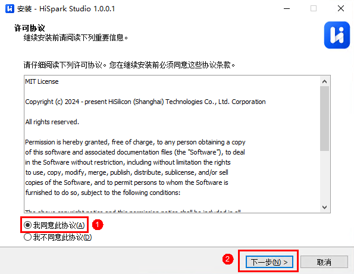

3.  选择安装路径。

    单击“浏览”，选择安装路径之后，单击“下一步”。

    **图 3**  选择安装路径<a name="zh-cn_topic_0000001835960614_fig13166181819538"></a>  
    
    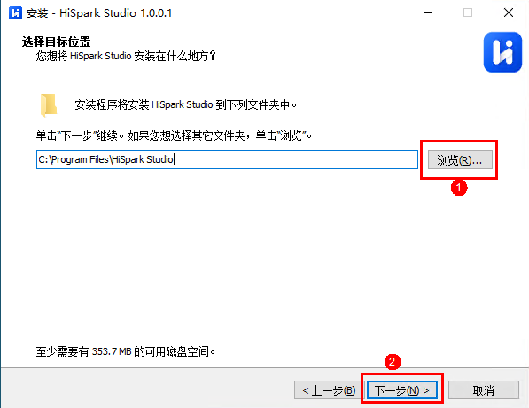

    > **说明：** 
    >安装路径必须是英文路径。

4.  选择附加任务，建议全部勾选，并单击“下一步\(N\)”。

    **图 4**  选择附加任务<a name="zh-cn_topic_0000001835960614_fig38871257072"></a>  
    
    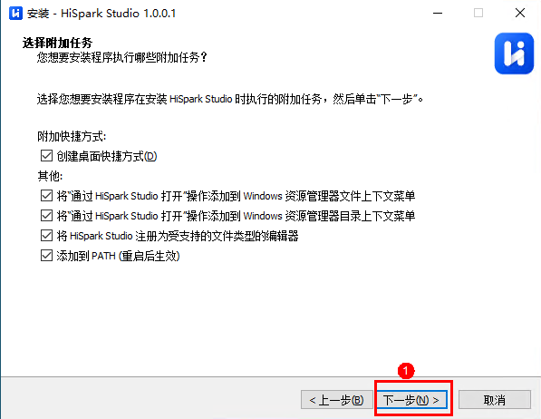

5.  准备安装。

    确认安装信息无误，单击“安装\(I\)”。

    **图 5**  准备安装<a name="zh-cn_topic_0000001835960614_fig5302191515419"></a>  
    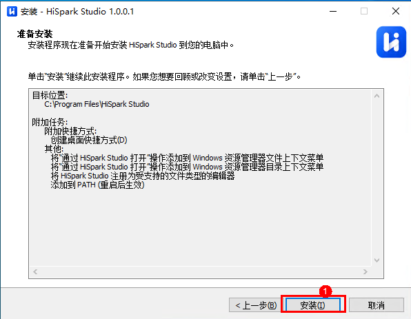

6.  等待安装。

    等待安装执行。

    **图 6**  等待文件安装<a name="zh-cn_topic_0000001835960614_fig1452012281548"></a>  
    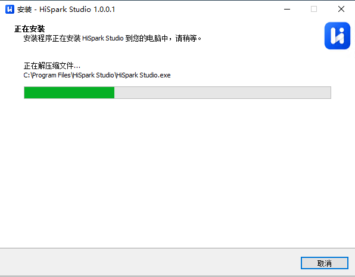

    **图 7**  等待插件安装<a name="zh-cn_topic_0000001835960614_fig173601841145413"></a>  
    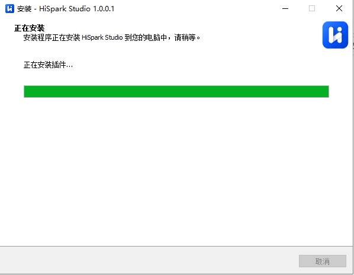

7.  安装完成。

    **图 8**  安装完成<a name="zh-cn_topic_0000001835960614_fig760785213541"></a>  
    
    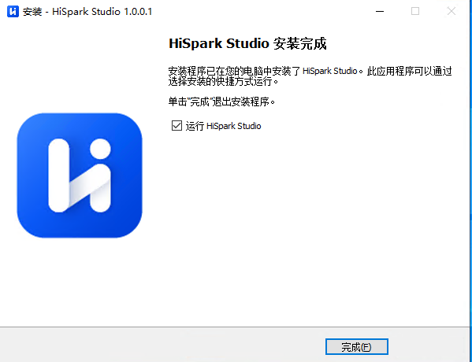

    > **说明：** 
    >在安装的过程中，如果想停止安装，单击“取消”按钮。

## 配置python环境<a name="ZH-CN_TOPIC_0000002263530281"></a>

HiSpark Studio在对cfbb系列工程进行编译等操作需要依赖python环境，安装HiSpark Studio时如果出现如[图 安装时python弹框提示](#zh-cn_topic_0000001891982516_fig173601841145413)，说明本地电脑中未安装python或者安装的python版本不为3.11.4，此时点击“确定”会立即打开网页下载python-3.11.4-amd64.exe安装包，点击“取消”则不会下载python3.11.4的安装包。

**图 1**  安装时python弹框提示<a name="zh-cn_topic_0000001891982516_fig173601841145413"></a>  

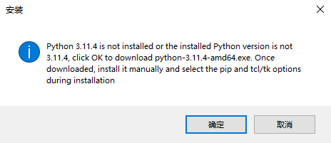

> **须知：** 
>点击“确认”或者“取消”均不会影响HiSpark Studio的正常安装。但是若不安装python3.11.4，可能会影响“编译”和“系统配置”功能的使用。

如果在安装过程中点击了“取消”但是为不影响IDE的使用想再次下载python3.11.4并安装，可以通过[https://www.python.org/ftp/python/3.11.4/python-3.11.4-amd64.exe](https://www.python.org/ftp/python/3.11.4/python-3.11.4-amd64.exe)（python官网，下载速度较慢）或者[https://repo.huaweicloud.com/python/3.11.4/python-3.11.4-amd64.exe](https://repo.huaweicloud.com/python/3.11.4/python-3.11.4-amd64.exe)（下载安装包后上传至华为云上，下载速度较快）下载python3.11.4的安装包。

> **须知：** 
>在安装python过程中如果自定义安装需要勾选pip和td/tk and IDEL这两个选项。
>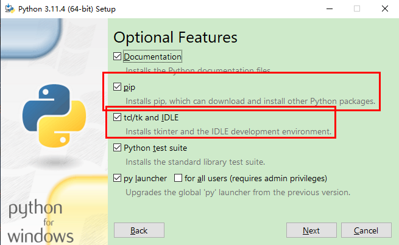

# 工程管理<a name="ZH-CN_TOPIC_0000002263570345"></a>


## 新建工程<a name="ZH-CN_TOPIC_0000002228570768"></a>

1.  打开HiSpark Studio工具，进入欢迎页面，单击“新建工程”，进入新建工程页面。

    **图 1**  HiSpark Studio欢迎页面<a name="zh-cn_topic_0000001882753605_fig6514428113718"></a>  
    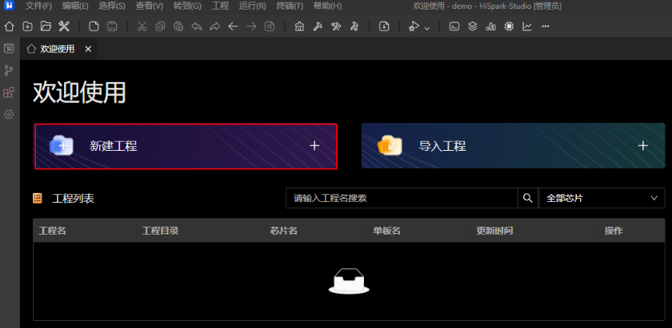

2.  在[图2](#zh-cn_topic_0000001882753605_fig1583004651715)界面配置工程参数，单击“完成”。

    **图 2**  新建工程窗口<a name="zh-cn_topic_0000001882753605_fig1583004651715"></a>  
    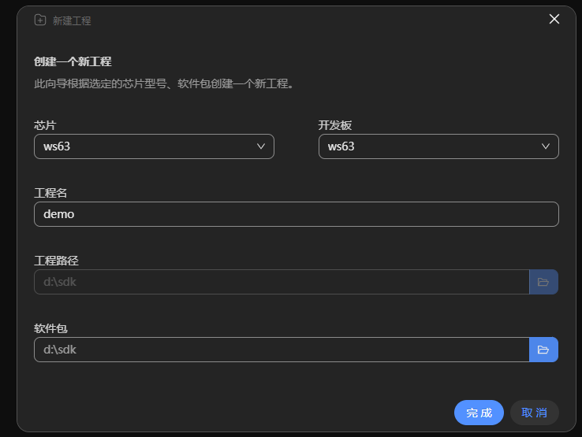

    -   芯片：选择工程使用的芯片名称。具体参考第一章工具简介中的[表 HiSpark Studio工具支持的芯片及其特性](工具简介.md#zh-cn_topic_0000001882480117_table82241939151116)。
    -   开发板：选择工程使用的开发板名称。当用户需要自定义开发板时，这里选择芯片名作为开发板名。
    -   工程名：输入工程名称。
    -   工程路径：与软件包目录一致。
    -   软件包：选择工程使用的软件开发驱动包（SDK）文件夹根目录。

3.  查看工程创建结果。

    HiSpark Studio会自动打开新创建的工程，并在欢迎界面工程列表中显示创建的工程，如[图3](#zh-cn_topic_0000001882753605_fig551738161718)所示。

    **图 3**  工程创建结果页面<a name="zh-cn_topic_0000001882753605_fig551738161718"></a>  
    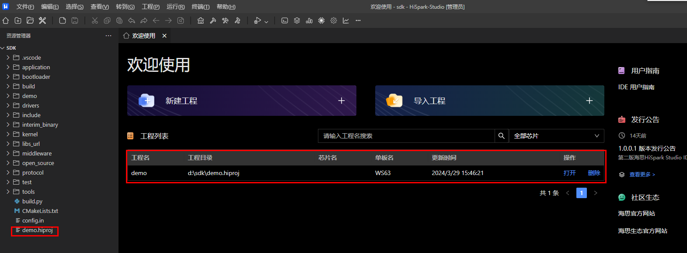

## 导入工程<a name="ZH-CN_TOPIC_0000002228410960"></a>

1.  打开HiSpark Studio工具，进入到欢迎页面，单击“导入工程”，进入导入工程页面。

    **图 1**  HiSpark Studio导入工程页面<a name="zh-cn_topic_0000001835834544_fig19540125184016"></a>  
    

2.  选择导入的路径，即可查找该路径下所有的工程，勾选需要导入的工程，单击“完成”。

    **图 2**  导入工程配置页面<a name="zh-cn_topic_0000001835834544_fig3640203910157"></a>  
    

3.  导入工程完成后，会在工程区展示出工程的文件夹，并在欢迎界面的工程列表中记录所导入的工程。

    **图 3**  导入工程完成<a name="zh-cn_topic_0000001835834544_fig1617152231818"></a>  
    

## 打开工程<a name="ZH-CN_TOPIC_0000002263530285"></a>

1.  打开HiSpark Studio工具，进入到欢迎页面，单击，进入打开工程页面。

    **图 1**  单击打开工程<a name="zh-cn_topic_0000001882633817_fig1951810305412"></a>  
    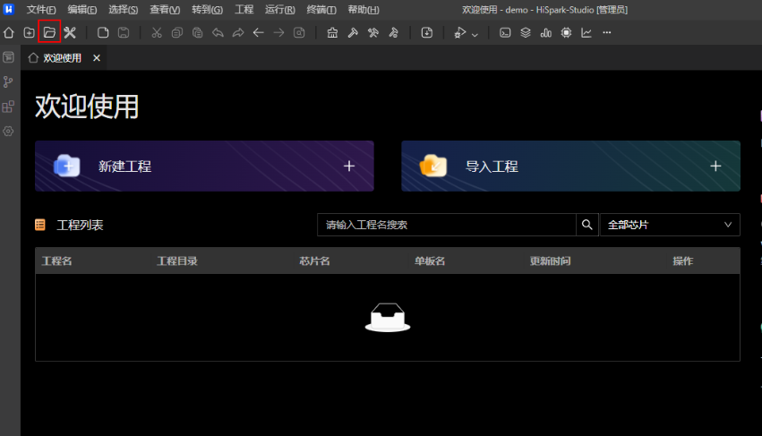

2.  选择目标工程打开。

    **图 2**  打开工程的步骤<a name="zh-cn_topic_0000001882633817_fig45311048181812"></a>  
    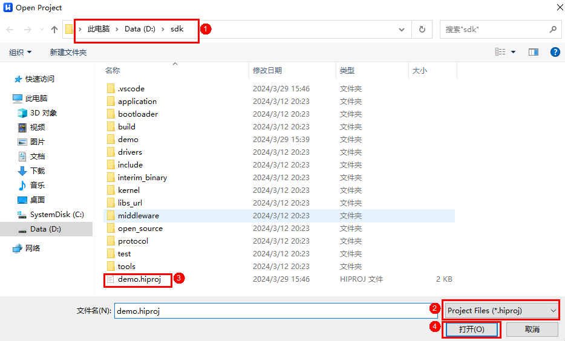

    ①：选择目标工程所在的路径。

    ②：选择导入类型为“Project Files（\*.hiproj）”。

    ③：选择目标文件，例如“demo.hiproj”。

    ④：单击“打开\(O\)”。

3.  工作台视图中展示工程下面的文件夹，且在工程列表中出现当前打开的工程，表示打开工程成功。

    **图 3**  打开工程成功<a name="zh-cn_topic_0000001882633817_fig1079207141915"></a>  
    

# 工程配置<a name="ZH-CN_TOPIC_0000002263570349"></a>

工程配置主要用于配置工程的基本信息、编译、调试、烧录等工程配置项，单击按钮可以打开工程配置界面，如[图1](#zh-cn_topic_0000001890128414_fig672755464817)所示。

**图 1**  单击工程配置按钮<a name="zh-cn_topic_0000001890128414_fig672755464817"></a>  
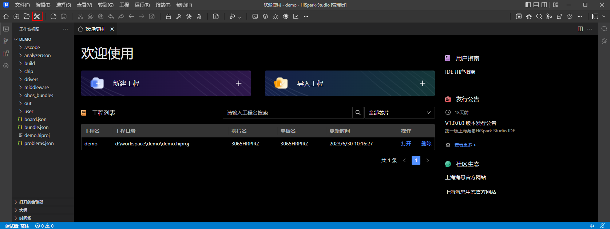


## 基本信息配置<a name="ZH-CN_TOPIC_0000002228570772"></a>

单击工程配置界面左侧“基本信息”页签进入基本信息配置界面，如[图 基本信息配置界面](#zh-cn_topic_0000001889973218_fig1037202818301)所示，该界面包含工程芯片系列、开发板型号、软件包路径。此页面可以修改工程所对应的软件包路径。

**图 1**  基本信息配置界面<a name="zh-cn_topic_0000001889973218_fig1037202818301"></a>  
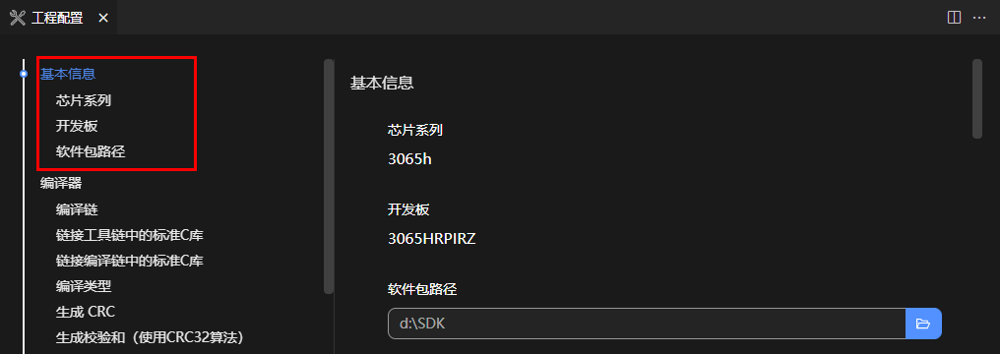

## 编译器配置<a name="ZH-CN_TOPIC_0000002228410968"></a>

单击工程配置界面左侧“编译器”页签进入编译器配置界面，如[图 编译器配置界面-1](#zh-cn_topic_0000001890133150_fig1633185563014)、[图 编译器配置界面-2](#zh-cn_topic_0000001890133150_fig1871420251316)和[图 编译器配置界面-3](#zh-cn_topic_0000001890133150_fig4443193415402)所示，该界面可配置工程使用的编译工具链、编译类型、编译选项、编译指令、编译结果文件路径以及静态库等配置。

**图 1**  编译器配置界面-1<a name="zh-cn_topic_0000001890133150_fig1633185563014"></a>  

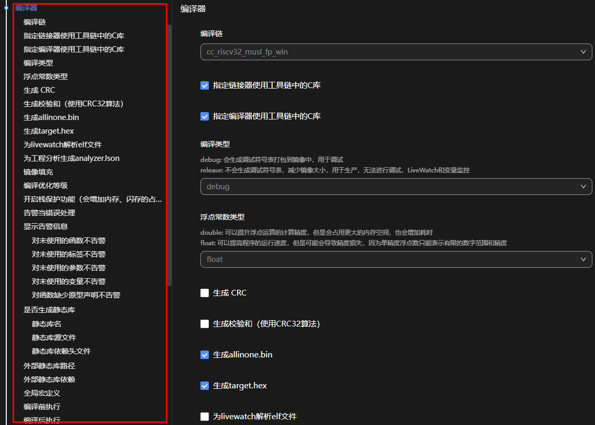

**图 2**  编译器配置界面-2<a name="zh-cn_topic_0000001890133150_fig1871420251316"></a>  

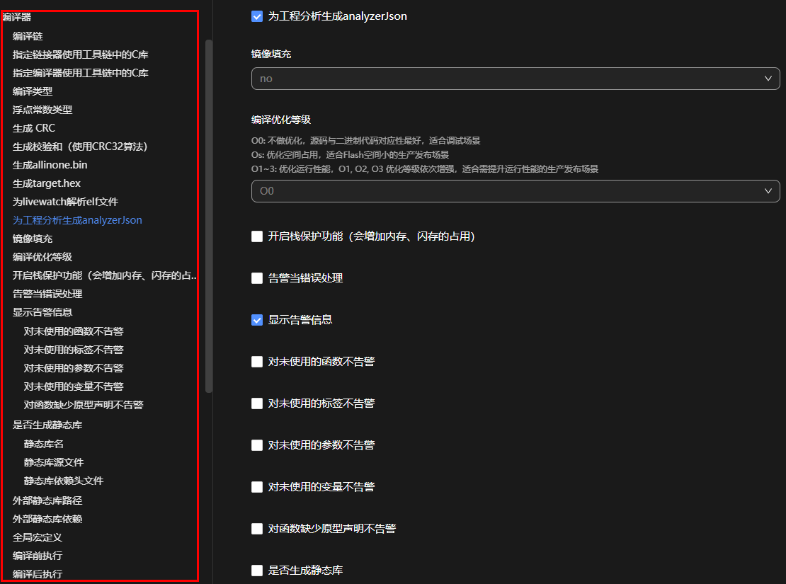

**图 3**  编译器配置界面-3<a name="zh-cn_topic_0000001890133150_fig4443193415402"></a>  

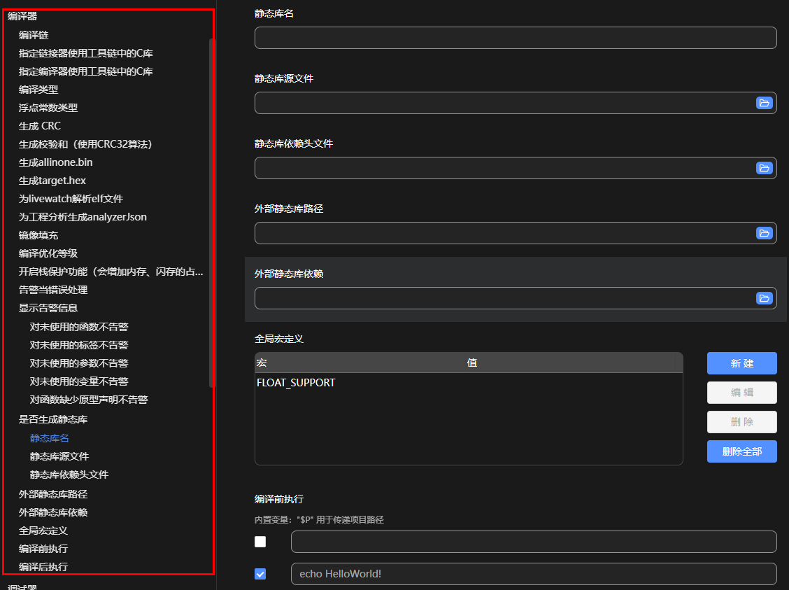

**图 4**  编译器配置界面-4<a name="zh-cn_topic_0000001890133150_fig1514082619416"></a>  
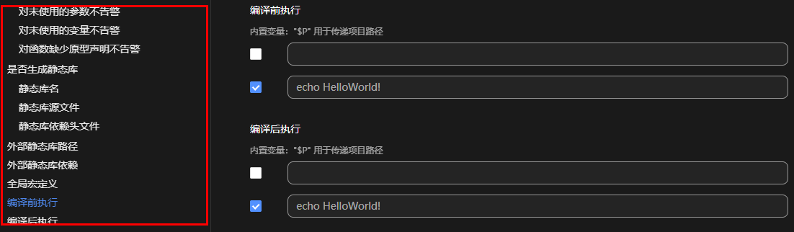

-   编译链：选择编译工具链。
-   指定链接器使用工具链中的C库：指定链接器使用工具链中的C库。
-   指定编译器使用工具链中的C库：指定编译器使用工具链中的C库。
-   编译类型：分debug/release。
    -   debug 会生成调试符号表打包到镜像中，方便调试；
    -   release 则不会生成调试符号表，减少镜像大小，用于生产。

-   浮点常数类型：分float/double。
    -   float可以提高程序的运行速度，但是可能会导致精度损失，因为单精度浮点数只能表示有限的数字范围和精度；
    -   double可以提升浮点运算的计算精度，但是会占用更大的内存空间，也会增加耗时。

-   生成CRC：用于控制编译时是否会在target.bin和target.hex末尾插入CRC算法计算的结果。
-   生成校验和（使用CRC32算法）：在可执行文件中不插入CRC算法计算结果，但是将结果保存在同级目录下的checksum\_list.txt中，并在编译过程中打印出来。
-   生成allinone.bin：只会出现在306xH系列的MCU上，用于控制编译时是否会生成allinone.bin。
-   生成target.hex：用于控制编译时是否会生成target.hex。
-   为livewatc解析elf文件：用于控制编译时是否会解析elf中的全局变量，解析的结果会在调试功能的Live Watch中使用。
-   为工程分析生成analyzerJson：用于控制编译时是否会静态的分析工程，分析的结果会用于栈分析和镜像分析。
-   镜像填充。
    -   no
    -   0
    -   1

-   编译优化等级：编译优化选项。
    -   O0：不做优化，源码与二进制代码对应性最好，适合调试场景 ；
    -   Os：优化空间占用，适合Flash空间小的生产发布场景；
    -   O1\~3：优化运行性能，O1、O2、O3优化等级依次增强，适合需提升运行性能的生产发布场景。

-   开启栈保护功能（会增加内存、闪存的占用）。
-   告警当错误处理。
-   显示告警信息。
    -   对未使用的函数不告警：忽略声明但未使用的静态函数发出的警告。
    -   对未使用的标签不告警：忽略给声明但未使用的标号发出的警告。
    -   对未使用的参数不告警：忽略给声明但未使用的参数发出的警告。
    -   对未使用的变量不告警：忽略给声明但未使用的变量发出的警告。
    -   对函数缺少原型声明不告警：忽略在使用函数前没有声明而发出警告。

-   是否生成静态库：若选中，选中的文件编译生成静态库文件；若不选中，则不会在编译时生成静态库文件。
    -   静态库名

        输入静态库的名字，如“_demo_”，编译之后会生成在 out\\libs目录下生成 lib_demo_.a。

    -   静态库源文件

        选择想要编译成静态库的文件或者文件夹。

    -   静态库依赖头文件

        选择编译静态库需要依赖的头文件，支持文件和文件夹。

-   外部静态库路径。

    配置不在本工程目录下面的静态库文件参与编译。

-   外部静态库依赖。

    配置不在本工程目录下面的静态库依赖头参与编译。

-   全局宏定义。

    配置在整个工程中都有效的宏定义。

-   编译前执行。

    自定义1\~2条指令，被勾选的指令将在编译前执行。命令中可以使用内置变量：$P（当前工程路径）。

-   编译后执行。

    自定义1\~2条指令，被勾选的指令将在编译后执行。命令中可以使用内置变量：$P（当前工程路径）。

    > **说明：** 
    >修改配置之后会自动保存并生效。文本输入框中的修改会在失焦时自动保存并生效。

## 调试器配置<a name="ZH-CN_TOPIC_0000002263530289"></a>

单击工程配置界面左侧调试器“调试器”页签进入调试器配置界面，如[图 调试器配置界面](#zh-cn_topic_0000001934012941_fig1543616388345)所示，该界面支持配置工程调试客户端、调试工具以及调试工具对应的参数。

**图 1**  调试器配置界面<a name="zh-cn_topic_0000001934012941_fig1543616388345"></a>  

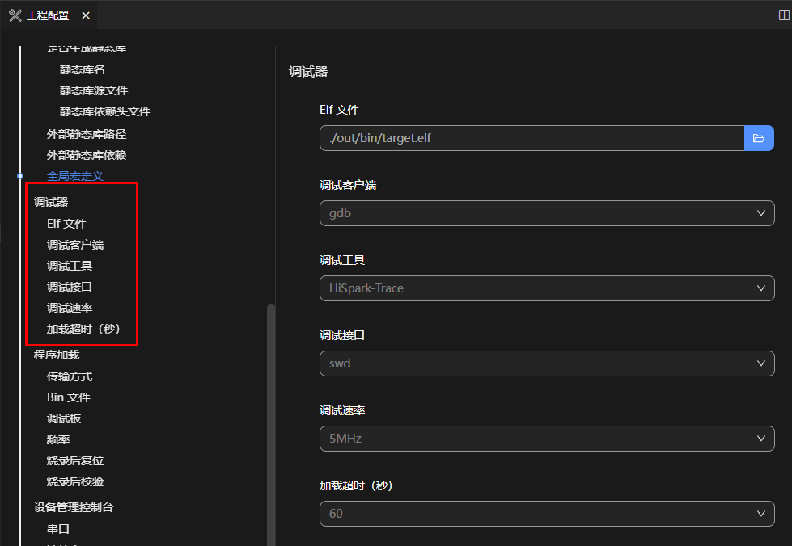

-   Elf 文件：指定待调试Elf文件路径，用于镜像分析、栈分析、变量监控和调试。
-   调试客户端：选择调试客户端，默认是gdb。
-   调试工具：选择调试器。
    -   HiSpark-Trace：选择HiSpark-Trace调试器。
    -   HiSpark-Link：选择HiSpark-Link调试器。
    -   jlink：选择Jlink调试器。
        -   当调试器选择jlink时会要求配置JLinkGDBServerCL路径，该路径位于jlink驱动的安装路径下。

            **图 2**  JLinkGDBServerCL默认路径<a name="zh-cn_topic_0000001934012941_fig0240165395418"></a>  
            

-   JlinkScript路径 ：配置JLink启动脚本，用于连接HiSpark Studio工具和芯片内核。
-   调试接口：选择调试器的连接模式jtag或swd，默认配置成swd。
-   调试速率：配置调试器速率，单位为MHz或kHz。
-   加载超时（秒）：调试选择launch模式，会先将镜像加载到MCU中，选择一个加载时间，如果加载超时会自动退出调试。

> **说明：** 
>-   使用HiSpark-Link时需要安装HiSpark-Link驱动，详情参考《HiSpark调试器系列 使用指南》。
>-   使用jlink时需要先安装jlink驱动。
>-   修改配置之后会自动保存并生效。
>-   MCU系列工程支持HiSpark-Trace、HiSpark-Link和jlink调试方式，CFBB系列工程仅支持jlink调试。
>-   仅CFBB系列工程能够选择JlinkScript路径

## 烧录器配置<a name="ZH-CN_TOPIC_0000002263570353"></a>

单击工程配置界面左侧“程序加载”页签进入程序加载配置界面，如[图 程序加载配置界面](#zh-cn_topic_0000001889973222_fig179412239356)所示，该界面支持配置烧录传输方式以及传输方式对应的参数。

**图 1**  程序加载配置界面<a name="zh-cn_topic_0000001889973222_fig179412239356"></a>  

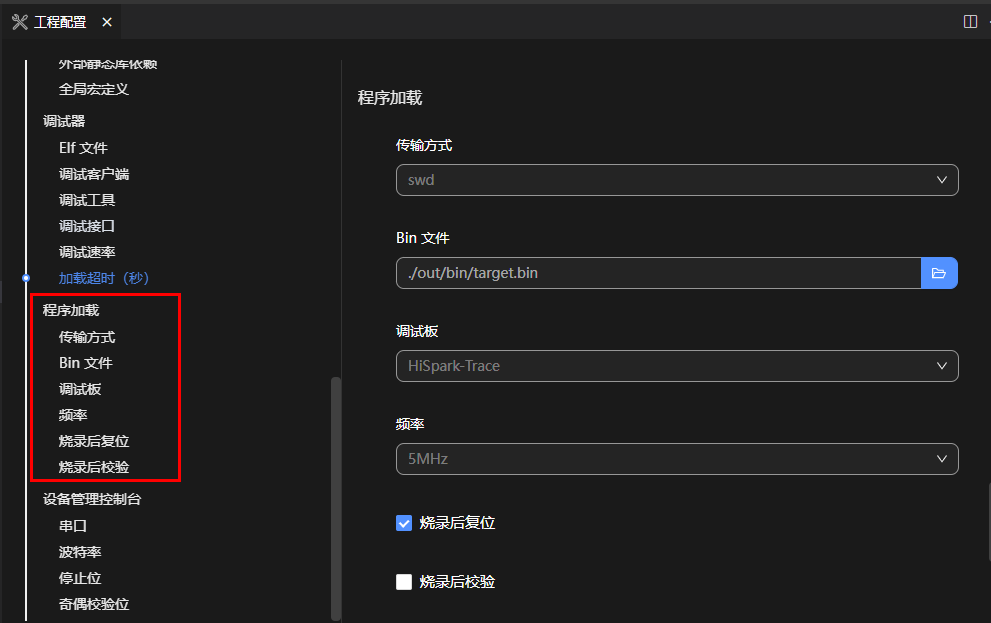

-   Bin文件：指定需要烧录的文件。

    > **须知：** 
    >MCU系列的工程“Bin文件”中为.bin文件，其他为.fwpkg文件。

-   传输方式：选择数据传输方式。选择不同的传输方式会出现不同的参数配置项。
    -   swd：选择通过swd接口传输。如[图2](#zh-cn_topic_0000001889973222_fig219531772715)所示。
        -   调试板：选择调试器。默认选择“HiSpark-Trace”，可选“HiSpark-Link”和“HiSpark-Trace”。
        -   频率 ：配置调试器速率，单位为MHz或kHz。

            **图 2**  选择swd配置界面<a name="zh-cn_topic_0000001889973222_fig219531772715"></a>  
            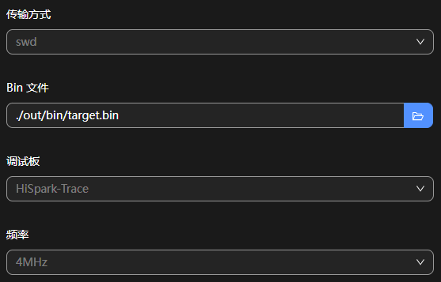

    -   jtag：选择通过jtag接口传输。如[图3](#zh-cn_topic_0000001889973222_fig0858134123619)所示。
        -   调试板：选择调试器。默认选择“HiSpark-Trace”，可选“HiSpark-Link”和“HiSpark-Trace”。
        -   频率 ：配置调试器速率，单位为 MHz或kHz。

            **图 3**  选择jtag配置界面<a name="zh-cn_topic_0000001889973222_fig0858134123619"></a>  
            

    -   serial：选择通过串口传输。如[图4](#zh-cn_topic_0000001889973222_fig58771855184310)所示。
        -   端口
        -   波特率

            **图 4**  选择serial配置界面<a name="zh-cn_topic_0000001889973222_fig58771855184310"></a>  
            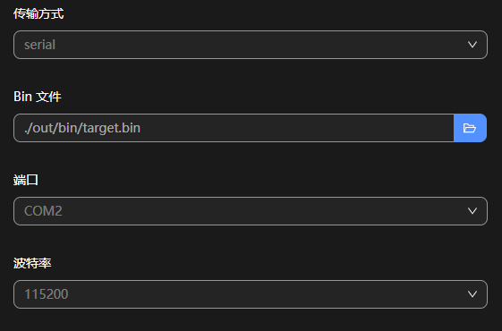

-   烧录后复位：烧录完成后，会进行单板软复位。
-   烧录后校验：烧录后，会将烧录文件进行回读对比，校验文件的完整性。

> **说明：** 
>-   使用HiSpark-Link时需要安装HiSpark-Link驱动，详情参考《HiSpark调试器系列 使用指南》。
>-   MCU系列芯片支持swd、jtag和serial三种烧录方式，其余芯片仅支持serial烧录。
>-   修改配置之后会自动保存并生效。

## 设备控制台配置<a name="ZH-CN_TOPIC_0000002228570776"></a>

单击工程配置界面左侧“设备控制台”页签进入设备控制台配置界面，如[图 设备控制台配置界面](#zh-cn_topic_0000001890133154_fig1634818481379)所示。

**图 1**  设备控制台配置界面<a name="zh-cn_topic_0000001890133154_fig1634818481379"></a>  
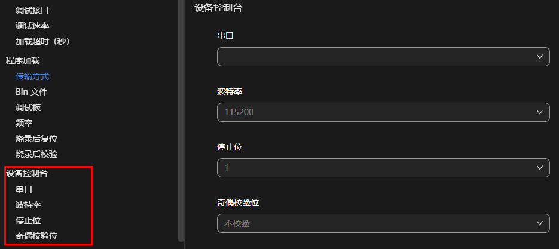

-   串口
-   波特率
-   停止位
-   奇偶校验位

# chipconfig配置<a name="ZH-CN_TOPIC_0000002228410972"></a>

本章节主要介绍如何使用ChipConfig插件进行IP配置和代码生成。


## 功能介绍<a name="ZH-CN_TOPIC_0000002263530297"></a>

芯片配置器提供图形化的PIN脚视图、组件视图，支持用户快速完成芯片的PIN脚设置和驱动模块参数设置并自动生成配置代码。

## 功能入口<a name="ZH-CN_TOPIC_0000002263570357"></a>

打开工程后，点击工具栏中的“芯片配置器”选项，如[图1](#zh-cn_topic_0000001835800834_fig964311399383)所示。

**图 1**  芯片配置器入口<a name="zh-cn_topic_0000001835800834_fig964311399383"></a>  
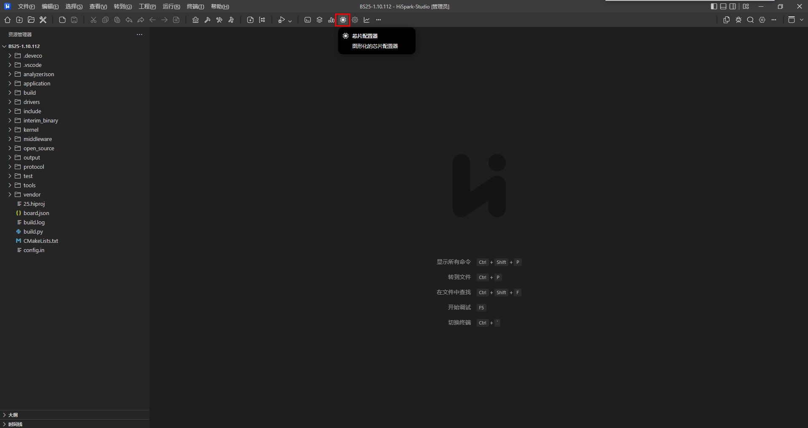

## 芯片配置器主界面<a name="ZH-CN_TOPIC_0000002228570780"></a>

**图 1**  芯片配置器主界面<a name="zh-cn_topic_0000001835800798_fig88678511231"></a>  
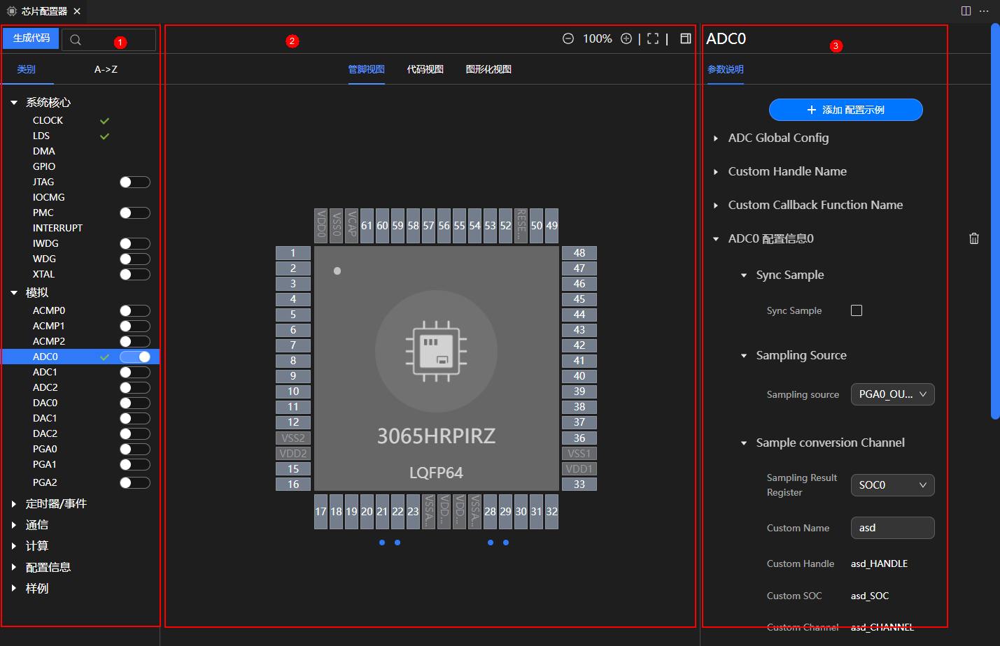

① 模块列表菜单区：提供了芯片所有可配置模块的列表，可以按字母排序也可按类别排序进行模块名查找。

② 模块视图区：提供了模块的Pin View管脚视图、Code Preview代码预览视图、Component View 组件视图，以图形化的方式实现模块的快速配置。

③ 模块参数区：提供了模块可配置的参数列表和pins列表。

> **说明：** 
>不是所有驱动模块都存在图形化视图。芯片配置器功能当前不支持BRANDY、BS21、NB17、NB17E、NB18、WS63系列芯片。


### 模块列表菜单区详细介绍<a name="ZH-CN_TOPIC_0000002228410976"></a>

**图 1**  模块列表菜单区<a name="zh-cn_topic_0000001835960582_fig495912317620"></a>  
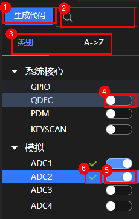

①  ：生成代码按钮。

②  ：模块列表菜单区驱动模块名称搜索框。

③  ：模块列表排序方式，“类别” 代表按模块类别分类排序，“A-\>Z”代表模块名称按字母排序。

④  ：模块未使能状态。

⑤  ：模块已使能状态。

⑥  ：驱动模块配置正确。

### 模块视图区详细介绍<a name="ZH-CN_TOPIC_0000002263530301"></a>


#### 模块视图操作菜单栏<a name="ZH-CN_TOPIC_0000002263570361"></a>

**图 1**  模块视图操作菜单栏<a name="zh-cn_topic_0000001924908674_fig380616341973"></a>  


-   ：视图缩小操作按钮。
-   ：当前视图缩放比例。
-   ：视图放大操作按钮。
-   ：重置放大比例到百分百。
-   ：展开/折叠模块参数区。

#### 视图切换操作栏<a name="ZH-CN_TOPIC_0000002228570784"></a>

**图 1**  视图切换操作栏<a name="zh-cn_topic_0000001924911962_fig639612114116"></a>  


-   ：管脚视图。
-   ：代码视图。
-   ：图形化视图。

#### 管脚视图介绍<a name="ZH-CN_TOPIC_0000002228410980"></a>

**图 1**  管脚视图介绍<a name="zh-cn_topic_0000001952031429_fig172851612201116"></a>  
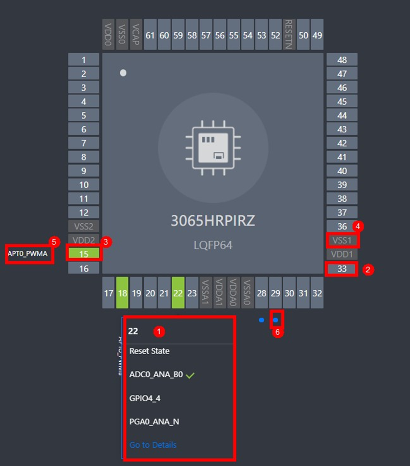

①   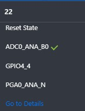：鼠标放在管脚上出现的悬浮提示信息，展示当前管脚可配置选项，打勾为配置值，点击“Reset State”可取消当前配置值，“Go to Details”进入该管脚复用的配置界面；

②  ：灰底白字代表管脚尚未配置。

③  ：绿色代表管脚已被配置。

④  ：灰底灰字代表管脚不可配置。

⑤  ：管脚当前配置值；

⑥  ：当前模块可配置的功能管脚。

> **说明：** 
>管脚视图支持通过拖拽的方式，查看被遮挡的管脚配置值。

#### Code Preview代码预览视图介绍<a name="ZH-CN_TOPIC_0000002263530305"></a>

可以通过代码视图界面预览芯片配置器生成的所有代码。

**图 1**  Code Preview代码预览视图介绍<a name="zh-cn_topic_0000001951871661_fig154865010212"></a>  
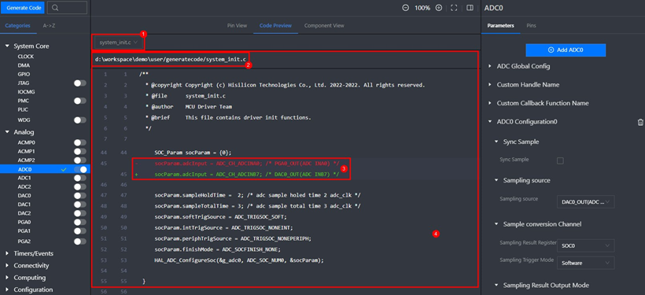

①  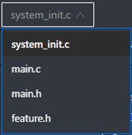：代码预览源文件切换。

②  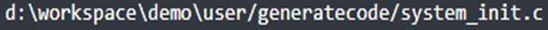  ：自动生成的代码在电脑存储的路径。

③  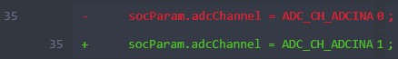：最新的代码修改提示，红色代表删除，绿色代表新增。

④ 代码展示区。

#### Component View 图形化视图介绍<a name="ZH-CN_TOPIC_0000002263570365"></a>

Component View提供驱动模块参数的图形化配置方式，方便用户理解和快速配置。

Component View中的参数与右侧的参数列表相对应。

**图 1**  Component View图形化视图介绍<a name="zh-cn_topic_0000001924752622_fig785714341244"></a>  
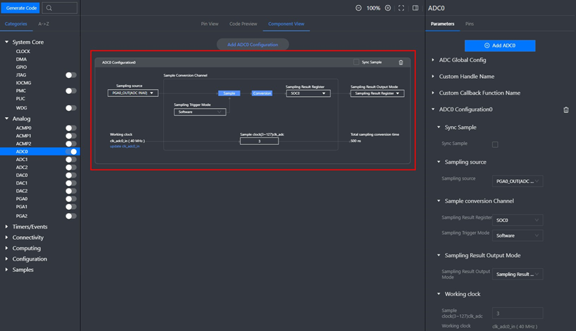

图形化视图右侧的参数列表中的参数分为：

-   Parameters：详细参数配置。
-   Pins：管脚配置。

> **说明：** 
>Component View配置内容跟随模块的变化而变化。

## 驱动模块配置举例（I2C）<a name="ZH-CN_TOPIC_0000002228570788"></a>


### 使能I2C驱动模块<a name="ZH-CN_TOPIC_0000002228410984"></a>

**图 1**  I2C驱动模块配置界面<a name="zh-cn_topic_0000001882599877_fig2175351718"></a>  
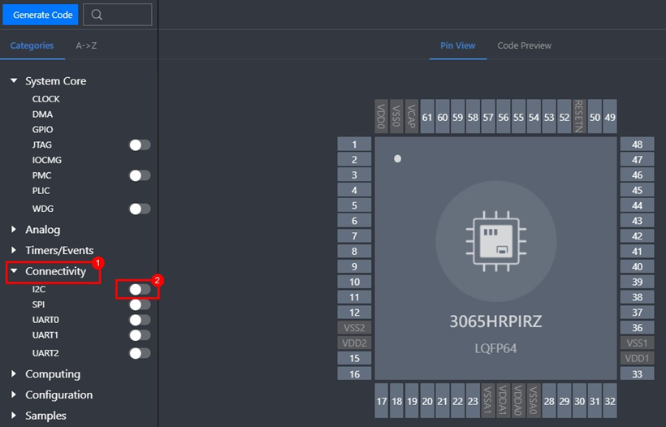

①  ：展开模块列表菜单区。

②  ：模块开关。

### 配置驱动模块PIN脚<a name="ZH-CN_TOPIC_0000002263530309"></a>

**图 1**  I2C驱动模块PIN脚配置<a name="zh-cn_topic_0000001835800794_fig14201249913"></a>  
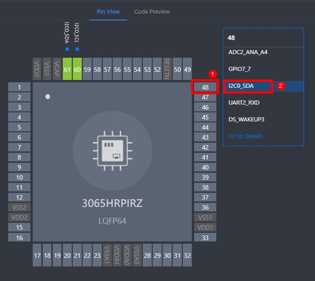

① 在Pin View视图中点击可以配置驱动模块的管脚（例如48号管脚）。

② 选中的“I2C0\_SDA”。

**图 2**  更换I2C使能PIN脚<a name="zh-cn_topic_0000001835800794_fig9515121813106"></a>  
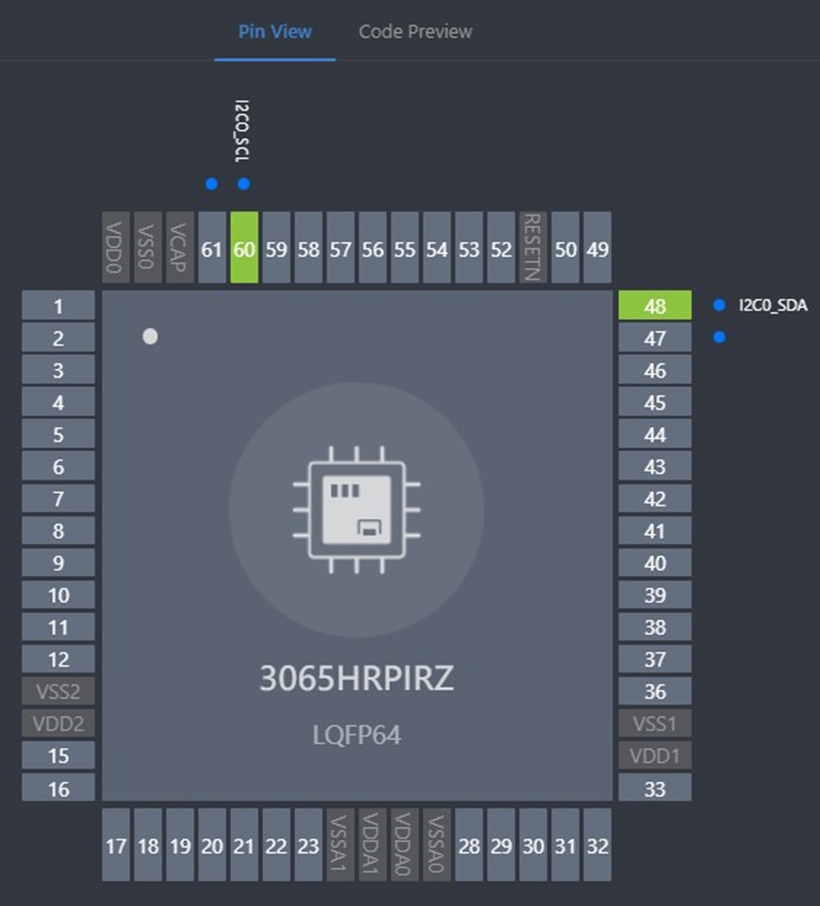

### 配置驱动模块参数<a name="ZH-CN_TOPIC_0000002263570369"></a>

在Parameters模块参数区中，完成I2C驱动模块参数配置。

**图 1**  I2C驱动模块参数配置<a name="zh-cn_topic_0000001835960602_fig7798113716612"></a>  
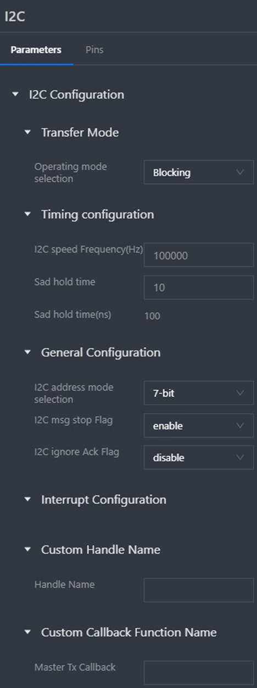

### 预览I2C驱动模块配置代码<a name="ZH-CN_TOPIC_0000002228570792"></a>

在Code Preview视图中预览自动生成的代码。

**图 1**  I2C驱动模块代码预览<a name="zh-cn_topic_0000001835800830_fig163988238"></a>  
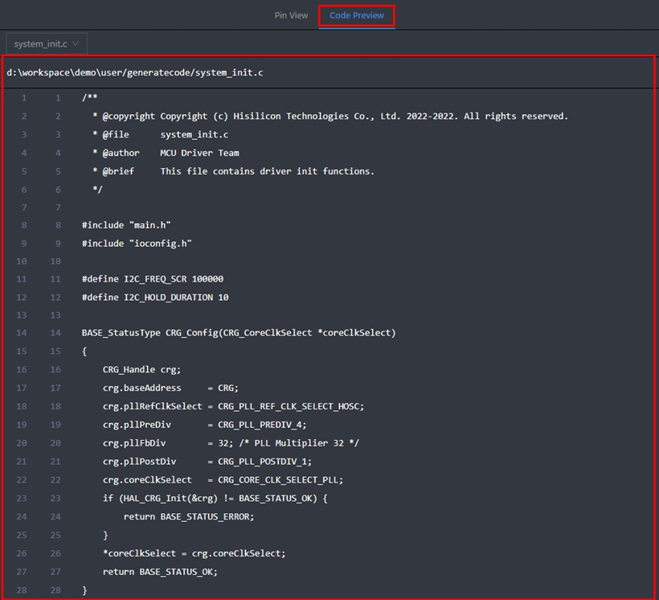

### 生成驱动模块的代码<a name="ZH-CN_TOPIC_0000002228410988"></a>

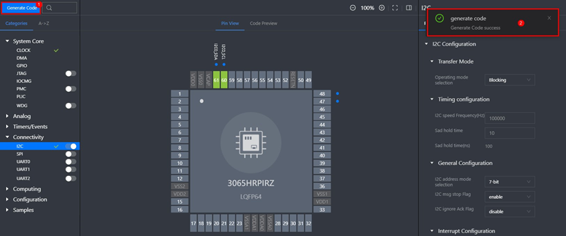

①  点击“Generate Code”生成代码。

②  弹出生成代码成功提示框，表示成功生成驱动模块代码。

## 样例配置举例（仅支持MCU系列芯片）<a name="ZH-CN_TOPIC_0000002263530313"></a>

1.  打开样例列表。

    在模块列表菜单区中选择“SAMPLE“。

    **图 1**  SAMPLE列表<a name="zh-cn_topic_0000001951909561_fig162581859171710"></a>  
    
    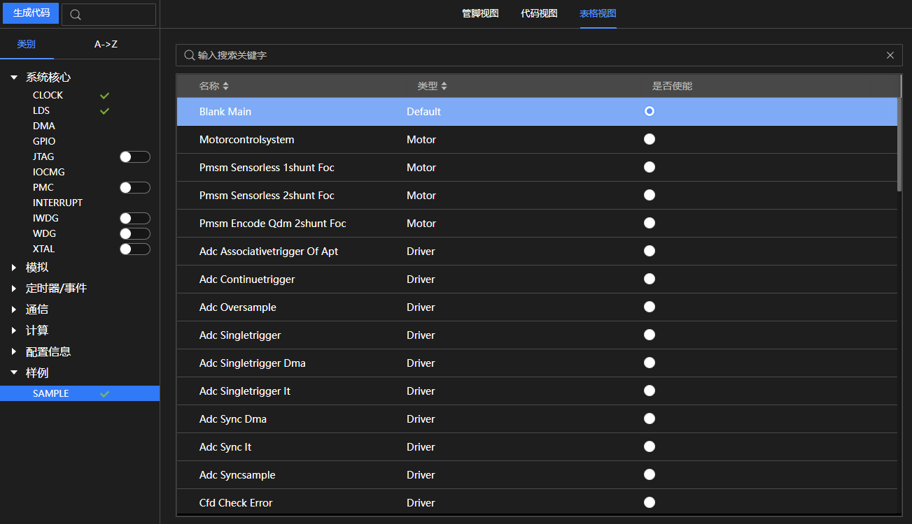

2.  搜索选择“Motorcontrolsystem"。

    支持搜索“Sample"，在搜索框输入 “Motor”， 则表格会过滤出所有类型中带有“Motor”的Sample用例，然后在表格视图中选择“Motorcontrolsystem Sample”。

    **图 2**  搜索并选择Motorcontrolsystem Sample<a name="zh-cn_topic_0000001951909561_fig6730931417"></a>  
    
    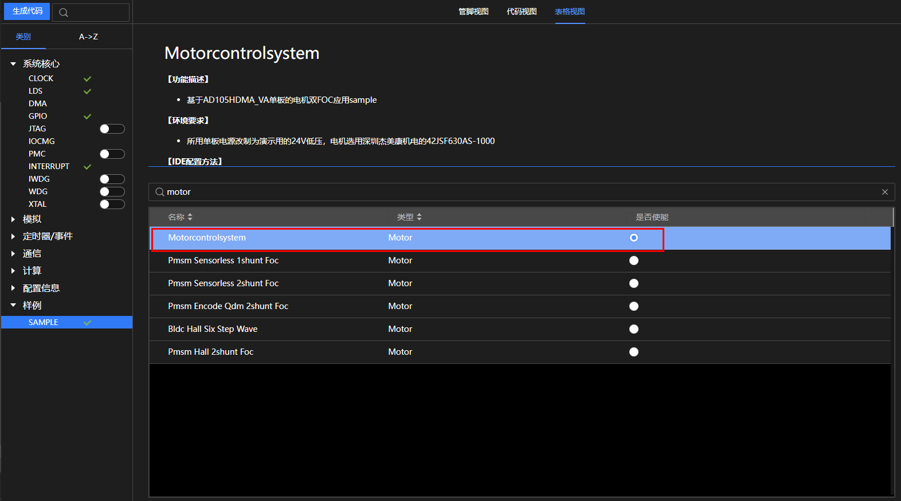

3.  生成Sample代码。

    **图 3**  弹出提示对话框<a name="zh-cn_topic_0000001951909561_fig46792571141"></a>  
    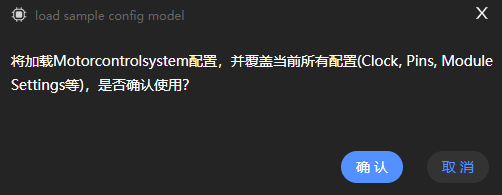

    弹窗提示“将加载Motorcontrolsystem配置，并覆盖当前所有配置（Clock, Pins, Module Settings等），是否确认使用？”，选择“确认”。

4.  查看Sample的驱动模块配置。

    在模块列表菜单区可以看到Motorcontrolsystem Sample自动配置了所依赖的驱动模块。

    **图 4**  选择Motorcontrolsystem Sample结果<a name="zh-cn_topic_0000001951909561_fig376520191201"></a>  
    
    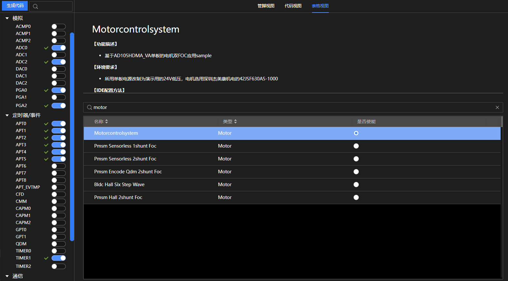

5.  查看Sample自动生成的代码。

    在模块视图区选择代码视图查看生成的代码。

    **图 5**  代码预览界面<a name="zh-cn_topic_0000001951909561_fig1450312044210"></a>  
    
    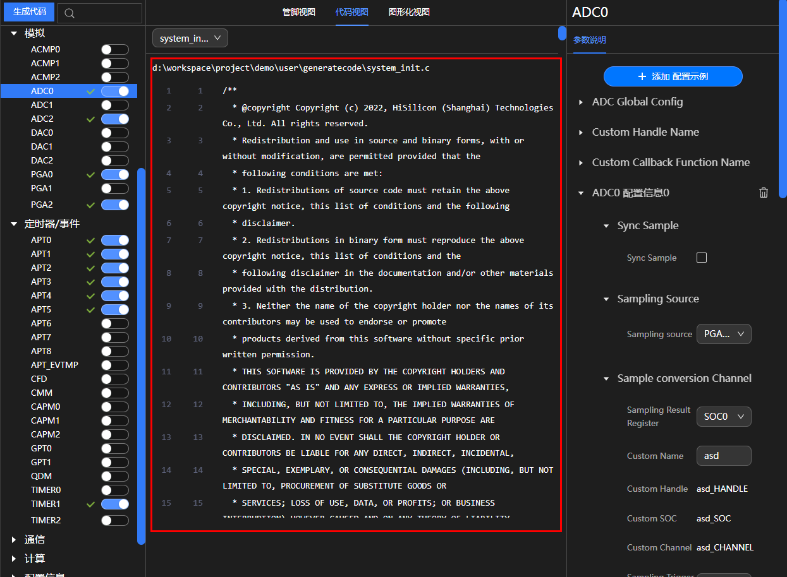

## Clock配置（仅支持MCU系列芯片）<a name="ZH-CN_TOPIC_0000002263570373"></a>

展开“系统核心”，单击“CLOCK”进入时钟控制器页面。

**图 1**  CLOCK时钟控制器界面<a name="zh-cn_topic_0000001924790508_fig9710841141515"></a>  
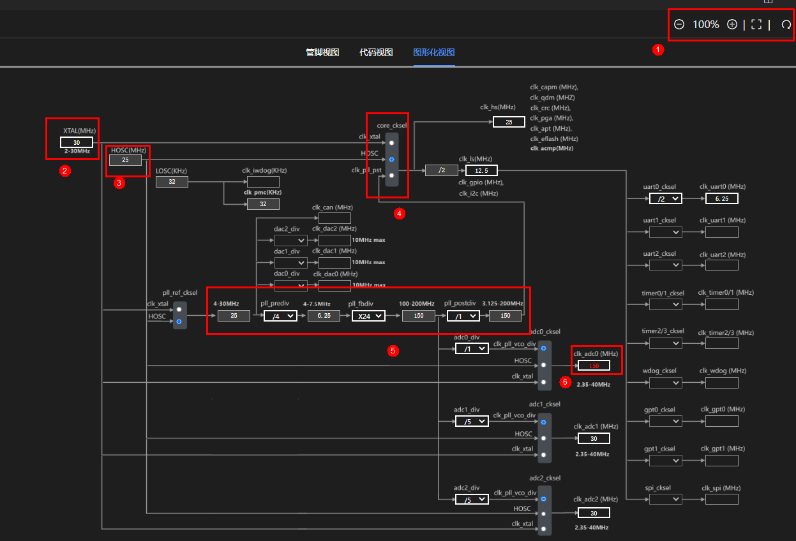

① 工具栏：  是调整缩放比例，  是重置图片初始位置和大小，恢复时钟设置到上一次生成代码的状态。

②  ：可以修改的时钟值。

③  ：固定的时钟值，不能被主动修改。

④  ：选择输入的时钟源。

⑤ PLL时钟源，其中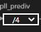、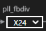、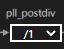表示分频的系数，其余表示计算的时钟结果。

⑥  警告：红色数字表示配置的时钟频率超过了MCU运行的范围，需要用户主动修改。

> **须知：** 
>当Clock页面有警告存在时，用户无法生成代码。单击生成代码会出现如图提示。
>
>提示原因：红色数字表示在频率范围内异常，需要用户主动修改在正常范围内。
>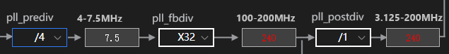

## LDS配置（仅支持MCU系列芯片）<a name="ZH-CN_TOPIC_0000002228570796"></a>

展开“系统核心”，单击“LDS”进入LDS配置页面。

**图 1**  LDS配置界面<a name="zh-cn_topic_0000001924949872_fig1373105764210"></a>  
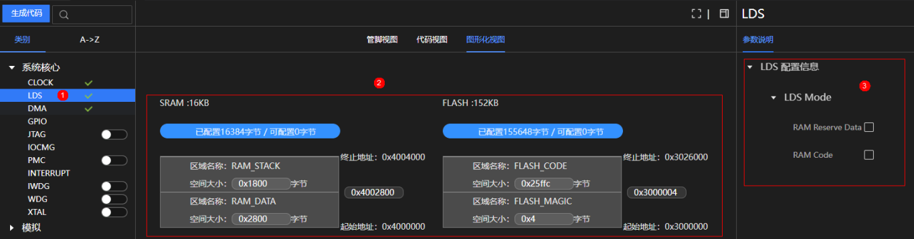

①：LDS 菜单项。

②：LDS 组件视图，展示当前MCU的内存分区视图。包括分区数量、分区命名、分区大小、起始地址、结束地址，总空间大小和剩余空间大小。用户可以修改分区的空间大小，生成 flash.lds 文件。

③：LDS 配置信息。

-   RAM Reserve Data

    定义：固化变量地址。

    用法：使用RESERVED\_DATA声明变量，例如 RESERVED\_DATA unsigned int g\_test1。

    **图 2**  使能 RAM Reserve Data<a name="zh-cn_topic_0000001924949872_fig119491819104317"></a>  
    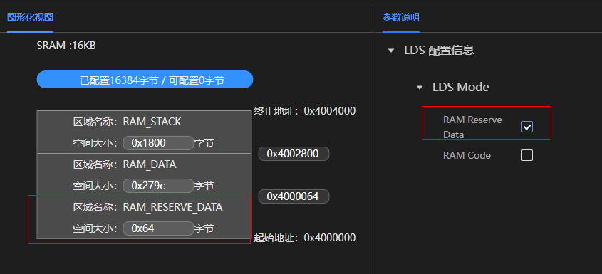

-   RAM Code

    定义：将代码放到RAM中运行，让系统有更好的实时性。

    用法：选择需要放入RAM中的.c文件。

    **图 3**  使能 RAM Code<a name="zh-cn_topic_0000001924949872_fig118801953162019"></a>  
    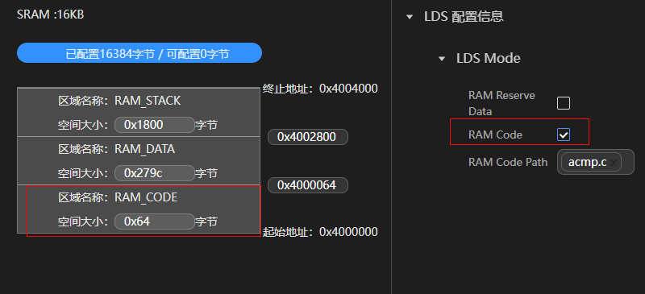

-   RAM Code Path

    定义 : 选择需要放入RAM中的.c文件。需要勾选RAM Code之后才出现RAM Code Path。

    用法：勾选当前工程目录中的 .c 文件。

    **图 4**  选择需要放入RAM中的.c文件<a name="zh-cn_topic_0000001924949872_fig039951716215"></a>  
    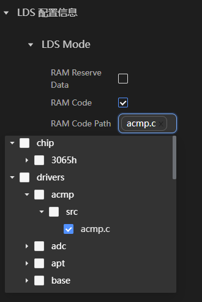

## APT主从配置（仅支持MCU系列芯片）<a name="ZH-CN_TOPIC_0000002228410992"></a>

展开“定时器/事件”，单击“APT0”进入APT0配置页面。

**图 1**  APT主从配置界面<a name="zh-cn_topic_0000001952069317_fig165431516164"></a>  
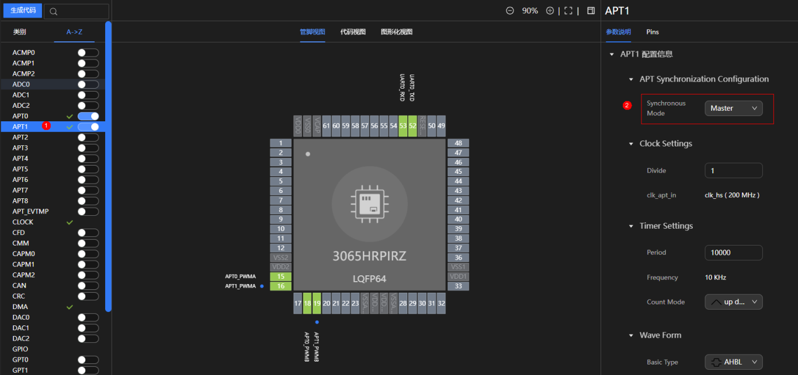

①：APT1开关

②：设定为主配置项

使能APT1，选择“Synchronous Mode”为Master，将APT1设定为主。

**图 2**  APT0设定为从<a name="zh-cn_topic_0000001952069317_fig8761156124320"></a>  
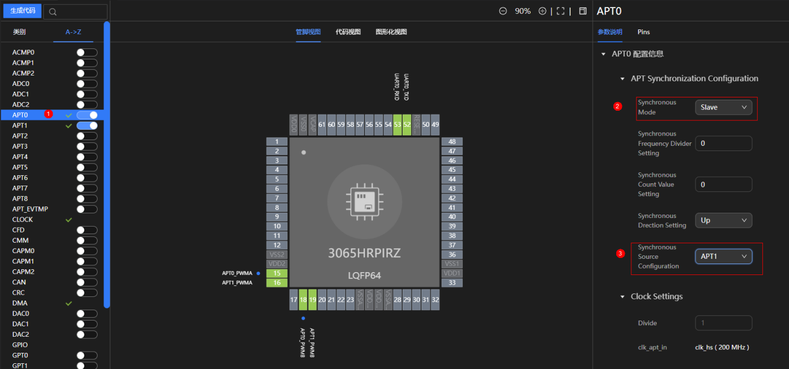

①：APT0开关

②：设定为从配置项

③：从APT1配置项。

使能APT0，选择“Synchronous Mode”为Slave设定为从配置项，选择"Synchronous Source Configuration"为APT1，将APT1设定为主。APT0的某些配置项将复用APT1的配置项。

配置主从关系后，在代码预览视图中可以查看对应生成的代码。

**图 3**  主从配置代码-1<a name="zh-cn_topic_0000001952069317_fig152210429151"></a>  
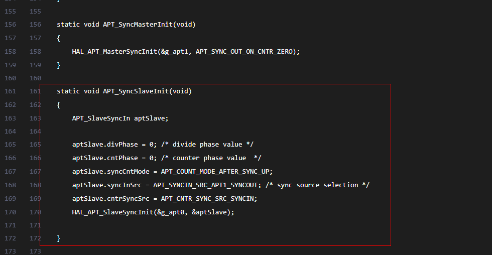

**图 4**  主从配置代码-2<a name="zh-cn_topic_0000001952069317_fig394075752216"></a>  
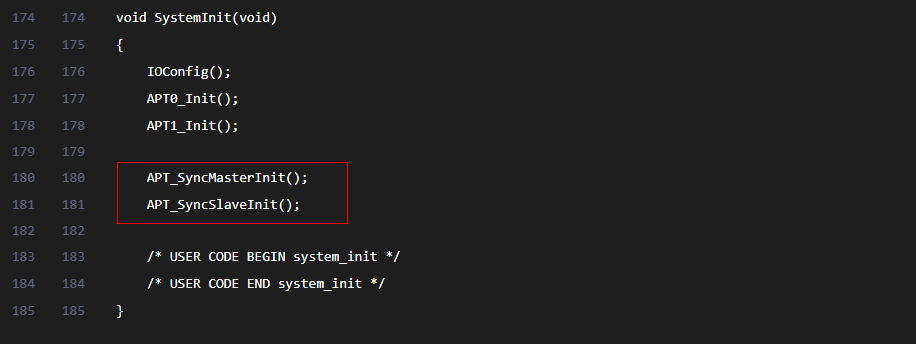

配置主从关系后，复用项与主APT配置相同，不允许用户修改，仅显示。不被复用项，允许用户修改，可与主APT配置项不同。

复用配置项包括[图5](#zh-cn_topic_0000001952069317_fig7608685464)、[图6](#zh-cn_topic_0000001952069317_fig1384510237468)和[图7](#zh-cn_topic_0000001952069317_fig20476193813234)。

**图 5**  复用配置项-1<a name="zh-cn_topic_0000001952069317_fig7608685464"></a>  
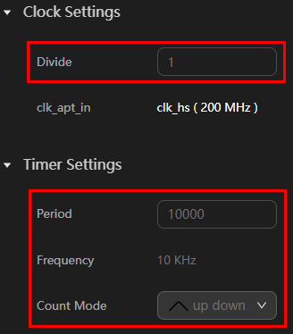

**图 6**  复用配置项-2<a name="zh-cn_topic_0000001952069317_fig1384510237468"></a>  
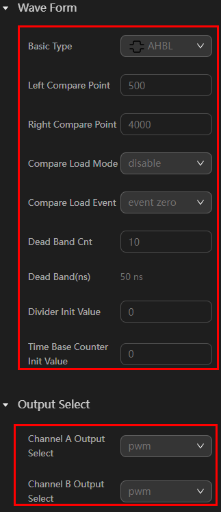

**图 7**  复用配置项-3<a name="zh-cn_topic_0000001952069317_fig20476193813234"></a>  
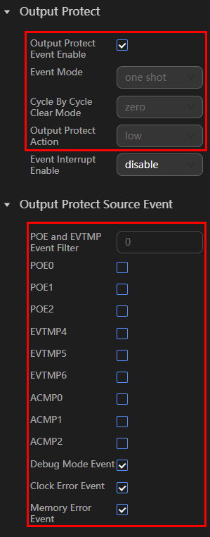

不被复用配置项包括[图8](#zh-cn_topic_0000001952069317_fig1526015262311)、[图9](#zh-cn_topic_0000001952069317_fig41721158162320)和[图10](#zh-cn_topic_0000001952069317_fig16244125814713)。

**图 8**  不被复用配置项-1<a name="zh-cn_topic_0000001952069317_fig1526015262311"></a>  
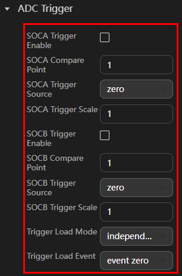

**图 9**  不被复用配置项-2<a name="zh-cn_topic_0000001952069317_fig41721158162320"></a>  
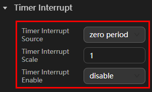

**图 10**  不被复用配置项-3<a name="zh-cn_topic_0000001952069317_fig16244125814713"></a>  
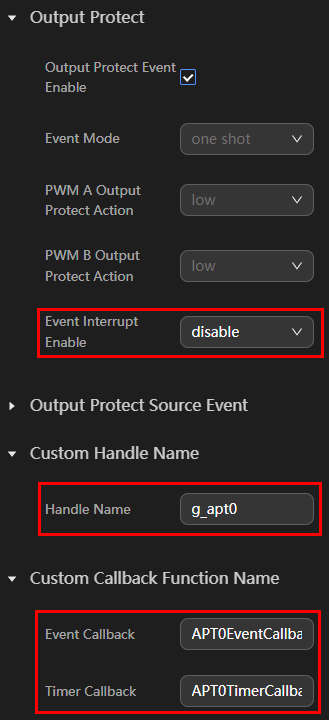

# 编译运行<a name="ZH-CN_TOPIC_0000002263530317"></a>


## 编译按钮介绍<a name="ZH-CN_TOPIC_0000002263570377"></a>

**图 1**  编译按钮<a name="zh-cn_topic_0000001882599897_fig1012285513416"></a>  


[图1](#zh-cn_topic_0000001882599897_fig1012285513416)按钮依次是：清除、编译、重编译和停止编译按钮。

-   ：单击触发工程清理，删除编译中间生成的文件。
-   ：单击触发工程编译。
-   ：单击触发先清理再编译。
-   ：单击触发停止编译。

## 编译结果<a name="ZH-CN_TOPIC_0000002228570804"></a>

单击按钮开始编译，编译成功后终端窗口输出如[图1](#zh-cn_topic_0000001835800814_fig9925105200)所示，且工程目录中生成output目录如[图2](#zh-cn_topic_0000001835800814_fig114873277206)所示。

**图 1**  编译成功<a name="zh-cn_topic_0000001835800814_fig9925105200"></a>  
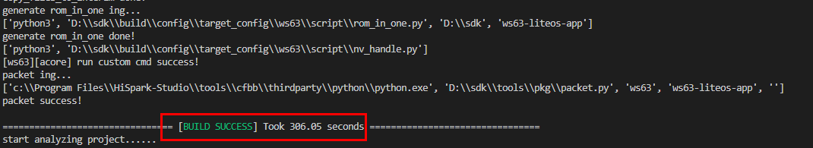

**图 2**  编译生成output目录<a name="zh-cn_topic_0000001835800814_fig114873277206"></a>  
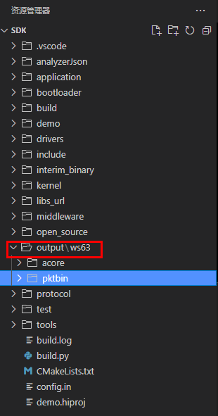

单击按钮开始清除编程生成的文件，成功后终端窗口输出如[图3](#zh-cn_topic_0000001835800814_fig1710335292011)所示。工程清理会清除工程目录下的output文件夹。

**图 3**  清除工程编译成功<a name="zh-cn_topic_0000001835800814_fig1710335292011"></a>  
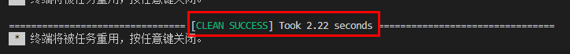

## 编译生成静态库<a name="ZH-CN_TOPIC_0000002228410996"></a>

适用场景：希望将工程中的部分原文件打包生成静态库文件。

1.  进入工程配置页面，到“是否生成静态库”的配置项。

    **图 1**  静态库配置<a name="zh-cn_topic_0000001952107497_fig18878132542220"></a>  
    

    使能是否生成静态库。如果不想生成静态库，可以通过这个选项再次关闭。

2.  输入希望生成的静态库名，例如输入“demo”，最后生成静态库时会添加“lib”头和“.a”尾，生成“libdemo.a”。

    **图 2**  输入静态库名字<a name="zh-cn_topic_0000001952107497_fig484053232210"></a>  
    

3.  从当前工程文件中选择静态库的源文件所在的文件夹或文件，支持多选，工具会自动筛选出.c文件，选择完毕后点击完成。

    **图 3**  选择要生成静态库的源文件<a name="zh-cn_topic_0000001952107497_fig296914348228"></a>  
    

4.  从当前工程文件中选择编译静态依赖所需的头文件路径。支持选择文件夹或者文件， 支持多选，工具会自动筛选出.h文件，选择完毕后点击完成。

    **图 4**  选择要生成静态库的头文件路径<a name="zh-cn_topic_0000001952107497_fig875163710220"></a>  
    

5.  点击编译“Rebuild”，编译成功之后在 “out\\libs”中生成静态库文件。

    **图 5**  静态库的生成路径<a name="zh-cn_topic_0000001952107497_fig2079334113225"></a>  
    

## 使用静态库参与编译<a name="ZH-CN_TOPIC_0000002263530321"></a>

适用场景1：使用工程中的静态库文件。

1.  将out\\libs路径下生成的自定义静态库对应的.a文件移至“thirdparty\\sysroot\\lib”路径下。

    > **说明：** 
    >注意不要在out\\libs目录下面放入.a ，否则会在clean的时候被清除。

2.  将静态库对应的.h文件移至“thirdparty\\sysroot\\include”路径下。
3.  在工程中包含对应的头文件，即可调用自定义静态库中的接口。

适用场景2：使用工程之外的静态库文件。

1.  在外部静态库路径处选择所引用的外部静态库.a文件的路径，在外部静态库依赖处选择对应静态库所依赖头文件的目录。

    **图 1**  外部静态库配置项<a name="zh-cn_topic_0000001951947709_fig57631244152214"></a>  
    

2.  选择完毕后点击编译Rebuild，并在工程中包含所引用的静态库所依赖的头文件即可。

## 对单个文件或文件夹设置编译选项<a name="ZH-CN_TOPIC_0000002263570381"></a>

1.  在资源管理器中对需要设置独立编译选项的c文件或文件夹右键点击，在右键菜单中点击“设置独立编译选项“。

    **图 1**  设置独立编译选项入口<a name="zh-cn_topic_0000001924828658_fig993494916201"></a>  
    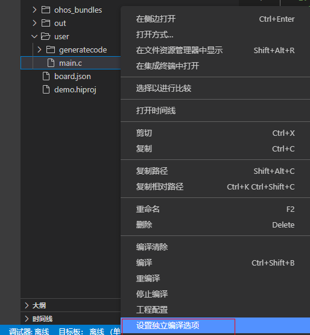

2.  在弹出的界面中进行设置。

    **图 2**  独立编译参数设置界面<a name="zh-cn_topic_0000001924828658_fig13469205382"></a>  
    
    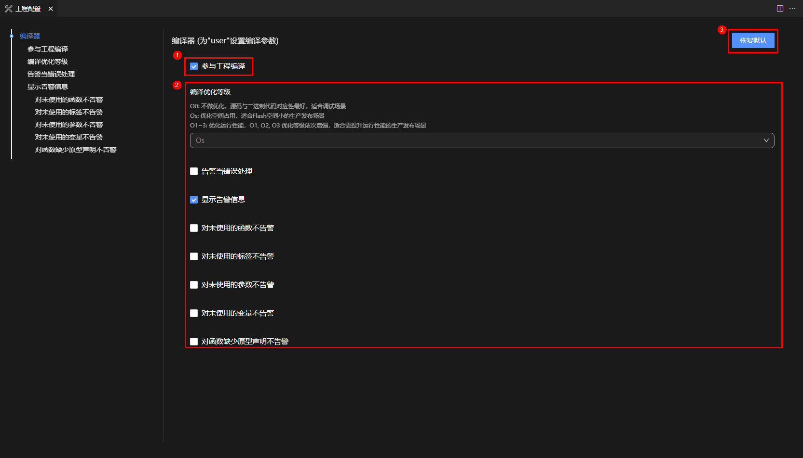

    ①：设置该文件或文件夹是否参与工程的编译。

    ②：编译选项设置。

    ③：恢复默认配置，默认配置来源于上一层文件夹的配置。

3.  在界面中设置好参数后点击编译或重编译按钮进行编译即可。

# 软件包烧录<a name="ZH-CN_TOPIC_0000002228570808"></a>

烧录功能只支持串口烧录。


## 连接烧录串口线<a name="ZH-CN_TOPIC_0000002228411000"></a>

软件镜像烧录，使用串口通信协议，需要将运行HiSpark Studio的电脑和目标板用串口线连接，常见的串口线有两种：一种是标准的串口线，一种是USB转串口线。如果使用USB转串口线，需提前安装USB转串口驱动。

**图 1**  烧录串口连接示意图<a name="zh-cn_topic_0000001882599869_fig8881486226"></a>  


## 配置工程的烧录选项<a name="ZH-CN_TOPIC_0000002263530325"></a>

1.  配置好硬件环境。

    开发板设置好拨码开关后，请用串口线连接好电脑和待烧录开发板。

2.  <a name="zh-cn_topic_0000001835960634_li207851059104511"></a>确定所连接的串口号。

    打开电脑的设备管理器，查看并记录串口线对应的串口号。

    **图 1**  串口选择<a name="zh-cn_topic_0000001835960634_fig55913473219"></a>  
    

    > **须知：** 
    >如果使用USB转串口方式烧录，请安装USB转串口的驱动程序。

3.  进入工程配置界面。

    打开要烧录的工程后，单击顶部的图标，进入工程配置界面。

    **图 2**  工程配置入口<a name="zh-cn_topic_0000001835960634_fig337113913219"></a>  
    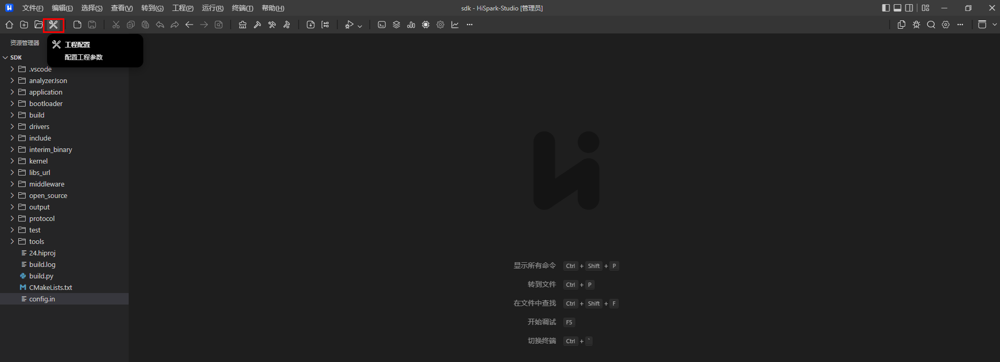

4.  单击“程序加载”中的“传输方式”，默认选择“serial”串口传输，“Bin 文件”中，会默认选择烧录的bin文件，按[步骤2](#zh-cn_topic_0000001835960634_li207851059104511)选择端口号，波特率默认115200。

    **图 3**  串口烧录配置<a name="zh-cn_topic_0000001835960634_fig99981772213"></a>  
    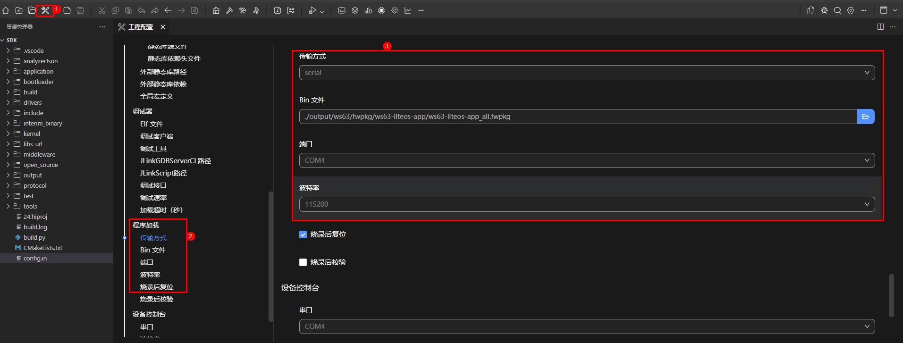

    > **须知：** 
    >MCU系列的工程“Bin文件”中为.bin文件，其他为.fwpkg文件。

5.  单击工具栏中的烧录按钮，开始执行烧写。

    **图 4**  烧录按钮入口<a name="zh-cn_topic_0000001835960634_fig1518855418224"></a>  
    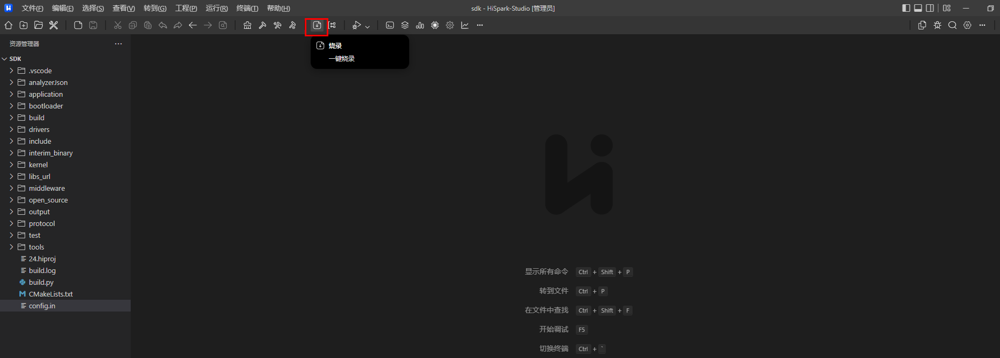

6.  按提示复位设备，烧录成功后终端窗口输出如[图5](#zh-cn_topic_0000001835960634_fig9672125742319)所示。

    **图 5**  烧录成功<a name="zh-cn_topic_0000001835960634_fig9672125742319"></a>  
    

## 分bin烧录<a name="ZH-CN_TOPIC_0000002263570385"></a>

本章节主要介绍只烧录单个bin文件的方法。使用此功能前如果编译成功则直接从本章节[步骤1](zh-cn_topic_0000001882480089.md#li4441933121217)开始，如果未编译，请参见“[编译结果](编译结果.md#ZH-CN_TOPIC_0000002228570804)”章节进行编译，然后再根据本章节步骤进行操作。

> **须知：** 
>分bin烧录功能仅支持CFBB系列工程。

1.  单击工具栏中的"分bin烧录"图标，进入分bin烧录界面。

    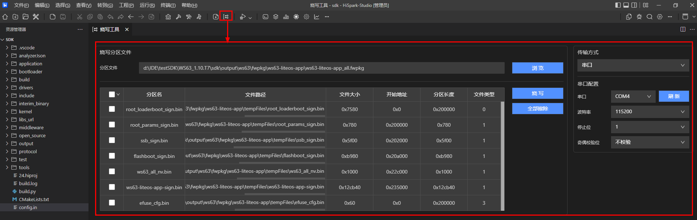

2.  分区文件默认为打包好的fwpkg文件或者点击“浏览”按钮从本地文件中选择打包好的fwpkg文件。选择完成后，烧录工具会自动的将fwpkg文件中包含的bin内容列出。

    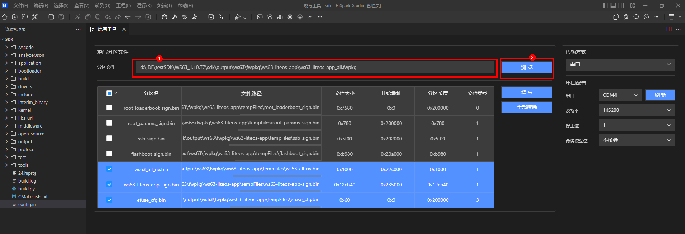

3.  勾选需要烧录的bin文件。需要注意的是，如果此次烧录只是烧录一个bin文件或几个（并不是全部都烧录），那么需要保证开发板为非空板。如是空板，那么需要先执行一次全bin烧录，再进行分bin烧录。

    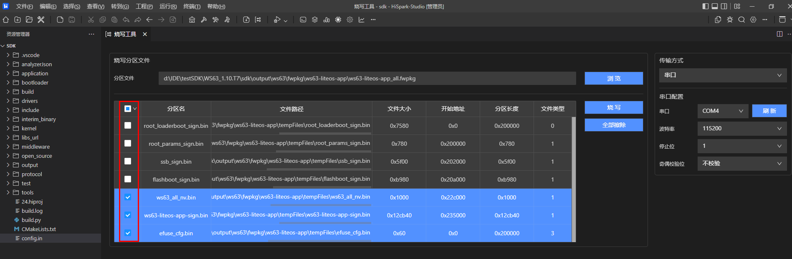

    **图 1**  空板烧录失败<a name="zh-cn_topic_0000001882480089_fig94901018122419"></a>  
    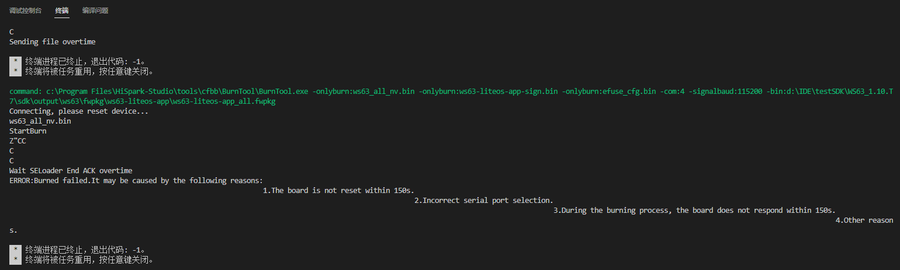

4.  配置串口信息，设置烧录串口和波特率。

    

5.  单击烧写按钮，根据提示重启开发版，即可开始烧录。

    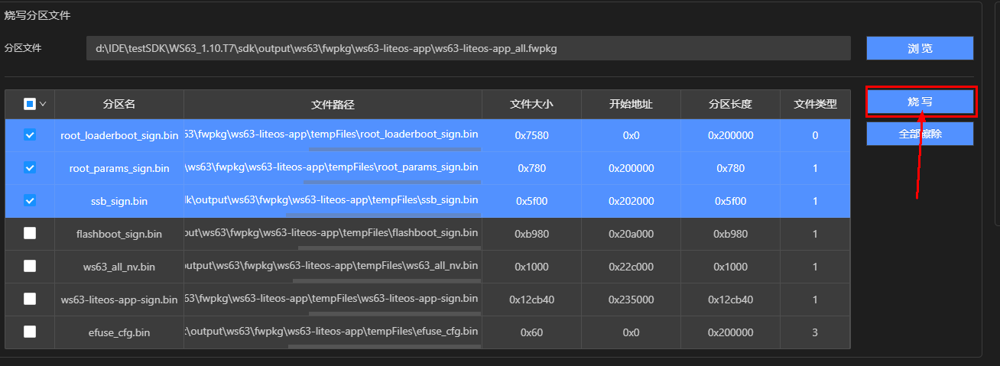

6.  开始烧写后，在分区文件下方会显示出烧录进度条，方便查看烧录进度。在输出区出现“All images burn successfully”字样为烧录成功。

    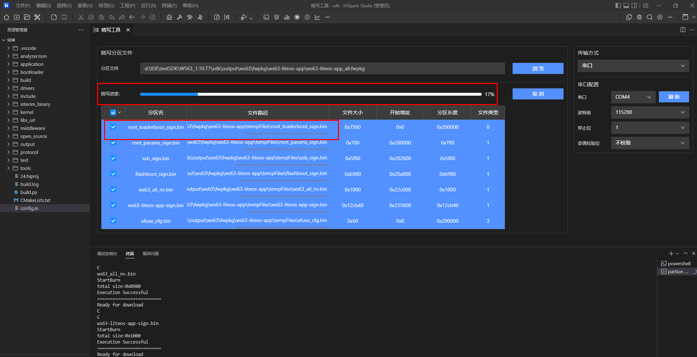

    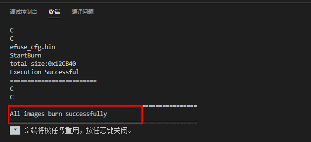

## jtag与swd烧录（仅支持MCU系列芯片）<a name="ZH-CN_TOPIC_0000002228570812"></a>


### 连接烧录设备<a name="ZH-CN_TOPIC_0000002228411004"></a>

连接好调试器与开发板，目前支持的调试器有两种：HiSpark-Trace和HiSpark-Link。

> **说明：** 
>四合一调试器有多个连接口，连接错误会导致烧录失败，注意检查

### 配置工程的烧录选项<a name="ZH-CN_TOPIC_0000002263530329"></a>

1.  进入工程配置界面。

    打开要烧录的工程后，单击顶部的图标，进入工程配置界面-\>进入程序加载。选择传输方式为“swd”或者“jtag”并配置其他参数。

2.  进行烧录器配置设置。

    **图 1**  烧录选项配置<a name="zh-cn_topic_0000001952303529_fig5248172011433"></a>  
    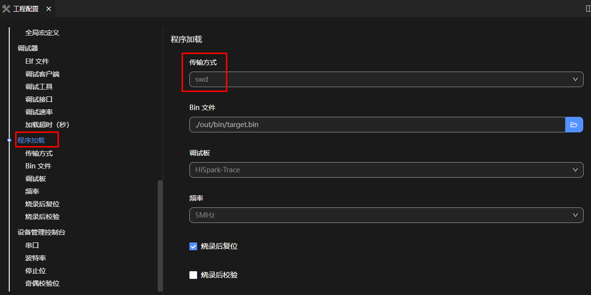

3.  单击“烧录”按钮，开始烧录。
4.  烧录成功后终端窗口输出如[图2](#zh-cn_topic_0000001952303529_fig1467542411386)所示。

    **图 2**  烧录成功<a name="zh-cn_topic_0000001952303529_fig1467542411386"></a>  
    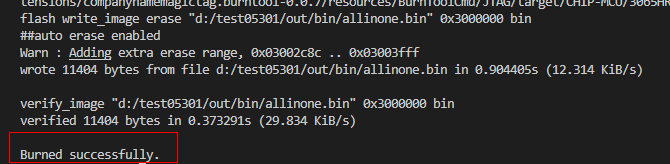

# 栈分析和镜像分析<a name="ZH-CN_TOPIC_0000002263570389"></a>

HiSpark Studio集成了Stack Analysis栈分析工具和Image Analysis镜像分析工具，用于开发过程中的内存不足、内存溢出等问题进行分析，帮助开发者更加精准的分析定位问题。

-   Stack Analysis栈分析工具是基于静态二进制分析手段，提供任务栈开销估算值和函数调用关系图示，为栈内存使用、分析、优化、问题定位等开发场景提供较为准确的静态内存分析数据参考。
-   Image Analysis镜像分析工具对工程构建出的elf文件进行内存占用分析，支持开发者快速评估内存段、符号表使用情况。


## 栈分析<a name="ZH-CN_TOPIC_0000002228570816"></a>

**功能介绍<a name="zh-cn_topic_0000001882599865_section148321529151417"></a>**

栈分析工具基于静态二进制分析手段，提供任务栈开销估算值和函数调用关系图示，为栈内存使用、分析、优化和问题定位等开发场景提供较为准确的静态内存分析数据参考。

**功能入口<a name="zh-cn_topic_0000001882599865_section17325123961615"></a>**

创建工程并成功编译后，单击工具栏中进行栈分析。

**栈分析功能页面<a name="zh-cn_topic_0000001882599865_section125419179175"></a>**

栈分析结果按照函数列表和调用关系进行展示。如[图1](#zh-cn_topic_0000001882599865_fig4596122219257)所示，功能列表页面展示每个函数的名称、内部栈开销和位置信息，其中内部栈开销单位为Byte，支持关键字搜索和排序功能。

**图 1**  功能列表页面<a name="zh-cn_topic_0000001882599865_fig4596122219257"></a>  
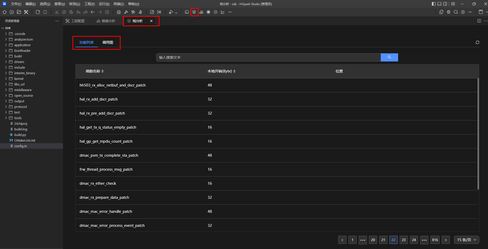

调用关系界面如[图2](#zh-cn_topic_0000001882599865_fig1384164712519)所示，显示每个函数的调用关系，包括函数名称、调用深度、函数最大栈开销和内部栈开销，支持关键字搜索和排序功能。

**图 2**  调用图页面<a name="zh-cn_topic_0000001882599865_fig1384164712519"></a>  
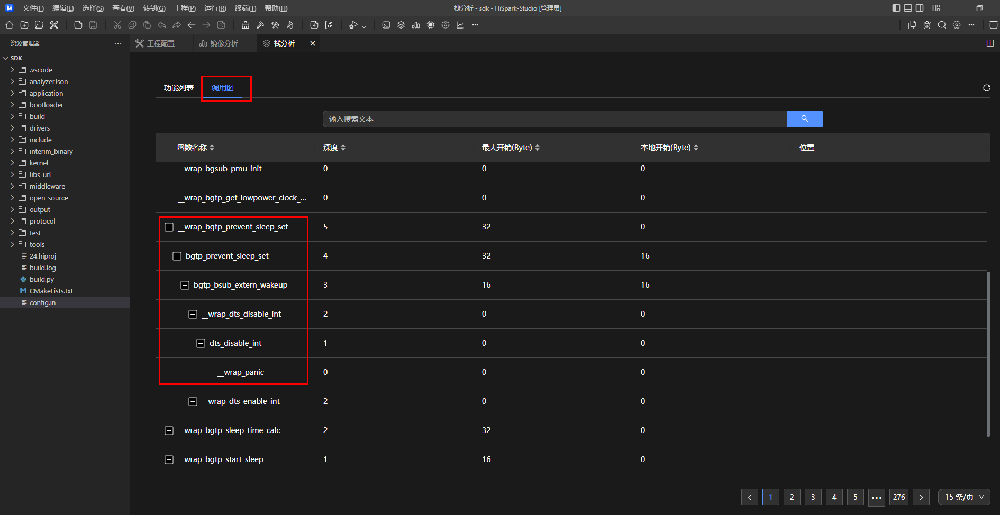

**统计项说明<a name="zh-cn_topic_0000001882599865_section618mcpsimp"></a>**

-   最大开销：为当前函数所有子函数中最大的栈开销与循环调用的次数的乘积再加上自身的开销。

    计算公式： max（子函数1的自身栈开销， 子函数2的自身栈开销，子函数3的自身栈开销，…） × 循环次数＋函数的自身栈开销

-   本地开销：当前函数的自身栈开销。
-   深度：当前函数每增加一层子函数，深度增加1层。

## 镜像分析<a name="ZH-CN_TOPIC_0000002228411008"></a>

**功能介绍<a name="zh-cn_topic_0000001835800826_section538803119292"></a>**

镜像分析工具通过分析elf文件，图形化展示RAM和ROM的使用情况。对于资源有限的微控制单元\(MCU\)，可以及早发现镜像超出MCU资源限制。对于资源相对宽裕的MCU，方便合理规划镜像大小，提升产品性能。

**功能入口<a name="zh-cn_topic_0000001835800826_section1582295611297"></a>**

创建工程并成功编译后，单击工具栏中的。

**功能界面<a name="zh-cn_topic_0000001835800826_section1533673619307"></a>**

内存区域页面（如[图1](#zh-cn_topic_0000001835800826_fig1787391122717)所示）评估分析工程对内存的细分使用情况。例如WS63，显示的内存区域region包含RAM、SRAM、ITCM等，展示的信息包含每个内存区域的名称、起始内存地址、结束内存地址、总大小、空闲大小、已用大小以及使用比例，支持关键字搜索和排序功能，如[图1](#zh-cn_topic_0000001835800826_fig1787391122717)所示。

**图 1**  内存区域页面<a name="zh-cn_topic_0000001835800826_fig1787391122717"></a>  
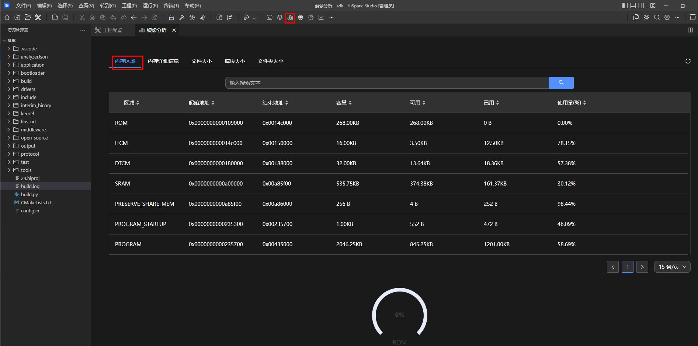

内存详细信息页面（如[图2](#zh-cn_topic_0000001835800826_fig15591937172713)所示）展示每个内存区域包含的内存段section和内存段包含的symbol的详细信息。比如FLASH下面包含.text、.entry、.data等内存段，内存段又包含分配在该段的程序符号，支持关键字搜索和排序功能。

每一行展示的信息包含运行地址VMA（Virtual Memory Address，表示程序装载的内存地址）、装载地址LMA（Load Memory Address，表示程序运行时的内存地址）、内存段/符号的大小。

**图 2**  内存详细信息页面<a name="zh-cn_topic_0000001835800826_fig15591937172713"></a>  


文件大小页面（如[图3](#zh-cn_topic_0000001835800826_fig9261641289)所示）展示每个链接进来的.o文件占用了哪块内存的空间以及占用空间的大小，支持关键字搜索和排序功能。

**图 3**  文件大小页面<a name="zh-cn_topic_0000001835800826_fig9261641289"></a>  


模块大小页面（如[图4](#zh-cn_topic_0000001835800826_fig1367222122813)所示）展示了模块和组件的层级关系以及不同模块的内存占用，支持关键字搜索和排序功能。

**图 4**  模块大小页面<a name="zh-cn_topic_0000001835800826_fig1367222122813"></a>  


文件夹大小页面（如[图5](#zh-cn_topic_0000001835800826_fig1075993892817)所示）展示了不同文件夹下面模块的内存占用，支持关键字搜索和排序功能，支持导出excel。

**图 5**  文件夹大小<a name="zh-cn_topic_0000001835800826_fig1075993892817"></a>  


# 工程调试<a name="ZH-CN_TOPIC_0000002263530333"></a>


## 调试配置选项<a name="ZH-CN_TOPIC_0000002263570393"></a>

> **说明：** 
>使用调试功能时, 编译elf需要使用O0编译选项，并且需要明确工程中可供用户调试的文件路径。

1.  选择要调试的工程：在IDE主界面中，选择要调试的工程，打开“工程配置”。
2.  修改调试选项，选择对应的调试器。详细见[第四章4.3调试器配置](调试器配置.md#ZH-CN_TOPIC_0000002263530289)。

    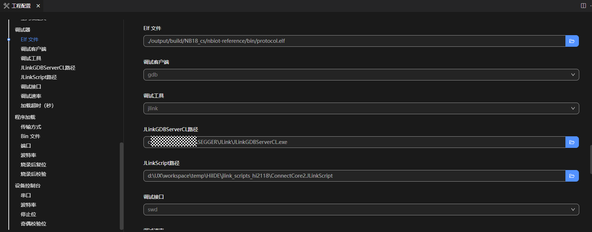

## 启动调试<a name="ZH-CN_TOPIC_0000002228570820"></a>

1.  单击IDE工具栏启动调试按钮右侧的下拉箭头选择需要的调试模式。
    -   GDB Launch（Acore）：A核重启，暂停CPU，设置PC指针从头开始运行程序（A核开头设置了一个虚拟断点）。
    -   GDB Attach（Acore）：A核正在运行中，暂停CPU，程序直接停在CPU Halt处。
    -   GDB Launch（Pcore）：P核重启，暂停CPU，设置PC指针从头开始运行程序（P核开头设置了一个虚拟断点）。
    -   GDB Attach（Pcore）：P核正在运行中，暂停CPU，程序直接停在CPU Halt处。

2.  单击启动调试按钮。
3.  启动调试成功。调试成功示例如下图，若出现下面提示信息与工具栏调试图标，则说明已经进入调试。

    

    

    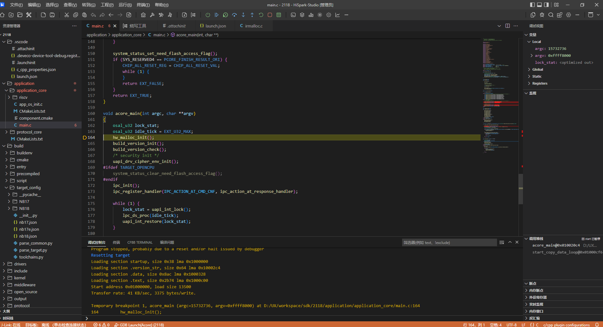

## 常用调试功能<a name="ZH-CN_TOPIC_0000002228411016"></a>


### 调试页面<a name="ZH-CN_TOPIC_0000002263530357"></a>

调试工作界面如下图所示，主要由以下3个部分组成：

-   ① 调试侧边栏
-   ② 调试功能区
-   ③ 调试控制台

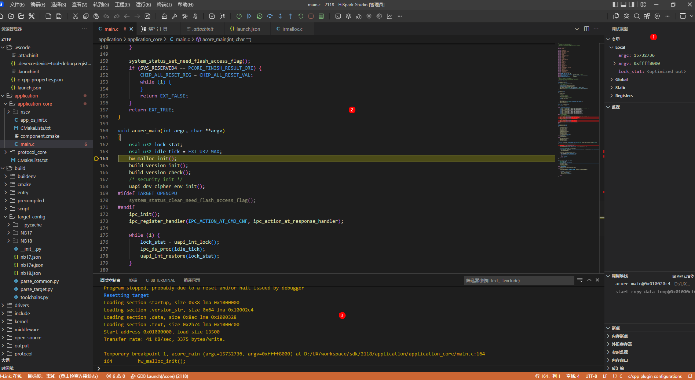


#### 调试侧边栏<a name="ZH-CN_TOPIC_0000002263570425"></a>

调试侧边栏集合了调试常用功能，包括变量、监视、调用堆栈、断点、查看外设寄存器、查看内存地址数据、查看反汇编。

#### 调试功能区<a name="ZH-CN_TOPIC_0000002228570856"></a>

启动调试功能后，当代码执行到设置的断点时，程序会暂停，可以根据调试功能区的按钮进行代码的调试。


-   ：重启设备。
-   ：继续运行（“F5”），当程序执行到断点时停止执行，点击此按钮程序继续执行。
-   ：切换实时模式，禁用断点功能。
-   ：单步跳过（“F10”），在单步调试时，直接前进到下一行（如果在函数中存在子函数时，不会进入子函数内单步执行，而是将整个子函数当作一步执行）。
-   ：单步执行（“F11”），在单步调试时，遇到子函数后，进入子函数并继续单步执行。
-   ：单步跳出（“Shift+F11”），在单步调试执行到子函数内时，点击单步跳出会执行完子函数剩余部分，并跳出返回到上一层函数。
-   ：重启调试（“Ctrl+Shift+F5”），重新启动调试。
-   ：停止调试（“Shift+F5”），停止调试任务，断开连接。
-   ：内存窗口，查看对应内存地址的值。

#### 调试控制台<a name="ZH-CN_TOPIC_0000002228411048"></a>

调试控制台用来输出调试时的打印信息，也可以输入命令与调试器交互。

-   变量查看

    当运行到断点处暂停时，可以在变量界面查看变量值的变化。

    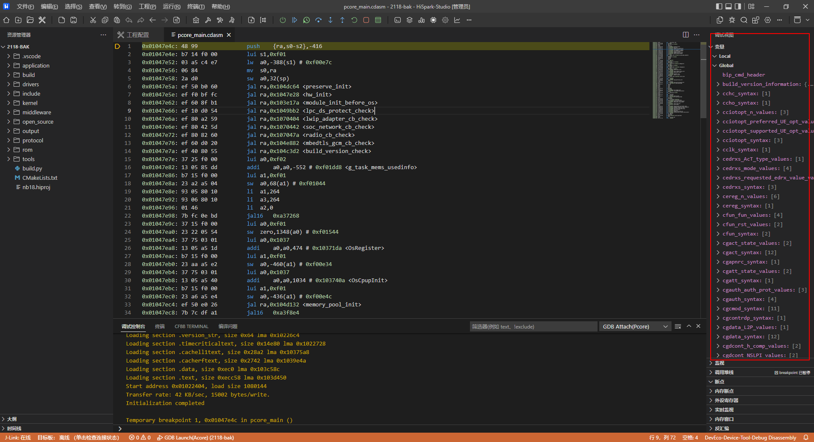

    支持如下4种变量类型：

    -   局部变量
    -   全局变量（可能会被编译器优化，可以使用关键字volatile来规避这个问题 。）
    -   静态变量（可能会被编译器优化，可以使用关键字volatile来规避这个问题。 ）
    -   寄存器

-   监视功能

    在调试过程中，可以通过“监视”查看变量（包括局部变量、全局变量以及静态变量）和特定地址的取值来判断程序的计算结果是否有误，从而快速进行代码检查。

    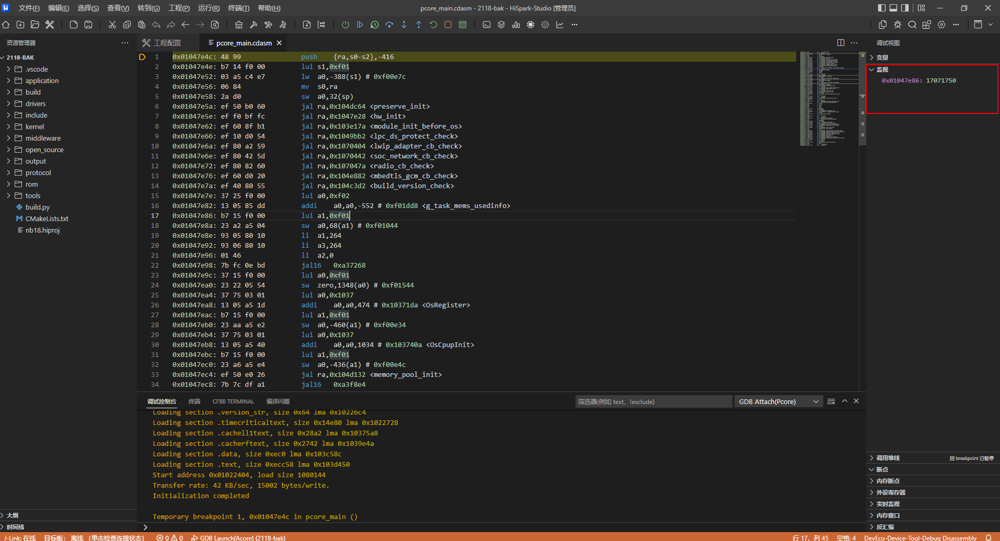

-   查看调用栈

    在调试过程中，可以通过查看调用栈来分析主程序调用的各子程序的调用关系，从而快速进行代码检查，如下图所示。

    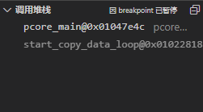

-   管理函数断点

    插入函数断点的方式有多种方法：

    -   用侧边栏的“断点”功能手动添加断点函数，点击左侧断点一栏右上角的＋号，在文本框中输入需要断点的函数。
    -   用鼠标点击代码编辑区代码行最左侧的位置，位置参考图片中红色圆点位置，点击后出现红色圆点表示添加断点成功。
    -   使用快捷键“F9”添加、删除断点。
    -   在断点菜单下使能、去使能、添加和删除断点。

    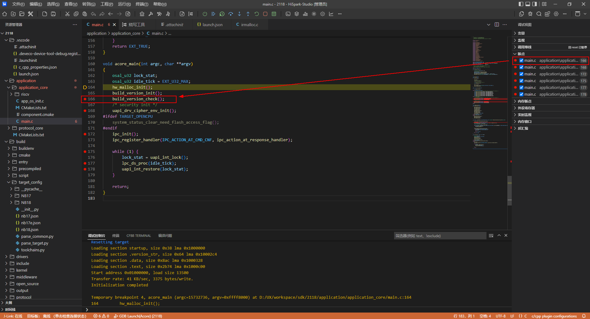

-   查看反汇编

    在调试过程中，通过查看反汇编，可以确认代码的汇编实现，从而快速进行代码检查。通过鼠标在代码界面中点击右键，选中“打开反汇编视图”功能就可以进入代码的汇编视图，如下图所示。

    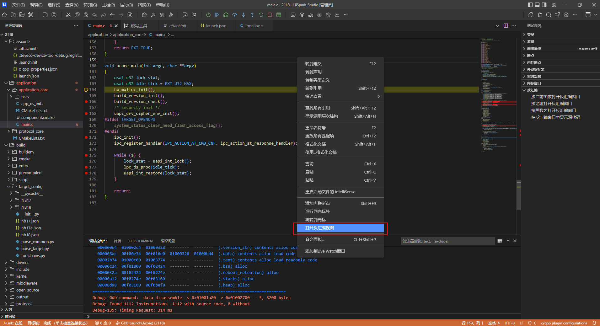

    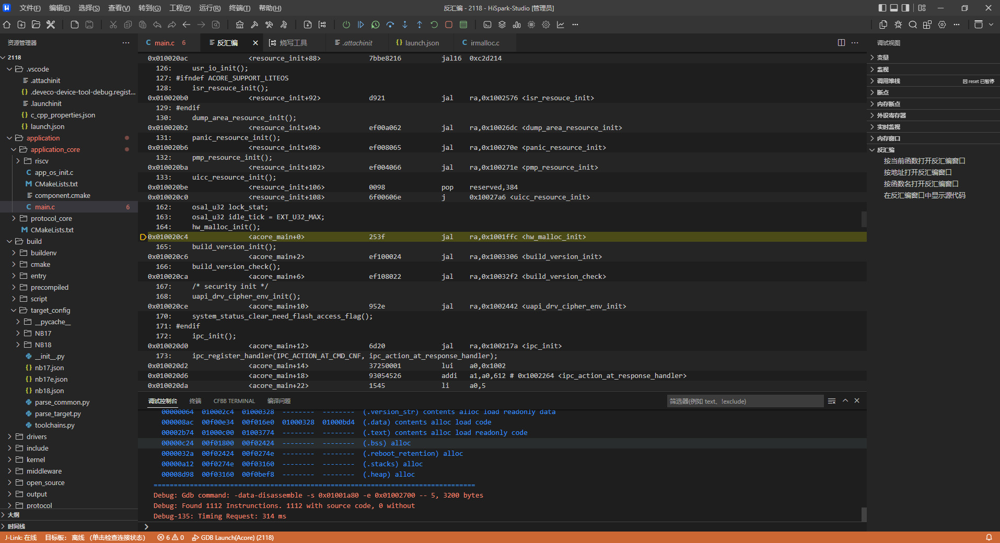

    **----结束**

## 变量跟踪功能<a name="ZH-CN_TOPIC_0000002263530377"></a>

点击工具栏中的变量跟踪图标，如[图 变量跟踪功能入口](#zh-cn_topic_0000001890690262_fig15668133389)可以打开VariableTrace工具，用于实时分析和可视化微控制器单板程序数据。在目标板程序运行过程中，变量监控器可对程序的全局和静态变量的数值进行实时读取和修改，可视化的变量变化趋势，提高程序开发调试效率。详情请见《VariableTrace 使用指南》。

**图 1**  变量跟踪功能入口<a name="zh-cn_topic_0000001890690262_fig15668133389"></a>  
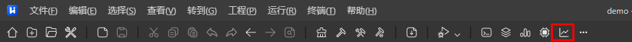

> **说明：** 
>变量跟踪功能仅支持MCU系列工程。

## 常用调试命令<a name="ZH-CN_TOPIC_0000002263570437"></a>

调试命令在工程启动调试后，在调试控制台（debug console）中输入：

-   info files ：查看elf文件内容信息。

    **图 1**  info files<a name="zh-cn_topic_0000001952310157_fig2084564805013"></a>  
    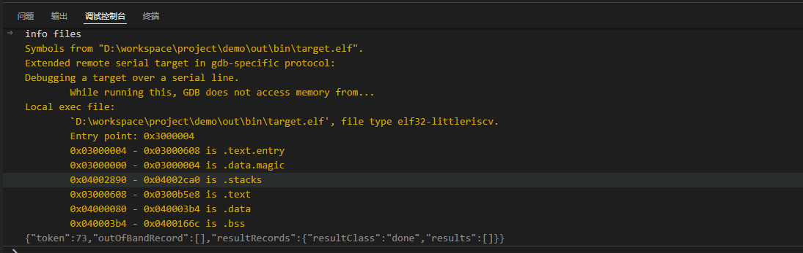

-   断点操作：

    info b：查看断点信息。

    b main：设置停在main函数的断点。

    delete breakpoints：删除所有断点。

    delete breakpoints id：删除编号为id的断点。

    disable/enable breakpoints id：禁用/启用断点。

    **图 2**  断点操作<a name="zh-cn_topic_0000001952310157_fig85961910528"></a>  
    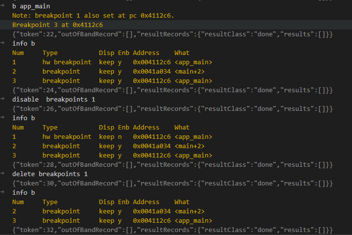

-   continue ：继续执行到下一个断点，可简写为cont/c。
-   list ：查看代码。
-   next ：单步调试。
-   bt：列出调用栈。

    **图 3**  bt指令执行结果<a name="zh-cn_topic_0000001952310157_fig34393612533"></a>  
    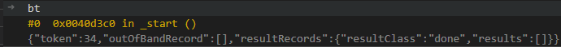

-   monitor  mdw   \[addr\] ：读内存（mdw/mdd/mdh/mdb 都是读命令，长度分别为 ：两字节（8位）/字节（4位）/半字节（2位）/bit（1位））。

    **图 4**  读内存<a name="zh-cn_topic_0000001952310157_fig19982125545311"></a>  
    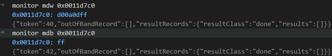

-   monitor mww \[addr value\]  ：写内存（mww/mwd/mwh/mwb都是写命令，长度分别为 ：两字节（8位）/字节（4位）/半字节（2位）/bit（1位））。

    **图 5**  写内存<a name="zh-cn_topic_0000001952310157_fig18584134616541"></a>  
    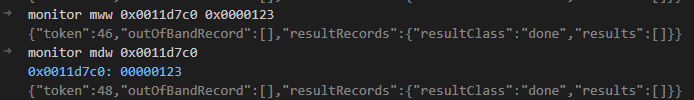

-   p var\_：打印变量值。

    **图 6**  打印变量值<a name="zh-cn_topic_0000001952310157_fig1667052712559"></a>  
    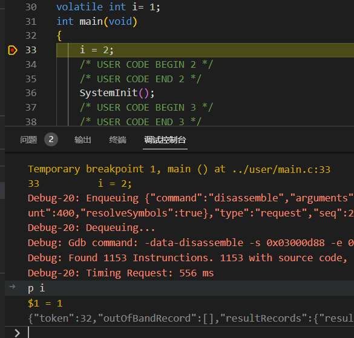

## 实时监视（Live Watch） 调试功能（仅支持MCU系列芯片）<a name="ZH-CN_TOPIC_0000002228570860"></a>


### 功能介绍<a name="ZH-CN_TOPIC_0000002228411052"></a>

> **须知：** 
>-   使用HiSpark-Trace调试器。
>-   静态或全局变量。

-   支持监控静态变量或全局变量，变量数据类型支持char、unsigned char、short、unsigned short、int、unsigned int、long、unsigned long、float、 double、longlong、unsigned long long、bool、枚举、结构体、联合体、指针、数组、位域等类型。
-   支持动态刷新变量的数值，刷新频率可配置（Off、1Hz、2Hz或5Hz），以红色字体标识数值的变化。
-   支持实时修改变量的数值。
-   支持设置数值的默认显示进制，包含二进制、八进制、十进制、十六进制。
-   支持对变量进行单独设置数值的显示进制，包含二进制、八进制、十进制、十六进制。
-   支持变量列表的导入/导出。

### 实时监视（Live Watch） UI 界面<a name="ZH-CN_TOPIC_0000002263530381"></a>

实时监视主界面如[图1](#zh-cn_topic_0000001925048680_fig982174112428)所示，包含调试命令按钮条、加载变量列表按钮、变量列表区和新增监控变量输入框。

**图 1**  实时监视 UI 界面<a name="zh-cn_topic_0000001925048680_fig982174112428"></a>  
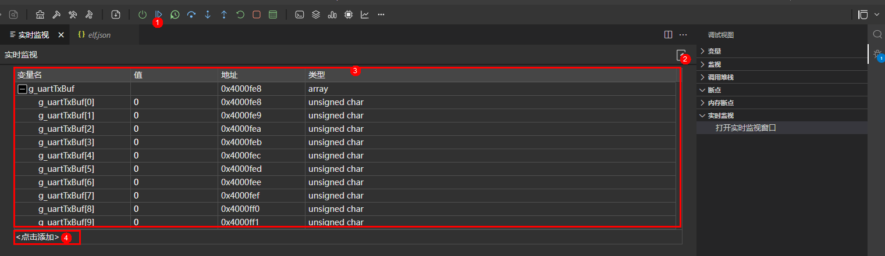

①：调试命令按钮条。

②：加载变量列表按钮。

③：监控变量列表区。

④：新增监控变量输入框。

**调试命令按钮条<a name="zh-cn_topic_0000001925048680_section1436293073111"></a>**

调试命令按钮可控制目标板程序的启动/停止、复位。

**监控变量列表区<a name="zh-cn_topic_0000001925048680_section2029714910324"></a>**

变量表的每一列显示每个变量的相关数据，包括变量名、值、地址和类型：

-   变量名：变量名，双击该格可实现输入并更改变量名（输入值后，回车确认）。
-   值：变量的值，双击该格可实现输入并更改变量的值（输入值后，回车确认）。
-   地址：变量的十六进制地址。
-   类型：变量的数据类型。

**右键菜单<a name="zh-cn_topic_0000001925048680_section16242174554218"></a>**

在变量区单击右键，可以触发右键菜单，如[图2](#zh-cn_topic_0000001925048680_fig02711151916)所示。

**图 2**  右键菜单<a name="zh-cn_topic_0000001925048680_fig02711151916"></a>  
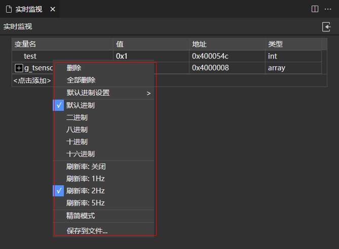

-   删除 ：删除所选单个变量。
-   全部删除： 删除全部监控的变量。
-   默认进制设置：默认进制设置（默认设置为十进制）。
-   默认进制：以默认进制显示。
-   二进制：以二进制显示。
-   八进制：以八进制显示。
-   十进制：以十进制显示（默认）。
-   十六进制：以十六进制显示。
-   刷新率：刷新率设置（默认为2Hz）。
-   精简模式：精简模式（启用后变量列表区不显示地址和类型列）。
-   保存到文件：文件另存为（变量列表文件）。

### 实时监视（Live Watch）的使用<a name="ZH-CN_TOPIC_0000002263570441"></a>

启动调试功能后，通过单击“实时监视-\>打开实时监视窗口”启动实时监视。当出现实时监视界面时，表示启动成功。如[图1](#zh-cn_topic_0000001924889328_fig1697856134313)所示。

**图 1**  实时监视 启动步骤<a name="zh-cn_topic_0000001924889328_fig1697856134313"></a>  
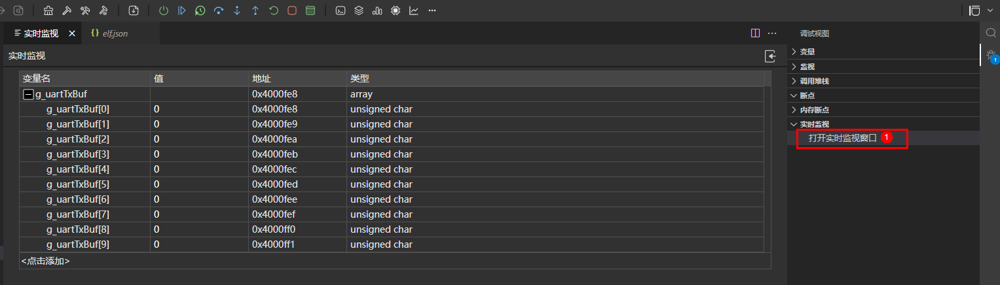

**输入框添加变量<a name="zh-cn_topic_0000001924889328_section123931806438"></a>**

在实时监视界面中，单击“点击添加”，输入变量名添加变量，如[图2](#zh-cn_topic_0000001924889328_fig151675501500)所示。

**图 2**  变量监视列表<a name="zh-cn_topic_0000001924889328_fig151675501500"></a>  
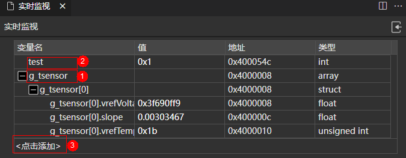

①：添加父节点时，只输入父节点名（例如structTest），子节点也会出现。

②：添加嵌套子节点时，通过“父节点.子节点” 的形式添加（例如unionNumt.strNum）。

③：添加单个变量时（例如intNum）。

**右键菜单添加变量Add to Live Watch<a name="zh-cn_topic_0000001924889328_section17733102017283"></a>**

支持在代码源文件编辑区界面中，鼠标右键菜单添加变量“添加到 Live Watch窗口”，如[图3](#zh-cn_topic_0000001924889328_fig8956174715355)所示。

**图 3**  右键菜单添加到 Live Watch窗口<a name="zh-cn_topic_0000001924889328_fig8956174715355"></a>  
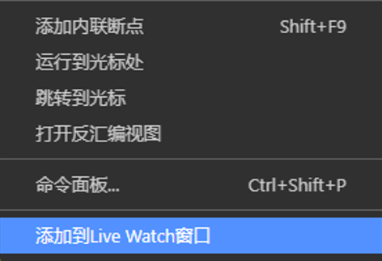

①：当光标有框选内容时，添加框选中内容作为变量名添加到变量列表区。

②：当光标没有框选内容，直接单击鼠标右键添加，会就近自动识别变量名，添加到变量列表区。

**查看变量数值<a name="zh-cn_topic_0000001924889328_section990113159434"></a>**

实时监视界面会在“值”列显示变量的数值。

**图 4**  启动程序以查看变量数值<a name="zh-cn_topic_0000001924889328_fig391433816451"></a>  
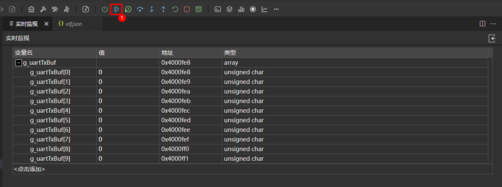

当目标板程序运行后，变量的数据在“值”列显示（如[图5](#zh-cn_topic_0000001924889328_fig1325120191713)所示），并以红色字体方式标识数值发生了变化，如[图6](#zh-cn_topic_0000001924889328_fig326675631711)所示。

**图 5**  程序已运行并在“值”列显示变量数值<a name="zh-cn_topic_0000001924889328_fig1325120191713"></a>  
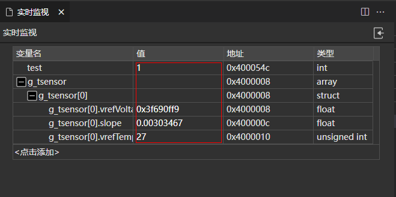

**图 6**  变量数值发生变化时会变成红色字体<a name="zh-cn_topic_0000001924889328_fig326675631711"></a>  
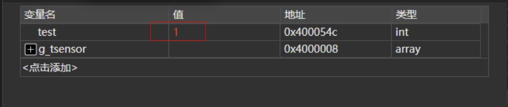

**修改变量数值<a name="zh-cn_topic_0000001924889328_section136042316432"></a>**

在Live Watch界面单击value列，修改变量的数值。当输入非法值，会有错误提示，按下回车键会维持旧值。

**图 7**  修改变量数值<a name="zh-cn_topic_0000001924889328_fig1333593916710"></a>  
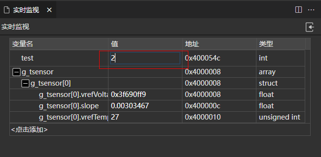

**设置默认显示进制<a name="zh-cn_topic_0000001924889328_section201314192715"></a>**

默认显示进制默认为十进制，在右键菜单默认进制设置中的二级菜单（如[图8](#zh-cn_topic_0000001924889328_fig7522118113412)中的①），选择一个进制（如[图8](#zh-cn_topic_0000001924889328_fig7522118113412)中的②），所有未设置过单独进制的变量值会切换成设置默认进制进行显示。

**图 8**  设置默认显示进制<a name="zh-cn_topic_0000001924889328_fig7522118113412"></a>  
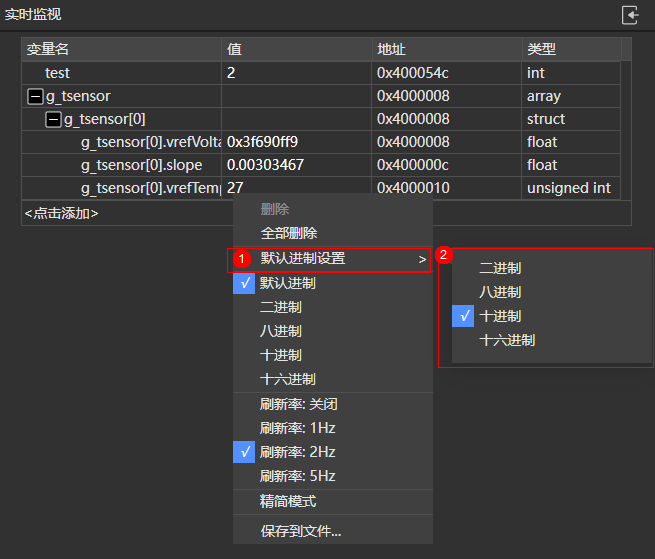

**单独设置变量的显示进制<a name="zh-cn_topic_0000001924889328_section65877484275"></a>**

右键单击一个变量，在弹出的右键菜单中，选择一个进制（如[图9](#zh-cn_topic_0000001924889328_fig67695315336)中的②，单击二进制），[图9](#zh-cn_topic_0000001924889328_fig67695315336)中①的value值位置会切换成设置的进制进行显示。

**图 9**  单独设置变量的显示进制<a name="zh-cn_topic_0000001924889328_fig67695315336"></a>  
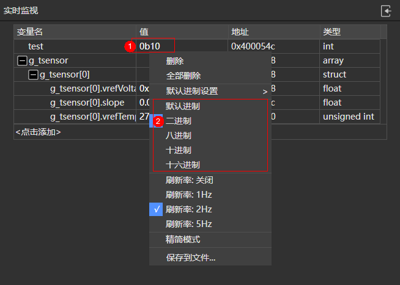

**变量列表的导出（右键）<a name="zh-cn_topic_0000001924889328_section10604134710436"></a>**

在变量列表区单击右键菜单，导出变量列表，如[图10](#zh-cn_topic_0000001924889328_fig12874632182018)和[图11](#zh-cn_topic_0000001924889328_fig4411016162212)所示。导出的文件内容包含变量名及其对应的单独进制显示设置。

**图 10**  通过在右键菜单导出变量列表<a name="zh-cn_topic_0000001924889328_fig12874632182018"></a>  
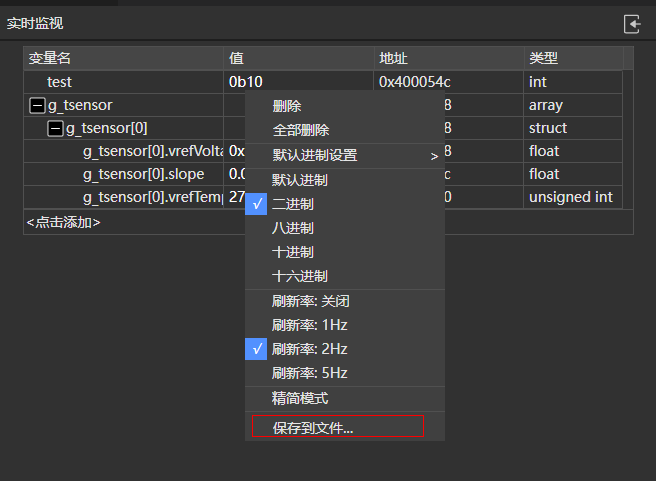

**图 11**  保存为csv文件<a name="zh-cn_topic_0000001924889328_fig4411016162212"></a>  
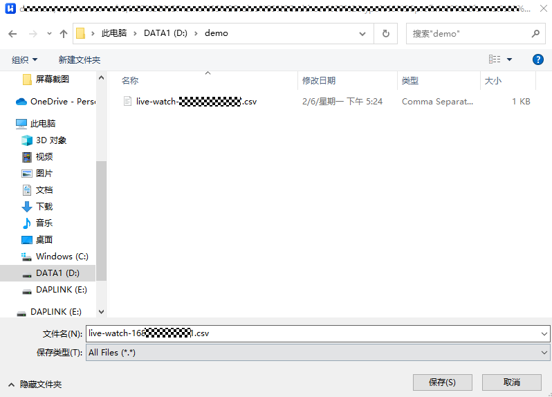

**变量列表的加载<a name="zh-cn_topic_0000001924889328_section9364131416441"></a>**

单击右上角加载图标（Load From File）。

**图 12**  单击加载图标<a name="zh-cn_topic_0000001924889328_fig173101057165719"></a>  
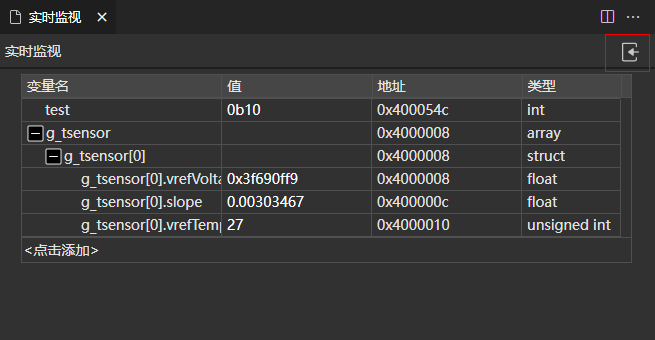

选择要导入的列表文件后，选择打开即可。导入的内容会包含之前导出的变量及其对应的单独进制显示设置。

**图 13**  选择导入csv列表文件<a name="zh-cn_topic_0000001924889328_fig1750116574213"></a>  
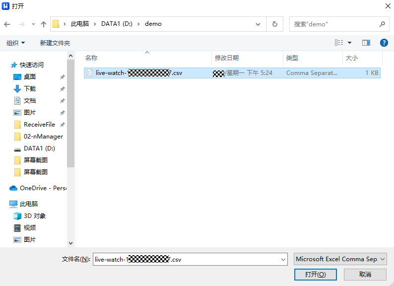

## 实时模式（仅支持MCU系列芯片）<a name="ZH-CN_TOPIC_0000002228570864"></a>

**图 1**  开启实时模式图标位置<a name="zh-cn_topic_0000001924871384_fig9349527181718"></a>  


**图 2**  关闭实时模式图标位置<a name="zh-cn_topic_0000001924871384_fig1590083912179"></a>  


启动调试之后会出现打开实时模式图标，点击打开实时模式图标则会切换为关闭实时模式图标。调试在实时模式下，无法添加断点，且调试的暂停运行功能失效。

> **说明：** 
>打开实时模式前需先清除所有已添加的断点

# 串口控制台工具<a name="ZH-CN_TOPIC_0000002228411056"></a>

本章节主要讲解HiSpark Studio中关于串口操作的工具监视器（Monitor）。主要功能包括：显示串口列表、连接串口、断开串口连接、接收串口消息、给串口发送消息、清空串口输出区、开启\\关闭屏幕自动滚动等。

> **说明：** 
>串口工具以“\\r\\n“作为每行的分隔符，所以要求被打印的每行字符串都要以“\\r\\n“结尾，否则可能会出现程序结尾打印丢失的情况。


## 打开监视器<a name="ZH-CN_TOPIC_0000002263530385"></a>

打开HiSpark Studio终端，找到终端区域、切换到“监视器”选项卡。

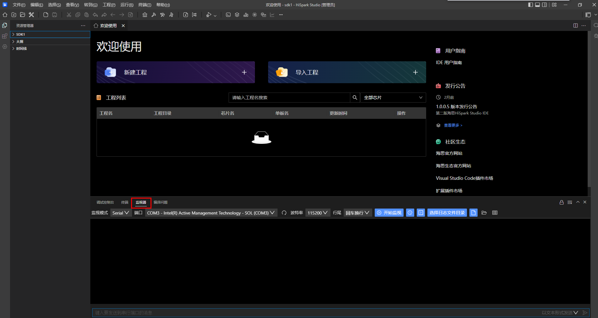

界面介绍：

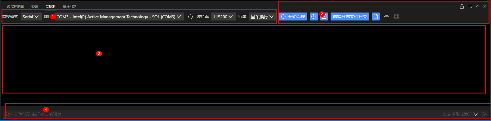

1.  串口配置区

    端口：显示当前电脑所连接的串口设备，点击此按钮可以刷新串口列表。

    波特率：选择串口波特率，范围：300\~250000。

    行尾：当给串口发送消息时，工具会根据此选项自动添加字符，CRLF代表“\\r\\n”，CR代表“\\r”，LF代表“\\n”。。3

2.  功能按钮区

    ：连接串口按钮。当连接串口后，按钮状态会变成，点击此按钮会断开串口连接。

    ：时间戳按钮。开启时会在每行输出前加上时间戳显示，如果按钮处于关闭状态则不显示时间戳。

    

    ：隐藏输入框。

    

    

    ：开启/关闭屏幕自动滚动。

    ：清空输出区。

    ：最大化面板。

    ：关闭面板

3.  输出区。
4.  输入区。
5.  发送消息按钮：点击按钮或者敲击回车发送输入区信息给串口。默认编码为utf8。

## 连接串口<a name="ZH-CN_TOPIC_0000002263570445"></a>

单击即可连接串口。连接串口前，输入区默认处于未激活状态（不可输入、不可点击）；连接串口后，输入区变为激活状态，串口配置区的监视模式选项变为未激活状态。


## 查看消息<a name="ZH-CN_TOPIC_0000002228570868"></a>

在输出区可以查看串口发送的消息。


## 发送消息<a name="ZH-CN_TOPIC_0000002228411060"></a>

在下方输入区输入消息后点击发送按钮或者点击键盘回车按钮发送消息。


## 断开连接<a name="ZH-CN_TOPIC_0000002263530389"></a>

单击此按钮断开串口连接。


## 扩展工具使用<a name="ZH-CN_TOPIC_0000002263570449"></a>

扩展工具主要用于添加一些用户常用的命令，添加后可以做到点击名称发送命令。扩展工具在出厂时预先添加了一些常用命令，如果用户用不到这些命令，可以选择清空表格，然后自己手动添加，或使用excel表格导入方式进行添加。除此之外，扩展工具还有循环发送功能，在后面章节中会详细介绍。

-   打开扩展工具。点击扩展按钮，会在右侧展开扩展页面。

    

    点击此按钮可最大化面板。

    

-   点击清空列表按钮可清空列表。

    

    如果清空出厂表格后想要回复，可导入安装目录下“HiSpark Studio\\resources\\app\\extensions\\huawei.cfbbserialcom-0.0.1\\resources\\excelFile“下的“rwaData.xlsx“表格。

-   手动新增命令行。点击“增加一行”按钮。

    

    添加数据规则：

    数据格式：下拉框模式，下拉选项有utf8、bin、hex。

    命令：发送给串口的命令字符串。

    名称：识别命令功能的字符串。点击此按钮可立即发送命令给串口（前提是工具处于监听状态）。

    顺序：在使用循环发送功能时，顺序大于0，才会进行循环发送。如果有多个命令的顺序大于0，并且数值一样，则按照由上到下的顺序发送。

    延时发送：先发送一次，再进行延时，单位：ms。

    操作：有编辑和删除两个选项，点击编辑可对命令行进行修改，点击删除可删除命令行。

-   批量添加命令。

1.  下载导入模板。导入模板会自动保存到安装目录下“HiSpark Studio\\resources\\app\\extensions\\huawei.cfbbserialcom-0.0.1\\resources\\excelFile\\importResults.xlsx.xlsx“。

    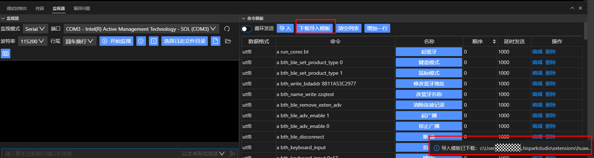

    导入模板中会显示需要导入的列，以及每个列的规则。

    

2.  填写导入模板。

    

3.  导入“导入模板“文件。

    

    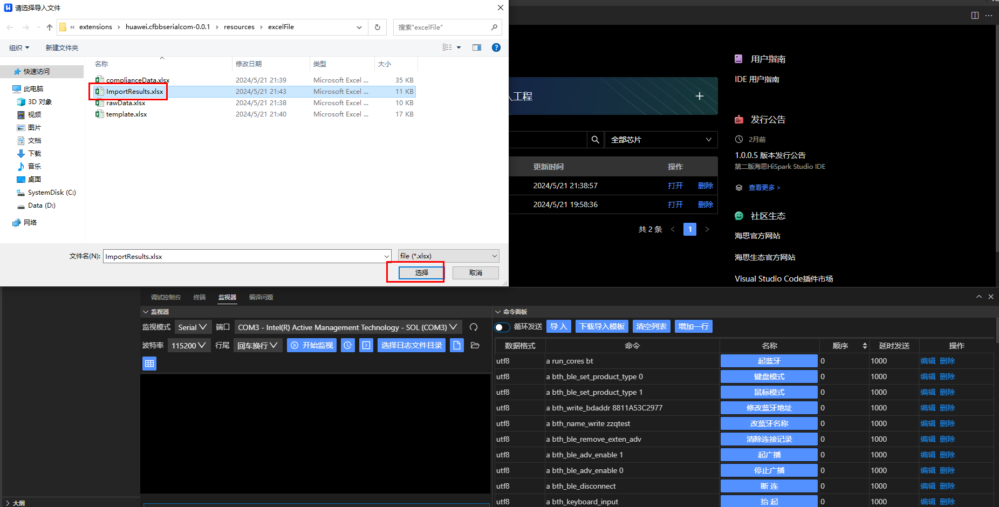

4.  查看导入数据。

    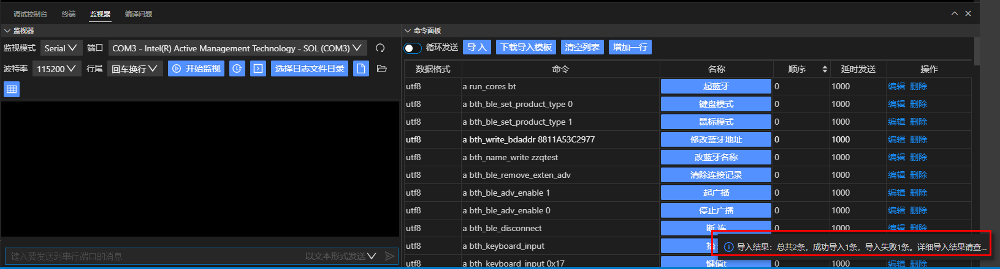

    

5.  查看导入结果表格。导入结果列会显示导入不成功的原因。

    

-   循环发送。

1.  设置顺序和延时。

    

    上图表格执行命令的顺序：

    首先，发送“起蓝牙“命令，延时1000ms；然后，发送“键盘模式“命令，延时1000ms；最后，发送“鼠标模式“命令，延时1000ms；结束。这是一个循环发送的周期，循环发送会不断的循环这个周期。

    “修改蓝牙地址”命令并不会发送，因为它的顺序不大于0。

2.  打开串口监听。

    

3.  打开循环发送开关（发送的命令自带“回车换行”）。打开后，会在左侧输出栏看到发送的命令。

    

    红色字体表明正在发送此条命令或者正在延时

# Kconfig配置<a name="ZH-CN_TOPIC_0000002228570872"></a>

本功能主要用于控制工程的编译构建，通过修改编译宏的方式配置参与编译的功能模块。

打开工程后，点击工具栏中的“系统配置”选项，如[图1](#zh-cn_topic_0000001882480077_fig313311611215)所示。

**图 1**  系统配置入口<a name="zh-cn_topic_0000001882480077_fig313311611215"></a>  
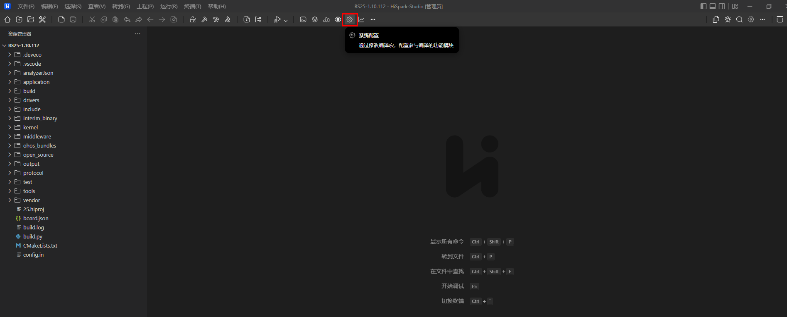

系统配置界面如[图2](#zh-cn_topic_0000001882480077_fig11641828725)所示。

**图 2**  系统配置界面<a name="zh-cn_topic_0000001882480077_fig11641828725"></a>  


## 按钮功能介绍<a name="ZH-CN_TOPIC_0000002228411064"></a>

系统配置界面按钮功能如下：

① save：配置文件默认保存至\`$\{menu\_config\_build\_target\}\`下。

② save as：自定义保存路径，默认配置文件名 \`$\{menu\_config\_build\_target\}\`.config。

③ save\(minimal\)：自定义保存路径和配置文件名称，且只保存修改过的配置项。

④ open：自定义加载配置文件。

⑤ jump to：配置项搜索。

⑥ show name：显示列名（Option-Name）。

⑦ show all：显示隐藏配置项。

⑧ single menu mode：单个菜单模式。

# 常见错误<a name="ZH-CN_TOPIC_0000002263530393"></a>


## 如何解决部分快捷键无效问题<a name="ZH-CN_TOPIC_0000002263570453"></a>

**问题描述<a name="zh-cn_topic_0000001925231646_section22251724121611"></a>**

在使用IDE的时候发现部分快捷键使用无效。如[图1](#zh-cn_topic_0000001925231646_fig1663116531651)所示。

**图 1**  部分快捷键说明<a name="zh-cn_topic_0000001925231646_fig1663116531651"></a>  
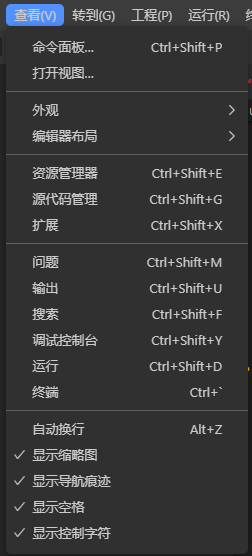

**解决方法<a name="zh-cn_topic_0000001925231646_section09097281557"></a>**

1.  检查其他运行的软件快捷键是否设置有冲突，例如查看输入法软件的属性设置，如[图2](#zh-cn_topic_0000001925231646_fig195653815179)所示。

    **图 2**  按键属性设置<a name="zh-cn_topic_0000001925231646_fig195653815179"></a>  
    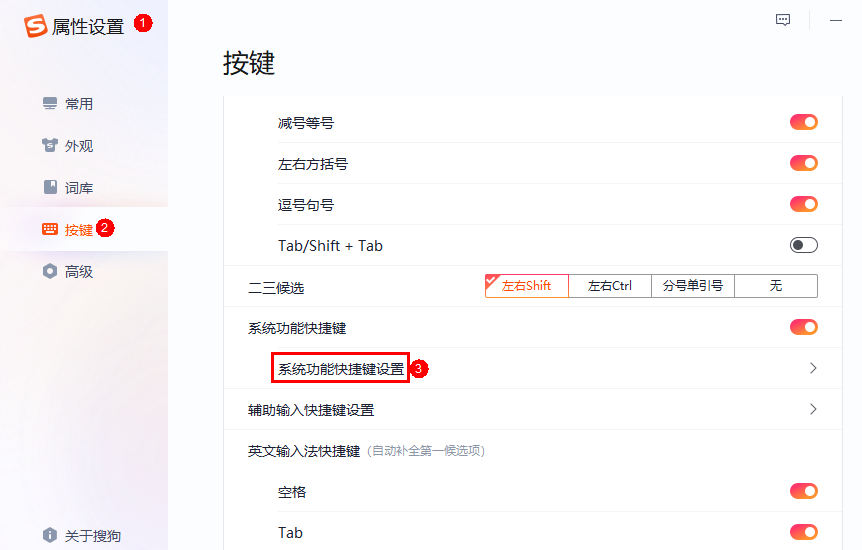

    ①：打开“属性设置”。

    ②：选择“按键”。

    ③：打开“系统功能快捷键设置”。

2.  在系统功能快捷键中，选择关闭或重置冲突的快捷键。

    **图 3**  系统功能快捷键<a name="zh-cn_topic_0000001925231646_fig12389445201918"></a>  
    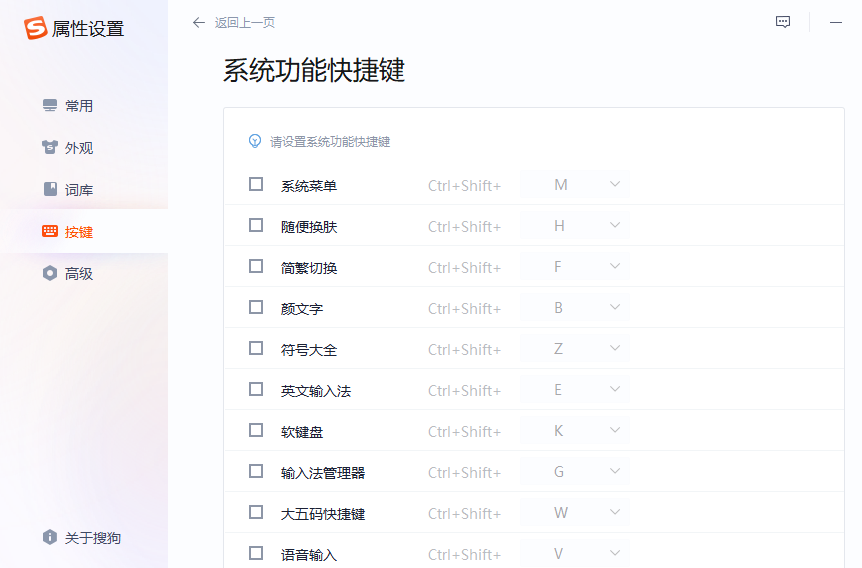

## 对单独的c或c++使用"生成和调试活动文件"后如何停止调试<a name="ZH-CN_TOPIC_0000002228570880"></a>

**问题描述<a name="zh-cn_topic_0000001925072282_section126429387518"></a>**

对单独的c或c++使用"生成和调试活动文件"后，点击调试图标，没有退出调试。

**解决方法<a name="zh-cn_topic_0000001925072282_section1029425184"></a>**

按快捷键F1，在如[图1](#zh-cn_topic_0000001925072282_fig45893311143)的输入框中输入“Debug: Stop”，点击搜索到的结果即可退出调试。

**图 1**  停止调试指令搜索<a name="zh-cn_topic_0000001925072282_fig45893311143"></a>  
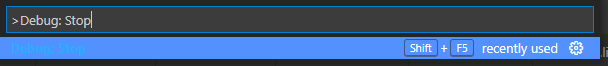

## 电脑安装的杀毒软件导致调试过程中调试器与PC连接断开<a name="ZH-CN_TOPIC_0000002228411068"></a>

**问题描述<a name="zh-cn_topic_0000001952191277_section126429387518"></a>**

杀毒软件导致调试过程中调试器与PC端的USB连接断开，导致调试器与PC端通信失败。终端打印如下[图1](#zh-cn_topic_0000001952191277_fig773857143713)所示。

**图 1**  USB断开连接LOG<a name="zh-cn_topic_0000001952191277_fig773857143713"></a>  
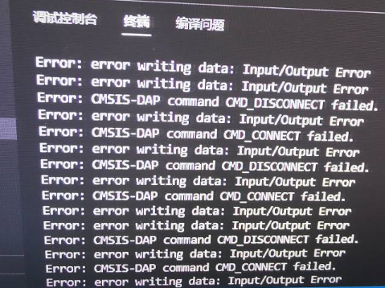

**解决方法<a name="zh-cn_topic_0000001952191277_section8871452123612"></a>**

关闭杀毒软件或者把调试器加入白名单。

## SDK 根目录路径过长<a name="ZH-CN_TOPIC_0000002263530397"></a>

SDK根目录路径过长：

Windows下路径有260的长度限制，过长的路径会导致编译时相关文件无法找到，建议SDK代码放到盘符的根目录。当出现如下报错时，请缩短SDK存放路径。

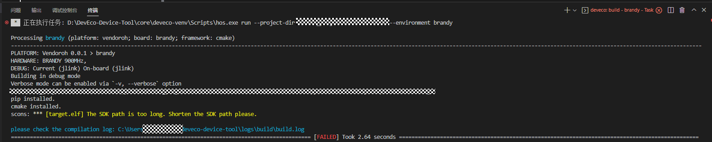

## 路径失效<a name="ZH-CN_TOPIC_0000002263570457"></a>

导入工程路径问题导致的调试、栈分析、镜像分析等默认路径失效。

-   调试：修改默认的debug\_elf路径。

    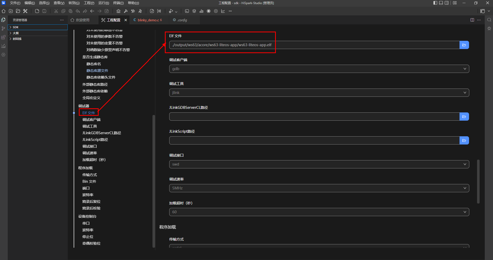

## 切换target<a name="ZH-CN_TOPIC_0000002228570884"></a>

在工程配置页面，用户可以根据需求切换target

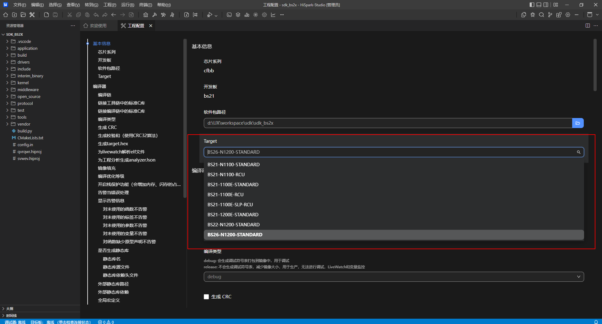

## 编译或者执行系统配置功能过程中提示python或者其他依赖出错<a name="ZH-CN_TOPIC_0000002228411072"></a>

编译或者执行系统配置功能过程中提示python环境出错：


或者提示内容为“本地没有安装python”或者“本地安装的python不可用”这种错误，原因为本地没有安装python或者安装的python版本不为3.11.4，为不影响编译或者系统配置功能的正常使用，建议参考2.4章中的配置python环境下载python3.11.4的安装包并手动安装，安装过程中勾选“pip”和“tcl/tk选项”。

编译或者执行系统配置功能过程中提示XX组件下载失败：


或者cmake、pycparser或者kconfiglib下载失败。原因为执行编译或者系统配置功能时需要通过安装的python的pip组件进行下载所需依赖失败，可能是本地环境原因导致pip install失败或者当前没有网络连接导致下载失败。

解决方法：根据对应提示的组件下载失败，下载对应组件的whl文件，组件与下载链接对应关系如下：

cmake：[https://files.pythonhosted.org/packages/65/7f/80cf681cd376834b442af8af48e6f17b4197d20b7255aa2f76d8d93a9e44/cmake-3.20.5-py2.py3-none-win\_amd64.whl](https://files.pythonhosted.org/packages/65/7f/80cf681cd376834b442af8af48e6f17b4197d20b7255aa2f76d8d93a9e44/cmake-3.20.5-py2.py3-none-win_amd64.whl)

pycparser：[https://files.pythonhosted.org/packages/62/d5/5f610ebe421e85889f2e55e33b7f9a6795bd982198517d912eb1c76e1a53/pycparser-2.21-py2.py3-none-any.whl](https://files.pythonhosted.org/packages/62/d5/5f610ebe421e85889f2e55e33b7f9a6795bd982198517d912eb1c76e1a53/pycparser-2.21-py2.py3-none-any.whl)

kconfiglib：[https://files.pythonhosted.org/packages/8a/f1/d98a89231e779b079b977590efcc31249d959c8f1d4b5858cad69695ff9c/kconfiglib-14.1.0-py2.py3-none-any.whl](https://files.pythonhosted.org/packages/8a/f1/d98a89231e779b079b977590efcc31249d959c8f1d4b5858cad69695ff9c/kconfiglib-14.1.0-py2.py3-none-any.whl)

windows\_curses：[https://files.pythonhosted.org/packages/18/1b/e06eb41dad1c74f0d3124218084f258f73a5e76c67112da0ba174162670f/windows\_curses-2.3.3-cp311-cp311-win\_amd64.whl](https://files.pythonhosted.org/packages/18/1b/e06eb41dad1c74f0d3124218084f258f73a5e76c67112da0ba174162670f/windows_curses-2.3.3-cp311-cp311-win_amd64.whl)

下载完成后，在文件所在目录（建议存放在python3.11.4的安装目录）打开命令提示符（cmd），执行命令“pip install  对应的whl文件”，以cmake和windows\_curses举例：


执行的命令：


检验是否执行成功，cmake可以打开命令提示符，执行“cmake --version”，如果有对应版本号出现，则说明cmake下载成功，其余组件可以通过执行“pip show 组件名”，如果有对应组件的信息出现，则说明各依赖下载成功：


如果环境均配置成功但是编译失败，并且提示“is the command line too long”的错误，则说明cmake版本与所需版本不符合，需要在python3.11.4的安装目录下下载cmake-3.20.5-py2.py3-none-win\_amd64.whl并在该目录下执行“pip install  下载的cmake的whl文件”即可。

下载链接：

[https://files.pythonhosted.org/packages/65/7f/80cf681cd376834b442af8af48e6f17b4197d20b7255aa2f76d8d93a9e44/cmake-3.20.5-py2.py3-none-win\_amd64.whl](https://files.pythonhosted.org/packages/65/7f/80cf681cd376834b442af8af48e6f17b4197d20b7255aa2f76d8d93a9e44/cmake-3.20.5-py2.py3-none-win_amd64.whl)


如果python环境正常，但是执行执行pip install 组件的时候失败：


原因为pip的版本与python版本不一致，即python3.11.4或者其他合规版本的python环境变量添加至环境变量，对应的python安装目录下的Python311\\Scripts的环境变量没有添加。可手动将Python\\Scripts的环境变量也添加到环境变量头部，下载pip的依赖成功后，再关闭所有HiSpark Studio窗口再打开。


## 多个.a静态库如何打包成一个.a静态库（仅支持MCU系列芯片）<a name="ZH-CN_TOPIC_0000002263530401"></a>

1.  进入到工具链目录，默认路径是在C:\\Program Files\\HiSpark Studio\\tools\\Windows\\cc\_riscv32\_musl\_fp\_win\\bin。
2.  将需要合成的.a和libAllInOne.bat 放到工具链目录中，检查目录中不能存在.o文件，和多余的.a文件。
3.  双击执行libAllInOne.bat。
4.  按照 bat 中的提示信息完成打包。

> **说明：** 
>libAllInOne.bat 执行代码可以参考如下代码：
>```
>@echo off
>echo 执行程序会将目录下面的所有.a合并成一个，请按任意键确认是否继续执行
>pause
>for %%i in (*.a) do (
>riscv32-linux-musl-ar.exe x %%i
>)
>set /p input=请输入合成.a的名字，必须是以lib开头和.a结尾：
>for %%i in (*.o) do (
>riscv32-linux-musl-ar.exe crs %input% %%i
>)
>echo 生成 %input% 成功
>pause
>```

## 电机算法库的参数检查是否要开启？（仅支持MCU系列芯片）<a name="ZH-CN_TOPIC_0000002263570461"></a>

**问题描述<a name="zh-cn_topic_0000001925231650_section126429387518"></a>**

当使用芯片配置器创建默认的 “Blank Main”工程时，会默认使能电机算法库的参数检查功能。

**图 1**  芯片配置器中电机算法库参数检查宏默认使能<a name="zh-cn_topic_0000001925231650_fig7874204415518"></a>  
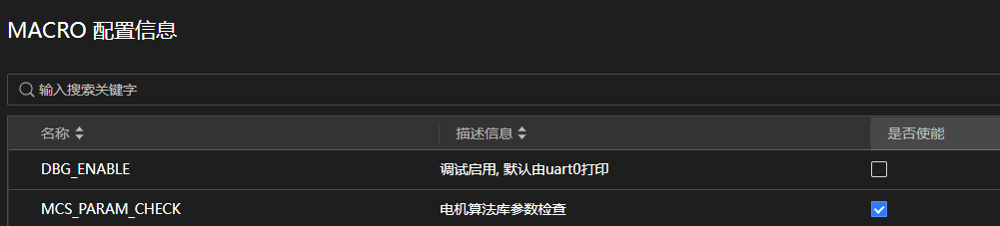

**解决方法<a name="zh-cn_topic_0000001925231650_section8871452123612"></a>**

需要使能电机算法库的参数检查功能的场景：需要检查检查电机算法库函数参数是否有异常的场景（注意这会影响算法性能）。

需要关闭电机算法库的参数检查功能的场景：对算法性能有要求的场景。

## 断点数量限制统计不到反汇编断点导致断点数量超出限制无法调试（仅支持MCU系列芯片）<a name="ZH-CN_TOPIC_0000002228570888"></a>

**问题描述<a name="zh-cn_topic_0000001925072286_section126429387518"></a>**

当所使用的断点包含反汇编断点时，即使达到断点数量限制，仍然可以继续添加断点，然而，当断点数量超过限制后，进行调试会导致异常报错。

**图 1**  反汇编视图断点<a name="zh-cn_topic_0000001925072286_fig117281828112417"></a>  
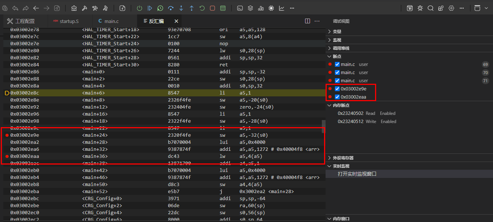

**图 2**  断点数量超限制异常弹窗<a name="zh-cn_topic_0000001925072286_fig136111642112417"></a>  

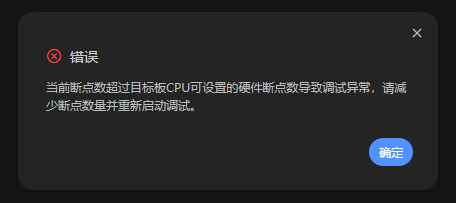

**解决方法<a name="zh-cn_topic_0000001925072286_section8871452123612"></a>**

断点数量超过限制时，运行调试会有异常弹窗，请点击 "确定" 按钮退出调试，并在删除部分断点（306xH系列MCU断点数量限制为7个，3061M系列MCU断点数量限制为3个）后再次启动调试。

## 调试的变量和监视窗口查看大数组变量会加载很久导致无法调试（仅支持MCU系列芯片）<a name="ZH-CN_TOPIC_0000002228411076"></a>

**问题描述<a name="zh-cn_topic_0000001952191285_section126429387518"></a>**

调试过程中，如果要使用变量或监视窗口查看大数组变量（数组大小在2000以上），系统会加载很长时间，加载期间无法进行其他调试操作。

**图 1**  查看大数组变量加载状态界面<a name="zh-cn_topic_0000001952191285_fig6337162714259"></a>  
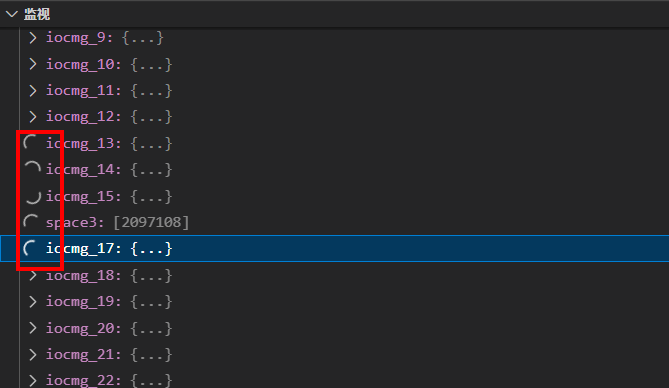

**解决方法<a name="zh-cn_topic_0000001952191285_section8871452123612"></a>**

系统一直处于加载状态时先点击 "停止调试" 按钮退出调试，再次启动调试并使用实时监视（Live Watch）来查看大数组变量。

## 启动VariableTrace失败（仅支持MCU系列芯片）<a name="ZH-CN_TOPIC_0000002263530405"></a>

**问题描述<a name="zh-cn_topic_0000001952351057_section126429387518"></a>**

按照[变量跟踪功能](变量跟踪功能.md#ZH-CN_TOPIC_0000002263530377)中的介绍启动变量跟踪功能失败，没有弹出窗口。

**解决方法<a name="zh-cn_topic_0000001952351057_section8871452123612"></a>**

方案一：使用独立显卡。

方案二：更新显卡驱动。在Windows系统中，可以通过系统设置来自动更新显卡驱动。

1.  打开“设置”。

    **图 1**  Windows设置<a name="zh-cn_topic_0000001952351057_fig46361827164011"></a>  
    

2.  点击“更新和安全”。

    **图 2**  更新和安全<a name="zh-cn_topic_0000001952351057_fig1545003634020"></a>  
    

3.  选择“Windows Update”，点击“检查更新”。

    **图 3**  检查更新<a name="zh-cn_topic_0000001952351057_fig2209552114018"></a>  
    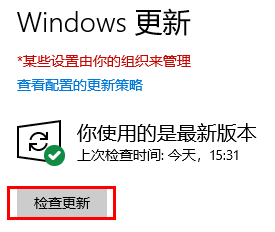

    如果有可用的显卡驱动更新，系统会自动下载并安装。

## 启动HiSpark-TraceFlasher工具提示由于找不到MSVCP140.dll，无法继续执行代码解决方案（仅支持MCU系列芯片）<a name="ZH-CN_TOPIC_0000002263570465"></a>

**问题描述<a name="zh-cn_topic_0000001925231654_section126429387518"></a>**

在用户启动HiSpark-TraceFlasher工具时，提示由于找不到MSVCP140.dll，无法继续执行代码，导致无法打开工具。

**图 1**  无法找到MSVCP140.dll提示示例<a name="zh-cn_topic_0000001925231654_fig15103054357"></a>  
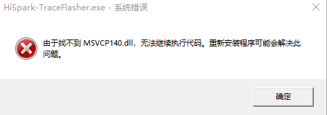

**解决方法<a name="zh-cn_topic_0000001925231654_section8871452123612"></a>**

方法一：找一台其他相同系统和位数的电脑，在C:\\Windows\\System32（64位：C:\\Windows\\SysWOW64），将msvcp140.dll拷贝至HiSpark-TraceFlasher工具根目录下（HiSpark-TraceFlasher.exe同级目录），重新启动即可。

方法二：网上下载一个符合电脑系统和位数的msvcp140.dll文件，放在HiSpark-TraceFlasher工具根目录下（HiSpark-TraceFlasher.exe同级目录），重新启动即可

## 编译工程时，出现“start parsing target.elf for livewatch.....”之后要等待很久（仅支持MCU系列芯片）<a name="ZH-CN_TOPIC_0000002228570892"></a>

**问题描述<a name="zh-cn_topic_0000001925072290_section126429387518"></a>**

编译工程时，出现“start parsing target.elf for livewatch.....”之后要等待很久，才能完成编译。

**解决方法<a name="zh-cn_topic_0000001925072290_section8871452123612"></a>**

这个等待时间是在解析 elf 中的变量，并用于[实时监视（Live Watch） 调试功能（仅支持MCU系列芯片）](实时监视（Live-Watch）-调试功能（仅支持MCU系列芯片）.md#ZH-CN_TOPIC_0000002228570860)。等待时间与工程中定义的变量数量成正相关。

方案一：如果暂时不需要这个功能，可以取消勾选“工程配置”-\>“为livewatch解析elf文件”。可以跳过这段流程，加快编译时间。

方案二：如果需要使用这个功能，又想要加快解析时间。对于电脑中没有安装python的用户，可以下载并安装 python 3.8.8 及以上版本，再次尝试编译，可以有效加快编译时间，对于电脑中已经有python的用户，就只能使用方案一。

## win7 注意事项<a name="ZH-CN_TOPIC_0000002228411080"></a>

1. NB18V100R001 软件开发指南中，python 版本为3.10.2，实测发现3.10.2无法兼容 win7 系统，需要将版本改为3.8.0

2. NB18V100R001 软件开发指南中，cmake 版本为 3.25.3，但 sdk 中将使用的cmake版本写死为 3.20.5，需同一版本

3. NB18V100R001 软件开发指南中，pywin32 版本 310，此版本不兼容 win7，需要将版本修改为 306

4. 2118 sdk 和板子分量产 key 与测试 key，烧写时要匹配上

5. 当 2118 板子烧了某个特定版本的 sdk 编译出来的镜像的时候，会导致掉电问题，板子串口无法连接，此时需要向 B 口发送 AT+NRB 来进行软复位来修复

6. 2118 sdk 一直存在无法生成临时文件，从而导致编译概率性失败的问题

7. win7 无法自动识别 2118 单板串口，需要手动安装驱动：HI2120EVK2\_USB\_UART\_Driver.zip

8. debug 插件使用 powershell 命令来检测 USB 连接状态，但是此命令在 win7 中不生效，会导致 IDE 不断调起 powershell 进程，从而使得 CPU 占用率一直维持在 100%，进而导致 IDE 崩溃，目前已将该命令修改为 win7 可用的 cmd 命令，此问题经验证已解决

9. debug 调试时用的调试器为 hcc 的 gdb，版本为 12.0.50，此版本不兼容 win7，目前已将 gdb 版本替换为兼容win7的 10.0.50，经验证调试功能正常

## 选择MCU的Nos Task Schedule例程，出现红色波浪线告警<a name="ZH-CN_TOPIC_0000002263530409"></a>

**问题描述<a name="zh-cn_topic_0000001953657304_section1818051264418"></a>**

选择MCU的Nos Task Schedule例程，出现红色波浪线告警。

**图 1**  出现红色波浪线告警<a name="zh-cn_topic_0000001953657304_fig49571837114612"></a>  
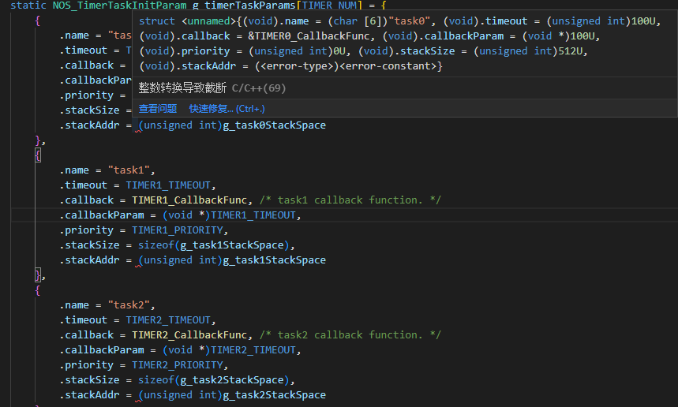

**解决方法<a name="zh-cn_topic_0000001953657304_section8871452123612"></a>**

1、工具栏中， IDE配置-\>设置。

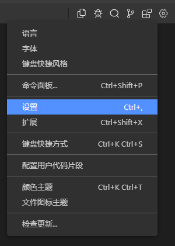

2、在搜索栏中输入：intelli sense mode


3、选择 “linux-gcc-arm”，红色波浪线被消除。

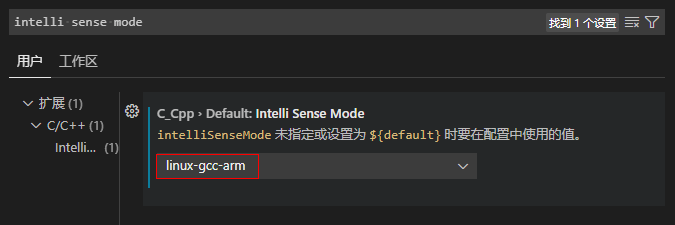

## 菜单栏隐藏后如何再次显示<a name="ZH-CN_TOPIC_0000002263570469"></a>

在使用HiSpark Studio过程中，可以通过菜单栏中的查看/外观中的各种选项来控制某些区域的显示或者隐藏，如果点击显示菜单栏后，菜单栏会隐藏。

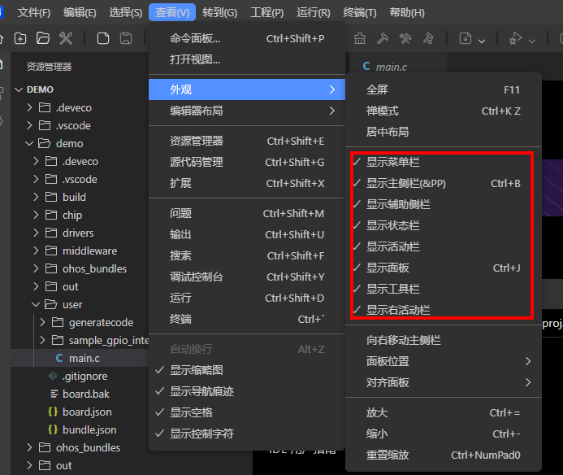

可以通过如下方法重新显示菜单栏：

①：点击窗口右上角的“自定义布局”按钮，在弹出的选项框中，可以选择显示/隐藏菜单栏

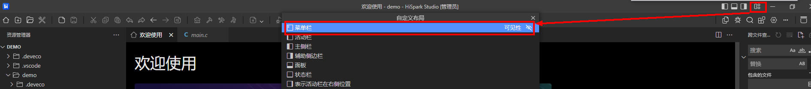

②：将活动栏切换至侧边，当隐藏菜单栏时，左侧活动栏会生成一个新图标，点击即可使用原生菜单栏中的功能，通过查看/外观/显示菜单栏这个选项功能来显示菜单栏。

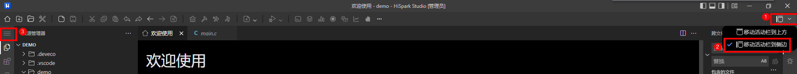

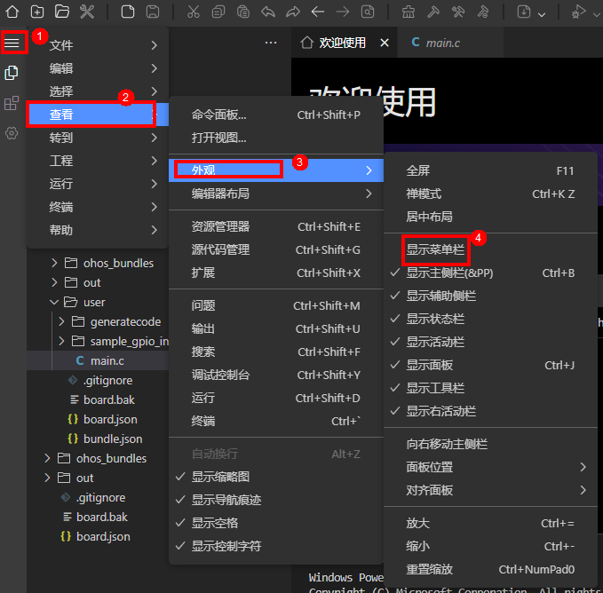

③：用快捷键ctrl+shift+p弹出命令行菜单，输入“Toggle Menu Bar”点击该选项，能够显示/隐藏菜单栏。

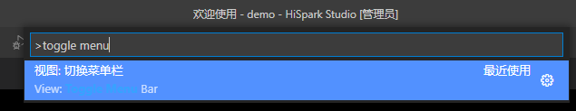

## 如何制作和使用可以运行在SRAM上的静态库\(仅支持MCU系列芯片\)<a name="ZH-CN_TOPIC_0000002228570896"></a>

制作可以运行在SRAM上的静态库的步骤如下：

1.  使用 “RAM\_CODE”宏定义和声明静态库的对外提供的接口。
2.  参考[编译生成静态库](编译生成静态库.md#ZH-CN_TOPIC_0000002228410996)章节的方案制作静态库。

使用可以运行在SRAM上的静态库的步骤如下：

1.  在工程中打开“chipconfig配置”。详见[功能入口](功能入口.md#ZH-CN_TOPIC_0000002263570357)。
2.  在“LDS配置”中的“RAM Code Path”区域中添加静态库对应的.a文件。详见[LDS配置（仅支持MCU系列芯片）](LDS配置（仅支持MCU系列芯片）.md#ZH-CN_TOPIC_0000002228570796)。
3.  点击“生成代码”，就可以得到一个让静态库中的“RAM\_CODE”接口运行在SRAM上的工程。

