# SLE键盘与适配器系统设计文档

## 1. 系统架构图

```mermaid
graph TB
    subgraph "SLE Keyboard (Server端)"
        KS[键盘扫描模块]
        LED[LED驱动模块]
        SLE_S[SLE Server服务]
        ADV[广播模块]
        CONN_S[连接管理]
    end
    
    subgraph "SLE Dongle (Client端)"
        SLE_C[SLE Client服务]
        HID[HID键盘模拟]
        CONN_C[连接管理]
        USB[USB接口]
    end
    
    subgraph "硬件层"
        MCU[微控制器]
        SPI[SPI总线]
        GPIO[GPIO引脚]
        RF[射频模块]
    end
    
    subgraph "PC/主机"
        OS[操作系统]
        APP[应用程序]
    end
    
    KS --> SLE_S
    LED --> SPI
    SLE_S --> ADV
    SLE_S --> CONN_S
    CONN_S <-.-> RF
    RF <-.->|SLE协议| RF
    CONN_C <-.-> RF
    SLE_C --> CONN_C
    SLE_C --> HID
    HID --> USB
    USB --> OS
    OS --> APP
    
    MCU --> GPIO
    MCU --> SPI
    MCU --> RF
```

## 2. SLE键盘端完整时序图

## 3. SLE适配器端时序图

## 4. LED控制模块流程图

## 5. 键盘扫描处理流程图

## 6. SLE连接管理流程图

## 7. 整体数据流图

## 系统特点总结

1. **双向通信**: 键盘到电脑的按键数据传输，电脑到键盘的LED控制
2. **模块化设计**: 键盘扫描、SLE通信、LED控制、HID处理等独立模块
3. **实时性**: 中断驱动的键盘扫描，快速响应按键事件
4. **可扩展性**: 支持多种LED效果，可配置的键盘布局
5. **低功耗**: SLE协议优化的无线传输
6. **标准兼容**: 符合HID键盘标准，即插即用
