# SLE键盘设计文档

## SLE键盘端完整时序图

```mermaid
sequenceDiagram
    participant Main as 主程序入口
    participant Task as sle_keyboard_task
    participant KeyScan as 键盘扫描模块
    participant SLEServer as SLE服务器
    participant ADV as 广播模块
    participant LED as LED控制
    participant MsgQueue as 消息队列
    participant Client as SLE客户端

    Note over Main: 系统启动阶段
    Main->>Task: app_run(sle_keyboard_entry)
    Main->>Task: osThreadNew(sle_keyboard_task)
    
    Note over Task: 任务初始化阶段
    Task->>KeyScan: keyscan_porting_config_pins()
    Task->>KeyScan: uapi_set_keyscan_value_map()
    Task->>KeyScan: uapi_keyscan_init()
    Task->>KeyScan: uapi_keyscan_register_callback()
    Task->>KeyScan: uapi_keyscan_enable()
    
    Task->>MsgQueue: sle_keyboard_server_create_msgqueue()
    Task->>SLEServer: sle_keyboard_server_register_msg()
    Task->>SLEServer: sle_keyboard_server_init()
    
    Note over SLEServer: SLE服务器初始化
    SLEServer->>ADV: sle_keyboard_announce_register_cbks()
    ADV->>ADV: sle_announce_seek_register_callbacks()
    ADV->>ADV: sle_dev_manager_register_callbacks()
    
    SLEServer->>SLEServer: enable_sle()
    SLEServer->>SLEServer: sle_conn_register_cbks()
    SLEServer->>SLEServer: sle_connection_register_callbacks()
    SLEServer->>SLEServer: sle_ssaps_register_cbks()
    SLEServer->>SLEServer: ssaps_register_callbacks()
    
    SLEServer->>SLEServer: sle_keyboard_server_add()
    SLEServer->>SLEServer: ssaps_register_server()
    SLEServer->>SLEServer: sle_uuid_server_service_add()
    SLEServer->>SLEServer: ssaps_add_service_sync()
    SLEServer->>SLEServer: sle_uuid_server_property_add()
    SLEServer->>SLEServer: ssaps_add_property_sync()
    SLEServer->>SLEServer: ssaps_add_descriptor_sync()
    SLEServer->>SLEServer: ssaps_start_service()
    
    SLEServer->>ADV: sle_keyboard_server_adv_init()
    ADV->>ADV: sle_set_default_announce_param()
    ADV->>ADV: sle_set_announce_param()
    ADV->>ADV: sle_set_default_announce_data()
    ADV->>ADV: sle_set_adv_data()
    ADV->>ADV: sle_set_scan_response_data()
    ADV->>ADV: sle_set_announce_data()
    ADV->>ADV: sle_start_announce()
    
    Note over Task: 主循环开始
    loop 主任务循环
        Task->>MsgQueue: sle_keyboard_server_receive_msgqueue()
        
        alt 接收到断连消息
            Task->>ADV: sle_start_announce()
            ADV-->>Client: 重新开始广播
        end
    end
    
    Note over KeyScan: 键盘扫描中断处理
    loop 按键事件循环
        KeyScan->>KeyScan: 硬件扫描中断触发
        KeyScan->>Task: sle_keyboard_keyscan_callback()
        Task->>Task: 检查连接状态
        
        alt 已连接状态
            Task->>Task: 构建HID报告
            Task->>Task: 区分特殊键和普通键
            Task->>Task: 填充usb_hid_keyboard_report_t
            Task->>SLEServer: sle_keyboard_server_send_report_by_handle()
            SLEServer->>SLEServer: ssaps_notify_indicate()
            SLEServer-->>Client: 发送键盘数据
        end
    end
    
    Note over Client: 客户端数据接收
    loop 客户端写入事件
        Client->>SLEServer: 发送LED控制数据
        SLEServer->>Task: ssaps_server_write_request_cbk()
        Task->>Task: 解析LED控制数据
        Task->>LED: 可选：触发LED控制
    end
    
    Note over SLEServer: 连接状态管理
    Client->>SLEServer: 连接请求
    SLEServer->>SLEServer: sle_connect_state_changed_cbk()
    SLEServer->>SLEServer: 更新g_sle_conn_handle
    
    Client->>SLEServer: 配对请求
    SLEServer->>SLEServer: sle_pair_complete_cbk()
    SLEServer->>SLEServer: 设置g_sle_pair_handle
    
    alt 连接断开
        SLEServer->>SLEServer: sle_connect_state_changed_cbk()
        SLEServer->>MsgQueue: 发送断连消息
        SLEServer->>SLEServer: 清理连接状态
    end
    
    Note over LED: LED控制模块(可选)
    LED->>LED: spi_master_entry()
    LED->>LED: 初始化随机数生成器
    LED->>LED: 生成LED数据
    loop 多个LED任务
        LED->>LED: osal_kthread_create(spi_led_transfer_task)
        LED->>LED: app_spi_master_init_config()
        LED->>LED: encode_led_data()
        LED->>LED: uapi_spi_master_write()
        LED->>LED: 发送复位信号
    end
    
    Note over Task: 任务清理
    Task->>MsgQueue: sle_keyboard_server_delete_msgqueue()
    Task->>KeyScan: uapi_keyscan_deinit()
```



## 关键函数调用流程说明

### 1. 初始化阶段函数调用链

```
app_run() -> sle_keyboard_entry() -> osThreadNew() -> sle_keyboard_task()
├── keyscan_porting_config_pins()
├── uapi_keyscan_init()
├── sle_keyboard_server_init()
│   ├── sle_keyboard_announce_register_cbks()
│   ├── enable_sle()
│   ├── sle_conn_register_cbks()
│   ├── sle_ssaps_register_cbks()
│   ├── sle_keyboard_server_add()
│   └── sle_keyboard_server_adv_init()
└── 进入主循环
```

### 2. 按键处理函数调用链

```
硬件中断 -> keyscan中断处理 -> sle_keyboard_keyscan_callback()
├── sle_keyboard_client_is_connected()
├── 构建usb_hid_keyboard_report_t
├── 处理特殊键和普通键
└── sle_keyboard_server_send_report_by_handle()
    └── ssaps_notify_indicate()
```

### 3. 连接管理函数调用链

```
客户端连接 -> sle_connect_state_changed_cbk()
├── 更新g_sle_conn_handle
└── 如果断开 -> 发送消息到队列

配对完成 -> sle_pair_complete_cbk()
└── 设置g_sle_pair_handle
```

### 4. 数据接收函数调用链

```
客户端写入 -> ssaps_server_write_request_cbk()
├── 解析接收数据
├── 转换为键值
└── 可选：触发相应操作
```
