# SLE适配器系统设计文档

## SLE接收器端完整时序图

```mermaid
sequenceDiagram
    participant Main as 主程序入口
    participant Task as sle_dongle_task
    participant SLEClient as SLE客户端
    participant HID as HID键盘模块
    participant USB as USB接口
    participant MsgQueue as 消息队列
    participant Server as SLE键盘服务器

    Note over Main: 系统启动阶段
    Main->>Task: app_run(sle_keyboard_dongle_entry)
    Main->>Task: osThreadNew(sle_dongle_task)
    
    Note over Task: 任务初始化阶段
    Task->>HID: hid_keyboard_init()
    HID->>HID: usbd_set_controller()
    HID->>HID: usbd_add_interface()
    HID->>HID: usbd_init()
    HID->>HID: usbd_start()
    
    Task->>MsgQueue: sle_keyboard_client_create_msgqueue()
    Task->>SLEClient: sle_keyboard_client_register_msg()
    Task->>SLEClient: sle_keyboard_client_init()
    
    Note over SLEClient: SLE客户端初始化
    SLEClient->>SLEClient: enable_sle()
    SLEClient->>SLEClient: sle_dev_manager_register_callbacks()
    SLEClient->>SLEClient: sle_announce_seek_register_callbacks()
    SLEClient->>SLEClient: sle_connection_register_callbacks()
    SLEClient->>SLEClient: sle_ssapc_register_callbacks()
    SLEClient->>SLEClient: ssapc_register_callbacks()
    
    SLEClient->>SLEClient: sle_keyboard_start_scan()
    SLEClient->>SLEClient: sle_set_default_scan_param()
    SLEClient->>SLEClient: sle_start_scan()
    
    Note over Task: 主循环开始
    loop 主任务循环
        Task->>MsgQueue: sle_keyboard_client_receive_msgqueue()
        
        alt 接收到连接消息
            Task->>SLEClient: 处理连接状态变化
        else 接收到键盘数据消息
            Task->>Task: 解析键盘数据
            Task->>HID: 更新HID报告
            HID->>USB: 发送到USB接口
        else 接收到断连消息
            Task->>SLEClient: sle_keyboard_start_scan()
            SLEClient->>SLEClient: sle_start_scan()
        end
    end
    
    Note over SLEClient: 扫描和发现设备
    loop 设备扫描循环
        SLEClient->>SLEClient: sle_start_scan()
        SLEClient-->>Server: 扫描广播数据
        Server-->>SLEClient: 返回广播响应
        SLEClient->>SLEClient: sle_announce_report_cbk()
        SLEClient->>SLEClient: 检查设备名称匹配
        
        alt 找到目标键盘设备
            SLEClient->>SLEClient: sle_keyboard_client_connect()
            SLEClient->>SLEClient: sle_connect_remote_device()
            SLEClient-->>Server: 发送连接请求
        end
    end
    
    Note over SLEClient: 连接建立流程
    Server-->>SLEClient: 接受连接
    SLEClient->>SLEClient: sle_connect_state_changed_cbk()
    SLEClient->>SLEClient: 更新g_conn_handle
    SLEClient->>SLEClient: sle_keyboard_client_exchange_mtu()
    SLEClient->>SLEClient: ssapc_exchange_info()
    
    Server-->>SLEClient: 配对请求
    SLEClient->>SLEClient: sle_pair_complete_cbk()
    SLEClient->>SLEClient: 设置g_pair_handle
    
    SLEClient->>SLEClient: sle_keyboard_start_discover()
    SLEClient->>SLEClient: ssapc_find_structure()
    SLEClient->>SLEClient: ssapc_find_property()
    
    SLEClient->>SLEClient: sle_discovery_complete_cbk()
    SLEClient->>SLEClient: sle_keyboard_enable_cccd()
    SLEClient->>SLEClient: ssapc_write_cfm()
    
    Note over SLEClient: 数据传输阶段
    loop 键盘数据接收循环
        Server-->>SLEClient: 发送键盘数据
        SLEClient->>SLEClient: ssapc_notification_cbk()
        SLEClient->>SLEClient: 解析HID报告数据
        SLEClient->>MsgQueue: 发送键盘数据消息
        
        Task->>Task: 处理键盘数据消息
        Task->>Task: 解析usb_hid_keyboard_report_t
        Task->>HID: hid_keyboard_send_report()
        HID->>HID: usbd_ep_start_write()
        HID->>USB: 发送到USB端点
        USB-->>Main: 传输到主机
    end
    
    Note over HID: HID键盘数据处理
    loop HID数据传输循环
        Task->>HID: hid_keyboard_send_report()
        HID->>HID: 构建HID报告格式
        HID->>HID: 填充按键数据
        HID->>HID: usbd_ep_start_write()
        
        alt USB传输完成
            HID->>HID: keyboard_bulk_in_complete()
            HID->>HID: 标记传输完成
        end
    end
    
    Note over Main: 主机LED控制反馈
    loop LED控制循环
        Main-->>USB: 主机发送LED状态
        USB->>HID: keyboard_set_report()
        HID->>HID: 解析LED控制数据
        HID->>Task: 通知LED状态变化
        Task->>SLEClient: sle_keyboard_send_led_info()
        SLEClient->>SLEClient: ssapc_write_cfm()
        SLEClient-->>Server: 发送LED控制到键盘
    end
    
    Note over SLEClient: 连接断开处理
    alt 连接异常断开
        SLEClient->>SLEClient: sle_connect_state_changed_cbk()
        SLEClient->>SLEClient: 清理连接状态
        SLEClient->>MsgQueue: 发送断连消息
        Task->>SLEClient: sle_keyboard_start_scan()
        SLEClient->>SLEClient: sle_start_scan()
    end
    
    Note over Task: 任务清理
    Task->>MsgQueue: sle_keyboard_client_delete_msgqueue()
    Task->>SLEClient: 清理SLE客户端资源
    Task->>HID: 清理HID资源
```



## 关键函数调用流程说明

### 1. 初始化阶段函数调用链

```
app_run() -> sle_keyboard_dongle_entry() -> osThreadNew() -> sle_dongle_task()
├── hid_keyboard_init()
│   ├── usbd_set_controller()
│   ├── usbd_add_interface()
│   ├── usbd_init()
│   └── usbd_start()
├── sle_keyboard_client_init()
│   ├── enable_sle()
│   ├── sle_dev_manager_register_callbacks()
│   ├── sle_announce_seek_register_callbacks()
│   ├── sle_connection_register_callbacks()
│   ├── sle_ssapc_register_callbacks()
│   └── sle_keyboard_start_scan()
└── 进入主循环
```

### 2. 设备发现和连接函数调用链

```
sle_start_scan() -> 接收广播 -> sle_announce_report_cbk()
├── 检查设备名称匹配
└── sle_keyboard_client_connect()
    └── sle_connect_remote_device()

连接建立 -> sle_connect_state_changed_cbk()
├── 更新连接句柄
├── sle_keyboard_client_exchange_mtu()
├── sle_keyboard_start_discover()
└── sle_keyboard_enable_cccd()
```

### 3. 数据接收和转发函数调用链

```
键盘数据接收 -> ssapc_notification_cbk()
├── 解析HID报告数据
├── 发送消息到队列
└── 主任务处理 -> hid_keyboard_send_report()
    ├── 构建USB HID报告
    └── usbd_ep_start_write()
```

### 4. LED控制反向数据流

```
主机LED控制 -> keyboard_set_report()
├── 解析LED状态
├── 通知任务
└── sle_keyboard_send_led_info()
    └── ssapc_write_cfm()
```

### 5. 断线重连函数调用链

```
连接断开 -> sle_connect_state_changed_cbk()
├── 清理连接状态
├── 发送断连消息
└── 重新开始扫描 -> sle_keyboard_start_scan()
```

这个时序图展现了SLE接收器端从启动到运行的完整流程，包括设备扫描、连接建立、数据转发、LED控制反馈以及断线重连等所有关键功能的函数调用关系。
